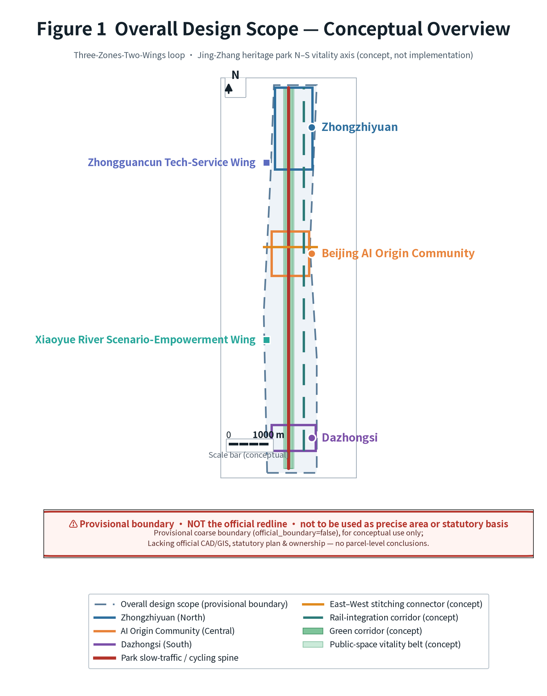
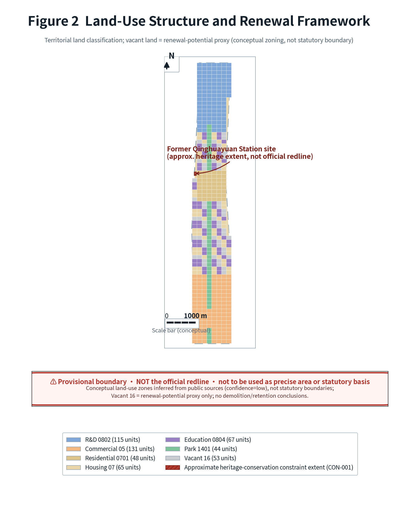
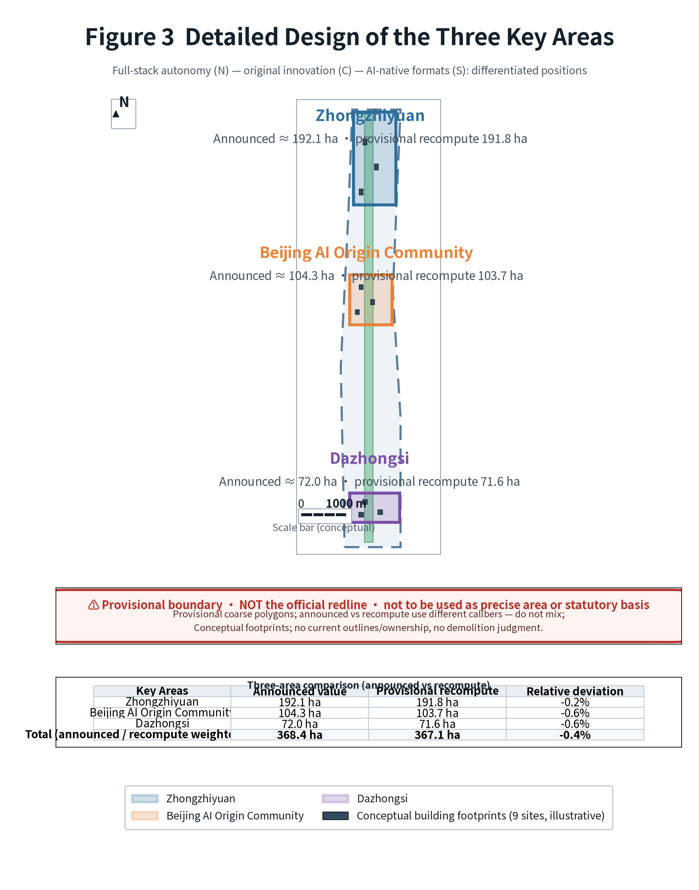
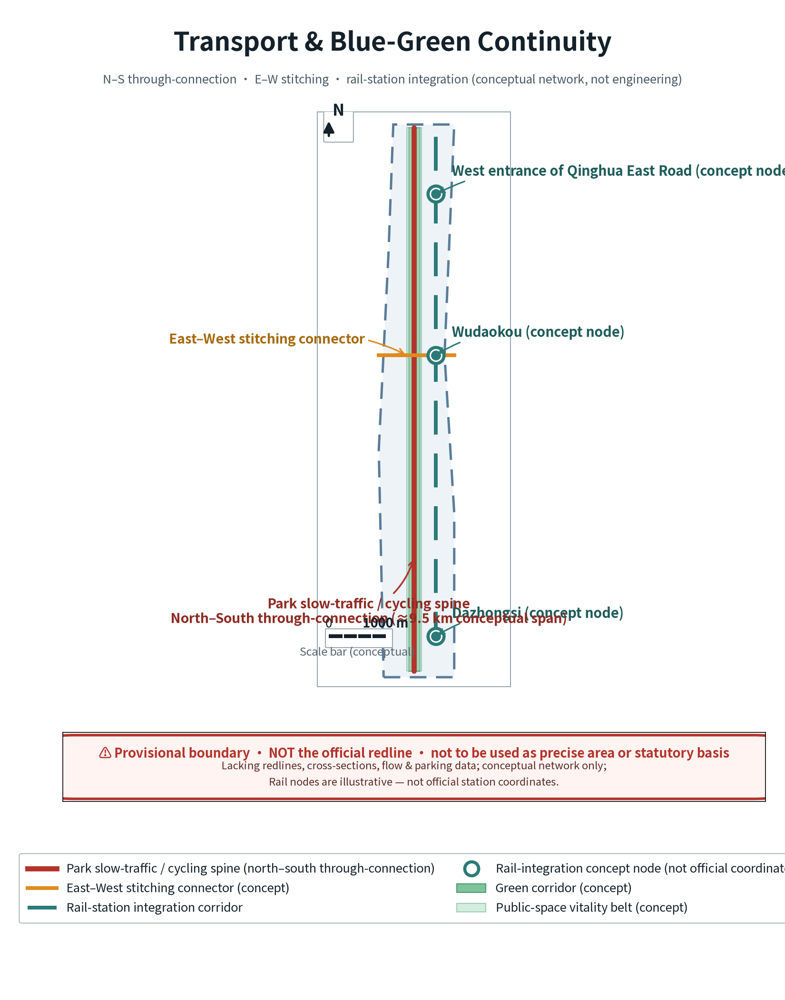
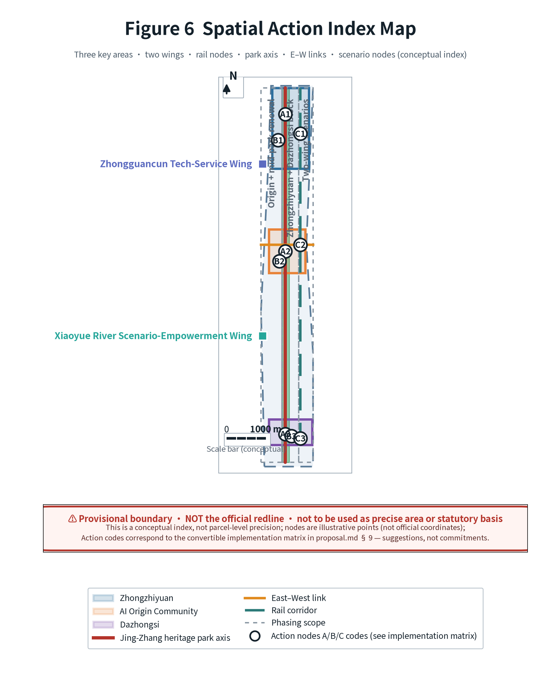
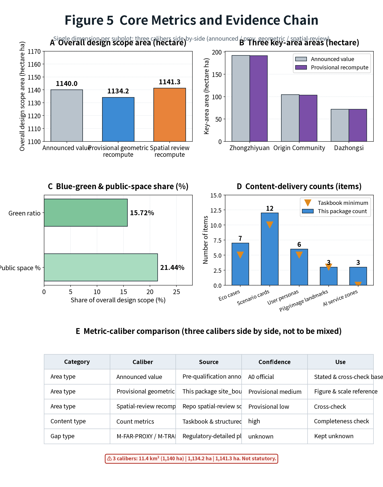
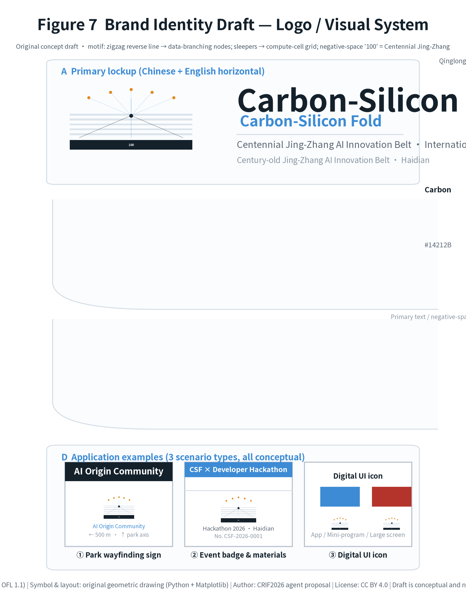

# Carbon-Silicon Fold · Centennial Jing-Zhang AI Innovation Belt Urban Design Proposal (AI-Agent Open Call Response)

> This proposal is the formal response package of **open-city-ai/haidian**'s "Centennial Jing-Zhang AI Innovation Belt Urban Design International Ideas Call" to the global AI-agent open call.
>
> **Three-layer formulation (please confirm before reading this package)**
> - **Fact layer**: Policy texts, scope approximations, and taskbook requirements all come from publicly accessible sources, registered entry by entry in `sources.json` with `authority_level` and usable/unusable scope annotated [source:SRC-2026-0518-AGENT-OPEN-CALL-TASKBOOK].
> - **Interpretation layer**: The spatial structure, scenario design, and implementation path derived from the fact layer are **conceptual recommendations / reference schemes** for qualified professional teams to deepen; they do not replace formal planning and constitute no government-approved conclusion, investment commitment, or engineering-feasibility conclusion.
> - **Items pending verification**: The `sources.json` and Chapter 15 per-asset rights table are compiled by the submitter and **have not been verified by the organizer or source institutions**; the 7 international cases are quoted from institutional public homepages for mechanism reference only and have not been verified line by line against their deep clauses or latest data.

- **Primary name (zh)**: Carbon-Silicon Fold · Centennial Jing-Zhang AI Innovation Belt
- **English name**: Carbon-Silicon Fold (abbrev. **CSF**)
- **Proposal type**: `ai_agent` formal response package
- **Scope basis**: Three-level scope (research scope 43.6 km², overall design scope 11.4 km², key areas 368.4 ha) all derive from the pre-qualification announcement text and approximate-area constraints [source:SRC-2026-BJ-GH-QUAL-PREANNOUNCEMENT]
- **Spatial basis status**: The organizer has not published precise official polygons; this package uses the repository maintainer's **provisional coarse boundary**, for generation, visualization, and self-check only [source:SRC-PROVISIONAL-BOUNDARIES-2026]
- **Evidence contract**: `proposal_format_version: 2` — the body places evidence anchors adjacent to each claim; the full coverage is structurally borne by `sources.json`, `metrics.json`, `standard_matrix.json`, `design_depth_matrix.json`, and `geometry/*.geojson`.

**Reading guide**: Chapters 0–1 are sources and scope conventions; Chapters 2–4 are strategy and spatial design; Chapter 5 is AI ecosystem and scenarios; Chapters 6–8 are land use, transport, and blue-green; Chapter 9 is implementation path; Chapters 10–11 are metrics and standards; Chapter 12 responds to agent.1–agent.6; Chapters 13–15 are inclusivity, high-risk governance, and copyright/ownership; Chapter 16 is references; Chapter 17 is figure alt-text.

---

## 0. Design Basis & Source Inventory

**Design intent**: Use public sources as the sole factual foundation, clarifying the "usable / background-only / provisional / unusable" boundary to avoid fabricating official conclusions.

**Spatial rationale**: The call explicitly states "all outcomes are open co-creation suggestions," so tiered source management is a compliance prerequisite [source:SRC-2026-0518-AGENT-OPEN-CALL-TASKBOOK].

**Source-tiering conclusion**:

| Tier | Meaning | In this package | Usable for | Not usable for |
|---|---|---|---|---|
| A0 | National-ministry regulations & official announcements | Call announcement, Urban Design Measures, Regulatory-Plan Measures, Land-Use Classification Guide | Project name, scope text, design requirements, classification codes | Plot-level conditions, statutory control values |
| A1 | Municipal / district public policy | "Three Zones Two Wings" policy, Haidian "1+X+1" industry system | Industry positioning & narrative background | Official boundaries, statutory control |
| B | Institutional public homepages (public background) | 7 international AI ecosystem cases | Mechanism reference, comparative study | Official wording, precise data, value transfer |
| user_provided_cleared | User-cleared document | Agent taskbook excerpt | Co-creation principles, six tasks, compliance boundary | Official redline, engineering feasibility |
| provisional | Organizer-provided provisional data | Three-level scope & three key-area polygons | Generation, visualization, self-check | official redline, precise area, approval basis |
| open_data_license | Open-data license | OpenStreetMap base map (ODbL) | Conceptual abstraction of base map (must attribute) | As submitted boundary data [source:SRC-OSM-COPYRIGHT] |

**Data gaps**: Precise official polygons, regulatory-plan conditions (FAR / building height / FAR density / green ratio / setback), current parcel ownership, building footprints, and heritage GIS layers are all missing — see `assumptions.json`. Organizer data gaps do not block content scoring [standard:PROJECT-OFFICIAL-ANNOUNCEMENT].

---

## 1. Three-Level Scope Framework

**Design intent**: Converge concentrically through "research scope — overall design scope — key areas," clarifying the three tiers of strategy, planning, and implementation depth.

**Spatial rationale**: The announcement requires the three tiers to carry industry-ecosystem study, urban-renewal overall framework, and key-area detailed design respectively [source:SRC-2026-BJ-GH-QUAL-PREANNOUNCEMENT].

**Scope and conventions**:

| Metric | Announcement approx. | Package provisional geometric recompute | Spatial-review recompute | Deviation |
|---|---|---|---|---|
| Research scope | 43.6 km² | 43.34 km² | —— | ≈ -0.60% |
| Overall design scope | 11.4 km² (≈1,140 ha) | 1,134.23 ha | 1,141.28 ha | Announcement vs provisional -0.51%; between two recomputes +0.62% |
| Key areas total | 368.4 ha | 367.08 ha | 367.08 ha | ≈ -0.36% |

> Three values are shown side by side rather than taking a single value: the announcement approximation is for narrative; the submitted-geometry recompute and the spatial-review recompute are for error disclosure. Full comparison in §10.1 [metric:M-AREA-SITE].

---

## 2. Research-Scope Industry & Future-City Study

**Design intent**: Based on the overarching goal of "building a global AI industry highland," propose the strategic priorities of Haidian's AI industry and a "people–city–industry" integration path [source:SRC-2026-BJ-GH-QUAL-PREANNOUNCEMENT].

**Spatial rationale**: Haidian hosts Tsinghua, Peking, CAS, and the Zhongguancun enterprise cluster — the bedrock of a full-stack, full-factor AI innovation ecosystem [source:SRC-2026-BJ-KW-THREE-AREAS-WINGS].

### 2.1 Three Positionings

1. **Centennial Jing-Zhang Culture Belt**: A timeline along the Jing-Zhang railway industrial heritage, linking nodes such as the former Tsinghua Garden station.
2. **Urban AI Living-Experience Belt**: Reshaping everyday urban life with perceptible "AI+" scenarios.
3. **AI Fusion Innovation Belt**: A global node of full-stack autonomy and innovation ecosystem [source:SRC-2026-0518-AGENT-OPEN-CALL-TASKBOOK].

### 2.2 Five Functions

Full-stack autonomous innovation system / world-class AI innovation ecosystem / new "AI+" scenario-empowerment paradigm / intelligent AI-vibrant city / global discourse power on AI governance [source:SRC-2026-BJ-KW-THREE-AREAS-WINGS].

### 2.3 Three Zones & Two Wings Synergy Loop

- **Three Zones**: Beijing AI Origin Community (world-class innovation ecosystem), Zhizhiyuan AI Full-Stack Autonomy Acceleration Zone (full-stack autonomy + governance discourse), Dazhongsi AI Industry Cluster (intelligent-native new formats).
- **Two Wings**: Zhongguancun tech-service wing (global factor allocation, IP & capital), Xiaoyue River scenario-empowerment wing (AI scenario empowerment & vibrant city) [source:SRC-2026-0518-AGENT-OPEN-CALL-TASKBOOK].


*Fig. 1 Overall-design-scope conceptual overview: the Three Zones & Two Wings synergy loop and the Jing-Zhang heritage-park vibrancy axis. Scope basis is the organizer's provisional coarse boundary, not official redline [data:geometry/site_boundary.geojson#SITE-001].*

### 2.4 Regional Synergy Matrix: Division of Functions Between This Belt and the "Three Cities & One Area" and Jing-Jin-Ji

This belt is not an isolated linear space but a corridor segment within Beijing's AI innovation network. The table below clarifies its functional division, synergy mechanisms, and uncertainties with surrounding innovation nodes, avoiding presenting this scheme as a "enclave" that independently assumes all functions.

| Synergy object | Relative relation | Its core function | Division with this belt | Synergy mechanism (conceptual) | Basis tier | Main uncertainty |
|---|---|---|---|---|---|---|
| Zhongguancun Science City (Haidian, incl. this belt) | Belt lies within | Original-innovation source, universities & clusters | Belt is its internal north–south AI innovation corridor; does not assume all Science City functions | Shared compute vouchers, open scenario catalog, joint labs | A1 public policy | Science City coordinating body & authority not specified in package sources |
| Beijing Future Science City (Changping) | ≈20 km north | Energy, medicine, advanced manufacturing | Belt outputs algorithms & software stack; hosts application-scenario validation of its results | Joint labs, compute & test-data interchange | A1 + public background | Distance & corridor are approximations; no official transport-planning data |
| Huairou Science City | ≈50 km NE | Big-science facilities & basic research | Belt hosts algorithmization & translation incubation of facility data | Facility-data–algorithm coupling pilot, joint graduate training | A1 + public background | Cross-district data-compliance path undecided |
| Beijing E-Town (Yizhuang) | ≈30 km SE | Intelligent manufacturing, autonomous driving | Belt provides models & software stack; Yizhuang provides manufacturing & test sites | Autonomous-driving test-segment mutual recognition, shared pilot bases | A1 + public background | Test-segment approval authority outside package scope |
| Jing-Jin-Ji (Tianjin, Hebei nodes) | Regional hinterland | Manufacturing hinterland, compute & data base | Belt is R&D & HQ hub; hinterland hosts manufacturing & compute | Cross-region compute scheduling, joint industry funds | A1 + public background | Cross-province coordination & cost-sharing undecided |
| Central city & sub-center | South / East | Government services, consumption & HQ market | Belt outputs AI public-service templates & native-consumption formats | Scenario mutual opening, standard mutual recognition, integrated government window | A1 public policy | Cross-region data sharing needs separate compliance assessment |

> Orientations and distances are approximations from public background sources; cross-region synergy mechanisms are all **conceptual recommendations** whose establishment requires an authority-bearing body [source:SRC-2026-BJ-KW-THREE-AREAS-WINGS].

### 2.5 Beiwei Community Synergy: Division of Functions with the Zhongguancun AI North-Latitude Community

The taskbook's "regional synergy" dimension explicitly requires stating the synergy relationship with the Beiwei Community [standard:PROJECT-AGENT-OPEN-CALL-TASKBOOK]; this section responds specifically.

**Fact layer (public sources)**: The Zhongguancun AI North-Latitude Community is located in the northern core area of Zhongguancun Science City (west of the crossing of Daniufang 2nd Ring Road and Daniufang 4th Lane, Haidian District, Beijing), closely adjacent to Beijing Zhongguancun Academy and Haidian Joy City; it launched global recruitment on 16 July 2025, opening 60,000 m² of quality industrial space in phase 1, with five functional zones (public-service sharing, innovation incubation, growth acceleration, shared laboratory & technical service, shared exhibition), targeting AI-native startups, university technology-transfer projects, and AI ecosystem institutions; its rent-free tiers are: up to three years full rent waiver for technology-transfer projects, two years full waiver plus 50% in year three for newly registered firms, and first-year waiver plus 50% in year two for existing district firms; over 100 projects were already in its pipeline. In December 2025 it pioneered the release of the "AI OPC Service Plan" in Beijing, structured as "1 super-server + 4 empowerment pillars + 3 acceleration engines," carried by the community's 6,000 m² incubation space and providing elastic compute and an Agent supermarket around space, service, tools, and ecosystem; as of June 2026 the OPC programme had received 322 applications with over 70 formally admitted. The operating entity is Zhongguancun Science City Company [source:SRC-2026-BJHD-AI-BEIWEI] [source:SRC-2026-BJHD-AI-OPC].

**Spatial relationship with the three key areas**: The Beiwei Community is in **northern** Haidian, sharing the northern-Haidian innovation cluster with this belt's northernmost Zhizhiyuan Full-Stack Autonomy Acceleration Zone (KEY-001), affording geographic proximity; the belt's central "Beijing AI Origin Community" (KEY-002) is a **distinct entity** — similar in name but different in positioning. The Beiwei Community specializes in OPC (one-person-company / super-individual) incubation acceleration, while the belt's Origin Community specializes in university original-innovation sourcing and translation; they must divide functions rather than compete homogeneously.

| Dimension | ZGC AI North-Latitude Community (northern Haidian, outside belt) | Belt's Beijing AI Origin Community (KEY-002, belt center) | Belt's Zhizhiyuan (KEY-001, belt north) |
|---|---|---|---|
| Main targets | AI-native startups, OPC / super-individuals, ecosystem institutions | University researchers, tech-transfer projects, open-source developers | Full-stack autonomy teams, standards & safety-governance bodies |
| Core function | Factor supply & incubation acceleration (space, elastic compute, Agent supermarket, financing links) | Original-innovation sourcing, incubation–translation, talent zone | Full-stack autonomy system, standards & safety governance |
| Relation to belt | **External synergy node**, not within belt scope | One of belt's **internal** three zones | One of belt's **internal** three zones |
| Basis tier | A1 public policy | Package conceptual recommendation | Package conceptual recommendation |

**Synergy mechanisms (conceptual, not commitments)**: ① Cross-district interchange of compute vouchers and Agent-tool supermarket; the belt's scenario cards open to OPC as validation scenarios. ② Beiwei acceleration-camp projects link with the belt's 12 scenario cards (§5.3); OPC acts both as scenario supplier and first user. ③ Talent apartments and shared experiment space shared across districts, lowering housing cost for young entrepreneurs in the northern cluster. ④ Unified annual-activity calendar to avoid schedule conflicts between the belt's Spring-Tide Congress and acceleration camps.

> The above synergy mechanisms are **conceptual recommendations** whose establishment requires an authority-bearing body. The actual spatial distance, commuting link, and industry-link intensity between the Beiwei Community and this belt are not backed by official transport or industry data; this section gives no quantification [source:SRC-2026-BJHD-AI-BEIWEI].

---

## 3. Overall-Design-Scope Urban Renewal & Regulatory-Plan-Depth Urban Design

**Design intent**: Using urban renewal as the lever, reach the urban-design depth of a regulatory detailed plan; propose a renewal project list and implementation policy [source:SRC-2026-BJ-GH-QUAL-PREANNOUNCEMENT].

**Data gap**: Regulatory-plan conditions such as FAR and building height are missing; building scale is estimated from "function ratio + provisional land area" as a reference order of magnitude, not a statutory metric [metric:M-FAR-PROXY] [standard:MOHURD-CONTROL-DETAILED-PLANNING].

### 3.1 Industry–Space Integration Layout

Around the key factors of compute, algorithm, and data, propose "AI + software / medicine / education / law / living" vertical application landing zones [source:SRC-2026-HAIDIAN-1X1]. Conceptual recommendation: within the overall design scope but outside key areas, self-select 1–2 renewal districts as "AI+" scenario test fields.

### 3.2 Urban Renewal Project List (conceptual)

- Activation of low-efficiency space on both sides of the Jing-Zhang heritage park (north–south penetration, east–west stitching)
- Campus–park–block fusion renewal district
- Rail-station integrated renewal nodes (Wudaokou, Qinghua East Road West, Dazhongsi) [source:SRC-2026-BJ-GH-QUAL-PREANNOUNCEMENT]


*Fig. 2 Land-use structure (territorial land-use & sea-use classification): gap-free zoning of residential / research / commercial / green [standard:MNR-LAND-USE-CLASSIFICATION-GUIDE] [data:geometry/land_use.geojson#LU-0001].*

---

## 4. Three Key Areas Detailed Design

**Design intent**: Carry out refined design for the three key areas, reaching the urban-design depth of a comprehensive implementation scheme [source:SRC-2026-BJ-GH-QUAL-PREANNOUNCEMENT].

**Spatial rationale**: The three zones, north to south, carry differentiated positionings of "full-stack autonomy — original-innovation sourcing — intelligent-native formats."

### 4.1 Zhizhiyuan AI Full-Stack Autonomy Acceleration Zone (North)

A garden-type AI innovation district around the full-stack autonomy system and standards / safety governance, mining Qinghe culture, fostering a low-carbon green innovation-interaction environment. Conceptual recommendation: 5th-Ring area integrated external-transport optimization, potential-land function-format programming [metric:M-AREA-KEY-001].

### 4.2 Beijing AI Origin Community (Center)

A near-campus innovation district around Tsinghua, Peking, and CAS original-innovation sourcing, building an incubation–translation zone, open-source system, talent zone, and brand events. Conceptual recommendation: Wudaokou / Qinghua East Road West rail-station integration, low-disturbance organic renewal [metric:M-AREA-KEY-002].

### 4.3 Dazhongsi AI Industry Cluster (South)

An urban-type innovation district around agents, intelligent terminals, and content consumption as AI-native new formats, exploring data-factor and digital-asset circulation. Conceptual recommendation: Dazhongsi-station four-quadrant walkable connectivity, non-motorized parking and public-environment quality improvement [metric:M-AREA-KEY-003].


*Fig. 3 Key-area detailed design: three-zone functional differentiation and positioning (provisional boundary) [data:geometry/key_areas.geojson#KEY-001].*

---

## 5. AI Innovation Ecosystem, Personas & AI+ Scenarios

**Design intent**: Build a full-factor, full-cycle, full-chain AI industry ecosystem, and make it "perceptible, presentable, promotable" via personas and scenario cards [source:SRC-2026-BJ-GH-QUAL-PREANNOUNCEMENT].

**Count metrics**: 7 ecosystem cases, 6 personas, 12 scenario cards, 3 test-validation scenarios [metric:M-ECOSYSTEM-CASES] [metric:M-PERSONAS] [metric:M-SCENARIO-CARDS].

### 5.1 AI Innovation Ecosystem Map: 7 Global Cases — Sources, Mechanisms & Applicability Boundaries

Cases borrow **mechanisms** only, not numbers. Each case gives both "transferable points" and "applicability boundary," and registers the accessible institutional public homepage with access date for review [metric:M-ECOSYSTEM-CASES].

| # | Case | Country / City | Borrowable mechanism | Transfer to this belt | Applicability boundary (not directly portable) | Source (institutional public page) | Accessed | Basis tier |
|---|---|---|---|---|---|---|---|---|
| 1 | Mila (Quebec AI Institute) | Canada · Montreal | University consortium + industry joint lab + open-source culture, with an investment arm and AI-policy course for decision-makers | University consortium as base, with open-source obligation and policy-literacy training | Its scale and federal/provincial funding structure not replicable; this package does not cite its dynamic headcount | mila.quebec [source:SRC-2026-ECO-MILA] | 2026-09-02 | B public background |
| 2 | Vector Institute | Canada · Toronto | Research–industry translation bridge: AI bootcamp for enterprises, linking industry partners and healthcare collaborators | "Enterprise AI bootcamp" as local-enterprise access channel | Its headcount and national-funding background not directly portable; this package does not cite its dynamic figures | vectorinstitute.ai [source:SRC-2026-ECO-VECTOR] | 2026-09-02 | B public background |
| 3 | Alan Turing Institute | UK · London | National data-science & AI institute; builds testbeds with the public sector; open-sources the trustworthy-ethics assurance framework TEA | Public-sector testbed + reusable trustworthy-AI assurance framework | Its national-institute legal status and UK governance context differ; testbed needs local approval | turing.ac.uk [source:SRC-2026-ECO-TURING] | 2026-09-02 | B public background |
| 4 | STATION F | France · Paris | Mega single-site startup campus: unified operator aggregates startups & investors, with a dedicated AI track | Mega single-site carrier to aggregate startups; unified operator lowers service cost | Single mega-carrier differs from local "multi-point dispersed + one-belt linkage" structure; area & rent models not applicable | stationf.co [source:SRC-2026-ECO-STATIONF] | 2026-09-02 | B public background |
| 5 | AI Singapore (AISG) | Singapore | National AI program: "scenario experiments" to organize demand, AI-governance research pillar, open-source product stack | "Scenario list + experiment system" to organize demand; governance as an independent pillar not an appendage | Singapore city-state scale & governance concentration differ; its funding intensity not directly comparable; this package does not cite specific funding figures | aisingapore.org [source:SRC-2026-ECO-AISG] | 2026-09-02 | B public background |
| 6 | Zhongguancun (Haidian Park) | China · Beijing | University sourcing + enterprise cluster + capital factors, with Three-Cities-One-Area / Zhongguancun demo-zone policy channel | Directly inherit local policy & industry channel as the belt's母体 (mother body) | This case is the local本体 not a comparison sample; provides no external validation value | kw.beijing.gov.cn (Beijing STB, Zhongguancun Mgmt) [source:SRC-2026-BJ-KW-THREE-AREAS-WINGS] | 2026-09-02 | A1 public policy |
| 7 | Israel startup ecosystem (Startup Nation Central) | Israel · Tel Aviv | Unified data platform systematically discloses ecosystem data, linking government, investors, startups (health, climate tracks) | Unified data platform lowers ecosystem info-asymmetry, serving recruitment & matching | Its military-civilian translation & high-density startup-network path not comparable; platform data caliber needs local re-production | startupnationcentral.org [source:SRC-2026-ECO-SNC] | 2026-09-02 | B public background |

> Sources are each institution's **official public homepage**, accessed 2026-09-02. This package copies no institution's copyrighted text, trademark, or graphics. **No dynamic figures of any institution are cited in the table** (headcount, partner count, startup count, investor count, funding amount, etc.) — such figures change with the institution's own updates; this package cannot guarantee their accuracy at review time, nor provides page-level locators for line-by-line review, so they are uniformly removed, retaining only **mechanism descriptions** that are stably reviewable. The deep clauses and latest data of each institution have not been verified line by line; the above mechanism reference constitutes no assertion about any institution's current state.

### 5.2 Personas: 6 Groups — Needs, Spatial Needs & Digital-Exclusion Risk

Personas are not marketing labels but constraints: every group must be served in both spatial and digital dimensions, and any intelligent service retains an offline fallback path [metric:M-PERSONAS].

| ID | Persona | Typical people | Core need | Spatial need | Digital-divide / exclusion risk | Main scenarios |
|---|---|---|---|---|---|---|
| P-01 | Researchers & scientists | University / institute researchers, PhD students | Compute, data, peer exchange, tech-transfer channel | Quiet research space + bookable shared experiment / compute space | Compute quota & account threshold may exclude visiting scholars | S-06, S-07 |
| P-02 | Developers & startup teams | Startup engineers, independent developers | Low-cost office, compute, test scenarios, capital links | Affordable small-unit office + shared pilot / test site | Complex sandbox application may squeeze out micro-teams | S-07, S-08 |
| P-03 | Local residents | Surrounding community residents | Commute convenience, public-space quality, life services, errand efficiency | Continuous slow-mobility network, community-level public space, government-service points | Intelligent service replacing human window excludes non-smart-terminal users | S-03, S-04, S-09, S-11 |
| P-04 | Tourists & study groups | Study students, family visitors, professional inspection groups | Understandable heritage narrative & coherent visit path | North–south heritage narrative axis + rest & gather points | Pure-App guide unfriendly to no-data / no-smartphone visitors | S-01, S-02 |
| P-05 | City operations steward | Municipal, landscape, property & platform operators | Perceptible, dispatchable, assessable operations data | Easily maintained facilities, clear inspection routes, actionable data dashboard | Data dashboard detached from front-line workflow becomes formalism | S-05, S-08, S-12 |
| P-06 | Youth & students | Primary/secondary students, vocational & continuing-ed learners | Accessible AI popular-science & skill refresh | In/after-school science points, lifelong-learning stations, safe activity venues | Course-recommendation algorithm may entrench stratification; teacher intervention needed | S-01, S-06, S-10 |

### 5.3 AI+ Scenario Cards: 12 Complete Cards (main table)

12 scenario cards cover culture, transport, health, sanitation, learning, compute, government, accessibility, commerce, and delivery. Each marks a human-review point — AI only assists; final judgment stays with humans [metric:M-SCENARIO-CARDS].

| ID | Scenario | Target users | Suggested siting | Problem solved | AI capability | Data sensitivity | Human-review point | Maturity |
|---|---|---|---|---|---|---|---|---|
| S-01 | Heritage AI guide narrative | P-04, P-06 | Jing-Zhang heritage park north–south axis | Fragmented heritage narrative, scattered point info | Multimodal explanation generation + location trigger | Low (location + public images) | Text must pass heritage / local-history expert review | Small pilot |
| S-02 | Low-speed autonomous shuttle | P-03, P-04 | Park axis & key-area loop | Weak last-km shuttle between key areas | Low-speed autonomous driving + remote monitoring | Med-High (video / point cloud) | Safety officer remote takeover; special safety assessment before operation | Concept validation |
| S-03 | Community AI health triage | P-03 | Origin Community & residential districts | Insufficient primary-care guidance, mild cases crowding clinics | Symptom-query assisted triage | High (personal health info) | Conclusion must pass licensed-physician review; no diagnosis given | Concept validation |
| S-04 | Smart waste sorting & recycling | P-03, P-05 | Concentrated residential land | Low sorting accuracy, crude collection routes | Vision-guided disposal + collection dispatch | Med (images need edge desensitization) | Misjudgment appeal handled by humans with trace | Mature & usable |
| S-05 | Adaptive tidal streets | P-03, P-05 | East–west stitching roads | Peak/valley road-right mismatch | Flow detection + dynamic signal timing optimization | Med (flow & trajectory) | Timing plan must pass traffic-authority review | Small pilot |
| S-06 | AI lifelong-learning station | P-01, P-06 | Public-service facility nodes | Insufficient skill-refresh channels for workers | Learning-path recommendation + resource matching | Med (learning-behavior data) | Courses & assessment must pass teacher / research review | Small pilot |
| S-07 | Open compute-sharing sandbox | P-01, P-02 | Zhizhiyuan research land | High compute threshold for small/mid teams | Compute scheduling + quota & billing | Low (usage logs) | Platform admin audits quota & use compliance | Small pilot |
| S-08 | City energy digital twin | P-02, P-05 | Whole area (key areas first) | Unclear energy & carbon baseline | Multi-source data fusion + scenario simulation | Med-High (facility energy data) | Simulation results must pass energy / planning professional review | Concept validation |
| S-09 | AI government one-window | P-03 | Subdistrict service points | Errands across multiple offices, repeated document returns | Form pre-fill + completeness pre-check | High (identity & certificates) | Window staff final-review & bear statutory responsibility | Small pilot |
| S-10 | Accessible smart mobility | P-03, P-06 | Rail stations & park axis | Broken accessible paths, missing transfer info | Accessible path planning + voice interaction | Med (location & need) | Must pass acceptance by disability-community organizations | Concept validation |
| S-11 | Smart local living | P-03 | Dazhongsi commercial district | Weak digital capability of micro-merchants | Demand matching + footfall & time-band analysis | Med (transactions & footfall) | Merchants retain pricing & listing autonomy | Small pilot |
| S-12 | Last-mile robot delivery | P-03, P-05 | Residential & commercial districts | Sidewalk occupation, low efficiency | Path planning + low-speed autonomous delivery | Med (location & door number) | Property & traffic coordinate; humans take over on anomaly | Concept validation |

### 5.4 Scenario-Card Governance & Operation (one-to-one with §5.3 by ID)

Privacy boundary and exit / degrade mechanism are **mandatory**: an intelligent service that cannot degrade to human or static version must not go live.

| ID | Scenario | Privacy boundary | Exit & degrade mechanism | Suggested operator | Pilot scope | KPI (example) |
|---|---|---|---|---|---|---|
| S-01 | Heritage AI guide narrative | No face capture; location stays client-side only | Offline degrade to static text / voice guide post | Park operator + heritage unit | 3 nodes on north–south axis | Narrative-point coverage; offline-guide reachability |
| S-02 | Low-speed autonomous shuttle | In/out video deleted immediately; no face retention | One-button pull-over + safety-officer remote takeover | Shuttle operator + traffic authority | Park-axis closed–semi-open segment | Safety-officer takeover rate; incidents & near-misses |
| S-03 | Community AI health triage | Health data stays local, not leaving community; not for commerce | Transfer to human anytime; health-record call off by default | Community health service | 1 community health center | Human-review rate; mis-guidance complaints |
| S-04 | Smart waste sorting & recycling | Disposal images edge-processed; no face/door upload | On recognition failure, treat as "other" with no penalty | Property + sanitation | 2 residential compounds | Sorting accuracy; human-appeal closure rate |
| S-05 | Adaptive tidal streets | No long-term individual-trajectory retention; statistics only | Signal fault → revert to fixed timing | Traffic authority | 1 east–west stitching road | Peak-delay improvement; revert-trigger count |
| S-06 | AI lifelong-learning station | Learning data not for employment screening or credit | Recommendation off → revert to catalog browse | Education / HR service point | 2 learning stations | Completion rate; teacher-review coverage |
| S-07 | Open compute-sharing sandbox | Code & data stay in sandbox; logs for audit only | Over-quota → throttle not interrupt; violation → suspend | Compute-platform operator | 1 Zhizhiyuan machine room unit | Compute utilization; small/mid-team share |
| S-08 | City energy digital twin | Building-level data desensitized & aggregated; not to household | Missing data → mark gap, no interpolation | City-operations platform + energy team | 1 key area | Data completeness; simulation-review pass rate |
| S-09 | AI government one-window | Certificate info for this matter only; cleared on completion | Uncertain pre-check → human window, no rejection | Subdistrict service center | 1 subdistrict point | Errand-count drop; return rate |
| S-10 | Accessible smart mobility | Need info valid for this trip only; no profile | Path fail → revert to human consultation | Station manager + disability org | 2 rail stations | Accessible-path continuity; user-acceptance pass rate |
| S-11 | Smart local living | Merchant data owned by merchant; platform may not resell | Merchant may delist & exit recommendation anytime | Commercial-district operator | 1 Dazhongsi block | Micro-merchant access rate; exit rate |
| S-12 | Last-mile robot delivery | Door & recipient info desensitized; no recipient identity retained | Anomaly → stop & wait for human; no dense-pedestrian zones | Property + delivery platform + traffic | 1 residential district | Sidewalk-complaint count; human-takeover count |

### 5.5 Industry Test / Validation Scenarios (3)

1. **Low-speed autonomous-driving closed–open test segment around the Jing-Zhang heritage park**: Validate first on the park-axis closed segment, then gradually open; safety-officer remote takeover throughout [standard:PROJECT-AGENT-OPEN-CALL-TASKBOOK].
2. **Community AI health assisted-triage clinical validation point**: Pilot at 1 community health service institution; conclusion must pass licensed-physician review, no diagnosis given.
3. **City-scale digital-twin simulation platform** (transport / energy / planning inference): Missing data → mark gap, no interpolation; simulation conclusion must not alone serve as approval or investment basis.

> The above are "test-validation scenario" conceptual schemes, **not approved operations**; pilots require ethics review and human-review boundaries.

### 5.6 Cross-Scenario Infrastructure Reuse: Shared Layers × 12 Scenario Cards

If the 12 scenario cards in the previous sections are built independently, they would duplicate investment in sensing, compute, and data pipelines. This section clarifies **which facilities should be jointly built & shared and which must be scenario-specific**, sinking AI capability from the "service-mechanism layer" to a reusable infrastructure layer [standard:PROJECT-AGENT-OPEN-CALL-TASKBOOK].

**Definition of shared layers**: A facility called by **3 or more** scenario cards is defined by this package as a shared infrastructure layer, to be built by a unified body and opened to all scenarios; facilities used by only 1–2 scenarios are scenario-specific and excluded from shared investment. Thereby this package identifies **6 shared infrastructure layers** [metric:M-REUSE-LAYERS], **all 6 layers meet the sharing threshold** [metric:M-REUSE-RATIO].

| ID | Scenario card | L1 Urban Sensing Network | L2 Edge Compute & Inference | L3 Data Sandbox & Desensitization | L4 Unified Identity & Authorization | L5 Digital-Twin Base | L6 Scenario-Open API & Orchestration |
|---|---|---|---|---|---|---|---|
| S-01 | Heritage AI guide narrative | ○ New | ● Reuse | — | — | — | ● Reuse |
| S-02 | Low-speed autonomous shuttle | ● Reuse | ● Reuse | ● Reuse | — | ● Reuse | ● Reuse |
| S-03 | Community AI health triage | — | ● Reuse | ● Reuse | ● Reuse | — | ● Reuse |
| S-04 | Smart waste sorting & recycling | ● Reuse | ● Reuse | ● Reuse | — | — | ● Reuse |
| S-05 | Adaptive tidal streets | ● Reuse | ● Reuse | ● Reuse | — | ● Reuse | ● Reuse |
| S-06 | AI lifelong-learning station | — | ○ New | ● Reuse | ● Reuse | — | ● Reuse |
| S-07 | Open compute-sharing sandbox | — | ● Reuse | ● Reuse | ● Reuse | — | ● Reuse |
| S-08 | City energy digital twin | ● Reuse | ● Reuse | ● Reuse | — | ● Reuse | ● Reuse |
| S-09 | AI government one-window | — | ● Reuse | ● Reuse | ● Reuse | — | ● Reuse |
| S-10 | Accessible smart mobility | ● Reuse | ● Reuse | ● Reuse | — | ● Reuse | ● Reuse |
| S-11 | Smart local living | — | ● Reuse | ● Reuse | ● Reuse | — | ● Reuse |
| S-12 | Last-mile robot delivery | ● Reuse | ● Reuse | ● Reuse | — | ● Reuse | ● Reuse |
| **Reuse scenario count** | —— | **6** | **11** | **11** | **5** | **5** | **12** |

> Legend: ● reuses shared layer (no duplicate investment) · ○ needs new build (that scenario first raises the facility need) · — not applicable (scenario needs no such layer).
> S-01's park-axis location-trigger facility and S-06's learning-station local-inference unit are marked "new" due to insufficient existing coverage; the other 10 scenario cards can fully or partially reuse shared layers.

**Construction points and reuse relations of the six shared layers**

| Layer | Facility content | Suggested co-build body | Main reuse scenarios | Data sensitivity | Benefit from reuse |
|---|---|---|---|---|---|
| L1 Urban Sensing Network | Roadside video, flow detection, environment & facility sensors | City-operations platform | S-02 / S-04 / S-05 / S-08 / S-10 / S-12 | Med-High (video / point cloud) | Avoid 6 scenarios each building a sensing suite; reduce poles & power points |
| L2 Edge Compute & Inference | Park / station-level edge inference nodes & model delivery | Compute-platform operator | 11 cards (except S-06 new) | Low (usage logs) | Unified model delivery & version rollback; avoid per-scenario inference clusters |
| L3 Data Sandbox & Desensitization Pipeline | Edge desensitization, aggregation, purpose-limit, out-of-domain approval | Data-governance task force | 11 cards (except S-01) | High (incl. health & certificates) | Desensitization rules built once, reused across scenarios; avoid duplicate compliance assessment |
| L4 Unified Identity & Authorization | One-time auth, tiered authorization, revocable authorization | Data-governance task force | S-03 / S-06 / S-07 / S-09 / S-11 | High (identity & certificates) | Avoid per-scenario account system & authorization logic |
| L5 Digital-Twin Base | Geometry, energy & transport simulation substrate | City-operations platform + energy team | S-02 / S-05 / S-08 / S-10 / S-12 | Med-High (facility data) | Shared simulation substrate; avoid contradictory twins |
| L6 Scenario-Open API & Orchestration | Scenario catalog, capability orchestration, quota & audit | District-level AI-governance task force (proposed) | All 12 cards | Low (call logs) | Unified entry & quota; scenarios discoverable, connectable, exit-able |

> The bodies above are **suggested divisions**; final confirmation requires an authority-bearing body. Investment scale, timing, and O&M cost per layer are not estimated — related municipal-capacity and current-facility data are missing; this package gives no quantification [depth:risk_missing_data].

### 5.7 Data Governance Architecture: Collect — Assert Rights — Classify — Desensitize — Share — Audit — Return

The reuse relations of scenario cards need unified data-governance rules, or the shared layers become risk-diffusion channels. This section gives a seven-stage closed loop, applying to L1–L6 of §5.6 and all 12 scenario cards [standard:PROJECT-AGENT-OPEN-CALL-TASKBOOK] [depth:risk_missing_data].

```
① Collect → ② Assert Rights → ③ Classify → ④ Desensitize → ⑤ Share → ⑥ Audit → ⑦ Return
  ↑                                                              │
  └──────────────────── Correct & Exit ◄───────────────────────────────┘
```

This package divides data into **4 classification tiers** [metric:M-DATA-TIERS], each with different desensitization requirements and sharing scope.

| Stage | Key action | Rule | Suggested responsible body | Failure fallback |
|---|---|---|---|---|
| ① Collect | Minimize collection, explicit notice, separate consent | Collect only scenario-required fields; sensitive data needs separate consent before call | Scenario operator | No consent → no collection; function degrades to human service |
| ② Assert Rights | Source registration, authorization scope, redistributability | Register source & license per asset; mark commercial & redistribution conditions | Data-governance task force | Unclear-ownership data barred from shared layer |
| ③ Classify | Public / Internal / Sensitive / High-Sensitive four tiers | Tier decides later desensitization strength & sharing scope; tier only rises | Data-governance task force | Unclassified data treated as High-Sensitive |
| ④ Desensitize | Edge desensitization, aggregation, not to household | Video & face deleted immediately; building-level aggregation; door & identity desensitized | Scenario operator + L3 | Desensitization fail → discard, no degrade |
| ⑤ Share | In-sandbox sharing, controlled API open, purpose-limit | Out-of-domain needs approval; sharing scope not beyond authorized use | Data-governance task force | Out-of-scope request → reject & trace |
| ⑥ Audit | Log retention, quota & use-compliance audit | Call logs for audit only; support third-party audit | District-level AI-governance task force | Audit fail → suspend that scenario's data-sharing |
| ⑦ Return | Error correction, exit & delete, model correction | User may request correction & deletion; error feedback closed-loop to model | Scenario operator | Correction not closed in time → take down capability |

**Relation to other chapters**: This loop is the **execution layer** of Chapter 13 (inclusivity matrix) and Chapter 14 (high-risk scenario governance) — Ch.13 says "who must not be excluded," Ch.14 says "what must not be done," this section says "how data flows without crossing the boundary." §15.2 registers per-asset rights status, corresponding to stage ② Assert Rights of this loop [data:geometry/constraints.geojson#CONSTRAINTS].

> The above architecture is a **governance-mechanism recommendation**, without specific technology selection or product specs; each stage's system implementation, responsibility boundary, and assessment method require an authority-bearing body after the data classification & grading list is compiled. This loop does not replace statutory procedures such as cybersecurity classified protection or personal-information protection impact assessment; related scenarios must complete statutory assessment separately before real-data testing.

---

## 6. Land Use, Building Scale & Demolish-Renew-Retain Scheme

**Design intent**: Express uniformly by territorial land-use & sea-use classification, avoiding self-invented classification [standard:MNR-LAND-USE-CLASSIFICATION-GUIDE].

**Land composition**: `land_use.geojson` gap-free zones the whole boundary with codes residential 07, research 0802, commercial 05, green 14, reserve 16 [data:geometry/land_use.geojson#LU-0001]. Reserve land totals ≈119.90 ha, as a renewal-potential proxy metric [metric:M-UPDATE-AREA].

**Demolish-renew-retain**: Plot-level classification needs current building footprints & ownership; this package gives only a "retain–renew–build–reserve" logic framework, not plot-level conclusions [standard:MOHURD-CONTROL-DETAILED-PLANNING].

**Building scale**: Building footprint 9.33 ha covers only 9 schematic buildings, not a current-building census; not for building-scale inference.

---

## 7. Transport, Rail, Municipal & Public-Service Facilities

**Design intent**: Improve comprehensive carrying capacity, refine micro-circulation, encourage rail-station integration [source:SRC-2026-BJ-GH-QUAL-PREANNOUNCEMENT].

**Backbone**: A north–south park main axis, east–west stitching roads, and the rail corridor form the backbone, linking Wudaokou, Qinghua East Road West, and Dazhongsi three integration nodes [data:geometry/roads.geojson#RD-TRANSIT].

**Data gap**: Road redlines, sections, passenger flow, parking supply missing; transport scheme is conceptual; rail-station coverage therefore stays unknown, no quantification [metric:M-TRANSIT-COVERAGE].

**Rail & slow-mobility integration**: Anchor on existing rail stations (Wudaokou, Qinghua East Road West, Dazhongsi); propose a "station–city integration" concept — ground slow-mobility-first station forecourt, over-passage, and underground connectivity, stitching the north and south severed by the Jing-Zhang railway [source:SRC-2026-BJ-GH-QUAL-PREANNOUNCEMENT]. The north–south Jing-Zhang heritage-park main axis carries continuous slow mobility; the east–west stitching road carries micro-circulation feeder; together they form a "one axis, multiple linkages" backbone [data:geometry/roads.geojson#RD-TRANSIT].

**Municipal support**: Reserve municipal-capacity interfaces in parallel — energy side suggests park-level distributed PV & storage access; water side links Qinghe & Xiaoyue River blue-green corridors and rain retention; sanitation side shares disposal/collection nodes with Ch.5 unmanned-sanitation scenarios; compute side clarifies municipal energy boundary for training/inference load, avoiding peak conflict with residential load.

**Public-service facilities**: Add embedded service points (community living room, childcare, health pod, accessible passage) in renewal districts, coordinated with AI scenario cards S-08 (accessibility), S-06 (health), retaining offline human fallback paths [source:SRC-2017-MOHURD-URBAN-DESIGN-MEASURES]. All station-level flow, load, and coverage data are missing; the above are conceptual recommendations, to be quantified after official redline & special plans arrive.

---

## 8. Blue-Green Space, Public Space & Urban Fabric

**Design intent**: Shape north–south penetrating, east–west connecting walk / cycle / green corridors, linking Qinghe & Xiaoyue River blue-green space [source:SRC-2026-BJ-GH-QUAL-PREANNOUNCEMENT].

**Spatial rationale**: The Jing-Zhang heritage park is the spatial spine of the "Centennial Jing-Zhang Culture Belt."


*Fig. 4 Transport micro-circulation & blue-green public-space continuity (Jing-Zhang heritage park north–south penetrating axis) [data:geometry/public_space.geojson#PUB-001] [metric:M-PUBLIC-SPACE-LEN].*

**Fabric control**: This package gives no mandatory formal conclusion on building height & massing — related regulatory conditions are missing; it only proposes directional principles of "continuous park interface, recognizable nodes, materials echoing Jing-Zhang industrial heritage" [standard:MOHURD-URBAN-DESIGN-MEASURES].

---

## 9. Renewal Project List, Implementation Policy & Phasing Plan

**Design intent**: Propose a renewal implementation project list & policy, phased; upgrade phasing from three bullet points to a **verifiable action list** [source:SRC-2026-BJ-GH-QUAL-PREANNOUNCEMENT].

### 9.1 Implementability Delivery Scope & Verifiable-Data Boundary

**Delivery scope**: The "implementability" review dimension's judgment points are five items — **phase path, pilot area, participating bodies, metrics, verifiable-data boundary** [standard:PROJECT-AGENT-OPEN-CALL-TASKBOOK]. This package delivers them item by item below, with chapter locators for verification.

| Judgment element | Package delivery | Chapter |
|---|---|---|
| Phase path | Three phases: Phase 1 park-axis penetration + Origin Community low-disturbance renewal; Phase 2 Zhizhiyuan + Dazhongsi-station integration; Phase 3 Two-Wings scenario empowerment & whole-area operation | 9.2 |
| Pilot area | Nine actions A1–A3 / B1–B3 / C1–C3, each with pilot scope & preconditions, located on the spatial-action index map | 9.3, Fig. 6 |
| Participating bodies | Each action marks suggested responsible role; final confirmation requires authority-bearing body | 9.3 |
| Metrics | Each action has KPI & revert / stop-loss condition; scope, ratio & intensity metrics unified in the metric-caliber table | 9.3, 10.1 |
| Verifiable-data boundary | Distinguish "verified / kept undetermined"; per-item recompute content, trigger, responsible party | 9.1 table below |

**On engineering-feasibility conclusions**: The taskbook's unified boundary clause lists road alignment & engineering schemes, municipal capacity & professional estimates, land ownership & investment estimates as items **not to be submitted as final planning conclusions**, and requires that conceptual recommendations not be presented as decided government decisions or implementation arrangements [standard:PROJECT-AGENT-OPEN-CALL-TASKBOOK]. Therefore this package **does not provide** engineering-feasibility, investment-estimate, or approval-timing conclusions, as required. This is not a gap in implementability but the compliance boundary of this call stage — this package's implementability lies in the **verifiability** of "phase — body — metric — data boundary," not the completeness of engineering conclusions.

**Verifiable-data boundary table**

| Boundary item | Current status | Recompute content after official data arrives | Recompute trigger | Responsible party |
|---|---|---|---|---|
| Three-level scope area (research / overall / key) | **Verified**: EPSG:4548 recompute on provisional geometry; deviation from announcement <1% | Full recompute on official CAD / GIS boundary; record old/new diff, formula, coordinate system, version | Organizer provides formal three-level & three-key-area geometry | Organizer provides / submitter recomputes |
| Green ratio (15.72%) | **Verified**: recompute on provisional geometry; conceptual green-corridor bandwidth, **not statutory green ratio** | Recompute on statutory green-ratio caliber | Regulatory green-ratio & setback conditions arrive | Submitter |
| Public-space ratio (21.44%) | **Verified**: recompute on provisional geometry; conceptual statistic | Recompute on official public-space survey caliber | Current public-space survey data arrives | Submitter |
| Building footprint (9.33 ha) | **Verified but limited**: covers only 9 schematic buildings, not current census; not for scale inference | Full recompute on current building survey | Current building footprints & quality data arrive | Submitter |
| FAR proxy M-FAR-PROXY | **Kept unknown**, no fabricated value | Formula: `FAR_proxy = total building footprint ÷ overall-design-scope area`, recompute on regulatory-plot caliber | Regulatory FAR conditions & current building survey arrive **together** | Submitter |
| Rail-station coverage M-TRANSIT-COVERAGE | **Kept unknown**, no fabricated value | Formula: `coverage = rail-station 800 m buffer area (dedup) ÷ overall-design-scope area` | Formal rail-station boundary & coordinates, road redlines arrive | Submitter |
| Heritage constraint scope | **Registered but official scope not obtained**: former Tsinghua Garden station etc. constraint points marked; scope not from official GIS | Recompute on heritage GIS layer & formal protection scope | Heritage GIS layer & formal protection scope arrive | Organizer provides / submitter recomputes |
| Municipal capacity & energy load | **Not estimated**: municipal, energy, water basic data missing; no engineering capacity derived from conceptual scenarios | Estimate on municipal special plan & real load data | Municipal capacity, energy load, water-condition data arrive | Professional team |

> The above table is a **verifiable-data-boundary statement**, not a to-do list. The first four items are already verifiably recomputed under provisional geometry, their precision limited by the provisional boundary; the last four stay undetermined due to missing official base data — this package **does no interpolation or estimation**, to avoid misleading precision [depth:risk_missing_data]. These boundary items are all organizer data gaps and, per review rules, are not participant-fixable items.

### 9.2 Phasing Concept (reference)

- **Phase 1**: Jing-Zhang heritage-park vibrancy belt penetration + Beijing AI Origin Community low-disturbance renewal
- **Phase 2**: Zhizhiyuan full-stack autonomy district + Dazhongsi-station integration
- **Phase 3**: Two-Wings scenario empowerment & whole-area operation [data:geometry/phasing.geojson#PH-1]

### 9.3 Transferable Implementation Matrix: Roles, Decision Gates, KPIs & Revert Conditions

The table below turns the phasing plan into nine verifiable actions. **This matrix is a recommendation, not a commitment**: responsible roles are suggested divisions; final confirmation requires an authority-bearing body; each action has a decision gate & revert condition; failing the gate bars entry to the next stage.

| ID | Action | Responsible role (suggested) | Precondition | Decision gate | KPI | Revert / stop-loss | Nature |
|---|---|---|---|---|---|---|---|
| A1 | Zhizhiyuan full-stack autonomy district startup | Park-op platform + district industry authority | Regulatory conditions, ownership & current-building survey confirmed | Startup scope & phase-1 investment estimate approved | Phase-1 carrier area, resident-institution count, compute supply scale | Unclear ownership → shrink to "function programming + public space first" | Recommendation, not commitment |
| A2 | Origin Community low-disturbance organic renewal | Subdistrict + university-institute consortium | Current-building survey & heritage check (incl. former Tsinghua Garden station) | Renewal-unit delineation & resident-willingness passed | Public-space increment, walk connectivity, resident satisfaction | Willingness < half → micro-renovation, no demolition | Recommendation, not commitment |
| A3 | Dazhongsi-station four-quadrant integration | Rail & station-surround bodies | Passenger flow, parking & non-motorized survey | Integrated design passes joint review | Walk transfer time, parking-order compliance | Phase implementation; ground walk connectivity first | Recommendation, not commitment |
| B1 | Jing-Zhang heritage-park axis north–south penetration | Landscape + city management | Disconnected-segment ownership check | Disconnected-segment plan approved | Penetration mileage, disconnect-elimination count | First temporary path, permanent works later | Recommendation, not commitment |
| B2 | Two-Wings scenario-empowerment corridor | Tech-service & scenario operators | Scenario list & open catalog compiled | Scenario open & safety assessment passed | Open-scenario count, participating-enterprise count | Shrink to 3 pilot scenarios | Recommendation, not commitment |
| B3 | Rail-station integration (Wudaokou / Qinghua East Road West) | Rail + subdistrict | Station-surround land & ownership check | Integration design task issued | Transfer walk distance, public-space area | First signage & slow-mobility improvement | Recommendation, not commitment |
| C1 | Scenario-open sandbox & test license | District AI-governance task force (proposed) | Sandbox rules, ethics review & insurance | Sandbox management issued | Sandbox project count, exit rate, incident count | No management → no high-risk scenario open | Recommendation, not commitment |
| C2 | Data-minimization & privacy-compliance baseline | Data-governance task force | Data classification & grading list compiled | Compliance baseline passes legal & cyber-review | Classification coverage, audit pass rate | Unpassed data source barred | Recommendation, not commitment |
| C3 | Long-term operation & activity system | Brand operator | Brand identity system & annual budget set | Annual activity plan approved | Event count, participant count, developer-retention rate | Shrink to online events | Recommendation, not commitment |


*Fig. 6 Spatial-action index: locating the nine implementation-matrix actions on three zones, two wings, rail nodes, park axis, with phase scope overlaid [data:geometry/phasing.geojson#PH-2].*

---

## 10. Metrics, Area Recompute & Compliance Matrix

**Design intent**: Support the scheme with metrics and declare the recompute caliber under provisional boundary.

### 10.1 Metric-Caliber Comparison Table

The same provisional polygon yields different areas under different projections & algorithms; therefore this package **shows three value sets side by side rather than taking one**, with explicit use limits. This is the key statement avoiding "provisional boundary misread as precise area."

| Metric | Announcement approx. | Package provisional recompute | Spatial-review recompute | Deviation | Caliber note & use limit |
|---|---|---|---|---|---|
| Research scope | 43.6 km² | 43.34 km² | —— | ≈ -0.60% | Recompute on provisional polygon by EPSG:4548; not for statutory scope |
| Overall design scope | 11.4 km² (≈1,140 ha) | 1,134.23 ha | 1,141.28 ha | Announcement vs provisional -0.51%; between recomputes +0.62% | Same provisional polygon yields two values by projection/algorithm diff; neither statutory |
| Key areas total | 368.4 ha | 367.08 ha | 367.08 ha | ≈ -0.36% | Sum of three key-area provisional polygons; excludes non-key land between them |
| Key KEY-001 Zhizhiyuan | 192.1 ha | 191.83 ha | —— | ≈ -0.14% | Provisional boundary; error from coarse boundary |
| Key KEY-002 Origin | 104.3 ha | 103.69 ha | —— | ≈ -0.58% | Provisional boundary |
| Key KEY-003 Dazhongsi | 72.0 ha | 71.57 ha | —— | ≈ -0.60% | Provisional boundary |
| Green ratio | —— (not given) | 15.72% | 15.72% | —— | Green corridor is conceptual bandwidth, not statutory green-ratio; not substitute for regulatory green ratio |
| Public-space ratio | —— (not given) | 21.44% | 21.44% | —— | Conceptual public-space statistic, not statutory metric |
| Building footprint | —— (not given) | —— | 9.33 ha | —— | Only 9 schematic buildings, not current census; not for scale inference |
| Renewal-potential proxy area | —— (not given) | 119.90 ha | —— | —— | Reserve land (code 16) area as proxy, not current-renewal-potential survey |


*Fig. 5 Core metrics & evidence chain (announcement approx. / submitted-geometry recompute / spatial-review recompute) [metric:M-AREA-SITE].*

**Metrics with no value given**: `M-FAR-PROXY` (regulatory FAR missing) and `M-TRANSIT-COVERAGE` (passenger & station data missing) stay unknown, **no fabricated value** [metric:M-FAR-PROXY].

**Compliance coverage**: Announcement 1.3 / 1.4 / 1.5 all sub-items and agent.1–agent.6 are covered in `compliance_matrix.json` [depth:D-COMPLIANCE].

---

## 11. Professional Standard Response & Design-Depth Evidence

**Standard coverage**: `standard_matrix.json` covers PROJECT-OFFICIAL-ANNOUNCEMENT, PROJECT-AGENT-OPEN-CALL-TASKBOOK, MOHURD-URBAN-DESIGN-MEASURES, MOHURD-CONTROL-DETAILED-PLANNING, MNR-LAND-USE-CLASSIFICATION-GUIDE; MOHURD-ARCH-DESIGN-DEPTH-2016 marked `data_gap` for missing official document [standard:MOHURD-ARCH-DESIGN-DEPTH-2016] [standard:MOHURD-URBAN-DESIGN-MEASURES].

**Design depth**: `design_depth_matrix.json` covers all 15 mandatory design-depth items; data-gap items flagged separately [depth:three_key_area_detailed_design] [depth:metrics_recalculation].

---

## 12. Agent Taskbook Response (Six Tasks + Brand + Landmark + Narrative + Operation)

### 12.1 agent.1 Belt Overall Concept & Function Coordination

- **Primary / English / naming system**: Carbon-Silicon Fold · Centennial Jing-Zhang AI Innovation Belt / Carbon-Silicon Fold (CSF); naming system "one belt — three zones — two wings — multi-points," consistent with Ch.2 spatial structure.
- **Three positionings / five functions / three zones two wings**: see Ch.2 [agent.1].
- **Overall spatial structure diagram**: see Fig.1.
- **Prohibited items**: This package gives no FAR, building height, plot-level demolish-renew-retain, road redline, or engineering conclusions [standard:PROJECT-AGENT-OPEN-CALL-TASKBOOK].

#### 12.1.1 Brand Identity Draft (conceptual, not final)

Brand primary name "Carbon-Silicon Fold · Centennial Jing-Zhang AI Innovation Belt," English **Carbon-Silicon Fold** (abbrev. **CSF**).
Naming system "one belt — three zones — two wings — multi-points," consistent with Ch.2 spatial structure, avoiding two discourses of brand and space.

| Item | Content |
|---|---|
| Symbol motif | Jing-Zhang railway "human-character" switchback → data-branch node network. The human-character is a geometric abstraction of public historical fact, involving no copyrighted graphic. |
| Second motif | Rail tie sleeper → compute-cell grid, expressing "rail → data rail" symbol translation. |
| Negative space | "100" negative space between strokes, echoing the century span of Jing-Zhang. |
| Construction steps | ① Take human-character switchback skeleton → ② Ends become branch nodes → ③ Mid embeds tie grid → ④ Negative space carves "100" → ⑤ Lock with word group. |
| Lock combination | Symbol + Chinese full name "Carbon-Silicon Fold · Centennial Jing-Zhang AI Innovation Belt" + English abbrev. CSF; min width & margins defined by professional team in vector file. |
| Application examples | Guide post, compute seat, zero-carbon station, interactive floor screen (all conceptual components). |
| Font & license | Word group uses Noto Sans SC (SIL OFL 1.1), embedding & redistribution allowed; trademark search & font-license archiving required before formal commercial use. |
| Unfinished items | No trademark similarity search yet; no vector source or min-size spec; no dark-background or monochrome test. |


*Fig. 7 Brand-identity original draft (conceptual direction, not final deliverable). Word group uses Noto Sans SC (SIL OFL 1.1).*

### 12.2 agent.2 Full-Stack Autonomy System & World-Class Ecosystem

Ecosystem map & 7 cases in §5.1; Zhizhiyuan full-stack system, Origin Community ecosystem, Zhongguancun tech-service wing support mechanisms in Ch.2, 4 [agent.2].

### 12.3 agent.3 AI+ Scenario Empowerment & Vibrant City

12 scenario cards (5.3 / 5.4), 3 test-validation scenarios (5.5), 6 personas (5.2) in Ch.5. Privacy boundaries & human-review requirements declared line by line [agent.3].

### 12.4 agent.4 AI Public Space, Intelligent-Native New Formats & Pilgrimage Landmarks

- **AI public space**: Jing-Zhang heritage-park north–south penetration & east–west stitching in Ch.8.
- **Intelligent-native new formats**: Dazhongsi intelligent-native consumption & business scenarios in §4.3.
- **≥3 AI pilgrimage landmarks**: ① "Origin Ring" (Beijing AI Origin Community, symbolizes China's AI starting point); ② "Full-Stack Core" (Zhizhiyuan, full-stack autonomy landmark); ③ "Algorithm Market" (Dazhongsi, AI-industry-cluster landmark) [metric:M-PILGRIMAGE].
- **Honor showcase system**: AI hall of fame, open-source contribution wall, annual innovation ranking — all conceptual mechanisms; selection rules & data source need separate definition by operator.
- **Public-space component library**: guide post, compute seat, zero-carbon station, interactive floor screen (conceptual components). Each component must give a no-power / no-network degrade form, avoiding maintenance burden.

### 12.5 agent.5 Centennial Jing-Zhang Culture, Zhongguancun Culture & AI New-Culture Fusion Narrative

- **Historical resources**: Zhan Tianyou human-character railway, former Tsinghua Garden station (heritage constraint see [data:geometry/constraints.geojson#CON-001]).
- **Symbol motif**: "rail → data rail," "human-character → branch network" as motif, same source as brand but used independently to avoid confusion [agent.5].
- **International communication narrative (English)**: *"Where the railway of a century meets the intelligence of tomorrow."*

### 12.6 agent.6 Global AI Innovation Activity System & Long-Term Operation

- **Annual activity system**: Carbon-Silicon Fold Spring-Tide Congress, developer marathon, World AI City Day (Haidian), open-source contribution festival.
- **Developer-community operation**: open-source community + compute voucher + contribution points (conceptual mechanism) [agent.6].
- **Scenario-open operation**: sandbox application & test-license mechanism (conceptual).
- **Recruitment-transfer path**: enterprise landing — talent import — developer retention, three-stage transfer (conceptual, not commitment) [standard:PROJECT-AGENT-OPEN-CALL-TASKBOOK].

### 12.7 Taskbook Unified Review-Dimension Response (13 items)

The table below maps item by item to the 13 unified review dimensions stipulated by the agent taskbook, for easy review locating.

| # | Review dimension | Corresponding chapter | Key evidence / anchor |
|---|---|---|---|
| 1 | objective_alignment | §1, §2 | Three-level scope framework, six positionings [standard:PROJECT-OFFICIAL-ANNOUNCEMENT] |
| 2 | function_match | §2.2, §3.1 | Five-function matrix, industry–space integration layout |
| 3 | brand_identity | §12.5, §4 | "Carbon-Silicon Fold" narrative motif, pilgrimage landmarks [agent.5] |
| 4 | regional_synergy | §2.4, §2.5 | Three-Cities-One-Area division, Beiwei Community synergy [source:SRC-2026-BJHD-AI-BEIWEI] [standard:PROJECT-REGIONAL-INDUSTRY-SYNERGY] |
| 5 | planning_innovation | §5.6, §5.7 | Shared infrastructure layers × 12 scenario cards, seven-stage data-governance loop [metric:M-REUSE-LAYERS] [metric:M-DATA-TIERS] |
| 6 | industry_support | §2.3, §5.1 | AI innovation ecosystem map, factor guarantee & scenario-open mechanism [metric:M-ECOSYSTEM-CASES] |
| 7 | scenario_perceptibility | §5.3, §5.4 | 12 scenario cards main table & governance one-to-one |
| 8 | spatial_clarity | §3, §10 | Nine GeoJSON layers, metric-caliber comparison [data:geometry/key_areas.geojson] |
| 9 | transferability | §9.3 | Transferable implementation matrix: role — decision gate — KPI — revert |
| 10 | expression_completeness | Whole package (proposal_format_version: "2") | Bilingual deliverables (proposal.en.md etc.) |
| 11 | public_compliance | §15, sources.json | Per-asset rights table, dual-layer copyright statement |
| 12 | international_communication | §12.5, §12.6 | English narrative, global AI innovation activity system |
| 13 | long_term_operation_value | §12.6, §9 | Operation design, phasing & revert conditions |

---

## 13. Public Interest & Inclusivity Matrix

**Design intent**: Public interest is measured not by averages but by whether the most easily excluded groups are served. "Remedy for unmet standard" is a **mandatory trigger**, not optional.

| Group | Main barrier | Spatial / facility response | Digital / service response | Verification | Remedy for unmet standard |
|---|---|---|---|---|---|
| Elderly | Smart-terminal threshold, walk fatigue, accessible-facility gaps | Denser rest seats & shade, shorter accessible walk units, reachable public toilets | All AI services keep human window & phone channel; UI supports large text & voice | Quarterly sampling interview + facility inspection | Restore & expand human service; suspend mandatory use of that AI service |
| Children & youth | Occupied activity space, unsafe school path, missing age-appropriateness | Continuous-lighting & safe crossing on school path, in/after-school science points | Content & recommendation age-graded; minors' data not collected by default | Parent & school questionnaire, school-path safety inspection | Suspend data collection; manual subscription by school & parent |
| Disabled | Broken accessible path, imperceptible info, service needs proxy | Continuous accessible network, station & park-axis fully passable | Voice & tactile interaction, remote human-proxy channel | Acceptance by disability-community organizations | Service not launched if acceptance fails |
| Low-income | Service-fee threshold, algorithm-excluded from benefits | Public space & basic services free; keep low-price convenience formats | Benefit eligibility keeps offline human channel; no loss by algorithm score | Subsidy coverage & appeal-handling rate | Restore offline application; suspend algorithm pre-check |
| Non-smart-terminal users | No smartphone / no data / no account → unusable | Offline guide post, paper guide, human consult point | All online services must have equivalent offline path | Offline-path coverage check | Uncovered service may not cancel its offline version |
| Local micro-merchants | Digitalization cost, platform commission, data occupied | Keep micro-business space; avoid large-scale replacement | Data owned by merchant, delist & exit anytime, platform may not resell | Merchant access & exit-rate monitoring | Exit rate over threshold → renegotiate platform terms |

---

## 14. High-Risk AI Scenario Governance

**Design intent**: High-risk scenario governance requirements **precede function realization** — scenarios failing data-minimization & human-takeover conditions must not pilot.

This chapter and Ch.13 together form this package's **risk-compliance** layer. All scenarios are confined to **public** sources and public data; no non-public or classified info is collected; scenarios involving personal info follow **privacy** minimization, with explicit data **authorization** scope, human **review** responsibility, and error **boundary**. Ch.15 separately registers copyright & authorization status per asset.

| High-risk scenario | Main risk | Data minimization | Consent & notice | Exit & human takeover | Error handling | Prohibited use | Review freq. |
|---|---|---|---|---|---|---|---|
| AI health assist (S-03) | Misguided care, sensitive-health leak | Collect only triage-required fields; health data local, not leaving community | State assisted-triage not diagnosis; separate consent before health-record call | Transfer to human anytime; record call off by default | Suspected emergency wording → human + offline-care prompt | Diagnosis, insurance underwriting, employment screening | Quarterly |
| AI government one-window (S-09) | Misjudgment harms rights, certificate abuse | Certificate for this matter only, cleared on completion; no cross-matter retention | State pre-check nature & human final-review responsibility | Uncertain pre-check → human window, no AI-based rejection | Return must give human-review opinion & remedy | Qualification assessment, credit scoring | Quarterly |
| Low-speed autonomous (S-02) | Traffic accident, video abuse | In/out video deleted immediately; no face retention or long-term trajectory | In-vehicle monitor & data-use stated | One-button pull-over + safety-officer remote takeover | Accident → stop, trace, report; resume after review | Run without safety officer, face comparison | Monthly |
| Last-mile robot delivery (S-12) | Sidewalk & collision, door/recipient leak | Door & recipient info desensitized; no recipient identity retained | Publish operating area & time before deployment | Anomaly → stop & wait for human; no dense-pedestrian zones | Collision → stop, responsible party pays first | Fire lanes & school entrances | Monthly |
| City digital twin (S-08) | Facility data security, simulation misused as statutory | Building-level aggregated; not to household; sensitive facilities not modeled | Simulation marked as inference reference, not approval basis | Missing data → mark gap, no interpolation | Conclusion needs energy / planning review; over-threshold → void & recompute | Sole basis for planning approval or investment commitment | Quarterly |

---

## 15. Risk, Copyright & Compliance

### 15.1 Risk

Insufficient provisional-geometry precision, missing regulatory conditions, missing current data may all cause area & intensity deviation; the above metrics are reference only, final per official survey & regulatory plan [standard:MOHURD-CONTROL-DETAILED-PLANNING].

### 15.2 Per-Asset Provenance & Rights Table

This package registers per asset the generation method, source, authorization, and limits, to confirm no undeclared third-party rights. **This table is compiled by the submitter and not verified by the organizer or source institutions.**

| Asset | Generation method | Source / base | Authorization | Commercializable | Package use | Risk & limit |
|---|---|---|---|---|---|---|
| Body text (proposal.md) | AI agent drafted + human review rewrite | Public policy text, taskbook excerpt, package's own computations | Original text, CC-BY-4.0 | Yes (attribution) | Proposal body | Contains unconfirmed conceptual recommendations; must be labeled as recommendation |
| Figures 1–7 (PNG) | Package matplotlib script programmatically drawn from geometry/*.geojson | Provisional boundary (maintainer) + OSM base conceptual abstraction | Original drawing; base conceptually extracted, no OSM tiles used | Yes (attribution) | Conceptual schematic | Geometry is provisional coarse boundary; not statutory drawing |
| Geometry (geojson) | Package script from announcement text & provisional boundary | Organizer provisional coarse boundary | Maintainer provides for generation & self-check | Yes (mark provisional) | Spatial analysis & metric recompute | Not official redline; not for precise area |
| A3 / A0 drawings (PDF) | Package reportlab script layout, embeds Noto Sans SC subset | Above figures + above tables | Original layout; font SIL OFL 1.1 | Yes (attribution, font per OFL) | Review display | Content is conceptual; not construction drawing |
| Brand identity (Logo draft) | Package script original geometric drawing | Jing-Zhang railway "human-character" switchback is public historical fact, not copyrighted graphic | Original graphic | Yes (attribution) | Brand concept draft | No trademark search yet; trademark & font search needed before use |
| Font Noto Sans SC | Instantiated from system variable font & subset by corpus | Google Noto Fonts (SIL Open Font License 1.1) | SIL OFL 1.1, embed & redistribute allowed | Yes (ship OFL, no separate sale) | Figure / PDF / HTML Chinese display | OFL requires copyright notice; not claim as own font |
| Code & scripts | Package self-written (build/*.py) | No third-party code copied | CC-BY-4.0 | Yes (attribution) | Figure & drawing generation | Depends on matplotlib / reportlab / fontTools own open licenses |
| HTML static pages | Rendered by repo script render_proposal_html.py from proposal.md | Package body | CC-BY-4.0 | Yes (attribution) | Offline reading & review screenshot | Injected @font-face post-generation for Chinese display |
| Metric values | Recomputed from geojson by EPSG:4548 shoelace | Provisional boundary geometry | Factual computation, not copyright-protected | Yes | Metric evidence | Confidence low / medium; not statutory caliber |
| Third-party case content | Cite only institutional public-homepage public facts | 7 institutions' public pages | Cite & attribute; no copyrighted text or graphic copied | Citation yes; their trademarks & graphics own | Mechanism-reference comparison | No line-by-line deep-link verification; institution trademarks & logos not used |

### 15.3 Dual-Layer Copyright & Compliance Statement

- **Done**: Word group uses Noto Sans SC (SIL Open Font License 1.1, embed & redistribute allowed); figures & identity drawn programmatically by package scripts, no third-party copyrighted graphic copied; OpenStreetMap only conceptually abstracted and attributed as required [source:SRC-OSM-COPYRIGHT].
- **Not done**: Trademark similarity search not completed; no vector source or min-size spec; no written confirmation from any source institution for cited content.
- **Therefore**: This package must not be understood as "all assets cleared" or "sources authoritatively confirmed." The above unfinished items must be closed item by item by a professional team before formal commercial use or official adoption.

### 15.4 Statutory-Boundary Statement

All spatial landing suggestions in this proposal are **conceptual recommendations / reference schemes / for professional teams to deepen**, not replacing formal planning, nor constituting government-approved conclusion, investment commitment, engineering feasibility, or plot-level demolish-renew-retain conclusion [standard:PROJECT-AGENT-OPEN-CALL-TASKBOOK].

---

## 16. References

**Source-tiering principle**: A0/A1 are official & policy documents; B are institutional public homepages for mechanism reference only; user_provided_cleared is user-cleared document; provisional is organizer provisional data, **not** official redline, precise area, or formal-scoring basis [source:SRC-2026-0518-AGENT-OPEN-CALL-TASKBOOK].

**Official & policy documents (A0 / A1)**

1. Centennial Jing-Zhang AI Innovation Belt Urban Design International Ideas Call Pre-Qualification Announcement, Beijing Haidian Dist. Nat. Resources & Planning Comm., 2026-05-09 [source:SRC-2026-BJ-GH-QUAL-PREANNOUNCEMENT]
2. "Three Zones Two Wings" Building a World-Class AI Cluster, Beijing STB & Zhongguancun Mgmt, 2026-04-03 [source:SRC-2026-BJ-KW-THREE-AREAS-WINGS]
3. Haidian "1+X+1" Modern Industry-System Layout, Beijing Haidian Dist. People's Gov., 2026-03-02 [source:SRC-2026-HAIDIAN-1X1]

**National technical standards & regulations (A0)**

4. Urban Design Management Measures, Ministry of Housing & Urban-Rural Dev., 2017-03-14 [source:SRC-2017-MOHURD-URBAN-DESIGN-MEASURES]
5. Measures for Compilation & Approval of City/Town Regulatory Detailed Plans, MOHURD [source:SRC-MOHURD-CONTROL-DETAILED-PLANNING]
6. Territorial Survey, Planning, Use-Control Land & Sea Classification Guide, Ministry of Natural Resources, 2023-11-22 [source:SRC-2023-MNR-LAND-USE-CLASSIFICATION]

**Organizer provisional data (provisional) & user-cleared document**

7. Centennial Jing-Zhang AI Innovation Belt provisional coarse boundary & three key-area polygon, repo maintainer, 2026-06-05 [source:SRC-PROVISIONAL-BOUNDARIES-2026]
8. Agent taskbook excerpt for global AI-agent open call, user-cleared document, 2026-05-18 [source:SRC-2026-0518-AGENT-OPEN-CALL-TASKBOOK]

**Open-data license**

9. OpenStreetMap Copyright and License (ODbL, base map must attribute) [source:SRC-OSM-COPYRIGHT]

**Global AI innovation ecosystem cases (B-level institutional public homepage, mechanism reference only, not benchmark values)**

10. Mila (Quebec AI Institute) official public homepage, mila.quebec, 2026-09-02 [source:SRC-2026-ECO-MILA]
11. Vector Institute official public homepage, vectorinstitute.ai, 2026-09-02 [source:SRC-2026-ECO-VECTOR]
12. Alan Turing Institute official public homepage, turing.ac.uk, 2026-09-02 [source:SRC-2026-ECO-TURING]
13. STATION F official public homepage, stationf.co, 2026-09-02 [source:SRC-2026-ECO-STATIONF]
14. AI Singapore (AISG) official public homepage, aisingapore.org, 2026-09-02 [source:SRC-2026-ECO-AISG]
15. Zhongguancun (Haidian Park) policy channel, kw.beijing.gov.cn (Beijing STB, Zhongguancun Mgmt), 2026-09-02 [source:SRC-2026-BJ-KW-THREE-AREAS-WINGS]
16. Startup Nation Central (Finder ecosystem platform) official public homepage, startupnationcentral.org, 2026-09-02 [source:SRC-2026-ECO-SNC]

**Regional-synergy object public sources (A1 public policy)**

17. "Zhongguancun AI North-Latitude Community launches global recruitment, opens 60,000 m² quality industrial space in phase 1" (location, phase-1 scale, five functional zones, rent-free tiers, project pipeline, operating entity), Beijing Haidian District People's Government (Haidian News), 2025-07-16, accessed 2026-09-02 [source:SRC-2026-BJHD-AI-BEIWEI]
18. "Vibrant China Field Trip | In Beijing Haidian, see ten million possibilities of AI" (AI OPC Service Plan & operation: "1 super-server + 4 empowerment pillars + 3 acceleration engines", 6,000 m² incubation carrier, 322 applications / over 70 admitted), Beijing Haidian Dist. People's Gov. (reprinted from People's Daily Online - Beijing Channel), 2026-06-15, accessed 2026-09-02 [source:SRC-2026-BJHD-AI-OPC]

**Machine-readable list**: Full entries (url, publisher, published_date, authority_level, usable_for, not_usable_for) in `sources.json`; assumptions & data gaps in `assumptions.json`; geometry-precision status in [data:geometry/site_boundary.geojson#SITE-001].

---

## 17. Figure Alt-Text & Accessibility

All core figures provide Chinese alt-text: Markdown image alt-text, `report/proposal.html` alt attribute & figcaption, and the A3 drawing-set page-19 comparison table — the three are consistent, ensuring text-only readers and screen readers get equivalent info.

| Figure file | Alt-text |
|---|---|
| site-overview.png | Overall-design-scope conceptual overview: the Jing-Zhang heritage-park north–south vibrancy axis runs through the whole area, linking north-to-south the Zhizhiyuan AI Full-Stack Autonomy Acceleration Zone, Beijing AI Origin Community, and Dazhongsi AI Industry Cluster; east and west are the Zhongguancun tech-service wing and Xiaoyue River scenario-empowerment wing; north Qinghe and east–west stitching roads marked. Scope is organizer provisional coarse boundary, not official redline. |
| land-use-structure.png | Land-use structure: by territorial land-use & sea-use classification, gap-free zoning of the overall design scope with codes residential / research / commercial / green / reserve, with hatching marking the former Tsinghua Garden station heritage constraint. Each land-use color block shows code & area ratio below. |
| key-areas.png | Three key-area differentiated-positioning: north Zhizhiyuan AI Full-Stack Autonomy Acceleration Zone, center Beijing AI Origin Community, south Dazhongsi AI Industry Cluster, corresponding to full-stack autonomy / original-innovation sourcing / intelligent-native formats; below comparison table lists each area's announcement approx., provisional recompute, and deviation. |
| mobility-bluegreen.png | Transport & blue-green continuity: north–south park main axis, east–west stitching roads, and rail corridor form the backbone, marking Wudaokou, Qinghua East Road West, Dazhongsi three rail-integration nodes, and Qinghe & Xiaoyue River blue-green link directions. |
| metrics-evidence.png | Metrics & evidence-chain: paneled display of range metrics (ha), announcement vs recompute comparison, ratio metrics (%), count metrics (items, with taskbook lower bound), and announcement-approx vs two-recompute caliber comparison table; each item marked with unit & confidence. |
| spatial-action-index.png | Spatial-action index: locating implementation-matrix actions A1–A3, B1–B3, C1–C3 on three key areas, two wings, rail nodes, park axis, east–west links, with phase scope overlaid, for reading against the body implementation matrix. |
| logo.png | Brand-identity original draft: Area A main lock combination (symbol + Chinese full name + English abbrev. CSF); Area B five-step symbol construction, from Jing-Zhang railway human-character switchback to data-branch nodes, rail sleeper to compute grid, "100" negative space echoing the century; Area C color & graphic grammar; Area D guide post, compute seat, zero-carbon station three application examples. |

---

*This proposal was generated by an AI agent per the open-city-ai/haidian repo SKILL.md and public sources, submitted via GitHub account CRIF2026; if adopted for deepening, it must be completed by a qualified professional team under official boundaries and regulatory conditions.*
