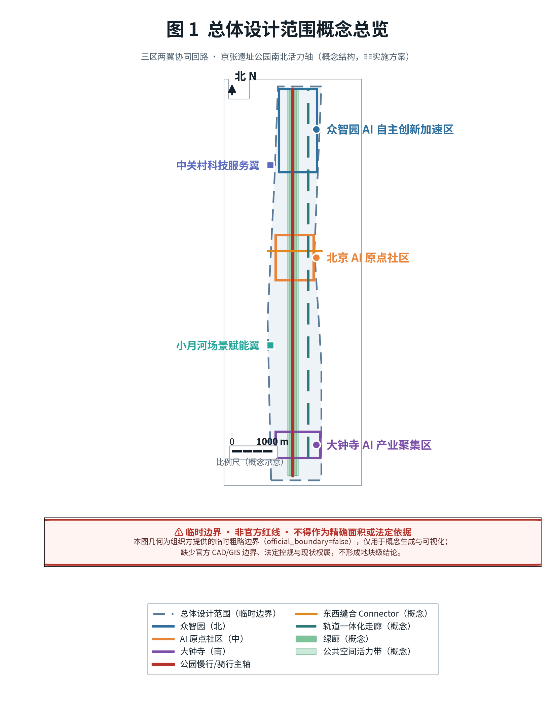
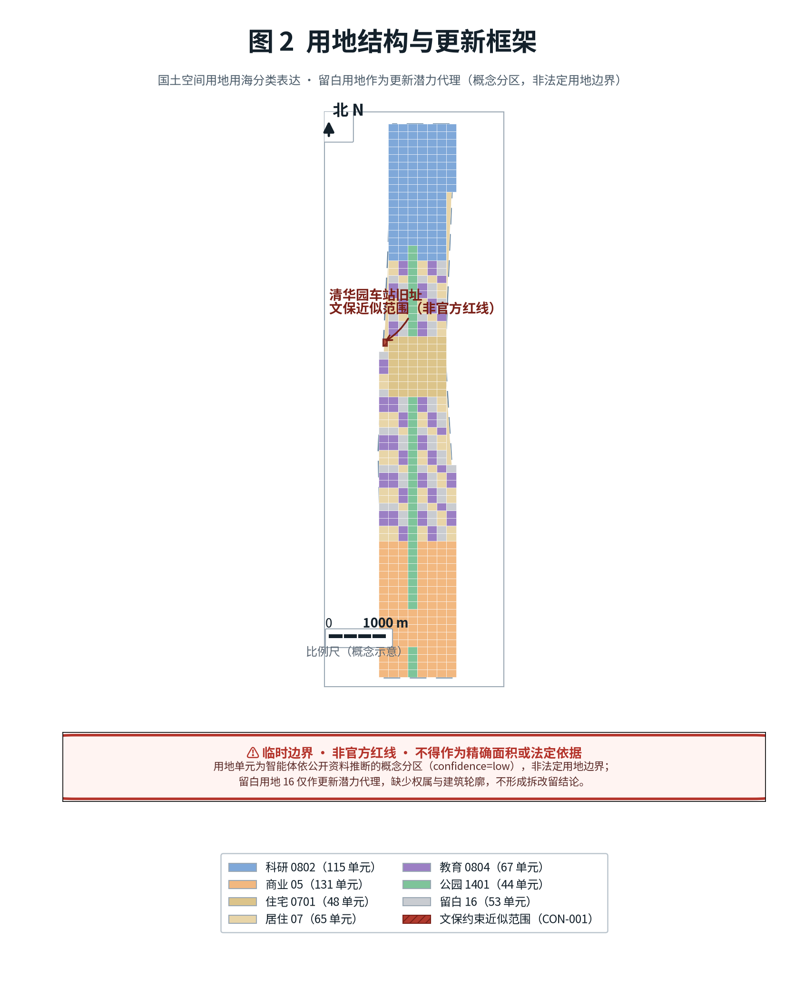
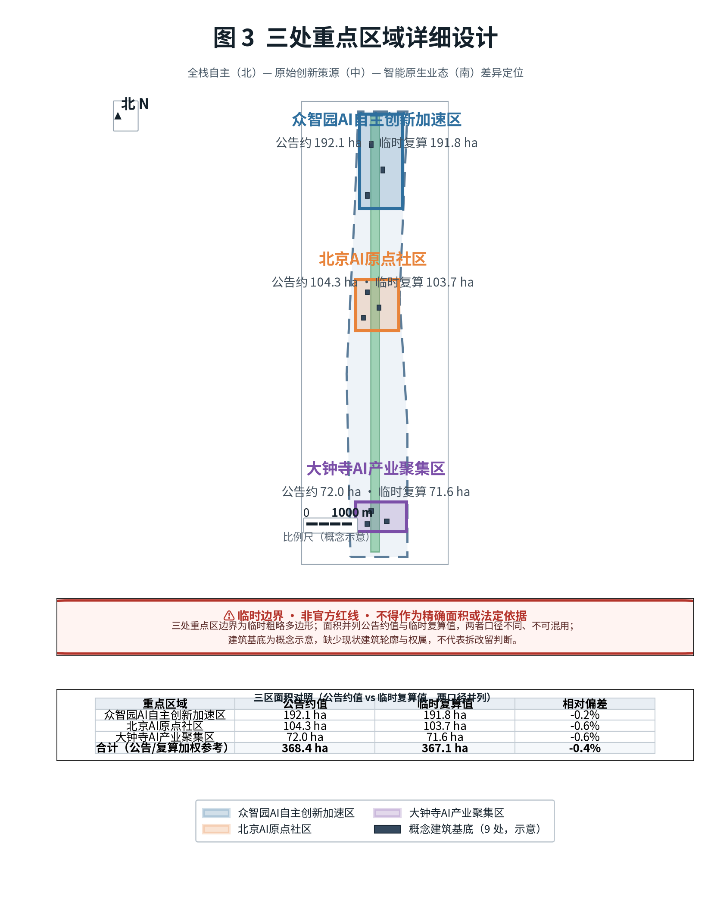
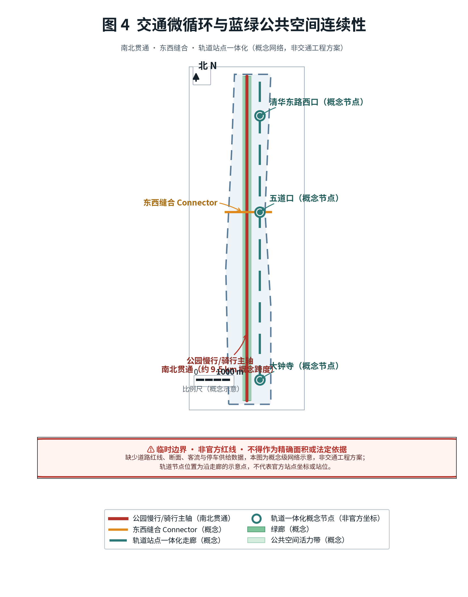
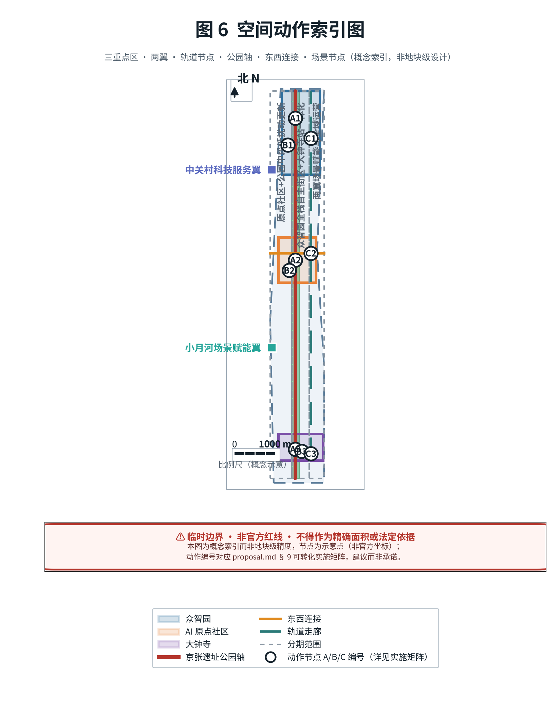
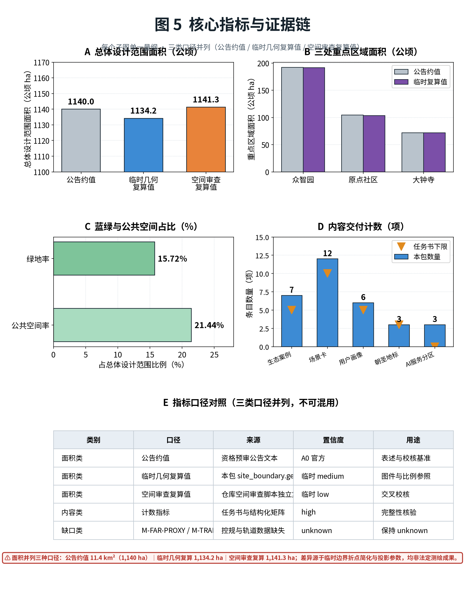
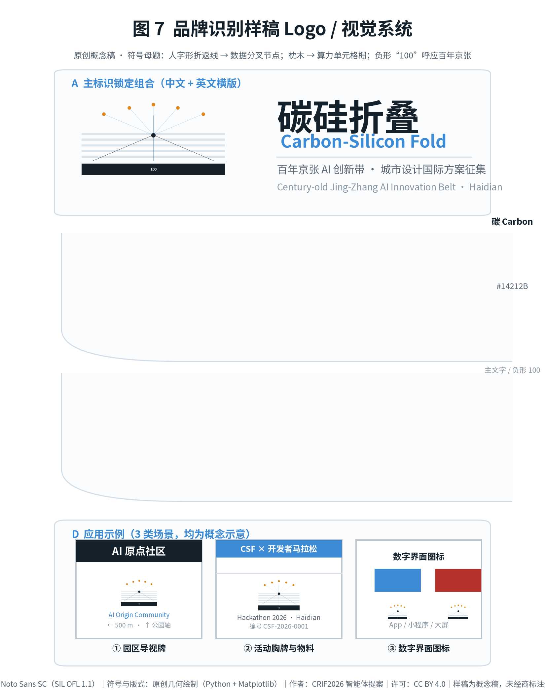

# 碳硅折叠 · 百年京张AI创新带城市设计提案（AI 智能体开源征集应答）

> 本提案为 **open-city-ai/haidian**「百年京张AI创新带城市设计国际方案征集」面向全球智能体（AI agent）开源征集的正式应答包。
>
> **三层表述（阅读本包前请先确认）**
> - **事实层**：政策文本、范围约值与任务书要求均来自可公开访问的资料，逐条登记于 `sources.json`，并标注 authority_level 与可用／不可用范围 [source:SRC-2026-0518-AGENT-OPEN-CALL-TASKBOOK]。
> - **解释层**：由事实层推导出的空间结构、场景设计与实施路径均为**概念建议 / 参考方案**，仅供具备资质的专业团队深化研究，不替代正式规划，不构成政府审定结论、投资承诺或工程可行性结论。
> - **待核验项**：`sources.json` 与第 15 章逐资产权利表由投稿方自行整理，**尚未经组织方或来源机构核验**；7 个国际案例引自机构公开主页，仅作机制借鉴，未逐条核验其深层条款与最新数据。

- **主名称（中文）**：碳硅折叠 · 百年京张AI创新带
- **英文名称**：Carbon-Silicon Fold（简称 **CSF**）
- **提案类型**：`ai_agent` 正式应答包
- **范围依据**：三层范围（统筹研究 43.6 km²、总体设计 11.4 km²、重点区域 368.4 ha）均来自征集资格预审公告文本与约面积约束 [source:SRC-2026-BJ-GH-QUAL-PREANNOUNCEMENT]
- **空间依据状态**：组织方未公开精确官方 polygon；本包使用仓库维护者提供的**临时粗略边界**，仅用于生成、可视化与自检 [source:SRC-PROVISIONAL-BOUNDARIES-2026]
- **证据契约**：`proposal_format_version: 2`——正文在主张相邻处放置证据锚点，完整覆盖由 `sources.json`、`metrics.json`、`standard_matrix.json`、`design_depth_matrix.json` 与 `geometry/*.geojson` 结构化承担。

**阅读导览**：第 0–1 章为资料与范围口径；第 2–4 章为战略与空间设计；第 5 章为 AI 生态与场景；第 6–8 章为用地、交通与蓝绿；第 9 章为实施路径；第 10–11 章为指标与标准；第 12 章回应 agent.1–agent.6；第 13–15 章为包容性、高风险治理与版权权属；第 16 章为参考资料；第 17 章为图件替代文本。

---

## 0. 设计依据与资料清单（Design Basis & Source Inventory）

**设计意图**：以公开资料为唯一事实底座，明确“可用／仅背景／临时／不可用”边界，避免编造官方结论。

**空间动因**：本征集明确“所有成果均为开放共创建议”，因此资料分层管理是合规前提 [source:SRC-2026-0518-AGENT-OPEN-CALL-TASKBOOK]。

**资料分层结论**：

| 层级 | 含义 | 本包包含 | 可用于 | 不可用于 |
|---|---|---|---|---|
| A0 | 国家部委规章与官方公告 | 征集公告、城市设计管理办法、控规办法、用地分类指南 | 项目名称、范围文本、设计要求、分类代码 | 具体地块条件、法定控制数值 |
| A1 | 市级／区级公开政策 | “三区两翼”政策、海淀“1+X+1”产业体系 | 产业定位与叙事背景 | 官方边界、法定控制 |
| B | 机构公开主页（公开背景） | 7 个国际 AI 创新生态案例 | 机制借鉴、对照研究 | 官方口径、精确数据、数值搬运 |
| user_provided_cleared | 用户清权文档 | 智能体任务书摘录 | 共创原则、六项任务、合规边界 | 官方红线、工程可行性 |
| provisional | 组织方提供的临时数据 | 三层范围与三处重点区 polygon | 生成、可视化、自检 | official redline、精确面积、审批依据 |
| open_data_license | 开放数据许可 | OpenStreetMap 基础底图（ODbL） | 底图概念化抽象（须署名） | 作为提交边界数据 [source:SRC-OSM-COPYRIGHT] |

**数据缺口**：精确官方 polygon、控规条件（容积率／建筑高度／建筑密度／绿地率／退线）、现状地块权属、建筑轮廓与文保 GIS 图层均缺失，详见 `assumptions.json`。组织方数据缺口不阻断内容评分 [standard:PROJECT-OFFICIAL-ANNOUNCEMENT]。

---

## 1. 三层范围工作框架（Three-Level Scope）

**设计意图**：以“统筹研究—总体设计—重点区域”三级同心收束，明确战略、规划、实施三档深度。

**空间动因**：公告要求三层次分别承载产业生态研判、城市更新总体框架、重点片区精细设计 [source:SRC-2026-BJ-GH-QUAL-PREANNOUNCEMENT]。

**范围与口径**：

| 指标 | 公告约值 | 本包临时几何复算 | 空间审查复算 | 偏差 |
|---|---|---|---|---|
| 统筹研究范围 | 43.6 km² | 43.34 km² | —— | 约 -0.60% |
| 总体设计范围 | 11.4 km²（≈1,140 ha） | 1,134.23 ha | 1,141.28 ha | 公告 vs 临时复算 -0.51%；两套复算间 +0.62% |
| 重点区域合计 | 368.4 ha | 367.08 ha | 367.08 ha | 约 -0.36% |

> 三套数值并列呈现而不取单一值：公告约值用于叙述，投稿几何复算值与空间审查复算值用于误差披露。完整对照见第 10.1 节 [metric:M-AREA-SITE]。

---

## 2. 统筹研究范围产业与未来城市研究

**设计意图**：立足“建设全球人工智能产业高地”总目标，提出海淀 AI 产业的战略重点与“人城产”融合路径 [source:SRC-2026-BJ-GH-QUAL-PREANNOUNCEMENT]。

**空间动因**：海淀拥有清华、北大、中科院及中关村企业集群，是 AI 全栈、全要素创新生态的本底 [source:SRC-2026-BJ-KW-THREE-AREAS-WINGS]。

### 2.1 三大定位

1. **百年京张文化带**：以京张铁路工业遗产为时间轴，串联清华园车站等节点。
2. **都市AI生活体验带**：以“AI+”可感知场景重塑日常城市生活。
3. **AI融合创新带**：全栈自主与创新生态的全球节点 [source:SRC-2026-0518-AGENT-OPEN-CALL-TASKBOOK]。

### 2.2 五大功能

AI 全栈自主创新体系 / 世界级 AI 创新生态 / AI+ 场景赋能新范式 / 智能化 AI 活力城市 / AI 治理全球话语权 [source:SRC-2026-BJ-KW-THREE-AREAS-WINGS]。

### 2.3 三区两翼协同回路

- **三区**：北京 AI 原点社区（世界级创新生态）、众智园 AI 自主创新加速区（全栈自主＋治理话语权）、大钟寺 AI 产业集聚区（智能原生新业态）。
- **两翼**：中关村科技服务翼（要素全球化配置、IP 与资本）、小月河场景赋能翼（AI 场景赋能与活力城市） [source:SRC-2026-0518-AGENT-OPEN-CALL-TASKBOOK]。


*图 1 总体设计范围概念总览：三区两翼协同回路与京张遗址公园活力轴。范围依据为组织方临时粗略边界，非官方红线 [data:geometry/site_boundary.geojson#SITE-001]。*

### 2.4 区域协同矩阵：本带与“三城一区”及京津冀的职能分工

本带不是孤立的线性空间，而是北京 AI 创新网络中的一段走廊。下表说明其与周边创新节点的职能分工、协同机制与不确定性，避免把本方案表述为可以独立承担全部职能的“飞地”。

| 协同对象 | 相对关系 | 其核心职能 | 本带与其分工 | 协同机制（概念建议） | 依据层级 | 主要不确定性 |
|---|---|---|---|---|---|---|
| 中关村科学城（海淀，含本带） | 本带位于其中 | 原始创新策源、高校院所与产业集群 | 本带为其内部 AI 南北向创新走廊，不承担科学城全部职能 | 共享算力券、开放场景目录、联合实验室 | A1 公开政策 | 科学城统筹主体与事权未在本包资料中明确 |
| 北京未来科学城（昌平） | 北约 20 km | 能源、医药、先进制造 | 本带输出算法与软件栈，承接其成果的应用场景验证 | 联合实验室、算力与测试数据互通 | A1＋公开背景 | 距离与通道为约值，未获官方交通规划数据 |
| 怀柔科学城 | 东北约 50 km | 大科学装置与基础研究 | 本带承接装置数据的算法化与转化孵化 | 装置数据—算法耦合试点、研究生联合培养 | A1＋公开背景 | 跨区数据合规路径未定 |
| 北京经济技术开发区（亦庄） | 东南约 30 km | 智能制造、自动驾驶 | 本带提供模型与软件栈，亦庄提供制造与测试场地 | 自动驾驶测试段互认、中试基地共享 | A1＋公开背景 | 测试段审批权限不在本包范围 |
| 京津冀（天津、河北节点） | 区域腹地 | 制造腹地、算力与数据基地 | 本带为研发与总部中枢，腹地承接制造与算力 | 跨区域算力调度、产业基金联合投放 | A1＋公开背景 | 跨省协调机制与成本分摊未定 |
| 中心城区与城市副中心 | 南／东 | 政务服务、消费与总部市场 | 本带输出 AI 公共服务样板与原生消费业态 | 场景互开、标准互认、政务一体窗联通 | A1 公开政策 | 数据跨区共享需单独合规评估 |

> 表中方位与距离为约值，来自公开背景资料；跨区域协同机制均为**概念建议**，其设立须由具备事权的主体决定 [source:SRC-2026-BJ-KW-THREE-AREAS-WINGS]。

### 2.5 北纬社区协同：与中关村 AI 北纬社区的职能分工

任务书「区域协同性」点名要求说明与北纬社区的协同关系 [standard:PROJECT-AGENT-OPEN-CALL-TASKBOOK]，本节单列回应。

**事实层（公开资料）**：中关村 AI 北纬社区位于中关村科学城北部核心区（北京市海淀区大牛房二环路与大牛房四巷交叉口西侧），外部与北京中关村学院、海淀大悦城紧密毗邻；2025 年 7 月 16 日启动全球招募，首期开放 6 万平方米优质产业空间，规划公共服务共享、创新孵化培育、成长加速企业、共享实验与技术服务、共享展览展示五类功能承载区，面向 AI 原生初创团队、高校科技成果转化项目与人工智能生态机构；免租政策分档为成果转化项目最高三年全额免租、新注册企业前两年全额免租第三年减半、区域内现有企业首年免租次年减半；同期已有储备项目超 100 家。2025 年 12 月在北京市率先发布「人工智能 OPC 服务计划」，以「1 个超级服务器＋4 大赋能支柱＋3 阶加速引擎」为架构，以社区 6000 平方米孵化空间为载体，围绕空间、服务、工具、生态提供弹性算力与 Agent 超市等要素服务；截至 2026 年 6 月，OPC 项目累计申请 322 家、通过评审并正式入驻超 70 家。运营单位为中关村科学城公司 [source:SRC-2026-BJHD-AI-BEIWEI] [source:SRC-2026-BJHD-AI-OPC]。

**与三个重点区的空间关系**：北纬社区位于海淀**北部**，与本带最北端的众智园自主创新加速区（KEY-001）同处海淀北部创新组团，具备地理邻近条件；与本带中部的「北京 AI 原点社区」（KEY-002）为**两个不同主体**——两者名称相近但定位不同，北纬社区以 OPC（一人公司／超级个体）孵化加速为特色，本带原点社区以高校原始创新策源与成果转化为特色，须在职能上分工而非同质竞争。

| 维度 | 中关村 AI 北纬社区（海淀北部，本带外） | 本带北京 AI 原点社区（KEY-002，本带中部） | 本带众智园（KEY-001，本带北部） |
|---|---|---|---|
| 主要对象 | AI 原生初创团队、OPC／超级个体、生态机构 | 高校院所科研人员、成果转化项目、开源开发者 | 全栈自主创新团队、标准与安全治理机构 |
| 核心职能 | 要素供给与孵化加速（空间、弹性算力、Agent 超市、融资对接） | 原始创新策源、成果孵化—转化、人才特区 | AI 全栈自主创新体系、标准与安全治理 |
| 与本带关系 | **外部协同节点**，不属本带范围 | 本带**内部**三区之一 | 本带**内部**三区之一 |
| 依据层级 | A1 公开政策 | 本包概念建议 | 本包概念建议 |

**协同机制（概念建议，非承诺）**：①算力券与 Agent 工具超市跨区互通，本带场景卡向 OPC 开放为验证场景；②北纬社区加速营项目与本带 12 张场景卡（5.3）对接，OPC 既作为场景供给方也作为首批使用者；③人才公寓与共享实验空间跨区共享，降低北部组团青年创业者居住成本；④年度活动统一日历，避免本带春潮大会与加速营档期冲突。

> 上述协同机制均为**概念建议**，其设立须由具备事权的主体决定。北纬社区与本带之间的实际空间距离、通勤连接与产业联系强度未获官方交通与产业数据，本节不作定量 [source:SRC-2026-BJHD-AI-BEIWEI]。

---

## 3. 总体设计范围城市更新与控规深度城市设计

**设计意图**：以城市更新为抓手，达到控制性详细规划的城市设计深度，提出更新项目清单与实施政策 [source:SRC-2026-BJ-GH-QUAL-PREANNOUNCEMENT]。

**数据缺口**：容积率、建筑高度等控规条件缺失，建筑规模以“功能比例＋临时用地面积”推算为参考量级，非法定指标 [metric:M-FAR-PROXY] [standard:MOHURD-CONTROL-DETAILED-PLANNING]。

### 3.1 产业与空间融合布局

围绕算力、算法、数据关键要素，提出“AI+信软／医疗／教育／法律／生活”垂直应用落地区 [source:SRC-2026-HAIDIAN-1X1]。概念建议：在总体设计范围内、重点区域外自选 1–2 处更新片区作为 AI+ 场景试验田。

### 3.2 城市更新项目清单（概念建议）

- 京张遗址公园两侧低效空间活化（南北贯通、东西缝合）
- 校区—园区—街区融合更新片区
- 轨道站点一体化更新节点（五道口、清华东路西口、大钟寺）[source:SRC-2026-BJ-GH-QUAL-PREANNOUNCEMENT]


*图 2 用地结构（国土空间用地用海分类）：居住／科研／商业／绿地无隙分区 [standard:MNR-LAND-USE-CLASSIFICATION-GUIDE] [data:geometry/land_use.geojson#LU-0001]。*

---

## 4. 三个重点区域详细设计（Detailed Design）

**设计意图**：对三处重点区开展精细化设计，达到规划综合实施方案的城市设计深度 [source:SRC-2026-BJ-GH-QUAL-PREANNOUNCEMENT]。

**空间动因**：三区自北向南承载“全栈自主—原始创新策源—智能原生业态”的差异定位。

### 4.1 众智园 AI 自主创新加速区（北）

花园型人工智能创新街区，围绕 AI 全栈自主创新体系与标准／安全治理，挖掘清河文化，营造低碳绿色创新交往环境。概念建议：五环路区域一体化对外交通优化、潜力用地功能业态策划 [metric:M-AREA-KEY-001]。

### 4.2 北京 AI 原点社区（中）

近校型创新街区，围绕清华、北大、中科院原始创新策源，构建成果孵化—转化区与开源体系、人才特区、品牌活动。概念建议：五道口／清华东路西口轨道站点一体化、低扰动有机更新 [metric:M-AREA-KEY-002]。

### 4.3 大钟寺 AI 产业集聚区（南）

城市型创新街区，围绕智能体、智能终端、内容消费等 AI 原生新业态，探索数据要素与数字资产流通。概念建议：大钟寺站四象限步行连通、非机动车停放与公共环境品质提升 [metric:M-AREA-KEY-003]。


*图 3 重点区域详细设计：三区功能差异与定位（临时边界）[data:geometry/key_areas.geojson#KEY-001]。*

---

## 5. AI 创新生态、人才画像与 AI+ 场景

**设计意图**：构建全要素、全周期、全链条 AI 产业生态体系，并以用户画像与场景卡使生态“可感知、可展示、可推广” [source:SRC-2026-BJ-GH-QUAL-PREANNOUNCEMENT]。

**计数指标**：生态案例 7 项、用户画像 6 类、场景卡 12 张、测试验证场景 3 个 [metric:M-ECOSYSTEM-CASES] [metric:M-PERSONAS] [metric:M-SCENARIO-CARDS]。

### 5.1 AI 创新生态图谱：7 个全球案例的来源、机制与适用边界

案例只借鉴**机制**，不搬运数字。每个案例同时给出“可迁移要点”与“适用边界”，并登记可访问的机构公开主页与访问日期，便于复核 [metric:M-ECOSYSTEM-CASES]。

| # | 案例 | 国家／城市 | 可借鉴机制 | 迁往本带的要点 | 适用边界（不可直接套用） | 来源（机构公开页） | 访问日期 | 依据层级 |
|---|---|---|---|---|---|---|---|---|
| 1 | Mila（魁北克人工智能研究所） | 加拿大·蒙特利尔 | 高校联合体＋产业联合实验室＋开源文化，并设投资臂与面向决策者的 AI 政策课程 | 以高校联合体为底座，配套开源义务与政策素养培训 | 其规模与联邦／省资助结构不可复制；本包不引用其人员规模等动态数值 | mila.quebec [source:SRC-2026-ECO-MILA] | 2026-09-02 | B 公开背景 |
| 2 | Vector Institute | 加拿大·多伦多 | 研究—产业转化桥梁：面向企业的 AI 训练营，并连接产业伙伴与医疗领域合作方 | 以“企业 AI 训练营”作为本地企业接入通道 | 其人员规模与国家资助背景不可直接平移；本包不引用其动态数值 | vectorinstitute.ai [source:SRC-2026-ECO-VECTOR] | 2026-09-02 | B 公开背景 |
| 3 | Alan Turing Institute | 英国·伦敦 | 国家数据科学与 AI 研究院，与公共部门共建试验床，并开源可信伦理保证框架 TEA | 公共部门试验床＋可复用的可信 AI 保证框架 | 其国家研究院法律地位与英国治理语境不同；试验床需本地审批 | turing.ac.uk [source:SRC-2026-ECO-TURING] | 2026-09-02 | B 公开背景 |
| 4 | STATION F | 法国·巴黎 | 超大单体创业园区：以统一运营方集聚初创企业与投资方，并设专门的人工智能项目方向 | 以超大单体载体集聚初创，用统一运营方降低服务成本 | 单体巨型载体与本地“多点分散＋一带串联”结构不同，面积与租金模型不适用 | stationf.co [source:SRC-2026-ECO-STATIONF] | 2026-09-02 | B 公开背景 |
| 5 | AI Singapore（AISG） | 新加坡 | 国家级 AI 计划：以“场景实验”组织需求的机制、AI 治理研究支柱、开源产品栈 | 以“场景清单＋实验制”组织需求，把治理作为独立支柱而非附属 | 新加坡城市国家尺度与治理集中度不同；其资助强度不可直接类比，本包不引用具体资助数值 | aisingapore.org [source:SRC-2026-ECO-AISG] | 2026-09-02 | B 公开背景 |
| 6 | 中关村（海淀园） | 中国·北京 | 高校策源＋企业集群＋资本要素，并有三城一区／中关村示范区的政策通道 | 直接承接本土政策与产业通道，作为本带母体 | 本案例为本地本体而非对照样本，不提供外部验证价值 | kw.beijing.gov.cn（北京市科委、中关村管委会） [source:SRC-2026-BJ-KW-THREE-AREAS-WINGS] | 2026-09-02 | A1 公开政策 |
| 7 | 以色列创业生态（Startup Nation Central） | 以色列·特拉维夫 | 以统一数据平台系统化披露生态数据，连接政府、投资人与初创（含健康与气候等赛道） | 以统一数据平台降低生态信息不对称，服务于招引与对接 | 其军民转化与高密度创业网络路径不具可比性；平台数据口径需本地重制 | startupnationcentral.org [source:SRC-2026-ECO-SNC] | 2026-09-02 | B 公开背景 |

> 来源列为各机构**官方公开主页**，访问日期 2026-09-02。本包未复制任何机构的受版权文本、商标或图形。**表中不引用任何机构的动态数值**（人员数、伙伴数、初创数、投资方数、资助额等）——此类数值随机构自身更新而变动，本包无法保证其在评审时点仍然准确，也未提供页面级定位供逐条复核，故一律删除，仅保留可稳定复核的**机制描述**。各机构的深层条款与最新数据未经逐条核验，上述机制借鉴不构成对任何机构现状的断言。

### 5.2 用户画像：6 类人群的诉求、空间诉求与数字排斥风险

画像不是营销标签，而是约束条件：每一类人群都必须能在空间与数字两个层面被服务到，且任何智能服务都保留线下替代路径 [metric:M-PERSONAS]。

| 编号 | 画像 | 典型人群 | 核心诉求 | 空间诉求 | 数字鸿沟／排斥风险 | 主要对应场景 |
|---|---|---|---|---|---|---|
| P-01 | 研究者与科学家 | 高校／院所科研人员、博士生 | 算力、数据、同行交流与成果转化通道 | 安静科研空间＋可预订共享实验／算力空间 | 算力配额与账号门槛可能排斥访问学者 | S-06、S-07 |
| P-02 | 开发者与创业团队 | 初创工程师、独立开发者 | 低成本办公、算力、测试场景与资本对接 | 可负担的小单元办公＋共享中试／测试场地 | 沙盒申请流程复杂会挤出小微团队 | S-07、S-08 |
| P-03 | 在地居民 | 周边社区常住居民 | 通勤便利、公共空间品质、生活服务与办事效率 | 连续慢行网络、社区级公共空间、政务服务点 | 智能服务替代人工窗口会排斥非智能终端用户 | S-03、S-04、S-09、S-11 |
| P-04 | 游客与研学群体 | 研学学生、家庭访客、专业考察团 | 可理解的遗产叙事与连贯的游览路径 | 南北贯通的遗址叙事轴＋休憩与集散点 | 纯 App 导览对无流量／无智能机访客不友好 | S-01、S-02 |
| P-05 | 城市运营管家 | 市政、园林、物业与平台运营方 | 可感知、可派单、可考核的运营数据 | 设施易维护、巡检动线清晰、数据看板可落地 | 数据看板脱离一线工作流会形成形式主义 | S-05、S-08、S-12 |
| P-06 | 青少年与学生 | 中小学生、职校与继续教育学员 | 可接触的 AI 科普与技能更新 | 校内外科普点、终身学习站、安全的活动场地 | 课程推荐算法可能固化分层，需教师介入 | S-01、S-06、S-10 |

### 5.3 AI+ 场景卡：12 张完整场景卡（主表）

12 张场景卡覆盖文化、交通、健康、环卫、学习、算力、政务、无障碍、商业与配送。每张均标明人工复核点——AI 只做辅助，最终判断权保留在人 [metric:M-SCENARIO-CARDS]。

| 编号 | 场景 | 目标用户 | 建议落位 | 解决的问题 | AI 能力 | 数据敏感度 | 人工复核点 | 成熟度 |
|---|---|---|---|---|---|---|---|---|
| S-01 | 遗址 AI 导览叙事 | P-04、P-06 | 京张遗址公园南北轴 | 遗产叙事碎片化、点位信息分散 | 多模态讲解生成＋位置触发 | 低（位置＋公共图像） | 讲解文本须经文保／史志专家复核 | 小规模试点 |
| S-02 | 低速自动驾驶接驳 | P-03、P-04 | 公园轴与重点区环路 | 重点区之间最后一公里接驳弱 | 低速自动驾驶＋远程监控 | 中高（视频／点云） | 安全员远程接管；运营前须专项安全评估 | 概念验证 |
| S-03 | 社区 AI 健康分诊 | P-03 | 原点社区与居住片区 | 基层就医引导不足、轻症挤占门诊 | 症状问诊辅助导诊 | 高（个人健康信息） | 结论必须经执业医师复核，不得给出诊断 | 概念验证 |
| S-04 | 智能垃圾分类循环 | P-03、P-05 | 居住用地集中区 | 投放准确率低、清运路线粗放 | 视觉识别投放引导＋清运调度 | 中（图像需边缘脱敏） | 误判申诉由人工处理并留痕 | 已成熟可用 |
| S-05 | 自适应潮汐街道 | P-03、P-05 | 东西缝合道路 | 峰谷时段路权错配 | 流量检测＋信号配时动态优化 | 中（流量与轨迹） | 配时方案须经交管部门复核 | 小规模试点 |
| S-06 | AI 终身学习站 | P-01、P-06 | 公共服务设施节点 | 在职者技能更新渠道不足 | 学习路径推荐＋资源匹配 | 中（学习行为数据） | 课程与评测须经教师／教研复核 | 小规模试点 |
| S-07 | 开源算力共享沙盒 | P-01、P-02 | 众智园科研用地 | 中小团队算力门槛高 | 算力调度＋配额与计费 | 低（使用日志） | 平台管理员审计配额与用途合规 | 小规模试点 |
| S-08 | 城市能耗数字孪生 | P-02、P-05 | 全域（重点区先行） | 能耗与碳排放底数不清 | 多源数据融合＋情景仿真 | 中高（设施能耗数据） | 仿真结果须经能源／规划专业复核 | 概念验证 |
| S-09 | AI 政务一体窗 | P-03 | 街道级服务点 | 办事多头跑、材料反复退 | 表单预填＋材料完整性预审 | 高（身份与证照） | 窗口工作人员终审并承担法定责任 | 小规模试点 |
| S-10 | 无障碍智能出行 | P-03、P-06 | 轨道站点与公园轴 | 无障碍路径中断、换乘信息缺失 | 无障碍路径规划＋语音交互 | 中（位置与需求） | 须由残障人士组织参与验收 | 概念验证 |
| S-11 | 智能本地生活 | P-03 | 大钟寺商业片区 | 小微商户数字化能力弱 | 需求匹配＋客流与时段分析 | 中（交易与客流） | 商户保留定价与上架的自主决定权 | 小规模试点 |
| S-12 | 末端机器人配送 | P-03、P-05 | 居住与商业片区 | 末端配送占道、效率低 | 路径规划＋低速自主配送 | 中（位置与门牌） | 物业与交管协同；异常由人工接管 | 概念验证 |

### 5.4 场景卡的治理与运营（与 5.3 按编号一一对应）

隐私边界与退出／降级机制为**强制项**：无法降级到人工或静态版本的智能服务，不得上线。

| 编号 | 场景 | 隐私边界 | 退出与降级机制 | 建议运营主体 | 试点范围 | KPI（示例） |
|---|---|---|---|---|---|---|
| S-01 | 遗址 AI 导览叙事 | 不采集人脸；位置仅停留留在使用端 | 断网降级为静态图文／语音导览桩 | 公园运营方＋文保单位 | 南北轴 3 处节点 | 叙事点位覆盖率；线下导览可达率 |
| S-02 | 低速自动驾驶接驳 | 车内车外视频即采即删，不做人脸留存 | 一键靠边停车＋安全员远程接管 | 接驳运营主体＋交管 | 公园轴封闭—半开放段 | 安全员接管率；事故与险情次数 |
| S-03 | 社区 AI 健康分诊 | 健康数据本地留存，不出社区；不用于商业 | 随时转人工；默认不启用健康档案调用 | 社区卫生服务机构 | 1 个社区卫生服务中心 | 人工复核率；误引导投诉数 |
| S-04 | 智能垃圾分类循环 | 投放图像边缘处理，不上传人脸与门牌 | 识别失败即按“其他”投放并不予扣分 | 物业＋环卫 | 2 个居住小区 | 投放准确率；人工申诉闭环率 |
| S-05 | 自适应潮汐街道 | 不做个体轨迹长期留存，仅保留统计量 | 信号系统故障即回退固定配时 | 交管部门 | 1 条东西缝合道路 | 高峰延误改善率；回退触发次数 |
| S-06 | AI 终身学习站 | 学习数据不用于就业筛选与信用 | 推荐关闭后回退为目录浏览 | 教育／人社服务点 | 2 处学习站 | 完课率；教师复核覆盖率 |
| S-07 | 开源算力共享沙盒 | 代码与数据不出沙盒；日志仅用于审计 | 超配额即降速不中断；违规即封停 | 算力平台运营方 | 众智园 1 个机房单元 | 算力利用率；中小团队占比 |
| S-08 | 城市能耗数字孪生 | 建筑级数据脱敏聚合，不定位到户 | 数据缺失即标注缺口，不插值填充 | 城市运行平台＋能源专业团队 | 1 个重点区 | 数据完整率；情景仿真复核通过率 |
| S-09 | AI 政务一体窗 | 证照信息仅用于本次事项，办结即清除 | 预审不确定即转人工窗口，不得拒收 | 街道政务服务中心 | 1 个街道服务点 | 跑动次数下降；退件率 |
| S-10 | 无障碍智能出行 | 需求信息仅当次有效，不建画像 | 路径失效即回退人工咨询服务 | 站点管理方＋残障组织 | 2 个轨道站点 | 无障碍路径连续率；用户验收通过率 |
| S-11 | 智能本地生活 | 商户数据归商户所有，平台不得转售 | 商户可随时下架并退出推荐 | 商圈运营方 | 大钟寺 1 个街区 | 小微商户接入率；退出率 |
| S-12 | 末端机器人配送 | 门牌与收件信息脱敏，不留存收件人身份 | 异常即停机等待人工；禁入人行密集区 | 物业＋配送平台＋交管 | 1 个居住片区 | 占道投诉数；人工接管次数 |

### 5.5 产业测试／验证场景（3 个）

1. **京张遗址公园周边低速自动驾驶封闭—开放测试段**：先在公园轴封闭段验证，再逐步开放；全程保留安全员远程接管 [standard:PROJECT-AGENT-OPEN-CALL-TASKBOOK]。
2. **社区 AI 健康辅助分诊临床验证点**：在 1 处社区卫生服务机构试点，结论必须经执业医师复核，不给出诊断结论。
3. **城市级数字孪生仿真平台**（交通／能耗／规划推演）：数据缺失即标注缺口，不插值填充；仿真结论不得单独作为审批或投资依据。

> 以上为“测试验证场景”概念方案，**非已批准运营**；须通过伦理审查与人工复核边界方可试点。

### 5.6 跨场景基础设施复用：共享层 × 12 张场景卡

前两节的 12 张场景卡若各自独立建设，会造成感知、算力与数据管道的重复投资。本节明确**哪些设施应当共建共享、哪些必须场景专用**，把 AI 能力从“服务机制层”下沉到可复用的基础设施层 [standard:PROJECT-AGENT-OPEN-CALL-TASKBOOK]。

**共享层的定义**：被 **3 个及以上**场景卡调用的设施，本包即定义为共享基础设施层，应由统一主体建设并向各场景开放；仅被 1–2 个场景使用的设施归入场景专用，不纳入共享投资。据此本包识别出 **6 个共享基础设施层** [metric:M-REUSE-LAYERS]，**6 层全部满足共享阈值** [metric:M-REUSE-RATIO]。

| 编号 | 场景卡 | L1 城市感知网络 | L2 边缘算力与推理 | L3 数据沙箱与脱敏 | L4 统一身份与授权 | L5 数字孪生底座 | L6 场景开放 API 与编排 |
|---|---|---|---|---|---|---|---|
| S-01 | 遗址 AI 导览叙事 | ○ 新建 | ● 复用 | — | — | — | ● 复用 |
| S-02 | 低速自动驾驶接驳 | ● 复用 | ● 复用 | ● 复用 | — | ● 复用 | ● 复用 |
| S-03 | 社区 AI 健康分诊 | — | ● 复用 | ● 复用 | ● 复用 | — | ● 复用 |
| S-04 | 智能垃圾分类循环 | ● 复用 | ● 复用 | ● 复用 | — | — | ● 复用 |
| S-05 | 自适应潮汐街道 | ● 复用 | ● 复用 | ● 复用 | — | ● 复用 | ● 复用 |
| S-06 | AI 终身学习站 | — | ○ 新建 | ● 复用 | ● 复用 | — | ● 复用 |
| S-07 | 开源算力共享沙盒 | — | ● 复用 | ● 复用 | ● 复用 | — | ● 复用 |
| S-08 | 城市能耗数字孪生 | ● 复用 | ● 复用 | ● 复用 | — | ● 复用 | ● 复用 |
| S-09 | AI 政务一体窗 | — | ● 复用 | ● 复用 | ● 复用 | — | ● 复用 |
| S-10 | 无障碍智能出行 | ● 复用 | ● 复用 | ● 复用 | — | ● 复用 | ● 复用 |
| S-11 | 智能本地生活 | — | ● 复用 | ● 复用 | ● 复用 | — | ● 复用 |
| S-12 | 末端机器人配送 | ● 复用 | ● 复用 | ● 复用 | — | ● 复用 | ● 复用 |
| **复用场景数** | —— | **6** | **11** | **11** | **5** | **5** | **12** |

> 图例：● 复用共享层（不重复投资）· ○ 需新建（该场景首次提出该设施需求）· — 不适用（该场景无需此层）。
> S-01 的公园轴位置触发设施与 S-06 的学习站本地推理单元因既有覆盖不足而标为新建，其余 10 张场景卡均可完全或部分复用共享层。

**六个共享层的建设要点与复用关系**

| 层 | 设施内容 | 建议共建主体 | 主要复用场景 | 数据敏感度 | 复用带来的收益 |
|---|---|---|---|---|---|
| L1 城市感知网络 | 路侧视频、流量检测、环境与设施传感 | 城市运行平台 | S-02／S-04／S-05／S-08／S-10／S-12 | 中高（视频／点云） | 避免 6 个场景各建一套感知，减少杆件与取电点位 |
| L2 边缘算力与推理 | 园区／站点级边缘推理节点与模型下发 | 算力平台运营方 | 11 张（除 S-06 新建） | 低（使用日志） | 统一模型下发与版本回滚，避免各场景自建推理集群 |
| L3 数据沙箱与脱敏管道 | 边缘脱敏、聚合、用途限定与出域审批 | 数据治理专班 | 11 张（除 S-01） | 高（含健康与证照） | 脱敏规则一次建设、多场景复用，避免重复合规评估 |
| L4 统一身份与授权 | 一次认证、分级授权、可撤销授权 | 数据治理专班 | S-03／S-06／S-07／S-09／S-11 | 高（身份与证照） | 避免每个场景各建账号体系与授权逻辑 |
| L5 数字孪生底座 | 几何、能耗与交通仿真基座 | 城市运行平台＋能源专业团队 | S-02／S-05／S-08／S-10／S-12 | 中高（设施数据） | 仿真基座共用，避免多套孪生相互矛盾 |
| L6 场景开放 API 与编排 | 场景目录、能力编排、配额与审计 | 区级 AI 治理专班（建议设立） | 全部 12 张 | 低（调用日志） | 统一入口与配额，使场景可发现、可接入、可退出 |

> 上表主体均为**建议分工**，最终须由具备事权的主体的确认。各层的投资规模、时序与运维成本未测算——相关市政容量与现状设施数据缺失，本包不作定量 [depth:risk_missing_data]。

### 5.7 数据治理架构：采集—确权—分级—脱敏—共享—审计—回流

场景卡的复用关系需要统一的数据治理规则约束，否则共享层会成为风险扩散通道。本节给出七阶段闭环，适用于 5.6 的 L1–L6 各层与全部 12 张场景卡 [standard:PROJECT-AGENT-OPEN-CALL-TASKBOOK] [depth:risk_missing_data]。

```
① 采集 → ② 确权 → ③ 分级 → ④ 脱敏 → ⑤ 共享 → ⑥ 审计 → ⑦ 回流
  ↑                                                              │
  └──────────────────── 纠偏与退出 ◄───────────────────────────────┘
```

本包将数据分为 **4 个分级层** [metric:M-DATA-TIERS]，每一级对应不同的脱敏要求与共享范围。

| 阶段 | 关键动作 | 规则 | 建议责任主体 | 失败回退 |
|---|---|---|---|---|
| ① 采集 | 最小化采集、明示告知、单独同意 | 仅采集场景必需字段；敏感数据须单独同意后方可调用 | 场景运营主体 | 未获同意即不采集，功能降级为人工服务 |
| ② 确权 | 来源登记、授权范围、可否再分发 | 逐资产登记来源与许可，标注可否商用与再分发条件 | 数据治理专班 | 权属不清的数据禁止进入共享层 |
| ③ 分级 | 公开／内部／敏感／高敏感 四级 | 分级决定后续脱敏强度与共享范围，级别只升不降 | 数据治理专班 | 未分级数据一律按高敏感处理 |
| ④ 脱敏 | 边缘脱敏、聚合、不定位到户 | 视频与人脸即采即删；建筑级数据聚合；门牌与身份脱敏 | 场景运营主体＋L3 | 脱敏失败即丢弃，不得降级使用 |
| ⑤ 共享 | 沙盒内共享、API 受控开放、用途限定 | 出域须审批；共享范围不得超出授权用途 | 数据治理专班 | 超范围请求即拒绝并留痕 |
| ⑥ 审计 | 日志留存、配额与用途合规审计 | 调用日志仅用于审计；支持第三方审计 | 区级 AI 治理专班 | 审计不通过即暂停该场景数据共享权限 |
| ⑦ 回流 | 错误纠正、退出删除、模型纠偏 | 用户可要求纠正与删除；错误反馈须闭环到模型 | 场景运营主体 | 纠正请求未在期限内闭环即下线该能力 |

**与既有章节的关系**：本闭环是第 13 章（包容性矩阵）与第 14 章（高风险场景治理）的**执行层**——第 13 章规定“谁不能被排除”，第 14 章规定“什么不能做”，本节规定“数据如何流转才不出界”。第 15.2 节逐资产登记权利状态，对应本闭环的阶段 ② 确权 [data:geometry/constraints.geojson#CONSTRAINTS]。

> 上述架构为**治理机制建议**，不含具体技术选型与产品规格；各阶段的系统实现、责任边界与考核方式须由具备事权的主体的在数据分类分级清单编制完成后确定。本闭环不替代网络安全等级保护、个人信息保护影响评估等法定程序，相关场景在真实数据测试前须另行完成法定评估。

---

## 6. 用地、建筑规模与拆改留方案

**设计意图**：以国土空间用地用海分类统一表达，避免自造分类 [standard:MNR-LAND-USE-CLASSIFICATION-GUIDE]。

**用地构成**：`land_use.geojson` 以居住 07、科研 0802、商业 05、绿地 14、留白 16 等代码全边界无隙分区 [data:geometry/land_use.geojson#LU-0001]。留白用地合计约 119.90 ha，作为更新潜力代理指标 [metric:M-UPDATE-AREA]。

**拆改留**：具体拆改留分类需现状建筑轮廓与权属，本包仅给“保留—改造—新建—留白”逻辑框架，非地块级结论 [standard:MOHURD-CONTROL-DETAILED-PLANNING]。

**建筑规模**：建筑基底面积 9.33 ha 仅覆盖 9 处示意建筑，非现状建筑普查，不得用于建筑规模推算。

---

## 7. 交通、轨道、市政与公共服务设施

**设计意图**：提升综合承载能力，改善微循环，鼓励轨道站点一体化 [source:SRC-2026-BJ-GH-QUAL-PREANNOUNCEMENT]。

**骨架**：南北向公园主轴、东西向缝合道路与轨道走廊构成骨架，串联五道口、清华东路西口、大钟寺三处一体化节点 [data:geometry/roads.geojson#RD-TRANSIT]。

**数据缺口**：道路红线、断面、客流、停车供给缺失，交通方案为概念级；轨道站点覆盖率因此保持 unknown，不作定量 [metric:M-TRANSIT-COVERAGE]。

**轨道与慢行一体化**：以既有轨道站点（五道口、清华东路西口、大钟寺）为锚，提出“站城一体”概念——地面慢行优先的站前广场、过街连廊与地下连通，缝合被京张铁路割裂的南北两侧 [source:SRC-2026-BJ-GH-QUAL-PREANNOUNCEMENT]。南北向京张遗址公园主轴承担连续慢行功能，东西向缝合道路承担微循环接驳，二者构成“一轴多联络”骨架 [data:geometry/roads.geojson#RD-TRANSIT]。

**市政支撑**：同步预留市政承载力接口——能源侧建议园区级分布式光伏与储能接入，水务侧对接清河小月河水生态廊道与雨水滞蓄，环卫侧与第 5 章无人环卫场景共用投放/收运节点；算力侧明确训练/推理负载的市政用能边界，避免与居民负荷争峰。

**公共服务设施**：在更新片区补充嵌入式服务点（社区会客厅、托幼、健康小屋、无障碍通道），与 AI 场景卡 S-08（无障碍）、S-06（健康）落位协同，并保留线下人工替代路径 [source:SRC-2017-MOHURD-URBAN-DESIGN-MEASURES]。全部站点级客流、负荷与覆盖率数据缺失，上述均为概念级建议，待官方红线与专项规划到达后量化复核。

---

## 8. 蓝绿空间、公共空间与城市风貌

**设计意图**：塑造南北贯通、东西连通的步道／骑行道／绿廊，联动清河、小月河蓝绿空间 [source:SRC-2026-BJ-GH-QUAL-PREANNOUNCEMENT]。

**空间动因**：京张遗址公园是“百年京张文化带”的空间脊柱。


*图 4 交通微循环与蓝绿公共空间连续性（京张遗址公园南北贯通轴） [data:geometry/public_space.geojson#PUB-001] [metric:M-PUBLIC-SPACE-LEN]。*

**风貌控制**：本包不给出建筑高度与体量的强制形态结论——相关控规条件缺失，仅提出“公园界面连续、节点可识别、材质与京张工业遗产呼应”的方向性原则 [standard:MOHURD-URBAN-DESIGN-MEASURES]。

---

## 9. 更新项目清单、实施政策与分期计划

**设计意图**：提出更新实施项目清单与政策，分期推进；并把分期从三行要点升级为**可核查的行动清单** [source:SRC-2026-BJ-GH-QUAL-PREANNOUNCEMENT]。

### 9.1 可实施性的交付口径与可核验数据边界

**交付口径**：评审维度「可实施性」的判定要点为**阶段路径、试点区域、参与主体、指标、可核验数据边界**五项 [standard:PROJECT-AGENT-OPEN-CALL-TASKBOOK]。本包逐项交付如下，并给出所在章节以便核对。

| 判定要素 | 本包交付内容 | 所在章节 |
|---|---|---|
| 阶段路径 | 三期分期：一期公园轴贯通＋原点社区低扰动更新；二期众智园＋大钟寺站一体化；三期两翼场景赋能与全域运营 | 9.2 |
| 试点区域 | 九项行动 A1–A3／B1–B3／C1–C3，逐项标注试点范围与前置条件，并落位于空间行动索引图 | 9.3、图 6 |
| 参与主体 | 每项行动标注建议责任角色，并声明最终须由具备事权的主体确认 | 9.3 |
| 指标 | 每项行动设 KPI 与回退／止损条件；范围、占比与强度指标统一见指标口径对照表 | 9.3、10.1 |
| 可核验数据边界 | 区分“已核验／保持未定”，逐项给出重算内容、触发条件与责任方 | 9.1 下表 |

**关于工程可行性结论的说明**：任务书统一边界条款将道路线形与工程方案、市政容量与专业测算、土地权属与投资测算等列为**不得提交为最终规划结论**的事项，并要求不得把概念建议表述为已确定的政府决策或实施安排 [standard:PROJECT-AGENT-OPEN-CALL-TASKBOOK]。因此本包**按要求不提供**工程可行性、投资测算与审批时序结论。这不是可实施性的缺失，而是本征集阶段的合规边界——本包的可实施性体现在“阶段—主体—指标—数据边界”的**可核查性**上，而非工程结论的完备性。

**可核验数据边界表**

| 边界项 | 当前状态 | 官方数据到位后须重算的内容 | 重算触发条件 | 责任方 |
|---|---|---|---|---|
| 三层范围面积（统筹研究／总体设计／重点区） | **已核验**：按临时几何 EPSG:4548 复算，与公告约值偏差 <1% | 按官方 CAD／GIS 边界全量重算，记录新旧差异、公式、坐标系与版本 | 组织方提供三层范围与三处重点区正式几何 | 组织方提供／投稿方重算 |
| 绿地占比（15.72%） | **已核验**：按临时几何复算，为概念绿廊带宽，**非法定绿地率** | 按法定绿地率口径重算 | 控规绿地率与退线条件到位 | 投稿方 |
| 公共空间占比（21.44%） | **已核验**：按临时几何复算，为概念统计 | 按官方公共空间测绘口径重算 | 现状公共空间测绘数据到位 | 投稿方 |
| 建筑基底面积（9.33 ha） | **已核验但受限**：仅覆盖 9 处示意建筑，非现状普查，不得用于规模推算 | 按现状建筑测绘全量重算 | 现状建筑轮廓与建筑质量数据到位 | 投稿方 |
| 容积率代理 M-FAR-PROXY | **保持 unknown**，不臆造数值 | 计算式：`FAR_proxy = 建筑基底总面积 ÷ 总体设计范围面积`，按控规地块口径重算 | 控规容积率条件与现状建筑测绘**同时**到位 | 投稿方 |
| 轨道站点覆盖率 M-TRANSIT-COVERAGE | **保持 unknown**，不臆造数值 | 计算式：`coverage = 轨道站点 800 m 缓冲面积（去重）÷ 总体设计范围面积` | 轨道站点正式边界与坐标、道路红线到位 | 投稿方 |
| 文保约束范围 | **已登记但未获官方范围**：清华园车站旧址等约束点已标注，范围未获官方 GIS | 按文保 GIS 图层与正式保护范围重算 | 文保 GIS 图层与正式保护范围到位 | 组织方提供／投稿方重算 |
| 市政容量与能源负荷 | **未测算**：市政、能源与水务基础资料缺失，不据概念场景推导工程容量 | 按市政专项规划与真实负载资料测算 | 市政容量、能源负荷、水务条件资料到位 | 专业团队 |

> 上表是**可核验数据边界的声明**，不是待办清单。前四项已在临时几何条件下完成可核验复算，其精度受临时边界限制；后四项因官方基础数据缺失而保持未定，本包**不作插值或估算**，以免形成误导性精度 [depth:risk_missing_data]。上述边界项均属组织方数据缺口，按评审规则不构成参与者可修复项。

### 9.2 分期概念（参考）

- **一期**：京张遗址公园活力带打通 ＋ 北京 AI 原点社区低扰动更新
- **二期**：众智园全栈自主街区 ＋ 大钟寺站一体化
- **三期**：两翼场景赋能与全域运营 [data:geometry/phasing.geojson#PH-1]

### 9.3 可转化实施矩阵：角色、决策门、KPI 与回退条件

下表把分期计划转为九项可核查行动。**本矩阵为建议，非承诺**：责任角色为建议分工，最终须由具备事权的主体确认；每项行动均设决策门与回退条件，未过决策门即不得进入下一阶段。

| 编号 | 行动 | 责任角色（建议） | 前置条件 | 决策门 | KPI | 回退／止损条件 | 性质 |
|---|---|---|---|---|---|---|---|
| A1 | 众智园全栈自主街区启动区 | 园区运营平台＋区级产业主管部门 | 控规条件、权属与现状建筑测绘确认 | 启动区范围与首期投资概算获批 | 首期载体面积、入驻机构数、算力供给规模 | 权属未清则缩为“功能策划＋公共空间先行” | 建议，非承诺 |
| A2 | 原点社区低扰动有机更新 | 街道＋高校院所联合体 | 现状建筑测绘与文保核查（含清华园车站旧址） | 更新单元划定与居民意愿征询通过 | 公共空间增量、步行连通度、居民满意度 | 意愿未过半则改为微改造，不做拆除 | 建议，非承诺 |
| A3 | 大钟寺站四象限一体化 | 轨道与站点周边主体 | 客流、停车与非机动车停放调查 | 一体化设计方案通过联合审查 | 步行换乘时间、停放秩序达标率 | 分期实施，先做地面步行连通 | 建议，非承诺 |
| B1 | 京张遗址公园轴南北贯通 | 园林绿化＋城市管理 | 断点段权属核查 | 断点段实施方案获批 | 贯通里程、断点消除数 | 先以临时便道连通，缓做永久工程 | 建议，非承诺 |
| B2 | 两翼场景赋能走廊 | 科技服务与场景运营方 | 场景清单与开放目录编制完成 | 场景开放与安全评估通过 | 开放场景数、参与企业数 | 缩减为先导场景 3 个 | 建议，非承诺 |
| B3 | 轨道站点一体化（五道口／清华东路西口） | 轨道＋街道 | 站点周边用地与权属核查 | 一体化设计任务书下达 | 换乘步行距离、公共空间面积 | 先做导视与慢行改善 | 建议，非承诺 |
| C1 | 场景开放沙盒与测试牌照 | 区级 AI 治理专班（建议设立） | 沙盒规则、伦理审查与保险机制 | 沙盒管理办法发布 | 沙盒项目数、退出率、事故数 | 未发布管理办法则不开放高风险场景 | 建议，非承诺 |
| C2 | 数据最小化与隐私合规基线 | 数据治理专班 | 数据分类分级清单编制完成 | 合规基线通过法务与网信复核 | 分类分级覆盖率、审计通过率 | 未过基线的数据源禁止接入 | 建议，非承诺 |
| C3 | 长期运营与活动体系 | 品牌运营机构 | 品牌识别系统与年度预算确定 | 年度活动计划获批 | 活动场次、参与人数、开发者留存率 | 缩减为线上活动 | 建议，非承诺 |


*图 6 空间行动索引：把实施矩阵九项行动编号落位于三区、两翼、轨道节点与公园轴，并叠加分期范围 [data:geometry/phasing.geojson#PH-2]。*

---

## 10. 指标体系、面积复算与合规矩阵

**设计意图**：以指标支撑方案，并声明临时边界下的复算口径。

### 10.1 指标口径对照表

同一临时多边形在不同投影与算法下会得到不同面积，因此本包**并列呈现三套数值而不取单一值**，并明确用途限制。这是避免“临时边界被误读为精确面积”的关键声明。

| 指标 | 公告约值 | 本包临时几何复算 | 空间审查复算 | 偏差 | 口径说明与用途限制 |
|---|---|---|---|---|---|
| 统筹研究范围 | 43.6 km² | 43.34 km² | —— | 约 -0.60% | 以临时多边形按 EPSG:4548 复算；不用于法定范围界定 |
| 总体设计范围 | 11.4 km²（≈1,140 ha） | 1,134.23 ha | 1,141.28 ha | 公告 vs 临时复算 -0.51%；两套复算间 +0.62% | 同一临时多边形因投影／算法差异产生两套值；均不得作为法定面积 |
| 重点区域合计 | 368.4 ha | 367.08 ha | 367.08 ha | 约 -0.36% | 三区临时多边形求和；不含重点区之间的非重点用地 |
| 重点区 KEY-001 众智园 | 192.1 ha | 191.83 ha | —— | 约 -0.14% | 临时边界，误差属边界粗略所致 |
| 重点区 KEY-002 原点社区 | 104.3 ha | 103.69 ha | —— | 约 -0.58% | 临时边界 |
| 重点区 KEY-003 大钟寺 | 72.0 ha | 71.57 ha | —— | 约 -0.60% | 临时边界 |
| 绿地占比 | ——（公告未给） | 15.72% | 15.72% | —— | 绿廊为概念带宽，非法定绿地率指标，不可替代控规绿地率 |
| 公共空间占比 | ——（公告未给） | 21.44% | 21.44% | —— | 概念公共空间统计，非法定指标 |
| 建筑基底面积 | ——（公告未给） | —— | 9.33 ha | —— | 仅 9 处示意建筑，非现状建筑普查，不得用于建筑规模推算 |
| 更新潜力代理面积 | ——（公告未给） | 119.90 ha | —— | —— | 以留白用地（代码 16）面积作代理，非现状更新潜力测绘 |


*图 5 核心指标与证据链（公告约值 / 投稿几何复算 / 空间审查复算）[metric:M-AREA-SITE]。*

**未给出数值的指标**：`M-FAR-PROXY`（控规容积率缺失）与 `M-TRANSIT-COVERAGE`（客流与站点数据缺失）保持 unknown，**不臆造数值** [metric:M-FAR-PROXY]。

**合规覆盖**：公告 1.3 / 1.4 / 1.5 全部子项与 agent.1–agent.6 均在 `compliance_matrix.json` 覆盖 [depth:D-COMPLIANCE]。

---

## 11. 专业标准响应与设计深度证据

**标准覆盖**：`standard_matrix.json` 覆盖 PROJECT-OFFICIAL-ANNOUNCEMENT、PROJECT-AGENT-OPEN-CALL-TASKBOOK、MOHURD-URBAN-DESIGN-MEASURES、MOHURD-CONTROL-DETAILED-PLANNING、MNR-LAND-USE-CLASSIFICATION-GUIDE；MOHURD-ARCH-DESIGN-DEPTH-2016 因缺官方文件标记为 `data_gap` [standard:MOHURD-ARCH-DESIGN-DEPTH-2016] [standard:MOHURD-URBAN-DESIGN-MEASURES]。

**设计深度**：`design_depth_matrix.json` 覆盖全部 15 项必填设计深度项，数据缺口项单独标注 [depth:three_key_area_detailed_design] [depth:metrics_recalculation]。

---

## 12. Agent 任务书响应（六任务 + 品牌 + 地标 + 叙事 + 运营）

### 12.1 agent.1 一带总体概念与功能统筹

- **主名称／英文／命名体系**：碳硅折叠 · 百年京张AI创新带 / Carbon-Silicon Fold (CSF)；命名体系为“一带—三区—两翼—多点”，与第 2 章空间结构一致。
- **三定位／五功能／三区两翼**：见第 2 章 [agent.1]。
- **总体空间结构图**：见图 1。
- **禁止项**：本包未给出容积率、建筑高度、地块级拆改留、道路红线与工程结论 [standard:PROJECT-AGENT-OPEN-CALL-TASKBOOK]。

#### 12.1.1 品牌标识样稿（概念，非成品）

品牌主名称为「碳硅折叠 · 百年京张AI创新带」，英文 **Carbon-Silicon Fold**（简称 **CSF**）。
命名体系为「一带—三区—两翼—多点」，与第 2 章空间结构一致，避免品牌与空间两套话语。

| 项 | 内容 |
|---|---|
| 符号母题 | 京张铁路“人字形”折返线 → 数据分叉节点网络。人字形为公共历史事实的几何抽象，不涉及受版权保护的图形。 |
| 第二母题 | 铁轨枕木 → 算力单元格栅，表达“轨道→数据轨道”的符号转译。 |
| 负形 | 笔画之间留出“100”负形，呼应百年京张的时间跨度。 |
| 构造步骤 | ① 取人字形折返线骨架 → ② 端头化为分叉节点 → ③ 中段嵌枕木格栅 → ④ 负形修出“100” → ⑤ 与字组锁定。 |
| 锁定组合 | 符号＋中文全称「碳硅折叠 · 百年京张AI创新带」＋英文简称 CSF；最小使用宽度与留白由专业团队在矢量文件中定义。 |
| 应用示例 | 导览桩、算力座椅、零碳驿站、互动地屏（均为概念组件示意）。 |
| 字体与授权 | 字组使用 Noto Sans SC（SIL OFL 1.1），允许嵌入与再分发；正式商用前须完成商标检索与字体授权留档。 |
| 未完成项 | 尚未做商标近似检索；尚无矢量源文件与最小尺寸规范；未做深色底与单色版测试。 |


*图 7 品牌标识原创样稿（概念方向，非交付成品）。字组使用 Noto Sans SC（SIL OFL 1.1）。*

### 12.2 agent.2 AI 全栈自主创新体系与世界级生态

生态图谱与 7 案例见第 5.1 节；众智园全栈体系、原点社区生态、中关村科技服务翼支撑机制见第 2、4 章 [agent.2]。

### 12.3 agent.3 AI+ 场景赋能与活力城市

12 张场景卡（5.3／5.4）、3 个测试验证场景（5.5）、6 类用户画像（5.2）见第 5 章。隐私边界与人工复核要求已逐条声明 [agent.3]。

### 12.4 agent.4 AI 公共空间、智能原生新业态与朝圣地标

- **AI 公共空间**：京张遗址公园的南北贯通与东西缝合策略见第 8 章。
- **智能原生新业态**：大钟寺智能原生消费与商务场景见第 4.3 节。
- **≥3 个 AI 朝圣地标**：①「原点之环」（北京 AI 原点社区，象征中国 AI 起点）；②「全栈之核」（众智园，全栈自主体系地标）；③「算法集市」（大钟寺，AI 产业集聚地标）[metric:M-PILGRIMAGE]。
- **荣誉展示体系**：AI 名人堂、开源贡献墙、年度创新榜——均为概念机制，评选规则与数据来源需由运营主体另行制定。
- **公共空间组件库**：导览桩、算力座椅、零碳驿站、互动地屏（概念组件）。每个组件须同时给出无电／无网条件下的降级形态，避免成为维护负担。

### 12.5 agent.5 百年京张文化、中关村文化与 AI 新文化融合叙事

- **历史资源**：詹天佑人字形铁路、清华园车站旧址（文保约束见 [data:geometry/constraints.geojson#CON-001]）。
- **符号母题**：以“轨道→数据轨道”“人字形→分支网络”为母题，与品牌标识同源但独立使用，避免混淆 [agent.5]。
- **国际传播叙事（英文）**：*“Where the railway of a century meets the intelligence of tomorrow.”*

### 12.6 agent.6 全球 AI 创新活动体系与长期运营

- **年度活动体系**：碳硅折叠春潮大会、开发者马拉松、世界 AI 城市日（海淀）、开源贡献节。
- **开发者社区运营**：开源社区 ＋ 算力券 ＋ 贡献积分（概念机制）[agent.6]。
- **场景开放运营**：沙盒申请与测试牌照机制（概念）。
- **招引转化路径**：企业落地—人才引进—开发者留存三段转化（概念，非承诺） [standard:PROJECT-AGENT-OPEN-CALL-TASKBOOK]。

### 12.7 任务书统一评审维度逐条响应（13 项）

下表逐条映射面向智能体任务书规定的 13 条统一评审维度，便于复核定位。

| # | 评审维度 | 对应章节 | 关键证据 / 锚点 |
|---|---|---|---|
| 1 | 目标契合度 objective_alignment | §1、§2 | 三层范围框架、六大定位 [standard:PROJECT-OFFICIAL-ANNOUNCEMENT] |
| 2 | 功能匹配度 function_match | §2.2、§3.1 | 五大功能矩阵、产业—空间融合布局 |
| 3 | 品牌识别度 brand_identity | §12.5、§4 | “碳硅折叠”叙事母题、朝圣地标 [agent.5] |
| 4 | 区域协同性 regional_synergy | §2.4、§2.5 | 三城一区职能分工、北纬社区协同 [source:SRC-2026-BJHD-AI-BEIWEI] [standard:PROJECT-REGIONAL-INDUSTRY-SYNERGY] |
| 5 | 规划创新性 planning_innovation | §5.6、§5.7 | 共享基础设施层 ×12 场景卡、数据治理七段闭环 [metric:M-REUSE-LAYERS] [metric:M-DATA-TIERS] |
| 6 | 产业支撑度 industry_support | §2.3、§5.1 | AI 创新生态图谱、要素保障与场景开放机制 [metric:M-ECOSYSTEM-CASES] |
| 7 | 场景可感知度 scenario_perceptibility | §5.3、§5.4 | 12 张场景卡主表与治理运营一一对应 |
| 8 | 空间明确性 spatial_clarity | §3、§10 | GeoJSON 九图层、指标口径对照 [data:geometry/key_areas.geojson] |
| 9 | 可转化性 transferability | §9.3 | 可转化实施矩阵：角色—决策门—KPI—回退 |
| 10 | 表达完整性 expression_completeness | 全包（proposal_format_version: "2"） | 中英双语交付物（proposal.en.md 等） |
| 11 | 公开合规性 public_compliance | §15、sources.json | 逐资产权利表、双层版权表述 |
| 12 | 国际传播力 international_communication | §12.5、§12.6 | 英文叙事、全球 AI 创新活动体系 |
| 13 | 长期运营价值 long_term_operation_value | §12.6、§9 | 运营设计、分期与回退条件 |

---

## 13. 公共利益与包容性矩阵

**设计意图**：公共利益不以平均值衡量，而以最容易被排除的群体是否被服务到来衡量。“未达标的补救”为**强制触发项**，非可选建议。

| 群体 | 主要障碍 | 空间／设施对策 | 数字／服务对策 | 验证方式 | 未达标的补救 |
|---|---|---|---|---|---|
| 老年人 | 智能终端使用门槛、步行疲劳、无障碍设施断点 | 加密休息座椅与遮荫、缩短无障碍步行单元、公共厕所可达 | 所有 AI 服务保留人工窗口与电话通道；界面支持大字与语音 | 每季度抽样访谈＋设施巡查 | 恢复并扩充人工服务，暂停该项智能服务的强制使用 |
| 儿童与青少年 | 活动场地被占用、通学路径不安全、内容适龄缺失 | 通学路径连续照明与过街安全、校内外科普点 | 内容与推荐设置适龄分级，未成年人数据默认不采集 | 家长与学校问卷、通学路径安全巡查 | 暂停数据采集，改由学校与家长手动订阅 |
| 残障人士 | 无障碍路径中断、信息不可感知、服务需他人代办 | 无障碍路径连续成网、站点与公园轴全程可通行 | 语音与触觉交互、远程人工代办通道 | 由残障人士组织参与现场验收 | 验收不通过则不得上线该项服务 |
| 低收入群体 | 服务收费门槛、被算法排除在优惠之外 | 公共空间与基础服务免费开放，保留低价便民业态 | 优惠资格审核保留线下人工通道，不因算法评分丧失资格 | 补贴发放覆盖率与申诉处理率 | 恢复线下申领，暂停算法预审 |
| 非智能终端用户 | 无智能机／无流量／无账号即无法使用 | 线下导览桩、纸质导览与人工咨询点 | 所有线上服务须有等价线下替代路径 | 线下替代路径覆盖率核查 | 未覆盖的服务的不得取消其线下版本 |
| 在地小微商户 | 数字化成本、平台抽成与数据被占用 | 保留小微经营空间，避免大尺度置换 | 数据归商户所有、可随时下架与退出，平台不得转售 | 商户接入率与退出率监测 | 退出率超阈值即重议平台条款 |

---

## 14. 高风险 AI 场景治理

**设计意图**：高风险场景的治理要求**优先于功能实现**——未满足数据最小化与人工接管条件的场景不得试点。

本章与第 13 章共同构成本包的**风险合规**层。全部场景限定在**公开**资料与公开数据范围内，不采集非公开或涉密信息；涉及个人信息的场景按**隐私**最小化处理，并明确数据**授权**范围、人工**复核**责任与误差**边界**。第 15 章另行逐资产登记版权与授权状态。

| 高风险场景 | 主要风险 | 数据最小化 | 同意与告知 | 退出与人工接管 | 错误处置 | 禁止用途 | 复核频率 |
|---|---|---|---|---|---|---|---|
| AI 健康辅助（S-03） | 误导就医、敏感健康信息泄露 | 仅采集问诊必需字段；健康数据本地留存不出社区 | 明示为辅助导诊、非诊断；单独同意后方可调用健康档案 | 随时转人工；默认不启用档案调用 | 出现疑似急重症表述即刻转人工并提示线下就医 | 禁止用于诊断、保险核保、就业筛选 | 季度 |
| AI 政务一体窗（S-09） | 材料误判导致权益受损、证照信息滥用 | 证照信息仅用于本次事项，办结即清除；不做跨事项留存 | 告知预审性质与人工终审责任 | 预审不确定即转人工窗口，不得据 AI 结果拒收 | 退件须给出人工复核意见与救济渠道 | 禁止用于资格评定、信用评分 | 季度 |
| 低速自动驾驶（S-02） | 交通事故、视频数据滥用 | 车内外视频即采即删，不做人脸留存与长期轨迹存储 | 车内明示监控与数据用途 | 一键靠边停车＋安全员远程接管 | 事故即停运、留痕并上报；复盘后方可恢复 | 禁止脱离安全员运行、禁止用于人脸比对 | 月度 |
| 末端机器人配送（S-12） | 占道与碰撞、门牌与收件人信息泄露 | 门牌与收件信息脱敏，不留存收件人身份 | 投放前公示运行区域与时段 | 异常即停机等待人工；禁入人行密集区 | 碰撞即停机、责任主体先行赔付 | 禁止进入消防通道与学校出入口 | 月度 |
| 城市数字孪生（S-08） | 设施数据涉安全、仿真结论被误用为法定结论 | 建筑级数据脱敏聚合，不定位到户；敏感设施不建模 | 仿真结果标注为推演参考，非审批依据 | 数据缺失即标注缺口，不插值填充 | 结论须经能源／规划专业复核；偏差超阈值即作废重算 | 禁止单独作为规划审批或投资承诺依据 | 季度 |

---

## 15. 风险、版权与合规说明

### 15.1 风险

临时几何精度不足、控规条件缺失、现状数据缺失，均可能导致面积与强度指标偏差；上述指标仅作参考，最终以官方测绘与控规为准 [standard:MOHURD-CONTROL-DETAILED-PLANNING]。

### 15.2 逐资产来源（provenance）与权利表

本包逐资产登记生成方式、来源、授权与限制，便于确认不存在未声明的第三方权利。**本表由投稿方自行整理，未经组织方或来源机构核验。**

| 资产 | 生成方式 | 来源／基座 | 授权 | 可否商用 | 本包用途 | 风险与限制 |
|---|---|---|---|---|---|---|
| 正文文本（proposal.md） | AI 智能体起草＋人工审阅改写 | 公开政策文本、任务书摘录、本包自算结果 | 原创文本，采用 CC-BY-4.0 | 可（须署名） | 提案正文 | 含未经官方确认的概念建议，须标注为建议 |
| 图件 1–7（PNG） | 本包 matplotlib 脚本由 geometry/*.geojson 程序化绘制 | 临时边界（维护者提供）＋OpenStreetMap 底图概念化抽象 | 原创绘制；底图概念化抽取，未直接使用 OSM 瓦片 | 可（须署名） | 概念示意 | 几何为临时粗略边界，不得作为法定图纸 |
| 几何（geojson） | 本包脚本由公告文本与临时边界生成 | 组织方临时粗略边界（provisional） | 维护者提供用于生成与自检 | 可（须标注 provisional） | 空间分析与指标复算 | 非官方红线，不得用于精确面积 |
| A3／A0 图纸（PDF） | 本包 reportlab 脚本排版，嵌入 Noto Sans SC 子集 | 同上图件＋上述表格 | 原创排版；字体为 SIL OFL 1.1 | 可（须署名，字体随 OFL） | 评审展示 | 内容为概念方案，不构成施工图 |
| 品牌标识（Logo 样稿） | 本包脚本以几何图元原创绘制 | 京张铁路“人字形”折返线为公共历史事实，非受版权图形 | 原创图形 | 可（须署名） | 品牌概念样稿 | 尚未做商标检索；正式使用前须完成商标与字体检索 |
| 字体 Noto Sans SC | 由系统变量字体实例化并按语料子集化 | Google Noto Fonts（SIL Open Font License 1.1） | SIL OFL 1.1，允许嵌入与再分发 | 可（须随附 OFL，不得单独出售） | 图件／PDF／HTML 中文显示 | OFL 要求保留版权声明；不得声明为自有字体 |
| 代码与脚本 | 本包自写（build/*.py） | 无第三方代码复制 | CC-BY-4.0 | 可（须署名） | 图件与图纸生成 | 依赖 matplotlib／reportlab／fontTools 各自开源许可 |
| HTML 静态页 | 由仓库脚本 render_proposal_html.py 渲染 proposal.md | 本包正文 | CC-BY-4.0 | 可（须署名） | 离线阅读与评审截图 | 生成后经人工注入 @font-face 以保证中文显示 |
| 指标数值 | 由 geojson 按 EPSG:4548 鞋带公式复算 | 临时边界几何 | 事实性计算，不受版权保护 | 可 | 指标证据 | confidence 为 low／medium，不得作法定口径 |
| 第三方案例内容 | 仅引用机构公开主页的公开事实描述 | 7 家机构公开页 | 引用并署名，未复制受版权文本或图形 | 引用可；其商标与图形归各自所有 | 机制借鉴对照 | 未做逐条深链核验；机构商标与 logo 未使用 |

### 15.3 版权与合规的双层表述

- **已做的**：字组使用 Noto Sans SC（SIL Open Font License 1.1，允许嵌入与再分发）；图件与标识由本包脚本程序化原创绘制，未复制第三方受版权图形；OpenStreetMap 仅作概念化抽象并按要求署名 [source:SRC-OSM-COPYRIGHT]。
- **未做的**：尚未完成商标近似检索；尚无矢量源文件与最小尺寸规范；尚未取得任何来源机构对引用内容的书面确认。
- **因此**：本包不得被理解为“全部素材已清权”或“来源已获权威确认”。上述未完成项在正式商用或官方采纳前须由专业团队逐项关闭。

### 15.4 法定边界声明

本提案所有空间落地建议均为**概念建议 / 参考方案 / 可供专业团队深化研究**，不替代正式规划，不构成政府审定结论、投资承诺、工程可行性或地块级拆改留结论 [standard:PROJECT-AGENT-OPEN-CALL-TASKBOOK]。

---

## 16. 参考资料

**资料分层原则**：A0/A1 为官方与政策文件；B 为机构公开主页，仅作机制借鉴；user_provided_cleared 为用户清权文档；provisional 为组织方临时数据，**不得**作为 official redline、精确面积或正式评分依据 [source:SRC-2026-0518-AGENT-OPEN-CALL-TASKBOOK]。

**官方与政策文件（A0 / A1）**

1. 百年京张AI创新带城市设计国际方案征集资格预审公告，北京市规划和自然资源委员会海淀分局，2026-05-09 [source:SRC-2026-BJ-GH-QUAL-PREANNOUNCEMENT]
2. “三区两翼”打造世界级AI集聚地，北京市科委、中关村管委会，2026-04-03 [source:SRC-2026-BJ-KW-THREE-AREAS-WINGS]
3. 海淀区“1+X+1”现代化产业体系建设布局，北京市海淀区人民政府，2026-03-02 [source:SRC-2026-HAIDIAN-1X1]

**国家技术标准与规章（A0）**

4. 《城市设计管理办法》，住房城乡建设部，2017-03-14 [source:SRC-2017-MOHURD-URBAN-DESIGN-MEASURES]
5. 《城市、镇控制性详细规划编制审批办法》，住房城乡建设部 [source:SRC-MOHURD-CONTROL-DETAILED-PLANNING]
6. 《国土空间调查、规划、用途管制用地用海分类指南》，自然资源部，2023-11-22 [source:SRC-2023-MNR-LAND-USE-CLASSIFICATION]

**组织方提供的临时数据（provisional）与用户清权文档**

7. 百年京张AI创新带临时粗略边界与三处重点区 polygon，仓库维护者，2026-06-05 [source:SRC-PROVISIONAL-BOUNDARIES-2026]
8. 面向全球智能体开展百年京张AI创新带城市设计开源征集任务书摘录，用户清权文档，2026-05-18 [source:SRC-2026-0518-AGENT-OPEN-CALL-TASKBOOK]

**开放数据许可**

9. OpenStreetMap Copyright and License（ODbL，基础底图须署名）[source:SRC-OSM-COPYRIGHT]

**全球 AI 创新生态案例（B 级机构公开主页，仅作机制借鉴，非对标值）**

10. Mila（魁北克人工智能研究所）官方公开主页，mila.quebec，2026-09-02 [source:SRC-2026-ECO-MILA]
11. Vector Institute 官方公开主页，vectorinstitute.ai，2026-09-02 [source:SRC-2026-ECO-VECTOR]
12. Alan Turing Institute 官方公开主页，turing.ac.uk，2026-09-02 [source:SRC-2026-ECO-TURING]
13. STATION F 官方公开主页，stationf.co，2026-09-02 [source:SRC-2026-ECO-STATIONF]
14. AI Singapore（AISG）官方公开主页，aisingapore.org，2026-09-02 [source:SRC-2026-ECO-AISG]
15. 中关村（海淀园）政策通道，kw.beijing.gov.cn（北京市科委、中关村管委会），2026-09-02 [source:SRC-2026-BJ-KW-THREE-AREAS-WINGS]
16. Startup Nation Central（Finder 生态平台）官方公开主页，startupnationcentral.org，2026-09-02 [source:SRC-2026-ECO-SNC]

**区域协同对象公开资料（A1 公开政策）**

17. 中关村AI北纬社区启动全球招募 首期开放6万平方米优质产业空间（区位、首期规模、五类功能承载区、免租政策分档、储备项目数、运营单位），北京市海淀区人民政府（海淀报），2025-07-16，访问日期 2026-09-02 [source:SRC-2026-BJHD-AI-BEIWEI]
18. 活力中国调研行｜在北京海淀，看见AI的千万种可能（人工智能 OPC 服务计划与运营情况：“1 个超级服务器＋4 大赋能支柱＋3 阶加速引擎”、6000 平方米孵化载体、申请 322 家／入驻超 70 家），北京市海淀区人民政府（转载人民网－北京频道），2026-06-15，访问日期 2026-09-02 [source:SRC-2026-BJHD-AI-OPC]

**机器可读清单**：完整条目（含 url、publisher、published_date、authority_level、usable_for、not_usable_for）见 `sources.json`；假设与数据缺口见 `assumptions.json`；几何精度状态见 [data:geometry/site_boundary.geojson#SITE-001]。

---

## 17. 图件替代文本与无障碍说明

所有核心图件均提供中文替代文本：Markdown 图片替代文本、`report/proposal.html` 的 alt 属性与 figcaption、以及 A3 图纸集第 19 页的对照表，三处内容一致，保证纯文本读者与读屏软件可获取等价信息。

| 图件文件 | 替代文本 |
|---|---|
| site-overview.png | 总体设计范围概念总览图：京张遗址公园南北向活力轴贯穿全域，自北向南串联众智园 AI 自主创新加速区、北京 AI 原点社区、大钟寺 AI 产业集聚区三处重点区，东西两侧分别为中关村科技服务翼与小月河场景赋能翼；标注北部清河与东西向缝合道路。图中范围为组织方临时粗略边界，非官方红线。 |
| land-use-structure.png | 用地结构图：按国土空间用地用海分类，以居住、科研、商业、绿地、留白等代码对总体设计范围作全边界无隙分区，并以斜纹标出清华园车站旧址文保约束点。各类用地色块下方标注代码与面积占比。 |
| key-areas.png | 三处重点区域差异定位图：北为众智园 AI 自主创新加速区、中为北京 AI 原点社区、南为大钟寺 AI 产业集聚区，分别对应全栈自主、原始创新策源、智能原生业态三类定位；下方对照表列出各区公告约值、临时复算值与偏差。 |
| mobility-bluegreen.png | 交通与蓝绿连续性图：南北向公园主轴、东西向缝合道路与轨道走廊构成骨架，标注五道口、清华东路西口、大钟寺三处轨道一体化节点，以及清河与小月河蓝绿空间连接方向。 |
| metrics-evidence.png | 指标与证据链图：分面板显示范围类指标（公顷）、公告值与复算值对比、占比类指标（百分比）、内容计数类指标（项，并标注任务书下限），以及公告约值与两套复算值的口径对照表；每项标注单位与置信度。 |
| spatial-action-index.png | 空间行动索引图：把实施矩阵 A1–A3、B1–B3、C1–C3 九项行动编号落位于三处重点区、两翼、轨道节点、公园轴与东西连接段，并叠加分期范围，用于对照正文实施矩阵阅读。 |
| logo.png | 品牌标识原创样稿：A 区为主标识锁定组合（符号＋中文全称＋英文简称 CSF）；B 区为符号构造解析五步，由京张铁路人字形折返线演化为数据分叉节点、铁轨枕木演化为算力格栅、负形留出“100”呼应百年；C 区为色彩与图形语法；D 区为导览桩、算力座椅、零碳驿站三例应用示意。 |

---

*本提案由 AI 智能体依据 open-city-ai/haidian 仓库 SKILL.md 与公开资料生成，经 GitHub 账户 CRIF2026 提交；如被采纳深化，须由具备资质的专业团队在官方边界与控规条件下完成。*
