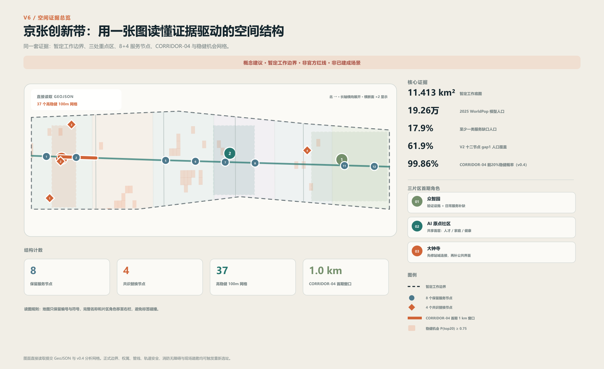
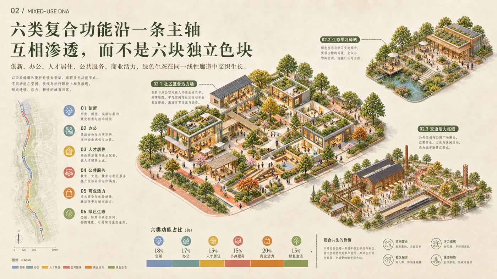
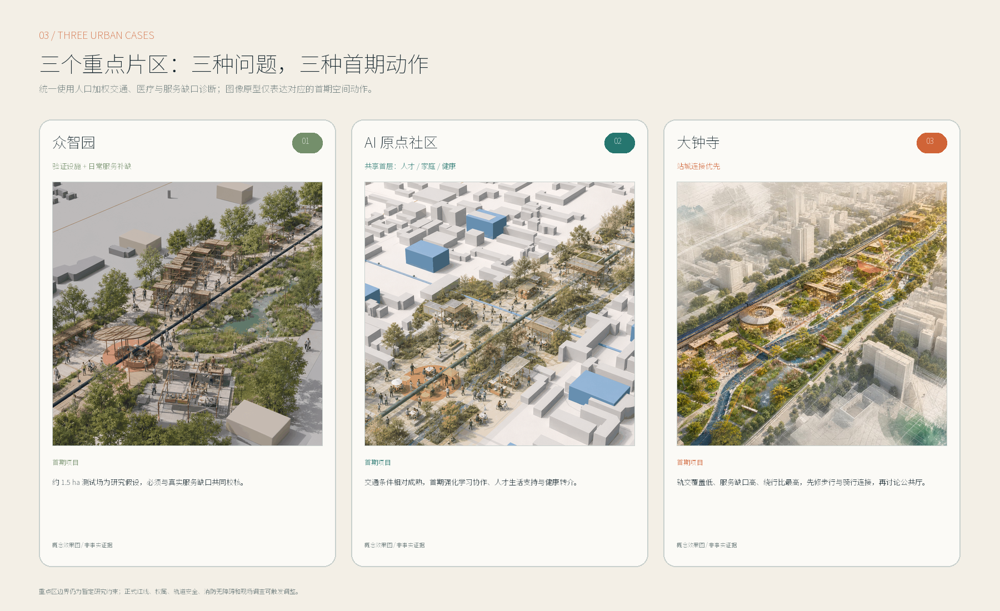
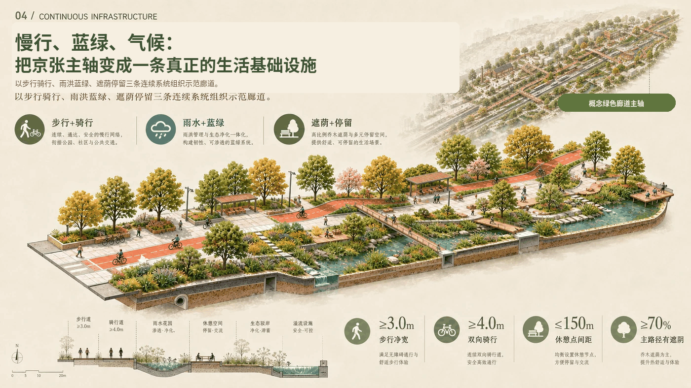
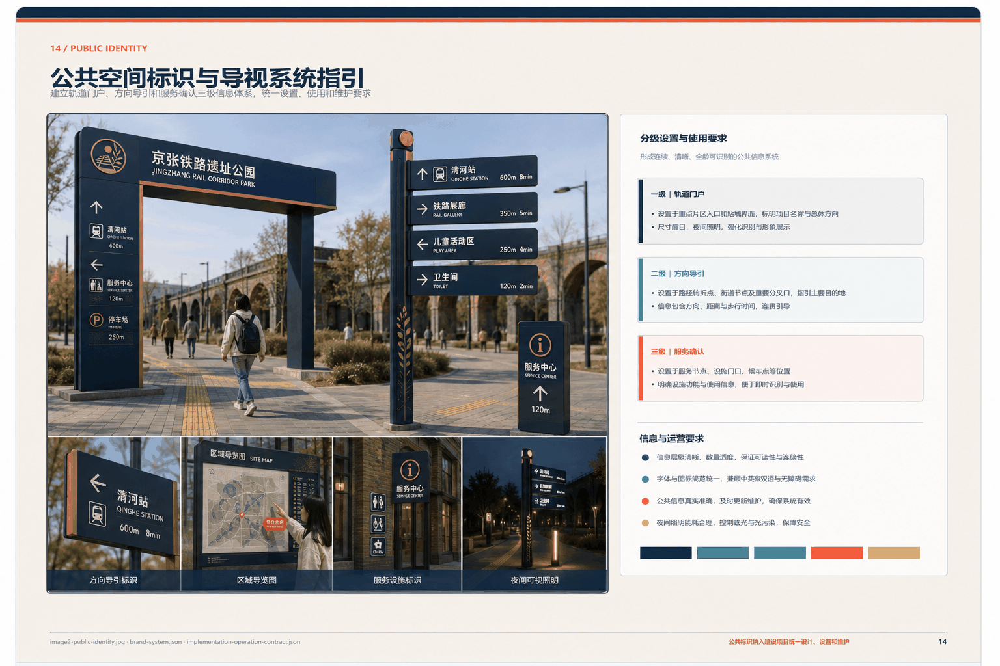
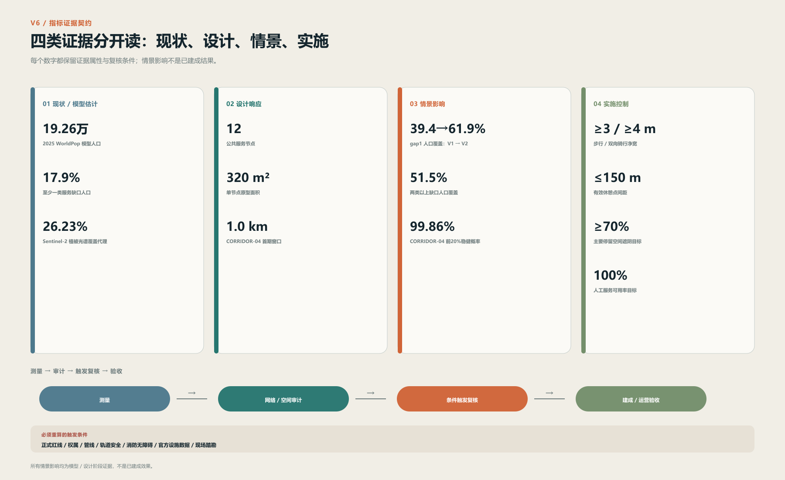

# 百年京张 AI 创新带城市更新与实施方案

京张铁路沿线的更新机会并不均匀。基于约 11.4 平方公里工作底图构建的 1,254 个 100 米研究网格显示，2025 年 WorldPop 模型人口约 19.26 万，其中约 17.9% 至少缺一类教育、医疗或日常服务，4.4% 同时缺两类以上。[metric:v2_modelled_population_2025] [metric:v2_service_gap1_population_ratio] [source:WORLDPOP-GLOBAL2-2025]

现有十二处概念服务节点的 800 米步行网络仅覆盖约 39.4% 的缺口人口。5000 组随机权重敏感性分析进一步识别出跨权重稳定的干预热点，说明近期投资应从平均铺开转向“缺口人口、慢行连接和创新资源叠加处优先”。[metric:v2_existing_12node_gap1_coverage_ratio] [source:OSM-CONTEXT-V2-20260824]

据此，V2 将原有空间设想改造成一条可复核的证据链：大钟寺优先修复站城步行连接并承接首个 1 公里示范段；AI 原点社区继续验证共享首层，但重点转向人才、家庭和健康支持；众智园在研发测试之外补入日常服务。十二处服务节点保留 PUBLIC-01、02、05、06、07、08、11、12 八处中心位置，并从三类优化目标产生的 12 个无序候选中按 120 米空间聚类、55 组四点组合进行多目标稳健选择，形成 PUBLIC-V2-01—04 四处共识替换点。四个新点均为概念方案位置，现场权属、道路红线、管线和正式设施目录若显示冲突或显著改变覆盖判断，应触发重新选址。[metric:v2_consensus_12node_gap1_coverage_ratio] [depth:existing_conditions_diagnosis]

正式边界、土地及房屋权属、轨道安全、地下管线和运营主体仍须专项核清。2026 夏季 Sentinel-2 已完成 5 个独立日期低云影像合成，1,254 个 100 米研究网格中 1,244 个获得有效像素；工作范围面积加权植被光谱覆盖代理约 26.23%，高密植被代理约 7.12%。该指标用于识别缺绿热点，不等同于法定绿地率或树木调查。[metric:v2_observed_green_ratio] [metric:v2_dense_vegetation_ratio] [source:SENTINEL2-L2A-PC-2026-SUMMER]

官方设施空间核验采用“官方机构身份/地址 + 冻结 OSM 坐标”的保守交叉验证：目前高置信核验 36 个学校点、2 个医疗点和 1 个养老点；未匹配机构不视为缺失，也不通过猜测地理编码补点，因此全量可达性仍以 OSM 服务层为主、官方核验层为身份校验。[metric:v2_official_validated_school_point_count] [metric:v2_official_validated_medical_point_count] [metric:v2_official_validated_eldercare_point_count] [source:HAIDIAN-COMPULSORY-SCHOOLS-20250309] [source:HAIDIAN-MEDICAL-PUBLIC-20260708] [source:HAIDIAN-ELDERCARE-INSTITUTIONS-20260708]

## 一、需要优先解决的实施问题

从现状研判看，制约近期实施的因素主要集中在六个方面。方案逐项明确管理判断、近期工作和应当形成的成果，做到问题不回避、条件不虚构、推进有抓手。

| 实施问题 | 管理判断 | 近期工作 | 形成成果 |
|---|---|---|---|
| 正式边界、权属和现状条件尚未齐备 | 现有图层用于方案编制；征地、供地和工程放线统一采用主管部门确认成果 | 衔接主管部门和权利主体，核对红线、产权、租约、在建项目及使用现状 | 统一工作底图、权属清单、现状建筑台账 |
| 京张沿线存在慢行断点和站区衔接问题 | 先选择条件相对成熟的 1 公里路段开展示范，避免全线同步开工 | 完成交通调查、轨道安全协调、管线摸排、树木调查和典型断面比选 | 示范段实施方案、专项意见、施工图任务书 |
| 便民服务设施分散，建设与运营责任容易脱节 | 服务节点与场地、人员、经费和维护责任一并落实 | 确定 3 处首期节点，核实用地、设施接入、人员排班和年度运维经费 | 节点选址表、设施清单、运营责任表 |
| 重点片区更新条件差异较大 | 众智园、AI 原点社区和大钟寺分别编制项目清单，不采用统一开发模式 | 逐片区核对权属、结构消防、客流疏散、产业需求和经营条件 | 三张项目清单、三套前置条件清单 |
| 存量空间使用效率与公共服务供给需要统筹 | 优先采用首层改造、分时共享和可拆装设施，降低前期投入和搬迁影响 | 盘点可利用首层、闲置场地和既有配套，明确保留、修缮和改造方式 | 建筑分类更新清单、共享使用协议要点 |
| 人工智能服务缺少统一申报和运行规则 | 每项服务须明确责任单位、人工办理、数据使用、停止权限和投诉渠道 | 建立服务项目任务书、联合审查表、试运行记录和年度评估表 | 十二项服务清单、八项审查条件、运行台账 |

### 近期实施任务总表

近期工作按照五个时段滚动推进，分别明确重点任务、建议牵头类型、协同事项和阶段成果，做到成熟一项、启动一项。

| 时段 | 重点任务 | 建议牵头类型 | 协同事项 | 阶段成果 |
|---|---|---|---|---|
| 0—3 个月 | 建立项目统筹机制，补齐正式边界、权属、建筑、管线和客流资料 | 区级城市更新工作机制、实施统筹单位 | 规划自然资源、发展改革、住房建设、交通、属地街道、产权单位 | 统一底图、问题清单、权属台账、项目储备表 |
| 2—6 个月 | 完成 1 公里示范段和 3 处首期节点的方案比选、可行性研究及专项协调 | 实施统筹单位、设计单位 | 轨道、交通、消防、市政、园林、无障碍、运营单位 | 实施方案、专项意见、投资测算、运营方案 |
| 4—12 个月 | 启动慢行示范段、公共服务节点样板和公共人工智能服务管理系统 | 建设单位、属地街道、运营单位 | 施工、监理、产权、社区和使用者代表 | 施工图、竣工资料、设施清单、移交记录 |
| 7—24 个月 | 按成熟度滚动实施大钟寺、众智园和 AI 原点社区项目 | 各片区实施主体 | 区级统筹部门、产权单位、园区或站区运营单位 | 分片区项目清单、年度投资计划、开工与验收台账 |
| 建成后持续 | 开展设施巡检、服务质量、资金使用和公众意见评估 | 运营维护单位、项目统筹单位 | 属地街道、专业评估和使用者代表 | 月度工单、季度调度报告、年度项目调整清单 |

## 二、设计依据与资料清单

本方案工作范围按照征集任务书确定，包括 43.6 平方公里统筹研究范围、约 11.4 平方公里总体设计范围，以及众智园、北京 AI 原点社区和大钟寺三处重点片区。规划编制统一采用征集资料包和公告信息形成的工作底图。正式边界纳入统一底图后，完成图层更新、面积复算和指标校核；`SITE_BOUNDARY` 和 `KEY_AREA` 在此之前执行暂定约束属性，不进入征地、供地和工程放线程序。[source:DATA-SRC-OFFICIAL-ANNOUNCEMENT-20260509] [source:SITE-PACKAGE] [assumption:A-BOUNDARY-001]

为确保资料来源清楚、使用口径统一，本方案对规划资料按四类属性实行分类管理：

| 资料属性 | 主要内容 | 本成果中的典型内容 | 编制要求 |
|---|---|---|---|
| 公开事实 | 公告、任务书或正式公开资料直接载明 | 三层范围、三处重点片区名称及公告面积 | 保留来源编号和原始口径 |
| 复算值 | 由提交的空间数据或公开数据计算 | 工作底图面积、概念蓝绿空间比例、气候基线 | 同步说明公式、坐标系和置信度 |
| 规划控制值 | 用于方案比选和后续专项设计 | 步行净宽、骑行净宽、休憩点间距、遮阴比例 | 纳入专项设计和工程验收进一步校核 |
| 深化事项 | 随现状调查和法定程序补充 | 正式红线、权属、容积率、逐栋现状、市政容量 | 纳入下一阶段资料清单和任务分工 |

方案选取 Kendall Square、Paris-Saclay、Kalasatama、Punggol Digital District、Barcelona Superblocks 和 Vienna Gender Mainstreaming 六个案例进行同表比较。比较结果直接转化为六项制度：科研验证与成果转化连续布置，交通节点与共享设施同步建设，数字服务设置人工接管，园区和高校共享场景清单，慢行整治释放公共空间，重点人群走查纳入项目立项。案例中的高租金挤出、低密扩张、封闭数据平台和削弱基本服务等做法不予采用。[source:CASE-VIENNA-GENDER] [source:CASE-PUNGGOL] [source:CASE-KALASATAMA] [source:CASE-BARCELONA-SUPERBLOCK] [source:CASE-KENDALL] [source:CASE-PARIS-SACLAY] [data:visual/assets/ecosystem-policy.json]

## 三、规划目标与公共服务保障要求

本方案坚持以人民为中心，把公共利益和安全稳定放在首要位置。公共空间建设以连续通行、基本便民设施和可持续维护为底线要求，保障儿童、老年人和残障人士能够独立或在合理协助下到达各类服务点；饮水、休憩、导向、咨询等基本服务一律保留人工或实体办理方式；建设单位在设施开放前公布运营主体、服务时段、收费事项、报修渠道和应急安排，接受社会监督。

公共人工智能服务实行清单管理。每项服务申报时，须逐项填报服务对象、建设位置、责任单位、人工办理方式、必要数据、保存期限、故障切换、暂停权限、投诉渠道和评估日期。目前，十二项拟建服务已完成方案阶段的规则核对；项目实施前，仍须由实际责任单位补齐组织、资金、技术和专业审查条件，做到不具备条件不上线。[data:visual/assets/growth-runbook.json] [data:visual/assets/growth-tabletop-evidence.json]

## 四、三层范围工作框架

按照任务书确定的三个层级，分别明确规划重点、主要成果和工作衔接要求，逐级传导、逐级落实。

| 工作层级 | 规划重点 | 主要成果 | 工作衔接要求 |
|---|---|---|---|
| 43.6 km² 统筹研究范围 | 研判产业协作、人才服务、交通联系和设施运维关系 | 五类跨片区协同事项、基础数据清单和年度工作安排 | 将牵头类型、配合单位、经费渠道和阶段成果纳入年度任务 |
| 约 11.4 km² 总体设计范围 | 组织城市结构、复合功能、慢行蓝绿和更新序列 | 一轴三片、两翼协同、十二处公共服务节点和六类方案分区 | 正式边界、控规条件和现状调查纳入统一底图 |
| 368.4 ha 三处重点片区 | 形成可启动的空间设计和项目包 | 众智园验证场、AI 原点共享首层、大钟寺站城公共厅先导界面 | 权属、交通、消防、市政、无障碍和运营协议通过审查 |

三层工作范围分别对应区域协同研究、总体城市设计和重点片区项目化设计，通过统一空间底图、统一指标口径、统一项目清单和统一实施时序逐级传导，保证研究工作不断档、设计成果能落地。[depth:three_level_scope_framework]

## 五、统筹研究范围产业与未来城市研究

统筹研究范围建立两级协同网络。廊道内部设置研发测试、校园社区教育、成果转化、站城服务和蓝绿运维五类接口；外部联动北纬社区、未来科学城、怀柔科学城、北京经济技术开发区和京津冀创新节点。各协作单元执行年度任务书，明确资源交换、责任类型、成果数量、经费科目和退出条件。[data:visual/assets/regional-collaboration-ledger.json] [data:visual/assets/regional-action-program.json]

北纬社区每年开展四次重点人群走查并完成不少于六项服务流程改进；未来科学城每年联合发布两个跨城场景题目；怀柔科学城每年形成两套公共科学课程和一项城市应用验证；北京经济技术开发区每年组织三项设备互测和一次供应链对接；京津冀协同网络每年发布一份跨区域场景目录，推动三项成果异地验证。未经年度项目协议确认的协作事项不列入实施项目和绩效统计。[depth:overall_spatial_structure] [data:visual/assets/regional-action-program.json]

项目启动阶段安排五项专项调查：企业和就业岗位、人才及家庭公共服务、分时通勤和站城接驳、存量建筑和租赁使用、蓝绿及市政设施容量。调查结果形成统一数据表，由责任单位按年度更新，作为调整公共服务规模、项目排序和资金计划的依据。[source:PROCESSED-FACT-PACK] [metric:osm_context_feature_count]

## 六、总体设计范围城市更新与控规深度城市设计

总体设计范围仍以“一轴三片、两翼协同”为骨架，但公共设施布局改由 100 米网格诊断和步行网络审计决定。京张沿线公共空间联系轴承担连续慢行、站城连接、蓝绿设施和文化信息组织；三处重点片区分别处理研发验证与社区服务、共享创新与家庭支持、站城连接与服务补缺；东西两翼继续衔接中关村技术服务资源和小月河公共服务资源。

十二处公共服务节点已形成“8 个审计保留点 + 4 个多目标共识替换点”的 V2 概念几何。三套优化目标产生的 12 个候选先按空间位置去重为 8 个候选簇，再对 55 组四点组合同时比较总人口覆盖、至少一类服务缺口覆盖、两类以上缺口覆盖和机会强度，选择四项中最弱表现仍较高的一组。加入 Sentinel-2 五景绿量并修正并列排名后，v0.4 又完整重跑了三类目标与 55 组四点组合：重新优化方案仅使机会强度人口均值提高 0.009139，却使总人口覆盖下降约 0.50 个百分点、至少一类服务缺口覆盖下降约 0.44 个百分点，两类以上缺口覆盖不变，因此正式 PUBLIC-V2-01—04 保持不变。现方案的 800 米步行网络情景覆盖约 57.6% 模型人口、61.9% 至少一类服务缺口人口和 51.5% 两类以上缺口人口；公平导向单目标方案可把第一项缺口覆盖推至约 74.6%，因此 61.9% 是平衡方案结果，不表述为理论上限。[metric:v2_consensus_12node_population_coverage_ratio] [metric:v2_consensus_12node_gap1_coverage_ratio] [metric:v2_consensus_12node_gap2_coverage_ratio]

经复算，工作底图面积为 11,412,825.386 平方米，用于方案图层校核和规划指标测算；待正式总体设计范围公布后，同步更新面积成果和土地平衡。[data:geometry/site_boundary.geojson#SITE-001] [metric:site_area_sqm]

## 七、用地、建筑规模与拆改留方案

方案按六类更新单元组织总体设计工作底图，即研发测试与安全评估、人才居住与生活配套、教育培训与成果转化、铁路文化与公共服务、数字服务与商业配套、蓝绿空间与市政设施。每类单元分别安排保留改造、功能导入、设施补建和实施条件。需要强调的是，图层代码仅服务于本次方案统计，法定用地性质、开发强度和兼容关系，以控制性详细规划及城市更新实施方案核定为准。[data:geometry/land_use.geojson#LU-01] [standard:MNR-LAND-USE-CLASSIFICATION-GUIDE]

建筑更新坚持留改拆并举、以保留利用提升为主，严格执行“调查—评价—分类—实施”程序。逐栋调查记录产权、用途、层数、结构、消防、历史文化价值和运行状态；综合评价后形成保留、修缮、适应性再利用、局部更新或必要拆除的分类建议，不搞大拆大建。当前建筑图层表达的是重点片区的概念空间颗粒，待逐栋调查完成后形成建筑分类更新清单。近期项目优先采用首层轻改造、闲置时段共享、可拆装设施和公共界面整治，尽量降低对群众生产生活的影响。[data:geometry/buildings.geojson#BLDG-01-01] [depth:retain_renovate_demolish]

容积率、建筑高度、建筑密度、退线、停车配建和市政容量等指标，列入下一阶段重点深化清单，在控制性详细规划、城市更新实施方案和专项论证中统筹确定。[metric:floor_area_ratio] [assumption:A-CONTROLS-001]

## 八、重点区域详细设计

三处重点片区采用统一的编制框架：衔接公告规模和工作底图，逐项明确功能定位、首期项目、空间预算、建筑更新策略、建设条件和运营责任，做到条件清楚、任务具体、责任可查。[depth:three_key_area_detailed_design] [data:geometry/key_areas.geojson]

### （一）众智园创新验证片区

片区公告面积约 192.1 公顷，工作底图复算 192.92 公顷。人口加权诊断显示，片区模型人口约 2.26 万，轨交 10 分钟覆盖约 53.0%，至少缺一类基本服务的人口约占 36.8%，同时缺两类以上约占 15.4%。因此首期任务采用“验证设施 + 日常服务补缺”的双重结构：保留约 1.5 公顷创新验证场作为研究假设，同时把步行可达的健康、家庭和日常服务纳入场地比选条件，避免测试设施与真实社区需求脱节。[depth:three_key_area_detailed_design]

验证场采用可逆构造，具体位置不沿用 V1 先验点位，须与缺口人口热点、现状通行、权属、结构消防和园区运营共同校核。开放前完成场地许可、交通消防、伦理数据、安全评估和独立测试审查；若最终场地无法同时满足测试安全与社区可达性，则缩减集中验证场规模，改为多点分时测试。

### （二）北京 AI 原点社区协同创新片区

片区公告面积约 104.3 公顷，工作底图复算 104.32 公顷。片区模型人口约 1.49 万，轨交 10 分钟覆盖约 86.7%，教育和日常服务 15 分钟覆盖在当前代理数据中均达到 100%，主要可见短板集中在医疗服务，覆盖约 63.5%。因此这里不再以交通补短板为主线，继续验证约 3,000 平方米共享首层，并把人才家庭支持、健康转介、学习协作和开放创新作为首层复合功能。[depth:three_key_area_detailed_design]

共享首层采用分时开放和轻改造方式。实施前核对产权、租约、房屋安全、消防和分时运营协议，并通过实际设施目录复核医疗缺口；若官方设施空间化后显示医疗可达性已被低估，则相应减少健康服务面积，把空间转向开放协作和家庭支持。

### （三）大钟寺站城融合片区

片区公告面积约 72.0 公顷，工作底图复算 72.05 公顷。片区模型人口约 1.80 万，轨交 10 分钟覆盖约 25.3%，医疗 15 分钟覆盖约 49.6%，至少缺一类基本服务的人口约占 53.6%；OSM 步行网络分析得到的平均绕行比约 2.77。三项证据共同指向站城连接和服务可达性，因此首期顺序调整为“打通连接—补齐服务—激活公共界面—再判断扩建规模”。[depth:three_key_area_detailed_design]

沿 ROAD-01 滑动比较的 36 个 1 公里候选窗口中，CORRIDOR-04 在加入 Sentinel-2 五景植被缺口并修正并列排名后的 v0.4 分析中仍排名第 1；5000 组权重下进入前 20% 的概率约 99.86%，进入前 10% 的概率约 98.6%，CORRIDOR-03/05 继续作为线位容差。首期据此研究约 1 公里的连续慢行和站城衔接示范段；原 2.4 公顷“公共厅”保留为后续空间假设，待客流疏散、轨道安全、权属和连接改善成效验证后再决定是否扩大。[metric:v2_pilot_corridor_top20_robust_probability] [metric:v2_pilot_corridor_top10_robust_probability]

## 九、交通、轨道、市政与公共服务设施

交通系统设计充分考虑行动速度较慢、识别能力较弱和携带行李等使用情形，开展全龄友好校核。京张创新发展轴示范段控制连续步行净宽不小于 3.0 米、双向骑行净宽不小于 4.0 米，主要有效休憩点间距不大于 150 米。上述指标为方案阶段控制值，工程设计阶段将结合道路红线、轨道安全、消防、市政管线和现状树木条件，进一步优化断面组合。[source:BEIJING-WALK-CYCLE-STANDARD] [metric:pilot_walk_clear_width_target_m] [metric:rest_point_spacing_target_max_m]

## 十、蓝绿空间、公共空间与城市风貌

蓝绿公共空间体系主要承担遮阴、雨水调蓄、连续休憩和生态教育功能。概念阶段气候基线采用 NASA POWER 2015—2024 日尺度数据：日最高温 P95 为 35.58°C，年均 ≥35°C 日数约 22.3 天，年均降水约 649.1 毫米，太阳辐射均值 4.05 kWh/m²/日。据此，方案设置连续遮阴、雨水花园、安全溢流、冬季向阳避风和可维护设施；下一阶段结合现场监测和专项模型，深化水文、热环境、风环境及能源参数。[source:NASA-POWER-2015-2024] [source:BEIJING-SPONGE-CITY] [depth:blue_green_public_space]

## 十一、公共服务节点建设指引

十二处服务节点不再按 V1 点位整体平移进入实施。V1 十二点的 800 米步行网络联合覆盖约 55.0% 模型人口、39.4% 至少一类服务缺口人口和 28.8% 两类以上缺口人口；其中 PUBLIC-03、04、09、10 对当前测得的缺口人口没有独有贡献，PUBLIC-11 则具有最强的独有缺口覆盖。V2 因此保留 PUBLIC-01、02、05、06、07、08、11、12 的中心位置，并将 PUBLIC-V2-01—04 四个多目标共识点写入概念几何。共识十二点情景的缺口覆盖为 61.9% / 51.5%（至少一类 / 两类以上），明显高于 V1，同时避免为了单一公平目标牺牲过多总体覆盖。[metric:v2_existing_12node_gap1_coverage_ratio] [metric:v2_consensus_12node_gap1_coverage_ratio] [metric:v2_consensus_12node_gap2_coverage_ratio]

十二处节点均统一物化为 20 米×16 米、320 平方米的轻量可拆装模块，总概念占地 3,840 平方米；每处预留 24—36 平方米人工服务空间，并统筹遮阴停留、饮水、充电、纸质地图和服务信息公示。320 平方米是方案阶段模块尺寸，不是已批准建设面积。四个新点仍须通过现有设施重复度、权属与管线、消防无障碍、运营主体和现场踏勘核查；若后续官方设施空间化或正式边界改变判断，应重新运行节点选址而非固守算法中心。[metric:v2_service_node_total_footprint_sqm] [metric:prototype_service_node_area_sqm] [depth:overall_spatial_structure]

## 十二、AI 创新生态、人才画像与 AI+ 场景

### （一）创新生态与要素配置

创新生态按照“需求发布—原型验证—公共共测—转化应用”四级链条运行。每年发布不少于 30 项公共与产业场景需求，在众智园完成不少于 20 项原型测试，在 AI 原点社区和小月河公共体验环完成不少于 12 项多群体共测，在大钟寺和中关村科技服务翼形成不少于 8 项采购、合作或规模应用方案。每一阶段均形成编号、评估结果、整改要求和转化回执。[data:visual/assets/ecosystem-policy.json]

土地、空间、产业、资金、人才、算力、数据和场景实行八类要素清单管理。首期项目优先使用存量建筑和可逆设施；公共共测空间同步配置人工服务；公共环境、试验设施和商业运营分类建账；人才培养设置课程、实训、驻留和岗位四级通道；数据逐项登记来源、用途、保存期限、人工复核和删除责任；场景实行公开征集、联合审查、限期试验、效果评估和退出更新。

### （二）十二项公共人工智能服务

十二项拟建公共服务逐项明确服务对象、建设位置、责任类型、人工办理方式、必要数据、暂停权限、信息公开和年度评估要求。近期先行选择四项组织试运行；其余项目待场地、人员、经费和专业审查条件具备后，分期稳妥实施。

| 编号 | 服务项目与建设位置 | 建设和运行要求 | 人工办理与调整条件 |
|---|---|---|---|
| S01 | 大钟寺人工智能素养互动空间 | 不采集人脸和身份信息 | 现场教育员及实体展项；内容风险未闭环时暂停 |
| S02 | 京张文化多语言导览 | 自愿选择语言，不建立访客画像 | 人工导览和纸质地图同步提供 |
| S03 | AI 原点青年城市议题工作室 | 匿名问题卡 | 教师或社区导师复核后公开 |
| S04 | 学习与职业辅助服务 | 本地短时会话，不进入正式评价 | 教师或咨询师复核，可转人工 |
| S05 | 跨代数字服务站 | 免账户办理，记录最少工单信息 | 志愿者面对面支持并保留纸质流程 |
| S06 | 无障碍路线共绘 | 自愿标注障碍点，仅发布汇总信息 | 无障碍顾问审图，异议可撤回 |
| S07 | 儿童安全对话系统评测 | 合成数据优先 | 监护人和伦理负责人可立即终止 |
| S08 | 低速机器人通行测试 | 仅记录设备运行数据，现场划定测试时段和范围 | 安全员现场值守，保留实体绕行路径 |
| S09 | 隐私保护学习工具测试 | 自愿样本，最少化输入 | 教师复核，与正式教学评价分离 |
| S10 | 端侧离线与能耗测试 | 设备级性能数据 | 工程师签字，未达标设备退出公共环境 |
| S11 | 设施运维实训 | 工单去标识 | 专业人员复核并公开维修手册 |
| S12 | 服务信息公示与公众反馈 | 汇总证据，不进行个人排名 | 独立审议，到期复审并公开处理结果 |

医疗、法律、教育和公共安全相关服务，一律由相应专业人员复核把关。每个服务点公开用途、适用人群、责任单位、收费事项、数据范围、人工办理方式、运行状态、报修投诉渠道和下次评估日期，确保群众看得明白、用得放心、退得出去。[source:PRINCIPLE-UNHABITAT] [data:visual/assets/growth-runbook.json]

## 十三、全龄友好与公共服务保障

重点人群调查覆盖儿童及家庭、老年人及照护者、残障人士、长期居民、租户及小商户、学生及青年人才、通勤者及访客、一线服务人员和周边机构。项目立项前，分别记录各类人群的通行障碍、设施需求、施工影响、租金和经营影响、人工服务需求及参与意见，形成问题清单和整改责任表，逐条回应、逐项销号。

公众参与安排包括方案公示、现场踏勘、重点人群走查、施工告知、意见登记和处理结果反馈。涉及儿童、残障人士、租户及一线维护人员的项目，在可行性研究阶段开展专项走查；建设单位将意见、采纳情况和未采纳理由列入项目档案，做到件件有回音。[data:visual/assets/inclusion-ledger.json] [data:visual/assets/user-cotest-plan.json]

## 十四、公共空间标识与导视系统

“京张共长线 / GROW WITH JINGZHANG”作为公众传播名称使用。政府立项名称、法定地名、建设项目名称和运营单位名称，按管理要求单独标注，二者不混用。标识系统分为片区入口、方向导引和服务确认三级，用于识别线路方向、公共设施、人工服务点、开放时段和报修方式。

标识颜色按照信息职责规范使用：橙色标注责任、警示和停止事项，墨蓝色标注主要方向，绿色标注公园及雨水设施，青色标注便民服务。标识设置与北京市道路交通、无障碍、消防疏散和公共信息导向要求相衔接，由运营单位建立编号、位置、安装日期和维护状态台账，定期检查更新。

### 三条文化叙事与三处主题地标

沿线文化表达实行三条叙事线。第一条“自主工程”讲述 1909 年京张铁路工程、测绘与建设档案；第二条“开放创新”梳理中关村科研创业、开源协作和产业转化；第三条“公共智能”展示人工智能进入城市公共服务后的责任、权利和运行规则。三条叙事分别进入公共课程、空间导视、年度展陈和国际传播文本。[data:visual/assets/culture-landmark-system.json]

建设三处主题地标。北京 AI 原点社区设置“京张原点里程庭”，以 1909、1980、2026 三个时间刻度组织铁路档案、口述史和开放课程；众智园设置“开放模型廊”，公开展示可复现模型、测试方法、失败样例、数据来源和停止记录；大钟寺站城公共厅设置“共治信号塔”，显示十二项服务的开放、限流、人工接管、整改和停止状态。三处地标同时承担通行、休憩、课程、导向和人工服务，不设置脱离日常使用的纯展示构筑物。

建立“京张开放贡献档案”，按公共问题发现、开源工具与数据、安全与无障碍改进、长期维护四类记录贡献。荣誉只授予有公开成果和可复核记录的个人或团队，机构赞助不直接形成荣誉资格。沿线实体铭牌、开放贡献墙、离线数字档案和年度公共报告使用同一编号，每年联合复核一次。

## 十五、更新项目清单、实施政策与分期计划

近期仍组织六个项目包，但启动顺序由 V2 证据调整：P-01 与 P-02 共同承担大钟寺侧 CORRIDOR-04 及其站城连接修复；P-05 以 PUBLIC-V2-01—04 四个共识替换点为概念选址，优先选择通过现场核验的节点实施样板；P-04 延续 AI 原点共享首层；P-03 众智园验证场须把社区服务可达性纳入选址；P-06 提供跨项目运行治理。S、M、L 仅作为项目储备阶段的投资比较级别，分别对应 500 万元以内、500—2,000 万元和 2,000—5,000 万元，具体资金需求在可行性研究、设计概算和财政评审阶段核定。

| 项目 | 主要建设内容 | 建议责任类型 | 实施窗口 | 前置条件 | 资金与运营安排 |
|---|---|---|---:|---|---|
| P-01 京张沿线慢行示范段 | 以 CORRIDOR-04 为主候选、CORRIDOR-03/05 为线位容差，研究约 1 公里连续步行、双向骑行、遮阴休憩及服务停留 | 区级统筹、属地街道、产权单位、交通和园林专业单位 | 6—18 个月 | 正式红线与权属、轨道安全、交通组织、管线、绿量现场核查和消防意见 | 公共空间建设资金统筹；属地和设施运维单位共同承担日常维护 |
| P-02 大钟寺站城衔接先导项目 | 优先消除步行绕行与站区断点，配置人工服务、实体导向和非机动车停放整治；2.4 公顷公共厅暂不作为首期建设前提 | 属地街道、站区运营、交通专业单位、产权单位 | 6—18 个月 | 分时客流与疏散、轨道接口、消防和产权协议 | 站区公共环境改造与运营单位投入分类核算 |
| P-03 众智园研发测试场 | 约 1.5 公顷受控测试研究场地，并同步补入健康、家庭和日常服务接口 | 园区运营、高校企业测试方、属地服务主体、独立安全评估 | 12—24 个月 | 缺口人口与步行可达复核、场地权属、项目准入、数据安全、应急处置和保险安排 | 建设及测试费用由实施主体落实；公众设施和园区设施分别建账 |
| P-04 AI 原点社区共享首层 | 约 3,000 平方米学习协作、人才家庭支持、健康转介、成果发布及共享工作空间 | 产权单位、属地街道、高校社区、专业运营方 | 9—18 个月 | 权属租约、房屋安全、消防、分时开放、收费规则及官方医疗设施复核 | 轻改造与运营费用同步测算，签订共享使用和维护协议 |
| P-05 公共服务节点样板 | 以 PUBLIC-V2-01—04 四个共识替换点为概念候选，每处采用 320 平方米模块；现场核验后选择首批样板，并与 8 个保留节点组成十二点网络 | 属地街道、社区、园林及设施运维单位 | 6—12 个月 | 正式设施目录交叉核验、现有设施重复度、地下管线、权属、设施接入、场地许可、消防和维护责任 | 建设投资与年度运维经费一并明确；若核验改变缺口判断则重新选址，验收后办理资产和运维移交 |
| P-06 公共人工智能服务管理系统 | 项目申报、联合审查、试运行记录、故障工单、公众反馈和年度评估 | 区级统筹、服务运营单位、独立评估单位 | 3—9 个月 | 数据分类、责任单位、应急预案和投诉流程 | 作为管理工具建设，按年度安排系统维护和评估费用 |

项目实施按五个管理节点推进，前一节点要求未落实的，不转入下一节点：

| 阶段 | 工作内容 | 转入下一阶段的要求 |
|---|---|---|
| G0 资料归集 | 汇总边界、权属、现状、来源和补充调查清单 | 资料来源、使用条件和责任单位完成登记 |
| G1 可行研究 | 开展重点人群走查，明确建设边界、维护主体、人工服务和影响缓解措施 | 形成可行性研究要点、协商纪要、运营经费安排和维护责任书 |
| G2 专项审查 | 推进交通、轨道、消防、市政、无障碍、数据和服务项目审查 | 各专项意见落实到设计图纸和实施清单 |
| G3 验收移交 | 完成工程验收、资产清册、人员培训、应急暂停和服务切换演练 | 竣工资料、运营移交、人工服务和应急安排齐备 |
| G4 年度评估 | 综合使用情况、资金支出、故障维护和公众意见 | 形成继续实施、整改、缩减或终止清单 |

实施、验收和异议处理实行岗位分离，防止同一主体既当运动员又当裁判员。每项行动任务明确统筹、实施、审查、协商和知情主体，并公布维护周期和年度调整条件。[data:visual/assets/implementation-operation-contract.json]

## 十六、项目启动前 90 日准备工作

项目正式启动前，安排 90 日准备工作：0—15 日完成边界、权属、现状建筑、使用人群和责任单位清单；16—45 日完成现场踏勘、方案比选、运营测算和专项部门对接；46—75 日开展服务流程、故障切换、施工影响和应急处置演练；76—90 日汇总问题、落实整改责任，并形成是否进入实施阶段的明确意见。

参加单位包括项目统筹、建设和运营单位，交通、轨道、消防、市政、园林、无障碍等专业单位，以及产权人、属地社区和受影响使用者。各阶段形成会议纪要、现场问题单、部门意见、投资与运营测算和整改闭环表，作为项目立项和方案深化的依据。[data:visual/assets/user-cotest-plan.json]

## 十七、年度活动、开发者社区与转化机制

建立四季活动日历。春季举办“京张城市问题季”，发布不少于 30 项场景需求并开展 6 场现场走查；夏季举办“京张开放验证季”，完成不少于 20 项原型测试和 8 类异常情形复测；秋季举办“京张公共智能周”，完成不少于 12 项多群体共测和 4 场开源工作坊；冬季召开“京张年度治理会”，对十二项服务和六个项目包形成继续、整改、缩减或终止清单。[data:visual/assets/annual-operation-program.json]

开发者社区设置公共服务与无障碍、模型安全与评测、端侧设备与机器人、城市数据与运维四个常态工作组。每个项目指定维护人和公共问题负责人，代码、模型、数据和文档分别登记许可；连续两次未完成安全整改的项目停止进入公共场景。年度安排 12 次开放工作日，形成不少于 8 项可复用成果。

企业和人才转化执行五级流程：需求入库、受控验证、公共共测、采购与合作、规模应用。项目只有在权利清晰、成本可承担、运营责任落实且年度绩效达到服务标准后，才能进入跨区复制和规模应用。年度活动经费、场地运维经费和人工服务岗位经费分别编制，活动经费不得挤占基本设施维护和人工服务预算。

## 十八、指标体系、面积复算与合规矩阵

指标体系按证据属性分为现状观测或模型估计、设计响应、情景影响和实施控制四类。WorldPop、OSM 网络和 5000 组权重敏感性结果用于回答“哪里优先”；步行骑行宽度、遮阴和人工服务等仍属于尚未实施的控制目标。现状绿量已以 2026 年 Sentinel-2 五景植被光谱覆盖代理补齐，官方设施也完成 36 个学校、2 个医疗点和 1 个养老点的身份/地址保守空间核验；这些结果仍不替代法定绿地率、完整官方设施底图或现场核验。[metric:v2_observed_green_ratio] [metric:v2_official_validated_school_point_count] [metric:v2_official_validated_medical_point_count] [metric:v2_official_validated_eldercare_point_count] [depth:metrics_recalculation]

| 指标 | 数值或状态 | 属性 | 测量与复核 |
|---|---:|---|---|
| 总体设计工作底图 | 11.4128 km² | 复算值 | EPSG:4548 投影面积；正式值由主管部门确认 |
| 2025 模型人口 | 约 19.26 万 | WorldPop 模型估计 | 339 个 API 支撑块面积分配至 1,254 个 100m 研究网格；不作为普查人口 |
| 至少一类基本服务缺口人口 | 17.9% | 模型人口加权现状指标 | 教育、医疗、日常服务 15 分钟代理覆盖；官方设施空间化后复核 |
| 现有 12 节点缺口人口覆盖 | 39.4% | 网络情景基线 | 800m OSM 步行网络联合覆盖 |
| V2 共识十二节点缺口人口覆盖 | 61.9% | 研究情景影响 | 8 个保留中心 + 4 个多目标共识替换点的 800m 步行网络情景；74.6% 仅作为公平单目标敏感性上界，不作为最终方案效果 |
| CORRIDOR-04 前20%稳健概率 | 99.86% | 研究优先级 | v0.4：5000 组权重，显式加入 Sentinel-2 植被缺口并采用并列值平均秩 |
| 现状卫星植被光谱覆盖代理 | 26.23% | Sentinel-2 五景派生 | 5 个独立日期、SCL 掩膜、中位数合成；1,244/1,254 个 100m 网格有效；不等同法定绿地率 |
| 连续步行净宽 | ≥3.0 m | 建议控制值，未实施 | 建成后按最窄点逐段实测 |
| 双向骑行净宽 | ≥4.0 m | 建议控制值，未实施 | 施工图复核和建成实测 |
| 有效休憩点间距 | ≤150 m | 建议控制值，未实施 | 沿连续无障碍路线测量 |
| 主要停留空间遮阴 | ≥70% | 方案控制目标 | 夏季设计时段日照分析和现场抽测 |
| 人工服务可用率 | 100% | 运营目标，未实施 | 按公布时段开展月度抽测 |
| 完成规则校核的拟建服务 | 12/12 | 方案阶段校核 | 八项申报审查条件逐项核对 |
| 完成异常情形测试 | 8/8 | 方案阶段校核 | 按预设异常情形核对响应机制 |

## 十九、风险、版权与合规说明

风险管理覆盖边界和权属、轨道及交通、个人信息和未成年人、无障碍、运营维护、气候排水、商业置换、素材权利和成果使用等事项。各类事项逐项明确识别条件、处置措施、应急安排和责任主体。项目推进期间，持续保障人工办理路径、基本公共设施和公众意见渠道畅通，确保城市基本服务稳定运行。[data:risk.json]

本成果的图件、PDF 和网页由结构化数据和本地构建程序生成。OpenStreetMap 背景遵循 ODbL 1.0 并保留贡献者署名；NASA POWER 数据用于概念阶段气候分析；Blender、Three.js 和图像生成场景用于空间表达。每个成果文件登记文件路径、作者或生成工具、输入来源、许可、修改方式、署名位置、公开范围和限制条件。原创成果适用 `COMMUNITY-DISPLAY-ONLY` 条款，完整条款随包交付。[source:OSM-CONTEXT-20260808] [source:NASA-POWER-2015-2024] [data:visual/assets/rights-clearance-ledger.json]

下一阶段资料清单包括正式总体及重点区边界、地形测绘、道路和地块红线、逐栋建筑及产权、文物保护、市政管线与容量、消防与交通模型、站点分时客流、现状无障碍障碍点、详细水文土壤及公众参与记录。上述资料纳入统一底图后，复算土地平衡和各项指标，形成可进入规划审查、可行性研究和工程设计阶段的深化成果。

## 二十、任务书交付矩阵

任务书六项专项任务纳入统一交付矩阵。总体统筹、案例与生态、十二项场景、地标与荣誉、文化叙事、年度运营分别对应独立图页、结构化台账、正文专节和年度指标。项目管理单位按交付矩阵检查缺项，未形成文件、图件或责任清单的任务不计为完成。[data:visual/assets/agent-task-delivery-matrix.json]

## 二十一、参考资料

任务依据包括征集公告、面向智能体任务书、仓库资料包、来源登记和处理事实导航。[source:DATA-SRC-OFFICIAL-ANNOUNCEMENT-20260509] [source:DATA-SRC-AGENT-TASKBOOK-20260518] [source:SOURCE-REGISTRY]

城市更新、慢行无障碍和气候适应依据包括《北京市城市更新条例》、北京步行和自行车交通环境规划设计标准、《无障碍环境建设法》、北京海绵城市及韧性城市相关标准。具体适用条款和设计参数，在项目立项及专项设计阶段由具备相应资质的单位核对确认。[source:BEIJING-URBAN-RENEWAL-REGULATION] [source:DATA-SRC-BARRIER-FREE-ENVIRONMENT-LAW] [source:BEIJING-SPONGE-DESIGN-STANDARD]

### 成果资料索引

下列索引用于连接公开资料、规划标准、设计深度、空间图层和指标台账，便于查询原始记录和复算口径。

- 来源与方法：[source:SITE-PACKAGE] [source:SOURCE-REGISTRY] [source:PROCESSED-FACT-PACK] [source:BOUNDARY-SOURCE] [source:KEY-AREA-SOURCE] [source:DATA-SRC-OFFICIAL-ANNOUNCEMENT-20260509] [source:DATA-SRC-AGENT-TASKBOOK-20260518] [source:CASE-PARIS-15M] [source:CASE-VIENNA-GENDER] [source:CASE-PUNGGOL] [source:CASE-KALASATAMA] [source:CASE-BARCELONA-SUPERBLOCK] [source:CASE-KENDALL] [source:CASE-PARIS-SACLAY] [source:PRINCIPLE-UNHABITAT] [source:PRINCIPLE-NEB] [source:PRINCIPLE-AMSTERDAM-CIRCULAR] [source:OSM-CONTEXT-20260808] [source:NASA-POWER-2015-2024] [source:BEIJING-SPONGE-CITY] [source:BEIJING-RESILIENT-CITY] [source:BEIJING-CLIMATE-ADAPTATION] [source:BEIJING-RAIN-GARDEN-STANDARD] [source:BEIJING-URBAN-RENEWAL-REGULATION] [source:BEIJING-WALK-CYCLE-STANDARD] [source:DATA-SRC-BARRIER-FREE-ENVIRONMENT-LAW] [source:BEIJING-SPONGE-DESIGN-STANDARD] [source:BLENDER-52-MODEL] [source:THREEJS-OFFLINE-EXHIBIT] [source:OPENAI-IMAGEGEN-SCENES]
- 既有北京设施目录元数据：[source:BJ-DESIGNATED-MEDICAL-20260813] [source:BJ-ELDERCARE-STATIONS-20260119] [source:BJ-PRIMARY-SCHOOLS-20250729]
- 海淀官方设施核验补充来源：[source:HAIDIAN-ELDERCARE-STATIONS-20250813] [source:HAIDIAN-MEDICAL-PARTNERS-20260730]
- 适用标准：[standard:PROJECT-OFFICIAL-ANNOUNCEMENT] [standard:PROJECT-AGENT-OPEN-CALL-TASKBOOK] [standard:MOHURD-URBAN-DESIGN-MEASURES] [standard:MOHURD-CONTROL-DETAILED-PLANNING] [standard:MNR-LAND-USE-CLASSIFICATION-GUIDE] [standard:MOHURD-ARCH-DESIGN-DEPTH-2016]
- 设计深度：[depth:existing_conditions_diagnosis] [depth:three_level_scope_framework] [depth:overall_spatial_structure] [depth:land_use_layout] [depth:development_intensity_controls] [depth:height_massing_character] [depth:retain_renovate_demolish] [depth:traffic_rail_slow_parking] [depth:municipal_new_infrastructure] [depth:blue_green_public_space] [depth:three_key_area_detailed_design] [depth:renewal_project_list] [depth:phasing_implementation] [depth:metrics_recalculation] [depth:risk_missing_data]
- 空间数据：[data:geometry/site_boundary.geojson] [data:geometry/key_areas.geojson] [data:geometry/land_use.geojson] [data:geometry/buildings.geojson] [data:geometry/roads.geojson] [data:geometry/green_space.geojson] [data:geometry/public_space.geojson] [data:geometry/constraints.geojson] [data:geometry/phasing.geojson]
- 基础与实施指标：[metric:site_area_sqm] [metric:building_footprint_area_sqm] [metric:green_ratio]
- 公共空间与任务规模：[metric:public_space_ratio] [metric:key_area_count] [metric:growth_station_count]
- 场景与试点规模：[metric:ai_scenario_card_count] [metric:pilot_corridor_length_m] [metric:prototype_service_node_area_sqm]
- 共享首层与项目管理：[metric:pilot_shared_ground_floor_area_sqm] [metric:implementation_project_count] [metric:acceptance_kpi_count]
- 旧版背景与气候基线：[metric:osm_context_feature_count] [metric:climate_heat_days_ge_35c_per_year] [metric:climate_annual_precip_mm]
- 气候与慢行控制：[metric:climate_mean_solar_kwh_m2_day] [metric:pilot_walk_clear_width_target_m] [metric:pilot_cycle_width_target_m]
- 公共空间控制：[metric:rest_point_spacing_target_max_m] [metric:shade_coverage_target_ratio] [metric:human_service_availability_target_ratio]
- 协议验证：[metric:protocol_service_pass_count] [metric:negative_test_caught_count]
- V2 轨交覆盖：[metric:v2_rail_5min_population_coverage_ratio] [metric:v2_rail_10min_population_coverage_ratio] [metric:v2_rail_15min_population_coverage_ratio]
- V2 公交与基本服务：[metric:v2_bus_10min_population_coverage_ratio] [metric:v2_education_15min_population_coverage_ratio] [metric:v2_health_15min_population_coverage_ratio]
- V2 日常服务与缺口：[metric:v2_daily_service_15min_population_coverage_ratio] [metric:v2_service_gap2_population_ratio] [metric:v2_zhongzhiyuan_gap2_population_ratio]
- 大钟寺诊断：[metric:v2_dazhongsi_rail10_population_coverage_ratio] [metric:v2_dazhongsi_health15_population_coverage_ratio] [metric:v2_dazhongsi_gap1_population_ratio]
- AI 原点诊断：[metric:v2_ai_origin_rail10_population_coverage_ratio] [metric:v2_ai_origin_health15_population_coverage_ratio]
- 现有十二节点基线：[metric:v2_existing_12node_population_coverage_ratio] [metric:v2_existing_12node_gap2_coverage_ratio]
- 替换目标敏感性：[metric:v2_balanced_12node_gap1_coverage_ratio] [metric:v2_equity_12node_gap1_coverage_ratio]
- OSM 可复算底座：[metric:v2_osm_walk_way_count] [metric:v2_osm_poi_count]
- 公共绿地代理：[metric:v2_osm_park_garden_direct_overlap_ratio] [metric:v2_osm_park_garden_500m_population_share]
- 稳健机会识别：[metric:v2_robust_opportunity_v02_cell_count_top20_p75] [metric:v2_robust_opportunity_v04_cell_count_top20_p75]
- Sentinel-2 现状绿量：[metric:v2_sentinel_scene_count] [metric:v2_sentinel_valid_grid_count] [metric:v2_spectral_built_proxy_ratio]
