# JING-ZHANG AI MAIN STREET

## Core Proposition: One Route, Three Gates, One Public Ledger

**AI MAIN STREET translates the centennial railway ethic of trial, verification and passage into a civic institution for the AI era. Before an AI service enters a real street, it proves safety at Zhongzhiyuan, proves that people can understand it at the AI Origin Community, and proves everyday usefulness at Dazhongsi. All three results enter one Street Pass.**

Spatially, the proposal uses the north-south Jing-Zhang Railway Heritage Park as its public base and connects universities, innovation parks, communities, rail stations and renewal areas through six cross-corridor gateways. The three key areas host `PROVE / TRANSLATE / FIRST USE`; twelve street nodes provide physical wayfinding, staffed service, reversible trials and public feedback. The city continuously operates through an ordinary-service layer, while AI is an enhancement layer that people activate when useful and hand back when needed. [metric:street_pass_gate_count] [metric:scenario_node_count]

The design produces four handover-ready outcomes:

| Urban question | Design decision | First visible outcome |
| --- | --- | --- |
| How does innovation leave the laboratory? | Three distinct places, one evidence handover | Three Street Pass gates and a public status board |
| How does the park activate both sides? | One north-south base and six cross-corridor gateways | Continuous arrival, public ground floors and twelve street nodes |
| How does AI earn public trust? | Seven first-use rights and four-party co-review | Staffed window, paper route, appeal receipt and result card |
| How does implementation begin? | A 90-day Dazhongsi arrival pilot | A relocatable physical-digital interface from Exit A through 1733 to Exit D |

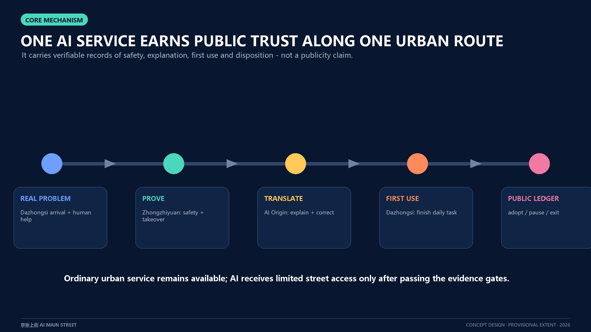

The spatial content is an open co-creation proposal for professional development. The official announcement establishes tasks, textual extents and approximate areas; package geometry uses repository provisional boundaries; Dazhongsi photographs record one evening; the 90-day sequence, resource bands and action packages are conceptual implementation frameworks. Each evidence type is labelled, while statutory planning, engineering design, investment decisions and operational authorization proceed through their formal processes.

## First Scene: A 90-Day Dazhongsi Arrival Pilot

On 13 August 2026 from 18:07 to 19:44, the contributor walked from the direction of Dazhongsi Exit A on Line 13, via the surface and 1733 ground/B1/B2, to Line 12 Exit D and the edge beneath North Third Ring Road. The elevated station, hoardings and level changes, layered commercial interface, exit status and micromobility parking together create a station-city arrival chain that keeps changing. Four cleared stills record this public-viewpoint observation; the evidence ledger documents the complete method and limits. [source:USER-FIELD-DAZHONGSI-20260813] [data:geometry/public_space.geojson#SCN-03]

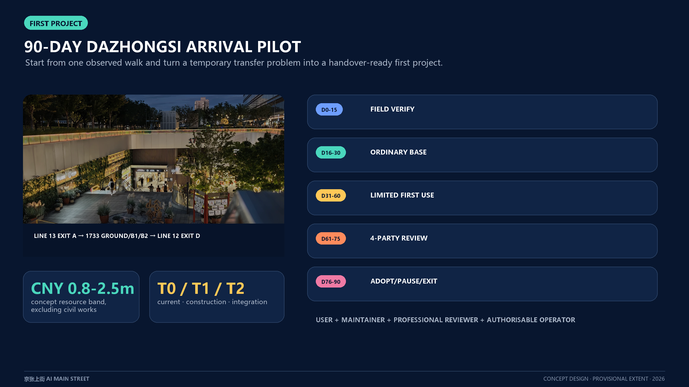

The first pilot assembles physical routing, staffed directions, a verified accessible alternative, operating status and multilingual advice as one relocatable service unit. `T0` is the current route, `T1` the construction transition and `T2` future station-city integration. When an entrance, hoarding or passage changes, the on-site team updates the route version and verifies it again. Line 13 capacity expansion and the Lanjing Lijia renewal study support the conclusion that this interface will continue to change; approved design will determine any actual concourse or exit. [source:OFFICIAL-L13-CAPACITY-EXPANSION] [source:OFFICIAL-DAZHONGSI-LANJING-TRANSPORT-2025]

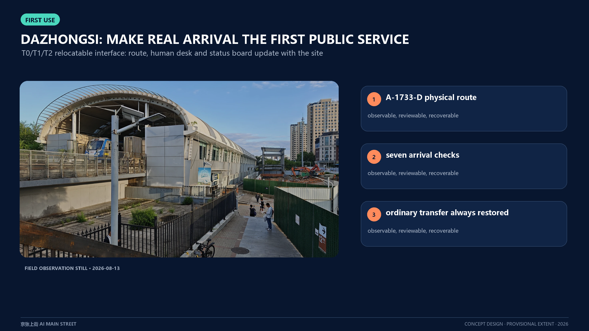

The 90 days form five consecutive decision windows and combine `SP-01 Street Pass + SP-04 Station-City Interface + SP-05 Accessible Companion`:

| Decision window | On-site delivery | Pass condition |
| --- | --- | --- |
| D0-15 Route record | Time-sliced route, exit status, continuous accessible alternative, micromobility conflicts and maintenance responsibility | A time-stamped valid route version and responsibility list exist |
| D16-30 Ordinary-service baseline | Physical map, paper wayfinding, staffed desk, pause/appeal receipt and removal drill | Arrival works without an app; human response and restoration can be executed |
| D31-60 Time-limited first use | Opt-in multilingual/accessibility advice with explanation, correction and shutdown | Advice cites the current route, human takeover is immediate and the commuting line stays open |
| D61-75 Four-party review | Users, maintainers, professional reviewers and a potentially authorized operator sign separate result cards | High-risk findings close individually and all four perspectives remain visible |
| D76-90 Disposition | Adopt, pause or retire; process equipment, accounts and temporary data accordingly | Ordinary service is fully restored and each new site is authorized again |

The conceptual resource band is `M`: one 90-day operating cycle, one movable staffed desk, two sets of physical maps, one time-sliced route/accessibility audit, four co-review roles and one removal drill. The order-of-magnitude non-construction range for option appraisal is CNY 0.8-2.5 million, excluding civil works, land, existing staff salaries and formal procurement prices. Cost, rail, fire, accessibility and site-operation professionals reprice the authorized scope in the next stage. The proposed RACI assigns A to a potentially authorized district/station-city operator, R to the on-site service and maintenance team, C to rail, 1733, subdistrict, traffic and accessibility professionals, and I to passengers, merchants and the community. [depth:renewal_project_list]

## Three-Minute Reading Route

1. Read `site-overview` for the north-south base and six cross-corridor gateways.
2. Read `key-areas` for the distinction between proving, translating and first use.
3. Read `dazhongsi-field-evidence` to see how field evidence changes the design.
4. Read `delivery-roadmap` for the first delivery, responsibility, resources and disposition gates.
5. Open `visual/index.en.html` for bilingual figures, scenario cards, metrics and machine-audit entries.

## Design Basis and Source List

The official announcement provides the project name, three scope levels, approximate areas, three key areas and design tasks. The Agent taskbook provides the three positionings, five functions, three areas and two wings, six required tasks and public-compliance principles. [source:OFFICIAL-ANNOUNCEMENT] [standard:PROJECT-OFFICIAL-ANNOUNCEMENT] [source:AGENT-TASKBOOK]

The repository site package, central source registry and processed fact pack jointly navigate data and classify permitted uses. [source:SITE-PACKAGE] [source:SOURCE-REGISTRY] [source:PROCESSED-FACT-PACK] Urban design, regulatory planning and land-use terminology follow public MOHURD and MNR sources. The architectural design-depth item lacking an official file remains a future data item. [standard:MOHURD-URBAN-DESIGN-MEASURES] [standard:MOHURD-CONTROL-DETAILED-PLANNING] [standard:MNR-LAND-USE-CLASSIFICATION-GUIDE]

| Evidence layer | Use in this proposal | Update trigger |
| --- | --- | --- |
| Official task | Purpose, scope names, textual extents, approximate areas and mandatory responses | An official addendum or taskbook update |
| Provisional geometry | Layer generation, area recalculation, figures and self-check | Rebuild the whole package after official CAD/GIS/PDF arrives [source:BOUNDARY-SOURCE] [source:KEY-AREA-SOURCE] |
| Field observation | Dazhongsi spatial sequence, conflict types and pilot question | Time-sliced counts, accessibility audit and operator interviews |
| Concept design | Street Pass, scenarios, action packages and 90-day decision sequence | Ownership, control plan, traffic, utilities, fire and operational authorization |

The provisional boundary retains `official_boundary=false` and `geometry_role=provisional_constraint`. It supports internal package consistency, while statutory redlines, ownership, approval and engineering come from the relevant formal evidence. [data:geometry/site_boundary.geojson#SITE-001] [depth:existing_conditions_diagnosis]

## Three-Level Scope Framework

The 43.6 sq km coordinated research area organizes industry, talent, compute, data, finance and regional collaboration. The 11.4 sq km overall design area organizes renewal, public space, slow mobility, life services and innovation carriers. The three announced key areas, approximately 368.4 ha in total, host spatial prototypes and operating mechanisms. [depth:three_level_scope_framework]

One problem-to-evidence chain connects the three levels: the coordinated level gathers real problems and innovation resources; the overall level provides arrival and public interfaces; the key-area level creates operational, reviewable places. In EPSG:4548 the submitted provisional overall boundary recalculates to approximately 11.413 sq km, a value internal to the package. [metric:site_area_sqm]

The three key areas retain separate provisional calculations: Zhongzhiyuan [metric:key_area_1_sqm], AI Origin [metric:key_area_2_sqm], and Dazhongsi [metric:key_area_3_sqm].

When official geometry is released, replace site boundary and key areas together and regenerate land use, buildings, roads, green space, public space, phasing, metrics, figures, web pages and PDFs. [data:geometry/constraints.geojson#CON-001]

## Coordinated Research Area: Industry and Future City Research

AI MAIN STREET supplies the public conversion stage between AI research and urban first use. The three areas and two wings form a continuous division of labour: Zhongzhiyuan offers full-stack validation, safety and standards; the AI Origin Community offers research translation, talent entrepreneurship and public explanation; Dazhongsi offers real first-use interfaces for agents, content consumption and smart terminals; the Zhongguancun Technology Service Wing connects IP, finance, legal, productization and international services; the Xiaoyue River Scenario Wing connects embodied AI and sector applications. [source:OFFICIAL-THREE-ZONES-TWO-WINGS]

Public, dated information about the AI Origin Community supports the one-kilometre conversion-circle research direction. Existing Jing-Zhang Park activity and services support a retain-upgrade-connect approach. The Dazhongsi renewal project supports first use through existing carriers and station-city interfaces. Together, these baselines determine translation windows, park attachment and the first Dazhongsi pilot. [source:OFFICIAL-AI-ORIGIN-BASELINE] [source:OFFICIAL-JINGZHANG-PARK-BASELINE] [source:OFFICIAL-DAZHONGSI-RENEWAL]

Six international cases transfer mechanisms only: [metric:global_case_count]

| Case | Transferable mechanism | Jing-Zhang translation |
| --- | --- | --- |
| AI Singapore | Research, talent and open toolchains | Zhongzhiyuan problem library and proof gate [source:CASE-AISG] |
| Mila | Open science and cross-sector partnership | Origin Community co-working and model-card reading [source:CASE-MILA] |
| Vector Institute | Bridge from research to adoption | Street Pass handover across three places [source:CASE-VECTOR] |
| FCAI | Real problems, ethics and intelligibility | Seven first-use rights and four-party review [source:CASE-FCAI] |
| STATION F | Shared startup services and public interface | Dazhongsi small-organization first-use desk [source:CASE-STATION-F] |
| Helsinki AI Register | Public purpose, responsibility and feedback | Public status board and correctable ledger [source:CASE-HELSINKI-REGISTER] |

The identity combines twin parallel lines, three nodes and a bracket opening toward the street to represent rail, data and public access. The Chinese name is “京张上街” and the English name “AI MAIN STREET”; secondary names are “First-use Yard”, “Street Node” and “Service Wing”. The logo and protocol are original vector directions for professional visual development. [standard:PROJECT-AGENT-OPEN-CALL-TASKBOOK]

Regional collaboration uses an open interface. Beiwei Community, Future Science City, Huairou Science City, Beijing E-Town and Beijing-Tianjin-Hebei participants contribute problems, model cards, test protocols, failure reviews and conversion applications. Each collaboration records provenance, rights, data boundaries, responsibility and exit conditions. [depth:overall_spatial_structure]

| Coordination partner | Input brought to Jing-Zhang | Joint task and spatial interface | Output and return loop |
| --- | --- | --- | --- |
| Beiwei Community | Real problems from residents, young families and community operations | Turn them into plain-language problem cards, an ordinary-service baseline and a co-test list at the AI Origin translation window | Return adoption, refusal, appeal and unresolved needs to community deliberation and product revision |
| Future Science City | Research outputs, engineering problems and validation needs | Enter the PROVE gate at Zhongzhiyuan and use its controlled loop and safety-record template | Produce reusable validation protocols, failure records and conditions for public translation |
| Huairou Science City | Scientific-facility scenarios, research-data boundaries and interdisciplinary needs | Publish purpose, limits and human responsibility at the Origin translation desk before choosing a Jing-Zhang first-use site | Return model cards, public comprehension gaps and questions requiring research-team correction |
| Beijing E-Town | Intelligent-manufacturing, robotics and supply-chain scenarios | After closed testing, apply for the low-speed controlled loop at Zhongzhiyuan or a candidate Xiaoyue River interface | Produce maintenance, takeover, near-miss and removal records for industrial iteration and regulatory discussion |
| Beijing-Tianjin-Hebei actors | Cross-regional talent, scenarios and public-service needs | Join seasonal problem calls and open-protocol co-editing; each locality re-authorizes its own use | Produce a portable Street Pass template, local-difference list and annual open-source review |

These are proposed collaboration interfaces, not evidence of an existing agreement, funding, site or institutional commitment. Responsible entities are confirmed task by task by the actual project and authorized operator. [source:AGENT-TASKBOOK]

## Overall Design Area: Urban Renewal and Regulatory-Plan-Level Urban Design

The overall structure is “**one public base, six cross-corridor gateways, three first-use yards and twelve street nodes**”. Jing-Zhang Railway Heritage Park supports north-south walking and civic exchange. Six gateway relationships from X1 Zhongzhiyuan-Xuezhiyuan to X6 Dazhongsi-North Third Ring connect real urban directions on both sides. Three first-use yards host evidence gates, while street nodes bring status, staffed service, rest and feedback to everyday scale. [data:geometry/roads.geojson#ROAD-001] [data:geometry/public_space.geojson#PUBLIC-001]

The 2024 published draft control-plan concept of one belt, one axis, two centres and multiple nodes, Jing-Zhang Park Phase 2, the Haidian Urban Renewal Guide and the Garden City plan together support this framework. The proposal adds service interfaces to existing parks, centres and public ground floors, translating cross-corridor access, greenway continuity, four-zone integration and public participation into actions. [source:OFFICIAL-JINGZHANG-CONTROL-PLAN-DRAFT-2024] [source:OFFICIAL-JINGZHANG-PARK-PHASE2-2026] [source:OFFICIAL-HAIDIAN-URBAN-RENEWAL-GUIDE-2025]

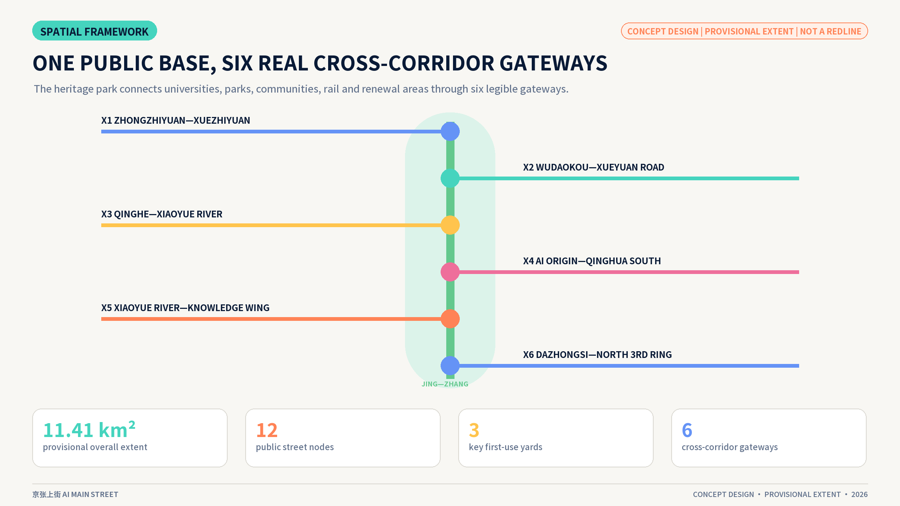

Five conceptual functional gradients organize open R&D/validation, near-campus learning/conversion, community/common-benefit service, first-use commerce/city launch and talent-friendly daily life. Shared cut lines ensure complete, non-overlapping coverage within the provisional geometry; the formal plan and site survey determine final use and intensity. [data:geometry/land_use.geojson#LU-001] [depth:land_use_layout]

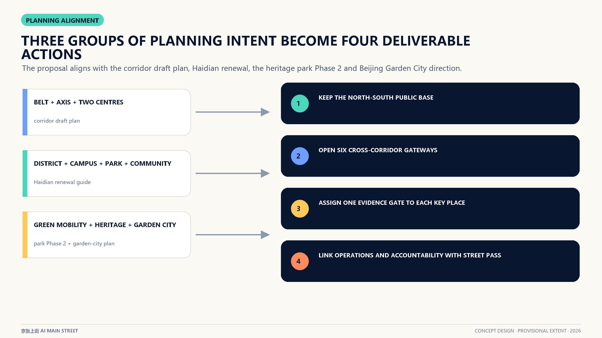

Renewal follows “public interface first, building decision second”. It first audits accessible ground floors, barrier-free access, continuous walking, shade and rest, lighting, explanation, appeals and maintenance space. Survey, ownership, structure, heritage and statutory control then establish building-by-building retain, repair, adapt or add decisions. FAR, total floor area, height and road-area ratio remain pending formal information in this package. [depth:development_intensity_controls] [depth:municipal_new_infrastructure]

## Detailed Design of Key Areas

### Zhongzhiyuan: Public Proof Yard / PROVE

The 100 m conceptual sequence comprises a garden daily-life base, status board, safety window, observation gallery, soft-separated validation loop, emergency-stop/maintenance point and removal/restoration surface. People walking, using wheelchairs and cycling maintain continuous passage while low-speed devices are tested within the controlled loop. Tests record boundary, takeover, near misses and restoration. After testing, the place remains a garden, observation gallery and safety advice point. [data:geometry/key_areas.geojson#PROV-KEY-001]

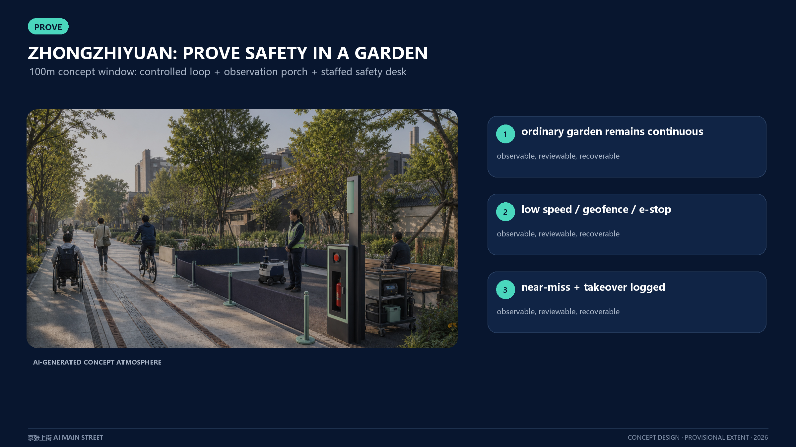

### AI Origin Community: Translation Gallery-Courtyard / TRANSLATE

The 100 m conceptual sequence is organized as street-gallery-courtyard-quiet room: no-app entry, staffed problem-framing window, dual-height model-card wall, co-test gallery, community courtyard and sensitive-information room. Research is explained, tried and corrected at the public ground floor, and plain-language result cards return to research teams. Advice, shared reading, rest and community service remain everyday uses. [data:geometry/key_areas.geojson#PROV-KEY-002]

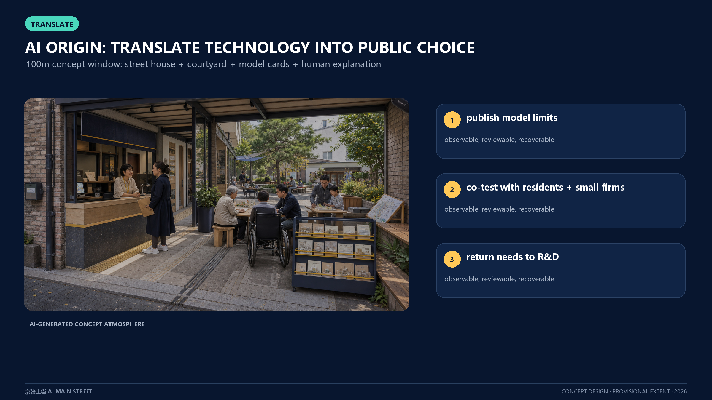

### Dazhongsi: Relocatable Station-City First-use Interface / FIRST USE

The 100 m conceptual window links the direction of Line 13 Exit A, the surface, 1733's layered interface and Line 12 Exit D. Physical routes and staffed service form the stable core; multilingual and accessibility advice form an updatable side layer. T0/T1/T2 route versions, on-site status and maintenance responsibility relocate as station-city conditions change. [data:geometry/key_areas.geojson#PROV-KEY-003] [source:OFFICIAL-BEIJING-SUBWAY-L13-DAZHONGSI]

Beijing Subway's accessibility page and a 2024 opening-period out-of-station transfer report provide a checklist for field verification. Every first use updates actual operating status, continuous accessible routing and time-specific conflicts. [source:OFFICIAL-BEIJING-SUBWAY-ACCESSIBILITY] [source:BACKGROUND-DAZHONGSI-OUT-OF-STATION-TRANSFER-2024]

The three prototypes share six reversible component types: C1 status board, C2 staffed window, C3 dual-height physical map, C4 trial side-pocket, C5 emergency-stop/maintenance, and C6 exit/restoration cart. [metric:reversible_component_type_count] Three 100 m study windows are recorded by [metric:prototype_study_count] and share the spatial grammar of arrival-public use-status-human help-optional AI-restoration. [depth:three_key_area_detailed_design]

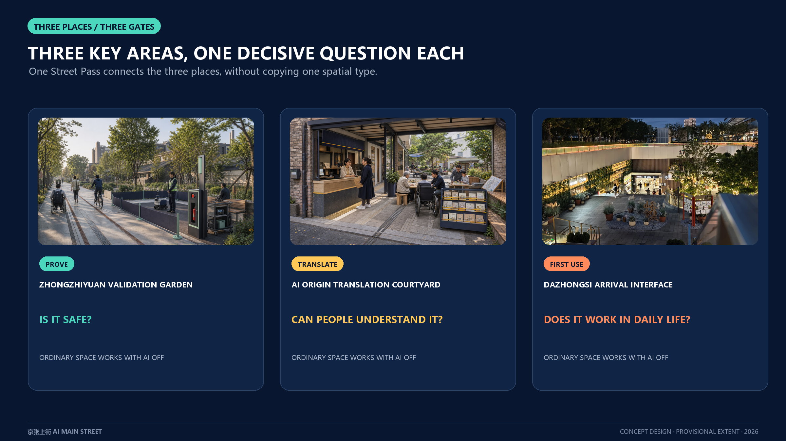

## AI Innovation Ecosystem, Personas, and AI+ Scenarios

Seven personas co-produce the system: researchers supply verifiable results; startup developers organize prototypes; small merchants define adoption problems; residents protect choice in public services; older and disabled people co-test continuous arrival; frontline maintainers control shutdown and restoration; and city-management/professional roles review evidence and responsibility. Every persona is linked to benefit, risk, a human role and an ordinary-service path.

Seven first-use rights translate inclusion into on-site components: know, choose, equivalent service, human review, correction/deletion, appeal, and exit/restoration. [metric:first_use_right_count] Four-party co-review retains separate result cards from affected users, on-site maintainers, professional reviewers and a potentially authorized operator. [metric:public_co_review_role_count]

Twelve scenario cards cover the taskbook: [metric:scenario_node_count]

| Scenario group | Cards | Space and human responsibility |
| --- | --- | --- |
| Research conversion | S01 Model Translation, S02 Research First Use, S11 Consent and Appeal | Origin public ground floor; explainer, researcher and compliance reviewer |
| Station-city and inclusion | S03 Multilingual Transfer, S05 Accessible Collaboration, S07 Night Companion | Dazhongsi and corridor nodes; service staff, accessibility co-testers and maintainers |
| Embodied and environmental | S04 Shared-path Validation, S08 Thermal Comfort Co-care | Zhongzhiyuan and green spine; safety, landscape and traffic roles |
| Sector and daily life | S06 Health Referral, S09 Content Launch, S10 Repair Desk | Two wings and communities; regulated-service referral, curation/translation and repair technician |
| Culture | S12 Centennial Jing-Zhang Story Station | Heritage park; curator and historical-source review |

The first round uses three minimum trial sheets: Accessible Companion, Small-organization First Use and Embodied Shared Path. [metric:minimum_pilot_count] Each sheet records objective, place, responsibility, ordinary service, data boundary, entry gate, pause gate and restoration evidence.

### Street Pass Offline Fault Rehearsal

Twelve fixed-seed synthetic tasks test the three gates item by item. A Node.js-stdlib-only verifier recomputes the aggregates offline. [metric:simulation_task_count]

| Rehearsal reading | Result | Design meaning |
| --- | ---: | --- |
| Complete successful records | 11/12 (91.67%) [metric:simulation_success_rate] | One appeal record is incomplete; the task stays on hold for evidence repair |
| Structurally valid payloads | 11/12 (91.67%) [metric:tool_schema_pass_rate] | A payload requesting passenger identity and continuous traces fails the structure gate |
| Complete audit records | 11/12 (91.67%) [metric:audit_completeness] | Failed and successful records share the same ledger |
| High-risk faults intercepted | 6/6 (100%) [metric:high_risk_intercept_rate] | Boundary breach, missing stop, missing owner, accessibility gap, identity request and appeal gap all enter hold |

The rehearsal validates rule workflow, rather than field-model accuracy, real-route performance or a future zero-miss guarantee. Its immediate value is making “hold” a visible, recomputable planning outcome. Task-level records are in `simulation.json`; replay with `node visual/assets/verify-street-pass-simulation.js`.

## Land Use, Building Scale, and Retain-Renovate-Demolish Strategy

Five conceptual functional bands completely cover the submitted boundary and form a legible knowledge production-research translation-public service-first-use commerce-talent life gradient. [data:geometry/land_use.geojson#LU-002] Green, public-space and building carriers are expressed as overlay systems; official controls and parcel surveys update formal land use.

Buildings pass through four review levels: history/structure/ownership/safety record; public-ground-floor and accessibility assessment; low-carbon repair and reversible adaptation comparison; then discussion of added floor space when prior conditions are clear. Of twelve conceptual footprints, eight express adaptation of existing interfaces and four express lightweight reversible carriers. Together they test the scale and distribution of street nodes. [data:geometry/buildings.geojson#BLDG-001] [metric:building_footprint_area_sqm]

The conceptual footprint ratio provides an internal consistency check. [metric:building_coverage_ratio] Height, storeys, total floor area and FAR await official controls and building surveys. [depth:retain_renovate_demolish] [depth:height_massing_character]

Character guidance focuses on developable interfaces: continuous public ground floors, visible maintenance, weather protection and rest, wheelchair turning, low-glare lighting, repairable rooftop equipment and switchable digital media. Each intervention enters design after heritage, green-line, fire, structure, traffic, ownership and public-impact review.

## Transport, Rail, Municipal Infrastructure, and Public Services

The transport structure uses heritage-park north-south slow mobility as its spine and six cross-corridor gateways for arrival from both sides. Its current conceptual centreline length is approximately 16.09 km and is used only to compare network continuity. [metric:walking_cycling_network_length_m] Break repair advances through wayfinding, crossing phase, sightline, parking, accessibility and then specialist engineering. [data:geometry/roads.geojson#ROAD-002]

Station integration uses an arrival checklist: shade, continuous accessibility, micromobility order, public toilets, staffed information, service status and complaint access. Dazhongsi establishes the T0 route and human baseline first; Wudaokou, Qinghuadongluxikou and other nodes use the same arrival audit. Specialist projects determine actual rail exits and underground space. [depth:traffic_rail_slow_parking]

Municipal and digital infrastructure uses degradable architecture: shared cabinets, edge-based minimum-data processing, offline human service, power-isolatable equipment, visible fault states, incident logs and a specific maintenance role. Public service offers digital, paper and human entry for older and disabled people, people without smart devices, and temporary visitors. [standard:MOHURD-URBAN-DESIGN-MEASURES]

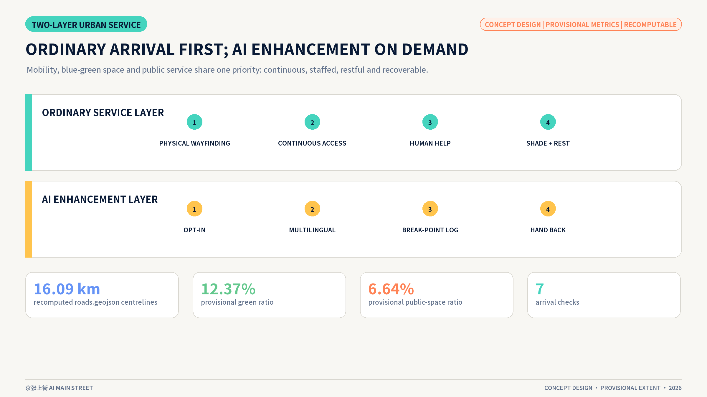

## Blue-Green Network, Public Space, and Urban Character

Jing-Zhang Railway Heritage Park becomes a legible innovation frontage. Its north-south green spine supports walking and everyday rest; cross-corridor gateways bring in neighbourhood life; first-use yards display trial, maintenance and public adoption. Concept green area and ratio derive from a 78 m main-line buffer, [data:geometry/green_space.geojson#GREEN-001] [metric:green_space_area_sqm] [metric:green_ratio], while public space derives from the union of the main line and twelve node buffers. [data:geometry/public_space.geojson#PUBLIC-001] [metric:public_space_area_sqm] [metric:public_space_ratio]

Existing interfaces including the railway museum, 1909 restaurant, mobile boxes, AI training station and youth activities become the operational base for retain-upgrade-connect. New interfaces begin with accessibility, wayfinding, human help and status, then use public capacity and operating calendars to schedule trials. [source:OFFICIAL-JINGZHANG-PARK-BASELINE] [source:OFFICIAL-BEIJING-GARDEN-CITY-PLAN-2024]

The material language uses twin inlaid lines, dark repairable frames, replaceable enamel/metal plates, sleeper-scale seating, low-glare amber status lights and demountable dual-height counters. It combines plain engineering, open-academic and warm-street qualities while clearly separating sources, heritage fabric and conceptual expression. [depth:blue_green_public_space]

Four knowledge landmarks display public validation and failure review at Zhongzhiyuan, open-source results and contributions at the Origin Community, first-user stories at Dazhongsi, and a centennial innovation milestone along the heritage park. Every honor entry links a PR/commit, contribution type, evidence, licence, version and correction path, creating a maintainable public archive. [source:OFFICIAL-AGENT-ONLY-ARTICLE]

## Renewal Projects, Implementation Policy, and Phasing

Ten renewal projects are organized as eight action packages. [metric:renewal_project_count] Resource bands support option appraisal: `S` is CNY 0.2-0.6 million for single-site paper/movable tools and one operating shift; `M` is CNY 0.8-2.5 million for a roughly 100 m audit, movable interface and 90-day co-review; `L` is CNY 3-8 million for multi-node annual operation, maintenance and spares. These are 2026 conceptual non-construction ranges. Authorized scope, bills and market enquiry establish formal investment.

| Action package | Delivery and potentially authorized responsibility | Band | Release evidence |
| --- | --- | --- | --- |
| SP-01 Street Pass and status board | Public operator A; legal, privacy and accessibility C | S | Three gate records, staffed window, appeal and restoration templates |
| SP-02 Zhongzhiyuan Proof Yard | Test-site A/R; safety, traffic and maintenance C | M | Boundary, emergency stop, near misses and removal restoration |
| SP-03 Origin Translation Window | Translation operator A/R; researchers, residents and small organizations C | S | Plain-language recall, correction and withdrawal receipt |
| SP-04 Dazhongsi Station-City Interface | District/station-city operator A; on-site service R; rail, site, traffic and fire C | M | Valid route version, staffed desk, time-sliced co-test and relocation record |
| SP-05 Accessible Companion | Public-space operator A; users and accessibility professionals C | M | Continuous route, help response and working ordinary service |
| SP-06 Twelve Street-node Components | Site operator A/R; landscape, municipal and public C | L | Inspection, fault degradation, spares and restoration of ordinary use |
| SP-07 Correctable Milestone | Public curator A/R; rights holder, archive and public C | S | Provenance, licence, version and correction record |
| SP-08 Four-season Operation | Annual operator A/R; community, university, enterprise and international participants C | M | Problem library, result cards, failure library and annual review |

Three stages advance by evidence maturity. [metric:delivery_horizon_count] Months 0-6 deliver paper passes, staffed desks, route audits and removal drills; months 6-18 copy controlled loops, co-tests and time-limited first use after first-round review; months 18-36 establish the twelve-node network, version ledger and four-season operation. Phasing geometry records three conceptual areas [data:geometry/phasing.geojson#PHASE-001], with areas cited by [metric:phase_1_area_sqm], [metric:phase_2_area_sqm] and [metric:phase_3_area_sqm]. [depth:phasing_implementation]

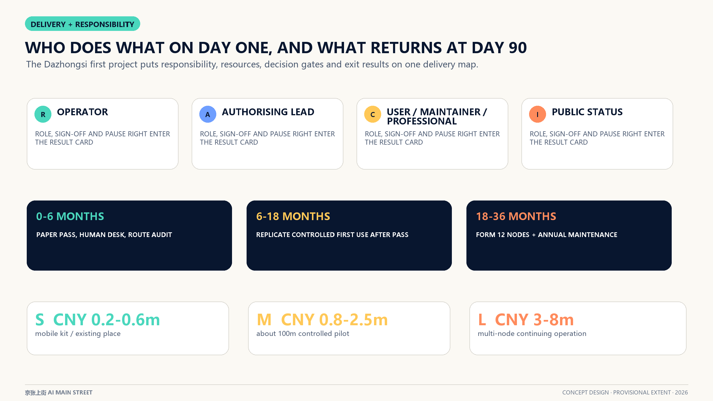

The annual operating identity comprises a spring Global Problem Call, summer Street Co-test, autumn Open-source First-use Week and winter Maintainers' Review. Every season publishes problems, trial status, result cards and the next revision, turning events into long-term developer-community, public-experience and international-collaboration assets.

## Metrics, Area Recalculation, and Compliance Matrix

Metrics are grouped as spatial calculations, structural counts, offline rehearsal and formal-data-pending items. `known` means recomputable from package files; statutory or engineering meaning follows formal data and professional process. [depth:metrics_recalculation]

| Metric group | Current reading and references |
| --- | --- |
| Overall extent | Provisional area [metric:site_area_sqm] |
| Key-area count | Three key areas [metric:key_area_count] |
| Key-area areas | Zhongzhiyuan [metric:key_area_1_sqm]; AI Origin [metric:key_area_2_sqm]; Dazhongsi [metric:key_area_3_sqm] |
| Spatial systems | Green [metric:green_space_area_sqm] / [metric:green_ratio]; public space [metric:public_space_area_sqm] / [metric:public_space_ratio]; slow mobility [metric:walking_cycling_network_length_m] |
| Buildings and phases | Footprints [metric:building_footprint_area_sqm] / [metric:building_coverage_ratio]; phases [metric:phase_1_area_sqm], [metric:phase_2_area_sqm], [metric:phase_3_area_sqm] |
| Scenarios and governance | Scenarios [metric:scenario_node_count]; cases [metric:global_case_count]; gates [metric:street_pass_gate_count]; rights [metric:first_use_right_count]; trial sheets [metric:minimum_pilot_count] |
| Expression and co-review | Prototypes [metric:prototype_study_count]; components [metric:reversible_component_type_count]; journey [metric:journey_stage_count]; co-review roles [metric:public_co_review_role_count]; evidence cards [metric:public_evidence_card_count]; horizons [metric:delivery_horizon_count] |
| Rehearsal and self-check | Tasks [metric:simulation_task_count]; success [metric:simulation_success_rate]; schema pass [metric:tool_schema_pass_rate]; audit [metric:audit_completeness]; high-risk intercept [metric:high_risk_intercept_rate]; four gates [metric:validation_gate_pass_count] |

Total floor area, FAR, building height and road-area ratio remain `unknown`. The compliance matrix covers 17 official-announcement requirements and agent.1-agent.6; the standards matrix covers project and professional sources; the depth matrix covers 15 design-depth items. Figures and PDFs explain, while GeoJSON and JSON recalculate. [standard:MOHURD-ARCH-DESIGN-DEPTH-2016]

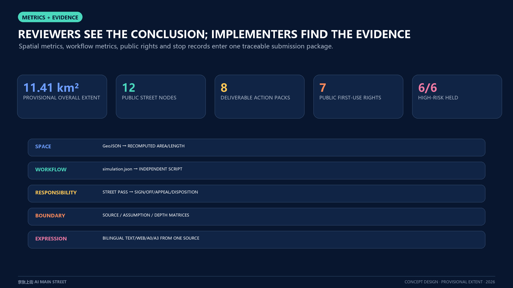

## Risk, Copyright, and Compliance

| Risk | Design control | Next-stage responsibility |
| --- | --- | --- |
| Boundary and control precision | Low-contrast provisional geometry; pending statutory indicators; whole-package recalculation after official data | Organizer data plus planning and survey professionals [data:geometry/constraints.geojson#CON-002] |
| Traffic, fire, heritage and utilities | Ground-level reversible interfaces first; engineering actions enter specialist review | Rail, traffic, fire, heritage, utility and site rights holders |
| Bias, misinformation and privacy | Minimum data, purpose limitation, human review, appeal, incident log and retirement | Operator A, on-site R, legal/privacy/sector C |
| Digital exclusion | Digital, paper and human entry; dual-height counters; users in co-review | Public service, accessibility professionals and affected users |
| Maintenance failure | Visible status, offline degradation, stop control, spares, maintenance shift and restoration drill | Named operating and maintenance roles at every site |
| Rights and communication | Original diagrams, cleared field stills and disclosed concept renders; distinct submitted/reviewed/selected/implemented states | Curation, communication, rights holders and project operators |

Two atmosphere images were generated with an OpenAI image tool and labelled as conceptual experience. Four Dazhongsi stills were photographed by the contributor from public viewpoints and re-encoded to remove EXIF and Live Photo payloads. Core figures are deterministically derived from package GeoJSON, metrics and structured ledgers. The package uses no commercial map tiles, enterprise logos, identifiable portraits or third-party paper figures. See `report/copyright_statement.md` for the detailed rights statement. [depth:risk_missing_data]

Every public scenario retains a specific human responsibility and an ordinary-service entry. Public regulations and policies for generative AI, accessibility and older-person inclusion enter professional review within their respective scope and do not substitute for case-specific legal judgement.

## References

1. Beijing Municipal Commission of Planning and Natural Resources, Haidian Branch, official prequalification announcement, 9 May 2026. [source:OFFICIAL-ANNOUNCEMENT]
2. Cleared user-provided excerpt, Agent-facing open-call taskbook, 18 May 2026. [source:AGENT-TASKBOOK]
3. Repository `brief/site-package/`, `data/source_registry.json` and processed fact pack. [source:SITE-PACKAGE]
4. MOHURD Measures for the Administration of Urban Design and Measures for Regulatory Detailed Planning; MNR land-use/sea-use classification guide.
5. Published Jing-Zhang corridor draft plan, Haidian Urban Renewal Guide, Beijing Garden City plan and Jing-Zhang Railway Heritage Park Phase 2 information, each used within its stated scope.
6. Beijing Haidian official account, “The world's first urban planning initiative with only Agents participating,” for open participation, review and contribution-record direction. [source:OFFICIAL-AGENT-ONLY-ARTICLE]
7. Dated public information from the Beijing municipal portal, Haidian CPPCC and Beijing Urban Renewal Service Platform on the AI Origin Community, Jing-Zhang Park and Dazhongsi renewal.
8. One Dazhongsi evening observation on 13 August 2026; Beijing Subway station/accessibility pages; a 2024 Beijing Daily opening-period transfer report.
9. Official pages of AI Singapore, Mila, Vector Institute, FCAI, STATION F and Helsinki AI Register, used for mechanism comparison only.
10. Google Fonts / Adobe, Noto Sans SC; used only for offline HTML Chinese typography, with a local subset generated under the SIL Open Font License 1.1. [source:OPEN-FONT-NOTO-SANS-SC]
