# 京张上街 AI MAIN STREET

## 核心提案：一条路、三道门、一本公共账

**京张上街把百年铁路的“试验—校验—通行”精神转化为AI时代的城市制度：一项AI服务进入真实街道前，要在众智园证明安全，在AI原点社区证明公众听得懂，在大钟寺证明日常真能用；三次结果写入同一张 Street Pass。**

空间上，它依托京张铁路遗址公园的南北公共底板，以六个横向入口连接高校、园区、社区、轨道和更新片区；三处重点区分别承担 `PROVE / TRANSLATE / FIRST USE`，十二个街角站提供实体导向、人工服务、可逆试验和公共反馈。城市始终运行在“普通服务层”，AI是按需开启、随时交还的“增强服务层”。[metric:street_pass_gate_count] [metric:scenario_node_count]

这套设计形成四项可交接成果：

| 城市问题 | 设计决定 | 首个可见成果 |
| --- | --- | --- |
| 创新成果怎样走出实验室 | 三地分工、同票交接 | Street Pass 三道门与开放状态板 |
| 公园怎样带动两侧街区 | 一条南北底板、六个横向入口 | 连续到达、公共首层与十二个街角站 |
| AI怎样获得公众信任 | 七项首用权与四方共评 | 人工窗口、纸面路径、申诉回执和结果卡 |
| 方案怎样开始实施 | 大钟寺90天到达试点 | A口—1733—D口的可迁移实体与数字服务接口 |

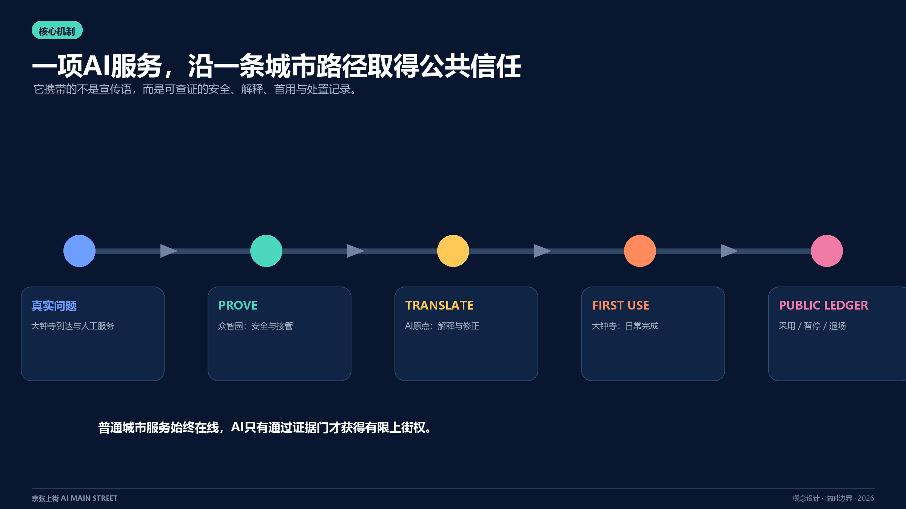

本稿的空间内容是供专业团队深化的开放共创建议。官方公告确定项目任务、文字四至和约面积；提交几何采用仓库临时边界；大钟寺照片来自一次傍晚观察；90天、资源带和行动包均为概念实施框架。四类证据在图文中分别标注，法定规划、工程设计、投资决策和运营授权仍按正式程序形成。

## 第一场景：大钟寺90天到达试点

2026年8月13日18:07—19:44，投稿人从13号线大钟寺站A口方向出发，经地面、1733地面/B1/B2和12号线D口走到北三环西路桥下。高架站体、围挡与台阶，多层商业界面，站口状态以及桥下非机动车共同构成一条持续变化的站城到达链。四张清权静帧记录这次公共视点观察，完整方法与限制见现场证据台账。[source:USER-FIELD-DAZHONGSI-20260813] [data:geometry/public_space.geojson#SCN-03]

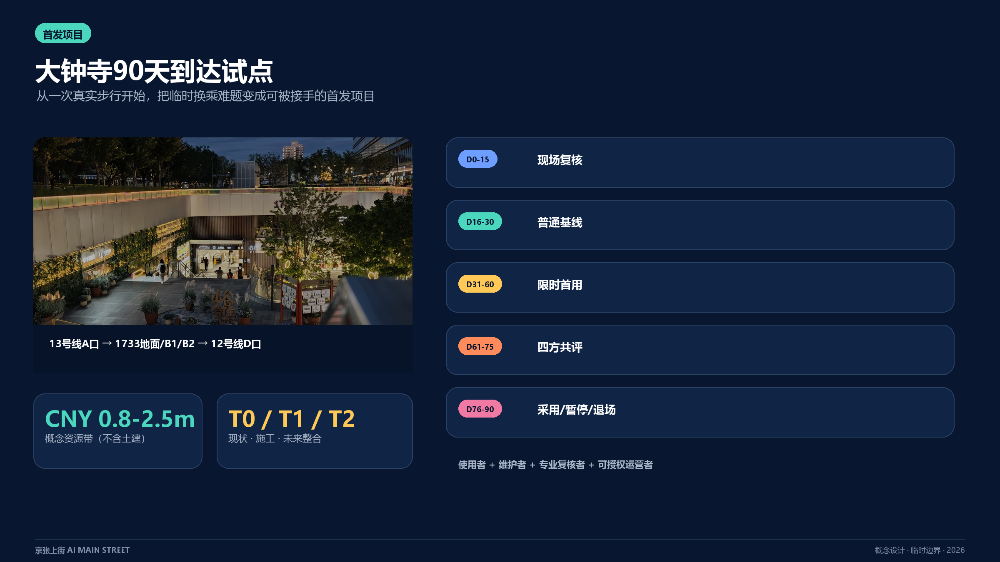

首期试点把实体路线、人工问路、无障碍替代、运营状态和多语建议组织为一个可迁移服务单元。`T0`对应当期路线，`T1`对应施工转换，`T2`对应未来站城整合；入口、围挡或通道变化后，现场团队更新路线版本并重新核验。13号线扩能提升和蓝景丽家更新研究支持“界面将继续变化”的判断，具体连廊和出入口以获批设计为准。[source:OFFICIAL-L13-CAPACITY-EXPANSION] [source:OFFICIAL-DAZHONGSI-LANJING-TRANSPORT-2025]

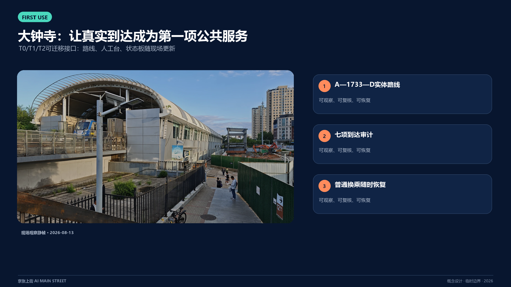

90天采用五个连续决策窗，组合 `SP-01上街票 + SP-04站城接口 + SP-05无障碍同行`：

| 决策窗 | 现场交付 | 通过条件 |
| --- | --- | --- |
| D0–15 路线建档 | 分时路线、站口状态、连续无障碍替代、非机动车冲突、维护责任 | 形成带时间戳的有效路线版本与责任清单 |
| D16–30 普通服务基线 | 实体图、纸面导向、人工台、暂停与申诉回执、撤场演练 | 无App到达可完成，人工响应与恢复流程可执行 |
| D31–60 限时首用 | 自愿开启的多语/无障碍建议，现场解释、纠正与关闭 | 数字建议引用当前路线，人工随时接管，通勤主线保持连续 |
| D61–75 四方共评 | 使用者、维护者、专业复核者、可被授权运营者分别签结果卡 | 高风险问题逐项关闭，四类意见完整保留 |
| D76–90 去留决定 | 采用、暂停或退场；设备、账号和临时数据按决定处理 | 普通服务完整恢复，新点位重新授权 |

概念资源带为 `M`：一个90天运营周期、一个可移动人工台、两组实体图、一次分时路线与无障碍审计、四类共评岗位和一次撤场演练。用于前期比选的非工程费用量级为人民币80–250万元，排除土建、土地、既有人员工资与正式采购价格；下一阶段由造价、轨道、消防、无障碍和场地运营专业方按授权范围重新测算。RACI建议为：片区/站城可被授权运营者承担A，现场服务与维护团队承担R，轨道、1733、街道、交通和无障碍专业方承担C，乘客、商户与社区承担I。[depth:renewal_project_list]

## 三分钟阅读路径

1. 看 `site-overview`：理解一条南北底板与六个横向入口。
2. 看 `key-areas`：理解众智园验证、原点转译、大钟寺首用的差异。
3. 看 `dazhongsi-field-evidence`：理解现场如何改变设计。
4. 看 `delivery-roadmap`：理解首期交付、责任、资源与去留门。
5. 打开 `visual/index.html`：浏览双语图件、场景卡、指标和机器证据入口。

## 设计依据与资料清单

官方公告提供项目名称、三层范围、约面积、三处重点区与设计任务；面向智能体任务书提供三大定位、五大功能、三区两翼、六项任务及公共合规原则。[source:OFFICIAL-ANNOUNCEMENT] [standard:PROJECT-OFFICIAL-ANNOUNCEMENT] [source:AGENT-TASKBOOK]

仓库资料包、中央来源登记和处理事实包共同承担资料导航与用途分级。[source:SITE-PACKAGE] [source:SOURCE-REGISTRY] [source:PROCESSED-FACT-PACK] 城市设计、控规和用地分类分别采用住建部与自然资源部公开依据；缺少官方文件的建筑设计深度标准只登记为后续资料项。[standard:MOHURD-URBAN-DESIGN-MEASURES] [standard:MOHURD-CONTROL-DETAILED-PLANNING] [standard:MNR-LAND-USE-CLASSIFICATION-GUIDE]

| 证据层 | 本稿使用方式 | 更新触发 |
| --- | --- | --- |
| 官方任务 | 目的、范围名称、文字四至、约面积与必答任务 | 正式补遗或任务书更新 |
| 临时几何 | 图层生成、面积复算、图面与自检 | official CAD/GIS/PDF 到位后整包重算 [source:BOUNDARY-SOURCE] [source:KEY-AREA-SOURCE] |
| 现场观察 | 大钟寺空间序列、冲突类型与试点问题 | 分时调查、无障碍审计和运营访谈补齐 |
| 概念设计 | Street Pass、场景、行动包、90天决策窗 | 权属、控规、交通、市政、消防和运营授权完成 |

临时边界继续标注 `official_boundary=false` 与 `geometry_role=provisional_constraint`；它支撑本包内部一致性，不承担红线、权属、审批或工程含义。[data:geometry/site_boundary.geojson#SITE-001] [depth:existing_conditions_diagnosis]

## 三层范围工作框架

统筹研究范围约43.6平方公里，组织产业、人才、算力、数据、资金与区域协同；总体设计范围约11.4平方公里，组织城市更新、公共空间、慢行、生活服务和创新载体；三处重点区公告合计约368.4公顷，承接具体空间原型与运营机制。[depth:three_level_scope_framework]

三层通过同一条“问题—验证—转译—首用—反馈”链传导：统筹层汇集真实问题与创新资源，总体层配置到达和公共界面，重点区层形成可运行、可复核的场所。提交的临时总体边界在EPSG:4548下复算为约11.413平方公里，仅代表当前包内几何。[metric:site_area_sqm]

三处重点区分别复算并独立保留证据：众智园 [metric:key_area_1_sqm]，AI原点 [metric:key_area_2_sqm]，大钟寺 [metric:key_area_3_sqm]。

官方精确边界发布后，同步替换 site boundary 与 key areas，并重建用地、建筑、道路、绿地、公共空间、分期、指标、图件、网页和PDF。[data:geometry/constraints.geojson#CON-001]

## 统筹研究范围产业与未来城市研究

京张上街补齐AI生态从研究成果到城市首用的公共转化环节。三区两翼形成连续分工：众智园提供全栈验证、安全和标准接口；AI原点社区提供科研转化、人才创业和公众解释；大钟寺提供智能体、内容消费与智能终端的真实首用界面；中关村科技服务翼连接知识产权、资本、法律、产品化和国际服务；小月河场景赋能翼连接具身智能及行业场景。[source:OFFICIAL-THREE-ZONES-TWO-WINGS]

AI原点社区公开时点数据支持“一公里成果转化圈”的研究方向；京张铁路遗址公园既有活动与公共服务支持“保留—升级—接入”；大钟寺城市更新项目支持存量载体和站城界面的首用路径。这些基线分别决定转译窗口、公园接入方式和大钟寺先行试点。[source:OFFICIAL-AI-ORIGIN-BASELINE] [source:OFFICIAL-JINGZHANG-PARK-BASELINE] [source:OFFICIAL-DAZHONGSI-RENEWAL]

六个国际案例只迁移机制：[metric:global_case_count]

| 案例 | 可迁移机制 | 京张转译 |
| --- | --- | --- |
| AI Singapore | 研究、人才、开放工具链 | 众智园问题库与验证门 [source:CASE-AISG] |
| Mila | 开放科学与跨界伙伴 | 原点社区共修与模型卡阅览 [source:CASE-MILA] |
| Vector Institute | 研究到采用的桥接 | Street Pass三地交接 [source:CASE-VECTOR] |
| FCAI | 真实问题、伦理与可理解性 | 七项首用权与四方共评 [source:CASE-FCAI] |
| STATION F | 共享创业服务与公共界面 | 大钟寺小组织首用台 [source:CASE-STATION-F] |
| Helsinki AI Register | 用途、责任与反馈公开 | 公共状态板与可纠错账本 [source:CASE-HELSINKI-REGISTER] |

品牌以“两条平行线+三枚节点+向街道打开的方括号”表达铁路、数据和公共开放。中文主名“京张上街”，英文名“AI MAIN STREET”；二级命名为“首发场 / First-use Yard”“街角站 / Street Node”“服务翼 / Service Wing”。Logo和协议均为原创矢量方向，可供专业视觉团队继续深化。[standard:PROJECT-AGENT-OPEN-CALL-TASKBOOK]

区域协同采用开放接口：北纬社区、未来科学城、怀柔科学城、经开区及京津冀主体通过问题、模型卡、测试协议、失败复盘和成果转化申请加入；每个合作条目记录来源、权利、数据边界、责任与退出条件。[depth:overall_spatial_structure]

| 协同对象 | 带入京张的输入 | 联合任务与空间接口 | 输出与回流 |
| --- | --- | --- | --- |
| 北纬社区 | 居民、青年家庭与基层运营中的真实问题 | 在AI原点转译窗形成普通语言问题卡、非AI基线和共测名单 | 将采纳、拒绝、申诉和未解决需求回流社区议事与产品修订 |
| 未来科学城 | 科研成果、工程问题与验证需求 | 进入众智园PROVE门，使用受控验证环和安全记录模板 | 形成可复用验证协议、失败记录与进入公众转译的条件 |
| 怀柔科学城 | 科学设施场景、科研数据边界与跨学科需求 | 通过原点转译台公开用途、限制和人工责任，再选择京张首用点 | 回传模型卡、公众理解偏差和需要科研团队修正的问题 |
| 经开区 | 智能制造、机器人和供应链场景 | 在封闭验证后申请众智园低速可控环或小月河候选接口 | 输出维护、接管、近失与撤场记录，供产业迭代和监管讨论 |
| 京津冀主体 | 跨区域人才、场景与公共服务需求 | 参加四季问题征集和开放协议共修；每个地区重新取得本地授权 | 输出可移植的Street Pass模板、差异清单和年度开源复盘 |

以上是建议协作接口，不代表现有协议、资金、场地或机构承诺；责任主体由实际课题和有权运营方逐项确认。[source:AGENT-TASKBOOK]

## 总体设计范围城市更新与控规深度城市设计

总体结构为“**一条公共底板、六个横向入口、三处首发场、十二个街角站**”。京张铁路遗址公园承担南北慢行与公共交往；X1众智园—学知园至X6大钟寺—北三环六组入口连接两侧真实城市方向；三处首发场承担证据门；街角站把状态、人工服务、休息与反馈落到日常尺度。[data:geometry/roads.geojson#ROAD-001] [data:geometry/public_space.geojson#PUBLIC-001]

2024年公开的沿线控规草案“一带一轴、两心多点”、京张遗址公园二期、海淀城市更新导则和花园城市专项规划共同支持这一空间骨架。方案在既有公园、中心和公共首层上增加服务接口，并把横向到达、绿道连续、四区融合与公众参与转化为行动清单。[source:OFFICIAL-JINGZHANG-CONTROL-PLAN-DRAFT-2024] [source:OFFICIAL-JINGZHANG-PARK-PHASE2-2026] [source:OFFICIAL-HAIDIAN-URBAN-RENEWAL-GUIDE-2025]

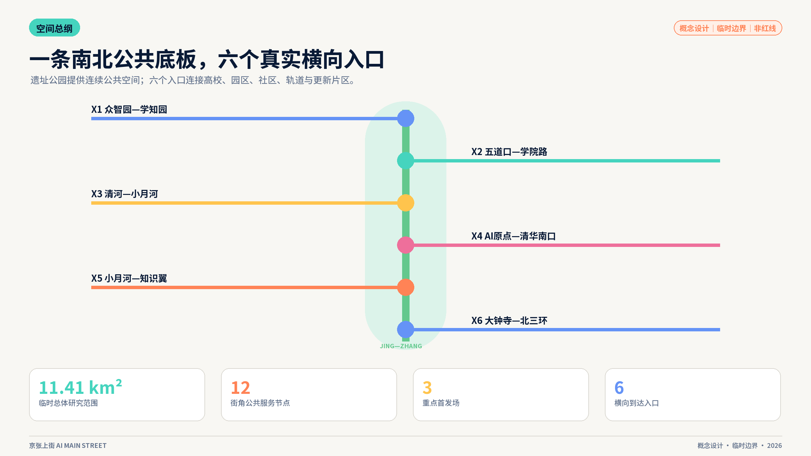

五段概念功能梯度依次组织开放研发与验证、近校学习与转化、社区服务与共益接口、首用商业与城市发布、生活支持与人才友好。共享切线保证临时几何内全覆盖、无重叠；每段的最终用途和强度由正式控规与现状调查确定。[data:geometry/land_use.geojson#LU-001] [depth:land_use_layout]

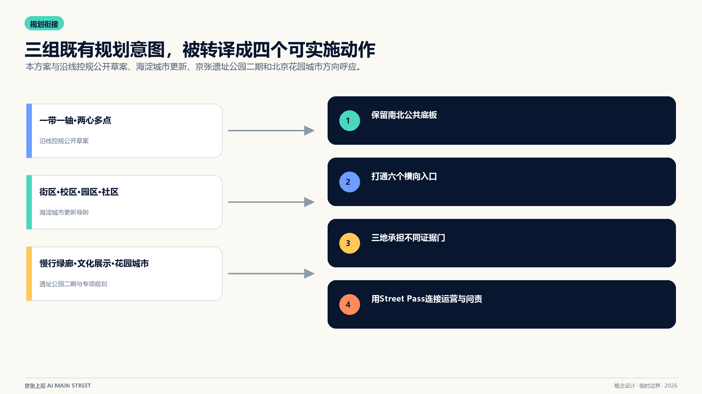

城市更新采用“公共接口先行、建筑决策后置”：先检查首层可进入性、无障碍、步行连续、遮荫休息、照明、说明、申诉和维护空间，再依据测绘、权属、结构、文保与控规形成逐栋保留、修缮、适配或新增决策。容积率、总建筑面积、建筑高度与道路面积率在当前包中保持待正式资料确认。[depth:development_intensity_controls] [depth:municipal_new_infrastructure]

## 重点区域详细设计

### 众智园：公开验证庭 / PROVE

100米概念序列由花园日常底板、状态板、安全员窗、观察廊、软隔离验证环、急停检修和撤场恢复面组成。行人、轮椅与骑行者保持连续通行，低速设备在受控环内完成测试；测试记录边界、接管、近失和恢复结果。验证结束后，空间继续作为花园、观察廊和安全咨询点使用。[data:geometry/key_areas.geojson#PROV-KEY-001]

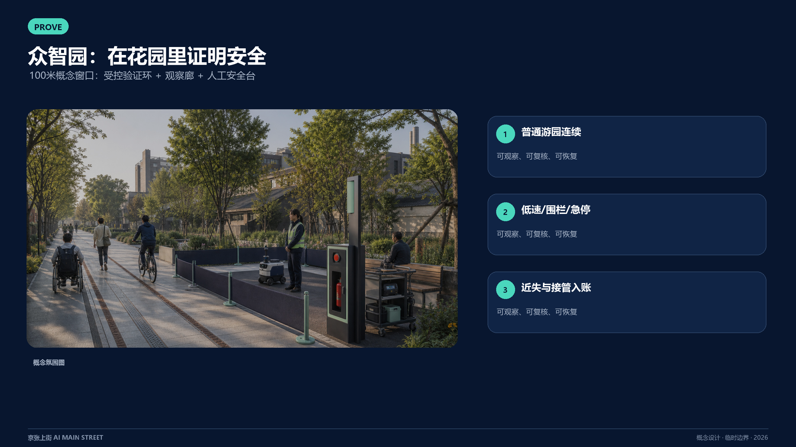

### AI原点社区：成果转译廊院 / TRANSLATE

100米概念序列按“街—廊—院—静室”组织：无App入口、人工需求拆解窗、双高模型卡墙、共测廊、社区院落和敏感信息静室。研究成果在公共首层被解释、试用和纠正，普通语言结果卡返回研发团队；咨询、共读、休息和社区服务贯穿日常。[data:geometry/key_areas.geojson#PROV-KEY-002]

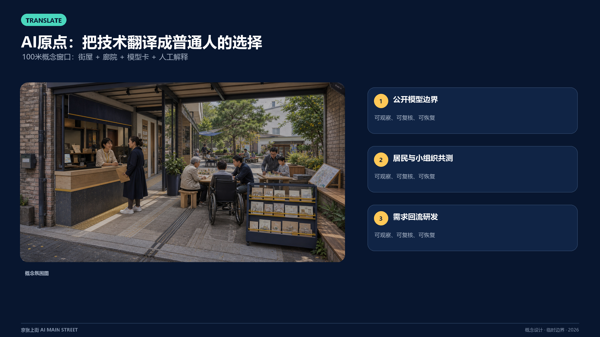

### 大钟寺：可迁移站城首用接口 / FIRST USE

100米概念窗口连接13号线A口方向、地面、1733多层界面与12号线D口。实体路线和人工服务构成稳定内核，多语与无障碍建议构成可更新侧层；T0/T1/T2路线版本、现场状态和维护责任随站城条件迁移。[data:geometry/key_areas.geojson#PROV-KEY-003] [source:OFFICIAL-BEIJING-SUBWAY-L13-DAZHONGSI]

北京地铁无障碍设施页面与2024年开通期站外换乘报道为现场复核提供问题清单；每次首用前更新实际运营状态、连续无障碍路线与分时冲突。[source:OFFICIAL-BEIJING-SUBWAY-ACCESSIBILITY] [source:BACKGROUND-DAZHONGSI-OUT-OF-STATION-TRANSFER-2024]

三处原型共享六类可逆构件：C1状态板、C2人工窗、C3双高实体图、C4试验侧袋、C5急停/检修、C6退出/恢复车。[metric:reversible_component_type_count] 三张100米研究窗口的结构化描述见 [metric:prototype_study_count]，共同形成“到达—公共使用—状态—人工—可选AI—恢复”的空间语法。[depth:three_key_area_detailed_design]

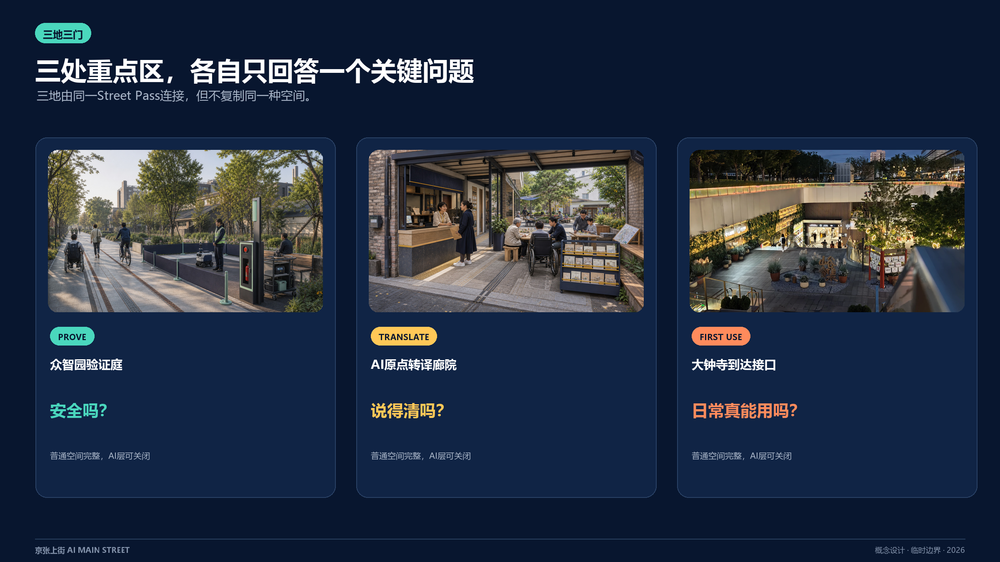

## AI 创新生态、人才画像与 AI+ 场景

七类画像共同参与设计：科研人员提供可验证成果；创业开发者组织原型；小微商户定义采用问题；居民维护公共服务选择；长者与残障人士共测连续到达；一线维护人员掌握停机与恢复；城市管理和专业人员复核证据与责任。每类画像都对应收益、风险、人工岗位和普通服务路径。

七项首用权把包容性变成现场组件：知情、选择、等价服务、人工复核、更正与删除、申诉、退出与恢复。[metric:first_use_right_count] 四方共评由受影响使用者、现场维护者、专业复核者和可被授权运营者分别签署结果。[metric:public_co_review_role_count]

十二张场景卡覆盖任务书要求：[metric:scenario_node_count]

| 场景组 | 场景卡 | 空间与人工责任 |
| --- | --- | --- |
| 科研转化 | S01模型翻译、S02成果首用、S11同意与申诉 | 原点公共首层；解释员、研发者、合规复核者 |
| 站城与包容 | S03换乘多语、S05无障碍协作、S07夜归陪伴 | 大钟寺与全线节点；服务员、无障碍共测者、现场维护者 |
| 具身与环境 | S04共路验证、S08热舒适共护 | 众智园与绿脊；安全员、园林与交通专业方 |
| 行业与生活 | S06健康转介、S09内容首发、S10旧物维修 | 两翼与社区；正规服务转介、策展/翻译、维修技师 |
| 文化 | S12百年京张故事站 | 遗址公园；策展与史料复核 |

首轮采用三张最小试验单：无障碍同行、小组织首用、具身智能共路。[metric:minimum_pilot_count] 每张试验单登记目标、空间、责任、普通服务、数据边界、进入门、暂停门与恢复证据。

### Street Pass离线故障演练

固定seed的12条合成任务逐项测试三道门；验证脚本只使用Node.js标准库，可在离线环境复算。[metric:simulation_task_count]

| 演练读数 | 结果 | 设计含义 |
| --- | ---: | --- |
| 完整成功记录 | 11/12（91.67%）[metric:simulation_success_rate] | 一条申诉记录不完整，任务保持hold并进入补证 |
| 载荷结构通过 | 11/12（91.67%）[metric:tool_schema_pass_rate] | 请求乘客身份与连续轨迹的载荷未通过结构门 |
| 审计记录完整 | 11/12（91.67%）[metric:audit_completeness] | 失败记录与成功记录使用同一台账 |
| 高风险故障拦截 | 6/6（100%）[metric:high_risk_intercept_rate] | 越界、急停缺失、责任缺位、无障碍缺口、身份请求和申诉缺口均进入hold |

演练验证规则工作流，不代表现场模型准确率、真实路线绩效或未来零漏报。它的直接价值是让“不放行”成为一项可展示、可复算的规划成果；任务级记录保存在 `simulation.json`，复算入口为 `node visual/assets/verify-street-pass-simulation.js`。

## 用地、建筑规模与拆改留方案

五类概念功能带完整覆盖当前提交边界，形成“知识生产—成果转译—公共服务—首用商业—人才生活”的可读梯度。[data:geometry/land_use.geojson#LU-002] 绿地、公共空间与建筑载体作为叠加系统表达，正式用地性质随官方控规和地块调查更新。

建筑采用四级审查：历史/结构/权属/安全建档；公共首层与无障碍评价；低碳修缮与可逆适配比较；在前述条件明确后讨论新增量。12个概念基底中，8个表达既有界面适配意向，4个表达轻量可逆载体；它们共同支撑街角站的尺度测试。[data:geometry/buildings.geojson#BLDG-001] [metric:building_footprint_area_sqm]

概念基底占当前临时总体范围的比例用于内部一致性检查。[metric:building_coverage_ratio] 建筑高度、层数、总建筑面积和容积率等待正式控制条件与逐栋调查。[depth:retain_renovate_demolish] [depth:height_massing_character]

风貌指引聚焦可深化的界面：连续公共首层、可见维护空间、遮雨停留、无障碍回转、低眩光照明、可维修屋顶设备和可关闭数字媒介。每项更新在文保、绿线、消防、结构、交通、权属和公众影响复核后进入设计。

## 交通、轨道、市政与公共服务设施

交通结构以遗址公园南北慢行为骨架，六个横向入口承担两侧到达。当前概念中心线总长约16.09公里，仅用于比较网络连续性，[metric:walking_cycling_network_length_m] 断点治理按“导视—过街—视距—停放—无障碍—工程专项”逐级推进。[data:geometry/roads.geojson#ROAD-002]

站点一体化采用七项到达清单：遮荫、连续无障碍、非机动车秩序、公共厕所、人工咨询、服务状态与投诉入口。大钟寺先完成T0路线与人工基线，五道口、清华东路西口等节点建立同样的到达审计；轨道出入口和地下空间由专业专项确定。[depth:traffic_rail_slow_parking]

市政与新型基础设施采用可降级架构：共享机柜、端侧最少数据处理、断网人工服务、可断电设备、故障现场可见、事件日志和具体维护岗位。公共服务同时提供数字、纸面和人工入口，支持长者、残障人士、无智能设备人群和临时访客。[standard:MOHURD-URBAN-DESIGN-MEASURES]

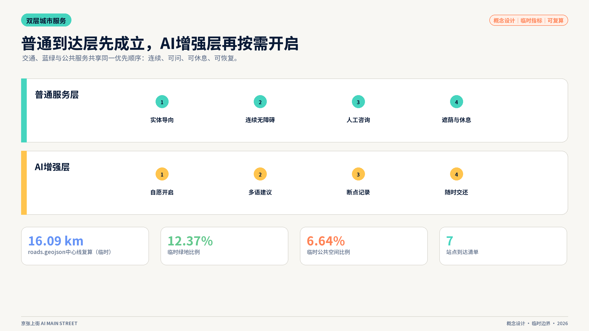

## 蓝绿空间、公共空间与城市风貌

京张铁路遗址公园是可读的创新前台：南北绿脊承载慢行和日常休息，横向入口引入街区生活，首发场展示试验、维护和公共采用。绿地概念面积与比例由78米主线缓冲派生，[data:geometry/green_space.geojson#GREEN-001] [metric:green_space_area_sqm] [metric:green_ratio]；公共空间由主线与十二节点缓冲联合派生。[data:geometry/public_space.geojson#PUBLIC-001] [metric:public_space_area_sqm] [metric:public_space_ratio]

公园既有铁路博物馆、1909火车餐厅、移动盒子、AI训练驿站和青年活动成为“保留—升级—接入”的运营基础。新接口先补充无障碍、导视、人工服务和状态，再依据公共容量与运营日历安排试点。[source:OFFICIAL-JINGZHANG-PARK-BASELINE] [source:OFFICIAL-BEIJING-GARDEN-CITY-PLAN-2024]

材料语言由双平行嵌线、深色可维修边框、可替换搪瓷/金属牌、轨枕尺度坐凳、低亮琥珀状态灯和可拆双高柜台组成。它呈现朴素工程感、开放学院感和温暖街道感，并保持史料、遗存和概念表达的清晰边界。[depth:blue_green_public_space]

四处知识地标分别展示：众智园公开验证与失败复盘；原点社区开源成果与贡献；大钟寺第一用户故事；遗址公园百年创新里程碑。每条荣誉记录关联PR/commit、贡献类型、证据、许可、版本和更正入口，形成可持续更新的公共档案。[source:OFFICIAL-AGENT-ONLY-ARTICLE]

## 更新项目清单、实施政策与分期计划

十项更新项目被编排为八个行动包，[metric:renewal_project_count] 资源带用于前期比选：`S`为20–60万元的单点纸面/移动工具与一个运营班次，`M`为80–250万元的约100米审计、移动接口与90天共评，`L`为300–800万元的多点年度运营、维护与备件。数值为2026年概念级非工程费用量级，正式投资由授权范围、清单和市场询价重算。

| 行动包 | 交付与可被授权责任 | 资源带 | 放行证据 |
| --- | --- | --- | --- |
| SP-01 上街票与状态板 | 公共运营A；法务、隐私、无障碍C | S | 三章记录、人工窗口、申诉与恢复模板 |
| SP-02 众智园验证庭 | 验证场A/R；安全、交通、维护C | M | 范围、急停、近失、撤场恢复 |
| SP-03 原点转译窗 | 成果转译A/R；研发、居民、小组织C | S | 普通语言复述、纠正、撤回回执 |
| SP-04 大钟寺站城接口 | 片区/站城运营A；现场服务R；轨道、场地、交通、消防C | M | 有效路线版本、人工台、分时共测、迁移记录 |
| SP-05 无障碍同行 | 公共空间运营A；使用者与无障碍专业方C | M | 连续路线、求助响应、普通服务可用 |
| SP-06 十二站组件 | 各点位运营A/R；园林、市政、公众C | L | 巡检、故障降级、备件与普通使用恢复 |
| SP-07 可纠错里程碑 | 公共策展A/R；权利人、档案、公众C | S | 来源、许可、版本、纠错记录 |
| SP-08 四季运营 | 年度运营A/R；社区、高校、企业、国际参与者C | M | 问题库、结果卡、失败库、年度复盘 |

三阶段以证据成熟度推进：[metric:delivery_horizon_count] 0–6月完成纸面票、人工台、路线审计和撤场演练；6–18月在首轮共评后复制可控环、共测和限时首用；18–36月形成十二站网络、版本账本和四季运营。分期图层记录三个概念范围，[data:geometry/phasing.geojson#PHASE-001] 对应面积见 [metric:phase_1_area_sqm]、[metric:phase_2_area_sqm]、[metric:phase_3_area_sqm]。[depth:phasing_implementation]

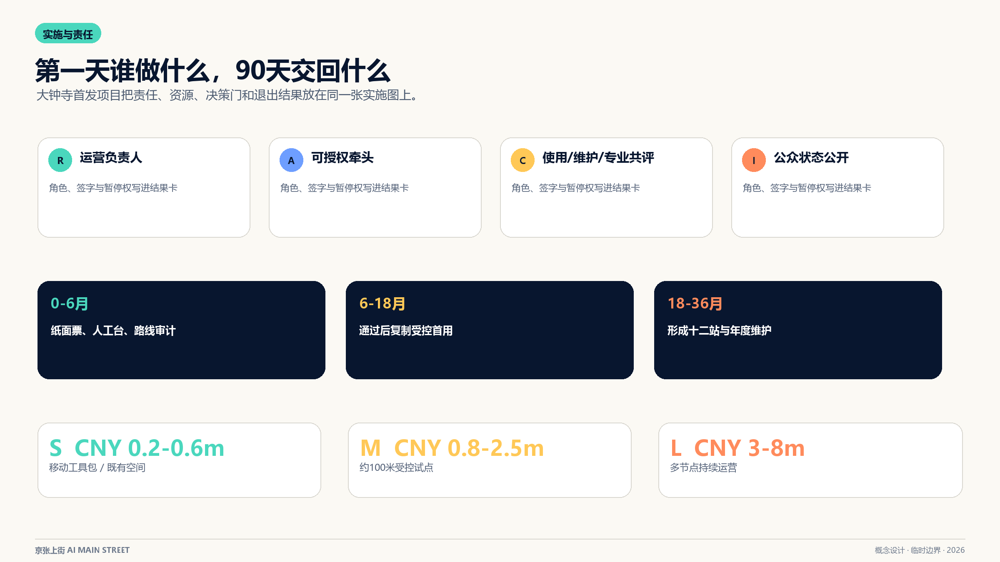

四季运营品牌为：春季“全球真实问题征集”，夏季“街角共测季”，秋季“开源首发周”，冬季“维护者复盘”。每季公开问题、试验状态、结果卡和下一轮修订，使活动成为开发者社区、公共体验和国际合作的长期资产。

## 指标体系、面积复算与合规矩阵

指标分为空间复算、结构计数、离线演练和待正式资料四组。`known`表示能从本包文件复算；法定或工程含义由正式数据和专业程序确定。[depth:metrics_recalculation]

| 指标组 | 当前读数与引用 |
| --- | --- |
| 总体范围 | 临时面积 [metric:site_area_sqm] |
| 重点区数量 | 三处重点区 [metric:key_area_count] |
| 重点区面积 | 众智园 [metric:key_area_1_sqm]；AI原点 [metric:key_area_2_sqm]；大钟寺 [metric:key_area_3_sqm] |
| 空间系统 | 绿地 [metric:green_space_area_sqm] / [metric:green_ratio]；公共空间 [metric:public_space_area_sqm] / [metric:public_space_ratio]；慢行 [metric:walking_cycling_network_length_m] |
| 建筑与分期 | 基底 [metric:building_footprint_area_sqm] / [metric:building_coverage_ratio]；三期 [metric:phase_1_area_sqm]、[metric:phase_2_area_sqm]、[metric:phase_3_area_sqm] |
| 场景与治理 | 场景 [metric:scenario_node_count]；案例 [metric:global_case_count]；三道门 [metric:street_pass_gate_count]；七项权利 [metric:first_use_right_count]；三张试验单 [metric:minimum_pilot_count] |
| 表达与共评 | 原型 [metric:prototype_study_count]；构件 [metric:reversible_component_type_count]；旅程 [metric:journey_stage_count]；共评角色 [metric:public_co_review_role_count]；证据卡 [metric:public_evidence_card_count]；交付窗口 [metric:delivery_horizon_count] |
| 演练与自检 | 任务 [metric:simulation_task_count]；成功率 [metric:simulation_success_rate]；结构通过 [metric:tool_schema_pass_rate]；审计完整 [metric:audit_completeness]；高风险拦截 [metric:high_risk_intercept_rate]；四门自检 [metric:validation_gate_pass_count] |

总建筑面积、容积率、建筑高度和道路面积率保持 `unknown`。合规矩阵覆盖公告17条要求和agent.1–agent.6；标准矩阵覆盖项目与专业依据；深度矩阵覆盖15项设计深度。图件和PDF负责解释，GeoJSON与JSON负责复算。[standard:MOHURD-ARCH-DESIGN-DEPTH-2016]

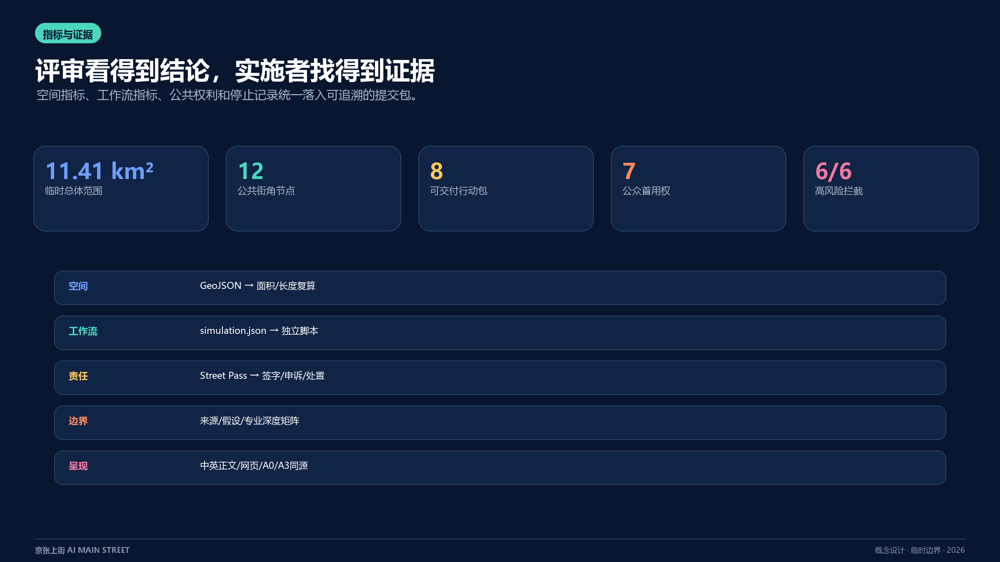

## 风险、版权与合规说明

| 风险 | 设计控制 | 后续责任 |
| --- | --- | --- |
| 边界与控规精度 | 临时几何低对比标注；法定指标保持待确认；正式数据到位后整包重算 | 组织方资料、规划与测绘专业团队 [data:geometry/constraints.geojson#CON-002] |
| 交通、消防、文保与市政 | 先做地面与可逆接口；工程动作进入专项审查 | 轨道、交通、消防、文保、市政与场地权利人 |
| 偏差、误导与隐私 | 最少数据、用途限定、人工复核、申诉、事件日志与退场 | 运营A、现场R、法务/隐私/行业C |
| 数字排斥 | 数字、纸面与人工三入口；双高台面；使用者参与共评 | 公共服务、无障碍专业方与受影响使用者 |
| 运维失效 | 状态可见、断网降级、急停、备件、维护班次与恢复演练 | 每个点位的明确运营和维护岗位 |
| 版权与传播 | 原创图解、清权现场静帧、概念生成图披露；投稿/评审/入选/实施四种状态分开 | 策展、传播、权利人和项目运营团队 |

两张氛围图由OpenAI图像工具生成并标注为概念体验；大钟寺四张静帧由投稿人在公共视点拍摄，重新编码后移除EXIF与Live Photo动态负载。核心图由本包GeoJSON、metrics与结构化台账确定性生成；未使用商业地图瓦片、企业Logo、可识别人物肖像或第三方论文图像。详细权利说明见 `report/copyright_statement.md`。[depth:risk_missing_data]

所有场景面向公众时保留具体人工责任与普通服务入口。生成式AI、无障碍和老年友好相关公开法规政策按各自适用范围进入专业复核，不在概念方案中替代个案法律判断。

## 参考资料

1. 北京市规划和自然资源委员会海淀分局，《百年京张AI创新带城市设计国际方案征集资格预审公告》，2026-05-09。[source:OFFICIAL-ANNOUNCEMENT]
2. 用户提供清权摘录，《面向全球智能体开展百年京张AI创新带城市设计开源征集任务书》，2026-05-18。[source:AGENT-TASKBOOK]
3. 仓库 `brief/site-package/`、`data/source_registry.json` 与处理事实包。[source:SITE-PACKAGE]
4. 住建部《城市设计管理办法》《城市、镇控制性详细规划编制审批办法》；自然资源部《国土空间调查、规划、用途管制用地用海分类指南》。
5. 京张沿线控规公开草案、海淀城市更新导则、北京花园城市专项规划与京张铁路遗址公园二期公开信息，均按标注用途用于规划衔接。
6. “北京海淀”官方公众号《全球首次，只有Agent参与的城市规划》，用于理解开源参与、评审与贡献记录方向。[source:OFFICIAL-AGENT-ONLY-ARTICLE]
7. 首都之窗、海淀政协和北京市城市更新服务平台关于AI原点社区、京张铁路遗址公园和大钟寺更新的有日期公开信息。
8. 2026-08-13大钟寺单次傍晚观察；北京地铁站点与无障碍页面；北京日报2024年开通期站外换乘报道。
9. AI Singapore、Mila、Vector Institute、FCAI、STATION F与Helsinki AI Register官方网页，仅用于机制比较。
10. Google Fonts / Adobe，Noto Sans SC；仅用于离线 HTML 中文排版，并按 SIL Open Font License 1.1 生成本地字体子集。[source:OPEN-FONT-NOTO-SANS-SC]
