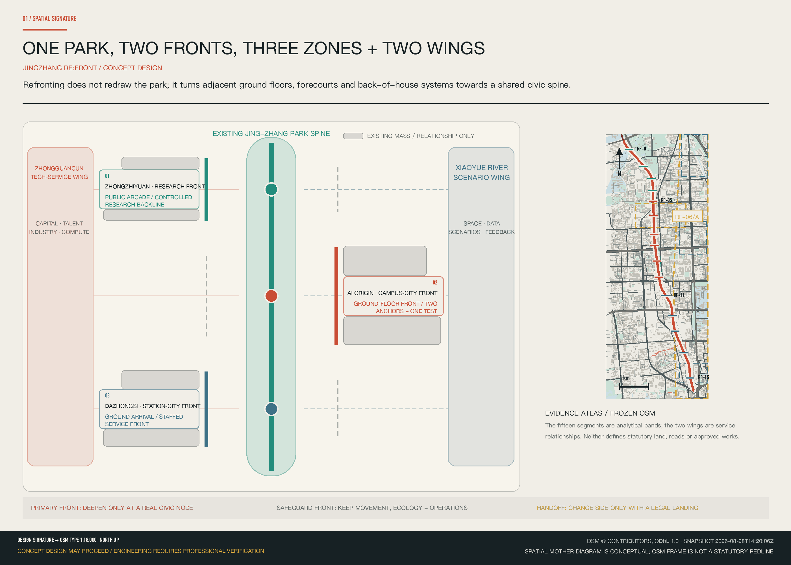
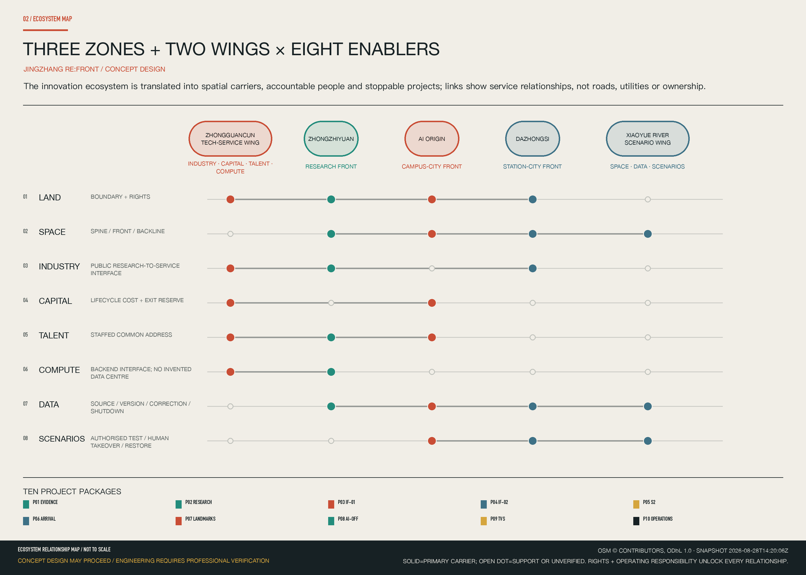
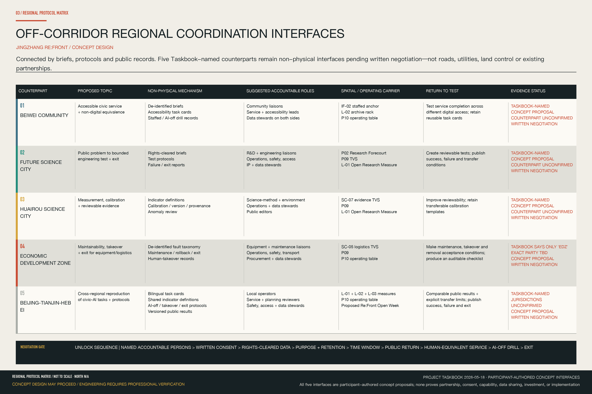
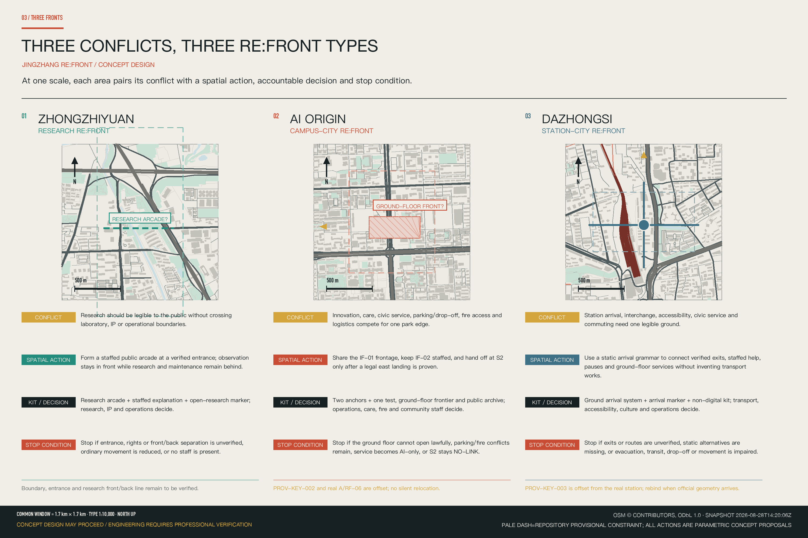
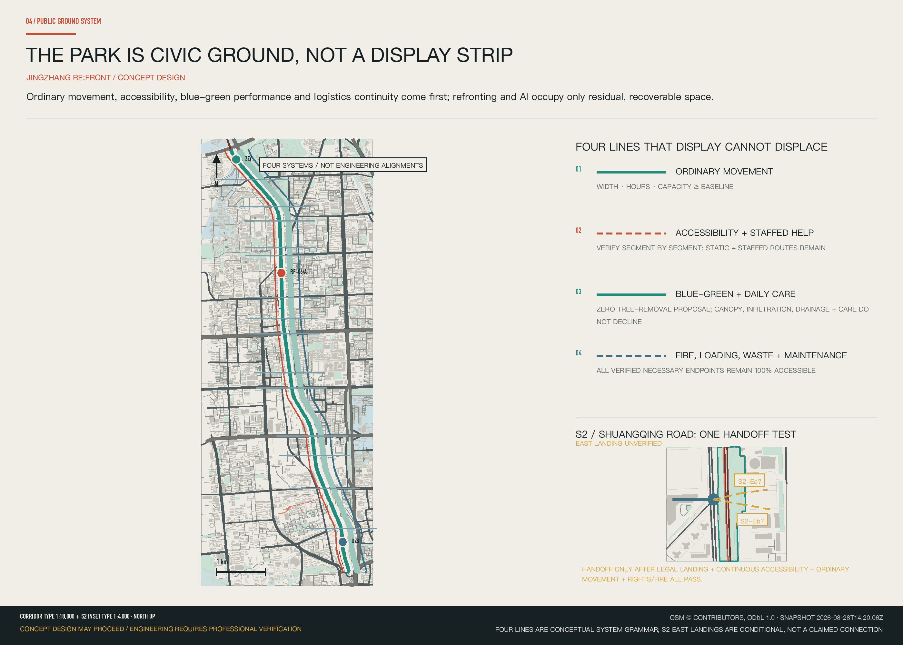
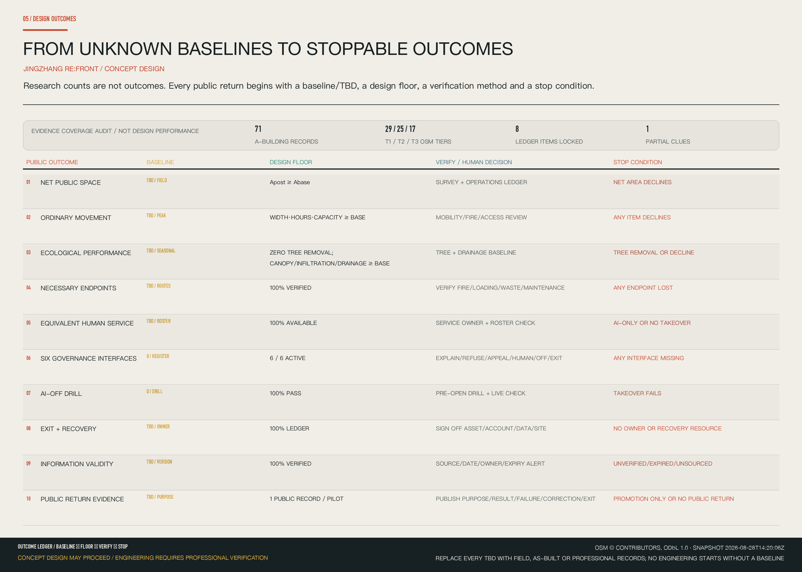

# JINGZHANG RE:FRONT / 京张·复面

**DO NOT PUT ANOTHER “AI DISPLAY BELT” INSIDE THE PARK. CONDITIONALLY TURN THE CITY ON BOTH SIDES TOWARD JING-ZHANG AGAIN.**

JINGZHANG RE:FRONT begins with one spatial mother diagram. The open railway-heritage park is the north–south civic spine. Ground floors, forecourts, and logistics systems form asymmetric **primary** and **safeguard** fronts on its two sides. The primary front changes side only where a real cross street, legal crossing, public landing, and operating authority all exist. Zhongzhiyuan, AI Origin, and Dazhongsi translate this syntax into a Research Forecourt, Coexistence Foyer, and Arrival Edge.

## Design Basis and Source List

The proposal neither redraws a new park nor reclaims completed fence removal, walking and cycling improvements, or innovation displays as new design work. Statements about the park's completed and open condition are used only within the scope of public material [source:S4] [source:S7]. The competition announcement and Agent Taskbook define the brief, work scope, and responsibility boundary [source:DATA-SRC-OFFICIAL-ANNOUNCEMENT-20260509] [source:DATA-SRC-AGENT-TASKBOOK-20260518].

> **Compact evidence boundary:** `concept_design_eligible=true` · `engineering_implementation_verified=false` · `M_CONCEPT_DESIGN=GO` · `M_ENGINEERING_IMPLEMENTATION=LOCKED`. The announcement and Taskbook support scope; repository provisional geometry supports generation and interim recalculation only; the frozen OSM snapshot supports orientation clues only [source:DATA-SRC-PROVISIONAL-BOUNDARIES-20260605] [source:OSM-OVERPASS-JINGZHANG-CONTEXT-20260828]. Doors, structural grids, parking, property rights, fire safety, municipal systems, and engineering boundaries remain unverified unless confirmed on site or by a qualified discipline. Every spatial move is a conceptual recommendation or a trigger for professional development [standard:MOHURD-CONTROL-DETAILED-PLANNING] [depth:risk_missing_data].

## Three-Level Scope Framework

The Coordinated Research Area, Overall Design Area, and Key-Area Detailed Design Area answer three different questions: why renewal is needed, how the corridor is organized, and how spaces could work. The announcement gives reference text areas of 43.6 square kilometres, 11.4 square kilometres, and 368.4 hectares across three key areas. Current polygons are repository Provisional Boundaries, not official control lines; they cannot support precise area, property, or engineering judgments [source:DATA-SRC-OFFICIAL-ANNOUNCEMENT-20260509] [data:geometry/site_boundary.geojson#SITE-001] [depth:three_level_scope_framework].

| Working level | Design judgment | Primary output | Evidence ceiling |
| --- | --- | --- | --- |
| Coordinated Research Area | After park publicization, the AI innovation corridor must join industrial value to public value | Industry-city position, three refronting types, operating protocols | Creates no parcel control |
| Overall Design Area | One existing civic spine; two sides refront asymmetrically according to actual doors, cross streets, and logistics | Corridor scroll, primary/safeguard fronts, mobility, Blue-Green Space, and non-regression ledger | Reports no exact two-sided interface length |
| Key-Area Detailed Design Area | Three areas test research, campus-city, and station-city edges | Same-scale comparison, AI Origin demonstrator, plans, sections, scenarios, and phasing | Directional design only until official polygons are issued |

The overall concept, **One Park, Two Fronts, Three Innovation Edges**, is not a new boundary. One Park is the Jing-Zhang Railway Heritage Park as everyday infrastructure. Two Fronts describes the asymmetrical relation of the two urban edges. The Three Innovation Edges are research refronting, campus-city refronting, and station-city refronting. They identify dominant spatial types, not a mandatory north-to-south AI lifecycle.

The visual identity uses a **refront seam**: two unequal urban edge lines connected by a real transverse node, rather than a perfectly symmetrical AI ring. Rust identifies a primary refront; park teal identifies the existing civic spine; blue identifies human service and logistics; amber identifies only conditions awaiting verification. Font, icon, and figure licences are retained in the rights record.

## Coordinated Research Area: Industry and Future City Research

The proposal translates the Taskbook's three positionings, five functions, and three zones with two wings into one spatial–operating diagram rather than placing industrial slogans on the park [source:DATA-SRC-AGENT-TASKBOOK-20260518] [standard:PROJECT-AGENT-OPEN-CALL-TASKBOOK]. A central north–south axis connects the three spatial nodes of Zhongzhiyuan, AI Origin, and Dazhongsi. The Zhongguancun Technology-Service Wing is a service loop for industry, capital, talent, and compute. The Xiaoyue River Scenario-Enabling Wing is a validation loop for space, data, and scenario mechanisms. The two wings express strategic service relationships only; they are not approved property, road, utility, or engineering boundaries.

### Three Zones, Two Wings × Eight Ecosystem Elements

| Element | Primary spatial carrier | AI action | Human final decision | Public return | Start / stop |
| --- | --- | --- | --- | --- | --- |
| Land | Comparison of official and provisional boundaries; verified ground-floor and forecourt candidate register | Flag boundary conflicts, evidence gaps, and recalculation triggers | Planning/land authority and rights holders | Avoid encroachment, double occupation, and loss of ordinary public space | Start after parcel identity, source, and status are registered; stop when ownership or geometric identity is unresolved |
| Space | Park spine, verified entrances/ground floors/forecourts, and independent back line | Compare time–space conflicts and alternatives that preserve ordinary movement | Operator and fire, accessibility, health, and logistics professionals | Continuous movement, usable forecourts, and staffed service | Start after node and baseline verification; stop when safety, movement, or logistics falls below baseline |
| Industry | Research porch, common address, innovation foyer, and arrival-service point | Search and translate rights-cleared directories; match public questions to professional services | Research, enterprise-service, and IP staff | Verifiable access for early-stage teams and residents | Start with authorised, versioned content and accountable staff; stop when stale, confidential, infringing, or unsupported by a person |
| Capital | Project-package ledger and decision window, not committed investment | Compare life-cycle cost, maintenance, and exit cost when data is sufficient | Owner, operator, funder, finance, and legal leads | Public value, maintenance duty, and exit cost are visible together | Start when authority, cost, and maintenance are defined; stop without accountable funding, maintenance, or exit reserve |
| Talent | Common address, office hours, and staffed service desks | Multilingual search, translation, booking, and routing | Named service staff and research/community liaisons | People with different abilities and levels of digital access receive equivalent service | Start after staff and hours are published; stop with AI-only access, discrimination, or failed appeal |
| Compute | Back-of-house or edge interfaces only; no invented server-room location | Workload scheduling and energy/availability warnings | Network, security, infrastructure, and operations staff | Reliable service without occupying public ground | Start after power, network, security, and maintenance capacity are verified; stop when energy, security, or maintenance is unresolved |
| Data | Evidence register, node data card, and public archive | Provenance, de-identification, version comparison, and anomaly flags | Data steward, domain professionals, and public oversight | Visible source, version, correction, and appeal | Start after purpose, minimisation, retention, and permissions are registered; stop for privacy, copyright, security, or uncorrectable error |
| Scenario mechanism | Authorised, recoverable nodes and civic thresholds | Compare conflicts and support AI-off and exit drills | Site, operations, safety, accessibility, and community representatives | Reversible public experience without degrading everyday use | Start with operator consent, baseline, human-equivalent service, and shutdown drill; stop when safety, rights, movement, ecology, or public value fails |

The five functions operate as parallel loops rather than a one-way north-to-south industry chain. Jing-Zhang's contribution is not expressed through invented company lists, investment totals, or output values. It first supplies an understandable Research Forecourt, a campus-adjacent service edge, and a station-city arrival surface that does not depend on screens.

### Off-Corridor Regional Coordination Interfaces: Connected by Briefs, Protocols, and Public Records

The Taskbook names Beiwei Community, Future Science City, Huairou Science City, the Economic Development Zone, and Beijing–Tianjin–Hebei as objects of regional-synergy review [source:DATA-SRC-AGENT-TASKBOOK-20260518] [standard:PROJECT-AGENT-OPEN-CALL-TASKBOOK]. This matrix translates those names into negotiable, non-physical interfaces. Except for the counterpart names, every topic, mechanism, role, carrier, and proposed return to test below is a participant-authored concept proposal. It implies no existing partnership, consent, capability commitment, data-sharing arrangement, or confirmed programme.

| Counterpart | Proposed topic | Non-physical exchange mechanism | Suggested accountable roles, subject to confirmation | Jing-Zhang spatial / operating carrier | Proposed public or industrial return to test | Evidence status |
| --- | --- | --- | --- | --- | --- | --- |
| Beiwei Community (北纬社区) | Accessible public service and non-digital equivalence | De-identified public problem briefs, accessibility task cards, staffed-service records, and AI-off drill records; no personal trajectories, health records, or service-case files | Community liaisons, public-service/accessibility leads, and data stewards on both sides | IF-02 Staffed Service Anchor + L-02 Refront Archive Rack + P10 Refront Operating Table | Test whether basic service remains completable across different levels of digital access; retain reusable task cards | Taskbook-named; participant-authored concept proposal; counterpart unconfirmed; written negotiation required |
| Future Science City (未来科学城) | Public problem to bounded engineering test and exit | Rights-cleared problem briefs, test protocols, and failure/exit reports; no internal R&D material or uncleared models/data | R&D/engineering liaisons, site operators, safety/accessibility, IP, and data stewards on both sides | P02 Research Forecourt + P09 TVS + L-01 Open Research Measure | Turn public questions into bounded, reviewable tests; publish success, failure, and transfer conditions | Taskbook-named; participant-authored concept proposal; counterpart unconfirmed; written negotiation required |
| Huairou Science City (怀柔科学城) | Measurement, calibration, and reviewable evidence | Indicator definitions, calibration/version/provenance templates, and anomaly reviews; no uncleared raw experimental data | Science-method/environment liaisons, site operators, data stewards, and public editors on both sides | SC-07 Environmental Evidence TVS + P09 + L-01 | Improve reviewability of environmental and public-realm evidence; retain transferable calibration templates | Taskbook-named; participant-authored concept proposal; counterpart unconfirmed; written negotiation required |
| Economic Development Zone (经开区; exact counterpart and scope TBD) | Maintainability, human takeover, and exit for equipment and low-speed logistics | De-identified fault taxonomy, maintenance/rollback/exit checklists, and human-takeover records; no vendor designation, procurement, or investment promise | Equipment-engineering/maintenance liaisons, site operators, safety/transport, procurement, and data stewards on both sides | SC-05 Low-Speed Logistics TVS + P09 + P10 | Make maintenance, takeover, and removal explicit validation conditions; produce an auditable acceptance checklist | Taskbook says only “经开区”; participant-authored concept proposal; exact counterpart unconfirmed; written negotiation required |
| Beijing–Tianjin–Hebei (京津冀) | Cross-regional reproducibility of civic-AI tasks and governance protocols | Bilingual task cards, shared indicator definitions, AI-off/human-takeover/exit protocols, and versioned public results; no cross-regional personal-data pool or copied site geometry | Local operators, public-service/planning reviewers, safety/accessibility leads, and data stewards | L-01 + L-02 + L-03 Civic Record Measures + P10 + proposed JINGZHANG RE:FRONT Open Week | Produce comparable public results and explicit transfer limits; publish success, failure, and exit together | Taskbook-named; participant-authored concept proposal; participating jurisdictions unconfirmed; written negotiation required |

> These interfaces add no road, rail, utility, or land-control line. An interface may move from negotiation to a bounded test only after named accountable persons, written consent, rights-cleared data, purpose and retention limits, a time window, public return, human-equivalent service, an AI-off drill, and exit conditions are agreed.

### Six Directionally Verified Primary-Source Cases

Each case has been checked against primary sources for a specific question. The matrix extracts only mechanisms and transfer conditions supported by those sources. It copies no image, brand, company list, investment figure, or spatial form, and none of the cases supports site-specific planning controls.

| Case and primary sources | Verified mechanism | Transfer condition for Jing-Zhang | Explicitly not copied |
| --- | --- | --- | --- |
| Kendall Square [source:CASE-KENDALL-K2C2-2013] [source:CASE-KENDALL-OVERVIEW-20260829] | Public agencies, universities, R&D, and venture services are coordinated through public realm and continuing district management | Establish publicly accessible forecourts, staffed service, and a long-term management body before claiming an innovation cluster | Industry density, development volume, or institutional mix |
| Toronto Quayside [source:CASE-QUAYSIDE-CITY-20251001] [source:CASE-QUAYSIDE-WITHDRAWAL-20200507] | A smart-city proposal must answer public governance, data rights, and reversibility; a large proposal can be terminated | Governance, rights, maintenance, and exit must precede devices and scenarios | Unbuilt design content; the withdrawn project is not presented as a completed success |
| Kalasatama [source:CASE-KALASATAMA-FINAL-20211116] [source:CASE-KALASATAMA-AGILE-20260829] | Time-bounded agile pilots use open calls, user participation, and end-of-project evaluation to test everyday services | Every pilot needs a defined question, time limit, user feedback, maintainer, and end decision | Specific pilot themes or a claim that short tests are permanent outcomes |
| Punggol Digital District [source:CASE-PUNGGOL-JTC-20260114] [source:CASE-PUNGGOL-SIT-20250916] | Campus, industry, digital platforms, and district infrastructure are coordinated through integrated operations | Transfer only when public ground, logistics, energy, network, maintenance, and responsibility are all defined | District infrastructure scale or the platform as a substitute for spatial design |
| Barcelona 22@ [source:CASE-BARCELONA-PROJECT-2024] [source:CASE-BARCELONA-MPGM-20220209] | Industrial transition and mixed urban renewal are advanced through planning instruments, public facilities, and continuing revisions | First demonstrate non-regression of public space, service, access, and everyday mix | Land-use regime, industrial brand, or development intensity |
| Seoul Digital Media City [source:CASE-SEOUL-DMC-20111109] [source:CASE-SEOUL-XR-20260224] | Digital-media clustering is linked to transit arrival, public places, and ongoing content operations | Verify the station–ground–ground-floor–everyday-service sequence before adding media experience | Screen landscapes, landmark form, company lists, or immersive content |

## Overall Design Area: Urban Renewal and Regulatory-Plan-Level Urban Design

The refronting scroll divides the continuous study interface into fifteen analytic segments, RF-01 to RF-15. Each identifies a primary refront on one side and a safeguard refront on the other according to actual ground floors, public entrances, cross streets, station portals, park width, and logistics. The handoff changes side only where a transverse public node, a legal crossing, and an accessible landing all exist. The segments are design-research units, not statutory parcels or implementation boundaries [depth:overall_spatial_structure] [data:geometry/roads.geojson#ROAD-001].

The **ground-floor frontier band—logistics reallocation** prototype gives thickness to a line. On the park side, ordinary movement, vegetation, and quiet daily use remain. On the building side, and only where structure, use, and rights allow, a band of approximately one structural bay is the maximum prototype depth for a legible, accessible edge. A forecourt public threshold comes first from verified parking, underused hardscape, wall corners, forecourts, or ground floors. Fire, medical, loading, waste, and equipment-maintenance routes retain independent access.

The conceptual land-use diagram expresses only the relation of civic spine, two edges, transverse nodes, and back-of-house line. It changes no statutory land use and assumes no FAR, height, density, road control line, or total floor area. These values must be recalculated after statutory planning, survey, utilities, property, and building records become available [standard:MOHURD-URBAN-DESIGN-MEASURES] [data:geometry/land_use.geojson#LU-001] [depth:development_intensity_controls].

## Detailed Design of Key Areas

The three key areas use one scale and one legend for comparison without repeating one form. All three current polygons are provisional constraints; dashed outlines in the drawings are not official key-area boundaries [source:DATA-SRC-PROVISIONAL-BOUNDARIES-20260605] [metric:key_area_count] [depth:three_key_area_detailed_design].

### Zhongzhiyuan | Make Research Visible, Without Crossing the Boundary

The reference text area is 192.1 hectares; the provisional polygon is not an official boundary [data:geometry/key_areas.geojson#PROV-KEY-001].

- **Conflict:** research requires safety, confidentiality, and stable logistics; the park needs an understandable public face of innovation. “Open” cannot mean opening every door.
- **Action:** combine verified public entrances, shared-meeting ground floors, and reviewable samples into a **common civic address + Research Forecourt**, while controlled laboratories and maintenance remain on the back line.
- **Spatial components/path:** static research directory → staffed desk → observable porch → controlled threshold; sample delivery, equipment maintenance, and laboratories never merge with public movement. Under-bridge or riverside hardscape remains a seasonal option only.
- **Human final decision:** research, IP, safety, and operations staff jointly determine public content, opening hours, and closure.
- **Stop:** close and restore everyday use if confidentiality/copyright fails, a laboratory safety line is crossed, logistics breaks, ordinary park green space is consumed, or no staff member is present.

### AI Origin | Two Anchors and One Connector Turn Ground Floors into an Innovation Foyer

The Beijing AI Origin Community has a reference text area of 104.3 hectares. Its actual study window, RF-06/A, and repository polygon `PROV-KEY-002` are spatially misaligned; drawings disclose both rather than silently shifting either [data:geometry/key_areas.geojson#PROV-KEY-002] [source:OSM-OVERPASS-JINGZHANG-CONTEXT-20260828]. Its public name is **AI ORIGIN RE:FRONT DEMONSTRATOR / AI 原点复面样段**.

AI Origin's central conflict is that care, everyday service, innovation events, parking, and logistics may overlap at one ground-floor edge, while current evidence cannot support a buildable fixed plan. **Two Anchors and One Connector** separates that conflict in space and time.

**IF-01 | The front of house meets; the back of house keeps working.** The component sequence is park-side static explanation → removable forecourt → staffed point → controlled ground floor → independent back line. Tongfang Building D–Buildings B/C is a candidate, not a locked intervention site. Public material supports only clues that Building D has hosted an innovation event and clinic use [source:S10] [source:S11]. Operations, health, fire, accessibility, and property staff sign off separately; care, emergency, and fire response always take priority. If the park-side door, building identity, structural grid, parking, drop-off, fire route, or logistics fails, M remains locked and the intervention falls back to L or is deleted. The duplicate Building C footprint in OSM remains unresolved.

**IF-02 | People remain present.** The component sequence is static process → staffed counter → optional AI explanation/translation → professional handling → paper/phone receipt. No. 27 Wangzhuang Road is a public-service and human-governance anchor, not an AI showroom. Public directories support only a community health-service address/timetable and a residents' committee clue [source:S8] [source:S9]. AI does not diagnose or determine eligibility; health and community staff decide. Plans and sections remain parametric until the building, park-side door, medical waste/emergency route, residential access control, and fire conditions are verified. AI closes for the day whenever equivalent human service fails.

**S2 | The crossing must work before the handoff can work.** The only drawn sequence is known west cross street → crossing awaiting verification → east public landing awaiting verification. The OSM snapshot supports only the western clue. A legal eastward landing, continuous accessible right of way, signal phase, and fire clearance remain unverified [source:OSM-OVERPASS-JINGZHANG-CONTEXT-20260828]. Planning, transport, rights holders, and accessibility professionals decide together. Failure of any condition returns `NO-LINK`; the primary front stays on the evidenced side and never changes for graphic symmetry.

### Dazhongsi | Bring Arrival and Service Together on the Ground

The Dazhongsi AI Industry Cluster has a reference text area of 72.0 hectares. The relation between its provisional polygon and the actual station requires correction against an official boundary [data:geometry/key_areas.geojson#PROV-KEY-003] [source:OSM-OVERPASS-JINGZHANG-CONTEXT-20260828].

- **Conflict:** station egress, accessibility, transit/drop-off, daily commuting, industrial display, and community pause may compete for one ground surface, while actual portals, roads, and rights remain incompletely verified.
- **Action:** first combine “find an exit, find the park, find an accessible route, find staffed service” into an AI-off ground-arrival map; optional digital explanation comes second.
- **Spatial components/path:** verified portal → continuous ground syntax → static map/tactile or audio alternative → place to pause → staffed service. Underused hardscape is only a removable civic-threshold candidate.
- **Human final decision:** station, transport, commercial/cultural, accessibility, fire, and operations staff confirm routes, content, and opening state.
- **Stop:** close when portals or routes lack evidence, static alternatives fail, egress/accessibility/transit/drop-off/fire is affected, or no operator exists. Four-way arrival remains an evaluation frame, not a verified four-quadrant engineering project.

## AI Innovation Ecosystem, Personas, and AI+ Scenarios

Each scenario follows **person → place → AI action → human decision → switch-off/exit**. Every node must have six interfaces. The explanation interface identifies purpose, data, and accountable person. The refusal interface offers an equivalent non-AI path. The appeal interface retains a staffed channel and case number. The human interface names the final decision-maker and working hours. The switch-off interface supports AI-off drills. The exit interface defines removal of devices, data, accounts, and furniture. These are the six governance baselines for every AI node [standard:PROJECT-AGENT-OPEN-CALL-TASKBOOK] [data:geometry/public_space.geojson#PUBLIC-001].

### Seven Personas

| ID | Person and actual need | What must never happen | Acceptance question |
| --- | --- | --- | --- |
| P-01 | Research operations manager: open public activity while protecting laboratories, data, and maintenance | Treating openness as opening every door | Can research and maintenance continue after the public porch closes? |
| P-02 | Visiting developer or founder: find public resources, collaborators, and events | Treating AI matching as qualification, approval, or funding commitment | Does every suggestion show source, date, and a human contact? |
| P-03 | Older resident or clinic user: receive care, service, and rest without a smartphone | Being forced to scan, use facial recognition, or yield to a display | Does an equivalent staffed service remain when AI stops? |
| P-04 | Community worker or human-governance officer: reduce repetitive explanation while retaining judgment | Automatic eligibility decisions or hidden complaints | Can staff inspect, correct, and explain every AI output? |
| P-05 | Commuting student or cyclist: move quickly through the station-park corridor | Stands, queues, robots, or furniture occupying the ordinary route | Are peak clear width and opening hours no worse than baseline? |
| P-06 | Wheelchair user or accessibility reviewer: obtain a genuinely continuous route | A connected map concealing steps, gates, or broken ramps | Is every segment checked, with non-digital guidance retained? |
| P-07 | Property, equipment, or delivery worker: keep safe access to maintenance, loading, and waste endpoints | Hiding logistics for a rendering or letting an algorithm block emergency repair | Can all necessary endpoints still be reached when the system fails? |

### Ten AI Scenario Cards

| ID | Place and people | AI action | Human decision and data boundary | AI-off / exit |
| --- | --- | --- | --- | --- |
| SC-01 Research collaboration desk | Zhongzhiyuan civic porch; researchers, early-stage teams, visitors | Search, translate, and preliminarily match only rights-cleared public projects, timetables, and expert directories | Research or enterprise-service staff sign off referrals and IP content; no laboratory data, intranet, or trade secrets | Printed directory and staff booking; pause when stale content exceeds threshold |
| SC-02 One Door, Multiple Timetables · TVS | IF-01 and Zhongzhiyuan common address; clinic, event, property, and safety leads | Check conflicts among care peaks, events, loading, maintenance, and waste windows | Each lead approves separately; no patient identity or health record; emergency and fire response override schedules | Printed weekly table and phone; unresolved conflict falls back to one timetable |
| SC-03 Care-First Guidance | IF-01/IF-02; patients, companions, older and mobility-impaired users | Provide multilingual, large-type, and audio guidance from a staff-verified directory | Clinical and service staff handle care and emergencies; AI does not diagnose, triage, or advise medication | Fixed wayfinding, staffed desk, and phone; do not publish an unverified route |
| SC-04 Public Service with People Present | IF-02; residents, community workers, foreign-language and hearing-impaired users | Turn published procedures into plain-language guidance; assist form pre-check, translation, and routing | Staff review every case; no eligibility ruling and no profiling from health, service, or movement data | A staffed counter is always available; do not enable AI without equivalent human service |
| SC-05 Same Route, Different Speeds · TVS | Back lines in all three areas; delivery, cleaning, property, commuters, accessibility users | Use verified routes, anonymous aggregate flow, and task windows to flag conflict and suggest off-peak movement for low-speed devices or hand carts | Property, safety, traffic, and fire professionals approve; no face or individual trajectory | Stop immediately and hand over to people; restore manual carts and conventional delivery |
| SC-06 Handoff Only with a Legal Landing | S2 and Dazhongsi arrival review; planning, transport, park, accessibility, community representatives | Compare frozen mapping, site-checked routes, aggregate flows, and accessibility inspections | Professionals and rights holders review; missing legal landing, continuous right of way, or accessibility means NO-LINK | Delete the connection option; retain existing routes and safeguard refront |
| SC-07 Environmental Data as Civic Evidence · TVS | Zhongzhiyuan river/bridge forecourt and corridor calibration points; specialists, operators, public | Flag anomalies and compare before/after options using calibrated heat, wind, noise, air, or stormwater data | Environmental, landscape, drainage, and operating staff interpret; show error and gaps; collect no face, voiceprint, or individual trajectory | Mark poor data indeterminate; after removal retain manual observation and low-tech improvements |
| SC-08 Inclusive Wayfinding at a Glance | Dazhongsi station-city system; commuters, first-time visitors, wheelchair users, families | Offer multilingual alternatives from official portal status, staff-checked routes, and anonymous aggregate flow | Station, accessibility, park, and community staff update; no unverified route and no individual tracking | Ground syntax, static map, and station staff still perform the whole task |
| SC-09 A Jing-Zhang Story That Does Not Track You | Verified heritage nodes and the south Dazhongsi entry; residents, students, children, visitors | Generate multilingual, age-specific, audio, and text versions from rights-cleared, editorially reviewed history, showing sources and disputes | History, heritage, rights, and community editors approve; no visitor trajectory or emotion sensing | Retain reviewed static history; remove content with unclear source or rights |
| SC-10 An Event That Can Close and Return to Everyday Life | Removable event nodes in three areas; operations, safety, accessibility, sanitation, everyday users | Compare alternative times and layouts for egress, clear width, noise, power, waste, weather, and logistics conflicts | Fire, venue, accessibility, and operating leads approve or cancel; AI never substitutes statutory approval | Cancel if any baseline fails; remove furniture and devices and restore daily use |

SC-02, SC-05, and SC-07 are the three Testing and Validation Scenarios. They test, respectively, cross-operator timetables, low-speed logistics, and environmental interpretation for accuracy, Human Review, handover, and exit. They are not represented as approved operations.

### Four Hero Scenes

| Scene | Spatial carrier and AI action | Human final decision | Public return | Start / stop |
| --- | --- | --- | --- | --- |
| **HERO-01 Research Forecourt** | Verified public arrival surface, static directory, staffed desk, and observable porch; AI searches/translates rights-cleared public projects only and reads no controlled data | Research, IP, and operations staff decide publication, referral, and closure | The public understands research, teams find a common address, and the back line remains secure | Start after public boundary, copyright, and staffing are confirmed; stop for confidentiality/infringement, blocked movement, no human handover, or failure to separate front and back |
| **HERO-02 Two Anchors Through One Day** | IF-01 multi-timetable forecourt + IF-02 staffed anchor; AI assists translation, booking, and timetable conflict checks | Health, community, property, fire, accessibility, and operations staff sign off separately | Care, public service, and innovation no longer displace one another; offline service remains | Start when both anchors' hours, staff handover, and accessible routes are ready; return to zero after any safety/health failure; S2 remains `NO-LINK` all day without a legal landing |
| **HERO-03 Arrival Is Already the City** | Verified portal, ground-arrival map, static/tactile wayfinding, and removable service point; AI explains verified routes and services only | Station, transport, accessibility, commercial/cultural, and operations staff update information | People can orient, rest, and ask for help without a phone; the ground returns to daily arrival after events | Start after portals, public forecourt, and operating hours are verified; stop when routes are uncertain, static alternatives fail, or egress is affected |
| **HERO-04 Two-Wing Open Test Day** | Mobile/booked service interface in the Zhongguancun wing + one authorised reversible node in the Xiaoyue River wing; AI frames the public question, compares public options, and produces risk/exit and version records | Rights holder, operator, domain expert, data/privacy, safety/accessibility, and public representatives decide `GO / HUMAN-ONLY / CLOSE / EXIT` | A useful small prototype plus public failure, correction, and exit records; the site returns to everyday use | Start with node authorisation, data rights, operator, human equivalent, baseline, and AI-off drill; stop and remove devices/data/accounts when rights, safety, movement, ecology, privacy, or public return fails |

## Land Use, Building Scale, and Retain-Renovate-Demolish Strategy

The sequence is **retain first, adjust second, build last**. The proposal retains the completed park, existing building footprints, and necessary logistics systems. Eligible renovation is limited to verified adjustable, non-medical, non-residential ground floors and underused hardscape whose change would not compromise fire safety, parking replacement, drainage, or accessibility. Stage L removes only removable furniture or operational obstacles. Deeper building changes in Stage D are long-term research possibilities, not current commitments [depth:retain_renovate_demolish] [data:geometry/buildings.geojson#BLDG-001].

The ground-floor frontier band is a variable-depth interface prototype, generally capped at approximately one structural bay; it is not a surveyed room boundary. Without a structural grid, doors, use rights, and structural assessment, plans show it with dashes, variable dimensions, and alternative states. Forecourt parking or hardscape is likewise a `P?` candidate. Conversion requires verification of parking status, replacement supply, fire-appliance access, clinic drop-off, drainage, rights, and operator consent.

Current land use, building footprints, and areas are recalculable design quantities from a provisional model, not statutory controls [standard:MNR-LAND-USE-CLASSIFICATION-GUIDE] [data:geometry/land_use.geojson#LU-001] [metric:building_footprint_area_sqm]. FAR, building height, density, setbacks, total floor area, and individual retain-renovate-demolish decisions remain pending formal data and professional review.

## Transport, Rail, Municipal Infrastructure, and Public Services

The transport system is not measured by drawing more links. Longitudinally, the existing ordinary walking, cycling, and accessible park routes form the baseline. A transverse handoff occurs only where a real road, legal crossing, accessible public landing, and management rights all pass. Station-city nodes secure egress, accessibility, drop-off, and transit before any removable service is added. Because the legal eastward landing at S2 is unverified, it contributes no claimed new connection, Walking and Cycling Network improvement length, or accessibility performance [depth:traffic_rail_slow_parking] [data:geometry/roads.geojson#ROAD-001] [source:OSM-OVERPASS-JINGZHANG-CONTEXT-20260828].

Logistics is the second urban line of refronting. Fire response, medical emergency, loading, waste, equipment maintenance, and event setup each retain necessary endpoints. Time separation addresses schedulable conflicts but never substitutes physical separation where required. Utilities, drainage, energy, edge compute, lighting, and sensing reserve interfaces only until municipal capacity, maintenance access, energy demand, cybersecurity, and the operator are defined [depth:municipal_new_infrastructure] [data:geometry/constraints.geojson].

Public service follows a **static baseline + staffed service + optional AI enhancement**. Printed guidance, phone, service counter, static wayfinding, and accessible ground syntax must first perform the basic task. Digital systems only enhance translation, search, option comparison, and conflict warnings.

## Blue-Green Network, Public Space, and Urban Character

The park is existing public infrastructure, not an inventory of land for AI displays. Any added public threshold comes first from verified parking, underused hardscape, wall corners, forecourts, or building ground floors outside the park. The design baseline is no loss of net ordinary public park space, no reduction in ordinary movement capacity, no regression in existing ecological performance, and continued access to logistics endpoints [depth:blue_green_public_space] [data:geometry/green_space.geojson#GREEN-001] [data:geometry/public_space.geojson#PUBLIC-001].

Until the baseline for trees, canopy, topography, permeability, stormwater, and current maintenance is complete, the proposal claims no higher green ratio, cooling, or stormwater performance. Low-tech shade, seating, drainage, and opening timetables take priority over new screens and sensors. Environmental AI only explains calibrated data; it does not directly trigger works.

Urban character extends railway linear calibration, industrial materiality, and park vegetation colours, avoiding a neonized AI-tech aesthetic. Wayfinding uses one line syntax: solid line for known existing conditions, rust for a conceptual primary refront, grey for a safeguard refront, and amber dashes for a connector awaiting verification.

### Three Civic Record Measures

All three pilgrimage landmarks are updateable civic record measures, not unverified new landmark buildings [source:DATA-SRC-AGENT-TASKBOOK-20260518].

| Landmark | Spatial carrier / AI action | Human final decision | Public return | Start / stop |
| --- | --- | --- | --- | --- |
| **L-01 Zhongzhiyuan Open Research Measure** | Verified public porch/common address; AI updates authorised research summaries, sources, and versions | Research, IP, and operations staff review | The public sees both research progress and the boundary of what cannot be disclosed | Start after threshold, copyright, and maintenance duty are defined; stop for confidentiality, infringement, staleness, or blocked movement |
| **L-02 AI Origin Refront Archive Rack** | Prefer a verified IF-01 civic threshold; remain a typology until verified. AI organizes questions, versions, adoption/rejection, and exit reasons | Residents, professionals, and operator confirm | Success and failure become traceable public knowledge | Start after location, operations, and data permissions are defined; stop when rights/opening fails or personal data cannot be de-identified |
| **L-03 Dazhongsi Arrival Measure** | Verified arrival or public-service edge; AI updates confirmed direction, service, and cultural content | Station, accessibility, culture, commercial, and operations staff review | Orientation without a phone and a first civic impression of Jing-Zhang | Start after portals, routes, and content are verified; stop for uncertain routes, failed static alternative, or affected egress |

### Non-Digital Civic Component Kit

The kit is the low-tech layer that must work before any AI node opens: `KIT-01` static map and direction scale; `KIT-02` printed directory/timetable/process card; `KIT-03` staffed desk and phone; `KIT-04` tactile, large-type, audio, and multilingual alternatives; `KIT-05` movable seating, shade, and queue boundary; `KIT-06` human timetable and shutdown sign; `KIT-07` removable furniture, power/data isolation point, and site-restoration checklist. No component may occupy ordinary movement, logistics, or egress. The basic task must remain possible after AI is switched off.

The cultural narrative moves from how the railway connected the city, through how the park became public again, to how adjacent urban fabric learned to face it. AI may generate editorially reviewed multilingual and age-specific versions, but it does not track visitors or replace historical, heritage, and community editors.

## Renewal Projects, Implementation Policy, and Phasing

Unlock conditions, not calendar promises, organize phasing. The spatial sequence is V/L/M/D. V runs verification and design in parallel. L is a removable 0–1 year operating pilot. M is the competition's main scheme and enters implementation discussion only after professional conditions are complete. D is a long-term possibility only. The phase layer is a conceptual sequence container, not an approved construction programme [data:geometry/phasing.geojson#PHASE-001] [depth:phasing_implementation].

| Stage | Spatial action | Unlock conditions | Rollback / termination |
| --- | --- | --- | --- |
| V Parallel Verification | Verify doors, ground-floor uses, access control, hours, parking, trees, clear widths, fire safety, and logistics; no works | Operator records, site checks, and professional opinions | Revise or delete when evidence disproves a core assumption |
| L Light Refronting, 0–1 year | Static wayfinding, printed timetable, staffed service desk, removable furniture, small events | Operator consent; no harm to ordinary movement, care, fire safety, or accessibility; equivalent human service in place | Any safety or rights baseline fails, system cannot switch off, or staff cannot take over |
| M Moderate Refronting | Verified ground-floor frontier band, forecourt civic threshold, at-a-glance ground system, independent back line | Rights, structure, fire, drainage, accessibility, parking replacement, logistics closure, and non-regression ledger all pass | Fall back to L when any condition fails; no side handoff while S2 is locked |
| D Deep Possibility | Professional study of cross-building ground floors, deeper logistics reallocation, and station-city works | All statutory and professional reviews, funding, and operating organization defined | Do not enter D without demonstrable public value beyond M |

### Ten Project Packages

| Package | Spatial carrier / AI action | Human final decision and public return | Start / stop |
| --- | --- | --- | --- |
| **P01 Refront Atlas and Evidence Base** | Corridor-wide dual-frame atlas; AI provenance, version comparison, and misalignment alert | Planning, survey, and design staff decide; a common base does not conflate provisional geometry and actual context | Start after sources/status are registered; stop on identity mismatch, staleness, or failed recalculation |
| **P02 Zhongzhiyuan Common Address and Research Forecourt** | Verified public forecourt; AI searches/translates public projects | Research, IP, and operations staff decide; research becomes visible and service accessible | Start after permissions and front/back separation; stop for confidentiality, blocked movement, or no human handover |
| **P03 IF-01 Coexistence Edge** | Parametric ground-floor edge; AI checks timetable conflicts among care, events, and logistics | Health, operations, property, fire, and accessibility staff decide; daily use and innovation coexist | Start after ground floor, entrance, parking, drop-off, and egress verification; downgrade/delete if conflicts cannot be resolved |
| **P04 IF-02 Staffed Service Anchor** | Verified service interface; AI assists booking, translation, routing, and process explanation | Health/community staff decide; non-digital users receive equivalent service | Start after staffing and hours are defined; stop with AI-only access or failed human takeover |
| **P05 S2 Legal-Landing Verification Package** | Eastward candidate and evidence file; AI compiles rights, continuity, and accessibility gaps | Planning, transport, rights holders, and safety professionals decide; a graphic link cannot create a real barrier | Verification starts in V; no legal landing means `NO-LINK` and no entry into M |
| **P06 Dazhongsi Ground-Arrival System** | Verified portal, forecourt, and static wayfinding; AI integrates verified services and multilingual explanation | Station, transport, culture/commercial, accessibility, and operations staff decide; arrival is clear, pausable, and staffed | Start after portal and public edge verification; stop when the route is uncertain or egress is affected |
| **P07 Three Civic Record Measures** | Three verified civic thresholds; AI updates public records, versions, and corrections | Content owners and operators decide; public memory becomes traceable | Start after location, copyright, and maintenance are defined; stop without an accountable editor or when records are false/infringing |
| **P08 Non-Digital Civic Component Kit** | Static maps, printed timetables, tactile/audio alternatives, shade/seating, removable furniture; AI only flags updates | Accessibility, operations, and public representatives decide; the space works during AI-off | Start after ordinary-use baseline; stop for digital exclusion, blocked movement, or non-removability |
| **P09 Three TVS Validation Packages** | Authorised SC-02/05/07 nodes; AI simulates conflicts, anomalies, shutdown, and exit | Health/operations, logistics/transport, ecology/safety staff decide; risk is exposed at small scale | Start with baseline, operators, and exit drill; restore baseline when safety, movement, ecology, or human takeover fails |
| **P10 Two-Wing Services and Refront Operating Table** | West-wing professional service interface, east-wing authorised test, and one ledger; AI frames needs, compares options, and records versions/exits | Multi-party review table and named owners decide; every package states why it starts, who owns it, and when it exits | Start with responsibility, budget, maintenance, public feedback, and exit route; stop when ownerless, unmaintained, or without public return |

These are design and operating units, not an approved project pipeline. Implementing bodies, investment, cost, policy, and approval routes await development; no settled government arrangement is claimed [depth:renewal_project_list].

Operations use a proposed **Refront Operating Table**. Park management, park-facing ground floors, community and health service, safety/fire/accessibility, data models, and public users retain their own responsibilities. The table only brings cross-boundary conflicts into one ledger. Daily checks cover AI-off, static wayfinding, fire/accessibility, and logistics endpoints. A weekly Refront duty period makes a person available. A monthly open test day occurs only at reviewed nodes. Quarterly reporting covers movement, appeals, misleading outputs, incidents, logistics, environment, and staffed service. An annual **JINGZHANG RE:FRONT Open Week** is a brand proposal for later negotiation, not a confirmed programme [source:DATA-SRC-AGENT-TASKBOOK-20260518].

Node states are `GREEN / OPEN`, `AMBER / HUMAN-ONLY`, `RED / CLOSE`, and `EXIT / REMOVE`. They mean normal opening; retention of staffed service only; closure of AI and related activity; and removal of devices, deletion of data, and restoration of the site. The developer-community path is **public problem → small test → publish failure and Human Review → operator decides continue, revise, or exit**. It does not automatically lead to investment attraction or scaled deployment.

## Metrics, Area Recalculation, and Compliance Matrix

Design outcomes begin not with research counts but with **baseline/TBD → design floor → verification → stop**. Values that depend on official polygons, current-condition surveys, or operating records are written `TBD`; no before/after number is invented [depth:metrics_recalculation] [metric:site_area_sqm].

| Design outcome | Baseline / TBD | Design floor | Verification | Stop |
| --- | --- | --- | --- | --- |
| **01 Net ordinary public space** | As-built/current survey `TBD` | `Apublic,post ≥ Apublic,base`; controlled AI display is not ordinary public space | Overlay current, proposed, and restored states | Do not start without a credible baseline; stop on any net loss |
| **02 Ordinary movement** | Peak clear width, opening hours, capacity `TBD` | All three no worse than baseline | Peak manual count, segment accessibility check, before/after event comparison | Stop when any ordinary-movement measure declines |
| **03 Ecological non-regression** | Trees, canopy, permeability, stormwater `TBD` | Zero tree removal by this proposal; canopy, permeability, and stormwater no worse than baseline | Tree survey, landscape/drainage calculation, post-rain review | Stop on tree removal or any ecological regression |
| **04 Necessary endpoint access** | Fire, health, loading, waste, maintenance endpoints `TBD` | 100% of verified necessary endpoints remain accessible | Joint walk-through by fire, health, property, sanitation, and equipment staff | Stop when any necessary endpoint loses reliable access |
| **05 Human/non-digital equivalence** | Existing service hours and availability `TBD` | 100% of public AI services have staffed or non-digital alternatives | Timetable, mystery visitor, disconnection drill | Close the corresponding AI whenever the alternative is not staffed |
| **06 Six governance interfaces** | Existing node interfaces `TBD` | 100% of active nodes include explanation, refusal, appeal, human takeover, switch-off, and exit | Inspect node card, case number, accountable person, and working hours | Do not open with any missing interface |
| **07 AI-off drill** | Not yet operating; drill `TBD` | 100% pass before public opening | Combined disconnection, shutdown, human takeover, and static-alternative drill | Do not open before passing; close immediately after a failed takeover in operation |
| **08 Exit/restoration completeness** | Device, account, data, and site ledger `TBD` | 100% complete exit and restoration ledger | Deletion receipts, device/furniture register, before/after site record | Do not start without an exit owner and restoration resources |
| **09 Information currency** | Responsible review cycle for route/service/cultural information `TBD` | Publish only sourced, owned, in-cycle content; zero unverified routes | Version/expiry alerts and responsible-editor review | Remove unsourced, stale, or unverified route information immediately |
| **10 Evidence of public return** | Pre-pilot `TBD` | Every test publishes purpose, result, failure, correction, and exit decision | Civic record measure + multi-party Operating Table review | Stop when public return cannot be explained, only publicity is produced, or correction is impossible |

Current `green_ratio`, `public_space_ratio`, and building-footprint values are provisional geometry-model recalculations, not current performance or official indicators [metric:green_ratio] [metric:public_space_ratio] [metric:building_footprint_area_sqm]. The announcement's 11.4-square-kilometre text reference remains separate from the current provisional polygon model. `71 / 29 / 25 / 17` appear only as small audit counters for evidence buildings, machine references, and package structure, with definitions delegated to their machine ledgers. They are not design outcomes, site performance, or implementation readiness. The compliance, professional-standard, and design-depth matrices carry the brief, standards, and output depth respectively.

## Risk, Copyright, and Compliance

The largest spatial risk is not drawing precision but the different factual identities of two geometry groups. The formal package contains repository provisional site and key-area polygons. The actual study context is assembled from the frozen OSM park, roads, buildings, rail, and RF-06/A. They are visibly misaligned. Formal figures disclose both; neither is silently shifted, merged, or represented as an official boundary [source:DATA-SRC-PROVISIONAL-BOUNDARIES-20260605] [source:OSM-OVERPASS-JINGZHANG-CONTEXT-20260828] [depth:existing_conditions_diagnosis].

Still-locked items include every building entrance, ground-floor use, access control, and opening timetable in Area A; IF-01 building identity, clinic, drop-off, parking, fire, and logistics; IF-02 building, medical waste, emergency access, residential access control, and fire safety; S2's eastward legal landing, crossing phase, and accessibility; the exact works boundaries of completed and approved public-space projects; official polygons for all three areas; and statutory planning, survey, trees, utilities, property, structure, fire, and municipal information. The Qinghua East Road project is excluded from duplicate claims only within the wording of published approval, tender plan, and design procurement; a textual scale is never presented as an engineering polygon [source:S1] [source:S2] [source:S13]. These gaps do not block concept design, but they do block M-stage engineering implementation.

Professional development is triggered in sequence. First obtain official boundaries, statutory planning, property, and existing-condition records. Then complete joint structural/MEP, fire, medical, transport/parking, accessibility, landscape/ecology, drainage/municipal, and operating review. Finally, use measured baselines to recalculate the public-space, movement, ecological, and logistics ledgers. If any discipline disproves a core assumption, the affected design is revised, downgraded, or deleted [standard:MOHURD-CONTROL-DETAILED-PLANNING] [data:geometry/constraints.geojson].

The five core figures, layout, legend, text, and parametric spatial prototypes are produced for this submission. Source and licence boundaries for basemaps, public material, fonts, and tools are recorded in `sources.json` and `report/copyright_statement.md`. The package embeds no uncleared commercial map screenshot, company mark, identifiable real-person portrait, or case image. AI assists fact retrieval, drafting, drawing, and self-checking; people retain direction choice, professional conclusions, and final submission authority.

The proposal claims neither official approval, statutory-plan endorsement, final property status, engineering feasibility, nor guaranteed implementation. The Chinese and English narratives, five core figures, A3/A0 files, and HTML editions correspond in sections, claims, metrics, evidence references, and figure positions. Site and professional verification remain the conditions for any engineering decision.

## References

1. Beijing Municipal Commission of Planning and Natural Resources, Haidian Branch, *Prequalification Announcement for the International Urban Design Call for the Century-old Jing-Zhang Railway AI Innovation Belt*. Basis for task scope, reference area, and expected design depth [source:DATA-SRC-OFFICIAL-ANNOUNCEMENT-20260509].
2. *Extract of the Open Call Agent Taskbook for the Century-old Jing-Zhang Railway AI Innovation Belt*. Basis for scenario cards, personas, brand, culture, and operations [source:DATA-SRC-AGENT-TASKBOOK-20260518].
3. `brief/site-package/design_brief.json`, read together with the formal announcement and Agent Taskbook for allowed design space, enums, scope, and the professional-standard snapshot [source:DATA-SRC-OFFICIAL-ANNOUNCEMENT-20260509] [source:DATA-SRC-AGENT-TASKBOOK-20260518].
4. `data/source_registry.json` and `data/processed/agent_fact_pack.md`, used to check permissions, tasks, and gaps; neither is a new authoritative source.
5. `brief/site-package/geometry/provisional_boundaries.geojson`, used only for generation, visualization, checking, and design discussion [source:DATA-SRC-PROVISIONAL-BOUNDARIES-20260605].
6. Frozen OpenStreetMap snapshot and Gate 2 Area A evidence dossier, used for orientation and conditional concept design, not for property, approval, or precise existing-condition claims [source:OSM-OVERPASS-JINGZHANG-CONTEXT-20260828].
7. Public records for the Jing-Zhang park, No. 27 Wangzhuang Road, Tongfang Building D, and approved Qinghua East Road projects, used only within the permitted purposes of S1–S13; full citations, dates, and limits are in `sources.json`.
8. `docs/terminology-glossary.md` and `report/copyright_statement.md`, used for bilingual terminology, generation methods, and rights boundaries.
9. Boston Kendall Square, Toronto Quayside, Helsinki Kalasatama, Singapore Punggol Digital District, Barcelona 22@, and Seoul Digital Media City were checked directionally against CASE-* primary sources. They support mechanism and transfer-condition comparison only, not site-specific controls, investment claims, or claims of completed outcomes here.
