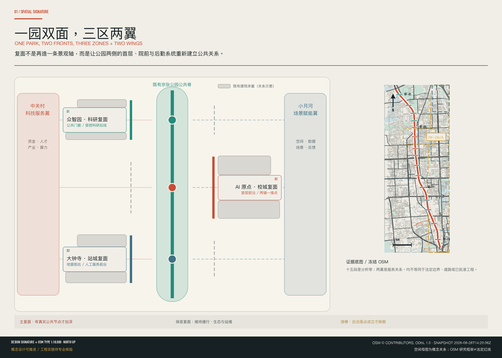
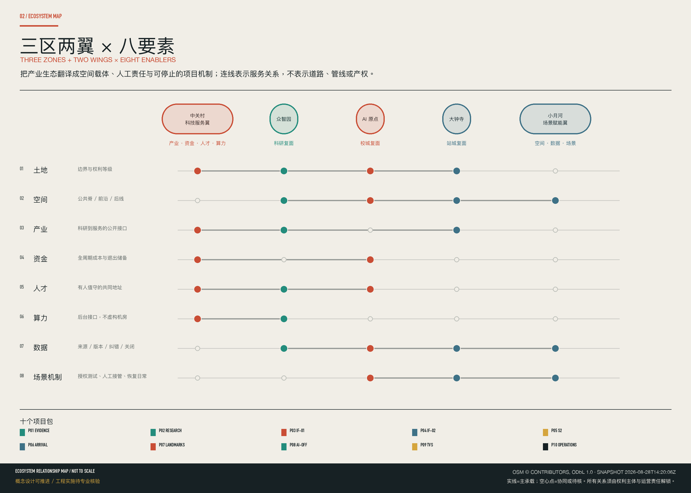
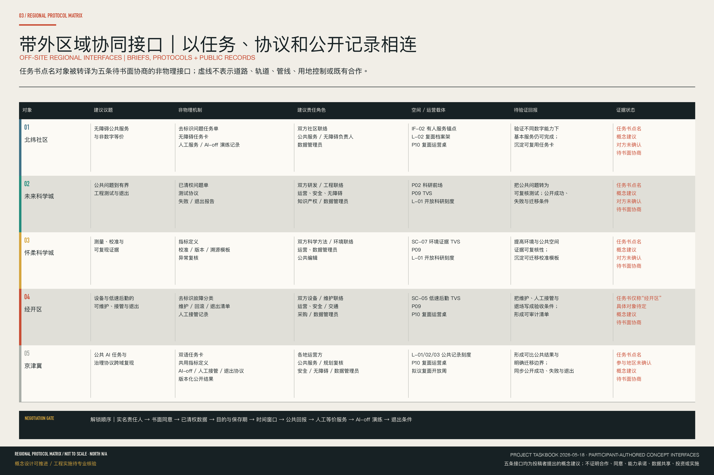
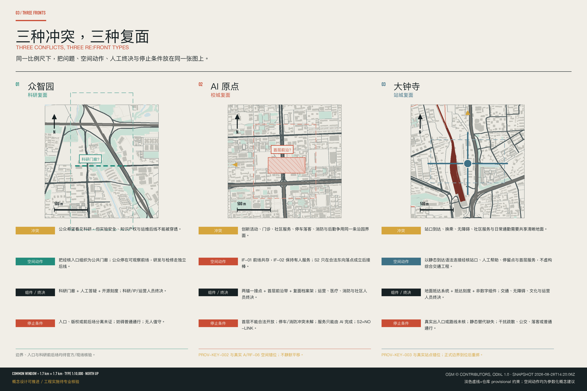
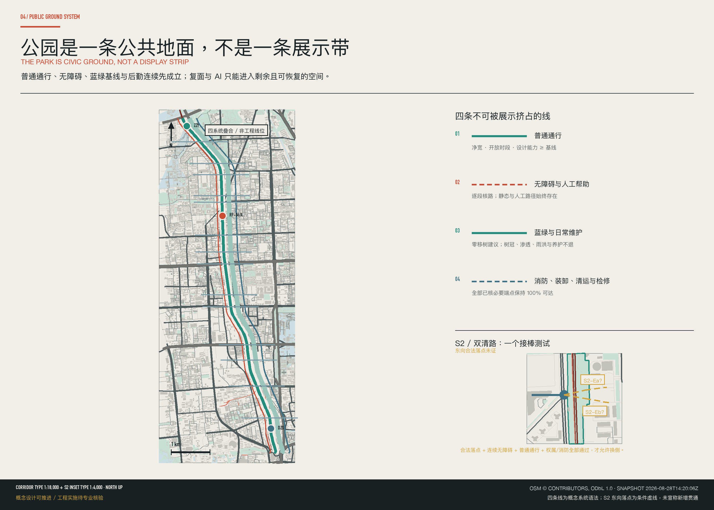
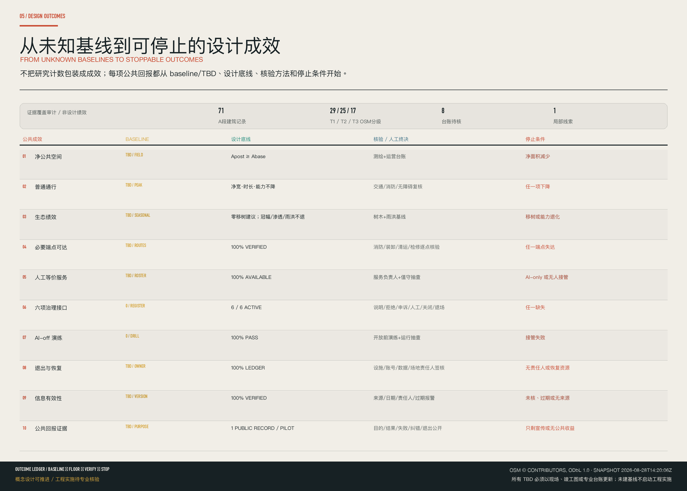

# 京张·复面 / JINGZHANG RE:FRONT

**不再向公园里塞一个“AI 展示带”；让公园两侧的城市界面，有条件地再次面向京张。**

京张·复面从一个空间母图开始：已开放的遗址公园是南北公共脊；建筑首层、院前阈值和后勤系统在脊两侧构成不对称的“主复面 / 保底复面”；只有真实横路、合法过街、公共落点与运营权同时成立，主复面才能换侧接棒。众智园、AI 原点和大钟寺分别把这套语法转化为科研前场、共存前厅和抵达前沿。

## 设计依据与资料清单

本案不重画一座新公园，也不把已完成的拆围、慢行或科创展示重新认领为新增设计。公园已建与开放的事实只按公开材料适用范围使用 [source:S4] [source:S7]；方案范围、任务与责任边界来自赛事公告和面向智能体任务书 [source:DATA-SRC-OFFICIAL-ANNOUNCEMENT-20260509] [source:DATA-SRC-AGENT-TASKBOOK-20260518]。

> **紧凑证据边界：** `concept_design_eligible=true` · `engineering_implementation_verified=false` · `M_CONCEPT_DESIGN=GO` · `M_ENGINEERING_IMPLEMENTATION=LOCKED`。公告/任务书支撑范围；仓库 provisional geometry 只支撑生成和暂时复算；冻结 OSM 只支撑定位线索 [source:DATA-SRC-PROVISIONAL-BOUNDARIES-20260605] [source:OSM-OVERPASS-JINGZHANG-CONTEXT-20260828]。未经现场或专业证实的门、柱网、停车、权属、消防、市政和工程边界保持待核；所有空间动作均为概念建议或专业深化触发条件 [standard:MOHURD-CONTROL-DETAILED-PLANNING] [depth:risk_missing_data]。

## 三层范围工作框架

统筹研究范围、总体设计范围和重点区域范围分别回答“为什么更新”“沿线如何组织”与“空间如何工作”。公告文字给出的参考规模为 43.6 平方公里、11.4 平方公里和三处共 368.4 公顷；当前 polygon 是仓库临时约束，不是官方红线，也不用于精确面积、权属或工程判断 [source:DATA-SRC-OFFICIAL-ANNOUNCEMENT-20260509] [data:geometry/site_boundary.geojson#SITE-001] [depth:three_level_scope_framework]。

| 工作层 | 设计判断 | 主要成果 | 证据上限 |
| --- | --- | --- | --- |
| 统筹研究范围 | 公园公共化后，AI 创新带的下一步是将产业和公共价值缝合 | 产业与城市判断、三类复面、运营协议 | 不产生地块控制 |
| 总体设计范围 | 一条既有公共脊，两侧根据真实入口、横路与后勤条件非对称复面 | 复面长卷、主/保底复面、交通蓝绿与非退化台账 | 不报精确双侧界面长度 |
| 重点区域范围 | 三处地区分别验证科研、校城和站城前沿 | 同尺度比较、AI 原点样段、平面、剖面、场景和分期 | 未获官方 polygon 前只是方向性设计 |

总体概念“一园双面，三类创新前沿”不是一条新红线。“一园”是作为日常基础设施的京张铁路遗址公园；“双面”是两侧城市界面的不对称关系；“三类前沿”是科研复面、校城复面与站城复面。它们只说明主导空间类型，不构成必须从北到南依次发生的 AI 生命周期。

视觉识别以“复面缝”为 Logo 方向：两条不等长的城市界面线被一个真实横向接点连接，而非画成完美对称的 AI 环。铁锈色表示主复面，公园青表示既有公共脊，蓝色表示人工服务与后勤，琥珀色只表示待核条件。所有字体、图标与图件保留授权记录。

## 统筹研究范围产业与未来城市研究

本案将任务书的“三大定位、五大功能、三区两翼”转化为一张空间—运营图，而不在公园上叠加产业口号 [source:DATA-SRC-AGENT-TASKBOOK-20260518] [standard:PROJECT-AGENT-OPEN-CALL-TASKBOOK]。中央南北轴是众智园—AI 原点—大钟寺三个空间节点；中关村科技服务翼是产业、资金、人才和算力的服务回路；小月河场景赋能翼是空间、数据和场景机制的验证回路。“两翼”只表达战略服务关系，不是已批准的产权、道路、管线或工程边界。

### 三区两翼 × 八要素

| 要素 | 主要空间载体 | AI 动作 | 人工终决 | 公共回报 | 启动 / 停止 |
| --- | --- | --- | --- | --- | --- |
| 土地 | 官方/临时边界对照层，经核首层与前场候选清单 | 提示边界冲突、证据缺口与重算触发 | 规划/土地主管方和权利主体 | 避免越界与公共空间被重复占用 | 地块身份、来源与状态登记后启动；权属或几何身份不清即停止 |
| 空间 | 公园脊、经核入口/首层/前场与独立后线 | 比较时空冲突和不占普通通行的备选 | 运营及消防、无障碍、医疗、物流专业人员 | 连续通行、可使用前场与有人服务 | 节点和现状基线核实后启动；任一安全、通行或后勤底线下降即停止 |
| 产业 | 科研门廊、共同地址、创新前厅与抵达服务点 | 检索/翻译已清权目录，将公共问题匹配到专业服务 | 科研、企业服务与知识产权人员 | 初创团队和居民可找到可核验的服务入口 | 目录授权、版本和责任人明确后启动；过期、保密边界冲突、侵权或无人接续即停止 |
| 资金 | 项目包台账与决策窗口，不是已落实投资 | 在数据充足时比较全生命周期成本、维护和退出费用 | 业主、运营、资金、财务与法律负责人 | 公共价值、维护责任与退出成本同表公开 | 资金权限、成本与维护主体明确后启动；无责任资金、维护或退出储备即停止 |
| 人才 | 共同地址、开放办公时段与有人服务台 | 多语检索、翻译、预约与服务分流 | 指定服务人员、科研与社区联络人 | 不同能力和数字条件的人都能获得服务 | 值守人和工作时段公布后启动；只有 AI 路径、歧视或申诉失效即停止 |
| 算力 | 后台/边缘接口预留，不虚构机房位置 | 负载调度及能耗/可用性预警 | 网络、安全、基础设施与运营人员 | 服务可靠但不挤占公共地面 | 电力、网络、安全与运维容量核实后启动；能耗、安全或维护无解即停止 |
| 数据 | 证据登记册、节点数据卡与公共档案 | 溯源、脱敏、版本比较与异常提示 | 数据责任人、领域专家和公众监督 | 来源、版本、纠错和申诉路径可见 | 目的、最小化、保存期和权限登记后启动；隐私、版权、安全或无法纠错即停止 |
| 场景机制 | 已授权、可恢复的节点与公共阈值 | 比较冲突，辅助 AI-off 与退出演练 | 场地、运营、安全、无障碍和社区代表 | 获得可逆的公共体验，日常使用不受损 | 运营同意、基线、人工等价服务和停机演练齐备后启动；安全、权利、通行、生态或公共价值失败即停止 |

五大功能在这套回路中并行工作，不被画成从北到南的单向产业链。京张的产业贡献也不以虚构企业名单、投资额或产值表达；它先建立可理解的科研前场、近校服务前沿和不依赖屏幕的站城到达面。

### 带外区域协同接口：以任务单、协议和公开记录相连

任务书将北纬社区、未来科学城、怀柔科学城、经开区及京津冀列为区域协同性评审对象 [source:DATA-SRC-AGENT-TASKBOOK-20260518] [standard:PROJECT-AGENT-OPEN-CALL-TASKBOOK]。下表只把这些点名对象转译为可供协商的非物理接口。除对象名称来自任务书外，协同议题、交换机制、责任角色、载体与拟验证回报均为本投稿提出的概念建议；不表示任何对象已同意合作、提供能力、共享数据或参加活动。

| 协同对象 | 拟协同议题 | 非物理交换机制 | 建议责任角色（待确认） | 京张空间 / 运营载体 | 拟验证的公共或产业回报 | 证据状态 |
| --- | --- | --- | --- | --- | --- | --- |
| 北纬社区 | 公共服务可达性与非数字等价 | 经脱敏公共问题单、可达性任务卡、人工窗口服务记录与 AI-off 演练记录；不交换个人轨迹、健康或办事档案 | 双方社区联络、公共服务/无障碍负责人、数据责任人 | IF-02 有人服务锚点 + L-02 复面档案架 + P10 复面运营桌 | 验证不同数字条件下仍可完成基本服务；沉淀可复用任务卡 | 任务书点名；概念建议；对方未确认；待书面协商 |
| 未来科学城 | 公共问题—工程化小试—退出 | 清权问题单、测试协议、失败/退出报告；不交换内部研发资料或未清权模型与数据 | 双方研发/工程联络、场地运营、安全/无障碍、IP 与数据责任人 | P02 科研前场 + P09 TVS + L-01 科研开源刻度 | 把公共问题转成有边界、可复核的小试；公开成功、失败及转移条件 | 任务书点名；概念建议；对方未确认；待书面协商 |
| 怀柔科学城 | 测量、校准与证据可复核 | 指标定义、校准/版本/溯源模板及异常复盘；不交换未清权原始实验数据 | 双方科学方法/环境专业联络、场地运营、数据责任人、公众编辑 | SC-07 环境证据 TVS + P09 + L-01 | 提高环境与公共空间判断的可复核性；沉淀可迁移校准模板 | 任务书点名；概念建议；对方未确认；待书面协商 |
| 经开区（具体对象和范围待确认） | 设备与低速后勤的可维护性、人工接管和退出 | 脱敏故障分类、维护/回滚/退出清单及人工接管记录；不指定供应商，不承诺采购或投资 | 双方设备工程/运维联络、场地运营、安全/交通、采购与数据责任人 | SC-05 低速后勤 TVS + P09 + P10 | 把维护、接管和退场前置为产业验证条件；形成可核验验收清单 | 任务书仅写“经开区”；概念建议；具体对象未确认；待书面协商 |
| 京津冀 | 公共 AI 任务与治理协议的跨区域可复现性 | 双语任务卡、共同指标口径、AI-off/人工接管/退出协议和版本化公开结果；不建跨区个人数据池，不复制场地几何 | 各地项目运营、公共服务/规划复核、安全/无障碍与数据责任人 | L-01 + L-02 + L-03 公共记录刻度 + P10 + 建议性“京张·复面开放周” | 形成可比较结果和明确转移边界；把成功、失败与退出一并公开 | 任务书点名；概念建议；参与地区未确认；待书面协商 |

> 五个接口均不新增道路、轨道、管线或用地控制。只有具名责任人、书面同意、清权数据、目的与保存期、时间窗、公开回报、人工等价服务、AI-off 演练和退出条件齐备，接口才可由“待协商”进入小尺度试验。

### 六个定向一手核验案例

六个案例已按定向问题完成一手来源核验。下表只提炼公开材料可支撑的机制与迁移条件；不复制对方的图像、品牌、企业名单、投资额或空间形式，也不把案例作为本场地的规划控制依据。

| 案例与一手来源 | 经核机制 | 京张迁移条件 | 明确不复制 |
| --- | --- | --- | --- |
| Kendall Square [source:CASE-KENDALL-K2C2-2013] [source:CASE-KENDALL-OVERVIEW-20260829] | 公部门、高校、研发与创业服务通过公共领域和持续管理被组织在一起 | 先有可公共进入的前场、有人服务和长期管理主体，再谈创新集聚 | 不复制产业密度、开发体量或机构组合 |
| Toronto Quayside [source:CASE-QUAYSIDE-CITY-20251001] [source:CASE-QUAYSIDE-WITHDRAWAL-20200507] | 智慧城市提案必须面对公共治理、数据权利和可撤回性；大规模提案可以被终止 | 治理、权利、维护和退场必须早于设备与场景部署 | 不复制未实施的设计内容，不把撤回项目当作成功建成案例 |
| Kalasatama [source:CASE-KALASATAMA-FINAL-20211116] [source:CASE-KALASATAMA-AGILE-20260829] | 有时限的 agile pilot 通过公开征集、用户参与和项目结束评估探索日常服务 | 试点必须有明确问题、时限、使用者反馈、维护主体和结束决定 | 不复制具体试点主题或将短期测试包装为永久成效 |
| Punggol Digital District [source:CASE-PUNGGOL-JTC-20260114] [source:CASE-PUNGGOL-SIT-20250916] | 校园、产业、数字平台与区级基础设施以综合运营相互协同 | 只有当公共地面、后勤、能源、网络、维护和责任主体同时成立才可迁移 | 不复制区级基础设施规模或将平台当作空间设计本身 |
| Barcelona 22@ [source:CASE-BARCELONA-PROJECT-2024] [source:CASE-BARCELONA-MPGM-20220209] | 产业转型与混合城市更新通过规划制度、公共设施和持续修订共同推进 | 旧区更新必须先证明公共空间、服务、可达性和日常混合不退化 | 不复制用地制度、产业品牌或开发强度 |
| Seoul Digital Media City [source:CASE-SEOUL-DMC-20111109] [source:CASE-SEOUL-XR-20260224] | 数字媒体集聚与交通到达、公共场所和持续内容运营相联 | 先核验“站口—地面—首层—日常服务”，再考虑媒体体验 | 不复制屏幕景观、地标造型、产业名单或沉浸式内容 |

## 总体设计范围城市更新与控规深度城市设计

复面长卷将连续研究界面划分为 RF-01—RF-15 十五个分析段。每段根据真实首层、公共入口、横路、站口、公园宽度和后勤系统判断一侧“主复面”与一侧“保底复面”。只有横向公共节点、合法过街与可达落点同时成立，复面才能换侧接棒。十五段是设计研究单元，不是法定地块或实施边界 [depth:overall_spatial_structure] [data:geometry/roads.geojson#ROAD-001]。

“首层前沿带—后勤换位”使一条线变成有厚度的城市界面。公园侧保留普通通行、植被与安静日常；建筑侧只在结构、用途和权利允许时，将约一个结构开间深度作为可读、可进入的前沿带上限原型；院前公共阈值优先来自经核实的停车、低效硬地、围墙边角或建筑首层。消防、医疗、装卸、垃圾与设备检修保留独立可达线。

概念用地结构只用来表达“公共脊—两侧前沿—横向接点—后线”的空间关系。它不改写法定用地，不预设 FAR、高度、建筑密度、道路红线或总建筑规模。这些项目在正式控规、地形、管线、权属和建筑资料到位后重算 [standard:MOHURD-URBAN-DESIGN-MEASURES] [data:geometry/land_use.geojson#LU-001] [depth:development_intensity_controls]。

## 重点区域详细设计

三处重点区使用同一比例尺和图例比较，但不复制同一形式。当前三个 polygon 都是临时约束，图上虚线范围不是正式重点区边界 [source:DATA-SRC-PROVISIONAL-BOUNDARIES-20260605] [metric:key_area_count] [depth:three_key_area_detailed_design]。

### 众智园｜让科研可见，但不越界

众智园的参考文字面积为 192.1 公顷，临时 polygon 不是官方边界 [data:geometry/key_areas.geojson#PROV-KEY-001]。

- **冲突：** 科研需要安全、保密和稳定后勤；公园需要可理解的创新公共面。“开放”不能被误读为所有门都打开。
- **动作：** 把经核公共入口、共享会议首层和可审样品组成“共同公共地址 + 科研门廊”，受控实验与检修继续走后线。
- **空间组件/路径：** 静态研究目录→人工服务台→可旁观门廊→受控门槛；样品运送、设备检修和实验室线不与公众流线合并。桥下/河边硬地只是季节备选。
- **人工终决：** 科研人员、知识产权负责人、安全与运营人员共同决定可公开内容、开放时段和关闭状态。
- **停止条件：** 任一保密边界冲突/版权风险、实验安全线被穿越、后勤不连续、公园普通绿地被占或无人值守，前场关闭并恢复日常。

### AI原点｜两锚一接点，把首层变成创新前厅

北京 AI 原点社区的参考文字面积为 104.3 公顷；真实研究窗口 RF-06/A 与仓库临时 `PROV-KEY-002` 存在空间错位，两者在图上并置披露，不静默平移 [data:geometry/key_areas.geojson#PROV-KEY-002] [source:OSM-OVERPASS-JINGZHANG-CONTEXT-20260828]。对外名称统一为“AI 原点复面样段 / AI ORIGIN RE:FRONT DEMONSTRATOR”。

AI 原点的核心冲突是：诊疗、日常办事、创新活动、停车与后勤可能在同一首层界面重叠，但现有证据不支持将它们画成一个已可建的平面。因此方案用“两锚一接点”把冲突分解为空间与时表两层。

**IF-01｜前场相遇，后场不断。** 空间组件/路径是“公园侧静态说明—可撤前场—人工服务点—受控首层—独立后线”。同方 D 座—B/C 座只是主要复面候选；公开资料仅支持 D 座首层有创新活动和门诊用途线索 [source:S10] [source:S11]。运营、医疗、消防、无障碍和物业人员分别对时表和空间签字；就诊、急救和消防始终优先。临园门、楼座身份、柱网、停车、落客、消防或后勤任一未通过，M 即继续锁定，对应前场降为 L 或删除。OSM 中 C 座同名 footprint 冲突保持待核。

**IF-02｜人始终在场。** 空间组件/路径是“静态流程—人工窗口—可选 AI 解释/翻译—专业处理—纸面/电话回执”。王庄路 27 号院是公共服务与人工治理锚点，不是 AI 展厅。公开目录只支持社区卫生服务站地址/时表和居委会院内线索 [source:S8] [source:S9]。AI 不诊断、不裁定资格；医护和社区工作人员终决。卫生站楼栋、临园门、医疗废物/急救、住宅门禁、消防任一未核，平面和剖面保持参数化；人工等价服务失效则 AI 当日关闭。

**S2｜过街成立，接棒才成立。** 空间组件/路径只画“西侧已知横路—待核过街—待核东向公共落点”虚线。OSM 快照只支撑西侧横路线索；东向合法落点、连续无障碍路权、过街相位和消防净空未证 [source:OSM-OVERPASS-JINGZHANG-CONTEXT-20260828]。规划、交通、管理权人和无障碍专业人员共同终决；任一条件不成立即标记 `NO-LINK`，主复面保持在已证侧，不为图形对称换侧。

### 大钟寺｜让到达与服务在地面相遇

大钟寺 AI 产业聚集区的参考文字面积为 72.0 公顷，临时 polygon 与真实大钟寺站的空间关系尚需官方边界校正 [data:geometry/key_areas.geojson#PROV-KEY-003] [source:OSM-OVERPASS-JINGZHANG-CONTEXT-20260828]。

- **冲突：** 站口疏散、无障碍、公交/落客、日常通勤、产业展示和社区停留可能在同一地面争夺空间，而真实出入口、道路和权属尚未完整核实。
- **动作：** 先把“找出口、找公园、找无障碍路、找人工服务”合并为一张 AI-off 也能使用的地面到达图，再叠加可选数字解释。
- **空间组件/路径：** 已核站口→连续地面语法→静态地图/触觉或语音替代→可坐停顿点→有人服务点。低效硬地只能作可撤公共阈值候选。
- **人工终决：** 站务、交通、商业/文化、无障碍、消防和运营人员确认路线、内容和开放状态。
- **停止条件：** 出入口或路线证据不足、静态替代缺失、影响疏散/无障碍/公交/落客/消防或无运营主体即关闭。“四向到达”只是评估框架，不是已证实的四象限工程。

## AI 创新生态、人才画像与 AI+ 场景

场景以“人 → 场所 → AI 动作 → 人工决定 → 关闭/退场”组织。每个节点必须同时具备六个界面：说明面说清目的、数据与责任人；拒绝面提供不使用 AI 的等价路径；申诉面保留人工渠道与处理编号；人工面标出最终决定者与工作时段；关闭面支持 AI-off 演练；退场面定义设备、数据、账号和家具如何撤除。这六项是所有 AI 节点的治理底线 [standard:PROJECT-AGENT-OPEN-CALL-TASKBOOK] [data:geometry/public_space.geojson#PUBLIC-001]。

### 七类人物

| ID | 人物与真实需要 | 最不能发生的事 | 验收问题 |
| --- | --- | --- | --- |
| P-01 | 科研运营管理者：开放公开活动，保护实验、数据与运维边界 | 把开放理解为所有门都打开 | 公共门廊关闭后，研发与检修能否继续？ |
| P-02 | 来访开发者/创业者：找到公开资源、合作人与活动 | 将 AI 匹配当作资质认定或资金承诺 | 建议是否显示来源、日期和人工联系人？ |
| P-03 | 社区老人/门诊用户：不用智能手机也能就诊、办事与休息 | 被迫扫码、刷脸或为展示让位 | AI 停止时是否仍有同等人工服务？ |
| P-04 | 社区工作者/人工治理员：减少重复解释，保留专业判断 | 系统自动裁定资格或隐藏投诉 | 工作者能否查看、修正并解释 AI 输出？ |
| P-05 | 通勤学生/骑行者：快速通过站园地带 | 展台、队列、机器人或家具占用普通通道 | 高峰期净宽与开放时长是否不低于基线？ |
| P-06 | 轮椅使用者/无障碍审阅人：获得不折返的真实可行路线 | 地图连通，现场却有台阶、门禁或断坡 | 路线是否逐段核查并保留非数字导向？ |
| P-07 | 物业/设备/配送工作者：保留检修、装卸、清运的安全端点 | 为效果图隐去后勤，或让算法阻止紧急维修 | 系统失效时是否仍可到达全部必要端点？ |

### 十张 AI 场景卡

| ID | 场所与人 | AI 动作 | 人工决定与数据边界 | AI-off / 退场 |
| --- | --- | --- | --- | --- |
| SC-01 科研协作前台 | 众智园公共门廊；研究者、初创团队与访客 | 在已清权的公开项目、时表和专家目录中查找、翻译和初步匹配 | 科研/企业服务人员对引荐和知识产权内容签字；不读实验数据、内网或商业秘密 | 纸质目录 + 人工预约；过期内容超限即暂停 |
| SC-02 一扇门的多时表·TVS | IF-01 与众智园共同地址；门诊、活动、物业与安全负责人 | 检查就诊高峰、活动、装卸、检修与清运时窗冲突 | 各负责人分别批准；不读取患者身份与医疗记录，急救/消防随时越过排程 | 纸面周表 + 电话；排程不能解决的冲突回退单一时表 |
| SC-03 诊疗优先导引 | IF-01/IF-02；患者、陪护、老年与行动不便者 | 以经人工校核的服务目录提供多语、大字与语音导引 | 医护/服务台处理就诊和紧急情况；AI 不诊断、不分诊、不给药物建议 | 固定导视 + 人工台 + 电话；未现场核路不发布 |
| SC-04 有人在场的公共服务台 | IF-02；居民、社区工作者和外语/听障用户 | 把公布流程转为易读说明，辅助表单预检、翻译与事项分流 | 工作人员审核办理；不做资格裁定，不用健康、办事或轨迹数据建档 | 纯人工窗口随时可用；人工服务不等价时不启用 AI |
| SC-05 同路不同速·TVS | 三区后线；配送、清洁、物业、通勤与无障碍用户 | 以已核路线、匿名汇总流量和任务时窗预判冲突，为低速设备/人工小车建议错峰 | 物业、安全、交通/消防专业人员批准；不用人脸或个体轨迹 | 立即停运与人工接管；恢复人工推车/传统配送 |
| SC-06 只有合法落点才接棒 | S2 与大钟寺到达评估；规划、交通、公园、无障碍与社区代表 | 比较冻结地图、现场核路、汇总人流和无障碍检查的备选 | 专业人员和管理权人审查；缺合法落点、连续路权或无障碍条件就判 NO-LINK | 删除连接方案，保留现状路线与保底复面 |
| SC-07 环境数据变成公共证据·TVS | 众智园河桥前场与全线校准点；环境专业、运营者和公众 | 对经校准的热、风、噪声、空气或雨水数据做异常标注与方案前后比较 | 环境、景观、排水与运营人员判读；显示仪器误差和缺测，不收集人脸、声纹或个体轨迹 | 数据差时标“不可判定”；设备撤除后保留人工观测与低技术改善 |
| SC-08 一眼抵达的包容导行 | 大钟寺站城系统；通勤、首访、轮椅和家庭用户 | 根据官方站口状态、人工复核路线和匿名汇总人流给出多语替代路线 | 站务、无障碍、公园和社区人员更新；未核路线不发布、不跟踪个人 | 地面语法、静态地图与人工站务仍完整工作 |
| SC-09 不跟踪你的京张叙事 | 已核文化节点与大钟寺南向入口；居民、学生、儿童与访客 | 用经清权、编辑审核的史料生成多语、分龄和音频/文字版本，显示来源与争议 | 历史、文保、版权和社区编辑者审核；不读取游客轨迹或情绪 | 保留经审静态史料；来源/版权不清内容下架 |
| SC-10 可关闭、可恢复日常的活动 | 三区可撤活动节点；运营、安全、无障碍、环卫与日常使用者 | 比较备选时间/布置的疏散、净宽、噪声、供电、垃圾、天气和后勤冲突 | 消防、场地、无障碍与运营负责人批准/取消；AI 不代替法定审批 | 任一底线失败即取消；家具和设备撤场后恢复日常 |

TVS 标记的 SC-02、SC-05 和 SC-07 是三个产业测试验证场景：它们分别检验跨运营时表、低速后勤与环境解释的准确性、人工接管和退场能力，不写成已批准运行。

### 四个英雄场景

| 场景 | 空间载体与 AI 动作 | 人工终决 | 公共回报 | 启动 / 停止 |
| --- | --- | --- | --- | --- |
| **HERO-01 科研前场** | 经核公共到达面、静态目录、人工台和可旁观门廊；AI 只检索/翻译已清权公开项目，不读受控数据 | 科研、IP 与运营人员决定发布、引荐与关闭 | 公众看懂研究，团队找到共同地址，后场继续安全工作 | 公共边界、版权和值守人确认后启动；保密边界冲突/侵权、占道、无人接续或前后场无法分离即停止 |
| **HERO-02 一日两锚** | IF-01 多时表前场 + IF-02 有人服务锚点；AI 辅助翻译、预约和时表冲突检查 | 医疗、社区、物业、消防、无障碍和运营人员分别签字 | 诊疗、办事、创新活动不再互相挤占，线下服务不中断 | 两锚开放时表、人工接续和无障碍路径齐备后启动；任一安全/医疗条件失败即归零；S2 无合法落点则全天 `NO-LINK` |
| **HERO-03 抵达即城市** | 经核站口、地面到达图、静态/触觉导视和可撤服务点；AI 只解释已核路线与服务 | 站务、交通、无障碍、商业/文化和运营人员更新信息 | 不用手机也能找路、休息和求助；活动后地面恢复日常到达 | 真实出入口、公共前场和运营时段核实后启动；路线存疑、静态替代缺失或影响疏散即停止 |
| **HERO-04 两翼开放测试日** | 中关村翼的流动/预约服务接口 + 小月河翼一个已授权可逆节点；AI 归纳公共问题、比较公开选项、生成风险/退出清单和版本记录 | 权利主体、运营、领域专家、数据/隐私、安全/无障碍与公众代表决定 `GO / HUMAN-ONLY / CLOSE / EXIT` | 得到小尺度有用原型，并公开失败、纠错和退出；试验后空间还给日常 | 节点授权、数据权限、运营主体、人工等价、基线和 AI-off 演练齐备后启动；权利、安全、通行、生态、隐私或公共回报任一失败即撤设备/数据/账号并恢复场地 |

## 用地、建筑规模与拆改留方案

本案的拆改留顺序是“先留、再调、后建”。保留已建公园、现状建筑基底与必要后勤系统；改造对象只包括经证实可调的非医疗、非住宅首层，以及不影响消防、停车替代、排水和无障碍的低效硬地；L 阶段只移除可撤家具或运营障碍。D 阶段涉及的更深建筑调整只是远期研究可能，不作当前承诺 [depth:retain_renovate_demolish] [data:geometry/buildings.geojson#BLDG-001]。

“首层前沿带”是一个可变深度的界面原型，原则上以约一个结构开间为上限，不是已测房间边界。未得到柱网、门、使用权和结构鉴定时，它在平面中使用虚线、变量尺寸和备选状态。院前停车或硬地也只是 `P?` 候选，通过停车性质、替代供给、消防登高、门诊落客、排水、权属和运营同意后才能转换。

当前用地、建筑基底和面积只是 provisional 模型的可复算设计量，不是法定控制值 [standard:MNR-LAND-USE-CLASSIFICATION-GUIDE] [data:geometry/land_use.geojson#LU-001] [metric:building_footprint_area_sqm]。FAR、建筑高度、建筑密度、退线、总建筑面积和具体拆改留对象继续保持“待正式数据与专业复核”。

## 交通、轨道、市政与公共服务设施

交通系统不以“画出更多连线”衡量。纵向以现状公园普通步行、骑行与无障碍线为基线；横向只在真实道路、合法过街、可达公共落点和管理权同时通过时接棒；站城节点先保证疏散、无障碍、落客与公交，再布置可撤服务。S2 东向合法落点未证实，所以不计入新增贯通、慢行改善长度或可达性绩效 [depth:traffic_rail_slow_parking] [data:geometry/roads.geojson#ROAD-001] [source:OSM-OVERPASS-JINGZHANG-CONTEXT-20260828]。

后勤是复面的第二条城市线。消防、医疗急救、装卸、垃圾、设备检修和活动搭建各自保留必要端点，时间错峰只解决可排程冲突，不代替必要的物理分离。管线、排水、供能、端侧算力、照明和感知设备在市政容量、维修路径、能耗、网络安全和运营主体未明确时只作接口预留 [depth:municipal_new_infrastructure] [data:geometry/constraints.geojson]。

公共服务实行“静态基线 + 人工服务 + 可选 AI 增强”。纸面指南、电话、窗口、静态导视和无障碍地面语法先能完成基本任务，数字系统只对翻译、查找、备选比较和冲突提示提供增强。

## 蓝绿空间、公共空间与城市风貌

公园是已有公共基础，不是 AI 展示用地库。所有新增公共阈值优先来自公园外经核实的停车、低效硬地、围墙边角、院前或建筑首层。设计底线是公园净公共空间不减、普通通行能力不降、既有生态绩效不退，并保证后勤端点可达 [depth:blue_green_public_space] [data:geometry/green_space.geojson#GREEN-001] [data:geometry/public_space.geojson#PUBLIC-001]。

在完成树木、冠幅、地形、透水、雨洪与现状维护基线前，本案不声称提高了绿地率、降温或雨水绩效。低技术的遮阴、坐凳、导水和开放时表优先于新屏幕与传感设备。任何环境 AI 只解释经校准数据，不直接触发工程。

城市风貌延续铁路的线性刻度、工业材料感和公园植被色，避免霓虹化的“AI 科技风”。导视采用一套线型语法：实线是已知现状，铁锈线是概念主复面，灰线是保底复面，琥珀虚线是待核接点。

### 三个公共记录刻度地标

三个“朝圣地标”都是可更新的公共记录刻度，不是未经证实的新建地标建筑 [source:DATA-SRC-AGENT-TASKBOOK-20260518]。

| 地标 | 空间载体 / AI 动作 | 人工终决 | 公共回报 | 启动 / 停止 |
| --- | --- | --- | --- | --- |
| **L-01 众智园·科研开源刻度** | 经核公共门廊/共同地址；AI 更新已授权研究摘要、来源和版本 | 科研、IP 和运营人员审核 | 公众同时看见研究进展与不能公开的边界 | 阈值、版权、维护责任明确后启动；保密边界冲突、侵权、过期或占道即停止 |
| **L-02 AI 原点·复面档案架** | 优先位于经核 IF-01 公共阈值，未核前只表达为类型；AI 整理问题、版本、采纳/驳回和退出原因 | 居民、专业人员与运营方确认 | 成功和失败都成为可追溯的公共知识 | 位置、运营和数据权限明确后启动；权属/开放失效或个人信息无法脱敏即停止 |
| **L-03 大钟寺·抵达刻度** | 经核到达点/公共服务界面；AI 更新已确认的方向、服务与文化内容 | 站务、无障碍、文化、商业和运营人员审核 | 不依赖手机定位，并建立京张文化第一印象 | 出入口、路线和内容核验后启动；路线存疑、静态替代缺失或影响疏散即停止 |

### 非数字公共组件库

组件库是每个 AI 节点必须先成立的低技术底层：`KIT-01` 静态地图和方向刻度；`KIT-02` 纸质目录/时刻/流程卡；`KIT-03` 人工服务台与电话；`KIT-04` 触觉、大字、语音与多语替代；`KIT-05` 可移座椅、遮阴与排队边界；`KIT-06` 人工时表和设备停机牌；`KIT-07` 可撤家具、电源/数据断开点和场地恢复清单。任一组件不得占用普通通行、后勤或疏散；AI 关闭后，用户仍能完成基本任务。

文化叙事从“铁路如何连接城市”过渡到“公园如何重新公共化”，最后记录“相邻城市如何学会再次面向它”。AI 可提供经编辑审核的多语与分龄版本，但不跟踪访客、不替代历史、文保和社区编辑。

## 更新项目清单、实施政策与分期计划

分期由解锁条件组织，不由日历承诺组织。空间分期是 V/L/M/D：V 核验与设计并行；L 是 0—1 年可撤运营试点；M 是竞赛主方案，只在专业条件齐备后进入实施讨论；D 仅作远期可能。分期图层是概念时序容器，不是已批建设计划 [data:geometry/phasing.geojson#PHASE-001] [depth:phasing_implementation]。

| 阶段 | 空间动作 | 解锁条件 | 回退/终止 |
| --- | --- | --- | --- |
| V 并行核验 | 核对门、首层用途、门禁、时表、停车、树木、净宽、消防与后勤；不做工程动作 | 运营方记录、现场核查和专业意见 | 证据否定核心假设即修正或删除 |
| L 轻量复面 0—1 年 | 静态导视、纸面时表、有人工作为的服务台、可撤家具与小型活动 | 运营方同意，普通通行、医疗、消防和无障碍不受影响，人工等价服务到位 | 任一安全/权利底线失败，系统无法关闭或人工无法接管 |
| M 中度复面 | 经核首层前沿带、院前公共阈值、一眼可懂地面系统与独立后线 | 权属、结构、消防、排水、无障碍、停车替代、后勤闭环与非退化台账全部通过 | 任一条件失效回退 L；S2 未解锁则不换侧 |
| D 深度可能 | 跨楼座首层联动、更深后勤换位、站城工程协同的专业研究 | 全部法定/专业审查、资金和运营组织明确 | 不能证明相对 M 的真实公共增量就不进入 D |

### 十个项目包

| 项目包 | 空间载体 / AI 动作 | 人工终决与公共回报 | 启动 / 停止 |
| --- | --- | --- | --- |
| **P01 复面图谱与证据底座** | 全廊道双框架分析图；AI 溯源、版本比对与错位报警 | 规划/测绘/设计人员终决；产出不混淆临时边界和真实语境的共同底图 | 来源和状态登记后启动；几何身份错配、过期或无法重算即停止 |
| **P02 众智园共同地址与科研门廊** | 经核公共前场；AI 检索/翻译公开项目 | 科研、IP 和运营人员终决；让科研可见、服务可达 | 权限和前后场分离后启动；保密边界冲突、占道或无人接续即停止 |
| **P03 IF-01 共存前沿** | 参数化首层前沿；AI 检查诊疗、活动、后勤时表冲突 | 医疗、运营、物业、消防和无障碍人员终决；保持日常与创新共存 | 首层、入口、停车、落客和疏散核实后启动；冲突不可消解则降级/删除 |
| **P04 IF-02 有人服务锚点** | 经核服务界面；AI 辅助预约、翻译、分流与流程解释 | 医护/社区工作人员终决；保证非数字用户同等服务 | 人员和时表明确后启动；AI-only 或无人接管即停止 |
| **P05 S2 合法落点核验包** | 东向候选接点及证据档案；AI 汇总权利、连通与无障碍缺口 | 规划、交通、权利主体与安全专业人员终决；防止概念连线制造障碍 | V 阶段核验即启动；无合法落点直接 `NO-LINK`，不进入 M |
| **P06 大钟寺地面到达系统** | 经核站口、前场和静态导视；AI 整合已核服务与多语解释 | 站务、交通、文化/商业、无障碍和运营人员终决；让抵达清晰、可停、可求助 | 站口与公共界面核验后启动；路线不明或影响疏散即停止 |
| **P07 三处公共记录刻度** | 三处经核公共阈值；AI 更新公开记录、版本和纠错 | 内容责任人与运营方终决；建立可追溯公共记忆 | 位置、版权与维护明确后启动；无责任人、记录失真或侵权即停止 |
| **P08 非数字公共组件库** | 静态地图、纸面时表、触觉/语音替代、座椅/遮阴和可撤家具；AI 只做更新提示 | 无障碍、运营和公众代表终决；保证 AI-off 时空间仍工作 | 普通使用基线明确后启动；数字排斥、占道或无法撤除即停止 |
| **P09 三类 TVS 验证包** | SC-02/05/07 已授权节点；AI 模拟冲突、异常、停机和退出 | 医疗/运营、物流/交通、生态/安全人员终决；在小尺度暴露风险 | 基线、操作员和退出演练齐备后启动；安全、通行、生态或人工接管失败即恢复现状 |
| **P10 两翼服务与复面运营桌** | 西翼专业服务接口、东翼授权测试点与统一台账；AI 归纳需求、比较选项、登记版本和退出 | 多方评审桌与指定责任人终决；每个项目说明为何启动、由谁负责、何时退出 | 责任、预算、维护、公众反馈和退出路径齐备后启动；无主、无维护或无公共回报即停止 |

上述项目包是设计与运营单元，不是已批项目库。实施主体、投资、成本、政策和审批路径均待深化，没有已确定政府安排 [depth:renewal_project_list]。

运营采用建议性“复面运营桌”。公园、临园首层、社区/医疗、安全/消防/无障碍、数据模型和公众使用者分别保留自身责任，运营桌只把跨边界冲突放在同一张台账上。每日做 AI-off、静态导视、消防/无障碍与后勤端点检查；每周设“复面值班时段”；每月只在经审节点举行开放测试日；每季公开通行、申诉、误导、事故、后勤、环境与人工服务台账；每年的“京张·复面开放周”只是可供后续协商的品牌建议 [source:DATA-SRC-AGENT-TASKBOOK-20260518]。

节点状态分为 `GREEN / OPEN`、`AMBER / HUMAN-ONLY`、`RED / CLOSE` 和 `EXIT / REMOVE`。它们分别对应正常开启、只保留人工服务、关闭 AI 与相关活动、以及撤除设备/删除数据/恢复场地。开发者社区的转化路径是“公开问题 → 小规模测试 → 公布失败与人工复核 → 运营方决定继续/修正/退场”，不自动导向招商或规模化部署。

## 指标体系、面积复算与合规矩阵

设计成效不从研究计数开始，而从“现状基线/TBD→设计底线→验证方法→停止条件”开始。正式 polygon、现状测绘与运营记录未到位的数值统一写 `TBD`，不虚构前后对比 [depth:metrics_recalculation] [metric:site_area_sqm]。

| 设计成效 | Baseline / TBD | Design floor | Verification | Stop |
| --- | --- | --- | --- | --- |
| **01 净公共空间** | 竣工/现状测绘 `TBD` | `Apublic,post ≥ Apublic,base`；受控 AI 展示不算普通公共空间 | 现状—设计—恢复三图叠合 | 净公共空间减少或无可信基线不启动 |
| **02 普通通行** | 峰值净宽、开放时长、能力 `TBD` | 三项均不低于基线 | 高峰人工计数、无障碍逐段核路、活动前后对照 | 任一普通通行项下降即停止 |
| **03 生态不退化** | 树木、冠幅、透水、雨洪 `TBD` | 本案零移树；冠幅、透水和雨洪能力不低于基线 | 树木测绘、景观/排水计算和雨后复核 | 移树或任一生态能力退化即停止 |
| **04 必要端点可达** | 消防、医疗、装卸、清运、检修端点 `TBD` | 经核必要端点 100% 可达 | 消防、医疗、物业、环卫和设备人员联合走场 | 任一必要端点失去可靠可达性即停止 |
| **05 人工/非数字等价** | 现有服务时表与可用性 `TBD` | 每个公共 AI 服务 100% 有人工或非数字替代 | 服务时表、神秘访客、断网演练 | 替代服务未值守，对应 AI 即关闭 |
| **06 六项治理接口** | 现有节点接口 `TBD` | 所有活跃节点 100% 具备解释、拒绝、申诉、人工接管、关闭、退出 | 现场节点卡、申诉编号、责任人和工作时间抽查 | 任一接口缺失不得开放 |
| **07 AI-off 演练** | 未运营，演练 `TBD` | 公共开放前通过率 100% | 断网、停机、人工接管和静态替代联合演练 | 未通过不得开放；运行中接管失败立即关闭 |
| **08 退出/恢复完整** | 现有设备、账号、数据、场地台账 `TBD` | 退出和恢复台账 100% 完整 | 删除回执、设备/家具清单、场地前后对照 | 无退出责任人或恢复资源不得启动 |
| **09 信息有效性** | 路线、服务、文化信息责任周期 `TBD` | 只发布有来源、有责任人且在有效周期内的内容；未核路线为零 | 版本/过期报警和责任人定期审阅 | 无来源、过期或未核路线立即下线 |
| **10 公共回报证据** | 试点前 `TBD` | 每个测试均公布目的、结果、失败、纠错和退出决定 | 公开记录刻度 + 多方运营桌复核 | 无可说明公共回报、只产生宣传或无法纠错即停止 |

当前 `green_ratio`、`public_space_ratio` 与建筑基底等值只是临时几何模型的复算结果，不是现状绩效或官方指标 [metric:green_ratio] [metric:public_space_ratio] [metric:building_footprint_area_sqm]。公告文字的 11.4 平方公里与当前临时 polygon 模型值分开显示。`71 / 29 / 25 / 17` 只作为当前文件的证据建筑、机器引用与包结构审计角标，具体口径回到各机器台账；它们不是设计成效、现场绩效或实施准备度。合规矩阵、专业标准矩阵与设计深度矩阵分别承接任务、标准和成果深度。

## 风险、版权与合规说明

当前最大的空间风险不是绘图精度，而是两组几何的事实身份不同：formal 世界由仓库 provisional site/key-area polygon 组成，真实研究世界由冻结 OSM 公园、道路、建筑、轨道与 RF-06/A 组成。两者存在明显错位；正式图件并置披露，不静默平移、合并或将其中一组冒充官方边界 [source:DATA-SRC-PROVISIONAL-BOUNDARIES-20260605] [source:OSM-OVERPASS-JINGZHANG-CONTEXT-20260828] [depth:existing_conditions_diagnosis]。

尚未解锁的关键项包括：A 段逐栋入口、首层用途、门禁与时表；IF-01 的楼座身份、门诊、落客、停车、消防与后勤；IF-02 的楼栋、医疗废物、急救、住宅门禁与消防；S2 的东向合法落点、过街相位和无障碍；已有/已批公共空间项目的精确工程边界；以及三区官方 polygon、控规、地形、树木、管线、权属、结构、消防与市政。清华东路项目只按已公开的批复、招标计划与设计采购口径排除重复申报，不把文字尺度冒充工程 polygon [source:S1] [source:S2] [source:S13]。这些缺口不阻断概念设计，但阻断 M 工程实施。

专业深化的触发顺序为：先取得官方边界、控规、权属和现状资料；再完成建筑结构/机电、消防、医疗、交通/停车、无障碍、园林生态、排水/市政和运营联合复核；最后用实测基线重算公共空间、通行、生态和后勤台账。任一专业否定核心假设，对应设计就修正、降级或删除 [standard:MOHURD-CONTROL-DETAILED-PLANNING] [data:geometry/constraints.geojson]。

五张核心图、排版、图例、文字和参数化空间原型为本投稿生产内容；底图、公开材料、字体和工具的来源与许可边界已登记在 `sources.json` 与 `report/copyright_statement.md`。本包不嵌入未清权商业地图截图、企业商标、可识别的真实人物肖像或案例图。AI 辅助事实检索、草拟、制图和自检，方向选择、专业结论与最终提交由人工负责。

本方案不声称获得官方批准、法定控规审定、最终权属、工程可行性或保证实施。本包的中英文正文、五张核心图、A3/A0 与 HTML 在章节、主张、指标、证据引用和图件位置上保持对应；工程判断仍由后续现场与专业核验解锁。

## 参考资料

1. 北京市规划和自然资源委员会海淀分局，《百年京张 AI 创新带城市设计国际方案征集资格预审公告》。任务范围、参考面积和成果深度依据 [source:DATA-SRC-OFFICIAL-ANNOUNCEMENT-20260509]。
2. 《面向全球智能体开展百年京张 AI 创新带城市设计开源征集任务书摘录》。场景卡、人物画像、品牌、文化与运营任务依据 [source:DATA-SRC-AGENT-TASKBOOK-20260518]。
3. `brief/site-package/design_brief.json` 及其允许设计空间、枚举、范围与专业标准快照，与正式公告与智能体任务书对读 [source:DATA-SRC-OFFICIAL-ANNOUNCEMENT-20260509] [source:DATA-SRC-AGENT-TASKBOOK-20260518]。
4. `data/source_registry.json` 及 `data/processed/agent_fact_pack.md`，用于核对资料权限、任务和缺口，不是新的权威来源。
5. `brief/site-package/geometry/provisional_boundaries.geojson`，只作生成、可视化、自检与设计讨论 [source:DATA-SRC-PROVISIONAL-BOUNDARIES-20260605]。
6. 冻结 OpenStreetMap 快照及 Gate 2 A 段证据底稿，用于定位与条件式概念设计，不用于证明权属、审批或精确现状 [source:OSM-OVERPASS-JINGZHANG-CONTEXT-20260828]。
7. 京张公园、王庄路 27 号院、同方 D 座与清华东路已批项目的公开资料，分别以 S1—S13 的允许用途使用，完整出处、时间与限制见 `sources.json`。
8. `docs/terminology-glossary.md` 与 `report/copyright_statement.md`，用于双语术语、生成方法与权利边界核对。
9. Boston Kendall Square、Toronto Quayside、Helsinki Kalasatama、Singapore Punggol Digital District、Barcelona 22@ 与 Seoul Digital Media City 已用 CASE-* 一手来源完成定向机制核验；它们只支撑机制与迁移条件比较，不支撑本场地的规划控制、投资或建成结论。
