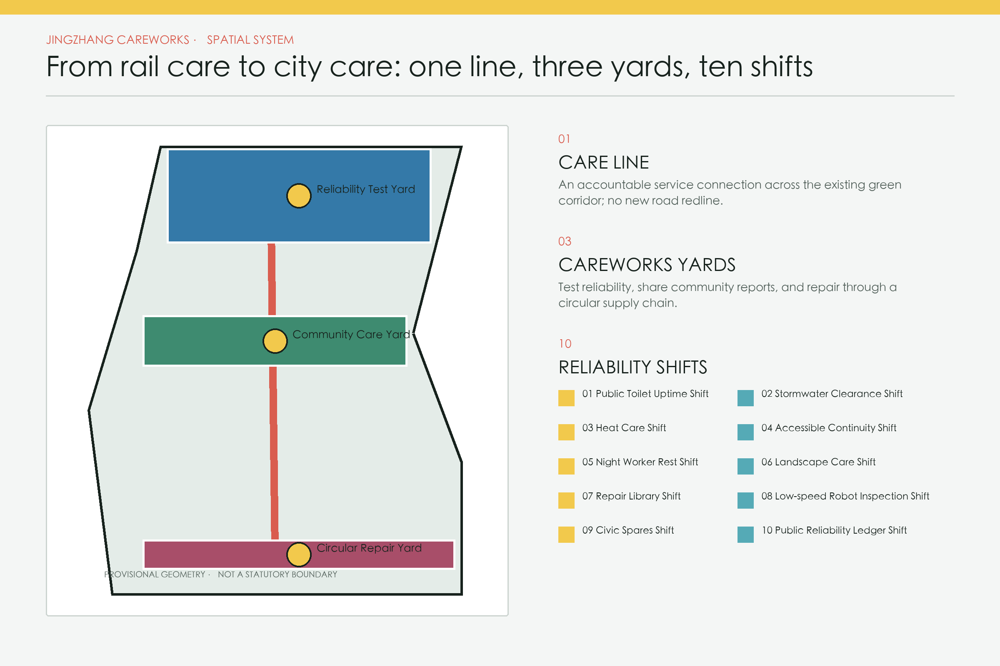
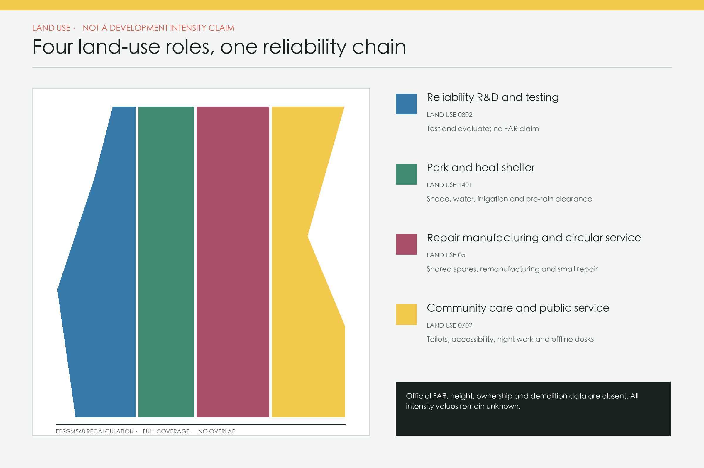
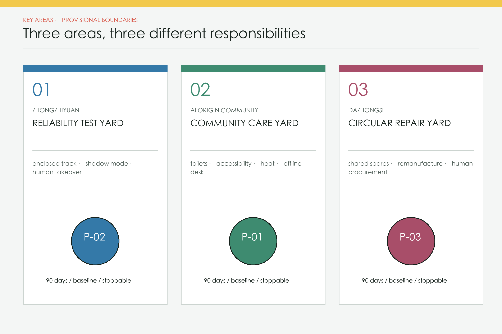
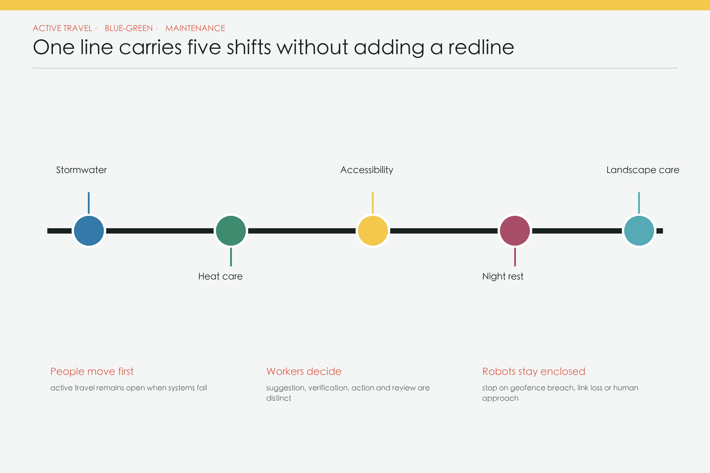
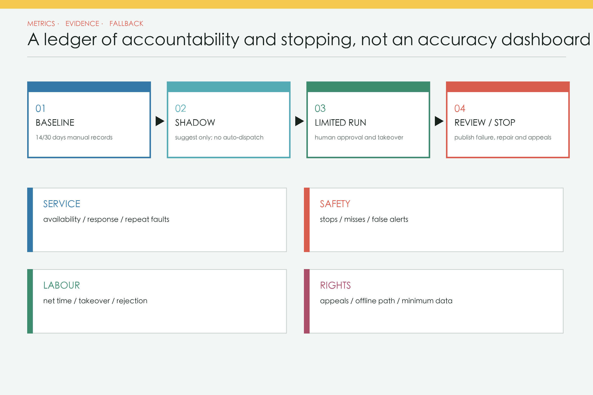

# Jingzhang Careworks: From Rail Care to City Care

> Railway reliability comes not only from trains and stations, but from people who inspect tracks, clear obstacles, refill supplies, replace parts and keep records every day. Jingzhang Careworks turns that maintenance ethic into public infrastructure for an AI innovation belt.

This proposal does not add another abstract “city operating system.” It creates a **human-first urban reliability chain**: the public and frontline workers can report a fault; AI may deduplicate tickets, flag anomalies and suggest rosters; an accountable operator verifies conditions, decides, acts and handles appeals. Every automated component has a baseline, measurement window, stop rule and usable offline path [requirement:agent.1] [standard:GENERATIVE-AI-MEASURES].

## Design Basis and Source List

The official call states an approximately 43.6 km² coordinated research area, an 11.4 km² overall design area and three key areas totalling 368.4 ha. This package uses only the repository-provided provisional geometry for temporary placement and recalculation; it does not relabel those polygons as official [source:OFFICIAL-ANNOUNCEMENT] [data:geometry/site_boundary.geojson#SITE-001] [metric:site_area_sqm] [assumption:A-BOUNDARY-001]. The three provisional key-area rectangles remain unmoved and unedited [data:geometry/key_areas.geojson#PROV-KEY-001] [metric:key_area_count].

The 1,668.2 ha approved district-level plan illustrated by an official account on 10 August 2026 is a different planning extent. It neither replaces the competition’s 11.4 km² extent nor supplies a coordinate polygon for this package [source:OFFICIAL-CONTROL-PLAN-20260810]. Textual heritage controls for former Tsinghuayuan Station are treated as a no-build review trigger; no “official” heritage polygon is invented [source:HERITAGE-STATION-CONTROL-20260214] [assumption:A-HERITAGE-001].

## Three-Level Scope Framework

All three scales use an evidence-before-form method but answer different questions. The coordination scale covers industry, skills, supply chains and governance; the overall-design scale organises land use, public space, mobility, municipal services and phasing; the key-area scale contains only reversible pilots and conceptual envelopes. Every boundary or control value moving between scales retains a source and precision label. Graphic continuity never makes separate planning extents legally equivalent. When authoritative CAD/GIS becomes available, constraints must be locked, topology and metrics rerun, and the design retested before any implementation claim [depth:three_level_scope_framework] [assumption:A-BOUNDARY-001].

The three-scale method is:

1. **43.6 km² coordination:** align repair skills, suppliers, open testing and public data standards without drawing statutory controls.
2. **11.4 km² overall design:** use the heritage-park corridor as a Care Line linking repair desks, inspection routes, spare-parts points and accountable pilots.
3. **368.4 ha key areas:** propose a reliability test yard, community care yard and circular repair yard. Their envelopes are conceptual design layers only [data:geometry/buildings.geojson#BLDG-CARE-01] [depth:three_level_scope_framework].

Official reports describe a roughly nine-kilometre continuous green corridor and a time-specific opening status in August 2026. Careworks therefore overlays maintenance and operations on public space rather than duplicating a new greenway; field verification remains mandatory [source:PARK-PHASE2-20260730] [source:PARK-OPEN-20260806] [assumption:A-SURVEY-001].

## Coordinated Research Area: Industry and Future City Research

At the 43.6 km² coordination scale, urban reliability becomes a shared AI-industry challenge. The AI Origin Community supplies public problems and user feedback; Zhongzhiyuan tests the full stack from sensing, edge computing and models to robotics and audit tools; Dazhongsi supports spares, remanufacturing and service firms. The Zhongguancun Technology Service Wing links intellectual property, capital and international services, while the Xiaoyuehe Scenario Empowerment Wing provides continuous public settings. Together they form a loop of problem publication, enclosed evaluation, limited pilots, independent review and evidence-based pre-procurement rather than a one-way investment corridor [requirement:agent.1] [requirement:agent.2].

The talent profile includes facility operators, repair workers, accessibility reviewers, caregivers and public-data auditors alongside AI engineers. The identity system draws on railway maintenance: signal yellow means pending attention, track green means service may continue, and repair red means stop and human takeover. The logo direction combines two parallel rail lines with an open repair bracket. An annual Urban Reliability Week, open failure review, developer repair challenge and public pilot hearing turn the proposal into a long-term community programme rather than a single exhibition [requirement:agent.5] [requirement:agent.6].

| Brief framework | Explicit Careworks translation |
|---|---|
| Centennial Jingzhang cultural belt | Continue railway culture through daily maintenance, engineering duty and legible repair marks rather than nostalgic form. |
| Urban AI life experience belt | Make toilets, accessibility, heat care, night work and landscape uptime part of everyday experience. |
| AI-integrated innovation belt | Link problem lists, full-stack evaluation, 90-day pilots and evidence-based pre-procurement. |
| Full-stack independent AI innovation | Connect sensing, edge, models, robots, human takeover and audit tools through vendor-neutral interfaces. |
| World-class AI innovation ecosystem | Let universities, firms, operators, repairers and the public define and verify real faults together. |
| New AI+ scenario paradigm | Require minimum data, human approval and stop rules across ten shifts. |
| Intelligent and vibrant AI city | Measure vitality through continuous public-service availability, night care and net labour time. |
| Global voice in AI governance | Publish service cards, failures, human edits, appeals and exit records. |

| Three Areas and Two Wings | Role in the reliability loop |
|---|---|
| AI Origin Community | Publish public problems, co-define baselines and verify offline usability. |
| Zhongzhiyuan AI Acceleration Area | Run enclosed tests, full-stack evaluation, robot safety and governance tools. |
| Dazhongsi AI Industry Cluster | Support repair-native business, shared spares, remanufacturing and small firms. |
| Zhongguancun Technology Service Wing | Provide IP, capital, international standards and independent professional services. |
| Xiaoyuehe Scenario Empowerment Wing | Provide continuous public settings and cross-neighbourhood transfer tests. |

### Regional innovation coordination (conceptual interfaces / proposed collaboration)

The following matrix turns the five named regional objects into **conceptual interfaces** with explicit entry and exit conditions. No object is treated as a signed partner; exchange elements, cooperation interfaces and verification methods require written permission, professional review and community discussion. The evidence boundary is a hard constraint: this package does not claim funding, policy, orders, compute dispatch, talent allocation or official cooperation [requirement:agent.1] [assumption:A-REGIONAL-SYNERGY-001].

| Partner | Conceptual problem division | Exchange elements | Cooperation interface (concept) | Entry conditions | Exit conditions | Evidence boundary |
|---|---|---|---|---|---|---|
| North Latitude Community | Provide everyday community problems, youth feedback and reviewable service baselines; no community commitment is implied. | Anonymised problem templates, offline event feedback, repair knowledge and failure cases. | A conceptual community-desk to developer-community interface using static packets, paper forms and phone, with no personal tracking. | Written consent, venue permission, data minimisation, a named maintainer and a working offline path. | Remove the interface and return to manual service if ownership is absent, privacy/safety fails twice, or offline service is interrupted. | Conceptual interface/proposed collaboration only; no contract, funding, policy promise or current-performance evidence. |
| Future Science City | Offer big-science, energy/compute and research-talent problems for enclosed evaluation along Jingzhang; not a substitute for the park plan. | Compliantly de-identified problem sets, compute performance metrics, test protocols and maintenance experience. | A conceptual Zhongzhiyuan enclosed-test and compute/evaluation-packet interface; the boundary stops at written data permission and test safety. | Data and equipment permissions, an enclosed site, network/safety review, human takeover and audit logging must be available. | Stop and clear the temporary link after a critical miss, failure to stop on geofence/link loss, or an unreviewable change in test conditions. | Conceptual interface/to be negotiated; no evidence of a joint lab, compute dispatch, funding or official cooperation. |
| Huairou Science City | Offer AI-for-Science and research-data-governance questions; the Jingzhang side only hosts display, governance-tool tests and public explanation. | Compliant data dictionaries, algorithm-impact templates, annual result summaries and public feedback. | A conceptual annual exhibit and governance-sandbox interface at the AI Origin Community; no raw research data or research approval is transferred. | Written research authorisation, data classification and de-identification, exhibit/cyber review and a public-readable summary. | Stop display and sharing if authorisation is withdrawn, data boundaries are unclear, or the public explanation fails review. | Conceptual interface/to be negotiated; no research project, transfer, policy or funding commitment is asserted. |
| Beijing E-Town | Offer embodied-AI, smart-manufacturing and robotics-supply-chain validation problems; Jingzhang supplies low-speed, stoppable public-service segments. | Equipment safety lists, test protocols, repair-spares knowledge and aggregate runtime feedback. | A conceptual Dazhongsi experience-front and enclosed-test-loop interface; open active travel stays separate from robots. | Title/traffic/fire/accessibility permissions, an enclosure, on-site supervision, vendor neutrality and a human stop control. | Stop after failure to halt near people, a boundary breach, an equipment incident or unclear maintenance; never move to open-road deployment. | Conceptual interface/proposed collaboration; no enterprise tenancy, orders, revenue or official-access evidence. |
| Beijing-Tianjin-Hebei region | Frame shared questions about cross-city talent, housing, compute and data compliance; this package defines only verifiable regional interfaces. | Compliant data-element catalogues, talent-service needs, compute-network status and cross-city review templates. | A conceptual Qinghe gateway compute-network and youth-service interface; no housing allocation, network connection or cross-border data flow is promised. | Written confirmation by local owners, data/network compliance, aligned service standards, and complaint/exit mechanisms first. | Exit when any party withdraws, compliance fails, service standards cannot align, or complaints cannot close. | Conceptual interface/to be negotiated; no regional mechanism, talent allocation, compute access or government commitment is evidenced. |

Every entry condition includes an accountable owner, lawful data/venue permission, a human fallback and an appeal path. When an exit condition is met, temporary data and equipment are removed and service returns to paper, phone and staffed routes. This is a working protocol draft for regional coordination, not a cooperation agreement or implementation commitment [source:AGENT-TASKBOOK].

- **One Care Line:** a conceptual service connection across walking, cycling, stations and communities; it is not a new road redline [data:geometry/roads.geojson#ROAD-001].
- **Three Careworks yards:** reliability testing in Zhongzhiyuan, shared reporting and care in the AI Origin Community, and spares/circular repair in Dazhongsi. Envelopes are derived from provisional key areas and make no development claim [data:geometry/buildings.geojson#BLDG-CARE-02] [assumption:A-CONTROLS-001].
- **Ten shifts:** each public service states user, time, place, AI boundary, offline fallback, operator and metric. Face recognition and personal trajectory tracking are excluded by default.

## Overall Design Area: Urban Renewal and Regulatory-Plan-Level Urban Design

At the 11.4 km² overall-design scale, the rule is “maintain before renewing.” Existing public space first receives an owner, inspection route, spare-parts path, accessibility continuity check and offline service route. Only then is physical alteration considered. Land and building layers provide four conceptual roles and three modest group envelopes; they do not convert provisional geometry into FAR, height or demolition decisions. Mobility geometry expresses service links only. Municipal design brings drainage, water, sanitation, lighting and facility state into one accountable ticket chain, while digital infrastructure remains lightweight, exportable, replaceable and operable offline [requirement:1.4.1] [requirement:1.4.2].

Public value is measured by continuity, not added floor area: whether the corridor remains usable in rain, heat, darkness and network outage; whether toilets and water points have maintainers; whether workers can reject a poor suggestion; and whether closure reasons and expected repair times are visible. A renewal item reaches a 90-day pilot only after a 30-day baseline, professional safety review, named operating responsibility and exit path. Urban design, operations design and AI evaluation therefore share one evidence ledger [requirement:1.4.3] [depth:overall_spatial_structure].

The four land-use partitions cover the submitted boundary without overlap: reliability R&D, park/heat shelter, repair manufacturing, and community care [data:geometry/land_use.geojson#LU-001] [metric:land_use_area_sqm] [review:self_check#LAND_USE_TOPOLOGY]. FAR, height, demolition, ownership and approved capacity remain `unknown` [assumption:A-CONTROLS-001] [depth:development_intensity_controls].

## Detailed Design of Key Areas

### 3.1 Zhongzhiyuan Reliability Test Yard

Independent innovation becomes a facility-reliability test programme: low-speed inspection, drainage anomaly detection, heat-shift recommendations and manual takeover in an enclosed segment. Reports include misses, false alerts, stops and net crew time, not just demonstrations [requirement:agent.2].

### 3.2 AI Origin Community Care Yard

Everyday services come first: public toilets, accessible continuity, drinking water, shade and night-worker rest. Reports can arrive offline, by phone or online; a worker confirms each consolidated ticket. A model cannot speak for residents or rank neighbourhoods and workers by complaint volume [requirement:agent.3] [standard:ACCESSIBILITY-LAW].

### 3.3 Dazhongsi Circular Repair Yard

The industrial cluster shifts from displaying AI to repairing faster and using equipment longer: shared civic spares, remanufacturing, small repair firms and a public reliability ledger. Humans approve all procurement and the recommender cannot lock in one supplier [requirement:agent.4].

### agent.4 deepening: heritage-park public space and intelligent-native conversion (conceptual / proposed)

**Spatial strategy (conceptual)**: use existing heritage-park public space as the base, then add reversible service nodes for east-west stitching and north-south continuity at existing crossings, station approaches, underpasses and community entrances. The nodes provide a repair desk, accessible-detour information, night-worker rest and a small repair workbench. No bridge, tunnel, underground, road-redline or heritage-engineering feasibility is assumed; exact locations wait for title, heritage, blue-line, green-space, traffic-safety and accessibility review [requirement:agent.4] [assumption:A-CONTROLS-001].

**At least three honour/failure displays and a replaceable public-space component library (conceptual)**: every mechanism is offline-capable, replaceable and maintainable, and shows failure and repair instead of manufacturing a “zero-fault” landmark.

### Contribution and failure ledger (conceptual / proposed)

- **Honour/failure display mechanism:** Show aggregate uptime, failure reasons, repair dates, human edits and appeal outcomes; annual contributors and honest failures share the same wall.
- **Replaceable public-space component:** Replaceable magnetic/clip-in panels, a paper-print slot and downloadable CSV; damaged panels are replaced individually.
- **Maintenance responsibility (written confirmation pending):** A public-space operator is proposed for daily checks and replacement, with monthly sampling by an independent auditor; conceptual/proposed roles only.
- **Stop and fallback:** Pause automated updates while retaining a manual bulletin when data cannot be de-identified, two periods are missed, or appeals lack an entry point.

### Stoppable reliability test bench (conceptual / proposed)

- **Honour/failure display mechanism:** Display passes, misses, false alerts, takeovers and stops; honour is never based on demo counts or “zero faults.”
- **Replaceable public-space component:** Detachable status posts, boundary signs, a physical stop button and low-power light strips; equipment faults bypass to a static sign.
- **Maintenance responsibility (written confirmation pending):** The enclosed-test operator handles opening and stop tests, the technical team maintains equipment, and a safety reviewer audits independently; conceptual/proposed only.
- **Stop and fallback:** A boundary breach, failure to stop on link loss or proximity, or one critical miss triggers physical shutdown and manual rounds.

### Repair library and public workbench (conceptual / proposed)

- **Honour/failure display mechanism:** Reuse parts, repair steps, consented worker credits and community lessons form a third honour/failure display.
- **Replaceable public-space component:** Standard shelves, replaceable tool boards, folding benches, paper catalogues and accessible-height modules form a reusable kit.
- **Maintenance responsibility (written confirmation pending):** Repair firms/community workshops are proposed for tool inventories; the venue operator handles cleaning, accessibility and opening hours; written confirmation is required.
- **Stop and fallback:** Close the workbench while retaining reading and staffed advice if tool safety, fire, accessibility or handover checks fail.

#### Dazhongsi intelligent-native consumption and business conversion prerequisites (conceptual / proposed)

Dazhongsi conversion is not an investment-attraction or tenancy promise. It is a reversible three-gate test:

| Gate | Conditions to confirm first | Conceptual spatial/operational move | Boundary when unmet |
|---|---|---|---|
| Space and compliance | Title, existing buildings, heritage/land-use, fire, accessibility, traffic and municipal capacity; all await formal data | Place removable repair displays, civic-spares cabinets and separated people/service paths inside usable existing space; no demolition | Keep assets and staffed service in place whenever a permit or safety condition is unclear |
| Operations and accountability | Written operator, merchant/repair team, opening hours, human procurement, data and labour review | Record a 30-day footfall/fault/cost baseline, then a small 90-day experience-front pilot; algorithms only suggest | Stop and remove temporary equipment if ownership, offline service or appeals are missing |
| Revenue and fairness | Footfall, conversion, lease/revenue-sharing, lifecycle cost and public acceptance; currently unknown | Publish aggregate measures and failures; promise no revenue, orders, investment return or tenancy | Return to existing business and manual repair when evidence is insufficient or exclusion, hidden fees or safety events appear |
| Exit and review | Independent safety, accessibility, labour, privacy and financial review | Export open-format records, remove unnecessary personal data, retain paper/phone access | Any red-line event stops the test; permanence requires formal planning, procurement and public participation |

All components, landmarks and conversion steps are conceptual/proposed. They do not mean that a government, park, company or community has agreed, and they do not constitute a budget, policy, title or engineering conclusion [assumption:A-AGENT4-COMPONENTS-001] [assumption:A-DAZHONGSI-CONVERSION-001].

## AI Innovation Ecosystem, Personas, and AI+ Scenarios

Five personas anchor the scenarios: older and disabled users; children and caregivers; night and outdoor workers; students, developers and small firms; and facility operators and repair crews. Each persona includes both service users and people who may maintain or verify the service, avoiding an undifferentiated “citizen” profile. Ten scenario cards span different times, places and connectivity conditions. AI is limited to deduplication, alerts, retrieval and suggestions. Face recognition, personal trajectory tracking, automated procurement, automated penalties and models speaking on behalf of residents are outside scope [requirement:agent.3] [standard:ACCESSIBILITY-LAW].

| Shift | Users and place | AI scope | Manual fallback | Primary metric |
|---|---|---|---|---|
| **SC-01 Public Toilet Uptime Shift** | commuters, caregivers with children, older adults; AI Origin Community and park entrances | cluster supply, ponding and accessibility faults; cleaners confirm on site | paper rounds, phone dispatch and physical closure signs | open-hours availability, accessible-fixture uptime, p95 response time |
| **SC-02 Stormwater Clearance Shift** | walkers, cyclists and municipal crews; low points, underpasses and east-west crossings | pre-rain inspection suggestions; crews verify blockages and log clearance | fixed pre-rain checklist and direct observation | ponding duration, false-alert rate and human takeover rate |
| **SC-03 Heat Care Shift** | older adults, outdoor workers and children; green corridor, station approaches and community service points | staff hydration and shade points using public weather data, without face recognition | fixed hours, staff announcements and paper maps | shaded-seat availability and hydration-point downtime |
| **SC-04 Accessible Continuity Shift** | wheelchair users, people with visual impairments, families with strollers; ramps, tactile paths, crossings and station links | deduplicate obstruction reports and publish detours after staff verification | staff guidance, temporary ramps and hotline | continuous access hours, complaint closure and detour distance |
| **SC-05 Night Worker Rest Shift** | cleaning, security, delivery and repair workers; Dazhongsi interchange edges and 24-hour service nodes | publish seating, water, charging and toilet status without tracking individuals | fixed staff rota and mechanical keys | service downtime and overnight inspection workload |
| **SC-06 Landscape Care Shift** | park crews and nearby residents; selected sections of the nine-kilometre green corridor | suggest irrigation from soil and weather data; crews decide execution | manual soil checks and scheduled irrigation | water intensity, planting survival and recommendation rejection rate |
| **SC-07 Repair Library Shift** | students, residents and small businesses; campus-industry interfaces and underused community rooms | tool booking, repair knowledge search and staff safety review | offline ledger and in-person guidance | items repaired, reuse rate and safety incidents |
| **SC-08 Low-speed Robot Inspection Shift** | municipal workers and robotics teams; closed test segment in Zhongzhiyuan | robots capture facility condition only and stop on geofence breach, link loss or human approach | fully manual inspection | safety takeovers, missed-defect rate and net crew time saved |
| **SC-09 Civic Spares Shift** | operators, repair crews and small manufacturers; Dazhongsi repair manufacturing and circular-service cluster | suggest shared spares by fault type without automated procurement decisions | manual stock calls and multi-vendor quotes | parts-related downtime, inventory turns and remanufactured share |
| **SC-10 Public Reliability Ledger Shift** | public users, operators, auditors and developers; three Careworks yards and a static public board | publish aggregate faults, closure reasons and repair times, never personal traces | monthly staff bulletin and downloadable CSV | data completeness, appeal closure and repeat-fault rate |

These are candidates for professional, operator and community selection, not committed projects. Each shift proceeds only after an owner, field baseline, data permission, labour review and safety assessment are in place [assumption:A-OPERATIONS-001] [requirement:agent.5].

### Three 90-day test-and-validation pilots

### P-01 AI Origin Community: toilet and accessible-route continuity

- **Proposed owner:** Proposed owner: park or subdistrict facility operator, subject to review
- **Baseline:** 14 days of manual rounds recording opening, faults and complaints
- **Measurement window:** 90 days; first 30 days are shadow recommendations with no automated dispatch
- **Stop rule:** pause if false dispatch exceeds 10% for two weeks or one severe accessible-detour error occurs
- **Manual fallback:** return to fixed rounds, phone dispatch and physical signs

### P-02 Zhongzhiyuan: stormwater, heat and low-speed inspection loop

- **Proposed owner:** Proposed owner: municipal or park crew with closed-track operator
- **Baseline:** two rainfall events or 30 days of manual records, whichever comes first
- **Measurement window:** 90 days, with robot operation restricted to an enclosed segment
- **Stop rule:** stop on geofence breach, failure to halt on link loss or proximity, or one missed critical defect
- **Manual fallback:** fully manual rounds with the paper pre-rain checklist retained

### P-03 Dazhongsi: shared spares and circular repair

- **Proposed owner:** Proposed owner: pilot group of facility operators, repair firms and an independent audit representative
- **Baseline:** 30 days recording parts-related downtime, quote requests and disposal routes
- **Measurement window:** 90 days, recommendations only with human approval
- **Stop rule:** stop if one supplier exceeds 60% without explanation or any unauthorised purchase occurs
- **Manual fallback:** return to manual multi-vendor quotes and existing approval

Each pilot follows `14/30-day baseline → 30-day shadow mode → 60-day limited operation → public review on day 90`. No improvement percentage is published without a baseline; no pilot starts without owner acceptance; manual service remains operational after a stop [metric:pilot_evaluation_window_days] [standard:ELDERLY-TECH-PLAN].

### An AI ecosystem built around verified reliability

Careworks offers four repeatable tasks: an anonymised public problem list; enclosed or shadow evaluation with failure cases; a small pilot with explicit stop rules; and a portable evaluation kit with field dictionary, offline form, human workflow and model card. Universities, startups, community repairers and facility operators contribute research, products, situated knowledge and accountable decisions respectively [requirement:agent.1] [requirement:agent.6].

Six international references contribute observable mechanisms only; their contexts and promotional outcomes are not imported as evidence of success:

| Global case | Observable mechanism | Careworks transfer |
|---|---|---|
| NYC 311 Open Data | Public structured service-request fields and time series [source:GLOBAL-NYC-311] | Shared fault taxonomy and aggregate reliability ledger, with no personal record imported. |
| Boston 311 | Phone, web and mobile service routes in parallel [source:GLOBAL-BOSTON-311] | Digital reporting remains alongside phone, paper and staffed desks. |
| Singapore OneService | A cross-municipal issue-routing entry point [source:GLOBAL-SINGAPORE-ONESERVICE] | A model suggests routing; the accountable recipient confirms ownership. |
| Helsinki AI Register | Public descriptions of city AI systems [source:GLOBAL-HELSINKI-AI-REGISTER] | Every pilot publishes purpose, data, owner, human intervention and exit card. |
| Amsterdam Algorithm Register | Disclosure of algorithm purpose, risk and contact routes [source:GLOBAL-AMSTERDAM-ALGORITHM-REGISTER] | Publish human edits, appeals and audit contact for each suggestion service. |
| Barcelona Decidim | Open-source participatory proposal and discussion workflow [source:GLOBAL-BARCELONA-DECIDIM] | Portable pilot proposals, objections, public reviews and version records. |

The cases are neither endorsements nor a procurement shortlist. Each mechanism first passes Chinese legal, Haidian operating, labour, accessibility and data-localisation review. A mechanism without an accountable owner and a working offline fallback does not enter a pilot.

The three visitable landmarks are practical rather than monumental: a **public fault ledger, enclosed reliability test bench and repair library**. They display failure and repair instead of claiming “zero faults.”

## Land Use, Building Scale, and Retain-Renovate-Demolish Strategy

Four land-use roles are partitioned from the same provisional site boundary with full coverage and no overlap. Code `0802` supports reliability R&D and testing; `1401` supports park, shade and pre-rain clearance; `05` supports repair manufacturing, spares and circular service; and `0702` supports community care and public services. They are urban-design roles, not statutory land-use changes. The three building features are conceptual Careworks envelopes. Their recalculated footprint does not represent approved development capacity [data:geometry/land_use.geojson#LU-001] [metric:building_footprint_area_sqm].

The retain-renovate-demolish sequence is deliberately conservative. Anything with heritage significance or uncertain coordinates is retained pending verification. Serviceable public space receives maintenance and micro-renewal first. Adaptation is discussed only after structural, fire, ownership, operations and lifecycle-carbon review. This package proposes no demolition. Official FAR, height, density, setback and title data are absent, so intensity remains `unknown` and is never inferred from conceptual envelopes [assumption:A-CONTROLS-001] [depth:retain_renovate_demolish].

## Transport, Rail, Municipal Infrastructure, and Public Services

- The shared maintenance/active-travel line is a service relationship, not a road or rail control line. Robots operate only inside approved enclosures [data:geometry/roads.geojson#ROAD-001].
- Tickets remain operable through paper, phone and local CSV. A network outage cannot close a toilet, accessible route, hydration point or emergency service. The public ledger excludes faces, personal trajectories, identity scores and raw complaint text [standard:GENERATIVE-AI-MEASURES].

Rail and road references identify interchange and service interfaces only; they do not imply control lines. Municipal assets follow an asset ID, baseline, accountable operator, manual round, suggestion, action and verification sequence. Assets without a verified register cannot be connected directly to a model. Public-service points retain paper forms, phone access and physical signs during weak or lost connectivity. Low-speed robots never mix with open active travel: testing requires an enclosure, a human supervisor and a verified geofence [depth:traffic_rail_slow_parking] [depth:municipal_new_infrastructure].

## Blue-Green Network, Public Space, and Urban Character

The green-space layer organises conceptual responsibility for shade, water, irrigation and pre-rain clearance. The public-space layer supports repair desks, accessible detours and night-worker rest. Both ratios describe submitted design layers only and are not cross-proposal benchmarks. Heat shifts check shade, seating, water and hours; stormwater shifts check low points, underpasses and east-west crossings. They may share manual rounds but never personal identity data [metric:green_space_ratio] [metric:public_space_ratio].

Urban character avoids a monument that competes with railway heritage. Maintenance becomes legible through replaceable signal-colour parts, dated repair marks, reused components and small work benches. Former Tsinghuayuan Station and track artefacts constrain the narrative; no new landmark is placed nearby before authoritative coordinates exist, and no official graphic is copied. The cultural synthesis is specific: Jingzhang contributes long-term engineering care, Zhongguancun contributes open evaluation and knowledge sharing, and AI culture contributes transparent, stoppable and auditable services [source:PARK-PHASE1-20211014] [source:HERITAGE-STATION-CONTROL-20260214] [requirement:agent.5].

### Users, labour and accountability

Five personas shape the system: older and disabled users; children and caregivers; night and outdoor workers; students, developers and small firms; and facility operators/repair crews. Every interface begins with the lowest-connectivity, lowest-digital-skill and minimum-data condition. Traditional and smart routes remain in parallel [standard:ELDERLY-TECH-PLAN].

The ledger has three views: the public sees aggregate availability and closure causes; operators see tickets and rosters; authorised auditors see recommendations, human decisions and edits. Workers may reject a suggestion and record why. Rejection rate calibrates the model; it is not a worker performance penalty.

## Renewal Projects, Implementation Policy, and Phasing

- **P0 / day 0-30:** fieldwork, accessibility audit, labour interviews and facility/data inventory. No automation pilot if incomplete.
- **P1 / day 31-120:** three 90-day pilots with the first 30 days in shadow mode and all dispatch approved by people.
- **P2 / month 4-12:** independent review of safety, service, equity, labour and lifecycle cost; expand only evidence-backed shifts.
- **P3 / after month 12:** statutory planning, budget, procurement and public-participation processes decide whether anything becomes permanent.

CAPEX, OPEX, land availability and staffing are `unknown`; the proposal does not fabricate a total investment or payback period [assumption:A-COST-001]. Exit exports tickets in open formats, removes unnecessary personal data, preserves phone/paper service and takes away reversible equipment.

## Metrics, Area Recalculation, and Compliance Matrix

Spatial metrics are recalculated from submitted geometry in EPSG:4548 [metric:building_footprint_area_sqm] [metric:road_centerline_length_m]. Service metrics include availability, response time, false alerts, human takeover, complaint closure, repeat faults and net labour time. Every improvement statement carries a baseline, sample window, missing-data note and stop-event count.

## Risk, Copyright, and Compliance

The AI agent conducted no field survey, interview or equipment observation and does not speak for residents, workers or government [assumption:A-SURVEY-001]. Official boundaries, redlines, ownership, utilities, fire access, heritage coordinates, soil, hydrology, heat, footfall, asset registers, budget and operating agreements are missing. Planning, architecture, transport, municipal, landscape, heritage, accessibility, fire, data, procurement and labour professionals must review any next step [depth:risk_missing_data].

All text, geometry, figures, PDFs and offline HTML were generated for this submission. Government webpages are cited for facts only. No official infographic, rendering, press photo, commercial map or map tile was copied. See `report/copyright_statement.md`.

### Deliverable index

- Human-readable proposal: `proposal.md` / `proposal.en.md`
- Reading pages: `report/proposal.html` / `report/proposal.en.html`
- Interactive atlas: `visual/index.html` / `visual/index.en.html`
- Five bilingual PNG figure pairs in `assets/figures/`
- A3 booklet and A0 boards in both languages in `drawings/`
- GeoJSON and recalculated metrics: `geometry/*.geojson`, `metrics.json`
- Evidence matrices: `sources.json`, `compliance_matrix.json`, `standard_matrix.json`, `design_depth_matrix.json`

## References

1. Haidian Branch of the Beijing Municipal Commission of Planning and Natural Resources, official call, 9 May 2026 [source:OFFICIAL-ANNOUNCEMENT].
2. Beijing Planning and Natural Resources, approved district-plan infographic, 10 August 2026 [source:OFFICIAL-CONTROL-PLAN-20260810].
3. Beijing Municipal Cultural Heritage Bureau, Tsinghuayuan Station controls, 14 February 2026 [source:HERITAGE-STATION-CONTROL-20260214].
4. Beijing Government Portal, Jingzhang Railway Heritage Park Phase I, 14 October 2021 [source:PARK-PHASE1-20211014].
5. Beijing Government Portal and Beijing Haidian, Phase II reports, July/August 2026 [source:PARK-PHASE2-20260730] [source:PARK-OPEN-20260806].
6. Law of the PRC on Building Accessible Environments [source:ACCESSIBILITY-LAW].
7. Interim Measures for Generative AI Services [source:GENERATIVE-AI-MEASURES].
8. National plan on difficulties older adults face with smart technologies [source:ELDERLY-TECH-PLAN].
