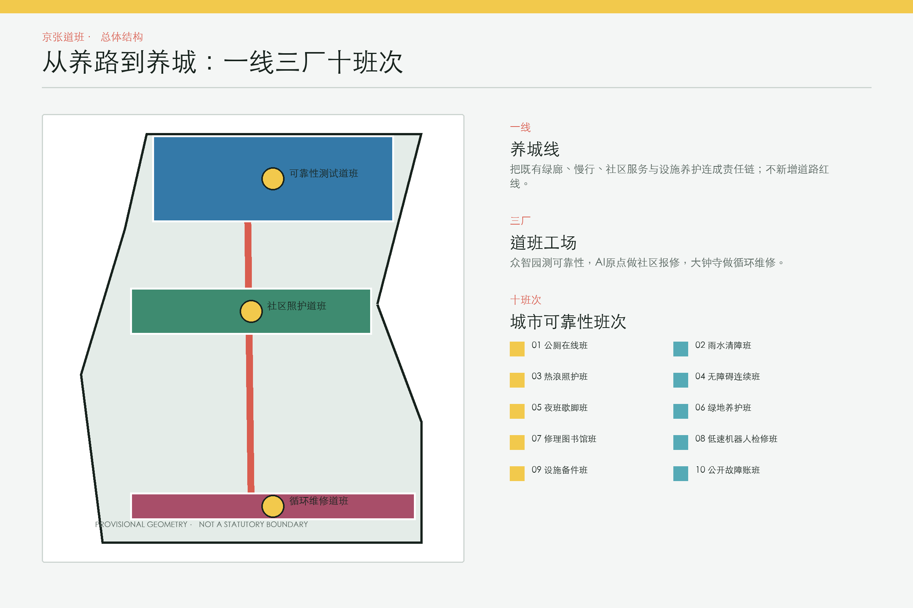
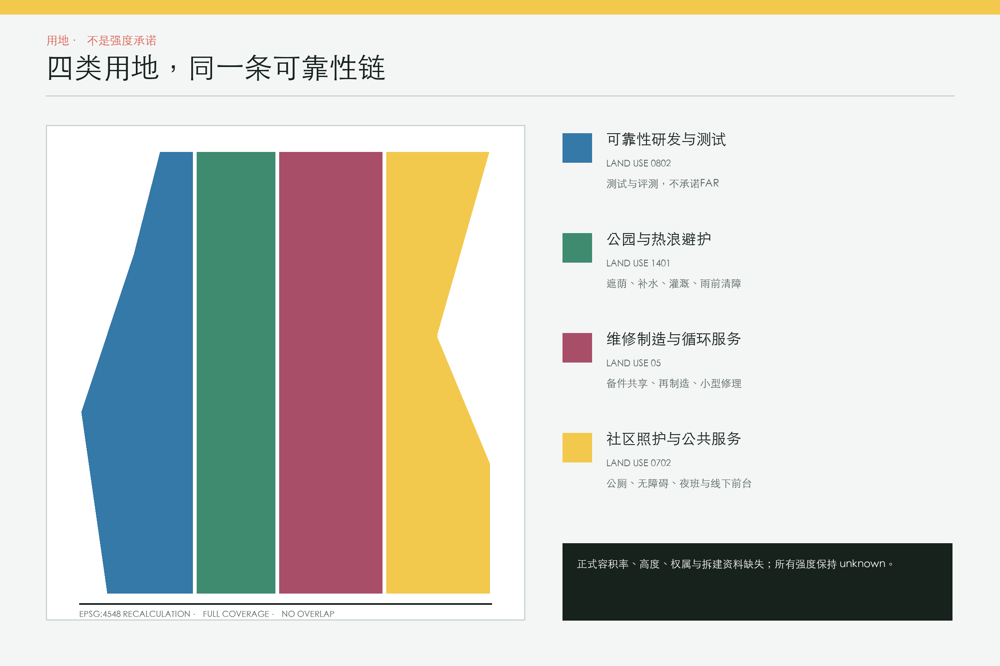
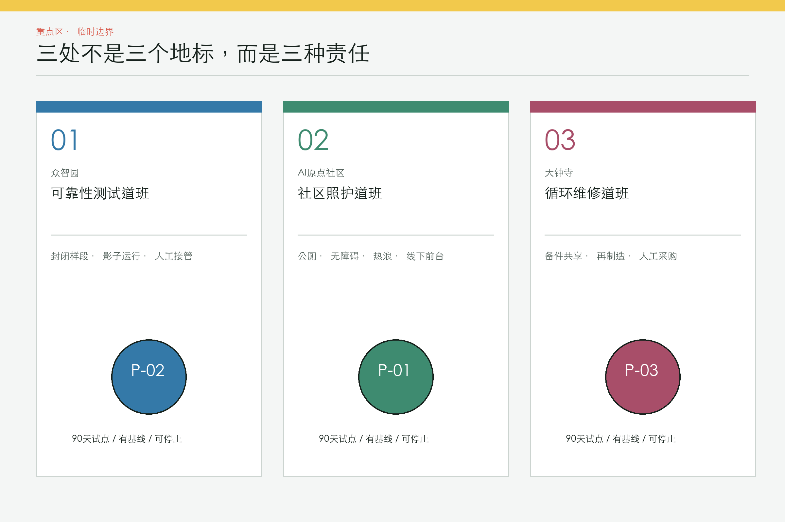
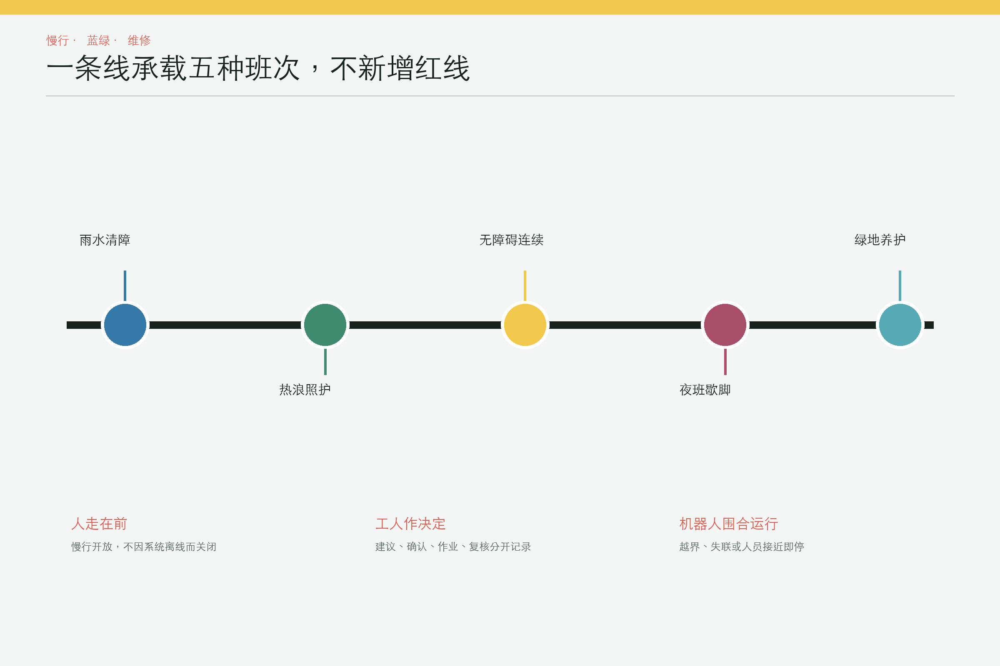
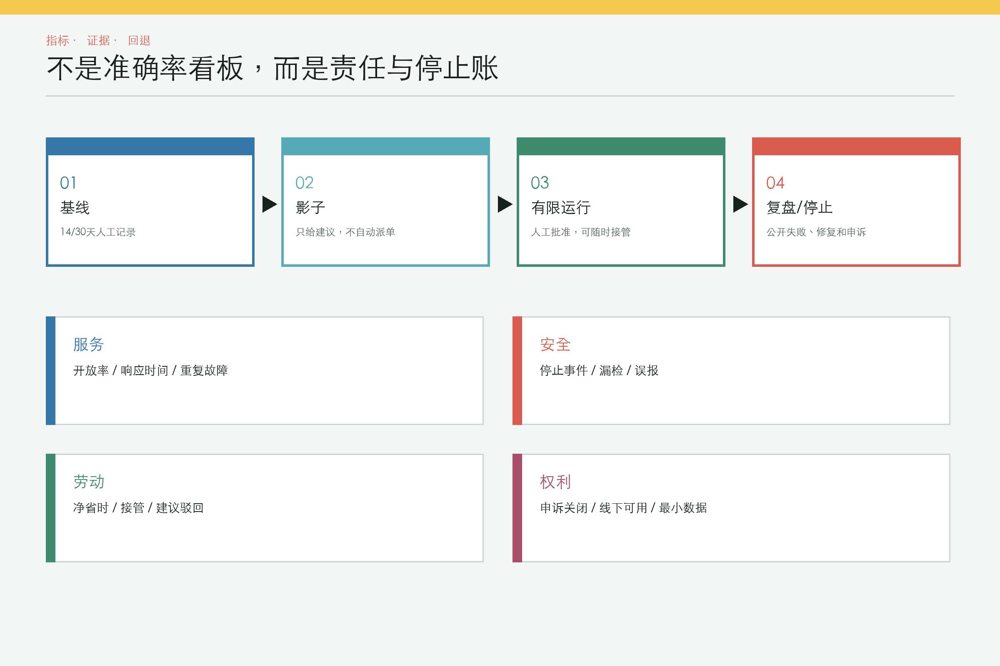

# 京张道班：从养路到养城

> 铁路的可靠，不只来自列车和车站，也来自每天检查轨道、清障、补水、换件和记录的人。京张道班把这套“看见故障、有人负责、修后复核”的养护逻辑，转化为 AI 创新带的公共基础设施。

本方案不再增加一个抽象的“城市操作系统”。它提出一条**人工优先的城市可靠性链**：公众与一线工人能报修，AI 只做工单去重、异常预警和排班建议，运营者现场确认、决定、作业并接受申诉。任何自动化都必须有基线、观测窗口、停止阈值和可工作的线下路径 [requirement:agent.1] [standard:GENERATIVE-AI-MEASURES]。

## 设计依据与资料清单

资格预审公告给出约 43.6 平方公里统筹研究范围、约 11.4 平方公里总体设计范围和三处合计 368.4 公顷重点区；本包只把仓库提供的 `provisional` 几何用于临时落图和复算，不把它们写成 official polygon [source:OFFICIAL-ANNOUNCEMENT] [data:geometry/site_boundary.geojson#SITE-001] [metric:site_area_sqm] [assumption:A-BOUNDARY-001]。三处重点区的临时矩形没有被移动或修形 [data:geometry/key_areas.geojson#PROV-KEY-001] [metric:key_area_count]。

2026 年 8 月 10 日官方图解所述约 1668.2 公顷街区控规范围，是另一个尺度；它不能替代本次征集的 11.4 平方公里总体范围，也没有被截图描成矢量边界 [source:OFFICIAL-CONTROL-PLAN-20260810]。清华园车站旧址保护要求可作为 no-build 复核条件，但缺少可核验坐标，因此本包没有生成“官方保护范围”多边形 [source:HERITAGE-STATION-CONTROL-20260214] [assumption:A-HERITAGE-001]。

## 三层范围工作框架

三层范围使用同一套“证据先于造型”的工作法，但承担不同判断。统筹层只讨论跨区域产业、人才、供应链与治理；总体层才组织用地、公共空间、交通、市政和分期；重点层只在临时重点区里表达可逆的试点与组团包络。任何从上层传到下层的面积、边界或控制值都必须携带来源与精度标签，不能因为图面连续就被误读为同一法定范围。若后续获得官方 CAD/GIS，应先锁定约束、重做拓扑和指标，再判断方案是否仍成立 [depth:three_level_scope_framework] [assumption:A-BOUNDARY-001]。

三层工作方式如下：

1. **43.6 平方公里统筹层：** 研究维修人才、供应链、开放测试和公共数据标准的协同，不画新的法定空间控制线。
2. **11.4 平方公里总体层：** 以遗址公园连续绿廊为“养城线”，组织报修前台、巡检线、备件点和试点责任网络。
3. **368.4 公顷重点层：** 在三个临时重点区内分别提出可靠性测试、社区照护、循环维修三处“道班工场”；建筑包络仅为概念性设计层 [data:geometry/buildings.geojson#BLDG-CARE-01] [depth:three_level_scope_framework]。

公开报道显示遗址公园已形成约 9 公里连续绿廊，开放状态属于 2026 年 8 月的时点信息。方案因此优先做既有公共空间的维修与运营叠加，而非重复新建绿道；实施前仍需现场复核 [source:PARK-PHASE2-20260730] [source:PARK-OPEN-20260806] [assumption:A-SURVEY-001]。

## 统筹研究范围产业与未来城市研究

43.6 平方公里统筹层把“城市可靠性”设为跨区域 AI 产业命题。AI 原点社区提供公共问题与使用反馈，众智园提供从传感、边缘计算、模型、机器人到审计工具的全栈测试，大钟寺承接备件、再制造和服务企业；中关村科技服务翼连接知识产权、资本与国际服务，小月河场景赋能翼连接连续公共场景。五者形成问题发布、封闭评测、有限试点、第三方复核和证据化采购的循环，而不是单向招商走廊 [requirement:agent.1] [requirement:agent.2]。

人才不只定义为算法工程师，也包括设施运营者、维修工、无障碍审查者、照护者和公共数据审计者。品牌语言从铁路“道班”取意：信号黄表示待处理，轨道绿表示可继续服务，维修红表示停止与人工接管；Logo 方向由两条平行轨线和一个开放维修括号构成。年度“城市可靠性周”、开放失败案例会、开发者维修挑战和公众复盘构成长效活动体系，成果进入可移植评测包而不是一次性展演 [requirement:agent.5] [requirement:agent.6]。

| 任务书框架 | 京张道班的明确转译 |
|---|---|
| 百年京张文化带 | 以日常养护、工程责任和可读维修痕迹延续铁路文化，而非复制怀旧造型。 |
| 都市 AI 生活体验带 | 以公厕、无障碍、热浪、夜班和绿地可用率形成日常体验。 |
| AI 融合创新带 | 以问题清单、全栈评测、90 天试点和证据化采购连接研发与城市服务。 |
| AI 全栈自主创新体系 | 打通传感、边缘、模型、机器人、人工接管和审计工具，接口保持厂商中立。 |
| 世界级 AI 创新生态 | 让高校、企业、运营者、维修者和公众围绕真实故障共同定义与验证。 |
| AI+ 场景赋能新范式 | 十个班次均以最小数据、人工批准和停止规则为前提。 |
| 智能化 AI 活力城市 | 用公共设施连续可用、夜间照护和劳动净省时衡量活力。 |
| AI 治理全球话语权 | 发布服务卡、失败案例、人工改写、申诉与退出记录。 |

| 三区两翼 | 在可靠性循环中的角色 |
|---|---|
| AI 原点社区 | 提出公共问题、共同定义服务基线并验证线下可用性。 |
| 众智园 AI 自主创新加速区 | 建立封闭测试、全栈评测、机器人安全与治理工具。 |
| 大钟寺 AI 产业集聚区 | 承接维修新业态、备件共享、再制造与中小企业孵化。 |
| 中关村科技服务翼 | 提供知识产权、资本、国际标准与第三方专业服务。 |
| 小月河场景赋能翼 | 提供连续公共场景和跨社区的服务迁移验证。 |

### 区域创新协同关系（概念接口 / 建议协作）

以下矩阵把任务书点名的五个区域对象写成可进入、可退出的**概念接口**。对象之间没有被假定为已签约主体；交换要素、合作接口和验证方式都必须经过书面授权、专业审查与社区协商。表中的证据边界是硬约束：本包不声称有资金、政策、订单、算力调度、人才配租或官方合作 [requirement:agent.1] [assumption:A-REGIONAL-SYNERGY-001]。

| 协同对象 | 概念性问题分工 | 交换要素 | 合作接口（概念） | 进入条件 | 退出条件 | 证据边界 |
|---|---|---|---|---|---|---|
| 北纬社区 | 提供社区日常问题、青年社群反馈与可被复核的服务基线；不代表社区作出承诺。 | 匿名问题模板、线下活动反馈、维修知识与失败案例。 | 概念性的社区前台—开发者社群接口，使用静态数据包、纸质表和电话，不接入个人轨迹。 | 书面同意、场地许可、数据最小化、明确维护责任人与可用线下路径。 | 无责任人、连续两次隐私/安全失败或线下服务中断即撤下接口并回到人工流程。 | 仅为概念接口/建议协作；无签约、资金、政策承诺或现状绩效证据。 |
| 未来科学城 | 提出大科学装置、能源/算力与研发人才问题，供京张沿线封闭评测验证；不代替园区规划。 | 经合规脱敏的问题集、算力性能指标、测试规范与维修经验。 | 概念性的众智园封闭测试段与算力/评测包接口；责任边界停在书面数据许可与测试安全。 | 数据与设备许可、封闭场地确认、网络/安全评审、人工接管和审计记录可用。 | 关键漏检、越界/通信失效未停车，或测试条件改变而无法复核时停止并清除临时接入。 | 概念接口/待协商；无联合实验室、算力调度、资金或官方合作证据。 |
| 怀柔科学城 | 提出 AI for Science 场景与科研数据治理问题，京张侧只承担展示、治理工具试验与公众理解。 | 合规的数据字典、算法影响评估模板、年度成果摘要与公众反馈。 | 概念性的原点社区年度展区与治理沙箱接口；不复制科研原始数据、不代行科研审批。 | 科研机构书面授权、数据分级与脱敏、展陈/网络安全审查、公众可读摘要。 | 授权撤回、数据边界不清或公众说明无法通过复核时，停止展示和共享。 | 概念接口/待协商；无科研项目、成果转移、政策或资金承诺。 |
| 北京经开区（亦庄） | 提出具身智能、智能制造与机器人供应链的应用验证问题；京张侧提供低速、可停止的公共服务样段。 | 设备安全清单、测试规范、维修备件知识与聚合运行反馈。 | 概念性的“大钟寺体验前店—封闭测试环线”接口；开放慢行与机器人测试严格分离。 | 权属/交通/消防/无障碍许可、封闭围栏、现场监护、供应商中立与人工停止按钮。 | 人员接近未停车、越界、设备事故或维护责任悬空即停止，不转为开放道路部署。 | 概念接口/建议协作；无企业入驻、订单、收益或官方接入证据。 |
| 京津冀区域 | 提出跨城人才通勤、居住、算力与数据合规的共同问题；本包只定义可验证的区域接口。 | 合规数据要素目录、人才服务需求、算力网络状态和跨城复盘模板。 | 概念性的清河门户算力网络与青年服务接口；不承诺配租、网络接入或跨域数据流。 | 各地责任主体书面确认、数据/网络合规、服务标准可对齐、投诉与退出机制先行。 | 任何一方撤回、合规审查不通过、服务标准无法对齐或投诉无法闭环即退出区域接口。 | 概念接口/待协商；无区域协调机制、人才配租、算力接入或政府承诺证据。 |

每一项接口的进入条件都包含责任人、合法数据/场地许可、人工回退和申诉路径；退出条件触发时，临时数据与设备应清理，服务回到纸质、电话和现场流程。该表是区域协同的工作协议草案，不是合作协议或实施承诺 [source:AGENT-TASKBOOK]。

空间结构不是“三核再加两翼”，而是一套能被追责的工作图：

- **一线：养城线。** 以既有/规划绿廊的概念界面串联人行、骑行、站点与社区服务，不新增道路红线 [data:geometry/roads.geojson#ROAD-001]。
- **三厂：三处道班工场。** 众智园做可靠性测试，AI 原点社区做居民与工人共同报修，大钟寺做备件共享和循环修理。三处建筑包络由临时重点区缩放生成，只表达功能关系 [data:geometry/buildings.geojson#BLDG-CARE-02] [assumption:A-CONTROLS-001]。
- **十班次：十个可停止的公共服务场景。** 每个班次都写清使用者、时段、空间、AI 边界、线下兜底、运营者和指标；默认不使用人脸识别或个人轨迹。

## 总体设计范围城市更新与控规深度城市设计

11.4 平方公里总体层采取“先维护、再更新”的策略。已有公共空间先补齐责任人、巡检路线、备件、无障碍连续性和线下服务，再判断是否需要空间改造；土地与建筑层只给出四类概念功能和三处小尺度组团包络，不把临时几何转化为容积率、高度或拆迁判断。交通层只表达服务联系，市政层把排水、饮水、环卫、照明和设施状态纳入同一工单责任链，新型基础设施优先采用可离线、可导出、可替换的轻量组件 [requirement:1.4.1] [requirement:1.4.2]。

总体设计的公共价值以连续可用而非新增体量衡量：绿廊是否在降雨、热浪、夜间和系统离线时仍能通行，公厕与饮水是否有人维护，工人是否能拒绝错误建议，公众是否知道关闭原因和预计修复时长。更新项目只有在 30 天基线、专业安全审查、运营责任与退出路径都明确后才进入 90 天试点；这使城市设计、运营设计和 AI 评测共用一张证据账 [requirement:1.4.3] [depth:overall_spatial_structure]。

用地分区完整覆盖提交边界且不相互重叠，分别支持可靠性研发、公园与热浪避护、维修制造、社区照护四类功能 [data:geometry/land_use.geojson#LU-001] [metric:land_use_area_sqm] [review:self_check#LAND_USE_TOPOLOGY]。建筑强度、高度、拆建量和权属因缺少正式资料保持 `unknown`，不从概念包络反推 [assumption:A-CONTROLS-001] [depth:development_intensity_controls]。

## 重点区域详细设计

### 3.1 众智园：可靠性测试道班

把“自主创新”落到城市设施可靠性评测：封闭样段验证低速巡检机器人、排水异常识别、热浪值守建议和人工接管。测试报告同时记录成功、漏检、误报、停机和工人净省时，不以演示次数代替公共价值 [requirement:agent.2] [data:geometry/key_areas.geojson#PROV-KEY-001]。

### 3.2 AI 原点社区：社区照护道班

把报修入口放到真实日常服务：公厕、无障碍连续性、饮水、遮荫和夜间歇脚。居民可以线下、电话或网页提交；合并后的工单必须由现场人员确认。模型不能代居民陈述，也不能用投诉量给社区或工人排名 [requirement:agent.3] [standard:ACCESSIBILITY-LAW]。

### 3.3 大钟寺：循环维修道班

把产业聚集从“展示 AI”转向修得更快、用得更久：设施备件共享、再制造、小型维修企业孵化和公开可靠性账本。采购始终由人批准，算法不锁定供应商 [requirement:agent.4] [data:geometry/key_areas.geojson#PROV-KEY-003]。

### agent.4 深化：遗址公园公共空间与智能原生转化（conceptual / proposed）

**空间策略（概念建议）**：以遗址公园现有公共空间为底，先做东西缝合与南北贯通的可逆服务节点——在既有过街、站口、桥下和社区入口补上可识别的报修前台、无障碍绕行信息、夜间歇脚和维修工作台。它不预设桥隧、地下空间、道路红线或文保工程可行性；正式位置须待权属、文保、蓝线、绿地、交通安全和无障碍审查 [requirement:agent.4] [assumption:A-CONTROLS-001]。

**不少于三类荣誉/失败展示机制与公共空间组件库（概念建议）**：每类机制都采用可替换、可离线、可维修的组件，展示失败与修复而非制造“零故障”地标。

### 贡献与失败账板（conceptual / proposed）

- **荣誉/失败展示机制：** 公开聚合可用率、失败原因、修复日期、人工改写与申诉结论；年度贡献者与诚实失败案例并列展示。
- **可替换公共空间组件：** 可抽换磁吸/夹片信息板、纸质打印槽与可下载 CSV；单片损坏可独立更换。
- **维护责任（待书面确认）：** 建议由公共空间运营方负责日巡与更换，独立审计者按月抽查；均为 conceptual/proposed 责任。
- **停止与回退：** 数据无法脱敏、连续两期不更新或申诉无入口时暂停公开自动更新，保留人工公告。

### 可停止可靠性试验台（conceptual / proposed）

- **荣誉/失败展示机制：** 展示通过、漏检、误报、接管与停止事件，不以演示次数或“零故障”作为荣誉。
- **可替换公共空间组件：** 可拆卸状态柱、边界标牌、实体急停按钮与低功耗灯带；设备故障可旁路为静态牌。
- **维护责任（待书面确认）：** 封闭测试场运营方负责开闭场与急停测试，技术团队负责设备，安全审查者负责独立复核；均为 conceptual/proposed。
- **停止与回退：** 越界、通信丢失未停车、人员接近未停车或关键漏检即物理停机并回到人工巡检。

### 修理图书馆与公共工作台（conceptual / proposed）

- **荣誉/失败展示机制：** 以可复用件、维修步骤、工人署名（经同意）和社区教学记录构成第三类荣誉/失败展示。
- **可替换公共空间组件：** 标准尺寸货架、可替换工具挂板、折叠工作台、纸质目录和无障碍高度模块；组件库可跨点位复用。
- **维护责任（待书面确认）：** 建议由维修企业/社区工坊负责工具盘点，由场地运营方负责清洁、无障碍与开放时段；责任须书面确认。
- **停止与回退：** 工具安全、消防、无障碍或责任交接未通过时关闭工作台，保留阅读与人工咨询。

#### 大钟寺智能原生消费与商务转化前提（conceptual / proposed）

大钟寺的消费与商务不是招商承诺，而是一个分三道门的可逆试验：

| 前提层 | 需要先确认的条件 | 概念性空间/运营动作 | 未满足时的边界 |
|---|---|---|---|
| 空间与合规 | 权属、现状建筑、文保/用地、消防、无障碍、交通与市政容量；均待正式资料 | 在既有可使用空间内设置可撤的维修展示、备件柜和人机分流动线，不提出拆建 | 任一许可或安全条件不明，保持留存与人工服务，不进入改造 |
| 运营与责任 | 书面运营方、商户/维修团队、开放时段、人工采购、数据与劳动审查 | 先做 30 天客流/故障/成本基线，再做 90 天小范围体验前店；算法只建议 | 无责任人、无法线下运行或无法处理申诉，停止试点并撤除临时设备 |
| 收益与公平 | 客流、转化、租赁/收益分配、全生命周期成本与公众接受度；当前均 unknown | 公开聚合指标与失败记录，不承诺营收、订单、投资回报或企业入驻 | 数据不足或出现排斥、隐性收费、安全事件，回到原有经营与人工维修 |
| 退出与复盘 | 独立安全、无障碍、劳动、隐私和财务复核 | 导出开放格式记录，清理不必要个人数据，保留纸质/电话入口 | 任何红线事件触发停止；长期化须走正式规划、采购和公众参与程序 |

上述组件、地标和转化链条全部是 conceptual/proposed；不代表政府、园区、企业或社区已同意，也不构成预算、政策、产权或工程结论 [assumption:A-AGENT4-COMPONENTS-001] [assumption:A-DAZHONGSI-CONVERSION-001]。

## AI 创新生态、人才画像与 AI+ 场景

五类用户画像分别是：老年人与残障者，儿童与照护者，夜间与户外劳动者，学生/开发者/小微企业，以及设施运营与维修人员。每类画像既包含使用者，也包含可能承担维护和复核的人，避免把“市民”写成无差别客群。十张场景卡覆盖不同时间、空间和网络条件，并将 AI 限定在去重、预警、检索和建议；人脸识别、个人轨迹、自动采购、自动处罚和模型替居民发言均不在设计范围 [requirement:agent.3] [standard:ACCESSIBILITY-LAW]。

| 班次 | 使用者与地点 | AI只做什么 | 人工兜底 | 首要指标 |
|---|---|---|---|---|
| **SC-01 公厕在线班** | 通勤者、儿童照护者、老年人；AI原点社区与遗址公园入口 | 缺纸、积水、无障碍设施故障合并报修；保洁员现场确认 | 纸质巡检表、电话派单、现场封闭牌 | 开放率、无障碍设施可用率、95分位响应时间 |
| **SC-02 雨水清障班** | 步行者、骑行者、市政养护人员；低点、桥下与东西向缝合口 | 降雨前生成巡检建议，人员确认堵点并记录清障 | 固定雨前清单与人工观察 | 积水持续时间、误报率、人工接管率 |
| **SC-03 热浪照护班** | 老年人、户外劳动者、儿童；连续绿廊、站口与社区服务点 | 依据公开天气发布补水与遮荫点值守建议，不做人脸识别 | 固定开放时段、人工广播与纸质地图 | 遮荫座位可用率、饮水补给中断时长 |
| **SC-04 无障碍连续班** | 轮椅使用者、视障者、推婴儿车家庭；坡道、盲道、过街与站点接驳 | 障碍工单去重，现场人员复核后发布绕行 | 人工引导、临时坡板与热线 | 连续可达时长、投诉闭环率、绕行增距 |
| **SC-05 夜班歇脚班** | 保洁、安保、配送与维修人员；大钟寺换乘界面与24小时服务节点 | 公布可用座位、饮水、充电和厕所状态；不追踪个人 | 固定值守表和机械钥匙 | 服务中断时长、夜间人工巡检负担 |
| **SC-06 绿地养护班** | 公园养护员、周边居民；九公里绿廊的试点样段 | 以土壤与天气数据建议灌溉，人员决定执行 | 人工土壤检查与定额灌溉 | 用水强度、植株存活率、建议驳回率 |
| **SC-07 修理图书馆班** | 学生、居民、小微企业；高校—园区接口与社区闲置空间 | 工具预约、维修知识检索与人工安全审核 | 线下台账与现场指导 | 修复件数、复用率、安全事件 |
| **SC-08 低速机器人检修班** | 市政工人、机器人研发团队；众智园封闭测试段 | 机器人仅采集设施状态，越界、通信失败或人员接近即停 | 完全人工巡检 | 安全接管次数、漏检率、工人净省时 |
| **SC-09 设施备件班** | 运营单位、维修工、小型制造商；大钟寺维修制造与循环服务组团 | 按故障类型建议共享备件库存，不生成自动采购决定 | 人工询库与多供应商询价 | 缺件停工时长、库存周转、再制造占比 |
| **SC-10 公开故障账班** | 公众、运营者、审计者、开发者；三处道班工场及线上静态看板 | 只发布聚合故障、关闭原因与修复时长，不发布个人轨迹 | 月度人工公告与可下载CSV | 数据完整率、申诉关闭率、重复故障率 |

这十个场景不是已承诺项目。它们是一组可供专业团队、运营单位和社区筛选的试点候选；任何一个班次都必须先补齐 owner、现场基线、数据许可、劳动影响和安全评估 [assumption:A-OPERATIONS-001] [requirement:agent.5]。

### 三个 90 天测试验证场景

### P-01 AI原点社区：公厕与无障碍连续性

- **建议责任主体：** 建议责任：公园/街道设施运营方；专业审查后确定
- **基线：** 连续14天人工巡检，记录开放、故障与投诉基线
- **观测窗口：** 90天；前30天只做影子建议，不自动派单
- **停止阈值：** 连续两周误派单>10%，或出现一次无障碍绕行信息严重错误即暂停
- **人工回退：** 恢复固定巡检、电话派单和现场告示

### P-02 众智园：雨水—热浪—低速巡检闭环

- **建议责任主体：** 建议责任：市政/公园养护单位与封闭测试场运营方
- **基线：** 两次降雨过程或30天日常人工记录，以先到者为准
- **观测窗口：** 90天，仅在围合样段运行机器人
- **停止阈值：** 越界、通信丢失未停车、人员近距未停车、漏检关键故障任一发生即停
- **人工回退：** 完全人工巡检并保留纸质雨前清单

### P-03 大钟寺：备件共享与循环修理

- **建议责任主体：** 建议责任：设施运营方、维修企业与第三方审计代表组成的试点小组
- **基线：** 30天记录缺件停工时长、询价次数与报废去向
- **观测窗口：** 90天，只做库存建议和人工批准
- **停止阈值：** 单一供应商份额无解释超过60%，或出现一次无授权采购即停
- **人工回退：** 恢复多供应商人工询价与原有审批

三个试点共同遵循 `14/30 天基线 → 30 天影子运行 → 60 天有限运行 → 第 90 天公开复盘`。未经基线的“提升百分比”不发布；没有责任主体签字就不启动；停止后人工服务必须继续可用 [metric:pilot_evaluation_window_days] [standard:ELDERLY-TECH-PLAN]。

### 把可靠性变成可验证产业

道班工场提供四类开放任务，而不是一次性技术展：

1. **公共问题清单：** 运营者发布匿名化故障类型、基线口径和禁止采集项。
2. **封闭测试与影子模式：** 开发者先在历史数据或封闭样段评测，输出失败案例和人工接管记录。
3. **小额试点与停止规则：** 通过安全、隐私、无障碍和劳动复核后进入 90 天试点。
4. **可移植评测包：** 发布字段字典、离线表单、人工流程和模型卡，使成果可在其他街区复核，而非绑定单一供应商。

六个国际参考只借用可观察的机制，不把城市背景或宣传结果直接搬到海淀：

| 全球案例 | 可观察机制 | 转化到京张道班 |
|---|---|---|
| 纽约 311 Open Data | 公开结构化服务请求字段与时间序列 [source:GLOBAL-NYC-311] | 建立共享故障分类与聚合可靠性账；不导入个人记录。 |
| Boston 311 | 电话、网页与移动端并行的公共入口 [source:GLOBAL-BOSTON-311] | 数字报修必须与电话、纸质和现场前台并行。 |
| 新加坡 OneService | 跨市政服务的事件路由入口 [source:GLOBAL-SINGAPORE-ONESERVICE] | 模型只建议责任路由，接单主体必须人工确认。 |
| Helsinki AI Register | 面向公众说明城市 AI 系统 [source:GLOBAL-HELSINKI-AI-REGISTER] | 每个试点发布目的、数据、负责人、人工干预和退出服务卡。 |
| Amsterdam Algorithm Register | 披露算法用途、风险与联系路径 [source:GLOBAL-AMSTERDAM-ALGORITHM-REGISTER] | 公开建议被人工改写、申诉与审计的接口。 |
| Barcelona Decidim | 开源参与式提案与讨论流程 [source:GLOBAL-BARCELONA-DECIDIM] | 形成可移植的试点提案、异议、公开复盘和版本记录。 |

上述案例不是成效背书，也不是采购名单。转化前先做中国法律、海淀运营、劳动、无障碍和数据本地化复核；无法满足线下兜底和明确责任人的机制不进入试点。

高校团队、初创企业、社区维修者和设施运营者分别承担研究、产品、经验与责任，形成“问题—评测—试点—采购前证据”的转化路径 [requirement:agent.1] [requirement:agent.6]。三处可访学地标不是巨型雕塑，而是**公开故障账板、封闭可靠性试验台、修理图书馆**；它们展示真实失败与修复，不制造“零故障”神话。

## 用地、建筑规模与拆改留方案

四类用地由同一临时总体边界拓扑分割而来，覆盖完整且不重叠：`0802` 承载可靠性研发与测试，`1401` 承载公园、遮荫和雨前清障，`05` 承载维修制造、备件和循环服务，`0702` 承载社区照护与公共服务。它们是城市设计功能分区，不是法定用地调整。三处建筑只表达道班工场的概念包络，建筑面积来自设计几何复算，不表示获批规模 [data:geometry/land_use.geojson#LU-001] [metric:building_footprint_area_sqm]。

拆改留采取保守顺序：有文保或坐标不明的对象一律“留并待核”；可继续使用的公共空间先“维护与微更新”；只有经结构、消防、权属、运营和全生命周期碳复核的低效空间才讨论“改”；本包不提出“拆”。正式 FAR、限高、建筑密度、退线和产权资料均缺失，因此强度指标保持 `unknown`，不会用临时建筑包络倒推出开发容量 [assumption:A-CONTROLS-001] [depth:retain_renovate_demolish]。

## 交通、轨道、市政与公共服务设施

- **交通：** 养护巡检与慢行共享线仅表达服务联系；不自行绘制道路或轨道控制线。维修车辆在低峰按运营审批进入，任何机器人只在围合样段运行 [data:geometry/roads.geojson#ROAD-001]。
- **数字基础设施：** 工单可用纸张、电话和本地 CSV 运行；网络中断不应阻断公厕、无障碍、饮水或应急服务。聚合公开账本保留审计日志，但不发布人脸、个人轨迹、身份评分或原始投诉文本 [standard:GENERATIVE-AI-MEASURES]。

轨道与道路信息只用于识别换乘和服务接口，不自行推定控制线。市政设施按“资产编号—现状基线—责任单位—人工巡检—建议—处置—复核”记录；没有资产台账的设施不能直接接入模型。公共服务点保留纸质表、电话和现场标识，弱网或断网时照常运行。低速机器人不与开放慢行混行，只能在围合样段、有人监护和明确地理围栏条件下测试 [depth:traffic_rail_slow_parking] [depth:municipal_new_infrastructure]。

## 蓝绿空间、公共空间与城市风貌

绿地层用于组织遮荫、补水、灌溉和雨前清障的概念责任区；公共空间层组织报修前台、无障碍绕行和夜间歇脚。两类比率只针对提交的概念层，不与其他方案直接横比。热浪班次优先检查树荫、座椅、饮水和开放时段，雨水班次优先检查低点、桥下与东西缝合口，二者共享人工巡检但不共享个人身份数据 [metric:green_space_ratio] [metric:public_space_ratio]。

城市风貌不新增一个与铁路遗产竞争的巨构，而把维护痕迹转化为可读设计：可替换的信号色构件、公开维修日期、旧件再利用和小尺度工作台。清华园站房、旧轨和坡道牌等信息用于约束叙事；取得正式坐标前，不在其附近提出新建地标，不复制官方图解。三种文化的连接方式是：京张文化贡献长期养护与工程责任，中关村文化贡献开放评测与知识共享，AI 新文化贡献透明、可停止和可审计的服务 [source:PARK-PHASE1-20211014] [source:HERITAGE-STATION-CONTROL-20260214] [requirement:agent.5]。

### 用户、劳动与运营责任

五类用户画像贯穿方案：老年人与残障者、儿童与照护者、夜间与户外劳动者、学生/开发者/小微企业、设施运营与维修人员。每个界面先满足最弱联网、最少数字技能和最少个人数据条件。传统服务路径与智能建议并行 [standard:ELDERLY-TECH-PLAN]。

公开账本分三层：公众看到聚合可用率和关闭原因；运营者看到工单与派班；审计者在合法授权下查看模型建议、人工决定和改写记录。工人可以驳回建议并记录理由，驳回率被视为模型校准指标，不是绩效惩罚。

## 更新项目清单、实施政策与分期计划

项目清单按“先补证据、再做可逆试点、最后决定长期化”排序。优先项不是新建地标，而是三处道班工场的基线与运营准备：AI 原点社区补齐公厕和无障碍连续性台账，众智园建立围合可靠性测试段，大钟寺建立备件与报废去向台账。每项都必须先确认责任主体、权属、文保、消防、市政接口和线下服务，不因列入清单而获得预算、用地或实施承诺 [data:geometry/phasing.geojson#PHASE-001] [assumption:A-OPERATIONS-001]。

- **P0 / 0—30 天：** 现场踏勘、无障碍审查、劳动访谈、设施与数据清单；未完成则不进入自动化试点。
- **P1 / 31—120 天：** 三个 90 天试点；前 30 天影子运行，所有派单由人批准。
- **P2 / 4—12 个月：** 独立复核安全、服务、公平、劳动与全生命周期成本；只扩展证据充分的班次。
- **P3 / 12 个月以后：** 由正式规划、预算、采购和公众参与程序决定是否长期化。

CAPEX/OPEX、用地可得性与人员编制均为 `unknown`；本方案不提供虚假的总投资或回报期 [assumption:A-COST-001]。退出时导出开放格式工单、删除不再必要的个人数据、保留纸质/电话流程并移除可逆设备。

## 指标体系、面积复算与合规矩阵

空间指标由 EPSG:4548 投影后的提交几何复算，包括面积、比例、建筑包络和巡检线长度 [metric:building_footprint_area_sqm] [metric:road_centerline_length_m]。服务指标按班次记录开放率、响应时间、误报、人工接管、投诉关闭、重复故障和劳动净耗时。任何“改善”必须同时给出基线、样本窗口、缺失值和停止事件。

指标分为三组。第一组是可从本包几何确定的提交值，例如临时边界面积、用地覆盖、绿地与公共空间比例、概念建筑包络和道路中心线长度；它们的置信度随临时边界保持 medium，官方几何到位后全部重算 [metric:land_use_area_sqm] [metric:green_space_ratio]。第二组是当前不能计算的法定或工程值，包括 FAR、总建筑面积、建筑高度、道路面积和投资成本，统一保留 `value:null` 与原因，不用 schema 合法范围替代规划控制 [assumption:A-CONTROLS-001]。第三组是试点运行指标，由责任主体在基线期定义采样频率、分母、缺失值和公开粒度。

`compliance_matrix.json` 将 17 条官方任务和 6 条 Agent 任务连接到正文、图纸、几何、指标、来源、假设与自检；`standard_matrix.json` 记录强制标准响应；`design_depth_matrix.json` 记录专业深度与缺口。矩阵只证明证据链存在，不等于专业判断已经通过。最终门禁以 `self_check.json` 四个阻断门的结果为准，图面中的任何数字都必须回到 `metrics.json` 的公式和来源核对 [depth:metrics_recalculation] [review:self_check#DETERMINISTIC_VALIDATION]。

## 风险、版权与合规说明

本包没有现场调查、居民访谈或设备实测，不代表居民、工人或政府作出结论 [assumption:A-SURVEY-001]。官方边界、道路红线、权属、市政、消防、文保坐标、土壤、水文、热环境、客流、设施台账、预算与运营协议均需补齐。正式实施还需规划、建筑、交通、市政、景观、文保、无障碍、消防、数据安全、采购和劳动专业复核 [depth:risk_missing_data]。

所有文字、几何、图件、PDF 和离线 HTML 由本次提交生成；政府网页只作事实引用，未复制官微长图、官方效果图、新闻照片、商业地图或地图瓦片。完整说明见 `report/copyright_statement.md`。

### 成果索引

- 可读正文：`proposal.md` / `proposal.en.md`
- 阅读网页：`report/proposal.html` / `report/proposal.en.html`
- 交互总图：`visual/index.html` / `visual/index.en.html`
- 图件：`assets/figures/` 中五组中英双语 PNG
- 图纸：`drawings/a3-booklet*.pdf`、`drawings/a0-boards*.pdf`
- 几何与复算：`geometry/*.geojson`、`metrics.json`
- 证据矩阵：`sources.json`、`compliance_matrix.json`、`standard_matrix.json`、`design_depth_matrix.json`

## 参考资料

1. 北京市规划和自然资源委员会海淀分局，百年京张 AI 创新带城市设计国际方案征集资格预审公告，2026-05-09 [source:OFFICIAL-ANNOUNCEMENT]。
2. 北京规划自然资源，京张铁路遗址公园沿线获批街区控规图解，2026-08-10 [source:OFFICIAL-CONTROL-PLAN-20260810]。
3. 北京市文物局，清华园车站旧址保护范围及建设控制地带，2026-02-14 [source:HERITAGE-STATION-CONTROL-20260214]。
4. 首都之窗，京张铁路遗址公园一期相关报道，2021-10-14 [source:PARK-PHASE1-20211014]。
5. 首都之窗与北京海淀，遗址公园二期开放相关报道，2026-07/08 [source:PARK-PHASE2-20260730] [source:PARK-OPEN-20260806]。
6. 《中华人民共和国无障碍环境建设法》 [source:ACCESSIBILITY-LAW]。
7. 《生成式人工智能服务管理暂行办法》 [source:GENERATIVE-AI-MEASURES]。
8. 《关于切实解决老年人运用智能技术困难实施方案》 [source:ELDERLY-TECH-PLAN]。
