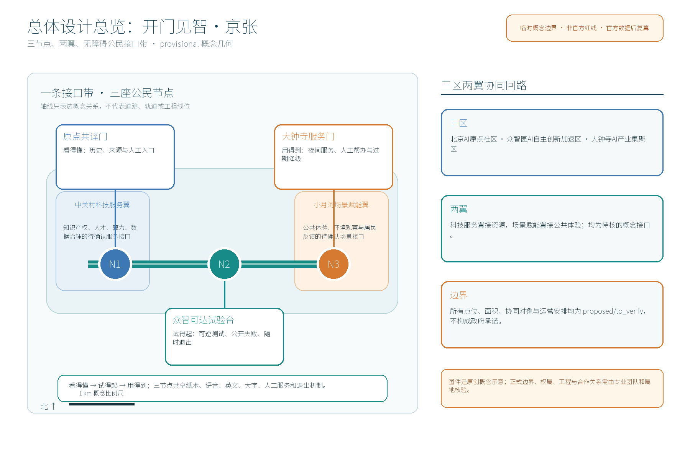
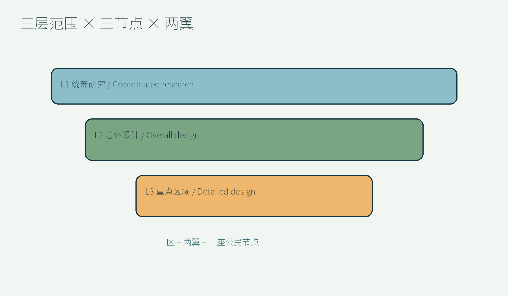
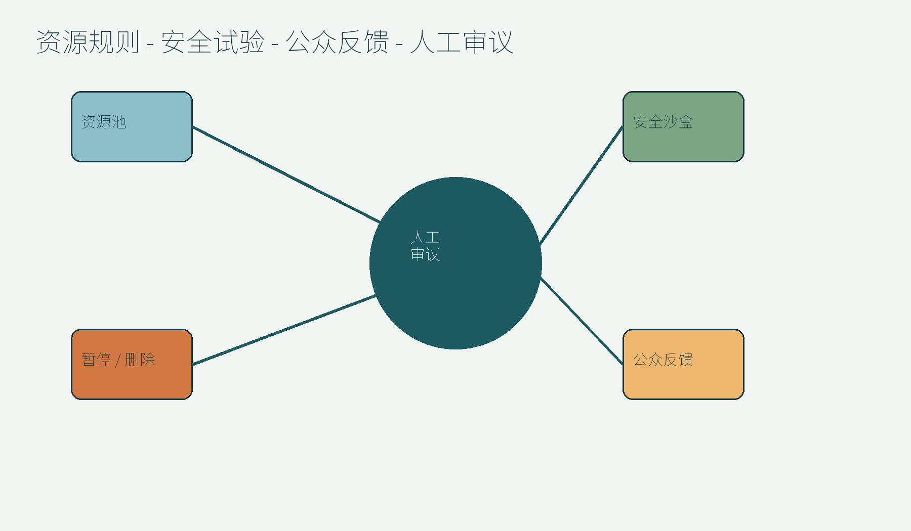
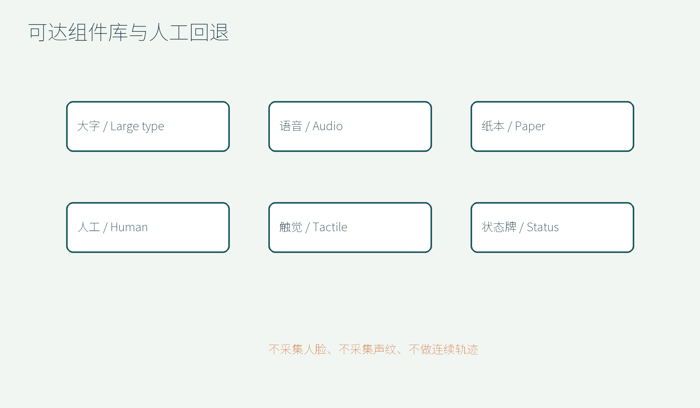
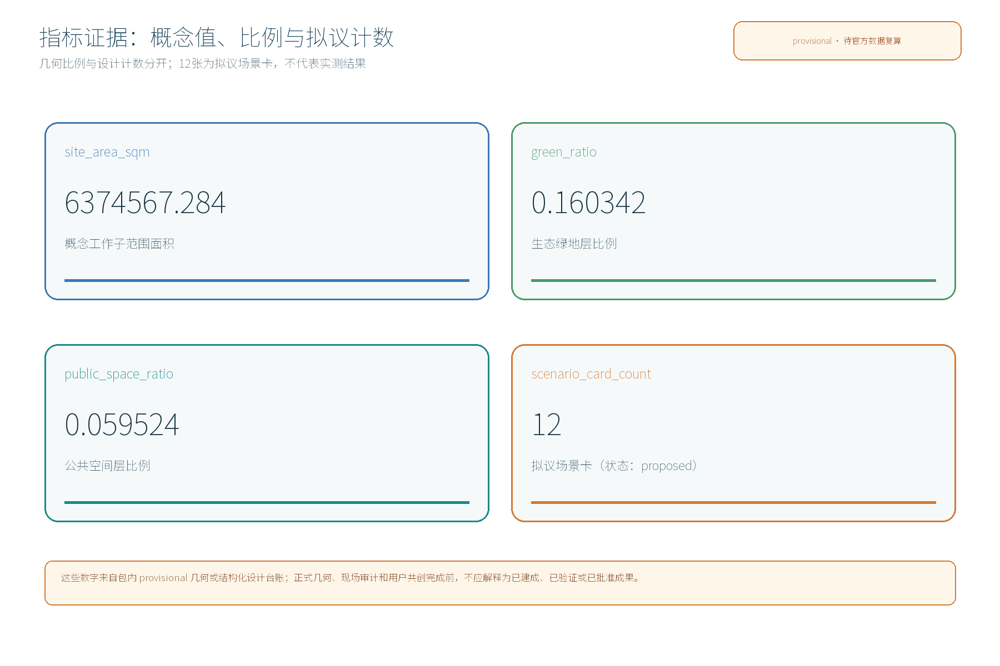

## 设计依据与资料清单

本文件是“概念建议、参考方案、可供专业团队深化研究”的候选成果，不是法定规划、工程结论、招商承诺或审批依据。依据征集公告与用户提供的清权任务书，方案将百年京张文化带、都市AI生活体验带、AI融合创新带三大定位转译为“可达的历史理解、可退的公共试验、可核验的日常服务”三条工作线。[source:SRC-OFFICIAL-ANNOUNCEMENT] [source:SRC-TASKBOOK-CLEARED]

资料分为四层：一是项目公告和任务书，确定三层范围、三区两翼、三节点、五大功能与六项 agent 任务；二是公开规划/城市设计/用地分类/无障碍和生成式AI治理文本，只作为方法与边界参照；三是公开国际案例，只提取机制，不把案例数据冒充本地事实；四是本方案自建的 provisional 几何、场景卡、协议和指标。所有来源、许可与可用范围见 sources.json；所有未知项在 assumptions.json、risk.json 中用 provisional/to_verify/unknown 显式记录。[source:SRC-MOHURD-URBAN-DESIGN] [source:SRC-MNR-LAND-USE-CLASSIFICATION] [source:SRC-BARRIER-FREE-LAW]

候选品牌为“开门见智·京张 / OPEN-DOOR JZ”。标志方向是一个未闭合的门框与铁路枕木节奏组成字母 JZ，门框留出一段空白，表达“人可以拒绝、人工可以接管、信息可以被追问”。图形是本方案原创概念视觉，不使用京张铁路、政府或商业商标，不主张注册权。

视觉识别与总体结构的交付口径是：以“开门见智·京张 / OPEN-DOOR JZ”为主标识方向，以门框、枕木节奏和留白组成可扩展的原创符号，不冒用铁路、政府或企业标志；总体结构图以“一条接口带—三座公民节点—两翼供给回路”表达三区两翼协同，图中的线段、点位和面积均为 provisional 概念证据，不是品牌注册、官方红线或工程结论。
## 三层范围工作框架

三层范围采用任务书要求的“统筹研究—总体设计—重点区域”工作框架，并不把概念几何当成官方红线。统筹研究范围按公告文字口径约43.6平方公里，总体设计范围约11.4平方公里，重点区域约368.4公顷；本候选方案选取其中一段作为便于复核的 provisional 工作子范围，面积只服务于几何复算。[source:SRC-OFFICIAL-ANNOUNCEMENT] [source:SRC-PROVISIONAL-GEOMETRY]

| 层级 | 工作对象 | 本方案输出 | 边界状态 |
|---|---|---|---|
| L1 统筹研究 | 海淀百年京张 AI 创新带及其产业、文化、公共服务联系 | 三区两翼协同、产业/人才/数据/算力/场景机制、7个公开案例 | 任务书范围口径；官方空间边界待核验 |
| L2 总体设计 | 总体设计范围内的创新带公共接口网络 | “接口带”结构、蓝绿和慢行优先原则、运营和指标框架 | provisional 概念工作范围 |
| L3 重点区域 | N1 原点共译门、N2 众智可达试验台、N3 大钟寺服务门 | 节点平面关系、场景卡、组件库、试验协议和实施清单 | provisional 点位，不能替代用地/工程审批 |

空间组织是“一条可达接口带、三座公民节点、两翼供给回路”。三区分别为北京AI原点社区、众智园AI自主创新加速区、大钟寺AI产业集聚区；两翼为中关村科技服务翼、小月河场景赋能翼。三节点由“看得懂—试得起—用得到”接力，而非新增一条未经核验的道路或轨道。
## 外部区域概念协同矩阵（proposed / to_verify）

以下是把创新带与外部对象接成可核验接口的概念矩阵，不代表已取得合作、资金、场地或政府安排。每一行先定义可交换的输入、输出和接口，再列出启动前必须取得的验证资料。

| 外部对象 | 协同主题 | 拟议输入 → 输出 | 空间 / 运营接口 | 验证资料与状态 |
|---|---|---|---|---|
| 北纬社区 | 无障碍社区服务与居民共译 | 输入：居民需求、无障碍审计问题；输出：匿名问题卡、人工服务反馈与纠错清单 | N1 原点共译门的纸本/语音入口；社区议事桌和投诉回路 | 社区边界、共创意愿、无障碍现场记录与责任人；proposed / to_verify |
| 未来科学城 | AI 研发成果的低风险公共服务试验 | 输入：可脱敏的模型说明、测试假设；输出：场景卡、失败日志与可复现摘要 | N2 众智可达试验台的沙盒时段；开发者桌、人工审议和退出机制 | 参与主体、数据清单、伦理/安全审查、试验授权；proposed / to_verify |
| 怀柔科学城 | 科研仪器、科学传播与公民理解 | 输入：可公开的科学解释素材与专家校审意见；输出：双语来源卡、公众提问与修订记录 | N1 记忆接口廊架和N2共译桌；不接入未授权内部数据 | 素材版权、专家身份与可公开范围、传播许可；proposed / to_verify |
| 经开区 | 智能制造 / 辅具产业与场景验证 | 输入：设备参数、无障碍使用假设；输出：匿名体验指标、人工回退记录和改进建议 | N2 可逆试验台与N3服务门的展示/借用接口；不替代采购或认证 | 设备安全、供应商授权、检测标准、现场责任与保险；proposed / to_verify |
| 京津冀 | 跨区域无障碍服务与创新传播 | 输入：可比较的公开服务指标和案例机制；输出：双语方法卡、接口标准建议和年度交流议题 | 三节点离线下载页、开发者社区与年度公示；不宣称跨地区联运 | 各地公开数据许可、协作主体、交通/服务边界与传播授权；proposed / to_verify |

矩阵的最小闭环是“对象确认—资料清权—小规模人工审议—公开失败—决定是否退出或扩散”。在取得验证资料前，所有外部对象只能作为研究接口，不能写成已合作方、已承诺资源或已批准试点。

## 统筹研究范围产业与未来城市研究

统筹研究不先假设企业名单、投资主体或合作协议，而是研究“要素如何被公平地接到公共场景”：中关村科技服务翼提供知识产权、资本、人才、算力和数据治理的服务接口；小月河场景赋能翼提供日常公共空间、环境观察与居民反馈接口；三区分别承担文化入口、全栈创新和智能原生服务门。所有具体合作方、资金来源、算力规模和审批路径均为 unknown/to_verify。[source:SRC-TASKBOOK-CLEARED]

| 公开案例 | 可借鉴机制 | 京张创新带的转译 | 不直接复制的部分 |
|---|---|---|---|
| 纽约高线公园 | 分段开放、非营利运营与持续公共编程 | 机制参照，不是海淀现状证据 |
| 首尔清溪川 | 步行体验与水环境叙事联动 | 机制参照，不是海淀现状证据 |
| 新加坡榜鹅水道 | 滨水网络与日常生活场景复合 | 机制参照，不是海淀现状证据 |
| 巴塞罗那超级街区 | 把交通管理转译为可用公共空间 | 机制参照，不是海淀现状证据 |
| 维也纳多瑙河岛 | 防洪、安全与公共活动并置 | 机制参照，不是海淀现状证据 |
| 哥本哈根港口浴场 | 公共可达性与水岸安全前置 | 机制参照，不是海淀现状证据 |
| 赫尔辛基卡拉萨塔马 | 居民共创、开发者生态与开放接口 | 机制参照，不是海淀现状证据 |

产业与未来城市研究形成“资源池—安全沙盒—公开反馈—人工审议—小步扩散”的循环。资源池只接入经清权的公开数据、虚拟数据和自愿提供的匿名摘要；安全沙盒以三项 industry_test_protocols 做前置试验；公开反馈通过公示和议事保留少数意见；人工审议决定上线、暂停、删除或回退。AI 不是新的审批机关，也不对居民、商户或访客做个体画像。

AI创新生态图谱按“土地—空间—产业—资金—人才—算力—数据—场景”八类要素组织：土地与空间只提供待核的承载关系，产业与资金只研究服务接口和潜在转化路径，人才与算力研究可复现的开发支持，数据只用清权公开/虚拟/匿名摘要，场景以三项 proposed 协议和12张卡记录，不代表已实测。众智园的“全栈自主体系”由数据治理、模型/工具、算力接口、开发者测试、人工审议和失败回退串联；AI原点社区的创新生态由历史共译、低门槛公共服务、居民反馈和文化传播串联。中关村科技服务翼为这些要素提供知识产权、人才、资本、算力、数据治理的待确认服务接口，但不构成招商、投资或合作承诺。[data:visual/assets/scenario_cards.json#cards] [data:visual/assets/protocols.json#protocols]
## 总体设计范围城市更新与控规深度城市设计

总体设计把“可达性”定义为一种城市界面，而不是单一无障碍设施：路线上能找到人、页面上能看懂不确定项、遇到失败能回到纸本/人工、参与意见能看到回应。空间结构为“西侧服务接入—中段共译试验—东侧夜间生活”的接口带，南北方向通过现有公共空间、社区出入口和步行联系进行连续性研究；不绘制未经资料证明的道路、轨道或桥梁工程结论。[source:SRC-MOHURD-URBAN-DESIGN] [source:SRC-BARRIER-FREE-LAW]

城市更新采用“留界面、改可达、少拆除、可回退”：保留可识别的铁路记忆线索、成熟绿量、可继续使用的建筑和社区服务；改造首层门槛、围墙断点、标识、照明和服务窗口；拆除策略仅作为“违法/危旧/阻断安全的对象待调查”清单，不给出具体地块、面积或业主结论。建筑体量、容积率、高度、地下空间、投资和工程造价均不在本概念方案中定案。[source:SRC-MOHURD-CONTROL-DETAILED-PLANNING]

空间导则：一是接口连续，标识、座椅、遮阴、饮水、卫生间信息和人工台形成最小服务单元；二是信息分层，使用简明中文、英文、大字、语音和纸面替代；三是设施可逆，以可移动、可撤回组件优先；四是蓝绿前置，所有水边活动都以水文、防洪、蓝线和生态核验为前提。
## 重点区域详细设计

三个节点不是新建项目名称，而是可供专业团队深化的三处“接口角色”建议，几何点位均 provisional：[source:SRC-TASKBOOK-CLEARED] [data:geometry/key_areas.geojson#nodes]

| 节点 | 角色 | 关键空间 | 公共价值 | AI 边界 |
|---|---|---|---|---|
| N1 原点共译门 | 把百年京张与AI创新翻译成人人可理解的入口 | 记忆接口廊架、纸本/语音服务台、低视力导览 | 先理解、再选择、可人工追问 | 只处理清权文本和匿名选择，不做身份识别 |
| N2 众智可达试验台 | 把辅助技术和公共服务原型放到可控、可退出的场景 | 可逆试验台、开发者桌、人工回退位 | 先小规模测、公开失败、再决定是否扩大 | 不代替审批，不接入真实证件和私有数据 |
| N3 大钟寺服务门 | 把AI新商业转译为夜间可用的公共服务 | 首层服务门、口袋空间、商户自报状态牌 | 找得到人、坐得下来、过期信息不误导 | 不做客流监控、消费画像和歧视性排序 |

东西向以“两翼接口卡”缝合：中关村科技服务翼提供资源规则、人才和知识产权咨询；小月河场景赋能翼提供公共体验、环境观察和居民试用。南北向以“服务台—口袋空间—公共空间”连续界面缝合。三节点共同使用“公约、议事、积分、公示、备案、预约、轮换、分级”八个机制词，但这些仍是建议机制，须由专业团队和属地协商确认。
## AI 创新生态、人才画像与 AI+ 场景

六项 agent 任务在本方案中形成一条可审计链：agent.1 负责概念、品牌、三层空间和三区两翼图；agent.2 负责7个公开案例、生态要素和供给机制；agent.3 负责12张 scenario cards、6类 persona 和3项行业协议；agent.4 负责蓝绿/公共空间、东西缝合、南北联系、3类AI地标与组件库；agent.5 负责京张历史、AI新文化、双语标识和国际叙事；agent.6 负责年度运营、开发者社区、开放场景和责任回路。结构化映射在 compliance_matrix.json。[source:SRC-TASKBOOK-CLEARED] [data:visual/assets/scenario_cards.json#cards] [data:visual/assets/protocols.json#protocols]

### Scenario cards（12张）

下表是可复核索引；每张卡的触发、AI角色、人工角色、空间、可达性、隐私、成功指标和停止条件均在 `visual/assets/scenario_cards.json` 展开。[metric:scenario_card_count]

| 编号 | 场景 | 使用者 | 空间 | 观察指标 | 停止条件 |
|---|---|---|---|---|---|
| sc-01-origin-wayfinding | 原点低视力导览 | 低视力访客、首次到访者 | N1 原点共译门 + 连续无障碍界面 | 5分钟内完成出口与人工台确认的匿名完成率 | 提示与现场不一致、投诉连续两次或人工复核未通过 |
| sc-02-origin-history | 京张历史共译桌 | 中小学生、国际访客、铁路爱好者 | N1 记忆接口廊架 | 来源可追溯率与公众纠错闭环率 | 来源缺失、历史叙事出现未经核验的断言 |
| sc-03-bench-form | 众智政策表单解释器 | 创业者、社区组织、普通居民 | N2 众智可达试验台 | 误填率下降与人工转介完成率 | 法律含义无法稳定解释或出现个人敏感信息 |
| sc-04-bench-prototype | 辅助器具快速验证 | 残障人士、照护者、开发团队 | N2 可逆试验台 | 完成率、错误恢复时间、参与者自评可控感 | 连续出现伤害风险、诱导或无法退出 |
| sc-05-bench-water | 小月河微环境观察 | 学生、志愿者、生态运营人员 | N2 至小月河赋能翼的观察窗 | 观察卡完成率与环境提示理解度 | 传感器漂移、蓝线/防洪资料未核验或误导风险 |
| sc-06-dazhongsi-service | 大钟寺无障碍夜间服务门 | 夜间就业者、老年人、外卖骑手、游客 | N3 大钟寺服务门 + 商业街首层界面 | 找到服务所需时间与无障碍标签纠错率 | 商户状态无法核验或出现歧视性排序 |
| sc-07-dazhongsi-nightmarket | 轮椅友好夜间小市集 | 社区摊主、轮椅使用者、邻里家庭 | N3 服务门前可逆铺装口袋空间 | 不同年龄/行动能力参与者比例与投诉闭环时长 | 通行被阻断、噪声超出约定或隐私违规 |
| sc-08-cross-zone-transit | 三节点接力问路 | 跨区办事的居民与工作者 | N1-N2-N3 接口回路 | 路线理解率与现场纠错响应时间 | 轨道/道路资料不能核验或路线存在安全冲突 |
| sc-09-civic-agenda | 共议议程生成器 | 居民、学生、街区运营者 | 三节点轮换议事台 | 议题多样性、回应率、再次参与率 | 意见无法去除个人信息或模型合并掩盖少数意见 |
| sc-10-open-scene | 开发者开放场景日 | 开发者、院校团队、公众体验者 | N2 试验台与小月河赋能翼 | 可复现实验比例、参与者退出率、修复周期 | 私有数据进入、风险分级失败或不可回退 |
| sc-11-care-route | 照护者短时喘息路线 | 带儿童、老人或照护对象的家庭 | N1-N3 口袋空间与服务驿站接口 | 路线中断率与照护者自评压力变化 | 设施状态过期或路线不满足安全要求 |
| sc-12-public-feedback | 年度接口公示与退出 | 所有使用者、监督者、媒体与研究者 | 三个节点的公告面 + 离线下载页 | 公开报告可读率、投诉回应率、主动退出完成率 | 无法说明数据来源、人工接管或纠错结果 |

### Persona 与行业测试

| Persona | 核心需求 | 设计回应 |
|---|---|---|
| 周阿姨，72岁社区居民 | 看得清、问得到人、不会被迫使用手机 | 大字/纸本/人工并行，服务状态有更新时间 |
| 小林，轮椅使用者与测试顾问 | 连续可达、可随时退出、参与意见被保留 | 无障碍连续界面、低门槛预约、人工主持 |
| Amina，国际访问者 | 双语短句、文化语境、不会误解法定信息 | 双语导览、来源卡、人工澄清 |
| 陈同学，中学生 | 安全探索、理解京张历史、参与真实但无风险实验 | 儿童版历史卡、虚拟数据、陪同机制 |
| 李工，开发者/创业者 | 可复现测试、公开规则、明确数据边界 | 场景协议、失败日志、人工回退与公开摘要 |
| 王师傅，夜间服务从业者 | 快速找到休息、饮水、人工帮助 | 高对比服务门、过期信息降级为未知 |

| 协议 | 假设 | 通过条件 | 停止条件 |
|---|---|---|---|
| itp-01-accessible-dialogue | 无障碍多模态对话接口试验 | 相较纯文本基线，完成率提升且可控感不下降；具体阈值由预试确定。 | 出现误导法定义务、无法退出、歧视性推荐或敏感信息输入。 |
| itp-02-civic-form-explainer | 公共表单可理解性试验 | 误填率下降且越界表达为零；解释页面明确不替代正式渠道。 | 模型给出审批/资格结论或参与者被诱导提交个人信息。 |
| itp-03-public-space-recovery | 公共空间人工回退与运维试验 | 所有故障情形可切换人工模式，公开状态不会超过约定时效。 | 系统继续显示未知状态为可用、发生个体监控或人工无法接管。 |

三项协议均为 proposed，不是已获批试点。隐私底线是：只做匿名聚合，关键决定由人复核，禁止过度监控；任何真实数据接入前必须有清权、最小化、目的限定、退出和删除机制。
## 用地、建筑规模与拆改留方案

用地表达采用可校验的国土空间用途分类逻辑，但本图层只是概念覆盖和界面策略，不构成法定用地性质。`land_use.geojson` 将 provisional 工作子范围切成若干不重叠的研究单元，用于复算覆盖率；正式分类、权属、开发边界、容积率、建筑高度和地下空间需以官方资料和专业审查为准。[source:SRC-MNR-LAND-USE-CLASSIFICATION] [data:geometry/land_use.geojson#coverage]

建筑采取“保留优先、改造可逆、拆除待核”：保留铁路文化可识别线索、成熟树木、公共服务和仍有使用价值的建筑；改造门厅、首层界面、围墙、标识、照明、无障碍路径和可转换空间；拆除只记录需依法调查的违法建设、危旧对象或确有安全阻断的对象，不在本方案指定地块与数量。建筑单元仅作为概念承载体，`building_unit_count` 不等于真实建筑清单。[metric:building_unit_count]

| 控制项 | 本方案处理 | 状态 |
|---|---|---|
| 用地分类 | 使用公开分类逻辑，保留“研究单元”属性 | provisional / to_verify |
| 建筑规模 | 只给功能容量和可逆组件逻辑，不给 FAR/高度结论 | unknown |
| 拆改留 | 以留、改为主，拆除对象待测绘、权属和安全核验 | provisional |
| 地下空间 | 不作可行性、容量或工程结论 | unknown |
| 投资与产权 | 不作主体、金额、融资或招商承诺 | unknown |

## 交通、轨道、市政与公共服务设施

交通策略以“先可达信息，后专业工程研究”为顺序。`roads.geojson` 仅是概念步行/骑行/服务接口线，不代表道路红线；轨道关系只列为待核验资料项，不写站名、线路、运营主体或已确认接驳关系。慢行网络采用方向清楚、人工可问、低带宽可用的设计；机动车、消防、无障碍、停车、客货流和施工组织必须由交通与工程专业团队复核。[source:SRC-RAIL-INTERFACE-UNKNOWN]

市政与公共服务采用“信息先行 + 设施最小单元”：服务台、无障碍卫生间信息、饮水、遮阴、座椅、照明、AED 位置提示、纸面地图和人工转接构成基础包；雨水、排水、电力、通信、照明、防洪、水质和蓝线等只建立接口检查表，不推出管线、容量、断面或工程量。设施开放状态过期时必须降级为“未知”，不得继续显示“可用”。

| 服务包 | 公众可见内容 | 专业核验前提 |
|---|---|---|
| 可达包 | 路线、座椅、遮阴、饮水、人工台、卫生间状态 | 无障碍专项、现场测绘、运营责任 |
| 夜间包 | 开放时间、照明、人工帮助、低噪时段 | 治安、消防、照明和商户确认 |
| 试验包 | 预约、风险告知、虚拟数据、退出按钮 | 伦理/安全、设备与人工回退 |
| 生态包 | 聚合环境趋势、观察卡、禁入提示 | 水文、蓝线、生态和防洪资料 |

## 蓝绿空间、公共空间与城市风貌

蓝绿策略不把水边体验写成工程承诺，而是建立“可观察、可撤回、先核验”的公共空间序列：京张遗址公园作为文化叙事背景，节点周边采用轻介入的座椅、遮阴、标识、展陈和低带宽服务；小月河场景赋能翼作为公共试用和环境观察界面；所有岸线、蓝线、河道管理范围、防洪和植物配置均待官方资料与专业审查。[source:SRC-TASKBOOK-CLEARED]

三类AI地标为概念标识，不是建筑物或商标：①“门框年表”展示铁路时间线与今日AI问题卡；②“共译灯塔”以可变但不追踪的文字/声音提示显示人工服务与公众议题；③“可达刻度”用触摸、图标和双语刻度提示路线、停留与回退。三类地标均可拆、可停用、可替换，不使用未经授权的历史图像、字体、人物肖像或商标。

组件库包含：双语门牌、大字/触觉牌、低位信息台、折叠座椅、可逆遮阴、静音提示、纸本地图盒、人工回退牌、数据状态牌、意见投递盒、活动可达性检查卡。颜色和对比度为设计建议，最终须做色觉、夜间、屏幕阅读器和现场可达性测试。

agent.4 的公共空间策略明确为“京张遗址公园AI公共空间”的轻介入概念：以东西缝合连接文化入口与产业服务，以南北贯通连接社区入口、口袋空间和公共体验路径；大钟寺采用智能原生消费与商务服务界面的可逆试验，而不是擅自改造权属空间。荣誉展示体系建议以“来源卡—贡献者自愿署名—失败/修复记录—年度公示”构成可撤回的公共荣誉墙，避免个人肖像、企业商标和未经授权材料；公共空间组件库则把门牌、触觉牌、服务台、数据状态牌和人工回退牌做成可替换模块。

agent.5 的空间文化系统由“铁路时间线—中关村创新方法—AI新文化问题卡”三段叙事组成，表达载体包括导视、标识、符号、纸本/语音来源卡、节点展陈和双语网页。国际传播叙事强调“历史可理解、技术可质询、服务可退出”的城市气质；文化标识系统与一带整体Logo系统分开管理，所有历史材料和字体均须清权后再发布。
## 更新项目清单、实施政策与分期计划

更新清单按“先开门、再试验、后扩散”的三期推进，不承诺具体建设时序、资金或审批结果。近期（概念上的0—18个月）完成资料核验、N1/N2小规模接口样板、场景协议预试和人工回退；中期（18—36个月）在通过安全/隐私/可达性复核后轮换开放N3服务门、公共空间组件与年度活动；远期（36个月以后）依据年度公示和专业评估决定是否扩大或退出。[metric:phase_count]

| 项目 | 位置/对象 | 规模口径 | 责任接口 | 退出条件 |
|---|---|---|---|---|
| P1 资料与边界复核 | 三层范围与三节点 | 不设工程量 | 规划/测绘专业团队（待确认） | 官方边界无法支撑时重画 |
| P2 共译门样板 | N1 | 1个概念样板 | 公共文化/服务运营（待确认） | 内容来源或人工接管不足 |
| P3 可达试验台 | N2 | 3项行业协议 | 试验管理员/无障碍顾问（待确认） | 出现不可回退风险 |
| P4 服务门与口袋空间 | N3 | 可逆组件包 | 商户/社区运营（待确认） | 通行、噪声或隐私风险 |
| P5 年度公示与退出 | 三节点 | 1套报告机制 | 运营联盟（概念建议） | 无法公开来源和错误 |

运营机制包括公约、议事、积分、公示、备案、预约、轮换、分级；积分只记录组织者/摊位履约，不记录个人消费或行踪。年度至少一次公开报告、季度抽查、每次试验后的问题摘要和退出入口是建议的最低运营节奏，均需专业团队与属地确认。

agent.6 的年度活动体系不是已确定活动，而是一套可供共创的六项运营机制：①“开门见智周”作为年度主题活动框架；②活动品牌与传播视觉系统使用原创门框/留白符号并提供双语、纸本和无障碍版本；③开发者社区运营机制以月度开放桌、失败日志、导师轮换和公开规则维持；④AI场景开放运营机制以预约、风险分级、人工回退和过期降级管理；⑤公共体验和城市地标运营以巡检、可达性检查卡、静音时段和退出牌管理；⑥国际传播和招引转化机制只做公开案例、开发者成果和需求对接，不承诺招商、资金或合作。六项机制的具体主体、频次、预算和审批均为 to_verify/unknown。[metric:annual_program_count]
## 指标体系、面积复算与合规矩阵

指标分三类：A 类为能由几何复算的核心视觉指标；B 类为场景/结构计数；C 类为需现场或官方资料的未知控制项。A 类仅作为本候选包的 provisional 几何证据，不是法定面积。三项核心指标在 `metrics.json` 与双语视觉页中保持同值，并由 `spatial_review.py` 重新计算。[data:metrics.json#site_area_sqm] [data:visual/index.html#core-metrics]

| 指标 | 值/状态 | 公式或计数口径 | 触发复算 |
|---|---:|---|---|
| site_area_sqm | 6374567.284 known | provisional site boundary 面积 | 官方边界或测绘发布 |
| green_ratio | 0.160342 known | green union / site boundary | 绿地/蓝绿底图发布 |
| public_space_ratio | 0.059524 known | public-space union / site boundary | 公共空间与权属资料发布 |
| key_area_count | 3 known | 三个 provisional key areas | 节点边界确认 |
| scenario_card_count | 12 known | scenario_cards.json cards 数量 | 卡片增删时 |
| industry_test_protocol_count | 3 known | protocols.json protocols 数量 | 协议审议时 |
| persona_count | 6 known | persona 清单数量 | 调研样本设计时 |
| global_case_count | 7 known | 公开案例清单数量 | 来源核验时 |
| annual_program_count | 6 known | 年度运营建议项数量 | 运营共创时 |
| FAR/height/investment/capacity | null unknown | 不在本概念方案定案 | 官方控规/专业专项 |

合规矩阵把公告要求、agent.1—6、13 review_dimensions、几何、指标、视觉、来源、假设和自检 ID 连成证据链。`design_depth_matrix.json` 逐项标明现状诊断、三层框架、空间结构、用地、强度边界、风貌、拆改留、交通轨道、市政、蓝绿、三节点、项目清单、分期、指标复算、风险缺口等15项已覆盖/待核验状态。
## 风险、版权与合规说明

本方案明确以下边界：它是概念建议、参考方案、可供专业团队深化研究，不是法定规划、控规、建筑设计、工程可研、投资计划、招商承诺、合作协议、审批意见或政府结论。不得把 provisional 几何、场景假设、案例机制、AI 输出、活动提案或品牌概念当成已确认事实。[source:SRC-TASKBOOK-CLEARED]

AI 治理三句底线：只做匿名聚合；关键决定由人复核；禁止过度监控。所有场景保留人工服务和退出入口，不采集人脸、声纹、连续轨迹、身份证明、支付信息或私人接口数据；真实数据接入、公开活动、商户开放状态和任何设施实施，都必须先完成清权、隐私、无障碍、安全、消防、交通、生态、水文、蓝线和属地协商核验。生成内容仅作草案，历史叙事和法定信息不得由模型自行定稿。

| 风险 | 当前判断 | 边界/缓释 | 责任与状态 |
|---|---|---|---|
| 数据隐私 | 个体画像会侵蚀公共信任 | 匿名聚合、最小化、删除、人工复核 | 运营方待确认 |
| 空间与水环境 | provisional 几何不能支撑工程 | 官方边界、蓝线、防洪和测绘复核 | 专业团队 to_verify |
| 无障碍公平 | 数字优先会排除人 | 纸本、语音、人工、可退出并行 | 无障碍顾问待确认 |
| 技术成熟度 | 原型可能误导或失效 | 小规模协议、过期降级、人工回退 | 试验管理员待确认 |
| 公众接受 | AI 可能遮蔽少数意见 | 议事、公示、保留相反意见 | 社区机制 provisional |
| 版权与商标 | 历史/字体/图片权利不明 | 仅用清权文本与原创几何，逐项登记 | rights ledger |

版权台账 `report/copyright_statement.md` 区分：原创概念文本/图形/几何、公开来源的事实性摘要、仅供机制参考的案例名称、系统字体的本地渲染风险、未来可能需要清权的历史素材。未明确许可的一律不进入候选视觉。
## 参考资料

结构化资料与正文相互校验：`sources.json` 是来源与权利台账；`assumptions.json` 是未知项；`risk.json` 是风险登记；`metrics.json` 是可复算指标；`geometry/*.geojson` 是 provisional 空间证据；`visual/assets/scenario_cards.json` 和 `protocols.json` 是场景与行业测试数据；`compliance_matrix.json`、`standard_matrix.json`、`design_depth_matrix.json` 是要求映射；`self_check.json` 记录四门本地检查，不代表官方评分。[data:sources.json#license_policy] [data:assumptions.json#assumptions] [data:risk.json#risks]

主要公开依据：征集公告、清权任务书、住建部门城市设计管理方法、控规编制审批办法、自然资源用地分类指南、无障碍环境建设法、生成式人工智能服务管理暂行办法、国务院办公厅老年人智能技术实施方案，以及七项公开城市案例。所有链接与访问状态以 sources.json 为准；本草稿不在视觉页调用远程资源。

本方案建议父任务审阅重点：①确认三层范围数字与临时几何的表达没有被误读为官方边界；②复核 N1/N2/N3 与三区两翼的角色对应；③逐张审阅12张卡和3项协议的隐私、人工回退与停止条件；④请专业团队补充交通、蓝线、控规、权属、现场无障碍和字体/历史素材权利资料。

专业证据锚点（机器索引，不改变正文阅读顺序）。标准规范索引：
- [standard:BARRIER-FREE-ENVIRONMENT-LAW]
- [standard:ELDERLY-SMART-TECH-PLAN-2020-45]
- [standard:GENERATIVE-AI-INTERIM-MEASURES]
- [standard:MNR-LAND-USE-CLASSIFICATION-GUIDE]
- [standard:MOHURD-ARCH-DESIGN-DEPTH-2016]
- [standard:MOHURD-CONTROL-DETAILED-PLANNING]
- [standard:MOHURD-URBAN-DESIGN-MEASURES]
- [standard:PROJECT-AGENT-OPEN-CALL-TASKBOOK]
- [standard:PROJECT-OFFICIAL-ANNOUNCEMENT]

设计深度索引（一）：
- [depth:blue_green_public_space]
- [depth:development_intensity_controls]
- [depth:existing_conditions_diagnosis]
- [depth:height_massing_character]
- [depth:land_use_layout]
- [depth:metrics_recalculation]
- [depth:municipal_new_infrastructure]
- [depth:overall_spatial_structure]

设计深度索引（二）：
- [depth:phasing_implementation]
- [depth:renewal_project_list]
- [depth:retain_renovate_demolish]
- [depth:risk_missing_data]
- [depth:three_key_area_detailed_design]
- [depth:three_level_scope_framework]
- [depth:traffic_rail_slow_parking]

几何数据索引：
- [data:geometry/buildings.geojson#features]
- [data:geometry/constraints.geojson#features]
- [data:geometry/green_space.geojson#features]
- [data:geometry/key_areas.geojson#features]
- [data:geometry/land_use.geojson#features]
- [data:geometry/phasing.geojson#features]
- [data:geometry/public_space.geojson#features]
- [data:geometry/roads.geojson#features]
- [data:geometry/site_boundary.geojson#features]

指标索引：
- [metric:annual_program_count]
- [metric:building_footprint_area_sqm]
- [metric:building_unit_count]
- [metric:global_case_count]
- [metric:green_ratio]
- [metric:green_space_area_sqm]
- [metric:industry_test_protocol_count]
- [metric:key_area_count]
- [metric:land_use_zone_count]
- [metric:landmark_count]
- [metric:persona_count]
- [metric:phase_count]
- [metric:public_space_area_sqm]
- [metric:public_space_ratio]
- [metric:road_network_length_m]
- [metric:scenario_card_count]
- [metric:site_area_sqm]
