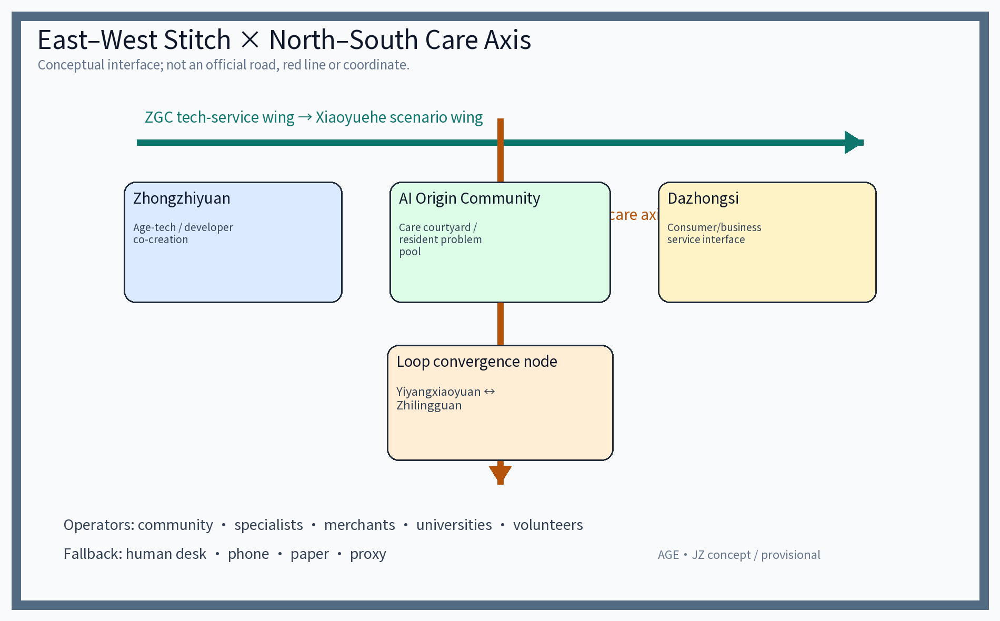
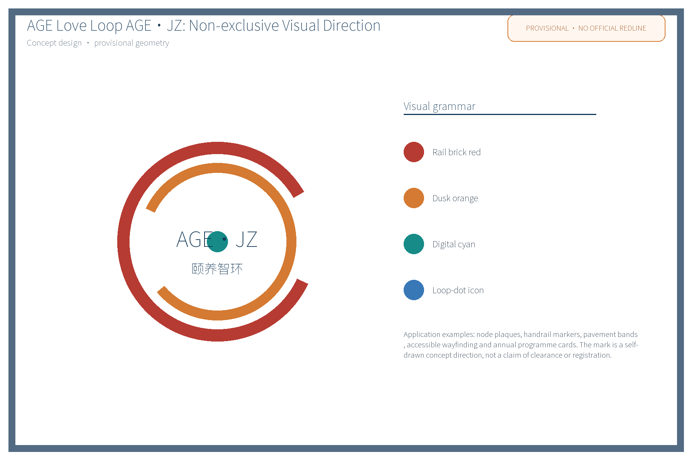
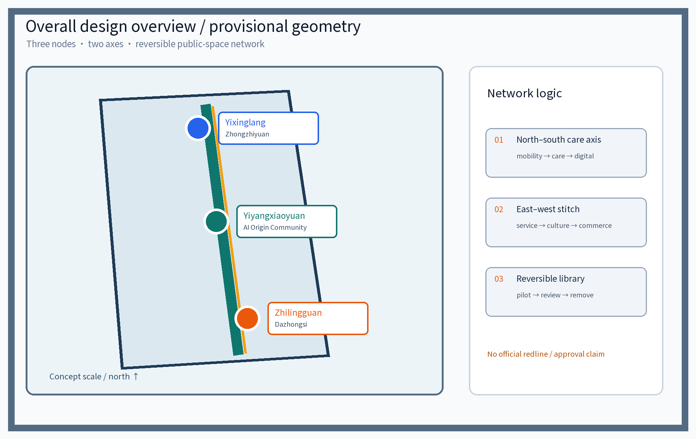
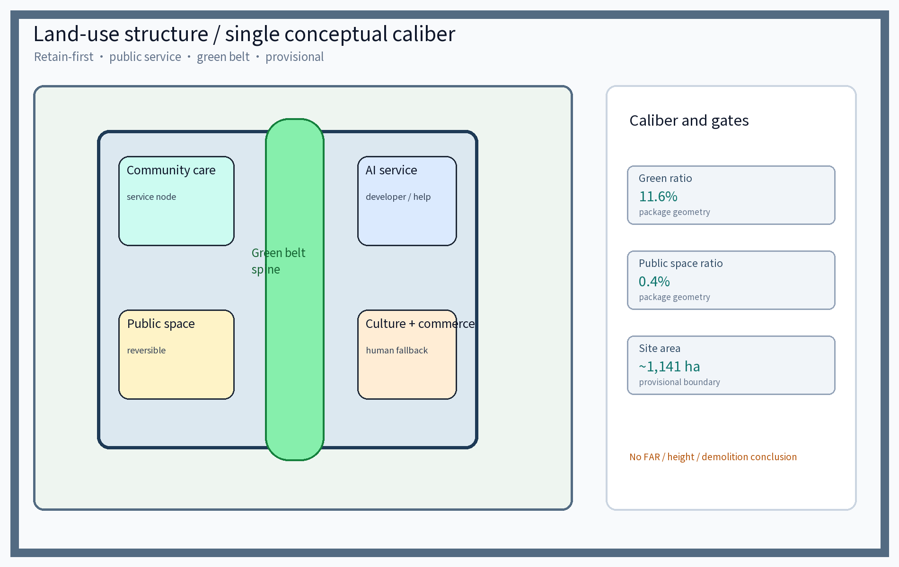
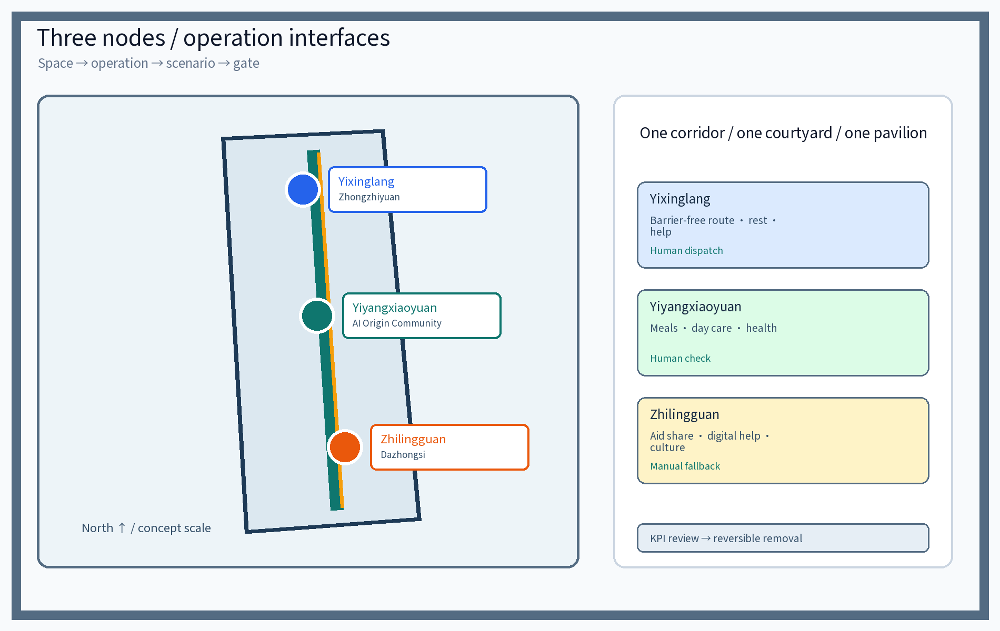
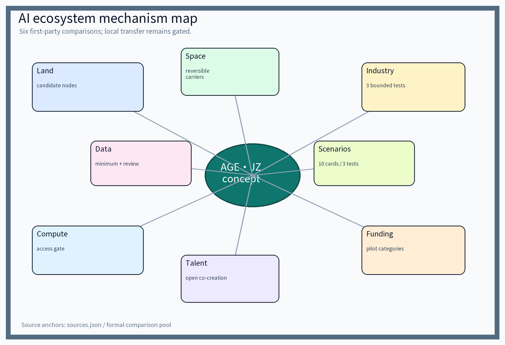
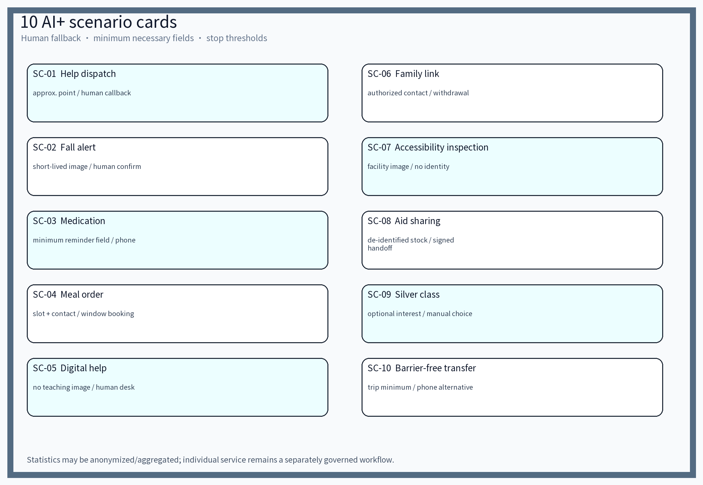
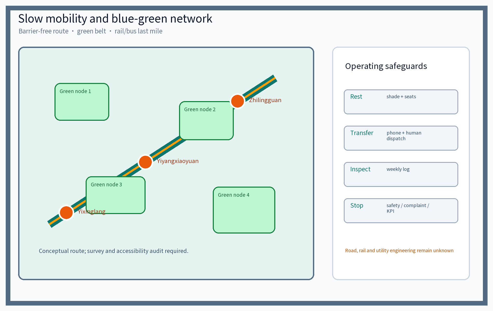
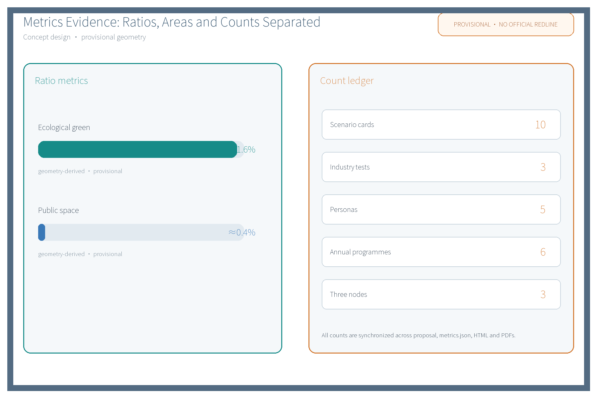

## Design Basis and Source List
The design basis includes the public call-for-proposals taskbook (agent.1-6), the official seven-dimension review rubric and the submission organization template, plus public policy directions and professional documents. Documented sources are listed in Design Basis; actual referenced data are registered in `sources.json`; unacquired items are marked in assumptions and missing-data notes. Evidence anchors in this narrative use short IDs (date suffix omitted); the full IDs with publisher, published and accessed dates and reuse boundaries are in `sources.json`, e.g. `[source:DATA-SRC-AGENT-TASKBOOK]` corresponds to the taskbook excerpt. [source:DATA-SRC-OFFICIAL-ANNOUNCEMENT], [source:DATA-SRC-AGENT-TASKBOOK], [source:DATA-SRC-MOHURD-URBAN-DESIGN-MEASURES], [source:DATA-SRC-MOHURD-CONTROL-DETAILED-PLANNING], [source:DATA-SRC-MNR-LAND-USE-CLASSIFICATION], [source:DATA-SRC-PROVISIONAL-BOUNDARIES]

 and [source:DATA-SRC-GENERATIVE-AI-INTERIM-MEASURES] are cited where claims rest on them.

## Three-Level Scope Framework
Per the official announcement's textual scope: coordinated research area ~43.6 km2 (belt industry and future-city research) - overall design area ~11.4 km2 (urban renewal and regulatory-plan-level urban design) - key areas ~368.4 ha (three key-area detailed designs). This package is a participant provisional model specializing in the three aging-friendly nodes within the overall design area; it replaces no official geometry of any level. The three formal core metrics `site_area_sqm`, `green_ratio` and `public_space_ratio` are recomputed from this package's geometry, not quoted. Until official data (elder population distribution, meal and care demand, existing accessibility asset surveys) are published, values are flagged as assumptions with stated use boundaries and recompute triggers. [source:DATA-SRC-AGENT-TASKBOOK]

## Industry and Future-City Research at the Coordinating Scale
Industry and future-city research identifies the livelihood-side combination of aging-friendly renovation with the innovation belt: smart age-tech equipment, rehabilitation aids and health-data services extend the industrial chain, exploring blocks where youth innovation and elderly living coexist. It links the Three Zones Two Wings loop - Zhongzhiyuan AI Accelerator, Beijing AI Origin Community and Dazhongsi AI Industry Cluster as the "three zones"; Zhongguancun Technology-Service Wing and XiaoYue River Scenario-Enabling Wing as the "two wings" - and establishes concept-level coordination with Beiwu community, Future Science City, Huairou Science City, Beijing E-Town and the Beijing-Tianjin-Hebei cluster (to be verified after official data release). Six direction-only global aging-friendly cases are summarized: Beijing old-community adaptation, Shanghai one-touch elder-care call services, Japan's community-based integrated care, Singapore's age-friendly housing, MOHURD home-adaptation orientation and the WHO age-friendly cities framework; each is registered in `sources.json` with "to be verified" status and is not conclusive case evidence. [source:DATA-SRC-PROVISIONAL-BOUNDARIES]

### Six global AI innovation ecosystems (formal comparison pool)

Only first-party institutional pages with a stable evidence location are used below. They compare mechanisms; they do not imply a Haidian partnership, capacity, budget or procurement. Facts are paraphrased only; no page graphics, marks or layouts are reused. Local property, data, licensing and public procedures remain gates before transfer.

| Global AI ecosystem | Place | First-party page and evidence anchor | Comparable mechanism (not a transfer) | Actionable AGE·JZ translation | Non-transferable part |
|---|---|---|---|---|---|
| AI Singapore 100 Experiments | Singapore | [source:DATA-SRC-AI-ECOSYSTEM-AISINGAPORE-100E]; applied experiments are organized around teams, assessment and handover | Competitive entry, co-funding category, talent/research teams, scenario validation and handover | A conceptual “open call—small pilot category—human assessment—operations handover” for the three nodes | No Singapore funding, timeline, partner or outcome is promised; local eligibility and procurement are pending |
| UK AI Research Resource (AIRR) | United Kingdom | [source:DATA-SRC-AI-ECOSYSTEM-UK-AIRR]; the government page describes researcher access to AI compute and research resources | Compute access, shared research/industry use, application review and compute–data–scenario boundaries | A Zhilingguan developer-corner gate: eligibility, minimum data, compute quota pending and human review | No UK resource, compute scale or cross-border data flow is implied; equipment, network and licensing are pending |
| Vector Institute | Toronto, Canada | [source:DATA-SRC-AI-ECOSYSTEM-VECTOR]; the institute describes research, talent, industry adoption and public/industry collaboration | Research–talent–industry intermediary, problem intake, evaluation and knowledge transfer | A “problem pool—talent co-creation—scenario acceptance—knowledge pack” linking universities, specialists, merchants and communities | No Vector participation, brand, course or partner list is claimed; local authorization is pending |
| Mila | Montreal, Canada | [source:DATA-SRC-AI-ECOSYSTEM-MILA]; public material frames research, talent, social impact and industry collaboration | Research platform, talent network, industry/public-interest collaboration and impact review | A conceptual research interface for silver classrooms, error stratification and human-takeover review | Research capacity, members, funding and governance are not transferred; local ethics and data review remain independent |
| NUS BLOCK71 | Singapore | [source:DATA-SRC-AI-ECOSYSTEM-NUS-BLOCK71]; NUS describes incubation, co-creation, startup community and cross-region networks | Incubation space, venture support, enterprise/university/developer community and conversion entry | A developer co-creation corner in Zhilingguan and a problem-to-service conversion list in the ZGC tech-service wing | No NUS, BLOCK71 or resident company is claimed; space, tenants and IP arrangements are pending |
| European AI Factories | European Union | [source:DATA-SRC-AI-ECOSYSTEM-EU-AIFACTORIES]; the EU framework combines compute, data, talent and startup/industry support | Public compute nodes, data/talent support, research/startup access and industrial scenarios | Split “compute–data–talent–scenario” into auditable pilot gates and annual review without pre-committing procurement | No EU facility, cross-border data or funding access is implied; local compute, data and compliance are pending |

### Eight-factor mechanism mapping (conceptual; no implementation commitment)

| Factor | Package action | Responsibility / access | Formal gate and stop condition |
|---|---|---|---|
| Land | Candidate nodes and retain-first suggestions inside a provisional boundary | Ownership, planning, heritage and green-line review | No placement without boundary, ownership and heritage confirmation |
| Space | Yixinglang, Yiyangxiaoyuan, Zhilingguan and the east–west stitch as reversible carriers | Site survey, accessibility audit and public co-review | Adjust/remove when continuity or safety fails |
| Industry | Three industry tests plus aid, care and digital-assistance problem pool | Operators, licensed parties and specialists sign test protocol | Pause after error, safety event or unresolved complaints |
| Funding | Conceptual competitive-pilot and annual-operations budget categories only | Budget, procurement and grant eligibility pending; no amount stated | No equipment, staffing or service volume without approved budget |
| Talent | Universities, developers, volunteers, care workers and residents co-create | Open application, training, volunteer and care qualification review | No scale-up without human-review and training records |
| Compute | Access interface for the Zhilingguan developer corner and tests | Resource origin, accounts, network and data isolation pending | Stop without resource isolation or anomaly monitoring |
| Data | Minimum necessary fields, roles, retention/deletion, withdrawal and human alternatives | Controller, legal basis and privacy review pending | Stop on purpose creep, unauthorized access or failed deletion |
| Scenarios | Ten cards, three industry tests and public annual review | Pilot application, public feedback, human review and KPI | Remove after KPI miss, major safety/service issue or unsuitable site |

The six domestic/international aging-policy and project entries are background reading only and are not counted in the formal pool or treated as cleared, verified or transferable evidence: Beijing old-community adaptation, Shanghai One-Touch, Japan community-based care, Singapore Kampung Admiralty, home adaptation direction, and the WHO age-friendly cities framework. Their state is uniformly `background_only`; see `sources.json`.

## Overall Urban Renewal and Control-Plan-Level Urban Design
The overall design organizes an age-friendly public-space environment around the relic-park green belt: the Yixinglang slow axis, restful nodes and accessible facilities, reversible growth, streets that can time-share display and science-popularization needs. It advocates renewal-first, keep-renovate-improve, micro-update over large demolition. 

Brand & visual identity (agent.1): primary identity "AGE Love Loop AGE·JZ", logo direction "loop graph" derived from rail imagery; color system of railroad brick red, dusk warm orange and digital cyan; sans-serif Chinese black type with geometric sans Latin; loop-sign wayfinding symbols and hub-dot icon system for guide signs, railing markers, pavement and nodal plaques. The name is an internal working codename; it will not be registered or used externally before prior-rights clearance. FAR, building height and other statutory-control-dependent content remain unknown pending official data. [source:DATA-SRC-MOHURD-CONTROL-DETAILED-PLANNING]

## Detailed Design of Key Areas
All node locations are concept points to be re-positioned after site survey, verification and public comment. Yixinglang: continuous ramps, barrier-free corridor and softened crossings form the slow main chain with rest seats, night lighting, one-touch help posts and honor-display walls. Yiyangxiaoyuan: existing buildings micro-adapted into a day-care, meal, health-check and silver-classroom courtyard with graded care and the "Silver Volunteer Star" honor-display system. Zhilingguan: a digital elder-care pavilion offering aid-device sharing, smart-terminal teaching, fraud-prevention publicity and human-assisted service desks. Every node deploys a Reversible Public-Space Component Library (modular seating, movable awnings, temporary accessible ramps, swappable sign components) to avoid one-time fixed construction. [source:DATA-SRC-PROVISIONAL-BOUNDARIES]

### Three-node implementation cards (agent.4 deepening)

| Card item | Yixinglang (Zhongzhiyuan side) | Yiyangxiaoyuan (AI Origin Community side) | Zhilingguan (Dazhongsi side) |
|---|---|---|---|
| Site and existing-condition check | Continuous belt, slope/crossing/lighting and ownership to survey; rail/bus proximity is only a candidate condition | Service radius, stock space, ownership and care/meal qualifications pending | Near cultural space and accessible; building, cultural-facility use and digital baseline pending |
| Space components | Ramps, softened crossings, seats, lighting, help post and honor wall | Day care, meal portioning, health corner, silver classroom, visiting area and honor wall | Device teaching, aid sharing, anti-fraud, human desk and developer corner |
| Operation and human fallback | Street lead, operator and volunteers; hotline, human dispatch and maintenance log | Community, specialists and resident council; manual care, meal serving and health review | Industry/university/merchant/volunteer group; human guidance plus phone/window consumer service |
| License and verification | Accessibility works and utility access pending; integrity, response time and continuity KPIs | Care filing, meal sanitation and health-check compliance pending; service and satisfaction KPIs | Aid-device business/disinfection, digital service and data compliance pending; turnover, class/help satisfaction KPIs |
| Stop/adjust | Slope, ownership or safety unsuitable; adjust/remove after KPI miss | Capacity, license or service quality unsuitable; stop/adjust after KPI miss | Supply, demand or data risk unsuitable; pause after safety event, unresolved complaint or KPI miss |

**Dazhongsi intelligent-native consumer/business service interface (conceptual):** organize digital-assistance consumption, booking, aid and cultural services as “merchant/community need card—developer/operator micro-pilot—human confirmation—public feedback—remove/iterate”. Operators are only pending merchant, community, industry/university alliance and specialist roles; no tenant or signed partnership is stated. Human desk, phone, paper receipt and family/volunteer proxy remain available. Misleading consumption, unauthorized personal-data use, concentrated accessibility complaints or a safety event immediately disables automated recommendation/dispatch, transfers to humans, and triggers investigation, notice and removal logs.

## AI Innovation Ecosystem, Talent Personas and AI+ Scenarios

An AI innovation ecosystem atlas organizes AI across transport, industry, space, public services, culture and governance into perceivable scenario cards, with an industry-space mapping (age-tech equipment and rehab-aid industry, cultural content via experience pavilions and silver classrooms, governance guardrails via public services, mobility via the slow axis, spatial scenarios via the component library). Ten scenario cards are fixed (fall-alert, medication-reminder, meal-ordering, digital-assistance, family-linking, one-touch help, accessible-inspection, aid-sharing, silver-classroom and accessible-transit-dispatch AI). 

Five persona groups are structed (isolated elders, disabled/semi-disabled elders and their family caregivers, active young-old, dual-income caregiving families, community volunteers and carers), with service-journey barriers and non-digital fallback channels (human windows, hotline, children's agency, volunteer buddying). AI technical protocols cover model evaluation (benchmark testing on anonymous event samples), data quality (collection minimization, field completeness, lifecycle), error stratification (false-positive/negative rates by group, scenario, period) and runtime monitoring (weekly false-positive rate, response time, failure rate). Anonymization/aggregation is used only for statistics; individual services use necessary fields; key decisions receive human review and phone/window/manual alternatives remain available; no individual-identifying tracking or over-monitoring. [source:DATA-SRC-GENERATIVE-AI-INTERIM-MEASURES]

| Card | Scenario | Spatial carrier | AI capability | Layered data governance (not “anonymous only”) | Operator | Level |
|---|---|---|---|---|---|---|
| SC-01 | One-touch elder-care help | Yixinglang help post and light pole | Voice call, emergency dispatch and transfer coordination | Approximate help point, time and callback are necessary fields; controller/basis pending; delete after verified work-order limit; aggregate statistics only | Public service + operator | Pilot |
| SC-02 | Fall-alert AI | Yiyangxiaoyuan check corner and public room | Posture anomaly prompt | Short-lived image and minimum event result are separated; no identity recognition; human confirmation; human service remains without screening | Community + specialists | Pilot |
| SC-03 | Medication reminder AI | Yiyangxiaoyuan and home | Pickup reminder and missed-dose prompt | Minimum pickup/reminder fields; health controller/basis pending; delete at limit; phone/paper reminder alternative | Community + volunteers | Pilot |
| SC-04 | Meal ordering AI | Meal point and booking channel | Ordering, portioning and delivery dispatch | Service, slot and necessary contact only; platform role/basis pending; delete after completion; phone/window booking and withdrawal | Merchants + community | Expansion |
| SC-05 | Digital assistance AI | Zhilingguan help desk | Smartphone teaching and service guidance | Business-necessary fields only; no teaching image retained; controller/retention pending; human help is always available | Universities + volunteers + human desk | Expansion |
| SC-06 | Family-link AI | Zhilingguan and family channel | Booking, visits and reminders | Authorized contact and visit slot minimized; scope/basis pending; stop on withdrawal; personal phone/window route remains | Family + community | Pilot |
| SC-07 | Age-friendly inspection AI | Three-node public space and corridor | Accessibility and lighting inspection | Facility image and fault fields only; no identity recognition; human repair review; delete at limit | Operator + volunteers | Pilot |
| SC-08 | Aid-device sharing match | Zhilingguan aid-share zone | Matching, booking rotation and disinfection dispatch | De-identified item, stock and slot; human signs handoff; no secondary use; manual loan remains | Industry alliance + merchants | Pilot |
| SC-09 | Silver-class recommendation AI | Yiyangxiaoyuan and Dazhongsi cultural space | Course recommendation and interest match | Optional interest preference with notice; no individual behavior profile; deletion/withdrawal pending; manual choice remains | Universities + volunteers | Expansion |
| SC-10 | Barrier-free transfer dispatch | Yixinglang and rail-station last mile | Transfer booking and dispatch | Trip location, time and booking minimized; role/basis pending; delete after trip; phone booking alternative | Transport operator + community | Pilot |

Three industry test-validation scenarios run in the pilot block first (call-emergency linkage, accessibility-inspection false-positive evaluation, aid-sharing match), with public comment channels and trial markings; they scale up only after validation. [source:DATA-SRC-GENERATIVE-AI-INTERIM-MEASURES]

### Three Zones–Two Wings / Three-Node Cooperation Matrix (Conceptual)

**East–west stitch × north–south care axis.** The east–west stitch is a conceptual sequence from the ZGC tech-service wing through Zhongzhiyuan, the AI Origin Community and Dazhongsi to the Xiaoyuehe scenario wing, organizing walkable, pausable and transferable public-service interfaces. The north–south care axis links Yixinglang, Yiyangxiaoyuan and Zhilingguan for care, digital assistance and cultural experience. They meet at a conceptual “loop convergence node” between Yiyangxiaoyuan and Zhilingguan; this is not a real road, red line or coordinate. Placement requires site survey, ownership/heritage/traffic review and public co-review.

| Interface | Exchange resource | Spatial / operating carrier | Verifiable output |
|---|---|---|---|
| ZGC tech-service wing–Zhongzhiyuan | Age-tech, model evaluation, aid-device supply and professional leads | Yixinglang pilot segment and developer corner | Inspection false-positive rate and aid-match success; partners require confirmation |
| Zhongzhiyuan–AI Origin Community | Technical talent, resident problem pool and co-design feedback | Yixinglang–Yiyangxiaoyuan north–south care-axis interface | Request response, human takeover and complaint closure; no partnership assumed |
| AI Origin Community–Dazhongsi | Community care, cultural narrative, digital assistance and meals | Continuous Yiyangxiaoyuan–convergence node–Zhilingguan interface | Cross-node handoff and human-assistance satisfaction; heritage pending |
| Dazhongsi–Xiaoyuehe scenario wing | Merchant scenarios, consumer services, developer tests and operations | Zhilingguan intelligent-native consumer/business service interface | Open pilot applications, merchant fallback and complaint closure; no tenants claimed |
| Future Science City / Huairou Science City | Age-tech, research talent and evaluation methods | Three-node pilot protocols | Test reports, error stratification and stop conditions |
| Beijing E-Town / Beijing-Tianjin-Hebei | Industrial conversion, manufacturing supply and replicable standards | Along-the-belt replication toolkit | Precondition checklist; no signed status is claimed |

The matrix describes potential interfaces only. Intent, data, ownership and partner confirmation are required before pilots; no government, enterprise or community commitment is claimed.

### Original mechanism–common practice–verification

| Original mechanism | Common practice | Added value here | Verification |
|---|---|---|---|
| Three-node human handoff | Single elder-care app or point facility | Mobility–care–digital capability transfer across nodes while retaining phone, human desk and paper fallback | Minimum-necessary work-order fields: handoff completion, human takeover and opt-out; statistics only are aggregated |
| Reversible public-space library | One-time fixed construction | Seats, shade, temporary ramps and signs change through booking, maintenance and removal logs | Quarterly inventory, resident-council review and removal on failure |
| AI suggests; humans decide | Black-box automatic decisions | Unified input, output, error strata, human takeover and stop thresholds bound to nodes | Three industry test reports before scale-up |

### AI validation cards for three industry tests

| Test | Inputs | Outputs | Failure modes and boundary | Human takeover / stop threshold | Node |
|---|---|---|---|---|---|
| Call–emergency linkage | Voice call, time and approximate help point | Work order, human callback and transfer suggestion | False alarm, offline mode, inaccurate location; no diagnosis | Human takeover on no answer, location conflict or high-risk event; weekly review | Yixinglang |
| Accessibility-inspection error test | Facility image, lighting fault log and time period | Repair work order for human verification | Occlusion, low night light and group differences; no identity recognition | Pause if error exceeds pilot threshold for two weeks or cannot be reviewed | Three nodes |
| Aid-sharing match | De-identified item type, stock and booking window | Candidate match, disinfection and handoff task | Expired stock, missing disinfection proof, mismatch; no automatic release | Human signs handoff and disinfection; pause category after any safety event | Zhilingguan |

### Implementation prerequisites and responsibility

| Prerequisite | Current status | Verification method | Responsibility |
|---|---|---|---|
| Ownership, existing buildings and usable space | Unknown / pending | Site survey, ownership and structural records | Participant + authorities |
| Barrier-free continuity, slopes, crossings and lighting | Unknown / pending | Accessibility audit and user walk-through | Specialists + community |
| Care, meal, health-check and aid-device qualifications | Unknown / pending | Permit, filing, disinfection and service-contract review | Operator + specialists |
| Processing roles, PIA, retention and opt-out | Not complete | Business flow, privacy-impact assessment and legal review | Controller/processor + counsel |
| Pilot resources, maintenance and stop conditions | Concept suggestion | Budget categories, RACI, weekly log and quarterly review | Lead street office + operator |

## Land Use, Building Scale, and Retain-Renovate-Demolish Strategy
Retain, renovate and improve with low intervention: existing buildings, public space and reversible components are candidate concepts only; no demolition quantity, building scale, FAR or height is preset. Ownership, heritage, green-line, structure and fire conditions remain pending. The sequence is survey—small pilot—review—reversible removal.

## Transport, Rail, Municipal Infrastructure, and Public Services
The transport concept is slow-traffic-first: the Yixinglang route links the three nodes and opens barrier-free connections to rail stations and bus ends; facilities and vehicles use time-sharing and booking, with rotation at peak periods and concept-level rest spacing. Rail alignments, pipelines and engineering content are not judged. Utilities are interface hints only, without load, capacity or engineering conclusions. Public services are configured at district–node–building levels, compounding meals, day care, health checks and aid recycling with existing facilities and resident feedback, annual disclosure and community activities.

## Blue-Green Network, Public Space, and Urban Character
A green-belt-as-axis, node-parks-as-pearls blue-green system runs along the relic-park belt; facilities integrate with parks in a low-intervention, light, transparent and reversible way without blocking historic remains or view corridors. The three nodes offer public science, experience and honor-display interfaces with human-service fallback. Urban character continues the Jingzhang railway industrial-memory vocabulary in a controlled dialogue with new accessible facilities; the Yixinglang corridor combines shade vegetation with rest seats and upgrades accessible signage, lighting and paving in a low-intervention way, shaping "human warmth + technology texture" rather than viral expression. [source:DATA-SRC-MOHURD-URBAN-DESIGN-MEASURES]

## Renewal Projects, Implementation Policy, and Phasing
The project list is organized in four categories (age-friendly slow-mobility completion, community-service mending, smart-scenario pilots, cultural-atmosphere building) with participants covering government, enterprises, universities, residents, communities, operators, volunteers, merchants and professionals, using a lead-collaborate (RACI) division: streets lead overall coordination, communities and professionals collaborate in implementation, resident councils join decisions and oversight, operators run daily operations; decisions, funding and statistics are disclosed through fixed channels. Implementation is phased and pilot-first: near term 1-3 years starts one pilot block and completes the Yixinglang demonstration section and Yiyangxiaoyuan prototype; mid term 3-5 years completes the three-node network and runs scenario tests; far term 5-10 years forms a replicable along-the-belt mechanism. Pilots define stop/exit conditions: start dismantling or adjustment when pilot KPIs are missed, a major service-quality or safety problem occurs, or a site survey shows an unsuitable location; dismantling follows the component list and booking records for return. An annual review system covers weekly theme days, monthly health days, quarterly results festivals and an annual community forum, with holiday elder-care weeks; all activities require filing. Complementary mechanisms include a developer community, scenario-open applications and evaluation, professional-service cooperation signing, international communication (bilingual copy for overseas universities and institutions), talent/company/developer conversion and an annual review-and-exit mechanism. [depth:phasing_implementation], [depth:renewal_project_list]

| Annual programme / event brand | Frequency | Mechanism words | Operator |
|---|---|---|---|
| Silver Classroom Season | quarterly | booking, rotation | universities + volunteers |
| Home Safety Week | yearly | disclosure, filing | community + professionals |
| Intergenerational Day | monthly | points, buddying | volunteers + resident council |
| Smart Elder-Care Festival | yearly | convention, volunteers | industry alliance + operators |
| Developer Co-Creation Camp | quarterly | developer community | enterprises + universities |
| Yixingloop Run Day | quarterly | booking, disclosure | operator + volunteers |

## Metrics, Area Recalculation, and Compliance Matrix
Suggested core indicators: accessible slow-corridor continuous length, accessibility-facility integrity rate, one-touch help average response time, daily meal-person count, aid-device turnover rate and public satisfaction; ratios and counts are shown separately and never share one axis (see the metrics-evidence figure). The three formal core metrics (`site_area_sqm`, `green_ratio`, `public_space_ratio`) are computed on the provisional boundary with stated source, formula, confidence level, use boundary and recompute trigger; recompute whenever official geometry is published. FAR and building height remain unknown with stated reasons; human-facing figures display only reduced-precision provisional values (e.g., green approx. 11.6%). The compliance matrix responds to agent.1-6: overall concept and brand/VI (agent.1), innovation-ecosystem atlas and factor mechanisms (agent.2), scenario cards and personas (agent.3), AI public space with honor display and component library (agent.4), Jingzhang-Zhongguancun-AI cultural narrative with bilingual international communication (agent.5), annual activity system, developer community and long-term operation (agent.6). [metric:green_ratio], [metric:public_space_ratio], [metric:site_area_sqm], [data:PACKAGE-GEOMETRY]

## Risk, Copyright, and Compliance
This package does not use the blanket claim “all data is anonymized aggregation”. The three privacy rules are: aggregation/anonymization applies to statistical outputs; individual-service workflows such as help, booking, health, family linking and service work orders process only necessary fields, with controller, proposed legal basis, retention/deletion, withdrawal and access rules pending professional review before deployment; key decisions receive human review, and individual-identifying tracking and over-monitoring are prohibited.

| Data-governance scenario | Controller/necessary fields/proposed basis (pending) | Retention, deletion and non-digital alternative | Human review, complaint and incident |
|---|---|---|---|
| Emergency location | Service operator; approximate help point, time and callback number; emergency-service necessity is proposed and must be legally verified | Keep only until work-order closure and a verified limit; delete after; phone/human help remains after opt-out | Human callback and dispatch; complaint line, severity escalation and notice |
| Health checks | Care/health processor; minimum result and time period; business-specific basis pending, not generalized as public health | Isolate raw data briefly; retain de-identified result only to a verified limit; human service remains without screening | Human confirmation of alerts; error review, complaint and incident log |
| Booking | Booking platform/community; service, slot and contact; contract/consent are candidates pending legal review | Delete after service at the shortest necessary limit; phone/window booking and withdrawal | Human rescheduling and anomaly review; complaint channel and access alert |
| Family linking | Community service provider; authorized contact and visit slot; scope and basis pending | Keep only during authorization; stop linkage after withdrawal, retain personal phone/human route | Human authorization check; freeze erroneous links, escalate and notify |
| Service records | Actual service operator; service type, count and work-order state; retention basis pending | Retain only for settlement/quality period; delete or aggregate; paper receipt option | Human work-order review, traceable complaints and incident handling |

## References
References are archived by public/internal classification with acquisition dates and follow official versions: public Jingzhang railway history and relic-park materials (Zhan Tianyou and Jingzhang railway public-history caliber), Beijing master and district-planning public statements, urban-renewal special plans and implementation opinions and accompanying documents, taskbook agent.2 factor mechanisms and public collaboration norms, and aging-friendly domestic and international directions (Beijing old-community adaptation, Shanghai one-touch, Japan community-based care, Singapore age-friendly housing, MOHURD home-adaptation orientation), plus site-survey records and self-drawn analysis sketches (self-collected). `sources.json` includes only verifiable or explicitly "to be verified" entries; no fabricated official data, pages or links are used. [source:DATA-SRC-OFFICIAL-ANNOUNCEMENT]

1. Public call-for-proposals taskbook excerpt: agent_taskbook.json
2. Official seven-dimension review rubric: docs_review-rubric.md
3. Submission organization template: PR_TEMPLATE.md
4. Public Jingzhang cultural-belt historical materials and Haidian aging-friendly policy reports (sources and verification dates to be supplemented when used)
