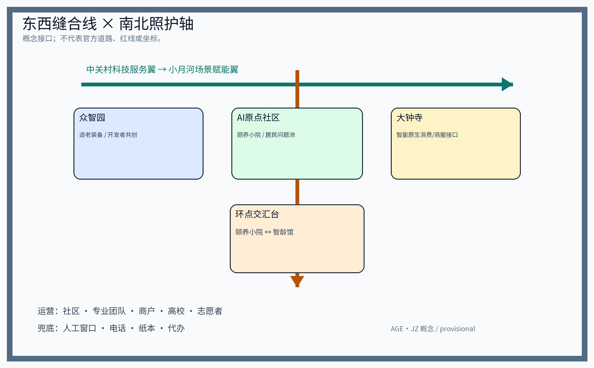
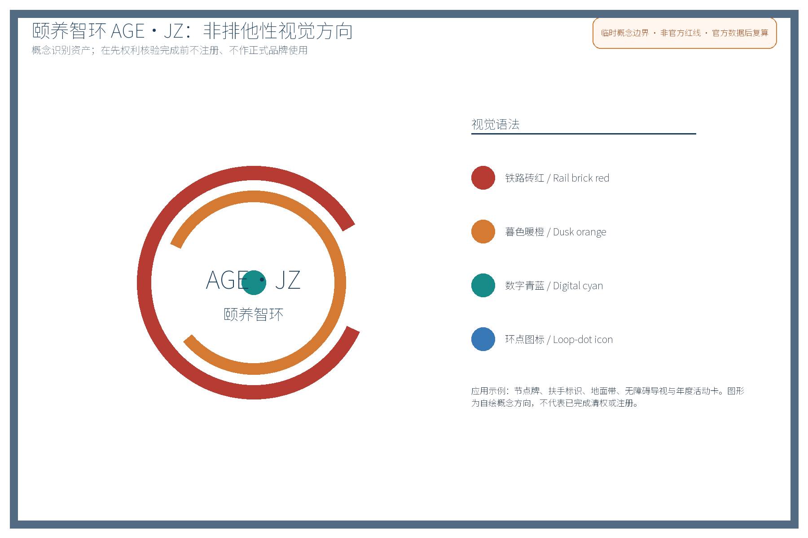
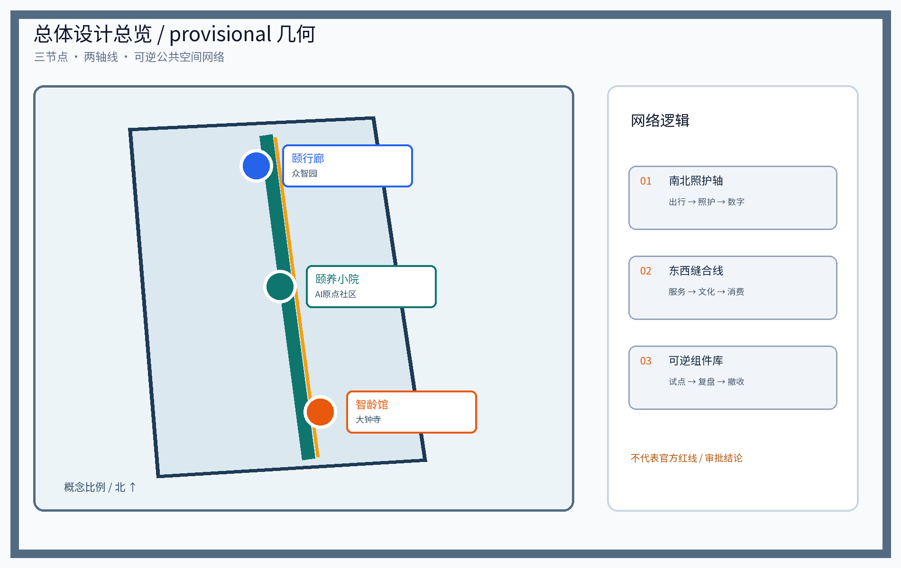
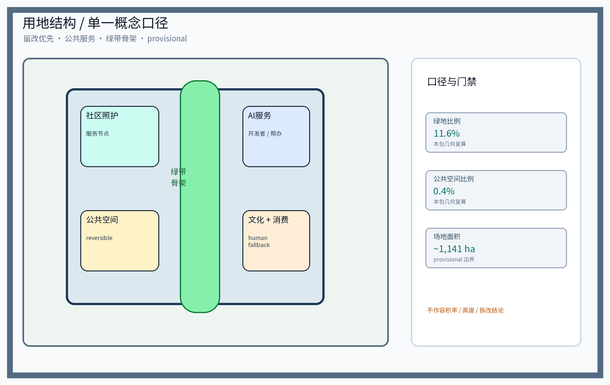
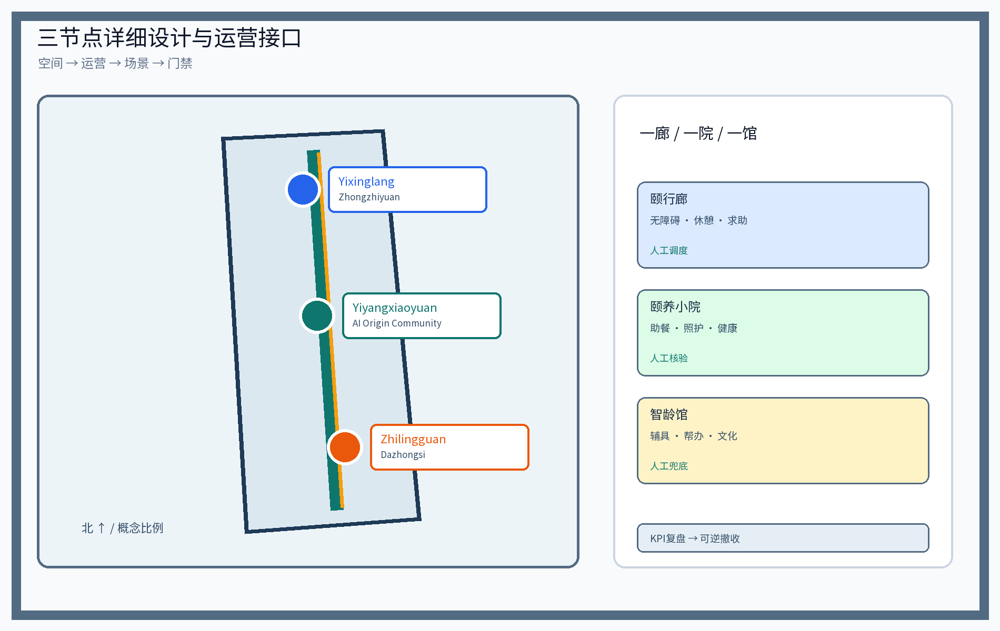
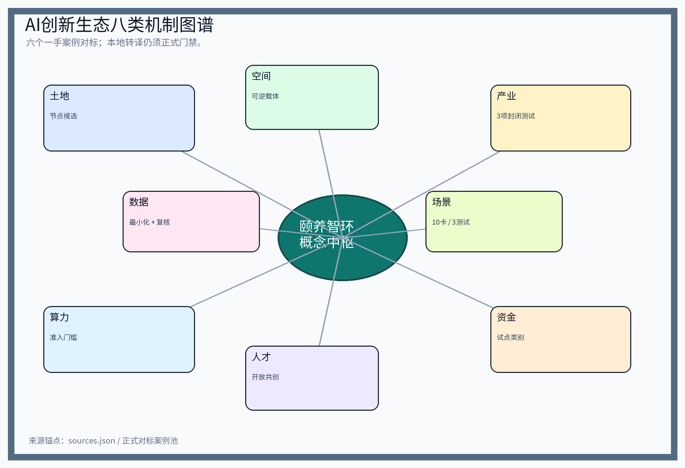
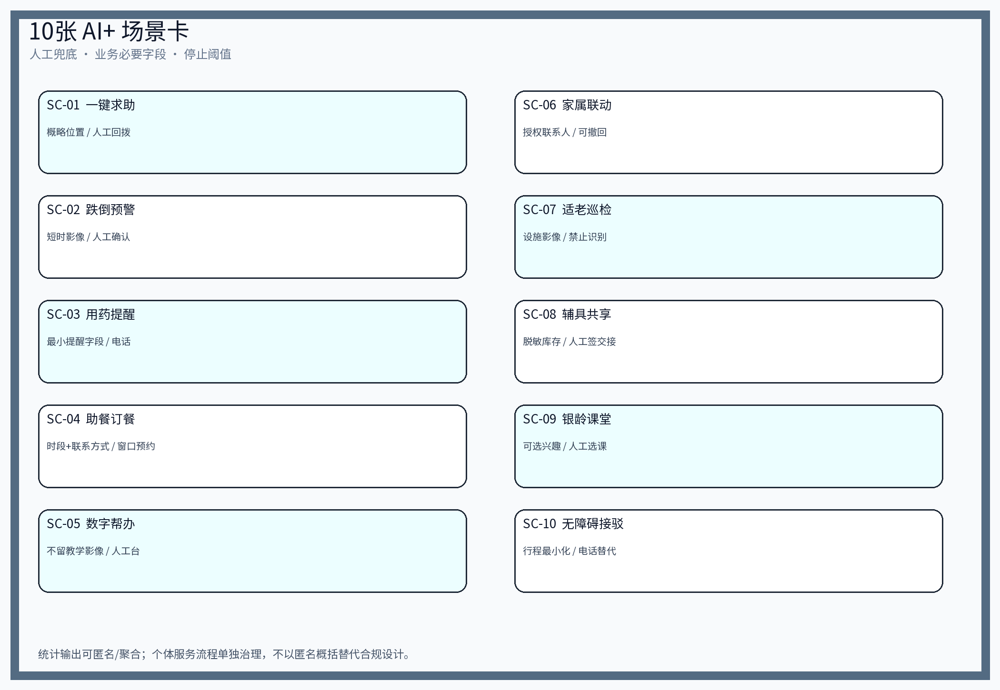
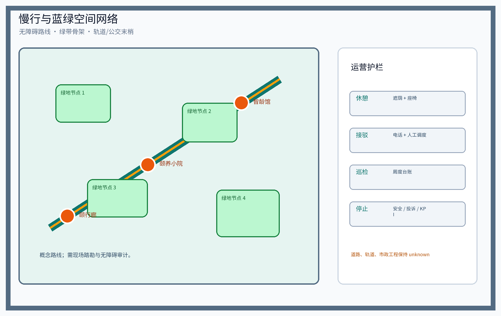
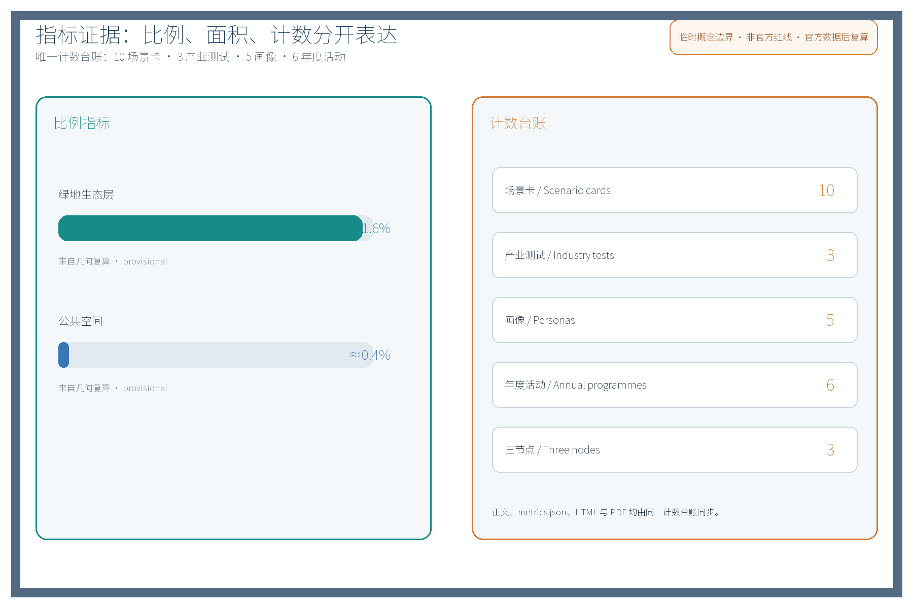

## 设计依据与资料清单
设计依据包括公开征集任务书（agent.1–6）、官方七维评审量规与投稿组织模板，以及主管部门公开政策口径与专业性文件；资料清单所列公开史料、规划报道、通则规范均为概念工作依据清单，并非本包已获取的数据；本包实际引用数据全部登记于 sources.json，未获取项已在假设与缺失数据说明中如实标注。文内证据锚点采用短标识（省略日期后缀），完整标识与本条目来源、发布与访问日期见 sources.json，例如 [source:DATA-SRC-AGENT-TASKBOOK] 对应当日获取的任务书摘录；引用均以公开或清权来源为准，未虚构任何页面或官方数据。

> **证据锚点**：[source:DATA-SRC-OFFICIAL-ANNOUNCEMENT]、[source:DATA-SRC-AGENT-TASKBOOK]（组织方公告与任务书为文本口径依据）。

## 三层范围工作框架
按任务书官方文本口径建立三层范围：统筹研究范围约43.6平方公里（带域产业与未来城市研究）→总体设计范围约11.4平方公里（城市更新与控规深度城市设计）→重点区域约368.4公顷（三处重点区详细设计）；本概念方案为总体设计范围之内、围绕三个原创适老节点的专项深化，属参与者临时模型，不替代任何一层官方几何。三层逐级传导、逐级收敛：统筹研究以「颐养智环」服务网络结构、人口结构与案例对标为证据；总体设计以本包 geometry 层的用地、慢行、蓝绿与设施布局为证据；重点区域以三节点设计深度矩阵与指标复核为证据。site_area_sqm、green_ratio、public_space_ratio 三项正式核心指标均由本包几何复算而非引述；老年人口分布、助餐与照料需求、既有无障碍设施底账等官方数据未发布前一律标注假设与用途边界，官方数据到位后整体复算，本层不预设立场结论。

> **证据锚点**：[source:DATA-SRC-AGENT-TASKBOOK]（三层范围划分依据任务书官方文本口径）、[source:DATA-SRC-PROVISIONAL-BOUNDARIES]。

## 统筹研究范围产业与未来城市研究
产业与城市研究识别适老化改造与银发经济在创新带的结合点：智慧养老装备、康复辅具、健康数据服务与数字助老产品可延展为产业链的民生侧，探索「数智与人文并重」判断下青年创新与长者安居的街区共存模式，并衔接三区两翼协同回路——众智园AI自主创新加速区、北京AI原点社区、大钟寺AI产业聚集区为「三区」，中关村科技服务翼与小月河场景赋能翼为「两翼」，两翼分别承担科技服务输出与日常场景试验，与北纬社区、未来科学城、怀柔科学城、北京经开区及京津冀先进制造业集群建立概念性协同（区域协同在官方数据与规划发布后进一步核对）。未来城市研究仅作方向性预判，不构成对用地、容量与投资的承诺。

> **证据锚点**：[source:DATA-SRC-PROVISIONAL-BOUNDARIES]（边界为 provisional，研究范围仅作概念示意）、[source:DATA-SRC-OFFICIAL-ANNOUNCEMENT]。

### 6个全球 AI 创新生态对标（正式案例池）

下表只纳入可定位的一手机构页面；它们用于比较机制，不代表海淀已有合作、容量、预算或技术采购。每个案例均只作事实转述，不复制页面图形、标识或版式；可迁移性必须经过本地权属、数据、资质和公众程序核验。

| 全球 AI 生态案例 | 地区 | 一手页面与事实锚点 | 可比机制（不等于移植） | 对 AGE·JZ 的可执行转译 | 不可直接转移的部分 |
|---|---|---|---|---|---|
| AI Singapore 100 Experiments | 新加坡 | [source:DATA-SRC-AI-ECOSYSTEM-AISINGAPORE-100E]；企业与研究团队围绕应用实验、评估和交接组织试验 | 竞争性项目入口、共同出资类别、人才/研究团队、场景验证与交接 | 为三节点设计“公开征集—小额试点类别—人审评估—移交运维”的概念流程 | 不承诺新加坡资助、周期、伙伴或成果；本地采购与资助资格待核 |
| UK AI Research Resource（AIRR） | 英国 | [source:DATA-SRC-AI-ECOSYSTEM-UK-AIRR]；政府页面说明研究者可申请使用 AI 算力与研究资源 | 算力准入、研究者与产业共享、申请/评审、算力—数据—场景的使用边界 | 为智龄馆开发者角和三项产业测试设置“资格审查—最小数据—算力配额待核—人工复核”门槛 | 不暗示海淀获得英国资源、算力规模或跨境数据流动；设备、网络和资质待核 |
| Vector Institute | 加拿大多伦多 | [source:DATA-SRC-AI-ECOSYSTEM-VECTOR]；机构页面展示研究、人才培养、产业采用与政府/产业协作机制 | 研究—人才—产业 adoption 的中介组织、企业问题征集、评估与知识转移 | 形成高校、专业团队、商户和社区的“问题池—人才共创—场景验收—知识包”接口 | 不宣称 Vector 参与本项目，不复制其品牌/课程/伙伴名单；本地组织授权待核 |
| Mila | 加拿大蒙特利尔 | [source:DATA-SRC-AI-ECOSYSTEM-MILA]；机构公开材料以研究、人才、社会影响和产业协作为生态线索 | 研究平台、人才网络、产业/公共议题协作、影响评估 | 为银龄课堂、模型误差分群和人工接管复盘设置研究合作的概念接口 | 不移植其研究能力、成员、资金或治理模式；本地伦理与数据审查必须独立完成 |
| NUS BLOCK71 | 新加坡 | [source:DATA-SRC-AI-ECOSYSTEM-NUS-BLOCK71]；NUS 页面介绍孵化、共创、创业社区与跨区域网络 | 孵化空间、创业服务、企业/高校/开发者社区、项目转化入口 | 在智龄馆设置开发者共创角，在中关村科技服务翼设置问题发布和服务转化清单 | 不宣称 NUS、BLOCK71 或其企业入驻；空间、招商和知识产权安排待核 |
| European AI Factories | 欧盟 | [source:DATA-SRC-AI-ECOSYSTEM-EU-AIFACTORIES]；欧盟公开框架将算力、数据、人才和创业/产业支持组合 | 公共算力节点、数据与人才支持、研究/创业申请、产业场景试验 | 将“算力—数据—人才—场景”拆成可审计的试点门禁与年度复盘，不预设采购 | 不暗示可直接使用欧盟设施、跨境数据或资金；本地算力、数据和合规条件均待核 |

### 八类要素机制映射（概念级，不构成实施承诺）

| 要素 | 本包对应动作 | 责任/准入 | 正式门禁与停止条件 |
|---|---|---|---|
| 土地 | 仅做 provisional 边界内的节点候选与留改优先建议 | 权属、规划、文保、绿地蓝线待主管部门核验 | 无权属/边界/文保确认不得落地 |
| 空间 | 颐行廊、颐养小院、智龄馆及东西缝合线形成可逆载体 | 现场踏勘、无障碍审计、公众共议 | 连续通行或安全条件不满足即调整/撤收 |
| 产业 | 三项产业测试与辅具、照护、数字帮办问题池 | 运营方、资质方、专业团队共同签署测试协议 | 误报、安全事件、投诉闭环失败即暂停 |
| 资金 | 只设“竞争性试点/年度运维预算类别”概念入口 | 预算、采购、资助资格待核，不写金额 | 无批准预算不得承诺设备、人员或服务量 |
| 人才 | 高校、开发者、志愿者、照护人员与居民共创 | 开放申请、培训、志愿者与照护资质核验 | 无人审与培训记录不得扩大场景 |
| 算力 | 智龄馆开发者角与测试资源的配额接口 | 资源来源、账号、网络、数据隔离待核 | 无资源隔离或异常监测即停止测试 |
| 数据 | 最小必要字段、角色、保存删除、撤回与人工替代 | 处理者、合法性基础和隐私审查待核 | 目的外使用、越权访问或无法删除即停用 |
| 场景 | 10张场景卡、3项产业测试、年度公开复盘 | 试点申请、公众意见、人工复核与 KPI | KPI未达、重大安全/服务问题或选址不适即撤收 |

六项国内外适老政策/项目仅作为背景阅读，不计入上述正式案例池，且不作为已核验、已清权或已可移植的正式证据：北京老旧小区适老化改造、上海“一键通”、日本地域包括照护、新加坡 Kampung Admiralty、居家适老化改造方向、WHO 老年友好城市框架，条目状态统一为 `background_only`，详见 `sources.json`。

## 总体设计范围城市更新与控规深度城市设计
总体设计强调「以绿带为骨架的适老公共空间环境」：依托京张铁路遗址公园绿带组织颐行动线、慢行系统与适老设施，设施可逆生长、街道可分时承载展示与科普需求；坚持留改提并举、微更新为主，不主张大拆大建。

**品牌与视觉识别（agent.1）**：主识别「颐养智环 AGE·JZ」，以铁轨意象抽象为环状回廊图形，色彩系统采用「铁路砖红＋暮色暖橙＋数字青蓝」三色，字体以无衬线中文黑体为主、英文以几何无衬线为辅，形成「回字纹导视符号」与「环点图标系统」，应用于站点导视、扶手标识、地面铺装与节点牌；本名称为内部工作代号，在先权利检索完成前不用于外部注册与正式使用。控规深度城市设计仅给出概念性功能分区、街道断面与体量关系建议；容积率、建筑高度等依赖官方控制条件的内容保持 unknown，由专业团队依正式数据复核。

> **证据锚点**：[source:DATA-SRC-MOHURD-CONTROL-DETAILED-PLANNING]、[source:DATA-SRC-PROVISIONAL-BOUNDARIES]。

## 重点区域详细设计
三节点的设施选址均为概念点位，须经现场踏勘、资料核验与主管部门评估及公众意见后重新落位。「颐行廊」：连续坡道、无障碍连廊与缓坡化路口构成慢行主链，沿线布置休憩座椅、夜间照明、一键求助与荣誉展示墙，保障长者与弱势人群全天候通行。「颐养小院」：存量建筑微改造为日间照料、助餐、健康检测、银龄课堂复合小院，分级照护、助餐兼顾高龄独居老人，并设「银龄志愿服务星」荣誉展示体系。「智龄馆」：数字助老与智能适老体验馆，提供辅具共享、智能终端教学、防诈宣传与人工服务兜底，坚持「AI辅助、人始终在位」。三个节点均配置**可逆公共空间组件库**（模块化座椅、可移动遮阳棚、临时无障碍坡道、可更换标识组件），以低干预、可拆卸、可置换方式落地，避免一次性固化建设。

> **证据锚点**：[data:PACKAGE-GEOMETRY]（三节点示意多边形来自本包 geometry/key_areas.geojson）。

### 三节点实施卡（agent.4 深化）

| 实施卡项目 | 颐行廊（众智园侧） | 颐养小院（AI原点社区侧） | 智龄馆（大钟寺侧） |
|---|---|---|---|
| 选址与现状核查 | 绿带连续、坡度/过街/照明与产权待踏勘；近轨道公交仅作候选条件 | 社区服务半径、存量空间、产权、照护/助餐资质待核 | 近文化空间且可达；建筑、文化设施利用与数字能力底账待核 |
| 空间组件 | 连续坡道、缓坡过街、座椅、照明、求助桩、荣誉墙 | 日间照料、助餐分装、健康角、银龄课堂、探视区、荣誉墙 | 终端教学、辅具共享、防诈宣传、人工帮办、开发者共创角 |
| 运营与人工兜底 | 街道牵头、运营团队、志愿者；热线、人工调度与维修台账 | 社区、专业团队、居民议事监督；人工照护、分餐、健康复核 | 产业联盟、商户、高校、志愿者；人工导办、电话/窗口消费服务 |
| 许可与验证 | 无障碍改造、照明市政接入待核；完好率、响应时间、连续长度 | 养老备案、助餐卫生、健康检测合规待核；服务量、满意度 | 辅具经营/消毒、数字服务、数据合规待核；周转率、课堂/帮办满意度 |
| 停止/调整 | 坡度、产权或安全不适；KPI未达即调整/撤收 | 容量、资质或服务质量不适；KPI未达即停办/调整 | 供应链、需求或数据风险不适；安全事件、投诉闭环失败或KPI未达即暂停 |

**大钟寺智能原生消费/商服接口（概念级）**：以“商户/社区需求卡—开发者/运营方小试—人工确认—公开反馈—撤收/迭代”组织数字助老消费、预约、辅具和文化服务；运营主体仅写为待确认的商户、社区、产业/高校联盟与专业团队，不写入驻或签约事实。接口必须同时保留人工窗口、电话、纸本票据和家属/志愿者代办；发生误导消费、个人信息越权、无障碍投诉集中或安全事件时，立即停用相关自动推荐/调度并转人工，按台账完成调查、通知与撤收。

## AI 创新生态、人才画像与 AI+ 场景
本节构建AI创新生态图谱，将AI能力与交通、产业、空间、公共服务、文化、治理六个领域结合

，形成可体验、可展示、可推广的场景体系与「产业—空间」映射：养老服务数字化带动智慧养老装备与康复辅具产业（产业）、适老体验馆与银龄课堂承载文化内容（文化）、AI治理护栏落实公共服务与治理（公共服务、治理）、颐行动线与人流组织服务交通（交通）、公共空间组件库承载空间场景（空间）。生态图谱沿「算力—数据—场景—服务」四级组织：算力依托沿线既有功能、个体服务按最小必要字段处理，匿名聚合仅用于统计输出、场景以10张场景卡固化、服务由街道、社区、企业、高校、志愿者与专业团队共同供给。

| 场景卡编号 | 场景名称 | 空间载体 | AI能力 | 分层数据治理（不等于匿名） | 运营主体 | 验证等级 |
|---|---|---|---|---|---|---|
| SC-01 | 助老一键求助AI | 颐行廊求助桩与照明杆 | 语音呼叫、应急调度与交通接驳协同 | 概略呼救点、时间、回拨号为必要字段；处理者/基础待核；工单关闭后按核定期限删除；统计才匿名聚合 | 政府购买服务＋运营企业 | 试点先行 |
| SC-02 | 跌倒预警AI | 颐养小院检测角与公共区 | 姿态异常提示 | 短时影像与最小事件结果分层处理；禁止身份识别；人工确认；拒绝检测仍可人工服务 | 社区＋专业团队 | 试点先行 |
| SC-03 | 用药提醒AI | 颐养小院与家庭端 | 取药提醒与漏服提示 | 最小取药/提醒字段；健康服务处理者与基础待核；到期删除；电话/纸本提醒替代 | 社区＋志愿者 | 试点先行 |
| SC-04 | 助餐订餐AI | 助餐点与线上预约 | 订餐、分餐与配送调度 | 服务、时段、必要联系方式；预约平台角色与基础待核；完成后删除；电话/窗口预约和撤回 | 商户＋社区 | 扩展 |
| SC-05 | 数字帮办AI | 智龄馆帮办台 | 智能手机教学与业务导办 | 仅业务必需字段；不留存教学影像；处理者与保存期限待核；全程人工帮办可选 | 高校＋志愿者＋人工兜底 | 扩展 |
| SC-06 | 家属联动AI | 智龄馆与家属端 | 服务预约、探视与提醒联动 | 授权联系人、探视时段最小化；授权范围/基础待核；撤回即停；本人电话和窗口保留 | 家庭＋社区 | 试点先行 |
| SC-07 | 适老巡检AI | 三节点公共空间与廊道 | 无障碍设施破损、照明故障巡检 | 仅设施影像与故障字段；禁止身份识别；维修工单人工复核；到期删除 | 运营团队＋志愿者 | 试点先行 |
| SC-08 | 辅具共享匹配AI | 智龄馆辅具共享区 | 供需匹配、预约轮换、消毒调度 | 脱敏物品、库存、预约时段；交接人工签字；目的外使用禁止；可人工借用 | 产业联盟＋商户 | 试点先行 |
| SC-09 | 银龄课堂推荐AI | 颐养小院与大钟寺文化空间 | 文化课程推荐与兴趣匹配 | 兴趣偏好可选、用途明示；不建个体行为画像；删除/撤回待核；人工选课保留 | 高校＋志愿者 | 扩展 |
| SC-10 | 无障碍接驳调度AI | 颐行廊与轨道站点末梢 | 实时出行接驳预约与调度 | 行程位置、时间、预约记录最小化；处理角色/基础待核；行程结束删除；电话预约替代 | 交通运营方＋社区 | 试点先行 |

对应5类人才画像（共5类人才画像：独居老人、失能半失能老人及其家庭照护者、低龄活力老人、双职工赡养家庭、社区志愿者与护工），画像覆盖长者、老人、青年、儿童、家庭、居民、游客、学生、通勤白领、外卖骑手、从业者、残疾人、弱势、亲子、银龄等群体，坚持全龄友好、无障碍、适老、儿童友好与包容原则，逐类列出服务旅程中的主要障碍并给出非智能兜底渠道（社区人工窗口、电话热线、子女代办、志愿者结对）。AI技术协议与数据治理以四项协议约束：模型评测（以真实事件样本与基准测试评估识别模型）、数据质量（以“采集最小化＋字段完备率＋生命周期”校验数据）、误差分群（按人群、场景、时段分群分析误报率与漏报率）、运行监测（误报率、响应时间、故障率按周运行监测）。场景卡与摘要、metrics.json 中的场景名称与数量一致（10张，含5类核心AI+场景）。

| AI质量保障清单 | 内容与机制词 | 指标与边界 |
|---|---|---|
| 模型评测 | 跌倒、巡检事件样本回测与基准测试 | 以匿名事件样本评估；人工复核关键决策 |
| 数据质量 | 采集最小化、字段完备率、生命周期与保存期限 | 数据按保存期限到期删除或脱敏 |
| 误差分群 | 按人群、场景、时段分群统计误报率与漏报率 | 分群结果仅用于改善模型，不用于个体画像 |
| 运行监测 | 误报率、响应时间、故障率按周监测与公示 | 周度运行监测、年度公示与复算触发 |

产业测试验证场景（试点街区先行，注明试验性并设公众意见通道）：三类场景按下列协议先行试点，验证通过后再扩展。

| 产业测试验证场景 | 协议要点 | 验证指标（试点KPI） | 试点与扩展 |
|---|---|---|---|
| 呼叫—应急联动测试 | 一键求助、调度接驳与人工复核联动协议 | 求助响应时间、人工接通率 | 颐行廊试点先行 |
| 适老巡检误报率测试 | 设施影像巡检与误报率评估协议 | 误报率、故障发现时效 | 三节点试点先行 |
| 辅具共享供需匹配测试 | 预约轮换、消毒调度与人库复核协议 | 辅具周转率、预约成功率 | 智龄馆试点先行 |

> **证据锚点**：[source:DATA-SRC-GENERATIVE-AI-INTERIM-MEASURES]（AI 治理表述参照）、[metric:industry_test_scenario_count]、[metric:scenario_node_count]。

### 三区两翼—三节点协同矩阵（概念级）

**东西缝合线 × 南北照护轴。** 东西缝合线以“中关村科技服务翼—众智园—AI原点社区—大钟寺—小月河场景赋能翼”为概念序列，连续组织可步行、可停留、可换乘的公共服务界面；南北照护轴以颐行廊—颐养小院—智龄馆串联照护、数字帮办与文化体验。两线在“颐养小院—智龄馆之间的环点交汇台”概念接口相遇，不代表真实道路、红线或坐标。所有落位须经现场踏勘、权属/文保/交通核验与公众共议。

| 接口 | 交换资源 | 空间/运营载体 | 可验证输出 |
|---|---|---|---|
| 中关村科技服务翼—众智园 | 适老装备、模型评测、辅具供应链与专业服务线索 | 颐行廊试点段、开发者共创角 | 设施巡检误报率、辅具匹配成功率；合作方须后续确认 |
| 众智园—AI原点社区 | 技术人才、居民问题池、共同设计反馈 | 颐行廊与颐养小院的南北照护轴接口 | 需求响应、人工接管率、投诉闭环；不预设合作 |
| AI原点社区—大钟寺 | 社区照护、文化叙事、数字帮办与助餐 | 颐养小院—环点交汇台—智龄馆连续界面 | 跨节点转介完成率、人工帮办满意度；文保待核 |
| 大钟寺—小月河场景赋能翼 | 商业场景、消费服务、开发者试验与场景运营 | 智龄馆智能原生消费/商服接口 | 公开试点申请、商户人工兜底、服务投诉闭环；不宣称入驻 |
| 未来科学城/怀柔科学城 | 康养技术、科研人才、验证方法 | 三节点试点评测协议 | 试验报告、误差分群与停止条件 |
| 北京经开区/京津冀 | 产业转化、制造供应链、可复制标准 | 沿带推广工具包 | 复制前置条件清单；不把对象写成已签约主体 |

矩阵只描述潜在交换接口，不宣称政府、企业或社区已承诺合作；先完成意向确认、数据与权属核验，再进入试点。

### 原创机制—常见做法—验证对照

| 原创机制 | 常见做法 | 本方案新增价值 | 验证方式 |
|---|---|---|---|
| 三节点人工接力 | 单一养老 App 或单点设施 | 出行—照护—数字能力跨节点转介，同时保留电话、人工窗口与纸本后备 | 按最小必要工单字段记录转介完成率、人工接管率与退出率；统计结果才做匿名聚合 |
| 可逆公共空间组件库 | 一次性固定建设 | 座椅、遮阳、临时坡道和导视组件按预约、维修与撤收记录滚动调整 | 每季度组件盘点、居民议事会复核、失败时撤收 |
| AI 只作提示不作裁决 | 黑箱自动判定 | 统一输入—输出—误差分群—人工接管—停止阈值，绑定三处节点 | 3 个产业测试协议公开试验报告后再扩展 |

### 三个产业测试场景的 AI 验证卡

| 测试 | 输入 | 输出 | 失败模式与边界 | 人工接管/停止阈值 | 节点 |
|---|---|---|---|---|---|
| 呼叫—应急联动 | 语音呼叫、时间、概略呼救点 | 工单、人工回拨与接驳建议 | 误报、无网络、定位不准；不自动诊断 | 未接通、定位冲突或高风险事件立即人工接管；周度复盘 | 颐行廊 |
| 适老巡检误报率 | 设施照片、照明故障记录、时间段 | 待核维修工单 | 遮挡、夜间低照、不同群体使用差异；不做身份识别 | 连续两周误报率超试点阈值或无法人工复核则暂停 | 三节点 |
| 辅具共享匹配 | 脱敏物品类型、库存、预约时段 | 匹配候选、消毒与交接任务 | 库存过期、消毒缺证、需求错配；不自动放行 | 交接与消毒由人工签字；任何安全事件暂停该品类 | 智龄馆 |

### 实施前置条件与责任链

| 前置条件 | 当前状态 | 验证方法 | 责任方 |
|---|---|---|---|
| 产权、存量建筑与可使用空间 | 未知/待核 | 现场踏勘、权属与结构资料 | 参与者+主管单位 |
| 无障碍连续性、坡度、过街、照明 | 未知/待核 | 无障碍审计与使用者共同走访 | 专业团队+社区 |
| 养老、助餐、健康检测与辅具资质 | 未知/待核 | 许可、备案、消毒和服务协议核验 | 运营方+专业部门 |
| 数据处理角色、PIA、保存与退出 | 未完成 | 业务流程、个人信息保护影响评估、法律审查 | 处理者+专业顾问 |
| 试点资源、维修与停止条件 | 概念建议 | 预算类别、RACI、周报与季度复盘 | 牵头街道+运营团队 |

## 用地、建筑规模与拆改留方案
以留改提和低干预为优先：存量建筑、公共空间与可逆组件仅作概念性候选，不预设拆改量、建筑规模、容积率或高度。设计意图是先保留可继续使用的空间，再以小尺度、可撤收的无障碍、照护和数字助老组件补足服务缺口；节点、绿带和公共空间的关系以概念图示表达，不把示意边界当作官方红线。[source:DATA-SRC-MOHURD-URBAN-DESIGN-MEASURES] 支持公共空间与城市设计的方法参照，[metric:site_area_sqm]、[metric:green_ratio] 和 [metric:public_space_ratio] 仅按本包 GeoJSON 几何复算。土地权属、文保、绿地蓝线、结构、消防、现状建筑用途和无障碍条件均待现场及主管部门核验；这些缺口会影响可保留范围、组件落点、服务半径和后续面积口径。实施顺序为“现状核查—小试—复盘—可逆撤收”，正式测绘和审批数据到位后再复算，不从本节推出拆改工程量或建设指标。

## 交通、轨道、市政与公共服务设施
以交通慢行优先为核心组织交通概念：颐行动线贯通三个节点，并以东西缝合线连接中关村科技服务翼、众智园、AI原点社区、大钟寺和小月河场景赋能翼；南北照护轴负责颐行廊、颐养小院、智龄馆之间的照护转介，二者在概念交汇节点相接。设计意图是把连续可达、可休息、可求助的公共服务界面放在先行位置，轨道站点与公交末梢只作为待核的无障碍接驳方向；设施与车辆管理采用分时、预约、轮换和人工调度，休憩节点按概念间距布置。[source:DATA-SRC-MOHURD-URBAN-DESIGN-MEASURES] 作为公共空间组织的方法参照，[metric:public_space_ratio] 与节点/绿带几何用于检查概念一致性，不等于交通容量或工程规模。轨道线位、道路断面、慢行坡度、过街安全、市政管线、电力负荷、管网容量、消防和运维责任均未知，不作工程判断；现场踏勘、无障碍审计、交通组织论证和权属核验后才能落位。公共服务按“片区—节点—楼门”三级配置，助餐、日间照料、健康检测、辅具回收与既有设施复合利用，并接入居民意见、年度公示和社区活动；若连续通行、安全或投诉闭环不满足，则调整路线或撤收组件。

## 蓝绿空间、公共空间与城市风貌
构建「绿带为轴、节点公园为珠」的蓝绿公共空间体系：以遗址公园绿带为骨架串联沿线小微绿地与开敞空间，设施以低干预、宜轻宜透宜可逆方式与公园融合，不遮挡历史遗迹与绿带视线；「颐行廊」「颐养小院」「智龄馆」均设置面向公众的科普、体验与**荣誉展示**界面，人工服务兜底。风貌延续京张铁路工业记忆语汇并与适老新设施有序对话，整体导控克制统一；颐行廊两侧遮荫植被与休憩座椅结合，以低干预方式提升无障碍标识、照明与铺装品质，塑造「人文温度＋科技质感」，避免网红化表达。慢行与蓝绿空间组织见图纸，与现场踏勘校核后落位。

> **证据锚点**：[source:DATA-SRC-MOHURD-URBAN-DESIGN-MEASURES]（蓝绿空间组织的方法参照）。

## 更新项目清单、实施政策与分期计划
项目清单按「适老慢行完善、社区服务织补、智慧场景试点、文化氛围营造」四类组织，参与主体覆盖政府、企业、高校、居民、社区、运营团队、志愿者、商户与专业团队，并采用牵头—协作（RACI）分工：街道牵头总体统筹、社区与专业团队协作实施、居民议事会参与决策与监督、运营主体负责日常运营，避免单一主体包办；决策事项、资金使用与数据统计经固定渠道公示并接受查阅质询。实施采用「分期滚动、试点先行」：近期1—3年启动1处试点街区、完成颐行廊示范段与颐养小院原型；中期3—5年建成三节点网络并开展场景测试；远期5—10年形成沿带可复制推广机制。试点设置**停止/退出条件**：试点KPI未达预期、发生重大服务质量或安全问题、或现场踏勘显示选址不适时启动撤收或调整，撤收依照部件清单与预约记录完成退租与归还。逐年纳入年度复盘活动体系：每周主题日、每月健康日、每季度成果节与年度社区论坛，节日助老周纳入，活动均需备案；配套开发者社区共创、场景开放申请与评估、专业服务合作签约、国际传播（面向海外高校与研究机构的中英双语传播文案）、人才/企业/开发者转化与年度复盘退出机制，全部为概念建议。

| 年度活动/活动品牌 | 频次 | 运营机制词 | 运营主体 |
|---|---|---|---|
| 银龄课堂季 | 每季度 | 预约、轮换 | 高校＋志愿者 |
| 居家安全周 | 每年 | 公示、备案 | 社区＋专业团队 |
| 代际共融日 | 每月 | 积分、结对 | 志愿者＋居民议事 |
| 智慧助老节 | 每年 | 公约、志愿 | 产业联盟＋运营企业 |
| 开发者共创营 | 每季度 | 开发者社区、联名 | 企业＋高校 |
| 颐行环跑日 | 每季度 | 预约、公示 | 运营团队＋志愿者 |

> **证据锚点**：[depth:phasing_implementation]、[depth:renewal_project_list]、[source:DATA-SRC-AGENT-TASKBOOK]（分期与实施条目对应任务书要求）。

## 指标体系、面积复算与合规矩阵
核心指标建议：适老慢行廊道连续长度、无障碍设施完好率、一键求助平均响应时间、助餐日均服务人次、辅具共享周转率、公众满意度；指标均区分数值与计数、分开展示比例与计数，不再共用同一纵轴（详见 metrics-evidence 图）。三项正式视觉指标（site_area_sqm、green_ratio、public_space_ratio）以 provisional 边界假设计算并标注来源、公式、置信等级、用途限制与复算触发，官方几何发布后复算；容积率、建筑高度等保持 unknown 并注明原因；面向人的图件只显示降低精度的临时数值（如绿地约11.6%），不显示长位数临时值。合规矩阵回应 agent.1–6：总体概念、品牌与视觉识别（agent.1）、创新生态图谱与要素机制（agent.2）、场景卡与人才画像（agent.3）、AI公共空间、荣誉展示与公共空间组件库（agent.4）、京张—中关村—AI文化叙事与双语国际传播（agent.5）、年度活动体系、开发者社区与长期运营（agent.6）。

> **证据锚点**：[metric:green_ratio]、[metric:public_space_ratio]、[data:PACKAGE-GEOMETRY]（三项正式视觉指标均由本包几何复算）。

## 风险、版权与合规说明
本方案不再使用“所有数据仅匿名聚合”的概括。隐私三句式为：统计输出才做匿名/聚合；求助、预约、健康、家属联动和服务工单等个体服务流程仅处理业务必要字段，处理者、拟议合法性基础、保存删除、撤回和权限规则均待部署前专业核验；关键决定人工复核，禁止个体识别式追踪与过度监控。

| 数据治理场景 | 处理者/必要字段/拟议基础（待核） | 保存、删除与退出替代 | 人工复核、投诉与安全事件 |
|---|---|---|---|
| 求助位置 | 服务运营者；概略呼救点、时间、回拨号；紧急服务必要性为拟议基础，部署前依法核验 | 仅保留至工单关闭与法定/经核期限；到期删除；退出后保留电话人工求助 | 人工回拨与接处置；投诉专线、事件分级上报与通知 |
| 健康检测 | 养老/健康服务处理者；最小检测结果与时间段；具体业务依据待核，不以公共卫生概括替代 | 原始数据短期隔离，去标识化结果按上限保存；拒绝检测仍可人工服务 | 健康预警人工确认；误报复盘、投诉与安全事件留痕 |
| 预约 | 预约平台/社区；服务、时段、联系方式；合同/同意仅作为候选基础，待法律审查 | 服务完成后按最短必要期限删除；可电话/窗口预约和撤回 | 人工改约与异常核查；投诉渠道、越权访问告警 |
| 家属联动 | 社区服务者；授权联系人、探视时段；授权范围与依据待确认 | 只保留授权有效期；撤回后停止联动，仍提供本人电话/人工渠道 | 人工核对授权；误联动立即冻结、逐级上报并通知 |
| 服务记录 | 实际服务处理者；服务类型、次数、工单状态；记录留存依据待核 | 仅留结算、质控所需期限；到期删除/匿名汇总；可选择纸本凭证 | 工单人工复核、可追溯投诉和安全事件处置 |

> **证据锚点**：[source:DATA-SRC-OFFICIAL-ANNOUNCEMENT]（征集规则为权属与合规表述的依据）、[source:DATA-SRC-GENERATIVE-AI-INTERIM-MEASURES]。

## 参考资料
参考资料以政府正式发布版本为准，按公开/内部分类存档并标注获取时间：京张铁路历史与遗址公园公开材料（詹天佑与京张铁路公开史料口径）、北京城市总体规划及分区规划公开口径、城市更新专项规划与实施意见及配套文件、任务书 agent.2 要素机制与公开协作规范、适老化国内外公开方向（北京老旧小区适老化改造、上海“一键通”、日本社区综合照护、新加坡康养社区、住建部家庭养老床位与居家适老化改造等方向性信息），以及现场踏勘记录与自绘分析草图（本项目自行采集）；本包 sources.json 仅收录可查证或明确标注待核验的条目，未虚构任何官方数据、页面或链接。

1. 公开征集任务书摘录：agent_taskbook.json；
2. 官方七维评审量规：docs_review-rubric.md；
3. 投稿组织模板：PR_TEMPLATE.md；
4. 公开渠道可获取的京张文化带历史资料及海淀适老化相关政策报道（使用时补充出处与核验日期）。

> **证据锚点**：[source:DATA-SRC-OFFICIAL-ANNOUNCEMENT]（本清单首条即组织方公开资料包）。
