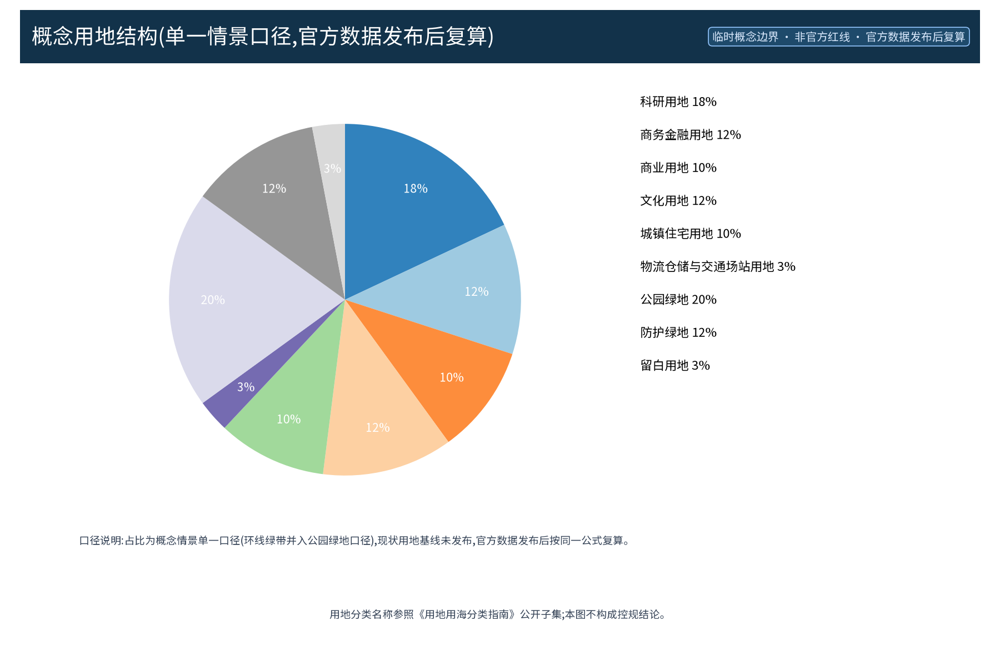
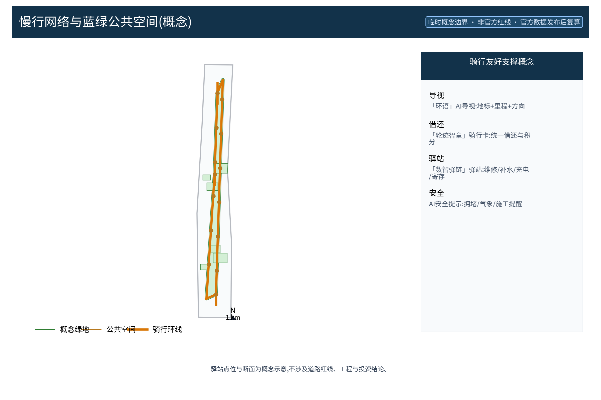
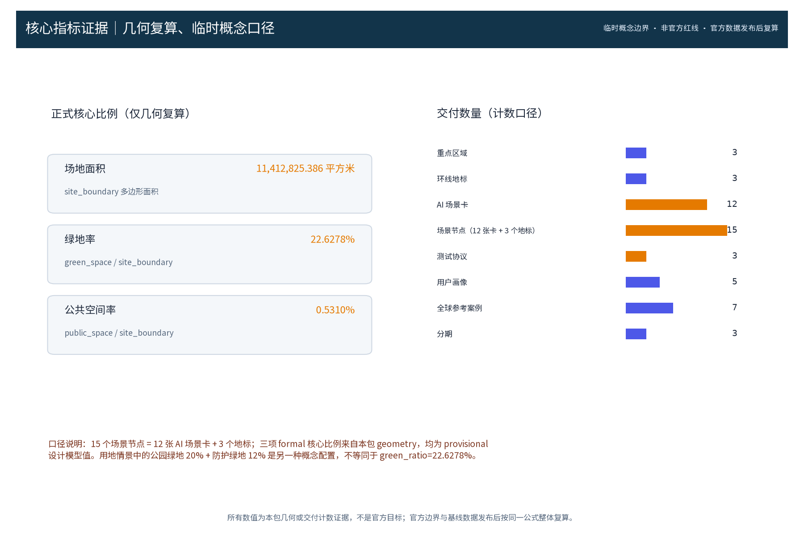

**方案主名称（中文）**：京张AI骑行绿道环（英文对照：RIDE·JZ LOOP / JINGZHANG AI CYCLING GREENWAY LOOP）。「京张AI骑行绿道环」为原创概念：以百年京张走廊为骨架，构建贯通众智园AI自主创新加速区、AI原点社区、大钟寺AI产业集聚区三区，并经中关村科技服务翼、小月河场景赋能翼两侧弧段闭合的环线慢行纽带，作为「百年京张AI创新带」海淀段的骑行与步行体验示范，沿线布置驿站、12张AI场景卡与3个AI地标，合计15个场景节点。本方案全部为概念建议、参考方案，供专业团队深化研究；所有空间落位均为概念口径，面积与指标基于 provisional 边界，待官方数据发布后整体复算，不预设容积率、建筑高度、道路红线、投资等法定结论。

| 概念要素 | 说明 | 级别 |
|---|---|---|
| 方案主名称 | 「京张AI骑行绿道环」RIDE·JZ LOOP | 原创概念命名 |
| 环线结构 | 一链三段两翼（主线贯通三区＋侧弧缝合两翼） | 概念建议 |
| 核心机制 | 「轮迹智章」「数智驿链」「环语」「骑享公约」「绿环积分」 | 原创机制 |
| 命名体系 | 中文主名、英文主名、环线子品牌与驿站系列的命名层级 | 品牌命名体系 |
| 边界声明 | 概念建议／参考方案，provisional，官方数据发布后复算 | 诚实红线 |

## 设计依据与资料清单

本方案的工作依据为公开、可查证的口径，未获取任何非公开资料。依据清单包括：组织方资格预审公告与任务书摘录（2026-05-09 公告、2026-05-18 任务书文本口径）、《城市设计管理办法》、控规法定内容边界说明、《用地用海分类指南》公开子集、provisional 边界几何、AI 生成内容服务管理暂行办法、无障碍环境建设法，以及公开的铁路遗产史料（京张铁路 1909 年通车、京张铁路遗址公园公开开园信息、詹天佑主持修建京张铁路的公开史料、中关村发展史料）。案例依据为国内外绿道与骑行体系公开案例（哥本哈根骑行高速路、阿姆斯特丹骑行网络、巴黎 RER V、伦敦 Cycleways、台湾环岛一号线、成都天府绿道、杭州绿道），用于机制比对与概念启发，不做本地数据的直接移植。清单为概念工作依据清单，实际使用的数据见 sources.json，未获取项已在假设与缺失数据说明中如实标注；本方案所有结论均为概念级，不构成对任何法定规划、投资或工程的承诺。

> **证据锚点**：[source:DATA-SRC-OFFICIAL-ANNOUNCEMENT-2026-05-09]、[source:DATA-SRC-AGENT-TASKBOOK-2026-05-18]（组织方公告与任务书为文本口径依据）。

## 三层范围工作框架

三层成果逐级传导，形成「统筹—总体—重点」的完整工作链条：统筹研究范围识别京张走廊沿线的产业、交通、蓝绿与人文资源，输出环线串联三区两翼的总体判断与区域协同方向；总体设计范围以环线为主干，组织骑行与步行慢行系统、驿站体系、公共空间与城市风貌，并形成「一链三段两翼」（主线＋侧弧＋节点）的空间结构；重点区域详细设计聚焦三个环线节点（智造轮港、原点轮廊、回环市集），深化为可供专业团队进一步研究的空间示意。每一层均保留与任务书对应章节的机器可读证据锚点，便于评审对照；三层成果在深度上逐级加深、在结论上保持一致的概念口径。所有范围划分均为概念口径，不预设法定规划结论，亦不对行政区划、土地权属或建设时序作任何承诺；节点与线位的最终确定须经现场踏勘、资料核验、主管部门评估与公众意见程序后方可生效。

> **证据锚点**：[source:DATA-SRC-AGENT-TASKBOOK-2026-05-18]（三层范围划分依据任务书官方文本口径）。

## 统筹研究范围产业与未来城市研究

统筹研究识别骑行与步行慢行纽带对三区两翼的缝合价值：将京张走廊的铁路遗产、蓝绿空间与 AI 产业要素组织为一条可感知、可体验的公共纽带，支撑 AI 全栈自主创新体系、世界级 AI 创新生态与智能化 AI 活力城市等五大功能的日常化表达。产业方面，环线以「骑行可达性」重新组织沿线高校、科研院所、产业园区、轨道站点与社区之间的通勤与交往空间，使创新要素沿走廊流动；未来城市研究仅作方向性预判，不构成对用地、容量与投资的承诺。区域协同层面，「三区两翼」与北纬社区、未来科学城、怀柔科学城、经开区及京津冀的绿道骑行网络预留接口（概念），使环线成为区域慢行体系中的可扩展单元。全球绿道与骑行生态案例为机制设计提供参照，均标注来源并仅用于概念比对：

| 案例名称 | 城市 | 机制要点 | 来源 |
|---|---|---|---|
| 哥本哈根Supercykelstier | 丹麦哥本哈根 | 跨市域骑行通勤廊道网络与骑行高速路机制 | 哥本哈根官方案例 |
| 阿姆斯特丹骑行网络 | 荷兰阿姆斯特丹 | 全龄骑行网络、绿环与安全街道一体化 | 阿姆斯特丹市官方案例 |
| 巴黎RER V | 法国巴黎 | 依托铁路廊道的快速骑行走廊与轨道换乘衔接 | 法兰西岛交通局案例 |
| 伦敦Cycleways | 英国伦敦 | 骑行网络＋导视与健康街道政策联动 | TfL官方案例 |
| 台湾环岛一号线 | 中国台湾 | 长距离环线驿站与数字骑行服务 | 台湾观光部门案例 |
| 成都天府绿道 | 中国成都 | 都市绿道环与社区日常公共运营 | 成都市政府门户 |
| 杭州绿道系统 | 中国杭州 | 城市绿道成网与滨水公共空间串联 | 杭州规划部门门户 |

> **证据锚点**：[source:DATA-SRC-PROVISIONAL-BOUNDARIES-2026-06-05]（边界为 provisional，研究范围仅作概念示意）。

## 总体设计范围城市更新与控规深度城市设计

总体设计强调「以环为脉、以站为珠」：环线主线贯通三区节点，两翼侧弧缝合中关村科技服务翼与小月河场景赋能翼，形成「一链三段两翼」的空间结构；沿线布置「数智驿链」驿站（维修、补水、充电、寄存，可逆模块化）、「环语」AI 导视与骑行友好断面概念。断面与线位仅为概念示意，不涉及道路红线与工程结论：概念断面建议采用骑行与步行分离、绿化缓冲与安全提示一体化组织，供专业团队深化研究。本设计强调更新而非新建，优先利用存量空间植入轻量、可逆的骑行服务设施，控规指标只做校核建议，不预设数值结论；拆改留遵循「以留为主、局部更新」，城市更新单元以驿站与节点空间为最小实施单元，可逆设计允许随时撤收与恢复。全设计秉持公共性与包容性：全龄、无障碍、儿童友好与适老设施纳入概念配置，保障不同人群安全便捷地使用环线。

> **证据锚点**：[source:DATA-SRC-MOHURD-CONTROL-DETAILED-PLANNING]、[source:DATA-SRC-PROVISIONAL-BOUNDARIES-2026-06-05]。

### 区域—功能—节点—协作接口矩阵（概念建议）

下表把三大定位（百年京张文化带、都市AI生活体验带、AI融合创新带）、五大功能（AI全栈自主创新体系、世界级AI创新生态、AI+场景赋能新范式、智能化AI活力城市、AI治理全球话语权）与三区两翼、外部协同对象逐项落到节点和接口。接口仅描述可交换的概念输入/输出，不代表签约、招商、财政、采购或行政安排已经存在。

| 协作单元 | 三大定位映射 | 五大功能映射 | 节点/空间接口 | 概念输入 → 输出 | 参与方；非承诺边界 |
|---|---|---|---|---|---|
| 众智园AI自主创新加速区 | 文化带＋体验带＋创新带 | 全栈自主创新体系、AI治理全球话语权 | 智造轮港 | 开发者原型、匿名安全观察 → 拟验证清单、人工复核模板 | 开发者、高校、企业、专业团队、运营方；不承诺入驻、采购、算力或测试通过 |
| AI原点社区 | 文化带＋体验带＋创新带 | 世界级AI创新生态、AI+场景赋能 | 原点轮廊 | 公开铁路史料、社区议题、内容草案 → 可撤收展陈脚本、议事议题 | 居民、社区、文化机构、高校、运营方；不承诺文保边界、社区同意、场地开放或排期 |
| 大钟寺AI产业集聚区 | 文化带＋体验带＋创新带 | 智能化AI活力城市、AI+场景赋能 | 回环市集 | 商户服务需求、匿名服务反馈 → 分时服务脚本、纸面替代流程 | 商户、运营联盟、居民、游客、专业团队；不承诺签约、收益、招商、消防或市政容量 |
| 中关村科技服务翼 | 文化带＋创新带 | 全栈自主创新体系、世界级AI创新生态 | 资源—服务侧弧 | 公开服务目录、开发者问题、拟验证需求 → 资源匹配表、转介建议 | 科技服务机构、开发者、高校、企业；不承诺资本、服务、算力或知识产权已配置 |
| 小月河场景赋能翼 | 文化带＋体验带 | AI+场景赋能、智能化AI活力城市 | 公众体验侧弧 | 场景卡、活动意向、人工观察 → 体验脚本、无数字替代服务、停止建议 | 居民、游客、志愿者、运营方、开发者；不承诺公共空间开放、客流效果或自动决策上线 |
| 北纬社区 | 文化带＋体验带 | 智能化AI活力城市、AI治理全球话语权 | 社区议事接口 | 自愿纸面意见、匿名分组统计 → 议题清单、年度公示素材 | 居民、社区、志愿者、运营方；不承诺居民授权、社区决策或现状数据已获得 |
| 未来科学城 | 体验带＋创新带 | 全栈自主创新体系、世界级AI创新生态 | 研发—场景转介接口 | 公开科研议题、开发者原型、拟验证协议 → 跨区问题清单、试点申请建议 | 科研机构、企业、高校、开发者、专业团队；不承诺跨区协议、科研合作或转化成立 |
| 怀柔科学城 | 文化带＋创新带 | 全栈自主创新体系、AI治理全球话语权 | 科学议题—公共解释接口 | 公开科普内容、伦理问题、公众提问 → 多语脚本、人工复核清单 | 科研/科普机构、居民、游客、志愿者；不承诺设施开放、数据共享或专家背书 |
| 经开区 | 体验带＋创新带 | AI+场景赋能、智能化AI活力城市 | 产业应用互认接口 | 公开应用问题、协议、匿名指标 → 跨场景比较、迁移风险清单 | 企业、园区运营方、开发者、专业团队；不承诺产业链、采购、营收或政策资金安排 |
| 京津冀 | 文化带＋创新带 | 世界级AI创新生态、AI治理全球话语权 | 区域网络接口 | 公开案例、慢行方法、匿名指标 → 方法包、跨区域学习清单 | 区域协作主体、公共机构、研究机构、企业、公众；不承诺跨区线路、投资、审批、数据共享或联盟签署 |

矩阵中的“输入”必须是公开、清权或参与者自愿提供的概念资料；“输出”是可供下一轮专业团队、运营方和公众复核的建议物，不是政府决策。每个接口均可按「议题登记—人工初筛—小样本/纸面验证—评估—自愿转化—公示/退出」闭环运行，条件不满足即撤回，不以预留接口暗示合作已经发生。

## 重点区域详细设计

三个环线节点均为概念点位，本轮将“详细设计”准确降为可转化节点概念卡，须经现场踏勘、资料核验、主管部门评估与公众意见后重新落位。节点卡只规定问题、空间关系、组件接口和运营退出条件，不构成施工详图或工程结论：

| 节点卡 | 现状问题/适用空间 | 功能分区与概念断面 | 组件、无障碍与运营责任 | 准入/停止/撤收条件；依赖数据 |
|---|---|---|---|---|
| 智造轮港（众智园） | 可能是创新工作与慢行环的接口；入口、权属、冲突和需求均未核验。适用：既有公共边缘或共享空间，须先核准。 | 安静到达／维修休息／原型展示／人工服务台／应急净空；潜在冲突为骑行测试、步行、排队、服务通行。概念断面：步行边界｜缓冲｜骑行带｜雨水绿边｜应急线，宽度TBD。 | 可撤标识柱、维修架、遮荫座椅、纸面公告、可拆展示轨；无台阶路径、触觉/对比提示、休息间隔为概念方向。责任：场地运营方牵头，开发者、高校、社区、安全顾问协作。 | 准入：许可、安全净空、值守、人工替代确认；停止：事故、通行受阻、无法接管、连续两轮投诉未解或许可撤回；撤收模块并恢复场地。依赖：官方边界/权属、慢行流量、冲突观察、无障碍、遗产、市政资料TBD。 |
| 原点轮廊（AI原点社区） | 铁路记忆与社区日常尚未对应到核验的遗产对象和开放条件。适用：既有开放边缘或社区展示界面，不介入遗产本体。 | 安静阅读／双语时间线／人工讲解／社区议事／连续可达通行；潜在冲突为驻足观看、穿行骑行、活动排队。概念断面：遗产缓冲｜展陈边｜步行带｜低速穿越｜骑行带，线位TBD。 | 可撤时间线框、触觉/大字版、低眩标识、座椅、纸面意见箱；不打孔、不附着遗产肌理。责任：文化内容编辑或公共空间运营方牵头，居民、志愿者、高校、文保顾问协作。 | 准入：遗产价值/许可、通行、版权、人工讲解确认；停止：文保风险、拥堵、版权或无障碍问题；撤下展陈，不改变本体。依赖：遗产名录、保护要求、公共开放、步行量、内容权利、社区反馈TBD。 |
| 回环市集（大钟寺） | 可能的骑行服务与日常消费接口会与步行、配送、应急动线冲突。适用：既有公共界面或临时市集边缘，商户和公共空间许可未核验。 | 慢行到达／共享服务台／本地市集展示／家庭休息／应急净空；潜在冲突为购物、停放、配送、穿行。概念断面：建筑边｜服务退让｜步行净空｜骑行慢行带｜可撤市集模块，宽度与时段TBD。 | 可撤车架、遮荫、饮水、双语服务牌、排队标记；无障碍连续路径、可见排队替代、纸面服务为概念方向。责任：市集/空间运营方牵头，商户、居民、游客、志愿者、安全顾问协作。 | 准入：许可、配送时窗、应急通道、人员、人工服务确认；停止：应急通道被占、冲突、服务失败或许可撤回；撤收临时组件。依赖：权属/许可、客流与配送观察、消防、供电、无障碍资料TBD。 |

铁路文化叙事线贯穿三张节点卡：以公开史料中的1909年京张铁路通车与詹天佑主持修建为叙事起点，把「钢轨与路基」转译为「骑行轴线与活动场地」的符号语言；中关村创新文化与AI新文化叠加为「百年轮迹—当代创新」主线。节点深度以概念卡为限，任何平面、断面、遗产介入和无障碍连续性均须由现场与专业团队复核；图册与 geometry 只表达研究假设。

> **证据锚点**：[data:PACKAGE-GEOMETRY]（三节点示意多边形来自本包 geometry/key_areas.geojson）。

## AI 创新生态、人才画像与 AI+ 场景

沿环线布置 12 张 AI 场景卡，并与 3 个 AI 地标合计形成 15 个场景节点（场景—空间—运营映射）；12 张卡全面覆盖 AI 导视、借还调度、安全提示、骑行成就、驿站服务、轨道衔接、文化活动、消费体验、科普讲解、数据看板、应急联动与志愿者协同；配置 5类人才画像（通勤白领、高校学生、亲子银龄家庭、外地游客、产业从业者）。骑行创新生态图谱将高校、科研院所、产业园区、骑行服务商与开发者社区组织为共创网络，并绘入环线骑行创新生态地图供多方共建；AI 技术协议以模型评测、数据质量、误差分群、运行监测、误报率与基准测试为兜底线。场景卡覆盖 AI 与城市规划结合的交通、产业、空间、公共服务、文化、治理六域映射：交通域涵盖 AI 导视与借还调度，产业域连接开发者社区与骑行服务生态，空间域对应驿站与公共节点，公共服务域支持多语信息与科普，文化域承载铁路叙事与骑行活动，治理域落实人工复核与年度公示。全部场景仅处理匿名聚合数据、关键决策人工复核，不进行个体识别式追踪，禁止过度监控；AI 治理采用三句式边界：仅匿名聚合、关键决策人工复核、禁止过度监控。机制为概念性建议，不替代法定管理职责。沿线设骑行荣誉展示墙与「轮迹勋章」荣誉体系，配套开发者社区与 AI 场景开放运营机制，国际传播叙事围绕「百年轮迹」展开。

| 场景卡编号 | 场景卡名称 | 空间落位 | 运营主体 | 数据流 | 治理边界 |
|---|---|---|---|---|---|
| S01 | 环语AI导视 | 三区节点驿站 | 运营联盟＋志愿团 | 匿名聚合 | 人工复核 |
| S02 | 轮迹智章借还调度 | 各驿站借还点 | 运营联盟＋企业 | 匿名聚合 | 人工复核 |
| S03 | AI安全提示 | 环线平交与陡坡段 | 交管部门＋运营方 | 匿名聚合 | 人工复核 |
| S04 | 骑行成就打卡 | 环线里程点 | 运营方＋开发者社区 | 用户自选 | 可撤回 |
| S05 | 数智驿链服务台 | 三级驿站 | 商户＋志愿者 | 匿名聚合 | 服务公开 |
| S06 | 轨道换乘衔接导引 | 沿线轨道站点 | 轨道运营方 | 匿名聚合 | 数据公开 |
| S07 | 铁路文化AR叙事点 | 原点轮廊段 | 文化机构＋运营方 | 展示为主 | 人工复核 |
| S08 | 骑行消费体验屏 | 回环市集段 | 商户 | 匿名聚合 | 消费保护 |
| S09 | AI科普讲解岗 | 科普驿站 | 高校志愿者 | 匿名聚合 | 人工复核 |
| S10 | 客流数据看板 | 运营中心 | 运营方＋专业团队 | 仅匿名聚合 | 年度公示 |
| S11 | 平急两用应急联动 | 全环 | 应急部门＋社区 | 事件触发 | 人工复核兜底 |
| S12 | 骑友议事与志愿服务站 | 社区驿站 | 居民＋志愿者 | 议事记录 | 记录公开 |

**测试验证场景（3个，均为拟验证且尚未执行）**：下表把测试对象、样本/时段、单位、基线、阈值、误差分群、人工复核、失败处置与停止条件写成可执行协议；任何“通过”只能在未来完成测试、复核并公示后使用。

| 测试对象/协议 | 样本与时段 | 单位与指标定义 | 基线/阈值（当前状态） | 误差分群 | 人工复核人 | 失败处置与停止条件 |
|---|---|---|---|---|---|---|
| T01 环语导视误报率与响应 | 两处概念节点各3时段（工作日早/晚、周末日间）；每时段至少30条人工事件，正式样本量TBD | 每条提示事件；误报率=不需要提示却发出提示/全部提示；响应时延为秒 | 基线TBD：现场踏勘后由交通/无障碍顾问建立；误报上限、P95时延、漏报上限TBD，当前不宣称达标 | 节点、时段、天气/光照、步行/骑行、无障碍需求、提示类型 | 运营现场复核员＋交通安全/无障碍顾问各1名，争议双签 | 暂停提示类型，改静态标识、人工岗、纸面导览；发生安全事件、无法接管或关键分组不可解释漏报即停止 |
| T02 轮迹智章借还调度压测 | 3个概念时段（平日峰、平日平段、活动模拟）；采用脱敏合成需求回放，真实需求TBD | 每次请求、每站每15分钟；记录车位差、响应秒数、失败请求比例 | 基线TBD：人工纸面调度与现场踏勘对照；最大失败比例、P95时延、站点公平性阈值TBD，不写“服务等级已达成” | 时段、节点、请求方向、步行/骑行替代、无障碍车辆需求、缺失类型 | 运营调度负责人＋社区代表＋数据质量员 | 回退人工登记、纸面排队和固定安全余量；连续两窗口不可解释失败、无障碍需求系统性受挤或人工无法接管即停止 |
| T03 骑行流量匿名看板质量核验 | 3节点各工作日/周末、早晚/日间6窗口；现场计数尚未开展，窗口待核定 | 15分钟聚合计数、缺测率、重复率、人工抽样一致率；仅发布节点×时段 | 基线TBD：双人人工计数；缺测、重复和一致率阈值由专业团队/公众确认，未达前只内部演示 | 节点、天气、时段、步行/骑行、活动日、设备状态、无障碍替代通道 | 数据治理负责人＋人工计数员，每窗口留审计签名 | 撤下数值改为“数据不足/TBD”，补做人工计数；无法证明匿名聚合、人工复核缺失或投诉持续上升即停止 |

### S01—S12 最小数据生命周期

纯展示或科普场景写明“无个体数据输入”；所有涉及数据的场景仅做匿名聚合，不建立个体画像。保存期限是概念建议，进入真实测试前须由数据保护、网络安全、运营和公众代表复核。

| 场景 | 采集项 | 聚合粒度 | 保存期限 | 访问角色 | 删除/撤回方式 | 禁止用途 |
|---|---|---|---|---|---|---|
| S01 环语AI导视 | 匿名提示事件 | 节点×15分钟 | 试点后30日或评审结束 | 运营复核员 | 清除自愿偏好；静态/纸面替代 | 身份、面部、精确轨迹、行为画像 |
| S02 轮迹智章借还 | 可用车位与请求数 | 驿站×15分钟 | 每轮测试后7日 | 调度负责人、数据质量员 | 删除测试序列；保留人工台账 | 账户身份、个人路线、信用评分 |
| S03 AI安全提示 | 匿名风险标签与提示结果 | 风险类型×节点×事件窗 | 复核后30日 | 安全负责人、人工复核员 | 停用提示类型，保留静态警示 | 人脸识别、个体风险分、自动执法 |
| S04 骑行成就打卡 | 自愿匿名打卡令牌与计数 | 里程点×日 | 自选窗口，最长30日 | 社区运营员 | 撤回令牌并从下次公示移除 | 强制登录、精确路线、商业画像 |
| S05 数智驿链服务台 | 服务请求与物资类别数 | 驿站×服务类×日 | 月度复核后30日 | 驿站运营、志愿者负责人 | 撤回请求卡；保留纸面服务 | 身份匹配、销售画像、未授权共享 |
| S06 轨道换乘导引 | 匿名导引请求数 | 站点接口×小时 | 每轮测试后14日 | 轨道接口联络员 | 删除实验提示；保留静态方向 | 乘客跟踪、闸机控制、推断OD |
| S07 铁路文化AR叙事 | **无个体数据输入**，仅记录内容展示次数 | 内容项×日 | 不保存个体；聚合展示数14日后删除 | 文化编辑、无障碍复核员 | 撤下内容项；保留公开史料来源 | 声纹、人脸、访客画像、未授权图像 |
| S08 骑行消费体验屏 | **无个体数据输入**，只读服务类别兴趣 | 商户组×日 | 复核后14日 | 商户运营、社区观察员 | 撤屏并回到纸面菜单 | 购买历史、定向广告、差别定价 |
| S09 AI科普讲解岗 | **无个体数据输入**，只记录问题类别/到场总数 | 主题×场次 | 场次表7日后删除 | 高校志愿者负责人 | 停自动讲解，改人工讲解 | 声纹、学生画像、无人监督事实断言 |
| S10 客流数据看板 | 聚合计数与质量标记 | 节点×15分钟；发布为节点×日 | 原始测试缓冲7日；公示聚合1年 | 数据管理员、专业复核员 | 撤下看板并显示“数据不足” | 原始传感器导出、再识别、个体移动史 |
| S11 平急联动 | 匿名状态数与人工事件类别 | 节点×事件窗 | 事件结束后30日 | 应急联络、社区负责人 | 回退电话/电台/纸面计划 | 个体位置广播、无人批准自动调度 |
| S12 骑友议事/志愿站 | 自愿议题类别与纸面/电子回应 | 议题×月 | 年报周期后30日 | 社区议事组、运营方 | 年度聚合前撤回；纸面按台账销毁 | 身份公开、报复、异议画像 |

### agent.2 / agent.6：要素保障—活动/测试—评估—转化—退出

以下为建议性路径，不把政策、资金、招商、采购、场景开放或合作写成既有承诺。要素的“当前状态”均指本包证据状态，而非现实世界供给状态。

| 要素 | 当前状态 | 责任方 | 待核条件 | 活动/测试输入 | 评估与转化输出 | 退出 |
|---|---|---|---|---|---|---|
| 土地 | 未核实；无官方权属/边界 | 专业团队牵头，主管/权属主体待确认 | 权属、许可、遗产/绿蓝线、公共开放 | 议题卡与现场踏勘 | 形成候选空间清单，不形成落位结论 | 无许可即不落地，删除点位 |
| 空间 | 仅有provisional几何与概念节点卡 | 场地运营方、社区、专业团队 | 现状断面、无障碍、市政、消防 | 纸面/沙盒布局 | 形成可撤组件包或试点申请建议 | 冲突/投诉不可控则撤收 |
| 资金 | 未配置；仅建议探索公开渠道 | 项目发起方与潜在合作方待核 | 资金来源、采购与审计规则 | 低成本概念活动 | 比较成本/维护责任，禁止承诺金额 | 未落实不采购、不施工 |
| 人才 | 开发者、高校、志愿者画像已定义，实际名册未建 | 运营方＋高校/社区协作 | 值守、培训、无障碍与人工复核能力 | 工作坊、协议演练 | 原型→人工初筛→拟验证→合作洽谈 | 无人工接管则停止 |
| 算力 | 未配置；仅描述轻量/离线优先 | 技术服务方待核 | 模型、离线运行、可靠性与成本 | 离线回放或沙盒 | 输出模型评测报告建议，不保证供给 | 资源不足则退回规则/纸面服务 |
| 数据 | 只有公开来源、匿名聚合规则与TBD基线 | 数据治理负责人＋专业顾问 | 现场基线、保护评估、授权、删除通道 | 人工计数、合成回放、公开议事 | 形成质量记录与复算触发，不公开个体数据 | 无法证明匿名/复核则删除并停测 |
| 场景 | S01—S12为概念，3项协议拟验证 | 场景运营方、主管主体待核 | 运营许可、投诉与替代服务、停止条件 | 小样本、人工/纸面双轨 | 评估后自愿进入试点或撤回 | 不达阈值或无许可则取消 |
| 产业 | 公开案例和接口矩阵，未签合作 | 企业、开发者、科技服务机构待核 | 知识产权、商业边界、责任合同 | 开发者问题卡、展示、评审 | 自愿对接企业服务/合作议题，不称招商结果 | 权益不清则不转化 |

agent.2 的转化链为“公开要素登记→开发者/企业问题卡→人工初筛→沙盒或纸面测试→专业与公众评估→自愿试点申请/合作洽谈→年度复盘”；agent.6 的链为“活动征集→开发者社区工作坊→场景卡与协议→人工复核→公开展示/小规模拟验证→评估后自愿进入试点或企业服务→公示、轮换或退出”。土地、空间、资金、人才、算力、数据、场景和产业任一待核条件不满足，路径即停在当前节点，不向下推导实施承诺。

> **证据锚点**：[source:DATA-SRC-GENERATIVE-AI-INTERIM-MEASURES]（AI 生成内容治理表述的参照依据）。

## 用地、建筑规模与拆改留方案

拆改留坚持留改拆并举：以留为主保留遗址公园肌理与历史遗存，存量建筑功能置换并预留骑行服务设施改造方向，拆除仅限经个案论证的局部疏通慢行零星建筑；驿站与体验设施以轻介入、可逆、低占地为主，不新增大体量建筑。全部面积为概念口径（单一复算口径：环线绿带并入公园绿地），官方数据发布后复算，不给出容积率与建筑高度结论。用地布局以环线绿带为骨架，沿线用地兼容科研、商业、居住与公共服务配套（概念口径），各类用地的比例仅为概念配置，不作法定校核；建筑规模以存量更新为主，新增驿站采用标准化模块，可按季节、客流与活动需要轮换布置与撤收。拆改留清单、用地比例与建筑规模均属于概念建议，供专业团队深化研究，任何涉及土地权属、征收安置与建设指标的判断均须以官方公布数据与法定程序为准。

> **证据锚点**：[source:DATA-SRC-MNR-LAND-USE-CLASSIFICATION-202311]（用地分类名称参照现行国标口径）。

## 交通、轨道、市政与公共服务设施

以慢行优先组织交通概念机制：环线贯通三个节点并与轨道站点、公交站点衔接，活动日人流组织与慢行系统一体化。骑行友好支撑概念包括「环语」标识导视、「轮迹智章」统一借还、驿站服务与 AI 安全提示，均概念级；「轮迹智章」实现跨驿站统一借还与调度，「数智驿链」提供分级驿站保障（分级保障机制），AI 安全提示在平交口、陡坡与窄段提供接近感知与风险预警（概念）。市政以现状条件利用为前提，不给出电力负荷、管网容量或工程量结论；优先利用既有市政接口支撑驿站照明、充电与信息服务，新增需求以最小化原则纳入概念设计，并兼顾弱势群体、老年人与儿童的低干预保障设计。公共服务配置多语信息、骑行科普与研习空间，面向游客提供双语导览，面向居民提供社区活动空间；AI 决策均设人工复核，涉及交通、应急与执法的数据仅以匿名聚合形式使用。

> **证据锚点**：[source:DATA-SRC-MOHURD-URBAN-DESIGN-MEASURES]（市政与慢行设计表述的方法参照）。

## 蓝绿空间、公共空间与城市风貌

构建「环带为轴、节点为珠」的蓝绿公共空间体系：以环线绿带串联沿线小微绿地与开敞空间，驿站与体验设施与公园融合布置、宜轻宜透宜可逆，不遮挡铁路历史遗迹与绿带视线。公共空间组件库包括休息座椅、车架、饮水点、标识柱、遮荫棚、儿童友好骑行场地与全龄无障碍坡道等（概念组件），组件库以模块化、可置换的公共组件为主，可随季节与活动配置调整；骑行荣誉展示墙与「轮迹勋章」体系纳入组件库，承载「百年轮迹」的集体记忆与个人成就展示。风貌延续京张铁路工业记忆语汇（钢轨、枕木、信号灯的符号化转译），并与 AI 新设施有序对话，整体导控克制统一；标志性色彩采用钢轨蓝、轮迹橙与信号红，用于导视与标识系统，形成可识别的环线品牌底色。蓝绿比例与公共空间规模均为概念口径，官方数据发布后复算。

> **证据锚点**：[source:DATA-SRC-MOHURD-URBAN-DESIGN-MEASURES]（蓝绿空间组织的方法参照）。

## 更新项目清单、实施政策与分期计划

三类项目清单（环线段落／驿链机制／服务生态）为概念清单，规模与投资估算均为建议性表述。分期：近期（1-3 年）试点两段环线（原点轮廊段＋智造轮港段）与样板驿站，中期（3-5 年）全线贯通并建立「骑享公约」「轮值驿站」「绿环积分」机制，远期（5-10 年）服务生态与品牌资产沉淀；试点设停止条件与退出机制（驿站撤收与停用条件），任何试点均先以可逆方式运行并接受评估。实施政策强调政府引导、多方共建与长效运营：由政府与专业团队牵头制定标准与导则，企业与商户承担驿站与消费服务，高校与开发者社区提供算法与内容共创，居民、社区与志愿者参与共治与监督，形成可持续的长期运营价值。参与主体包括政府、企业、高校、居民、社区、运营方、志愿者、商户与专业团队，并明确牵头与协作角色（RACI 概念矩阵）。年度骑行活动体系如下：

| 年度活动 | 主题 | 主办（概念） | 机制 |
|---|---|---|---|
| 开春环线骑游季 | 全线开放日＋家庭骑行 | 运营联盟＋社区 | 预约＋志愿 |
| 数字骑行节 | AI 场景体验＋骑行科技展 | 运营方＋企业 | 备案＋公示 |
| 轮迹算法挑战赛 | 导视／调度算法竞赛 | 开发者社区＋高校 | 联盟＋积分 |
| 百年轮迹纪念骑 | 京张铁路通车纪念骑行 | 文化机构＋志愿团 | 轮换＋公益 |
| 环线年报发布 | 数据看板＋年度公示 | 运营方＋专业团队 | 公示＋议事 |

> **证据锚点**：[source:DATA-SRC-AGENT-TASKBOOK-2026-05-18]（分期与实施条目对应任务书要求）。

## 指标体系、面积复算与合规矩阵

概念指标进入 metrics.json：green_ratio、public_space_ratio、环线长度（road_network_length_m）、scenario_card_count=12、landmark_count=3 与 scenario_node_count=15（12张场景卡+3个地标）、persona_count、global_case_count、annual_program_count 等；三项 formal 核心指标（site_area_sqm、green_ratio、public_space_ratio）以本包几何复算为准，面积复算以官方文本口径为底，官方数据到位后整体复算并标注复算版本。容积率、建筑高度等依赖未公开官方控制条件的指标保持 unknown 并说明原因：相关控制条件尚未公开，任何预设数值均不具依据，故以 unknown 表示，留待官方数据发布后复算；环线长度、蓝绿比例与公共空间比例同样为概念级，可测的量化口径以本包几何与矩阵为准。合规矩阵覆盖 23 项任务（公告 1.3—1.5 与 agent.1—6），逐条登记证据、来源与对应章节；合规口径在本方案中仅作自我核验与评审对照，不替代任何法定审查。

> **证据锚点**：[metric:green_ratio]、[metric:public_space_ratio]、[source:PACKAGE-GEOMETRY]。

## 风险、版权与合规说明

本方案为概念研究性设计，不构成行政审批依据，也不构成容积率、建筑高度、道路红线、拆改留或工程可行性结论。风险已按边界精度、骑行安全与交通组织、铁路遗产保护、数据与隐私边界、技术成熟度与政策不确定性六维度如实登记于 assumptions.json（应对原则：匿名聚合、来源标注、人工复核、意见通道与法定程序）。隐私与合规方面，本方案明确：仅匿名聚合、关键决策人工复核、禁止过度监控，不进行个体识别式追踪，不采集个体身份数据，不设大规模个体识别式监控。引用公开资料均已标注来源并注明获取时间，图形、名称与文字为原创或公共领域素材，若与既有标识雷同属巧合；表达不歪曲事实，未经授权不使用肖像、商标、字体、图片、论文图像等版权材料。Logo 与品牌名称使用前须完成商标与在先权利检索，正式实施前须完成多部门联审与公开评估。

> **证据锚点**：[source:DATA-SRC-OFFICIAL-ANNOUNCEMENT-2026-05-09]（征集规则为权属与合规表述的依据）。

## 参考资料

参考资料以政府正式发布版本为准，按公开分类存档并标注获取时间：京张铁路历史与遗址公园公开材料（含詹天佑与京张铁路公开史料口径）、北京城市总体规划及分区规划公开口径、北京城市更新专项规划公开信息、《城市设计管理办法》《用地用海分类指南》、AI 生成内容服务管理暂行办法、无障碍环境建设法、国内外绿道与骑行体系公开案例（哥本哈根、阿姆斯特丹、巴黎 RER V、伦敦、台湾环岛一号线、成都天府绿道、杭州绿道）与铁路遗产史料（中国铁道博物馆、海淀区政府门户、中关村管委会）；本包 sources.json 仅收录可查证条目，未虚构任何官方数据或链接。所有引用的公开资料仅用于概念叙述与机制比对，不构成对任何数据的官方背书；涉及历史年份（1909 年京张铁路通车、京张铁路遗址公园开园信息等）均按公开口径表述，具体规划数值以官方发布版本为准。

> **证据锚点**：[source:DATA-SRC-OFFICIAL-ANNOUNCEMENT-2026-05-09]（本清单首条即组织方公开资料包）。

## 品牌识别与视觉识别系统（VI 概念规范）

「京张AI骑行绿道环」品牌方向（命名体系）：中文主名称「京张AI骑行绿道环」、英文主名称 RIDE·JZ LOOP，环线子品牌（各段弧线昵称）与驿站系列「数智驿链」构成完整命名层级。主标识 RIDE·JZ 采用车轮与铁轨枕木双关图形，环形象征闭环慢行，强调「百年京张×未来骑行」的双重意象；中英双排锁版保证国内与国际传播的一致性。主色钢轨蓝、轮迹橙、信号红构成色彩识别系统：钢轨蓝对应铁路工业记忆，轮迹橙对应骑行活力，信号红用于安全提示与关键节点。视觉识别系统应用于驿站立面、地面导视、骑行卡、活动主视觉与数字看板，并建立 Logo 使用规范（安全区、最小尺寸、深色浅色底变体）；与一带整体 Logo 系统并存不混淆，使用前须完成商标与在先权利检索。Logo 方向图见图件 logo-ridejz.png（概念示意，非最终定稿）。
