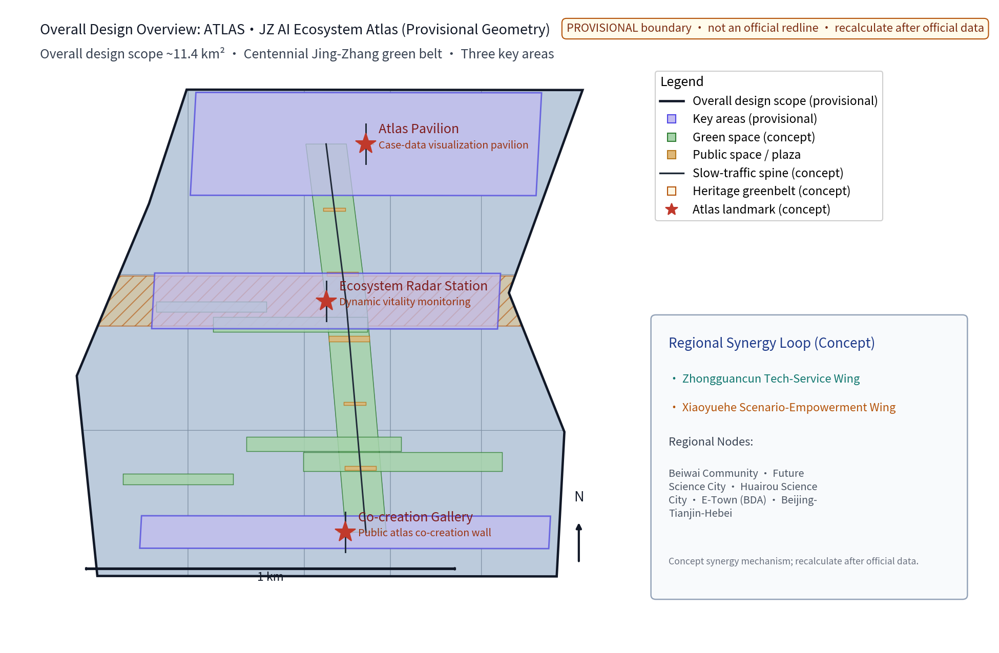
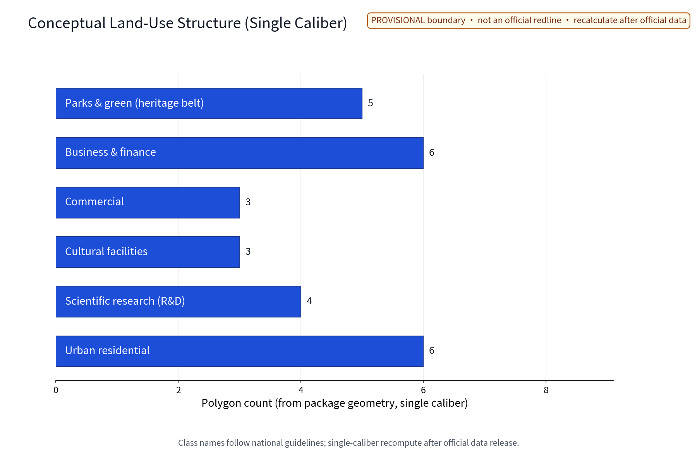
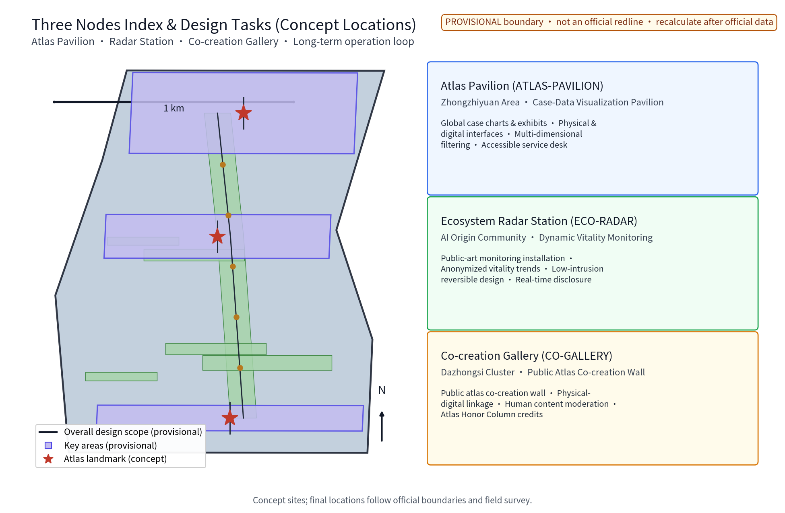
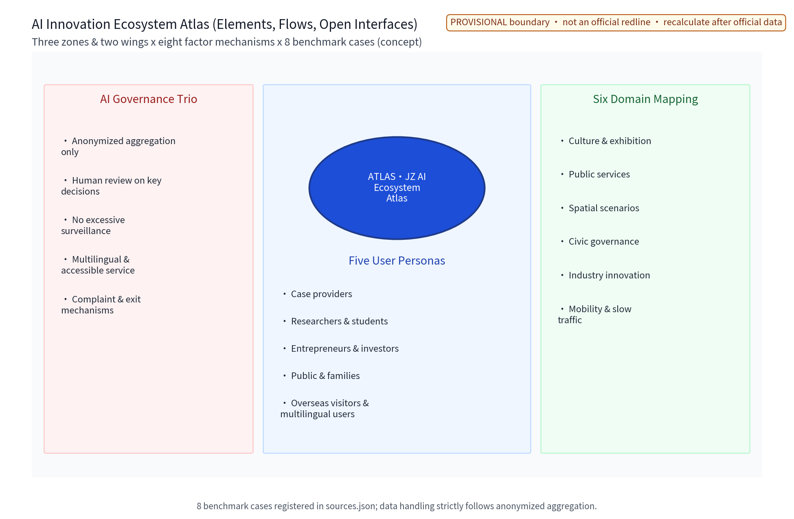
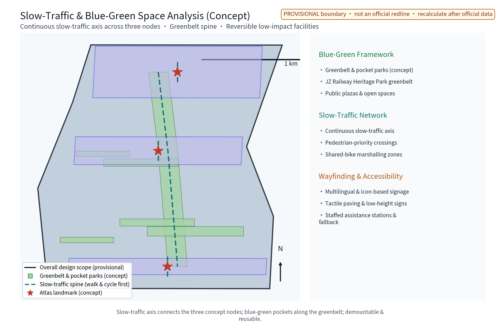
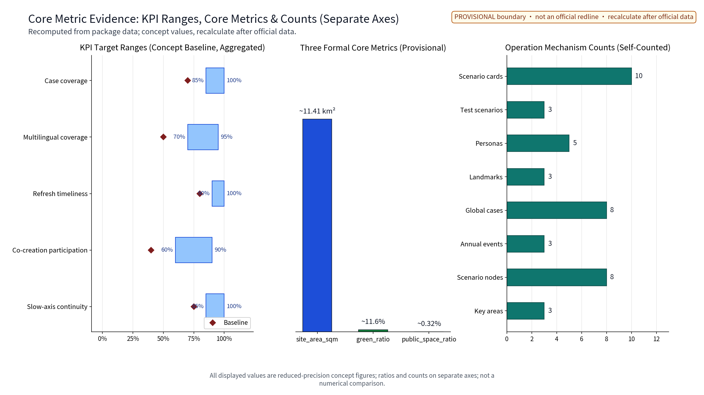

(This proposal is an open, co-created concept suggestion and reference scheme. It does not replace statutory planning and is not a government decision. The unified primary name is "Atlas Jing-Zhang · ATLAS (ATLAS·JZ - Global AI Ecosystem Atlas)", an original naming not containing any real organization or trademark.)

## Design Basis and Source List
The source list is archived in four categories: site and history, planning and policy, industry and ecosystem, and benchmark cases - covering public material on the Jing-Zhang railway and heritage park, published Beijing/Haidian planning reports, the organizer's call-for-proposals announcement and taskbook, official pages of domestic and international innovation parks, plus site walkthrough records and self-drawn sketches. Every verifiable item is registered item by item in sources.json with publisher, URL, published and accessed dates, and reuse boundaries; missing official geometry, green lines and blue lines, heritage-protection scope and municipal capacity are honestly recorded as data gaps. No official data is fabricated. [source:DATA-SRC-OFFICIAL-ANNOUNCEMENT]

Three boundaries are declared up front: first, all deliverables are concept suggestions and do not replace statutory planning approval; second, all geometry is based on the organizer-provided provisional boundary and is not a redline or area conclusion; third, reuse rights for brands, fonts, images and case materials are registered per asset with bounded use (see the risk/copyright chapter and the copyright statement). The source list and evidence anchors are marked per chapter for reviewers and professional teams. [source:DATA-SRC-AGENT-TASKBOOK]

## Three-Level Scope Framework
Following the official taskbook scope hierarchy: the coordinated research area is about 43.6 km2, the overall design area about 11.4 km2, and the key areas about 368.4 ha. This package's sub-scope sits inside the overall design area and deepens the atlas concept at the three key areas; all siting is conceptual. [source:DATA-SRC-PROVISIONAL-BOUNDARIES] The three levels transfer progressively: the coordinated level studies the synergy between the atlas belt and the surrounding sci-tech districts, universities and international residential areas; the overall level organizes the atlas display sequence and functional layout along the green belt, with regulatory-plan indicators checked as advice only; the key-area level deepens spatial and operational design and lands it in the geometry layer for machine verification. [data:geometry/site_boundary.geojson]

The three levels share one evidence system: scope, indicators and compliance matrices are refined per level and traceable. After official geometry is released, the boundary, areas and all siting indicators of the three levels will be recomputed comprehensively under the official caliber with a recompute version noted. [data:geometry/key_areas.geojson] This layer also fixes the concept-vs-statutory boundary: this package gives no FAR, building height, road redline or engineering-feasibility conclusions; such judgments are left to statutory procedures and professional review.

## Coordinated Research Area: Industry and Future City Research
The coordinated level focuses on industry and future city: following public calibers on AI, software and information services, the atlas belt is organized as a three-tier public interface of "atlas belt - sci-tech districts - universities and international residential areas", making knowledge demand on the corridor and global case experience mutually reachable (concept mechanism). On the industry side it identifies the compound function of "case supply - atlas display - scenario co-creation"; on the talent side it characterizes activity times and radii of faculty, students, researchers, entrepreneurs and international talent; on the spatial side it judges the carrying potential of the green belt as an information and exchange medium. Future-city research is directional foresight only and is not a land-use or investment commitment. [source:DATA-SRC-PROVISIONAL-BOUNDARIES]

Regional synergy is the focus here: following the taskbook's three orientations (centennial Jing-Zhang culture belt, urban AI life experience belt, AI-integrated innovation belt) and five functions (full-stack autonomous AI innovation system, world-class AI innovation ecosystem, new AI-plus-scenario empowerment paradigm, intelligent AI-vitality city, global discourse in AI governance), the three-zones-two-wings structure (AI Origin Community, Zhongzhiyuan AI Autonomous Innovation Acceleration Area, Dazhongsi AI Industry Cluster Area; Zhongguancun Tech-Service Wing, Xiaoyuehe Scenario-Empowerment Wing) is organized into an atlas synergy loop - scenario demand to scenario supply, achievement display to case accumulation, factor service to spatial carrying (concept mechanism). A regional synergy table maps the external innovation nodes of Beiwai Community, Future Science City, Huairou Science City, Economic-Technological Development Area and the Beijing-Tianjin-Hebei region, all concept-level and pending professional and authority deepening. [source:DATA-SRC-AGENT-TASKBOOK]

| Regional node | Synergy content (concept) | Main carrier | Boundary |
|---|---|---|---|
| Beiwai Community | Innovation sourcing and achievement-release linkage | Atlas Pavilion, study events | Concept-level, pending deepening |
| Future Science City | Big-science-facility and park case mutual reference | Radar Station display | Concept-level, pending deepening |
| Huairou Science City | Basic-research case files into the atlas | Atlas Pavilion data platform | Concept-level, pending deepening |
| E-Town (Beijing Economic-Technological Development Area) | Smart-manufacturing scenario case mutual recognition | Co-creation Gallery | Concept-level, pending deepening |
| Beijing-Tianjin-Hebei | Touring case exhibitions and experience sharing | Three nodes plus online platform | Concept-level, pending deepening |
| Three zones and two wings internally | Scenario demand to scenario supply loop | Three nodes and wing carriers | Concept-level, pending deepening | (Regional synergy table)

## Overall Design Area: Urban Renewal and Regulatory-Plan-Level Urban Design
The overall design organizes an "atlas display sequence on the green-belt backbone": atlas display entrances, nodes and way-stations are continuously arranged along the Jing-Zhang railway heritage park belt to build a "one belt, multiple pavilions" structure; checking, comparing, co-creation and rest functions are graded per node; flexible event sites and temporary-installation interfaces are reserved. Regulatory indicators are checked as advice only, without preset numeric conclusions. [standard:MOHURD-CONTROL-DETAILED-PLANNING] Land-use compatibility, green-belt continuity and display facility siting are superimposed and checked at the overall level before entering node detailing and the geometry layer.

East-west stitching and north-south connection are the two spatial strategies of this layer: east-west cross-corridors stitch the community and park interfaces on both sides of the belt with slow-traffic-priority crossings, continuous signage and stitching nodes; north-south the green-belt spine connects the whole corridor into one walkable, rideable, event-bearing experience path. [data:geometry/roads.geojson] All spatial conclusions are marked provisional and will be recomputed after official geometry release; overall plans, character guidance, node layout and indicator checks are delivered in the figures, drawings and geometry layers. [source:DATA-SRC-PROVISIONAL-BOUNDARIES]

## Detailed Design of Key Areas
The three key areas correspond to the one-belt-three-pavilions nodes (concept siting): the Zhongzhiyuan AI Autonomous Innovation Acceleration Area hosts the Atlas Pavilion - a case-data visualization pavilion presenting global innovation-ecosystem cases in charts, physical exhibits and digital interfaces, filterable by city, park and theme; the AI Origin Community hosts the Ecosystem Radar Station - a public-art dynamic monitoring installation visualizing anonymized aggregated ecosystem vitality trends; the Dazhongsi AI Industry Cluster Area hosts the Co-creation Gallery - a publicly editable atlas co-creation wall linking physical and online contributions. [data:geometry/public_space.geojson] The three nodes are also three atlas landmarks (concept). Facility siting is conceptual and must be re-sited after evaluation by planning, heritage-protection and authority departments.

Node elements add spatial and operational detail: each node configures an "atlas unit plus data interface plus service module" kit; the honor-display system is carried by "Atlas Honor Columns" - credited display of case providers and co-creators with thanks, authorized before display and equipped with a complaint and withdrawal channel; an "Atlas Public Space Component Library" provides rack, info-pillar, writing table, signage and accessible service kiosk components that are demountable, re-exhibitable and recyclable, combinable across the three nodes and the whole corridor (concept mechanism). Operations use "theme rotation, booking-based tours, volunteer duty and human fallback" as the basic mechanism. [source:DATA-SRC-BARRIER-FREE-ENVIRONMENT-LAW] Node plans, green-belt sections and component prototypes are delivered in the drawings and figures; the node-to-zone mapping is also recorded in the compliance matrices for machine verification.

## AI Innovation Ecosystem, Personas, and AI+ Scenarios
AI-plus scenarios are implemented as scenario cards (see the master card table, 10 cards) covering the six domains of culture, public services, governance, space, industry and transport; each card carries siting, target users, operating mechanism and data-compliance boundary. The three-sentence AI governance rule runs through all scenarios: anonymized aggregation only, human review of key decisions, no over-surveillance. Data-handling rules are publicly posted; a resident feedback channel (online suggestion box plus node deliberative meetings) and an annual public-disclosure mechanism are established in parallel. [source:DATA-SRC-GENERATIVE-AI-INTERIM-MEASURES] Five persona groups (case providers, researchers and students, entrepreneurs and investors, the public and families, overseas visitors and multilingual users) map one-to-one onto the scenario cards, and every scenario has an exit and complaint channel.

| Scenario card | Siting | Target users | Operating mechanism (concept) | Data and compliance boundary |
|---|---|---|---|---|
| "Atlas Window": AI cleaning and semantic search of case data | Atlas Pavilion | Researchers, students | Booking-based access, annual update disclosure | Anonymized aggregation, human review |
| "Radar Screen": global ecosystem vitality monitoring | Radar Station | Visitors, practitioners | Real-time disclosure, monthly assessment | Aggregate statistics, no over-surveillance |
| "Co-creation Wall": public atlas co-creation | Co-creation Gallery | Residents, youth | Points contribution, deliberative review | On-device processing, no individual retention |
| "Companion": multilingual atlas narration | Along the three nodes | Elderly people and persons with disabilities | Volunteer duty, human fallback | Informed consent, one-touch shutoff |
| "Patrol Sentry": data refresh inspection | Digital platform | Operators, office workers | Ticket review, rotation verification | Aggregate statistics, human review |
| "Curating Desk": automatic atlas visualization | Atlas Pavilion | Researchers, visitors | Theme rotation, expert review | Public materials only, anonymized aggregation |
| "Translation Bay": multilingual content generation and translation | Info screens and signage | International visitors, tourists | Content-moderation post review | All generated content human-reviewed before release |
| "Tide Chart": event crowd-flow and dispersion advice | Event sites | Residents, visitors | Time-zone dispersion, public notice | Anonymized density, no over-surveillance |
| "Retro Mirror": case citation tracing and deduplication | Online platform | Researchers, editors | Trace verification, human acceptance | Public metadata only, no individual identification |
| "Echo Station": suggestion collection and response | Online plus nodes | General public | Weekly response, monthly disclosure | Anonymous submission, complaint and withdrawal channel | (Scenario card master table, 10)

**Industry test-verification scenarios (3; pilot-verify first, then scale)**. First, the "cleaning benchmark test": model evaluation and benchmark testing of the case-data AI cleaning and semantic search model, accepted by deduplication recall, retrieval relevance and human-review consistency, with a data-quality protocol. Second, the "translation quality evaluation": intelligibility testing of multilingual narration voices and translations under noise and accessibility conditions, analyzed by error stratification with human fallback. Third, the "patrol false-alarm evaluation": false-positive and false-negative rate testing of the refresh-inspection and content-review models under runtime monitoring; deployment may scale only after thresholds are met. All test scenarios are concept trials, never described as approved operations; any scenario failing acceptance indicators is withdrawn and triggers the exit mechanism. [source:DATA-SRC-GENERATIVE-AI-INTERIM-MEASURES]

| Industry test-verification scenario | Subject under test | Verification indicators (concept) | Data and compliance boundary |
|---|---|---|---|
| Cleaning benchmark test | Case cleaning and semantic search model | Dedup recall, retrieval relevance, human-review consistency (model evaluation plus benchmark) | Public materials only, anonymized aggregation |
| Translation quality evaluation | Multilingual voices and translations | Intelligibility, terminology consistency, accessibility-scene performance (error stratification plus human fallback) | Informed consent, on-device processing |
| Patrol false-alarm evaluation | Refresh-inspection and content-review models | False-positive rate, false-negative rate, human acceptance rate (runtime monitoring) | Public metadata only, aggregate statistics | (Industry test-verification scenarios)

**Global and domestic case benchmark (8, agent.2 calibers of 5-8)**. Every case row is registered in sources.json with an official or first-party source, published and accessed dates, and a reuse boundary; cases serve as mechanism references only, never as current-status evidence; case facts and update times follow the source pages ([source:CASE-ONENORTH]).

| Case | Location / institution | Transferable mechanism points | Source |
|---|---|---|---|
| one-north, Singapore | JTC Corporation | Rail-hub plus continuous green-corridor research-mixed ecosystem; public space for display and exchange | [source:CASE-ONENORTH] |
| 22@ Barcelona | Ajuntament de Barcelona | Former industrial area renewed with preserved fabric and knowledge-based activities; public display plus community participation | [source:CASE-22BARCELONA] |
| Sangam Digital Media City (DMC), Seoul | Seoul Metropolitan Government | Digital-content industry clustering with public facilities and events shaping an innovative atmosphere | [source:CASE-SEOUL-DMC] |
| East London Tech City | Tech City UK / Mayor of London | Neighborhood-scale spontaneous clustering with convenient transport; open ecosystem rather than a single park | [source:CASE-LONDON-TECHCITY] |
| Shenzhen Bay Science & Technology Ecological Park | Shenzhen Municipal Bureau of Industry and Information Technology | Integrated park services and public platforms; the park as a display window | [source:CASE-SZBAY] |
| Hangzhou Future Sci-Tech City (West Sci-Tech Innovation Corridor) | Hangzhou Municipal Government | Corridor-style spatial organization as pioneering innovation-ecosystem practice | [source:CASE-HANGZHOU] |
| Zhangjiang AI Island, Shanghai | Zhangjiang Group (reported by 21st Century Business Herald) | Recognizable innovation landmark built on a dedicated industry label; full-scenario AI demo park | [source:CASE-ZHANGJIANG] |
| Pazhou AI and Digital Economy Pilot Zone, Guangzhou | Guangzhou Municipal Government | Convention-and-industry linkage; public display integrated with the digital economy | [source:CASE-PAZHOU] | (Case benchmark master table)

**AI innovation ecosystem and factor mechanisms (agent.2)**. With ATLAS·JZ as the hub, the ecosystem map combines three-zones-two-wings, factor mechanisms and case benchmarks; factor mechanisms cover land, space, industry, capital, talent, computing power, data and scenarios, all concept-level mechanism suggestions. [source:DATA-SRC-AGENT-TASKBOOK]

| Factor mechanism (concept) | Main carrier | Collaborating actors | Note and boundary |
|---|---|---|---|
| Land supply and flexible use | Renewal units under stock | Government, operators | Flexible-use admission decided case by case |
| Space venues and public platforms | Pavilion, Radar Station, Gallery | Universities, enterprises, communities | Component library, reversible reuse |
| Industry ecology and cluster linkage | Three-zones-two-wings carriers | Enterprises, co-building alliance | Complementary synergy, no duplication |
| Capital channels and cost tiers | Public platform operation (suggested) | Government, enterprises, public-interest bodies | Qualitative cost tiers only, no precise amounts |
| Talent cultivation and personas | Universities, creator and developer communities | Universities, developer community | Five personas matched with services |
| Computing and data services | Digital atlas platform | Operators, research institutions | Anonymized aggregation only; shared-compute application system |
| Data governance and opening | Atlas data platform | Government-led, enterprise collaboration | Rules disclosed, graded filing |
| Scenario opening and testing | Scenario card pilots | Developers, professional teams | Verify in pilot before scaling | (Factor mechanism table)

**AI technical protocols (concept)**. Four protocols run end to end: model evaluation, data quality, error stratification and runtime monitoring. Models complete benchmark testing and human-review consistency evaluation before launch; ingested data pass source verification and quality scoring; outputs are handled by error strata; runtime monitoring tracks false-positive rate, false-negative rate and response timeliness, and triggers stop-and-review when thresholds are crossed. [metric:scenario_card_count]

## Land Use, Building Scale, and Retain-Renovate-Demolish Strategy
Retain-renovate-demolish follows the concept caliber of "retain first, renovate second, demolish case by case": heritage green belt, historically valuable stations and industrial structures are retained to continue the railway memory; low-efficiency factories and park buildings are mainly functionally renewed (exhibition, office, display and support); demolition is limited to scattered dilapidated buildings justified case by case. [source:DATA-SRC-MNR-LAND-USE-CLASSIFICATION-202311] This layer gives no precise land-use proportions, building-scale or demolition conclusions; such matters are left to statutory procedures.

Conceptual land-use scenario ranges are given per this package's land_use layer caliber (ranges, not current-status statistics, not precise percentages): green and other open space about 18%-25%, education and research about 26%-31%, industry and office about 13%-18%, commercial about 8%-12%, residential about 10%-14%, others about 6%-10%, used for conceptual balance and scenario checking; these shares belong to the land_use layer and are not interchangeable with metrics.json's green_ratio, which is a green_space-layer caliber. [data:geometry/land_use.geojson] Recompute and aggregation rules: after official land use, boundary and building inventories are published, all areas, shares and scales are comprehensively recomputed under the official caliber with a recompute version noted. [data:geometry/buildings.geojson] This proposal gives no conclusive numbers for FAR or building height.

## Transport, Rail, Municipal Infrastructure, and Public Services
Transport is slow-traffic-first: the continuous green-belt slow axis links the Atlas Pavilion, Ecosystem Radar Station and Co-creation Gallery with surrounding universities, parks and rail stations (walking and cycling first, with shuttle lines and shared-bike marshalling zones reserved); event dispersion is time-zoned; car dependence is reduced. [standard:MOHURD-URBAN-DESIGN-MEASURES] Municipal services are intensive and shared, using existing conditions first, with "daily plus event" load checks for interface needs and no capacity conclusions.

Public services highlight the Atlas Pavilion's library, lecture and study functions with accessible facilities and multilingual information, open to the public. Service flows for vulnerable groups are designed to be testable: visually and hearing-impaired users are guided by three-level signage plus vibration/voice prompts to human service stations; users with low digital capability have volunteers complete bookings and receive phone follow-up; elderly people and families with children follow age-friendly routes with senior-friendly and child-friendly facilities (concept flows). [source:DATA-SRC-BARRIER-FREE-ENVIRONMENT-LAW] AI transport scenarios (route advice, crowd-tide dispersion) use anonymized aggregation, human review and no over-surveillance, with stop conditions and exit mechanisms for key decisions. Rail and road alignment, retrofit and engineering measures are outside this package and left to special studies and statutory procedures.

## Blue-Green Network, Public Space, and Urban Character
A blue-green public space system of "green belt as the axis, node parks as pearls" is built: the heritage green belt is the backbone connecting small green spaces and open space along the corridor into a continuous ecological and public system, with rain gardens and permeable paving improving resilience; the Atlas Public Space Component Library supports convertibility - exhibition units, installation plazas and writing nodes can switch to markets, lectures and daily leisure; all temporary facilities are modular, demountable and recyclable (concept mechanism). [standard:MOHURD-URBAN-DESIGN-MEASURES]

The cultural resource system is organized as a three-layer narrative of "railway memory - sci-tech scenes - atlas co-creation": layer one extracts station buildings, milestones and rail elements from the centennial Jing-Zhang railway history (the railway built 1905-1909, the 2019 Beijing-Zhangjiakou HSR opening, the heritage park) ([source:SRC-JINGZHANG-RAILWAY]); layer two connects sci-tech scenes such as Zhongguancun's origins, the Xueyuan Road university belt and software parks ([source:SRC-ZHONGGUANCUN]); layer three lands on the co-creation interfaces of the three pavilions. Wayfinding and symbols are graded in three levels (level one at rail stations and district entrances, level two along inter-node slow paths, level three within node facilities and info screens), derived from spikes, sleepers, signals and locomotives and used sparingly to avoid symbol stacking and over-design; the urban character continues the dialogue between railway-heritage identity and sci-tech atmosphere, avoiding viral-style packaging. [data:geometry/green_space.geojson]

## Renewal Projects, Implementation Policy, and Phasing
Renewal projects are rolled out in four categories: atlas display nodes, slow-traffic connection, stock implantation and the digital platform (concept list; scale and investment are advisory only). Pilot-selection logic: start with segments that are walkable from rail stations, rich in stock space and most directly synergistic with the three zones and two wings, combining "perceivable, refreshable, co-creatable" conditions; policy suggestions (a dual track of renewal units plus public-platform operation, flexible business admission, multi-actor co-building) all require legal and regulatory assessment and are not government or operator commitments. [source:DATA-SRC-AGENT-TASKBOOK]

Phasing: in the near term (1-3 years), the Atlas Pavilion pilot and the digital atlas platform go live, with stage gates (expansion only after pilot acceptance); mid-term (3-5 years), the Ecosystem Radar Station and Co-creation Gallery are built and the slow axis connected; long-term (5-10 years), the whole-belt atlas network and annual operating mechanisms mature. Implementation actors and division of responsibility follow a concept RACI responsibility matrix (example below); every stage has stop conditions (capacity-exceeded suspension, content-dispute withdrawal, pilot failing acceptance indicators is withdrawn) and exit mechanisms.

| Task (concept) | R responsible | A accountable | C consulted | I informed |
|---|---|---|---|---|
| Atlas Pavilion pilot (near term) | Operator | District coordinating department | Heritage, garden departments | Universities, residents |
| Slow-axis connection (mid term) | Road and garden entities | District coordinating department | Rail, municipal departments | Corridor communities |
| Digital platform and AI scenarios (near term on) | Platform operator | Data authority | Universities, research institutes | General public | (RACI responsibility matrix)

Three annual event brands (below) are supported by an event sub-brand system: monthly tech open days, quarterly evaluation arenas and an annual contributor conference, forming a "talent - enterprise - developer" conversion path; scenario-open admission (scenario card pilot application, test-scenario admission, data-rule disclosure) and public-experience operations (booking, volunteering, rotation, disclosure) are folded into the annual operation plan.

| Annual event brand | Cycle | Target users | Mechanism (concept) |
|---|---|---|---|
| Atlas Update Release Day | Once a year | Enterprises, universities, public | Case update release plus Honor Column credit plus media outreach |
| Global Case Study Week | Once a year | Researchers, developers, international guests | Case study plus developer conference plus international conversion matchmaking |
| Atlas Co-creation Workshop | Once a year | Residents, families, children | Co-creation wall refresh plus market plus deliberative meeting plus child-friendly session | (Annual event brands)

Long-term mechanism categories (event brands, developer community, scenario-open admission, public-experience operations, international conversion, content governance, facility maintenance) are managed in the table below; long-term funding is estimated in qualitative tiers only, without precise amounts.

| Mechanism category (concept) | Main content and carrier | Participating actors | Note and boundary |
|---|---|---|---|
| Unified event-brand management | Three annual sub-brands plus monthly themes | Operators, co-building alliance | Internal codenames until rights clearance |
| Developer community operations | Monthly tech open days, quarterly evaluation arenas | Developers, universities | Suggested mechanism, not an arranged schedule |
| Scenario-open admission | Scenario card pilot application, test admission | Enterprises, professional teams | Verify before scaling |
| Public-experience operations | Booking, volunteering, rotation, disclosure | Residents, volunteers | Human fallback |
| International conversion | Park twinning, case exchange visits, bilingual publishing | International parks and institutions | Concept intent only, evaluated item by item |
| Content governance | Moderation posts, source tracing, complaint channel | Editorial committee (suggested) | Human review of key decisions |
| Facility maintenance | Inspection tickets, annual assessment, component rotation | Maintenance teams | Linked to stop conditions | (Operation and long-term mechanism table)

| Funding category (concept) | Qualitative tier | Estimation method | Price basis | Scope included | Confidence | Recompute trigger |
|---|---|---|---|---|---|---|
| Construction and retrofit | High | Benchmark of similar public cultural facilities | 2026 | Stock renewal and component procurement | Low | Overall recompute after deepening |
| Digital platform and AI operations | Medium | Benchmark of similar platforms' staffing | 2026 | Compute, inspection, translation | Low | Recompute on scenario expansion |
| Events and content | Medium | Benchmark of similar events | 2026 | Annual events and content governance | Low | Recompute at annual budget drafting |
| Facility maintenance | Low | Benchmark of similar park maintenance | 2026 | Inspection, repair, renewal | Low | Recompute at annual maintenance plan |
| International conversion | Low | Benchmark of similar exchange programs | 2026 | Exchange visits, exhibitions, translation | Low | Recompute at project initiation | (Funding category table)

## Metrics, Area Recalculation, and Compliance Matrix
Indicators are grouped into scope indicators, spatial indicators and operational indicators, all registered in metrics.json: scope indicators (site_area_sqm etc., provisional concept value about 11.41 km2, low confidence); spatial indicators (green_ratio about 0.12, public_space_ratio about 0.003, per the green_space and public_space layer calibers, low confidence, displayed at reduced precision only); operational indicators (key areas 3, scenario cards 10, industry test-verification scenarios 3, annual events 3, global cases 8, personas 5, evidenced by the visible tables in this text, matching [metric:scenario_card_count]). Every indicator carries data source, formula, confidence level, use restriction and recompute trigger. [metric:green_ratio]

Area recomputation is based on the official text calibers (coordinated research area about 43.6 km2, overall design area about 11.4 km2, key areas about 368.4 ha): all areas and shares here are concept computations on the provisional boundary; after official geometry (boundary, redlines, land use) is released, a comprehensive recompute with a version note follows, and no precise numeric conclusions are given externally until official geometry and statutory controls arrive. [source:DATA-SRC-PROVISIONAL-BOUNDARIES] The compliance matrix maps the announcement, taskbook and relevant standards item by item into a "basis - requirement - response" table (compliance_matrix.json, standard_matrix.json and design_depth_matrix.json), kept in sync with design depth. [metric:public_space_ratio]

## Risk, Copyright, and Compliance
This proposal is a conceptual research design that constitutes neither an administrative approval basis nor FAR, building height, retain-renovate-demolish or engineering-feasibility conclusions; risks are registered in risk.json across data source and copyright, case-presentation deviation, installation-operation continuity and public-participation quality, with response principles of anonymized aggregation, minimum necessity, human review, source labeling and complaint channels. [source:DATA-SRC-GENERATIVE-AI-INTERIM-MEASURES] The three-sentence AI governance rule runs through all scenarios: anonymized aggregation only, human review of key decisions, no over-surveillance; the digital platform follows data-security and personal-information-protection requirements; every cited public source is labeled with publisher, link and accessed date; case citations note sources and obtain authorization; the atlas makes no individual or enterprise ranking judgments.

Brand prior-rights and use boundaries: no official trademark search has been completed at the concept stage; "Atlas Jing-Zhang · ATLAS", "ATLAS·JZ" and the graphics are treated as internal working codenames, restricted from external registration or commercial use until rights clearance; the provenance, licenses and reuse boundaries of fonts (open-source CJK sans-serif, embedded under license), figures, the logo, case materials and generated content are registered item by item in the copyright statement and sources.json ([source:ASSET-FONT-NOTO-SC]). Materials whose provenance cannot be proven have been replaced or removed; multi-department joint review, heritage-protection assessment and safety evaluation must precede any formal implementation.

## References
1. Pre-qualification announcement of the international scheme solicitation for the Centennial Jing-Zhang AI Innovation Belt urban design (organizer, 2026-05-09) - task basis ([source:DATA-SRC-OFFICIAL-ANNOUNCEMENT]).
2. Excerpts of the taskbook addressed to global agents (organizer-cleared document, 2026-05-18) - agent.1-6 tasks and the three-zones-two-wings caliber ([source:DATA-SRC-AGENT-TASKBOOK]).
3. Provisional geometry of the three levels and key areas (maintainer-provided, intake/visualization only) ([source:DATA-SRC-PROVISIONAL-BOUNDARIES]).
4. Urban Design Administration Measures, Measures on Compilation and Approval of Regulatory Detailed Plans for Cities and Towns, and the Land/Sea Use Classification Guide (MOHURD/MNR public texts).
5. Jing-Zhang railway history (National Railway Administration public archives), Beijing-Zhangjiakou HSR opening (China State Railway Group, 2019-12-30), Jing-Zhang Railway Heritage Park (Beijing Municipal Forestry and Parks Bureau, 2025-07-24), Haidian district plan (Beijing Municipal Commission of Planning and Natural Resources, 2020-02-14), Zhongguancun demonstration zone (Beijing Municipal Science and Technology Commission / Zhongguancun Administrative Committee) - historical facts and official public materials.
6. Interim Measures for the Management of Generative AI Services (2023-07-13), Barrier-Free Environment Building Law (2023-06-28) - governance and accessibility references.
7. Eight official pages of international and domestic benchmark cases (one-north, 22@, DMC, London Tech City, Shenzhen Bay, Future Sci-Tech City, Zhangjiang, Pazhou), registered item by item in sources.json with publishers, links, published and accessed dates and reuse boundaries.
8. Site walkthrough records and self-drawn analysis sketches (self-collected by this project).

## Brand Identity and Visual System (ATLAS·JZ)
The master brand "Atlas Jing-Zhang · ATLAS (ATLAS·JZ - Global AI Ecosystem Atlas)" uses a "rail track x atlas node" graphic motif: the logo builds on Jing-Zhang rails and truss bridges, overlaid with atlas nodes and links, evoking "a century of rail connecting the world into one atlas" (see assets/figures/logo-jz.png, language-neutral). The suggested color system is "Jing-Zhang blue + rail gray + knowledge gold": blue continues the railway and Zhongguancun tech context, gray carries industrial memory, gold marks atlas co-creation content. Typography for body text and signage uses an open-source CJK sans-serif embedded and registered under license; the brand hierarchy is master brand, sub-brands (three pavilions) and event brands (three annual events). [source:DATA-SRC-AGENT-TASKBOOK]

Wayfinding and symbols are graded in three levels with bilingual lettering. The international communication narrative is standardized as: "ATLAS·JZ - where a century of rail branches into a global ecosystem" (concept copy), paired with the Chinese motif "a centennial railway, an atlas of the world" (concept). A sample international-communication copyline explains the "one city one page, one park one graph" atlas narrative to overseas parks, showing the searchable, comparable, co-creatable mechanism of the Jing-Zhang corridors (concept). Communication assets (English sub-name, bilingual diagrams, event-brand visuals) are presented with the visual page and figures. Brand prior-rights and use boundaries are declared in the risk/copyright chapter; assets are registered in the copyright statement and source ledger.

## Five Persona Groups
| Persona group | Typical people and needs | Inclusive design response (concept) |
|---|---|---|
| Case providers | Decision-makers of global innovation cities, parks and institutions publishing standard case entries | Standardized entry templates, contribution credit and Honor Column display |
| Researchers, students and faculty | Faculty and researchers along the corridor; case comparison and ecosystem-indicator study | Booking-based study seats, multilingual abstracts, open data interfaces (anonymized) |
| Entrepreneurs and investors | Discovering ecosystem organization, cooperation opportunities and talent leads through the atlas | Case comparison tools, scenario-open admission seats |
| Public and families | Citizens and school students passing the belt, understanding AI innovation ecosystems while strolling | Age-friendly, senior-friendly and child-friendly facilities; parent supervision routes |
| Overseas visitors and vulnerable groups | International study tours; people with visual/hearing impairments or low digital capability | Multilingual signage and narration, accessible routes, human service fallback, volunteer-assisted booking | (Persona table)

> All persona and experience design follows: anonymized aggregation only, human review of key decisions, no over-surveillance; the resident feedback channel (online suggestion box plus node deliberative meetings) and annual public disclosure run throughout; accessibility and senior-friendly design claims no certification here and await professional accessibility assessment ([source:DATA-SRC-BARRIER-FREE-ENVIRONMENT-LAW]).