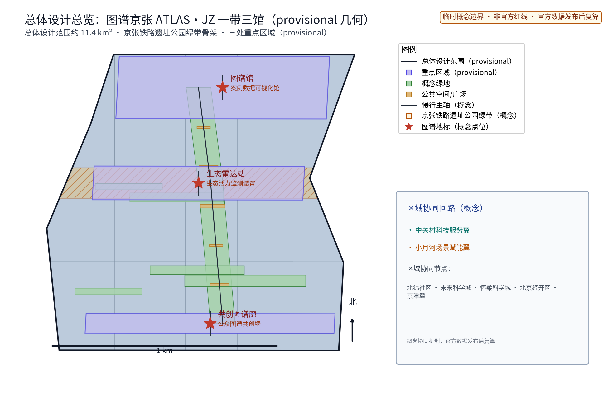
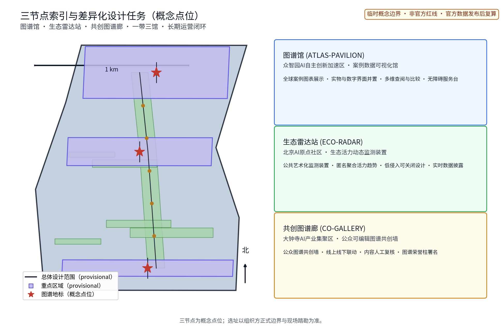
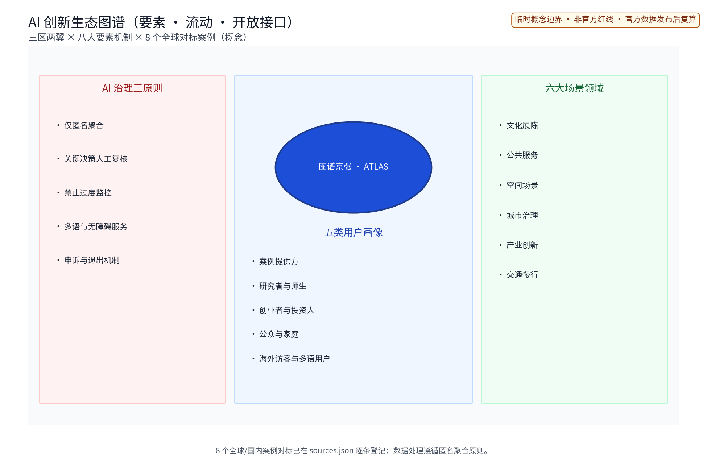
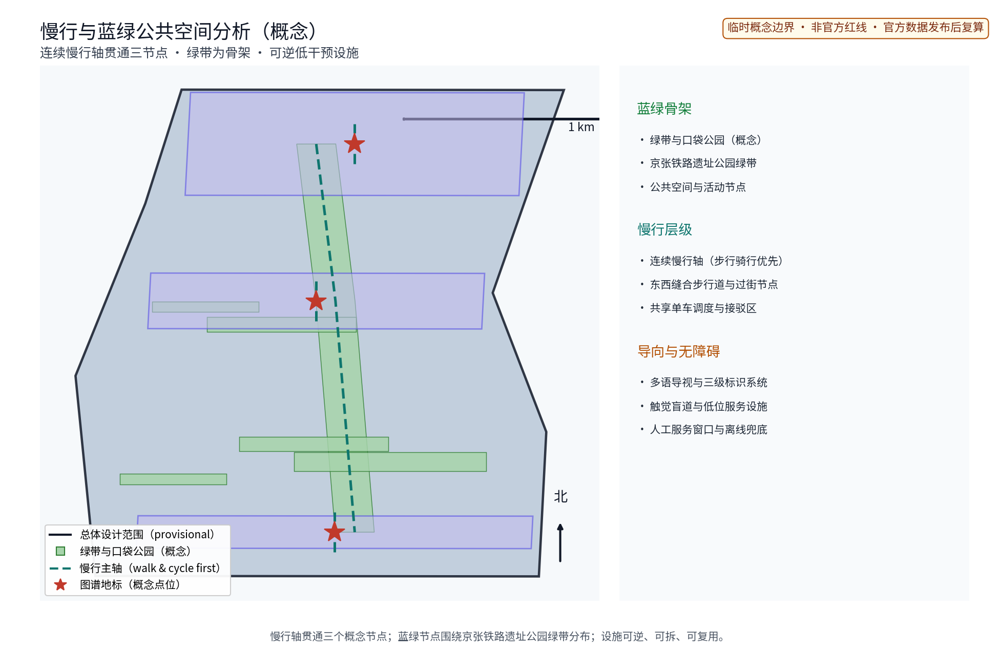

（本方案为开放共创的概念建议与参考方案，不替代法定规划，不构成政府审定结论；中英文主名称统一为「图谱京张 · ATLAS（ATLAS·JZ — Global AI Ecosystem Atlas）」，原创命名，不含任何真实机构名称或商标。）

## 设计依据与资料清单
资料清单按"场地与历史、规划与政策、产业与生态、同类案例"四类归档：京张铁路历史与遗址公园公开材料、北京市及海淀区公开规划报道、组织方征集公告与任务书、国内外创新园区案例的官方公开页面，以及现场踏勘记录与自绘分析草图。全部可查证条目逐条登记于 sources.json，标注发布者、链接、发布与检索日期及复用边界；未获取的官方几何、绿地蓝线、文保范围与市政容量等按数据缺口如实标注，不虚构任何官方数据。[source:DATA-SRC-OFFICIAL-ANNOUNCEMENT]

本方案三条边界预先声明：其一，全部成果为概念建议，不替代法定规划审批；其二，全部几何基于组织方提供的 provisional 边界，不构成红线与面积结论；其三，凡涉及品牌、字体、图片、案例素材的复用权利，均按资产清单逐项登记并限定使用边界（详见风险版权章节与版权声明）。资料清单与证据锚点随每章标注，供评审与专业团队复核。[source:DATA-SRC-AGENT-TASKBOOK]

## 三层范围工作框架
按任务书官方口径建立三层范围：统筹研究范围约43.6 km²、总体设计范围约11.4 km²、重点区域约368.4 ha。本包子范围明确位于总体设计范围之内、以三处重点区域为节点深化图谱展示概念，全部为概念落位。[source:DATA-SRC-PROVISIONAL-BOUNDARIES] 三层成果逐级传导：统筹层研究图谱带与沿线科创片区、高校及国际化住区的协同关系；总体层以绿带为骨架组织图谱展示序列与功能布局，控规指标只做校核建议；节点层深化三处重点区域的空间与运营设计，并落到 geometry 层供机器校核。[data:geometry/site_boundary.geojson]

三层共享同一套证据体系：范围、指标、合规矩阵逐层细化且可回溯。官方几何发布后，三层边界、面积与所有落位指标按官方口径整体复算并注明复算版本。[data:geometry/key_areas.geojson] 本层同时明确"概念—法定"边界：本包不给出容积率、建筑高度、道路红线与工程可行性结论，相关判断留待法定程序与专业审查。

## 统筹研究范围产业与未来城市研究
统筹层聚焦"产业与未来城市"：按公开口径梳理人工智能、软件与信息服务等主导方向，把图谱带组织为「图谱带—科创片区—高校—国际化住区」三级联动的公共界面，使沿线知识需求与全球案例经验双向可达（概念机制）。产业侧识别"案例供给—图谱展示—场景共创"复合功能；人才侧刻画高校师生、科研人员、创业者与国际人才的活动时段与半径；空间侧判断绿带作为信息与交往媒介的承载潜力，未来城市研究仅作方向性预判，不构成用地与投资承诺。[source:DATA-SRC-PROVISIONAL-BOUNDARIES]

区域协同是本层重点：按任务书三大定位（百年京张文化带、都市AI生活体验带、AI融合创新带）与五大功能（AI全栈自主创新体系、世界级AI创新生态、AI+场景赋能新范式、智能化AI活力城市、AI治理全球话语权），把「三区两翼」结构（AI原点社区、众智园AI自主创新加速区、大钟寺AI产业集聚区；中关村科技服务翼、小月河场景赋能翼）组织为图谱协同回路——场景需求↔场景供给、成果展示↔案例沉淀、要素服务↔空间承载（概念机制）。区域协同机制表逐项映射北纬社区、未来科学城、怀柔科学城、经开区与京津冀等外部创新节点，明确协作内容与载体，全部为概念级、待专业团队与主管部门深化。[source:DATA-SRC-AGENT-TASKBOOK]

| 区域协同节点 | 协同内容（概念） | 主要载体 | 边界 |
|---|---|---|---|
| 北纬社区 | 创新策源与成果发布联动 | 图谱馆、研习活动 | 概念级，待深化 |
| 未来科学城 | 大科学装置与园区案例互鉴 | 生态雷达站展示 | 概念级，待深化 |
| 怀柔科学城 | 基础研究案例图谱入库 | 图谱馆数据平台 | 概念级，待深化 |
| 经开区 | 智造产业场景案例互认 | 共创图谱廊 | 概念级，待深化 |
| 京津冀 | 案例巡回展陈与经验共享 | 三节点＋线上平台 | 概念级，待深化 |
| 三区两翼内部 | 场景需求↔场景供给回路 | 三节点与两翼载体 | 概念级，待深化 |（区域协同机制表）

## 总体设计范围城市更新与控规深度城市设计
总体设计以「绿带为骨架的图谱展示序列」组织：依托京张铁路遗址公园绿带连续布置图谱展示入口、节点与驿站，建立"一带串多馆"总体结构；按节点分级配置查阅、比较、共创与休憩功能；预留年度活动弹性场地与临时装置接口。控规指标仅做校核建议，不预设数值结论。[standard:MOHURD-CONTROL-DETAILED-PLANNING] 用地兼容、绿带连续性与展示设施落位经总体层面叠合校核后进入节点详设与 geometry 层。

东西缝合与南北贯通是本层两条空间策略：东西向沿横向联系通道缝合绿带两侧社区与园区界面，设置慢行优先过街、标识连续与缝合节点；南北向以绿带主轴贯通全程，形成一条可步行、可骑行、可节事的连续体验路径。[data:geometry/roads.geojson] 所有空间结论均标注 provisional 状态，官方几何发布后整体复算；总体平面、风貌导控、节点布局与指标校核成果见 figures、drawings 与 geometry 层。[source:DATA-SRC-PROVISIONAL-BOUNDARIES]

## 重点区域详细设计
三处重点区域与「一带三馆」节点对应（概念落位）：众智园AI自主创新加速区承载「图谱馆」——案例数据可视化馆，全球创新生态案例以图表、实物与数字界面并置呈现，支持按城市、园区与主题多维查阅比较；AI原点社区承载「生态雷达站」——全球创新生态动态监测装置，以公共艺术化形式呈现匿名聚合的生态活力趋势；大钟寺AI产业集聚区承载「共创图谱廊」——公众可编辑的图谱共创墙，实体与线上联动。[data:geometry/public_space.geojson] 三节点即三处图谱地标（概念），设施选址均为概念点位，须经规划、文保与主管部门评估后重新落位。

节点设计补充空间与运营细节：每节点配置「图谱单元＋数据界面＋服务模块」三件套；荣誉展示以「图谱荣誉柱」承载——案例提供方与共创贡献者的署名展示与感谢礼遇，展示前须依法取得授权并设申诉与撤销通道；「图谱公共空间组件库」提供展架、信息柱、书写台、导示牌、无障碍服务亭等可拆装、可换展、可回收组件，供三节点与全线公共空间按需组合（概念机制）。运营以"主题轮换、预约讲解、志愿值守、人工兜底"为基本机制。[source:DATA-SRC-BARRIER-FREE-ENVIRONMENT-LAW] 节点平面、绿带断面与组件原型见图纸与图件；「三节点—三区」对应关系同时写入合规矩阵与 compliance_matrix.json，保证机器可校核。

## AI 创新生态、人才画像与 AI+ 场景
AI+场景以场景卡落地（详见场景卡总表，共10张），覆盖文化、公共服务、治理、空间、产业、交通六域，每卡含落点、面向人群、运营机制与数据合规边界四要素。AI治理三句式贯穿全部场景：仅匿名聚合、关键决策人工复核、禁止过度监控；数据处理规则对外公示，居民意见通道（线上意见箱＋节点议事会）与年度公示机制同步建立。[source:DATA-SRC-GENERATIVE-AI-INTERIM-MEASURES] 五类人才画像（案例提供方、研究者与师生、创业者与投资人、公众与家庭、海外访客与多语用户）与场景卡一一对应，各场景均设退出与申诉通道。

| 场景卡 | 落点 | 面向人群 | 运营机制（概念） | 数据与合规边界 |
|---|---|---|---|---|
| 「图谱窗」案例数据AI清洗与语义检索 | 图谱馆 | 研究者、学生 | 预约检索、年度更新公示 | 匿名聚合，人工复核 |
| 「雷达屏」全球生态活力监测 | 生态雷达站 | 游客、从业者 | 实时公示、月度评估 | 聚合统计，禁止过度监控 |
| 「共创墙」公众图谱共创 | 共创图谱廊 | 居民、青年 | 积分贡献、议事审核 | 端侧处理，不留存个体信息 |
| 「伴行」多语图谱讲解 | 三节点沿线 | 老年人与残障人士 | 志愿者值守、人工兜底 | 授权明示、可一键关闭 |
| 「巡检哨」数据更新巡检 | 数字平台 | 运营方、白领 | 派单复核、轮换校验 | 聚合统计，人工复核 |
| 「策展台」图谱可视化自动生成 | 图谱馆 | 研究人员、游客 | 主题轮换、专家复核 | 仅公开素材，匿名聚合 |
| 「翻译舱」多语内容生成与翻译 | 信息屏与导视 | 国际人士、游客 | 内容审核岗复核 | 生成内容全部人工复核后发布 |
| 「潮汐图」节事动线与集散建议 | 活动场地 | 居民、游客 | 分时分区疏导、公告 | 匿名密度，禁止过度监控 |
| 「回溯镜」案例引用溯源与去重 | 线上平台 | 研究者、编辑者 | 溯源校验、人工验收 | 仅公开元数据，不涉及个体识别 |
| 「回声站」意见收集与回应 | 线上＋节点 | 全体公众 | 周回应、月公示 | 匿名提交，申诉与撤回通道 |（场景卡总表，10张）

**产业测试验证场景（3个，先试点验证后规模化）**：其一「清洗基准测试」——对案例数据AI清洗与语义检索模型做模型评测与基准测试，以重复条目召回率、检索相关度与人工复核一致率验收，含数据质量协议；其二「翻译质量评测」——多语讲解合成语音与译文在噪声及无障碍场景下的可懂度测试，按误差分群分析并设人工兜底；其三「巡检误报率评估」——更新巡检AI与内容审核模型的误报率、漏报率指标测试，接受运行监测，达到阈值方可扩大部署。测试场景全部标注为概念试验，不表述为已批准运营，任一场景未达验收指标即撤收并触发退出机制。[source:DATA-SRC-GENERATIVE-AI-INTERIM-MEASURES]

| 产业测试验证场景 | 测试对象 | 验证指标（概念） | 数据与合规边界 |
|---|---|---|---|
| 清洗基准测试 | 案例清洗与语义检索模型 | 去重召回率、检索相关度、人工复核一致率（模型评测＋基准测试） | 仅公开素材，匿名聚合 |
| 翻译质量评测 | 多语讲解合成语音与译文 | 可懂度、术语一致率、无障碍场景表现（误差分群＋人工兜底） | 授权明示，端侧处理 |
| 巡检误报率评估 | 更新巡检AI与内容审核模型 | 误报率、漏报率、人工验收率（运行监测） | 仅公开元数据，聚合统计 |（产业测试验证场景）

**全球与国内案例对标（8个，agent.2口径5—8个）**：表内案例均逐条在 sources.json 登记官方或第一方来源、发布与检索日期及复用边界，仅作为机制对照，不作现状依据，案例事实与更新时间以来源页为准（[source:CASE-ONENORTH]）。

| 案例 | 地点/机构 | 可迁移机制要点 | 来源 |
|---|---|---|---|
| 新加坡纬壹科技城 one-north | JTC Corporation | 轨道枢纽＋连续绿廊组织研发混合生态，公共空间承载展示交流 | [source:CASE-ONENORTH] |
| 巴塞罗那22@创新区 | Ajuntament de Barcelona | 旧工业区更新保留肌理、植入知识型业态，公共展示与社区参与并重 | [source:CASE-22BARCELONA] |
| 首尔上岩数码媒体城 DMC | Seoul Metropolitan Government | 数字内容产业集聚，以公共设施与事件活动塑造创新氛围 | [source:CASE-SEOUL-DMC] |
| 伦敦东区科技城 | Tech City UK / Mayor of London | 街坊尺度与便捷交通形成自发集聚，强调开放生态而非单一园区 | [source:CASE-LONDON-TECHCITY] |
| 深圳湾科技生态园 | 深圳市工业和信息化局 | 产业服务与公共平台一体化运营，园区即展示窗口 | [source:CASE-SZBAY] |
| 杭州未来科技城（城西科创大走廊） | 杭州市人民政府 | 走廊式空间组织与创新生态培育的先行实践 | [source:CASE-HANGZHOU] |
| 上海张江人工智能岛 | 21世纪经济报道（张江集团口径） | 以专项产业标签塑造可识别的创新地标，AI全场景示范 | [source:CASE-ZHANGJIANG] |
| 广州琶洲人工智能与数字经济试验区 | 广州市人民政府 | 会展与产业联动，公共展示与数字经济融合 | [source:CASE-PAZHOU] |（案例对标总表）

**AI创新生态与要素机制（agent.2）**：以「图谱京张 · ATLAS」为中枢、以「三区两翼×要素机制×案例对标」构成生态图谱，要素保障机制覆盖土地、空间、产业、资金、人才、算力、数据、场景八项，全部为概念级机制建议（[source:DATA-SRC-AGENT-TASKBOOK]）。

| 要素机制（概念） | 主要载体 | 协作主体 | 说明与边界 |
|---|---|---|---|
| 土地供给与弹性用途 | 存量更新单元 | 政府、运营主体 | 弹性用途准入，个案论证 |
| 空间场所与公共平台 | 图谱馆、雷达站、图谱廊 | 高校、企业、社区 | 组件库可逆复用 |
| 产业生态与集群联动 | 三区两翼载体 | 企业、共建联盟 | 错位协同，不重复建设 |
| 资金渠道与成本分级 | 公共平台运营（建议） | 政府、企业、公益机构 | 定性成本分级，不给精确金额 |
| 人才培育与人才画像 | 高校、创作者与开发者社区 | 高校、开发者社区 | 五类画像对应服务 |
| 算力与数据服务 | 数字图谱平台 | 运营企业、科研机构 | 仅匿名聚合，算力共享申请制 |
| 数据治理与开放 | 图谱数据平台 | 政府牵头、企业协作 | 数据规则公示、分级备案 |
| 场景开放与测试 | 场景卡试点 | 开发者、专业团队 | 先试点验证后规模化 |（要素机制表）

**AI技术协议（概念）**：全流程配置模型评测、数据质量、误差分群与运行监测四类协议——模型上线前完成基准测试与人工复核一致率评测；数据入库执行来源校验与质量评分；输出按误差分群分类处置；运行期持续监测误报率、漏报率与响应时效，触发阈值即停用复核。[metric:scenario_card_count]

## 用地、建筑规模与拆改留方案
留改拆坚持「以留为主、以改为辅、拆为个案」的概念口径：优先保留遗址绿带、历史价值站房与工业构筑物延续铁路记忆；低效厂房与园区建筑以功能更新为主（展陈、办公、展示与配套）；拆除仅限经个案论证的零星危旧建筑。[source:DATA-SRC-MNR-LAND-USE-CLASSIFICATION-202311] 本层不预设用地精确比例、建筑规模与拆迁结论，相关事项留待法定程序确定。

概念用地情景区间按本包 land_use 层口径给出（范围值，非现状统计，非精确百分比）：绿地与其他开敞空间约18%—25%、教育科研约26%—31%、产业办公约13%—18%、商业约8%—12%、居住约10%—14%、其他约6%—10%，作为概念平衡与情景校核之用；占比与 metrics.json 的 green_ratio 分属 land_use 与 green_space 两层口径、不能直接互换。[data:geometry/land_use.geojson] 复算与聚合规则：官方用地、边界与建筑清单发布后，全部面积、比例与规模按官方口径整体复算并注明复算版本。[data:geometry/buildings.geojson] 本方案不提供容积率、建筑高度等结论性数字。

## 交通、轨道、市政与公共服务设施
交通坚持慢行优先：绿带连续慢行轴贯通图谱馆、生态雷达站与共创图谱廊，衔接沿线高校、园区与轨道站点（接驳以步行与骑行为主，预留接驳专线与共享单车调度区），节事散场分时分区疏导，降低小汽车依赖。[standard:MOHURD-URBAN-DESIGN-MEASURES] 市政以集约共享为原则，优先利用现状设施条件，按"日常＋节事"两档负荷校核接口需求，不给出容量结论。

公共服务突出图谱馆的书房、报告与研习功能，配置无障碍设施与多语信息指引，向公众开放；弱势群体服务流程为可检验设计：视觉与听觉障碍者经三级导视与震动/语音提示引导至人工服务位，低数字能力人群由志愿者代填预约并电话回访，老年人与儿童家庭走全龄友好动线并配备适老与儿童友好设施（概念流程）。[source:DATA-SRC-BARRIER-FREE-ENVIRONMENT-LAW] AI交通类场景（动线建议、潮汐疏导）仅匿名聚合、人工复核、禁止过度监控，重要决策设置停止条件与退出机制；轨道与道路的线位、改造与工程措施不属于本包范围，留待专项研究与法定程序。

## 蓝绿空间、公共空间与城市风貌
构建「绿带为轴、节点公园为珠」的蓝绿公共空间体系：以遗址公园绿带为骨架串联沿线小微绿地与开敞空间，形成连续生态与公共空间体系；结合雨水花园与透水铺装提升生态韧性；「图谱公共空间组件库」支持公共空间可转换性——展陈单元、装置广场与书写节点可按需切换为市集、讲堂与日常休闲空间，临时设施全部模块化、可拆卸、可回收（概念机制）。[standard:MOHURD-URBAN-DESIGN-MEASURES]

文化资源系统以「铁路记忆—科创现场—图谱共创」三层叙事组织：第一层提取京张铁路百年历史（1905年至1909年建造的京张铁路、2019年京张高铁开通、遗址公园）的站房、里程碑与钢轨要素（[source:SRC-JINGZHANG-RAILWAY]）；第二层串联中关村起源、学院路高校带与软件园等科创现场（[source:SRC-ZHONGGUANCUN]）；第三层落到图谱馆、生态雷达站、共创图谱廊的共创界面。导视与符号系统分三级（一级导向轨道站点与区域入口、二级导向节点间慢行路径、三级单元内部装置与信息屏），符号以道钉、轨枕、信号与机车为单位派生、克制使用，防止符号堆砌与过度设计；风貌延续铁路遗址历史特征与科创氛围的对话，避免网红化包装（[data:geometry/green_space.geojson]）。

## 更新项目清单、实施政策与分期计划
更新项目按「图谱展示节点—慢行贯通—存量植入—数字平台」四类滚动管理（概念清单，规模与投资均为建议性表述）。试点选择逻辑：首选轨道站点步行可达、存量空间充足、与三区两翼协同最直接的段落先行试点，复合"可感知、可更新、可共创"三项条件；政策建议（更新单元＋公共平台运营双轨推进、弹性业态准入、多元主体共建）均须依法依规论证，不构成政府或运营方承诺。[source:DATA-SRC-AGENT-TASKBOOK]

分期实施：近期1—3年完成「图谱馆」试点与数字图谱平台上线，设阶段闸门（试点验收达标方可扩展）；中期3—5年建成「生态雷达站」「共创图谱廊」并贯通慢行轴；远期5—10年完善全域图谱网络与年度运营机制。实施主体与责任分工按 RACI 责任矩阵（概念）明确，示例见下表；所有阶段设停止条件（承载超限停办、内容争议撤销、试点未达验收指标即撤收）与退出机制。

| 任务（概念） | R责任 | A问责 | C咨询 | I知情 |
|---|---|---|---|---|
| 图谱馆试点（近期） | 运营主体 | 区政府统筹部门 | 文保、园林部门 | 高校、居民 |
| 慢行轴贯通（中期） | 道路与园林主体 | 区政府统筹部门 | 轨道、市政部门 | 沿线社区 |
| 数字平台与AI场景（近期起） | 平台运营企业 | 数据主管部门 | 高校、科研机构 | 公众 |（RACI责任矩阵）

年度活动品牌三项（见下表），配套活动子品牌体系：月度技术开放日、季度评测擂台与年度贡献者大会，形成「人才—企业—开发者」后续转化路径；场景开放准入（场景卡试点申请、测试场景准入、数据规则公示）与公共体验运营（预约、志愿、轮换、公示）一并纳入年度运营计划。

| 年度活动品牌 | 周期 | 面向人群 | 机制（概念） |
|---|---|---|---|
| 图谱更新发布日 | 每年一次 | 企业、高校、公众 | 案例更新发布＋荣誉柱署名追加＋媒体传播 |
| 全球案例研习周 | 每年一次 | 研究者、开发者、国际人士 | 案例研习＋开发者大会＋国际合作转化对接 |
| 图谱共创工作坊 | 每年一次 | 居民、家庭、儿童 | 共创墙更新＋市集＋议事会＋儿童友好专场 |（年度活动品牌表）

运营与长期机制类别（活动品牌、开发者社区、场景开放准入、公共体验运营、国际合作转化、内容治理、设施维护）按下表管理，长期资金按定性分级估算，不给出精确金额。

| 机制类别（概念） | 主要内容与载体 | 参与主体 | 说明与边界 |
|---|---|---|---|
| 活动品牌统一管理 | 三大年度活动子品牌＋月度主题 | 运营方、共建联盟 | 品牌先权利清查前仅内部使用 |
| 开发者社区运营 | 月度技术开放日、季度评测擂台 | 开发者、高校 | 建议性机制，非既定安排 |
| 场景开放准入 | 场景卡试点申请、测试场景准入 | 企业、专业团队 | 先验证后规模化 |
| 公共体验运营 | 预约、志愿、轮换、公示 | 居民、志愿者 | 人工兜底 |
| 国际合作转化 | 海外园区结对、案例互访、双语出版 | 国际园区与机构 | 仅概念意向，逐项评估 |
| 内容治理 | 内容审核岗、来源溯源、申诉通道 | 编辑委员会（建议） | 关键决策人工复核 |
| 设施维护 | 巡检工单、年度评估、组件轮换 | 运维团队 | 与停止条件联动 |（运营与长期机制表）

| 资金类别（概念） | 定性级 | 估算方法 | 价格基期 | 包含范围 | 置信等级 | 复算触发 |
|---|---|---|---|---|---|---|
| 建设改造类 | 高 | 同类公共文化设施对标 | 2026年 | 存量更新与组件采购 | 低 | 方案深化后整体复算 |
| 数字平台与AI运维类 | 中 | 同类平台人效对标 | 2026年 | 算力、巡检、译制 | 低 | 场景扩围时复算 |
| 活动与内容类 | 中 | 同类节事活动对标 | 2026年 | 年度活动与内容治理 | 低 | 年度预算编制时复算 |
| 设施维护类 | 低 | 同类公园设施维护对标 | 2026年 | 巡检、维修、更新 | 低 | 年度维护计划复算 |
| 国际合作转化类 | 低 | 同类国际交流项目对标 | 2026年 | 互访、展陈、译制 | 低 | 立项时复算 |（成本与资金类别表）

## 指标体系、面积复算与合规矩阵
指标体系分「范围指标—空间指标—运营指标」三类，全部登记于 metrics.json：范围指标（site_area_sqm 等，provisional 概念值约11.41 km²、低置信）；空间指标（green_ratio≈0.12、public_space_ratio≈0.003，分别按 green_space 与 public_space 层口径、低置信，仅显示两位以内有效精度）；运营指标（重点区域3、场景卡10、产业测试验证场景3、年度活动3、全球案例8、用户画像5，以正文表格可见文本为证据，对应 [metric:scenario_card_count]）。每一项指标均标注数据来源、公式、置信等级、用途限制与复算触发条件。[metric:green_ratio]

面积复算以官方文本口径（统筹研究范围约43.6 km²、总体设计范围约11.4 km²、重点区域约368.4 ha）为基准：本包全部面积、比例采用 provisional 边界概念测算，官方几何（边界、红线、用地）发布后整体复算并注明复算版本，正式几何与法定控制到位前不对外给出精确数值结论。[source:DATA-SRC-PROVISIONAL-BOUNDARIES] 合规矩阵逐项对照组织方公告、任务书与相关规范，形成「依据—要求—响应」对照表（见 compliance_matrix.json、standard_matrix.json 与 design_depth_matrix.json），随设计深度同步更新。[metric:public_space_ratio]

## 风险、版权与合规说明
本方案为概念研究性设计，不构成行政审批依据，也不构成容积率、建筑高度、拆改留或工程可行性结论；风险按数据来源与版权、案例表述偏差、装置运维持续性、公众参与质量四维度登记于 risk.json，应对原则为匿名聚合、最小必要、人工复核、来源标注与申诉通道。[source:DATA-SRC-GENERATIVE-AI-INTERIM-MEASURES] AI治理三句式贯穿全部场景：仅匿名聚合、关键决策人工复核、禁止过度监控；数字平台遵循数据安全与个人信息保护要求；引用公开资料均标注发布者、链接与检索日期，案例引用注明来源并取得授权，图谱内容不作个体或企业排名定性。

品牌在先权利与使用边界：概念阶段未完成官方商标检索，「图谱京张 · ATLAS」「ATLAS·JZ」及图形仅作为内部工作代号，在权利清查完成前不对外注册、不用于商业使用；字体（开源CJK无衬线体，按许可嵌入）、图件、Logo、案例素材与生成内容的来源、许可与复用边界在报告版权声明与 sources.json 逐项登记（[source:ASSET-FONT-NOTO-SC]）。爬取素材均注明使用边界，无法证明来源的材料已替换或删除；正式实施前须完成多部门联审、文物保护与安全评估。

## 参考资料
1. 百年京张AI创新带城市设计国际方案征集资格预审公告（组织方，2026-05-09）——任务依据（[source:DATA-SRC-OFFICIAL-ANNOUNCEMENT]）。
2. 面向全球智能体的任务书摘录（组织方清权文件，2026-05-18）——agent.1-6任务与三区两翼口径（[source:DATA-SRC-AGENT-TASKBOOK]）。
3. 三层范围与重点区域 provisional 几何（组织方维护，仅 intake/可视化）（[source:DATA-SRC-PROVISIONAL-BOUNDARIES]）。
4. 城市设计管理办法、城市镇控制性详细规划编制审批办法、国土空间调查规划用途管制用地用海分类指南（住建部/自然资源部公开文本）。
5. 京张铁路历史（国家铁路局公开史料）、京张高铁开通（国铁集团，2019-12-30）、京张铁路遗址公园（北京市园林绿化局，2025-07-24）、海淀分区规划（市规自委，2020-02-14）、中关村示范区（北京市科委中关村管委会）——史实与官方公开资料。
6. 生成式人工智能服务管理暂行办法（2023-07-13）、无障碍环境建设法（2023-06-28）——治理与无障碍参照。
7. 国际与国内对标案例官方页面8条（纬壹、22@、上岩、伦敦科技城、深圳湾、未来科技城、张江、琶洲），逐条登记于 sources.json，含发布者、链接、发布与检索日期及复用边界。
8. 现场踏勘记录与自绘分析草图（本项目自行采集）。

## 品牌识别与视觉系统（ATLAS·JZ）
主品牌「图谱京张 · ATLAS（ATLAS·JZ — Global AI Ecosystem Atlas）」采用"钢轨×图谱节点"图形母题：Logo 以京张钢轨与桥梁桁架为基底，叠加图谱节点与连接线，隐喻"百年铁路把世界连成一张图谱"（见 assets/figures/logo-jz.png，语言中立）。色彩系统建议以「京张蓝＋钢轨灰＋知识金」三色为主：京张蓝延续铁路与中关村科技语境、钢轨灰承载工业记忆、知识金标识图谱共创内容。字体建议正文与导视统一使用开源CJK无衬线体（按许可嵌入并登记）；品牌层级为主品牌—子品牌（一带三馆）—活动品牌（三项年度活动）三级。[source:DATA-SRC-AGENT-TASKBOOK]

导视与符号系统分三级并配套双语字样；国际传播叙事统一表述：ATLAS·JZ — where a century of rail branches into a global ecosystem（概念文案），佐以「百年京张，图谱全球」中文母题；国际传播文案样例：以"一城一页、一园一图"的图谱叙事向海外园区介绍京张案例可查可比可共创机制（概念）；传播资产（英文副名、双语示意图、活动品牌视觉）在视觉页面与图件中配套呈现。品牌在先权利与使用边界已在风险版权章节声明，资产逐项登记于版权声明与来源清单。

## 五类用户画像
| 用户画像 | 典型人群与需求 | 包容性设计响应（概念） |
|---|---|---|
| 案例提供方 | 全球创新城市、园区与机构决策者，发布标准化案例条目 | 标准化条目模板、贡献署名与荣誉柱展示 |
| 研究者与师生 | 沿线高校与科研机构人员，案例比较与生态指标研习 | 预约研讨位、多语摘要、开放数据接口（匿名聚合） |
| 创业者与投资人 | 通过图谱发现生态组织方式、合作机会与人才线索 | 案例对比工具、场景开放准入席位 |
| 公众与家庭 | 途经绿带的市民与中小学生，在游览中理解AI创新生态 | 全龄友好、适老与儿童友好设施、家长监护动线 |
| 海外访客与弱势群体 | 国际考察群体与视听障碍、低数字能力人群 | 多语导视与讲解、无障碍通道、人工服务兜底、志愿代填 |（用户画像表）

> 所有人像与体验设计遵循：仅匿名聚合、关键决策人工复核、禁止过度监控；居民意见通道（线上意见箱＋节点议事会）与年度公示机制贯穿全程；无障碍与适老设计不据此宣称认证，待专业无障碍评估后确认（[source:DATA-SRC-BARRIER-FREE-ENVIRONMENT-LAW]）。