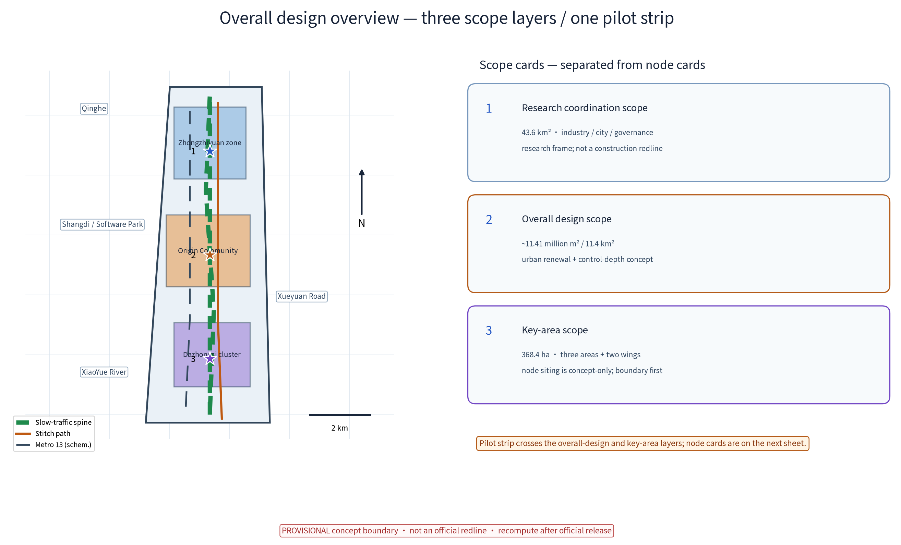
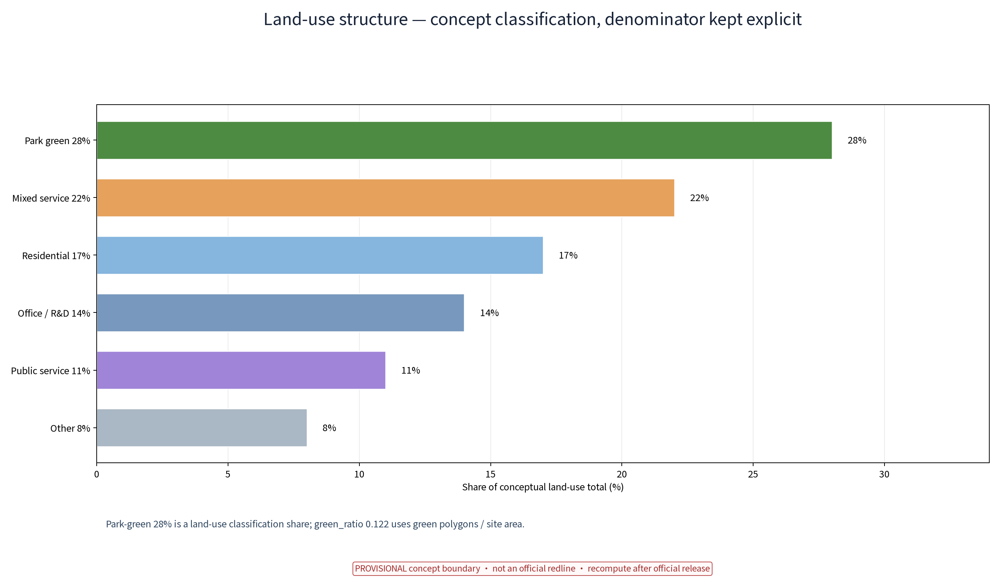
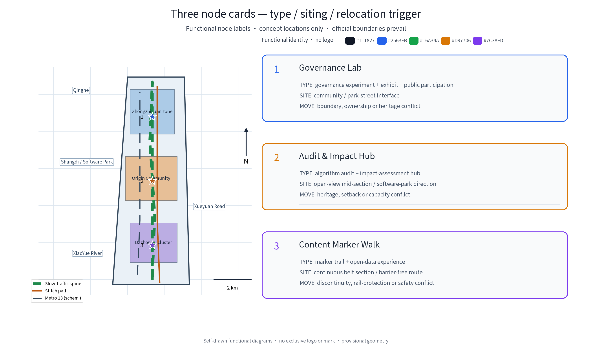
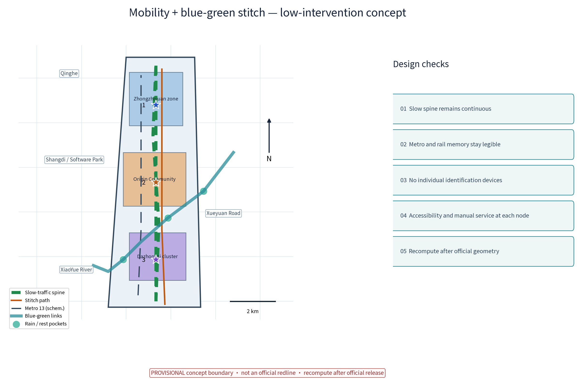
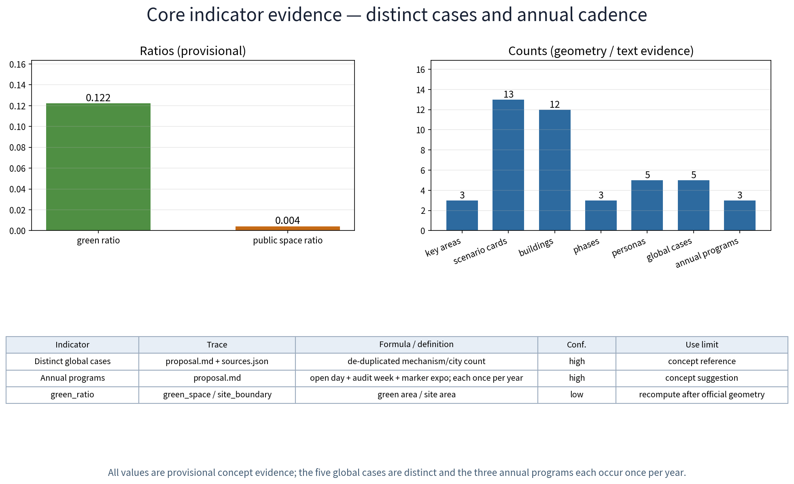

**Proposal name and overall concept (concept)**

This package uses a non-branded submission strategy and submits no exclusive name, logo or identity mark. To avoid uncleared-rights risk, all spatial names are functional labels: Governance Lab, Audit & Impact Hub, and Content Marker Walk; lines, color blocks and numbers in the figures are diagram legends, not trademarks or brand marks. The package makes no trademark, name, copyright, authorization or no-conflict claim for any label or graphic. Before any public implementation, a qualified rights professional must clear names and graphics; until then the functional descriptions remain in use. The core metaphor is that urban AI runs like a train—with tracks (boundaries and rules), timetables (transparency) and signals (audit accountability). The pilot zone uses the Jingzhang Railway Heritage Park green belt and supports the three official positioning goals; all implementation statements are concept suggestions and do not constitute statutory planning conclusions.

## Non-branded visual identity system (functional working specification)

This section makes visual identity reviewable as a replaceable functional system, not as a registered brand or logo. The Chinese functional working name is “AI治理试验带” and the English functional working name is “AI Governance Pilot Belt”; both are internal working titles only, with no claim of trade-name, trademark, authorization or registrability. The three nodes use stable bilingual labels: 治理实验室 / Governance Lab, 审计与影响评估中心 / Audit & Impact Hub, and 合成内容标识步道 / Content Marker Walk. Annual activity labels are AI治理开放日 / AI Governance Open Day, 算法审计公开周 / Algorithm Audit Open Week, and 合成内容标识艺术展 / Synthetic-Content Marker Expo; all are functional descriptions.

The system has six independently replaceable parts:

1. **Palette.** Ink `#111827` is used for text and boundaries, blue `#2563EB` for the Governance Lab, green `#16A34A` for slow mobility/publicness, amber `#D97706` for audit and alerts, and violet `#7C3AED` for content marking and experimentation. White background and pale cards preserve contrast. Colors encode information and are not claimed as exclusive brand colors.
2. **Type.** Embedded Noto Sans SC is the preferred typeface for bilingual text, figure titles and wayfinding. Its local file, public repository and SIL Open Font License 1.1 boundary are recorded as `[source:DATA-SRC-NOTO-SANS-SC-20260830]`; no exclusive font right is claimed.
3. **Icons and legends.** Self-drawn numbered circles, star nodes, solid/dashed tracks and rounded cards form the information-graphic grammar. No third-party logo, badge, mascot or uncleared graphic is used. Self-drawn provenance and use boundary are recorded as `[source:DATA-SRC-PACKAGE-VISUAL-SYSTEM-SELF-DRAWN-20260830]`.
4. **Layout.** A0/A3 booklets and static HTML follow “title band — two-column overview — numbered node cards — bottom provisional-boundary note”. Each card keeps the order “type — site — relocation trigger”; Chinese and English figures share numbering, order and color meaning so recognition does not depend on language.
5. **Wayfinding and naming hierarchy.** Level 1 is the functional working name, level 2 the three node labels, and level 3 the annual activities and scenario-card names. Entry signs, node signs, open-day posters, audit-week tables and marker-walk panels show only functional labels, numbers and legends. Activity copy can be replaced without changing the spatial information structure.
6. **Rights boundary.** This specification is for concept display and review. It submits no logo or exclusive graphic and makes no clearance, authorization, no-conflict or registrability claim. Before public implementation, solicitation, registration, licensing or commercial communication, a qualified rights professional must recheck names, font use and graphics; rename or remove any conflicting item.

The specification is synchronized with `key-areas.png`, `key-areas.en.png`, the A0/A3 booklets and bilingual HTML. Colors, numbers and layout support spatial recognition, legibility and relocation decisions; they are not a brand promise.

## Design Basis and Source List

Sources include: the officially published announcement and agent taskbook of the international open call (the three positioning goals, five functions, three-tier scopes and "three zones, two wings" wording all come from official text; [source:DATA-SRC-OFFICIAL-ANNOUNCEMENT-20260509], [source:DATA-SRC-AGENT-TASKBOOK-20260518]); published higher-level plans such as the Beijing Master Plan (2016-2035) [source:DATA-SRC-BEIJING-MASTER-PLAN-2016-2035] and the Haidian District Plan (Territorial Spatial Plan, 2017-2035) [source:DATA-SRC-HAIDIAN-DISTRICT-PLAN-2017-2035]; official public reports on construction and opening of the Jingzhang Railway Heritage Park [source:DATA-SRC-JINGZHANG-HERITAGE-PARK-20230626]; publicly available information on corridor nodes (Qinghe, Shangdi / Zhongguancun Software Park, Zhichun Road, Zhongguancun Street, Xueyuan Road, and Metro Line 13 station context) [source:DATA-SRC-BEIJING-METRO-LINE13-STATIONS]; and public policy documents including the Interim Measures for the Management of Generative AI Services (2023), the Law of the People's Republic of China on the Construction of a Barrier-Free Environment (2023), the Urban Design Administration Measures, the Measures for Compiling and Approving Regulatory Detailed Plans of Cities and Towns, the Land Use Classification Guide for Territorial Spatial Survey, Planning and Use Control (2023), plus the EU AI Act (international reference) - each registered in sources.json. Important note: the organizer has not released official boundary polygons; this proposal does not infer or claim any precise coordinates or area values. All geometry is conceptual display only and is subject to official release. The source list is limited to publicly obtainable texts; the remaining items shall be verified by professional teams. All figures are displayed at reduced precision so that provisional models are not misread as official conclusions.

## Three-Tier Scope Working Framework

The tiered figures follow the official announcement wording: coordinated research scope 43.6 km2, overall design scope ~11.41 million m² (~11.4 km²), key areas totaling 368.4 ha, forming three progressive working levels - the coordination level studies the belt-wide "industry-city-governance" relationship; the overall level studies conceptual urban renewal and regulatory-depth (concept-level) spatial design on both sides of the green belt; the key level focuses on the "three zones, two wings": Zhongzhiyuan AI Autonomous Innovation Acceleration Zone (~192 ha), Beijing AI Origin Community (~104 ha), Dazhongsi AI Industry Cluster (~72 ha), plus the Zhongguancun Sci-Tech Service Wing and the XiaoYue River Scenario-Enabling Wing. This "AI Governance Pilot Zone" is positioned as a cross-tier linear concept topic: with the green belt as the axis, the three concept nodes - Governance Lab, Audit & Impact Hub and Content Marker Walk - are organized within the overall design scope and the key areas, both implementing the "global discourse on AI governance" positioning and providing public governance infrastructure for the three zones and two wings (concept suggestion). The spatial relation of the three scopes and the three key areas, with scale bar and north arrow, is annotated on the figures; the boundaries are provisional indications ([source:DATA-SRC-PROVISIONAL-BOUNDARIES-20260605]) to be fully recomputed when official geometry is published. This sub-topic spans two official tiers: the overall design scope and the key areas.

## Coordinated Research Scope: Industry and Future-City Studies

The coordinated scope (43.6 km2, official wording) uses Qinghe, Shangdi / Zhongguancun Software Park, Zhichun Road, Zhongguancun Street and Xueyuan Road as its spatial narrative backbone, forming a concept-level industrial gradient of "R&D in the north, conversion in the middle, services in the south". Future-city studies focus on three questions: (1) the interface between computing power and the city - how AI infrastructure can be embedded with low impact; (2) the flow of data elements - concept mechanisms for tiered circulation of public, park and citizen data; (3) the mutual shaping of governance and space - how governance rules become visible and participable in space. For regional coordination, the pilot zone proposes a concept loop of "one corridor, five interfaces" (concept suggestion, not an arranged commitment): with Beiwei Community, Future Science City, Huairou Science City, the Economic-Technological Development Area and the Beijing-Tianjin-Hebei region, it explores exchange of governance tools and data catalogs, mutual recognition of validation results, and interfaces for talent / computing / data / capital - all directional research only, scoped in the matrix below, and none of it constitutes a commitment between institutions. The coordination level treats the pilot zone as the belt's "soft infrastructure", connecting the AI scenarios of each functional zone via the green belt within an integrated conceptual framework of "industrial innovation - life experience - governance pilots". Industry judgments are based on public materials and remain concept-level research, not statutory planning conclusions ([source:DATA-SRC-OFFICIAL-ANNOUNCEMENT-20260509]).

| Partner | Cooperation object (concept) | Resource exchange | Joint validation | Interfaces (talent/compute/data/capital) | Boundary note |
|---|---|---|---|---|---|
| Beiwei Community | community governance bodies, subdistrict | mutual recognition of governance topic lists, community deliberation experience | monthly deliberation sandbox pilot | community data anonymized-aggregates only; public-good points exchange | concept; requires community consent |
| Future Science City | research institutes, SOE R&D units | shared benchmark corpora and evaluation tooling | governance model evaluation protocol test point | compute reservation sharing; data stays in domain | concept; subject to bilateral agreements |
| Huairou Science City | research community around big-science facilities | dataset mutual citation, science-popularization exchange | joint data-quality protocol drill | de-identified research data into the open dataset | concept; subject to research-data compliance |
| Econ-Tech Development Area | manufacturers, park operators | mutual recognition of scenario testbeds, best-practice referral | scenario-opening conversion mechanism cross-check | industry-capital matchmaking session (concept) | concept; no investment solicitation commitment |
| Beijing-Tianjin-Hebei | planning and data authorities (concept) | governance-rule mutual-recognition study, standard draft exchange | cross-region capability assessment pilot (far term) | talent mobility and alliance exchanges (concept) | concept; law and approval studied separately |

## Overall Design Scope: Urban Renewal and Regulatory-Depth Urban Design

The overall design scope (~11.41 million m² / 11.4 km², official wording) takes the Jingzhang Railway Heritage Park green belt as its spine and proposes a conceptual "three-line" structure: the heritage rail-culture line, the parallel Metro Line 13 alignment, and the slow-traffic plus governance-display line between them. At regulatory depth (concept level) the suggestion is: a "low front, raised back" retreat on both sides of the green belt, renewal led by functional replacement of existing stock, reshaping "rail - green belt - neighborhoods" into one continuous public section. Relation to the heritage park (concept): slow traffic runs continuously along the belt with slow-traffic priority; pilot facilities are low-intervention, reversible and attached to existing structures, overlaying governance science popularization onto rail-trail and heritage-structure cultural scenes, forming a "walk the rail, read the governance" visitor narrative, and stitching into the innovation scenes of the software park and the university corridor; the ground plane stays visually open, and no continuous personal-identification facilities are added. The urban-design method is a three-level approach - "concept master diagram, node deepening, indicator check". Belt sections, stitch paths and entry-selection criteria are shown on the figures. Control lines, setbacks, heights and other parameters follow the official release and professional deliverables; this proposal gives no conclusive figures. Age-friendly and barrier-free sections (age-friendly seating, child-friendly sign heights, wheelchair-clear widths) are embedded in the concept design of every stitch point and node. Node relocation triggers are listed in the key-area chapter; any official boundary release triggers recomputation and repositioning.

> **Evidence anchors**: [source:DATA-SRC-MOHURD-CONTROL-DETAILED-PLANNING], [source:DATA-SRC-MOHURD-URBAN-DESIGN-MEASURES], [source:DATA-SRC-PROVISIONAL-BOUNDARIES-20260605].

## Key-Area Detailed Design

The key areas total 368.4 ha (official wording) and contain "three zones, two wings". Three concept nodes (concept locations only; official boundary prevails): (1) Governance Lab, space type: governance laboratory (experiment + exhibition + public participation), concept seat at the green-belt and industry-park interface section (north, near Zhongzhiyuan); (2) Audit & Impact Hub, space type: algorithm audit tower (audit and impact-assessment hub), concept seat at an open-view mid-section toward the software-park direction; (3) Content Marker Walk, space type: synthetic-content marker demonstration trail, concept seat on a continuous belt section (south, toward Dazhongsi). The nodes echo the three zones functionally (concept): the northern Zhongzhiyuan zone "sets the questions" (autonomous innovation), the middle Beijing AI Origin Community "runs experiments" (governance pilots), and the southern Dazhongsi cluster "applies scenarios"; the Zhongguancun Sci-Tech Service Wing and the XiaoYue River Scenario-Enabling Wing provide support. Each node has a defined space type, selection criteria and relocation triggers (see the three-node figure table): when official boundaries, ownership, setbacks, heritage protection or rail-protection-zone limitations conflict with the concept seat, the node repositions along the green belt. Node size and location are concept indications pending professional deepening. Barrier-free paths, mother-and-child and age-friendly rest points, and non-digital human-staffed service desks at every node ensure independent use by the elderly and residents with low digital skills.

**Scenario card index (concept)**: governance AI+ scenarios land as 13 scenario cards forming a reviewable, iterable operation index; each card states users, input data, AI capability, spatial carrier, operator, human backstop and evaluation metrics:

| Scenario card | Users | Input data | AI capability | Spatial carrier | Operator (concept) | Human backstop | Evaluation metric |
|---|---|---|---|---|---|---|---|
| 1. Governance Lab Sandbox (governance sandbox) | officials, enterprises | anonymized aggregated administrative samples | rule-conflict detection, impact rehearsal | Governance Lab | authority + professional team | manual admission review and spot checks | projects onboarded, review pass rate |
| 2. Audit & Impact Zone (algorithmic impact assessment) | researchers, practitioners | de-identified model samples | impact-assessment aid, risk tiering | Audit & Impact Hub | universities + auditor alliance | assessment conclusions manually signed off | annual assessment coverage |
| 3. Content Marker Walk (synthetic-content marking) | visitors, students, residents | on-device images, no personal data retained | synthetic-content detection and labeling | belt trail | volunteer guides + operator | samples manually reviewed before posting | labeling coverage, false-label rate |
| 4. Platform Assembly Hall (public-participation sandbox) | residents, elders | anonymized aggregated topic votes | topic clustering, consensus visualization | station-front or community section | community council + social workers | topics confirmed manually, monthly meetings | participation, topic resolution rate |
| 5. Timetable Observation Section (urban AI observation) | developers, youth | anonymized aggregated flow and weather data | aggregated flow clustering | along the belt | operator + developer community | observation reports human-reviewed before release | data quality score, update frequency |
| 6. Open Governance Dataset | global developers, researchers | de-identified public samples | quality validation, differential privacy | online + trail stations | developer community + data steward | manual spot check before release | downloads, citations, recompute pass rate |
| 7. Barrier-Free Guide Pavilion (voice guide for elders) | elders, visually impaired | no forced collection (button-triggered) | speech synthesis, offline Q&A | three nodes and stitch points | volunteers + social workers | human service desk takeover anytime | uses, assistance response time |
| 8. Governance Open Day (roadshow) | all ages, families | anonymized attendance counts | exhibit narration aid | belt plaza section | operator + volunteers | exhibit content human-reviewed | attendance, satisfaction sample |
| 9. Developer Community Co-Creation Station | developers, students | public API usage logs (aggregate) | code hosting, evaluation sandbox | Governance Lab second floor | community self-governance group | outputs reviewed by review committee | community activity, submissions |
| 10. Honor Display Wall (honor system) | enterprises, universities, residents | public application materials | honor auto-archiving (human-verified) | Audit & Impact Hub ground floor | authority + review committee | honor list human-confirmed and published | annual publication count, appeal handling |
| 11. Cultural Wayfinding System (bilingual signage) | visitors, international guests | public cultural corpora | multilingual copy generation (human final review) | whole trail | operator + culture advisers | translations human-proofed | wayfinding coverage, error rate |
| 12. Digital-Twin Sandbox (study simulation) | students, families | public concept-model parameters | decision simulation, impact visualization | governance open hall | university volunteers + operator | simulation results labeled "concept demo" | sessions, learning feedback average |

### Dazhongsi intelligent-native consumption and business scenario card 13 (concept)

This card gives the Dazhongsi AI Industry Cluster a daily-service and light-business interface. It is a concept test only; merchant onboarding, consumption conversion and investment are not commitments:

| Field | Scenario definition |
|---|---|
| Users | Nearby merchants, office workers, visitors, residents and small businesses; voluntary participating operators and public-service users first |
| Input data | Consent-based time-band footfall aggregates, public menu/service metadata, public event calendars and anonymous feedback; no names, phone numbers, device IDs, faces or raw trajectories |
| AI capability | Aggregate demand clustering, route/service recommendation, language assistance and capacity matching; no automated pricing, eligibility decision or replacement of merchant/human approval |
| Spatial type | Existing Dazhongsi ground-floor public frontage, reversible display/help desk and shared meeting/demo space; no forced retrofit or large new building assumed |
| Operator role | Conceptually a local operator, participating merchants, community/rightsholder and data steward collaborate; the steward logs purpose, consent and deletion requests |
| Privacy boundary | Voluntary, minimized, anonymized aggregates only; no face recognition, individual trajectory reconstruction, cross-scenario profiling or unconsented secondary use; retention is limited and deletion supported |
| Human fallback | On-site staff, phone/in-person service, merchant confirmation and a stop button; uncertain recommendations, complaints or accessibility needs transfer to a person |
| Metrics | Service response time, revisit intention, public-service time share, voluntary merchant participation and complaint closure; concept targets, not current facts or performance promises |
| Conversion path | Desk/paper prototype → compliance and community review → small public trial → voluntary merchant adoption after review; no investment, footfall or sales guarantee |
| Siting/relocation trigger | Pass ownership, heritage, fire, accessibility, traffic, data and operating-permit checks first; if access, authorization, capacity or safety fails, relocate to a compliant existing frontage in Dazhongsi or pause |

> **Evidence anchor**: [data:PACKAGE-GEOMETRY] (three-node indicative polygons come from geometry/key_areas.geojson in this package; all provisional concept geometry).

## AI Innovation Ecosystem, Talent Profiles and AI+ Scenarios

The five functions (official text) land as an ecosystem framework: the full-stack autonomous AI innovation system corresponds to Zhongzhiyuan; the world-class AI innovation ecosystem relies on the software park and university corridor; the new AI+ scenario-enabling paradigm relies on the XiaoYue River Scenario-Enabling Wing; the intelligent AI-vibrant city runs through the belt; and global discourse on AI governance is this pilot zone. Ecosystem atlas (concept): the corridor forms an eight-link full-stack chain - "chips - compute - frameworks - models - data - evaluation - applications - governance" - in which the pilot zone acts as the gatekeeper at the "evaluation-governance" link, forming a node network with the software park, university corridor, three zones and two wings, organized through the concept mechanisms of "on-track registration - tiered licensing - annual re-review". Talent profiles (concept; 5 profiles in total): (1) algorithm researchers; (2) AI ethics advisers; (3) algorithm auditors; (4) public-participation officers; (5) urban observation and data engineers - the pilot zone also designs a "non-technical user" convenience channel (human service desks, telephone and letter feedback channels for elders and residents with low digital skills). AI+ scenarios (concept): 13 scenario cards (indexed in the key-area chapter) cover six scenario families: governance sandbox "Governance Lab Sandbox"; algorithmic impact-assessment pilot "Audit & Impact Zone"; synthetic-content marker trail "Content Marker Walk"; public-participation decision sandbox "Platform Assembly Hall"; urban AI observation section "Timetable Observation Section"; and the "Open Governance Dataset" program. All scenarios follow the four principles of "minimum collection, purpose limitation, anonymized aggregation, human review": no identifiable biometric or raw trajectory data is collected; only aggregated statistics and de-identified samples are published; trials with public impact require prior human review and publication; over-surveillance is firmly rejected and no continuous personal-identification facilities are deployed along the belt. The six domains - governance, industry, space, public service, transport and culture - are all covered, with human review as the backstop in each. Concept design references the scope and handling duties of the Interim Measures for the Management of Generative AI Services without inferring that anything here has completed filing or security assessment ([source:DATA-SRC-GENERATIVE-AI-INTERIM-MEASURES]).

**Global governance-mechanism case review** (reference research, not direct transplant; per-case entries in sources.json; all borrowed mechanisms are explicitly concept suggestions):

| Case | Source (publisher/city) | Mechanism point | Borrowing boundary (concept) |
|---|---|---|---|
| Algorithm Register | City of Amsterdam (public website) [source:DATA-SRC-AMS-AIR] | public registration of public algorithms, purpose and risk disclosure | borrow "publication" mechanism only, not their filing scheme |
| AI Register and ethics consultation | City of Helsinki (public website) [source:DATA-SRC-HEL-AIR] | public ethics consultation and citizen-facing explanations | borrow "annual publication + public consultation" rhythm |
| Model AI Governance Framework | IMDA et al., Singapore (public document) [source:DATA-SRC-SG-MAIGF] | framework for internal governance and risk assessment | borrow the "tiered assessment" idea, not its legal effect |
| Algorithmic impact assessment legislation | EU AI Act (EUR-Lex public text) [source:DATA-SRC-EU-AI-ACT] | impact assessment and human oversight for high-risk systems | borrow "impact assessment + human oversight" phrasing |
| NIST AI Risk Management Framework (AI RMF 1.0) | National Institute of Standards and Technology (NIST) [source:DATA-SRC-NIST-AI-RMF-20230126] | voluntary, use-case-agnostic AI risk management and evaluation | reference the Govern–Map–Measure–Manage risk cycle only; not a Chinese statutory basis

**Industry and scenario verification protocols (concept)**: AI capabilities must pass three test protocols before launch; every test result has a human review point and is never auto-published:

| Test protocol | Validated object | Test method (concept) | Human review point | Related scenario cards |
|---|---|---|---|---|
| Model evaluation protocol | governance LLMs and decision-support models | benchmark set + adversarial samples + error stratification | evaluation conclusions human-signed | 1. Governance Lab Sandbox, 2. Audit & Impact Zone |
| Data quality protocol | open datasets and aggregate statistics | data quality checks, field validation, anomaly detection | anomalies human-verified before handling | 5. Timetable Observation, 6. Open Dataset |
| Runtime monitoring protocol | sensing devices and labeling system | runtime monitoring, false-positive statistics, offline drills | threshold changes need human approval | 3. Content Marker Walk, 5. Timetable Observation |

## Land Use, Building Scale, and Retention/Renovation/Demolition

Building on retention-renovation-demolition in parallel: railway and industrial heritage concept elements are registered and archived and retained as far as possible; demolition is limited to temporary and informal stock buildings verified as worthless; all areas are concept calibers to be recomputed after official release. Concept suggestions: corridor renewal is dominated by stock reuse, guided by "keep, renovate, demolish" tiers (concept classification requiring professional verification) - "keep": the heritage park itself, rail relics and protected structures stay in original condition; "renovate": old buildings and low-efficiency plots along the corridor undergo functional replacement and light renovation to host governance labs, shared offices and public facilities, with volumes capped by existing footprints; "demolish": only confirmed dangerous and illegal buildings, very few, handled case by case, without expanding scope. Building-scale control (concept): the first row along the green belt favors low, transparent public functions with massing increasing toward the block interior, avoiding high wall-like slab blocks against the belt; new floor area follows the concept floor of "a moderate share of the renovated gross scale", with concrete indicators to be computed by professional teams against official boundaries and depth requirements. The reversible public-space component library (concept; agent.4 response): a "reusable component library" - seating, sign poles, display racks, shelters and barrier-free ramp modules - uses standardized dimensions and dry connections, rotated and rearranged with events and seasons, with full restoration to green after removal; component inventory and installation/removal guides are provided for professional deepening. Land-use caliber note: in the concept land-use structure, park green space is 322 ha, i.e., 28% of the ~11.41 million m² (~1,141 ha) concept gross land-use area (zonal classification caliber); this caliber differs from green_ratio 0.122 (union of green polygons, 139 ha, divided by the ~11.41 million m² (~1,141 ha) overall-design site) and must not be mixed - both are concept calibers to be recomputed after official data release (formulas and confidence levels in the indicator chapter; [source:DATA-SRC-MNR-LAND-USE-CLASSIFICATION-202311]).

## Transport, Rail, Municipal Services and Public Facilities

Transport (concept): slow traffic is continuous and prioritized within the belt, organized as an integrated walking-plus-cycling system (concept main route ~7.8 km), interchanging with Metro Line 13 stations, with stitch paths and entries designed barrier-free and age-friendly; motorized through-traffic is prohibited in the belt, with only verified municipal maintenance passages retained and pedestrian-priority crossings. Rail: the Line 13 section parallel to the belt is a natural public-transport corridor; nodes follow the siting principle of walkable reach from stations (station positions per official materials; station marks on figures are schematic only). Municipal services (concept, requiring status verification): retrofit of existing networks, no new large stations; the "shared sensing, one pole multi-use" principle; sensing data anonymized-aggregated only, no personal-identification devices. Public services: a governance open hall, shared laboratories, community deliberation spaces and barrier-free facilities shared with residents and parks; services run a dual "online application + offline human" channel, with human desks covering elders and residents with low digital skills, and persons with hearing, vision or mobility impairments can obtain human assistance through non-digital channels. This proposal does not forecast traffic volumes or municipal capacities; statutory conclusions for transport and municipal works follow professional teams and competent authorities ([source:DATA-SRC-MOHURD-URBAN-DESIGN-MEASURES]).

## Blue-Green Space, Public Space and City Character

The Jingzhang Railway Heritage Park green belt is the blue-green skeleton and public-space spine of the pilot zone. Concept: with the belt as the main body, branch green corridors penetrate into neighborhoods on both sides, forming a "one belt, one river" ecological link with the Qinghe waterfront (concept); native species preferred; the historic grain of rail relics preserved; sponge rainwater gardens and tree-lined places arranged at the stitch points. Governance display facilities stay low-intervention: existing structures, waiting shelters and lamp posts are reused, with reversible, detachable light devices and no new large structures. The character direction is "rail memory + digital order" (concept): heritage narratives truthful and restrained, digital elements expressed at low intensity through signs, light and interactive pieces; a character-zone guideline along the belt prevents homogeneous decoration. The cultural wayfinding system (concept; agent.5 response) uses the juxtaposition of "the sediment of rail history and the transparency of AI governance" as its narrative line, with bilingual signs, sleeper-and-spike memory elements, a readability-first labeling system and restrained information devices, plus bilingual international-communication copy ("governance makes AI trustworthy and visible") with reproducible-citation notes and no exaggerated promises. The public-space sequence is continuous and open: governance lab - audit tower - marker trail, fully barrier-free, with age-friendly rest points and child-friendly signage to all-age standards. All landscape and character strategies are concept suggestions for professional deepening; heritage and ecological protection requirements follow the competent authorities ([source:DATA-SRC-BARRIER-FREE-ENVIRONMENT-LAW]).

> **Evidence anchor**: [source:DATA-SRC-MOHURD-URBAN-DESIGN-MEASURES] (method reference for blue-green organization).

## Renewal Project List, Implementation Policy and Phasing

Renewal project library (concept suggestions for professional deepening): (1) green-belt governance infrastructure retrofit; (2) Governance Lab (concept seat) retrofit and operation; (3) Audit & Impact Hub (concept seat) retrofit; (4) Content Marker Walk (concept seat) trail upgrade; (5) Platform Assembly Hall siting and construction (concept); (6) functional replacement and shared-facility retrofit of corridor buildings. Implementation policy (concept): government coordination with joint review by competent authorities, enterprise participation in operation, universities and institutes in collaborative evaluation, community co-governance, volunteers and professional teams in assessment, plus industry support, public-data authorization pilots and the coupling of renewal with function upgrading - all to be studied by the competent authorities within a lawful, compliant framework. This proposal writes no policy, funding, solicitation or event as a confirmed government commitment. The scenario-opening and conversion mechanism (concept): an "open dataset API - evaluation sandbox - season events - results open-source covenant" loop forms a "research - demonstration - conversion" circuit; the developer community operates per scenario card 9, and pilot outputs enter a demonstration list after review by the review committee; mechanism details are left for professional deepening. Phasing is a concept rhythm: near term (1-3 years) "licensing pilot" - lab first, first marker-trail segment, open dataset phase 1; mid term (3-5 years) "networked governance" - three nodes built, impact-assessment pilot running, participation sandbox routine; far term (5-10 years) "rule output" - a replicable governance toolkit and standard draft. Pilot implementation and event operation matrices below define lead/collaborator roles (RACI-style responsibility division, concept only; no real institution is assigned), prerequisite data, licensing and ethics checks, cost tier, pilot duration, human backstop, acceptance indicators, appeal channels, exit conditions and long-term operation KPIs. Stop conditions: any pilot that shows a data violation, major negative public feedback, or an operator unable to perform enters the "suspend - remove - restore green" flow; facilities are modular and reversible. The concept target is to complete disassembly, transport, sorting and greening handover within an agreed short site window only after site, traffic, heritage and fire permits; staffing and transport; component count and work-hour confirmation; a site window; waste routing; and greening acceptance are secured. This package has no site evidence supporting a specific weekend duration, so it makes no such duration promise ([source:DATA-SRC-AGENT-TASKBOOK-20260518]).

| Pilot | Lead / collaborator roles | Prerequisite data | Licensing & ethics check | Cost tier | Pilot period | Human backstop | Acceptance indicators | Appeal channel | Exit condition | Long-term KPI |
|---|---|---|---|---|---|---|---|---|---|---|
| Governance Lab Sandbox (phase 1) | Lead: professional team; with: enterprises, university, subdistrict | anonymized aggregated sample set | data compliance review + ethics review + publication | medium | 6 months | dual human posts: admission review and running spot checks | >=3 projects onboarded, zero data incidents (concept caliber) | suggestion box + online channel + monthly review | stop and remove on data incident or two consecutive failed reviews | annual re-review pass rate, publication count |
| Audit & Impact Zone | Lead: universities & auditor alliance; with: authority, enterprises | de-identified model samples | algorithmic impact assessment procedure + expert review | medium | 12 months | assessment conclusions human-signed | >=3 scenario families assessed per year (concept caliber) | appeal review committee | adjust on quality failure or concentrated public objection | annual report timeliness |
| Content Marker Walk phase 1 | Lead: operator; with: volunteer guides, culture advisers | on-device samples (not retained) | content review + marker style publication | low | 3 months | samples human-reviewed before posting | labeling coverage and false-label rate met (concept caliber) | on-site desk + phone channel | suspend sample type on false-label threshold breach | monthly false-label rate, guide service count |
| Platform Assembly Hall | Lead: community council; with: social workers, subdistrict | anonymized aggregated topic statistics | topic confirmation + resident informed publication | low | running | topics human-confirmed, monthly meetings | participation and topic resolution rate (concept caliber) | face-to-face community desk | rotate topics when no feedback persists | annual resolution rate, meeting attendance |
| Open Governance Dataset (phase 1) | Lead: developer community; with: data steward | de-identified public samples | compliance spot check before release | low | 6 months | manual spot check pre-release | recompute pass rate met | developer forum appeal thread | take down and redo on quality failure | downloads, citations, recompute pass rate |
| Governance Open Day | Lead: operator; with: volunteers, universities | anonymized attendance counts | event registration + content review | low | annual | exhibit content human-reviewed | attendance and satisfaction sample met (concept caliber) | event feedback station | suspend and rectify on safety/incident | annual edition, satisfaction average |

**Event and operation matrix (concept)**: the annual event system follows "openness, audit, art" lines; each event defines operation configuration and long-term KPIs:

| Operation item | Lead / collaborator roles | Prerequisite data | Licensing & ethics check | Cost tier | Pilot period | Human backstop | Acceptance indicators | Appeal channel | Exit condition | Long-term KPI |
|---|---|---|---|---|---|---|---|---|---|---|
| AI Governance Open Day | Lead: operator; with: volunteers, universities, enterprises | anonymized attendance counts | event registration + content review | low | annual | exhibit content reviewed | attendance and satisfaction (concept caliber) | event feedback station | stop and rectify on safety incident | held annually, satisfaction >= baseline |
| Algorithm Audit Public Week | Lead: auditor alliance; with: universities, authority | de-identified report samples | disclosure scope pre-review + expert review | medium | annual | reports human-signed | scenario coverage and sessions (concept caliber) | public Q&A session | postpone disclosure on concentrated objections | held annually, report timeliness |
| Synthetic-Content Marker Art Expo | Lead: operator; with: artists, volunteers | submission metadata | content review + rights confirmation | low | once per year | exhibits human-reviewed | exhibit count and visits (concept caliber) | curation committee appeal box | take down on copyright dispute | once per year, zero copyright complaints |
| City Data Marathon | Lead: developer community; with: universities | open datasets | data-usage pledge signed | low | annual | results human-reviewed | teams and outputs (concept caliber) | forum appeal thread | suspend on data incident | annual, open-source output rate |
| Platform Assembly Monthly Meeting | Lead: community council; with: social workers | anonymized aggregated topics | topic publication and informed consent | low | monthly | topics human-confirmed | topic resolution rate (concept caliber) | community desk | merge into Open Day when topic flow stops | monthly attendance, resolution rate |

**Annual event system (concept)**: organized on "openness, audit, art" lines with the "reservation - registration - points - publication" mechanisms and resident feedback channels:

| Annual event | Frequency | Content (concept) | Audience | Organization mechanism |
|---|---|---|---|---|
| AI Governance Open Day | once a year | open lab, roadshow, live Q&A | all ages, families | volunteer guides + reservation + event publication |
| Algorithm Audit Public Week | once a year | annual assessment report release, public Q&A, expert dialogue | researchers, residents, enterprises | registration + topic solicitation + annual publication |
| Synthetic-Content Marker Art Expo | once a year | marker art display, interactive science popularization, call for works | visitors, students, families | rotating exhibition + volunteer guides + works covenant |

**Cost caliber note (concept)**: cost tiers above are qualitative (low / medium / high) and do not represent exact amounts; the estimation method is proposed as "market inquiry for comparable facilities plus labor and depreciation of operation"; the price base is the concept drafting year; the scope covers equipment procurement, installation/removal and two years of operation; the confidence level is "low (concept-level)" and recomputation follows official project approval and budget release (no investment commitment).

## Indicator System, Area Recalculation and Compliance Matrix

Indicators (concept): slow-traffic connectivity, green-belt openness, scenarios onboarded, algorithmic-impact-assessment coverage, synthetic-content labeling coverage, open dataset scale and update frequency, public-participation count - all process-oriented, observable concept indicators with no punitive regulatory indicators, embodying "observe, do not monitor". Area caliber: the official text values apply strictly - coordinated research scope 43.6 km2, overall design scope ~11.41 million m² (~11.4 km²), key areas totaling 368.4 ha, the three zones ~192 ha / ~104 ha / ~72 ha (all official wording); the self-consistency of 368.4 ha against the sum of the three zones is an official-wording accounting, not an independent measurement by this proposal; precise areas and coordinates follow the organizer's official release. Indicator recomputation notes (provisional indicators are displayed at reduced precision only):

| Indicator | Source | Formula | Confidence | Use limit | Recompute trigger |
|---|---|---|---|---|---|
| Overall-design site area | geometry/site_boundary.geojson | polygon area in EPSG:4548, ~11.41 million m² (~1,141 ha) | medium | concept display only | official geometry release |
| green_ratio 0.122 | green union / overall design site | union of green polygons (139 ha) / ~11.41 million m² (~1,141 ha) site | low | caliber display only | recompute after official geometry |
| public_space_ratio 0.004 | public space / overall design site | public space ~4.8 ha / ~11.41 million m² (~1,141 ha) site | low | caliber display only | recompute after official geometry |
| Park-green zone share 28% | land_use.geojson (code 1401) | 1401 area 322 ha / ~11.41 million m² (~1,141 ha) concept zone total | low | caliber: zonal aggregation | recompute after official land-use data |
| Slow-traffic main route ~7.8 km | geometry/roads.geojson | concept greenway centerline length | low | concept display | recompute after official road network |

Compliance matrix (concept): heritage protection, ecological green lines, data security and protection of personal information (this proposal processes anonymized aggregates only and collects no identifiable biometric or raw trajectory data), barrier-free slow traffic (all-age / barrier-free / age-friendly / child-friendly), and publication and public participation (resident feedback channels + annual public reports + monthly deliberation) - five major items with corresponding measures and concept-level responsible bodies for professional deepening; legal application in the matrix follows the competent authorities' opinions.

> **Evidence anchors**: [metric:green_ratio], [metric:public_space_ratio], [source:PACKAGE-GEOMETRY].

## Risk, Copyright and Compliance Notes

This proposal is conceptual research design and constitutes no administrative approval basis; before any formal implementation, multi-department joint review, data-compliance assessment and security assessment are required. Risks: the official boundary polygons are not yet published; all geometry here is conceptual display and siting and areas follow the official release; projects, policies and phasing are concept suggestions subject to change; every pilot carries stop conditions and a remove-and-restore-green path (see the implementation matrix), and there are no automatic decisions that cannot be manually terminated. AI-governance boundary in three sentences: anonymized aggregates only; key decisions human-reviewed; no over-surveillance (no continuous personal-identification facilities along the belt). Naming and prior rights: this package uses functional working names and a functional-label hierarchy; no logo or exclusive mark is submitted. The palette, type, numbered legends and self-drawn diagrams form a replaceable non-branded visual system. Font and self-drawn provenance and use boundaries are recorded as [source:DATA-SRC-NOTO-SANS-SC-20260830] and [source:DATA-SRC-PACKAGE-VISUAL-SYSTEM-SELF-DRAWN-20260830]. No trademark, trade-name, copyright, authorization, no-conflict or registrability claim is made; a qualified rights professional must recheck names, font use and graphics before public implementation, solicitation, registration, licensing or commercial communication. Copyright: this is original concept text for this competition use only; cited public materials are listed in the references and sources.json; no unpublished work of others is reproduced; all figures are original self-drawn works. Compliance: this proposal constitutes no statutory planning conclusion, contains no personal-surveillance design, and all AI-related scenarios are bound by data minimization and human-review boundaries; formal implementation requires professional deepening against the official taskbook, higher-level plans and laws, plus approval by the competent authorities.

## References

All are public-channel materials; official release prevails: (1) the announcement and agent taskbook of the international open call for the urban-design competition of the Centennial Jingzhang AI Innovation Belt (organizer-published text; [source:DATA-SRC-OFFICIAL-ANNOUNCEMENT-20260509], [source:DATA-SRC-AGENT-TASKBOOK-20260518]); (2) Beijing Master Plan 2016-2035 (public text; [source:DATA-SRC-BEIJING-MASTER-PLAN-2016-2035]); (3) Haidian District Plan (Territorial Spatial Plan) 2017-2035 (public text; [source:DATA-SRC-HAIDIAN-DISTRICT-PLAN-2017-2035]); (4) public reports on the construction and opening of the Jingzhang Railway Heritage Park ([source:DATA-SRC-JINGZHANG-HERITAGE-PARK-20230626]); (5) Interim Measures for the Management of Generative AI Services (2023; [source:DATA-SRC-GENERATIVE-AI-INTERIM-MEASURES]); (6) Law on the Construction of a Barrier-Free Environment (2023; [source:DATA-SRC-BARRIER-FREE-ENVIRONMENT-LAW]); (7) Urban Design Administration Measures (MOHURD); (8) Measures for Compiling and Approving Regulatory Detailed Plans of Cities and Towns; (9) Land Use Classification Guide for Territorial Spatial Survey, Planning and Use Control (Ministry of Natural Resources, 2023); (10) Metro Line 13 station context [source:DATA-SRC-BEIJING-METRO-LINE13-STATIONS]; (11) EU AI Act (EUR-Lex public text) and international case pages of the Amsterdam Algorithm Register, the Helsinki AI Register and Singapore's Model AI Governance Framework (each registered in sources.json). Note: the above materials serve as background references only; unpublished or non-public materials are not conjecturally cited; provisional geometry is used only for concept generation, display and temporary recomputation ([source:DATA-SRC-PROVISIONAL-BOUNDARIES-20260605]).

> **Evidence anchor**: [source:DATA-SRC-OFFICIAL-ANNOUNCEMENT-20260509] (the first reference is the organizer's public material pack).
