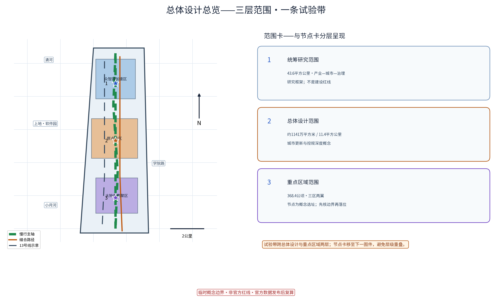
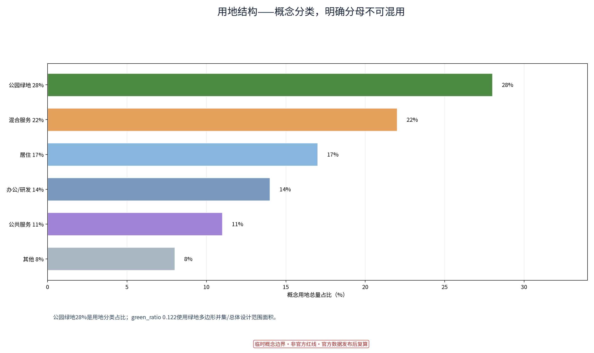
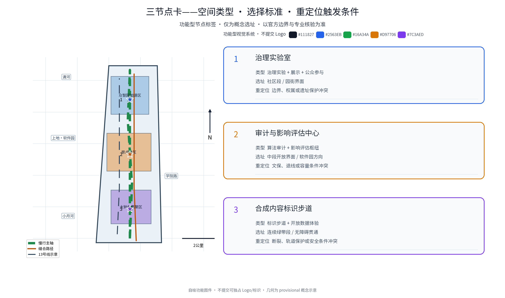
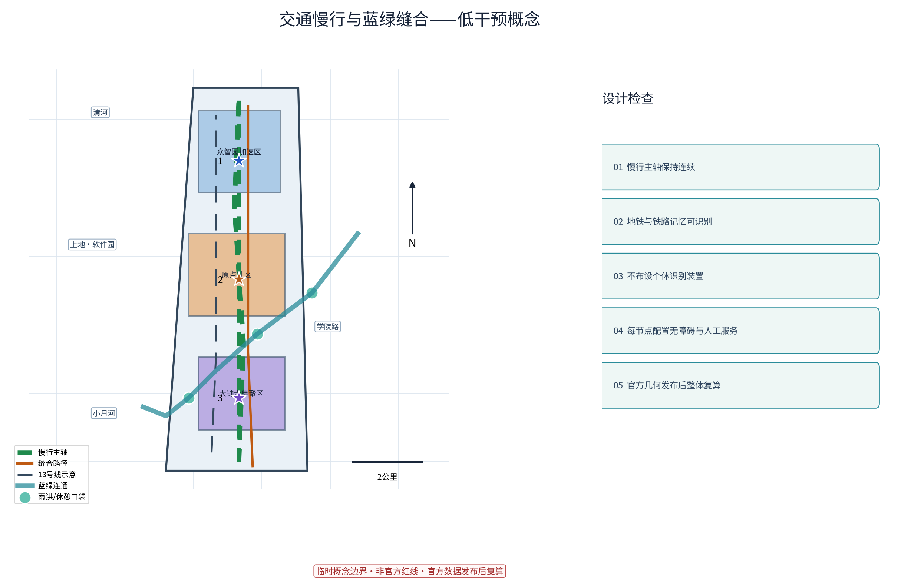
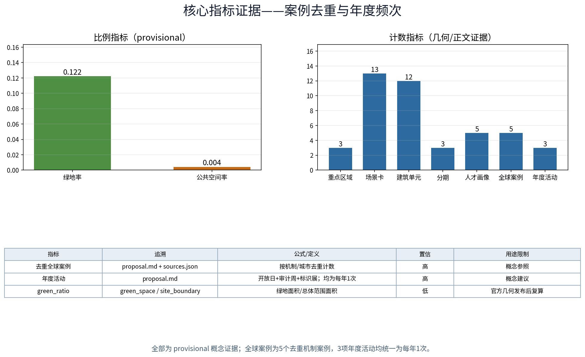

**方案名称与总体构想（概念）**

本包采用非品牌化提交策略，不提交可独占的名称、Logo或图形标识。为避免未清权风险，所有空间名称均为功能标签：治理实验室、审计与影响评估中心、合成内容标识步道；图件中的线、色块和编号仅为信息图例，不是商标或品牌标识。本包不对任何名称或图形主张商标、字号、著作权、授权或无冲突状态；未来进入公开实施前，须由权利专业人员完成名称与图形清查，在此之前继续使用功能描述。核心隐喻：让城市中的AI像列车一样——有轨道（边界与规则）、有时刻（透明可查）、有信号（审计问责），可调度、可对话。试验段以京张铁路遗址公园绿带为载体，支撑百年京张文化带、都市AI生活体验带、AI融合创新带三大定位（官方文本），全部落地表述均为概念建议、参考方案，不构成法定规划结论。

## 非品牌化视觉识别系统（功能型工作规范）

本节把“视觉识别”落实为可复核、可替换的功能型规范，而不是注册品牌或Logo。中文功能型工作名为“AI治理试验带”，英文功能型工作名为“AI Governance Pilot Belt”；两者只是本包的内部工作标题，不主张字号、商标、授权或可注册性。三节点采用固定的中英对应标签：治理实验室 / Governance Lab、审计与影响评估中心 / Audit & Impact Hub、合成内容标识步道 / Content Marker Walk。年度活动标签采用 AI治理开放日 / AI Governance Open Day、算法审计公开周 / Algorithm Audit Open Week、合成内容标识艺术展 / Synthetic-Content Marker Expo，均是功能描述。

视觉系统由六个可以单独替换的部件组成：

1. **色板。** 墨色 `#111827` 用于正文与边界，蓝色 `#2563EB` 用于治理实验室，绿色 `#16A34A` 用于慢行/公共性，琥珀色 `#D97706` 用于审计与提示，紫色 `#7C3AED` 用于内容标识与试验；白底和浅灰卡面保持高对比。颜色是信息编码，不是品牌专属色权主张。
2. **字体。** 中英正文、图件标题和导视统一优先使用嵌入式 Noto Sans SC；本地文件、公开仓库和 SIL Open Font License 1.1 许可边界登记为 `[source:DATA-SRC-NOTO-SANS-SC-20260830]`，不主张字体独占权。
3. **图标与图例。** 自绘的编号圆点、星标节点、直线/虚线轨迹和圆角卡片是信息图语法；不使用第三方Logo、徽章、吉祥物或未清权图形。自绘来源和使用边界登记为 `[source:DATA-SRC-PACKAGE-VISUAL-SYSTEM-SELF-DRAWN-20260830]`。
4. **版式。** A0/A3图册和静态HTML使用“标题带—双栏总览—编号节点卡—底部 provisional 边界声明”的顺序；节点卡固定展示“类型—选址—重定位触发条件”，中英文图件保持相同编号、顺序和颜色含义，避免依赖语言理解才能识别。
5. **导视与命名层级。** 一级为功能型工作名，二级为三节点标签，三级为年度活动和场景卡名称；入口牌、节点牌、开放日海报、审计周桌牌和标识步道说明牌均只显示功能标签、编号和图例。活动结束后可替换文字而不改变空间信息结构。
6. **权利边界。** 本规范用于概念展示和评审，不提交Logo或可独占图形，不作清权、授权、无冲突或可注册主张。未来公开实施、招商、注册、授权或商业传播前，须由合格权利专业人员重新核查名称、字体使用和图形；发现冲突即改名或撤下。

该规范与 `key-areas.png`、`key-areas.en.png`、A0/A3图册和双语HTML同步；图件中的颜色、编号和布局均服务于空间识别、可读性和重定位决策，而非构成品牌承诺。

## 设计依据与资料清单

依据包括：主办方公开发布的征集公告与任务书（三大定位、五大功能、三层范围与"三区两翼"均出自官方文本，[source:DATA-SRC-OFFICIAL-ANNOUNCEMENT-20260509]、[source:DATA-SRC-AGENT-TASKBOOK-20260518]）；《北京城市总体规划（2016年—2035年）》[source:DATA-SRC-BEIJING-MASTER-PLAN-2016-2035]、《海淀分区规划（国土空间规划）（2017年—2035年）》[source:DATA-SRC-HAIDIAN-DISTRICT-PLAN-2017-2035]；京张铁路遗址公园建设与开放的公开报道[source:DATA-SRC-JINGZHANG-HERITAGE-PARK-20230626]；沿带节点的公开信息（清河、上地/中关村软件园、知春路、中关村大街、学院路，以及地铁13号线与公园绿带并行的公开描述）[source:DATA-SRC-BEIJING-METRO-LINE13-STATIONS]。

政策与国际参照包括：《生成式人工智能服务管理暂行办法》（2023）、《中华人民共和国无障碍环境建设法》（2023）、《城市设计管理办法》、《城市、镇控制性详细规划编制审批办法》、《国土空间调查、规划、用途管制用地用海分类指南》（2023）、欧盟《人工智能法案》（国际参照）等公开文件，逐一登记于 sources.json。特别说明：主办方尚未发布官方边界多边形，本方案不推算、不声称任何精确坐标与面积数值，几何表达均为概念示意，以官方正式发布为准；资料清单以公开可得文本为限，其余由专业团队补充核实。全部数字保留低精度展示口径，避免临时模型被误读为官方结论。

## 三层范围工作框架

分层数据属官方公告文本口径：统筹研究范围43.6平方公里、总体设计范围11.4平方公里、重点区域合计368.4公顷，形成三个递进工作层级——统筹层研究"产业—城市—治理"的沿带关系，总体层研究绿带两侧城市更新与控规深度（概念层面）的空间设计，重点层聚焦"三区两翼"：众智园AI自主创新加速区（约192公顷）、北京AI原点社区（约104公顷）、大钟寺AI产业集聚区（约72公顷），及中关村科技服务翼、小月河场景赋能翼。本期"AI治理试验段"定位为跨层级线性概念课题：以绿带为轴，在总体设计范围与重点区域内组织「治理实验室」「审计与影响评估中心」「合成内容标识步道」三处概念节点，既落实"AI治理全球话语权"定位，也为三区两翼提供公共治理基础设施（概念建议）。三层范围与三处重点区域的位置关系、比例尺与北箭头均在图件中标注，边界为 provisional 示意（[source:DATA-SRC-PROVISIONAL-BOUNDARIES-20260605]），官方几何发布后整体复算。本子课题与官方三层范围的关系为：跨"总体设计范围—重点区域"两层的线性试验带。

## 统筹研究范围产业与未来城市研究

统筹范围（43.6平方公里，官方文本口径）以清河、上地/中关村软件园、知春路、中关村大街、学院路为空间叙事骨架，形成"北研发、中转化、南服务"的沿带产业梯度（概念研判）。未来城市研究聚焦三问：其一"算力与城市的接口"，研究AI基础设施以低冲击方式嵌入城市；其二"数据要素的流动"，研究公共、园区与市民数据的分级流通机制（概念建议）；其三"治理与空间的互构"，研究治理规则如何在空间中可见、可参与。区域协同方面，试验段提出"一廊五接口"概念协同回路（概念建议，非既定安排）：与北纬社区、未来科学城、怀柔科学城、经开区及京津冀协同单元之间，开展治理工具与数据目录互换、测试验证互认、人才/算力/数据/资本接口对接，全部为协作方向性研判，边界见下方矩阵表，不构成任何机构间承诺。统筹层把AI治理试验段视为全带"软性基础设施"，以绿带串联各功能区AI场景，支撑"产业创新—生活体验—治理试点"一体化概念框架；产业判断基于公开资料，属概念研判，不构成法定规划结论（[source:DATA-SRC-OFFICIAL-ANNOUNCEMENT-20260509]）。

| 协同单元 | 协作对象（概念） | 资源交换 | 联合验证 | 人才/算力/数据/资本接口 | 边界说明 |
|---|---|---|---|---|---|
| 北纬社区 | 社区治理主体、街道 | 治理议题清单互认、社区议事经验 | 月度议事沙盒试点 | 社区数据仅匿名聚合；公益积分互换 | 概念建议，需社区公共同意后开展 |
| 未来科学城 | 科研机构、央企研发单元 | 基准测试语料与评测工具共享 | 治理模型评测协议试验点 | 算力预约共享；数据不出域 | 概念建议，以双方协议为准 |
| 怀柔科学城 | 大科学装置周边科研社群 | 开放数据集互引、科普资源互换 | 数据质量协议联合演练 | 科研数据脱敏后入开放数据集 | 概念建议，受科研数据合规约束 |
| 经开区 | 制造企业与园区运营方 | 场景测试床互认、标杆案例互荐 | 场景开放转化机制互验 | 产业资本对接会（概念） | 概念建议，不构成招商承诺 |
| 京津冀 | 三地规划与数据主管部门（概念） | 治理规则互认研究、标准草案互鉴 | 跨域能力评估试点（远期） | 人才流动与联盟化交流（概念） | 概念建议，法律与审批另行研究 |

## 总体设计范围城市更新与控规深度城市设计

总体设计范围约1141万平方米（约11.41 million m²；官方文本口径11.4平方公里）以京张铁路遗址公园绿带为脊柱，概念上提出"三重线"结构：遗址公园铁轨文化线、并行地铁13号线轨道线、两者之间的慢行与治理展示线。控规深度（概念层面）建议：绿带两侧"前低后高"适度退让，更新以存量功能置换为主，将"铁路—绿带—街区"重塑为连续公共断面。与遗址公园的关系（概念建议）：沿绿带慢行贯通、绿带内交通慢行优先；试验设施低干预、可逆、依附既有构筑物，与铁轨步道、历史构筑物等文旅场景叠加治理科普，形成"游铁轨、读治理"的游览叙事，并衔接上地/软件园及学院路的园区创新场景；地面层保证视线通透，不新增面向个人的持续识别类设施。城市设计深度采用"概念总图—节点深化—指标校核"三层次方法：绿带断面、缝合路径与入口选取标准见图件；规划控制线、退距、高度等以官方发布及专业团队成果为准，本方案不给出任何结论性数值。全龄友好与无障碍断面（含适老座椅、儿童友好的标识高度、轮椅通行净宽）纳入每一处缝合口与节点的概念设计。三节点支持的重定位触发条件见重点区域章节，官方边界发布即复算重校。

> **证据锚点**：[source:DATA-SRC-MOHURD-CONTROL-DETAILED-PLANNING]、[source:DATA-SRC-MOHURD-URBAN-DESIGN-MEASURES]、[source:DATA-SRC-PROVISIONAL-BOUNDARIES-20260605]。

## 重点区域详细设计

重点区域合计368.4公顷（官方文本口径），含"三区两翼"。三处概念节点（选址为概念示意，以官方边界为准）：①「治理实验室」（治理实验室），空间类型为治理实验室（试验+展示+公众参与），概念选址于绿带与产业园区衔接段（北段近众智园）；②「审计与影响评估中心」（审计与影响评估中心），空间类型为算法审计塔（审计与影响评估枢纽），概念选址于绿带视野开阔、近软件园方向段（中段）；③「合成内容标识步道」（合成内容标识步道），空间类型为合成内容标识示范步道，概念选址于绿带步道连续段（南段近大钟寺方向）。节点与三区建立功能呼应（概念建议）：北端众智园"出题"（自主创新），中段北京AI原点社区"试验"（治理试点），南端大钟寺集聚区"落地"（场景应用），中关村科技服务翼与小月河场景赋能翼提供支撑。每个节点均明确空间类型、选择标准与重定位触发条件（见三节点图件附表）：当官方边界、权属、退距、文保或轨道保护区限制与概念选址不符时，节点在绿带沿线内平移重排，点位体量与选址均为概念示意供深化。节点周边设无障碍通道、母婴与适老休憩点、非数字渠道服务台（人工兜底），确保老年人与低数字技能居民可独立使用。

**场景卡索引（概念）**：治理类AI+场景以13张场景卡落地，形成可评审、可迭代的运营索引，逐卡明确用户、输入数据、AI能力、空间载体、运营者、人工兜底与评价指标：

| 场景卡 | 面向用户 | 输入数据 | AI能力 | 空间载体 | 运营者（概念） | 人工兜底 | 评价指标 |
|---|---|---|---|---|---|---|---|
| ①入轨沙盒·治理场景沙盒 | 治理者、企业 | 匿名聚合政务样例 | 规则冲突检测、影响预演 | 治理实验室 | 主管部门+专业团队 | 准入人工评审、事后人工抽查 | 入沙盒项目数、评审通过率 |
| ②号志评估区·算法影响评估 | 研究者、从业者 | 去标识化模型样例 | 影响评估辅助、风险分级 | 审计与影响评估中心 | 高校+审计师联盟 | 评估结论人工复核签发 | 年度评估覆盖率 |
| ③合成内容标识步道·合成内容标识 | 游客、学生、市民 | 端侧图像、不回流个体信息 | 合成内容识别与标识生成 | 绿带步道 | 志愿讲解队+运营方 | 标识样张人工审核后上架 | 标识覆盖率、误标率 |
| ④月台议事厅·公众参与沙盒 | 居民、长者 | 匿名议题投票（聚合） | 议题归类、共识度可视化 | 站前或社区段 | 社区议事会+社工 | 议题上会人工确认、月度例会 | 参与人次、议题落实率 |
| ⑤运行图观测段·城市AI观测 | 开发者、青年 | 匿名聚合通行与气象数据 | 慢行流量聚类（聚合级） | 绿带沿线 | 运营方+开发者社区 | 观测报告人工审核后公开 | 数据质量得分、更新频次 |
| ⑥数轨开放数据集 | 全球开发者、研究者 | 去标识化公开样例 | 数据质量校验、差分隐私处理 | 线上+线下驿站 | 开发者社区+数据管家 | 数据集发布前人工抽检 | 下载量、引用数、复算通过率 |
| ⑦无障碍讲解亭·适老语音导览 | 长者、视障者 | 无强制采集（按键触发） | 语音合成、离线问答 | 三节点及缝合口 | 志愿队+社工 | 人工服务台随时接管 | 使用人次、求助响应时长 |
| ⑧治理开放日·场外巡展 | 全龄市民、家庭 | 匿名签到计数（聚合） | 展项讲解辅助 | 绿带广场段 | 运营方+志愿队 | 展项内容人工审核 | 到场人次、满意度抽样 |
| ⑨开发者社区共创站 | 开发者、学生 | 公开API调用日志（聚合） | 代码托管、评测沙盒 | 治理实验室二层 | 开发者社区自治小组 | 输出物评审委员会把关 | 社区活跃数、提交物数量 |
| ⑩荣誉展示墙·荣誉展示系统 | 企业、高校、市民 | 公开申报材料 | 荣誉自动归档（人工核定） | 审计与影响评估中心一层 | 主管部门+评审委员会 | 荣誉名单人工审定后公示 | 年度公示次数、申诉处理率 |
| ⑪文化导视系统·双语导视 | 游客、国际访客 | 公开文化语料 | 多语文案生成（人工终审） | 全线步道 | 运营方+文化顾问 | 译文人工校对终审 | 导视点位覆盖率、差错率 |
| ⑫数字孪生沙盘·研学模拟 | 学生、家庭 | 公开概念模型参数 | 决策模拟、影响可视化 | 治理开放大厅 | 高校志愿者+运营方 | 模拟结论标注"概念演示" | 研学场次、学习反馈均分 |

### 大钟寺智能原生消费与商务场景卡 ⑬（概念）

该卡面向大钟寺 AI 产业集聚区的日常服务与轻量商务接口，严格作为概念试验，不把招商、消费转化或商户接入写成现实承诺：

| 字段 | 场景定义 |
|---|---|
| 面向用户 | 周边商户、园区办公人员、访客、社区居民与小微企业；优先服务愿意自愿参与的经营者和公共服务使用者 |
| 输入数据 | 经同意的分时段客流聚合、公开菜单/服务元数据、公开活动日历与匿名反馈；不接收姓名、手机号、设备标识、面部或原始轨迹 |
| AI能力 | 在聚合口径下做需求分群、路线/服务推荐、语言辅助与容量匹配；不自动定价、不自动决定资格、不替代商户或人工审批 |
| 空间类型 | 大钟寺片区既有沿街首层公共界面、可逆展示/咨询台与共享会面/演示空间；不预设强制改造或新增大型建筑 |
| 运营角色 | 概念上由本地运营方、参与商户、社区/权利主体和数据管家协作；数据管家记录用途、授权和删除请求 |
| 隐私边界 | 仅使用自愿、最小化、匿名聚合数据；禁止人脸识别、个体轨迹重建、跨场景画像和未经同意的二次用途；限定保存期并支持删除 |
| 人工兜底 | 现场工作人员、电话/面对面服务、商户人工确认和一键停用；推荐不确定、投诉或无障碍需求出现时转人工处理 |
| 指标 | 服务响应时长、复访意愿、公共服务时段占比、商户自愿参与数、投诉闭环率；均为概念目标，不是现状事实或绩效承诺 |
| 转化路径 | 原型桌面/纸面演示 → 合规与社区评审 → 小范围公开试用 → 复盘后自愿商户接入；不保证投资、客流或销售转化 |
| 选址/重定位触发条件 | 先过权属、文保、消防、无障碍、交通组织、数据与运营许可；若入口可达性、授权、容量或安全条件不成立，则沿大钟寺片区迁移到合规既有界面或暂停 |

> **证据锚点**：[data:PACKAGE-GEOMETRY]（三节点示意多边形来自本包 geometry/key_areas.geojson，均为 provisional 概念几何）。

## AI 创新生态、人才画像与 AI+ 场景

五大功能（官方文本）落位为生态框架：AI全栈自主创新体系对应众智园，世界级AI创新生态依托软件园与高校带，AI+场景赋能新范式依托小月河场景赋能翼，智能化AI活力城市贯穿全带，AI治理全球话语权即本试验段。生态图谱（概念）：沿带形成"芯片—算力—框架—模型—数据—评测—应用—治理"八环节全栈链条，试验段在"评测—治理"环节承担守门人职能，与软件园、高校带、三区两翼构成生态图谱的节点网络，机制上以「入轨备案—分级许可—年度复评」组织（概念建议）。人才画像（概念，共5类人才）：①算法研究者；②AI伦理顾问；③算法审计师；④公众参与专员；⑤城市观测与数据工程师——试验段专为"治理者+市民"设计公共参与接口，另设"非技术使用者"便捷通道（人工服务台、电话与信函意见通道，供长者与低数字技能居民使用）。AI+场景（概念）：以13张场景卡（见重点区域章节索引）覆盖六类AI+场景：治理场景沙盒「入轨沙盒」；算法影响评估先行区「号志评估区」；合成内容标识示范步道「合成内容标识步道」；公众参与决策沙盒「月台议事厅」；城市AI观测试验段「运行图观测段」；「数轨开放数据集」计划。所有场景统一遵循"最小采集、目的限定、匿名聚合、人工复核"四原则：不采集可识别个人的生物特征与轨迹原始数据，仅发布聚合统计与去标识化样例；涉及公共影响的试验须先经人工复核并公示；坚决反对任何形式过度监控，全带不部署针对个人的持续性识别设施。AI场景域覆盖治理、产业、空间、公共服务、交通、文化六域，各域均以人工复核兜底。参照《生成式人工智能服务管理暂行办法》的适用范围与处置要求开展概念设计，不推断本试验段已完成备案或安全评估（[source:DATA-SRC-GENERATIVE-AI-INTERIM-MEASURES]）。

**全球AI治理创新机制案例一览**（参照性研究，非直接移植；逐案见 sources.json；相关机制均以「」标注为概念建议）：

| 案例 | 来源（发布机构/城市） | 机制要点 | 借鉴边界（概念） |
|---|---|---|---|
| AI 登记册（Algorithm Register） | 荷兰阿姆斯特丹市（公开官网）[source:DATA-SRC-AMS-AIR] | 公共算法公开登记、说明用途与风险 | 只借鉴"公示"机制，不照搬其填报口径 |
| AI 登记册与伦理咨询（AI Register） | 芬兰赫尔辛基市（公开官网）[source:DATA-SRC-HEL-AIR] | 公开伦理咨询与面向公众的解释 | 借鉴"年度公示+公开咨询"节奏 |
| 模型AI治理框架（Model AI Governance Framework） | 新加坡资讯通信媒体发展局等（公开文件）[source:DATA-SRC-SG-MAIGF] | 内部治理与风险评估的框架化 | 借鉴"分级评估"思想，不复制其法律效力 |
| 算法影响评估立法 | 欧盟《人工智能法案》（EUR-Lex 公开文本）[source:DATA-SRC-EU-AI-ACT] | 高风险系统影响评估与人工监督 | 借鉴"影响评估+人工监督"边界表述 |
| NIST人工智能风险管理框架（AI RMF 1.0） | 美国国家标准与技术研究院（NIST） [source:DATA-SRC-NIST-AI-RMF-20230126] | 自愿、跨行业、与用例无关的AI风险管理与评测框架 | 仅作风险治理与评测机制参照，不作为中国法定依据

**产业与场景验证协议（概念）**：AI能力上线前须通过三项测试协议，测试结果均设人工复核点，不自动发布：

| 测试协议 | 验证对象 | 测试方法（概念） | 人工复核点 | 关联场景卡 |
|---|---|---|---|---|
| 模型评测协议 | 治理大模型与辅助决策模型 | 基准测试集+对抗样本+误差分群 | 评测结论人工复核后签发 | ①入轨沙盒、②号志评估区 |
| 数据质量协议 | 开放数据集与聚合统计 | 数据质量检查、字段校验、异常检测 | 异常数据人工核验后处理 | ⑤运行图观测段、⑥数轨开放数据集 |
| 运行监测协议 | 观测装置与标识系统 | 运行监测、误报率统计、离线演练 | 阈值调整须人工审批 | ③合成内容标识步道、⑤运行图观测段 |

> [source:DATA-SRC-AGENT-TASKBOOK-20260518]（agent.2"5—8个全球案例"与创新生态图谱要求的对应表）。

## 用地、建筑规模与拆改留方案

拆改留坚持留改拆并举：铁路与工业遗存概念元素登记建档、能留尽留，仅针对确无保留价值的临建与非正规存量建筑拆除；全部面积为概念口径，官方数据发布后复算。概念建议：沿线以存量更新为主，按"留、改、拆"分级引导（概念分类，需专业团队核实）——"留"：遗址公园本体、铁轨遗存与文保构筑物原状保留；"改"：沿线老旧楼宇与低效园区功能置换、轻改造，承载治理实验室、共享办公与公共设施，改造体量以既有建筑轮廓为上限；"拆"：仅限经核实的危房与违法建筑，极少量、个案处理，不扩大拆除范围。建筑规模控制（概念建议）：绿带首排以低层通透公共功能为主，体量向街区内部递增，避免贴绿带高墙板式开发；新增建筑量以"不超过改造后总规模的适度比例"为概念底线，具体指标待专业团队结合官方边界与深度要求测算。公共空间组件库（概念，agent.4任务响应）：建立"可逆组件图书馆"——座椅、标识杆、展架、风雨棚、无障碍坡道模块等全部采用标准化尺寸与干式连接，随活动与季节轮换布置，拆除后原地复绿，组件清单与安装/拆除指引供专业团队深化。用地口径说明：概念用地结构中公园绿地322公顷，占概念用地总面积约1141万平方米（约1141公顷）的28%（用地分类口径）；该口径与绿地率 green_ratio=0.122（绿地多边形并集139公顷÷总体设计范围面积）分母不同、不可混用，均以官方数据发布后复算为准（公式与置信等级见指标体系章节，[source:DATA-SRC-MNR-LAND-USE-CLASSIFICATION-202311]）。

## 交通、轨道、市政与公共服务设施

交通（概念建议）：绿带内慢行连续优先，组织"步行+骑行"贯通体系（概念主脉约7.8公里），与地铁13号线站点接驳，缝合路径与入口进行无障碍全龄设计；绿带禁止机动车穿越，仅保留经核实的市政检修通道，过街组织人行优先。轨道：13号线与绿带并行段是天然公共交通走廊，试验段节点以车站步行可达范围为选址原则（站点位置以官方资料为准，图件中站点仅为示意标记）。市政（概念建议、需现状核实）：依托既有管线设施改造，不新增大型市政场站，智慧化坚持"感知共享、一杆多用"概念原则，感知数据仅做匿名聚合统计，不部署个体识别装置。公共服务：设置治理开放大厅、共享实验室、社区议事空间与无障碍设施，向市民与园区共享开放；服务采用"线上应用+线下人工"双通道，人工服务台覆盖老年人与低数字技能者，听障、视障与行动障碍者均可经非数字通道获得人工协助；公共服务设施清单与位置见图件与实施矩阵。本方案不测算交通流量、不给定市政容量结论，交通、市政的法定结论以专业团队及主管部门意见为准（[source:DATA-SRC-MOHURD-URBAN-DESIGN-MEASURES]）。

## 蓝绿空间、公共空间与城市风貌

京张铁路遗址公园绿带是试验段的蓝绿骨架与公共空间主轴。概念建议：以绿带为主体，通过支路绿廊向两侧街区渗透，与清河滨水空间形成"一带一河"生态联系（概念构想）；植物以乡土树种为主，保留铁轨遗存历史肌理；海绵化雨水花园与林荫场所沿缝合口布置。治理展示设施坚持低干预：优先利用既有构筑物、候车亭、路灯杆等载体，采用可逆、可拆卸轻质装置，不新增大体量构筑物。风貌提出"铁轨记忆+数字秩序"概念基调（概念建议）：遗存叙事真实克制，数字元素以标识、光影、交互小品等低强度方式呈现；沿带建立风貌分区指引，防止同质化装饰。文化导视系统（概念，agent.5任务响应）：以"铁轨历史的沉淀与AI治理的透明"并置为叙事主线，设置中英双语导视、轨枕道钉记忆元素、可读性优先的标识体系、克制表达的信息装置，并同步编制面向国际传播的宣传文案（中英双语、可授权转载说明），国际传播以"治理让AI可信可见"为统一表述，避免夸张承诺。公共空间序列连续开敞：治理实验室—审计塔—标识步道，全段无障碍通行、适老休憩点与儿童友好标识按全龄标准设置。所有景观风貌策略均为概念建议供专业团队深化研究，文物与生态保护要求以主管部门规定为准（[source:DATA-SRC-BARRIER-FREE-ENVIRONMENT-LAW]）。

> **证据锚点**：[source:DATA-SRC-MOHURD-URBAN-DESIGN-MEASURES]（蓝绿空间组织的方法参照）。

## 更新项目清单、实施政策与分期计划

更新项目库（概念建议，可供专业团队深化）：①绿带治理基础设施改造；②治理实验室（概念点位）改造运营；③审计与影响评估中心（概念点位）改造；④合成内容标识步道（概念点位）步道化改造；⑤月台议事厅选址与建设（概念建议）；⑥沿线楼宇功能置换与共享设施改造。实施政策（概念建议）：政府统筹与主管部门联审、企业参与运营、高校与科研机构协同评测、社区共建共治，志愿者与专业团队参与评估，产业支持、公共数据授权试点、更新与功能提升联动等，均须在合法合规框架内由主管部门研究，本方案不将任何政策、资金、招商或活动写成既定政府承诺。场景开放及转化机制（概念）：以"开放数据集API—评测沙盒—赛季活动—成果开源协议"形成"研发—示范—转化"回路，开发者社区运营见场景卡⑨，试产成果经评审委员会把关后进入示范清单，机制细节供专业团队深化。分期为概念节奏：近期（1—3年）挂牌试验——实验室先行、标识步道首段、开放数据集一期；中期（3—5年）联网治理——三节点建成、影响评估先行区运行、参与沙盒常态化；远期（5—10年）规则输出——形成可复制的治理工具箱与标准草案。试点实施与活动运营的牵头/协作角色、前置数据、许可与伦理检查、成本等级、试点周期、人工兜底、验收指标、申诉渠道、退出条件与长期运营KPI见下方矩阵（RACI式责任分工，概念建议，不指派任何现实机构）。停止条件：任一试点出现数据违规、公众重大负面反馈或运营主体无法履责时，进入“停项—撤收—复绿”流程，设施模块化、可逆。概念目标是：在取得场地、交通、文保、消防等许可，明确值守人员与运输车辆，核定组件数量与拆装工时，确认场地窗口、废弃物分类去向并完成复绿验收的前提下，于约定短时窗口内完成拆装、转运、分类和复绿交接；本包没有足以支撑“一周末内”工期的现场证据，因此不作具体工期承诺（[source:DATA-SRC-AGENT-TASKBOOK-20260518]）。

| 试点项目 | 牵头/协作角色 | 前置数据 | 许可与伦理检查 | 成本等级 | 试点周期 | 人工兜底 | 验收指标 | 申诉渠道 | 退出条件 | 长期运营KPI |
|---|---|---|---|---|---|---|---|---|---|---|
| 入轨沙盒（治理实验室首期） | 牵头：专业团队；协作：企业、高校、街道 | 匿名聚合样例集 | 数据合规评估+伦理审查+公示 | 中 | 6个月 | 准入评审与运行抽查双人工岗 | 入盒项目≥3且无数据事件（概念口径） | 意见箱+线上通道+月度复议 | 数据事件或连续两期不达标即停项撤收 | 年度复评通过率、公示次数 |
| 号志评估区（影响评估先行区） | 牵头：高校与审计师联盟；协作：主管部门、企业 | 去标识化模型样例 | 算法影响评估程序+专家复核 | 中 | 12个月 | 评估结论人工签发 | 年度评估覆盖≥3项场景（概念口径） | 申诉复核委员会 | 评估质量不达标或公众异议集中时调整 | 年度报告发布及时率 |
| 合成内容标识步道首段（标识示范步道） | 牵头：运营方；协作：志愿讲解队、文化顾问 | 端侧样张（不留存） | 内容审核+标识样式公示 | 低 | 3个月 | 样张人工审核上架 | 标识覆盖率与误标率达标（概念口径） | 现场服务台+电话通道 | 误标率超阈值即停用该样张 | 月度误标率、志愿讲解人次 |
| 月台议事厅（公众参与沙盒） | 牵头：社区议事会；协作：社工、街道 | 匿名聚合议题统计 | 议题上会确认+居民知情公示 | 低 | 长期运行 | 议题人工确认、月度例会 | 参与人次与议题落实率（概念口径） | 社区面对面窗口 | 议题长期无反馈则轮换议题方向 | 年度议题落实率、例会出席率 |
| 数轨开放数据集（一期） | 牵头：开发者社区；协作：数据管家 | 去标识化公开样例 | 数据发布前合规抽检 | 低 | 6个月 | 发布前人工抽检 | 数据集复算通过率达标 | 开发者论坛申诉帖 | 数据质量不合格即下线重做 | 下载量、引用数、复算通过率 |
| 治理开放日（年度品牌活动） | 牵头：运营方；协作：志愿队、高校 | 匿名签到计数 | 活动安全备案+内容审核 | 低 | 年度举办 | 展项人工审核 | 到场与满意度抽样达标（概念口径） | 活动意见站 | 安全或舆情事件即停办整改 | 年度举办次数、满意度均分 |

**活动运营矩阵（概念）**：年度活动体系按"开放、审计、艺术"三线组织，每项活动明确运营配置与长期KPI：

| 运营项目 | 牵头/协作角色 | 前置数据 | 许可与伦理检查 | 成本等级 | 试点周期 | 人工兜底 | 验收指标 | 申诉渠道 | 退出条件 | 长期运营KPI |
|---|---|---|---|---|---|---|---|---|---|---|
| AI治理开放日 | 牵头：运营方；协作：志愿队、高校、企业 | 匿名签到计数 | 活动备案+内容审核 | 低 | 年度 | 展项人工审核 | 人次与满意度（概念口径） | 活动意见站 | 安全事件即停办整改 | 年度举办1次、满意度≥基准 |
| 算法审计公开周 | 牵头：审计师联盟；协作：高校、主管部门 | 去标识化报告样例 | 公开范围预审+专家复核 | 中 | 年度 | 报告人工签发 | 覆盖场景数与公开场次（概念口径） | 公开答疑会 | 异议集中则延期公开 | 年度举办1次、报告及时率 |
| 合成内容标识艺术展 | 牵头：运营方；协作：艺术家、志愿队 | 申报作品元数据 | 内容审核+权利确认 | 低 | 每年1次 | 展品人工审核 | 展品数与参观人次（概念口径） | 策展委员会申诉箱 | 版权争议即下架撤展 | 每年1次举办、版权投诉为零 |
| 城市数据马拉松 | 牵头：开发者社区；协作：高校 | 开放数据集 | 数据使用守则签署 | 低 | 年度 | 成果人工评审 | 参赛团队与成果数（概念口径） | 论坛申诉帖 | 数据事故即停赛整改 | 年度举办、成果开源率 |
| 月台议事会（月度例会） | 牵头：社区议事会；协作：社工 | 匿名聚合议题 | 议题公示与知情同意 | 低 | 月度 | 议题人工确认 | 议题落实率（概念口径） | 社区窗口 | 连续无议题则并线到开放日 | 月度例会出席率、落实率 |

**年度活动体系（概念）**：按"开放、审计、艺术"三线组织年度活动，配套「预约—备案—积分—公示」机制与居民意见通道：

| 年度活动 | 频次 | 内容（概念） | 面向人群 | 组织机制 |
|---|---|---|---|---|
| AI治理开放日 | 每年1次 | 开放实验室、场外巡展、现场答疑 | 全龄市民、家庭 | 志愿讲解+预约报名+活动公示 |
| 算法审计公开周 | 每年1次 | 年度评估报告发布、公开答疑、专家对话 | 研究者、市民、企业 | 备案登记+议事征集+年度公示 |
| 合成内容标识艺术展 | 每年1次 | 标识艺术展陈、互动科普、作品征集 | 游客、学生、家庭 | 轮换展陈+志愿讲解+作品公约 |

**成本口径说明（概念）**：以上成本等级均为定性分级（低/中/高），不代表精确金额；估算方法拟采用"同类设施市场询价+运维人力和折算"，价格基期为概念编制年度，包含范围为设施采购、安装撤收与两年运维，置信等级为"低（概念级）"，官方立项与预算批复后复算（不构成投资承诺）。

## 指标体系、面积复算与合规矩阵

指标（概念）：慢行贯通率、绿带开放率、治理场景入盒数、算法影响评估覆盖率、合成内容标识覆盖率、开放数据集规模与更新频次、公众参与人次等，均为过程性、可观测概念指标，不设惩罚性监管指标，体现"观测不监控"。面积口径：严格采用官方文本值——统筹研究范围43.6平方公里、总体设计范围11.4平方公里、重点区域合计368.4公顷，三区为约192公顷、约104公顷、约72公顷（均标注为官方文本口径）；368.4公顷与三区之和的自洽关系属官方文本口径核算，本方案不作自行推算的测量复算，精确面积与坐标以主办方正式发布为准。指标复算说明（provisional 指标一律降精度显示）：

| 指标 | 出处 | 公式 | 置信等级 | 用途限制 | 复算触发 |
|---|---|---|---|---|---|
| 总体设计范围面积 | geometry/site_boundary.geojson | EPSG:4548多边形面积，约1141万平方米（约1141公顷） | 中 | 仅概念展示 | 官方几何发布后 |
| 绿地率 green_ratio=0.122 | 概念绿地并集÷总体设计范围 | union(绿地多边形139公顷)÷范围约1141万平方米（约1141公顷） | 低 | 仅口径示意 | 官方几何发布后复算 |
| 公共空间率 public_space_ratio=0.004 | 概念公共空间÷总体设计范围 | 公共空间约4.8公顷÷范围约1141万平方米（约1141公顷） | 低 | 仅口径示意 | 官方几何发布后复算 |
| 公园绿地占比28% | land_use.geojson（代码1401） | 1401面积322公顷÷概念用地总面积约1141万平方米（约1141公顷） | 低 | 口径为用地分类汇总 | 官方用地数据发布后复算 |
| 慢行主脉约7.8公里 | geometry/roads.geojson | 概念绿道中心线长度 | 低 | 概念展示 | 官方路网发布后复算 |

合规矩阵（概念）：文物遗址保护、生态绿线、数据安全与个人信息安全保护（本方案仅处理匿名聚合数据，不采集可识别个人的生物特征与轨迹原始数据）、无障碍慢行（全龄/无障碍/适老/儿童友好）、公示与公众参与（居民意见通道+年度公示+月度议事）五大项，逐项对应措施与责任主体（概念建议），供专业团队深化；矩阵涉及的法律适用以主管部门意见为准。

> **证据锚点**：[metric:green_ratio]、[metric:public_space_ratio]、[source:PACKAGE-GEOMETRY]。

## 风险、版权与合规说明

本方案为概念研究性设计，不构成行政审批依据；正式实施前须完成多部门联审、数据合规评估与安全评估。风险：官方边界多边形尚未发布，本方案全部几何为概念示意，选址与面积以官方发布为准；项目、政策与分期均为概念建议，存在调整可能；试点设施均设停止条件与撤收复绿路径（见实施矩阵），无无法人工终止的自动决定。AI治理边界遵循三句式：仅处理匿名聚合数据；关键决策由人工复核；禁止过度监控（全带不部署针对个人的持续性识别设施）。命名与在先权利：本包采用功能型工作名和功能标签层级，不提交Logo或可独占标识；色板、字体、编号图例和自绘图件构成可替换的非品牌化视觉系统。字体和自绘图件的来源与许可边界分别见 [source:DATA-SRC-NOTO-SANS-SC-20260830]、[source:DATA-SRC-PACKAGE-VISUAL-SYSTEM-SELF-DRAWN-20260830]。本包不作商标、字号、著作权、授权、无冲突或可注册主张；公开实施、招商、注册、授权或商业传播前须由合格权利专业人员重新核查，发现冲突即改名或撤下。版权：本方案为原创概念文本，专供参赛应征用途；引用的公开资料已在"参考资料"与 sources.json 列明，未复制他人未公开成果；图件全部为自绘原创。合规：本方案不构成法定规划结论，不含任何针对个人的监控类设计，所有AI相关场景均受数据最小化与人工复核边界约束；正式实施须由专业团队依据官方任务书、上位规划及法律法规深化，并经主管部门批准。

字体与自绘视觉系统：[source:DATA-SRC-NOTO-SANS-SC-20260830]、[source:DATA-SRC-PACKAGE-VISUAL-SYSTEM-SELF-DRAWN-20260830]。

字体与自绘视觉系统：[source:DATA-SRC-NOTO-SANS-SC-20260830]、[source:DATA-SRC-PACKAGE-VISUAL-SYSTEM-SELF-DRAWN-20260830]。

## 参考资料

以下均为公开渠道资料，以官方发布为准。主办方公开发布的征集公告与任务书：[source:DATA-SRC-OFFICIAL-ANNOUNCEMENT-20260509]、[source:DATA-SRC-AGENT-TASKBOOK-20260518]。

上位规划：《北京城市总体规划（2016年—2035年）》[source:DATA-SRC-BEIJING-MASTER-PLAN-2016-2035]；《海淀分区规划（国土空间规划）（2017年—2035年）》[source:DATA-SRC-HAIDIAN-DISTRICT-PLAN-2017-2035]。

场地与交通背景：京张铁路遗址公园建设与开放相关公开报道[source:DATA-SRC-JINGZHANG-HERITAGE-PARK-20230626]；地铁13号线站点公开信息[source:DATA-SRC-BEIJING-METRO-LINE13-STATIONS]。

政策与国际参照：《生成式人工智能服务管理暂行办法》（国家互联网信息办公室等，2023年，[source:DATA-SRC-GENERATIVE-AI-INTERIM-MEASURES]）；《中华人民共和国无障碍环境建设法》（2023年，[source:DATA-SRC-BARRIER-FREE-ENVIRONMENT-LAW]）；《城市设计管理办法》、《城市、镇控制性详细规划编制审批办法》、《国土空间调查、规划、用途管制用地用海分类指南》（自然资源部，2023年）；欧盟《人工智能法案》（EUR-Lex公开文本）及阿姆斯特丹AI登记册、赫尔辛基AI登记册、新加坡模型AI治理框架等国际案例公开页面（逐案登记于 sources.json）。

注：上述资料仅作背景参考；未发布或不可公开获取的资料，本方案未作臆测引用；provisional 几何仅用于概念生成、展示与临时复算（[source:DATA-SRC-PROVISIONAL-BOUNDARIES-20260605]）。

> **证据锚点**：[source:DATA-SRC-OFFICIAL-ANNOUNCEMENT-20260509]（本清单首条即组织方公开资料包）。
