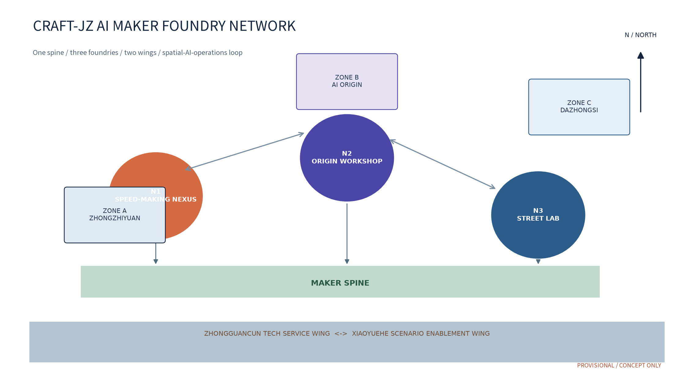
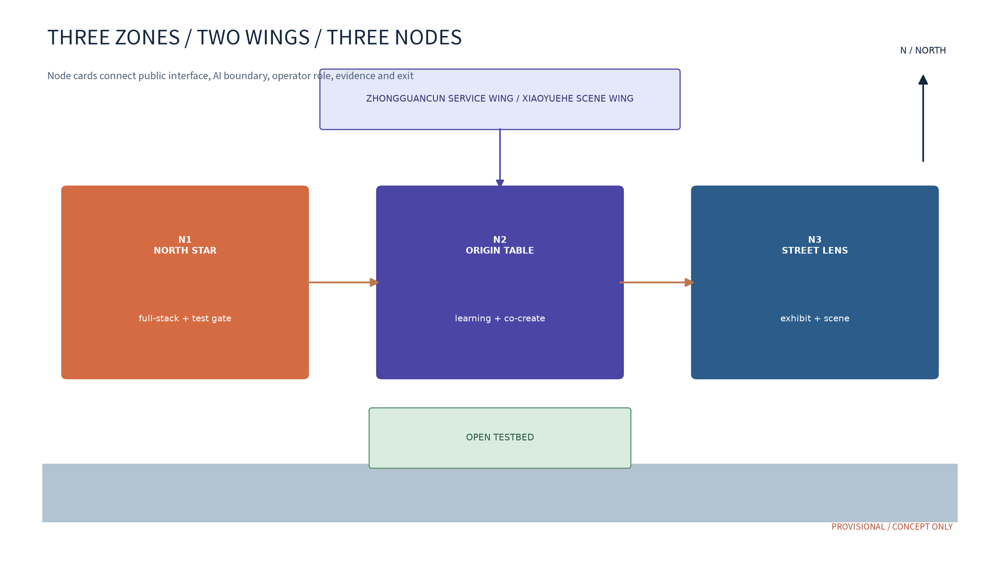
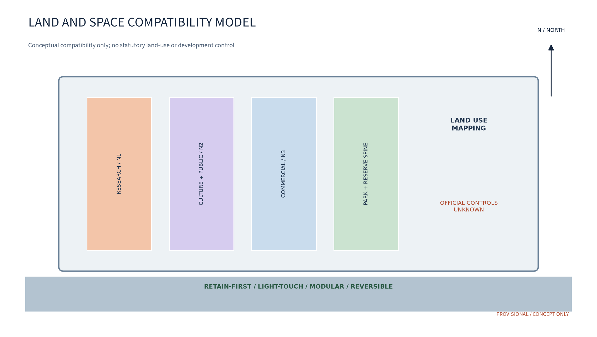
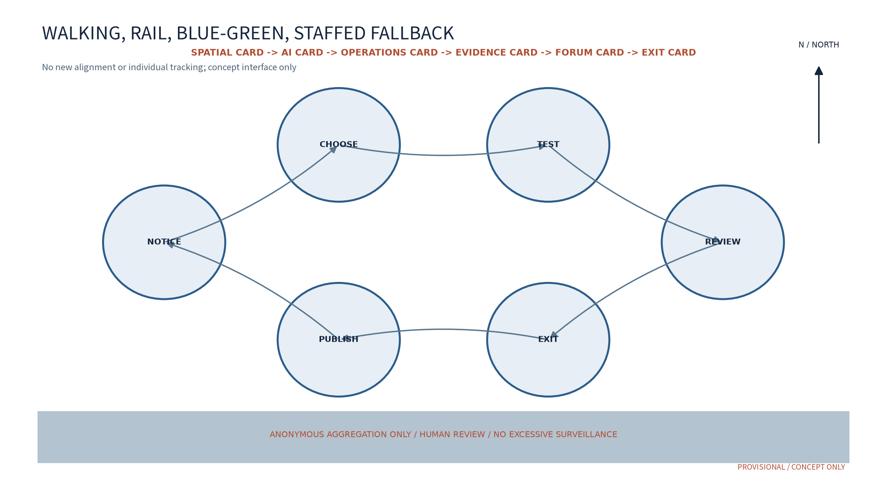
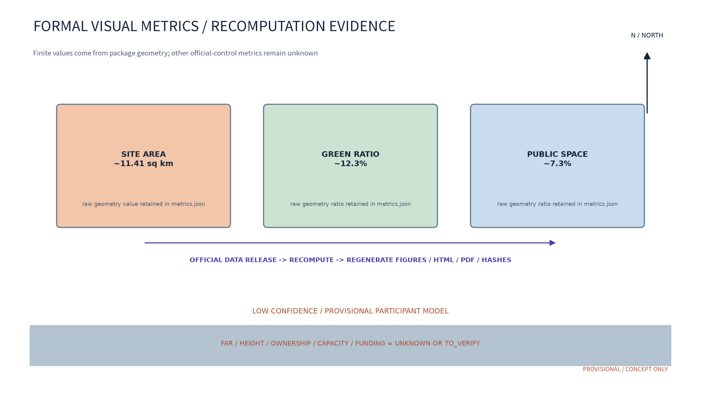

# AI Maker Foundry Network CRAFT-JZ

> Concept proposal / reference scheme / provisional. The AI maker and builder network for the Centennial Jing-Zhang AI Innovation Belt turns research, learning, testing, exhibition, and operations into an auditable urban service. It does not replace statutory planning, detailed planning, approvals, procurement, agreements, or operating commitments; all locations, ownership, capacity, funding, industrial scale, and outcomes require verification by authorized bodies and professional teams.

## Design Basis and Source List

[source:SRC-TASKBOOK] [standard:PROJECT-OFFICIAL-ANNOUNCEMENT]

The proposal starts from public, traceable, rights-cleared material. It follows the three brief positions: the Centennial Jing-Zhang Culture Belt, the Urban AI Everyday Experience Belt, and the AI-Integrated Innovation Belt. It also addresses the five functions: a full-stack AI self-innovation system, a world-class AI innovation ecosystem, a new AI-plus-scene paradigm, an intelligent and lively AI city, and global leadership in AI governance. Public historical material on the Jing-Zhang Railway and Zhongguancun innovation culture, public urban-design and detailed-planning guidance, the public land-use classification guide, public generative-AI governance guidance, and public accessibility law are used as references. External cases are used only for mechanism comparison; their scale, investment, performance, local partnership, or brand rights are not transferred as local facts.

Sources are graded as A1 project announcement and taskbook, A2 public laws and planning or governance guidance, B1 public case pages, C1 package-authored geometry, drawings, and text, and D1 items to verify: official redlines, ownership, heritage, fire safety, roads, transit, utilities, operating baseline, budget, cooperation, approvals, and funding. D1 is marked provisional, unknown, or to_verify in the proposal, assumptions.json, sources.json, and drawings. After official material is released, the same formulas are rerun and the revision is recorded.

## Three-Level Scope Framework

[depth:three_level_scope_framework] [data:geometry/site_boundary.geojson#provisional]

L1 coordinating research asks why the network exists. It examines talent, compute, data, space, industry, and public-service interfaces across the Haidian AI innovation belt, the Zhongguancun Technology Service Wing, and the Xiaoyuehe Scenario Enablement Wing. Links to Beiwei Community, Future Science City, Huairou Science City, the Beijing Economic-Technological Development Area, and the wider Beijing-Tianjin-Hebei region are coordination interfaces only; no partnership is claimed. L1 outputs an industry-support map, open-testbed rules, a culture narrative, and an annual operating framework.

L2 overall design asks how the network becomes legible. It uses a participant provisional working boundary and three key areas to form a one-axis, three-foundry, two-wing model. A maker spine connects the Jing-Zhang heritage-park context, node interfaces, and a walkable public experience. The three zones have differentiated industry and everyday roles, while the wings supply service and scene interfaces. L2 describes spatial relationships, reversible components, and phasing conditions only; it does not set statutory land use, redlines, intensity, or engineering conclusions.

L3 detailed node research asks how the network is used. N1 Speed-Making Nexus is placed conceptually in the Zhongzhiyuan AI Acceleration Area, N2 Origin Workshop in the AI Origin Community, and N3 Street Lab in the Dazhongsi AI Industry Cluster. An open-testbed corridor follows the Xiaoyuehe direction. Each node has a spatial card, service card, responsibility card, risk card, and exit card connected by scenario cards S01-S12 and industry test protocols T01-T04.

## Coordinated Research Area: Industry and Future City Research

[source:SRC-TASKBOOK] [depth:existing_conditions_diagnosis]

The three positions are value chains, not parallel slogans. The Centennial Jing-Zhang Culture Belt provides memory, public narrative, and historical accuracy. The Urban AI Everyday Experience Belt translates complex AI into understandable, withdrawable everyday services. The AI-Integrated Innovation Belt places developers, makers, researchers, companies, and communities in a real but low-risk test setting. The three zones and two wings form a loop from factors to space, space to scenes, scenes to evidence, and evidence back to industry.

Industry support uses six factors and five gates. The factors are land and existing space, usable compute, lawful data, talent and mentors, test scenes, and conversion and communication. The gates are demand registration, eligibility and safety screening, low-risk prototype, human-reviewed evaluation, and filing plus exit. N1 supports toolchains and manufacturing safety, N2 supports youth learning and community co-creation, and N3 supports legible exhibition and commercial-service experiments. The Zhongguancun wing is a to_verify interface for intellectual property, legal, supply-chain, and capital support; the Xiaoyuehe wing hosts public experience, walking, and the open testbed. Cooperation, recruitment, subsidies, compute, occupancy, and operating roles can exist only after written agreements and approvals.

## Overall Design Area: Urban Renewal and Regulatory-Plan-Level Urban Design

[standard:MOHURD-URBAN-DESIGN-MEASURES] [depth:overall_spatial_structure]

The concept is “CRAFT-JZ AI Maker Foundry Network.” CRAFT means turning models, hardware, knowledge, and public services into deliverable prototypes; JZ is a working identifier within the Centennial Jing-Zhang context and does not imitate an organizer or existing city brand. The visual direction is a package-authored four-cell “space” module: the cells represent the flagship foundry, community workshop, street lab, and open testbed. Terracotta means making, rail blue means memory, and AI indigo means collaboration. The current submission assets are itemized in `report/copyright_statement.md`: package text and figures are authored here, PDF and HTML use Noto Sans SC under SIL OFL 1.1, and CRAFT-JZ remains a package working identifier pending future trademark search and external brand clearance.

The spatial structure is one spine, three foundries, and two wings. The spine is walkable, explainable, reversible, and connects N1, N2, N3, and the wing interfaces. Renewal prefers existing interiors, light-touch, modular, detachable, maintainable components. The drawings are participant concept models and cannot serve as redlines, height, FAR, demolition-retention, bridge, tunnel, underground, or utility conclusions. Heritage, green, blue-line, traffic, and fire requirements remain to_verify.

## Detailed Design of Key Areas

[data:geometry/key_areas.geojson#provisional] [depth:three_key_area_detailed_design]

N1 Speed-Making Nexus is the maker entrance: a public foyer, materials and tool desk, low-risk prototype room, observation window, staffed safety desk, and back-of-house maintenance zone are suggested. Its value is the sequence apply, train, make, review, file, and withdraw rather than equipment accumulation. N1 can host small prototypes for open hardware, public-service concepts, accessibility aids, and exhibition components. High-risk equipment, hazardous materials, and structural works are outside this concept.

N2 Origin Workshop is the community and talent entrance: a quiet learning room, movable co-creation tables, family and older-person corner, analog-digital conversion desk, feedback channel, and small honour wall are suggested. Paper and human alternatives are the default for students, youth developers, residents, caregivers, disabled and neurodivergent participants. Contributions can be recorded on voluntary public project cards; services do not require profiling or continuous tracking.

N3 Street Lab is the visible city and industry entrance: a street-facing project window, understandable-AI table, merchant collaboration desk, bilingual wayfinding, paper exit card, and switch-off interface are suggested. N3 demonstrates reviewed low-risk concepts only; partnership and visitor effects are not established facts. The three nodes connect through a walkable experience path and a data-minimal evidence chain that can be withdrawn when ownership, transport, approval, or safety conditions change.

## AI Innovation Ecosystem, Personas, and AI+ Scenarios

[source:SRC-C01] [depth:blue_green_public_space]

The five functions land as follows: F1 full-stack prototyping at N1; F2 open testing and human gates at N1 and the testbed; F3 learning and inclusive co-creation at N2; F4 public exhibition and understandable AI at N3 and the Jing-Zhang culture interface; F5 annual operations, evidence, and reversible exit across the wings. AI spans industry, space, transport, public services, culture, and governance. The fixed governance sentence is: anonymous aggregation only; human review for consequential decisions; no excessive surveillance. Every AI service has a non-AI, paper, human, and withdrawal route.

Six personas are P01 university student developer, P02 early maker or small team, P03 industrial engineer, P04 resident or caregiver, P05 older or low-digital-literacy user, and P06 disabled, neurodivergent, or language-barrier user. Public mechanisms are referenced without claiming transfer: Fab Lab distributed learning, Station F service community, Hacker Dojo member governance, and NUS Enterprise BLOCK71 university interface. Chaihuo and 2050 remain research leads pending page-level verification and are excluded from formal factual claims.

Every scene card specifies input and consent, minimal data, model or rule version, human gate, explanation, accountable owner, metric and baseline, stop and exit trigger, appeal, and deletion. Twelve cards follow:

| ID | Scene and place | User / operator | AI boundary and human gate | Observable metric |
|---|---|---|---|---|
| S01 | N1 desk booking | P01-P03 / operator | scheduling suggestion only, human confirmation | completion, cancellation |
| S02 | N1 tool sharing | P02-P03 / operator and volunteers | ledger only, no profile | on-time rate, closure time |
| S03 | N1 material safety list | P01-P03 / safety lead | rule prompt, not safety approval | training completion, stops |
| S04 | N2 course path | P01-P06 / university and operator | opt-in, human editable | completion, withdrawal |
| S05 | N2 mentor matching | P01-P03 / developer alliance | self-entered tags, retractable | response time, satisfaction |
| S06 | N2 accessibility route | P05-P06 / staffed desk | alternatives only, human check | closure, handoff rate |
| S07 | N2 bilingual history | residents and visitors / volunteers | editor review, no generated fact | completion, corrections |
| S08 | N3 exhibit rotation | P02-P04 / operator | anonymous clicks, human schedule | rotations, corrections |
| S09 | N3 merchant experience | residents and visitors / merchant | voluntary input, no traces | completion, withdrawal |
| S10 | Network feedback summary | all users / operator and forum | de-identified aggregation | volume, response time |
| S11 | Testbed runtime notice | test teams / technical and safety leads | stop on anomaly, broadcast only | response, stops |
| S12 | Event volunteer coordination | volunteers / volunteer alliance | opt-in, human roster | attendance, closure |

Four protocols are proposed. T01 model and service benchmark uses synthetic or expressly authorized de-identified data to test accuracy, false positives, explainability, human takeover, and version history. T02 data-quality and error-segmentation stress test grades source, missingness, freshness, representation, and error groups; bias pauses the test. T03 staffed testbed operation checks safety, privacy, accessibility, and fire conditions before a limited test and defines alert, rollback, log, appeal, and removal conditions. T04 reversible maker-prototype protocol checks materials, tool access, child-public separation, maintenance, and dismantling. These are proposal protocols, not test licenses or operating approvals.

The space-AI-operations loop is: a space card defines what can be entered; an AI card defines minimal service and a human gate; an operations card defines staffing, training, notice, and appeal; an evidence card records aggregate metrics and incidents; a forum card reviews monthly and publishes annually; an exit card pauses or removes the prototype when risk, ownership, funding, or baseline conditions change. Space is therefore an auditable, adjustable, withdrawable public infrastructure rather than a static container.

## Land Use, Building Scale, and Retain-Renovate-Demolish Strategy

[standard:MNR-LAND-USE-CLASSIFICATION-GUIDE] [data:geometry/land_use.geojson#concept]

Land use is a conceptual compatibility mapping to the public classification guide: research and innovation services support N1; culture and public service support N2 and the Jing-Zhang narrative; commercial and business services support N3; park, protective green, transport, and reserve uses support the spine and public interfaces. Participant geometry supplies model partitions, not an existing-condition survey, ownership, or statutory designation. Site area, green ratio, and public-space ratio are finite values recomputed from GeoJSON, but low-confidence provisional model values. They are recomputed after official boundary, green-line, access, and ownership material is released.

Renewal retains first and uses reversible interventions: keep the legible heritage setting and public-green framework; use existing interiors; form foundries with light partitions, folding exhibits, movable furniture, detachable tools, and reusable signs. No conclusion is made about demolition, additions, structure, fire, energy, machine rooms, capacity, investment, or engineering quantity. Each space card carries a state label: available, to_verify, exhibition-only, paused, or withdrawn.

## Transport, Rail, Municipal Infrastructure, and Public Services

[standard:STD-ACCESSIBILITY] [depth:traffic_rail_slow_parking]

Transport is walk-first, rail-connected, and human-backed. The spine conceptually connects the nodes and wing interfaces through walking, cycling, transit, and continuous accessible routes. No new rail alignment, road redline, bridge, tunnel, or underground work is drawn. Event days may use timed booking, human guidance, broadcast notices, and temporary queues; faces, Bluetooth, and individual traces are not used. Existing right-of-way, station, emergency, and professional safety conditions govern any future study.

Municipal and public facilities are light interfaces: shared power and data docks, paper information boards, detachable exhibits, rest points, staffed desks, accessible wayfinding, and child-friendly corners. Compute, bandwidth, energy load, utility capacity, fire rating, and equipment connection remain unknown. The public service promise is not full automation: every consequential service has a human entry point, plain explanation, complaint, and withdrawal channel. Resident feedback is summarized monthly, published annually, and open to correction.

## Blue-Green Network, Public Space, and Urban Character

[data:geometry/green_space.geojson#provisional] [depth:blue_green_public_space]

The blue-green strategy is “green spine, foundry beads, explainable public interfaces.” The participant green and public-space layers are evidence for a model, not official green lines or access boundaries; heritage, park, ecology, fire, and traffic conditions must be checked before siting. The public component library includes reversible display frames, shared tool walls, temporary stages, bilingual wayfinding, paper exit cards, child-friendly seats, older-person rest points, accessible interfaces, and switch-off lighting. A charter, booking, rotation, and maintenance ledger govern components.

The walking story has three parts: “rail memory” presents the Jing-Zhang Railway as a modern engineering and public-memory thread, using verifiable history; “Zhongguancun making” presents open knowledge and problem-led engineering without borrowing corporate marks; “AI in everyday co-creation” shows how models, tools, and public services can be understood, corrected, and withdrawn. The culture system is separate from the CRAFT-JZ identity system. Embedded images, figures, font and text are itemized in the rights ledger; people, third-party marks and historical photographs are not embedded. Any future asset must be cleared or replaced with a package-authored substitute before use.

## Renewal Projects, Implementation Policy, and Phasing

[depth:phasing_implementation] [data:geometry/phasing.geojson#concept]

Projects fall into four families. Spatial projects study reversible adaptation of N1, N2, N3, and the testbed corridor. Mechanism projects include the “Foundry Charter,” “Making Points,” “Rotating Forum,” “Test Filing Levels,” and “One-Tap Exit Card.” Service projects include a developer community, resident feedback, staffed accessibility, and an annual public note. Communication projects include foundry open days, critique sessions, testbed reviews, project cards, and bilingual international communication. Cooperation, funding, approvals, operating ownership, site use, and brand licensing are to_verify items, not commitments.

Phasing is “rules first, small test second, network later.” P0 near term 1-3 years starts with paper, synthetic data, low-risk prototypes, and staffed service drills at N1 and N2; it builds safety, privacy, accessibility, and rights ledgers. P1 mid term 3-5 years proposes one node and one scene for a limited test only after independent review, public feedback, and written permission. P2 long term 5-10 years discusses a network only when ownership, approvals, funding, operating baseline, and evidence are public and sufficient. Seasonal maker open days, critique sessions, testbed review, and annual publication are suggested schedules, not fixed programs.

| Phase | Trigger | Lead and participants | Deliverables and metrics | Exit condition |
|---|---|---|---|---|
| P0 near 1-3y | public material and site intent to_verify | professional team, community, operator candidate, university | rule draft, staffed drills, S01-S04 baseline | no verified ownership or safety, no entry |
| P1 mid 3-5y | P0 review and written permission | authorized body, operator, companies, university, residents | T01-T04 small tests, monthly forum, quarterly review | unresolved error, complaint, or accessibility gap pauses |
| P2 long 5-10y | operating baseline and funding disclosed | alliance roles, professional team, public | network expansion study, annual public note | absent budget, cooperation, or approval returns to P0 |

## Metrics, Area Recalculation, and Compliance Matrix

[metric:site_area_sqm] [metric:green_ratio] [metric:public_space_ratio]

The three formal visual indicators come from package geometry: site_area_sqm is the projected area of site_boundary; green_ratio is the union of green_space polygons divided by site_boundary area; public_space_ratio is the union of public_space polygons divided by site_boundary area. Reader-facing displays are rounded to about 11.41 sq km, about 12.3%, and about 7.3%; metrics.json retains the raw computed values, while visual/index.html keeps matching numeric data-value attributes. They are provisional participant model values, not official areas, redlines, or existing-condition statistics. The package records source files, formulas, confidence, assumptions, and recomputation triggers. FAR, height, ownership, operating baseline, investment, and capacity remain unknown or null because official controls or baselines are absent.

The compliance matrix maps the announcement boundary, three positions, five functions, three zones and two wings, three scopes, and agent.1-agent.6 to text, drawings, geometry, metrics, sources, and assumptions. Self-check is not official acceptance. Before submission, strict validation, schema, font coverage, visual keyword checks, PDF text and page checks, and manifest hash checks are run. A failed check keeps the package DRAFT until repaired and rechecked.

## Risk, Copyright, and Compliance

[standard:STD-PUBLIC-COMPLIANCE] [source:SRC-ACCESSIBILITY]

Official boundary, cooperation, approvals, funding, ownership, trademarks, and real-world data use four labels: verified only for what a source or taskbook actually states; provisional for the participant concept model; to_verify for review by an authority, owner, professional team, or public; unknown where no reliable baseline exists. Concept, event, policy, industry, funding, cooperation, and operating outcomes are never written as approved, signed, funded, occupied, or built. No private, classified, non-public spatial, or individual-identifying data is used. AI uses anonymous aggregation only, human review for consequential decisions, and no excessive surveillance.

Risk response is “detect, pause, notify, review, exit.” When safety, privacy, bias, copyright, heritage, accessibility, ownership, budget, or complaint thresholds are reached, the operator switches to human or paper service, retains only a minimal audit record, notifies affected users, requests independent review, and removes or rolls back the prototype. The rights ledger covers Chinese and English text, four PDFs, seven bilingual figure families (fourteen image files), HTML, geometry, font, source records, and generation method. Package-authored assets are original; third-party sources are citations or mechanism references; unlicensed logos, people, pictures, fonts, and paper figures are not embedded. CRAFT-JZ is a working identifier and has no confirmed trademark status; trademark search and rights approval are required before formal dissemination.

## References

[source:SRC-OFFICIAL-ANNOUNCEMENT] [source:SRC-TASKBOOK]

The authoritative package register is sources.json, including level, publisher, URL, access date, license, use, and limits. Core entries are the organizer announcement and AI belt taskbook; public Jing-Zhang Railway and heritage-park history; public Zhongguancun innovation history; public urban-design, detailed-planning, land-use, generative-AI governance, and accessibility guidance; and four verifiable mechanism pages from Fab Foundation, Station F, Hacker Dojo, and NUS Enterprise BLOCK71. Chaihuo and 2050 remain research leads pending page-level verification and are not formal factual evidence. Sources support only their stated boundary, mechanism, or history; they do not support local partnership, investment, scale, visitors, performance, trademark, or approval claims.

Agent mapping: agent.1 overall concept and functions in §§2-5; agent.2 full-stack ecosystem and industry support in §§4 and 6; agent.3 AI scenes, personas, protocols, and human boundaries in §6; agent.4 public space, intelligent-native uses, and three concept pilgrimage landmarks (N1 NORTH STAR, N2 ORIGIN TABLE, N3 STREET LENS) in §§5 and 9; agent.5 Jing-Zhang, Zhongguancun, and AI culture narrative in §§1 and 9; agent.6 annual events, developer community, open operations, and conversion path in §10. All six are proposals and cross-referenced by matrices, drawings, HTML, and the rights ledger.
# Review closure addendum — mechanisms, spatial-operation cards, and rights boundary

## Global mechanism cases (mechanism references only)

All cases below are public pages accessed 2026-08-29. They do not prove Haidian partnership, approval, funding, capacity, demand, or performance. The translation rule is “borrow a mechanism and redesign the local process”; no logo, interface, trademark, image, or operating promise is copied.

|Case|URL / access date|Licence and use|Mechanism translated|Boundary|
|---|---|---|---|---|
|Fab Foundation / Fab Lab Network|https://fabfoundation.org/schools/; 2026-08-29|Public page, cite under publisher terms; no image embed|Distributed learning, shared equipment, mentors|No scale, membership, or local partnership transfer|
|Station F|https://stationf.co/campus; 2026-08-29|Public page, mechanism citation only|Startup service bundle and community operations|No lease, investment, or capacity transfer|
|BLOCK71 Singapore|https://enterprise.nus.edu.sg/innovation/block71/; 2026-08-29|Public institutional page, no brand reuse|University–startup interface and shared space|No NUS partnership or investment claim|
|AI Verify Foundation|https://aiverifyfoundation.sg/; 2026-08-29|Public institutional page, no certification claim|Auditable tests, risk records, human review|Not proof of Haidian compliance|
|NIST AI RMF|https://www.nist.gov/itl/ai-risk-management-framework; 2026-08-29|Public standards page, cited under NIST terms|Govern–Map–Measure–Manage risk loop|Does not replace Chinese statutory review|
|Barcelona Digital City|https://ajuntament.barcelona.cat/digital/en; 2026-08-29|Public government page, policy mechanism only|Public digital infrastructure and civic rights|No policy-result or authorization transfer|
|Amsterdam Smart City|https://amsterdamsmartcity.com/; 2026-08-29|Public platform page, mechanism citation only|Cross-organization problem calls, trials, feedback|No partnership, funding, or performance claim|

## East–west stitching and north–south connection

East–west stitching is “Zhongguancun Technology Service Wing — N1/N2 Maker Spine — Xiaoyuehe Scenario Enablement Wing”: the west provides IP, legal, supply-chain and industry problem inputs; the spine turns them into prototypes through a safety gate and human review; the east returns public-scene feedback and exit records. North–south connection is “rail interchange — continuous walking — blue-green public interface”: N1, N2 and N3 each provide visible access, staffed service, accessible alternatives and a monthly forum. Exact stations, sections, capacity and redlines remain unknown/to_verify until official data is supplied.

## N1/N2/N3 bilingual spatial–operation cards

|Card|Space 空间|Operations 运营|Data and boundary 数据/边界|
|---|---|---|---|
|N1 Speed-Making Nexus / 速造中枢|Shared tools, prototype bays, test gate; area, equipment count, daily capacity: unknown|Book → safety induction → prototype → human review → exit; accountable interface: to_verify|Minimum necessary, anonymous aggregation; deployment authorization: unknown|
|N2 Origin Workshop / 原点工坊|Learning tables, resident co-creation, staffed desk; seats, accessibility coverage, event capacity: unknown|Class → co-create → low-fidelity trial → public feedback → monthly note; partner: to_verify|No individual profiling from participation; complaints and offline alternative retained|
|N3 Street Lab / 街角Lab|Street exhibition, reversible kit, scene observation point; area, footfall, maintenance capacity: unknown|Exhibit → time-boxed test → human takeover → incident review → removal; venue permission: to_verify|No enforcement or approval judgement; imagery, location and retention: unknown|

Shared stop rule: pause if safety, accessibility, privacy, or public-complaint thresholds are not met. Capacity, demand, budget, cooperation, approval, and operating outcomes are not stated as established facts.
