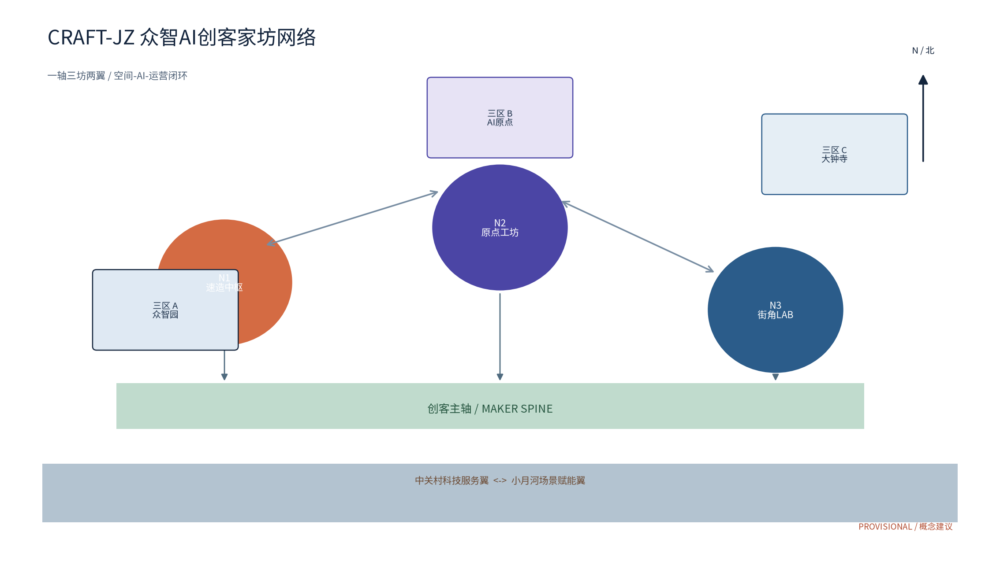
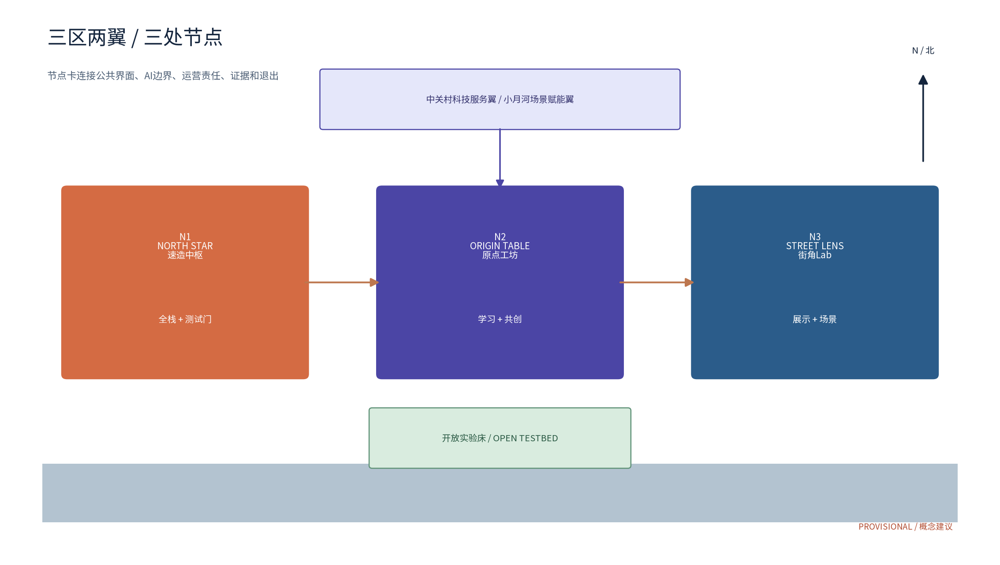
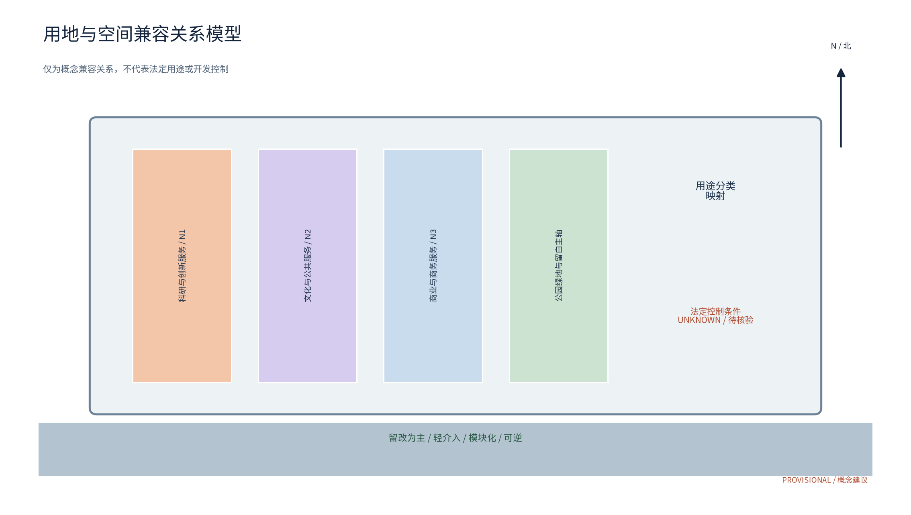
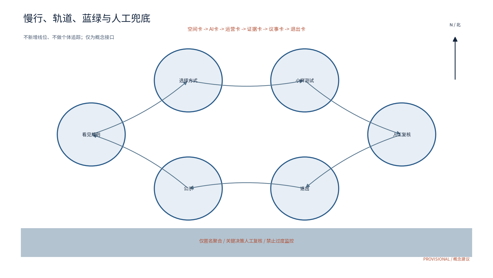
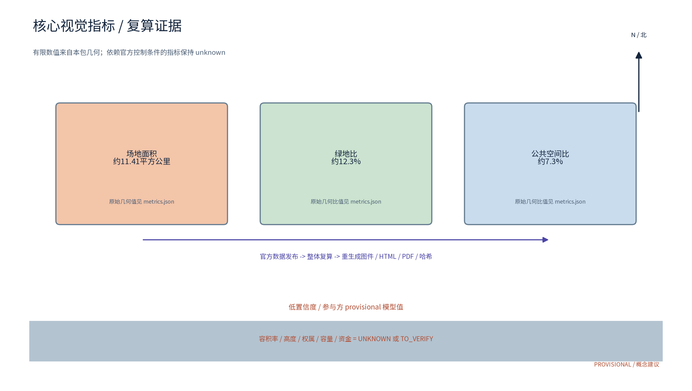

# 众智AI创客家坊网络 CRAFT-JZ

> 概念建议 / 参考方案 / Provisional。面向百年京张AI创新带的AI创客与制造者网络，以「家坊」把研发、学习、测试、展示和运营串成可复核的城市服务。本文不替代正式规划、控规、审批、采购、合作协议或运营承诺；所有空间落位、权属、容量、资金、产业规模和效果均须由有权主体与专业团队核验。

## 设计依据与资料清单

[source:SRC-TASKBOOK] [standard:PROJECT-OFFICIAL-ANNOUNCEMENT]

方案以公开、可追溯、清权资料为起点，首先遵循组织方项目公告与任务书提出的百年京张文化带、都市AI生活体验带、AI融合创新带三大定位，以及AI全栈自主创新体系、世界级AI创新生态、AI+场景赋能新范式、智能化AI活力城市、AI治理全球话语权五大功能。补充参照京张铁路历史公开史料、中关村创新文化公开史料、住建领域城市设计与控规公开规范、国土空间用途分类公开指南、生成式人工智能治理公开规范和无障碍环境建设公开法规。资料只用于概念推演、机制对照和合规提醒，不把外部案例的规模、投资、绩效或品牌权益移植为本地事实。

资料分级如下：A1为项目公告与任务书，作为任务边界；A2为法律法规和部委公开规范，作为风险与设计深度参照；B1为案例机构公开页面，作为机制灵感；C1为本包自绘几何、图件和文字，作为参与方概念资产；D1为待核验项，包括官方红线、土地权属、文保边界、消防、道路、轨道、市政容量、运营基线、预算、合作、审批和资金。所有D1内容在正文、assumptions.json、sources.json与图件中以 provisional、unknown 或 to_verify 明示，官方资料发布后按同一公式复算并留版本记录。

## 三层范围工作框架

[depth:three_level_scope_framework] [data:geometry/site_boundary.geojson#provisional]

L1统筹研究范围研究“网络为什么成立”：以海淀AI创新带为主语，联系中关村科技服务翼与小月河场景赋能翼，观察人才、算力、数据、空间、产业和公共服务的接口；与北纬社区、未来科学城、怀柔科学城、经开区及京津冀只设协同接口，不宣称已建立合作。L1的成果是产业支撑图谱、开放实验床规则、文化叙事和年度运营框架。

L2总体设计范围研究“网络如何被看见”：以参与方 provisional 工作边界和三处重点区为载体，形成一轴三坊两翼的结构模型。创客主轴连接京张遗址公园语境、节点公共界面和慢行体验，三区承担不同产业与生活角色，两翼提供服务与场景接口。L2只表达空间关系、可逆组件和分期条件，不给法定用地、红线、强度或工程结论。

L3重点区域详细设计研究“网络如何被使用”：在众智园AI自主创新加速区设置N1速造中枢，在AI原点社区设置N2原点工坊，在大钟寺AI产业集聚区设置N3街角Lab；沿小月河方向设置开放实验床测试走廊。每个节点由空间卡、服务卡、责任卡、风险卡和退出卡组成，并用S01-S12场景卡与T01-T04产业测试协议连接空间、AI和运营。

## 统筹研究范围产业与未来城市研究

[source:SRC-TASKBOOK] [depth:existing_conditions_diagnosis]

三大定位在本方案中不是平行口号，而是三条可交换的价值链。百年京张文化带负责记忆、公共叙事和历史真实性；都市AI生活体验带负责把复杂AI转成可理解、可退出的日常服务；AI融合创新带负责将开发者、制造者、研究者、企业和社区的能力放进真实但低风险的测试场。三区两翼由“要素到空间、空间到场景、场景到证据、证据回到产业”形成协同回路。

产业支撑采用“六要素五关口”。六要素为土地与存量空间、可用算力、合规数据、人才与导师、测试场景、转化与传播；五关口为需求登记、资格与安全审查、低风险原型、人工复核评估、成果备案与退出。N1承担工具链和制造安全基础，N2承担青年学习和社区共创，N3承担可理解展示与商业服务试验；中关村科技服务翼提供知识产权、法律、供应链和资本对接的待核验接口，小月河场景赋能翼承接公众体验、慢行和开放实验床。任何合作、招商、资助、算力供给、企业入驻和运营主体均须签署书面协议后才可发生。

## 总体设计范围城市更新与控规深度城市设计

[standard:MOHURD-URBAN-DESIGN-MEASURES] [depth:overall_spatial_structure]

总体概念命名为“CRAFT-JZ 众智AI创客家坊网络”。“CRAFT”强调把模型、硬件、知识和公共服务做成可交付原型，“JZ”只作为百年京张语境下的工作识别，不冒充组织方或既有城市品牌。视觉识别采用自绘四格“间”字模数：四个开口代表旗舰家坊、社区工坊、街角Lab和开放实验床，陶土橙表示造物，钢轨蓝表示记忆，AI靛表示协作。当前投稿资产已在 report/copyright_statement.md 逐项登记：正文与图件由本包作者制作，PDF与HTML使用带 SIL OFL 1.1 许可的 Noto Sans SC；CRAFT-JZ 仅为本包工作识别名，未来商标检索与外部品牌授权仍待核验。

空间结构为“一轴三坊两翼”：一轴是可步行、可解释、可回撤的创客体验主轴；三坊为N1速造中枢、N2原点工坊、N3街角Lab；两翼为中关村科技服务翼和小月河场景赋能翼。更新优先采用存量空间、轻介入、模块化、可拆卸、可维护组件，不改变文保、绿地、蓝线、交通安全或消防要求。图件中的边界、道路和节点均是参与方概念模型，不能作为红线、建筑高度、容积率、拆改留、桥隧、地下空间或市政工程结论。

## 重点区域详细设计

[data:geometry/key_areas.geojson#provisional] [depth:three_key_area_detailed_design]

N1速造中枢是网络的制造者入口：建议由公开前厅、材料与工具借用台、低风险原型间、观察窗、人工安全台和后场维护区构成。其关键不是堆设备，而是建立“申请-培训-试做-复核-备案-撤回”的制造闭环。N1优先承接开源硬件、城市服务原型、无障碍辅助器具和展陈组件的小样测试，涉及高风险设备、危险材料或结构改造的内容不在本概念范围内。

N2原点工坊是社区与人才入口：建议设置安静学习室、可移动共创桌、亲子与老年友好角、手工和数字工具转换台、意见通道与小型荣誉墙。N2以低门槛、纸面和人工替代为默认，承接学生、青年开发者、居民、照护者、残障及神经多样性参与者的共创。贡献可通过用户自愿选择公开的成果卡记录，不以个人排名、画像或持续追踪换取服务。

N3街角Lab是城市可感知的展示与产业入口：建议设置街道侧成果橱窗、可理解AI体验桌、商户协作台、双语导视、纸面退出卡和夜间可关闭界面。N3只进行经审查的低风险演示与消费服务原型，不把商业合作或客流效果写成既成事实。三节点由一条可步行体验路径和一条数据最小化的运营证据链连接，路径可在审批、权属、交通或安全条件变化时撤回。

## AI 创新生态、人才画像与 AI+ 场景

[source:SRC-C01] [depth:blue_green_public_space]

五大功能在网络中分别落位：F1全栈原型工具链在N1，F2开放测试和人工门槛在N1与实验床，F3学习与包容共创在N2，F4公共展示与可理解AI在N3及京张文化界面，F5年度运营、证据和可逆退出由两翼联动。AI贯穿产业、空间、交通、公共服务、文化和治理六域，但治理三句式固定为：仅匿名聚合；关键决策人工复核；禁止过度监控。所有AI服务都有非AI、纸面、人工和退出路径。

六类画像为P01高校学生开发者、P02早期创客与小微团队、P03产业工程师、P04社区居民与照护者、P05老年或低数字素养使用者、P06残障、神经多样性或语言障碍使用者。全球机制参照只选用公开页面且不迁移事实：Fab Lab分布式学习、Station F社区化服务、Hacker Dojo成员治理、BLOCK71高校创业接口；Chaihuo与2050仅作为待核验研究线索，不进入正式事实结论。

场景卡字段统一为输入与同意、最小数据、模型或规则版本、人工门、输出解释、责任主体、指标与基线、停止与退出、申诉与删除。12张场景卡如下：

| ID | 场景与空间 | 使用者 / 运营 | AI边界与人工门 | 可记录指标 |
|---|---|---|---|---|
| S01 | N1工位预约 | P01-P03 / 运营 | 仅排班建议，人工确认 | 预约完成率、取消率 |
| S02 | N1设备共享调度 | P02-P03 / 运营与志愿者 | 只读设备台账，不做人画像 | 准时率、故障闭环时长 |
| S03 | N1材料安全清单 | P01-P03 / 安全责任人 | 规则提醒，不代替安全审查 | 培训完成率、异常停用数 |
| S04 | N2课程路径推荐 | P01-P06 / 高校与运营 | 用户主动选择，人工可改 | 课程完成率、退出率 |
| S05 | N2导师匹配 | P01-P03 / 开发者联盟 | 标签由用户自填，可撤回 | 响应时长、满意度 |
| S06 | N2无障碍体验路线 | P05-P06 / 人工服务台 | AI仅给备选，人工确认可达性 | 反馈闭环率、人工转接率 |
| S07 | N2双语历史讲解 | 游客与居民 / 志愿者 | 内容先经编辑，不生成历史事实 | 讲解完成率、纠错数 |
| S08 | N3成果展示编排 | P02-P04 / 运营 | 点击仅匿名聚合，人工排期 | 展示轮换次数、纠错数 |
| S09 | N3商户库存体验 | 居民与游客 / 商户 | 仅自愿输入，不读个人轨迹 | 体验完成率、退出率 |
| S10 | 全网匿名反馈摘要 | 全部用户 / 运营与居民议事 | 去标识聚合，人工发布 | 反馈量、处理时长 |
| S11 | 实验床运行提示 | 测试团队 / 技术与安全 | 异常即停，广播而非识别 | 告警响应、停用次数 |
| S12 | 活动志愿协同 | 志愿者 / 志愿联盟 | 自愿报名，人工排班 | 到岗率、投诉闭环率 |

产业测试协议不少于三项：T01模型与服务基准协议，使用合成或明确授权的去标识数据，对准确性、误报率、可解释性、人工接管率做版本化测试；T02数据质量与误差分群协议，按来源、缺失、时效、代表性和误差分群分级，发现偏差即暂停，不得以个人敏感属性做推断；T03开放实验床驻场运行协议，先做安全、隐私、无障碍和消防核验，设值守、告警、回滚、日志保留、申诉和撤场条件；T04制造原型可逆性协议，检查材料、工具、儿童与公众隔离、维护和拆除路径，任何未完成培训或风险升高即停止。协议都是建议文本，不等于测试许可或运营批准。

空间-AI-运营闭环为“空间卡定义可进入的范围 -> AI卡说明最小服务与人工门 -> 运营卡规定排班、培训、公示和申诉 -> 证据卡记录聚合指标与异常 -> 议事卡按月复盘、按年公示 -> 退出卡在风险、权属、资金或基线变化时停用并恢复可核验状态”。该闭环把空间不是静态容器，而是可审计、可调整、可退出的公共基础设施。

## 用地、建筑规模与拆改留方案

[standard:MNR-LAND-USE-CLASSIFICATION-GUIDE] [data:geometry/land_use.geojson#concept]

用地表达采用公开用途分类的概念映射，仅用于说明空间兼容关系：科研和创新服务承接N1，文化与公共服务承接N2及京张叙事，商业与商务服务承接N3，公园绿地、防护绿地、交通场站和留白用地承接主轴与公共界面。参与方几何只提供场地、绿地和公共空间的模型分区，不代表现状调查、权属或法定用途。site_area_sqm、green_ratio和public_space_ratio为由GeoJSON复算出的有限数值，但为低置信度 provisional 模型值；官方边界、绿线、公共开放条件和权属资料发布后按同一公式重算。

建筑与更新策略以留改为主、局部可逆：保留可识别的历史语境和公共绿地骨架，优先利用现状室内空间，以轻型隔断、可折展台、移动家具、可拆设备和可复用标识形成家坊。对拆改、加建、结构、消防、能源、机房、容量、投资和工程量不作结论；任何具体动作须由权属人、设计单位、主管部门和安全审查主体在现场核验后决定。空间卡必须带有状态标签：可用、待核验、仅展示、暂停或撤回。

## 交通、轨道、市政与公共服务设施

[standard:STD-ACCESSIBILITY] [depth:traffic_rail_slow_parking]

交通策略是慢行优先、轨道接驳、人工兜底。主轴作为概念体验线连接三节点和两翼接口，沿线通过轨道站点、步行、骑行与无障碍连续路径形成可选择的到达方式；不画新的轨道线位、道路红线、桥隧或地下工程。活动日仅建议采用预约分时、人工引导、广播提醒和临时排队，不用人脸、蓝牙或个体轨迹识别。交通与安全方案须以现状路权、站点条件、应急疏散和专业审查为准。

市政与公共服务采用轻量接口：共享电源和数据坞、纸面信息牌、可拆展陈、饮水与休息点、人工咨询台、无障碍导视和儿童友好角。算力、带宽、能源负荷、管网容量、消防等级和设备接入均 unknown，不能以概念图当作设计条件。公共服务承诺不是“全自动”，而是所有关键服务都有人工入口、简单说明、投诉与撤回通道；居民意见通道每月汇总，年度成绩公示并保留对不准确摘要的纠错窗口。

## 蓝绿空间、公共空间与城市风貌

[data:geometry/green_space.geojson#provisional] [depth:blue_green_public_space]

蓝绿空间采用“绿带为轴、家坊为珠、公共界面可解释”的策略。以参与方模型中的绿地与公共空间作为初步证据，不把它们当作官方绿线或开放边界；正式落位前须复核文保、公园、生态、消防和交通条件。公共空间组件库包含可逆展架、共享工具墙、临时路演台、双语导视、纸面退出卡、儿童友好座椅、适老休息点、无障碍触达界面和夜间可关闭照明。组件按公约、预约、轮换和维护台账管理。

风貌叙事采用三段步行故事：第一段“铁轨记忆”讲述京张铁路作为近代工程与公共记忆的历史线索，事实表述以可核验来源为准；第二段“中关村造物”讲述开放知识、工程实践和问题导向的创新文化，不挪用企业标志；第三段“AI共创日常”展示模型、工具和公共服务如何被人理解、纠错和退出。导视系统与CRAFT-JZ整体Logo分层使用，文化符号不混入官方品牌；本包已嵌入的图像、图件、字体和文字均按权利台账登记，人物、第三方商标与历史图片未嵌入；未来新增资产仍须先完成授权或使用自产替代。

## 更新项目清单、实施政策与分期计划

[depth:phasing_implementation] [data:geometry/phasing.geojson#concept]

项目清单分为四类：空间类包括N1速造中枢、N2原点工坊、N3街角Lab和实验床走廊的可逆改造研究；机制类包括「坊约公约」「造物积分」「轮值议事」「实验备案分级」「一键退出卡」；服务类包括开发者社区、居民意见通道、无障碍人工服务和年度蓝皮书；传播类包括家坊开放日、切磋会、成果卡和国际双语传播。合作、资金、审批、运营主体、场地使用与品牌授权都列为待核验事项，不写成已确定安排。

分期遵循“先规则、再小测、后扩展”：P0近期1-3年，先在N1和N2做纸面、合成数据、低风险原型与人工服务演练，建立安全、隐私、无障碍和权利台账；P1中期3-5年，若P0通过独立复核与公众反馈，再提出一个节点和一个场景的有限测试申请，按季度复盘；P2远期5-10年，只有在权属、审批、资金、运营基线和效果证据均明确时，才讨论网络化扩展。年度活动如春季创客开放日、夏季家坊切磋、秋季实验床复核、冬季年度公示均为建议排期。

| 阶段 | 触发条件 | 牵头与参与 | 交付与指标 | 退出条件 |
|---|---|---|---|---|
| P0 近期1-3年 | 资料公开、场地意向待核验 | 专业团队、社区、运营候选、高校 | 规则草案、人工服务演练、S01-S04基线 | 权属或安全未核验即不进场 |
| P1 中期3-5年 | P0复核通过且取得书面许可 | 有权主体、运营方、企业、高校、居民 | T01-T04小样、月度议事、季度复核 | 误报、投诉、无障碍缺口未闭环即暂停 |
| P2 远期5-10年 | 运营基线和资金安排公开 | 联盟化协作主体、专业团队、公众 | 网络化扩展建议、年度成绩公示 | 预算、合作或审批不成立即回到P0 |

## 指标体系、面积复算与合规矩阵

[metric:site_area_sqm] [metric:green_ratio] [metric:public_space_ratio]

三项核心视觉指标必须来自本包几何并可重算：site_area_sqm = site_boundary投影面积；green_ratio = green_space与site_boundary的并集面积 / site_boundary面积；public_space_ratio = public_space与site_boundary的并集面积 / site_boundary面积。面向人的显示采用约数：约11.41平方公里、约12.3%和约7.3%；metrics.json保留几何复算原值、来源、公式、置信度、假设和复算触发条件，visual/index.html的 data-value 与原值一致。三项均为参与方 provisional 模型值，不是官方面积、红线或现状统计。FAR、建筑高度、用地权属、运营基线、投资和容量维持 unknown/null，因为官方控制条件或基线未提供。

合规矩阵把公告边界、三大定位、五大功能、三区两翼、三层范围和agent.1-agent.6逐条映射到正文、图件、几何、指标、来源和假设。自检不等于官方认定；四门结果只说明本地文件结构、空间拓扑、视觉交付和专业证据是否可复核。提交前运行严格验证、schema、字体覆盖、视觉关键词、PDF文本与页数、manifest哈希核对；任何一个失败都保持 DRAFT，修复后再重跑并写审计。

## 风险、版权与合规说明

[standard:STD-PUBLIC-COMPLIANCE] [source:SRC-ACCESSIBILITY]

本包的官方边界、合作、审批、资金、权属、商标和现实数据按四级标注：verified 仅限来源页面或任务书实际写明的范围；provisional 仅表示参与方概念模型；to_verify 表示需要主管主体、权属人、专业单位或公众复核；unknown 表示当前没有可靠基线。概念建议、活动设想、政策机制、产业接口、资金路径、合作对象和运营成效都不写成已批准、已签约、已拨付、已入驻或已建成。不采集个人身份数据、受限材料、未经确认的空间图形或个体识别式监控；AI只做匿名聚合，关键决策人工复核，禁止过度监控。

风险处置采用“发现-停用-告知-复核-退出”：安全、隐私、偏差、版权、文保、无障碍、权属、预算或投诉达到停止条件时，运营方立即切换人工或纸面服务，保留最小审计记录，向受影响参与者告知，交由独立复核，并撤下或回滚相关原型。权利台账覆盖正文、英文翻译、四份PDF、七组双语图件（14个图像文件）、HTML、几何、字体、来源记录和生成方法；自绘材料由本包作者创作，第三方来源只作引用或机制参照，未授权Logo、人物、图片、字体和论文图像不嵌入。CRAFT-JZ为工作识别名，商标可用性未确认，正式传播前须完成检索、权利清理和人工批准。

## 参考资料

[source:SRC-OFFICIAL-ANNOUNCEMENT] [source:SRC-TASKBOOK]

本包来源以sources.json为准，等级、发布者、URL、访问时间、许可、用途和限制均已登记。核心来源包括：组织方项目公告与AI创新带任务书；京张铁路与遗址公园公开历史资料；中关村创新文化公开史料；城市设计管理、控规编制、国土空间用途分类、生成式人工智能治理、无障碍环境建设等公开规范；Fab Foundation、Station F、Hacker Dojo、NUS Enterprise BLOCK71四个可核验案例页面。Chaihuo与2050相关条目保留为待核验研究线索，不作为正式事实证据。来源只支持边界、机制或历史叙事的相应范围，不支持本地合作、投资、规模、客流、效果、商标或审批结论。

附：agent.1总体概念与功能统筹对应§2-§5；agent.2 AI全栈生态与产业支撑对应§4和§6；agent.3 AI+场景、画像、协议和人工边界对应§6；agent.4公共空间、智能原生业态和三处朝圣地标（N1“NORTH STAR”、N2“ORIGIN TABLE”、N3“STREET LENS”）对应§5和§9；agent.5京张、中关村与AI新文化叙事对应§1和§9；agent.6年度活动、开发者社区、开放运营与转化路径对应§10。六项均为概念建议，均由矩阵、图件、HTML和权利台账交叉指向。
# Review closure addendum — mechanism, spatial-operation cards, and rights boundary

## 全球机制案例（仅作机制参照）

以下案例均为公开页面，访问日期为 2026-08-29；它们不证明海淀合作、审批、资金、容量、需求或绩效。转译边界是“借鉴机制、重新设计本地流程”，不复制 Logo、界面、商标、图像或运营承诺。

|案例|URL / 访问日期|许可与可用范围|转译机制|边界|
|---|---|---|---|---|
|Fab Foundation / Fab Lab Network|https://fabfoundation.org/schools/；2026-08-29|公开网页，按发布者条款引用；不嵌图|分布式学习、共享设备、导师网络|不迁移规模、会员或本地合作|
|Station F|https://stationf.co/campus；2026-08-29|公开网页，按发布者条款引用；不嵌图|创业服务组合与社区运营|不迁移租赁、投资或容量|
|BLOCK71 Singapore|https://enterprise.nus.edu.sg/innovation/block71/；2026-08-29|公开机构页面，引用机制；不嵌品牌|高校—创业接口与空间共用|不宣称 NUS 合作或投资|
|AI Verify Foundation|https://aiverifyfoundation.sg/；2026-08-29|公开机构页面，引用机制；不称认证完成|可审计测试、风险记录、人工复核|不作为海淀合规证明|
|NIST AI RMF|https://www.nist.gov/itl/ai-risk-management-framework；2026-08-29|公开标准页面，按 NIST 条款引用|Govern—Map—Measure—Manage 风险闭环|不替代中国法定审查|
|Barcelona Digital City|https://ajuntament.barcelona.cat/digital/en；2026-08-29|政府公开页面，引用政策机制；不复制资产|公共数字基础设施与市民权利|不迁移政策成效或授权|
|Amsterdam Smart City|https://amsterdamsmartcity.com/；2026-08-29|公开平台页面，引用机制；不嵌素材|跨组织问题发布、试验与反馈|不宣称合作、资金或绩效|

## 双向空间缝合策略

东西缝合由“中关村科技服务翼—N1/N2创客主轴—小月河场景赋能翼”组成：西侧提供知识产权、法律、供应链和产业问题入口；中部把问题转成可制造原型，经过安全门和人工复核；东侧以公众场景、意见反馈和失败退出记录回流。南北贯通由“轨道接驳—慢行连续—蓝绿公共界面”组成：N1、N2、N3各设置可见入口、人工值守、无障碍替代路径和月度议事点；具体站点、断面、容量和红线在官方资料提供前均为 unknown/to_verify。

## N1/N2/N3 双语空间—运营卡

|卡片|空间 Space|运营 Operating|数据与边界 Data / boundary|
|---|---|---|---|
|N1 速造中枢 / Speed-Making Nexus|工具共享、原型工位、测试门；面积、设备数、日承载量：unknown|预约→安全培训→原型→人工复核→退出；责任接口：待核验|只收最小必要、匿名聚合；真实部署授权：unknown|
|N2 原点工坊 / Origin Workshop|学习桌、居民共创、人工服务台；座席、无障碍覆盖率、活动容量：unknown|公开课→共创议事→低保真试验→公众反馈→月度公示；合作主体：to_verify|不以参与记录作个体画像；投诉与线下替代服务保留|
|N3 街角Lab / Street Lab|街角展示、可逆设施、场景观察点；面积、客流、维护能力：unknown|展示→限时测试→人工接管→事件复盘→撤除；场地许可：to_verify|不作执法或审批判断；影像、定位和保存期限：unknown|

三卡共享停止条件：安全、无障碍、隐私或公众投诉阈值未满足即暂停；任何容量、需求、预算、合作、审批和运营成效在本包中不作既成事实表述。
