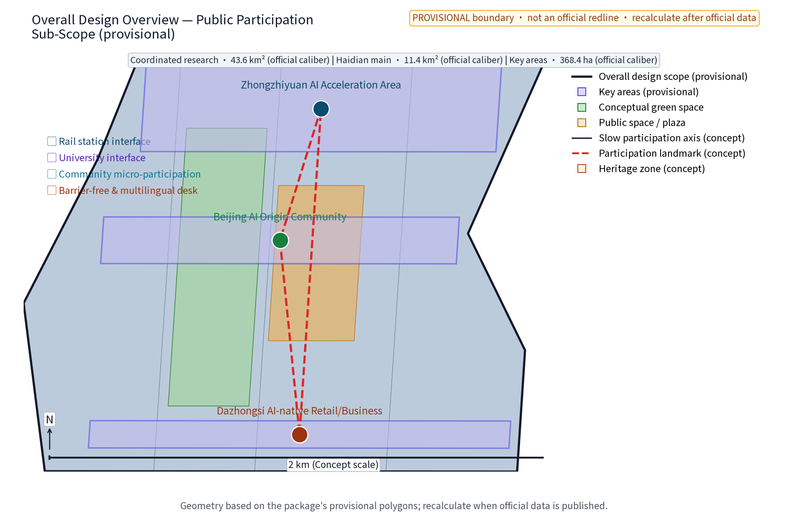
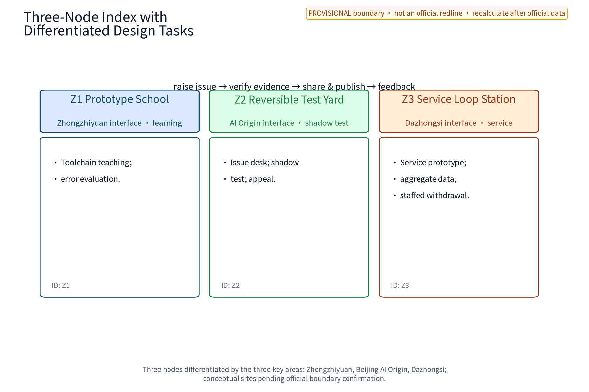
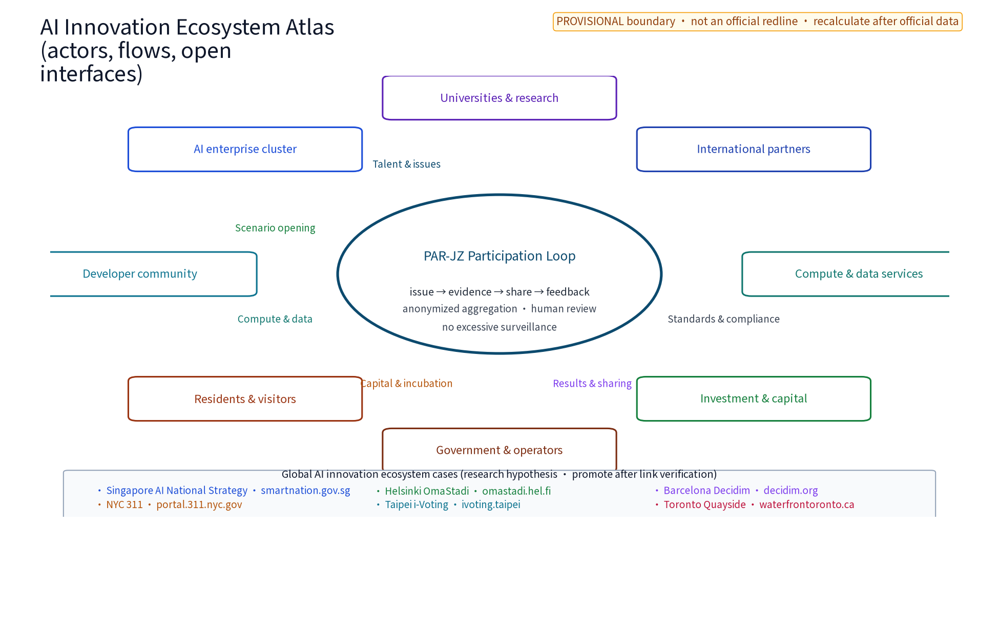
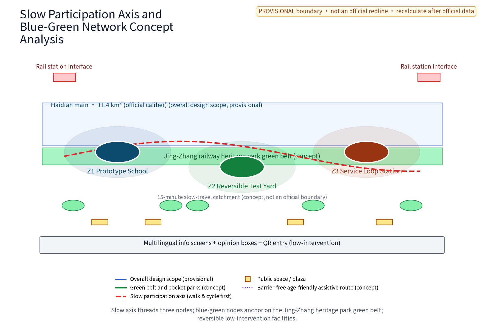
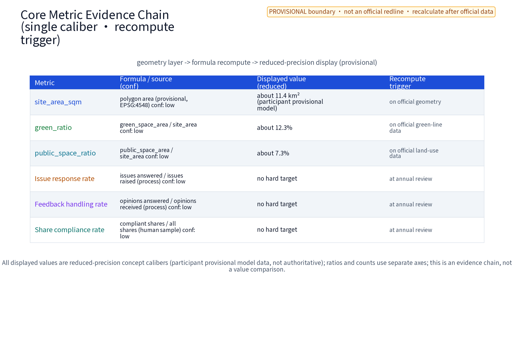
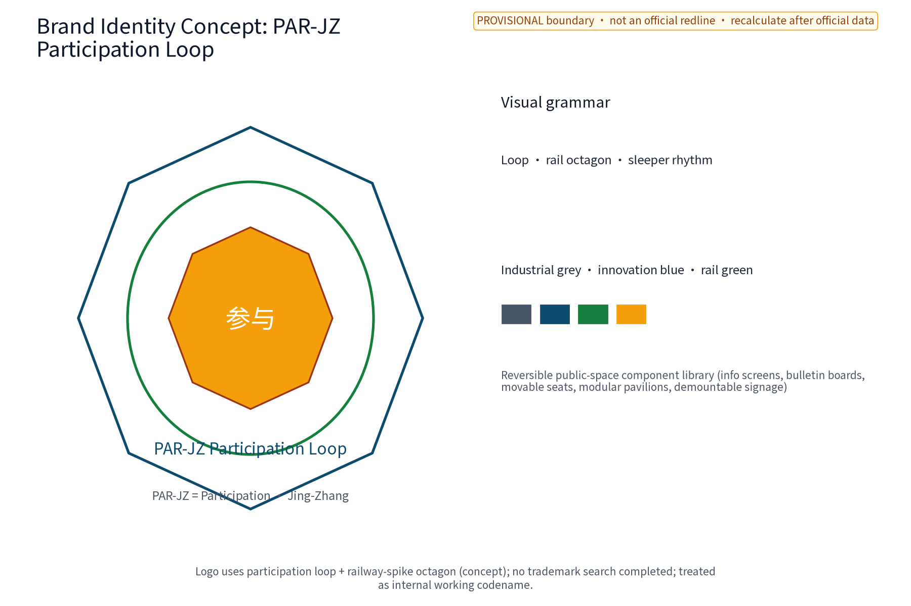

# PAR·JZ Participation Loop

**Chinese name: 京张参与智环**. PAR·JZ (Participation · Jing-Zhang) is the sole primary brand in this package; it is not an existing enterprise or government mark. It proposes a public prototype chain—learn, make, shadow-test, review, archive and return knowledge. AI learning, reversible public-space components, neighborhood services and industry testing become a visible network that people can pause and withdraw. It is neither a maker-park investment plan nor an approved construction plan: all locations, values and operations are concept advice pending official data, field survey and professional review. [source:AGENT-TASKBOOK]

## Design Basis and Source List

This package uses the taskbook, public standards and participant-authored geometry/graphics only. `sources.json` registers each source. The announcement and taskbook define scope; planning, land-use, AI-governance and accessibility materials are method references. Global cases are `research_hypothesis` only and do not prove investment, performance or partnership. Existing buildings, tenure, heritage lines, station entrances, operating capacity and statutory controls are `unknown/to_verify`.

The naming system is PAR·JZ Participation Loop; Z1, Z2 and Z3 are spatial nodes under this one brand, not sub-brands: Z1 Prototype School, Z2 Reversible Test Yard and Z3 Service Loop Station. They interface respectively with Zhongzhiyuan AI Acceleration Area, Beijing AI Origin Community and Dazhongsi AI Industry Cluster. The logo concept uses an opening square and Jing-Zhang sleeper rhythm to express demountable modules. It does not use any existing enterprise or government mark; trademark and prior-rights checks remain to_verify. [source:PACKAGE-GEOMETRY]

## Three-Level Scope Framework

The official announcement caliber is used as a working frame: coordinated research area about 43.6 km2, overall design area about 11.4 km2 and key areas about 368.4 ha. This package does not assert these as a self-confirmed redline. The coordinated tier asks which public issues merit prototypes; the overall tier lays out a green belt, slow-mobility and prototype chain; the key tier details three concept anchors and one test corridor. All geometry is a participant provisional model and must be recomputed when official polygons arrive.

| Tier | Spatial object | Deliverable and boundary |
| --- | --- | --- |
| Coordinated research | Regional collaboration, talent, scenario and element interfaces along the Jing-Zhang AI belt | Issue pool, interfaces and case hypotheses; no industry scale or investment promise |
| Overall design | Green belt, slow-mobility chain and three public prototype nodes within the working area | Spatial structure, component family, service workflow and recomputable metrics; regulatory controls only as checks |
| Key areas | Concept Z1/Z2/Z3 and Xiaoyuehe test corridor within the working key-area frame | Node relations, scenario cards and protocols; siting requires survey, tenure, heritage, accessibility and public review |

The three positionings are the Centennial Jing-Zhang Culture Belt (memory and new learning), Metropolitan AI Life Experience Belt (everyday prototype services) and AI-Integrated Innovation Belt (public issues as test inputs). The five functions map to: full-stack AI innovation (Z1 toolchain and model evaluation), world-class AI ecosystem (open knowledge exchange), AI+ scenario enablement (Z2 shadow tests), smart AI vitality city (Z3 daily services), and global AI governance voice (publication, review and withdrawal evidence).

## Coordinated Research Area: Industry and Future City Research

PAR·JZ links industry, space and public value through an issue–prototype–evidence–reuse chain, rather than attaching an AI label to a conventional park. Eight element interfaces are explicit: land/space provides reversible containers; industry provides needs and maintenance capacity; capital is a potential resource to verify; talent includes students, engineers, residents, caregivers and operators; compute is a resource interface to verify; data is public or authorized anonymized aggregation only; scenarios use the three nodes and test corridor; knowledge returns through versioned archives. No enterprise, financing, output, compute scale or supplier is asserted.

Internal three areas and two wings are separate from external coordination:

| Internal taskbook unit | Concept mechanism and spatial interface |
| --- | --- |
| AI Origin Community | Z2 receives community issues, offers low-threshold learning, shadow testing, staffed service and offline records; no existing operating site is claimed |
| Zhongzhiyuan AI Autonomous Innovation Acceleration Area | Z1 offers model evaluation, toolchain teaching, developer workbench and reversible exhibition; no tenancy or incubation result is promised |
| Dazhongsi AI Industry Cluster | Z3 places small AI service prototypes on daily commercial/service routes with aggregate-only data and human opt-out; no private property is altered |
| Zhongguancun Technology-Service Wing | Concept referral interface for IP, capital, talent, compute and data; every cooperation status is to_verify |
| Xiaoyuehe Scenario-Enablement Wing | Low-impact shadow-test corridor, slow experience and public-service loop; no road or engineering cross-section is fixed |

External interfaces are research exchange only: Beiwei for community issues, Future and Huairou Science Cities for university/research issues, E-town for test methods, and Jing-Jin-Ji for public knowledge exchange. They are not construction areas, partnerships or investment commitments. [source:AGENT-TASKBOOK]

## Overall Design Area: Urban Renewal and Regulatory-Plan-Level Urban Design

The structure is one learn–test–return spine, three prototype anchors, two interfaces and four reversible component types. Along the Jing-Zhang heritage-park green belt, Z1→Z2→Z3 moves from professional learning to everyday experience; the Xiaoyuehe corridor is a low-impact shadow-test band. The technology-service wing routes knowledge and elements; the scenario wing routes prototypes into public experience. East–west stitching links station/university, heritage park, and neighborhood/industry; north–south continuity uses accessible slow spurs, crossing prompts and offline service points. These are concept strategies, not alignments or engineering conclusions.

Renewal follows retain–renovate–remove, with retention first: use existing space and mobile components before new construction, preserving heritage-park fabric and railway relics. Demolition, bridges, tunnels, underground works, road redlines, energy loads, municipal capacity, FAR and height are not concluded; they are `unknown/to_verify`. Each prototype must be removable within 30 days to a no-AI safe state, with a withdrawal note retained.

## Detailed Design of Key Areas

The three nodes are concept locations, not official place names or existing conditions:

| Node | Spatial sequence | Public and industry interface | Boundary |
| --- | --- | --- | --- |
| Z1 Prototype School (Zhongzhiyuan concept interface) | Entry panel–small class tables–model evaluation desk–version archive wall | Students and engineers see input/output/error examples; knowledge routes to the service wing | No claim of tenure, equipment, enterprise or compute |
| Z2 Reversible Test Yard (AI Origin concept interface) | Community issue desk–shadow test area–staffed review desk–offline return box | Residents try services in simulation; community can pause and see why | No individual trajectory; a test is not deployment |
| Z3 Service Loop Station (Dazhongsi concept interface) | Daily inquiry desk–business/service prototype window–public screen–withdrawal box | Visitors, merchants and workers try translation, queue and guide prototypes with opt-out | No merchant alteration, visitor or business result claim |

The three nodes use one reviewable grammar for plan, section and journey. In plan, Z1 is entry sign–learning tables–evaluation desk–version wall; Z2 is an exitable loop of issue desk–shadow area–human gate–paper return; Z3 is a public frontage of inquiry desk–service window–public face–withdrawal box. In section, each keeps an accessible passage, resting edge, low information interface and staffed position; demountable equipment must not block evacuation, heritage sightlines or daily rest. Exact levels, loads, fire, utilities and capacity remain unknown/to_verify. The journey is: raise an issue → choose paper, phone or digital entry → read data use → receive an AI draft, never a decision → pass the human gate → join a small shadow test → receive a versioned receipt → publish, appeal or withdraw → return feedback to the next round. Each state has an owner, timestamp and exit route; nothing reaches publication without human review.

| Node | Plan and spatial boundary | Section/interface | Journey deliverable |
| --- | --- | --- | --- |
| Z1 Prototype School | Entry–learning–evaluation–archive sequence; concept functional boundary only | Information board–passage–learning table–mentor position; demountable equipment | Learner submits sample, mentor explains, engineer reproduces, steward archives |
| Z2 Reversible Test Yard | Issue desk–shadow zone–human gate–paper return loop | Passage separated from test face, with human bypass | Resident submits need, community reviews, tries/pauses, appeals or exits |
| Z3 Service Loop Station | Inquiry–service–public–withdrawal frontage | Information and passage faces separated; no personal data displayed | Visitor chooses service, duty staff reviews, tries, opts out and feeds back |

Components are demountable signs, bilingual information boards, movable seats, shade/rain boxes, paper issue boxes and low-power display frames. Each has an ID, owner, maintenance date and withdrawal status. The honor display shows only authorized prototype versions, learning contributions and review records; it does not rank income or traffic.

## AI Innovation Ecosystem, Personas, and AI+ Scenarios

### Verifiable global AI ecosystem mechanism cases

| Case | Direct source and visible evidence | Mechanism borrowed | Reuse boundary |
| --- | --- | --- | --- |
| Fab Labs Network | `SRC-GLOBAL-FABLABS`: official homepage title Welcome \| FabLabs, accessed 2026-08-29 | Distributed prototyping spaces and knowledge sharing | No local membership, funding or partnership claim |
| STATION F | `SRC-GLOBAL-STATIONF`: official homepage title STATION F, accessed 2026-08-29 | Shared innovation space, programmes and service interface | No tenancy, investment or performance transfer claim |
| Hacker Dojo | `SRC-GLOBAL-HACKERDOJO`: official homepage title Hacker Dojo - Connect to Silicon Valley, accessed 2026-08-29 | Member/developer self-organized learning | No community relationship or scale claim |
| Chaihuo | `SRC-GLOBAL-CHAIHUO`: Chaihuo official homepage title 主页 - 柴火创客, accessed 2026-08-29 | Community maker learning and hands-on prototypes | No local authorization or supply-chain partnership claim |
| Arduino Education | `SRC-GLOBAL-ARDUINO-EDUCATION`: Arduino official page title Arduino Education, accessed 2026-08-29 | Open-hardware learning and classroom-to-prototype pathway | No local partnership, product endorsement or performance transfer claim |

These six entries are mechanism research leads, not proof of local partnerships, companies, funding, headcount, output, policy or government commitment. Page title, publisher, access date, publication-date status, evidence position, `review_status`, `usable_for_formal` and license boundary are recorded in `sources.json`.

Six personas are P1 low-digital-literacy and older residents (paper and staff), P2 residents with mobility, visual, hearing or cognitive access needs and caregivers (assisted walk and alternatives), P3 children and student learners (explainable examples and safeguarding), P4 community workers (auditable receipts), P5 engineers/developers (reproducible test packs), and P6 merchants/visitors (short, withdrawable services). Inputs are minimized and aggregate-only; models/rules produce advice, classification or drafts; decisions affecting rights, safety, heritage, accessibility or publication require human review. Unexplainable, untraceable or unauthorized output stops before public display.

### Ten executable scenario cards

| ID | Space/input | Model or rule -> human gate | Output/owner | Metric; stop condition |
| --- | --- | --- | --- | --- |
| S01 | Z1; public issue text and anonymous tags | clustering rule -> mentor review | weekly issue clusters; Z1 operator | explainable-cluster rate; untraceable source stops |
| S02 | Z1; public examples and human labels | version evaluation script -> engineer sign-off | error card and version; professional team | reproducibility rate; leakage or non-reproduction rolls back |
| S03 | Z1; public documents and authorized data dictionary | retrieval/summary rule -> knowledge steward | bilingual learning card; steward | citation completeness; unsupported claim is removed |
| S04 | Z2; paper/online demand category | ranking rule -> community panel | test queue draft; community operator | response-time percentile; high-impact item without review stops |
| S05 | Z2; shadow-test feedback, no auto-action | rule comparison -> accessibility adviser and residents | feedback summary/change order; review panel | minority-view retention; lost dissent pauses |
| S06 | Z2; spatial walk checklist | route rule -> assisted walk | accessibility issue list; site owner | blocking issue count; any blocker withdraws component |
| S07 | Z3; public opening hours and service types | queue/guide rule -> duty staff | non-personal guide; Z3 staff | misleading complaint rate; two repeats stop |
| S08 | Z3; merchant-consented aggregate request | template rule -> merchant/operator dual sign-off | service prototype card; operator | opt-out completion; unauthorized use deletes copy |
| S09 | Spine; public weather/event notice | broadcast rule -> safety officer | slow-mobility reminder and paper substitute | information timeliness; abnormal weather stops recommendation |
| S10 | All nodes; anonymous runtime log | statistics rule -> monthly independent review | public operations report; evaluator | missing-log rate; privacy incident rolls back to offline |

### Three industry test protocols

| Protocol | Sample/baseline/temporary band | Record and owner | Stop, remediation, exit |
| --- | --- | --- | --- |
| P1 Anonymization and data minimization | At least 30 anonymous records monthly; denominator is monthly test records; formal baseline unknown/to_verify; pass = 0 identifying outputs | `record_id`, field list and redaction summary; data steward R, privacy adviser A | One identifying output stops AI, deletes test copy and returns to human intake; two reviews required to restart |
| P2 Human review and reproducibility | ≥10% monthly draft sample; denominator is monthly drafts; baseline unknown/to_verify; pass = ≥90% reproducible and 100% high-impact sign-off | Model/rule version, sample, error class, sign-off and revision diff; engineer R, professional panel A | Below band remediates and rolls back; two consecutive failures withdraw the scenario |
| P3 Accessibility and offline service | One assisted walk per node checking mobility, visual, hearing/cognitive and child-care needs; baseline unknown/to_verify; pass = zero critical blockers and usable paper/staff entry | Walk form, alternative route; photos only with authorization; accessibility adviser R, operator A | Critical blocker seals component for repair; unfixable point exits permanently |

Protocols feed G0/G1/G2 gates only; they are not government acceptance standards. Every card follows intake → anonymization → model/rule draft → human gate → small public/shadow test → recorded feedback → appeal/withdrawal → revision or exit. The model never has final discretion.

## Land Use, Building Scale, and Retain-Renovate-Demolish Strategy

Land use is a concept interface among adaptive existing space, public open space, green/heritage display, learning/service space and test reserve; it does not replace the official classification. FAR, height, density, tenure and plot-level removal remain `unknown/to_verify`. New elements are demountable, mobile and low-impact. Heritage, green/blue lines, fire, traffic and accessibility review is required before implementation.

## Transport, Rail, Municipal Infrastructure, and Public Services

The concept sequence is station–green belt–node–neighborhood, prioritizing walking and cycling. East–west continuity uses the spine; north–south concept spurs connect schools, communities and services. No road, rail, bridge, tunnel, underground, pipe or capacity design is proposed. Service points provide paper forms, telephone, staff assistance, large type, bilingual text and alternative routes; AI recommendations are skippable and public screens show no personal data.

## Blue-Green Network, Public Space, and Urban Character

The heritage-park green belt is the continuous setting. Prototype components step away from relic sightlines and preserve daily rest space; rain, night and accessibility risks use staff and withdrawal controls. Cultural narrative is not technology decoration: railway relics, station memory and community life map to connection, learning and care, carried by timelines, authorized oral-history cards and bilingual guides. Use boundaries are verified sources, authorized portraits and `research_hypothesis` labels for unverified material. Concept communication copy: “Prototype in public, decide with people, leave a trace of learning.”

## Renewal Projects, Implementation Policy, and Phasing

| Phase | Minimum delivery | Roles and dependencies | Gate/evidence |
| --- | --- | --- | --- |
| Near 1–3 years | Z1/Z2 shadow tests, paper entry, first three protocols, component ledger | operator R; professional team A; needs anonymous sample frame and site survey | G0: privacy, human-gate and accessibility lists complete; any failure blocks public trial |
| Mid 3–5 years | Small opening of three nodes, Z3 service prototype, bilingual archive and annual review | operator R; professional/accessibility teams A; needs G0, tenure and heritage checks | G1: P1–P3 temporary bands pass; failure remediates to G0 |
| Long 5–10 years | Public knowledge base, regional method exchange, reusable components and annual brand | alliance/evaluator R; authority A; needs official data and two consecutive reviews | G2: expand only after two annual passes; major incident exits |

RACI: the operator owns intake, logs and maintenance; professional teams own spatial, heritage, transport and AI review; communities, schools and merchants consult and test; an independent panel handles appeals; the competent authority retains final approval. Open learning days, prototype review weeks, public-service demos and annual archive releases are concept events, not fixed government schedules. Long-term operation relies on learner–developer–community–maintainer rotation, public versions, annual audit, component reuse and exit notices, not unpromised investment.

## Metrics, Area Recalculation, and Compliance Matrix

The three formal visual metrics are recomputed from this package geometry; human-facing surfaces show “about 11.4 km2 (participant provisional model)”, “about 12.3%” and “about 7.3%”. Exact recomputation values remain machine fields in `metrics.json`. All three have low confidence; formula, source, version and recomputation trigger are recorded there. When official boundary, land-use and public-space evidence arrives, update geometry, text, HTML, figures, PDFs and manifest together. These are not official existing conditions. Structural counts are 10 scenario cards, 3 protocols, 6 personas, 5 formal global cases plus 1 excluded research lead and 3 phase gates. Operating baseline, population, visitors, budget, carbon, FAR and height remain `unknown/to_verify`.

Every metric record contains name, numerator/denominator, spatial scope, version, source, calculation time, owner, confidence and recalculation trigger. When official boundary, land use, heritage and control data arrive, update geometry, text, HTML, figures, PDFs, metrics and manifest together. `compliance_matrix.json` maps announcement requirements; `design_depth_matrix.json` maps conditions, structure, nodes, implementation, compliance and expression.

## Risk, Copyright, and Compliance Statement

This is an open co-creation concept and does not replace planning, approval or professional design. Controls include data minimization and aggregate-only processing; human review for consequential output; accessibility and offline alternatives; version/source/edit logs; appeal, withdrawal and exit; pause, rollback, archive and purge. No secret maps, internal data, personal trajectories or unlicensed images, portraits, marks or paper figures are used.

The rights ledger is in `report/copyright_statement.md` and `sources.json`: text, geometry, charts and logo are package-authored concept assets; the local Noto Sans SC font filename, version, SHA-256, license and embedding basis are registered; no third-party photos or remote assets are required. Trademark, tenure, historical-material reuse and external-publication authorization remain `unknown/to_verify`.

## Reference Materials

Taskbook and announcement: [source:AGENT-TASKBOOK] [source:OFFICIAL-ANNOUNCEMENT]. Package provisional geometry: [source:BOUNDARY-SOURCE] [source:KEY-AREA-SOURCE] [source:SITE-PACKAGE]. Publishers, URLs, dates, license terms and use limits for planning, natural-resources, AI-governance, accessibility and global cases are in `sources.json`; global cases are mechanism hypotheses, not verified performance or partnership claims.

### Research hypotheses and verification register

Official polygons, statutory controls, tenure, heritage/green/blue lines, station conditions, accessibility baseline, staffing, sample frame, budget and model-compliance opinion are all `unknown/to_verify`. Until supplied, PAR·JZ gives no precise plot, engineering quantity, investment return, approval conclusion or built/operating claim.
