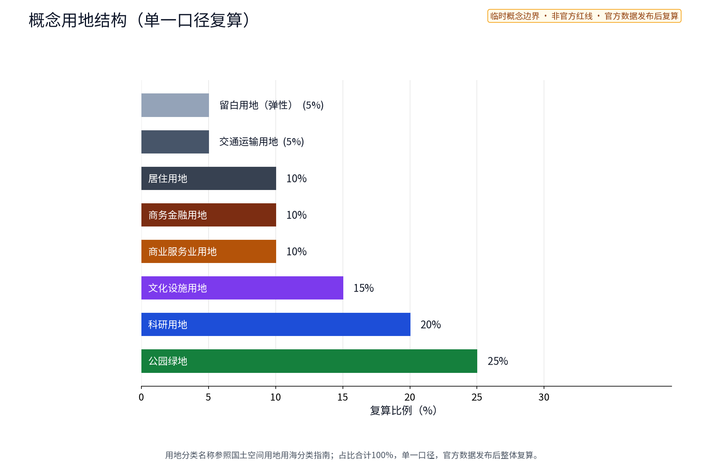
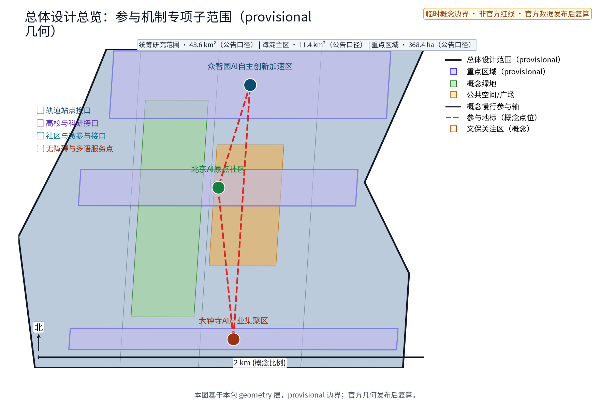
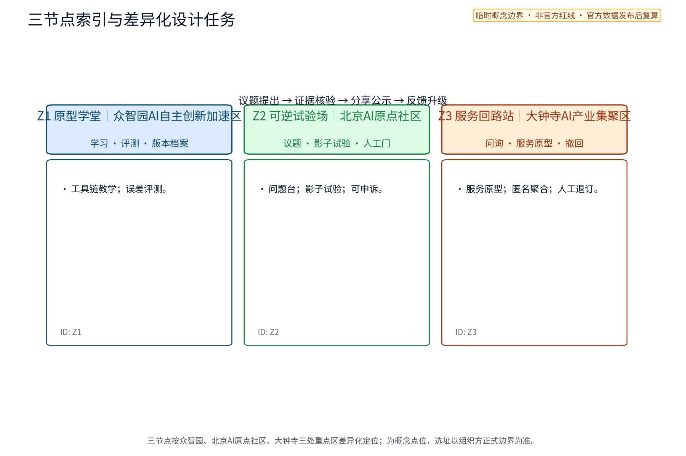
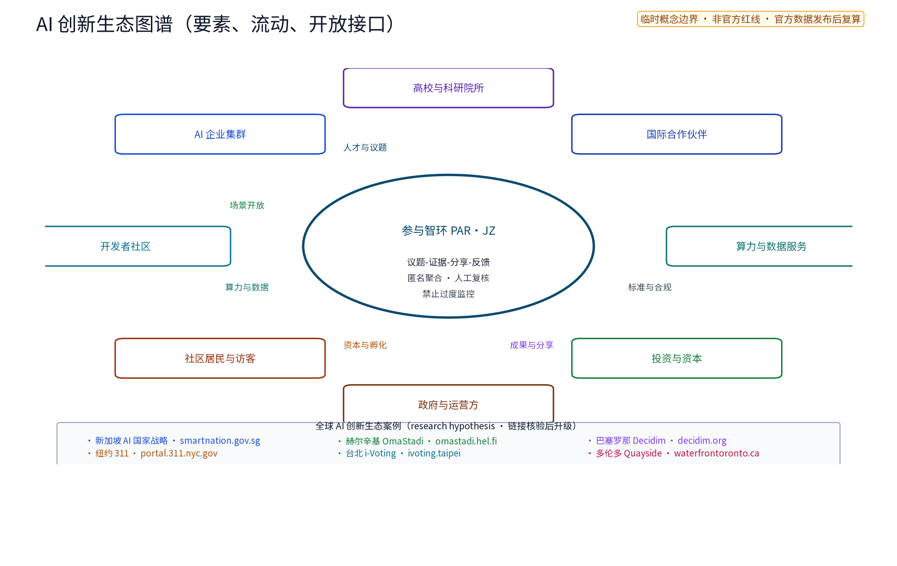
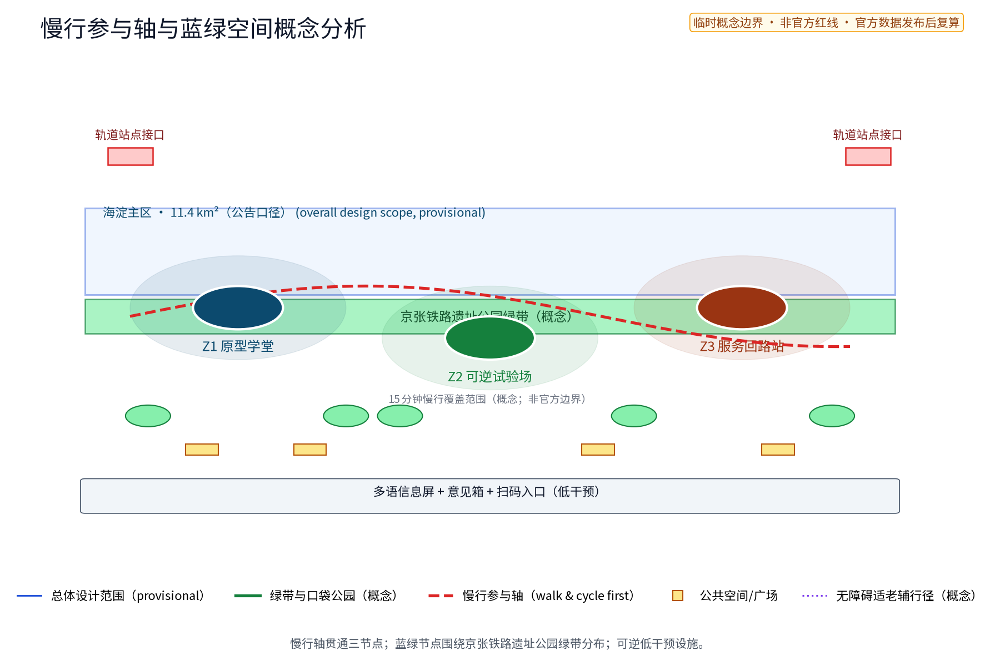
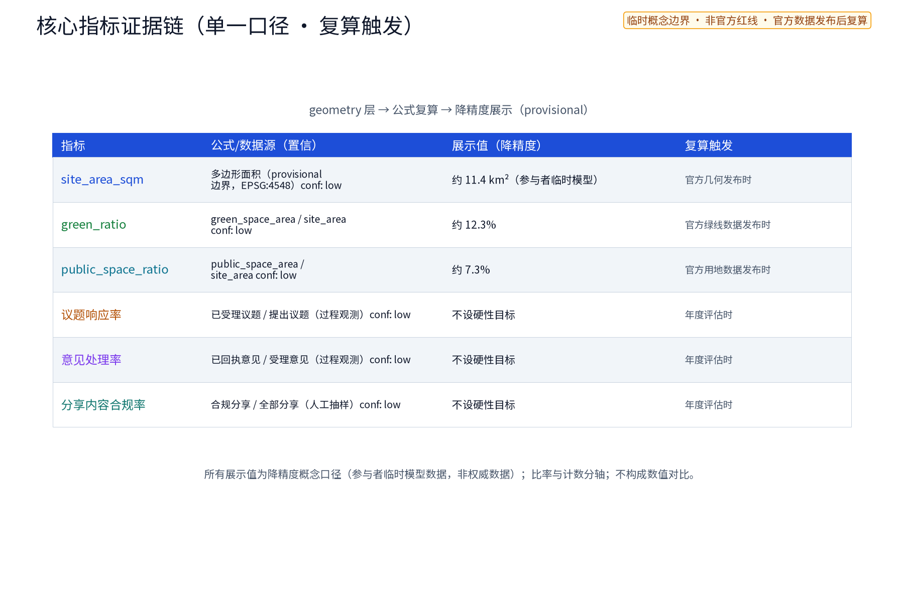
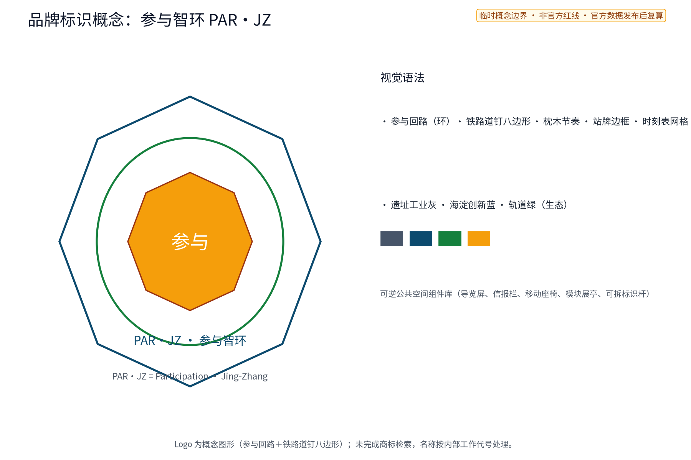

# PAR·JZ 参与智环（京张公共原型公地）

**英文名：PAR·JZ Participation Loop**。PAR·JZ 是本方案唯一主品牌，意为 Participation · Jing-Zhang；它不是既有企业或政府标识。方案提出一条“学会—做出—小范围试用—复盘归档”的公共原型链：把 AI 学习、可逆设施、社区服务和产业测试组织成可被公众看见、可以人工叫停、能够撤回的空间网络。它不是创客园区招商方案，也不是已批准的建设方案；全部点位、数值和运营安排均为概念建议，待官方资料、现场踏勘和专业审查后复算或调整。[source:AGENT-TASKBOOK]

## 设计依据与资料清单

本包仅使用任务书、公开规范和包内参与者自行生成的几何/图形。正式来源逐条登记在 `sources.json`，其中官方公告与任务书用于任务边界，住建/自然资源/AI治理/无障碍材料用于方法参考；全球案例仅提炼可核验页面上的机制线索，不支撑已发生的投资、效果或合作事实。现状建筑、权属、文保线、站点出入口、运营容量和官方控制条件均为 `unknown/to_verify`。

机器可核验索引与逐项证据表见 `report/narrative.md`、`sources.json`、`compliance_matrix.json` 和 `design_depth_matrix.json`；本段只保留任务边界、官方公告与包内几何三类入口 [source:AGENT-TASKBOOK] [source:OFFICIAL-ANNOUNCEMENT] [data:geometry/site_boundary.geojson#all_features]。每个案例、标准、指标和深度项均以稳定 ID 回链，避免用连续标签替代证据。

命名体系为：主名 PAR·JZ 参与智环；Z1/Z2/Z3 是主品牌下的三个空间节点，分别为“Z1 原型学堂 / Z2 可逆试验场 / Z3 服务回路站”，不另设 PAR 子品牌。三节点分别接口众智园AI自主创新加速区、北京AI原点社区、大钟寺AI产业集聚区；功能映射与空间名称在正文、图件、HTML和PDF中保持一致。运行状态为“学习 / 原型 / 影子试验 / 人工复核 / 公示 / 撤回”。Logo 概念以“开合的方框 + 京张轨枕节奏”表达可拆、可复用的原型模块，不使用任何既有企业或政府标识，定稿前需完成商标和在先权利核查。[source:PACKAGE-GEOMETRY]

## 三层范围工作框架

三层边界和交付采用 [depth:three_level_scope_framework]、[standard:PROJECT-OFFICIAL-ANNOUNCEMENT] 与 [data:geometry/site_boundary.geojson#all_features] 校核；研究、总体设计、重点区域分别承担不同决策责任，不能互相替代。

官方三层范围按公告口径工作：统筹研究范围约 43.6 km²、总体设计范围约 11.4 km²、重点区域约 368.4 ha；本包将其作为工作框架而非自行确认的红线。统筹层回答“哪些公共问题值得做原型”，总体层布置绿带—慢行—原型链，重点层落到三个概念锚点和一条测试走廊。所有几何均为 participant provisional model，官方 polygon 发布后按同一公式复算。

| 层级 | 空间边界与工作对象 | 交付与决策边界 |
| --- | --- | --- |
| 统筹研究 | 京张 AI 创新带的区域协同、人才/场景/要素接口；不画法定红线 | 输出原型议题池、协同接口和案例假设，不承诺产业规模或投资 |
| 总体设计 | 约 11.4 km² 工作范围内的绿带、慢行链和三级公共原型节点 | 输出空间结构、组件族、服务流程和复算指标；控规只作校核建议 |
| 重点区域 | 约 368.4 ha 概念重点区内的 Z1/Z2/Z3 与小月河测试走廊 | 输出节点平面关系、场景卡、测试协议；落位须经踏勘、权属、文保、无障碍和公众复核 |

三大定位：百年京张文化带以“修复记忆、学习新技艺”作叙事底盘；都市 AI 生活体验带以可感知的原型服务连接日常；AI 融合创新带以公共问题作为测试入口。五大功能的映射为：AI 全栈自主创新体系（Z1 工具链与模型评测）、世界级 AI 创新生态（Z1/Z2 开放知识和案例交换）、AI+场景赋能新范式（Z2 影子试验）、智能化 AI 活力城市（Z3 日常服务）、AI 治理全球话语权（公示、复盘和可撤回证据）。

## 统筹研究范围产业与未来城市研究

PAR·JZ 把产业、空间和公共利益放进同一条“问题—原型—证据—复用”链，而不是把 AI 作为装饰。八类要素的接口分别是：土地/空间提供可逆试验容器；产业提供需求与维护能力；资本仅作为待核验的潜在资源；人才由学生、工程师、居民、照护者和运营者共同组成；算力采用“资源条件待核验”的共享接口；数据只允许公开或经授权的匿名聚合；场景由三节点和测试走廊承载；知识以版本化档案向公众返回。任何具体企业、融资额、产值、算力规模和供应商均不做事实判断。

内部三区两翼与外部协同分开表达：

| 内部任务书单元 | 机制与空间接口（概念建议） |
| --- | --- |
| AI 原点社区 | Z2 以社区问题为入口，提供低门槛学习、影子测试、人工服务和离线记录；不声称已存在运营点位 |
| 众智园 AI 自主创新加速区 | Z1 提供模型评测、工具链教学、开发者工作台和可逆展陈；不承诺入驻或孵化结果 |
| 大钟寺 AI 产业集聚区 | Z3 将 AI 服务原型嵌入日常消费/商务动线，采用匿名聚合和人工退订；不改造权属空间 |
| 中关村科技服务翼 | 提供知识产权、资本/人才/算力/数据的概念转介接口，所有合作关系为待核验 |
| 小月河场景赋能翼 | 提供连续的影子试验走廊、慢行体验和公共服务回路，不预设道路或工程断面 |

外部协同接口仅指研究交换：北纬社区对应社区议题互换，未来科学城/怀柔科学城对应高校与科研议题互换，经开区对应产业测试方法交流，京津冀对应案例与公共知识共享。它们不是本方案的建设范围、合作承诺或招商名单。[source:AGENT-TASKBOOK]

## 总体设计范围城市更新与控规深度城市设计

总体空间结构以 [depth:overall_spatial_structure]、[depth:existing_conditions_diagnosis] 和 [data:geometry/site_boundary.geojson#all_features] 为证据入口；控规与工程条件仍以 `unknown/to_verify` 处理。

总体结构为“一条学习—试验—回返主轴、三类原型锚点、两翼接口、四种可逆组件”。主轴沿京张遗址公园绿带组织，Z1→Z2→Z3 形成由专业学习到日常体验的连续序列；沿小月河的测试走廊作为低影响影子试验带；中关村科技服务翼负责知识与要素转介，小月河场景赋能翼负责场景进入和公众体验。东西方向用“站点/高校—遗址公园—社区/产业”三段缝合，南北方向用无障碍慢行支线、跨街口提示和离线服务节点贯通，均为概念策略，不是线位或工程结论。

更新优先“留改拆、以留为主”：先用存量空间和可移动组件试验，保留遗址公园肌理与铁路遗存；拆除、桥隧、地下和建筑改造不在本包作结论。控规指标、建筑高度、容积率、道路红线、能源负荷和市政容量依赖未公开资料，均为 `unknown/to_verify`。每个原型必须能在 30 天内拆回“无 AI 服务”的安全状态，并保存撤回说明。

## 重点区域详细设计

三节点的平面、断面、用户旅程和可逆组件按 [depth:three_key_area_detailed_design]、[source:PACKAGE-GEOMETRY] 与 [data:geometry/key_areas.geojson#all_features] 组织；点位不是官方落位。

三个节点是概念位置而非官方地名或现状认定：

| 节点 | 主题与空间结构 | 公众界面/产业接口 | 边界 |
| --- | --- | --- | --- |
| Z1 原型学堂（众智园概念接口） | 入口展板—小班学习桌—模型评测台—版本档案墙 | 学生/工程师学习，公开“输入/输出/误差”样例；对接中关村科技服务翼 | 不宣称园区权属、设备、企业或算力已具备 |
| Z2 可逆试验场（AI 原点社区概念接口） | 社区问题台—影子测试区—人工值守台—离线回收箱 | 居民试用服务原型，先模拟不自动执行；社区可一键暂停并查看原因 | 不采集个体轨迹，不将试用写成部署 |
| Z3 服务回路站（大钟寺概念接口） | 日常问询台—商务/消费原型窗—公示屏—撤回柜 | 访客、商户、工作者体验翻译、排队、导览等轻服务；人工退订 | 不改造商户，不承诺客流或商业收益 |

三节点采用同一套“平面—断面—旅程”复核语言。Z1 平面是入口导视、学习桌、评测台和版本墙的线性序列；Z2 平面是问题台、影子试验区、人工门和纸质回收箱组成的可退出环；Z3 平面是问询台、服务窗、公示面和撤回柜沿公共界面展开。三节点断面均保留连续无障碍通行带、可停留边界、低位信息界面和人工值守位，设备用可拆组件，不阻断疏散、遗产视线或日常休息；具体高程、荷载、消防、管线和容量为 unknown/to_verify。用户旅程为：提出问题→选择纸质/电话/数字入口→查看数据用途→获得 AI 草稿→人工复核→小范围影子试验→收到版本回执→公示、申诉或撤回→复盘归档。每个状态有责任人、时间戳和退出入口，未过人工门不得发布。

| 节点 | 平面与空间边界 | 断面/界面 | 旅程交付 |
| --- | --- | --- | --- |
| Z1 原型学堂 | 入口—学习—评测—档案四段；仅概念功能边界 | 信息板—通行带—学习桌—导师位；设备可拆 | 学习者提交样例，导师解释，工程师复现，知识管理员归档 |
| Z2 可逆试验场 | 问题台—影子区—人工门—纸质回收形成环路 | 通行带与试验面分开，保留人工绕行 | 居民提出需求，社区复核，试用/暂停，申诉或退出 |
| Z3 服务回路站 | 问询—服务—公示—撤回沿公共界面排布 | 信息面与通行面分离，不显示个人资料 | 访客选择服务，值守员复核，体验，退订并反馈 |

公共空间组件库由可拆标识杆、双语信息板、移动座椅、遮阳/雨具箱、纸质意见盒、低功耗展陈架组成；每件组件有编号、责任人、维护日期和撤回状态。荣誉展示不排名个人收入或流量，只展示经本人授权的原型版本、学习贡献和复盘记录；未授权内容不公开。

## AI 创新生态、人才画像与 AI+ 场景

AI 生态与场景深度按 [depth:three_key_area_detailed_design]、[metric:scenario_card_count] 和 [source:DATA-SRC-AI-GOVERNANCE] 核验；场景、测试和画像的逐项证据见 `report/narrative.md` 与矩阵，模型只能产出草稿，人工门拥有发布、暂停和撤回权。

### 可核验全球 AI 生态机制案例

| 案例 | 直接来源与可见证据 | 本包机制借鉴 | 复用边界 |
| --- | --- | --- | --- |
| Fab Labs Network | `SRC-GLOBAL-FABLABS`：官方主页标题 Welcome \| FabLabs，访问 2026-08-29 | 分布式原型空间与知识共享 | 不主张本地加盟、资金或合作 |
| STATION F | `SRC-GLOBAL-STATIONF`：官方主页标题 STATION F，访问 2026-08-29 | 共享创新空间、项目和服务接口 | 不主张入驻、招商或绩效移植 |
| Hacker Dojo | `SRC-GLOBAL-HACKERDOJO`：官方主页标题 Hacker Dojo - Connect to Silicon Valley，访问 2026-08-29 | 会员/开发者自组织学习 | 不主张社群关系或规模 |
| Chaihuo | `SRC-GLOBAL-CHAIHUO`：柴火创客官方主页标题 主页 - 柴火创客，访问 2026-08-29 | 社区创客学习与动手原型 | 不主张本地授权或供应链合作 |
| Arduino Education | `SRC-GLOBAL-ARDUINO-EDUCATION`：Arduino 官方页面标题 Arduino Education，访问 2026-08-29 | 开放硬件学习与课堂到原型路径 | 不主张本地合作、产品背书或绩效移植 |

正式案例计数为五个：Fab Labs、STATION F、Hacker Dojo、柴火创客、Arduino Education，均有可追溯的官方/项目主页面；2050 Conference 保留为一个排除在正式计数外的研究线索，待补核页面标题后才可升级。案例只用于提出可验证的机制问题，不用于证明本地合作、企业名单、投资额、人数、产值、政策或政府承诺。每一条的页面标题、发布主体、访问日、发布日期状态、摘要证据位置、`review_status`、`usable_for_formal` 和许可限制均登记在 `sources.json`。

六类画像：P1 低数字素养及老年居民（纸笔/人工）；P2 视听、行动或认知障碍居民及照护者（陪走、替代路线）；P3 儿童与学生学习者（可解释样例和监护边界）；P4 社区工作者（可审计回执）；P5 工程师/开发者（可复现测试包）；P6 商户/访客（短时、可退订服务）。所有场景遵守三条底线：输入最小化且匿名聚合；模型/规则只生成建议、分类或草稿；涉及权益、公共安全、文保、无障碍或对外发布必须人工复核。AI 输出若无法解释、无法追溯或超出授权范围，直接停止，不进入公共屏。

### 十张可执行场景卡

| ID | 空间/输入 | 模型或规则 → 人工门 | 输出与责任 | 指标；停止条件 |
| --- | --- | --- | --- | --- |
| S01 | Z1；公开问题文本、匿名标签 | 聚类规则→导师复核 | 每周议题簇；Z1 运营者负责 | 议题簇可解释率；来源无法追溯即停 |
| S02 | Z1；公开样例与人工标注 | 版本评测脚本→工程师签字 | 误差卡与版本号；专业团队负责 | 复现通过率；样例泄露或不可复现即回滚 |
| S03 | Z1；公开文档、授权数据字典 | 检索/摘要规则→知识管理员复核 | 双语学习卡；知识管理员负责 | 引用完整率；出现无来源断言即下线 |
| S04 | Z2；纸质/线上需求的匿名类别 | 排序规则→社区复核组 | 试验队列草稿；社区运营负责 | 等待时间分位数；高影响需求无人审即停 |
| S05 | Z2；影子测试反馈（不自动执行） | 规则对照→无障碍顾问与居民复核 | 反馈摘要与修改单；复核组负责 | 关键意见保留率；少数意见丢失即暂停 |
| S06 | Z2；空间走查清单 | 路径规则→人工陪走 | 无障碍问题清单；场地责任人负责 | 阻断项清零；出现阻断即撤收组件 |
| S07 | Z3；公开营业时段和服务类别 | 排队/导览规则→值守员复核 | 非个性化导览建议；Z3 值守员负责 | 误导投诉率；连续两次误导即停用 |
| S08 | Z3；商户自愿提交的匿名聚合需求 | 模板生成→商户与运营者双签 | 服务原型卡；运营者负责 | 退订完成率；未经授权使用即删除 |
| S09 | 主轴；天气/活动公开公告 | 广播规则→安全员复核 | 慢行提醒与纸质替代；安全员负责 | 信息时效性；异常天气下自动停止推荐 |
| S10 | 全节点；匿名运行日志 | 统计规则→月度独立复核 | 公示版运营报告；评估人负责 | 缺失日志率；隐私事件即回滚至人工/离线 |

### 三项行业测试协议

| 协议 | 样本/基线/阈值（临时影子测试） | 记录与责任 | 停止、整改、退出 |
| --- | --- | --- | --- |
| P1 匿名与数据最小化 | 每月抽查至少 30 条匿名记录，分母为当月进入测试的记录；正式运营基线 unknown/to_verify；通过=0 条可识别输出 | `record_id`、字段清单、脱敏前后规则摘要；数据管理员 R、隐私顾问 A | 1 条可识别输出即停止 AI，删除测试副本，回到人工入口；两轮复核后才可重启 |
| P2 人工复核与复现 | 每月抽样 ≥10% 的草稿，分母为当月草稿数；基线 unknown/to_verify；临时通过=复现率 ≥90%、高影响草稿 100% 签字 | 模型/规则版本、样本、误差类、签字、修订 diff；工程师 R、专业复核组 A | 低于带宽则整改并回滚上一版本；连续两月失败则撤收该场景 |
| P3 无障碍与离线可用 | 三节点各 1 次陪走，轮椅/视听/认知/儿童照护四类检查；基线 unknown/to_verify；临时通过=关键阻断 0、纸质/人工入口可用 | 走查表、替代路线、照片仅在授权后留存；无障碍顾问 R、运营者 A | 关键阻断立即封存组件并修复；无法修复则永久退出该点位 |

协议输出只用于 G0/G1/G2 阶段门，不是政府验收标准。每个场景完整链路为：入口受理 → 匿名化 → 模型/规则草稿 → 人工门 → 小范围公示/影子试验 → 记录反馈 → 申诉/撤回 → 修订或退出。模型没有最终裁量权。

## 用地、建筑规模与拆改留方案

用地表达遵循 [depth:land_use_layout]、[depth:development_intensity_controls] 和 [data:geometry/land_use.geojson#all_features]；高度、拆改与标准的逐项边界见 `design_depth_matrix.json` 和 `standard_matrix.json`。下图是八类“概念测试配额”，不是法定分类或现状调查：

用地仅作概念结构：存量建筑适配、公共开放空间、绿地与遗产展示、服务/学习空间、试验留白五类接口，图中比例是参与者用于场景排布的可逆测试配额，不能代替官方用地分类。`floor_area_ratio`、建筑高度、建筑密度、权属和具体拆改对象均为 `unknown/to_verify`，因此不据此计算开发强度或提出拆改结论。几何上只保留“适配—可逆插入—撤回复原”三种动作，指标只记录配额、面积来源和复算版本；官方地类、权属、文保、绿线/蓝线和消防条件到位后才可重算。新设施限于可拆、可搬、低干预组件，任何实施必须由主管和专业团队复核。[data:geometry/buildings.geojson#all_features] [metric:building_footprint_area_sqm]

## 交通、轨道、市政与公共服务设施

交通与设施策略按 [depth:traffic_rail_slow_parking]、[depth:municipal_new_infrastructure] 和 [source:DATA-SRC-BARRIER-FREE] 复核；道路几何入口另见 [data:geometry/roads.geojson#all_features]。以下仅是服务和走廊逻辑，不是道路或管线设计。

空间层面提出“站点—绿带—节点—社区”的步行/骑行优先体验序列，东—西以主轴串联，南—北用概念支线接入学校、社区和服务点；线形只表达参与顺序和人工可达关系，不推出道路红线、轨道改线、桥隧、地下、市政管线、停车配建或容量方案。三节点断面保留通行带、信息/试验面、人工值守位和撤回收纳位四个界面，先用陪走记录阻断点，再决定是否移动组件。服务点提供纸质表单、电话、人工协助、大字版、双语文字和可替代路线；任何 AI 推荐均可跳过，公共屏不显示个人信息。站点出入口、无障碍坡度、夜间照明、消防疏散、权属和设施容量均为 `unknown/to_verify`，须在 G1 前由专业人员现场核查并记录版本。[metric:public_space_ratio] [depth:metrics_recalculation]

## 蓝绿空间、公共空间与城市风貌

蓝绿、风貌和公众空间以 [depth:blue_green_public_space]、[source:DATA-SRC-MOHURD-URBAN-DESIGN] 与 [data:geometry/green_space.geojson#all_features] 为方法证据；现状条件不外推。

以京张遗址公园绿带为连续背景，原型组件退让历史遗存视线并保持日常休息空间；雨天、夜间和无障碍风险通过人工值守和撤收机制处理。文化叙事不是科技装饰：资源类型“铁路遗存/站点记忆/社区日常”分别对应主题“连接/学习/照料”，载体为时间线、口述授权卡和双语导览，使用边界为“来源可核验、肖像有授权、未核验材料标注 research_hypothesis”。英文传播文案为 “Prototype in public, decide with people, leave a trace of learning.”，仅作概念传播文本。

## 更新项目清单、实施政策与分期计划

项目、RACI、阶段门和退出规则按 [depth:renewal_project_list]、[depth:phasing_implementation] 与 [metric:phase_count] 复核；年度项目计数见 [metric:annual_program_count]。

| 阶段 | 最小交付物 | 责任与依赖 | 阶段门/证据 |
| --- | --- | --- | --- |
| 近期 1–3 年 | Z1/Z2 影子测试、纸质入口、三协议首轮、组件台账 | 运营者 R；专业团队 A；依赖匿名样本框、现场踏勘 | G0：隐私/人工门/无障碍清单齐全；任一失败不进入公共试用 |
| 中期 3–5 年 | 三节点小规模开放、Z3 服务原型、双语档案和年度复盘 | 运营者 R；专业/无障碍团队 A；依赖 G0、权属和文保核查 | G1：P1–P3 临时带宽通过；失败整改并回 G0 |
| 远期 5–10 年 | 公开知识库、跨区域方法交换、可复用组件和年度品牌 | 联盟/评估者 R；主管主体 A；依赖官方数据与连续两年复核 | G2：两轮年度复核通过才扩展；重大事件直接退出 |

RACI 角色：运营者负责入口、日志和维护；专业团队负责空间、文保、交通与 AI 复核；社区/学校/商户为咨询与共同测试者；独立复议组负责申诉；主管主体拥有最终审批权。活动安排（开放学习日、原型复盘周、公共服务演示、年度档案发布）均为建议，不代表既定政府日程。长期运营靠“学习者—开发者—社区—维护者”轮换、公开版本库、年度审计、组件再利用和退出公告，不靠未承诺的招商或财政支持。

## 指标体系、面积复算与合规矩阵

指标复算遵循 [depth:metrics_recalculation]、[data:geometry/phasing.geojson#all_features] 和 [metric:site_area_sqm]；所有精确值都是参与者 provisional 模型值。 

三项 formal 核心指标从本包 geometry 复算；面向人只显示“约 11.4 km²（参与者临时模型）”“约 12.3%”“约 7.3%”，精确复算值仅保留在 `metrics.json` 的机器字段。三者置信度均为 low，公式、来源、版本和触发条件写入 `metrics.json`；官方边界/用地/公共空间资料到位时必须联动复算并刷新 HTML、图件、PDF 与 manifest。这些不是官方现状。结构计数为场景卡 10、行业协议 3、画像 6、全球案例正式计数 5（另有 1 个排除的研究线索）、阶段门 3；运营基线、人口、客流、预算、碳排、FAR 和高度均为 `unknown/to_verify`。

指标记录字段固定为：指标名、分子/分母、空间范围、版本、来源、计算时间、责任人、置信度、复算触发。官方边界、用地、文保和控制条件发布后，同步更新 geometry、正文、HTML、图件、PDF、metrics 和 manifest。`compliance_matrix.json` 覆盖公告要求，`design_depth_matrix.json` 覆盖现状、结构、节点、实施、合规和表达深度。

## 风险、版权与合规说明

风险和版权边界按 [depth:risk_missing_data]、[source:DATA-SRC-AI-GOVERNANCE] 与 [standard:MOHURD-CONTROL-DETAILED-PLANNING] 执行；无障碍与其余标准证据见矩阵，不能替代法律意见或审批。

本方案是开放共创建议，不替代正式规划、审批或专业设计。风险控制为：隐私最小化/匿名聚合；高影响输出人工复核；无障碍和离线替代；内容版本、来源与删改留痕；公众可申诉、撤回和退出；场景可暂停、回滚、归档和清理。不得使用秘密地图、内部数据、个人轨迹或未授权图片/肖像/商标/论文图。

权利台账在 `report/copyright_statement.md` 与 `sources.json`：正文、几何、图表和 Logo 为本包原创概念资产；本地 Noto Sans SC 字体的文件名、版本、SHA-256、许可和嵌入依据逐项登记；无第三方照片和远程素材。商标、场地权属、历史材料再利用和外部发布授权尚未完成，保持 `unknown/to_verify`，不作授权承诺。

## 参考资料

任务书与公告：[source:AGENT-TASKBOOK] [source:OFFICIAL-ANNOUNCEMENT]；包内 provisional 几何与其权利边界见 [source:BOUNDARY-SOURCE]。住建、自然资源、AI 治理、无障碍规范和全球案例的发布者、链接、时间、许可与用途限制见 `sources.json`；全球案例均为机制研究假设，不能当作已验证绩效或合作事实。

### 研究假设与待核验清单

组织方官方 polygon、法定控制、权属、文保/绿蓝线、站点条件、现状无障碍、运营人力、样本框、预算和模型合规意见全部 `unknown/to_verify`。在这些资料到位前，PAR·JZ 不给出精确地块、工程量、投资回报、审批结论或已建成/已运营表述。
