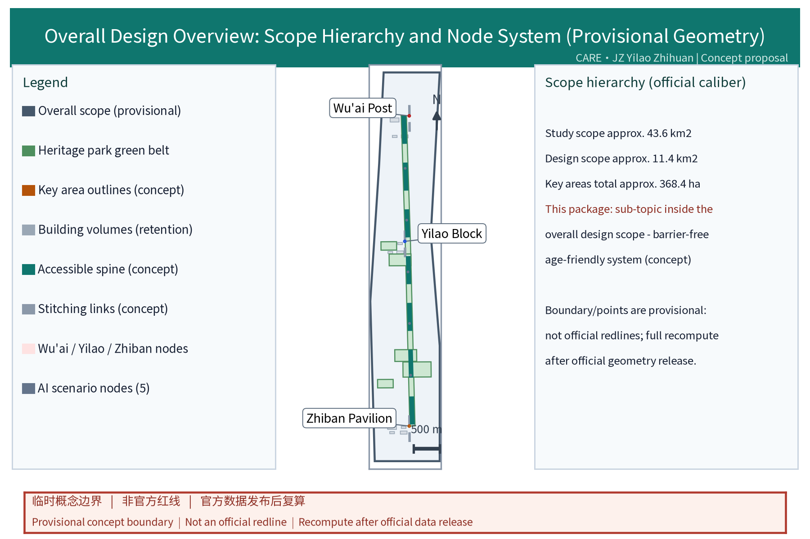
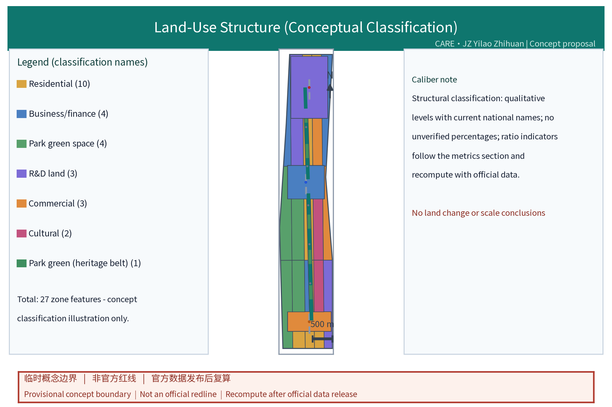
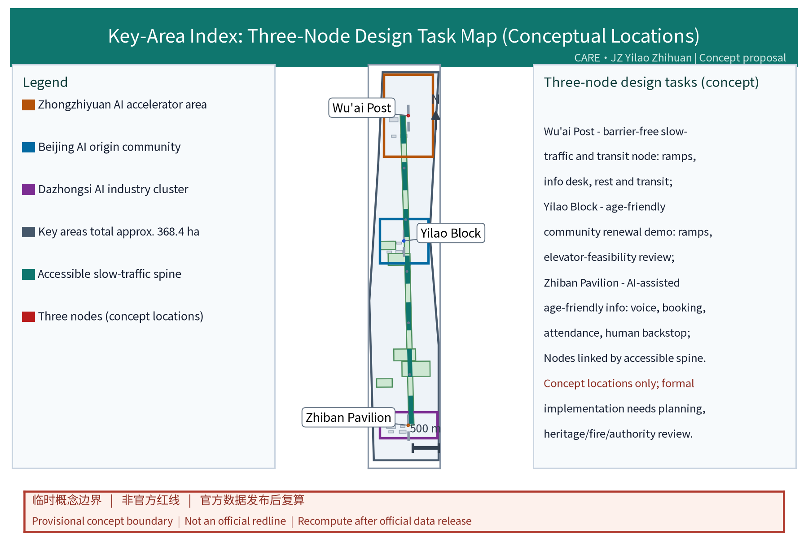
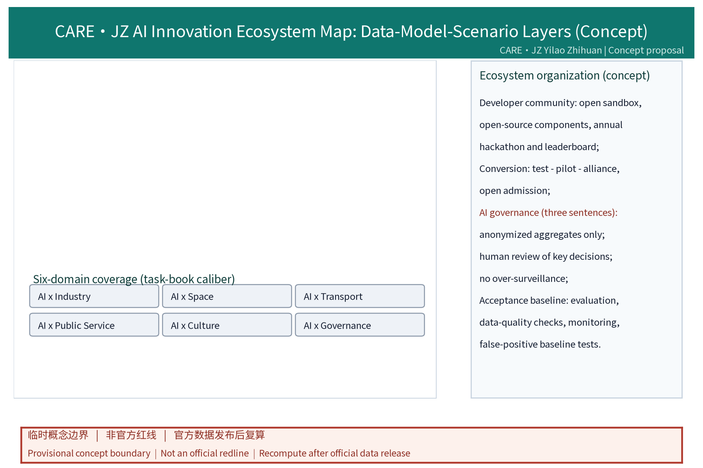
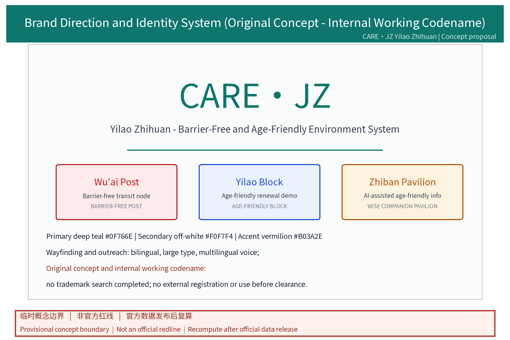
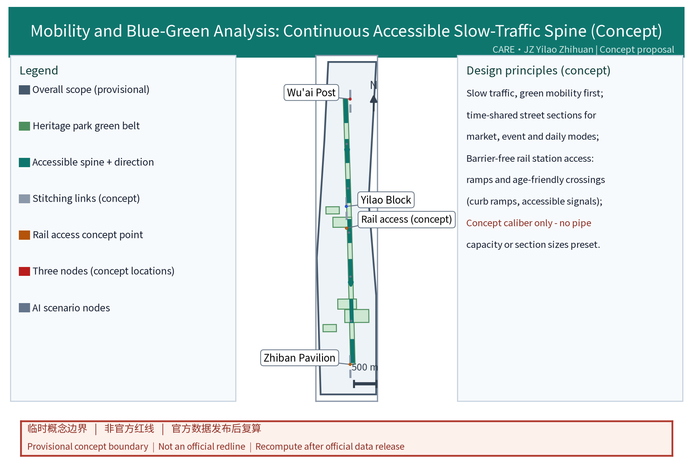
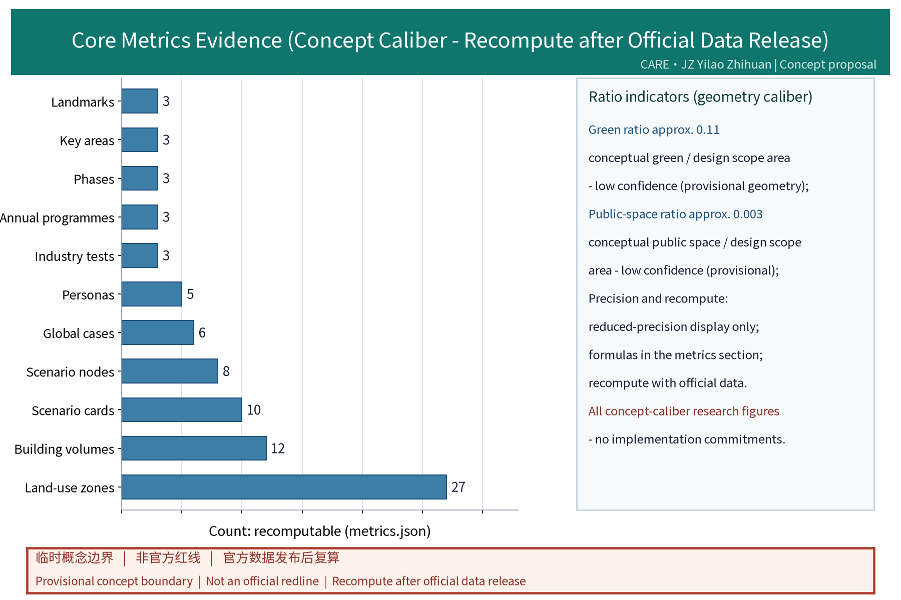

## Design Basis and Source List
This proposal builds on the Barrier-Free Environment Law of the PRC (in force since 2023), the Law on Protection of the Rights and Interests of the Elderly, and MCA/MOHURD policy on age-friendly renovation and elderly-friendly society building; the official announcement and the task book define the scope, the three positionings, the five functions and the six tasks. The city design measures and regulatory detailed planning measures provide methodological references. The list below is a public-reference checklist only; all data actually used is registered in sources.json, gaps are disclosed honestly in the risk section, and no official data is fabricated. The drafting process follows a four-step quality control: "official caliber first, professional standards as reference, public sources verified, unavailable items registered honestly" - scope, area and boundaries always follow the announcement text; professional methods and classification names follow national standards and departmental rules; cases and background material use only verifiable public sources; statutory conditions that cannot be obtained (ownership, regulatory plan, heritage protection, municipal capacity) are listed item by item in the risk ledger without speculation or fabrication. During formal design, texts must be re-checked against official releases. CARE·JZ is an original concept direction and internal working codename; no registration or external use before prior-rights clearance.

> Evidence: [source:DATA-SRC-OFFICIAL-ANNOUNCEMENT], [source:DATA-SRC-AGENT-TASKBOOK].

## Three-Level Scope Framework
Per the official announcement, the three top-down scopes are: coordinated research area approx 43.6 km2, overall design area approx 11.4 km2, and key detailed-design areas totalling approx 368.4 ha. This package sits inside the overall design scope and frames the barrier-free, age-friendly environment system as the public-support subset of the "smart AI vitality city" positioning (conceptual mapping). All boundaries are marked provisional: the coordinated layer reviews universities, tech districts, neighbourhoods and industrial synergy; the overall layer runs a regulatory-plan-depth concept design along the Jingzhang Railway Heritage Park green belt; the key-area layer deepens the three nodes "Wu'ai Post - Yilao Block - Zhiban Pavilion". The three layers work as "top-down transmission, bottom-up verification": the upper scope defines the working boundary and indicator calibers of the lower layers, lower-layer results check the upper judgments in return, indicators and geometry stay traceable across layers, and any layer triggers full recomputation when official data is published, so concept geometry is never presented as the official scope. The three layers transfer inputs downward and check indicators; no conclusion beyond concept depth is made; full recompute when official geometry is published.

> Evidence: [source:DATA-SRC-AGENT-TASKBOOK], [source:DATA-SRC-PROVISIONAL-BOUNDARIES].

## Coordinated Research Area: Industry and Future City Research
The coordinated study reads the barrier-free, age-friendly environment inside the "industry - talent - life" chain: Haidian universities and tech districts gather young AI developers and entrepreneurs, international housing areas coexist with ageing neighbourhoods, forming an all-age mix. The task book's three positionings (centennial Jingzhang culture belt, metropolitan AI-life experience belt, AI-integrated innovation belt) and five functions (full-stack AI self-innovation system, world-class AI innovation ecosystem, new AI+ scenario paradigm, smart AI vitality city, global AI governance voice) set the stage; this package maps the all-age-friendly and accessibility dimension under the smart AI vitality city positioning.

To make the task book clauses traceable to this proposal section by section, a **positioning - function - section** mapping is established:

| Task book clause | Proposal section | Concept landing |
|---|---|---|
| 3 positionings / "Centennial Jingzhang Culture Belt" | Detailed Design of Key Areas / Blue-Green Network, Public Space, and Urban Character | "Jing-Zhang Memory · Accessible Interpretation" cultural node sequence and three-tier landmark system |
| 3 positionings / "Metropolitan AI-Life Experience Belt" | AI Innovation Ecosystem, Personas, and AI+ Scenarios | AI x industry / space / mobility / public services / culture / governance six-domain scenario cards and personas |
| 3 positionings / "AI-Integrated Innovation Belt" | AI Innovation Ecosystem / Coordinated Research | Three industry test scenarios + developer community and scenario opening mechanism |
| 5 functions / "Full-Stack AI Self-Innovation System" | AI Innovation Ecosystem, Personas, and AI+ Scenarios | Data - model - scene three layers with on-device processing + shared interfaces |
| 5 functions / "World-Class AI Innovation Ecosystem" | Coordinated Research / Renewal Projects, Phasing | Three zones two wings concept circle + alliance / charter filing |
| 5 functions / "New AI+ Scenario Paradigm" | AI Innovation Ecosystem, Personas, and AI+ Scenarios | Ten scenario cards + three industry test scenarios |
| 5 functions / "Smart AI Vitality City" | Overall Design Area: Urban Renewal and Regulatory-Plan-Level Urban Design | Green belt + node structure, continuous accessible slow-traffic spine, reversible component library |
| 5 functions / "Global AI Governance Voice" | Risk, Copyright, and Compliance | AI governance three sentences, privacy control table, international dissemination (bilingual) |
| Three zones, two wings (Zhongguancun Future Science City - Huairou Science City + Sub-Centre + Xiongan) | Coordinated Research | Concept circle / two-way learning / standard mutual recognition |

Cross-regional cooperation follows the "three zones, two wings" framework as a concrete concept circle (research hypothesis): coordination subjects are the street blocks along the belt such as the Beiwei community and others (demand side), universities and research institutes (method side), park operators and enterprises (supply side), and NGOs and volunteer networks (service side); exchange objects are defined as "demand lists - anonymized aggregates - scenario interfaces - evaluation methods - operation handbooks"; the closed loop runs "demand collection - scenario mutual recognition - pilot filing - annual evaluation - recomputation disclosure", and any unmet step pauses mutual recognition for rectification, with the annual disclosure keeping transparency. No administrative or investment arrangement is presupposed; two-way learning and standard mutual recognition with Future Science City, Huairou Science City, the Economic-Technological Development Area and the Beijing-Tianjin-Hebei region are also placed inside this loop. Future-city research stays directional: senior neighbours are co-creators of community data and scenarios, not merely care recipients.

> Evidence: [source:DATA-SRC-AGENT-TASKBOOK].

## Overall Design Area: Urban Renewal and Regulatory-Plan-Level Urban Design
The overall design uses the heritage park green belt as the backbone for a continuous barrier-free slow-traffic network that links public spaces at all levels, forming a "green belt + nodes" structure; renewal is retention-first, facilities are implanted and retrofitted, and no land increase/decrease, building scale or demolition/retention figures are preset. Spatial design checks station-community-street relationships under the "three zones, two wings" structure: step-free rail station link routes, community entrances and slow-traffic gaps are concept-checked for reachability. A reversible public-space component library (ramp modules, seating-and-shade modules, signage and information modules, accessible toilet modules) supports replication and stacking under property and structural conditions; the library is managed as "standard interfaces, independent naming, replaceable, traceable" parts, giving follow-up professional teams a convertible implementation language without presupposing a single construction technique. At regulatory-plan level only verification suggestions are made - land-use categories, greening ratio and public-service provision are cross-checked with recompute triggers, with no mandatory FAR or height adjustments; each verification is registered as "conformity level + basis + recompute trigger" for later regulatory planning use.

> Evidence: [standard:MOHURD-CONTROL-DETAILED-PLANNING], [source:DATA-SRC-PROVISIONAL-BOUNDARIES].

## Detailed Design of Key Areas
All three node locations are concept locations and must be re-sited after planning, heritage, fire and authority review before implementation: the Wu'ai Post is a barrier-free slow-traffic and transit service node with ramps, information desks and rest-and-transfer along the green-belt spine; the Yilao Block is an age-friendly community renewal demonstration unit covering ramp conversion, lift-feasibility review, wayfinding upgrades and entrance widening directions; the Zhiban Pavilion is an AI-assisted age-friendly public information station at the intersection of the green belt and communities, providing voice interaction, booking-based attendance and human fallback. The service interface is drawn as a concept plan/section on six elements: continuous accessible route, crossing, ramp, rest, shade, and information plus human service, with the six elements combined by function emphasis at each node; each node is checked against a four-element self-audit list - accessibility, safety, comfort and recognizability. Senior neighbours calibrate the nodes through building-level deliberation and needs interviews. The three nodes are linked by the accessible slow-traffic spine and concept-related to rail stations, street gaps and community entrances; ownership, structure, fire egress and municipal capacity remain for special evaluation.

The three-node execution is organised by four original mechanisms to keep concept-to-pilot traceability: **"Pilot-Node Co-Build Charter"** - before a node is piloted, the street, community delegates, the property holder, the operator and the design team sign a co-build charter that fixes the service interface, accessibility metrics, and shared responsibilities during the co-build period; **"Age-Friendly Walk-Through Consensus"** - each quarter, senior-neighbour delegates, building-level representatives and disability/elderly federations run an on-site walk-through and dialogue to verify node operations and record discrepancies; **"Station-Roster Duty Wheel"** - on-site duty follows a volunteer rotation roster (compact mechanism), published weekly to residents, with automatic backfill and compact-pointing for absence; **"Memory-Translation Annual Refresh"** - cultural-narrative content is re-checked at least once a year against heritage and history professional input, preventing unauthorized associations and symbol collage. The three nodes are linked by the accessible slow-traffic spine and concept-related to rail stations, street gaps and community entrances; ownership, structure, fire egress and municipal capacity remain for special evaluation. The cultural-resource system is organized around the Jing-Zhang railway industrial memory as a motif: a "Jing-Zhang Memory · Accessible Interpretation" cultural-node sequence runs along the green belt, presenting heritage fabric, rail vocabulary and age-friendly information (large type, multilingual, voice) side by side; the Zhiban Pavilion doubles as an information landmark, and a "Age-Friendly Landmark · Memory Pavilion" cultural-landmark node is set at a green-belt turn, together with the Wu'ai Post transfer landmark and Yilao Block community renewal forming an identifiable riverside culture-and-accessibility composite landmark system. The cultural-resource system follows four steps - heritage identification, narrative choreography, accessibility translation, annual update; narrative content and signage are siting-confirmed by heritage and competent authorities, avoiding unauthorized historical association and motif collage.

> Evidence: [data:PACKAGE-GEOMETRY] (polygons from geometry/key_areas.geojson).

## AI Innovation Ecosystem, Personas, and AI+ Scenarios
Five persona groups: entrepreneurs, AI developers, residents, students and senior neighbours, each annotated with spatial activity traits and accessibility needs; senior neighbours join scenario design and annual review as co-creators rather than care recipients. The AI ecosystem is organized as data-model-scene layers and drawn as an ecosystem map: the data layer is anonymized aggregates only, the model layer has human review of key decisions, the scene layer is testable and exitable; coverage spans six AI domains - industry, space, mobility, public services, culture and governance. A developer community (open scenario sandbox, open-source components, annual co-creation contest and leaderboard) and a conversion path (scenario test - pilot filing - alliance cooperation) support open scenes under public admission notice. Every scenario carries model evaluation, data-quality checks and runtime monitoring with false-positive baselines as acceptance floors; all scenarios keep anonymized aggregation, minimal necessary collection, human review and no over-surveillance. Brand and communication copy targets international dissemination (bilingual signage and narrative, internal codename usage boundaries in the risk section).

**Task book agent.1 - agent.6 - proposal mapping**:

| Agent ID | Theme | Proposal section / paragraph | Concept landing |
|---|---|---|---|
| agent.1 | Overall concept, spatial structure and brand direction | Coordinated Research / Overall Design / Detailed Design / Blue-Green | CARE·JZ (Yilao Zhihuan) original naming + green belt + node structure + Wu'ai Post - Yilao Block - Zhiban Pavilion three nodes |
| agent.2 | Ecosystem map, six cases and element mechanisms | AI Innovation Ecosystem / Risk / References | AI ecosystem map (data-model-scene) + six-case benchmark table + field-level data-governance table |
| agent.3 | 10 scenario cards, 5 personas, 3 tests | AI Innovation Ecosystem (scenario table / industry test table / persona section) | 10 scenario cards + 3 industry test scenarios + 5 persona groups |
| agent.4 | Three nodes, component library and landmarks | Detailed Design / Overall Design / Blue-Green | Wu'ai Post - Yilao Block - Zhiban Pavilion three nodes + reversible component library + three-tier landmark system |
| agent.5 | Jing-Zhang industrial memory, signage and bilingual dissemination | Detailed Design / Blue-Green / AI section / Risk | "Jing-Zhang Memory · Accessible Interpretation" node sequence + bilingual signage + logo concept |
| agent.6 | Annual programmes, developer community, open operation and conversion | Renewal Projects, Phasing / AI section | 3 annual programme brands + developer community + alliance / charter filing + 5-step closed loop |

**Scenario card index (concept)**: the ten cards below state users, data, space, model, operator, human fallback, privacy control, stage gates, indicators and stop conditions; all are concept suggestions, not approved services:

| Scenario card | Location (spatial carrier) | Users | Input data and model | Operator and human fallback | Privacy control | Stage gate / indicator / stop condition |
|---|---|---|---|---|---|---|
| "Wu'ai Route" accessible transfer guide | Wu'ai Post | Seniors, persons with disabilities | anonymized route aggregates; route-planning model | station operator; volunteer duty, human escort | explicit consent, one-tap opt-out | pilot gate: on-site false-positive floor; stop: repeated false positives |
| "Yilao Block" age-friendly retrofit demo | Yilao Block | Seniors, residents | anonymized retrofit needs; facility-ledger recognition model | community operator; block deliberation, human review | anonymized aggregates, human review | gate: block participation floor; stop: insufficient coverage |
| "Zhiban Desk" AI voice guidance | Zhiban Pavilion | Seniors, vulnerable groups | on-device voice; Q&A model | station operator; booked duty, human fallback | on-device processing, no over-surveillance | monthly gate: satisfaction floor; stop: low satisfaction |
| "Check-up Sheet" annual accessibility check | Belt nodes | Community delegates, workers | aggregate inspection records; ledger recognition model | street coordination; community delegate review | aggregate statistics, human review | annual gate: rectification closure floor; stop: ledger distortion |
| "Companion" accessibility inquiry | Green-belt service points | Visitors, families | anonymized inquiry statistics; retrieval model | volunteer team; rotation duty, human answers | aggregate statistics only, no individual tracking | quarterly gate: response-time floor; stop: demand shift |
| "Safe Crossing" crossing aid | Age-friendly crossings | Seniors, children | on-device environment judgement; signal interaction model | transport coordination; timed operation, human fallback | on-device processing, no footage retention | gate: false-positive baseline; stop: exceeded baseline |
| "Warm Bench" rest and shade service | Rest points | All ages | anonymized usage statistics; facility scheduling model | community operator; adoption compact, rotation | anonymized usage statistics | half-year gate: usage floor; stop: idle facilities |
| "Pocket Classroom" digital skills | Community centres | Seniors | registration aggregates; course matching model | volunteer teacher team; on-site assistant fallback | minimal registration collection | term gate: completion floor; stop: low enrolment |
| "Intergenerational Stage" culture room | Culture nodes | Families, intergenerational groups | event registration aggregates; scheduling model | culture operator; community deliberation, honors display | registration aggregates only | event gate: participation floor; stop: safety assessment fails |
| "Guard List" home retrofit advisory | Community service stations | Home-bound seniors | encrypted consultation records; checklist matching model | professional social workers; human callback, tiered service | encrypted records, time-limited deletion | annual gate: callback floor; stop: privacy complaint |

**Industry test and validation scenarios (concept)**: three test scenarios are protocol-managed with entry, exit, validation methods and stop conditions; none is an approved service:

| Test scenario | Protocol elements | Entry and exit | Validation method and stop condition |
|---|---|---|---|
| "Wu'ai Route" route-planning model test | users/data/space/model/operator/human fallback | Pilot section entry; exit on repeated false positives | On-site walk-through comparison, false-positive and data-quality baselines |
| "Check-up Sheet" facility ledger recognition test | users/data/space/model/operator/human fallback | Block unit entry; exit on insufficient coverage | Sample re-check and error stratification; scale after threshold |
| "Zhiban Desk" voice response service test | users/data/space/model/operator/human fallback | Station quota entry; exit on low satisfaction | Monthly review and runtime monitoring, human review backstop |

**Funding, compute and industry-conversion elements (concept)**: funding is tiered qualitatively by diversified sources (public pilots, enterprise co-building, public-good and operating income - direction only, no amounts); compute relies on on-device processing and shared interfaces; industry conversion runs the "scenario test - pilot filing - alliance cooperation - component supply" chain. **Baseline-setting methods for gate indicators (concept)**: the false-positive baseline is set by double-blind on-site walk-throughs before the pilot; the participation baseline by a pre-pilot survey stratified by block and age; the satisfaction baseline by monthly scales and human call-back averages; the usage baseline by facility usage logs; the response-time baseline by volunteer-duty trial records; all baselines register their source and are recomputed after official data release.

> Evidence: [source:DATA-SRC-GENERATIVE-AI-INTERIM-MEASURES], [metric:persona_count], [metric:industry_test_scenario_count].

## Land Use, Building Scale, and Retain-Renovate-Demolish Strategy
The strategy combines retain, renovate and demolish with retention first: the heritage park fabric and railway relics are kept, existing buildings undergo functional conversion and accessibility retrofits (ramps, lift-feasibility review, wayfinding upgrades, entrance and passage widening), and demolition is limited to case-by-case small buildings that unblock slow-traffic links; all figures are concept calibers to be recomputed when official data is published. No land increase/decrease, building-scale values or demolition/retention conclusions are preset; renovation follows the "light intervention, stackable" principle and rolls out under property and structural conditions, with scale and disposition left to special evaluation. The disposition logic uses a three-level decision - retain first, functional conversion second, case-by-case demolition last: heritage and structural value are checked first, then functional fit and retrofit economy, and only then demolition, with the basis, uncertainties and recompute triggers of every decision registered and open to the annual disclosure, and all disposition suggestions expressed as concept calibers. Land-use structure is expressed as qualitative tiers (dominant/supporting/supplementary/minor) without unverified percentages; caliber and aggregation rules are unified in the metrics section.

> Evidence: [source:DATA-SRC-MNR-LAND-USE-CLASSIFICATION-202311].

## Transport, Rail, Municipal Infrastructure, and Public Services
Slow traffic comes first: a continuous accessible slow-traffic axis along the green belt links the three nodes, and street profiles respond by time of day (market, event, daily modes); step-free rail station link routes, entrance ramps and age-friendly crossings (curb ramps, accessible signals) are overall concepts; green mobility is prioritized, car dependence reduced, and event dispersal is phased by zone and time. Municipal infrastructure follows intensive sharing with co-location suggestions beside public space; public services configure accessible multilingual services, age-friendly wayfinding, accessible toilets and human-service fallback, and every AI decision carries human review. Traffic organization is checked along three chains - arrival chain, crossing chain and stay chain: each link of rail arrival, crossing and rest stops is marked with accessibility gaps and improvement directions, producing a traceable gap ledger included in the annual accessibility check-up review, with gap priorities ranked by pedestrian flow and demand intensity. This section states only the facility system and connection logic; no pipeline capacity, section dimensions or engineering conclusions are preset pending special studies.

> Evidence: [standard:MOHURD-URBAN-DESIGN-MEASURES].

## Blue-Green Network, Public Space, and Urban Character
A "green belt as axis, node parks as pearls" blue-green network links pocket parks and community green spaces along the heritage belt into a continuous ecological and public-space system; an age-friendly park concept is proposed - gentle paths, anti-slip paving, rest seats and a shade network, with spacing and shade coverage checked against age-friendly needs. Public space is organized on three levels - main axis, nodes and connecting segments: the main axis guarantees continuity and permeability, nodes guarantee mixed functions and intergenerational sharing, and connecting segments guarantee accessible links, all included in the accessibility check-up and annual disclosure scope, with the tiered organization also serving landscape legibility and maintenance responsibility. The overall character stays restrained and unified: new and retrofitted facilities use low-key, durable, recognizable vocabulary, making accessibility facilities, signage and cultural landmarks a recognizable city symbol rather than a temporary attachment, avoiding symbol stacking and slogan packaging.

The **three-tier landmark system** and the **four-step cultural-resource management** jointly support international dissemination and scenario perceptibility: the **information landmark** "Zhiban Pavilion" carries AI information service and human fallback; the **transfer landmark** "Wu'ai Post" carries barrier-free slow-traffic transfer and duty; the **cultural landmark** "Age-Friendly Landmark · Memory Pavilion" carries the Jing-Zhang railway industrial-memory translation and accessible interpretation; landmarks preset no height or envelope conclusions, only checked by "accessibility - recognizability - accessible translation" three factors. **"Jing-Zhang Memory · Accessible Interpretation"** as an original mechanism centrally manages four steps: (1) heritage identification (public sources + heritage-authority input); (2) narrative choreography (age-friendly vocabulary, multilingual versions); (3) accessible translation (large type, voice, braille, English); (4) annual refresh (community compact and deliberation-hall re-check), forming a four-step closed loop bound to annual disclosure and community deliberation. Narrative content and signage are placed only after heritage and competent-authority review. Public-space daily maintenance and volunteer adoption run on a four-level mechanism: **"compact - point - rotation - disclosure"** - building-level deliberation and community compacts set use and maintenance rules; volunteer adoption is recorded by points and disclosed annually; duty rosters rotate weekly and are public to residents; significant items are tiered-reviewed by the deliberation hall.

> Evidence: [standard:MOHURD-URBAN-DESIGN-MEASURES].

## Renewal Projects, Implementation Policy, and Phasing
Four renewal project categories (accessibility check-up and digital ledger; slow-traffic gap treatment and crossing completion; three-node demonstration; age-friendly public services and community operation network) are concept lists; scale and investment estimates are qualitative tiers (low/medium/high) only and imply no government or operator commitment. Pilot areas are spatially anchored on the three key areas and the "Wu'ai Post - Yilao Block - Zhiban Pavilion" three nodes, plus the continuous barrier-free slow-traffic axis along the heritage park green belt; all three nodes are concept locations, to be re-sited after official-boundary, property, heritage, fire and municipal review. Phasing follows the three-stage implementation matrix below, each stage naming a lead body, collaborators (>=3 types), pilot admission, stage gates, stop conditions and exit mechanisms, with measurable metric names; four original mechanisms run throughout: "Pilot Admission & Filing", "Stage-Gate & Exit", "Community Compact & Deliberation Hall", and "Annual Recompute & Disclosure". Three additional co-build mechanisms are added: **"Pilot-Node Co-Build Charter"** (co-build responsibility memo signed by three parties), **"Age-Friendly Walk-Through Consensus"** (quarterly walk-through and resident re-check), **"Station-Roster Duty Wheel"** (volunteer rotation roster and public posting), for a total of seven original mechanisms covering the full "admission - co-build - operation - recompute - exit" cycle.

| Phase | Stage tasks (concept) | Lead body | Collaborators (>=3 types) | Pilot area (spatial reference) | Pilot admission | Stage gate (measurable metric name) | Stop condition | Exit mechanism |
|---|---|---|---|---|---|---|---|---|
| Near 1-3 yrs | Belt-wide accessibility check-up and ledger; priority slow-traffic gaps; crossing upgrades; pilot filing and disclosure | Subdistrict / territorial government coordination | Residents' committee, university volunteers, property & operators, federation for disabled & elderly | "Wu'ai Post" demo segment (transfer points along green-belt spine), Qinghe slow-traffic gaps | On-site walk-test error rate met; resident channel open; block-deliberation filed | Accessibility-check closure rate (metric: monthly closure rate >= pre-pilot baseline), slow-traffic gap completion rate (metric: by-block by-age survey completion rate) | Two consecutive gate failures or major safety / privacy complaint | Suspend expansion, fix under deadline; withdraw and disclose if unfixed |
| Mid 3-5 yrs | Three nodes built; wayfinding & signage upgrade; AI scenario opening and filing alliance | District government / competent authority | Park operators, AI firms, communities & universities, NGOs, volunteer network | "Yilao Fang" retrofit unit, "Zhiban Pavilion" info station, green-belt nodes | Gate review passed, privacy audit, no public-objection | Three-node accessibility four-factor pass rate (metric: per-factor pass), scenario error-rate baseline (metric: pre-pilot double-blind walk-through baseline), participation rate (metric: by-block by-age survey value) | Node accessibility unmet or scenario complaints over threshold | Single-node / single-scenario exit, keep reusable component library, roll matrix forward |
| Long 5-10 yrs | Belt-wide age-friendly network; branded annual events; developer community & open-operation loop | Regional coordination platform | Enterprise alliance, university research bodies, community self-governance org, visitors & families, volunteer network | Whole three key areas, full slow-traffic axis, attached public space | Belt-wide metric recompute met, IP & prior-rights ledger audited, alliance charter filed | All-age public-space share (metric: official-data-recompute target), accessible-signage coverage (metric: per-node ledger coverage), annual-event participation (metric: yearly cumulative participation) | Recompute metric persistently unmet or public veto | Shrink to compliant segments, keep reversible components, annual disclosure |

The implementation matrix rolls forward with pilot progress; any pilot failing its stage gate suspends expansion, fixes under deadline or is withdrawn; a community compact and annual public notice safeguard public awareness, and the developer community and "scenario opening & booking" mechanism support long-term operation. The three stages form a four-level closed loop: "pilot admission - stage gate - annual recompute - exit"; at the end of each stage, metrics are recomputed and disclosed, and sub-items that do not pass are either re-allocated in the rolling matrix or handled through the exit mechanism. Operation resources and maintenance costs follow a qualitative-tier model with no monetary figures; estimation methods and recompute triggers are tabled below:

| Maintenance category | Cost tier (qualitative) | Estimation method | Price base | Scope | Confidence | Recompute trigger |
|---|---|---|---|---|---|---|
| Slow-traffic and crossing facilities | low | interval analogy with comparable projects | public reference base (2026) | routine inspection, minor repairs, accessible signage | low (concept) | after official quota or implementation estimate |
| Three-node facility operation | medium | itemized workload analogy | same | duty staff, energy, info-terminal O&M | low (concept) | after pilot budget approval |
| AI scenarios and data governance | medium | on-device compute and shared-interface conversion | same | model evaluation, runtime monitoring, audit | low (concept) | after pilot filing |
| Annual programmes and volunteer network | low | frequency and scale analogy | same | venues, materials, volunteer training | low (concept) | before annual disclosure |

The annual programme system implements the annual notice and annual events requirement:

| Annual programme brand | Frequency | Participation mechanism | Main purpose |
|---|---|---|---|
| Accessibility Experience Day | once a year | volunteer guidance, booked experience | belt-wide accessibility check and public feedback |
| Age-Friendly Living Bazaar | once a year | merchant rotation, points | age-friendly products and services matching |
| Intergenerational Cohesion Season | once a year | community deliberation, compact building | all-age co-creation and results display |

> Evidence: [metric:phase_count], [metric:annual_program_count].

## Metrics, Area Recalculation, and Compliance Matrix
Metrics are managed as "recomputable count metrics plus directional metrics". Count metrics (key areas, scenario nodes, personas, global cases, industry tests, annual programmes, phases, land-use zones, concept envelopes, landmarks) derive from geometry and text and are auditable in metrics.json. Ratio metrics disclose caliber and formulas: green_ratio approx 0.11 is the conceptual green-polygon area divided by the overall-design area (provisional geometry recomputation); public_space_ratio approx 0.003 is the conceptual public-space area divided by the overall-design area; both are the "geometry-recomputed caliber", different in denominator, classification and formula from the "classification-illustration caliber" structural shares of the land-use diagram, marked low confidence and uniformly recomputed after official data publication, displayed at reduced precision. Directional metrics (accessible slow-traffic penetration, age-friendly facility coverage, all-age public-space share, accessible signage coverage, elderly-friendly activity participation) carry no values and only define statistical caliber and recompute triggers. The compliance matrix marks conformity levels item by item against the Barrier-Free Environment Law; area recalculation uses the official text caliber as the floor, and any extrapolated data beyond that caliber is not used.

> Evidence: [metric:green_ratio], [metric:public_space_ratio], [source:PACKAGE-GEOMETRY].

## Risk, Copyright, and Compliance
This proposal is a concept research design: it is not an administrative approval basis, nor FAR, height, demolition/retention or engineering feasibility conclusions. The organizer has not yet published coordinate-verifiable polygons for the three scopes or key areas; all geometry is provisional, for concept display and machine validation only, to be recomputed when official data is published. Risks are registered honestly in risk.json across data boundaries, missing statutory controls, accessibility retrofit sequencing, property coordination, facility maintenance, technology dependence and public acceptance. The field-level governance direction for every data scenario is tabled below (data controller, collected fields, retention period, deletion mechanism, access rights, audit and incident response are all concept arrangements to be finalized by statutory procedures before operation):

| Data scenario | Data controller (concept) | Collected fields | Retention and deletion | Access rights | Audit and incident response |
|---|---|---|---|---|---|
| "Wu'ai Route" transfer guide | station operator (concept) | anonymized route aggregates, consented sessions | session deleted; daily aggregates retained no longer than a quarter | least privilege, dedicated accounts | quarterly audit; incident means suspension and public notice |
| "Zhiban Desk" voice guidance | station operator (concept) | on-device voice interaction records | on-device processing, no cloud retention | duty staff only | monthly audit; privacy complaint triggers review |
| "Check-up Sheet" annual check | street coordination (concept) | aggregate inspection ledger | annual archive then anonymization | authorized bodies | annual audit and published results |
| "Guard List" advisory | community service station (concept) | encrypted consultation records | time-limited deletion after service closure | social workers and professional bodies | annual audit; deletions logged |

AI governance three sentences: anonymized aggregates only; human review of key decisions; no over-surveillance. Resident feedback channels (opinion solicitation, trial feedback, block deliberation), annual public notice and annual events are operating-mechanism directions. Rights record: fonts are redistributable open-source fonts with license records; figures, icons, logos and copy are original participant works registered asset-by-asset in the copyright statement; knowledge cases carry institutional sources and access dates. Brand prior rights: no trademark search at concept stage; "Yilao Zhihuan" and "CARE·JZ" are internal working codenames, restricted from external use or registration until clearance. Public sources are cited with provenance; this proposal does not claim access to non-disclosed materials; multi-agency joint review, heritage protection and safety assessment are required before formal implementation.

**"Brand Prior Rights and Use Boundaries" asset-by-asset ledger**: this proposal registers all visual and text assets in **font | logo | analytic figure | scenario-card figure | basemap** five classes in sources.json; the table below summarises the key assets' ownership and licence, **every row is retrievable in sources.json with publisher / URL / access date / licence**:

| Asset class | Asset | Ownership / licence | Key licence points | Use boundary (in this proposal) |
|---|---|---|---|---|
| Font | Noto Sans SC | Google / Adobe, OFL 1.1 | Redistributable, embeddable, commercial OK; not to be sold as a standalone font | Embed in boards and web; appendix font statement |
| Logo | Yilao Zhihuan / CARE·JZ | Participant original | No trademark search at concept stage | Internal working codename only; no registration, commercial use, or claim of distinctiveness before clearance |
| Analytic figure | site-overview / land-use-structure / key-areas / mobility-bluegreen / metrics-evidence / ecosystem-map | Participant original from provisional geometry and public sources | No third-party photos, icons or copyrighted images embedded | Concept display and machine validation only; not a statutory or surveyed drawing |
| Scenario-card figure | logo-carejz + ecosystem-map illustrations | Participant original | Same as above | Same as above |
| Basemap | No third-party basemap embedded | N/A | This package embeds no third-party basemap | All polygons are provisional concept geometry |

For any asset where a conflict with existing trademark, copyright or third-party rights is found, the asset is immediately stopped and the codename replaced; this package does not accept the self-declaration "no trademarks involved", **all assets are item-by-item registered per the table above**. If boards or web pages outside this package reuse the above assets, they must independently complete the rights check and bear the corresponding responsibility.

> Evidence: [source:DATA-SRC-OFFICIAL-ANNOUNCEMENT], [source:DATA-SRC-BARRIER-FREE-ENVIRONMENT-LAW].

## References
All entries are public citations; details follow the official quoting version: (1) Barrier-Free Environment Law of the PRC (in force 2023); (2) Law on Protection of the Rights and Interests of the Elderly and related age-friendly renovation and elderly-friendly society guidance; (3) Urban Design Measures and Regulatory Detailed Planning Measures as methodological references; (4) the official announcement, task book and design-condition texts; (5) public materials on Zhongguancun innovation culture and Jingzhang railway history (narrative-caliber reference). Six benchmark cases (each with institutional source, publication and access dates in sources.json), used only as mechanism benchmarks, implying no commitment to local implementation; case selection follows three criteria - same theme, verifiable, transferable mechanism - prioritizing public government or professional-institution practices in the accessibility and age-friendly field, covering Asian, European and domestic institutional contexts so that universal design, ageing-in-place, step-free rail, age-friendly streets and accessibility legislation can be compared:

| Case | Institution source | Mechanism point (conceptual benchmark) | Source |
|---|---|---|---|
| Kampung Admiralty, Singapore | HDB | vertically integrated healthcare-care-housing, universal design | hdb.gov.sg integrated developments page |
| Toyoshikidai, Kashiwa City, Japan | Kashiwa City | ageing-in-place longevity society, public-academia-private agreement | city.kashiwa.lg.jp |
| London step-free access programme | Transport for London | whole-journey step-free rail, shorter accessible journey times | tfl.gov.uk |
| Copenhagen age-friendly street action | City of Copenhagen | age-friendly benches and public-space retrofit | kk.dk |
| Beijing barrier-free action plan | General Office of Beijing Municipal Government | four-field special action, ledger-based rectification | beijing.gov.cn |
| Shenzhen barrier-free city regulation | Shenzhen Municipal Government | first barrier-free city legislation in China | sz.gov.cn information platform |

Domestic references also include Shanghai age-friendly renovation and Hangzhou all-age-friendly community public reports. All cases are mechanism benchmarks only; sources.json contains verifiable entries only.

> Evidence: [source:DATA-SRC-OFFICIAL-ANNOUNCEMENT].