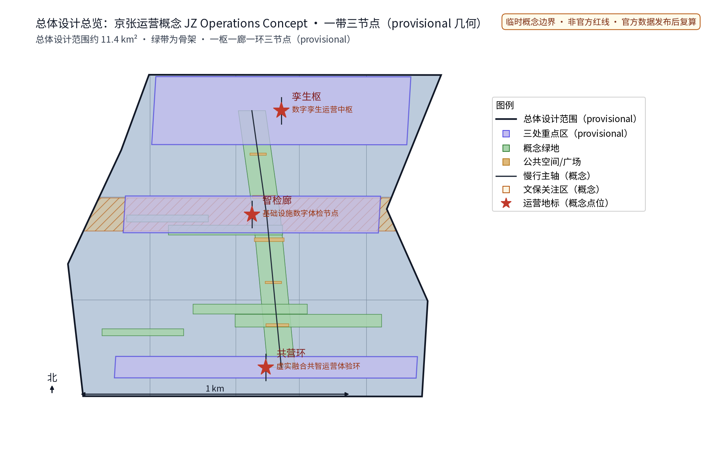
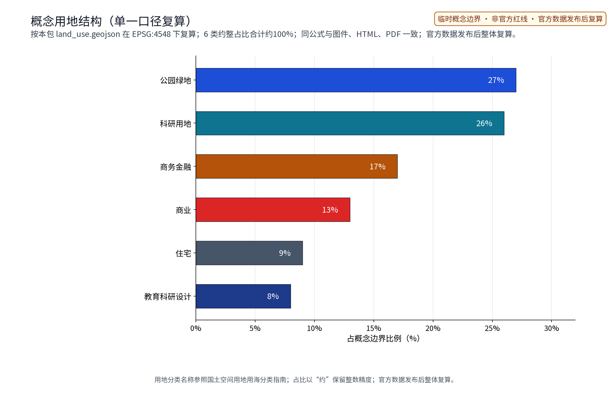
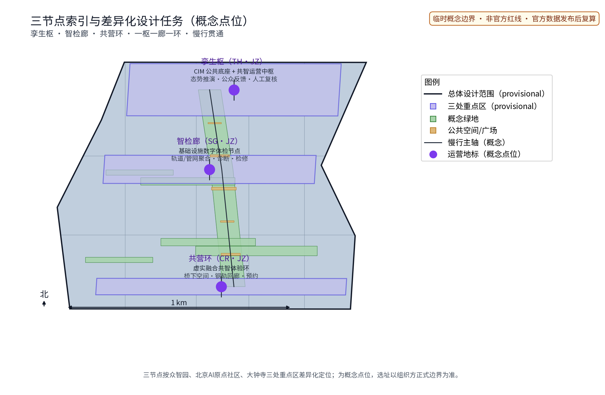
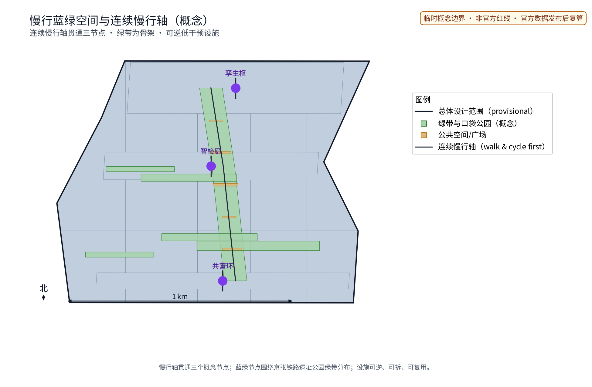
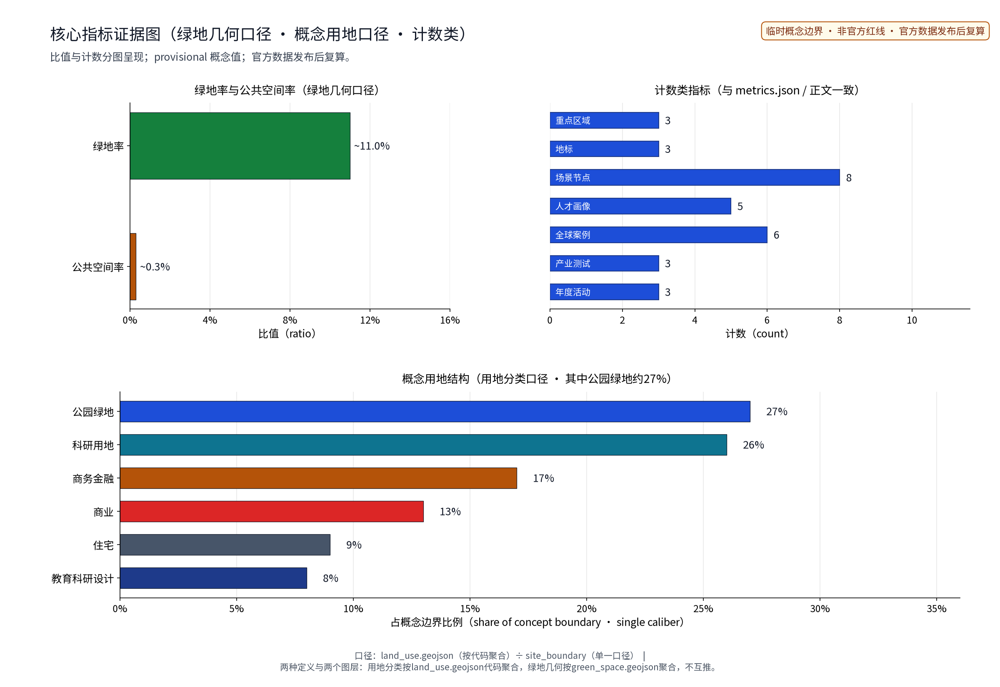

## Concept-level · provisional boundary · bilingual edition

All content is a concept proposal and reference scheme for professional teams to develop further; the Chinese and English versions have been manually checked for substantive equivalence, and the English version is an official deliverable of this package. The proposed name and mark have been retired because no legally reliable prior-right clearance conclusion could be formed. This package uses “JZ Operations Concept / 京张运营概念” as a neutral text-only label, with no trademark claim, registration or commercial use.

## Name and Overall Concept (Concept)

“JZ Operations Concept · Digital Twin Operations System”（京张运营概念）organizes a physical-virtual operations environment along the backbone of the Jingzhang Railway Heritage Park green belt: a CIM public-service base as the foundation, an operations-monitoring sensing network as the eyes, forecasting and co-ops operations as the path. CIM and co-ops operations are concept-level public data-service suggestions with no engineering values presupposed. The neutral label is plain text for this submission only and makes no trademark or identifier claim. The concept is structured as “one hub, one gallery, one ring”: the Twin Hub, the Sense Gallery and the Co-Ops Ring. The scheme keeps provisional boundaries: all scale and column figures are self-set assumptions for review discussion, not official commitments.

### agent.1 Current visual identity and logo direction (rights-safe)

The current direction is a graphic-free wordmark, not a revived or newly claimed emblem. The bilingual wordmark pair is **京张运营概念** / **JZ Operations Concept**. The English wordmark is set in title case; the Chinese wordmark is set without extra symbol or seal. The palette is ink `#111827`, innovation blue `#1D4ED8`, public green `#15803D` and caution amber `#B45309`; body and wordmark type uses Noto Sans SC Regular 400 and Bold 700, with the same family’s Latin glyphs. Clear space is 1u on every side, where 1u is the cap-height of the wordmark; the minimum digital sizes are 24 px Chinese / 18 px English, and the minimum print sizes are 8 mm Chinese / 6 mm English. Use cases are the cover, A0/A3 boards, HTML/PDF headers, bilingual wayfinding mock-ups and concept event cards, always with a provisional label where appropriate. The wordmark may not be used as an official project seal, government identity, public launch mark or commercial endorsement. The rights status is bounded: `BRAND-SEARCH-3883-20260829` records a package-level search note, not a legal clearance opinion; no prior un-cleared name or graphic mark is restored, no trademark claim is made, and any public or commercial use requires a later professional clearance. Node names and the cultural wayfinding system remain separate from the scheme wordmark.

## Design Basis and Source List (Concept Data Inventory)

The actually used and verifiable basis is limited to: the solicitation announcement and agent taskbook (official wording basis; `DATA-SRC-OFFICIAL-ANNOUNCEMENT-2026-0509`, `DATA-SRC-AGENT-TASKBOOK-2026-0518`); the Beijing science/technology and Zhongguancun commission public context page on “three areas, two wings” (`DATA-SRC-BJ-KW-THREE-AREAS-WINGS-2026-0403`, context only, not a statutory boundary); the National Railway Administration’s public Jingzhang history page (`CULTURE-HISTORY-JINGZHANG-NRA-2017`) and the Beijing science/technology and Zhongguancun commission public Zhongguancun history page (`CULTURE-ZGC-HISTORY-BEIJING`) for clearly separated history and current-clue layers; the Ministry of Housing and Urban-Rural Development urban-design and regulatory-plan procedures, the Ministry of Natural Resources land-use classification, the Barrier-Free Environment Law and the Interim Measures for Generative AI Services; this package’s participant-authored provisional geometry; and six public digital-twin cases plus the font/tool/mark rights records. Publisher or collector, date, spatial-temporal scope, method, licence/ownership, reuse restriction, local path and supported claims are itemized in `sources.json` for each entry.

This package contains and uses no self-collected on-site survey notes or hand-drawn site sketches. It does use the two public culture pages above only for bounded historical/current-clue statements: the Jingzhang construction history is not a site survey, and the Zhongguancun development narrative is not evidence for a project-level enterprise, ownership or control-plan claim. The original concept layer is explicitly “Operating Archive · Co-creation Deliberation · Reversible Exhibition”; it is not presented as history. The package does not use independent Jingzhang Railway Heritage Park plans/reports, Beijing master or district plans, project-level public control-plan/renewal guidance or CIM technical guidelines as evidence. “Jingzhang Railway Heritage Park” in the announcement/taskbook remains project-text context unless supported by the cited public history page. Since no self-collected material is present, this package has no collection record for people, vehicles, location tracks or restricted spaces and makes no invented author/privacy declaration for absent material; official geometry, existing land use, regulatory, heritage, municipal-capacity and operations baselines remain `unknown/to_verify`.

> **Evidence anchor**: [source:DATA-SRC-OFFICIAL-ANNOUNCEMENT-2026-0509], [source:DATA-SRC-AGENT-TASKBOOK-2026-0518].

## Three-Level Scope Framework (Working Framework)

The official announcement wording defines the three-layer scopes: the coordinated research scope of approx. 43.6 km2, the overall design scope of approx. 11.4 km2, and three key detailed-design areas totalling approx. 368.4 ha. This package’s own sub-scope sits within the overall-design-scope concept framework; the three layers, figures, matrices and the English version are consistent. The organizer has not yet published verifiable coordinate-system polygons for the official scopes; all geometry here is a provisional design model to be recomputed as a whole when official geometry is released, and no statutory planning conclusions are drawn at this stage. The three layers cascade: coordinated-research results on the digital-twin operations environment and corridor coordination constrain the overall design; the overall design's sensing-network layout, operations nodes and phasing are implemented in the node detailed designs; every layer keeps machine-readable evidence anchors to the corresponding taskbook sections. Layer 1 researches industry and future city within the coordinated scope; Layer 2 reaches regulatory-depth urban design in the overall scope; Layer 3 details the Twin Hub, Sense Gallery, Co-Ops Ring and station-city nodes. All three layers share one CIM base with tiered data, progressive detailing and closed-loop review.

> **Evidence anchor**: [source:DATA-SRC-AGENT-TASKBOOK-2026-0518], [source:DATA-SRC-PROVISIONAL-BOUNDARIES-2026-0605].

## Coordinated Research Area: Industry and Future City Research

The industry study identifies the “fit” effect of digital-twin operations: the CIM public-service base and monitoring network organize the operations demands of universities, science-and-innovation areas, rail stations and residential quarters along the corridor into two-way-accessible innovation units, forming a three-tier structure of “digital base – innovation area – station-city quarter”, corresponding to the intelligent vital-city and AI+ scenario-empowerment directions among the five functions. The “three areas, two wings” concept restores the taskbook names: Zhongguancun Technology Service Wing (中关村科技服务翼) and Xiaoyuehe Scenario Empowerment Wing (小月河场景赋能翼). This package also uses West Coordination Band and East Coordination Band as custom operational band labels; they are one-to-one mappings, not renamed statutory entities. Regional coordination is expressed mechanically: pilot community-level co-ops with the Beihui Community; shared computing capacity and model-evaluation baselines with the Future Science City; open data of large-science installations linked with Huairou Science City; mutual recognition of data sandboxes with the Economic-Technological Development Area; and membership in the Beijing-Tianjin-Hebei digital-twin city coordination network – all as concept mechanisms carried by a “coordination convention” covering data interoperability, shared platforms, joint events and standard mutual recognition.

| Standard taskbook term | Custom operational mapping | Three areas | Three nodes | Five functions / scene expression |
|---|---|---|---|---|
| Zhongguancun Technology Service Wing (中关村科技服务翼) | West Coordination Band | Zhongzhiyuan AI Acceleration Area lead; Beijing AI Origin Community coordination | Twin Hub; Sense Gallery | AI full-stack autonomous innovation system; world-class AI innovation ecosystem; global AI-governance voice; Industry Window / Twin Screen / Health Line |
| Xiaoyuehe Scenario Empowerment Wing (小月河场景赋能翼) | East Coordination Band | Beijing AI Origin Community lead; Dazhongsi AI Industry Cluster coordination | Sense Gallery; Co-Ops Ring | AI+ scenario-empowerment new paradigm; intelligent vital city; world-class AI innovation ecosystem; Booking Stop / Co-Ops Ring / Walk With Me |
| Three-area closed loop | West + East bands share the operating loop | All three areas | Twin Hub + Sense Gallery + Co-Ops Ring | All five functions through scenario cards, industry tests and governance review |

The table is the bilingual naming and mapping anchor: the standard wings remain the official taskbook terms, while the custom bands, area links, node links, five functions and scene cards remain this package’s concept structure. Global case comparison (all public sources; item-by-item references in sources.json):

| Case | Agency / City | Mechanism to learn from | Source |
|---|---|---|---|
| Virtual Singapore | Singapore (National Research Foundation et al.) | National digital-twin base: open government data + research collaboration + simulation platform | [source:CASE-VS-2017] |
| Helsinki 3D+ | City of Helsinki, Finland | Open city information model: semantic CityGML + energy and climate atlas + open licence | [source:CASE-HEL-2025] |
| Digital twin of Zurich (Zürich 4D) | City of Zurich, Switzerland | Urban digital twin + open government data: 3D model OGD publication + public participation | [source:CASE-ZUR-2020] |
| Xiong'an digital-twin city | Xiong'an New Area, China | Digital city planned and built in parallel with the physical city: CIM platform + one-centre-four-systems | [source:CASE-XIONGAN-2025] |
| Shenzhen digital-twin pioneer city | Shenzhen, China | CIM platform + Pengcheng self-evolving city agent: city-district platform system and scenario applications | [source:CASE-SZ-2023] |
| Shanghai Lingang digital-twin demonstration zone | Shanghai, China | City-level digital twin programme: nine scenario directions + IoT sensing + standards | [source:CASE-LINGANG-2022] |

Future-city research is directional only: along the Jingzhang green belt and rail lines it studies “station–industry–city” coupling, hosting the AI innovation ecosystem, absorbing Zhongguancun spill-over innovation and pushing renewal of low-efficiency railway-corridor land. Scenario projections (population, jobs, industry) rely on public statistics plus provisional assumptions and imply no land or investment commitment.

## Overall Design Area: Urban Renewal and Regulatory-Plan-Level Urban Design

The overall design emphasizes a “digital-twin operations environment with the green belt as its skeleton”: the Jingzhang Railway Heritage Park green belt organizes the sensing network, operations nodes and slow-traffic skeleton; sensing facilities grow reversibly and streets respond by time-of-day; renewal is prioritized over new build, with existing stock preferred for operations nodes; regulatory indicators are reviewed as suggestions only, with no numeric conclusions presupposed. Renewal first, micro-remediation second, preserving the railway industrial memory; a regulatory-depth control framework is set for land use, FAR, height and setbacks with all values marked “assumptions to be verified”; TOD integration and station-city coordination are strengthened to stitch the urban fabric severed by the railway and link station functions with co-ops. The three positions (Centennial Jingzhang Culture Belt, Urban AI Life Experience Belt, AI Integration and Innovation Belt), the five functions, and the standard wings mapped to the custom West/East Coordination Bands form a verifiable coordination loop with this scheme: positions set the character, functions set the content, the standard wing names set the naming anchor, bands and areas set the pattern, three nodes set the landing points – see belt-structure.png and the board set.

> **Evidence anchor**: [source:DATA-SRC-MOHURD-CONTROL-DETAILED-PLANNING], [source:DATA-SRC-PROVISIONAL-BOUNDARIES-2026-0605].

## Detailed Design of Key Areas (Three Nodes)

All node locations are concept points requiring planning, heritage and competent-authority assessment before relocation; the green-belt lines and slow corridors between nodes form a complete digital operations route, and detailed plans and sections are expressed in the board/booklet and geometry layers. The Twin Hub sits at the station-city core with the co-ops operations hall, AI laboratory and CIM command seats; the Sense Gallery places sensing and health-archive nodes along the heritage-park green belt; the Co-Ops Ring links squares, slow corridors and elevated-viaduct under-space into a perceptible, interactive physical-virtual experience ring. Landmark catalogue (concept):

| Landmark | Location | Programme | Honour display |
|---|---|---|---|
| “Co-Ops Tower” digital landmark | Twin Hub core square | Public operations-status display + co-ops hall | “Annual Co-Ops Medal” digital honour wall (public notice system) |
| “Rail Memory Gallery” heritage landmark | Sense Gallery green belt | Infrastructure health archive + industrial memory exhibition | Maintenance-craft honour board and memorial rail (record-filing system) |
| “Under-Viaduct Co-Living Pavilion” experience landmark | Co-Ops Ring under-space | Physical-virtual experience pavilion + cultural wayfinding centre | Community co-ops honour screen (points system) |

Reversible public-space component library (reversible, modular; every component has a documented restoration path and removal plan): the “reversible sensing rack” modular sensing post, “time-split seating” lifting modules, “light pavilion” membrane units, “smart flash sign” trenchless interactive ground lights, and the “co-ops screen kiosk” modular information booth. Perceptible design for residents at every node: “can experience” – public screens with anonymized status, health-archive public summaries, physical-virtual exhibits; “can control” – booking time slots, voting on agenda topics, choosing rotating content; “can refuse” – one-tap opt-out of push content, human-guided alternatives to digital interfaces, no data collection when not participating.

> **Evidence anchor**: [data:PACKAGE-GEOMETRY] (node polygons from geometry/key_areas.geojson).

## AI Innovation Ecosystem, Personas, and AI+ Scenarios

The AI innovation ecosystem is organized as a five-layer map (see ai-ecosystem.png): the CIM base, tiered data resources (public and self-generated, no individual-level data), model services (operations-simulation AI, facility-health-diagnosis AI, pedestrian-flow-forecasting AI, energy-carbon-monitoring AI, public-co-ops-feedback AI), scenario applications (twelve scenario cards) and governance mechanisms (anonymized aggregation, minimum necessity, human review, tiered authorization). Ecosystem culture mechanisms: a developer community (open platform, code repository, data sandbox, shared benchmark sets), a “five-step scenario opening process” (application – review – filing – pilot – roll-out), a talent conversion pathway (university joint training, enterprise scenario co-building, developer certification points), an enterprise conversion pathway (scenario list matching, pilot-support directions), and a developer conversion pathway (competition winners enter the pilot list first) – all concept mechanisms. AI technical protocol directions: model evaluation (benchmark tests, held-out sets), data quality (unified calibre, missing-value annotation), error stratification, runtime monitoring (false-alarm rate, alarm-handling latency) and human-review-point registration. The persona map covers five persona groups: research-type AI talent from universities and institutes, entrepreneur-type talent from Zhongguancun-system enterprises, operations-type digital-twin compound talent, developer-type open-source community talent, and public-service-type community operations talent. AI+ scenario cards (twelve; each card carries input data, model task, output, trigger, responsible actor, human veto point, failure mode and evaluation metric):

| Scenario card | Location | Audience | Input and model task | Trigger and responsible actor | Human veto and failure mode | Evaluation metric |
|---|---|---|---|---|---|---|
| “Twin Screen” CIM operations monitoring | Twin Hub | Operators, practitioners | Anonymized aggregate operations data → situation simulation and anomaly detection | Threshold trigger; operator | Human review before alert publication; missing data falls back to manual inspection | Alert accuracy |
| “Health Line” facility diagnosis | Sense Gallery | Inspectors, maintenance units | Aggregated inspection of rail/bridges/networks → health diagnosis | Monthly evaluation; municipal utility operator | High-impact conclusions human-reviewed; sensor failure falls back to manual inspection | False-alarm rate, recall |
| “Co-Ops Ring” physical-virtual experience | Co-Ops Ring | Visitors, residents | Booking and on-device interaction → content scheduling | Booking trigger; operator + content partner | Content human-reviewed; equipment failure switches to human guides | Experience satisfaction |
| “Walk With Me” accessible wayfinding | Three nodes and green belt | Seniors, persons with disabilities | Opt-in location → route planning and voice guide | One-tap activation; volunteers + human backstop | Key nodes human-reviewed; emergency stop button | Complaint rate, closure rate |
| “Booking Stop” public-service booking | 15-minute life-circle nodes | Residents, families | Aggregated time-slot bookings → demand forecasting and scheduling | Time-split opening; community operator | Special needs arranged by staff; fallback to phone booking | Booking fulfilment rate |
| “Time-Split Street” street response | Station-city blocks | Shops, residents, commuters | Anonymized pedestrian-flow aggregates → time-of-day mode recognition | Event/commute trigger; transport authority | Mode switch requires human confirmation; default mode when sensing unavailable | Travel satisfaction |
| “Carbon Window” energy-carbon monitoring | Sense Gallery extension | Park operators, property | Aggregated utility metering → carbon estimation | Monthly settlement; property + energy service provider | Anomalous data human-verified; missing metering estimated with annotated calibre | Data completeness |
| “Consensus Screen” public co-ops feedback | Three nodes and online | All residents, visitors | Anonymized opinion aggregation → topic clustering | Opinion-threshold trigger; operator + community council | Topics screened by humans before meetings; review channel for misinterpretation | Feedback closure rate |
| “Wisdom Island” science-learning space | Co-Ops Ring culture node | Students, families | Booking and course data → content recommendation | Semester/holiday trigger; university + volunteers | Content expert review; fallback docents when lecturers absent | Participation count |
| “Industry Window” innovation showcase | Twin Hub gallery | Startups, investors | Exhibition registration data → display route planning | Application trigger; industry operator | Achievement authenticity human-verified; takedown mechanism for copyright disputes | Conversion contacts |
| “Safe Ladder” emergency evacuation aid | Stations and underground space | All people | Anonymized density aggregates → evacuation simulation | Emergency trigger; rail operator | Commands human-confirmed; offline broadcast on network failure | Drill pass rate |
| “Cloud Clinic” utility-network inspection | Sense Gallery | Water, gas utilities | Aggregated network monitoring → leak-location assistance | Pressure anomaly trigger; municipal utility | Excavation decisions human-reviewed; large location error falls back to manual detection | Location hit rate |

Industry test-and-validation scenarios (three; testing before scaling, human review as backstop):

| Test scenario | Test protocol | Data input | Spatial condition | Acceptance metric | Responsible actors (lead/collaborator) | Failure fallback |
|---|---|---|---|---|---|---|
| Pedestrian-flow AI pilot test | Benchmark protocol (recalibrated with official data when published) | Anonymized station entry/exit aggregates (no individual data) | Wudaokou station-city pilot section | Forecast error below baseline, false-alarm rate below threshold | Operator leads, university collaborates | Manual staffing when forecasts unavailable |
| Facility-diagnosis AI sample-section test | Model-evaluation protocol (held-out split, error stratification) | Public inspection records and aggregate sensing data | Sense Gallery sample section | Recall and false-alarm dual metrics | Maintenance unit leads, professional team collaborates | Manual re-inspection when diagnosis fails |
| Energy-carbon AI calibre test | Data-quality protocol (unified calibre, missing annotation) | Aggregated building utility metering | Zhongzhiyuan pilot | Data completeness; verified consistency of carbon ledger | Property leads, energy provider collaborates | Estimation with annotated confidence when metering missing |

Three governance sentences: process anonymized aggregate data only; key decisions are human-reviewed; over-surveillance is prohibited. The scenario–space–operations–governance matrix binds every scenario card to a location (space), an operations mechanism (booking/rotation/dispatch/deliberation) and governance boundaries (human veto point and privacy boundary), as shown in the card columns. The AI scenario domains cover all six: governance, space, industry, public services, culture and mobility, each backed by human review.

> **Evidence anchor**: [source:DATA-SRC-GENERATIVE-AI-INTERIM-MEASURES], [source:DATA-SRC-BARRIER-FREE-ENVIRONMENT-LAW].

## Land Use, Building Scale, and Retain-Renovate-Demolish Strategy

The retention-renovation-demolition approach keeps all three in parallel: retention first, preserving the heritage-park fabric and railway relics; stock buildings get function replacement and reserved digital-upgrade directions (sensing facilities, data interfaces); demolition is limited to individually assessed scattered buildings that clear slow-traffic routes. Land-use ratios here use a single calibre: geometry/site_boundary.geojson as the only calculation boundary; ratios are aggregated from concept land-use polygons and are provisional assumptions only – when official regulatory and survey data is published, everything is recomputed from the same calibre with a recompute version marked. Concept land-use structure (share of the concept boundary): park green space approx. 27%, research land approx. 26%, business-financial land approx. 17%, commercial land approx. 13%, urban residential approx. 9%, education-research-design land approx. 8%, totalling approx. 100% (single-calibre aggregation) – all values rounded to whole per cent with an “approx.” prefix. Data gaps (building age, ownership, structural condition, building-by-building heritage checks, regulatory conditions) are registered in assumptions.json and the missing-data notes; retention/renovation/demolition stays at the principle level with no specific conclusions.

> **Evidence anchor**: [source:DATA-SRC-MNR-LAND-USE-CLASSIFICATION-202311].

## Transport, Rail, Municipal Infrastructure, and Public Services

Slow-traffic-first mobility is the core mechanism: a continuous slow-traffic axis along the green belt links the Twin Hub, Sense Gallery and Co-Ops Ring; street sections respond by time-of-day to activity demand (morning market, events, daily modes); campuses, parks and rail stations along the corridor are connected with walking- and cycling-first access; pedestrian-flow and activity forecasts support time-split, zone-based management. Rail station-city coordination integrates entrances and podium development; municipal works are intensive and shared, with sensing and data facilities integrated into buildings where possible and existing municipal conditions preferred; facility-diagnosis AI supports utility-network inspection; public services are arranged by 15-minute life circles with physical-virtual booking and sharing. Inclusive service channels: multilingual services, accessible routes, senior-friendly type size and voice, traditional staffed counters and phone channels, on-site help stations, complaint and review channels, and emergency downgrade (analogue signage plus staffing on network/power failure), covering seniors, children, persons with disabilities, people with low digital capability and users without smart devices; all-age-friendly and child-friendly requirements enter the component-library acceptance checklist.

> **Evidence anchor**: [source:DATA-SRC-MOHURD-URBAN-DESIGN-MEASURES], [source:DATA-SRC-BARRIER-FREE-ENVIRONMENT-LAW].

## Blue-Green Network, Public Space, and Urban Character

A “green belt as the axis, node parks as pearls” blue-green public-space system: the heritage-park green belt is the main ridge linking small green spaces, under-viaduct space and pocket parks; sensing facilities blend into blue-green space, light, transparent and reversible, never blocking heritage remains or green-belt views; under-viaduct space is grouped into “reversible sensing rack + time-split seating” sets, forming a continuous blue-green public-space system. The culture-and-wayfinding system is unified and restrained: signs and interpretation use the “Rail Memory Gallery” industrial-memory vocabulary, bilingual wayfinding and tiered interpretation texts (for children, seniors and professional visitors); digital display facilities blend into the parks. City character continues the Jingzhang railway industrial-memory vocabulary in dialogue with a physical-virtual digital atmosphere, guided with restraint and no symbolic stacking or slogan packaging.

**agent.5 Culture resource system (history, current clues, original concept)**: the verifiable history is the National Railway Administration’s public account of the 1905–1909 Jingzhang construction and Chinese-led surveying, design, construction and management; the verifiable current clue is the Beijing science/technology and Zhongguancun commission’s public account of Zhongguancun’s development from the electronics street of the 1980s into a national innovation-demonstration ecosystem, read together with the public three-areas/two-wings context page. Neither is presented as a project survey, property conclusion or inherited project brand. The original concept layer is “Operating Archive · Co-creation Deliberation · Reversible Exhibition”:

| Culture layer | Verifiable content / boundary | Spatial carrier | Signage and wayfinding | Event concept | International narrative |
|---|---|---|---|---|---|
| Jingzhang engineering history | 1905–1909 construction and Chinese-led engineering, from `CULTURE-HISTORY-JINGZHANG-NRA-2017`; no unlicensed image or heritage conclusion | Rail Memory Gallery along the green belt | “Rail Memory” bilingual interpretation, with source and date | Engineering Memory public class | “Engineering memory as a public ethic” |
| Zhongguancun innovation culture (current clue) | 1980s electronics street and innovation-zone evolution, from `CULTURE-ZGC-HISTORY-BEIJING` plus the three-areas/two-wings context; no enterprise or investment claim | Twin Hub service interface and open service wall across the two mapped bands | “Open Service” bilingual service marker alongside the standard wing names | Open Innovation Services Day | “From engineering independence to open innovation services” |
| AI culture (original concept) | “Operating Archive · Co-creation Deliberation · Reversible Exhibition” is authored concept text, not history; no individual profile or unlicensed work | Co-Ops Ring deliberation pavilion and reversible exhibition modules | “Experience / Control / Refuse” and staffed alternatives | Public AI Operations Studio, with booking, rotation, deliberation, filing and public reporting | “People-first AI culture: experience, control, refuse” |

This mapping carries Jingzhang engineering ethics, Zhongguancun open collaboration and people-first AI governance into four distinct carriers—space, signage, events and international communication. The original layer remains a concept proposal; any facility, event or public communication requires authorization and human review. International communication copy (concept direction): “From the century-old railway to the urban operating system — JZ Operations Concept” as the bilingual narrative, with international-conference boards, a developer-community English channel and an annual overseas social-media publishing plan; all communication content is human-reviewed.

> **Evidence anchor**: [source:DATA-SRC-MOHURD-URBAN-DESIGN-MEASURES].

## Renewal Projects, Implementation Policy, and Phasing

Four project families (CIM-base pilot / sensing-network roll-out / operations-service implant / co-ops platform launch) are a concept list; scale and investment estimates are suggestive only with qualitative low/medium/high tiers (estimation method, price basis, coverage, confidence level and recompute triggers in the indicators section). Policy suggestions – data opening and coordination, multi-actor co-building, opinion-review mechanisms, flexible FAR-bonus direction, development-with-brief direction, co-ops operation concession direction – all require lawful case-by-case demonstration and imply no government or operator commitment. The implementation matrix follows RACI conventions with explicit leads (R/A) and collaborators (C/I), covering data input, spatial conditions, acceptance metrics, human review, privacy boundaries, failure fallback, exit conditions, facility maintenance and annual evaluations:

| Work package | Phase | Pilot area | Lead | Collaborators | Data input and spatial conditions | Acceptance metric | Human review / privacy boundary | Failure fallback | Stop and exit conditions | Maintenance and annual evaluation |
|---|---|---|---|---|---|---|---|---|---|---|
| CIM-base pilot | Near term 1-3 yrs | Zhongzhiyuan pilot section | Data agency | Universities, enterprises | Public basemap + self-generated geometry; existing server rooms and station-city plots | Base availability + four indicator families online | Key outputs human-reviewed; anonymized aggregation, minimum necessity | Single-point failure falls back to offline ledgers | Two consecutive years below acceptance metrics → stop expansion and decommission pilot | Unified maintenance + modular reversible facilities; annual operations evaluation published |
| Sensing-network roll-out | Near to mid term | Sense Gallery sample section | Municipal utility operator | Professional team, property | Aggregated inspection data; green belt and under-viaduct space | Sensing coverage, data completeness | High-impact alerts human-reviewed; no individual identification, one-tap opt-out | Sensor failure falls back to manual inspection | False-alarm rate above threshold → rectify or halt item | Vendor maintenance contract + annual testing; maintenance report published annually |
| Three nodes completed | Mid term 3-5 yrs | Wudaokou–Zhichunlu section | Planning authority | Communities, shops, universities | Regulatory and heritage clues; station-city plots and heritage surroundings | Node delivery checklist + scenario cards online | Spatial schemes human-reviewed; anonymized aggregate displays | Content under copyright dispute triggers takedown | Fails public appraisal → revise and re-appraise | Public-facility maintenance fund; annual co-ops evaluation |
| Co-ops platform launch | Mid to long term | Area-wide progressive | Operations actor | Developer community, volunteers | Scenario feedback and operations data; platform and offline nodes | Scenario cards online, feedback closure rate | Decision publication human-reviewed; tiered authorization, record filing | Platform unavailable → human service channels | Two consecutive years below activity thresholds → decommission function | Versioned platform maintenance; annual evaluation published |
| Area-wide co-ops operations | Long term 5-10 yrs | Three nodes + green belt area-wide | Co-ops alliance | Government, enterprises, universities, communities | Area-wide aggregate operations data; whole space | Annual target achievement of indicator system | Key decisions human-reviewed; over-surveillance prohibited | Abnormal events downgrade and drill | Alliance charter defines exit and asset handover | Full-lifecycle maintenance; annual evaluation report public |

Annual event brand system (three brands, each bound to annual publication):

| Annual event brand | Cadence | Space | Participation mechanisms | Annual publication |
|---|---|---|---|---|
| Digital Twin Open Day | Annual | Twin Hub + Co-Ops Ring | Booking, volunteer recruitment, points rewards | Event outcomes published annually |
| Co-Ops Operations Workshop | Multiple times a year | Sense Gallery co-ops hall | Community deliberation, convention co-creation, rotating topics | Topics and resolutions published annually |
| Twin-Real Experience Season | Quarterly cycle | Co-Ops Ring + green belt | “Ring Screening” booking, content rotation, tiered tours | Season report published annually |

Phasing: near term (1-3 yrs) base and demonstration section; mid term (3-5 yrs) three nodes completed; long term (5-10 yrs) area-wide co-ops operations. The Zhongzhiyuan AI Acceleration Area is the pilot first, with the Sense Gallery sample-section test in parallel; expand only where proven.

> **Evidence anchor**: [source:DATA-SRC-AGENT-TASKBOOK-2026-0518].

## Metrics, Area Recalculation, and Compliance Matrix

Concept indicator table (data source, formula, confidence level, use restriction and recompute trigger for each item, registered in metrics.json):

| Indicator | Formula and data source | Confidence | Use restriction and recompute trigger |
|---|---|---|---|
| Concept land area | polygon_area(provisional boundary) | Medium | Concept display only; recompute when official geometry is published |
| Green ratio | concept green area ÷ concept boundary area | Low | Not an official indicator; recompute when official data is published |
| Public-space ratio | concept public-space area ÷ concept boundary area | Low | Not an official indicator; recompute when official data is published |
| Scenario-card and node counts | counts from scenario table and geometry | High | Concept counts; updated with the cards |
| Case and programme counts | counts from case and event tables | High | Concept counts; updated with public sources |

Five concept indicator families – CIM coverage, sensing-point density, slow-traffic and pedestrian-flow forecast accuracy, online energy-carbon monitoring rate, co-ops event participation – enter metrics.json. Area recalculation uses the official wording as the baseline (approx. 43.6 km2, approx. 11.4 km2, approx. 368.4 ha) and recomputes as a whole with a recompute version marked when official data arrives. Investment uses qualitative low/medium/high tiers with estimation method (analogous-projects and unit-cost directions), price basis (Q2 2026), coverage (construction plus three years of operations), confidence level (low) and recompute trigger (after official project-calibre release) registered item by item. The compliance matrix links higher-level plans, regulatory plans, surveying and data-security regulations with “assumption/to-be-verified” status; the standard matrix, design-depth matrix and compliance matrix point to distinct real content in this document and the corresponding JSON files; investment and capacity use qualitative low/medium/high tiers, never conclusive figures.

> **Evidence anchor**: [metric:green_ratio], [metric:public_space_ratio], [source:PACKAGE-GEOMETRY].

## Risk, Copyright, and Compliance

Risks are registered in risk.json along four dimensions: operations-data privacy boundary; digital-twin model and sensing technology maturity; acceptance of monitoring facilities and street vitality; operations cost and data-opening policy uncertainty. Response principles: anonymized aggregation, minimum necessity, human review, source annotation and an opinion channel. This package has no self-collected survey/sketch material and therefore makes no claim about people, vehicles, location tracks or restricted spaces; if the organizer later supplies or commissions field material, an auditable author, time, extent, method, raw-input access, de-identification, minimum retention/deletion and incident-response log must precede model use. The privacy protocol applies to the proposed operation only: de-identify before model receipt, suppress low-count public outputs, human-review key decisions and prohibit over-surveillance; absent materials must not be described as already anonymized. This scheme is concept research, not an administrative-approval basis, and contains no FAR, building-height, retention/demolition or engineering-feasibility conclusions; all scale data is provisional and recomputed when official data is published. Copyright and rights are registered item by item in `sources.json`: the announcement, taskbook, public context page, National Railway Administration history page, Zhongguancun history page, standards/regulations, cases, font, tools and mark records actually used are listed; no master-plan/CIM-guideline or self-collected survey material is used as evidence. All figures are programmatically self-drawn with matplotlib over participant-authored schematic geometry, not copies of official basemaps; the display font is Noto Sans SC (SIL open-font licence, see the font entry in sources.json); there is no graphic mark in the current direction, only the bilingual text-only wordmark specified above; generation and layout tools (matplotlib, numpy, Pillow, reportlab etc.) are open-source BSD-type licensed, and generative-AI content is declared and human-reviewed. Brand prior-rights and usage boundary: the package-level search note is not legal clearance; the text-only wordmark remains provisional, is not an official seal, not registered and not commercially licensed, and any public use requires later professional clearance. Formal implementation requires multi-department joint review, heritage-protection and safety assessment. Citations of generative-AI regulation serve as wording reference only within its scope and do not prove any filing or compliance review of a digital-twin system.

> **Evidence anchor**: [source:DATA-SRC-OFFICIAL-ANNOUNCEMENT-2026-0509].

## References

References are limited to actually used and verifiable entries: the announcement and taskbook; `DATA-SRC-BJ-KW-THREE-AREAS-WINGS-2026-0403`; `CULTURE-HISTORY-JINGZHANG-NRA-2017`; `CULTURE-ZGC-HISTORY-BEIJING`; the MOHURD urban-design/regulatory-plan procedures; the MNR land-use classification; the Barrier-Free Environment Law; the Interim Measures for Generative AI Services; participant-authored provisional geometry; six digital-twin cases; and the font/tool/mark records. Beijing master/district plans, project-level control-plan/renewal guidance, CIM guidelines and self-collected survey/sketches are not used in this package. The heritage-park phrase remains bounded by the announcement/taskbook and the cited public history source; the cultural table distinguishes history, current clues and original concept. `sources.json` registers the evidence and rights boundaries item by item; official geometry, existing land use, regulatory, heritage, municipal-capacity and operations-monitoring baselines are marked `unknown/to_verify`.

> **Evidence anchor**: [source:DATA-SRC-OFFICIAL-ANNOUNCEMENT-2026-0509].
