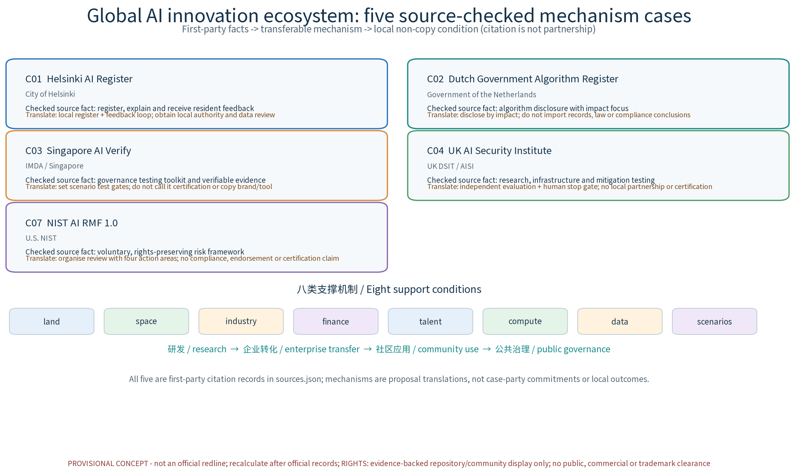

# DUAL·JZ: Dual-Use Peacetime Emergency Spatial System (Concept)

**Status and limit.** This is a concept proposal for the Haidian segment of the Centennial Jingzhang AI Innovation Belt. It is a planning hypothesis, not an approval, engineering, emergency-command, investment or implementation commitment. The boundary and all calculated areas are provisional; official polygons, statutory controls, ownership, rail, fire, heritage, utility and operational data are not available and must trigger a full recalculation.

## 1. Concept and three-tier scope

**DUAL·JZ / 平急融环** makes peacetime public life and emergency readiness use the same spatial spine. The system has three concept nodes: **Dual-Use Hall** (hub conversion), **Convertible Gallery** (greenway-neighbourhood transfer), and **Resilience Court** (community shelter, information and assisted communication). The operating loop is **pre-position - convert - coordinate - sense - review**: everyday use creates maintenance records, drills test conversion, public disclosure records impacts, and inter-department review adjusts the next cycle.

The work is tiered: coordinated research (about 43.6 km² in the official announcement text), overall design (about 11.4 km² in that text), and three key-area concept tasks (about 368.4 ha in that text). These are text references, not official geometry. Regional questions constrain the overall belt; the overall belt allocates nodes and conversion routes; node tests return evidence to regional and annual review layers.

## 2. Taskbook hierarchy and regional cooperation

The taskbook's internal hierarchy is explicit. The **three areas** are Beijing AI Origin Community, Zhongzhiyuan, and Dazhongsi AI Industry Cluster. The **two wings** are the Zhongguancun Tech-Service Wing and the Xiaoyuehe Scenario-Enablement Wing. The three areas host differentiated spatial pilots; the two wings supply research, enterprise service, community and scenario-test capacity. The loop is: key-area question -> wing capability -> node test -> public review -> locality-led correction.

Future Science City, Huairou Science City, the Development Area, Beiwei Community and the wider Jing-Jin-Ji network are **external cooperation objects**, not substitutes for the two wings. Potential knowledge, industrial, community and emergency-resource links require confirmation; no existing cooperation or resource dispatch is claimed. The three taskbook positionings are mapped as heritage, urban AI everyday experience, and AI integrated innovation. Five functions become mobility, public-space, cultural, innovation and governance actions, not a new statutory classification.

## 3. Three node spatial tasks

| Node | Peacetime use | Emergency conversion | Evidence and accountability |
|---|---|---|---|
| Dual-Use Hall | interchange, service, events | human command and supply distribution | conversion checklist, operator log, drill sign-off |
| Convertible Gallery | slow modes, rotating storage, community service | egress, interface kits, assembly | access/interface test, maintenance record |
| Resilience Court | neighbourhood, child and age-friendly activities | shelter, information, assisted communication | access/service audit, public notice |

All three locations are provisional. A node may not enter construction or live emergency operation until official boundary, ownership, rail, fire, heritage, structure, utility and accessibility checks are complete.

## 4. AI ecosystem, cases and people

The concept ecosystem connects eight support conditions: land, space, industry, finance, talent, compute, data and test scenarios. Its proposed chain is university research -> enterprise transfer -> community service -> public governance. Six station/space precedents are kept as a separate reference group: Japanese disaster-prevention parks; Tokyo Metropolitan Area Outer Underground Discharge Channel; Singapore Civil Defence shelters; China's dual-use policy pilots; Beijing Pinggu dual-use practice exchange; and the Netherlands Room for the River programme. They are not global AI ecosystem cases. This bounded source-fact check counts five first-party cases toward `global_case_count=5`: C01 Helsinki AI Register, C02 Dutch Government Algorithm Register, C03 Singapore AI Verify, C04 UK AI Security Institute and C07 NIST AI RMF. C05 and C06 remain non-counted background references. Each case record in `sources.json` retains publisher, URL, publication-date or undated status, access date, checked fact, citation/licence boundary, transferable mechanism and non-copy condition. None implies local partnership, funding, procurement or deployment.

### Global AI ecosystem case table (five formal cases; concept translations)

| Case / source ID | First-party publisher and date status | Verified fact (short form) | Transferable mechanism | Non-copy condition |
|---|---|---|---|---|
| C01 Helsinki AI Register | City of Helsinki; registry date recorded as 2019-12-12, landing page date not displayed; accessed 2026-08-29 | Official page presents a public window into city AI systems with overviews, details and feedback, while retaining human control and resident permission | Local AI-system register with plain-language explanation, owner and resident feedback loop | Local authority, privacy, accessibility and records review first; do not copy page, logo, records or governance claims |
| C02 Dutch Government Algorithm Register | Government of the Netherlands; landing-page date not stated; accessed 2026-08-29 | Official landing page publishes government algorithm information, reports 1322 entries, and focuses on impactful/high-risk algorithms and how they work | Disclose purpose, owner and working description by impact, with extra human/legal review for high-impact entries | Do not import Dutch records, thresholds, legal basis, page design or compliance meaning |
| C03 Singapore AI Verify | Singapore IMDA; official fact sheet published 2022-06-01 and records the 2022-05-25 MVP launch context; accessed 2026-08-29 | First-party fact sheet describes an AI-governance testing framework and toolkit MVP for objectively verifiable responsible AI | Scenario test gates, evidence pack, human sign-off and public test summary before a pilot | Do not call it IMDA/AI Verify certification or approval; do not copy tool, logo, threshold or brand |
| C04 UK AI Security Institute | UK DSIT / AISI; landing-page date not stated; accessed 2026-08-29 | Official page describes a state-backed AI-safety organisation covering research, infrastructure and mitigation testing with researchers, developers and governments | Independent evaluation, research infrastructure, mitigation review and human stop/exit gate | Do not claim UK support, local partnership, safety certification or equivalent capability; do not use name/logo |
| C07 NIST AI RMF 1.0 | U.S. NIST; published 2023-01-26; accessed 2026-08-29 | Official NIST page records a voluntary, rights-preserving, non-sector-specific and use-case-agnostic risk framework | Organise accountability, evidence, error review and pause/exit decisions through Govern / Map / Measure / Manage | Do not claim NIST compliance, certification or endorsement; local authorities define controls |

Only the five `global_ai_ecosystem` records with `counted_in_global_case_count=true` are counted; C05/C06 remain citation-only background references and station/space precedents are separate.

Five representative groups are considered at concept level: research and AI development; residents, families and older people; service operators, volunteers and emergency assistants; students, young people and visitors; and people with disabilities or low digital access. No population or demand sample has been obtained, so these are design prompts rather than demographic facts.

## 5. Twelve AI+ scenario cards

Every card uses anonymous aggregates only, has a human decision point, and may fall back to the existing manual plan. The fields below are a **concept testing protocol**; all current baselines are `to_verify`, not measured performance.

| ID / card | Input -> model or rule -> output | Space / owner | Sample, suggested threshold and stop condition |
|---|---|---|---|
| S01 Conversion dispatch | facility status + plan library -> workflow rule -> checklist | Hall / operator | 3 drills, to_verify; completion >=95%; missing step stops |
| S02 Resource pre-positioning | anonymous population + inventory -> gap rule -> supply plan | Gallery/Court / emergency office | 2 inventory rounds, to_verify; match >=98%; stale inventory stops |
| S03 Egress simulation | anonymous time-space counts + capacity -> discrete simulation -> diversion plan | greenway / emergency office | 10 tabletop sets, to_verify; difference <=10%; manual plan if exceeded |
| S04 Facility inspection | facility-level inspection/sensor log -> anomaly rule -> work order | all nodes / maintenance | 30 checks, to_verify; miss rate <=5%; sensor failure falls back to inspection |
| S05 Public feedback | anonymous text summaries -> topic clustering -> issue list | Court / community council | 100 anonymous samples, to_verify; audit >=90%; sensitive items pause clustering |
| S06 Industry matching | de-identified needs -> matching rule -> sandbox pairing | wing / service team | 20 intent samples, to_verify; 100% human confirmation; no consent, no push |
| S07 Cultural-flow guidance | bookings + anonymous counts -> time-slot rule -> event prompt | heritage spaces / cultural operator | 2 event cycles, to_verify; human confirms crowd alert |
| S08 Accessible wayfinding | facility points + access state -> path rule -> multilingual route and desk ticket | public services / human desk | 20 route checks, to_verify; availability >=95%; missing data means no route |
| S09 Governance dashboard | anonymous aggregates + response log -> statistics rule -> monthly brief | governance platform / locality | 3 months, to_verify; definition changes human-reviewed; mismatch stops publication |
| S10 Slow-mode transfer | anonymous travel aggregates + road state -> network rule -> adjustment advice | greenway / transport operator | 3 AM/PM rounds, to_verify; zero safety conflicts; conflict returns to current plan |
| S11 Public information release | anonymous event summary + human confirmation -> publication rule -> dual-channel node notice | all nodes / information desk | 10 event records, to_verify; 100% human fact check; unknown source stops release |
| S12 Appeal and exit review | anonymous appeals + scene log -> classification/time rule -> monthly appeal and continue/pause/exit brief | governance desk / locality reviewer | 3 review cycles, to_verify; appeal cannot be closed by model; two misses pause the scene |

The shared data contract records version, sample size, missingness, model/rule version, human reviewer, subgroup error, incident, public summary and exit decision. No individual tracking, biometric inference, cross-scenario identity stitching or non-terminable automated decision is proposed.

## 6. Three industry test protocols

| Protocol | Sample and sequence | Pass / exit | Responsibility record |
|---|---|---|---|
| T01 conversion drill | Hall/Court inventory; three tabletop plus field drill records (to_verify). Operator runs S01; emergency office signs each step; only drill zone is activated. | completion >=95%, no safety incident; any incident or reviewer overload exits to peacetime mode | lead: locality emergency office; operator/community; drill log |
| T02 blind egress comparison | ten anonymous aggregate assumptions plus manual plan (to_verify). AI/rule runs independently; experts compare blind; no automatic field command. | difference <=10% with explainable subgroup error; otherwise retain manual plan | lead: emergency office; university/transport; version-difference sheet |
| T03 interface/storage test | thirty facility/interface samples (to_verify). Specialist installs mock-up; maintenance checks it; no field implementation before structure/fire/ownership review. | complete record, no damage, maintainable access; unknown controls block field work | lead: maintenance operator; specialist and rights holder to_verify; inspection sheet |

Before real data access, complete a data-protection impact assessment, anonymisation effectiveness and re-identification tests, legal-basis review, retention, access control, supplier controls and incident response.

## 7. Mobility, blue-green space and public inclusion

The heritage greenway is a concept spine for daily walking and cycling, event management and emergency egress. Open spaces can host supplies and assisted communication only after safety and capacity checks. Accessible routes, multilingual information, a human service desk and volunteer support serve older people, children, caregivers, disabled people and low-digital-access users. Time-slot booking and rotation are proposed for fair everyday use; essential passage and emergency access are not subject to an AI ranking.

## 8. Land use, buildings and implementation limits

The concept follows retain-repair-remove with retention first. The land-use diagram shows six concept target shares (30/25/15/12/10/8, summing to 100%); these are not existing conditions, statutory controls or geometric areas. The separate 11.0044% geometry green ratio is a low-confidence provisional union calculation and must not be compared with those targets. No FAR, height, demolition, capacity, investment or statutory-control conclusion is provided.

## 9. RACI, KPI and long-term operation

| Stage | R (responsible) | A (accountable, proposed) | C / I | Gate and KPI |
|---|---|---|---|---|
| 0 evidence/compliance | specialist/data team | locality lead | rail, emergency, fire, heritage, owners / community | official polygons, controls and baseline register complete |
| 1 tabletop tests | university/enterprise team | scenario owner | operator, community, emergency / public | version, sample, missingness and human sign-off for each card |
| 2 limited drill | operator/volunteers | emergency office | transport, fire, maintenance / residents | T01-T03 pass; incident, bias or overload exits |
| 3 annual operation | operator/community | locality council | enterprise, university, evaluator / public | conversion, safety conflict, response closure, accessible service and disclosure records |

RACI is a proposed coordination model and does not replace statutory duties. Every quarter, publish metric, evidence, decision and appeal. Until baselines exist, report `to_verify`; do not convert suggested thresholds into achieved KPIs. Two consecutive misses pause new scenarios and trigger review; exit preserves ordinary public service.

The three phases are short (1-3 years, prepare and demonstrate), medium (3-5 years, connect and test), and long (5-10 years, review and scale if accepted). Annual activities include a dual-use drill day, a dual-use experience season, and a resilient-community workshop week. A developer community and sandbox may open by application and annual review, with rotation and exit for failed tests. International communication uses “Where heritage meets resilience” as a concept line. Brand names and marks remain internal working codenames until prior-rights research is complete. The six concept land-use target shares are concept-only; the separate geometry ratio is provisional and low-confidence.

## 10. Metrics, evidence and recalculation

`metrics.json` records provisional geometry values and formulas, including `green_ratio=0.110044`, `public_space_ratio=0.003167`, `landmark_count=3`, `scenario_node_count=8`, `global_case_count=5`, `scenario_card_count=12`, `industry_test_scenario_count=3`, `persona_count=5`, and `phase_count=3`. Geometry-derived values are low or medium confidence; content counts describe this package, not an official inventory. The five operating measures remain `to_verify` until records exist. Official geometry and control data must trigger a versioned whole-package recalculation.

## 11. Risk, rights and public compliance

This package uses explicit, scoped rights statuses rather than a single unresolved summary: within the current, limited delivery scope, every retained text, figure, PDF, HTML, geometry/data file, build script and AI-generated package asset has a path-level record of author or generation method, source/input, licence or authorization basis, allowed use, restrictions and hash evidence. The unified package status is `evidence_backed_package_display_only`: repository/community `COMMUNITY-DISPLAY-ONLY` display and attributed concept adaptation only. This is scoped evidence, not public-release, commercial-use, implementation or legal “fully cleared” status. Noto Sans SC is separately `license_verified_scoped_embedding_only`, limited to SIL OFL 1.1 embedding in offline HTML and local figure/PDF rendering with the license text and local SHA-256 retained. External cases and official pages are `citation_only_no_asset_rights`; their images, logos, maps, page layouts and datasets are not reproduced, and no unresolved third-party material is retained. The complete path ledger, license proof, hashes and evidence anchors are in `sources.json` under `rights_contract`, `manifest.json` under `validation_claim.extensions.x-rights-status`, and `report/copyright_statement.md`. Names and marks remain `internal_codename_prior_rights_unchecked`: prior-rights/trademark searches are incomplete and no clearance is claimed.

The design does not assert legal compliance, approval or readiness. Before any real pilot, complete professional review, emergency and transport safety review, fire/heritage/structure/utilities checks, public consultation, data protection review and an accessible service plan.

## 12. Evidence files and bilingual status

The package includes the Chinese proposal, this substantive English document, paired figures, paired A0/A3 drawings, HTML, visual indexes, GeoJSON, `metrics.json`, matrices, sources and self-check. The manifest checks file mapping, section structure, presence, offline packaging and machine-readable fields. Those deterministic checks do **not** establish substantive equivalence of translated claims, metrics, evidence, limitations or figure placement; an item-by-item human comparison remains pending.

## 13. Sources and unknowns

The official announcement and taskbook are used for task wording and text scope, not as substitute polygons. Public regulations are methods references; the six cases are mechanism references only. Unknowns remain in `assumptions.json`: official geometry and controls, operational and population baselines, ownership and building condition, rail/fire/heritage/utilities, emergency inventories, measured AI performance, cooperation evidence and prior rights. No unknown is silently promoted to a fact.

Generated as a Codex repair of the existing package on 2026-08-29. Local gates are packaging evidence only; they are not a CocoSgt completion claim.
