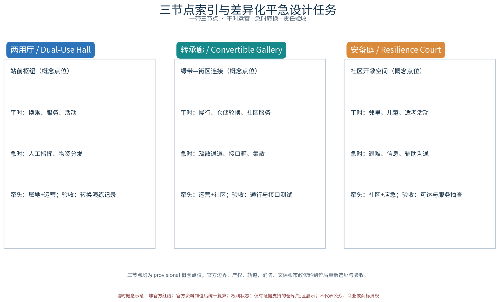
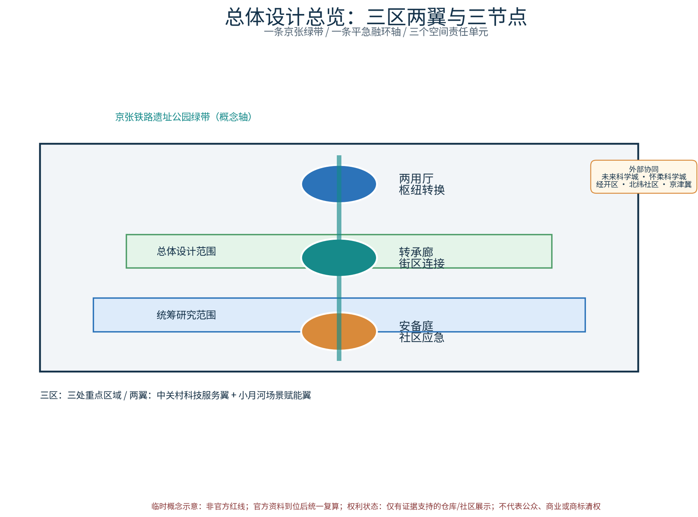
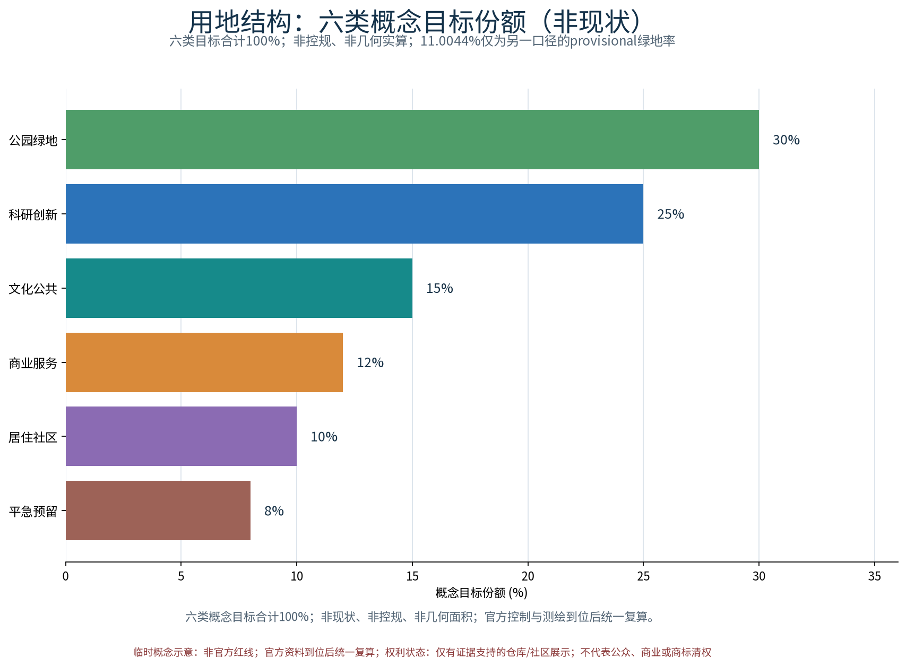
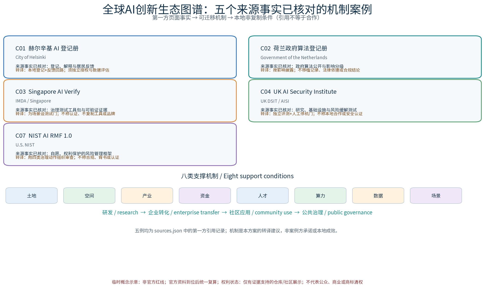
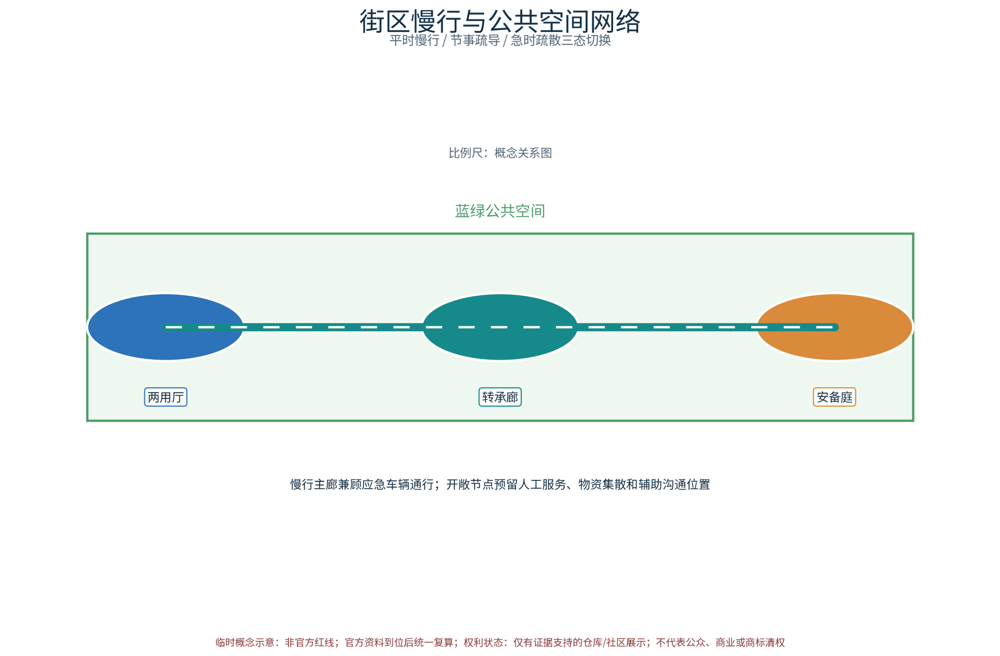
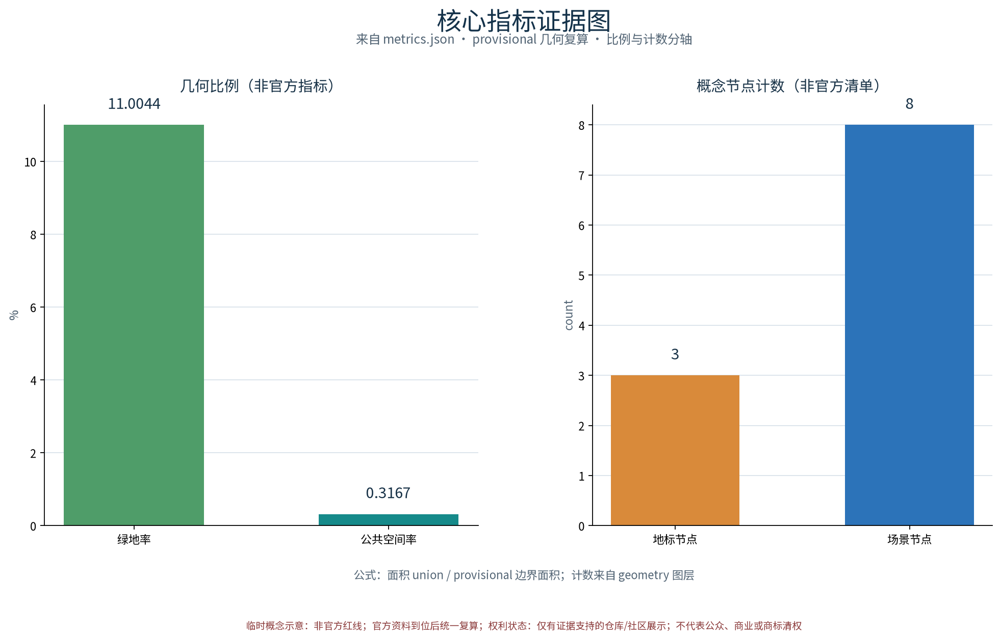

## 「京张AI创新带（京张铁路文化—中关村创新—AI新质生产力融合创新带）」国际征集 · 概念方案草案（概念级 · provisional边界 · 不虚构官方数据）

**摘要**：以「平急融环（DUAL·JZ · 平急两用空间体系）」构建沿京张AI创新带的平急两用空间体系概念：以「两用厅」为平急两用公共空间转换枢纽，「转承廊」为平急两用街区转换廊道，「安备庭」为平急两用社区应急庭院；五类AI+场景（平急转换调度AI、应急资源预置AI、人流疏散推演AI、两用设施体检AI、公众应急反馈AI）仅处理匿名聚合数据、关键决策人工复核、禁止过度监控；交通慢行优先、日常慢行网络与应急疏散通道兼容设计、连续慢行轴贯通三节点，蓝绿公共空间兼作开敞避难与物资集散场地；分期实施加平急转换演练与年度计划。全部为概念建议、参考方案，不给出容积率、建筑高度、具体拆改留或工程实施结论，不编造官方数据，基于 provisional 边界，官方数据发布后复算；方案以概念级表达回应三大定位、五大功能、三区两翼与六项任务，区域协同与品牌资产均为建议性方向。

> **概念口径**：本方案全部为概念建议与参考方案，并非既定决策；所有几何、面积与指标基于 provisional 边界，官方控制资料发布后整体复算；现状建筑年代、产权、结构鉴定、文保线索、应急台账等资料未获取，已在 assumptions.json 与风险章节如实登记。

> **证据锚点**：[source:DATA-SRC-OFFICIAL-ANNOUNCEMENT]（组织方公开口径）；[source:DATA-SRC-PROVISIONAL-BOUNDARIES]（边界为临时概念）；[data:PACKAGE-GEOMETRY]（本包 geometry 层）。

## 方案名称与总体构想（概念）

方案主名称：**平急融环（DUAL·JZ）——平急两用空间体系**。"融环"取"平时功能与应急功能兼容转换、环环相扣、弹性生长"之意：以京张铁路遗址公园绿带为脊、轨道站城统筹节点为扣，将平急两用能力嵌入日常城市空间，形成"平时可运营、急时可转换"的韧性城市骨架。总体构想以**预置—转换—调度—感知**为闭环逻辑，沿绿带布局三个原创概念节点——**两用厅（Dual-Use Hall）**、**转承廊（Convertible Gallery）**、**安备庭（Resilience Court）**，分级落实平急转换、应急预置、避难空间三大能力；配套五类AI+场景与「两用转换导则」「平急安备积分」「沿带共建联盟」等原创机制概念，形成可复制的平急两用空间范式。机制闭环为：日常预约轮换运营积累数据，演练日检验转换能力，公示与积分激励公众参与，备案与联审校核风险，形成"运营—演练—反馈—校核"的持续改进环。节点名称、Logo 与标识均为概念阶段内部工作代号，商标与在先权利检索完成前不用于对外注册与商业使用。

## 设计依据与资料清单

资料清单所列公开史料、规划报道与通则规范等均为概念工作依据清单，并非本包已获取的数据；本包实际使用的全部可查证数据见 sources.json，未获取项已在风险与缺失数据说明中如实标注。设计依据包括：国家关于平急两用公共基础设施、韧性城市、城市更新与防灾减灾的政策导向，京张铁路遗址公园相关规划研究，沿线轨道站城一体化资料，以及海淀区控规与专项规划公开口径。资料清单（概念级）：现状地形与用地权属、轨道线站位与断面、绿带及慢行系统现状、市政管网与应急设施分布、分时人流活动数据、灾种风险评估等；上述资料待组织方正式提供后复核替换。官方公告明确的三层范围文本口径（统筹研究范围约43.6平方公里、总体设计范围约11.4平方公里、重点区域约368.4公顷）作为本包范围框架依据，本包自身设计聚焦总体设计范围内的平急两用空间体系概念，不预设官方几何。

> **证据锚点**：[source:DATA-SRC-OFFICIAL-ANNOUNCEMENT]、[source:DATA-SRC-AGENT-TASKBOOK]。

## 三层范围工作框架

三层成果逐级传导：统筹研究输出的平急两用环境与沿线协同判断约束总体设计，总体设计校核的两用节点布局、转换网络与时序生长落实到节点详设；每层均保留与任务书对应章节的机器可读证据锚点，便于评审对照。**统筹研究范围**面向京张AI创新带全域（官方文本口径约43.6平方公里），开展产业与未来城市研究；**总体设计范围**（约11.4平方公里）以控规深度开展总体城市设计，落实「平急融环」空间体系与更新单元划分；**重点区域**（官方文本口径约368.4公顷）选取「两用厅、转承廊、安备庭」各一处示范地块深化详细设计，三处概念点位均标注 provisional，须经规划、应急、文保与主管部门评估后重新落位。三层共享同一底图与平急两用指标体系，逐层深化、滚动修正，成果边界均标注provisional，随资料完善迭代；本包范围表述均以官方公告文本口径为锚，不替代官方几何与控制资料。

> **证据锚点**：[source:DATA-SRC-AGENT-TASKBOOK]（三层范围与任务层级依据任务书官方文本口径）。

## 统筹研究范围产业与未来城市研究

产业与城市研究识别平急两用的「适配」效应：以转换枢纽与开敞网络把沿线高校、科创片区、轨道站点与住区的日常活力与应急需求有序组织为双向可达的韧性环境单元，形成「两用节点—科创片区—住区」三级联动结构。统筹层研判AI新质生产力集聚方向，识别"研发—中试—场景应用—应急服务"产业链条，围绕轨道站城统筹形成多中心组团；提出以平急融环为韧性骨架、产业空间与应急空间复合布置的未来城市愿景，研究人口与就业分布、职住平衡与应急人口承载力，为应急预置规模与避难容量测算提供概念依据。

三大定位与五大功能的映射（概念级建议）：**百年京张文化带**依托绿带与沿线历史遗存组织文化叙事；**都市AI生活体验带**在海淀区站城节点与社区网络嵌入AI日常体验；**AI融合创新带**为AI企业与高校提供场景测试与转化通道。区域协同建议面向任务书「三区两翼」格局展开（概念映射，非官方界定）：向北联动未来科学城与怀柔科学城的基础研究资源，向东呼应经开区的中试制造能力，向西衔接北纬社区等海淀科创居住组团，并纳入京津冀协同发展中的平急两用设施共建与应急资源互通方向；上述协同均为建议性研究结论，不构成对区域政策的替代。

为使定位不止停留在口号，本包把五大功能落实为可交付物：**文化叙事**输出京张百年墙/双城叙事带的公开史料审核清单；**日常生活服务**输出三节点人工服务台、无障碍路线与预约轮换规则；**AI创新转化**输出 C01、C02、C03、C04、C07 五例来源事实已核对的全球AI机制转译表、C05/C06 非计数背景参考、S01–S12 场景卡与 T01–T03 测试协议；**平急韧性保障**输出转换清单、物资台账、疏散桌面测试和手工预案；**区域协同治理**输出三区两翼问题—能力—节点—公示—联审回路、RACI 与季度证据摘要。上述为建议性工作包，不代表已有机构、资金或系统。

> **证据锚点**：[source:DATA-SRC-PROVISIONAL-BOUNDARIES]（边界为 provisional，研究范围仅作概念示意）。

### 任务书层级与外部协同边界

本包将任务书的内部“三区两翼”作为治理与空间映射的唯一主层级：**三区**为北京AI原点社区、众智园、大钟寺AI产业集群三个重点区域；**两翼**为中关村科技服务翼与小月河场景赋能翼。三处重点区域分别承接安备庭、两用厅、转承廊的概念示范任务；中关村科技服务翼连接高校研发、企业服务与专业验证，小月河场景赋能翼连接社区服务、场景开放与公共体验。内部协同回路为“重点区提出问题—两翼提供能力—三节点进行平急空间测试—年度公示反馈—属地联审修正”。

**外部区域网络不替代两翼**：未来科学城、怀柔科学城、经开区、北纬社区以及京津冀仅作为外部知识、产业、社区与应急资源协同对象，需逐项取得合作与资料许可；本包不宣称已有合作、资源调拨或政策承诺。该层级在 `site-overview` 图中以外部协同框单独标示，并在 `compliance_matrix.json` 中保持“建议/待核”状态。

## 总体设计范围城市更新与控规深度城市设计

总体设计强调「以绿带为骨架的平急两用环境」：依托京张铁路遗址公园绿带组织两用节点、转换网络与慢行骨架，两用设施可逆生长、街道可分时响应平急需求；强调更新而非新建，优先利用存量空间植入两用功能；对控规指标只做校核建议，不预设数值结论。总体任务图（agent.1）按"一轴三节点、三区协同、五功能落位"组织：京张绿带为轴，两用厅、转承廊、安备庭为节点，统筹研究范围的三大定位、五大功能与「三区两翼」区域协同、品牌与Logo方向、AI与规划创新关系在图中统一表达（见 `assets/figures/site-overview.png` 与 `report/narrative.md`）。

在总体设计范围内开展城市更新体检评估，划定更新单元，衔接控规地块指标与城市设计导则。以绿带为脊组织"绿带—街区—社区"三级平急转换体系：**两用厅**落位于站城节点，承担平急转换调度与物资预置；**转承廊**依托街道断面与桥下空间形成转换廊道；**安备庭**深入社区作为应急庭院。体系强调交通慢行优先，绿带两侧慢行网络与应急通道兼容并线，平时保障日常出行，急时快速变更为疏散与救援路径；更新单元准入以现状体检与产权摸底为前提，未获资料前维持概念层级。

> **证据锚点**：[source:DATA-SRC-MOHURD-CONTROL-DETAILED-PLANNING]（控规深度仅作方法参照）；[source:DATA-SRC-PROVISIONAL-BOUNDARIES]。

## 重点区域详细设计

三节点设施选址均为概念点位，须经规划、应急、文保与主管部门评估及专业审查后重新落位；节点间的绿带动线与慢行通道构成完整平急动线，详细平面与剖面以图册与 geometry 层表达。三个地标级节点的实质目录（概念级）：

| 节点目录 | 空间组成 | 平时功能 | 急时转换 | 荣誉展示与品牌落位 |
|---|---|---|---|---|
| 两用厅（站城节点） | 大厅、预制接口、可逆隔断、物资预置舱 | 公共服务、科创展示、换乘交往 | 物资集散与应急调度枢纽 | 厅内「京张百年墙」与AI创新荣誉墙 |
| 转承廊（街道与桥下） | 可变断面、桥下模块化仓储、临时庇护单元 | 展廊、休憩、商业、社区市集 | 一键展开庇护与物资通道 | 沿廊「双城叙事带」文化展陈与影像装置 |
| 安备庭（社区庭院） | 广场、应急供水供电点位、物资点位 | 儿童活动、邻里交往、便民服务 | 避难场地与应急服务点 | 庭心「安备荣誉庭」居民志愿与救援事迹展示 |

公共空间组件库（概念）：**可逆地面模块、预制转换隔断、应急水电接口箱、模块化仓储单元、临时庇护组件、无障碍转换坡道**六类组件，均以"轻介入、可逆装、易维护"为原则，平时融入日常功能、急时快速转换，组件清单与复用规则在设计中深化；组件选型以标准接口与通用尺寸为优先，降低维护成本并支持分期装配。荣誉展示系统包括「京张百年墙」「安备荣誉庭」「双城叙事带」三处文化落位，展示内容以公开史料与志愿事迹为素材、经审核后发布，统一使用整体Logo与文化标识的授权使用边界（概念阶段不对外注册）。三节点详细设计深度以"功能目录—空间组成—转换机制—运营预案"四层展开，平立剖面见 A0/A3 图册与 geometry 层。

> **证据锚点**：[data:PACKAGE-GEOMETRY]（三节点示意多边形来自本包 geometry/key_areas.geojson）。

## AI 创新生态、人才画像与 AI+ 场景

AI生态图谱（agent.2，概念级）：沿京张AI创新带组织**土地、空间、产业、资金、人才、算力、数据、场景**八类支撑机制，形成"高校研发—企业转化—社区应用—政府治理"闭环。本轮有界核验形成 5 例正式计数，`global_case_count=5`；C05/C06 仍保留为 `background_reference`，不计数。五例均以一方发布者页面为证据，逐条登记发布日期或 undated 状态、访问日期、来源事实核对结果、许可/引用边界、可迁移机制与非复制条件；案例只提供机制转译，不主张合作、采购、资金、系统接入或本地成效。图谱见 `assets/figures/ai-ecosystem.png`。

### 全球 AI 创新生态案例表（正式计数 5 例，概念转译）

| 案例 / 来源ID | 一方发布者与日期状态 | 来源事实已核对（短述） | 可迁移机制 | 非复制条件 |
|---|---|---|---|---|
| C01 赫尔辛基 AI Register | City of Helsinki；登记日期记录为 2019-12-12，当前落地页未显示发布日期；访问 2026-08-29 | 官网将其描述为城市AI系统公开窗口，提供概览、详情和反馈，并强调人工控制与居民许可 | 本地 AI 系统登记、通俗解释、责任人和居民反馈回路 | 先完成本地权属、隐私、无障碍和公共记录审查；不复制页面、Logo、记录或治理结论 |
| C02 荷兰政府算法登记册 | Government of the Netherlands；首页未标发布日期；访问 2026-08-29 | 首页公开政府组织使用的算法，显示 1322 条，并聚焦有影响或高风险算法及工作方式信息 | 按影响披露用途、责任人、工作说明，并将高影响条目转人工/法律复核 | 不移植荷兰记录、阈值、法律依据、页面设计或合规含义 |
| C03 Singapore AI Verify | Singapore IMDA；官方事实页发布 2022-06-01，记载 2022-05-25 MVP 发布背景；访问 2026-08-29 | 一方事实页将 AI Verify 介绍为AI治理测试框架与工具包MVP，用于客观、可核验地展示负责任AI | 为每个场景设置测试门、证据包、人工签署和公开测试摘要 | 不称 IMDA/AI Verify 认证或审批；不复制工具、Logo、阈值或品牌 |
| C04 UK AI Security Institute | UK DSIT / AISI；官网未标发布日期；访问 2026-08-29 | 官网说明其为国家支持的AI安全机构，开展研究、基础设施和风险缓解测试，并与研究者、开发者和政府协作 | 独立评测、研究基础设施、风险缓解复核及人工停止/退出门 | 不称英国支持、本地合作、安全认证或能力等价；不使用其名称/Logo |
| C07 NIST AI RMF 1.0 | U.S. NIST；发布 2023-01-26；访问 2026-08-29 | NIST页面记录其为自愿、权利保护、非行业限定、非用例限定的AI风险管理框架 | 用 Govern / Map / Measure / Manage 组织责任、证据、误差复核和暂停/退出决定 | 不称 NIST 合规、认证或背书；本地法律、隐私、应急和采购部门另行定义控制 |

正式计数只统计上述 5 个 `case_group=global_ai_ecosystem` 且 `counted_in_global_case_count=true` 的 `sources.json` 记录；C05/C06 仍为引用背景，站城/韧性空间参照另列，不混入全球 AI 生态计数。

站城/韧性空间参照组（不计入上述 AI 生态案例数，建议性参考）：

| 案例 | 做法要点 | 可迁移结论 | 来源 |
|---|---|---|---|
| 日本防灾公园体系 | 公园分级预置避难、物资、供水与救援功能 | 分级配置加平时运营演练结合 | 国土交通省 |
| 东京首都圈外郭放水路（G-Cans） | 地下调蓄设施兼公共科普与预约参观 | 设施科普化运营提升公众接受度 | 国土交通省关东整备局 |
| 新加坡民防避难所体系 | 住宅与公共建筑内置民防功能、平时正常使用 | 新建建筑平急功能预置加法定维护 | 新加坡民防部队（SCDF） |
| 中国"平急两用"政策与试点 | 民宿、仓储、医疗设施预置应急转换功能 | 存量设施预置加应急转换方案管理 | 中国政府网/国家发展改革委 |
| 北京平谷"平急两用"现场会 | 部门联审、试点先行、经验推广 | 联审与评估机制保障落地 | 国家发展改革委 |
| 荷兰"还地于河"计划 | 蓝绿空间与防洪工程复合、公众参与 | 蓝绿空间复合利用加参与式设计 | 荷兰水运与水管理局（Rijkswaterstaat） |

七条案例记录的逐条证据与许可边界见 `sources.json`；其中 C01/C02/C03/C04/C07 五例计入正式计数，C05/C06 两例保留为背景参考。不得把页面上的机构、人数、计划、许可或效果延伸为京张项目事实。

人才画像（概念，五类人才）：**科创研发人才**（高校院所与AI企业）、**社区生活人群**（居民、亲子与银龄长者）、**服务运营人才**（物业、志愿与应急辅助）、**创新体验人群**（学生、青年与游客）、**特殊需求人群**（残障人士与数字使用困难者）。五大AI+场景与扩展场景卡（每卡含空间触发、输入数据、模型任务、输出、人工复核点、失败回退与成熟度，均属概念建议）：

| 场景卡 | 空间触发 | 输入数据 | 模型任务与输出 | 人工复核与失败回退 | 成熟度 |
|---|---|---|---|---|---|
| 平急转换调度AI | 两用厅与站城枢纽 | 设施状态匿名聚合、转换预案库 | 编排转换流程并输出步骤清单 | 关键步骤人工确认；预案失效转人工指挥 | 概念验证 |
| 应急资源预置AI | 转承廊桥下与安备庭点位 | 风险等级、匿名人口聚合、物资台账 | 预置方案建议与缺口提示 | 采购与投放须人工审批；模型异常转人工盘点 | 概念验证 |
| 人流疏散推演AI | 绿带慢行轴与开敞空间 | 活动分布匿名聚合、通道容量 | 双模推演与分流建议 | 疏散指令由应急部门人工下达；推演失败转预案手册 | 概念验证 |
| 两用设施体检AI | 三节点设施与转换接口 | 结构监测、设备台账（设施级） | 体检报告与维护建议 | 维护工单人工确认；传感器失效转定期巡检 | 原型试验 |
| 公众应急反馈AI | 社区安备庭与公共空间 | 意见匿名聚合文本 | 聚类诉求与处置建议 | 处置结论人工复核并公示；模型偏差转人工受理 | 概念验证 |
| 产业供需撮合AI | 产业试验空间 | 企业需求脱敏摘要 | 供需匹配建议 | 合作对接人工撮合；无匹配转人工服务 | 设想 |
| 文化活动客流引导AI | 文化展陈与节事空间 | 预约与客流匿名聚合 | 错峰引导建议 | 引导指令人工审核；异常转现场引导员 | 设想 |
| 无障碍可达信息AI | 公共服务空间 | 设施点位与通行状态 | 可达路线与多语信息推送 | 信息发布人工复核；数据缺失转线下服务 | 设想 |
| 治理指标监测AI | 治理平台 | 指标匿名聚合 | 指标简报与预警 | 预警人工研判后上报；口径变化转人工核对 | 设想 |
| 慢行接驳优化AI | 交通慢行空间 | 出行聚合数据 | 接驳优化建议 | 调整方案人工评审；数据不足转现状运营 | 设想 |

产业测试验证场景（agent.3，至少3处，概念级；详细记录见本文件的场景—空间—运营表与 `report/narrative.md`）：

| 测试场景 | 验证内容 | 参与主体 | 通过标准（建议） |
|---|---|---|---|
| 平急转换演练日 | 两用厅与安备庭全流程转换测试 | 政府应急部门、运营团队、居民志愿 | 转换时限达标且演练记录归档 |
| 疏散推演桌面测试 | 疏散推演AI与人工预案比对 | 高校研究团队、应急部门 | 推演偏差在可接受区间并形成差异说明 |
| 转换接口专项测试 | 桥下模块化仓储与隔断安装测试 | 专业团队、设备维护单位 | 安装时限与安全性验收通过 |

AI技术协议（概念级）：建立**模型评测**与**基准测试**制度、**数据质量**核查清单、**误差分群**与**误报率**监测、**运行监测**与定期复审机制；全部AI场景遵循仅匿名聚合、关键决策人工复核、禁止过度监控三原则，不进行个体识别式追踪，不采集个人隐私信息，数据最小化留存。场景—空间—运营矩阵以"十二张场景卡×空间载体×平时运营×急时运营×责任建议"组织，见本文件、`metrics.json` 与合规矩阵的可见文本证据。三节点的差异是：两用厅负责有人工值守的换乘与转换控制，转承廊负责线性慢行/仓储接口，安备庭负责社区可达服务、辅助沟通与避难前场；任一 AI 失效均保留纸面预案、人工服务台和现行通行路径。

> **证据锚点**：[source:DATA-SRC-GENERATIVE-AI-INTERIM-MEASURES]（生成式AI治理表述的限定范围参照）；[source:DATA-SRC-BARRIER-FREE-ENVIRONMENT-LAW]（无障碍公共服务的人工服务基线参照）。

### 场景卡的可测试字段（概念协议，不是已运行模型）

为避免“有场景名称但没有交付”，本包将 12 张场景卡统一补齐输入—规则/模型—输出—人工责任—样本与阈值—停止条件。当前没有真实客流、设备或灾情样本，因此所有基线均登记为 `to_verify`，建议阈值只用于设计测试，不代表性能结果。

| 卡号 | 输入与模型/规则 | 输出与空间动作 | 样本/基线（状态） | 建议阈值、责任与停止条件 |
|---|---|---|---|---|
| S01 转换调度 | 设施状态、预案库；规则编排 | 两用厅转换清单 | 演练 ≥3 次；基线 to_verify | 演练完成率 ≥95%；运营负责人复核；步骤缺失即停止 |
| S02 资源预置 | 脱敏人口聚合、物资台账；缺口规则 | 转承廊/安备庭预置建议 | 物资盘点 ≥2 轮；基线 to_verify | 台账匹配率 ≥98%；应急部门审批；台账过期即停止 |
| S03 疏散推演 | 分时聚合、通道容量；离散仿真 | 绿带分流方案 | 桌面场景 ≥10 组；基线 to_verify | 与人工预案差异 ≤10%；应急部门下令；偏差超阈值转人工 |
| S04 设施体检 | 设施级传感/巡检记录；异常规则 | 接口维护工单 | 设备点检 ≥30 条；基线 to_verify | 漏检率 ≤5%；设施维护方签发；传感器失效转巡检 |
| S05 公众反馈 | 匿名意见摘要；主题聚类 | 安备庭诉求清单 | 匿名样本 ≥100 条；基线 to_verify | 分类抽检准确率 ≥90%；社区议事会复核；敏感项暂停聚类 |
| S06 产业供需 | 脱敏企业需求；匹配规则 | 测试沙盒配对建议 | 意向样本 ≥20 条；基线 to_verify | 人工确认率 100%；产业服务方撮合；无授权不推送 |
| S07 文化活动引导 | 预约/匿名客流；分时规则 | 展陈与活动错峰提示 | 活动周期 ≥2 次；基线 to_verify | 现场拥挤告警人工确认；文化运营方负责；异常转现场指挥 |
| S08 无障碍可达 | 设施点位、通行状态；路径规则 | 多语可达路线+线下服务单 | 路线抽测 ≥20 条；基线 to_verify | 路线可用率 ≥95%；人工服务台确认；数据缺失不发布路线 |
| S09 治理指标 | 匿名汇总、反馈台账；统计规则 | 月度指标简报 | 连续 ≥3 月；基线 to_verify | 口径变更 100% 人工复核；属地部门签发；口径不一致停止发布 |
| S10 慢行接驳 | 匿名出行聚合、道路状态；网络规则 | 慢行与应急兼容调整建议 | 早晚高峰各 ≥3 轮；基线 to_verify | 现场冲突为 0；交通/运营共同复核；安全冲突立即回退现行方案 |
| S11 平急信息发布 | 匿名事件摘要、人工确认状态；发布规则 | 三节点纸面/屏幕双通道提示 | 事件记录 ≥10 条；基线 to_verify | 事实字段100%人工核对；信息来源不明即停止发布并转人工台 |
| S12 申诉与退出复盘 | 匿名申诉、场景日志；分类与时限规则 | 月度申诉摘要、继续/暂停/退出建议 | 复盘 ≥3 周期；基线 to_verify | 申诉不因模型分类而关闭；连续两次未闭环暂停场景并由属地复核 |

### 三个行业测试协议（agent.3）

| 协议 | 样本与输入 | 测试步骤（模型/规则→人工复核→空间动作） | 通过/退出标准 | 责任记录 |
|---|---|---|---|---|
| T01 平急转换演练 | 两用厅、安备庭设施清单；3 次桌面+现场演练记录（待建） | 运营方按 S01 清单转换；应急部门逐项签字；仅在演练区启用 | 建议完成率 ≥95%、无安全事件；任一安全事件或人工超载即退出并恢复日常模式 | 牵头：属地应急；协作：运营、社区；记录：演练日志 |
| T02 疏散推演双盲 | 10 组匿名聚合假设+人工预案（待建） | AI/规则独立推演；专家盲比；现场不执行自动指令 | 与人工方案差异 ≤10%、分群误差有解释；超阈值仅保留人工预案 | 牵头：应急部门；协作：高校、交通；记录：版本与差异表 |
| T03 接口与仓储安装 | 30 个设施/接口抽样（待建） | 专业团队按图安装；维护方检查；消防/结构条件未确认前仅做模型台 | 记录完整、安装无损、维护可达；若产权/结构/消防条件未知，不进入现场实施 | 牵头：运营维护；协作：专业团队、产权方（待核）；记录：点检单 |

三项协议的共同验收字段为：数据版本、样本量、缺失率、人工复核人、模型/规则版本、偏差分群、事件记录、公开摘要和退出决定。样本基线尚未取得，不以建议阈值替代实测；真实数据接入前须完成数据保护影响评估、匿名化有效性测试和法定安全审查。

## 用地、建筑规模与拆改留方案

拆改留坚持留改拆并举：以留为主保留遗址公园肌理与铁路历史遗存，存量建筑功能置换并预留两用化改造方向（转换接口、物资预置舱），拆除仅限经个案论证的局部疏通慢行零星建筑；全部面积为概念口径，官方数据发布后复算。概念阶段不虚构数据，仅给出原则性框架：以现状体检为基础形成"拆、改、留"三类清单策略，优先保留与改造、严控拆除规模；两用设施增量以预留接口、可逆改造与复合利用为主；绿带两侧土地复合利用，应急用地与公共绿地兼容设置。

用地结构口径说明：图册中的六类概念目标份额为 **30%/25%/15%/12%/10%/8%（合计100%）**，是非现状、非控规、非 geometry 面积实算的讨论目标；metrics.json 的 geometry 绿地率 11.0044% 则是 provisional 几何多边形 union/概念边界面积，低置信度。两种口径不互相复算、不直接比较，均非官方指标；官方控规与测绘数据发布后，按统一分类、分母、公式和面积重新计算，并在 metrics.json 与图册中发布差异说明。

> **证据锚点**：[source:DATA-SRC-MNR-LAND-USE-CLASSIFICATION]（用地分类名称参照现行国标口径）。

## 交通、轨道、市政与公共服务设施

以交通慢行优先为核心组织交通概念机制：日常慢行网络与应急疏散通道兼容设计，沿绿带构建连续慢行轴贯通两用厅、转承廊与安备庭；街道断面按平急需求分时响应（日常、节事、应急三种模式），衔接沿线高校、园区与轨道站点，接驳以步行与骑行为主；应急场景下开敞通道与绿带转为疏散与集散场地，分时分区疏导。轨道站城统筹组织"最后一公里"慢行接驳，绿带内构建连续慢行主廊，兼顾应急车辆通行要求；市政设施按平急两用标准预置接口，应急供水、供电、通信与物资仓储结合转承廊桥下空间布置；公共服务设施分级配置，平时服务居民，急时一键转为应急服务点，实现设施复用、投资增效。

两用设施与公共空间平时运营建议采用分时**预约**与**轮换**使用机制，保障公平普惠并提高周转效率；无障碍连续路线、可达信息多语提示、辅助沟通与线下人工服务同步配置，面向老年人、残障人士、儿童、照护者与数字使用困难者提供差异化应急优先安排；上述机制为建议性设计，供运营团队深化。

> **证据锚点**：[source:DATA-SRC-MOHURD-URBAN-DESIGN-MEASURES]（市政与慢行设计表述的方法参照）。

## 蓝绿空间、公共空间与城市风貌

构建「绿带为轴、节点公园为珠」的蓝绿公共空间体系：以遗址公园绿带为蓝绿骨架串联沿线小微绿地与开敞空间，开敞绿地兼作应急避难与物资集散场地；两用设施与公园融合布置、宜轻宜透宜可逆，不遮挡历史遗迹与绿带视线；指示与解说系统统一克制，**导视系统**以"日常导航—节事引导—应急指引"三态切换为设计原则，视觉符号与文字兼顾全龄与多语需求。

文化叙事（agent.5）：组织**京张铁路文化—中关村创新文化—AI新文化**三层时间轴叙事——以詹天佑与京张铁路公开史料为百年底色，以中关村创新历程为转型叙事，以AI平急服务为新文化表达；整体Logo（平急融环 DUAL·JZ 品牌标识）与文化标识（京张百年墙、双城叙事带等场所标识）区分管理。国际传播文案（概念）：以"Where heritage meets resilience"（中文释义：当百年遗产遇见韧性城市）为国际传播主句，配合中英双语品牌资产与图册，面向全球征集语境传播；全部品牌资产在商标检索完成前按内部工作代号处理。

> **证据锚点**：[source:DATA-SRC-MOHURD-URBAN-DESIGN-MEASURES]（蓝绿空间组织的方法参照）。

## 更新项目清单、实施政策与分期计划

四类项目清单（两用厅试点、转承廊贯通、安备庭织补、平急转换平台上线）为概念清单，规模与投资估算均为建议性表述，投资按低、中、高三档定性分级并标注估算方法、价格基期、包含范围、置信等级与复算触发，不给出具体金额。实施主体建议覆盖政府（统筹、审批与监督）、企业（投资建设与产业运营）、高校（研究与评估）、居民与社区（共建共管与需求反馈）、运营机构（日常运营维护）、志愿者（演练组织与应急辅助）、商户（业态参与）、专业团队（设计深化与工程服务）等类别，以"属地牵头、多方协作"的RACI分工为建议框架（具体分工随法定程序确定）。

按"近期示范（1—3年）—中期成网（3—5年）—远期成环（5—10年）"分期实施：近期以两用厅与安备庭为试点区域先行示范，编制平急转换设计导则建议稿；中期完成转承廊体系与AI平台建设；远期实现平急融环整体贯通。每阶段设置准入条件、责任角色、维护机制与阶段验收指标（见指标章节）；设置**停止条件与退出机制**：当试点设施利用率、转换演练通过率或公众满意度不达建议阈值，或出现不可控风险时，暂停或调整相应项目并按公示程序说明。运营与治理机制（概念建议）：属地部门牵头、多元主体议事共决，以街区共创**公约**明确职责边界；转换演练安排、设施使用计划与意见处置结果**公示**公开；通过**备案**抽查、第三方评估与公众监督持续校核；社区志愿积分与居民意见通道常态化运行。年度活动品牌体系（建议性）：

| 年度活动品牌 | 周期 | 主要内容 | 责任建议 |
|---|---|---|---|
| 平急转换演练日 | 年度 | 全流程转换演练、设施体检与公众开放 | 政府应急部门牵头、社区协同 |
| 两用空间体验季 | 年度 | 两用设施体验、产业与高校共创活动 | 运营团队牵头、企业与高校参与 |
| 韧性社区工作坊周 | 年度 | 社区议事、适老与儿童友好共创、荣誉展示 | 社区与志愿组织牵头、专业团队支持 |

长期运营（agent.6，建议性）：**开发者社区**面向AI场景开放接口与测试沙盒，场景开放实行申请、**预约**与年度评估，不达标场景按**轮换**与退出机制处理；公共体验与科普参访常态化；国际合作转化依托双语图册对接全球征集语境；年度评估以五类平急指标为骨架，结果向公众公示。

### 实施 RACI、阶段门与 KPI 记录协议

| 阶段 | R（执行） | A（最终负责，建议） | C（协商） | I（知会） | 阶段门/KPI（建议） |
|---|---|---|---|---|---|
| 0 资料与合规 | 专业团队、数据治理方 | 属地牵头部门 | 轨道、应急、消防、文保、产权 | 社区、公众 | 官方 polygon、控制附件、基线清单齐备；缺一项不进入现场 |
| 1 桌面试验 | 高校/企业测试团队 | 场景业主 | 运营、社区、应急 | 公众代表 | 每卡数据版本、样本量、模型/规则版本和人工签字齐全 |
| 2 小范围演练 | 运营机构、志愿者 | 应急部门 | 交通、消防、设施维护 | 居民、商户 | T01/T02/T03 达标；安全事件、偏差超阈值或人工超载即退出 |
| 3 年度运营 | 运营机构、社区组织 | 属地议事会 | 企业、高校、专业评估方 | 社会公众 | 转换完成率、通行冲突、反馈闭环率、无障碍服务可达率、公开及时率按季度记录；基线到位前只报“待测” |

RACI 是建议性治理草案，不替代法定部门职责。每一季度形成“指标—证据—决定—申诉”四列公开摘要；连续两个周期未达阈值时，暂停新增场景，复核数据与人工负荷，必要时回退到人工预案。退出后的设施保留日常公共服务，不得因 AI 试验影响基本通行、无障碍服务或紧急救援。

> **证据锚点**：[source:DATA-SRC-AGENT-TASKBOOK]（分期与实施条目对应任务书要求）。

## 指标体系、面积复算与合规矩阵

五类平急概念指标进入 metrics.json，每项均标注数据来源、公式、置信等级、用途限制与复算触发（概念级，无基线结论）：

| 指标名称 | 数据来源与公式 | 置信等级 | 用途限制与复算触发 |
|---|---|---|---|
| 平急转换响应时间 | 演练与运行记录统计（待建） | 待测 | 仅作运营改进参考；演练数据积累后建立基线 |
| 两用设施覆盖率 | 设施点位/单元数（provisional 几何） | 低 | 仅作概念示意；官方控制资料发布后复算 |
| 开敞避难场地可达率 | 绿带与开敞空间网络分析（概念） | 低 | 仅作概念示意；分时人口数据到位后复算 |
| 应急物资预置率 | 物资台账与预案匹配度（待建） | 待测 | 不替代法定物资储备口径；台账建立后校核 |
| 平急演练参与人次 | 演练签到与活动记录（年度累计） | 中 | 仅作年度评估参考；按年度公示口径统计 |

面积复算机制：官方正式几何与控制资料到位后，由参与方按统一口径执行整体复算并发布差异说明；复算依赖组织方资料，不替代本包可先行完成的概念级自检。合规矩阵对标上位规划、控规与各类专项要求逐项核对，标注"符合／待协调／留白"，矩阵条目与正文、metrics.json 的计数和主题保持一致，凡正文或图册中出现的数值均有可见文本证据支撑；本方案不宣称任何"已获批准"或"符合全部法定要求"的结论，AI治理以"仅匿名聚合、关键决策人工复核、禁止过度监控"为边界，具体合规性以法定评估为准。指标基线建立路径：先以演练与运营数据积累样本，再按年度评估周期发布建议阈值，任何阈值均标注建议属性。

> **证据锚点**：[metric:green_ratio]、[metric:public_space_ratio]、[source:PACKAGE-GEOMETRY]。

## 风险、版权与合规说明

风险按应急数据隐私边界、平急转换实施复杂度、应急演练与日常运营协调、两用设施与街区活力接受度四维度登记于 assumptions.json（应对原则：匿名聚合、最小必要、人工复核、来源标注与意见通道）。AI数据治理（概念级）建立台账：数据流程仅匿名聚合、合法性基础经法定评估、留存期限最小化、匿名化测试定期执行、供应商管理纳入合同、安全事件处置按预案响应并报告；不采集个人隐私信息，不进行个体识别式追踪，不设无法人工终止的自动决定，明确禁止过度监控。居民意见通道、年度公示与年度活动作为公共参与闭环。

版权与品牌边界：本包采用明确的分层权利状态，而不是单一的未决总括；在当前限定交付范围内，保留的文本、图件、PDF、HTML、几何/数据、构建代码和AI生成素材均已按交付路径完成“作者或生成方式—来源/输入—许可证或授权依据—允许用途—限制—证据哈希”的记录，统一状态为 `evidence_backed_package_display_only`（仅限本仓库/社区 `COMMUNITY-DISPLAY-ONLY` 展示及带署名的概念适配）。该状态是范围明确的证据化记录，不是公众发布、商业使用、工程实施或法律意义上的“全部清权”。Noto Sans SC 的状态单列为 `license_verified_scoped_embedding_only`，仅按 SIL OFL 1.1 许可嵌入离线 HTML、渲染图件/PDF，并保留许可文本与本地 SHA-256；外部案例和官方页面均为 `citation_only_no_asset_rights`，未复制其图像、Logo、地图、页面或数据集；未解决的第三方材料不纳入交付。完整逐路径台账、许可原文、哈希与证据锚点见 `sources.json` 的 `rights_contract`、`manifest.json` 的 `validation_claim.extensions.x-rights-status` 和 `report/copyright_statement.md`。品牌在先权利与使用边界：概念阶段未完成官方商标检索，「平急融环（DUAL·JZ）」「两用厅」「转承廊」「安备庭」及工作标记状态为 `internal_codename_prior_rights_unchecked`，在权利清查完成前不对外注册、不商业使用，不宣称已清权。本方案为概念研究性设计，不构成行政审批依据，也不构成容积率、建筑高度、拆改留或工程可行性结论；正式实施前须完成多部门联审、应急管理、文物保护与安全评估。

> **证据锚点**：[source:DATA-SRC-OFFICIAL-ANNOUNCEMENT]（征集规则为权属与合规表述的依据）。

## 参考资料

参考资料以政府正式发布版本为准，按公开/内部分类存档并标注获取时间：京张铁路历史与遗址公园公开材料（含詹天佑与京张铁路公开史料口径）、北京城市总体规划及分区规划公开口径、应急管理与防灾减灾公开规范口径（平急两用与韧性城市导则类）、国内外平急两用与韧性空间公开案例（日本防灾公园、东京外郭放水路、新加坡民防避难所、中国平急两用试点、荷兰还地于河等，均以来源列出的官方公开页面为准）、现场踏勘记录与自绘分析草图（本项目自行采集）。本包 sources.json 仅收录可查证条目，未虚构任何官方数据或链接。

（概念级，待核实补充）国家及北京市平急两用公共基础设施、韧性城市、城市更新相关文件；京张铁路遗址公园相关规划与研究；海淀区控制性详细规划与城市更新专项成果；轨道站城一体化研究；防灾减灾、海绵城市专项规划；公开应急管理标准与设计导则。

> **证据锚点**：[source:DATA-SRC-OFFICIAL-ANNOUNCEMENT]（本清单首条即组织方公开资料包）。
