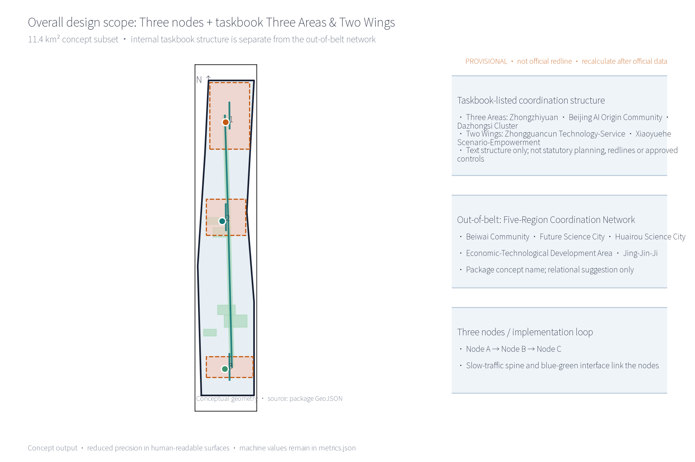
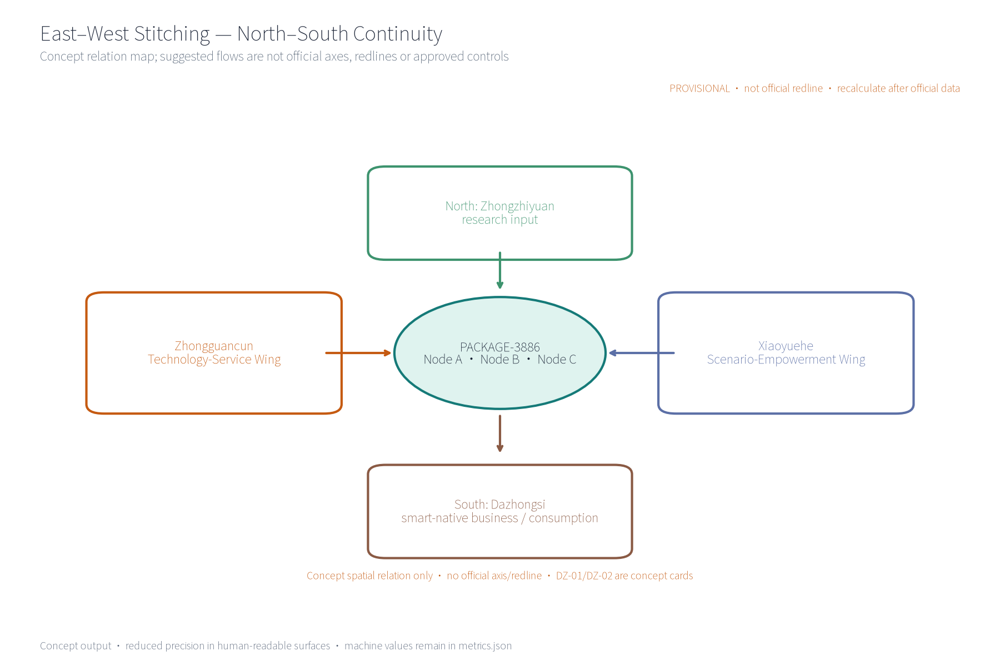
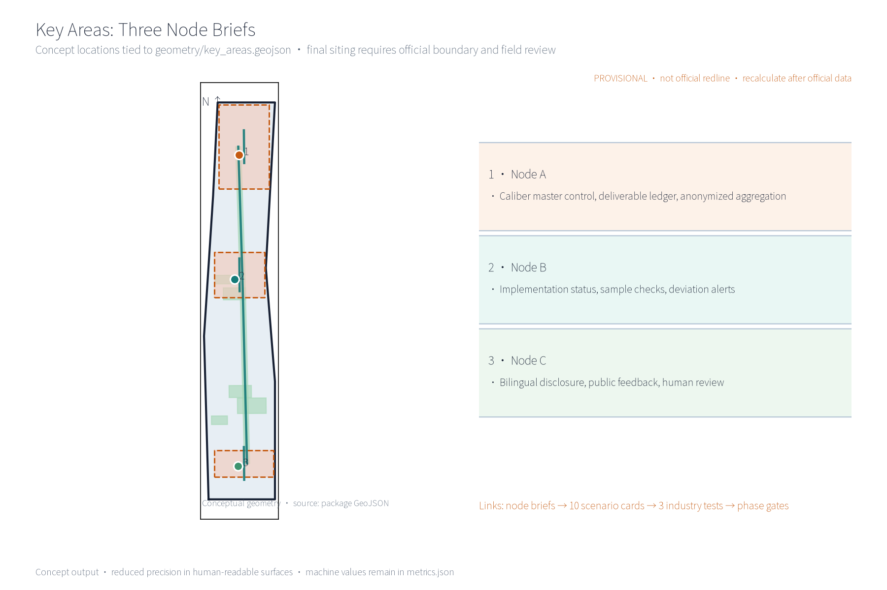
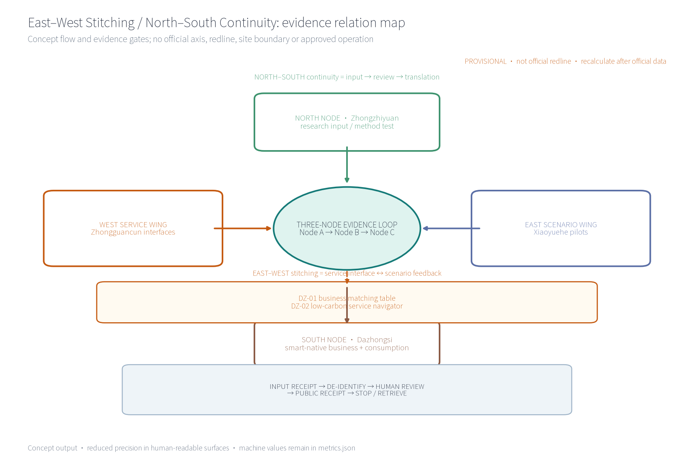
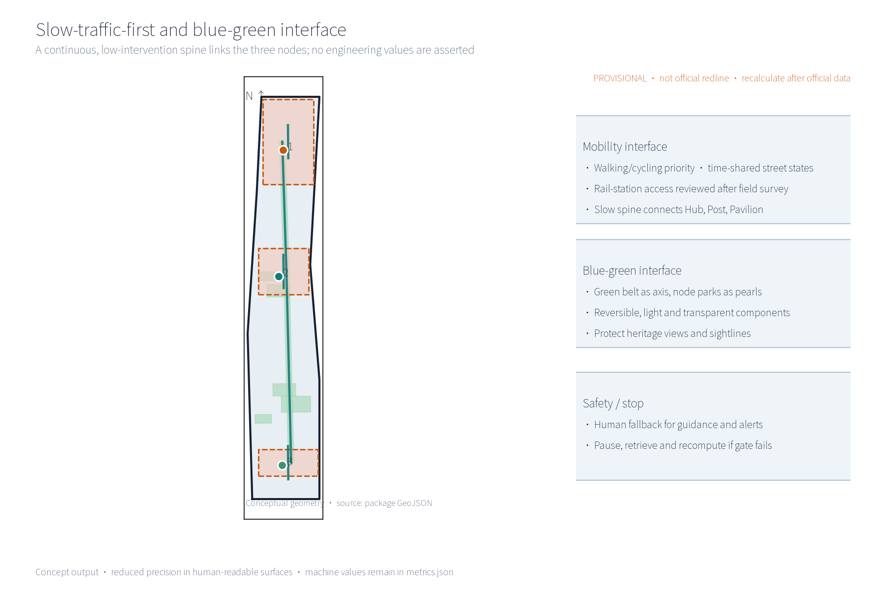
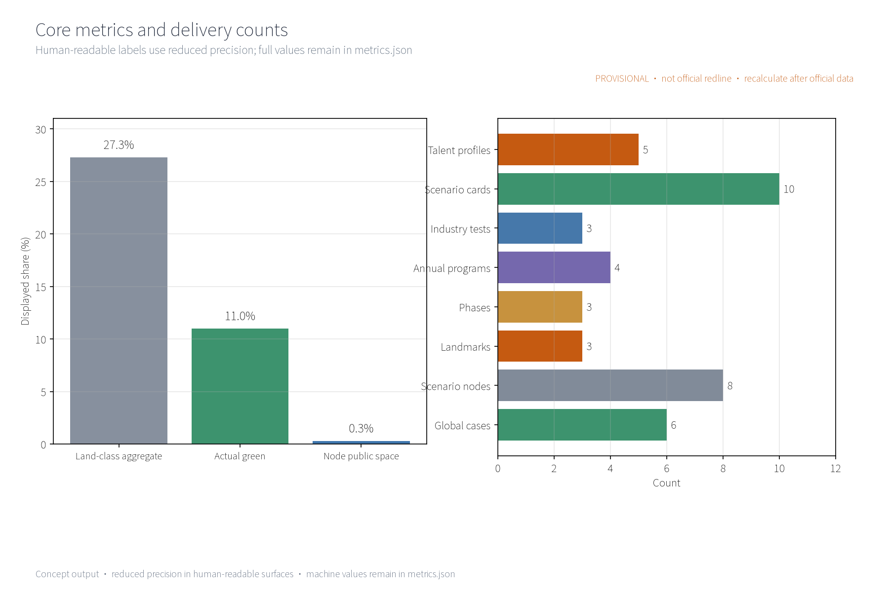
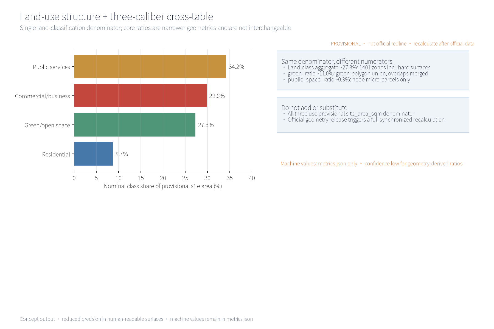

This proposal is a conceptual suggestion: it outlines the concept, structure and spatial organization of the PACKAGE-3886 indicator implementation and supervision system. It gives no FAR, building-height, demolition/retention or engineering-construction conclusions and fabricates no monitoring data.

## Design Basis and Source List
This list is a concept-stage working-basis list, not an acquired data package: the call-for-entries announcement and the public taskbook (which require a world-class AI innovation ecosystem, industrial priorities, an indicator system, an innovation network and spatial organization, and require the three formal core visual metrics site_area_sqm, green_ratio and public_space_ratio to be recomputable by the participant from geometry); public norms including the Urban Design Administration Measures, the Regulatory Detailed Plan Compilation and Approval Measures, the Land-Use Classification Guide (2023), the Interim Measures for the Management of Generative AI Services, the Barrier-Free Environment Law, and the relevant public provisions of the Personal Information Protection Law and the Data Security Law; public material on international and domestic indicator governance (New York OneNYC, Copenhagen CPH2025, London City Dashboard, Smart Nation Singapore, Barcelona superblocks, Vienna smart city, etc., registered item by item in sources.json); and public construction information and conceptual site-walk records of the Jing-Zhang Railway Heritage Park used only as spatial narrative background, not as current-condition evidence. The proposal is a concept suggestion only; it cites no official monitoring values and infers none. Items not obtained are honestly registered in the risk and missing-data statement.

> **Evidence anchor**: [source:DATA-SRC-OFFICIAL-ANNOUNCEMENT-20260509], [source:DATA-SRC-AGENT-TASKBOOK-20260518], [source:DATA-SRC-MOHURD-URBAN-DESIGN-MEASURES].

## Formal Taskbook Agent Crosswalk (package delivery boundary)
This table defines the sole numbering used in the body, avoiding ambiguity between the in-belt Three Areas & Two Wings, this package's coordination network, and agent IDs. All deliveries are conceptual; formal geometry, accountable parties and indicator baselines remain `to_verify`.

| Formal task ID and taskbook title | Package chapter | Required delivery | Figure/metric evidence |
| --- | --- | --- | --- |
| agent.1 Belt-wide concept and function coordination | Scope, coordination, indicator control | Three positioning statements; five functions; in-belt/out-of-belt split | site-overview; `site_area_sqm`, `green_ratio`, `public_space_ratio` |
| agent.2 Full-stack AI innovation system and world-class ecosystem | AI ecosystem, personas and AI+ scenarios | Six global cases, ecosystem atlas, five personas, data/compute/talent/scenario interfaces | ecosystem-atlas; `global_case_count`, `persona_count` |
| agent.3 AI+ scenario empowerment and intelligent active-city design | Scenario cards and industry tests | Ten cards, three tests, spatial placement, inputs/outputs and human gates | key-areas, mobility-bluegreen; `scenario_node_count`, `industry_test_scenario_count` |
| agent.4 AI public space, intelligent-native formats and pilgrimage landmarks | Key areas, blue-green space, component library | Three nodes/landmarks, East–West Stitching / North–South Continuity relation map, Dazhongsi DZ-01/DZ-02 scenario group, reversible and accessible components | key-areas, east-west-north-south, land-use-structure; `landmark_count`, `public_space_ratio` |
| agent.5 Centennial Jing-Zhang, Zhongguancun and AI-new-culture narrative | Blue-green space, culture, signage and communication | L1/L2/L3 tiered resource directory, resource–story–signage–international-copy crosswalk, multilingual signage, public supervision and international communication | site-overview, mobility-bluegreen, resource_story_directory.json; sources and provisional flags |
| agent.6 Belt-wide global AI events and long-term operation | Renewal, phasing and annual programs | Three phases, RACI, four annual-program cards, rollback and annual recomputation | metrics-evidence; `annual_program_count`, `phase_count` |

This is the sole mapping of taskbook agent IDs in the body. “Five-Region Coordination Network” is this package's out-of-belt working codename, not a taskbook agent, Three Areas & Two Wings, or official spatial structure.

## Three-Tier Scope Working Framework
Using the taskbook text structure, the project frames three conceptual tiers: coordinated research scope approx. 43.6 km², overall design scope approx. 11.4 km², and key areas approx. 368.4 ha (including the taskbook-listed “Three Areas & Two Wings” coordination structure — three areas: Zhongzhiyuan AI Autonomous Innovation Accelerator approx. 192 ha, Beijing AI Origin Community approx. 104 ha, Dazhongsi AI Industry Cluster approx. 72 ha; two wings: the Zhongguancun Technology-Service Wing and the Xiaoyuehe Scenario-Empowerment Wing). These names, areas and polygons are used only for task response and relational mapping; they do not represent statutory planning, official redlines or approved controls. This package's sub-scope matches the overall design scope caliber (a conceptual subset); all boundaries are provisional geometry to be recomputed in full when the official polygons are published, and are not a final delimitation. The three tiers cascade: the coordinated research outputs (indicator-governance environment and corridor-wide coordination judgments) constrain the overall design, whose verified node layout, monitoring network and phasing growth are then carried into the key-area detailed design; each tier keeps machine-readable evidence anchors for review.

Tier division (conceptual): the coordinated research scope studies industry and future-city directions and frames the coupling of the indicator system with the AI innovation ecosystem; the overall design scope uses the Jing-Zhang Railway Heritage Park green belt as the spine, linking urban regeneration with regulatory-plan-depth urban design; the key areas carry the detailed design of the three nodes — the Node A, the Node B and the Node C. Boundary precision and confidence levels are dynamically recalibrated with recomputation, liaison and feedback; no official redlines are presupposed.

> **Evidence anchor**: [source:DATA-SRC-OFFICIAL-ANNOUNCEMENT-20260509] (official three-tier scope text), [source:DATA-SRC-PROVISIONAL-BOUNDARIES-20260605] (provisional geometry), [metric:site_area_sqm].

## Coordinated Research Scope — Industry and Future-City Study

### Explicit mapping of the taskbook's three positionings and five functions

The taskbook's three positionings (Centennial Jing-Zhang Cultural Belt, Urban AI-Life Experience Belt, AI-Integrated Innovation Belt) and five functions (full-stack indigenous AI innovation system; world-class AI innovation ecosystem; new AI+ scenario-empowerment paradigm; intelligent AI-energized city; global discourse power in AI governance) are mapped explicitly as a conceptual judgment: PACKAGE-3886 carries the cultural belt through the Jing-Zhang railway historical narrative and heritage memory, supports the experience belt through perceivable indicator disclosure and experience scenarios, and provides the innovation belt with a governance foundation of indicator-system master control and a supervision closed loop; the indicator system and supervision loop directly support quantifiable delivery of AI governance discourse power and a world-class AI innovation ecosystem, and provide the other three functions with a collectable, monitorable, disclosable public-data and feedback base. This mapping is conceptual only and constitutes no functional commitment.

### Regional coordination: clear separation of in-belt "Three Areas & Two Wings" and out-of-belt "Five-Region Coordination Network"

To avoid conflation with the taskbook's own structure, regional coordination distinguishes two layers (conceptual; the two coordination objects do not substitute for and do not redraw one another):

- **In-belt (taskbook-listed proper names and coordination structure) — "Three Areas & Two Wings"**: three areas — Zhongzhiyuan AI Autonomous Innovation Accelerator approx. 192 ha, Beijing AI Origin Community approx. 104 ha, Dazhongsi AI Industry Cluster approx. 72 ha; two wings — the Zhongguancun Technology-Service Wing and the Xiaoyuehe Scenario-Empowerment Wing. These names and this structure are used only as the taskbook-text coordination framework for this concept package; the provisional areas and polygons do not represent statutory planning, official redlines or approved control force. The node system is an in-belt coordination counterpart and the key-area design uses this text structure for relational mapping; it neither replaces nor redraws it. Formal extents and controls remain to be supplied and verified by the organizer.
- **Out-of-belt (this package's own concept name) — "Five-Region Coordination Network"**: the concept suggests coordination directions with Beiwai Community (people-centered sensing of the indicator system), Future Science City (compute and data-governance coordination), Huairou Science City (indicator methodology coordination), the Economic-Technological Development Area (industrial-indicator delivery coordination) and the Jing-Jin-Ji region (indicator-caliber alignment). "Five-Region Coordination Network" is this package's own concept name, not a taskbook-specific structure and not an official term; it is treated as an internal working codename and used only for conceptual relational judgment, with no values, indicators or specific parcels presupposed.
- **Corridor nodes (in-belt public space and events)**: corridor universities host indicator research and validation scenarios, innovation clusters contribute industry and project data density, rail stations act as observation and display windows, and neighborhoods focus on disclosure, awareness and feedback. Both in-belt and out-of-belt layers presuppose no values and no specific parcels; they are relational judgments for later deepening.

> **Evidence anchor**: [source:DATA-SRC-AGENT-TASKBOOK-20260518] (Three Areas & Two Wings and positioning text), [source:DATA-SRC-PROVISIONAL-BOUNDARIES-20260605] ("Five-Region Coordination Network" is this document's own concept name, not an official term).

## Overall Design Scope — Urban Regeneration and Regulatory-Depth Urban Design
The overall design emphasizes an “indicator implementation and supervision environment with the green belt as its spine”: indicator nodes, the monitoring network and the slow-traffic skeleton are organized along the Jing-Zhang Railway Heritage Park green belt; monitoring facilities grow reversibly and streets time-share monitoring and festival needs. Regeneration is preferred over new construction, and existing stock is reused to host indicator functions. Regulatory-plan indicators (FAR, height, etc.) are verification suggestions only — they modify, replace or prejudge no statutory control conclusions. The core idea is “the green belt is the indicator corridor”: collection, transmission, display and feedback all happen in one continuous space.

### Brand and Visual Identity (Concept)
The “PACKAGE-3886” visual system uses the indicator ring (a ring plus node symbols) as its base form: the Jing-Zhang rail imagery is abstracted into a ring of tick marks, with the three nodes (Hub, Post, Pavilion) mapped to three segments of the ring; the standard palette uses heritage grey, rail red and data blue; the component family covers the mark, wordmark, icons, display modules and signage system. Until prior-rights searches are completed, all original concept names and marks are treated as internal working codenames and are not used for external registration or publication (see Risk, Copyright and Compliance).

### Reversible Public-Space Component Library (Concept)
The “component library” is a set of reversible public-space building blocks: six component types — disclosure screen columns, modular monitoring boxes, collapsible seating, temporary display racks, ground scale paving and time-sharing barriers — all low-intervention, reversible and relocatable, combinable into disclosure corners, monitoring points, study terraces and festival grounds for phased trial and retrieval. They constitute no construction commitment.

> **Evidence anchor**: [source:DATA-SRC-MOHURD-CONTROL-DETAILED-PLANNING] (regulatory verification boundary), [data:geometry/site_boundary.geojson], [metric:green_ratio].

## Key-Area Detailed Design
The three node sites are conceptual locations to be relocated after planning, data, heritage and competent-authority assessment and professional review; the green-belt routes and slow-traffic links between nodes form the complete indicator itinerary, expressed in the booklet and the geometry layer. Node mapping to the taskbook's “three areas and two wings” (conceptual): the Node A takes up the “caliber and service convergence” function of the Zhongguancun Technology-Service Wing (linking the data-governance direction of Future Science City); Node Bs are placed in segments along the green belt (real-time scenario-test coordination with the Zhongzhiyuan Accelerator and the Xiaoyuehe Scenario-Empowerment Wing); the Node C sits near neighborhoods and rail stations (living-service and public-participation coordination with the Beijing AI Origin Community and the Dazhongsi Cluster). Out-of-belt coordination runs through the “Five-Region Coordination Network” (Beiwai Community, Future Science City, Huairou Science City, the Economic-Technological Development Area and the Jing-Jin-Ji region) for caliber alignment; both loops are dynamically verified through annual recomputation and liaison.

Node design tasks (conceptual): the Node A — implementation control center at a conceptual mid-belt location, hosting aggregation, recomputation, publication and dispatch, lightly inserted into existing buildings; the Node B — implementation monitoring stations in segments along the belt, hosting on-site collection, inspection and rest, and equipment maintenance; the Node C — an indicator disclosure and public-supervision platform near neighborhoods and rail stations, displaying indicator dynamics and providing an anonymous feedback channel. A “landmark catalog” registers landmarks in three tiers — hub landmarks (Node A), corridor landmarks (green-belt tick axis) and node landmarks (Node C) — with an honor-display area (a public wall for supervision outcomes and volunteer contributions) and component-library combinations. The three nodes are linked by the slow-traffic spine and support one another.

> **Evidence anchor**: [data:geometry/key_areas.geojson] (provisional node polygons), [source:DATA-SRC-AGENT-TASKBOOK-20260518] (landmark and honor-display items).

### agent.4 “East–West Stitching — North–South Continuity” and Dazhongsi scenario group (concept proposal)

“East–West Stitching — North–South Continuity” is a relational spatial mechanism, not an official axis, red line, statutory plan or approved control. The east–west direction stitches the Zhongguancun technology-service wing’s caliber/interface service to the Xiaoyuehe scenario-empowerment wing’s testing/feedback service. The north–south direction links Zhongzhiyuan research input, Beijing AI Origin community oversight and Dazhongsi industrial translation into a slow-traffic feedback loop of “Node A — Node B — Node C”. Arrows are suggested flows only; nodes, roads, operating boundaries, safety, property and permissions remain to be verified.

The Dazhongsi group is supplementary concept material. It uses no actual Dazhongsi business, personal or unauthorized data and does not rely on an official red line:

| Card | Spatial type / users | AI ability and operator | Data boundary and human gate | Exit condition |
| --- | --- | --- | --- | --- |
| DZ-01 Intelligent business matching table | Reversible shared meeting/display table; start-ups, park staff, visitors | AI matches topics from public needs and drafts bilingual prompts; R operations team, A venue manager `to_verify`, C university/professional team | Public enterprise information or authorized de-identified booking text only; no profiling, credit inference or automated decisions. Human checks sources, reasons and copy; participant may refuse; raw entry is de-identified before model access | Missing authorization, fact/accessibility/privacy gate or model fault: pause model and screen, switch to manual registration, quarantine and delete/withdraw affected input |
| DZ-02 Low-carbon consumption and service navigator | Reversible corner service desk/merchant display; residents, workers, visitors and people with low digital literacy | AI drafts service prompts, routes and multilingual Q&A from an authorized aggregate directory; R merchant coalition, A venue manager `to_verify`, C community/accessibility adviser | Service categories and operating status only; free text follows entry–preprocessing/de-identification–model–public aggregation, with low-sample suppression; no individual trajectories. Human checks authorization, facts, accessibility and time | Unverifiable facts, complaint/sample/model/safety gate failure: remove prompt, stop model, switch to manual paper/window service and record review |

Both cards are concept proposals. Current baseline, actual operator, venue permission and Dazhongsi data are `unknown/to_verify`; neither is an implementation commitment.

Card evidence contract: before any pilot claim is published, each card must produce an input receipt, authorization/de-identification record, model-version record, human-review decision, public-output receipt and stop/rollback record. A missing receipt is a failed gate, not a reason to infer a current condition. The spatial type, node assignment, operator appointment and access rights remain pending verification.

The auditable fields for DZ-01/DZ-02 are registered one by one in `visual/assets/kpi_protocols.json` under `scenario_card_protocols`: spatial type, users, AI capability, operator, data boundary, human gate, exit condition, formula, suggested threshold, `unknown/to_verify` baseline, frequency, evidence, suggested R/A and failure action. They remain concept proposals for professional-team study and do not depend on an official Dazhongsi redline or existing merchant data.

## AI Innovation Ecosystem, Talent Profiles and AI+ Scenarios
AI technical protocols (concept): every AI application configures four protocols — model evaluation (benchmark testing with false-alarm-rate registration), data quality (caliber verification, missing-value and outlier handling), error stratification (review by block, period and indicator category) and runtime monitoring (alert-trigger logging, human review and fault degradation). The feedback entry may receive voluntarily submitted free text, so raw input may contain names, phone numbers, addresses or other identifiable information before preprocessing; raw text is not sent directly to the model. The preprocessing/de-identification layer applies data minimization, strips direct/indirect identifiers and quarantines high-risk input; the AI-model layer receives only de-identified text, public material or aggregates above the minimum sample gate; the public-aggregation layer publishes only human-reviewed low-sensitivity themes/trends. Raw input is restricted to the minimum authorized privacy/incident roles and audit-logged; the shortest retention/deletion period is not yet confirmed by the operator (`to_verify`). Low samples are shown as ranges or suppressed, and a correction/appeal route is required. Any de-identification failure, unauthorized access, re-identification risk or model/data-quality gate failure pauses model and publication, quarantines and deletes/withdraws affected input, and starts incident response (notification details and timing `to_verify`). The three backbone scenarios are indicator collection-and-aggregation AI, implementation-progress monitoring AI and indicator-deviation alerting AI, each with human review as backstop; disclosure-interpretation AI and public-supervision feedback AI are supporting scenarios. Excessive monitoring and individual-identification tracking are prohibited. The system is a conceptual mechanism suggestion and does not replace statutory statistics or information-disclosure duties.

Five talent profiles: entrepreneurs follow delivery progress and policy realization; AI developers follow open data and interfaces; community residents follow environment and public-service indicators; students follow learning and participation scenarios; operations staff follow collection and maintenance efficiency. Domain coverage (conceptual): six domains — transport (slow-traffic-first and access-environment indicators), industry (innovation and scenario-opening progress), space (land structure and public space), public services (facility configuration and service coverage), culture (heritage protection and narrative transmission) and governance (disclosure, feedback and supervision-loop indicators); each domain list is refined after official-caliber confirmation. The data architecture has four layers — feedback entry, preprocessing/de-identification, AI model and public aggregation: the entry may see voluntarily submitted raw free text, preprocessing isolates and de-identifies it, the model sees only de-identified text/public material/aggregates, and publication sees only human-reviewed results with low-sample suppression. Raw-input permissions, shortest retention/deletion period and incident timing remain `to_verify`.

### AI+ Scenario Cards (10; concept design; model inputs require de-identification/aggregation and entry raw text is access-isolated)
| Scenario card | Spatial carrier | AI capability | Data and privacy boundary | Operator |
| --- | --- | --- | --- | --- |
| Indicator collection-and-aggregation AI | Hub and corridor collection points | Multi-source collection, caliber alignment, anonymized aggregation | Model receives de-identified fields/aggregates only; raw input isolated, minimum sample gate; no individual-identification tracking | Hub operations team |
| Implementation-progress monitoring AI | Posts along the belt | Progress and indicator-status monitoring, public-caliber verification | Anonymized; key conclusions published after human review | Post operations team with professional testing bodies |
| Indicator-deviation alerting AI | Posts and rail-station interfaces | Deviation identification and tiered alerts | Block-level aggregates only; excessive monitoring prohibited | Operations team; alerts human-reviewed |
| Disclosure-interpretation AI | Pavilion near neighborhoods and stations | Multi-language interpretation and cultural outreach | Reprocesses public data only; sources and calibers traceable | Pavilion team with volunteer support |
| Public-supervision feedback AI | Pavilion and online feedback channel | Opinion aggregation, clustering, feedback tracking | Entry may receive identifiable free text; preprocessing isolates/de-identifies before model access; raw access is minimum-authorized, with low-sample suppression, correction/appeal and deletion rules `to_verify` | Operator, community council representatives and volunteers |
| Slow-traffic flow-trend AI | Posts along the slow-traffic spine | Block-level flow awareness and event steering | Block-level aggregate counts only; no individual trajectory identification | Post operations team |
| Green-space health AI | Park nodes along the belt | Vegetation and paving condition inspection support | Facility-level aggregates only; maintenance advice human-reviewed | Park management body (collaborating) |
| Multi-language guide AI | Pavilion and online platform | Multi-language guide generation for indicators and culture | Public material only; generated content human-reviewed | Pavilion team |
| Study-interaction AI | Station study terraces | Indicator Q&A and study-task generation | Account-free use; anonymous sessions; no individual data retained | University volunteers (collaborating) |
| Opinion-attribution AI | Online feedback platform | Topic clustering and improvement attribution | Receives de-identified text/aggregate themes only; suppress low samples, human-review before release; pause model/publication and start incident response on failure | Operator with professional teams |

Auditable concept KPI protocols for all 10 cards (no current values are entered; every baseline is `unknown/to_verify`; the complete machine-readable register is `visual/assets/kpi_protocols.json`):

| Card | Auditable formula | Suggested threshold / frequency | Evidence record | Suggested R/A | Failure action |
| --- | --- | --- | --- | --- | --- |
| SC-01 collection and aggregation | `valid_aligned_records / sampled_records` | 0.90–1.00; monthly sample | input receipt, caliber version, de-identification, human sign-off | R operations `to_verify` / A professional review `to_verify` | quarantine batch; recompute manually |
| SC-02 progress monitoring | `evidence_backed_status_items / sampled_status_items` | 0.90–1.00; monthly + quarterly drift | status ledger, source link, version, review receipt | R monitoring team `to_verify` / A authority `to_verify` | label as unknown; manual review |
| SC-03 deviation alert | `true_positive_reviewed_alerts / all_reviewed_alerts` | 0.80–0.95; monthly + quarterly error | holdout, confusion matrix, drift, human decision | R operations/test `to_verify` / A authority `to_verify` | stop model, retract alert, retest |
| SC-04 public interpretation | `human_reviewed_correct_disclosures / sampled_disclosures` | 0.90–1.00; each release + monthly sample | source ledger, zh/en pair, accessibility check, receipt | R editorial operator `to_verify` / A professional/accessibility `to_verify` | remove copy; revert to source card |
| SC-05 public feedback | `on_time_closed_valid_feedback / valid_feedback` | 0.80–0.95; monthly + quarterly | input/de-identification/access/reply/appeal receipts | R community operator `to_verify` / A authority/privacy `to_verify` | stop clustering; human reply; delete/withdraw affected input |
| SC-06 slow-traffic situation | `valid_count_intervals / planned_count_intervals` | 0.80–0.95; event day + monthly sample | count receipt, zone/time definition, safety sign-off, manual comparison | R operations `to_verify` / A site manager `to_verify` | freeze adaptive wayfinding; use static signs |
| SC-07 green/open-space health | `human_confirmed_valid_maintenance_flags / sampled_flags` | 0.80–0.95; monthly inspection | inspection sheet, rights record, human decision, repair receipt | R maintenance unit `to_verify` / A site/professional `to_verify` | discard suggestion; manual inspection |
| SC-08 multilingual wayfinding | `passed_language_source_accessibility_reviews / submitted_signage_items` | 1.00; pre-publication + quarterly | source ID, translation pair, tactile/voice check, receipt | R editorial operator `to_verify` / A language/accessibility `to_verify` | replace with verified card or remove sign |
| SC-09 learning interaction | `safe_reviewed_learning_prompts / sampled_prompts` | 0.90–1.00; each activity day + monthly sample | prompt version, safety review, anonymous count, non-device alternative | R education team `to_verify` / A teacher/site `to_verify` | switch to printed task; stop model |
| SC-10 feedback-theme attribution | `human_verified_actionable_clusters / sampled_clusters` | 0.80–0.95; monthly + quarterly fairness | de-identification, suppression audit, cluster review, action/appeal record | R operator `to_verify` / A professional/privacy `to_verify` | stop model; suppress output; manual log |

### Industry Validation Test Scenarios (3; concept)
| Test protocol | Object | Verification focus | Pass criterion (concept) | Recomputation trigger |
| --- | --- | --- | --- | --- |
| Indicator-caliber consistency test | Collection-and-aggregation AI | Multi-source caliber alignment and aggregation correctness | Sample re-check consistency passes and is human-confirmed | Caliber or source change |
| Alert-accuracy test | Deviation-alerting AI | Tiered-alert accuracy and false-alarm rate | False-alarm rate below conceptual threshold, human review passed | Model or data-quality change |
| Disclosure readability test | Interpretation AI | Accuracy and readability of multi-language interpretation | Target-group comprehension rate passes | Disclosure structure change |

Auditable test protocols (all are concept proposals with `unknown/to_verify` baselines): T-01 `matching sample outputs / audited sample outputs`, suggested 0.90–1.00, test before pilot and on source/schema change, with golden sample, human adjudication and recomputation receipt; T-02 `true-positive reviewed alerts / all reviewed alerts`, suggested 0.80–0.95, monthly run/quarterly holdout, with confusion matrix and false-alarm log; T-03 `participants meeting comprehension criterion / valid participants`, suggested 0.80–0.95, before major release/quarterly sample, with anonymous comprehension and accessibility record. Suggested R is the professional/operations test team and A is the competent authority or caliber owner (all `to_verify`); failure blocks publication and requires dictionary repair, alert stop or copy revision followed by retest.

> **Evidence anchor**: [source:DATA-SRC-GENERATIVE-AI-INTERIM-MEASURES] (reference for generative-AI governance wording), [metric:industry_test_scenario_count], [metric:persona_count].

## Land Use, Building Scale and Retain/Renovate/Demolish
Land-use classification (conceptual caliber, single caliber: denominator = this package's provisional overall-design-scope boundary (site_area_sqm); zone areas from geometry/land_use.geojson grouped by the national land-use classification guide codes; recomputed by the same formula after the official boundary is published; not used for any statutory purpose until official regulatory conditions and survey data arrive): public administration and public services approx. 34.2% (research land 26.1%, cultural land 8.1%), commercial and business services approx. 29.8% (commercial land 13.1%, office/financial land 16.7%), green and open space land approx. 27.3% (park green), residential approx. 8.7%; the four groups total 100%. Road and transport land is not separately classified among the conceptual zones (the slow-traffic spine is expressed as linear features; see geometry/roads.geojson) and is not given a separate share. Each share aggregates classification areas from geometry/land_use.geojson; formulas and conceptual sources are in metrics.json and the compliance matrix.

**Land-classification vs core-indicator caliber cross-table** (same denominator, different numerators — not interchangeable; machine values in metrics.json):
| Caliber | Numerator (conceptual geometry recomputation) | Denominator | Display value | Confidence | Relationship and use |
| --- | --- | --- | --- | --- | --- |
| Land-classification aggregate caliber | Total area of 1401 (park-green) class zones in land_use.geojson, including plazas, paving and slow-traffic paths inside them (approx. 311.6 ha) | site_area_sqm | approx. 27.3% | low | Nominal classification share of “green and open space land”; covers the full class scope and is not identical to actual green area; used only for the land-structure description |
| Actual-green geometry caliber (green_ratio) | Union of green-space polygons in green_space.geojson (overlaps merged; approx. 125.6 ha) | site_area_sqm | approx. 11.0% (machine value in metrics.json) | low | Core metric green_ratio; numerator is the vegetation-polygon union only, narrower than the classification caliber; used for green-cover monitoring checks |
| Node public-space caliber (public_space_ratio) | Total micro-parcels of the three nodes and scenario nodes in public_space.geojson (approx. 3.6 ha) | site_area_sqm | approx. 0.3% (machine value in metrics.json) | low | Core metric public_space_ratio; numerator is node-scale micro-parcels only; used for node public-space density |

Relationship note: all three use the package's provisional overall-design-scope boundary as denominator; 27.3% counts nominal classification, 11.0% counts the actual-green union, and 0.3% counts node micro-parcels — progressively narrower coverage, so they are not interchangeable and not summable; when the official boundary and regulatory conditions are published, all three are recomputed by the same geometry and formulas and synchronized across the zh/en text and figures.

Retain/renovate/demolish: retention first — preserve the heritage-park texture and railway relics; existing buildings undergo functional conversion with reserved indicator-monitoring conversion directions (collection interfaces, disclosure screen positions); demolition is limited to scattered small buildings verified case-by-case to open slow-traffic routes. Monitoring and public-service facilities are inserted lightly, reversibly and modularly, preferably combined with functional conversion of existing buildings (station houses, management rooms, station auxiliary spaces, under-bridge spaces), avoiding new land occupation and large-scale rebuilding. No floor-area, building-height or retain/renovate/demolish conclusions are presupposed; any use of existing resources must be re-judged after survey, property-rights and official-data recomputation.

> **Evidence anchor**: [source:DATA-SRC-MNR-LAND-USE-CLASSIFICATION-202311] (land-use classification names), [metric:green_ratio], [metric:public_space_ratio].

## Transport, Rail, Municipal Works and Public Services
Transport concept with slow-traffic priority: a continuous slow-traffic spine links the Node A, Node Bs and Node C; street sections respond in time-shared mode to daily and festival states; connections to corridor universities, parks and rail stations are improved (access mainly by walking and cycling); monitoring and disclosure facilities are placed along slow-traffic spaces with low intervention. Rail stations and monitoring nodes connect smoothly, prioritizing walking links from entrances to the green belt. Municipal works follow intensive sharing, relying on existing pipelines and facilities to reduce repeated excavation. Public services configure multi-language service, indicator disclosure and study spaces; all AI decisions include human review. This section gives directional suggestions only and presupposes no engineering values or implementation conclusions.

Population coverage (conceptual): public services make inclusive arrangements for all ages, balancing age-friendliness and child-friendliness — seniors and the silver-haired receive barrier-free access, large-print disclosure interpretation and nearby rest; children and families receive safe slow traffic and science spaces; youth and commuters receive innovation participation and rest stops; students receive study opportunities; visitors receive multi-language guidance; practitioners receive supporting services; and barrier-free inclusive arrangements are reserved for persons with disabilities and other vulnerable groups. The barrier-free scope follows the service contexts enumerated in the Barrier-Free Environment Law and is not generalized to every public space; specific configuration is determined after needs surveys and professional assessment.

> **Evidence anchor**: [source:DATA-SRC-MOHURD-URBAN-DESIGN-MEASURES] (slow-traffic and municipal method reference), [source:DATA-SRC-BARRIER-FREE-ENVIRONMENT-LAW] (barrier-free boundary), [metric:road_network_length_m].

## Blue-Green Space, Public Space and City Character
A blue-green public-space system of “green belt as axis, node parks as pearls”: the heritage-park green belt forms the blue-green spine linking small green spaces and open spaces along the corridor; monitoring and disclosure facilities blend with parks — light, transparent, reversible — without blocking heritage views or green-belt sightlines; signage and interpretation systems are unified and restrained. The character continues the Jing-Zhang railway industrial-memory vocabulary in dialogue with an ordered data atmosphere, merging Zhongguancun innovation culture and an AI-new-culture narrative (the “century of sleepers · data ticks” storyline); the overall character control is restrained and unified, avoiding symbol pile-up and slogan packaging.

Culture, signage and international communication systems (concept): the cultural narrative unfolds in three layers — the Jing-Zhang railway history layer, the Zhongguancun innovation layer and the AI-new-culture layer; cultural-resource protection and narrative-transmission indicators enter the indicator system. The signage system unifies multi-language marking standards with tactile and voice guidance for barrier-free use. International communication relies on the annual Indicator Open Day, multi-language disclosure content and open data interfaces of the developer community, spreading the indicator methodology to global developers and researchers; brand recognition, scenario perceptibility and international communication capacity improve through annual programs and recomputation.

### agent.5 Tiered directory: Jing-Zhang railway — Zhongguancun — AI new culture (concept)

| Tier / resource | Formal source and background | Creative narrative status | Resource — story node — signage carrier — international copy mapping |
| --- | --- | --- | --- |
| L1 / R-L1-001 Taskbook and announcement text | `DATA-SRC-OFFICIAL-ANNOUNCEMENT-20260509`, `DATA-SRC-AGENT-TASKBOOK-20260518`; formal task text, not heritage proof | `formal_registered_text`; space and operation remain `to_verify` | Node A entry / Pavilion overview wall; bilingual scope card; “A taskbook-led indicator corridor, open to review and recomputation.” |
| L2 / R-L2-JZ-001 Jing-Zhang railway history and site leads | No itemized protection list, archive or field verification is held here; `no_itemized_protection_archive_held`, background `to_verify` | `pending_context_only`; no unverified history as fact; delete/demote on failure | Railway-memory layer at Node B / slow-traffic green-belt nodes; verification label only; “Railway memory, pending site and source verification.” |
| L2 / R-L2-ZGC-001 Zhongguancun innovation culture | Taskbook supports the innovation-ecosystem context; specific people, events, institutions and rights are `to_verify` | `contextual_suggestion_only`; no unverified named person/event | Node A interface / developer space; service-interface and method signage; “From service interfaces to accountable public indicators.” |
| L3 / R-L3-AI-001 AI new culture | `PACKAGE-GEOMETRY` and original mechanism/copy in this package; creative, not historical source | `original_creative_proposal`; must be labeled concept proposal | Pavilion and Dazhongsi concept group; indicator cards, captions and web; “Measure, review, disclose — and keep a human way out.” |

Publication gate: L1 uses only registered text sources; L2 enters factual signage only after source, protection, rights and site verification; L3 must be labeled “concept proposal”. If history, location or rights cannot be verified, demote to a pending note, delete the item or cancel its circulation; creative copy cannot substitute for evidence.

The machine-readable single source for this directory is `visual/assets/resource_story_directory.json`. It records formal-source status, background status, original-narrative status, resource–story-node–signage–international-copy mapping, node/spatial-type mapping, rights gates and failure actions. L2 items without an itemized historical source cannot enter factual signage.

> **Evidence anchor**: [source:DATA-SRC-MOHURD-URBAN-DESIGN-MEASURES] (blue-green and character method reference), [metric:green_space_area_sqm].

## Renewal Project List, Implementation Policy and Phasing Plan

### Pilot Area and Participants

Pilot area (concept, not an approved government arrangement): the first pilot is an "Node A + Node C" prototype segment — its specific extent is the conceptual interval of approx. 1 km on the mid-belt, with both sides extending approx. 250 m outward from the line connecting KEY-ZHON (Node A conceptual polygon) and KEY-BEIJ (Node C conceptual polygon) in geometry/key_areas.geojson, covering the collection–disclosure–feedback closed loop; the mid/long term extends pilot experience to KEY-DAZH (Node B segment) and to the north/south wings of the belt. Participants are conceptually divided (not responsibility commitments) into eight types: ① government (competent authority coordinates indicator-caliber release and supervision review); ② enterprises (innovation and operations bodies for scenario co-building and open data interfaces); ③ universities (indicator methodology research, recomputation validation and student internships); ④ residents and communities (disclosure feedback, deliberation participation, daily maintenance supervision); ⑤ operations teams (monitoring, collection, disclosure and equipment daily operation); ⑥ volunteers (Pavilion duty, study assistance, event support); ⑦ merchants (corridor business and joint governance); ⑧ professional teams (planning, data, legal and statutory compliance review). A "Joint Mechanism M1: Indicator Governance Compact" ("机制 M1：指标共治公约") is suggested to define participation boundaries and rights/responsibilities (formalized clauses: qualification — role — permission tier — withdrawal procedure), with an "Mechanism M2: Open Indicator Points System" ("机制 M2：指标开放积分制") that converts participation into points, recorded in the annual disclosure; the rights/responsibility arrangement takes effect only after formal procedures determine it.

### Phasing — task / lead / collaborators / preconditions / stage gate / stop condition / exit-rollback per phase (concept)

Near term 1–3 yr (start-up): ① task — establish the indicator baseline, pilot the "Hub + Pavilion" prototype segment, clarify data calibers and responsible bodies, issue the draft Joint Mechanism M1: Indicator Governance Compact; ② lead — operations team (pilot operations); ③ collaborators — community council + universities + volunteer teams + professional teams (caliber review); ④ preconditions — official boundary and regulatory conditions published, caliber confirmed, data-dictionary v1; ⑤ stage gate — pilot runs one full year, then data quality and public participation are reviewed; ⑥ stop condition — if pilot does not reach conceptual thresholds (e.g. disclosure timeliness below conceptual value, collection coverage below standard) the pilot stops; ⑦ exit/rollback — facilities reversibly retrieved, data and documents archived. Mid term 3–5 yr (expansion): ① task — expand the Post network, launch the indicator-deviation alerting AI and slow-traffic flow-trend AI scenarios, complete public participation channels, and form a developer-community alliance; ② lead — competent authority (caliber coordination) + district-level platform (operations management); ③ collaborators — developer-community alliance + universities + professional teams; ④ preconditions — pilot evaluation passed, data-interface standard set, alert accuracy reaches conceptual threshold; ⑤ stage gate — monitoring coverage, alert accuracy and public-feedback processing rate reach conceptual thresholds; ⑥ stop condition — if stage-gate metrics are not met, the node is retrieved and replaced; ⑦ exit/rollback — node-by-node retrieval, equipment recycled. Long term 5–10 yr (routine): ① task — form routine supervision and annual recomputation system, form a multi-stakeholder co-building alliance, form scenario opening and attraction-conversion mechanism, and form the annual Indicator Open Day brand; ② lead — multi-stakeholder co-building alliance (rotating chair); ③ collaborators — government + enterprises + universities + communities + operations + volunteers + merchants + professional teams; ④ preconditions — annual recomputation system mature, three consecutive years of stable recomputation results; ⑤ stage gate — routine supervision and annual recomputation execution rate reach conceptual threshold; ⑥ stop condition — two consecutive years of failing recomputation trigger review; ⑦ exit/rollback — annual recomputation publicly disclosed; failure triggers partial rollback and caliber recalibration.

### Auditable three-phase concept protocol (thresholds are not current values)

The following turns the phase “pass” language into auditable protocols. Every baseline is `unknown/to_verify`; proposed thresholds require confirmation by the eventual operator, competent authority and professional team before they take effect.

| Phase | Formula and proposed threshold/range | Baseline / frequency | Evidence record | Suggested R/A | Failure action |
| --- | --- | --- | --- | --- | --- |
| Near-term start-up | `valid_collection_batches / planned_collection_batches`; `on_time_disclosure_batches / planned_disclosure_batches`; proposed 0.80–0.95 | Baseline `unknown/to_verify`; monthly sample, annual review | Planned/valid batch ledger, versioned logs, caliber sign-off, sample sheet, public receipt | R operations team `to_verify`; A competent authority/operator `to_verify` | Pause disclosure, switch to manual collection/explanation, archive and retrieve facilities |
| Mid-term expansion | `true-positive reviewed alerts / all reviewed alerts`; `on-time closed feedback / valid feedback`; proposed separately 0.80–0.95 | Baseline `unknown/to_verify`; monthly runtime, quarterly errors, phase review | Holdout set, confusion matrix, drift log, feedback ledger, human decisions | R operations/professional test team `to_verify`; A competent authority `to_verify` | Stop model, use manual review, retract conclusion, retest before restart |
| Long-term routine | `completed_annual_recompute_cycles / scheduled_cycles`; `compliant_suppression_checks / sampled_checks`; proposed both 1.00 | Baseline `unknown/to_verify`; annual and three-year review | Geometry/formula version package, independent recomputation, publication receipt, suppression audit, appeal record | R professional team `to_verify`; A alliance/competent authority `to_verify` | Publish no conclusion, freeze dependent claims, partially roll back, recalibrate and review |

### Four auditable annual-program concept protocols

These protocols correspond one-to-one with the four annual-program cards in this proposal; `metrics.json` records only schema-governed machine metrics and `annual_program_count`, not the card fields. Proposed thresholds are not current values and every baseline is `unknown/to_verify`.

| Program | Formula; proposed threshold | Frequency / evidence record | Suggested R/A | Failure action |
| --- | --- | --- | --- | --- |
| AP-01 Annual Indicator Open Day | `on_time_caliber_cards / planned_caliber_cards`; `on_time_closed_questions / valid_questions`; proposed 1.00, 0.80–0.95 | Before/after each year; version cards, minimal booking ledger, reply record | R operations team; A competent authority/operator `to_verify` | Cancel disclosure, archive and return to preparation |
| AP-02 Annual Implementation Progress Briefing | `evidence_backed_progress_items / reported_progress_items`; `bilingual_released_items / required_items`; proposed 0.90–1.00, 1.00 | Annual; recomputation package, reply/translation proof | R competent authority/operator `to_verify`; A professional team | Defer and publish no unverified conclusion |
| AP-03 Node B Experience Week | `passed_preconditions / planned_checks`; `on_time_closed_faults / valid_faults`; proposed 1.00, 0.80–0.95 | Before event, daily, annual review; safety sheet, retrieval record, feedback ledger | R operations team; A venue manager `to_verify` | Stop and retrieve; switch to non-device observation |
| AP-04 International Indicator Methods Exchange | `passed_bilingual_reviews / submitted_materials`; `complete_source_materials / used_materials`; proposed 1.00, 1.00 | Before/after event; rights/source ledger, editorial review, publication receipt | R university/professional team `to_verify`; A operator | Remove material, cancel session and state reason |

### "Lead + Collaborate" Responsibility Matrix (conceptual RACI)

| Responsibility | Lead (R) | Main collaborate (A) | Consult (C) | Inform (I) |
| --- | --- | --- | --- | --- |
| Indicator definition and caliber | Competent authority | Professional team | Universities + developer alliance | Community + operations + volunteers |
| Collection and monitoring | Operations team | Professional bodies | Universities + developer alliance | Competent authority + community |
| Disclosure and feedback | Operator | Community deliberation + volunteers | Competent authority + professional team | Enterprises + universities + visitors |
| Alerting and deviation identification | Operations team | Professional bodies | Competent authority + universities | Community + volunteers |
| Annual recomputation | Professional team | Competent authority | Universities + developer alliance | All stakeholders |
| Scenario opening and attraction-conversion | Developer alliance | Enterprises + universities | Competent authority + operations | Community + volunteers + merchants |
| Branding and programs | Operations + developer alliance | Competent authority | Professional team + universities | Community + volunteers + visitors |

### Scenario opening and attraction-conversion mechanism (concept)

The developer-community alliance hosts the Open Day and technical workshops, and open data interfaces are filed and managed, forming an "scenario opening — developer participation — indicator feedback — outcome conversion" mechanism. Developer access follows the Mechanism M2: Open Indicator Points System (proposal submission, model submission, defect fixing, event organization all count toward points); points are the basis for prioritized use of pilot nodes and for the annual public acknowledgment. Attraction-conversion follows the "outcome conversion clause" of the Joint Mechanism M1: Indicator Governance Compact, defining benefit sharing, attribution and ownership. All access is conditioned on the privacy data chain (de-identification before model access, minimum necessary, low-sample suppression and human review), no excessive monitoring, and the stop/incident-response procedure.

### Annual program system (concept; names and dates to be determined lawfully and separately)

| Annual program brand | Content idea | Participation mechanism |
| --- | --- | --- |
| Annual Indicator Open Day | Caliber release, deliverable ledger display, open data interfaces | Booking-based visits; hosted by developer-community alliance; filed management |
| Annual Implementation Progress Briefing | Progress and indicator-status briefing; public inquiry responses | Community council representatives attend; feedback channel publicly recorded |
| Node B Experience Week | Post visits, study interaction, volunteer duty experience | Booking and rotation; participation points and public acknowledgment |
| International Indicator Methods Exchange | Bilingual method notes, case reading and developer-interface demonstration | Public agenda; speakers and materials require operator human review |

### Four annual-program operating cards (concept; accountable parties, resources and dates are `to_verify`)
These cards are the single human-readable source for the four annual programs. `metrics.json` records only the schema-governed machine metrics and `annual_program_count`, not the card fields. KPIs are conceptual gates to be confirmed, not current observations. No program starts before resources, privacy, accessibility and venue permissions are verified.

**AP-01 Annual Indicator Open Day**

- Frequency: once per year (date `to_verify`); audience: developers, universities, residents, enterprises and the public.
- Spatial nodes: Node A, Node C and open-data display point (venue `to_verify`).
- RACI: R operations team; A competent authority/operator (to verify); C universities/professional team; I community, enterprises, visitors.
- Preconditions: confirmed dictionary, de-identification/aggregation chain, accessible signage, venue/fire/event permissions (`to_verify`).
- Bilingual touchpoints: Chinese/English caliber cards, captions/handbook and static web page; privacy/accessibility: if booking or free text is received, raw input is minimum-authorized and de-identified before model access; publication suppresses low samples, with booking alternative and accessible route (details and deletion period to verify).
- KPI (baseline `unknown/to_verify`): `on-time caliber cards / planned cards` proposed 1.00, `on-time closed valid questions / valid questions` proposed 0.80–0.95, `accessible touchpoints / planned touchpoints` proposed 0.90–1.00; check before/after the event with version cards, minimal booking/question ledger, accessibility checklist and public receipt; R operations `to_verify` / A competent authority or operator `to_verify`. Gate: human review and resources complete; failure cancels display, archives and returns to preparation.

**AP-02 Annual Implementation Progress Briefing**

- Frequency: once per year (date `to_verify`); audience: community representatives, competent authority, operator, enterprises, universities and the public.
- Spatial nodes: Node C, community deliberation space or online alternative (location `to_verify`).
- RACI: R competent authority/operator (final role `to_verify`); A professional team; C community/universities; I enterprises, residents and visitors.
- Preconditions: annual recomputation record, versioned dictionary, response ledger, translation and accessible services (`to_verify`).
- Bilingual touchpoints: bilingual summary, Q&A record and version number; privacy/accessibility: the entry may receive free text, which preprocessing de-identifies before model access; only human-reviewed, low-sample-suppressed neighborhood aggregates are published, with text/voice/caption alternatives (permissions, deletion period and appeal flow `to_verify`).
- KPI (baseline `unknown/to_verify`): `evidence-backed progress items / reported progress items` proposed 0.90–1.00, `on-time replies / valid questions` proposed 0.80–0.95, `bilingual released items / required items` proposed 1.00; annual check with recomputation package, source ledger, question timestamps, translation review and publication receipt; R authority/operator `to_verify` / A professional team `to_verify`. Gate: recomputation and human review complete; failure defers the briefing and publishes no unverified conclusion.

**AP-03 Node B Experience Week**

- Frequency: one week per year (date `to_verify`); audience: students, volunteers, residents, developers and operators.
- Spatial nodes: Node B, study terrace and slow-traffic observation points (locations `to_verify`).
- RACI: R operations team; A park/venue manager (to verify); C universities/professional team; I community, guardians and visitors.
- Preconditions: equipment safety check, booking flow, volunteer training, weather/emergency plan and accessible route (`to_verify`).
- Bilingual touchpoints: bilingual task cards, station notes and interpretation; privacy/accessibility: no individual identification or trajectory profiling; any free text follows the entry–de-identification–model–public-aggregation chain and is suppressed at low sample counts, with a non-device observation task and assistance option (to verify).
- KPI (baseline `unknown/to_verify`): `passed precondition checks / planned checks` proposed 1.00, `faults closed within SLA / valid faults` proposed 0.80–0.95, `participants using accessible or non-device path / recorded participants` proposed 0.90–1.00; check before/daily/after with safety sheet, staffing, fault ticket, retrieval record and alternative-path receipt; R operations `to_verify` / A site manager `to_verify`. Gate: safety and human staffing confirmed; failure stops/retrieves and switches to non-device observation.

**AP-04 International Indicator Methods Exchange**

- Frequency: once per year (date `to_verify`); audience: researchers, developers, planning/data professionals and international observers.
- Spatial nodes: Node A, online meeting and bilingual display point at the Pavilion (venue `to_verify`).
- RACI: R university/professional team (lead to verify); A operator; C competent authority/developer alliance; I community, enterprises and public.
- Preconditions: rights-cleared case material, bilingual review, de-identified demo data, online platform and interpretation (`to_verify`).
- Bilingual touchpoints: bilingual method note, case comparison, captions and downloadable version; privacy/accessibility: public or licensed materials only, demos de-identified before aggregation, raw input excluded from model/publication, captions/transcript (license and retention/deletion details `to_verify`).
- KPI (baseline `unknown/to_verify`): `materials passing bilingual review / submitted materials` proposed 1.00, `on-time closed public questions / valid public questions` proposed 0.80–0.95, `materials with source and rights / used materials` proposed 1.00; check before/after with zh/en pair, rights/source ledger, review record and question receipt; R university/professional team `to_verify` / A operator `to_verify`. Gate: rights, facts and human content review pass; failure removes material, cancels the session and states the reason.

### Exit and rollback (general principle)

Any unmet stage gate or missing precondition triggers pause/exit/rollback; facilities are retrieved in a reversible way, data and documents archived and registered in the compliance matrix, and the entire process is publicly disclosed after tri-party confirmation by operations, competent authority and professional team. Rollback does not constitute a withdrawal of confirmed implementation commitments (since all elements are concept suggestions).

> **Evidence anchor**: [source:DATA-SRC-AGENT-TASKBOOK-20260518] (phasing and operation items), [data:geometry/key_areas.geojson] (pilot three nodes), [metric:annual_program_count], [metric:phase_count].

## Indicator System, Area Recomputation and Compliance Matrix

### Five conceptual governance indicators

Indicator collection coverage, implementation-progress monitoring rate, indicator disclosure timeliness, public-feedback processing rate and annual recomputation execution rate — the publication caliber is de-identified, low-sample-suppressed and human-reviewed aggregates; raw free text at the feedback entry may contain personal information and does not enter the model or public layer. Each registers data source, formula, confidence level, usage limits and recomputation trigger (see metrics.json and the compliance matrix), serving as concept indicators only, not current monitoring results. The three formal core metrics (site_area_sqm, green_ratio, public_space_ratio) are recomputed from this package's geometry; area recomputation uses the taskbook-text conceptual caliber as its base and represents no statutory planning control, then is re-run with version marking after official data arrives.

### Precision policy and the relationship among the three ratios (key explanation)

All areas and ratios are conceptual calibers; human-readable display is uniformly reduced in precision — ratios to one decimal, areas to integer hectares or one decimal (e.g. site area recomputed approx. 11.4 km², green_ratio approx. 11.0%, public_space_ratio approx. 0.3%) while the full machine values (to six decimals) are kept in metrics.json only; the formal expression does not display machine values in zh/en narrative, figures or HTML. The relationship between the land-classification share "green and open space land 27.3%" and the two core indicators green_ratio 11.0% and public_space_ratio 0.3% is **not synonymous** — it is a "numerator narrowing" relationship with the same denominator and three different numerators:

| Caliber | Numerator definition | Numerator scale | Display value | Use | Relationship |
| --- | --- | --- | --- | --- | --- |
| Land-classification aggregate | Total area of class 1401 (park-green) zones in land_use.geojson, including plazas, paving and slow-traffic paths within them | Nominal class | approx. 27.3% | Land-structure description | Widest; excludes non-1401 green space but includes non-vegetation surface within the class |
| Actual-green geometry (green_ratio) | Union area of green-space polygons in green_space.geojson (overlaps merged) | Vegetation union | approx. 11.0% | Core metric; green-cover monitoring check | Middle; narrower than the class caliber, vegetation surface only |
| Node public space (public_space_ratio) | Total area of the three-node and scenario-node micro-parcels in public_space.geojson | Node-scale micro-parcels | approx. 0.3% | Core metric; three-node public-space density | Narrowest; node-scale micro-parcels only |

The three calibers narrow progressively; they are not interchangeable and not summable; all share this package's provisional overall-design-scope boundary (site_area_sqm, approx. 11.4 km²) as the denominator; after the official boundary and regulatory conditions are published, the same formulas and geometry are used to recompute the whole and synchronize zh/en, figures and HTML. Areas and ratios stay consistent across narrative, metrics.json, figures and HTML: narrative and HTML always display reduced precision, metrics.json holds the machine-value contract, figure axis labels use the same reduced precision as the narrative.

### Recomputation and compliance matrix

The compliance matrix lists check elements, data sources and responsibility links per item and updates with recomputation. The recomputation triggers are: (i) official boundary release, (ii) regulatory conditions release, (iii) competent-caliber data release, and (iv) conceptual data-dictionary version change; after recomputation, zh/en narrative, figures, HTML and metrics.json (machine values) are updated in lock-step.

### AI governance and privacy data chain (consistent throughout the document)

Feedback entry — voluntarily submitted free text may contain personal information before de-identification; preprocessing/de-identification — minimize collection, strip direct/indirect identifiers, quarantine high-risk input, and restrict/audit raw access; AI model — receive only de-identified text, public material or values above the minimum sample gate; public aggregation — release only human-reviewed themes/trends, suppressing low samples as ranges or not publishing. Shortest retention/deletion periods, permission roles and incident-notification timing are not confirmed (`to_verify`); a correction/appeal route must be available. A de-identification failure, unauthorized access, re-identification risk or model gate failure immediately pauses model and publication, quarantines and deletes/withdraws affected input and starts incident response. Key decisions remain human-reviewed; excessive monitoring, individual-identification tracking and behavior profiling are prohibited.

> **Evidence anchor**: [metric:green_ratio], [metric:public_space_ratio], [source:PACKAGE-GEOMETRY], [source:DATA-SRC-PROVISIONAL-BOUNDARIES-20260605].

## Risk, Copyright and Compliance

### Risks and compliance general

This proposal is conceptual research; it is not a basis for administrative approval and gives no FAR, height, retain/renovate/demolish or engineering-feasibility conclusions. Risks are honestly registered in risk.json across six dimensions — monitoring-data privacy boundary, indicator-caliber consistency and implementation complexity, operations, maintenance and resource investment, disclosure and public acceptance, policy and data-release uncertainty, and technical dependence and system-fault resilience — with response principles: anonymized aggregation, minimal necessity, human review, source marking, feedback channels, reversible retrieval and recomputation triggers. Data governance and human fallback for the public-feedback AI (concept): free text desensitized before processing; minimal collection; aggregation thresholds (intervals only below threshold); access logs and permission tiers; retention periods and deletion flows; error correction and appeal channels; incident-response plan; and a public feedback closed loop (receive — handle — reply — disclose). All flows are determined by the operator lawfully and publicly and constitute no confirmed operating arrangement.

### Trademark prior-rights and usage boundary

This package has **not** completed the official trademark search. The original names and marks — "PACKAGE-3886", "PACKAGE-3886", the node names "节点 A / 节点 B / 节点 C", and the named concepts "Joint Mechanism M1: Indicator Governance Compact" ("机制 M1：指标共治公约"), "Mechanism M2: Open Indicator Points System" ("机制 M2：指标开放积分制") and the related visual system — are treated as internal working codenames until the search is completed; they are not used for external registration, formal publication or commercial use, and they do not constitute trademark licensing, exclusive-rights claims or confirmation of protected marks. Any resemblance to existing marks is coincidental; prior-rights search and clearance must precede formal implementation. The logo direction is a concept graphic (ring + three nodes + central axis); no finished logo is delivered in this package and the present review does not evaluate the quality of a finished logo; the formal logo enters design and publication only after passing prior-rights review, and is registered independently under the call rules. Brand recognition and the "PACKAGE-3886" core mechanism are built up incrementally through the annual recomputation and the Open Day; no communication or commercialization metrics are presupposed.

### Copyright and asset ledger (item-by-item registration of source, license and reuse boundary by category)

| Asset class | Item | Source | License | Reuse boundary |
| --- | --- | --- | --- | --- |
| Font | Noto Sans SC (WOFF subsets actually embedded in four offline HTML files) | Official Google Fonts artifact `https://raw.githubusercontent.com/google/fonts/main/ofl/notosanssc/NotoSansSC%5Bwght%5D.ttf`; version `2.004`; source SHA-256 `a3041811a78c361b1de50f953c805e0244951c21c5bd412f7232ef0d899af0da`; upstream commit `523d033d6cb47f4a80c58a35753646f5c3608a78` | SIL OFL 1.1; complete text and provenance record are in `report/copyright_statement.md` section 6; raw SHA-256 `1c05c68c34f9708415aada51f17e1b0092d2cea709bf4a94cd38114f9e73d7d9`; subset hashes are listed there | Offline HTML/PDF build and call-for-entries display only; Arial is not embedded, only a viewer/system fallback |
| Images and charts | site-overview, key-areas, ecosystem-atlas, mobility-bluegreen, metrics-evidence, land-use-structure, package-marker-3886 | Self-produced in this package (AI-assisted generation + matplotlib rendering) | Self-produced; community-display license for this package | Display and review citation in this call-for-entries only; not commercial-grade material |
| Maps and geometry | site_boundary, key_areas, land_use, green_space, public_space, roads, buildings, constraints, phasing (geometry/) | Self-produced provisional geometry in this package | Self-produced | Not an official redline, regulatory condition or statutory control; conceptual skeleton only |
| Data | Public-caliber indicator-governance cases (NY / CPH / London / SG / BCN / Vienna) | sources.json item-by-item registration of publisher URL, publication date, access date | Public-caliber citation | Citation supports no conclusion on mechanism effectiveness or replicability; no official endorsement claimed |
| Case material | Domestic benchmarks (Beijing / Shanghai / Shenzhen / Hangzhou) | Public-report-level information | Research hypothesis | No item-by-item source registration yet; does not enter formal evidence |
| Brand and visual | "PACKAGE-3886", "PACKAGE-3886" and the named concepts above, plus the visual system | Original concept of this package | Internal working codename | Not used for external registration until prior-rights search completes |
| HTML builder, template, CSS and scripts | `valroot/scripts/render_proposal_html.py`, `valroot/scripts/build_zjw_visual.py`, `work/regen_3886_visuals.py`; inline CSS/HTML in the outputs | Builders are repository-local build inputs and are not redistributed in this package; inline CSS/HTML is package-authored output; no third-party template, remote stylesheet or script bundle is embedded | Submitted outputs: COMMUNITY-DISPLAY-ONLY. No independent redistribution claim is made for build tools; itemized record is in `sources.json` entry `ASSET-HTML-BUILD-SOURCES-3886` | Package generation, offline viewing and review only; build tools and output markup are not cleared as general-purpose templates |
| Code and libraries | fontTools, matplotlib, shapely, pyproj, PIL/numpy | Open-source build dependencies; library source is not bundled | Each library remains under its original license; submitted HTML/PDF does not embed library source | Generation and self-check only |
| Generated graphics | The above AI-assisted figures | Self-produced in this package | Community-display license for this package | Same as the images-and-charts row |

The license COMMUNITY-DISPLAY-ONLY covers browsing, demonstration and review citation within this call-for-entries display and review context only; it grants no modification or redistribution rights, and later professional deepening requires separate authorization and license confirmation. All cited public material is marked with sources and acquisition dates; multi-department joint review, data-security and public disclosure assessments are required before formal implementation.

> **Evidence anchor**: [source:DATA-SRC-OFFICIAL-ANNOUNCEMENT-20260509] (basis for ownership and compliance wording), [source:DATA-SRC-GENERATIVE-AI-INTERIM-MEASURES] (AI-generated content governance).

## References
References are limited to public calibers; this package has obtained and cited no non-public data. The international cases below are registered item by item in sources.json (publisher page URLs, published and accessed dates, reuse boundaries) as methodological references only — they support no conclusion on mechanism effectiveness or replicability. Domestic benchmarks (Beijing smart-city evaluation, Shanghai city-operation digital signatures, Shenzhen smart-city indicator system, Hangzhou City Brain indicator governance) currently have only public-report-level information without item-by-item source registration; they are treated as research hypotheses and do not enter formal evidence. Source-registration rule: every case, historical fact and comparison must be registered in sources.json with the publisher page URL, publication date, access date and reuse boundary; anything unverifiable is deleted from formal evidence or explicitly demoted to a research hypothesis; all cited public material is marked with sources and acquisition dates, and multi-department joint review, data-security and public-disclosure assessments are required before formal implementation. Deepening materials such as official boundaries, regulatory conditions and current-condition surveys are to be collected by professional teams after the organizer releases them.

### International Cases (public caliber, each sourced)
| Case | Mechanism focus | Source |
| --- | --- | --- |
| New York OneNYC | Long-term plan + annual progress report + public indicator tracking; community participation and accountability | [source:CASE-NYC-ONENYC] |
| Copenhagen CPH2025 | Annual “target–monitor–disclose” climate loop with public methodology | [source:CASE-CPH-2025-CLIMATE] |
| London City Dashboard | Online dashboard of city indicators, lowering public understanding and supervision thresholds | [source:CASE-LONDON-DASHBOARD] |
| Singapore Smart Nation | Data- and AI-supported governance decisions with privacy protection and citizen feedback | [source:CASE-SG-SMART-NATION] |
| Barcelona Superblocks | Slow-traffic-first streets and public-space reclamation with block-level monitoring and participation | [source:CASE-BCN-SUPERBLOCKS] |
| Vienna Smart City | City-level indicator system with annual monitoring reports and multi-party governance | [source:CASE-VIE-SMART-CITY] |

> **Evidence anchor**: [source:DATA-SRC-OFFICIAL-ANNOUNCEMENT-20260509] (the first entry of this list is the organizer's public package), [metric:global_case_count].
