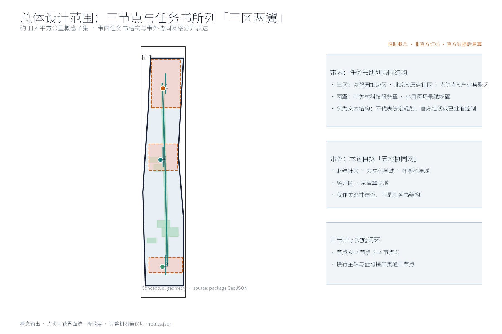
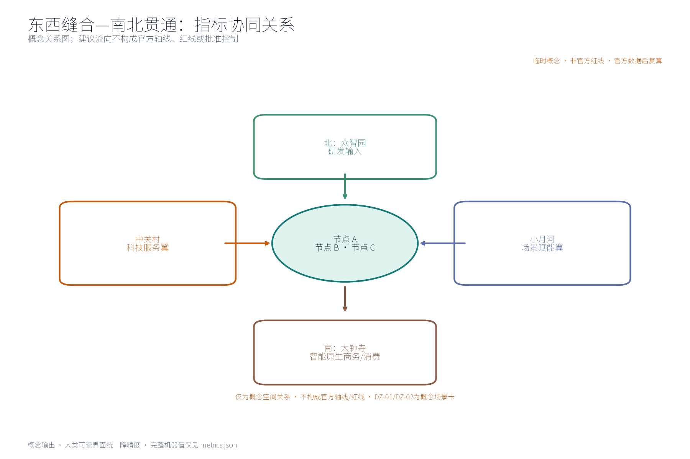
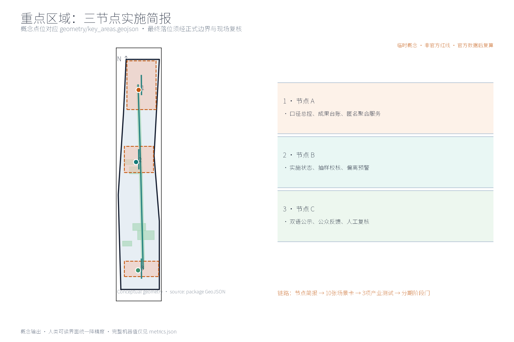
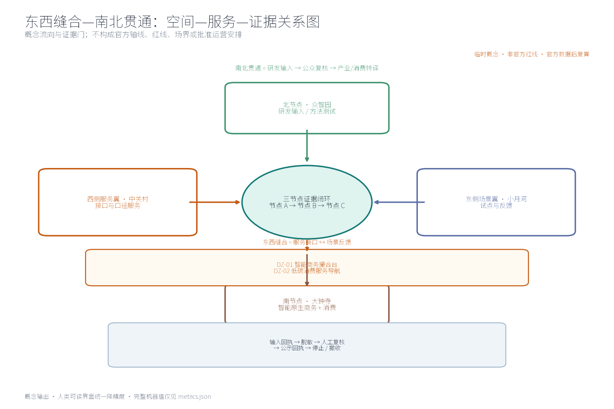
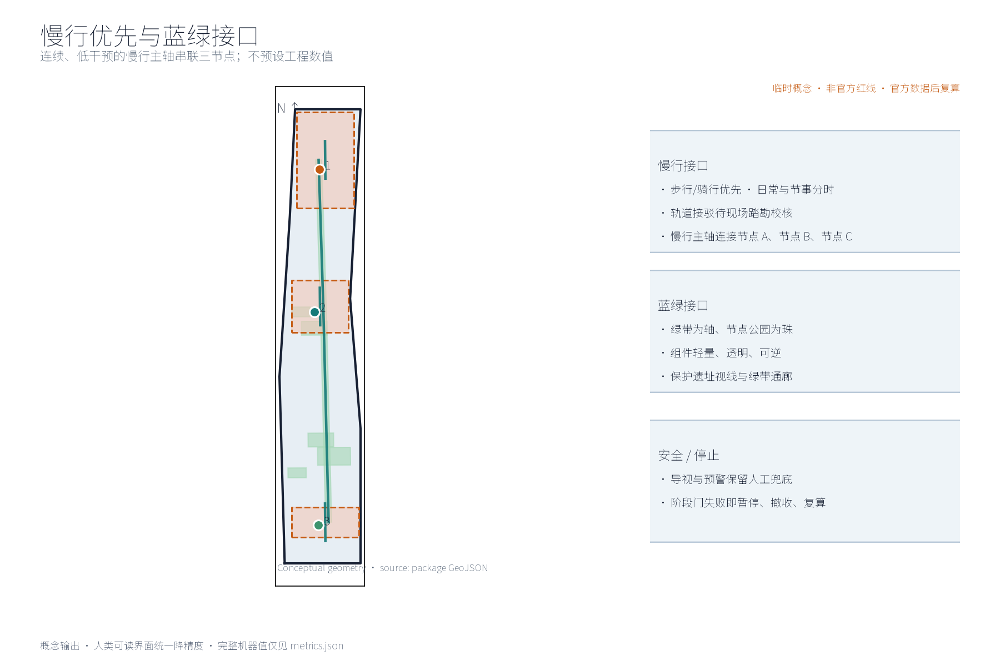
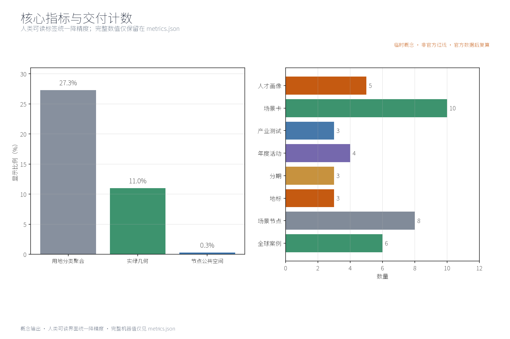
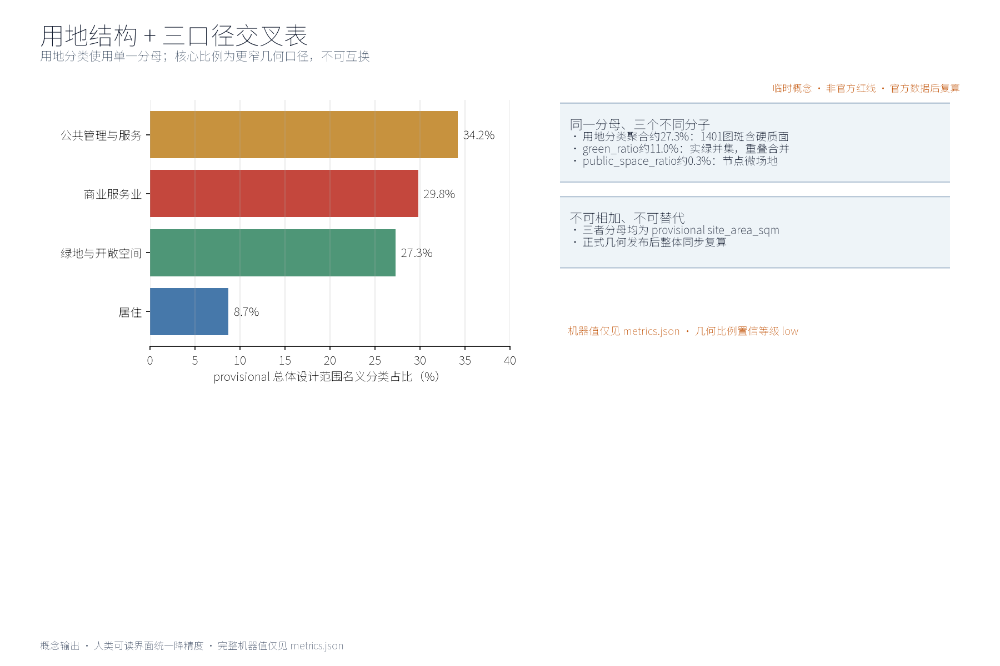

本方案为概念建议：围绕「PACKAGE-3886」提出指标实施与监督体系的理念、结构与空间组织方式，不给出容积率、建筑高度、拆改留或工程实施结论，不编造任何指标监测数据。

## 设计依据与资料清单
本清单为概念工作依据清单，非已获取数据包：征集公告与公开任务书（明确要求构建世界级AI创新生态体系、提出产业重点、指标体系、创新网络和产业空间组织方式，并规定三项formal核心视觉指标 site_area_sqm、green_ratio、public_space_ratio 须可由投稿者几何复算）；公开规范包括《城市设计管理办法》《控制性详细规划编制与审批办法》《国土空间调查、规划、用途管制用地用海分类指南（2023）》《生成式人工智能服务管理暂行办法》《无障碍环境建设法》，以及《个人信息保护法》《数据安全法》的相关公开条款；国际国内指标治理公开资料（纽约 OneNYC、哥本哈根 CPH2025、伦敦城市指标面板、新加坡智慧国、巴塞罗那超级街区、维也纳智慧城市等，逐项登记于 sources.json）；京张铁路遗址公园公开建设信息与概念性踏勘记录仅作空间叙事背景，不作现状结论依据。方案仅作概念建议，不引述、不推断任何官方监测数值；未获取项已在风险与缺失数据说明中如实登记。

> **证据锚点**：[source:DATA-SRC-OFFICIAL-ANNOUNCEMENT-20260509]、[source:DATA-SRC-AGENT-TASKBOOK-20260518]、[source:DATA-SRC-MOHURD-URBAN-DESIGN-MEASURES]。

## 任务书正式 agent 交叉表（本包交付边界）
本表先于正文定义唯一编号，避免“带内三区两翼”与本包协同网络、以及 agent 编号发生多义映射；所有交付均为概念建议，正式几何、责任主体和指标基线均为 `to_verify`。

| 正式任务 ID与任务书标题 | 本专项章节 | 必需产出 | 图件/指标证据 |
| --- | --- | --- | --- |
| agent.1 一带总体概念与功能统筹方案设计 | 三层范围、区域协同、指标总控 | 三大定位/五大功能映射；带内三区两翼与带外五地协同网分层 | site-overview；`site_area_sqm`、`green_ratio`、`public_space_ratio` |
| agent.2 AI全栈自主创新体系与世界级AI创新生态设计 | AI创新生态、人才画像与AI+场景 | 6个全球案例、生态图谱、五类画像、数据/算力/人才/场景接口 | ecosystem-atlas；`global_case_count`、`persona_count` |
| agent.3 AI+场景赋能新范式与智能化AI活力城市设计 | AI+场景卡、产业验证测试 | 10张场景卡、3项行业测试、节点落位、输入输出与人工门 | key-areas、mobility-bluegreen；`scenario_node_count`、`industry_test_scenario_count` |
| agent.4 AI公共空间、智能原生新业态与朝圣地标设计 | 重点区域、蓝绿空间、组件库 | 三节点/三地标、东西缝合—南北贯通关系图、大钟寺 DZ-01/DZ-02 场景组、可逆组件与无障碍边界 | key-areas、east-west-north-south、land-use-structure；`landmark_count`、`public_space_ratio` |
| agent.5 百年京张文化、中关村文化与AI新文化融合叙事设计 | 蓝绿空间、文化导视与传播 | L1/L2/L3 分级资源目录、故事节点—导视—国际文案映射、多语导视、公众监督与国际传播 | site-overview、mobility-bluegreen、resource_story_directory.json；来源与 provisional 标记 |
| agent.6 一带全球AI创新活动体系与长期运营设计 | 更新项目、分期、年度活动 | 三阶段、RACI、四项年度活动执行卡、退出回滚与年度复算 | metrics-evidence；`annual_program_count`、`phase_count` |

以上为任务书 ID 的唯一正文映射；“五地协同网”仅为本包带外概念工作代号，不是任务书的 agent、三区两翼或官方空间结构。

## 三层范围工作框架
按任务书文本结构建立三层概念范围框架：统筹研究范围约 43.6 平方公里，总体设计范围约 11.4 平方公里，重点区域约 368.4 公顷（含任务书所列「三区两翼」协同结构——三区：众智园AI自主创新加速区约192公顷、北京AI原点社区约104公顷、大钟寺AI产业集聚区约72公顷；两翼：中关村科技服务翼、小月河场景赋能翼）；这些名称、面积与多边形仅作任务响应和关系性映射，不代表法定规划、官方红线或已批准控制效力。本包子范围与总体设计范围口径一致（概念子集），全部边界为 provisional 临时几何，官方正式多边形发布后整体复算，不作最终划定结论。三层成果逐级传导：统筹研究输出的指标治理环境与区域协同判断约束总体设计，总体设计校核的指标节点布局、监测网络与时序生长落实到节点详设；每层均保留机器可读证据锚点，便于评审对照。

三层分工（概念级）：统筹研究范围研判产业与未来城市方向，界定指标实施与监督体系与AI创新生态的耦合关系；总体设计范围以京张铁路遗址公园绿带为骨架，衔接城市更新与控规深度城市设计；重点区域开展节点 A、节点 B、节点 C三节点详细设计。边界精度与置信等级随复算、对接与意见反馈动态校核，不预设官方红线。

> **证据锚点**：[source:DATA-SRC-OFFICIAL-ANNOUNCEMENT-20260509]（三层官方范围文本口径）、[source:DATA-SRC-PROVISIONAL-BOUNDARIES-20260605]（本包 provisional 几何）、[metric:site_area_sqm]。

## 统筹研究范围产业与未来城市研究

### 任务书专有定位与功能的显式映射

任务书三大定位（百年京张文化带、都市AI生活体验带、AI融合创新带）与五大功能（AI全栈自主创新体系、世界级AI创新生态、AI+场景赋能新范式、智能化AI活力城市、AI治理全球话语权）的显式映射（概念判断）：PACKAGE-3886以京张铁路历史叙事与遗址记忆承接文化带内涵，以可感知的指标公示与体验场景支撑生活体验带，为创新带提供指标体系总控与监督闭环的治理底座；指标体系与监督闭环直接支撑AI治理全球话语权与世界级AI创新生态的可量化落地，并为其余三项功能提供可采集、可监测、可公示的公共数据与反馈底座。上述对应仅为概念级功能映射，不构成功能承诺。

### 区域协同：带内「三区两翼」与带外「五地协同网」的明确区分

为避免与任务书专有结构混淆，区域协同区分带内与带外两层（概念级，**两类协同对象不互替、不重划**）：

- **带内（任务书所列专有称谓与协同结构）——「三区两翼」**：三区（众智园AI自主创新加速区约192公顷、北京AI原点社区约104公顷、大钟寺AI产业集聚区约72公顷；两翼：中关村科技服务翼、小月河场景赋能翼）。这里仅沿用任务书文本中的名称和结构，作为本包的概念协同框架；这些 provisional 面积与多边形不代表法定规划、官方红线或已批准控制效力。本节点体系是其带内协同对象，重点区域详细设计与三节点选址以该文本结构作关系性映射；本节点不替代、不重划「三区两翼」，正式范围与控制条件待组织方提供并核实。
- **带外（本包自拟概念名）——「五地协同网」**：本概念与北纬社区（指标体系民生感知协同）、未来科学城（算力与数据治理协同）、怀柔科学城（指标研究方法协同）、经开区（产业指标落地协同）及京津冀区域（指标口径衔接）建立建议性协同方向。「五地协同网」是本包自拟概念名，非任务书专有结构、非官方称谓，按内部工作代号处理，仅作概念级关系性研判，不预设任何数值、指标与具体地块。
- **沿线节点（带内公共空间与活动）**：沿线高校承担指标研究与验证场景，科创片区贡献产业与项目数据密度，轨道站点充当观测与展示窗口，住区侧重公示、知情与反馈。带内带外均不预设数值、不指向具体地块，仅提供关系性研判供后续深化。

> **证据锚点**：[source:DATA-SRC-AGENT-TASKBOOK-20260518]（三区两翼与功能定位文本口径）、[source:DATA-SRC-PROVISIONAL-BOUNDARIES-20260605]（「五地协同网」为本文档自拟概念名，非官方称谓）。

## 总体设计范围城市更新与控规深度城市设计
总体设计强调「以绿带为骨架的指标实施与监督环境」：依托京张铁路遗址公园绿带组织指标节点、监测网络与慢行骨架，监测设施可逆生长、街道可分时承载监测与节事需求；强调更新而非新建，优先利用存量空间植入指标功能；控规指标（容积率、高度等）仅作校核建议，不修改、不替代、不预判法定控制结论。核心理念是「绿带即指标走廊」：采集、传输、展示、反馈在同一连续空间内完成。

### 品牌与视觉识别（概念）
「PACKAGE-3886」视觉系统以指标环（圆环+节点符号）为基础形制：标志以京张铁轨意象抽象为环形刻度，三节点（节点 A、节点 B、节点 C）对应环形三段刻度；标准色取遗址灰、轨道红与数据蓝三色；组件族包括标识、字标、图标、展陈模块与导视系统。原创概念名称与标识在品牌在先权利检索完成前均按内部工作代号处理，不用于外部注册与正式发布（详见风险、版权与合规说明）。

### 可逆公共空间组件库（概念）
「组件库」为可逆公共空间构件集：公示屏柱、模块化监测箱、可收放座椅、临时展架、地面刻度铺装与分时围挡六类构件，均以低干预、可逆、可迁移为原则，可组合出公示角、监测点、研学台与节事场，便于分期试错与撤收，不构成建设承诺。

> **证据锚点**：[source:DATA-SRC-MOHURD-CONTROL-DETAILED-PLANNING]（控规校核边界表述）、[data:geometry/site_boundary.geojson]、[metric:green_ratio]。

## 重点区域详细设计
三节点选址均为概念点位，须经规划、数据、文保与主管部门评估及专业审查后重新落位；节点间的绿带动线与慢行通道构成完整指标动线，详细平面与剖面以图册与 geometry 层表达。节点与任务书「三区两翼」的映射（概念级）：节点 A对应中关村科技服务翼"口径与服务汇聚"职能（衔接未来科学城数据治理方向），节点 B沿绿带分段设点（与众智园加速区、小月河场景赋能翼的实时场景测试协同），节点 C近住区与轨道站点（与北京AI原点社区、大钟寺集聚区的生活服务与公众参与协同）；带外以「五地协同网」（北纬社区、未来科学城、怀柔科学城、经开区、京津冀）提供口径衔接建议，二者经年度复算与对接动态校核。

三节点设计任务（概念）：节点 A——实施中枢，置绿带中段概念位置，承担指标汇聚、复算、发布与调度，轻量植入既有建筑群；节点 B——实施监测站，沿绿带分段设点，承担现场采集、巡检休憩与设备维护；节点 C——指标公示与公众监督平台，近住区与轨道站点，展示指标动态并提供匿名反馈入口。「地标目录」按枢纽型地标（节点 A）、廊道型地标（绿带刻度轴）、节点型地标（节点 C）三级登记，附荣誉展示区（公众监督成果与志愿贡献公示墙）与组件库组合方案。三节点以慢行轴串联，相互支撑。

> **证据锚点**：[data:geometry/key_areas.geojson]（三节点示意多边形）、[source:DATA-SRC-AGENT-TASKBOOK-20260518]（地标与荣誉展示条目）。

### agent.4「东西缝合—南北贯通」关系与大钟寺场景组（概念建议）

“东西缝合—南北贯通”是本方案的关系性空间机制，不是官方轴线、红线、法定规划或批准的控制效力。东西向把中关村科技服务翼的口径/接口服务，与小月河场景赋能翼的试验/反馈服务缝合；南北向串联众智园研发输入、北京AI原点社区公众监督与大钟寺产业转化，形成“节点 A—节点 B—节点 C”的慢行反馈闭环。图中箭头仅表示建议流向；节点、道路、运营边界须经正式几何、现场安全、产权和运营核验。

大钟寺场景组为补充概念卡，不使用大钟寺实际经营、个人或未授权数据，不依赖官方红线：

| 卡号 | 空间类型/用户 | AI能力与运营主体 | 数据边界与人工门 | 退出条件 |
| --- | --- | --- | --- | --- |
| DZ-01 智能商务撮合台 | 可逆共享会谈/展示台；初创团队、园区工作人员、访客 | AI按公开需求标签匹配议题并生成中英提示；R运营团队，A场地管理方 `to_verify`，C高校/专业团队 | 仅接收公开企业信息或已授权脱敏预约文本；不做画像、信用推断或自动决策。人工核验来源、理由、发布文案，参与者可拒绝；入口原文先脱敏再入模 | 授权缺失、事实/可达性/隐私门失败或模型异常：暂停模型与屏幕，转人工登记，隔离并删除/撤回受影响输入 |
| DZ-02 低碳消费与服务导航 | 可逆街角服务台/商户展示位；居民、职工、访客与低数字能力人群 | AI根据获授权的聚合目录生成服务提示、路线和多语问答；R商户联盟，A场地管理方 `to_verify`，C社区/无障碍顾问 | 仅用服务类别、营业状态等聚合信息；自由文本遵循“入口—预处理/脱敏—模型—公示聚合”，低样本抑制，不采集个体轨迹。人工核验商户授权、事实、无障碍和时间 | 事实不可核验、投诉/样本/模型/安全门失败：撤下提示，停止模型，改用人工纸面/窗口服务并记录复核 |

以上均为概念建议，现状基线、实际运营主体、场地许可和大钟寺数据均 `unknown/to_verify`；不构成已实施承诺。

卡片证据契约：任何试点声称发布前，每张卡都必须形成输入回执、授权/脱敏记录、模型版本记录、人工复核决定、公示输出回执和停止/回滚记录；缺少任一回执即判定阶段门失败，不得据此推断现状。空间类型、节点归属、运营主体任命与数据访问权均待核验。

DZ-01/DZ-02 的可审查字段已在 `visual/assets/kpi_protocols.json` 的 `scenario_card_protocols` 中逐项登记：空间类型、用户、AI能力、运营主体、数据边界、人工门、退出条件、公式、建议阈值、`unknown/to_verify` 基线、频率、证据、建议 R/A 与失败动作。它们是可供专业团队深化研究的概念建议，不依赖大钟寺官方红线或既有商户资料。

## AI 创新生态、人才画像与 AI+ 场景
AI技术协议（概念）：每类AI应用均配置模型评测（基准测试与误报率登记）、数据质量（口径校验、缺失值与异常值处理）、误差分群（按街区、时段与指标类别分群复盘）与运行监测（预警触发记录、人工复核与故障降级）四类协议。反馈入口可接收自愿提交的自由文本，因此原始输入在预处理前可能含姓名、电话、地址或其他可识别信息；入口不把原文直接送入模型。预处理/脱敏层先做最小必要收集、字段剥离、自由文本脱敏与高风险输入隔离；AI模型层只接收脱敏后的文本、公开资料或达到最低样本量的聚合值；公示聚合层只发布经人工复核的低敏聚合主题/趋势。原始输入仅由最小授权的隐私/事件处理角色访问并留有审计日志，最短保存与删除期限尚未由运营方确认（`to_verify`）；低样本只展示区间或不发布，设纠错申诉入口。任一脱敏失败、越权访问、重识别风险或模型/数据质量门失败即停止模型与公示、隔离并删除/撤回受影响输入（具体事件通知与时限 `to_verify`）。指标采集聚合AI、实施进度监测AI、指标偏离预警AI为主干场景，每处均配置人工复核兜底；公示解读AI、公众监督反馈AI为支撑场景；禁止过度监控，不进行个体识别式追踪；指标实施与监督为概念性机制建议，不替代法定统计与信息公开职责。

五类人才画像：创业者关注落地进度与政策兑现，AI开发者关注开放数据与接口，社区居民关注环境与公共服务类指标，学生关注学习与参与场景，运营管理人员关注采集与维护效率。覆盖领域（概念口径）：交通、产业、空间、公共服务、文化与治理六域——交通跟踪慢行优先与接驳环境指标，产业跟踪科创与场景开放进度指标，空间跟踪用地结构与公共空间指标，公共服务跟踪设施配置与服务覆盖指标，文化跟踪文化资源保护与叙事传承指标，治理跟踪公示、反馈与监督闭环指标；各领域指标清单以官方口径确认后细化。数据架构分反馈入口、预处理/脱敏、AI模型、公示聚合四层：入口可能接触自愿自由文本原文，预处理层接触并隔离待脱敏输入，模型层仅接收脱敏文本/公开资料/聚合值，公示层仅接触经人工复核且满足低样本抑制的聚合结果；原始输入访问权限、最短保存/删除期限和事件时限均 `to_verify`。

### AI+ 场景卡（10张，均为概念设计；模型输入须经过脱敏/聚合，入口原文按最小权限隔离）
| 场景卡 | 空间载体 | AI能力 | 数据与隐私边界 | 运营主体 |
| --- | --- | --- | --- | --- |
| 指标采集聚合AI | 节点 A及沿线采集点 | 多源采集、口径对齐与匿名聚合 | 采集接口只向模型提供脱敏字段/聚合值；原始输入隔离，最低样本门槛；不进行个体识别式追踪 | 节点 A运营团队 |
| 实施进度监测AI | 节点 B（沿绿带分段） | 实施进度与指标状态监测、公开口径校核 | 匿名化处理，关键结论经人工复核后发布 | 节点 B运营团队与专业检测机构 |
| 指标偏离预警AI | 节点 B与轨道站点接驳节点 | 指标偏离识别与分级预警 | 仅街区级聚合统计，禁止过度监控 | 运营团队，预警经人工复核 |
| 公示解读AI | 节点 C（近住区与轨道站点） | 指标公示内容多语解读与文化科普表达 | 仅基于公开数据二次加工，来源与口径可追溯 | 节点 C运营团队，志愿者辅助 |
| 公众监督反馈AI | 节点 C与线上反馈通道 | 公众意见归集、聚类与反馈跟踪 | 入口可接收含个人信息的自由文本；预处理层脱敏/隔离后才送模型；原始输入最小授权访问，低样本抑制、纠错申诉与删除规则 `to_verify` | 运营方、社区议事代表与志愿团队 |
| 慢行流量态势AI | 慢行轴沿线节点 B | 慢行流量街区级态势感知与节事疏导 | 仅街区级聚合计数，不识别个体轨迹 | 节点 B运营团队 |
| 绿地健康度AI | 绿带公园节点 | 植被与铺装状态巡检辅助 | 仅设施级聚合数据，人工复核维修建议 | 公园管养单位协作 |
| 多语导览AI | 节点 C与线上平台 | 指标与文化的多语种导览生成 | 仅公开资料加工，生成内容人工复核 | 节点 C运营团队 |
| 研学互动AI | 站点研学台 | 指标科普问答与研习任务生成 | 无账号即可用，匿名会话，不留存个体信息 | 高校志愿者协作 |
| 舆情归因AI | 线上反馈平台 | 反馈主题聚类与改进归因 | 只接收脱敏文本/聚合主题；低样本不公开，人工复核后发布；异常时停止模型与公示并启动事件响应 | 运营方与专业团队 |

10 张场景卡的概念 KPI 协议（当前值不填，基线均为 `unknown/to_verify`；完整字段见 `visual/assets/kpi_protocols.json`）：

| 卡号 | 可审查公式 | 建议阈值/频率 | 证据记录 | 建议 R/A | 失败动作 |
| --- | --- | --- | --- | --- | --- |
| SC-01 指标采集聚合 | `valid_aligned_records / sampled_records` | 0.90–1.00；月度抽样 | 输入回执、口径版本、脱敏记录、人工签字 | R 运营 `to_verify` / A 专业复核 `to_verify` | 隔离批次，人工复算 |
| SC-02 进度监测 | `evidence_backed_status_items / sampled_status_items` | 0.90–1.00；月度、季度漂移 | 状态台账、来源链、版本、复核回执 | R 监测团队 `to_verify` / A 主管部门 `to_verify` | 标签改为 unknown，人工复核 |
| SC-03 偏离预警 | `true_positive_reviewed_alerts / all_reviewed_alerts` | 0.80–0.95；月度、季度误差 | 留出集、混淆矩阵、漂移、人工决定 | R 运营+测试 `to_verify` / A 主管部门 `to_verify` | 停模型、撤回预警、重测 |
| SC-04 公示解读 | `human_reviewed_correct_disclosures / sampled_disclosures` | 0.90–1.00；每次发布、月抽样 | 来源台账、中英对照、可达性清单、公示回执 | R 编辑运营 `to_verify` / A 专业/无障碍 `to_verify` | 删除文案，回退来源卡 |
| SC-05 公众反馈 | `on_time_closed_valid_feedback / valid_feedback` | 0.80–0.95；月度、季度 | 输入/脱敏/访问/答复/申诉回执 | R 社区运营 `to_verify` / A 主管/隐私 `to_verify` | 停聚类，人工答复，删撤受影响输入 |
| SC-06 慢行态势 | `valid_count_intervals / planned_count_intervals` | 0.80–0.95；活动日、月抽样 | 计数回执、时空定义、安全签字、人工比对 | R 运营 `to_verify` / A 场地管理 `to_verify` | 冻结自适应导引，改静态牌 |
| SC-07 绿地健康 | `human_confirmed_valid_maintenance_flags / sampled_flags` | 0.80–0.95；月度巡检 | 巡检单、权利记录、人工决定、维修回执 | R 管养单位 `to_verify` / A 场地/专业 `to_verify` | 丢弃建议，人工巡检 |
| SC-08 多语导览 | `passed_language_source_accessibility_reviews / submitted_signage_items` | 1.00；发布前、季度 | 来源ID、中英对照、触觉/语音检查、公示回执 | R 编辑运营 `to_verify` / A 语言/无障碍 `to_verify` | 替换为核验卡或撤牌 |
| SC-09 研学互动 | `safe_reviewed_learning_prompts / sampled_prompts` | 0.90–1.00；每活动日、月抽样 | 提示版本、安全复核、匿名计数、非设备替代 | R 教育团队 `to_verify` / A 教师/场地 `to_verify` | 改印刷任务，停模型 |
| SC-10 舆情归因 | `human_verified_actionable_clusters / sampled_clusters` | 0.80–0.95；月度、季度公平复核 | 脱敏、低样本审计、聚类复核、行动/申诉 | R 运营 `to_verify` / A 专业/隐私 `to_verify` | 停模型、抑制输出、人工台账 |

### 产业验证测试场景（3个，概念）
| 测试协议 | 测试对象 | 验证要点 | 通过判据（概念） | 复算触发 |
| --- | --- | --- | --- | --- |
| 指标口径一致性测试 | 指标采集聚合AI | 多源口径对齐与匿名聚合正确性 | 抽样复核一致率达标并经人工确认 | 口径或来源变更 |
| 预警准确率测试 | 指标偏离预警AI | 分级预警的准确率与误报率 | 误报率低于概念阈值且人工复核通过 | 模型或数据质量变更 |
| 公示可读性测试 | 公示解读AI | 多语解读的准确性与可读性 | 目标人群抽样可懂率达标 | 公示内容结构变更 |

三项测试的可审查协议（均为概念建议，基线 `unknown/to_verify`）：T-01 `匹配样本输出 / 审计样本输出`，建议 0.90–1.00，换源/改 schema 即测，证据为金标准样本、人工裁决与复算回执；T-02 `真阳性复核预警 / 全部复核预警`，建议 0.80–0.95，月度运行/季度留出集，证据为混淆矩阵与误报台账；T-03 `达到理解标准的参与者 / 有效参与者`，建议 0.80–0.95，重大发布前/季度抽样，证据为匿名理解任务与无障碍记录。三项均建议 R 专业/运营测试团队、A 主管部门或口径责任方（均 `to_verify`）；失败分别阻断发布并修复字典、停用预警、修改文案后重测。

> **证据锚点**：[source:DATA-SRC-GENERATIVE-AI-INTERIM-MEASURES]（AI生成内容治理表述参照）、[metric:industry_test_scenario_count]、[metric:persona_count]。

## 用地、建筑规模与拆改留方案
用地分类（概念口径，单一口径：以本包 provisional 总体设计范围边界（site_area_sqm）为分母，按自然资源部用地用海分类指南代码对 geometry/land_use.geojson 分区归类聚合；官方正式边界发布后按同一公式复算，官方控规条件与实测数据到位前不用于任何法定用途）：公共管理与公共服务用地约 34.2%（科研用地 26.1%、文化用地 8.1%），商业服务业用地约 29.8%（商业用地 13.1%、商务金融用地 16.7%），绿地与开敞空间用地约 27.3%（公园绿地），居住用地约 8.7%；四项合计 100%。道路与交通设施用地未在概念分区中单列（慢行主轴向按线状要素表达，见 geometry/roads.geojson），不单列占比；各项比例以 geometry/land_use.geojson 分类面积聚合得出，公式与概念来源见 metrics.json 与合规矩阵。

**用地分类与核心指标口径交叉表**（三分母相同、分子尺度不同，不互为替代；机器值见 metrics.json）：
| 口径 | 分子（概念几何复算） | 分母 | 显示值 | 置信 | 关系与用途 |
| --- | --- | --- | --- | --- | --- |
| 用地分类聚合口径 | land_use.geojson 中 1401（公园绿地）类分区总面积，含分区内广场、铺装与慢行路径等全部范围（约 311.6 公顷） | site_area_sqm | 约 27.3% | low | 描述"绿地与开敞空间用地"的名义分类占比，覆盖分类全要素，不等同实绿面积；仅用于用地结构描述 |
| 实绿几何口径（green_ratio） | green_space.geojson 绿地多边形并集面积（重叠已合并，约 125.6 公顷） | site_area_sqm | 约 11.0%（机器值见 metrics.json） | low | 核心指标 green_ratio；分子仅为植被面并集，比分类口径窄，用于绿地覆盖率态势校核 |
| 节点公共空间口径（public_space_ratio） | public_space.geojson 三节点及场景节点微场地总面积（约 3.6 公顷） | site_area_sqm | 约 0.3%（机器值见 metrics.json） | low | 核心指标 public_space_ratio；分子仅为节点级微场地，用于三节点公共空间密度表述 |

关系说明：三项数据同以本包 provisional 总体设计范围为分母；27.3% 计数"分类名义"、11.0% 计数"实绿并集"、0.3% 计数"节点微场地"，覆盖面依次收窄，不互为替代、不可相加比较；官方边界与控规条件发布后按同一几何与公式整体复算并同步更新中英文与图件数值。

拆改留坚持留改拆并举：以留为主保留遗址公园肌理与铁路历史遗存，存量建筑功能置换并预留指标监测化改造方向（采集接口、公示屏位），拆除仅限经个案论证的局部疏通慢行零星建筑。指标监测设施与公共服务设施采用轻量、可逆、模块化植入方式，优先与既有建筑功能置换结合（驿站、管理用房、站点附属与桥下空间等），避免增量占地与大规模改造；不预设建筑面积、建筑高度或拆改留结论，涉及现状资源的局部利用须以实测、产权与官方数据复算后另行判断。

> **证据锚点**：[source:DATA-SRC-MNR-LAND-USE-CLASSIFICATION-202311]（用地分类名称参照）、[metric:green_ratio]、[metric:public_space_ratio]。

## 交通、轨道、市政与公共服务设施
以交通慢行优先为核心组织交通概念机制：连续慢行轴贯通节点 A、节点 B与节点 C，街道断面按日常与节事状态分时响应，衔接沿线高校、园区与轨道站点（接驳以步行与骑行为主），监测采集与公示设施沿慢行空间低干预布置；轨道站点与监测节点接驳顺畅，优先改善出入口与绿带的步行衔接；市政以集约共享为原则，优先依托既有管线与设施，减少重复开挖；公共服务配置多语服务、指标公开与研习空间，AI决策均设人工复核。本环节仅给出方向性建议，不预设任何工程数值与实施结论。

人群覆盖（概念口径）：公共服务面向全龄多元人群做包容性安排，兼顾适老与儿童友好——长者与银龄人群获得无障碍通行、大字版公示解读与就近休憩，儿童与亲子家庭获得安全慢行与科普活动空间，青年与通勤人群获得创新参与与休息驿站，学生获得研学机会，游客获得多语导览，从业者获得配套服务，并为残疾人等弱势群体预留包容性无障碍安排；无障碍设施范围与无障碍环境建设法限定的服务场景边界一致，不泛化到全部公共空间，具体配置以需求调查与专业评估后确定。

> **证据锚点**：[source:DATA-SRC-MOHURD-URBAN-DESIGN-MEASURES]（慢行与市政方法参照）、[source:DATA-SRC-BARRIER-FREE-ENVIRONMENT-LAW]（无障碍边界）、[metric:road_network_length_m]。

## 蓝绿空间、公共空间与城市风貌
构建「绿带为轴、节点公园为珠」的蓝绿公共空间体系：以遗址公园绿带为蓝绿骨架串联沿线小微绿地与开敞空间，监测与公示设施与公园融合布置、宜轻宜透宜可逆，不遮挡历史遗迹与绿带视线；指示与解说系统统一克制；风貌延续京张铁路工业记忆语汇并与数据有序的新氛围对话，融合中关村创新文化与AI新文化叙事（「机制 M3：数据刻度」叙事线），整体风貌导控克制统一，避免符号堆砌与口号化包装。

文化、导视与国际传播系统（概念）：文化叙事按京张铁路历史层、中关村创新层、AI新文化层三层展开，文化资源保护与叙事传承指标进入指标体系统计；导视系统统一多语种标识规范，含无障碍触觉与语音导视；国际传播依托年度指标开放日、多语公示内容与开发者社区开放数据接口，向全球开发者与研究者传播指标体系方法论，品牌识别度、场景可感知度与国际传播力随年度活动与复算结果滚动提升。

### agent.5 京张铁路—中关村—AI新文化资源分级目录（概念）

| 层级/资源 | 正式来源与背景资料 | 创意叙事状态 | 资源—故事节点—导视载体—国际传播文案映射 |
| --- | --- | --- | --- |
| L1 / R-L1-001 任务书与公告文本 | `DATA-SRC-OFFICIAL-ANNOUNCEMENT-20260509`、`DATA-SRC-AGENT-TASKBOOK-20260518`；正式任务文本，不是遗产史实证明 | `formal_registered_text`；空间与运营仍 `to_verify` | 节点 A入口/节点 C总览墙；双语范围卡；“A taskbook-led indicator corridor, open to review and recomputation.” |
| L2 / R-L2-JZ-001 京张铁路历史资源与遗址线索 | 当前没有逐项保护名录、档案或现场核验；`no_itemized_protection_archive_held`，背景 `to_verify` | `pending_context_only`；不把未核验史实写成事实，失败即删除/降级 | 节点 B铁路记忆层/沿绿带慢行节点；暂只放核验标签；“Railway memory, pending site and source verification.” |
| L2 / R-L2-ZGC-001 中关村创新文化 | 任务书支持创新生态语境；具体人物、事件、机构与版权 `to_verify` | `contextual_suggestion_only`；不列未经核验人物/事件 | 节点 A接口/开发者空间；服务接口与方法导视；“From service interfaces to accountable public indicators.” |
| L3 / R-L3-AI-001 AI新文化 | `PACKAGE-GEOMETRY` 与本包原创机制/文案；是创意叙事，不是历史来源 | `original_creative_proposal`；必须标注概念建议 | 节点 C与大钟寺概念场景组；指标卡、字幕、网页；“Measure, review, disclose — and keep a human way out.” |

发布门：L1只引用已登记文本；L2只有在来源、保护要求、权利和现场核验完成后才能进入事实性导视；L3必须标注“概念建议”。史实、位置或版权核验失败时，降级为待核验提示、删除该条或取消传播，不以创意文案补足证据。

以上目录的机器可读单一台账为 `visual/assets/resource_story_directory.json`：逐项记录正式来源、背景状态、原创叙事状态、资源—故事节点—导视载体—国际传播文案、三节点/空间类型、权利门与失败动作；L2 无正式逐项史实来源的条目不会进入事实性导视。

> **证据锚点**：[source:DATA-SRC-MOHURD-URBAN-DESIGN-MEASURES]（蓝绿与风貌方法参照）、[metric:green_space_area_sqm]。

## 更新项目清单、实施政策与分期计划

### 试点区域与参与主体

试点区域（概念，非已批准政府安排）：以「节点 A+节点 C」样板段为首期试点——具体范围为 geometry/key_areas.geojson 中 KEY-ZHON（节点 A概念多边形）与 KEY-BEIJ（节点 C概念多边形）连线两侧各延伸约 250 米、沿绿带中段约 1 公里概念区间，覆盖指标采集—公示—反馈闭环；中远期将试点经验向 KEY-DAZH（节点 B段）与绿带南北两翼延伸。参与主体按概念分工（非责任承诺）分八类：①政府（主管部门统筹指标口径发布与监督复核）；②企业（科创与运营主体参与场景共建、数据接口开放）；③高校（指标方法研究、复算验证与人才实习）；④居民与社区（公示反馈、议事参与、日常维护监督）；⑤运营团队（监测、采集、公示与设备日常运行）；⑥志愿者（节点 C值守、研学协助、活动支援）；⑦商户（沿带场景经营与联合共治）；⑧专业团队（规划、数据、法务与法定的合规复核）。建议以「机制 M1：指标共治公约」明确各方参与边界与权责（公式化条款：参与资格—角色定位—权限分级—撤收程序），并以「机制 M2：指标开放积分制」将参与折算为积分、记入年度公示，权责安排经正式程序确定后生效。

### 分期与每期任务/主体/阶段门/退出机制（概念）

近期1—3年（启动期）：①任务——建立指标基线、试点「节点 A+节点 C」样板段运行、明确数据口径与责任主体、印发「机制 M1：指标共治公约」草案；②牵头——运营团队（试点运营）；③协作——社区议事会+高校+志愿团队+专业团队（口径校核）；④准入——官方边界与控规条件发布、口径确认、数据字典初版；⑤阶段门——试点运行满1年复核数据质量与公众参与度；⑥停止条件——试点未达概念阈值（如公示及时率低于概念值、采集覆盖率不达标）即停项；⑦退出/回滚——设施可逆回收，数据与文档归档。中期3—5年（扩展期）：①任务——扩展节点 B网络、上线指标偏离预警AI与慢行流量态势AI场景、完善公众参与渠道、形成开发者社区联盟；②牵头——主管部门（统筹口径）+区级平台（运营管理）；③协作——开发者社区联盟+高校+专业团队；④准入——试点评估通过、数据接口标准确定、预警准确率达概念阈值；⑤阶段门——监测覆盖率、预警准确率与公众反馈处理率达概念阈值；⑥停止条件——未达阶段门指标即分节点撤收与置换；⑦退出/回滚——分节点撤收，设备循环利用。远期5—10年（常态化期）：①任务——形成常态化监督与年度复算制度、形成多主体共建联盟、形成场景开放与招引转化机制、形成年度指标开放日品牌；②牵头——多主体共建联盟（联席轮值）；③协作——政府+企业+高校+社区+运营+志愿者+商户+专业团队；④准入——年度复算制度成熟、复算结果连续3年稳定；⑤阶段门——常态化监督与年度复算执行率达概念阈值；⑥停止条件——连续2年复算未达标触发复盘；⑦退出/回滚——年度复算公示，未达标触发局部回滚与口径校准。

### 三阶段可审查概念协议（阈值不是现状值）

下表把分期的“达标”改写为可审查协议；所有基线均为 `unknown/to_verify`，建议阈值须由正式运营方、主管部门和专业团队确认后才生效。

| 阶段 | 公式与建议阈值/区间 | 基线/频率 | 证据记录 | 建议 R/A | 失败动作 |
| --- | --- | --- | --- | --- | --- |
| 近期启动 | `有效采集批次 / 计划采集批次`；`按时公示批次 / 计划公示批次`；建议 0.80–0.95 | 基线 `unknown/to_verify`；月度抽样、年度复核 | 计划/有效批次台账、版本日志、口径审签、抽样复核单、公示回执 | R 运营团队 `to_verify`；A 主管部门/运营方 `to_verify` | 暂停公示，转人工采集/解释，归档并回收设施 |
| 中期扩展 | `真阳性复核预警 / 全部复核预警`；`按期闭环反馈 / 有效反馈`；建议分别 0.80–0.95 | 基线 `unknown/to_verify`；月度运行、季度误差、阶段复核 | 留出集、混淆矩阵、漂移记录、反馈台账、人工决定 | R 运营+专业测试团队 `to_verify`；A 主管部门 `to_verify` | 停止模型，改人工复核，撤回结论，重测后再启 |
| 远期常态化 | `已完成年度复算周期 / 计划复算周期`；`抑制规则合规次数 / 抽查次数`；建议均 1.00 | 基线 `unknown/to_verify`；年度、三年回顾 | 几何/公式版本包、独立复算、发布回执、抑制审计、申诉处理单 | R 专业团队 `to_verify`；A 共建联盟/主管部门 `to_verify` | 不发布结论，冻结依赖项，局部回滚、重新校准并复核 |

### 「牵头+协作」责任矩阵（RACI概念版）

| 责任环节 | 牵头（R） | 主协作（A） | 咨询（C） | 知会（I） |
| --- | --- | --- | --- | --- |
| 指标定义与口径 | 主管部门 | 专业团队 | 高校+开发者联盟 | 社区+运营+志愿 |
| 采集与监测 | 运营团队 | 专业机构 | 高校+开发者联盟 | 主管部门+社区 |
| 公示与反馈 | 运营方 | 社区议事+志愿者 | 主管部门+专业团队 | 企业+高校+游客 |
| 预警与偏离识别 | 运营团队 | 专业机构 | 主管部门+高校 | 社区+志愿 |
| 年度复算 | 专业团队 | 主管部门 | 高校+开发者联盟 | 全主体 |
| 场景开放与招引转化 | 开发者联盟 | 企业+高校 | 主管部门+运营 | 社区+志愿+商户 |
| 品牌与活动 | 运营+开发者联盟 | 主管部门 | 专业团队+高校 | 社区+志愿+游客 |

### 场景开放与招引转化机制（概念）

开发者社区联盟承办开放日与技术工作坊，开放数据接口备案管理，形成「场景开放—开发者参与—指标反馈—成果转化」机制。开发者接入需按「机制 M2：指标开放积分制」积分（参与提案、提交模型、修复缺陷、组织活动均可累计积分），积分作为试点节点优先使用与年度公示致谢的依据；招引转化通过「机制 M1：指标共治公约」中的"成果转化条款"约定权益分享、署名与归属。所有接入以匿名聚合、关键决策人工复核、禁止过度监控为前置条件。

### 年度活动体系（概念，活动名称与时间均须依法依规另行确定）

| 年度活动品牌 | 内容设想 | 参与机制 |
| --- | --- | --- |
| 年度指标开放日 | 指标口径发布、成果台账展示、数据接口开放 | 预约制参观，开发者联盟承办，备案管理 |
| 年度实施进度通报会 | 进度与指标状态通报、公众质询回应 | 社区议事代表参与，意见通道公开记录 |
| 节点 B体验周 | 节点 B参观、研学互动、志愿值守体验 | 预约轮换制，参与积分与公示致谢回馈 |
| 指标方法国际交流会 | 双语方法说明、案例对读与开发者接口演示 | 公开议程；发言与材料须经运营方人工审核 |

### 四项年度活动执行卡（概念；负责人、资源与日期均为 `to_verify`）
以下执行卡是本提案四项年度活动的单一可读源；`metrics.json` 仅登记 schema 允许的机器指标及 `annual_program_count`，不承载活动卡字段。KPI 为待确认的概念门槛，不是现状数据。任何活动须在资源、隐私、无障碍和场地许可核实后启动。

**AP-01 年度指标开放日 / Annual Indicator Open Day**

- 频次：每年1次（日期 `to_verify`）；目标人群：开发者、高校、居民、企业与公众。
- 空间节点：节点 A、指标节点 C、开放数据接口展示位（具体场地 `to_verify`）。
- RACI：R 运营团队；A 主管部门/运营方（待确认）；C 高校、专业团队；I 社区、企业、游客。
- 资源前提：已确认指标字典、脱敏/聚合数据链路、无障碍导视、场地/消防/活动许可（均 `to_verify`）。
- 双语触点：中英口径卡、现场字幕/手册、线上静态页面；隐私/无障碍：入口若接收预约或自由文本，原始输入仅最小授权访问并在模型前脱敏；公示仅发布低样本抑制后的聚合结果，提供预约替代和无障碍动线（实施细则与删除期限 `to_verify`）。
- KPI（基线 `unknown/to_verify`）：`按时发布口径卡/计划口径卡` 建议 1.00，`按期闭环有效问题/有效问题` 建议 0.80–0.95，`可访问触点/计划触点` 建议 0.90–1.00；活动前/后核验，证据为版本卡、最小预约/问题台账、无障碍清单与公示回执；R 运营 `to_verify` / A 主管部门或运营方 `to_verify`。阶段门：人工审核且资源齐备；失败即取消公示、归档并退回筹备。

**AP-02 年度实施进度通报会 / Annual Implementation Progress Briefing**

- 频次：每年1次（日期 `to_verify`）；目标人群：社区议事代表、主管部门、运营方、企业、高校与公众。
- 空间节点：节点 C、社区议事空间或线上替代场（具体位置 `to_verify`）。
- RACI：R 主管部门/运营方（最终角色 `to_verify`）；A 专业团队；C 社区、高校；I 企业、居民与游客。
- 资源前提：年度复算记录、版本化数据字典、问题答复台账、翻译与无障碍服务（均 `to_verify`）。
- 双语触点：中英摘要、问答记录和版本号；隐私/无障碍：反馈入口可接收自由文本，先由预处理层脱敏再交给模型；只发布经人工复核且低样本抑制的街区级聚合，提供文字/语音/字幕替代（访问权限、删除期限与申诉流程 `to_verify`）。
- KPI（基线 `unknown/to_verify`）：`有证据进度项/报告进度项` 建议 0.90–1.00，`按时回复/有效问题` 建议 0.80–0.95，`双语发布项/应发布项` 建议 1.00；年度核验，证据为复算包、来源台账、问答时间戳、翻译审校和发布回执；R 主管部门/运营方 `to_verify` / A 专业团队 `to_verify`。阶段门：复算与人工复核完成；失败即延期，不发布未核实结论。

**AP-03 节点 B体验周 / Node B Experience Week**

- 频次：每年1周（日期 `to_verify`）；目标人群：学生、志愿者、居民、开发者与运营人员。
- 空间节点：节点 B、研学台、慢行轴观察点（具体点位 `to_verify`）。
- RACI：R 运营团队；A 公园/场地管理方（待确认）；C 高校、专业团队；I 社区、家长与游客。
- 资源前提：设备安全检查、预约分流、志愿培训、天气/应急预案和无障碍路线（均 `to_verify`）。
- 双语触点：中英任务卡、站点说明和现场讲解；隐私/无障碍：不做个体识别或轨迹画像；若入口产生自由文本，按入口—脱敏—模型—公示聚合链路处理并在低样本时抑制发布，提供不使用设备的观察任务和陪同安排（待核）。
- KPI（基线 `unknown/to_verify`）：`通过前置检查/计划检查` 建议 1.00，`按SLA闭环故障/有效故障` 建议 0.80–0.95，`使用无障碍或非设备路径参与者/记录参与者` 建议 0.90–1.00；活动前/每日/活动后核验，证据为安全单、值守表、故障单、撤收记录与替代路径回执；R 运营 `to_verify` / A 场地管理方 `to_verify`。阶段门：安全与人工值守确认；失败即停办撤收并改非设备观察。

**AP-04 指标方法国际交流会 / International Indicator Methods Exchange**

- 频次：每年1次（日期 `to_verify`）；目标人群：研究者、开发者、规划/数据专业人员与国际观察者。
- 空间节点：节点 A、线上会议与节点 C双语展示位（具体场地 `to_verify`）。
- RACI：R 高校/专业团队（最终牵头 `to_verify`）；A 运营方；C 主管部门、开发者联盟；I 社区、企业与公众。
- 资源前提：已清权案例资料、双语审校、演示数据脱敏、线上平台与翻译支持（均 `to_verify`）。
- 双语触点：中英方法说明、案例对读、字幕和可下载版本；隐私/无障碍：仅使用公开或已授权材料，演示数据须先脱敏再聚合，原始输入不进入模型或公示层，提供字幕/文字稿（许可细节、保存删除期限 `to_verify`）。
- KPI（基线 `unknown/to_verify`）：`通过双语复核材料/送审材料` 建议 1.00，`按时闭环公开问题/有效问题` 建议 0.80–0.95，`有来源与权利材料/使用材料` 建议 1.00；活动前/后核验，证据为中英版本、权利/来源台账、审校记录、问题回执；R 高校/专业团队 `to_verify` / A 运营方 `to_verify`。阶段门：权利、事实与人工内容审核通过；失败即移除材料、取消场次并说明原因。

### 四项年度活动可审查概念协议

这些协议与本提案中的四项年度活动卡一一对应；建议阈值不是现状值，基线均为 `unknown/to_verify`。机器端仅以 `metrics.json` 的 `annual_program_count` 登记数量，不把概念阈值误当作现状指标。

| 活动 | 公式；建议阈值 | 频率/证据记录 | 建议 R/A | 失败动作 |
| --- | --- | --- | --- | --- |
| AP-01 年度指标开放日 | `按时发布口径卡 / 计划口径卡`；`按期闭环问题 / 有效问题`；建议 1.00、0.80–0.95 | 年前/年后；版本卡、最小预约台账、答复记录 | R 运营团队；A 主管部门/运营方 `to_verify` | 取消公示，归档并回到筹备 |
| AP-02 年度实施进度通报会 | `有证据的进度项 / 报告进度项`；`双语发布项 / 应发布项`；建议 0.90–1.00、1.00 | 年度；复算包、答复/翻译证明 | R 主管部门/运营方 `to_verify`；A 专业团队 | 延期，不发布未核实结论 |
| AP-03 节点 B体验周 | `通过前置检查 / 计划检查`；`故障按期闭环 / 有效故障`；建议 1.00、0.80–0.95 | 活动前、每日、年度复盘；安全单、撤收记录、反馈台账 | R 运营团队；A 场地管理方 `to_verify` | 停办、撤收，改非设备观察 |
| AP-04 指标方法国际交流会 | `双语材料等价复核通过 / 送审材料`；`来源完整材料 / 使用材料`；建议 1.00、1.00 | 活动前后；权利/来源台账、审校记录、发布回执 | R 高校/专业团队 `to_verify`；A 运营方 | 移除材料、取消场次并说明原因 |

### 退出与回滚（通用原则）

任何阶段门未达或前置条件缺失即触发暂停/退出/回滚，设施以可逆方式撤收复用，数据与文档归档并按合规矩阵登记，全部过程经运营、主管部门与专业团队三方确认后对外公示；回滚不构成已实施承诺的撤回（因全部要素均为概念建议）。

> **证据锚点**：[source:DATA-SRC-AGENT-TASKBOOK-20260518]（分期与运营条目）、[data:geometry/key_areas.geojson]（试点三节点）、[metric:annual_program_count]、[metric:phase_count]。

## 指标体系、面积复算与合规矩阵

### 概念指标体系五项

指标采集覆盖率、实施进度监测率、指标公示及时率、公众反馈处理率、年度复算执行率——发布口径为经脱敏、最低样本抑制和人工复核后的聚合结果；反馈入口的自由文本原文可能含个人信息，不进入模型或公示层。每项登记数据来源、计算公式、置信等级、用途限制与复算触发（见 metrics.json 与合规矩阵），仅作概念指标，不作为现状监测结果。三项formal核心指标（site_area_sqm、green_ratio、public_space_ratio）以本包几何复算为准，面积复算以任务书文本结构所提供的概念口径为底，不代表法定规划控制；官方数据到位后整体复算并标注复算版本。

### 面积与比例的精度政策与口径关系（重点说明）

全部面积与比例为概念口径，人类可读展示一律降精度——比例保留一位小数、面积取整公顷或一位小数（如 site_area_sqm 复算约 11.4 平方公里、green_ratio 约 11.0%、public_space_ratio 约 0.3%），完整机器值（含六位小数）仅存于 metrics.json；正式表达不在中英文叙事、图件和 HTML 中展示机器值。本包复算几何与"绿地与开敞空间用地 27.3%"与核心指标 green_ratio 11.0%、public_space_ratio 0.3%之间不是同义关系，是同一分母、三个不同分子的"分子收窄"关系：

| 口径 | 分子定义 | 分子尺度 | 显示值 | 用途 | 关系 |
| --- | --- | --- | --- | --- | --- |
| 用地分类聚合 | land_use.geojson 中 1401（公园绿地）类分区面积，含分区内广场、铺装与慢行路径等全部范围 | 分类名义 | 约 27.3% | 用地结构描述 | 最宽；不计 1401 类以外的绿地、也含园内非植被面 |
| 实绿几何（green_ratio） | green_space.geojson 绿地多边形并集面积（重叠已合并） | 植被面并集 | 约 11.0% | 核心指标；绿地覆盖率态势校核 | 中等；比分类口径窄，仅计植被面 |
| 节点公共空间（public_space_ratio） | public_space.geojson 三节点及场景节点微场地总面积 | 节点级微场地 | 约 0.3% | 核心指标；三节点公共空间密度 | 最窄；仅计节点级微场地 |

三者口径依次收窄，互不替代、不可相加比较，分母均为本包 provisional 总体设计范围（site_area_sqm，约 11.4 平方公里）；官方边界与控规条件发布后按同一公式与几何整体复算并同步中英文、图件与 HTML。面积与比例在 narrative、metrics.json、figures、HTML 之间保持一致：narrative 与 HTML 一律降精度展示、metrics.json 保留机器值契约、figures 坐标轴标签采用与 narrative 一致的降精度显示。

### 复算与合规矩阵

合规矩阵逐项列明校验要素、数据来源与责任环节，随复算结果更新；复算触发包括官方正式边界发布、控规条件发布、主管口径数据发布、概念数据字典版本变更四种情形，复算后同步更新中英文叙事、figures、HTML 与 metrics.json（机器值）。

### AI 治理与隐私数据链路（全文一致）

反馈入口——可接收自愿自由文本，原文在脱敏前可能含个人信息；预处理/脱敏层——最小收集、剥离直接/间接标识、隔离高风险输入，原始输入仅最小授权角色访问并记录日志；AI模型层——仅接收脱敏文本、公开资料或满足最低样本量的聚合值；公示聚合层——仅发布人工复核后的聚合主题/趋势，低样本抑制为区间或不发布。最短保存/删除期限、权限角色与事件通知时限尚未确认（`to_verify`）；纠错申诉入口必须可用。脱敏失败、越权访问、重识别风险或模型门失败时，立即暂停模型与公示，隔离并删除/撤回受影响输入并启动事件响应。关键决策人工复核，禁止过度监控，不进行个体识别式追踪或行为画像。

> **证据锚点**：[metric:green_ratio]、[metric:public_space_ratio] 见 metrics.json 复算口径；几何与边界口径见 [source:PACKAGE-GEOMETRY] 与 [source:DATA-SRC-PROVISIONAL-BOUNDARIES-20260605]，官方数据发布后整体复算。

## 风险、版权与合规说明

### 风险与合规总则

本方案为概念研究性设计，不构成行政审批依据，也不构成容积率、建筑高度、拆改留或工程可行性结论；风险按监测数据隐私边界、指标口径统一与实施复杂度、运营维护与资源投入、公示与公众接受度、政策与数据发布不确定性、技术依赖与系统故障韧性六维度如实登记于 risk.json（应对原则：匿名聚合、最小必要、人工复核、来源标注与意见通道、可逆撤收与复算触发）。公众反馈AI的数据治理与人工兜底（概念）：自由文本先脱敏后处理、最小收集原则、聚合阈值（低于阈值仅展示区间）、访问日志与权限分级、保存期限与删除流程、错误更正与申诉通道、事件响应预案与公开反馈闭环（受理—处理—回复—公示），全部流程由运营方依法依规公开确定，不构成已确定的运营安排。

### 品牌在先权利与使用边界

本包**未完成**官方商标检索，原创名称与标识——「PACKAGE-3886」「PACKAGE-3886」及「节点 A」「节点 B」「节点 C」「机制 M1：指标共治公约」「机制 M2：指标开放积分制」等概念名与对应的视觉系统——在检索完成前一律按内部工作代号（working codename）处理，不用于外部注册、正式发布或商业使用，不构成商标许可、专有权主张或受保护标识的确认；若与既有标识雷同属巧合，正式实施前须完成在先权利检索与权利清理。Logo 方向为概念图形（环形 + 三节点 + 中轴），未交付正式 logo 成品，本次审查不评价 logo 成品质量；正式 logo 须在通过在先权利检索后才进入设计与发布流程，并按征集规则独立登记。品牌识别度与「PACKAGE-3886」核心机制随年度复算与开放日活动滚动积累，不预设传播与商业化指标。

### 版权与资产台账（按类别逐项登记来源、许可、复用边界）

| 资产类别 | 项目 | 来源 | 许可 | 复用边界 |
| --- | --- | --- | --- | --- |
| 字体 | Noto Sans SC（四个离线 HTML 实际嵌入 WOFF 子集） | 官方 Google Fonts 制品 `https://raw.githubusercontent.com/google/fonts/main/ofl/notosanssc/NotoSansSC%5Bwght%5D.ttf`；版本 `2.004`；源 SHA-256 `a3041811a78c361b1de50f953c805e0244951c21c5bd412f7232ef0d899af0da`；上游 commit `523d033d6cb47f4a80c58a35753646f5c3608a78` | SIL OFL 1.1；完整文本与 provenance 记录均在 `report/copyright_statement.md` 第6节，原文 SHA-256 `1c05c68c34f9708415aada51f17e1b0092d2cea709bf4a94cd38114f9e73d7d9`；四个子集 SHA 也列于该节 | 仅本包离线网页/PDF 构建与征集展示；Arial 未嵌入，仅为查看器系统 fallback |
| 图像与图表 | site-overview、key-areas、ecosystem-atlas、mobility-bluegreen、metrics-evidence、land-use-structure、package-marker-3886 | 本包自产（AI 辅助生成+matplotlib 渲染） | 本包自产，作者社区展示许可 | 仅限本征集展示与评审引用；不构成可商用素材 |
| 地图与几何 | site_boundary、key_areas、land_use、green_space、public_space、roads、buildings、constraints、phasing（geometry/） | 本包自产 provisional 几何 | 本包自产 | 不作为官方红线、控规条件或法定控制；仅作概念骨架 |
| 数据 | 公开口径指标治理案例（NY/CPH/London/SG/BCN/Vienna） | sources.json 逐项登记机构页面 URL、发布日期、获取日期 | 公开口径引用 | 引用不构成机制成效或可复制性判断；不主张官方背书 |
| 案例材料 | 国内对标（北京/上海/深圳/杭州） | 公开报道级信息 | 待研究假设 | 未完成逐项来源登记，不进入正式证据 |
| 品牌与视觉 | 「PACKAGE-3886」「PACKAGE-3886」与上述概念名、视觉系统 | 本包原创概念 | 内部工作代号 | 在先权利检索完成前不用于外部注册 |
| HTML 构建器、模板、CSS 与脚本 | `valroot/scripts/render_proposal_html.py`、`valroot/scripts/build_zjw_visual.py`、`work/regen_3886_visuals.py`；输出内联 CSS/HTML | 构建器仅为仓库本地生成输入，不随本包再分发；内联 CSS/HTML 为本包参与者原创输出；无第三方模板、远程样式或脚本包 | 输出为 COMMUNITY-DISPLAY-ONLY；构建器本身不作独立再分发许可主张，逐项记录见 `sources.json` 的 `ASSET-HTML-BUILD-SOURCES-3886` | 仅用于本包生成、离线浏览与评审；不得把构建工具或输出当作已清权的通用模板 |
| 代码与库 | fontTools、matplotlib、shapely、pyproj、PIL/numpy | 开源构建依赖；本包不捆绑库源码 | 各库遵循原许可；提交的 HTML/PDF 不嵌入第三方库源码 | 仅用于本包生成与自检 |
| 生成图形 | 上述 AI 辅助生成的图件 | 本包自产 | 本包社区展示许可 | 同图像与图表行 |

license 为 COMMUNITY-DISPLAY-ONLY，即仅限本征集展示与评审场景下浏览、演示与评审引用，不授予修改再分发权，后续专业深化须另行取得权利授权与许可确认。引用公开资料均已标注来源并注明获取时间；正式实施前须完成多部门联审、数据安全与公开评估。

> **证据锚点**：[source:DATA-SRC-OFFICIAL-ANNOUNCEMENT-20260509]（征集规则为权属与合规表述依据）、[source:DATA-SRC-GENERATIVE-AI-INTERIM-MEASURES]（AI 生成内容治理）。

## 参考资料
参考资料以公开口径为限，本方案未获取、未引用任何未公开数据；以下国际案例均逐项登记于 sources.json（含机构页面URL、发布与获取时间、复用边界），为指标治理方法参考，不构成机制成效或可复制性判断依据；国内对标（北京智慧城市评价、上海城市运行数字体征、深圳新型智慧城市指标、杭州城市大脑指标治理）目前仅有公开报道级信息，未完成逐项来源登记，按待研究假设处理，不进入正式证据。来源登记原则：任何案例、史实与对比均须在 sources.json 中登记机构页面URL、发布日期、获取日期与复用边界；无法核验者一律删除或明确降级为待研究假设；引用公开资料均已注明来源与获取时间，正式实施前须完成多部门联审、数据安全与公开评估。官方边界、控规条件与现状测绘等深化资料待组织方发布后由专业团队收集补充。

### 国际案例（公开口径，逐项有来源）
| 案例 | 机制要点 | 来源 |
| --- | --- | --- |
| 纽约 OneNYC | 长期规划+年度进展报告+公开指标追踪，强调社区参与与问责 | [source:CASE-NYC-ONENYC] |
| 哥本哈根 CPH2025 | 气候目标「目标—监测—披露」年度闭环，公开核算方法 | [source:CASE-CPH-2025-CLIMATE] |
| 伦敦城市指标面板 | 在线面板公开城市运行指标，降低公众理解与监督门槛 | [source:CASE-LONDON-DASHBOARD] |
| 新加坡智慧国 | 数据与AI支撑治理决策，注重隐私保护与公民反馈渠道 | [source:CASE-SG-SMART-NATION] |
| 巴塞罗那超级街区 | 慢行优先+公共空间归还街道，街区级监测与公众参与 | [source:CASE-BCN-SUPERBLOCKS] |
| 维也纳智慧城市 | 城市级指标体系与年度监测报告制度，多方共治 | [source:CASE-VIE-SMART-CITY] |

> **证据锚点**：[source:DATA-SRC-OFFICIAL-ANNOUNCEMENT-20260509]（本清单首条即组织方公开资料包）、[metric:global_case_count]。
