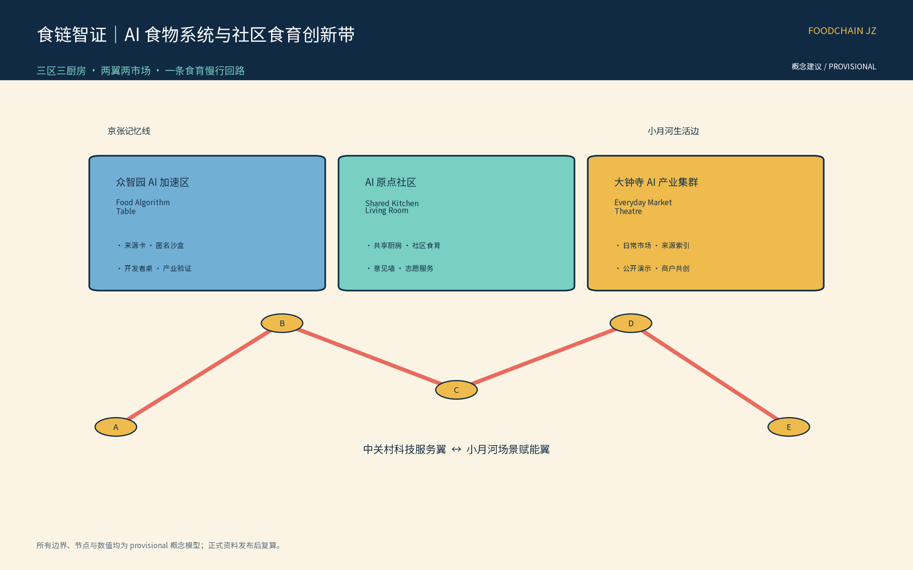
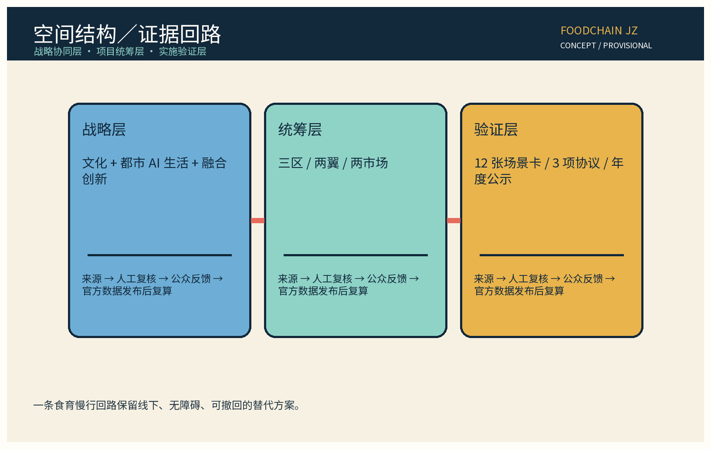
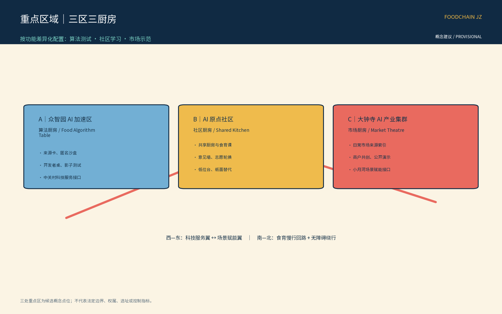
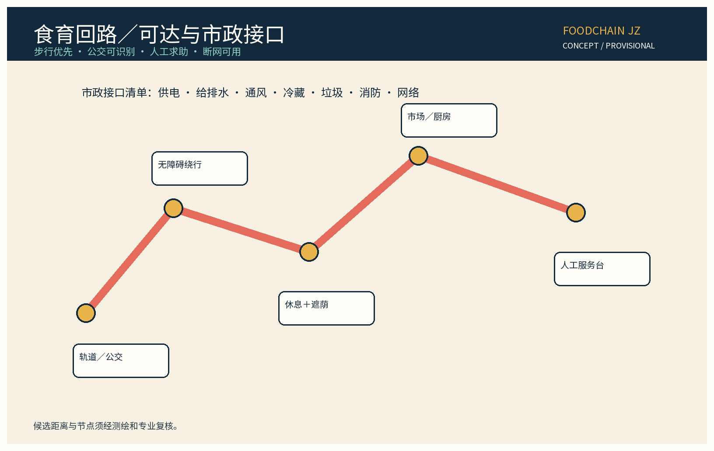
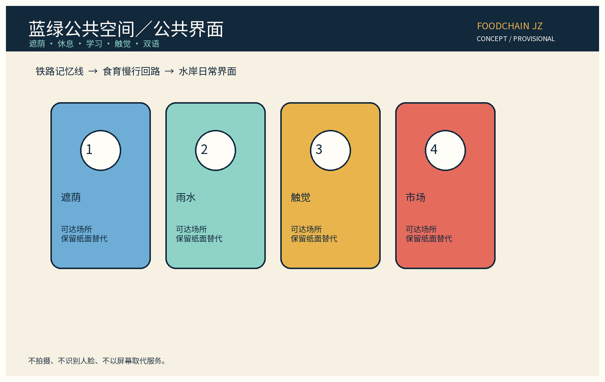
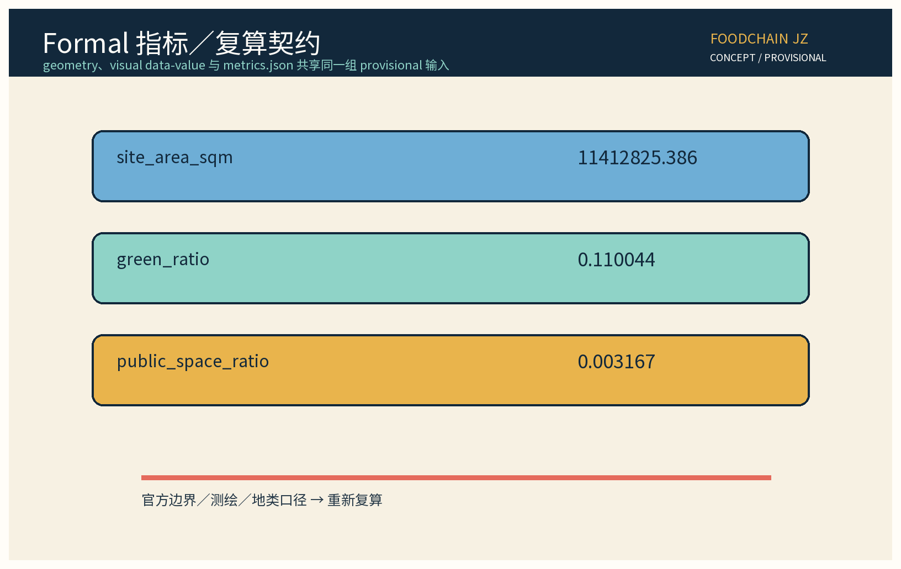

> 编制定位：本方案是海淀「百年京张 AI 创新带」的食物系统与社区食育专项概念建议，不构成法定规划、工程设计、审批、投资或官方承诺。所有数字、边界、节点和时序均为 provisional 假设；官方数据发布后复算。机制名、节点名与品牌名在权利检索和正式确定前仅作内部工作代号。

## 设计依据与资料清单

本包以公开可追溯资料和任务书内部结构要求为工作依据，资料层级登记于 `sources.json`。主控输入包括征集公告、站点任务书、京张铁路历史遗存的公开叙述、城市设计与控规编制公开规范、无障碍环境建设法和生成式人工智能治理规范。[source:DATA-SRC-OFFICIAL-ANNOUNCEMENT-20260509] [source:DATA-SRC-AGENT-TASKBOOK-20260518] 规划判断仅作为概念工作假设：既有铁路记忆被转译为“从食材到餐桌”的时间线，AI 则用于证据整理、提示和协同，不替代公共决策。

资料还包含六个生态案例：Fab Labs 的开放制作网络、Station F 的创业园区、BLOCK71 的跨国孵化协作、Foodvalley 的食物创新生态、GROWNYC Greenmarket 的社区市场网络、FAO 的城市食物议题框架。它们只用作机制参照，不表示海淀已有合作或采用承诺。[source:CASE-FABLABS] [source:CASE-STATION-F] [source:CASE-BLOCK71]

Foodvalley、GROWNYC Greenmarket 与 FAO Urban Food Agenda 的发布机构、URL、检索日、license 与“仅参考”边界写入 `sources.json`。[source:CASE-FOODVALLEY] [source:CASE-GROWNYC] [source:CASE-FAO-URBAN-FOOD]

缺失项包括地籍边界、现状人口、菜市场经营数据、地下管线、客流、食品安全抽检和产权条件；本包不填补这些缺口。以公开底图和工作几何形成候选空间，用“待核验数据—人工复核—公众意见—官方数据发布后复算”作为闭环。正式审查前须由具备资质的团队核实土地、消防、卫生、交通、无障碍和历史保护边界。[source:DATA-SRC-PROVISIONAL-BOUNDARIES-20260605]

## 三层范围工作框架

第一层是战略协同层：把百年京张文化带、都市 AI 生活体验带、AI 融合创新带三大定位共同落到“可吃、可学、可验证”的日常系统。第二层是项目统筹层：以三区三厨房为核心节点，以中关村科技服务翼提供算力、法务、检测与创业服务，以小月河场景赋能翼提供水岸社区、市场试点和食育活动；两翼共同连接外部高校、科研机构、企业与居民网络。第三层是实施验证层：把共享厨房、社区市场、食材信息台、食育课堂和冷链交接候选做成可撤回的测试单元，而不是直接宣称建设结果。

| 层级 | 空间与任务 | 交付物 | provisional 边界 |
|---|---|---|---|
| 战略层 | 京张文化、都市生活、AI 融合三大定位 | 食物系统叙事、公共利益原则 | 不替代法定规划和政策 |
| 统筹层 | 三区、两翼、两市场、三厨房 | 产业链路、开放接口、协同清单 | 地点为候选落位，官方边界发布后复算 |
| 验证层 | 12 张场景卡、3 项协议、年度活动 | 影子测试、错误台账、退出条件 | 不作食品安全、交通或投资结论 |

三层以一条“食育慢行回路”贯通：居民从社区厨房出发，经食材来源展示、市场摊位、共享设备和京张记忆节点，到达开放创新厨房，再回到社区反馈。路线不承诺新建道路；步行、骑行、公交和无障碍连续性须以后续现状调查复核。[source:MOHURD-URBAN-DESIGN-MEASURES]

### 空间边界与几何证据登记

本包把空间关系写成可复核的候选几何，而不是把示意图升级为法定边界。`geometry/site_boundary.geojson` 的 `SITE-001` 是总体设计范围的 provisional 粗略替代边界；`geometry/key_areas.geojson` 的 `KEY-ZHON`、`KEY-BEIJ`、`KEY-DAZH` 分别对应众智园、北京 AI 原点社区、大钟寺三个重点区。`geometry/roads.geojson` 只表达食育慢行主轴与东西缝合联系，`green_space.geojson`、`public_space.geojson` 表达概念绿地与公共节点，所有要素均标记 `official_boundary=false`。官方 polygon、道路红线、站点边界、权属和控制条件当前为 `unknown/to_verify`；正式资料到位后按同一坐标系、公式和图位整体复算。[source:DATA-SRC-PROVISIONAL-BOUNDARIES-20260605]

## 统筹研究范围产业与未来城市研究

### 三大定位转译

百年京张文化带转译为“食物时间线”：用站点、仓储、铁路工务与城市迁徙的公开故事编排食育路线，不虚构遗址细节。都市 AI 生活体验带转译为“可理解的日常工具”：居民能看懂食材来源、营养/过敏原提示和活动安排，商户能看到可解释的时段提示。AI 融合创新带转译为“从模型到市场的可退场试验”：开发者、检测机构、厨房运营者和居民在同一协议上验证，错误可以回滚。

### 五大功能与产业机制

| 任务书功能 | 食物系统落点 | 交付机制 |
|---|---|---|
| AI 全栈自主创新体系 | 食材信息、菜单可读化、设备运维 | 食链智证 API 试验台，保留人工台账 |
| 世界级 AI 创新生态 | 食品科技、社区市场、大学实验室、国际案例 | 轮换市集与开放厨房周 |
| AI+ 场景赋能新范式 | 居民食育、摊位导视、冷链交接候选 | 12 张场景卡与三审三退 |
| 智能化 AI 活力城市 | 早餐、午餐、晚餐、课程和邻里交换 | 一桌一策菜单共创，线下优先 |
| AI 治理全球话语权 | 可解释证据、匿名聚合、公众复核 | 谷粒公约、年度公示与国际双语简报 |

### 食链智证视觉识别与 Logo 方向

“食链智证 / FoodChain JZ”是本包的内部工作代号，不是已注册商标。建议 Logo 由一条可断开的环形链路、一个谷粒圆点和一条铁路节拍线组成：环形表达食材—知识—社区反馈，谷粒表达食物的日常尺度，节拍线表达百年京张的时间线。颜色仅作概念 token：铁路墨蓝、谷粒金、河岸青、市场珊瑚；字体优先使用本地可合法嵌入的无衬线字体，中文、英文和大字版本保持同一信息层级。三处节点使用同一主符号的不同组合，不复制任何机构、企业或历史标识；权利检索、品牌定名和对外授权均为 `to_verify`，在核验前只用于本包展示。[source:DATA-SRC-AGENT-TASKBOOK-20260518]

### 三个原创机制

“食链智证”把每一条提示绑定到来源、版本、人工复核者角色和有效期；它不是食品质量认证，不生成法律效力。“一桌一策”每季度收集居民、商户、照护者和学生的匿名偏好，形成可讨论菜单，不推断个人身份或健康状况。“三审三退”要求来源审、专业审、公众审依次检查，并设置提示下架、模型回滚和场景退出三条退路。“谷粒公约”规定仅匿名聚合、关键决策人工复核、禁止过度监控，原始订单、面部、轨迹、精细住址和个体画像不进入平台。

### 外部协同

外部协同以“可加入、可退出、可复核”为条件：中关村科技服务翼连接高校实验室、食品检测与 AI 工具企业；小月河场景赋能翼连接社区、市场经营者、学校和公益组织；京津冀及国际案例只做公开知识交换与对照研究。所有合作在启动前分别约定数据最小化、知识产权、卫生安全责任、无障碍服务和争议处理；本包不写任何机构的官方承诺。[source:DATA-SRC-AGENT-TASKBOOK-20260518]

## 总体设计范围城市更新与控规深度城市设计

总体结构为“三区三厨房、两翼两市场、一条食育慢行回路”。三区分别是：众智园 AI 自主创新加速区的“食物算法台”，北京 AI 原点社区的“共享厨房客厅”，大钟寺 AI 产业集聚区的“日常市场剧场”。三厨房分别承担算法/检测试验、居民共厨与食育、市场和商户示范。中关村科技服务翼提供技术和企业服务，小月河场景赋能翼提供社区与水岸生活场景；社区日常市场和创新食品展示市场形成两类可轮换的公共界面。

空间形态以“半径可达、界面可读、设施可撤”为原则。工作几何提供 site boundary、道路、蓝绿、建筑、地块、关键区域和场景节点的可复算对象，数字均是候选值；不推断容积率、建筑高度、停车规模、消防间距、管线容量或拆改工程量。现状更新分为保留记忆界面、兼容改造空间、候选轻量插入三类，实际拆改须在权属、结构和历史保护核验后另行论证。[source:MOHURD-CONTROL-DETAILED-PLANNING]

### 食育慢行回路的体验序列

入口先显示“今天能学什么”，再进入来源索引与共享厨房，经过可休息的树荫、可触摸的图形、低位信息台和无障碍绕行，最后在市场剧场完成“一桌一策”反馈。每个节点至少保留离线纸质版、人工问询位和清晰的退出提示；AI 只是辅助排序与翻译。夜间照明、噪声、油烟、垃圾分类和邻里扰动以小规模轮换活动验证，不作全域环境结论。

## 重点区域详细设计

### A 众智园 AI 自主创新加速区：食物算法台

以共享数据沙盒、食品信息可读化实验台、设备维护角和开发者小组桌为核心；墙面展示版本号、错误类型与人工复核状态。候选项目只处理匿名聚合的时段需求、菜单文本可读化和设备工单，不接入面部、车牌、个体消费轨迹或精确健康档案。空间采用可拆桌、可移动展示架和可关闭的测试屏，便于场景失败时撤回。

### B 北京 AI 原点社区：共享厨房客厅

由低门槛共享厨房、社区食育教室、照护者休息位、儿童可视安全边界、老人/轮椅可操作台和居民意见墙组成。厨房课程按“学食材—做一餐—讲一站—写反馈”组织，预约既可线上也可现场登记。社区运营者每月发布活动名额、取消原因与无障碍安排，每年进行一次公开复盘；任何居民可通过纸质意见卡、人工电话/邮箱或现场接待提出异议。

### C 大钟寺 AI 产业集聚区：日常市场剧场

以可轮换摊位、食材来源索引、商户共用冷藏交接记录台、市场导视和小型公开演示台构成。市场不是替代既有商业，也不承诺招商；候选经营者须自愿参加，保留人工价格与安全公示。每次轮换先做半日影子测试，再由商户、居民、专业人员共同检查误导风险、拥堵、气味和无障碍，达到退出条件就撤下提示或缩小活动范围。

三区共享一套“公共利益底线”：不把个体贡献或消费行为公开，不以 AI 自动决定摊位、救助、准入或处罚；提供可见的人工联系人、申诉编号、复核时限和纸面替代通道。重点区域图件 `assets/key-areas.png` 以颜色、编号、文字标注三大区域，读者不依赖交互即可辨识。[source:DATA-SRC-PROVISIONAL-BOUNDARIES-20260605]

## AI 创新生态、人才画像与 AI+ 场景

### 六个可追溯生态参照

Fab Labs 参照开放制作与共享工具；Station F 参照创业企业的服务密度；BLOCK71 参照跨机构孵化网络；Foodvalley 参照从研究到企业的食物创新集群；GROWNYC Greenmarket 参照社区市场与农产品公共界面；FAO Urban Food Agenda 参照城市食物议题的公共治理框架。六案均标为 `reference_only`，不代表海淀合作、引进或复制。[source:CASE-FABLABS] [source:CASE-STATION-F] [source:CASE-BLOCK71]

Foodvalley、GROWNYC Greenmarket 与 FAO Urban Food Agenda 的引用边界和 URL 另列于 `sources.json`，作为仅参考资料。[source:CASE-FOODVALLEY] [source:CASE-GROWNYC] [source:CASE-FAO-URBAN-FOOD]

### 七类用户画像

居民希望在不被跟踪的前提下获得可理解的食育信息；青年开发者需要真实但低风险的测试数据；食品科技创业者需要厨房、检测、导师和退出机制；高校研究者需要可引用的匿名聚合样本；小餐饮与市场商户需要不增加过多成本的提示工具；家庭照护者需要座椅、低位台、过敏原文字和可线下办理；老人、残障人士与游客需要无障碍、双语、慢速解释和人工问询。画像只描述服务需求，不用于推断或分类个人。

### 12 张场景卡

| 编号 | 场景卡 | 输入 | 模型/人工复核 | 输出 | 责任主体 | 指标与退出条件 |
|---|---|---|---|---|---|---|
| S01 | 食育路线提示 | 匿名时段、已开放节点、无障碍选项 | 路线排序模型；运营者逐次复核 | 带无障碍说明的路线草案 | 小月河赋能翼运营者 | `route_review_rate`；节点状态不明或投诉未闭环即回到纸质地图 |
| S02 | 菜单可读化 | 商户自愿菜单原文与语言偏好 | 文本重排/翻译辅助；商户和食育教师校对 | 大字、双语、图形版，保留原文 | 商户内容负责人 | `readability_review_rate`；误译或原文缺失即撤回 AI 版 |
| S03 | 供需时段提示 | 按时段匿名聚合的活动/需求计数 | 区间排序模型；商户先审，不自动改摊位 | 带不确定性标签的时段建议 | 市场运营者对外负责 | `supply_hint_directional_error_rate`；连续两次无法解释的方向性误导即停用 |
| S04 | 食材来源索引 | 商户自报来源、可公开凭证和版本日期 | 来源检索/匹配辅助；来源管理员人工核验 | 可追溯来源卡，缺证不显示 | 商户与来源管理员 | `source_card_verified_rate`；凭证过期或争议未解决即隐藏 |
| S05 | 冷链交接候选 | 自愿交接点的匿名批次号和时间窗 | 候选匹配模型；食品专业人员复核 | 仅供人工确认的交接提醒 | 交接点运营者 | `handover_mismatch_rate`；安全疑问、超范围记录或未解决申诉即退出 |
| S06 | 共享设备预约 | 设备状态、匿名时段和自愿预约 | 时间窗排序；厨房管理员确认 | 预约草案和现场排队选项 | 厨房管理员 | `booking_fallback_rate`；设备状态不可信或断网即用现场登记 |
| S07 | 食品知识问答 | 已审核知识库、问题类别，不含个人健康档案 | 检索生成辅助；食育教师抽检和升级 | 带来源日期的解释性回答 | 食育教师/知识管理员 | `knowledge_review_rate`；来源过期或回答无法解释即切换固定问答卡 |
| S08 | 过敏原信息提示 | 商户自填成分与原始标签 | 结构化抽取辅助；商户及专业人员逐项核对 | 醒目标注和原始标签并列 | 商户内容负责人 | `allergen_omission_count`；任何已知遗漏即撤下提示、保留原标签 |
| S09 | 摊位导视编排 | 概念市场平面、无障碍规则、开放时段 | 导视布局辅助；运营者现场走查 | 导视草案、纸面版和人工引导 | 市场运营者 | `wayfinding_access_pass_rate`；现场不通行或误导即恢复人工导视 |
| S10 | 设备维护工单 | 设备匿名状态、人工报修描述 | 优先级建议；维修人员确认 | 可解释的工单队列 | 维修负责人 | `maintenance_review_rate`；安全等级不明或超时即纸质工单接管 |
| S11 | 食育活动匹配 | 自愿选择的年龄段、无障碍和时间需求 | 条件筛选辅助；人工确认，不建立个人画像 | 活动清单与线下报名 | 社区运营者 | `activity_access_parity`；出现画像推断或无法提供线下服务即退出推荐 |
| S12 | 年度证据公示 | 匿名运行、错误、申诉、无障碍改进计数 | 汇总制图辅助；居民与专业人员联合复核 | 年度图表、撤回清单和纸面公示 | 联合运营台 | `annual_notice_review_rate`；数据无法追溯或争议未核实即不发布 |

### 三项产业测试协议

1. **供需提示影子协议**：用不少于一个轮换周期的历史匿名计数做基线，只输出区间和时段建议；准确性、遗漏、延迟、商户异议分别记账，由商户与运营者人工复核。连续两次出现方向性误导或无法解释的偏差即停用并回到公告牌。
2. **食物信息可读化协议**：选取自愿商户的菜单和来源卡，建立原文—大字—双语—图形四种版本；检查文字误导、过敏原遗漏、翻译错误、对比度与阅读路径。由商户、食育教师、残障使用者代表共同验收；不通过则保留商户原始信息，撤回 AI 版本。
3. **冷链交接候选协议**：只在自愿交接点以匿名批次号和时间窗记录候选提醒，不记录个体司机、精确轨迹或人脸；专业人员复核交接记录、错配、延迟和安全边界。出现安全疑问、数据超范围或申诉未解决即退出测试，人工流程继续承担责任。

| 协议 | 进入条件与样本 | AI/人工流程与输出 | 责任分工 | 可核验指标、通过门与退出 |
|---|---|---|---|---|
| 供需提示影子协议 | 自愿市场点、至少一个轮换周期的匿名时段计数、商户签字确认 | 聚合区间排序 → 商户/运营者复核 → 发布带不确定性的时段提示 | 运营者对外负责，商户负责内容确认，数据管理员负责删除 | 记录方向性误导、遗漏、延迟、异议；连续两次无法解释的方向性误导，或安全/申诉问题未闭环，回到公告牌 |
| 食物信息可读化协议 | 自愿商户原文、来源卡和原始过敏原标签，明确撤回权 | 重排/翻译辅助 → 商户、食育教师、残障使用者代表复核 → 四种可读版本 | 商户对原文负责，食育教师负责知识，运营者负责下架 | `readability_review_rate`、已知过敏原遗漏数、翻译错误数；任何已知遗漏或未经复核的版本不通过并撤回 |
| 冷链交接候选协议 | 自愿交接点、匿名批次/时间窗、专业责任人和人工台账在先 | 候选匹配 → 专业人员复核 → 仅提示人工确认，不作合规结论 | 交接点承担现场责任，专业人员承担安全判断，数据管理员限制字段 | 记录错配、延迟、范围越界和申诉；安全疑问、超范围、未解决申诉或人工台账中断即退出 |

开发者社区每月举办一次开放厨房代码/数据诊所，每季度举办一次“一桌一策”居民共创，每年举办一次“食链智证公开日”与年度公示；以公开议程、版本记录、问题清单和可下载的匿名汇总维持长期运营。国际传播采用中英双语案例卡、开放许可说明和“失败也公开”的年度简报，不把概念建议包装成官方成果。

## 用地、建筑规模与拆改留方案

本包只提出候选用地关系与空间容量的工作模型，不给出法定用地性质、容积率、建筑高度、建筑密度、停车配比、消防结论或工程量。几何层将地块分为公共开放、混合创新、社区服务、市场配套、交通与市政等概念类别，面积由 `geometry/*.json` 与 `metrics.json` 复算。`site_area_sqm`、`green_ratio`、`public_space_ratio` 是 formal 工作指标，不是规划指标。[source:DATA-SRC-MNR-LAND-USE-CLASSIFICATION-202311]

拆改留分三类：保留京张叙事可读界面与可继续使用的公共设施；兼容改造闲置或低效空间为共享厨房、食育教室、设备角和市场服务台；轻量插入可撤展架、可移动桌、低位导视和遮荫座椅。任何涉及结构、燃气、给排水、通风、冷链、消防、历史建筑、产权或环境影响的方案，都必须另行完成专业审查。本包的“厨房”是功能概念，不等同于已获许可的餐饮工程。

建筑与公共服务优先满足可达、可懂、可休息、可求助：入口无高差或有替代路线，工作台保留轮椅转身位，指引采用大字、高对比、触觉和双语，厨房活动提供安静时段与人工报名。成本、建设时限和投资回报不作预测；后续若官方数据、权属或安全条件不成立，项目可缩小、换点或取消。

## 交通、轨道、市政与公共服务设施

食育慢行回路优先连接现有公交、轨道站点、社区入口、学校/高校和市场，不假设新增轨道站或道路。工作交通图以“步行优先、骑行可停、公交可识别、机动车不侵占公共界面”为原则，显示无障碍绕行、休息点、雨雪替代入口和人工问询位。所有步行距离、路网长度和节点坐标均是 provisional 候选值；实际施工前须基于测绘、交评、地下管线和消防条件复核。[source:MOHURD-URBAN-DESIGN-MEASURES]

市政层只给接口清单：厨房和市场需要供电、给排水、通风、冷藏、垃圾分类、消防和网络；AI 平台需要断网可用、访问日志最小化、数据加密、人工权限和删除机制。雨洪、能源、油烟、噪声和废弃物在本案中仅列为协同审查事项，不使用未核实的减排比例或处理能力。公共服务包括食育课、无障碍咨询、居民意见箱、商户培训、设备保养和年度公开复盘。

## 蓝绿空间、公共空间与城市风貌

蓝绿网络把铁路记忆的线性叙事和小月河的日常水岸体验连成“可停、可看、可学”的公共底盘。策略包括：沿回路布置连续遮荫与座椅；在市场和厨房之间设置可渗透、可清洁的开放前场；用可移动花箱、季节性食育种植和雨水观察牌解释食物与水的关系；为老人、儿童、轮椅使用者和照护者预留并排停留空间。绿地比例来自工作几何，不等于生态绩效。[source:DATA-SRC-BARRIER-FREE-ENVIRONMENT-LAW]

三类 AI 主题节点以低技术、可替换为特征：一是“京张食谱站”，用双语和大字呈现来源故事；二是“回路证据柱”，展示匿名聚合与人工复核状态；三是“市场剧场帘”，在活动时段显示可关闭的菜单和路线。节点不得拍摄或识别路人，不以屏幕取代纸面、口头和触觉服务。城市风貌延续铁路材料的耐久、可维修、可重复使用气质，品牌和色彩仅作概念系统，权利核验后再定。

国际传播以中英双语网页、开放许可图件、可下载的测试协议和年度失败清单为核心；传播对象包括食物系统研究者、开发者、社区组织和城市设计同行。对外文字必须标注“概念建议、provisional、非官方承诺”，只讲方法和证据状态，不夸大规模和效果。

## 更新项目清单、实施政策与分期计划

| 项目 | 主要动作 | 牵头/协同角色 | 交付与退出 |
|---|---|---|---|
| P01 食物算法台 | 开放接口、匿名样例、人工台账 | 技术服务翼/高校/开发者 | 版本记录；超范围即停 |
| P02 共享厨房客厅 | 食育课、无障碍工位、居民意见墙 | 社区运营/公益组织/居民 | 月度活动单；投诉可撤 |
| P03 日常市场剧场 | 轮换摊位、来源索引、可读导视 | 商户/市场运营/专业顾问 | 半日影子测试；不通过即退 |
| P04 两翼协同台 | 检测、法务、创业与场景对接 | 中关村服务翼/小月河赋能翼 | 季度协同清单；未授权不共享 |
| P05 食链智证公开日 | 年度公示、案例和失败复盘 | 多方联合/居民观察员 | 年度报告；居民可异议 |

三期实施仅表示研究节奏：近期（1—3 年，provisional）完成权属、食品卫生、安全、无障碍、文保与数据边界核验，并开展纸面影子测试；中期（3—5 年，provisional）在自愿点位轮换三项协议，形成版本台账、申诉复核和年度公示；远期（5—10 年，provisional）依据复算后的证据决定延续、缩小、换点或退出。每期均以“资料齐备—人工复核—公众意见—go/no-go”作为阶段门；时间不是承诺，面积不是工程量。[source:PROJECT-AGENT-OPEN-CALL-TASKBOOK]

政策工具采用“开放接口 + 小额试验 + 退出保护 + 年度公示”：通过公开规则降低开发者和小商户进入门槛，以单场次/单节点而不是大规模系统验证；不将参加试验作为经营、救助、公共服务或空间准入条件。运营者每年公布匿名运行计数、错误类型、申诉处理、无障碍改进、活动完成度和撤回项目；居民可以现场、纸质、电话/邮箱或网页提交意见，设人工回执与复核时限。

## 指标体系、面积复算与合规矩阵

本包的 formal 核心指标与图件 data-value 保持一致：

| 指标 | provisional 数值 | 复算方法 |
|---|---:|---|
| `site_area_sqm` | 11412825.386 | geometry/site_boundary 面积求和 |
| `green_ratio` | 0.110044 | green_space_area_sqm / site_area_sqm |
| `public_space_ratio` | 0.003167 | public_space_area_sqm / site_area_sqm |

其余工作量指标包括 `key_area_count=3`、`scenario_card_count=12`、`industry_test_scenario_count=3`、`global_case_count=6`、`persona_count=7`、`phase_count=3`、`annual_program_count=4`；均为内容覆盖计数，不是官方统计。`green_space_area_sqm=1255908.493`、`public_space_area_sqm=36150` 与 `metrics.json` 保持同一组 provisional 输入；官方边界、测绘、地类和公共空间口径发布后必须重新计算。

运营指标只作为试点前应建的空基线，不把 unknown 伪装成现状：`route_review_rate`、`readability_review_rate`、`source_card_verified_rate`、`handover_mismatch_rate`、`allergen_omission_count`、`wayfinding_access_pass_rate`、`annual_notice_review_rate` 等均在 `metrics.json` 中以 `unknown`/`value:null` 登记。试点章程应在进入阶段门前确认样本、口径、责任人和阈值；这类阈值是本方案的验证条件，不是官方统计或现状结论。[metric:route_review_rate] [metric:readability_review_rate] [metric:allergen_omission_count]

### 13 项补充评审维度追踪

| 维度 | 正文锚点 | 图/指标 | 证据与状态 |
|---|---|---|---|
| 目标契合度 | 设计依据；三层范围；三大定位 | site-overview；`site_area_sqm` | 公告与任务书；已回应，边界 provisional |
| 功能匹配度 | 五大功能；总体设计；三区两翼 | land-use-structure；`key_area_count` | 任务书；已回应 |
| 品牌识别度 | 食链智证视觉识别；蓝绿空间 | site-overview、key-areas；`landmark_count` | Logo 方向与权利台账；品牌定名 `to_verify` |
| 区域协同性 | 外部协同；两翼机制 | site-overview；`global_case_count` | 北纬社区、未来科学城、怀柔科学城、经开区、京津冀仅列协同对象，不虚构合作 |
| 规划创新性 | 总体设计；用地；交通；蓝绿 | land-use-structure、mobility；`green_ratio` | 城市设计/控规方法参考；不作法定结论 |
| 产业支撑度 | 生态案例；三项协议；更新项目 | key-areas、metrics-evidence；`industry_test_scenario_count` | 六个公开案例与协议台账；reference_only |
| 场景可感知度 | 重点区域；12 张场景卡；体验序列 | key-areas、blue-green；`scenario_card_count` | 每卡含输入、模型、输出、责任、指标、退出 |
| 空间明确性 | 空间边界登记；重点区；用地 | site-overview、key-areas；`site_area_sqm` | 9 个 GeoJSON 图层；全为概念/候选几何 |
| 可转化性 | 更新项目；三期阶段门；协议 | a3/a0；`phase_count` | 运营主体类型、依赖、go/no-go 与人工兜底 |
| 表达完整性 | 13 节正文与双语页面 | 六组双语图、A0/A3、visual index；三项 formal 指标 | 本地静态文件与图件 QC；不等于官方评分 |
| 公开合规性 | 风险、版权与合规；意见通道 | metrics-evidence；`annual_notice_review_rate` | 来源/许可/隐私/退出记录；unknown 基线待核验 |
| 国际传播力 | 双语叙事；公开许可案例卡 | 全部 `.en` 图件；`global_case_count` | 中英等价表达与 reference_only 案例；无机构背书 |
| 长期运营价值 | 年度活动；开发者社区；年度公示 | metrics-evidence；`annual_program_count` | 月度诊所、季度共创、年度公开日和转化路径；均为建议 |

合规矩阵将任务书要求、公共利益、数据最小化、版权、无障碍、交通、市政、实施和风险逐项映射到章节、图件与记录。设计深度矩阵覆盖战略研究、总体结构、三区两翼、重点区、产业生态、场景卡、产业协议、用户画像、用地、交通、市政、蓝绿、更新清单、指标复算和实施治理 15 项；每项均有 section anchor、evidence、provisional/待核验标记。空间正式检查使用 geometry，视觉检查使用 `visual/index.html` 的 `data-value`，两者均不得把 provisional 伪装为事实。[source:PROJECT-AGENT-OPEN-CALL-TASKBOOK] [source:MOHURD-CONTROL-DETAILED-PLANNING]

## 风险、版权与合规说明

主要风险包括：食物信息误导、过敏原遗漏、共享厨房安全、冷链误读、市场拥堵、无障碍不足、数据越界、居民异议、商户负担、历史叙事误写、字体/图片权利和平台停止服务。缓解方式是来源分级、版本号、专业抽检、居民复核、纸面替代、人工工单、匿名聚合、访问最小化、可关闭设备、公开错误台账与年度退出评审。任何发生安全或权利疑问的场景先停用，再由责任主体人工处理，不等待模型解释。

AI 治理原文：**仅匿名聚合、关键决策人工复核、禁止过度监控**。平台不得采集或推断人脸、声纹、车牌、精细轨迹、个体消费画像、未成年人身份、医疗/饮食敏感信息；不得用 AI 自动决定经营准入、公共资源分配、救助、处罚或拆改。居民意见通道包括现场意见墙、纸卡、人工电话/邮箱和网页表单；每月回应摘要、每年发布公示，每年举办一次食链智证公开日和一次居民共创复盘。

本包文字、图件与代码在 `COMMUNITY-DISPLAY-ONLY` 范围内提供展示和评议；外部案例以 `reference_only` 记录，来源 URL、license、检索日期和禁止用途写入 `sources.json`，不复制受限图像。Noto Sans CJK SC 本地字体以合法字体文件嵌入四个 HTML 表面；图件为本包生成的原创概念图。品牌/机制名不作注册或权利声明。所有引用和数据假设均可被人工复核；没有隐私、涉密、虚构来源、官方承诺或法定规划/工程/审批/投资结论。[source:DATA-SRC-GENERATIVE-AI-INTERIM-MEASURES]

## 参考资料

- [source:DATA-SRC-OFFICIAL-ANNOUNCEMENT-20260509] 北京市规划和自然资源委员会海淀分局公开征集公告，公开网页参考。
- [source:DATA-SRC-AGENT-TASKBOOK-20260518] 本项目站点包任务书与提交格式要求，任务输入。
- [source:MOHURD-URBAN-DESIGN-MEASURES] 城市设计管理公开规范，方法参考。
- [source:MOHURD-CONTROL-DETAILED-PLANNING] 控制性详细规划编制公开规范，方法参考。
- [source:DATA-SRC-GENERATIVE-AI-INTERIM-MEASURES] 生成式人工智能服务管理公开规范，治理参考。
- [source:DATA-SRC-BARRIER-FREE-ENVIRONMENT-LAW] 中华人民共和国无障碍环境建设法，公共利益与可达性参考。
- [source:CASE-FABLABS] Fab Labs Foundation，开放制作网络案例，仅作机制参照。
- [source:CASE-STATION-F] Station F，创业园区案例，仅作机制参照。
- [source:CASE-BLOCK71] BLOCK71，跨机构孵化案例，仅作机制参照。
- [source:CASE-FOODVALLEY] Foodvalley，食物创新生态案例，仅作机制参照。
- [source:CASE-GROWNYC] GROWNYC Greenmarket，社区市场案例，仅作机制参照。
- [source:CASE-FAO-URBAN-FOOD] FAO Urban Food Agenda，城市食物治理议题参考。
