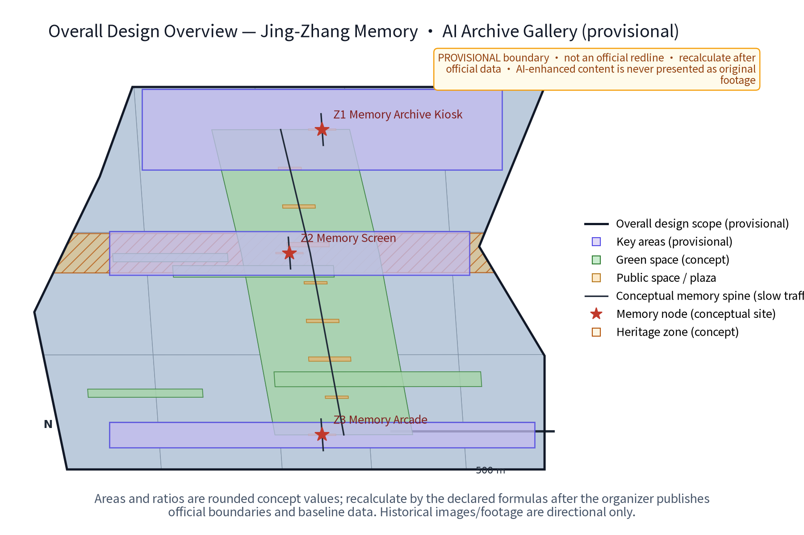
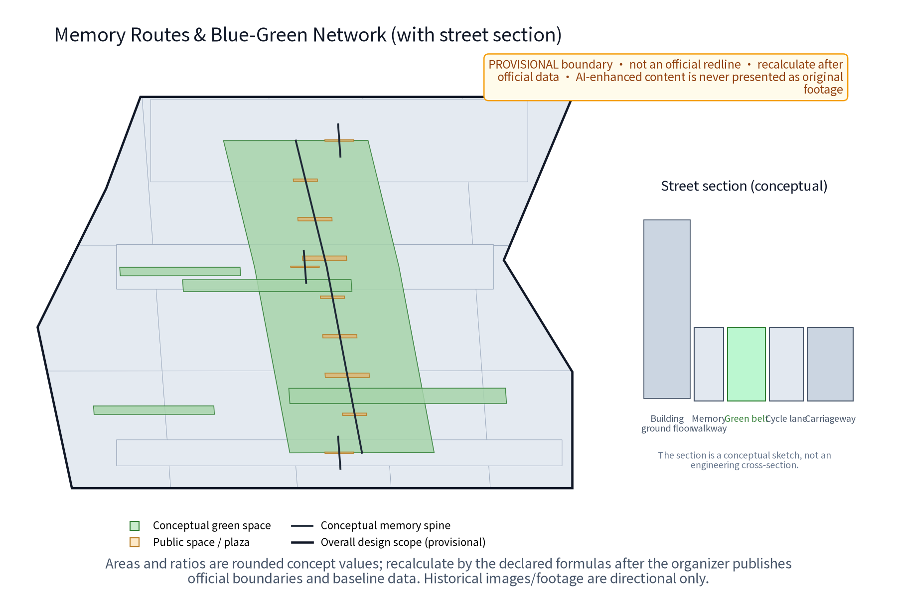
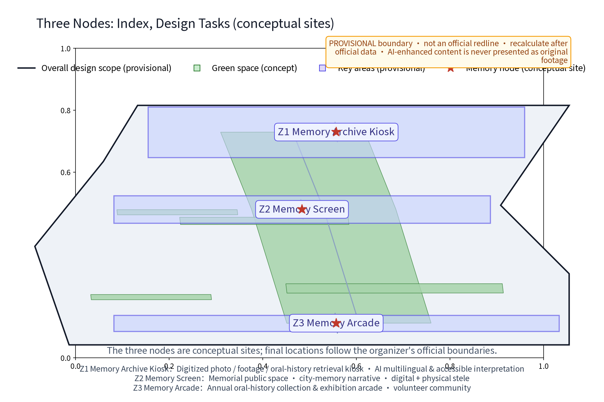
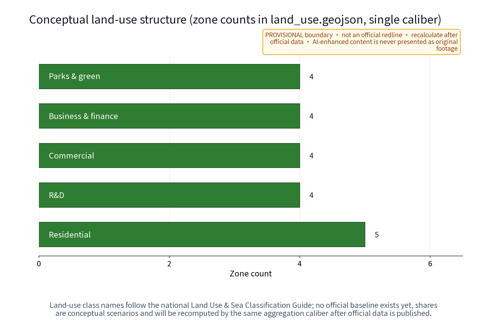
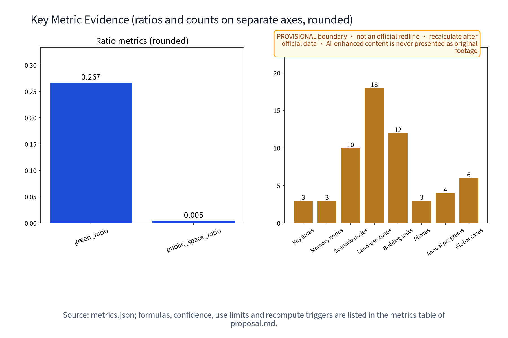

# Jing-Zhang Memory · AI Archive Gallery

Jing-Zhang Memory · AI Archive Gallery (JZMA) is a concept proposal that turns “verifiable memory” into a public-space experience. Its original mechanism, “Proof-Memory Loop,” connects provenance, rights/withdrawal, AI processing, human review and public display; three nodes - Z1 Memory Archive Kiosk, Z2 Memory Screen and Z3 Memory Arcade - are linked by one continuous slow memory route. AI is not a label applied to a landscape: it is a bounded public-service interface that makes oral histories, cleared public media and wayfinding searchable, explainable and withdrawable. All content is a concept suggestion and reference scheme; it does not replace statutory planning or represent government approval, ownership, permission, operations or implementation commitments.[source:DATA-SRC-AGENT-TASKBOOK-20260518]

## Design Basis and Source List

The basis has three layers: the announcement and taskbook requirements for the three positionings, five functions, three areas/two wings and six agent tasks; public planning, land-use, accessibility and generative-AI governance references; and six traceable international mechanism cases. Only mechanisms are compared; scale, brands and outcomes are not transferred. Jing-Zhang cultural narrative is separated into “verifiable historical cues, current leads to verify, and original concepts”: unverified images, person links or relic inventories are not written as facts, and AI-generated images are never presented as original footage. Because the official boundary is not available, the package uses only the taskbook’s provisional rough boundary; source, access date, purpose and reuse limits are recorded in sources.json.[source:DATA-SRC-OFFICIAL-ANNOUNCEMENT-20260509] [source:DATA-SRC-MOHURD-URBAN-DESIGN-MEASURES] [source:SRC-JZMA-GEOMETRY-AUTHORED-20260829]

## Three-Level Scope Framework

Level 1 is the coordinated research area: industry, culture and regional interfaces across the Jing-Zhang cultural belt, urban AI life-experience belt and AI integration innovation belt. Level 2 is the overall design area: a provisional site boundary supporting a continuous slow memory route, three nodes and two wing interfaces. Level 3 is detailed design: Z1, Z2 and Z3 are conceptually associated with the Zhongzhiyuan AI Acceleration Area, Beijing AI Origin Community and Dazhongsi AI Industry Cluster, but final siting requires official geometry, ownership, heritage, transport, landscape, accessibility and public review. Evidence flows from research to overall space, then from overall space to route, components and pilot gates.[data:geometry/site_boundary.geojson#SITE-001] [data:geometry/key_areas.geojson#KEY-ZHON]

## Coordinated Research Area: Industry and Future City Research

The research proposition is not a digital museum; it is a memory infrastructure that can enter daily urban life. Archive institutions provide provenance and rights rules, universities and developers contribute explainable tools, communities contribute consented oral-history leads, and enterprises or districts may offer de-identified public questions as test cases. AI maps each record to six fields: source, rights, semantics, spatial node, human judgement and publication state. Records without source or authorization remain in a verification queue and never reach a public screen. Regional coordination is expressed as an interface hypothesis: the Zhongguancun Tech-Service Wing may discuss methods and global factor allocation, while Beiwei Community, Future Science City, Huairou Science City, E-Town and Jing-Jin-Ji remain unverified knowledge, talent, scenario or communication interfaces; no existing partnership is implied.[source:SRC-CASE-EUROPEANA] [source:SRC-CASE-COMMON-VOICE]

| Element | Concept mechanism | Substantive AI action | Spatial carrier | Evidence and role |
|---|---|---|---|---|
| Records | Proof graph | Deduplicate, tag, flag conflict | Z1 kiosk | Source ledger / archive role |
| People | Open clinic | Reproduce, evaluate, translate | Z2 screen back-of-house | Developer community role |
| Scenarios | Scenario sandbox | Bounded inference, human release | Z3 arcade | Operator role |

## Overall Design Area: Urban Renewal and Regulatory-Plan-Level Urban Design

Continuity is made walkable, visible, audible and reversible: one slow memory route connects Z3 Memory Arcade, Z2 Memory Screen and Z1 Memory Archive Kiosk along the green corridor. Low-impact wayfinding, withdrawable exhibits, accessible surfaces and staffed help points bridge the nodes; conceptual east-west stitching links the two sides while the north-south memory route carries the narrative. Each node follows four steps - evidence, interpretation, deliberation and withdrawal - and shows source status, provenance grade and human-review role. Land use, buildings, roads, green and public-space layers are derived from the same provisional boundary; they are not controls, redlines or engineering drawings. FAR, height, road alignment, rail works, municipal capacity and investment remain unknown.[standard:MOHURD-URBAN-DESIGN-MEASURES] [data:geometry/roads.geojson#RD-SPINE]

**Visual identity direction**: a line-track, open-bracket and JZ mark, internally called “Memory Line JZMA”; archive blue, rail green, old-photo gold and memory ink form the palette. The mark and copy are original directions and have not completed trademark clearance. The package records Noto Sans SC under its OFL lineage; external publication still requires a rights review.[source:ASSET-FONT-NOTO-SANS-SC]

## Detailed Design of Key Areas

The three key areas are three spatial states of one Proof-Memory Loop, not isolated objects. At the conceptual Zhongzhiyuan side, Z1 receives records, explains consent, assists machine tagging and routes items to human release; at the conceptual Beijing AI Origin Community side, Z2 shows verified fragments on one face and “to verify / withdrawn” states on the other, making comparison and deliberation visible; at the conceptual Dazhongsi side, Z3 turns community and visitor themes into a rotating exhibition sequence linked to annual programmes and a developer clinic. All nodes use detachable, movable and recoverable components. Point locations, ownership, heritage, fire safety, accessibility and night operations must be confirmed before any pilot.[data:geometry/key_areas.geojson] [data:geometry/public_space.geojson]

| Node | Experience script | AI mechanism | Public fallback | Exit condition |
|---|---|---|---|---|
| Z1 Kiosk | Submit -> rights -> retrieve | Semantic tags / conflict flags | Paper registration and staff | Unclear rights: no intake |
| Z2 Screen | See -> compare -> deliberate | Multilingual explanation / version compare | Non-digital guide and appeal | Unreviewed dispute: remove |
| Z3 Arcade | Choose -> walk -> feedback | Exhibit sequencing / accessibility cue | Replaceable panels and volunteers | Safety or maintenance failure: withdraw |

## AI Innovation Ecosystem, Personas, and AI+ Scenarios

JZMA’s AI mechanism is a “memory evidence graph + spatial route + human release”: models operate only on authorized or synthetic test inputs for transcription, tagging, retrieval, translation, accessibility rewriting and exhibit sequencing. Each output is bound to source, rights, consent, model/version, human_review and publication_state; missing fields keep it backstage. Technical protocols cover model evaluation, data quality, error stratification, runtime monitoring and human review. No facial recognition, individual profiling or camera-based tracking is required. The fixed governance sentence is: anonymized aggregation only; key decisions require human review; excessive surveillance is prohibited. Scenario counts describe design coverage, not deployed systems.[source:DATA-SRC-GENERATIVE-AI-INTERIM-MEASURES] [depth:three_key_area_detailed_design]

**12 scenario cards (concept)**

| ID | Scenario | Space / users | Input -> output | Review and failure action |
|---|---|---|---|---|
| S01 | Public-domain photo restoration | Z1 / residents | Cleared photo -> preview | Rights/history review; hold if unclear |
| S02 | Footage indexing | Z1 / students | Cleared footage -> date/place candidates | Curator review; flag conflicts |
| S03 | Oral-history transcription | Z1 / older adults | Consented audio -> draft | Speaker/manual proof; isolate on withdrawal |
| S04 | Multilingual guide | Z2 / visitors | Approved Chinese -> translation draft | Bilingual review; return if inequivalent |
| S05 | Accessible interpretation | Z2 / all ages | Text -> captions/audio/plain version | Accessibility review; switch to staff |
| S06 | Rights verification | All nodes / curators | Metadata -> risk grade | Rights-ledger review; no high risk display |
| S07 | Memory retrieval | All nodes / public | Query -> evidence card/route | Sample review; no unsupported recommendation |
| S08 | Exhibit sequencing | Z3 / curators | Approved records -> theme order | Curator release; manual order on failure |
| S09 | Resident-submission triage | Z1 / communities | Voluntary item -> review queue | No person judgement; appeal route |
| S10 | Public wayfinding cue | Route / all ages | Aggregate load band -> cue | Operations staff decide; no tracking |
| S11 | Developer reproducibility clinic | Z2 / developers | De-identified sample -> eval report | Mentor review; no integration if irreproducible |
| S12 | Memory-version replay | Z3 / visitors | Published versions -> timeline | Fact/rights sample; rollback on anomaly |

**Five root-cause form items (auditable failure loops)**: JZMA does not treat “AI is present” as completion. Five causes are recorded in every scenario card, node ledger and exit gate: (1) **broken provenance**: without publisher, date or source location, an evidence card stays in the review queue; (2) **broken rights/consent**: if permission is missing or withdrawal cannot be replayed, isolate the source, remove the public version and hand over to staff; (3) **broken spatial landing**: if node, access, title, heritage or operating conditions are unclear, retain only paper/offline rehearsal and do not site it; (4) **broken model-to-human handoff**: if an output is not explainable, semantically equivalent or error-reviewed, automatic release is prohibited and archive, accessibility or curatorial staff take over; (5) **broken public return**: if residents cannot read, appeal, withdraw or receive a non-digital service, pause new content, activate paper, staffed, tactile or audio alternatives and disclose the response. M04/M05/M06/M07/M08/M12, T01-T03 and P01-P14 leave the trace: detect -> block -> human takeover -> public notice -> retest/exit. These are conceptual governance forms, not existing institutions or approvals.

**Six personas**: P01 resident contributor, P02 young researcher/developer, P03 older storyteller, P04 person with accessibility needs, P05 caregiver/child companion, P06 domestic or international visitor. Personas describe service needs, not personal files. **Three industry tests**: T01 consented oral-history transcription with withdrawal, T02 multilingual/accessibility route, T03 provenance-to-display release chain. All start as offline or shadow tests; external baselines are unknown_to_verify.[metric:scenario_card_count] [metric:industry_test_scenario_count] [metric:persona_count]

## Land Use, Building Scale, and Retain-Renovate-Demolish Strategy

The retain-renovate-demolish-new-build logic is conceptual and does not replace statutory decisions. Retain green continuity, public interfaces and individually verified railway-memory cues; propose only reversible archive interfaces, weather protection, display windows and staffed service possibilities for existing buildings; treat demolition as a case-by-case option only after safety, ownership, heritage, structure and transport review; limit new work to detachable, recoverable, light-touch components. land_use.geojson is a design partition, and building footprints are reuse-first envelopes, not a survey, land-use decision, FAR, height or engineering quantity. All area values are interim model values and must be recomputed after official geometry.[standard:MNR-LAND-USE-CLASSIFICATION-GUIDE] [data:geometry/land_use.geojson]

| Treatment | Object | Design judgement | Required verification |
|---|---|---|---|
| Retain | Green belt and verified cues | Keep views and continuity | Heritage, landscape, ownership |
| Renovate | Existing public edge | Light, reversible, withdrawable | Structure, fire, accessibility |
| Demolish | Only a case-specific obstruction | No object preselected | Title, approval, safety |
| New | Modular archive interface | No scale conclusion | Land, capacity, operation, permission |

## Transport, Rail, Municipal Infrastructure, and Public Services

The transport proposal describes a public-experience mechanism only: a continuous slow memory route links the three nodes and conceptual cross-links connect the two sides. Each node has a recognizable entry, rest point, staffed help, paper guide and accessible alternative. Rail, road and station references are connection hypotheses requiring verification; no engineering alignment or walking-time promise is made. Municipal guidance is limited to “connect to existing conditions, reversible, low-energy, maintainable” interfaces; no load, capacity, utility or underground conclusion is given. Event-day service uses reservation, rotation and tiering; public safety remains a human judgement. AI uses aggregate guidance support only and does not screen or track individuals.[standard:BARRIER-FREE-ENVIRONMENT-LAW] [data:geometry/roads.geojson]

| Service layer | Spatial interface | Minimum service | Failure action |
|---|---|---|---|
| Arrival | Route and cross-link | Staff, paper map, accessible alternative | Close unsafe segment |
| Stay | Node forecourt | Seat, shade, captions/audio | Staff support or replace |
| Operation | Ledger backend | Reservation, rotation, tiering, filing | Stop new publication |

## Blue-Green Network, Public Space, and Urban Character

The blue-green system is legible as “green spine, screen edge, arcade room, kiosk gate.” A person sees a low-contrast provenance sign on the route, approaches a node for multilingual, captioned, tactile or paper interpretation, then compares, deliberates or withdraws content at the screen or arcade. Park, green space, heritage cues and water relationships are shown only through provisional geometry; they do not replace green-line, blue-line, heritage or landscape approvals. The reversible component library includes movable source signs, withdrawable panels, low-glare wayfinding, paper indexes, staffed desks and detachable acoustic prompts, each with role-type ownership for installation, maintenance and withdrawal. Rail-industrial memory cues converse with restrained AI blue; the cultural symbol system remains separate from the belt logo.[data:geometry/green_space.geojson] [data:geometry/public_space.geojson]

| Component | Perceptible action | Reuse boundary | Withdrawal trigger |
|---|---|---|---|
| Source plaque | See evidence grade | Cleared text only | Source withdrawal |
| Withdrawable panel | Compare versions | No third-party image | Rights/fact dispute |
| Accessible index | Hear/read/touch | No identity capture | Failed test |
| Deliberation desk | Leave feedback | Paper channel available | Safety or nuisance |

## Renewal Projects, Implementation Policy, and Phasing

The list is a concept handoff for professional teams, not a schedule or investment promise. In Phase 1 (1-3 years), establish source/rights baselines, offline shadow tests, paper or withdrawable component prototypes and a resident feedback route. In Phase 2 (3-5 years), only after boundary, title, heritage, fire, accessibility, rail/road and operating conditions are confirmed, select at most one controllable segment for a bounded validation. In Phase 3 (5-10 years), discuss node expansion, regional interfaces and durable brand assets. Each phase has five gates: evidence, human review, public feedback, safety and maintenance. Failure means pause, rollback or exit. Proposed instruments include a memory charter, contribution points, annual disclosure, filing, developer alliance, volunteer rotation, reservation tiers and takedown procedures; none is an existing policy.[depth:phasing_implementation] [metric:phase_count]

| Project | Phase | Lead / collaborators | Current action | Trigger and KPI | Stop / exit |
|---|---|---|---|---|---|
| P01 Source list | Near | Archive/planning roles | Check public sources | Provenance completeness | No rights: no intake |
| P02 Proof loop | Near | AI/archive roles | Offline shadow test | Human review | Error: manual path |
| P03 Paper nodes | Near | Community/access roles | Reversible prototype | Task completion | Unsafe: remove |
| P04 Resident charter | Near | Community/legal roles | Feedback route | Response closure | No appeal: pause |
| P05 T01 transcription | Near | University/archive roles | Controlled sample | Withdrawal chain | Failed withdrawal: isolate |
| P06 T02 guide | Mid | Accessibility/language roles | Shadow route | Semantic equivalence | Inequivalent: hold |
| P07 T03 release | Mid | Curator/rights roles | Version sequencing | Audit completeness | Unclear rights: remove |
| P08 Z1 deepening | Mid | Professional team role | Site verification | Safety/access | Missing condition: no siting |
| P09 Z2 deliberation | Mid | Community/education roles | Theme rotation | Feedback closure | Nuisance: reschedule |
| P10 Z3 arcade | Mid | Operations/culture roles | Exhibit pilot | Maintenance | Weak upkeep: exit |
| P11 Developer clinic | Mid | Developer/university roles | Reproduce/evaluate | Reproducibility | No reproduction: no integration |
| P12 Annual disclosure | Long | Multi-party roles | Disclosure template | Ledger completeness | Missing evidence: no release |
| P13 Regional interface | Long | Regional coordination roles | Exchange methods | Clear reuse boundary | No authorization: no share |
| P14 Brand update | Long | Brand/legal roles | Rights search | No unresolved conflict | Conflict: rename |

## Metrics, Area Recalculation, and Compliance Matrix

The three formal visual metrics are recomputed from package geometry and must match visual/index.html data-value; human-facing surfaces use rounded values: site_area_sqm approx. 11.41 km2, green_ratio approx. 26.7%, and public_space_ratio approx. 0.5%. metrics.json and HTML data-value retain machine-recomputable values. They are provisional design-model values, not official area, existing green ratio or statutory public-space ratio. Other unknown controls, such as FAR and height, remain null with reasons. The indicator protocol uses a seven-part record: formula, threshold/range, unknown_to_verify baseline, frequency, evidence, responsibility and failure action. Target-only indicators are explicitly marked and are never presented as measured results. Sources, geometry, figures and matrices cross-reference one another; official data triggers a full recalculation.[metric:site_area_sqm] [metric:green_ratio] [metric:public_space_ratio]

| Metric | Formula | Threshold/range | Baseline | Frequency/evidence | Role/failure |
|---|---|---|---|---|---|
| M01 Area | area(site), EPSG:4548 | Known finite | unknown_to_verify | Boundary version / GeoJSON | Author / replace-recompute |
| M02 Green ratio | green/site | 0..1 | unknown_to_verify | Each version / geometry | Planning role / recalc |
| M03 Public ratio | public/site | 0..1 | unknown_to_verify | Each version / geometry | Public-space role / verify |
| M04 Rights complete | compliant records/candidates | 1.00 to publish | unknown_to_verify | Monthly / rights ledger | Curator / hold |
| M05 Withdrawal response | removal-withdrawal timestamps | 0..48h target | unknown_to_verify | Event/drill / log | Data steward / isolate |
| M06 Transcription review | approved/sample | 0.90..1.00 | unknown_to_verify | Monthly / sample | Archive role / manual |
| M07 Access completion | completed tasks/testers | 0.90..1.00 | unknown_to_verify | Monthly / observation | Access role / assist |
| M08 Semantic review | passed/releases | 0.95..1.00 | unknown_to_verify | Each release / bilingual check | Language role / return |
| M09 Scenario cards | count(S01..S12) | >=10 | unknown_to_verify | Each version / text | Author / add coverage |
| M10 Industry tests | count(T01..T03) | >=3 | unknown_to_verify | Each version / protocol | Test role / no integration |
| M11 Personas | count(P01..P06) | >=5 | unknown_to_verify | Each version / text | Service role / cover gap |
| M12 Audit complete | complete records/sample | 1.00 | unknown_to_verify | Each version / manifest | Author / block release |

The compliance matrix covers announcement items and agent.1-agent.6: overall concept, identity, three positionings/five functions/three areas-two wings; six cases and ecosystem map; scenario cards, tests, personas and AI boundary; public space, east-west stitching/north-south continuity, three landmarks, honor display and component library; Jing-Zhang/Zhongguancun/AI culture, wayfinding and international copy; annual activity, developer community, open scenarios and conversion path. Every row points to proposal, geometry, metrics, sources, assumptions, self_check and bilingual display surfaces.[source:DATA-SRC-AGENT-TASKBOOK-20260518]

**13 supplementary review dimensions (evidence anchors)**

| Dimension | Explicit evidence in this package | Deepening interface |
|---|---|---|
| Objective alignment | Three positionings, Jing-Zhang/Haidian context, three nodes | Official boundary and site verification |
| Function match | Five functions, three areas/two wings, Proof-Memory Loop | Specialist roles by area |
| Brand identity | Memory Line JZMA, original mark, color/type/clear-space rules | Trademark search and application tests |
| Regional synergy | Zhongguancun service wing, Xiaoyuehe scenario wing and five-region interfaces | Confirm each knowledge/talent/scenario boundary |
| Planning innovation | Evidence graph + spatial route + human release as withdrawable infrastructure | Interface with statutory planning work |
| Industry support | Six public cases, eight support factors and T01-T03 tests | Verify public resources and actors |
| Scenario perceptibility | S01-S12, Z1-Z3 scripts and paper/audio alternatives | On-site accessibility walk-through |
| Spatial clarity | Site/key-area/road/green/public GeoJSON and five figure families | Recompute after official redlines, title and heritage data |
| Transferability | P01-P14, role-type RACI, triggers and exit conditions | Professional operations boundary |
| Expression completeness | Bilingual 13 sections, 14 figures, four PDFs and two offline HTML surfaces | Human publishing and accessibility review |
| Public compliance | Sources, rights ledger, R0-R3, risk and withdrawal chain | Itemized legal/rights review |
| International communication | Jing-Zhang Memory · AI Archive Gallery and bilingual storyline | Translation and cross-cultural testing |
| Long-term operation value | Annual disclosure, memory call, developer clinic and versioned archive | Verify annual resources and maintenance conditions |

This table records the package’s supplied conceptual evidence and next interfaces only; it does not imply confirmed cooperation, funding, approval, operator or implementation.

## Risk, Copyright, and Compliance

The register covers boundary and controls, historical fact, title and permissions, data/privacy, model quality, public safety/accessibility, operating capacity and brand rights. AI uses only public-cleared, explicitly consented, de-identified or synthetic test inputs; anonymized aggregation only, key decisions require human review, and excessive surveillance is prohibited. Resident feedback, annual disclosure, annual activities, takedown/withdrawal and appeal are concept mechanisms, not existing institutions. Any photo, footage, oral history, font, logo, paper image, map base or enterprise mark without ledger evidence is excluded; AI-enhanced content is labelled “AI-enhanced illustration” and never presented as an original archive. The asset-rights ledger records author, generator, date, inputs, transformations, license and reuse boundary; no external authorization is claimed. Unknown/to_verify/provisional is used wherever title, area, permission, operation, partnership, brand availability or historical detail cannot be verified.[source:ASSET-FONT-NOTO-SANS-SC] [depth:risk_missing_data]

## References

Primary references are the Beijing Municipal Commission of Planning and Natural Resources Haidian announcement, the user-cleared taskbook, local public standards snapshots, the provisional rough-boundary file and the package’s authored-geometry record. Six international cases are used only to compare open learning networks, shared innovation communities, ecosystem interfaces, applied-AI testing, consent governance and cultural metadata interfaces; brands, scale, outcomes and partnerships are not transferred. For Jing-Zhang culture, the package keeps public traceable historical themes while marking collection IDs, image rights, relic inventories and person links as to_verify; “Memory Line JZMA” and “Proof-Memory Loop” are original concepts. The source URL/local path, access date, purpose and license fields in sources.json are authoritative for this package; when official boundaries, controls or standards change, the package must be reread, recomputed, rerendered and rechecked.[source:DATA-SRC-OFFICIAL-ANNOUNCEMENT-20260509] [source:DATA-SRC-AGENT-TASKBOOK-20260518] [source:SRC-CASE-EUROPEANA]
