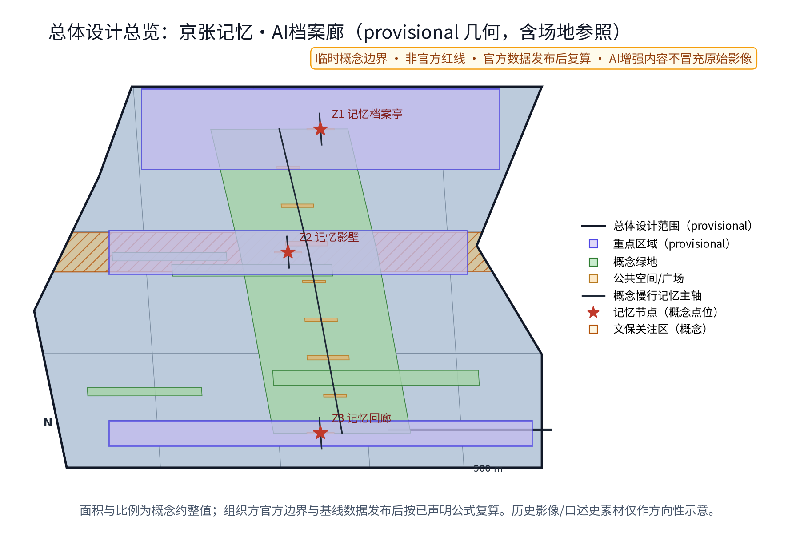
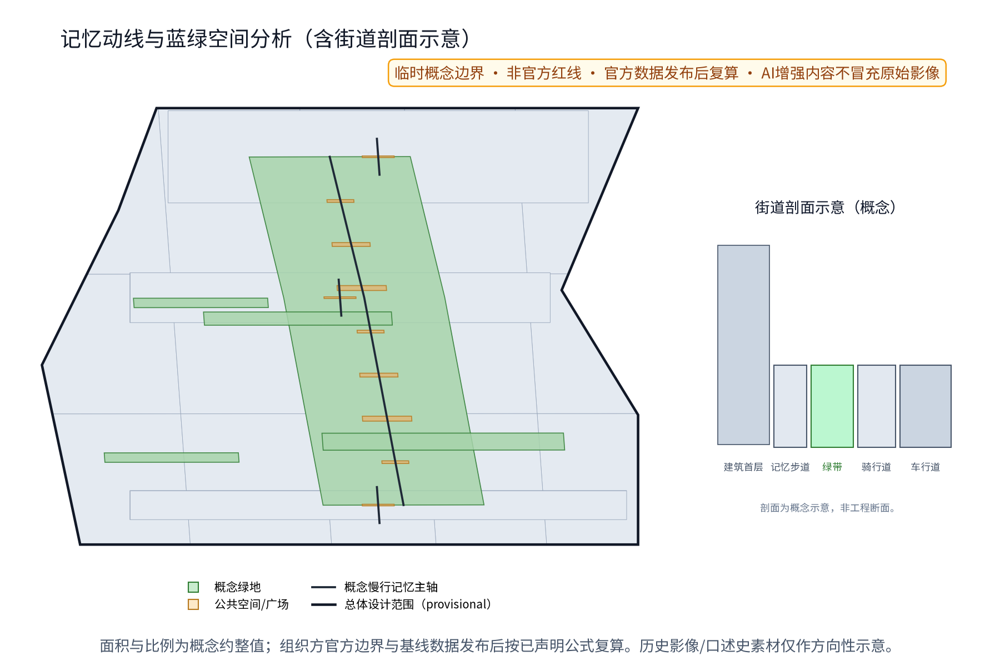
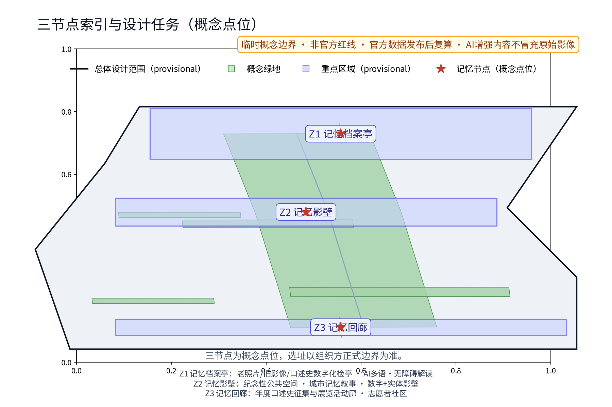
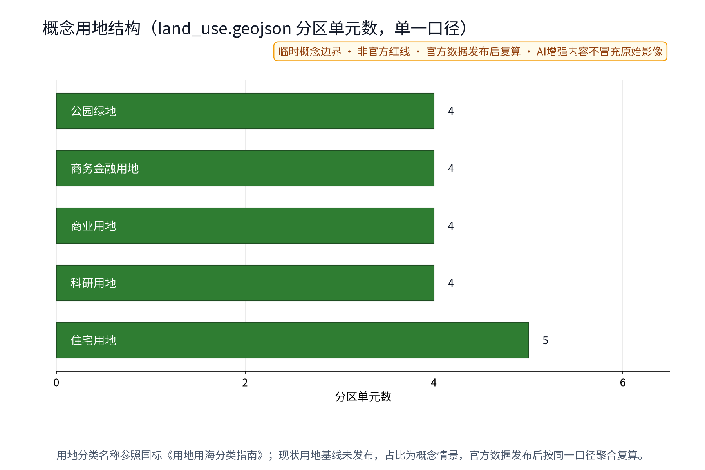
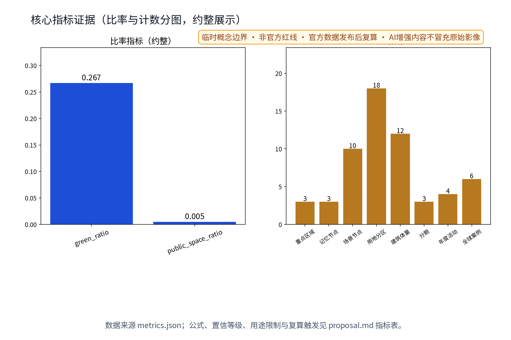

# 京张记忆·AI档案廊

「京张记忆·AI档案廊」／Jing-Zhang Memory · AI Archive Gallery（JZMA）是一套把“可被核验的记忆”转译为公共空间体验的概念建议：用「证忆环」机制把资料来源、授权/撤回、AI处理、人工复核和现场呈现连成一条可追溯链，再由 Z1 记忆档案亭、Z2 记忆影壁、Z3 记忆回廊三节点沿连续慢行记忆轴串联。AI在这里不是贴在景观上的标签，而是把口述史、公开影像和空间导览变成可查询、可解释、可撤回的公共服务接口。所有内容均为概念建议、参考方案，不替代正式规划，不构成政府审定、权属、许可、运营或实施承诺。[source:DATA-SRC-AGENT-TASKBOOK-20260518]

## 设计依据与资料清单

设计依据分为三类：一是公告和任务书中的三大定位、五大功能、三区两翼及六项 agent 任务；二是公开规划、用地分类、无障碍与生成式 AI 治理标准；三是六个可核验的国际机制案例，只借鉴机制，不移植规模、品牌或成效。京张历史叙事严格拆成“可核验历史线索、当前待查线索、原创概念”三栏：本包不把未核验照片、人物关系或遗址清单写成事实，也不把 AI 生成图当作原始影像。正式边界尚缺，因此几何仅使用任务包提供的临时粗略边界；来源、发布日期/获取日、用途和复用限制见 sources.json。[source:DATA-SRC-OFFICIAL-ANNOUNCEMENT-20260509] [source:DATA-SRC-MOHURD-URBAN-DESIGN-MEASURES] [source:SRC-JZMA-GEOMETRY-AUTHORED-20260829]

## 三层范围工作框架

第一层是统筹研究范围：讨论京张文化带、都市 AI 生活体验带、AI 融合创新带的产业、文化与区域协同接口；第二层是总体设计范围：以临时总体边界构建“连续慢行记忆轴—三节点—两翼接口”的空间骨架；第三层是重点区域详细设计：将 Z1/Z2/Z3 分别落到众智园 AI 自主创新加速区、北京 AI 原点社区、大钟寺 AI 产业集聚区的概念侧，最终位置必须经正式边界、权属、文保、交通、园林、无障碍和公众意见核验。三层之间用一张证据链传导：研究提出的资料治理与产业接口，约束总体空间节点；总体节点再把服务路径、公共空间组件和试点门槛交给详细设计。[data:geometry/site_boundary.geojson#SITE-001] [data:geometry/key_areas.geojson#KEY-ZHON]

## 统筹研究范围产业与未来城市研究

研究核心不是建立一个“数字展馆”，而是建立一项可进入城市日常的记忆基础设施：档案机构提供来源与授权规则，高校和开发者贡献可解释工具，社区贡献经同意的口述线索，企业/园区以脱敏公共议题提供测试场景，城市运营者把结果转成导览、展陈和公共议事材料。AI把每条材料拆成“来源—许可—语义—空间节点—人工判断—公开版本”六个字段，形成可追溯证据图；无来源或无授权的内容停在“待核验”层，不进入公开屏幕。区域协同以接口设想表达：中关村科技服务翼提供方法与资本配置讨论，北纬社区、未来科学城、怀柔科学城、经开区与京津冀只作为待核实的知识、人才、场景或传播接口，不暗示既有合作。[source:SRC-CASE-EUROPEANA] [source:SRC-CASE-COMMON-VOICE]

| 要素 | 概念机制 | AI实质动作 | 空间承载 | 证据与责任 |
|---|---|---|---|---|
| 资料 | 证据图 | 去重、标引、冲突提示 | Z1检亭 | 来源台账/档案馆类型 |
| 人才 | 开源门诊 | 复现、评测、翻译 | Z2影壁后场 | 开发者社区类型 |
| 场景 | 场景沙盒 | 受控推理、人工放行 | Z3回廊 | 运营者类型 |

## 总体设计范围城市更新与控规深度城市设计

总体设计把“连续性”做成可以走、看、听和回到原点的空间体验：一条沿绿带的慢行记忆轴依次连接 Z3 记忆回廊、Z2 记忆影壁、Z1 记忆档案亭；节点之间以低干预导视、可撤回展陈接口、连续可达路面和人工问询点相接，东西向用概念缝合联系跨越片区界面，南北向由记忆轴形成叙事连续。每个节点都经历“取证—解释—讨论—撤回”四步，公众能看到素材状态、来源等级和最后复核人类型。用地、建筑、道路、绿地和公共空间图层均从同一临时边界派生，不能理解为控规、红线或工程图；FAR、建筑高度、道路线位、桥隧、市政容量与投资均保持 unknown。[standard:MOHURD-URBAN-DESIGN-MEASURES] [data:geometry/roads.geojson#RD-SPINE]

**视觉识别方向**：主标记采用“折线轨道 + 开页括号 + JZ”构成，建议内部代号「忆线 JZMA」；主色为档案蓝、铁轨绿、旧照暖金和记忆墨赭。Logo 与文字为原创方向，未完成商标检索；字体使用本包记录的 Noto Sans SC OFL 资源，外部传播前仍需权利复核。[source:ASSET-FONT-NOTO-SANS-SC]

## 重点区域详细设计

三处重点区不是三个孤立装置，而是同一证忆环的三种空间状态。北侧众智园 AI 自主创新加速区概念侧设置 Z1 记忆档案亭：面向开发者、学生和居民，完成材料登记、授权问询、机器辅助标引和人工放行。中段北京 AI 原点社区概念侧设置 Z2 记忆影壁：一侧展示已核验片段，一侧显示“待核验/撤回”状态，形成可停留、可争辩的公共界面。南侧大钟寺 AI 产业集聚区概念侧设置 Z3 记忆回廊：把企业、社区和游客的主题线索编成可轮换的展陈序列，连接年度活动与开发者门诊。三节点均采用可拆、可移动、可回收组件；点位、面积、产权、文保、消防和夜间运营必须在试点前重新确认。[data:geometry/key_areas.geojson] [data:geometry/public_space.geojson]

| 节点 | 体验脚本 | AI机制 | 公共兜底 | 退出条件 |
|---|---|---|---|---|
| Z1 档案亭 | 递交→看授权→取回 | 语义标引/来源冲突提示 | 纸面登记与人工服务 | 版权不清即不入库 |
| Z2 影壁 | 看见→比较→议事 | 多语解释/版本对照 | 非数字导览与申诉 | 误导或争议未复核即下屏 |
| Z3 回廊 | 选择主题→行走→反馈 | 展陈编排/无障碍提示 | 可替换展板与志愿者 | 安全、扰民或维护失败即撤回 |

## AI 创新生态、人才画像与 AI+ 场景

JZMA 的 AI 机制由“记忆证据图 + 空间路由 + 人工放行”组成：模型只在授权或合成测试数据上做转写、标引、检索、翻译、无障碍改写和展陈排序；系统将每个输出绑定 source、rights、consent、model/version、human_review 和 publication_state，缺一项就停留在后台。AI 技术协议包括模型评测、数据质量、误差分群、运行监测与人工复核；不做个人身份识别、不做个体画像、不把摄像头追踪作为必要条件。治理三句式固定为：仅匿名聚合、关键决策人工复核、禁止过度监控。下面的场景数量是设计覆盖，不是已经部署的系统。[source:DATA-SRC-GENERATIVE-AI-INTERIM-MEASURES] [depth:three_key_area_detailed_design]

**12张场景卡（概念）**

| 编号 | 场景 | 空间/用户 | 输入→输出 | 人工复核与失败动作 |
|---|---|---|---|---|
| S01 | 公共域照片修复 | Z1/居民 | 授权图→修复预览 | 版权/史实复核；不清则不发布 |
| S02 | 旧影像标引 | Z1/学生 | 已清权影像→时间/地点候选 | 史料员复核；冲突标待核验 |
| S03 | 口述史转写 | Z1/长者 | 同意录音→文字草稿 | 讲述者/人工校对；撤回即隔离 |
| S04 | 多语导览 | Z2/游客 | 已审中文→英/其他语种草稿 | 双语审校；不等义则退回 |
| S05 | 无障碍解读 | Z2/全龄 | 文本→字幕/音频/简明版 | 无障碍评审；失败转人工 |
| S06 | 来源版权核验 | 三节点/策展人 | 元数据→风险分级 | 权利台账复核；高风险不上屏 |
| S07 | 记忆检索 | 三节点/公众 | 关键词→证据卡/路线 | 抽样复核；空证据不推荐 |
| S08 | 展陈叙事排序 | Z3/策展人 | 已审证据→主题序列 | 策展人放行；不适配则人工编排 |
| S09 | 居民投稿分流 | Z1/社区 | 自愿投稿→待核验队列 | 不判断个人；拒绝即可申诉 |
| S10 | 公共空间导览提示 | 轴线/全龄 | 匿名聚合拥挤级别→提示 | 仅运营辅助；安全判断由人做 |
| S11 | 开发者复现门诊 | Z2/开发者 | 脱敏样例→评测报告 | 技术导师复核；不通过即不接入 |
| S12 | 记忆版本回放 | Z3/游客 | 已发布版本→时间线 | 事实/权利抽检；异常回滚 |

**五根因形式项（每项均为可审的失败闭环）**：JZMA 不把“有 AI”当作完成条件，而把五类根因写入每张场景卡、节点台账和退出门。①**来源断裂**：无发布者、日期或原始位置时，证据卡停在待核验队列；②**权利/同意断裂**：授权缺失或撤回无法回放时，隔离原件、撤下公开版本并转人工；③**空间落点断裂**：节点、可达路径、权属或文保条件不清时，只保留纸面/离线演练，不作现场落位；④**模型—人工断裂**：输出无法解释、等义性不达标或误差未复核时，禁止自动发布，由史料、无障碍或策展角色接管；⑤**公共回流断裂**：居民无法阅读、申诉、撤回或获得非数字服务时，暂停新增内容，启用纸面、人工、触摸/音频替代并公示处理结果。五项分别由 M04/M05/M06/M07/M08/M12、T01—T03 和 P01—P14 留痕，形成“发现—阻断—人工接管—公众告知—复测/退出”闭环；它们是概念治理表单，不是已有机构或审批结论。

**六类画像**：P01 居民贡献者、P02 青年研究者/开发者、P03 老年讲述者、P04 无障碍需求者、P05 照护者与儿童陪同者、P06 国内外游客。画像只描述服务需求，不建立个人档案。**三项产业测试**：T01 口述史转写与撤回链，T02 多语/无障碍路线，T03 来源版权到展陈发布链；三项均先做离线/影子测试，外部正式数据和效果基线为 unknown_to_verify。[metric:scenario_card_count] [metric:industry_test_scenario_count] [metric:persona_count]

## 用地、建筑规模与拆改留方案

用地策略采用“留—改—拆—新”四级判断，但不替代法定拆改留：优先保留可核验的铁路记忆线索、绿带连续性和现状公共通行界面；对存量建筑只提出可逆的档案接口、遮雨等候、展示窗口和人工服务可能性；拆除仅在后续安全、权属、文保、结构和交通论证完成后作为个案选项；新建限于可拆卸、可回收、轻触地面的概念组件。land_use.geojson 是设计分区示意，building footprint 是复用优先包络，不是现状调查、法定用地、容积率、建筑高度或工程量。所有面积只做临时模型值，正式边界发布后统一复算。[standard:MNR-LAND-USE-CLASSIFICATION-GUIDE] [data:geometry/land_use.geojson]

| 处理 | 适用对象 | 设计判断 | 必须先核验 |
|---|---|---|---|
| 留 | 绿带、可核验遗产线索 | 保持视线与连续通行 | 文保、园林、权属 |
| 改 | 存量公共界面 | 轻介入、可逆、可撤回 | 结构、消防、无障碍 |
| 拆 | 仅个案临时障碍 | 不预设具体对象 | 产权、审批、交通安全 |
| 新 | 组件化档案接口 | 不给规模结论 | 用地、容量、运营与许可 |

## 交通、轨道、市政与公共服务设施

交通方案只表达公共体验机制：连续慢行记忆轴连接三节点，概念横向缝合联系连接东西两侧；Z1/Z2/Z3均设置可辨识入口、休息、人工问询、纸面导览与无障碍替代路径。轨道、道路与站点只作为待核实的接驳接口，不画工程线位、不承诺步行时间；市政只提出“接入现状、可撤回、低能耗、可维护”的接口原则，不给出负荷、容量、管线或地下工程结论。活动日采用预约/轮换/分级服务，公共安全由人工现场判断；AI只处理匿名聚合的导览提示，不执行安检或个体跟踪。[standard:BARRIER-FREE-ENVIRONMENT-LAW] [data:geometry/roads.geojson]

| 服务层 | 空间接口 | 最小可行服务 | 失败动作 |
|---|---|---|---|
| 到达 | 记忆轴与横向联系 | 人工问询、纸面图、可达替代 | 临时关闭不安全段 |
| 停留 | 节点前场 | 坐憩、遮雨、字幕/音频 | 转人工或撤换组件 |
| 运营 | 后台台账 | 预约、轮换、分级、备案 | 停止新内容发布 |

## 蓝绿空间、公共空间与城市风貌

蓝绿系统以“绿带为脊、影壁为界、回廊为室、档案亭为门”组织可感知场景：人在连续绿带中先看到低对比度的来源标识，再靠近节点获得多语、字幕、触摸/纸面解释，最后在影壁或回廊前进行比较、议事或撤回。公园、绿地、历史线索与水系关系仅按临时几何表达，不替代绿线、蓝线、文保或园林审批。公共空间组件库包含可移动信息牌、可撤展板、低亮度导视、纸面索引、人工服务台和可拆声学提示；所有组件均设安装、维护、撤回和权利负责人类型。风貌采用铁路工业记忆的线性、铆接、暖金语汇与克制的 AI 蓝色对话，文化标识和一带 Logo 分开管理。[data:geometry/green_space.geojson] [data:geometry/public_space.geojson]

| 组件 | 可感知动作 | 复用边界 | 撤回触发 |
|---|---|---|---|
| 来源牌 | 看见来源等级 | 只用清权文字 | 来源被撤回 |
| 可撤展板 | 比较版本 | 不嵌第三方图像 | 权利/事实争议 |
| 无障碍索引 | 听/读/触达 | 不采集身份 | 测试不通过 |
| 议事台 | 提交意见 | 纸面可用 | 安全或扰民 |

## 更新项目清单、实施政策与分期计划

项目清单是供专业团队深化的概念 handoff，不是工期或投资承诺。近期 1—3 年先做资料与权利基线、非现场影子测试、纸面/可撤组件样机和居民意见通道；中期 3—5 年在取得边界、权属、文保、消防、无障碍、轨道/道路和运营条件后，选择不超过一个可控段做小规模验证；远期 5—10 年再讨论三节点扩展、跨区域协同与长期品牌资产。每一阶段有“证据完整、人工复核、公众反馈、安全条件、维护能力”五道决策门；任一门不通过即暂停、回滚或退出。政策建议包括记忆公约、贡献积分、年度公示、档案备案、开发者联盟、志愿轮换、预约分级和内容下架机制，均须依法论证。[depth:phasing_implementation] [metric:phase_count]

| 项目 | 阶段 | 牵头/协同类型 | 当前可做 | 触发与KPI | 停止/退出 |
|---|---|---|---|---|---|
| P01 资料清单 | 近 | 档案/规划类型 | 核对公开源 | provenance完整率 | 无权利即不入库 |
| P02 证忆环原型 | 近 | AI/档案类型 | 离线影子测试 | 人工复核率 | 误差超界回人工 |
| P03 纸面节点 | 近 | 社区/无障碍类型 | 可撤组件样机 | 任务完成率 | 不安全即撤 |
| P04 居民公约 | 近 | 社区/法律类型 | 意见通道 | 意见处理时效 | 无法申诉即暂停 |
| P05 T01转写 | 近 | 高校/档案类型 | 受控样例 | 撤回链完整 | 撤回失败即隔离 |
| P06 T02导览 | 中 | 无障碍/翻译类型 | 影子路线 | 语义等义率 | 不等义不发布 |
| P07 T03发布链 | 中 | 策展/权利类型 | 版本编排 | 发布审计完整 | 版权不清下架 |
| P08 Z1深化 | 中 | 专业团队类型 | 选址复核 | 安全/可达复核 | 条件不全不落位 |
| P09 Z2议事 | 中 | 社区/教育类型 | 主题轮换 | 反馈闭环 | 扰民即换时段 |
| P10 Z3回廊 | 中 | 运营/文化类型 | 展陈试点 | 维护完成率 | 维护不足退出 |
| P11 开发者门诊 | 中 | 开发者/高校类型 | 复现与评测 | 评测可复现 | 不可复现不接入 |
| P12 年度公示 | 远 | 多方联合类型 | 公示模板 | 台账完整率 | 证据缺失不公示 |
| P13 区域接口 | 远 | 区域协同类型 | 交换方法 | 复用边界清楚 | 无授权不共享 |
| P14 品牌更新 | 远 | 品牌/法务类型 | 权利检索 | 冲突清零 | 冲突则改名 |

## 指标体系、面积复算与合规矩阵

三项 formal 核心视觉指标必须从本包几何复算，且与 visual/index.html 的 data-value 一致；人读界面采用约数：site_area_sqm 约 11.41 km²，green_ratio 约 26.7%，public_space_ratio 约 0.5%。metrics.json 与 HTML data-value 保留可复算机器值。这三项是临时设计模型值，不是官方面积、现状绿地率或法定公共空间率。其余未知控制如 FAR 和高度用 null + reason 保存。运行指标协议采用统一七元组：公式、阈值/范围、unknown_to_verify 基线、频率、证据、责任、失败动作；若指标只是目标，就明确 display_status=target_only，不伪装成已测结果。指标、来源、几何、图件和矩阵互相指向，正式边界到位后按同一口径整体复算。[metric:site_area_sqm] [metric:green_ratio] [metric:public_space_ratio]

| 指标 | 公式 | 阈值/范围 | 基线 | 频率/证据 | 责任/失败动作 |
|---|---|---|---|---|---|
| M01 面积 | area(site) EPSG:4548 | known finite | unknown_to_verify | 边界换版/GeoJSON | 参与者/替换复算 |
| M02 绿地率 | green/site | 0..1 | unknown_to_verify | 每版/几何 | 规划类型/重算 |
| M03 公共空间率 | public/site | 0..1 | unknown_to_verify | 每版/几何 | 公共空间类型/核验 |
| M04 权利完整 | 合规发布数/候选数 | 1.00发布 | unknown_to_verify | 月审/权利台账 | 策展类型/不上屏 |
| M05 撤回响应 | 下架时刻-撤回时刻 | 0..48h目标 | unknown_to_verify | 每次/演练 | 数据管理类型/隔离 |
| M06 转写复核 | 人工通过/抽样 | 0.90..1.00 | unknown_to_verify | 月审/抽样 | 史料类型/回人工 |
| M07 无障碍完成 | 完成任务/测试者 | 0.90..1.00 | unknown_to_verify | 月审/观察 | 无障碍类型/辅助 |
| M08 等义审校 | 通过/发布 | 0.95..1.00 | unknown_to_verify | 每版/双语审校 | 翻译类型/退回 |
| M09 场景卡 | count(S01..S12) | >=10 | unknown_to_verify | 每版/正文 | 作者/补卡 |
| M10 产业测试 | count(T01..T03) | >=3 | unknown_to_verify | 每版/协议 | 测试类型/不接入 |
| M11 画像 | count(P01..P06) | >=5 | unknown_to_verify | 每版/正文 | 服务类型/补覆盖 |
| M12 审计完整 | 完整记录/抽样 | 1.00 | unknown_to_verify | 每版/manifest | 作者/阻断发布 |

合规矩阵覆盖公告任务和 agent.1—6：agent.1 总体概念、Logo、三大定位/五大功能/三区两翼；agent.2 六案例与生态图谱；agent.3 场景卡、测试、画像与 AI 边界；agent.4 公共空间、东西缝合/南北贯通、三地标、荣誉展示、组件库；agent.5 京张/中关村/AI 文化叙事、导视与国际文案；agent.6 年度活动、开发者社区、开放运营与转化路径。每条均指向 proposal、geometry、metrics、sources、assumptions、self_check 和双语图件。[source:DATA-SRC-AGENT-TASKBOOK-20260518]

**13维补充评审覆盖表（证据锚点）**：以下是任务书补充维度的逐项可审映射，不把“有文件”替代内容证据。

| 维度 | 本包明确证据 | 可继续深化的接口 |
|---|---|---|
| 目标契合度 | 三大定位、京张/海淀语境、三节点 | 正式边界与现场核验 |
| 功能匹配度 | 五大功能、三区两翼、证忆环回路 | 各区域专业分工 |
| 品牌识别度 | 忆线 JZMA、原创标记、色彩/字体/留白规则 | 商标检索与应用测试 |
| 区域协同性 | 中关村科技服务翼、小月河场景赋能翼及五地接口 | 逐方确认知识/人才/场景边界 |
| 规划创新性 | 证据图—空间路由—人工放行的可撤回基础设施 | 与正式规划编制衔接 |
| 产业支撑度 | 六个公开案例、八项要素、T01—T03测试 | 公开资源与主体核验 |
| 场景可感知度 | S01—S12、Z1—Z3体验脚本、纸面/音频替代 | 现场无障碍走查 |
| 空间明确性 | site/key areas/roads/green/public GeoJSON及五类图件 | 官方红线、权属、文保数据到位后复算 |
| 可转化性 | P01—P14、RACI类型、触发与退出条件 | 专业团队补充运维边界 |
| 表达完整性 | 中英13节、14张双语图、4份PDF、双离线HTML | 人工出版与无障碍复核 |
| 公开合规性 | sources、版权台账、R0—R3、风险与撤回链 | 法律/权利逐项复核 |
| 国际传播力 | Jing-Zhang Memory · AI Archive Gallery及双语叙事 | 译审与跨文化测试 |
| 长期运营价值 | 年度公示、记忆征集、开发者门诊、版本归档 | 年度资源与维护条件核验 |

该表只记录本包已经提供的概念证据和下一步接口；不表示任何合作、资金、审批、运营主体或实施安排已经确定。

## 风险、版权与合规说明

风险台账分为边界与控制、历史事实、权属许可、数据与隐私、模型质量、公共安全/无障碍、运营能力和品牌权利八类。所有 AI 处理只使用公开清权、明确同意、去标识或合成测试数据；仅匿名聚合、关键决策人工复核、禁止过度监控。居民意见通道、年度公示、年度活动、下架/撤回与申诉都是概念机制，不代表已有制度。任何照片、影像、口述史、字体、Logo、论文图像、地图底图或企业标识若不能在台账中证明权利，就不进入展示；AI增强内容标为“AI增强示意”，不冒充原始档案。资产权利台账记录作者、生成器、日期、输入、转换、许可、复用边界；本包不声称获得任何外部授权。所有权属、面积、许可、运营、合作、品牌可用性和历史细节无法核验的地方均写成 unknown/to_verify/provisional。[source:ASSET-FONT-NOTO-SANS-SC] [depth:risk_missing_data]

## 参考资料

主要依据为北京市规划和自然资源委员会海淀分局公开公告、用户清权任务书、仓库公开标准快照、临时粗略边界文件和本包作者几何记录；国际案例六项分别用于开放学习网络、共享创新社区、生态接口、AI 应用测试、同意治理和文化元数据界面的方法比较，不转移品牌、规模、效果或合作关系。关于京张铁路的文化表达，本包只保留公开可追溯的历史主题线索，并把具体馆藏编号、图片权利、遗址清单和人物关联列为 to_verify；“忆线 JZMA”“证忆环”等是本包原创概念。正式引用以 sources.json 的 URL/本地路径、获取日期、用途与许可字段为准；正式边界、法定控制和专业标准若更新，必须重新读入、复算、渲染和自检。[source:DATA-SRC-OFFICIAL-ANNOUNCEMENT-20260509] [source:DATA-SRC-AGENT-TASKBOOK-20260518] [source:SRC-CASE-EUROPEANA]
