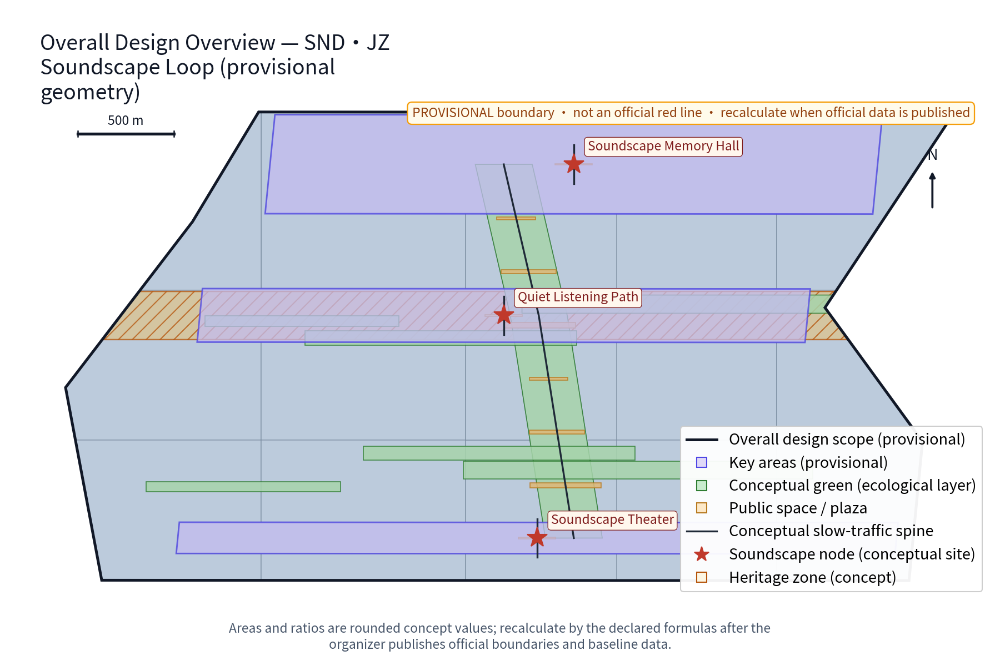
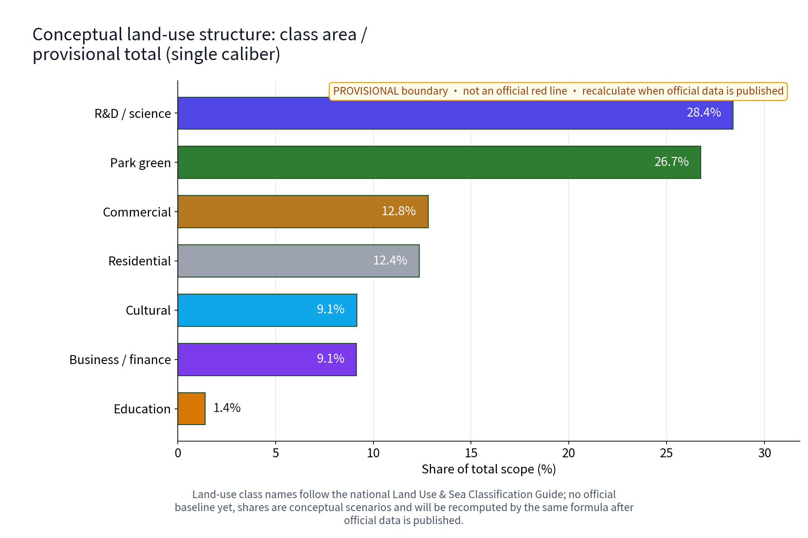
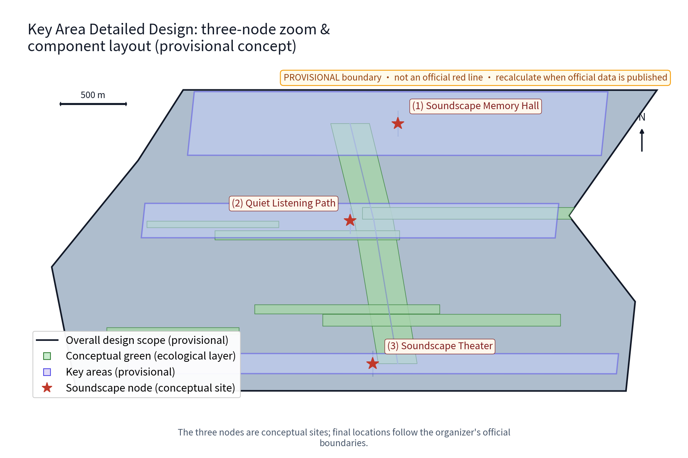
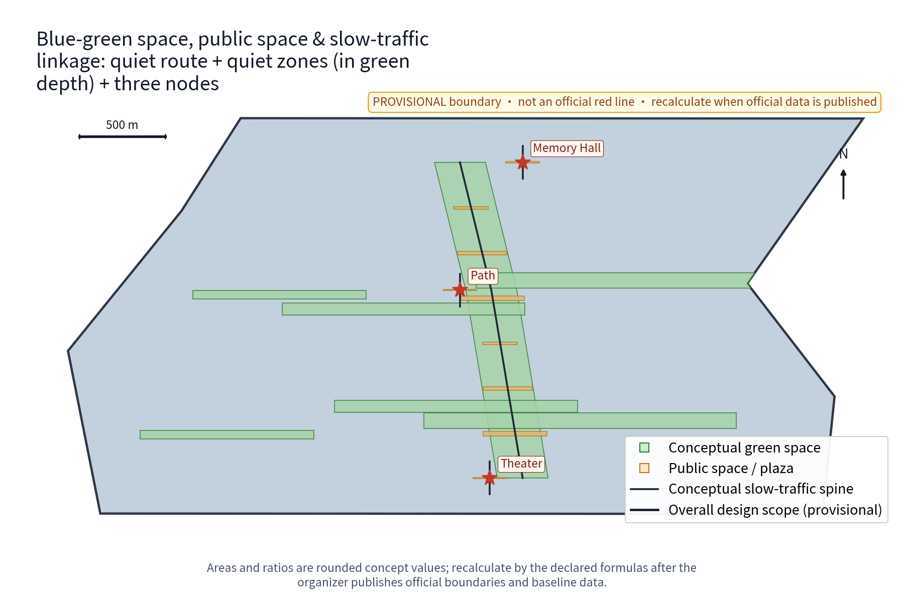
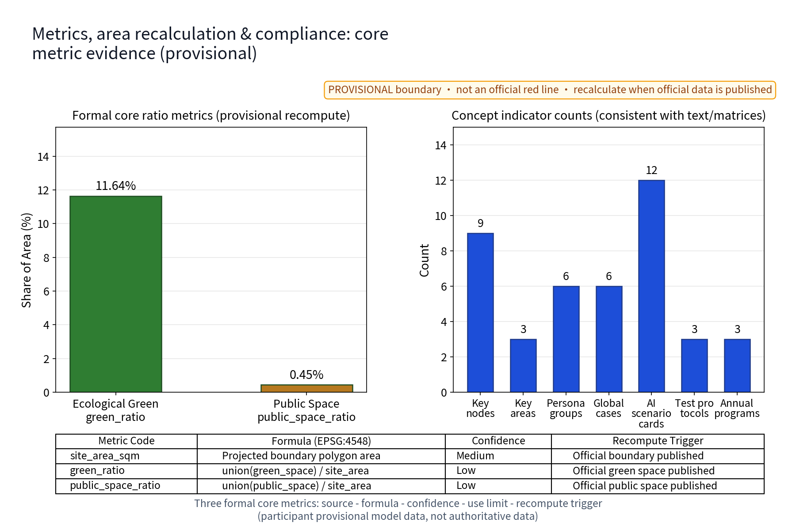

This proposal takes "soundscape" as its main thread and organizes the sound memory of the centennial Jing-Zhang railway and the acoustic-environment governance of the AI era into One Hall, One Path, One Belt: the Soundscape Memory Hall (Zhongzhiyuan side), the Quiet Listening Path (Beijing AI Origin Community side) and the Soundscape Theater (Dazhongsi side), with twelve AI+ scenario cards (noise-monitoring AI, soundscape guide AI, soundscape archive AI, event sound-control AI, quiet-keeping AI, etc.) and mechanisms such as the Quiet Convention, time-sliced soundscape permits, the Residents' Soundscape Council and the Annual Acoustic Disclosure forming a "collect - register - govern - disclose - deliberate" loop. Naming: SND stands for sound; JZ abbreviates Jing-Zhang; the loop refers both to the spatial belt along the greenway and to the governance loop of sound information. All outputs are concept suggestions and reference material; they do not replace statutory planning or constitute government conclusions. All areas and metrics keep a provisional marker and state the recompute trigger for official data publication.

## Design Basis and Source List

The proposal is based on three kinds of public material. First, the open solicitation announcement and agent task book for the Centennial Jing-Zhang AI Innovation Belt urban design: they define the three positioning goals, five major functions, the three-zone-two-wing layout and six agent tasks (agent.1-agent.6), and give the official three-tier scope caliber - coordinated research area about 43.6 km2, overall design area about 11.4 km2, key areas about 368.4 ha combined (announcement text caliber) [source:AGENT-TASKBOOK]. Second, the submission skills document sets the proposal structure and the wording discipline of "concept suggestion, reference proposal, available for deepening by professional teams". Third, two public professional directions: the public academic direction of soundscape ecology, and the coordinated-planning, source-control, classified-management and social-co-governance direction established by the Law of the People's Republic of China on Prevention and Control of Noise Pollution (effective 5 June 2022) [source:NOISE-POLLUTION-PREVENTION-LAW]; this source remains marked needs_review until source review is complete.

All self-generated geometry of this package is expressed as provisional temporary geometry (EPSG:4548), marked low confidence, used only for concept organization, visual explanation and recalculation demonstration; it is not an official red line, ownership boundary or planning permission. This package's position within the announced three-tier scopes is "a soundscape sub-scope inside the overall design area" (consistent with the announcement caliber, self-calculated from the announcement, not officially issued) [source:PROVISIONAL-BOUNDARIES]. Sound archive materials express only the mechanism intent of "public solicitation / self-recording + source registration + rights annotation"; no unauthorized material is pre-identified. Historical sound narrative relies only on public historical records (e.g., the Jing-Zhang railway opened in 1909, engineered by Zhan Tianyou, and the Qinglongqiao "zigzag" alignment - public facts, detailed items in the source ledger). Once official boundaries, official acoustic monitoring and regulatory-plan conditions are published, the relevant areas and metrics of this package are recomputed with the same formulas [source:OFFICIAL-ANNOUNCEMENT].

## Three-Level Scope Framework

The three-level scopes are linked by a "problem - space - operation - evidence - exit" responsibility chain: the coordinated research area answers "how the soundscape becomes the belt's memory asset and industry resource", translating the soundscape-ecology direction and the noise-regulation direction into strategy, industry and governance mechanisms; the overall design area answers "how the acoustic environment is zoned and organized on the belt", applying One Hall, One Path, One Belt and noise-prevention zoning to the master structure, the quiet listening routes and the urban-design guideline directions; the key areas answer "how the three nodes land differently", breaking tasks into three verifiable prototypes of function, space and public experience interface [source:AGENT-TASKBOOK].

| Level | Core question | Soundscape Loop answer | Main outputs |
| --- | --- | --- | --- |
| Coordinated research area (about 43.6 km2, announcement caliber) | How soundscape becomes memory and industry resource | Two-direction translation, sound industry ecology, regional soundscape collaboration | Ecosystem map, 6 benchmark cases, governance mechanism concepts |
| Overall design area (about 11.4 km2, announcement caliber; this package's main scope) | How the acoustic environment is zoned and organized | One Hall, One Path, One Belt, noise-prevention zoning, quiet routes | Master structure, guideline directions, indicator system |
| Key areas (about 368.4 ha, announcement caliber) | How the three nodes land | Memory Hall / Quiet Path / Theater prototypes | Node concept design, scenario-space mapping |

The three levels feed each other: the coordinated level provides direction and case evidence, the overall level provides structure and the indicator framework, and the key-area level provides verifiable landing prototypes. Every area and indicator in the three levels is recomputed from this package's provisional geometry under EPSG:4548 as participant provisional model data (low confidence), replaced by the same formulas after official data publication, and the results must stay consistent with the metrics file and the visual page [source:PROVISIONAL-BOUNDARIES].

## Coordinated Research Area: Industry and Future City Research

The three positioning goals are translated into listenable culture, livable quality and usable innovation: sound memory makes the cultural belt perceptible by ear; quiet listening makes the public-space quality of the living belt inspectable by hearing; acoustic AI and the sound industry form the industrial thread of the innovation belt. Among the five major functions, "AI+ scenario empowerment" corresponds to the twelve AI scenario cards, "intelligent AI-driven vibrant city" corresponds to the noise-prevention zoning and quiet-city concept, and "AI governance global voice" corresponds to the Annual Acoustic Disclosure and the Residents' Soundscape Council. In the three-zone-two-wing layout, Zhongzhiyuan hosts soundscape archiving and full-stack validation, the AI Origin Community hosts quiet-listening and guide pilots, and Dazhongsi hosts event sound control; the Zhongguancun tech-service wing connects sound-tech industry factors and the Xiaoyue River scenario wing hosts scenario testing and the public experience route [source:AGENT-TASKBOOK].

**Full-stack soundscape ecosystem map (concept)**: five rings of "data - algorithm - model - scenario - industry": public acoustic data and self-recorded sound archives (data ring), acoustic feature and transcription algorithms (algorithm ring), model evaluation and runtime monitoring (model ring; indicators include precision, false-alarm rate, error stratification and benchmark testing), twelve scenario cards and three test protocols (scenario ring), and the sound design and hearing-health industry directions (industry ring). The operating links: data enters algorithms and models only after source registration and anonymized aggregation; model evaluation results enter scenarios only after human review; scenario operation data feeds back to the data ring through the Annual Acoustic Disclosure. This map is a concept suggestion; no companies are named and no investment is invented [source:AGENT-TASKBOOK].

Benchmark cases are summarized from public channels only, with mechanisms and provenance registered item by item in the source ledger (six cases below, each with a public source and reuse boundary; any case whose verifiable public material cannot be obtained is demoted to a research hypothesis and removed from formal evidence):

| No. | Benchmark case (public channel) | Country / institution | Mechanism borrowed | Public source |
| --- | --- | --- | --- | --- |
| 1 | World Soundscape Project (WSP) | Canada - Simon Fraser University | Soundscape concept, soundwalk, public archive solicitation | [source:CASE-WSP] |
| 2 | Soundscape ecology review (2011) | USA - Pijanowski et al. | Recording and quantifying soundscapes as ecological objects | [source:CASE-SOUNDSCAPE-ECOLOGY] |
| 3 | 100 Soundscapes of Japan | Japan - Ministry of the Environment | Official list selection of regionally distinctive sounds | [source:CASE-JAPAN-100] |
| 4 | Paris-region noise observatory | France - Bruitparif | Public disclosure of acoustic-environment information and continuous monitoring direction | [source:CASE-BRUITPARIF] |
| 5 | London noise strategy and noise maps | UK - Greater London Authority | Strategy tiers and noise-map information disclosure | [source:CASE-LONDON-NOISE] |
| 6 | Sounds in the City (Montreal) | Canada - city-as-soundscape-laboratory initiative | City as a soundscape research laboratory with cross-sector partnership | [source:CASE-MTL-SOUNDS-IN-CITY] |

Industry and future-city directions are concept threads: AI audio processing, acoustic materials and hearing health, and sound design and soundscape consulting are directions for deepening; the future city is a hearing-friendly city concept with "listenable quiet" as its character.

**Regional Synergy Matrix (Conceptual Mechanism Suggestions)**: taking the Joint Soundscape Laboratory as a distinct collaboration carrier, establishing differentiated shared interfaces, deliverables, and boundary rules across regions:

| Regional Node | Concept Role | Shared Interface | Expected Deliverables | Rights & Data Boundary | Exit & Stop-Loss Mechanism |
| --- | --- | --- | --- | --- | --- |
| Beiwai Community | Residential cluster and multilingual cultural-exchange soundscape pilot | Multilingual interpretation standards & community quiet-convention interface | Multilingual soundscape glossary & trial community quiet convention | Protects residential privacy; collects anonymous sound pressure in public areas only; no indoor recording | If resident objection exceeds council threshold, pause pilot and withdraw equipment |
| Future Science City | Energy and manufacturing noise co-prevention & operational acoustic signature recognition | Industrial/park acoustic feature library & anomaly acoustic feature models | Low-noise, low-carbon park soundscape plan & cross-district acoustic comparison report | Strictly follows enterprise industrial data security boundaries; exports non-classified band features only | If technical standards diverge or safety concerns arise, negotiate termination and unilaterally delete shared copies |
| Huairou Science City | Fundamental acoustic mechanisms, auditory health & scientific infrastructure acoustic research | Soundscape ecology basic research database & joint test protocol (TP-02) | White paper on auditory health indicators & co-authored soundscape ecology research papers | Complies with academic copyright and authorship standards; open-source sharing of research data | When project concludes or if peer review fails, terminate cooperation and archive final report publicly |
| E-Town (BDA) | Autonomous driving external soundscape interaction, eVTOL noise sensing & industrialization | V2X acoustic perception API & connected vehicle acoustic test suite | Standard proposals for connected-vehicle external acoustic alerts & industrialization feasibility report | Complies with connected-vehicle data regulations; does not retain vehicle trajectories or driver information | If commercialization deviates from public interest or safety metrics fail, terminate testing immediately |
| Beijing-Tianjin-Hebei | Cross-regional centennial railway heritage soundscape corridor & cultural-tourism synergy | Jing-Zhang whole-line sound heritage digital archive & joint exhibition mechanism | Jing-Jin-Ji industrial heritage soundscape map & cross-regional touring exhibition plan | Jointly owned non-profit cultural asset; each party retains territorial curation rights | When regional agreement expires or if cooperation disputes arise, transition to standard local autonomous operation |

**8-Element Innovation Ecosystem Collaboration Matrix (Agent.2, Concept Suggestions)**: organizing Land, Space, Industry, Capital, Talent, Compute, Data, and Scenarios around the soundscape innovation ecosystem:

| Element | Demand Profile | Provider Type | Allocation Mode | Input / Output | Rights & Data Boundary | Exit & Stop-Loss Mechanism |
| --- | --- | --- | --- | --- | --- | --- |
| Land | Stock allocation and borrowing along existing greenways | Planning & landscaping authorities | Stock borrowing & time-sliced sharing | Inputs current plots, outputs quiet path and node envelopes | Does not change statutory land ownership or use; illegal occupation prohibited | If planning shifts or safety evaluation fails, revoke borrowing |
| Space | Existing building ground floors and outdoor micro-spaces | Park property management & street communities | Stock renovation & lightweight reversible micro-updates | Inputs idle corner spaces, outputs soundscape displays and listening pavilions | Does not claim building exclusive rights; preserves all-age accessible passage | If commercial encroachment or overcrowding occurs, rectify or revert within time limit |
| Industry | Smart audio, acoustic materials & auditory health cultural products | Tech enterprises & research institutes | Scenario-driven joint industry-academia-research testing | Inputs industry test protocols, outputs acoustic algorithms & product validation reports | IP belongs to the developing entity; mandatory exclusive lock-in prohibited | If testing fails or soundscape convention is violated, terminate partnership |
| Capital | Lightweight pilot funding & public-welfare sponsorship | Government guidance funds & public-welfare capital | Post-subsidy based on phased deliverables & donations | Inputs small-scale upfront validation funds, outputs open-source toolkits & public services | Commercial gambling agreements and excessive financialization strictly prohibited | If funding disrupts or evaluation fails, stop loss according to phase acceptance checklist |
| Talent | Acoustic engineers, oral-history recorders & listening guides | University faculty/students & community volunteers | Honor-credit incentives & internship training bases | Inputs volunteer hours & R&D intellect, outputs soundscape archives & docent services | Protects personal intellectual labor; honor-wall disclosure unlinked to commercial gain | If academic ethics or volunteer agreements are violated, revoke qualifications |
| Compute | Lightweight on-device inference & audio feature extraction | Regional compute centers & open-source algorithm platforms | On-demand elastic allocation & offline-first on edge devices | Inputs anonymous sound pressure time series, outputs event-level alerts & trend statistics | Compute resources isolated on dedicated networks; commercial training prohibited | If compute overspends or offline edge fails, fall back to pure manual inspection |
| Data | Public monitoring time series & self-recorded oral archives | Environmental monitoring stations & co-creating residents | Source registration, anonymous aggregation & open disclosure | Inputs sanitized features & authorized narratives, outputs public acoustic maps & archives | Individual voiceprint identification strictly prohibited; preserves deletion rights & copyright | If infringement or privacy overreach occurs, immediately take down and delete data |
| Scenarios | Quiet paths, Memory Hall & acoustic theater | Street offices, park committees & cultural heritage institutions | Open scenario catalog & time-sliced reservation access | Inputs 12 scenario cards & test plans, outputs empirical test reports & public feedback | Strictly abides by time-sliced permits and quiet hours; preserves residents' veto power | If noise disturbs residents or public-welfare attributes are lost, revoke scenario permits |
[source:PACKAGE-GEOMETRY]

## Overall Design Area: Urban Renewal and Regulatory-Plan-Level Urban Design

The overall structure is One Hall, One Path, One Belt: the Soundscape Memory Hall (Zhongzhiyuan side), the Quiet Listening Path (AI Origin Community side) and the Soundscape Theater (Dazhongsi side), linked by a north-south quiet listening route and connected to the east-west stitching greenways and the Jing-Zhang Railway Heritage Park green belt (concept suggestion). Noise-prevention zoning adopts the Three Quiet Zones: the quiet zone (green spaces along the path and residential frontage, protecting quiet listening), the balanced zone (everyday acoustic environment) and the vibrant zone (performances and social activity around the theater). The zoning is a conceptual direction only; no noise values or decibel figures are given and it does not replace statutory acoustic functional zoning [source:NOISE-POLLUTION-PREVENTION-LAW].

Regulatory-plan depth is expressed as "problem - spatial object - indicator - data gap - recompute path" without outputting FAR, building height, road red lines or engineering conclusions. The proposal offers directional urban-design guidelines: a soundscape design guideline (direction of contributions of building interfaces, paving and greenery to the acoustic environment), principles for sound-installation siting and time-sliced control, and low-glare, low-noise facility orientation. Renewal is stock-first and reversibly light: existing buildings and green belts are prioritized; after surveys of current conditions, ownership, heritage and structure are completed, retention, adaptation, relocation or removal are determined item by item; no specific demolition/retention conclusions are presupposed [source:CONTROL-DETAILED-PLANNING].

All drawings carry a legend, north arrow, scale bar and a provisional stamp (temporary conceptual boundary, not an official red line, recompute when official data is published), with captions stating confidence: spatial sheets are low-confidence conceptual illustrations to be redrawn with the same algorithm once official boundaries and regulatory plans are available [source:PACKAGE-GEOMETRY].

## Detailed Design of Key Areas

The three nodes are also candidates for humanistic landmark status: the Memory Hall is a "sound-memory landmark", the Quiet Path a "quiet listening landmark" and the Theater a "public dialogue landmark"; all avoid over-entertainment and influencer-style expression. Spatially, the nodes correspond to the three provisional key-area envelopes in this package's geometry (Zhongzhiyuan, Beijing AI Origin Community, Dazhongsi); the envelopes are not official red lines [data:geometry/key_areas.geojson#KEY-AREAS].

### Soundscape Memory Hall (Zhongzhiyuan side)

Function: a collection and performance node for the Jing-Zhang railway's sound memory; intended collection and display includes historical sound archives such as whistles, marshalling and announcements; narrative relies only on public history, and sound materials must come from public channels or self-recordings with per-item source and rights registration. Space: the concept envelope includes a listening room, an oral-history recording booth, a small exhibition/performance hall and an archive reading corner, prioritizing stock retrofitting and reversible light upgrades; no building-scale figures are given. Public experience: human-led tours, direct listening, oral-history solicitation and volunteer listening-guides. A Soundscape Honor Wall (concept) is proposed: individuals and teams who contribute to archive proofreading, oral-history collection and long-term listening volunteering are acknowledged through a public list and an annual thanks display, independent of commercial interests [source:AGENT-TASKBOOK].

### Quiet Listening Path (AI Origin Community side)

Function: a quiet soundscape path along the green belt with quiet zones, natural-soundscape nodes and soundscape interpretation nodes, with "hearing wind, hearing trees, hearing the seasons" as the experience goal. Space: a continuous, shaded, seated slow greenway; quiet pavilions, sound benches, ear trumpets and interpretation signs are all movable, iterable public components; noise monitoring and quiet-keeping AI pilot here. Public experience: quiet-route marking, a quiet-hours pledge, and interpretation information on both paper and electronic tracks. Deaf and visually impaired residents are served by tactile paper signage, on-site human guidance and complete alternative paths that do not depend on network or AI; accessibility on-site verification, nighttime low-glare lighting and safety patrol directions are reserved (concept) [source:URBAN-DESIGN-MEASURES].

### Soundscape Theater (Dazhongsi side)

Function: an outdoor sound-art and dialogue performance venue hosting sound installations, dialogue performances and residents' deliberations; time-sliced soundscape permits are the operational mechanism concept. Space: stepped viewing interfaces, a semi-enclosed sound-field installation, reserved backstage and storable seating, mainly lightweight demountable structure. Public experience: performances apply for time-sliced permits, are disclosed in advance and require reservation; the space re-silences after events; the Residents' Soundscape Council holds consultation rights on performance plans (mechanism concept); late night defaults to quiet with no endless performances; child- and family-friendly sessions with lower sound-level windows are planned (concept; no sound-level figures given) [source:AGENT-TASKBOOK].

#### Dazhongsi Native Intelligent Commerce & Cultural Tourism Scenario (Provisional Concept)

Within the Dazhongsi key-area conceptual envelope, build a native business and cultural-tourism fusion scenario that combines ancient bell cultural immersion with intelligent acoustic experiences:

- **Target User Profiles**: Young creative consumers, tech R&D practitioners, teachers/students studying ancient bells and acoustics, all-age neighborhood residents, and weekend family visitors.
- **AI-Assisted Commerce & Cultural Service Flow**:
  1. *Pre-visit & Arrival*: Powered by the Soundscape Guide AI, provides visitor density and sound-pressure heat maps in advance, time-sliced reservation guidance, and low-sound-level friendly session schedules;
  2. *Consumption & Interaction*: Acoustic creative retail and light dining zones feature smart directional sound-field installations (sound covers seating areas precisely with minimal spillover), supporting AI-personalized soundscape postcard generation and self-service voice interaction;
  3. *Performances & Dialogues*: The Event Sound-Control AI monitors sound-level budgets in real time, intelligently fine-tunes amplification directivity, and dynamically indicates post-event decay trends;
  4. *Post-event Departure*: The Post-Event Sound Recovery AI pushes low-noise departure route guidance and coordinates with merchants to activate time-sliced quiet mode.
- **Human Fallback & Kill-Switch**: All AI guidance, ordering, and interactions retain physical human service counters, paper menus, and on-site volunteers; the amplification system includes hardware-level physical limiters and a manual one-touch kill-switch operated by on-site acoustic engineers, independent of cloud AI; during network outages, local acoustic devices and manual broadcasts seamlessly take over.
- **Physical Spatial Carriers**: Lightweight reversible market kiosks, pop-up acoustic display pavilions, semi-enclosed stepped bleachers, and sound-absorbing facade components within the Dazhongsi envelope, ensuring complete reversibility and barrier-free accessibility.
- **Operator Type**: A collaborative "park operational platform + professional cultural tourism agency + merchant self-governance alliance" model (conceptual proposal, not an official government establishment).
- **Data & Privacy Boundaries**: Strict prohibition of facial recognition, emotion tracking, and individual voiceprint collection devices in commercial zones; only event-level anonymous visitor density and sound pressure time series are aggregated; merchant transaction data is strictly physically and logically isolated from the public acoustic monitoring network.
- **Pause & Exit Rules**: If merchant noise exceeds limits or violates the soundscape convention triggering two consecutive complaints, audio equipment permissions are suspended; if event sound pressure breaches limits or departure delays exceed 15 minutes, annual permit points are deducted up to disqualification for the following quarter; in severe disputes or safety hazards, a single-vote veto fuse mechanism is triggered, immediately reverting the area to basic quiet open space [source:GENERATIVE-AI-MEASURES].

The key-area figure provides a node location index, three enlarged insets, conceptual component layouts (quiet pavilions, sound benches, ear trumpets, interpretation signs, sound-field devices), direction, scale, legend and confidence notes, with a provisional stamp; component layouts are conceptual and do not constitute equipment siting conclusions [data:geometry/key_areas.geojson#KEY-AREAS].
## AI Innovation Ecosystem, Personas, and AI+ Scenarios

AI-native is the organizing approach, not a label: every scenario follows "non-AI path first, human-verifiable outputs, stop on failure", with technical protocols as conceptual directions (model evaluation, data quality, error stratification, runtime monitoring and benchmark testing). The innovation ecosystem is pulled by real problems: Zhongzhiyuan hosts the archive AI and full-stack validation, the AI Origin Community hosts the guide and quiet-keeping pilots, and Dazhongsi hosts event sound control; the two wings form a collaboration network with the Zhongguancun tech-service wing providing industry factors and the Xiaoyue River wing providing test scenarios and public experience routes, adding no spatial boundary claims [source:GENERATIVE-AI-MEASURES].

Six persona groups (concept): 1 heritage enthusiasts (follow sound memory, join oral-history solicitation and archive proofreading); 2 noise-sensitive residents (need quiet soundscapes and verifiable information disclosure; the primary beneficiaries of quiet-keeping); 3 sound artists (apply for time-sliced permits; works must be rights-cleared); 4 commuters (need low-noise routes and short listening experiences); 5 student listeners (use soundscapes as learning and creation material; join soundwalks and archive annotation, with human review of annotations); 6 elderly and deaf residents (receive equal information through paper, on-site services and non-audio means; no individual identification). These personas are design assumptions without real survey data; they will be validated through the Residents' Soundscape Council and community co-creation solicitation (concept) [source:AGENT-TASKBOOK].

| Scenario card | AI functional boundary | Data & privacy boundary | Human review | Stop condition |
| --- | --- | --- | --- | --- |
| Noise-monitoring AI | Anonymized aggregation and trend presentation of public-station acoustic data | Anonymized aggregation only; no individual sound collection | Anomaly events handled after human review | Individual identification or unreviewable output |
| Soundscape guide AI | Generates route and interpretation candidates from registered archives | Registered archives only | Curator proofreading before publication | No source registration or historical conflict |
| Soundscape archive AI | Classifies, transcribes and drafts registry entries for public and self-recorded sounds | Uploaded material passes a rights pre-check | Rights and historical facts reviewed by humans | Unclear rights or infringing material |
| Event sound-control AI | Provides time-slot and volume-budget suggestions (no conclusive figures) | No individual audience data collection | On-site manager approval and execution | Replaces human control or fails at dismissal |
| Quiet-keeping AI | Detects candidate disturbance events in quiet zones and drafts work orders | Event-level anonymous signals only | Management authority handles and follows up | Overreaching pushes or uncontrolled false-alarm rate |
| Soundscape semantic annotation AI | Drafts semantic tags for archives | Anonymous clip features only | Sampling review by annotators | Sample error rate above threshold |
| Oral-history transcription AI | Transcribes oral recordings and drafts summaries | Consent obtained before transcription | Confirmed by the interviewee | Stops immediately without consent |
| Sound-rights assist AI | Suggests similarity candidates between material and registered sources | No storage of user-uploaded originals | Legal/curatorial decision | Suggestions never decide by themselves |
| Quiet-zone patrol work-order AI | Aggregates patrol records into work-order candidates | Equipment and work-order data only | Responsible crew confirms | Manual takeover after repeated false alarms |
| Post-event re-silencing AI | Suggests sound-pressure recovery trends after dismissal | Anonymous statistics only | Duty staff confirms | Stops if it ever drives amplifiers autonomously |
| Soundscape health science AI | Drafts science-communication content from public literature | No personal health data collection | Health officer review | Stops beyond public-literature scope |
| Soundscape co-creation AI | Turns residents' co-created material into exhibition candidates | Material used with the creator's consent | Curation team review | Unauthorized material deleted |

Scenario-space-operation mapping: noise-monitoring AI maps to quiet zones and the whole belt with the Annual Acoustic Disclosure and the work-order loop; guide AI maps to the Quiet Path and the Memory Hall with reviewed publication of interpretation; archive AI maps to the Memory Hall with public solicitation, source registration and oral-history collection; event sound-control AI maps to the Theater with time-sliced permits and the performance calendar; quiet-keeping AI maps to quiet zones and residential-frontage green space with residents' deliberation and disclosure of dispositions. The twelve cards are organized by AI integration with six urban-planning domains: transport (low-noise commuter routes and travel experience), space (quiet-zone and node layout), public services (interpretation information and accessible alternative routes), culture (Memory Hall narrative and archive display), industry (sound-industry factors and test protocols) and governance (deliberation, disclosure and permit mechanisms), each domain having corresponding cards and human review nodes. Scenario opening mechanism (concept): the cards are opened for testing to universities and enterprises through a "data dictionary + open interface", exposing anonymized aggregation results only, never individual data; every participant signs the Quiet Convention and files it (concept) [source:GENERATIVE-AI-MEASURES].

**Industry Test Protocols (3 protocols, TP-01 to TP-03, Concept Suggestions)**: Each protocol specifies baseline standards, input/output, validation sampling, threshold governance, human responsibility roles, and pass/pause/exit criteria. Validation results must be manually reviewed under the model evaluation and runtime monitoring workflow:

| Protocol ID & Name | Baseline Specification | Anonymous Input | Expected Output | Validation Sampling Method | Threshold Governance Rules | Human Sign-off Role | Pass / Pause / Exit Criteria |
| --- | --- | --- | --- | --- | --- | --- | --- |
| TP-01 Noise Event Candidate Detection & Classification Protocol | To be set pre-pilot | Public station sound pressure time series & octave energy distributions | Anomaly candidate tags & tiered work-order proposals | Stratified random sampling of 5% event samples daily | Anomaly sound level lasting >10s triggers candidate; false alarm rate >8% triggers algorithm downgrade | Street acoustic officer & duty engineer co-signature with logged trace | **Pass**: 30 consecutive days with precision >=90% & false alarm rate <=5%; **Pause**: False alarm rate >10% for 3 consecutive days pauses auto-dispatch and reverts to full human review; **Exit**: Individual privacy breach or 2 consecutive audit failures terminates interface |
| TP-02 Soundscape Archive Auto-Classification & Semantic Transcription Protocol | To be set pre-pilot | Desensitized feature vectors of registered self-recorded/public audio | Sound category tags, ambient confidence & oral transcription drafts | Double-blind sampling review of 10% transcribed texts per batch | Semantic similarity threshold 0.85; historical terminology error rate <2% | Memory Hall professional archivist & cultural heritage expert sign-off for entry | **Pass**: Sampling accuracy >=92% & 100% rights compliance; **Pause**: Error rate >5% for 2 consecutive batches reverts to manual word-by-word proofreading; **Exit**: Serious historical flaw or verified infringement complaint withdraws archive and revokes access |
| TP-03 Tour Narrative Generation & Historical Consistency Verification Protocol | To be set pre-pilot | Registered archive metadata & spatial node coordinates | Bilingual tour narrative drafts, accessibility cues & recommended routes | 100% rule filtering + 30% expert manual sampling | Historical entity alignment 100%; low-glare / accessible route compliance 100% | Joint sign-off by Curator and Accessible Community Representative | **Pass**: 3 consecutive cycles of narratives reviewed with zero historical deviation; **Pause**: Unindexed historical material or route conflict reverts to standard base narrative; **Exit**: Deviation from public history or misleading accessible routing triggers single-vote veto and full takedown |

Privacy boundary: noise monitoring is anonymized aggregation plus human review only; no individual sounds are collected and no individual-identification tracking is performed; every scenario keeps non-AI equivalent paths such as manual patrol, paper and on-site services; key decisions always involve human review; excessive monitoring is prohibited (no always-on individual-identification devices) [source:GENERATIVE-AI-MEASURES].

**Honor display and developer community (agent.4, agent.6 - concept)**: the Soundscape Honor Wall and the annual acknowledgment list form the honor-display system; the Soundscape Developer Community operates through an open data dictionary, anonymous test interfaces and a Soundscape Co-creation Points mechanism (accumulated transparently, exchangeable for public-space experience benefits); the talent and enterprise conversion path is "scenario testing, outcome display, joint test protocol, industry-academia-research collaboration"; students, developers and SMEs receive differentiated participation tiers through the Soundscape Tiering system; community charter, points rules and exit mechanisms are disclosed and supervised by the Residents' Soundscape Council (concept suggestions; no institutions presupposed; no large-scale individual-identification monitoring) [source:AGENT-TASKBOOK].

**International communication copy (agent.5 - concept sample)**: the proposed main slogan is "SND·JZ - Where Heritage Sounds Back", with copy directions such as "From whistle to city silence: a railway's soundscape archive is opening to the world". Vehicles include bilingual soundscape archive open days, an international soundwalk linkage and an international academic roundtable (concept planning; all statements are intentions, not confirmed arrangements). The copy is grounded in real historical records and registered archives, without exaggeration or invented details [source:AGENT-TASKBOOK].
## Land Use, Building Scale, and Retain-Renovate-Demolish Strategy

Land use uses the classification codes allowed by the task package and fully covers the provisional area (concept approach), under a **single land-use classification caliber**: the numerator is the summed area of each land_use_code's features in this package's land_use.geojson (EPSG:4548), the denominator is the site_boundary area (site_area_sqm), summing to 100%. Under this caliber: R&D/science about 28.4%, park green about 26.7%, commercial about 12.8%, residential about 12.4%, cultural about 9.1%, business/finance about 9.1% and education about 1.4% - the same class names and shares are used identically in proposal.md, the land-structure figure, the visual page and the metric notes, and are re-sliced and recomputed with the same algorithm once official regulatory-plan land data is published [source:LAND-USE-CLASSIFICATION].

Caliber difference note: [metric:green_ratio]'s numerator is the union of the green_space.geojson geometry (an ecological layer across land uses, about 11.6%); the denominator is the same (site area) but the numerator and meaning differ from the park-green share in the land classification (about 26.7%). Both calibers' formulas, confidence levels and recompute triggers are listed item by item in the metrics section; they are never merged or mixed [metric:green_ratio].

Building scale is expressed only as concept envelopes: the Memory Hall favors stock retrofitting and reversible light upgrades, the Theater favors lightweight sound-field devices and temporary structures; no FAR, height or gross-scale figures are given. Demolition/retention follows a four-step method: verify current conditions and rights first; retain when safety, heritage and function requirements are met; make light adaptations when accessibility, energy or acoustic-interface improvements are needed; relocate or remove concept components when safety is unmet or official conditions conflict. Until current-condition and ownership surveys are completed, this proposal states no demolition area; FAR, height and demolition quantities remain to-be-confirmed and depend on official regulatory plans and survey data [source:CONTROL-DETAILED-PLANNING]. Architectural character favors plain industrial scale, low glare, durable replaceable parts and clear public entrances, without "AI styling" as a showpiece; official heights, setbacks and densities are determined by later professional design.

## Transport, Rail, Municipal Infrastructure, and Public Services

The quiet listening routes and the slow-mobility system are combined: three conceptual routes - quiet listening route, commuting route and theater route - are organized with existing slow-mobility systems, green belts and rail-station connection directions; routes are conceptual structures, not road red lines, and alignments are adjusted after official boundaries and road conditions are confirmed. Rail-source and quiet-zone separation is a conceptual direction: buffer green belts, terrain and noise-barrier directions are organized between the rail corridor and quiet zones; no noise values, sound levels or quantities are given. Specific noise-mitigation measures must be deepened by professional acoustics and engineering teams on the basis of measurements, regulations and approval conditions [source:URBAN-DESIGN-MEASURES].

Municipal and public services are component-based and usable offline: soundscape interpretation signs, digital and paper dual-track information, safety lighting, accessible facilities and sound-based wayfinding (alternative information channels for the visually impaired). Equipment power and reserved interfaces are concept reservations only, not pipeline engineering conclusions. All public components require asset numbers, maintenance responsibility, inspection frequency and stop conditions, avoiding single-vendor dependence. Noise-monitoring points and data publication follow the "anonymized aggregation + human review" boundary with no individual-identification tracking; nighttime safety is a conceptual direction of low-glare lighting, emergency call points and human patrol (no surveillance-style crowd identification) [source:GENERATIVE-AI-MEASURES].

## Blue-Green Network, Public Space, and Urban Character

The blue-green network uses the Jing-Zhang Railway Heritage Park green belt and the Xiaoyue River direction as the conceptual tie: the green belt serves ecology and leisure and also a "sound buffer" function, carrying the Quiet Listening Path; the concept suggests placing quiet zones in the depth of greenery so that greenery and quiet reinforce each other. The public-space component kit (concept): quiet pavilions, sound benches, ear trumpets, soundscape interpretation signs, movable sound-field devices and low-noise lighting; all components must be durable, repairable, relocatable, traceable and usable without network or AI; the kit works with the Quiet Convention (a public-space quiet-behavior consensus, concept) which operates by disclosure and voluntary commitment, with no punitive surveillance [source:URBAN-DESIGN-MEASURES].

Urban character follows a "quiet aesthetics": low-glare lighting, plain industrial scale and a clear wayfinding system. **Brand and visual identity (SND·JZ, concept)**: the primary mark direction is an original "soundwave + rail-tick" symbol combination; the naming system is the primary name Soundscape Loop (Shengjing Zhihuan), the English name SND·JZ Soundscape Loop and the short form SND·JZ. The Logo application board shows the Chinese-English lockup, color system (deep blue, teal, whistle red, rail gold, paper white - concept), type system (Noto Sans SC, OFL licence), wayfinding, event material and digital-interface applications. All marks are original proposal directions; font and icon licences are registered item by item in the source ledger; no unauthorized fonts, trademarks or graphics are used [source:PACKAGE-GEOMETRY].

**Prior rights and use boundary (honest statement)**: no official trademark search has been completed at concept stage; SND·JZ and the Chinese names are treated as internal working codenames. Until prior-rights search and clearance are completed, they are not registered, used commercially or claimed exclusively; any external display before clearance carries the words "concept proposal". Font use is bound by the SIL OFL licence; icons and graphics are original simplified symbols of this proposal [source:PACKAGE-GEOMETRY].

Cultural narrative takes the Jing-Zhang railway's sound memory as the main line - whistle, marshalling and announcement displays are grounded in public historical records; Zhongguancun innovation culture and AI culture are translated as "the quiet of the laboratory and the sound of creation", without distorting facts or reducing culture to decoration or slogans. The public experience emphasizes the full rhythm of "walk, listen, sit, read, deliberate": walking to hear (routes), sitting to hear (sound benches), reading to hear (interpretation signs) and deliberating to hear (the Soundscape Council); the three nodes form a city soundscape narrative that can be told, heard and joined; youth study tours and child-friendly windows (concept planning) are part of the annual program system [source:AGENT-TASKBOOK].

## Renewal Projects, Implementation Policy, and Phasing

Three renewal project lists (concept): archive and display - public solicitation and self-recording of sound archives, source and rights registration, oral-history collection, Memory Hall exhibition and listening operation; quiet-listening network - Quiet Path completion, quiet pavilions and quiet-zone signage, interpretation nodes and component installation, interface repairs with the slow-mobility system; acoustic governance - noise-monitoring pilot (anonymized aggregation), noise-prevention zoning signage, time-sliced permit pilot, Residents' Soundscape Council and Annual Acoustic Disclosure.

| Phase (concept rhythm) | Key content | Note |
| --- | --- | --- |
| Near term 1-3 years | Archive solicitation and registration, path pilot, monitoring pilot, Soundwalk Day | Reversible light investment first; validate mechanisms |
| Mid term 3-5 years | Memory Hall and Theater construction/operation, zoning governance, permit refinement | Progress based on pilot results |
| Long term 5-10 years | Whole-belt quiet listening network, sound industry ecology, routine governance | Form the annual disclosure and deliberation routine |

| Annual program brand | Content (concept planning) | Operating outputs |
| --- | --- | --- |
| Soundwalk Day | Collective soundwalk with live interpretation for all ages | Route records, participant feedback |
| Oral-history Week | Public oral-history solicitation with elderly residents and retired railway staff | Oral-history items, rights registration records |
| Sound Art Festival (pilot) | Sound art and dialogue performances under time-sliced permits | Performance archives, re-silencing records |

Implementation policy directions are all mechanism suggestions for professional teams to deepen: noise-prevention zoning management measures, time-sliced soundscape permits, Residents' Soundscape Council rules and the Annual Acoustic Disclosure system. They are expressed as mechanism suggestions, not official decisions or implementation arrangements, and constitute no implementation commitment. Investment is stated only in qualitative tiers, never as precise RMB amounts:

| Investment tier | Estimation method | Price basis | Scope included | Confidence | Recompute trigger |
| --- | --- | --- | --- | --- | --- |
| Low | Unit-price ranges of comparable public projects | 2026 public market information | Pilot equipment rental and labor | Low | After official budget publication |
| Medium | Interface indicators of comparable slow-mobility projects | 2026 public market information | Path completion and component installation | Low | After official budget publication |
| High | Dependent on official project initiation and design estimate | Official estimate pending | Memory Hall and Theater retrofit | To be confirmed | After official project approval |

**Pilot implementation and governance annex (concept)**: the following items are concept proposals for data governance and service levels at the pilot stage, for professional teams and management authorities to deepen:

| Governance annex item | Content (concept suggestion) |
| --- | --- |
| RACI responsibility matrix | Pilot tasks decomposed into R (responsible), A (accountable), C (consulted), I (informed); lead and collaborator roles stated below |
| Data dictionary | Fields, units, anonymization method and retention owner for each data type (sound-pressure series, archive items, work orders, event records) |
| Raw audio retention | Raw recordings are not retained by default; only anonymized features remain; archive materials needing retention are listed separately under source/rights registration rules |
| Aggregation threshold | Minimum sample size, time window and publication granularity for anonymized aggregation, confirmed and disclosed by the Residents' Soundscape Council |
| Retention period | Retention duration per data type, deletion process and audit records (concept durations, adjusted per formal data policy) |
| Access and deletion | Tiered data-access rights, resident access portal, deletion-request channel and response time (concept) |
| Human review | Checklist of key decision review nodes, reviewer roles and audit-trail requirements |
| Complaint and correction | Resident feedback channel (online and on-site), appeal process, correction publication and follow-up |
| Maintenance service level | Qualitative goals for component availability, response time and inspection frequency (no conclusive figures) |
| Stage acceptance and exit conditions | Acceptance checklist per stage (archive items, pilot reports, disclosure records) and withdrawal or suspension conditions on failure |

**Stage-Gate RACI Responsibility Matrix (Pilot Implementation Mechanism, Concept Suggestions)**:

| Stage-Gate / Implementation Task | Street Office / Authorities | Operations Team | Tech Enterprises / R&D | Residents' Council / Public | Expert Review Panel |
| --- | --- | --- | --- | --- | --- |
| Prep: Data Dictionary & Soundscape Convention Formulation | A | R | C | C | C |
| Access: Industry Test Protocols (TP-01~03) Admission Review | A | C | R | I | C |
| Phase 1: Memory Hall & Quiet Path Pilot Acceptance | A | R | C | C | C |
| Phase 2: Time-sliced Permits & Theater Commercial Operations Review | A | R | C | C | C |
| Routine: Annual Acoustic Disclosure & Grievance Rectification | A | R | I | C | I |
| Exit: Non-compliance Fuse & Pilot Termination Execution | A | R | I | I | C |

*Note: R (Responsible) = Lead execution, A (Accountable) = Final approval, C (Consulted) = Consultation, I (Informed) = Notification.*

Roles in the pilot: archive solicitation and registration is led by operators and volunteers (R), approved by the sub-district administration (A), consulted by universities and research institutes (C) and informed to the residents' council (I); the monitoring pilot is led by the administration and professional teams with enterprises advising; the activity pilot is led by the operator with performers executing and the council consulted in advance; the annual disclosure is jointly led by the operator and the governance group, opening a feedback channel to residents. Pilot resources rely mainly on existing public resources and volunteering, with no presupposed new-investment scale; each stage is reviewed against the acceptance checklist and, on failure, follows the exit conditions for withdrawal or suspension (concept) [source:AGENT-TASKBOOK].
## Metrics, Area Recalculation, and Compliance Matrix

The concept indicator system (concept caliber, not review indicators) includes: number of soundscape nodes, number of quiet zones, number of sound archive items, annual acoustic disclosure count, residents' soundscape deliberation count and conceptual quiet-route length, all marked "concept caliber + pending official data"; each indicator records its definition, source, formula, confidence level, use limitation and recompute trigger, and is recomputed after official data publication [source:PACKAGE-GEOMETRY].

The three formal core visual metrics - [metric:site_area_sqm], [metric:green_ratio], [metric:public_space_ratio] - are recomputed in this package from provisional temporary geometry at low confidence; formulas and boundaries are given below. All of them keep the provisional marker and the statement "participant provisional model data, not authoritative data", and never use unknown values or geometry-free placeholders:

| Metric | Definition and formula (EPSG:4548) | Geometry source file | Confidence | Use limitation | Recompute trigger |
| --- | --- | --- | --- | --- | --- |
| site_area_sqm | Area of the provisional site boundary polygon | site_boundary.geojson | Medium | Concept organization and recalculation demonstration only | Replace geometry when the official boundary is published |
| green_ratio | Union area of green_space geometry / site area | green_space.geojson | Low | Not to be mixed with the land-classification caliber | When official green-space data is published |
| public_space_ratio | Union area of public_space geometry / site area | public_space.geojson | Low | Same as above | When official public-space data is published |
| Land-use shares | Each land_use_code area / site area (sum 100%) | land_use.geojson | Low | Single classification caliber | When official regulatory-plan land data is published |

Caliber convention: ratio metrics uniformly use the whole site area (site_area_sqm) as the denominator; the numerators of green_ratio and public_space_ratio are the union of the corresponding geometry (ecological-layer concept), while the numerator of the land-use shares is the classified feature area; the definitions differ and are used independently - any comparison must first state the caliber. Once official boundary, green-space, public-space and regulatory-plan land data is published, the package recomputes per the formulas and triggers above, and results must stay consistent with the visual page, figures and both PDFs; metrics depending on unpublished official regulatory conditions (FAR, height) remain unknown with null values and never replace the three core metrics [metric:green_ratio] [metric:public_space_ratio].

The compliance matrix maps, item by item, the six agent tasks (agent.1-agent.6), the three positioning goals, the five major functions, the three-zone-two-wing layout and the prohibited-expression checklist, and records the provisional boundary and recompute triggers: agent.1 corresponds to the overall concept and naming system; agent.2 to the ecosystem map, 6 benchmark cases and factor mechanisms; agent.3 to the 12 scenario cards and 3 test protocols; agent.4 to the Soundscape Honor Wall, component kit and public-space experience; agent.5 to the "railway whistle vs city silence" narrative and the international communication copy; agent.6 to the Soundscape Developer Community, annual program system and conversion paths; per-item evidence is in compliance_matrix.json [source:AGENT-TASKBOOK].

## Risk, Copyright, and Compliance

Principal risks and countermeasures: the provisional temporary boundary may be misread as a legal red line - the package keeps the provisional marker and the "concept suggestion, reference proposal, available for deepening" wording throughout, and gives no conclusive area, FAR or height figures; sound-archive rights may be unclear and infringe - materials must come from public channels or self-recordings with rights annotated, a source-and-rights ledger is maintained (sources.json registers item by item the provenance, access dates, licences, allowed and prohibited uses and generation methods of international cases, academic literature, historical material, maps, fonts, icons, code and figures), copyright, neighbouring rights and oral-history consent are reviewed before display, and material whose rights cannot be proven is deleted or replaced; noise monitoring may slide into excessive surveillance - the three-sentence AI governance rule applies: anonymized aggregation only, human review of key decisions, no excessive monitoring (no individual-identification tracking), keeping non-AI equivalent paths such as manual patrol; historical narrative may be distorted - only public records are used; concept activities may be written as confirmed arrangements - all are expressed as intentions and planning [source:GENERATIVE-AI-MEASURES].

**Prior rights and compliance (honest statement)**: no official trademark search has been completed at concept stage; SND·JZ and related names are internal working codenames - not registered, not exclusively claimed, not used commercially; international cases and academic literature are summarized by mechanism from public channels only, without reproducing copyrighted images, audio or layouts; font and icon licences (including Noto Sans SC under SIL OFL) are registered item by item in the source ledger; the announcement, task book and regulations serve only as directional references, not legal opinions. This package constitutes no government endorsement, statutory plan, implementation approval, investment commitment or safety certification; before formal implementation, professional teams must complete official boundary, acoustic monitoring, ownership, heritage, noise and environmental-impact reviews [source:OFFICIAL-ANNOUNCEMENT].

Resident feedback channels and information disclosure (concept): the Residents' Soundscape Council is the standing feedback channel (online submission and on-site deliberation in parallel); residents can raise opinions and appeals on monitoring points, activity plans, archive solicitation and points rules; the Annual Acoustic Disclosure publishes an anonymized acoustic and operational report (including complaint-correction records) each year, reviewed by humans before publication, and never publishes any individual-identifying information [source:AGENT-TASKBOOK].

## References

Below are the category index and anchor mapping; the full machine index (provenance, publication and access dates, licences, allowed and prohibited uses, generation methods for every entry) is in sources.json, and material whose rights cannot be proven has been deleted or demoted to research hypotheses:

| Category | Index and note |
| --- | --- |
| Organizer documents | Announcement and agent task book (three tiers, three positioning goals, five major functions, three-zone-two-wing, agent.1-agent.6) |
| Professional directions | Soundscape ecology academic direction; noise prevention and control law (directional reference) |
| Official standards | Urban design measures, regulatory detailed planning measures, land-use classification guide |
| International cases | 6 benchmark cases (table in the coordinated research section; registered item by item in the ledger) |
| Academic literature | Schafer's soundscape writing; Pijanowski et al. soundscape ecology review (provenance and licence in the ledger) |
| Historical material | Jing-Zhang railway public records (1909 opening, Zhan Tianyou, Qinglongqiao zigzag, etc.) |
| Fonts and icons | Noto Sans SC (SIL OFL); programmatically generated original simple symbols (no third-party icon material) |
| Self-produced data | Provisional geometry, metrics, figures and code of this package (generation methods in the ledger and copyright statement) |
| Map context | Public maps serve as orientation context only; no statutory boundary, ownership or engineering conclusions are derived |

| Anchor alias | Corresponding entry (sources.json) |
| --- | --- |
| OFFICIAL-ANNOUNCEMENT | Announcement entry (full ID in sources.json) |
| AGENT-TASKBOOK | Agent task book entry (full ID in sources.json) |
| URBAN-DESIGN-MEASURES / CONTROL-DETAILED-PLANNING | Two MOHURD public standard entries |
| LAND-USE-CLASSIFICATION | Land-use classification guide entry (full ID in sources.json) |
| PROVISIONAL-BOUNDARIES | Provisional boundary entry (full ID in sources.json) |
| GENERATIVE-AI-MEASURES | Generative-AI interim measures entry |
| CASE-WSP and 5 others | Per-item international case entries (CASE-*) |
| PACKAGE-GEOMETRY | Self-produced geometry and figure entry |

Before formal deepening, the following must be completed: official boundary and coordinate system, ownership, acoustic baseline monitoring and baseline data, structural safety and fire-condition surveys of existing buildings, regulatory plans and heritage conditions, municipal capacity and operation ownership; the gaps are registered item by item in assumptions.json, related design conclusions remain at concept caliber and to-be-confirmed status, and recalculation runs on the same formulas once official data is published [source:PACKAGE-GEOMETRY].
