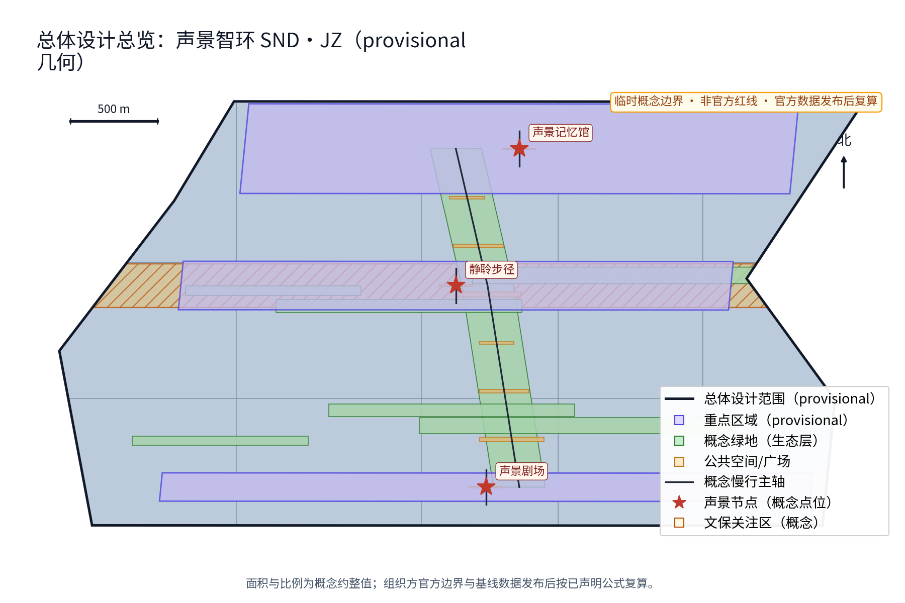
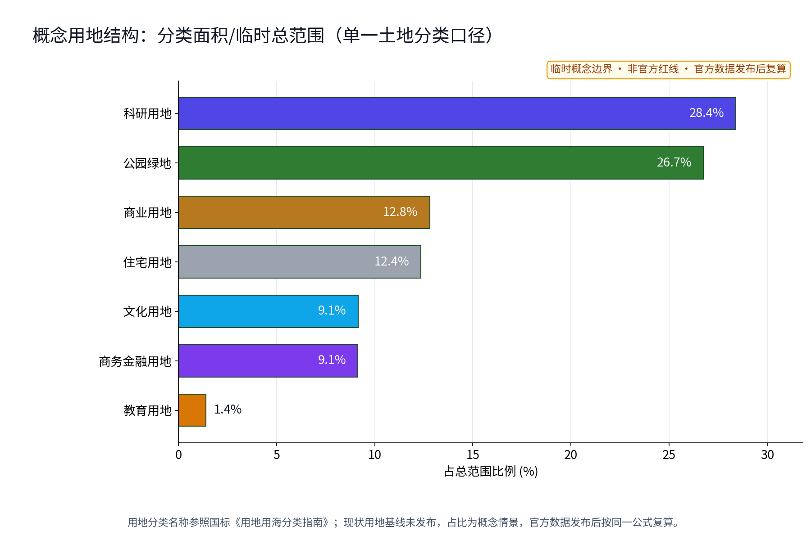
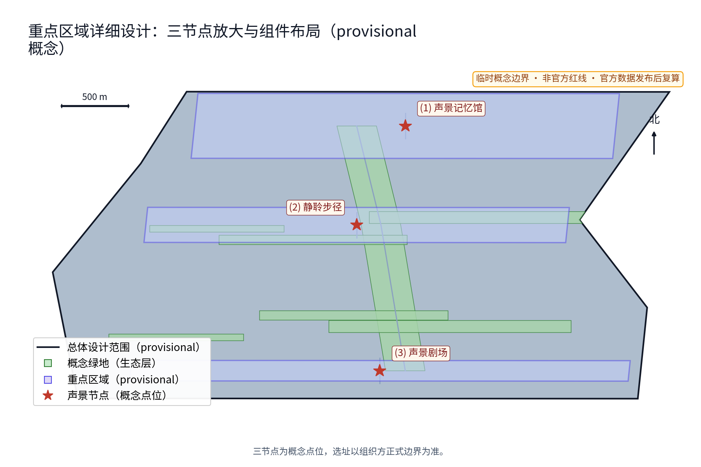
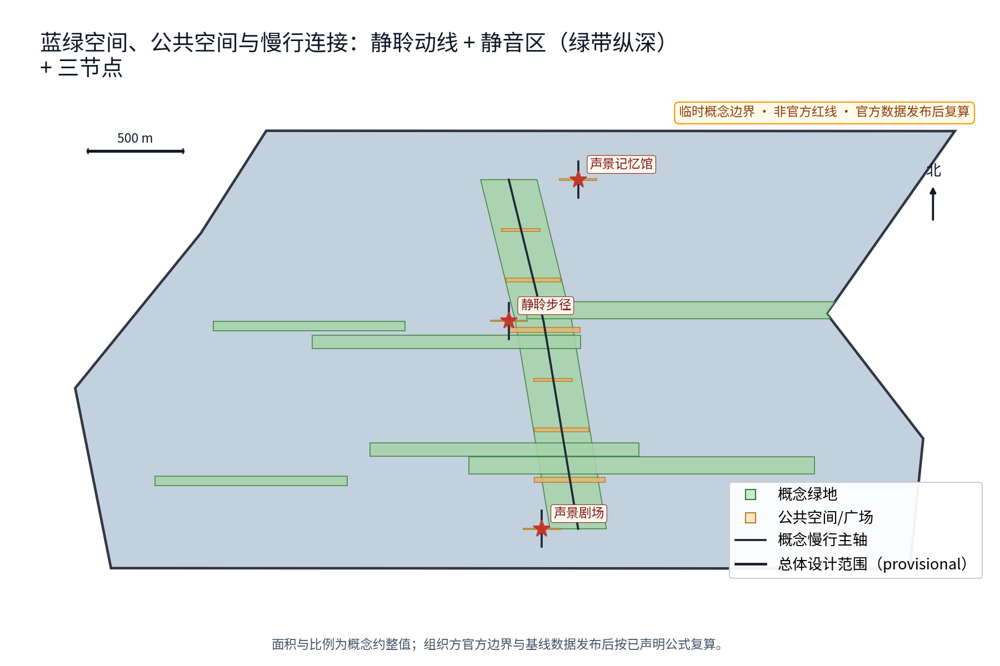
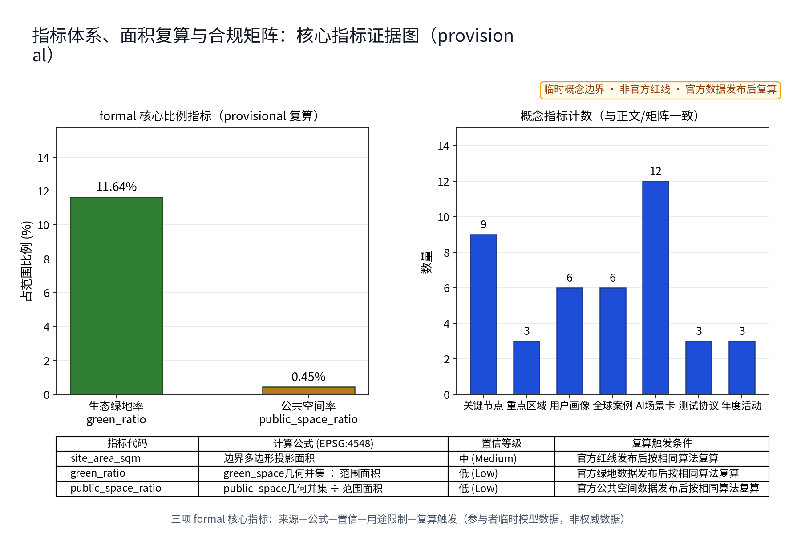

本方案以"声景"为主线，把百年京张的声音记忆与AI时代的声环境治理组织为「一馆一径一带」：声景记忆馆（众智园侧）、静聆步径（AI原点社区侧）、声景剧场（大钟寺侧），并以12张AI+场景卡（噪声监测AI、声景导览AI、声景档案AI、活动声控AI、静音保障AI等）与「静聆公约」「分时声景许可」「居民声景议事会」「年度声环境公示」等机制构成"采集—登记—治理—公示—议事"治理闭环。命名含义：SND取Sound之音，JZ为京张缩写；"智环"既指沿绿带组织的空间环带，也指声音信息的治理闭环。全部成果均为概念建议与参考方案，不替代正式规划，不构成政府审定结论；所有面积与指标均保留provisional标记，并说明官方数据发布后的复算触发条件。

## 设计依据与资料清单

本方案依据三类公开材料编制。一是百年京张AI创新带城市设计开源征集公告与任务书：确定三大定位、五大功能、三区两翼布局与六项智能体任务（agent.1—agent.6），并给出三层范围官方口径——统筹研究范围约43.6平方公里、总体设计范围约11.4平方公里、重点区域约368.4公顷（三处重点区合计面积，公告文本口径）[source:AGENT-TASKBOOK]。二是投稿技能文件确定的提案结构、"概念建议、参考方案、可供专业团队深化研究"的措辞要求与诚实表述规范。三是两个公开专业方向：声景生态学公开学术方向与《中华人民共和国噪声污染防治法》（2022年6月5日起施行）所确立的统筹规划、源头防控、分类管理与社会共治方向[source:NOISE-POLLUTION-PREVENTION-LAW]；该条目在来源审查完成前标为 needs_review。

本包自产几何均以provisional临时几何表达（EPSG:4548），标记低置信度，仅用于概念组织、视觉说明与复算演示，不代表法定红线、权属或规划许可；本包在公告三层范围中的定位是"总体设计范围之内的声景专项概念"（与公告口径一致，按公告自算，非官方核发）[source:PROVISIONAL-BOUNDARIES]。声音档案素材只表达"公开征集/自采＋来源登记＋权利注明"的机制意向，不预先指认任何未授权素材；历史声音叙事仅依公开史料（如京张铁路1909年建成通车、詹天佑主持修建、青龙桥"人"字形展线等公开史实，具体条目见来源台账）。官方边界、官方声环境监测与控规条件发布后，本包相关面积与指标按同一公式触发复算[source:OFFICIAL-ANNOUNCEMENT]。

## 三层范围工作框架

三层范围以"问题—空间—运营—证据—退出"责任链贯通：统筹研究范围回答"声景如何成为一带的记忆资产与产业资源"，把声景生态学方向与噪声污染防治法规方向转译为战略、产业与治理机制；总体设计范围回答"声环境如何在带上分区与组织"，把「一馆一径一带」与噪声防治分区落实到总图结构、静聆动线与城市设计导则方向；重点区域范围回答"三节点如何差异化落地"，把任务落实到功能、空间与公共体验界面三个可校验的原型[source:AGENT-TASKBOOK]。

| 层级 | 核心问题 | 声景智环的回答 | 主要成果 |
| --- | --- | --- | --- |
| 统筹研究范围（约43.6平方公里，公告口径） | 声景如何成为记忆与产业资源 | 双方向转译、声音产业生态、区域声景协作 | 生态图谱、6个对标案例、治理机制概念 |
| 总体设计范围（约11.4平方公里，公告口径；本包主体） | 声环境如何分区与组织 | 「一馆一径一带」、噪声防治分区、静聆动线 | 总图结构、导则方向、指标体系 |
| 重点区域范围（约368.4公顷，公告口径） | 三节点如何落地 | 记忆馆／步径／剧场三个原型 | 节点概念设计与场景-空间映射 |

三层成果互为输入：统筹层提供方向与案例证据，总体层提供结构与指标框架，重点层提供可校验的落地原型。三层中出现的所有面积与指标均从本包provisional几何按EPSG:4548复算，属于参与者临时模型数据（低置信度），官方数据发布后按同一公式复算替换，复算结果须与指标文件及visual页面保持一致[source:PROVISIONAL-BOUNDARIES]。

## 统筹研究范围产业与未来城市研究

三大定位转译为可"听"的文化带、可"感"的生活带、可"用"的创新带：声音记忆使文化带以声音被感知；静聆体验使生活带的公共空间品质可被听觉检验；声学AI与声音产业构成创新带的产业线索。五大功能中，"AI+场景赋能新范式"对应12张AI场景卡，"智能化AI活力城市"对应噪声防治分区与静音城市概念，"AI治理全球话语权"对应「年度声环境公示」与「居民声景议事会」等治理机制概念。三区两翼中，众智园承载声景档案与全栈验证，AI原点社区承载静聆与导览试点，大钟寺承载演出声控；中关村科技服务翼对接声音科技产业要素，小月河场景赋能翼承担声景场景测试与公共体验路径[source:AGENT-TASKBOOK]。

**声景全栈生态图谱（概念）**：以"数据—算法—模型—场景—产业"五环组织全栈要素——公开声环境数据与自采声音档案（数据层）、声学特征与转写算法（算法层）、模型评测与运行监测（模型层，指标含精确率、误报率、误差分群与基准测试）、12张场景卡与3份测试协议（场景层）、声音设计与听觉健康产业方向（产业层）；各环的操作关系为：数据须经来源登记与匿名聚合才进入算法与模型，模型评测结果经人工复核才进入场景，场景运营数据经「年度声环境公示」回馈数据层，形成闭环。本图谱为概念建议，不列企业、不编造投资[source:AGENT-TASKBOOK]。

对标案例只按公开渠道概述、不编造细节，机制借鉴与出处逐项登记于来源台账（下表6例，每例均附公开来源与权利边界；所述项目若无法取得可核验公开资料，将降级为待研究假设并从正式证据中删除）：

| 编号 | 对标案例（公开渠道） | 国家/机构 | 借鉴机制 | 公开来源 |
| --- | --- | --- | --- | --- |
| 1 | 世界声景计划（WSP） | 加拿大·西蒙弗雷泽大学 | 声景概念、声景漫步、公开档案征集 | [source:CASE-WSP] |
| 2 | 声景生态学综述（2011） | 美国·Pijanowski等 | 声景作为生态对象的记录与量化 | [source:CASE-SOUNDSCAPE-ECOLOGY] |
| 3 | 日本"音风景百选" | 日本·环境省 | 地域特色声音的官方名录遴选 | [source:CASE-JAPAN-100] |
| 4 | 巴黎大区噪声观察机构 | 法国·Bruitparif | 声环境信息公开与连续监测方向 | [source:CASE-BRUITPARIF] |
| 5 | 伦敦噪声策略与噪声地图 | 英国·大伦敦市政府 | 策略分级与噪声地图信息公开 | [source:CASE-LONDON-NOISE] |
| 6 | 蒙特利尔声景研究实验室 | 加拿大·Sounds in the City | 城市作为声景研究实验室、跨部门协作 | [source:CASE-MTL-SOUNDS-IN-CITY] |

产业与未来城市方向为概念线索：AI音频处理、声学材料与听觉健康、声音设计与声景咨询为可深化方向；未来城市以"可倾听的安静"为气质的听觉友好城市概念。

**区域协同矩阵（概念机制建议）**：以「声景共建实验室」为独有协作载体，与各区域建立差异化共享接口、交付物与边界规范：

| 协同区域 | 概念角色 | 共享接口 | 预期交付物 | 权益与数据边界 | 退出与止损机制 |
| --- | --- | --- | --- | --- | --- |
| 北纬/北外社区 | 居住组团与多语种文化交流声景试点 | 多语种解说规范与社区静音公约接口 | 多语种声景词条库、社区静音公约试行版 | 保护住宅私密性，仅采集公共区域匿名声压，不入户采音 | 居民议事会反对率超阈值即暂停试点并撤收设备 |
| 未来科学城 | 能源与制造噪声协同防控与工况声纹识别 | 工业/园区声环境特征库与异常声学特征模型 | 园区低噪低碳声景方案、跨区声学特征对比报告 | 严格遵循企业数据安全边界，仅输出非涉密频段特征 | 标准分歧或安全疑虑时协商解约，单向销毁共享副本 |
| 怀柔科学城 | 基础声学机理、听觉健康与大科学装置声环境科研 | 声景生态学基础科研数据库与联合测试协议(TP-02) | 听觉健康指标体系白皮书、声景生态科研联合论文 | 遵循学术共同体著作权与署名规范，科研数据开源共享 | 课题结项或未通过同行评议即终止合作并公开归档 |
| 经开区 (BDA) | 自动驾驶车外声景交互、低空eVTOL噪声感知与产业化 | 车路协同声学感知API与网联汽车声学测试集 | 智能网联车外警示音效标准建议、产业化可行性报告 | 遵守车联网合规要求，不留存车辆轨迹与驾驶人信息 | 商业转化偏离公益或安全指标不达标立即中止测试 |
| 京津冀区域 | 跨区域百年铁路工业遗产声景走廊与文旅协同 | 京张全线声音遗产数字档案库与联合巡展机制 | 京津冀工业遗产声景地图、跨区域巡回声景展陈方案 | 联合共有非营利性文化资产，各方享有属地策展权利 | 合作协议到期或合作争议转入常态化属地自主运营 |

**8要素创新生态协同机制（agent.2，概念建议）**：围绕声景创新生态组织土地、空间、产业、资本、人才、算力、数据与场景八大要素：

| 要素 | 需求特征 | 供给主体 | 配置模式 | 输入/产出 | 权益与数据边界 | 退出与止损机制 |
| --- | --- | --- | --- | --- | --- | --- |
| 土地 | 存量划拨与既有绿带借道 | 规划与园林管理部门 | 存量借用与分时共享 | 输入现状地块，产出声景步径与节点包络 | 不改变土地权属与法定用途，严禁违规侵占 | 规划调整或安全评估不合格即撤回借用 |
| 空间 | 存量建筑首层与户外微空间 | 园区物业与街道社区 | 存量改造与轻量可逆微更新 | 输入闲置角落地块，产出声景展陈与听觉驿站 | 不主张建筑专用权，保持全龄无障碍通行 | 商业侵蚀或客流超载时限期整改还原 |
| 产业 | 智能音频、声学材料与健康文创 | 科技企业与科研院所 | 场景驱动型产学研联合测试 | 输入产业测试协议，产出声学算法与产品验证报告 | 知识产权归研发主体，禁止强制排他绑定 | 测试未达标或违反声景公约终止合作 |
| 资本 | 试点轻投入与公益赞助支持 | 政府引导资金与社会公益资本 | 阶段性成果后补助与公益捐赠 | 输入前期小额验证资金，产出开源工具包与公共服务 | 严禁商业化对赌与过度资本化运作 | 资金链断裂或评估不合格按阶段验收清单止损 |
| 人才 | 声学工程师、口述记录者与听导 | 高校师生与社区志愿者 | 荣誉积分激励与产学研实习基地 | 输入志愿时长与研发智力，产出声景档案与解说服务 | 保护个人劳动成果，荣誉墙公示不挂钩商业收益 | 违反学术伦理或志愿者协议取消资格 |
| 算力 | 轻量端侧推理与音频特征提取 | 区域算力中心与开源算法平台 | 按需弹性调用与端侧离线优先 | 输入匿名声压时序，产出事件级预警与趋势统计 | 算力资源专网隔离，严禁挪作商业模型训练 | 算力超支或端侧离线失效时回退纯人工巡查 |
| 数据 | 公开监测时序与自采口述档案 | 环境监测站点与居民共创 | 来源登记、匿名聚合与开源公示 | 输入脱敏特征与授权口述，产出公开声环境图谱与档案库 | 严禁个体声纹识别，保留居民删除权与著作权 | 出现侵权或隐私越权即下架数据并销毁 |
| 场景 | 静聆动线、记忆馆与声学剧场 | 街道办、园区管委会与文博机构 | 开放场景清单与分时预约准入 | 输入12张场景卡与测试方案，产出实测报告与公众评价 | 严格遵守分时许可与静音时段，保留居民否决权 | 噪声扰民或偏离公益属性即吊销场景许可 |
[source:PACKAGE-GEOMETRY]

## 总体设计范围城市更新与控规深度城市设计

总体结构为「一馆一径一带」：声景记忆馆（众智园侧）、静聆步径（AI原点社区侧）、声景剧场（大钟寺侧），以南北贯通的静聆动线串联，并以东西向缝合绿道与京张铁路遗址公园绿带衔接（概念建议）。噪声防治分区为「静音三区」——静音区（步径与居住侧绿地，保障安静聆听）、均衡区（日常声环境）、活力区（剧场周边演出与人气活动）——分区仅为概念方向，不给出噪声数值或分贝值，不替代法定声环境功能区划[source:NOISE-POLLUTION-PREVENTION-LAW]。

控规深度以"问题—空间对象—指标—资料缺口—复算路径"表达，不输出容积率、建筑高度、道路红线或工程结论。本方案提出城市设计导则方向：声景设计导则（建筑界面、铺装与绿化对声环境的贡献方向）、声音装置设置与分时管控原则、低眩光与低噪设施导向。更新方法为存量优先、可逆轻改造：优先利用可保留建筑与既有绿带，待现状、权属、文保与结构调查完成后逐项核定保留、适配、移位或删除，不预设任何具体拆改留结论[source:CONTROL-DETAILED-PLANNING]。

全部图纸带图例、指北针、比例尺与provisional印章（临时概念边界、非官方红线、官方数据发布后复算），并以图注说明置信度：空间图件为低置信度概念示意，官方边界与控规到位后按同一算法重绘[source:PACKAGE-GEOMETRY]。

## 重点区域详细设计

三个节点同时作为人文类纪念性地标的候选：记忆馆是"声音记忆地标"，步径是"安静聆听地标"，剧场是"公共对话地标"，均避免过度娱乐化与网红化表达。三节点在空间上对应本包geometry中三个provisional重点区包络（众智园、北京AI原点社区、大钟寺），包络边界非官方红线[data:geometry/key_areas.geojson#KEY-AREAS]。

### 声景记忆馆（众智园侧）

功能：京张铁路声音记忆的收藏与展演节点，收藏与展示意向包括汽笛、编组、报站等历史声音档案，叙事仅依公开史料，声音素材须公开渠道或自采并逐条登记来源与权利。空间：概念包络含试听间、口述录音间、小型展演厅与档案阅览角，优先存量改造与可逆轻改造，不给定建筑规模数值。公共体验界面：人工讲解、亲自试听、口述征集与志愿者"听导"服务；设置「声景荣誉墙」展示体系（概念）：对参与档案校对、口述征集与长期收听志愿服务的个人与团队，以公开名录与年度致谢展陈方式展示，不与商业利益挂钩[source:AGENT-TASKBOOK]。

### 静聆步径（AI原点社区侧）

功能：沿绿带的安静声景步道，设静音区、自然声景节点与声景解说节点，以"听见风、听见树、听见季节变化"为体验目标。空间：净宽连续、有遮阴与座椅的慢行绿道；静音驿站、声音长椅、传声筒与解说牌均为可移动可迭代的公共部件；噪声监测与静音保障AI在此试点。公共体验界面：静聆动线标记、静音时段倡议、解说信息纸面与电子双轨提供；为听障与视觉障碍居民提供纸面触觉标识、现场人工引导与不依赖网络或AI的完整替代路径，并保留无障碍现场验证与夜间低眩光照明和安全巡查方向（概念）[source:URBAN-DESIGN-MEASURES]。

### 声景剧场（大钟寺侧）

功能：户外声音艺术与对话演出场，承载声音装置、对话演出与居民议事；「分时声景许可」为运营机制概念。空间：阶梯式观赏界面、半围合声场装置、预留后台与可收纳座椅，采用轻量可拆卸结构为主。公共体验界面：演出须申请分时声景许可、提前公示并预约，散场后恢复安静声景；「居民声景议事会」对演出计划具有协商权（机制概念）；深夜时段默认为安静，不设无休止演出安排；儿童与家庭场次设置低声级友好时段（概念策划，不给声级数值）[source:AGENT-TASKBOOK]。

#### 大钟寺原生智能商业与文旅创新场景（provisional 概念建议）

在大钟寺重点区域概念包络内，构建兼具古钟文化沉浸与智能声学体验的原生商业与文旅融合场景：

- **目标用户群体**：青年文创消费群体、科技研发从业者、古钟与声学文化研学师生、周边社区全龄居民与周末亲子家庭。
- **AI 辅助商业与文旅服务流**：
  1. *行前与入场*：依托「声景导览AI」提供客流与声压热度前置提示、分时预约引导与低声级友好时段日历；
  2. *消费与文旅互动*：声学文创店与轻食休憩区配备智能定向声场装置（声音精准覆盖座位区，外溢声压极低），支持AI个性化声景明信片生成与自助语音交互；
  3. *演出与对话活动*：「活动声控AI」实时监测声级预算，智能微调扩声指向性并动态提示散场回落趋势；
  4. *散场与离场*：「散场声音恢复AI」自动推送低噪离场动线引导，联动商户执行分时静音模式。
- **人工兜底与接管机制**：所有AI导览、点单与互动均保留实体人工服务台、纸质菜单与现场服务志愿者；声场扩声系统配备硬件级物理限幅器与现场声控工程师“一键静音断电开关（Kill-Switch）”，不依赖云端AI；弱网断网时本地声学装置与人工广播无缝接管。
- **空间物理载体**：依托大钟寺重点区概念包络内的轻量可逆商业集市微单元、声学文创快闪展亭、半围合阶梯看台与吸音降噪建筑立面构件，保持完全可逆与无障碍通行。
- **运营主体类型**：“园区运营平台＋文旅专业机构＋商户自治联合体”协同运营架构（概念建议，非政府核定编制）。
- **数据与隐私边界**：商业区域严禁部署人脸识别、情绪感知与个体声纹采集设备；仅做事件级匿名客流与声压时序聚合；商户经营数据与公共声环境监测网络严格物理/逻辑隔离。
- **熔断暂停与退出规则**：商户噪音超标或违反声景公约引发连续2次投诉即暂停音响使用权限；演出声压越界或散场延时扣减年度许可积分直至取消下一季度演出申请资格；发生严重争议或安全隐患时启动一票否决熔断机制，全面恢复基础安静开放空间状态[source:GENERATIVE-AI-MEASURES]。

三节点图件提供：节点区位索引、三处放大图、概念组件布局（静音亭、声音长椅、传声筒、解说牌、声场装置等）、方向、比例尺、图例与置信度说明，并保留provisional印章；组件布局为概念示意，不构成设施定点结论[data:geometry/key_areas.geojson#KEY-AREAS]。
## AI 创新生态、人才画像与 AI+ 场景

AI原生是本方案的组织方式而非标签：全部场景遵循"普通非AI路径先行、输出人工可复核、失败即停用"，并配备技术协议（模型评测、数据质量、误差分群、运行监测与基准测试为概念协议方向）。创新生态由真实问题拉动——众智园承载声景档案AI与全栈验证，AI原点社区承载导览与静音保障试点，大钟寺承载活动声控；两翼作为协作网络：中关村科技服务翼提供产业要素，小月河场景赋能翼提供测试场景与公共体验路径，不新增空间边界主张[source:GENERATIVE-AI-MEASURES]。

六类人才画像（概念）：①遗产爱好者（追踪声音记忆，参与口述征集与档案校对）；②噪声敏感居民（需要安静声景与可复核信息公开，是静音保障首要受益者）；③声音艺术家（申请分时声景许可，作品须来源清权）；④通勤者（需要低噪通行动线与短时聆听体验）；⑤学生聆听者（以声景为学习与创作素材，参与声景漫步与档案标注，标注结果经人工审核）；⑥老年与听障居民（以纸面、现场服务与非音频方式获得同等信息，不做个体识别）。画像为设计假设，未经真实调研，后续将以「居民声景议事会」与社区共创征集验证（概念）[source:AGENT-TASKBOOK]。

| 场景卡 | AI功能边界 | 数据与隐私边界 | 人工复核 | 停用条件 |
| --- | --- | --- | --- | --- |
| 噪声监测AI | 公开站点声环境数据匿名聚合、趋势呈现 | 仅匿名聚合，不采集个体声音 | 异常事件人工复核后处置 | 出现个体识别或无法复核 |
| 声景导览AI | 基于已登记档案生成路线与解说候选 | 仅使用已登记档案 | 策展人审校后发布 | 无来源登记或史实冲突 |
| 声景档案AI | 对公开征集与自采声音分类、转写、登记草稿 | 上传素材先经权利初审 | 权利与史实人工审核 | 权利不清或侵权素材 |
| 活动声控AI | 提供时段安排与音量预算提示 | 不采集观众个体数据 | 现场负责人批准与执行 | 代替人工控制或散场失效 |
| 静音保障AI | 识别静音区干扰事件候选、推送工单候选 | 仅事件级匿名信号 | 管理部门处置并回访 | 推送越权或误报率失控 |
| 声景语义标注AI | 为档案生成语义标签候选 | 仅处理匿名音频片段特征 | 标注员抽检复核 | 抽检错误率超阈 |
| 口述历史转写AI | 口述录音转写与摘要候选 | 转写前须取得口述者同意 | 口述者本人确认 | 未获同意即停用 |
| 声音版权辅助审查AI | 提示素材与已登记来源的相似度候选 | 不存储用户上传原件 | 法务或策展人裁决 | 提示不可作为裁决依据 |
| 静音区巡检工单AI | 汇总巡检记录生成工单候选 | 仅设备与工单数据 | 责任班组确认 | 重复误报即人工接管 |
| 散场声音恢复AI | 提示散场后声压回落趋势候选 | 仅匿名统计 | 现场值班确认 | 擅自联动功放即停用 |
| 声景健康科普AI | 依据公开文献生成科普内容候选 | 不收集健康类个人数据 | 健康专员审校 | 超出公开文献范围即停用 |
| 声景共创内容AI | 把居民共创素材整理为展陈候选 | 共创素材经本人同意 | 策展团队审校 | 未授权素材即删除 |

场景-空间-运营映射：噪声监测AI→静音区与全域→「年度声环境公示」与工单闭环；声景导览AI→静聆步径与记忆馆→解说内容审校发布；声景档案AI→声景记忆馆→公开征集、来源登记与口述采集；活动声控AI→声景剧场→「分时声景许可」与演出日历；静音保障AI→静音区与居住侧绿地→居民议事与处置公示。12张场景卡按AI与城市规划六域结合组织：交通（低噪通行动线与通勤体验）、空间（静音区与节点布局）、公共服务（解说信息与无障碍替代路径）、文化（记忆馆叙事与档案展陈）、产业（声音产业要素与测试协议）、治理（议事、公示与许可机制），每一域均有对应场景卡与人工复核节点。场景开放机制（概念）：以上场景卡以"数据字典＋开放接口"方式向高校与企业开放测试，接口仅暴露匿名聚合结果，不开放个体数据；每家参与主体须签署「声景公约」并备案（概念）[source:GENERATIVE-AI-MEASURES]。

**产业测试协议（3份，TP-01~TP-03，概念建议）**：每份协议明确基线规范、输入输出、验证抽样、阈值治理、人工责任角色与通过/暂停/退出准则，验证结果经「模型评测与运行监测」流程人工复核后方可继续：

| 协议编号与名称 | 基线指标规范 | 匿名输入 | 预期输出 | 验证抽样方法 | 阈值治理规则 | 人工复核责任角色 | 通过/暂停/退出准则 |
| --- | --- | --- | --- | --- | --- | --- | --- |
| TP-01 噪声事件候选检测与分级协议 | 试点前核定 (To be set pre-pilot) | 公开站点声压时序与频段能量分布 | 异常事件候选标签与分级工单建议 | 每日分层随机抽检5%事件样本 | 异常声级持续>10s触发候选；误报率>8%触发算法降级 | 街道声环境专员与值班工程师双人留痕签批 | **通过**：连续30天精确率≥90%且误报率≤5%； **暂停**：连续3天误报率>10%时暂停自动推单并转全人工复核； **退出**：出现个体隐私泄露或连续2次复核不合格即注销接口 |
| TP-02 声景档案自动分类与语义转写协议 | 试点前核定 (To be set pre-pilot) | 已登记自采/公开音频脱敏特征向量 | 声音类别标签、环境置信度与口述转写草稿 | 盲审双盲抽检，每批次抽检10%转写文本 | 语义相似度阈值0.85，历史术语错词率<2% | 声景记忆馆专职档案员与文博专家签字确认入库 | **通过**：抽检准确率≥92%且权利审核100%合规； **暂停**：错词率连续2批次>5%时回退人工校对； **退出**：发生史实硬伤或侵权投诉属实即撤回档案并注销权限 |
| TP-03 声景导览内容生成与史实一致性校验协议 | 试点前核定 (To be set pre-pilot) | 已登记档案库元数据与空间点位坐标 | 中英双语解说词草稿、无障碍提示与推荐动线 | 100%规则过滤＋30%专家人工抽检 | 史实实体对齐度100%，无障碍引导合格率100% | 策展人与无障碍社区代表联合签批 | **通过**：连续3期解说词经审核无史实偏差； **暂停**：发现未收录史料或线路冲突时恢复标准基础版； **退出**：违背公开史实或误导无障碍路线一票否决全量下线 |

隐私边界：噪声监测仅匿名聚合＋人工复核，不采集个体声音、不进行个体识别式追踪；全部场景保留人工巡查、纸面与现场服务等非AI等价路径；关键决策一律人工复核，禁止过度监控（不部署常开式个体识别设备）[source:GENERATIVE-AI-MEASURES]。

**荣誉展示与开发者社区（agent.4、agent.6，概念）**：「声景荣誉墙」与年度致谢名录构成荣誉展示体系；「声景开发者社区」以开源数据字典、匿名测试接口与「声景共创积分」机制运营（贡献累计、公开透明、可退换为公共空间体验权益）；人才与企业转化路径为"场景测试→成果展示→联合测试协议→产学研协作"，学生、开发者与中小企业在社区中按「声景分级」获得差异化参与层级；社区章程、积分规则与退出机制均须公示并接受「居民声景议事会」监督（概念建议，不预设机构设置，不搞大规模个体识别式监控）[source:AGENT-TASKBOOK]。

**国际传播文案（agent.5，概念样例）**：主标语建议为"SND·JZ — Where Heritage Sounds Back"（溯源之声，声景回响），配套文案方向："从汽笛到城市寂静，一条铁路的声景档案正在向世界开放"；传播载体包括中英双语声景档案开放日、国际声景漫步联动与国际学术交流圆桌（概念策划，全部表述为设想，不构成确定安排）；文案以真实史料与已登记档案为底，不夸大、不虚构历史细节[source:AGENT-TASKBOOK]。
## 用地、建筑规模与拆改留方案

用地表达采用任务包允许的分类代码并完整覆盖临时范围（概念方式），采用**单一土地分类口径**：以本包land_use.geojson中各land_use_code的要素面积（EPSG:4548）为分子、以site_boundary面积（site_area_sqm）为分母，合计100%。按此口径，科研用地约28.4%、公园绿地约26.7%、商业用地约12.8%、城镇住宅用地约12.4%、文化用地约9.1%、商务金融用地约9.1%、教育用地约1.4%——该组分类名称与占比在proposal.md、用地结构图、visual页面与指标说明中完全一致，官方控规用地数据发布后按同一算法重新切分并复算[source:LAND-USE-CLASSIFICATION]。

口径差异说明：[metric:green_ratio]的分子为green_space.geojson绿色空间几何并集（跨用地的生态层，约11.6%），与用地分类中的公园绿地占比（约26.7%）分母相同（均为范围面积）但分子不同、含义不同，两套口径的公式、置信等级与复算触发均在本文件指标章节逐项列明，不合并、不混用[metric:green_ratio]。

建筑规模仅表达概念包络：声景记忆馆以存量改造与可逆轻改造为主，剧场以轻量声场装置与临时性结构为主；不给出容积率、建筑高度或总规模数值。拆改留执行四步法：先核实现状与权利；满足安全、文保与功能要求则保留；需要无障碍、节能或声学界面改善时轻改；不满足安全或与官方条件冲突时移位或删除概念部件。未取得现状与权属调查前，本方案不提出任何拆除面积；容积率、建筑高度、拆改量均保持待确认状态，并说明其依赖官方控规与测绘数据[source:CONTROL-DETAILED-PLANNING]。建筑风貌以朴素工业尺度、低眩光、耐久易换部件与清晰公共入口为导向，不以"AI造型"为炫耀性目标；正式高度、退线与密度由后续专业设计确定。

## 交通、轨道、市政与公共服务设施

静聆动线与慢行系统复合：以"静聆步径＋通行动线＋剧场动线"三条概念动线组织，与既有慢行系统、绿带及轨道站点接驳方向复合；动线为概念结构而非道路红线，线位待官方边界与道路条件核定后调整。轨道声源与静音区隔离为概念方向：在轨道与静音区之间以缓冲绿带、地形与声屏障方向组织隔离缓冲，不给出噪声数值、声级或工程量结论，具体降噪措施须由专业声学与工程团队依据实测、法规与审批条件深化[source:URBAN-DESIGN-MEASURES]。

市政与公共服务采用组件化、可离线使用的方式：声景解说牌、数字与纸面双轨信息、安全照明、无障碍设施与声音导视（为视觉障碍者提供替代信息通道）；设备电源与预留接口仅为概念预留，不构成管线工程结论。所有公共组件要求资产编号、维护责任、巡检频率与停用条件，避免单一供应商依赖；噪声监测点位与数据发布均按"匿名聚合＋人工复核"边界执行，不进行个体识别式追踪；夜间安全以低眩光照明、应急呼叫与人工巡查为概念方向（不新增监控式人群识别）[source:GENERATIVE-AI-MEASURES]。

## 蓝绿空间、公共空间与城市风貌

蓝绿空间以京张铁路遗址公园绿带与小月河方向为概念纽带：绿带既承担生态与休闲功能，也承担"声音缓冲"功能，是静聆步径的载体；概念建议静音区优先布置于绿化纵深，让绿化与安静互为条件。公共空间组件库（概念）：静音亭、声音长椅、传声筒、声景解说牌、可移动声场装置与低噪照明；所有组件要求耐久、可修、可移位、来源可追溯，不依赖网络与AI即可正常使用；组件库与「静聆公约」（公共空间安静行为共识，概念）配套，公约以公示与自愿承诺方式运作，不设惩罚性监控[source:URBAN-DESIGN-MEASURES]。

城市风貌以"安静美学"为气质：低眩光照明、朴素工业尺度、清晰导视系统。**品牌与视觉识别（SND·JZ，概念）**：以原创"声波＋铁轨刻度"符号组合为主标识方向，命名体系为主名称"声景智环"、英文名称"SND·JZ Soundscape Loop"、简称"SND·JZ"；Logo应用板展示中英文锁定、色彩规范（深夜蓝、青瓦绿、汽笛红、轨道金、纸面白，概念）、字体规范（Noto Sans SC，OFL许可）、导视系统、活动物料与数字界面应用；全部标识为原创提案方向，字体与图标许可逐项登记于来源台账，不使用未授权字体、商标与图形[source:PACKAGE-GEOMETRY]。

**品牌在先权利与使用边界（诚实声明）**：概念阶段未完成官方商标检索，SND·JZ及中文名称均按"内部工作代号"处理，在完成在先权利检索与清权前，不对外注册、不用于正式商业使用、不主张专用权；清权完成前任何对外展示均标注"概念提案"字样；字体使用受SIL OFL许可约束，图标与图形均为本方案原创简化符号[source:PACKAGE-GEOMETRY]。

文化叙事以京张铁路声音记忆为主线——汽笛、编组、报站的声音展示以公开史料为据；中关村创新文化与AI新文化转译为"实验室的安静与创造的声响"，不歪曲历史事实，不把文化当作科技装饰或口号。公共体验强调"走—听—坐—读—议"的完整节奏：走路可听（动线）、坐下可听（声音长椅）、阅读可听（解说牌）、议事可听（声景议事会），三节点构成一条可讲述、可聆听、可参与的城市声景叙事线；青少年研学与儿童友好时段（概念策划）纳入年度活动体系[source:AGENT-TASKBOOK]。

## 更新项目清单、实施政策与分期计划

三类更新项目清单（概念）：档案展演类——公开征集与自采声音档案、来源与权利登记、口述历史采集、声景记忆馆展演与试听运营；静聆网络类——静聆步径贯通、静音驿站与静音区标识、声景解说节点与组件安装、与慢行系统的接口修补；声环境治理类——噪声监测试点（匿名聚合）、噪声防治分区标识、「分时声景许可」制度试点、「居民声景议事会」与「年度声环境公示」。

| 分期（概念节奏） | 重点内容 | 说明 |
| --- | --- | --- |
| 近期1—3年 | 档案征集与登记、步径试点、监测试点、声景漫步日 | 优先可逆轻投入，验证机制 |
| 中期3—5年 | 声景记忆馆与剧场建设运营、分区治理、许可制度完善 | 依试点结果推进 |
| 远期5—10年 | 全域静聆网络、声音产业生态、常态治理长效机制 | 形成年度公示与议事惯例 |

| 年度活动品牌 | 内容（概念策划） | 运行产出 |
| --- | --- | --- |
| 声景漫步日 | 面向全龄居民的集体声景漫步与现场解说 | 漫步路线记录、参与者反馈 |
| 口述征集周 | 面向长者与铁路老员工的公开口述采集 | 口述档案条目、权利登记记录 |
| 声音艺术节（试点） | 剧场分时许可下的声音艺术与对话演出 | 演出档案、散场安静恢复记录 |

实施政策方向均为机制建议、供专业团队深化：噪声防治分区管理办法、「分时声景许可」、「居民声景议事会」规则、「年度声环境公示」制度，均表述为机制建议，不写成官方决策或实施安排、不构成任何实施承诺。投入只按定性分级表述，不给出精确人民币金额：

| 投入级 | 估算方法 | 价格基期 | 包含范围 | 置信等级 | 复算触发 |
| --- | --- | --- | --- | --- | --- |
| 低 | 同类公开项目单价区间 | 2026年公开市场信息 | 试点设备租用与人工 | 低 | 官方预算公布后 |
| 中 | 同类慢行项目界面指标 | 2026年公开市场信息 | 步径贯通与组件安装 | 低 | 官方预算公布后 |
| 高 | 依赖官方立项与设计概算 | 待官方概算 | 记忆馆与剧场改扩建 | 待确认 | 官方立项批复后 |

**试点实施与治理附件（概念）**：右侧各项为试点阶段的数据治理与服务条款建议，全部为概念内容，供专业团队与管理部门深化：

| 治理附件项 | 内容（概念建议） |
| --- | --- |
| RACI责任矩阵 | 试点任务按"牵头R、批准A、咨询C、知会I"四角色分解，牵头与协作角色在表下列明 |
| 数据字典 | 每类数据（声压序列、档案条目、工单、活动记录）的字段、单位、匿名化方法与保留责任人 |
| 原始音频保留 | 默认不保留原始录音，仅保留匿名化特征；确需保留的档案素材按来源与权利登记规则单列 |
| 聚合阈值 | 匿名聚合的最小样本量阈值、时间窗与发布粒度，由「居民声景议事会」确认后公示 |
| 保存周期 | 各类数据的保存期限、到期删除流程与审计记录（概念期限，依正式数据政策调整） |
| 访问与删除 | 数据访问权分级、居民查阅入口、删除请求通道与响应时限（概念） |
| 人工复核 | 关键决策复核节点清单、复核人角色与留痕要求 |
| 投诉纠错 | 居民意见通道（线上与现场）、申诉处理流程、纠错发布与回访 |
| 维护服务水平 | 公共组件可用率、响应时限、巡检频率的定性目标（不给结论性数值） |
| 阶段验收与退出条件 | 每期验收清单（档案条目、试点报告、公示记录）与不达标时的撤收或中止条件 |

**阶段决策门 RACI 责任矩阵（试点实施机制，概念建议）**：

| 阶段决策门 / 实施任务 | 街道办/管理部门 | 运营团队 | 科技企业/研发主体 | 居民议事会/公众 | 专家评审委员会 |
| --- | --- | --- | --- | --- | --- |
| 准备期：数据字典与声景公约编制 | A | R | C | C | C |
| 准入期：产业测试协议 (TP-01~03) 准入评审 | A | C | R | I | C |
| 近期：声景记忆馆与步径试点验收 | A | R | C | C | C |
| 中期：分时声景许可与剧场商业运营评议 | A | R | C | C | C |
| 常态期：年度声环境公示与申诉纠错 | A | R | I | C | I |
| 退出期：违规熔断与试点终止执行 | A | R | I | I | C |

*注：R (Responsible)=牵头执行，A (Accountable)=终审批准，C (Consulted)=咨询协商，I (Informed)=知会通报。*

试点责任在表内体现为：档案征集登记由运营与志愿者牵头（R）、镇街管理部门批准（A）、高校与研究机构咨询（C）、居民议事会知会（I）；监测试点由管理部门与专业团队牵头、企业提供技术咨询；活动试点由运营牵头、演出主体执行、议事会事前协商；年度公示由运营与治理小组共同负责并向居民开放意见通道。试点资源（场地、设备、人力）以现有公共资源与志愿合作为主，不预设新增投入规模；每期结束按阶段验收清单评审，未通过即按退出条件撤收或中止（概念）[source:AGENT-TASKBOOK]。
## 指标体系、面积复算与合规矩阵

概念指标体系（口径为概念建议，非审定指标）：声景节点数、静音区数量、声音档案条目数、年度声环境公示次数、居民声景议事事次、静聆动线概念长度等，全部标注"概念口径＋待正式数据"，每项记录定义、来源、公式、置信等级、用途限制与复算触发，正式数据发布后复算[source:PACKAGE-GEOMETRY]。

三项formal核心视觉指标——[metric:site_area_sqm]、[metric:green_ratio]、[metric:public_space_ratio]——在本包中由provisional临时几何低置信度复算，公式与边界如下表；全部保留provisional标记与"参与者临时模型数据，非权威数据"声明，不以unknown或脱离几何的占位值代替：

| 指标 | 定义与公式（EPSG:4548） | 几何出处文件 | 置信等级 | 用途限制 | 复算触发 |
| --- | --- | --- | --- | --- | --- |
| site_area_sqm | 临时范围边界多边形面积 | site_boundary.geojson | 中 | 仅概念组织与复算演示 | 官方边界发布后替换几何 |
| green_ratio | green_space几何并集面积 ÷ 范围面积 | green_space.geojson | 低 | 与用地分类口径不混用 | 官方绿地数据发布后 |
| public_space_ratio | public_space几何并集面积 ÷ 范围面积 | public_space.geojson | 低 | 同上 | 官方公共空间数据发布后 |
| 用地分类占比 | 各land_use_code面积 ÷ 范围面积（合计100%） | land_use.geojson | 低 | 单一分类口径 | 官方控规用地数据发布后 |

口径约定：ratio类指标统一以整体范围面积（site_area_sqm）为分母；green_ratio与public_space_ratio的分子为相应几何并集（生态层概念），用地分类占比的分子为分类要素面积，二者定义不同、各自独立使用，任何对比都须先注明口径。官方边界、绿地、公共空间与控规用地数据发布后，按上表公式与触发条件复算，复算结果须与visual页面、图件与两份PDF保持一致；容积率、建筑高度等依赖官方控规条件未公开的指标保持unknown状态、不设置数值，不替代三项核心指标[metric:green_ratio][metric:public_space_ratio]。

合规矩阵逐条连接任务书六项任务（agent.1—agent.6）、三大定位、五大功能、三区两翼与禁止性表述清单，并记录provisional边界与复算触发条件；agent.1对应总体概念与命名体系，agent.2对应生态图谱、6个对标案例与要素机制，agent.3对应12张场景卡与3份测试协议，agent.4对应「声景荣誉墙」、组件库与公共空间体验，agent.5对应“铁路汽笛与城市寂静”叙事与「国际传播文案」，agent.6对应「声景开发者社区」、年度活动体系与转化路径；逐项证据见compliance_matrix.json[source:AGENT-TASKBOOK]。

## 风险、版权与合规说明

主要风险与对策：provisional临时边界被误读为法定红线——全文保留provisional标记与"概念建议、参考方案、可供专业团队深化研究"表述，不给结论性面积、容积率与高度数字；声音档案权利不清导致侵权——素材一律公开渠道或自采并注明权利，建立来源与权利登记台账（sources.json逐项登记国际案例、学术文献、历史资料、地图、字体、图标、代码与图件的出处、访问日期、许可、允许与禁止用途及生成方式），展演前完成著作权、邻接权与口述者同意等审查，权利无法证明的材料删除或替换；噪声监测滑向过度监控——AI治理三句式：仅匿名聚合、关键决策人工复核、禁止过度监控（不进行个体识别式追踪），保留人工巡查等非AI等价路径；历史叙事被歪曲——仅依据公开史料；概念活动被写成确定安排——全部表述为设想与策划意向[source:GENERATIVE-AI-MEASURES]。

**品牌在先权利与合规（诚实声明）**：概念阶段未完成官方商标检索，SND·JZ及相关名称按"内部工作代号"处理，不对外注册、不主张专用权、不用于正式商业使用；国际案例、学术文献仅按公开渠道概述其机制，不复制受版权保护的图片、音频与版面；字体与图标许可（含Noto Sans SC的SIL OFL许可）逐项登记于来源台账；官方公告、任务书与法规仅作为方向性参照，不构成法律意见。本包不构成政府背书、法定规划、实施批准、投资承诺或安全认证；正式实施前须由专业团队完成官方边界、声环境监测、权属、文保、噪声与环境影响等审查[source:OFFICIAL-ANNOUNCEMENT]。

居民意见通道与信息公示（概念）：「居民声景议事会」为常态化意见通道（线上提交与现场议事并行），居民可对监测点位、活动计划、档案征集与积分规则提出意见与申诉；「年度声环境公示」每年发布匿名聚合的声环境与运营报告（含投诉纠错记录），公示前经人工复核，不发布任何个体识别信息[source:AGENT-TASKBOOK]。

## 参考资料

以下为来源类别索引与锚点对照；完整机器索引（每项来源的出处、发布与访问日期、许可、允许与禁止用途、生成方式）以sources.json为准，权利无法证明的材料已删除或降级为待研究假设：

| 类别 | 索引与说明 |
| --- | --- |
| 组织方文件 | 公告、任务书（三层范围、三大定位、五大功能、三区两翼、agent.1—agent.6） |
| 专业方向 | 声景生态学学术方向、噪声污染防治法（方向性参照） |
| 官方标准 | 城市设计管理办法、控规编制审批办法、用地用海分类指南 |
| 国际案例 | 6个对标案例（表见统筹研究范围章节，逐项登记于来源台账） |
| 学术文献 | Schafer声景著作、Pijanowski等声景生态学综述（出处与许可见台账） |
| 历史资料 | 京张铁路公开史料（1909年建成通车、詹天佑、青龙桥"人"字形展线等） |
| 字体与图标 | Noto Sans SC（SIL OFL）、程序化原创简笔符号（无第三方图标素材） |
| 自产数据 | 本包provisional几何、指标、图件与代码（生成方式见台账与版权声明） |
| 地图语境 | 公开地图仅作定向语境，不推导法定边界、权属或工程结论 |

| 锚点别名 | 对应条目（sources.json） |
| --- | --- |
| OFFICIAL-ANNOUNCEMENT | 资格预审公告条目（完整ID见sources.json） |
| AGENT-TASKBOOK | 面向智能体任务书条目（完整ID见sources.json） |
| URBAN-DESIGN-MEASURES / CONTROL-DETAILED-PLANNING | 住建部两件公开标准条目 |
| LAND-USE-CLASSIFICATION | 用地用海分类指南条目（完整ID见sources.json） |
| PROVISIONAL-BOUNDARIES | 临时边界条目（完整ID见sources.json） |
| GENERATIVE-AI-MEASURES | 生成式AI服务管理暂行办法条目 |
| CASE-WSP 等6案例 | 国际案例逐项条目（CASE-*） |
| PACKAGE-GEOMETRY | 本包自产几何与图件条目 |

正式深化前必须补齐：官方边界与坐标系、权属、声环境现状监测与基线、既有建筑结构安全与消防条件、控规与文保条件、市政容量与运营权属；上述缺口在assumptions.json逐项登记，相关设计结论保持概念口径与待确认状态，官方数据发布后按同一公式复算[source:PACKAGE-GEOMETRY]。
