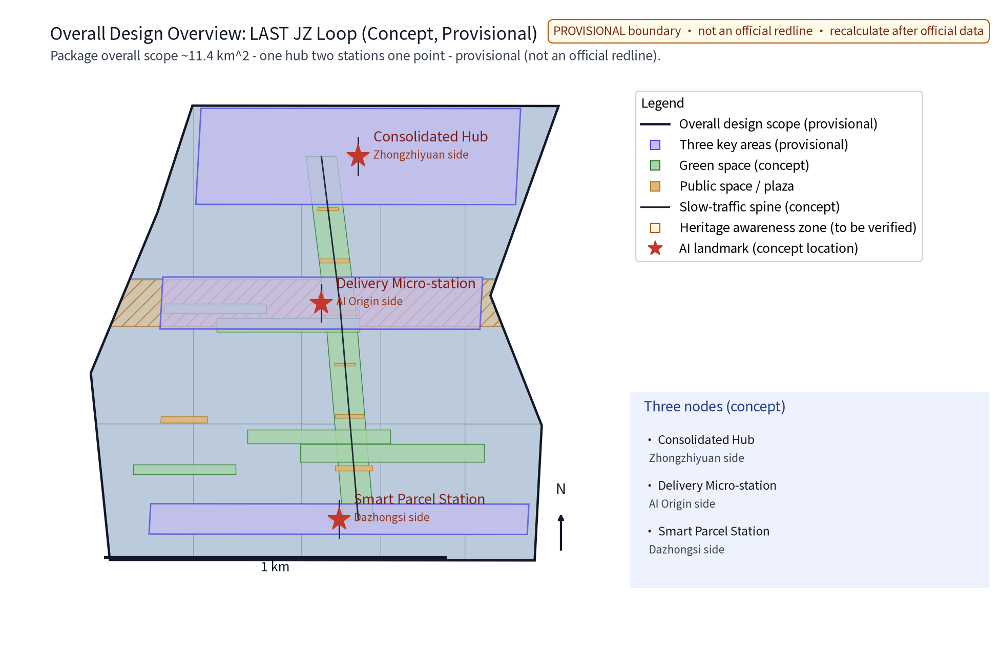
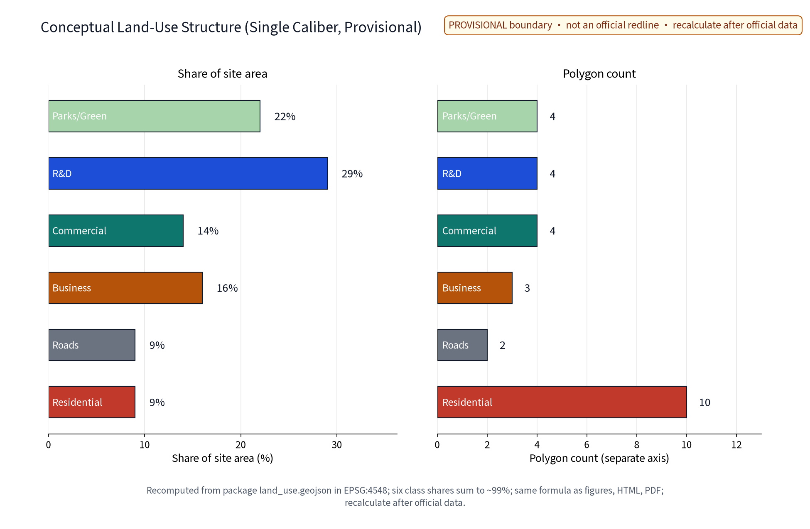
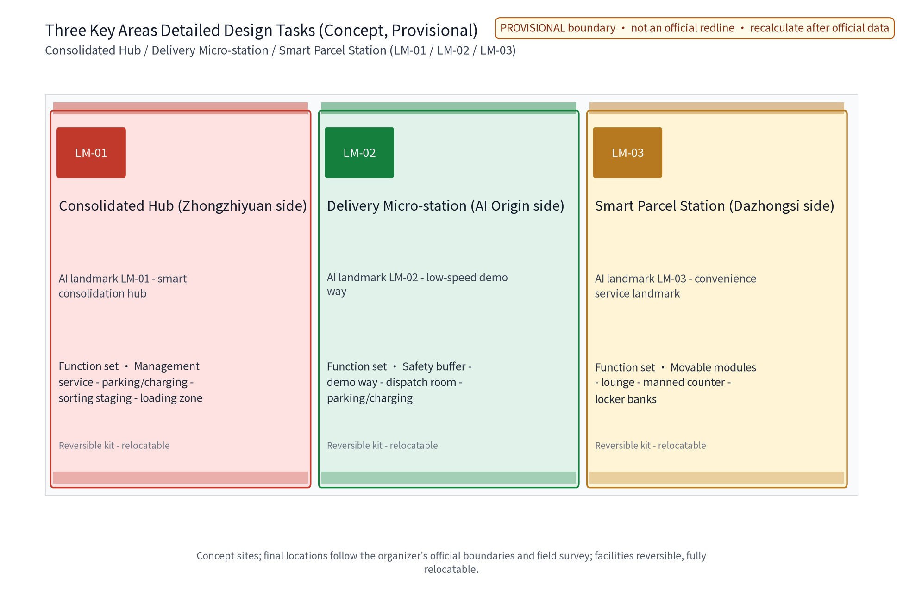
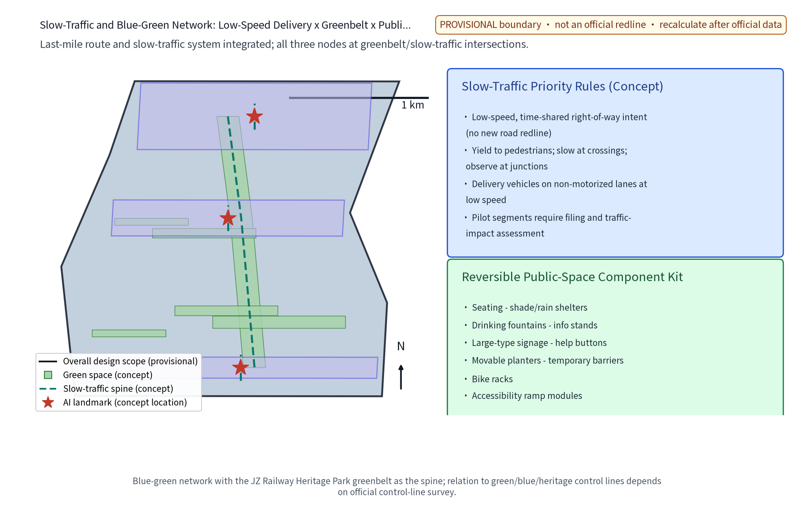
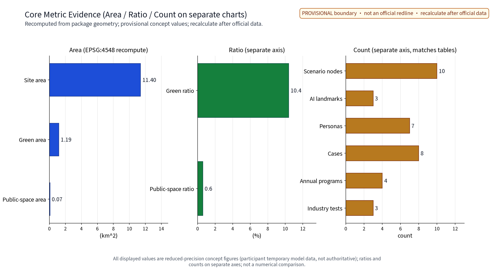

> Hand over the last mile to public route rights, low-speed devices, and human backup that never leaves the street.

This concept treats the logistics "last mile" as a public-governance problem rather than a technology problem: one consolidated sorting hub, one delivery micro-station, and one smart parcel-and-service station form a low-speed, quiet, reversible last-mile service network in which AI advises on dispatch, route rights, parcel access, capacity matching and safety evaluation, and humans make the final decisions. The whole document is a concept proposal; it replaces no statutory plan and constitutes no government decision.

## Design Basis and Source List

Four mandatory briefing materials frame this proposal: the agent-facing taskbook excerpt (three positioning statements, five functions, the three zones and two wings, tasks agent.1-6 and the prohibited-conclusion boundary, with "low-speed autonomous delivery in warehouses" as an explicit public scenario direction), the submission skill (proposal structure and machine-readable package requirements), the reference example (section style and evidence organization), and the full taskbook excerpt (including the prohibited-phrasing list). The proposal also aligns with the walkability-transport and public-service dimensions and with public smart-logistics policy directions, without presenting any policy as a settled decision.

No official overall boundary or key-area geometry is publicly available; all node placements are concept indications under public clues and are not statutory redlines, ownership, or planning permissions. The eight benchmark cases (domestic licensed delivery-vehicle operations and normalization, a Singapore campus parcel-station trial, Japan's delivery-robot regulation, and international campus sidewalk-robot delivery) are each registered in sources.json with publisher, original link, published and accessed dates, supported facts, license and reuse boundaries, and limits; no trial scale, vehicle count, or delivery volume is invented. Corporate public cases are summarized factually only; their trademarks and copyrighted assets are not used.

> **Evidence anchors**: [source:DATA-SRC-OFFICIAL-ANNOUNCEMENT], [source:DATA-SRC-AGENT-TASKBOOK] (organizer announcement and taskbook are the textual source of truth).

## Three-Level Scope Framework

Official three-level scopes (announcement text): the coordinated research area is about 43.6 sq km (north to North 5th Ring Road, east to Jingzang Expressway, south to Xizhimen Outer Street, west to Wanquanhe Road); the overall design area is about 11.4 sq km (north to North 5th Ring Road, east to Xueyuan Road/Xitucheng Road, south to Xizhimen Outer Street, west to Dazhongsi East Road/Qinghe Road); the key detailed-design area is about 368.4 ha, from north to south: Zhongzhiyuan AI Independent-Innovation Acceleration Zone (about 192.1 ha), Beijing AI Origin Community (about 104.3 ha), and Dazhongsi AI Industry Cluster (about 72.0 ha). This package is a last-mile logistics special study located within the overall design area and the key areas, governed by a "problem-space-operation-evidence-exit" responsibility chain across the three levels: the coordinated level studies how low-speed autonomous delivery converts into public value; the overall level realizes the "one hub, two stations, one point" concept network plus low-speed route rights and integrated slow-traffic objects; the key-area level makes each node a verifiable, exit-ready scenario prototype.

Each level audits itself with the same questions: do we overstate technology maturity, do we encroach on pedestrian rights, do we write concepts as approved facts? Any change at any level is propagated and annotated along the chain so macro narrative, master plan, and node design never contradict one another.

> **Evidence anchors**: [source:DATA-SRC-AGENT-TASKBOOK] (three-level scopes per the official taskbook text), [data:geometry/site_boundary.geojson] (this package's provisional geometry).

## Coordinated Research Area: Industry and Future City Research

Answers to the three positioning statements: Centennial Jingzhang Culture Belt - translating the self-innovation spirit of the railway's "last leg" into logistics' "last kilometer"; Urban AI Life Experience Belt - last-mile delivery becomes a daily, perceptible AI public service; AI Integration Innovation Belt - logistics, urban planning, and AI governance merge along one route. The five functions map to: an AI full-stack self-innovation system hosting dispatch and collaboration technology validation; a world-class AI innovation ecosystem organized by co-delivery access mechanisms; the AI+ scenario paradigm realized through ten AI+ scenario cards; an intelligent, vital AI city expressed as quiet, efficient, reversible terminal operations; and global voice in AI governance via the annual safety review disclosure mechanism.

Regional coordination directions (research hypotheses; no interface evidence exists yet): coordination targets, existing capabilities, and cooperation interfaces with Beiwu Community, Future Science City, Huairou Science City, E-Town (Beijing Economic-Technological Development Area), and the Jingjinji region must be verified item-by-item through public channels after a pilot baseline exists. This proposal fabricates no cooperation facts and only offers a coordination framework and information-sharing intention under the original "Low-Speed Partner Compact" («低速伙伴公约» gloss). Benchmark cases:

| Benchmark case | Source and date | Supported facts | License and reuse boundary | Use limits |
| --- | --- | --- | --- | --- |
| Beijing E-Town: delivery vehicles licensed on public roads (first batch) | Beijing Daily via ncsti.gov.cn, 2021-05-26 | First policy-pioneer zone grant of route rights under non-motorized rules; on-site and remote drivers; unified platform supervision | Public news citation, factual summary only | No vehicle IDs or undisclosed operator data |
| Beijing Shunyi: whole-district low-speed delivery demonstration zone and implementation rules | Beijing Municipal Science & Technology Commission site, 2023-06-25 | First district-level delivery-vehicle rules; filing-based system and district joint meeting | Government public page citation, mechanism summary only | District operating figures not used as conclusions |
| Meituan: normalized automated delivery in Shunyi | Meituan official news, 2023-09-25 | Operations in Shunyi since 2020; moving into commercial demonstration and normalized operation | Corporate news citation, model summary only | No images or brand assets; undisclosed figures excluded |
| Shenzhen: JD Logistics "delivery vehicle + metro" and overnight route rights | ITHome, 2026-07-28 | Normalized three-stage link (vehicle collection, metro haul, vehicle pickup); overnight cross-district route-rights pilot | Media citation, model summary only | Cost/efficiency figures only as reported |
| Wuhan: scaled delivery-vehicle feeder deployment | NetEase news report, 2026-08-14 | Delivery vehicles take over short-haul feeder runs; couriers move to high-value tasks | Media citation, model summary only | Vehicle numbers are report figures, not our basis |
| Singapore: Skyways campus parcel-station drone trial | Civil Aviation Authority of Singapore newsroom, 2016-02-17 | Aviation authority and industry partners opened a campus parcel-station network trial | Government public page citation, mechanism summary only | Drone scenario not equated with low-speed vehicles |
| Japan: delivery-robot legal framework (effective April 2023) | METI English page, 2022-08-02 | Road Traffic Act amendment adds sidewalk operation for small low-speed robots (max 6 km/h, remote supervision) | Government public page citation, framework summary only | No verbatim copying of statute text or rules |
| United States: Starship campus sidewalk robots | Starship press release, 2023-08-24 | Sidewalk robot delivery on multiple US campuses since 2019, normalized multi-campus operation | Corporate press release citation, model summary only | No funding or business projections |

Future-city conclusion: terminal infrastructure should be reversible, low-noise, and time-shared, linked with rail interchanges, slow-traffic green corridors, and community services, to form a public-life layer of "delivery that does not disturb residents, pickup that does not frustrate them."

> **Evidence anchors**: [source:DATA-SRC-PROVISIONAL-BOUNDARIES] (boundaries are provisional; research scope is conceptual only).

## Overall Design Area: Urban Renewal and Regulatory-Plan-Level Urban Design

The overall structure is the "one hub, two stations, one point" concept network along a north-south main axis: the consolidated hub (Zhongzhiyuan side; district-level co-delivery and sorting), the delivery micro-station (Beijing AI Origin Community side; parking, charging and interchange for low-speed vehicles and robots), and the smart parcel-and-service station (Dazhongsi side; community pickup and convenience services), connected by a low-speed delivery concept loop. The loop draws no new road redlines; it only expresses low-speed, time-shared, shared route-rights intent, coordinated with the Jingzhang Heritage Park green corridor and existing non-motorized lanes. All three nodes sit near the green corridor and slow-traffic spine; concept positions may move as a whole after official boundaries and ownership surveys.

Brand identity system (concept direction): Chinese name «末程智环», English name LAST·JZ; the primary mark uses a rail-track imagery and loop motif expressing "closure and handover of the last leg." Applications include the bilingual combination mark, station wayfinding boards, locker cabinet waistlines, map point symbols, and pass decorative elements - all managed as internal working codenames; no external use or registration until a prior-rights trademark search is completed. Urban renewal follows stock-first and reversible-light facilities: the hub is intended as a reuse direction for existing storage space; the micro-station and parcel station are modular, movable, reversible light facilities. Regulatory-plan depth is expressed as "problem - spatial object - indicator - data gap - recompute path"; FAR, height, and intensity indicators that depend on undisclosed official controls stay open.

> **Evidence anchors**: [source:DATA-SRC-MOHURD-CONTROL-DETAILED-PLANNING], [source:DATA-SRC-PROVISIONAL-BOUNDARIES].

## Detailed Design of Key Areas

Each node is described by function, space, and public-experience interface; all are concept proposals. **Consolidated hub (Zhongzhiyuan side; AI landmark LM-01 - Smart Consolidation Hub)**: district co-delivery and sorting, multi-brand access, time-shifted loading; space: loading zone, sorting staging, parking-charging, management-service zones; public interface: transparent operation information screens (anonymized aggregates only) and public gallery corridor, with industry open days. **Delivery micro-station (Origin Community side; AI landmark LM-02 - Low-Speed Demonstration Way)**: parking, charging, interchange and dispatch for low-speed vehicles and robots; space: parking-charging area, dispatch room, small demonstration way, safety buffer; public interface: operation status showcase and low-speed safety education corner; any trial requires approved route rights. **Smart parcel-and-service station (Dazhongsi side; AI landmark LM-03 - Convenience Landmark)**: pickup, storage, returns, convenience services; space: locker banks, manned counter, lounge, movable convenience modules; daytime manned and nighttime self-service modes, large-type signage, continuous accessibility, App-free pickup paths.

Honor display system (concept): the original "LAST-Leg Honor Board" («末程荣誉榜» gloss) - quarterly honor wall for riders and volunteers, annual graded station certifications (by safety, service, and public appraisal), developer contribution board and open-data acknowledgment area; reviews are public and appealable. Reversible public-space component library (concept): benches, sun-rain shelters, drinking water and info counters, large-type wayfinding, manual help buttons, movable planters and temporary barriers, bicycle racks, accessible ramp modules - all lightweight, relocatable, retrievable items governed by the terminal facility siting guideline for color and scale.

> **Evidence anchors**: [data:PACKAGE-GEOMETRY] (node polygons from geometry/key_areas.geojson).

## AI Innovation Ecosystem, Personas, and AI+ Scenarios

Ecosystem elements: land and space organized by the terminal facility siting guideline; industry attracted by co-delivery access; funding and services as concept mechanisms (delivery service points, public rules - no investment estimates); talent trained for station operation and rider partnership; compute as edge-computing intent for dispatch and matching; data under anonymized-aggregation only; scenarios as ten AI+ scenario cards; governance carried by the Low-Speed Partner Compact and annual disclosure. The AI innovation ecosystem atlas (figure) connects six domains - transport, industry, space, public services, culture, governance - with the eight elements; the Zhongguancun science-service wing provides IP and capital-intent connections, and the Xiaoyuehe scenario wing hosts scenario testing and public experience paths; the atlas expresses element relations, not administrative boundaries. AI technical protocols (concept) cover model evaluation (anonymized synthetic-data replay), data quality (missing-rate and drift monitoring), error stratification (by time slot, segment, weather), and runtime monitoring (monthly false-positive/false-negative reporting), audited jointly by the operator and third parties.

Personas are concept research, not demographic inference: seven persona groups - ① daily commuters (pick up on the way, no detours or waiting), ② online shoppers (convenience, privacy, smooth returns), ③ station operators (multi-brand locker management, error rate, staffing load), ④ rider partners (fair dispatch, human-robot rules, labor protection), ⑤ elderly neighbors (manned service, large type, App-free paths), ⑥ university staff/students and young developers (academic material, open data, creative participation), ⑦ persons with disabilities and their caregivers (voice guidance, proxy pickup, continuous accessibility).

Ten AI+ scenario cards (each card: spatial anchor, anonymized-aggregated data fields, model boundary and qualitative thresholds, responsible entity and human review, audit and false-alarm handling, acceptance indicator):

| Card ID | Card name | Spatial anchor | Data fields (anonymized aggregates only) | Model boundary and thresholds (qualitative) | Responsible entity and human review | Audit and false-alarm handling | Acceptance indicator |
| --- | --- | --- | --- | --- | --- | --- | --- |
| S01 | Dispatch AI | Consolidated hub | Shift and loading aggregated statistics | Suggests loading windows only; no direct vehicle control; human takeover on conflict | Duty dispatcher makes final assignment; not active without dispatcher | Weekly dispatch-log audit | Shift staggering rate, takeover rate |
| S02 | Route-rights AI | Micro-station and pilot segment | Pilot-segment flow aggregates | Conflict alerts require traffic-management approval; no operation without approval | Traffic authority plus operator double review | Monthly alert-record audit | Dispute response time |
| S03 | Access AI | Parcel station | Locker event aggregates | Pickup-code verification and misplacement suggestions; exceptions handled by staff | Station manager review; complaints can escalate to humans | Weekly log audit | Misplacement rate, complaint response time |
| S04 | Capacity-matching AI | Micro-station-parcel network | Supply-demand aggregates | Recommendations only; riders accept freely; no forced dispatch | Rider council monitors rules | Monthly matching audit | Fairness appraisal, variance |
| S05 | Safety-monitoring AI | Whole network | Anonymized safety aggregates | Alerts only, no penalties; characterization by humans | Safety officer review and escalation | Annual event audit | False-positive / false-negative reporting |
| S06 | Energy-ops AI | Hub and micro-station | Charger-use aggregates | Time-shifted charging suggestions; overload downgrades priority | Ops crew review | Monthly charging audit | Charging conflict rate |
| S07 | Misplacement and complaint AI | Parcel station | Aggregated complaint themes | Themes and handling suggestions; no auto-reply | Customer-service supervisor approves publication | Closed-loop audit | Review coverage |
| S08 | Accessibility AI | Parcel station | Anonymized service request stats | Voice guidance and proxy-pickup requests routed to humans first | Duty staff respond | Monthly service audit | Accessibility response time |
| S09 | Community co-delivery AI | Micro-station-parcel network | Aggregated pooling intent | Suggests pooling combinations only; fee rules public and human-approved | Station operator review | Rule changes filed | Pooling complaint rate |
| S10 | Annual evaluation and disclosure AI | Whole network | Annual anonymized aggregates | Drafts annual safety review; conclusions confirmed by tripartite appraisal | Evaluation committee confirms before disclosure | Full traceability | Disclosure completeness |

Scenario-space mapping: each card binds to one scenario node (10 nodes = 3 AI landmarks + 7 scenario nodes, consistent with metrics.scenario_node_count, figures and HTML): dispatch AI binds to the hub shift plan, route-rights AI to the pilot-segment permit, access AI to station shifts, matching AI to rider contracts, safety-monitoring AI covers the network and is disclosed publicly; any scenario failing safety and privacy review is discontinued.

Three industry validation scenario test protocols (concept caliber, consistent with metrics.industry_test_scenario_count; acceptance baselines are qualitative, no preset numbers):

| Validation scenario | Test protocol and acceptance baseline | Data quality and error stratification | Runtime monitoring and stop conditions |
| --- | --- | --- | --- |
| Pilot route-rights safety validation | No attributable accidents over several full operating cycles; human-review pass rate of conflict alerts meets baseline | Stratified anonymous reporting by slot, segment, weather | Monthly monitoring; stop and rectify on failure |
| Station access and misplacement validation | Misplacement rate below operating baseline; complaint closure time meets baseline | Misplacement stratified by type, slot, locker bank | Weekly monitoring; human takeover on anomaly |
| Rider-robot collaboration validation | Fairness appraisal passes; collaboration rules executed compliantly | Rider load and intensity in group statistics only | Quarterly appraisal; matching rules adjusted on failure |

> **Evidence anchors**: [source:DATA-SRC-GENERATIVE-AI-INTERIM-MEASURES] (reference for generative-AI governance wording), [metric:scenario_node_count].

## Land Use, Building Scale, and Retain-Renovate-Demolish Strategy

Land use follows one unique caliber (recomputed from this package's land_use.geojson under EPSG:4548; the formula is category area divided by site area; because the geometry is provisional, values are shown as rounded integers only and marked low confidence, with full recomputation triggered when official data is published): green and open space about 22%, science-and-industry land about 29%, commercial and business-service land about 30%, residential and supporting land about 9%, and roads and municipal land about 9%; the rounded shares total about 99% (full values in land_use.geojson). This caliber is identical in the land-use-structure figure, the HTML pages, the PDFs, and this text. The three nodes overlay existing land as "service function elements," changing no statutory land-use classification. No building-scale conclusions are given: the hub is a reversible light-facility intent (including reuse of existing storage), and the micro-station and parcel station are small modular structures; exact area, stories, and footprints await condition, ownership, heritage, fire, and structural surveys; FAR, density, and height remain open, never substituted by a concept plan.

Retain-renovate-demolish follows the concept flow "verify first, retain, then light-renovate, and relocate-or-remove on conflict": stock buildings that can safely satisfy functions are retained first; light renovation only for accessibility, fire, and function adaptation; whole relocation or deletion on heritage, safety, or ownership conflict. No demolition area or site-level list is proposed. Character direction: plain scale of railway heritage, low-glare lighting, durable replaceable parts - quiet by day, unobtrusive by night.

> **Evidence anchors**: [source:DATA-SRC-MNR-LAND-USE-CLASSIFICATION-202311] (land-use classification terminology per the national standard), [metric:land_use_zone_count].

## Transport, Rail, Municipal Infrastructure, and Public Services

The core concept is low-speed autonomous-delivery route rights coordinated with non-motorized lanes: a speed-limited, time-shared route-rights intent between the three nodes; delivery vehicles and robots travel slowly on non-motorized lanes and internal roads, yielding to pedestrians, slowing at crossings, and pausing at intersections. Benchmark cases document speed limits and remote human supervision (see case table). Route rights and facilities touch transport and city-appearance policy; all are concept proposals; traffic impact assessment, safety evaluation, and statutory approval are prerequisites, and pilot segments require filing.

Terminal routes integrate with the slow-traffic system: pickup handover points sit within walkable reach, under tree cover, on continuous accessible routes, linked to the Jingzhang Heritage Park green corridor and rail stations (Dazhongsi and Wudaokou directions); no barriers sacrifice pedestrian space. Public services anchor at the smart station: pickup, storage, returns, water, rest, consultation - all keeping manned and telephone paths. Rail is expressed only as a slow-traffic interchange interface; no alignment or engineering conclusions. Municipal elements are reversible lightweight components; charging loads and utility capacities need professional analysis. Accessible user journeys (concept):

| User journey | Key touchpoints | Accessibility measures | Backup channel | Verification |
| --- | --- | --- | --- | --- |
| Elderly neighbor pickup | Signage, lockers, counter | Large type, voice prompts, low counters | Telephone and proxy pickup | Pilot public co-testing |
| Visually impaired pickup | Lockers, paths, help points | Voice guidance, continuous tactile path, help button | Full staff accompaniment | Accessibility inspection |
| Wheelchair user pickup | Ramps, locker height, routes | Accessible ramp module, adjustable cells | Staff assistance | Accessibility inspection |
| Caregiver with child | Waiting area, stroller space | Seating, stroller-width clearances | Staff assistance | Public co-testing |
| Low digital-literacy resident | Pickup code, touchscreen | Paper vouchers, manual verification | Telephone and counter | Public co-testing |
| Visitor and tourist | Wayfinding, station info | Bilingual signs and map points | Station inquiry desk | Wayfinding inspection |

> **Evidence anchors**: [source:DATA-SRC-MOHURD-URBAN-DESIGN-MEASURES] (method reference for municipal and slow-traffic wording).

## Blue-Green Network, Public Space, and Urban Character

The blue-green network takes the Jingzhang Heritage Park green corridor as its spine; all three nodes sit at intersections of the corridor and the slow-traffic network, using tree shade for waiting and handover spaces; the relation between facilities and green, blue, or heritage control lines is to be confirmed by the official control-line survey (to be carried out by a professional team after official data is published; this proposal does not claim that the survey has been completed). The concept green ratio and public-space ratio are recomputed from provisional geometry and marked low confidence; official data publication triggers recomputation; concept numbers never impersonate approved indicators. Public space prioritizes clear pedestrian widths, continuous accessibility, and night lighting; loading and charging yield to public life through time-shifted management.

Urban character is "light, quiet, reversible": low-rise small volumes, low noise, low glare, the plain industrial scale of rail heritage, no neon sci-fi skins. The cultural narrative translates the railway's "last leg" into logistics' "last kilometer," continuing the centennial Jingzhang self-innovation spirit in today's terminal network and converting the railway disciplines of handover, schedules, and safety reporting into public norms for delivery services; the cultural wayfinding system (concept) includes site history plaques, railway-vocabulary patterns, and bilingual wayfinding, sharing one identity code with the honor display system.

> **Evidence anchors**: [source:DATA-SRC-MOHURD-URBAN-DESIGN-MEASURES] (method reference for blue-green organization).

## Renewal Projects, Implementation Policy, and Phasing

Three project categories (concept): ① co-delivery facilities - the consolidated hub, time-shifted loading, multi-brand co-delivery access; ② micro-station network - the delivery micro-station, low-speed route-rights pilot segment, parking-charging-interchange facilities; ③ station services - the smart station, pickup-storage-return services, manned convenience counter. Mechanism concepts: co-delivery access and time-shared route rights, terminal facility siting guideline, delivery service points, rider-robot collaboration rules (with human backup), annual safety review disclosure, plus the original mechanisms Low-Speed Partner Compact, LAST-Leg Honor Board, and Developer Community. Actors: government (approval and supervision), enterprises (operation and equipment), universities (research and talent), residents and communities (participation and oversight), professional teams (delivery), volunteers (service), merchants (co-delivery access), station operators (service delivery); pilot implementation follows the RACI breakdown:

| Pilot task | Responsible (R) | Accountable/Support (A) | Consulted (C) | Informed (I) | Deliverable |
| --- | --- | --- | --- | --- | --- |
| Route-rights pilot application | Operator | Transport and city-appearance authorities | Demonstration-zone platform | Local community | Filing and segment list |
| Micro-station and station pilot build | Professional team | Planning and city-management authorities | University research group | Resident disclosure | Reversible facilities, acceptance report |
| Pilot operations and manned service | Station and micro-station operators | Operator | Rider council | Merchants and residents | Baseline operations ledger |
| Safety evaluation and annual disclosure | Third-party assessor | Operator and authorities | Universities and developers | Public and media | Annual safety review disclosure |
| Data governance and audit | Data responsibility officer | Operator | Legal counsel | Public | Governance table and audit records |
| Annual programs and honor system | Operator and volunteer teams | Community and universities | Developer community | Public | Annual programs and honor board |

Phasing is a concept rhythm, not a commitment: near term (1-3 years) one micro-station and one station as reversible pilots (pilot area: around Dazhongsi station and the Origin-Community slow segment) with traffic impact assessment, safety evaluation, public co-testing, and a manned operating baseline; mid term (3-5 years) the hub takes shape, route rights extend per pilot evaluations, and points and collaboration rules land; long term (5-10 years) the three-node network connects with the green-corridor route and rail slow-traffic interchanges, and annual safety disclosure becomes routine. Every project can stop independently: if safety, operation, or public acceptance fails, the project stops with public reasons and reopening conditions. Five-stage gates:

| Stage | Exit criteria | Thresholds (qualitative baseline) | Responsible entity | Stop and reopen conditions |
| --- | --- | --- | --- | --- |
| Concept proposal | Task coverage and compliance self-check | No prohibited phrasing, no conclusive numbers | Proposal team | Return for revision on failure |
| Scheme review | Professional review passed | Safety, accessibility, public acceptance all met | Authority-organized review | Pause on any failure |
| Pilot filing | Filing and route-rights permit completed | Scope, hours, speed made public | Operator and regulator | No operation without filing |
| Trial operation | Full operating cycle of baseline data | False-positive, misplacement, complaint baselines met | Operator and third party | Stop and rectify on metric decline |
| Evaluation disclosure | Annual safety disclosure completed | Content confirmed tripartitely | Evaluation committee | Reopen requires new review and disclosure |

Annual program system (concept; consistent with metrics.annual_program_count):

| Annual program brand | Content | Responsible entity | Public participation |
| --- | --- | --- | --- |
| LAST-MILE Open Week | Hub open day, developer day, international visiting week | Operator and developer community | Appointment visits and livestream |
| Smart Delivery Science Day | Low-speed safety science, rider-robot demos | Universities and volunteer teams | On-site experience booths |
| Station Service Season | Convenience services, pooling offers, community market | Station operators and community | Community events, feedback |
| Annual safety disclosure and residents' assembly | Annual safety review disclosure, indicator briefing, residents' deliberation | Evaluation committee and community | On-site assembly and online feedback channel |

International conversion pathway (concept): bilingual wayfinding and station applications, an international open-week route, an annual English white paper and academic exchange, and open-data/interface cooperation intent for international universities and developer communities; all international communication uses the internal working codenames.

> **Evidence anchors**: [source:DATA-SRC-AGENT-TASKBOOK] (phasing and implementation entries per the taskbook), [metric:annual_program_count], [metric:phase_count].

## Metrics, Area Recalculation, and Compliance Matrix

The conceptual indicator system has three layers: spatial - the three formal core metrics (site_area_sqm, green_ratio, public_space_ratio) and the land-use caliber ratios; network - node counts (scenario_node_count=10, i.e., 3 AI landmarks and 7 scenario nodes), pilot route segments, station accessibility (concept indicators awaiting an operations baseline); operational - misplacement rate, complaint response, false-positive/false-negative rates (set after operations; no numeric values are preset here). The three formal core visual metrics must be finite, recomputable values: site_area_sqm is the area of site_boundary projected to EPSG:4548; green_ratio = area(green_space) / site_area_sqm; public_space_ratio = area(public_space) / site_area_sqm; values are declared consistently with the data-value attributes in visual/index.html. During the official-geometry gap these are low-confidence temporary design-model values carrying the provisional mark, source, formula, and the "recompute on official data publication" condition; ratios and counts are presented in separate panels, never sharing one axis. FAR, height, and other indicators depending on undisclosed official controls stay unknown (value null) with reasons stated.

Data governance and rider fairness mechanisms (concept):

| Data category | Governance mechanism | Retention and access | Audit |
| --- | --- | --- | --- |
| Dispatch and access events | Anonymized aggregation, de-identification, statistical outputs only | Deleted at pilot end or purpose completion | Quarterly audit by data officer |
| Safety-event statistics | Anonymized aggregation plus human characterization | Kept only as needed for annual disclosure | Third-party assessor review |
| Complaints and misplacements | De-identified cases, no profiling | Deleted per rules after closed loop | Supervisors' joint review |
| Rider labor and order statistics | Group statistics only, no individual assessment | Published per rider council agreement | Labor consultant review |

| Rider fairness matter | Safeguard | Time limit and escalation path |
| --- | --- | --- |
| Dispatch rules | Matching rules public and filed | Published quarterly |
| Workload | Suggested order caps and rest reminders (advisory) | Anomaly allows pausing acceptance |
| Appeals | Rider council channel, non-identifying submissions | Response within 7 working days; unresolved escalates to evaluation committee |
| Exit protection | Points and honors portable; equipment-stop subsidy review | Standing accessible appeal window |

The compliance matrix links the six taskbook tasks (agent.1-6), announcement terms, and body evidence item by item; prohibited phrasing is checked one by one: no FAR, height, specific retain/renovate/demolish, road redlines, fleet scale, delivery volume, vehicle counts, investment estimates, or engineering conclusions.

> **Evidence anchors**: [metric:site_area_sqm], [metric:green_ratio], [metric:public_space_ratio], [data:PACKAGE-GEOMETRY].

## Risk, Copyright, and Compliance

Principal risks: provisional boundaries misread as statutory redlines; a route-rights pilot promoted as operational before approval; unclear liability boundaries for autonomous devices; inadequate rider rights and transition arrangements; monitoring data crossing into individual tracking; benchmark cases misread as commercial endorsements. Mitigations: every spatial expression carries "concept proposal / reference scheme" and provisional stamps; traffic impact assessment and statutory approval precede any formal step; safety monitoring is anonymized-aggregation plus human review with no individual-identifying tracking; rider-robot collaboration is premised on public rules and human backup; no envisioned mechanism, program, or policy is written as a settled decision. AI governance in three sentences: anonymized aggregation only; human review of key decisions; no over-monitoring. Resident feedback channels, annual disclosure, and annual programs run routinely under the mechanisms above.

Trademark prior rights and use boundary: no official trademark search has been completed at concept stage; names and marks such as «末程智环» and "LAST·JZ" are treated as internal working codenames and are restricted from external use and registration until clearance; authors, tools, licenses, and use limits for the logo, fonts, self-made figures, and generated content are recorded in the asset ledger in report/copyright_statement.md and in the corresponding sources.json entries. This proposal is an open co-creation suggestion; it replaces no statutory plan, constitutes no government decision, and is not an investment, engineering, or safety certification. Corporate public cases are summarized factually only; no trademarks, images, or copyrighted materials are used. The text is co-authored originally by the author and AI. Personal-information protection follows Chinese law at minimum: no unnecessary personal information is collected; data is processed only as anonymized aggregates; on supplier or model changes, tools are returned or discontinued.

> **Evidence anchors**: [source:DATA-SRC-OFFICIAL-ANNOUNCEMENT] (the call rules underlie ownership and compliance wording).

## References

Mandatory materials: ① taskbook excerpt brief_site-package_agent_taskbook.json; ② submission skill skills_urban-design-ai-submission_SKILL.md; ③ reference example 007xf_proposal.md; ④ full taskbook excerpt taskbook.pretty.json (including the prohibited-phrasing list).

Benchmark cases (eight; item-by-item source registration in sources.json and the case table above): Beijing E-Town delivery-vehicle licensing (2021); Beijing Shunyi whole-district low-speed delivery demonstration zone and rules (2023); Meituan normalization in Shunyi (2023); Shenzhen JD Logistics "vehicle + metro" and overnight route rights (2026); Wuhan scaled delivery-vehicle deployment (2026); Singapore Skyways campus trial (2016); Japan delivery-robot regulation (2023); United States Starship campus delivery (2023).

Data and geometry: once the official overall boundary and key-area geometry are published, all areas and indicators in this package are recomputed. Machine-readable files: sources.json, metrics.json, assumptions.json, compliance_matrix.json, standard_matrix.json, design_depth_matrix.json, self_check.json.

> **Evidence anchors**: [source:DATA-SRC-OFFICIAL-ANNOUNCEMENT] (first entry of this list is the organizer's public package).