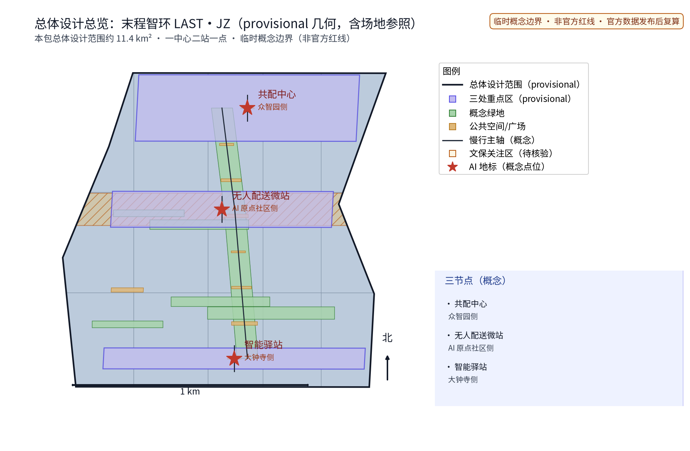
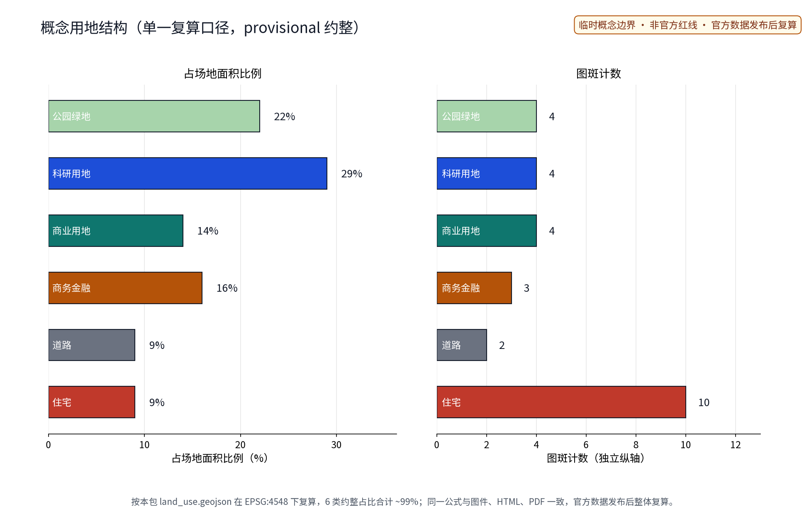
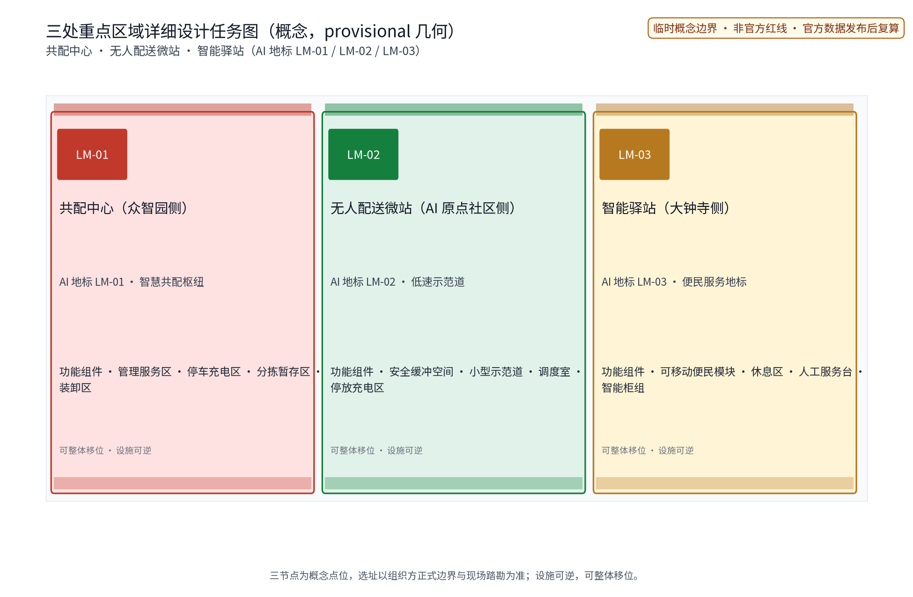
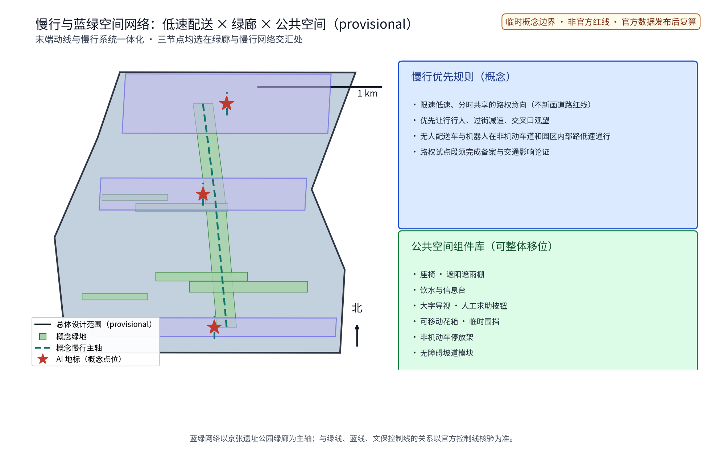
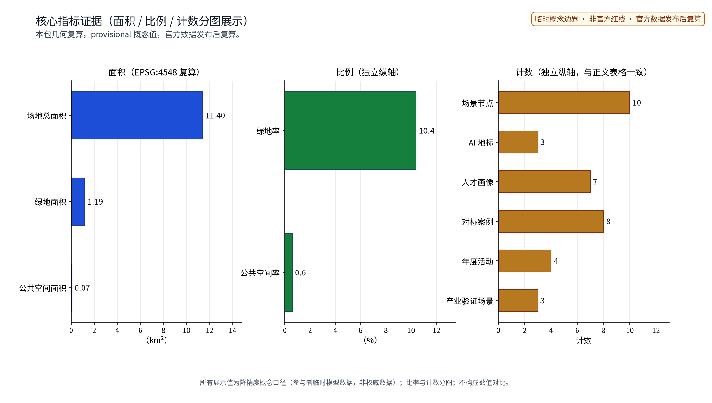

> 最后一程，交给公共路权、低速设备和永远在场的人工兜底。

本方案把物流"最后一公里"理解为城市的公共治理问题而非单一技术问题：以一座共配中心、一座无人配送微站和一座智能驿站织成一张低速、安静、可逆的末程服务网络，让 AI 做调度、路权、存取、撮合与安全评估的建议者，让人做最终判断者。全文为概念建议，不替代任何法定规划，不构成政府审定结论。

## 设计依据与资料清单

本方案依据四份必读材料撰写：面向智能体任务书摘录（三大定位、五大功能、三区两翼、agent.1—6 任务与禁止性结论边界，其中"仓库低速无人配送"为明确公开场景方向）、投稿技能（提案结构与机器可读投稿包要求）、参考样例（章节风格与证据组织）与任务书全文摘录（含禁止性表述清单）。方案同时衔接交通慢行、公共服务设施维度与智慧物流公开政策方向，但不对任何政策作已确定事项的表述。

当前公开资料未见官方总体边界与三处重点区几何；本方案三节点落位为公开线索下的概念示意，不构成法定红线、权属或规划许可。八个对标案例（国内无人配送持证上路与常态化运营实践、新加坡高校包裹站点试点、日本配送机器人法规、国际校园侧道机器人配送）均按公开渠道逐项登记发布者、原始链接、发布与获取时间、可支持事实、许可与复用边界及限制，细节以 sources.json 为准，不编造试点规模、车辆数量与配送量。企业公开案例仅作事实性概述，不使用其商标与版权素材。

> **证据锚点**：[source:DATA-SRC-OFFICIAL-ANNOUNCEMENT]、[source:DATA-SRC-AGENT-TASKBOOK]（组织方公告与任务书为文本口径依据）。

## 三层范围工作框架

官方三层范围（公告口径，文本表述）：统筹研究范围约43.6平方公里，北至北五环路、东至京藏高速、南至西直门外大街、西至万泉河路；总体设计范围约11.4平方公里，北至北五环路、东至学院路与西土城路、南至西直门外大街、西至大钟寺东路与荷清路；重点区域范围约368.4公顷，自北向南为众智园AI自主创新加速区（约192.1公顷）、北京AI原点社区（约104.3公顷）、大钟寺AI产业集聚区（约72.0公顷）。本方案为末端物流专项，定位在总体设计范围与重点区域之内，以"问题—空间—运营—证据—退出"责任链贯通三层：统筹层研究末端物流与低速无人配送产业如何转化为公共价值，回答"AI 配送带应该留下什么"；总图层把结论落实为「一中心二站一点」概念网络与低速路权、慢行一体化空间对象；重点区层将三节点各做成一枚可验证、可退出的场景原型。

每一层自检同一组问题：是否高估技术成熟度、是否侵占行人权益、是否把概念写成已批准事项。任何一层的内容调整沿责任链回传并标注，避免宏观叙事、总图与节点设计各说各话。

> **证据锚点**：[source:DATA-SRC-AGENT-TASKBOOK]（三层范围划分依据任务书官方文本口径）、[data:geometry/site_boundary.geojson]（本包 provisional 几何）。

## 统筹研究范围产业与未来城市研究

三大定位在本主题下的回答：百年京张文化带——把铁路"最后一程"的自主创新精神转译给物流"最后一公里"；都市AI生活体验带——末端配送成为每天可感知的AI公共服务；AI融合创新带——物流、城市规划与AI治理在一条动线上融合。五大功能对应：AI全栈自主创新体系承接配送调度与协同技术验证；世界级AI创新生态由共配准入机制组织；AI+场景赋能新范式落实为十张AI+场景卡；智能化AI活力城市体现为安静、高效、可逆的末端运行；AI治理全球话语权落在年度安全评估公示机制。

区域协同方向（待研究假设，尚无接口证据）：与北纬社区、未来科学城、怀柔科学城、经开区（亦庄）及京津冀地区的协同对象、现有能力和合作接口，需在试点基线建立后按公开渠道逐一核实，本方案不虚构合作事实，仅提出「低速伙伴公约」所承载的协同框架与信息共享意向。国际与国内案例研究见下表（八项，逐项来源登记见 sources.json）：

| 对标案例 | 来源与时间 | 可支持事实 | 许可与复用边界 | 使用限制 |
| --- | --- | --- | --- | --- |
| 北京亦庄·无人配送车持证上路（政策先行区首批发牌） | 北京日报，ncsti.gov.cn 转载，2021-05-26 | 首次按非机动车规则给予无人配送车路权，要求现场与远程驾驶人、平台统一监管 | 新闻页面公开信息引用，仅事实概述 | 不引用其车辆编号、企业未公开运营数据 |
| 北京顺义·全域低速无人配送应用示范区与配套实施细则 | 北京市科委、中关村管委会官网，2023-06-25 | 全市首个区级无人配送细则；备案制、区级联席会议机制 | 政府公开页面引用，仅制度机制概述 | 不以园区运营数字作本方案结论 |
| 美团·顺义自动配送常态化运营 | 美团官网新闻，2023-09-25 | 2020年起在顺义落地，逐步进入商业示范与常态化运营阶段 | 企业新闻引用，仅运营模式概述 | 不使用其图片与品牌素材，不引未披露数字 |
| 深圳·京东物流「无人车＋地铁」同城配送与夜间路权 | IT之家，2026-07-28 | 无人车集货、轨道接驳、无人车接驳三段的常态化链路；夜间跨区路权试点 | 媒体报道引用，仅模式概述 | 企业成本与效率数字仅作公开报道转述 |
| 武汉·无人配送车园区接驳规模化投放 | 网易新闻报道，2026-08-14 | 多个区投入无人配送车承接短途接驳，快递员转向高价值环节 | 媒体报道引用，仅模式概述 | 车辆数量为报道口径，不作本方案依据 |
| 新加坡·Skyways 校园包裹站点无人机试点 | 新加坡民航局官网新闻，2016-02-17 | 民航局与企业在高校建立包裹站点网络试点，多部门合作推进 | 政府公开页面引用，仅试点机制概述 | 无人机场景与低速车场景不直接等同 |
| 日本·配送机器人法规框架（2023年4月施行） | 日本经济产业省英文页面，2022-08-02 | 修订道路交通法新增低速小型配送机器人步道通行制度，限速6公里/小时并需远程监管 | 政府公开页面引用，仅制度概述 | 不直接复制其法条文本与规则细节 |
| 美国·Starship 校园侧道配送机器人 | Starship 官网新闻稿，2023-08-24 | 2019年起在美国多所高校开展侧道机器人配送，多校园常态化运营 | 企业新闻稿引用，仅运营模式概述 | 不引用其融资与经营预测 |

未来城市研究结论：末程设施应可逆、低噪声、分时共享，与轨道接驳、慢行绿廊和社区服务联动，形成"配送不扰民、取件不折腾"的公共生活层。

> **证据锚点**：[source:DATA-SRC-PROVISIONAL-BOUNDARIES]（边界为 provisional，研究范围仅作概念示意）。

## 总体设计范围城市更新与控规深度城市设计

总体结构为沿南北主轴展开的「一中心二站一点」概念网络：共配中心（众智园侧，园区级共同配送与分拣）、无人配送微站（AI原点社区侧，车辆与机器人停放充电接驳）、智能驿站（大钟寺侧，社区末端取送与便民服务），由一条低速配送概念环线串联。环线不新画道路红线，仅表达低速、分时、共享的路权意向，与京张遗址公园绿廊、既有非机动车道协同；三节点均布置在临绿廊、近慢行主轴的位置，概念点位可在官方边界与权属调查后整体移位。

品牌识别系统（概念方向）：中文名"末程智环"，英文名 LAST·JZ，主标识以铁轨意象与环形回路为母题，强调"最后一程的闭环与交接"；应用包括双语组合标识、站点导视牌、智能柜组腰线、地图点位符号与通行证装饰元素，全部按内部工作代号管理，在完成商标在先权利检索前不对外注册或商业使用。城市更新路径以存量优先与可逆轻量设施为原则：共配中心意向为存量仓储空间的改造利用方向，微站与驿站意向为模块化、可移动、可逆安装的轻量设施；控规深度采用"问题—空间对象—指标—资料缺口—复算路径"表达，容积率、建筑高度、建筑强度等依赖官方控制条件的指标保持待定。

> **证据锚点**：[source:DATA-SRC-MOHURD-CONTROL-DETAILED-PLANNING]、[source:DATA-SRC-PROVISIONAL-BOUNDARIES]。

## 重点区域详细设计

三节点分别从功能、空间与公共体验界面三方面描述，均为概念建议。**共配中心（众智园侧，AI地标LM-01·智慧共配枢纽）**：园区级共同配送与分拣，多品牌共配、分时段装卸；空间由装卸区、分拣暂存区、停车充电区与管理服务区组成；公共体验界面设置透明化运行信息屏（仅展示匿名聚合数据）与参观走廊，举办行业开放日。**无人配送微站（AI原点社区侧，AI地标LM-02·低速示范道）**：低速无人配送车与机器人的停放、充电、接驳换装与调度；空间由停放充电区、调度室、小型示范道与安全缓冲空间组成；设置运行状态展示窗与低速安全科普角，任何试运行须取得相应路权许可后开展。**智能驿站（大钟寺侧，AI地标LM-03·便民服务地标）**：取件寄存、退换代寄与便民服务；空间由智能柜组、人工服务台、休息区与可移动便民模块组成；白昼人工服务与夜间自助双模式，大字标识、无障碍连续与不依赖App的取件路径。

荣誉展示体系（概念）：设立「末程荣誉榜」，包括骑手与志愿者季度荣誉墙、驿站点位年度授牌（按安全、服务、公众评议分级）、开发者贡献榜与开放数据使用致谢区，评审公开、可申诉。公共空间组件库（概念）：座椅、遮阳遮雨棚、饮水与信息台、大字导视、人工求助按钮、可移动花箱与临时围挡、非机动车停放架、无障碍坡道模块，全部为可整体移位与撤收的轻量件，按「末端设施设置导则」控制色彩与尺度。

> **证据锚点**：[data:PACKAGE-GEOMETRY]（三节点示意多边形来自本包 geometry/key_areas.geojson）。

## AI 创新生态、人才画像与 AI+ 场景

生态八要素落点：土地与空间由末端设施设置导则组织，产业由共配准入吸引多元运力，资金与服务以配送服务积分和公开规则为概念机制（不给投资测算），人才面向驿站运营与骑手合伙人培训，算力支持调度与撮合的边缘计算意向，数据仅采纳匿名聚合口径，场景由十张AI+场景卡构成，治理由「低速伙伴公约」与年度公示承载。AI创新生态图谱（概念，六域—八要素连通矩阵）：六域（交通、产业、空间、公共服务、文化、治理）与八要素连通，中关村科技服务翼提供IP与资本对接意向，小月河场景赋能翼承接场景测试与公共体验路径；图谱仅表达要素关系，不表达行政边界。AI技术协议（概念）覆盖模型评测（匿名合成数据回放）、数据质量（缺失率与漂移监测）、误差分群（按时段、路段、天气分层统计）、运行监测（误报率与漏报率月度通报），关键指标由运营方与第三方共同审计。

用户画像为概念研究而非人口统计推断，共七类人才画像：① 日常通勤者——顺路取件、不折返不等待；② 网购消费者——取件便利、隐私保护与退换顺畅；③ 驿站运营者——多品牌柜组管理、错拿率与人工负荷；④ 骑手合伙人——接单公平、人机协同规则与劳动保障；⑤ 老年邻居——人工服务、大字标识与非App路径；⑥ 高校师生与青年开发者——教学科研素材、开放数据与创意参与；⑦ 残障人士及其照护者——语音引导、代取服务与无障碍连续。

十张AI+场景卡要点（每卡均含空间落点、匿名聚合数据字段、模型边界、人工复核与停用条件）：

| 场景卡编号 | 场景卡名称 | 空间落点 | 数据字段（仅匿名聚合） | 模型边界与触发阈值（定性） | 责任主体与人工复核 | 审计与误报处置 | 验收指标 |
| --- | --- | --- | --- | --- | --- | --- | --- |
| S01 | 配送调度AI | 共配中心 | 班次与装卸时段聚合统计 | 只给出装卸窗口建议，不直接控车；冲突时人工接管 | 值班调度最终派单；无调度员不启用 | 调度日志按周审计 | 装卸错峰率、人工接管率 |
| S02 | 路权管理AI | 微站与试点路段 | 试点路段流量聚合统计 | 冲突预警需交通管理审批；未经审批不上路 | 交警与运营方双复核 | 预警记录按月审计 | 路权争端响应时长 |
| S03 | 驿站存取AI | 智能驿站 | 柜格存取事件聚合统计 | 取件码核验与错件识别建议；异常件人工处理 | 驿站店长复核；投诉可人工介入 | 存取日志按周审计 | 错拿率、投诉响应时长 |
| S04 | 运力撮合AI | 微站—驿站网络 | 运力供需聚合统计 | 撮合仅推荐，骑手自主接单；禁止派单强制 | 骑手议事会监督规则 | 撮合记录按月审计 | 接单公平性评议、单量方差 |
| S05 | 安全监测AI | 全网络 | 安全事件匿名聚合统计 | 只预警不处罚；事件定性由人工完成 | 安全专员复核并上报 | 事件库年度审计 | 误报率、漏报率通报 |
| S06 | 新能源运维AI | 共配中心与微站 | 充电桩使用聚合统计 | 分时充电建议；负荷超限自动降优先级 | 运维班组复核 | 充电日志按月审计 | 充电冲突率 |
| S07 | 错件与投诉治理AI | 智能驿站 | 投诉与错件聚合统计 | 归纳投诉主题并生成处理建议；不自动回复 | 客服主管复核发布 | 投诉闭环记录审计 | 投诉复核覆盖率 |
| S08 | 无障碍服务AI | 智能驿站 | 服务请求匿名统计 | 语音引导与代取请求转人工优先 | 值班人员人工响应 | 服务记录按月审计 | 无障碍服务响应时长 |
| S09 | 社区共配拼单AI | 微站—驿站网络 | 拼单意向聚合统计 | 只推荐拼单组合；收费规则公开且人工审核 | 驿站运营者复核 | 拼单规则变更备案 | 拼单投诉率 |
| S10 | 年度评估与公示AI | 全网络 | 年度指标匿名聚合 | 生成年度安全评估初稿；结论由三方评议确认 | 评估委员会人工确认后公示 | 全流程留痕可追溯 | 公示完整性核查 |

场景与空间运营映射：每张卡绑定一个场景节点（共10个节点=3处AI地标+7处场景节点，与 metrics.scenario_node_count、图件与 HTML 口径一致）：调度AI与共配中心班表绑定，路权AI与试点路段许可绑定，存取AI与驿站班表绑定，撮合AI与骑手续约绑定，安全监测AI覆盖全网并向公众公示；任何场景未通过安全与隐私复核即停用。

三项产业验证场景测试协议（概念口径，与 metrics.industry_test_scenario_count 一致，验收基线均为定性阈值，不预设数值）：

| 产业验证场景 | 测试协议与验收基线 | 数据质量与误差分群 | 运行监测与停用条件 |
| --- | --- | --- | --- |
| 路权试点段安全验证 | 连续若干完整运营周期内无责任事故；冲突预警人工复核通过率达标 | 届时按匿名时段、路段、天气分层统计并通报 | 月度监测，不达标即停驶整改 |
| 驿站存取与错件验证 | 错拿率低于运营基线；投诉闭环时限达标 | 错件按类型、时段、柜组分群归因 | 周度监测，异常即人工接管 |
| 骑手与机器人协同验证 | 接单公平性评议通过；人机协同规则执行合规 | 单量与劳动强度仅群体统计 | 季度评议，不达标即调整撮合规则 |

> **证据锚点**：[source:DATA-SRC-GENERATIVE-AI-INTERIM-MEASURES]（AI 生成内容治理表述的参照依据）、[metric:scenario_node_count]。

## 用地、建筑规模与拆改留方案

用地表达采用统一的单一分类口径（按本包 land_use.geojson 在 EPSG:4548 下复算，公式为各类用地面积之和除以场地面积；因几何为 provisional，数值仅约整显示并标注低置信度，官方数据发布后触发整体复算）：绿地与开敞空间约22%、科研与产业用地约29%、商业与商务服务用地约30%、居住及配套用地约9%、道路与市政设施用地约9%，各项四舍五入约整后合计约99%（完整值见 land_use.geojson）；该口径与 land-use-structure 图件、HTML、PDF 一致。三节点作为"服务功能元"叠加于既有用地之上，不改变法定用地性质；建筑规模不给出结论：共配中心为可逆轻量设施意向（含存量空间改造利用方向），微站与驿站为模块化小构，具体面积、层数与基底待现状、权属、文保、消防与结构调查后由专业团队确定；容积率、建筑密度与高度保持待定状态，不以概念方案替代法定指标。

拆改留遵循"先核实、后保留、再轻改、冲突则移位或删除"的概念流程：能安全满足功能的存量建筑优先保留；无障碍、消防与功能适配所需时进行轻改造；与文保、安全或权属冲突时整件移位或删除；本方案不提出任何地块的拆除面积或具体拆改留清单。风貌控制以铁路遗产的朴素尺度、低眩光照明、耐久可换部件为方向，白天安静、夜间不扰人。

> **证据锚点**：[source:DATA-SRC-MNR-LAND-USE-CLASSIFICATION-202311]（用地分类名称参照现行国标口径）、[metric:land_use_zone_count]。

## 交通、轨道、市政与公共服务设施

核心概念为低速无人配送路权与非机动车道协同：在三节点之间形成限速低速、分时共享的路权意向，无人配送车与机器人在非机动车道和园区内部路低速通行，遵从优先让行行人、过街减速、交叉口观望的规则；参照公开案例的限速监管与远程人工监管做法（详见案例表），路权与设施设置涉及交通与市容政策，全部为概念建议，正式实施前必须完成交通影响论证、安全评估与法定审批，其中路权试点段须完成试点备案。

末端动线与慢行系统一体化：取送交接点布置在步行可达、绿荫覆盖、无障碍连续的位置，与京张遗址公园绿廊和轨道站（大钟寺站、五道口站方向）慢行接驳衔接。公共服务设施以智能驿站为锚点，提供取件、寄存、退换、饮水、休息与咨询，均保留人工与电话等非数字路径。轨道方面仅表达慢行接驳的概念界面，不涉及轨道线位与工程结论。市政设施以可逆轻量组件为主，充电负荷、管线容量须专业测算。无障碍用户旅程（概念）：

| 用户旅程 | 关键触点 | 无障碍措施 | 兜底通道 | 验证方式 |
| --- | --- | --- | --- | --- |
| 老年邻居取件 | 标识、柜组、人工台 | 大字标识、语音提示、低工位柜 | 电话与人工代取 | 试点公众共测 |
| 视障人士取件 | 柜组、路径、求助点 | 语音引导、连续盲道、人工求助按钮 | 人工全程陪同 | 无障碍专项巡检 |
| 轮椅使用者取件 | 坡道、柜组高度、动线 | 无障碍坡道模块、可调柜格 | 店员协助 | 无障碍专项巡检 |
| 儿童照护者取件 | 等候区、推车空间 | 座椅区、婴儿车通行宽度 | 人工协助 | 公众共测 |
| 低数字素养居民 | 取件码、操作屏 | 纸质凭证、人工核验 | 电话与人工台 | 公众共测 |
| 访客与游客 | 导视、驿站示意 | 双语导视与地图点位 | 驿站咨询 | 导视系统巡检 |

> **证据锚点**：[source:DATA-SRC-MOHURD-URBAN-DESIGN-MEASURES]（市政与慢行设计表述的方法参照）。

## 蓝绿空间、公共空间与城市风貌

蓝绿空间以京张遗址公园绿廊为主轴，三节点均选在绿廊与慢行网络交汇处，借绿荫组织等候与交接空间；设施与绿线、蓝线、文保控制线的关系须在官方控制线核验后由专业团队确认，本方案不替上述控制线作已完成的核验表述。概念绿地率与公共空间率基于 provisional 几何复算并标注低置信度，官方数据发布后触发复算，不以概念数值冒充审定指标。公共空间优先保证行人通行净宽、无障碍连续与夜间照明，装卸、充电等活动通过分时段管理让位公共生活。

城市风貌呈现"轻、静、可逆"的末程气质：低层小体量、低噪声、低眩光，参照铁轨遗产的朴素工业尺度，不设霓虹式科幻表皮。文化叙事把铁路"最后一程"转译为物流"最后一公里"，让百年京张的自主创新精神在今天的末端网络中延续，也把"交接、班次、安全公示"的铁路纪律转化为配送服务的公共规范；文化导视系统（概念）包括站点历史信息牌、铁路语汇图样与双语导视，与荣誉展示体系共用同一套识别规范。

> **证据锚点**：[source:DATA-SRC-MOHURD-URBAN-DESIGN-MEASURES]（蓝绿空间组织的方法参照）。

## 更新项目清单、实施政策与分期计划

三类项目清单（均为概念）：① 共配设施类——共配中心、分时段装卸制度、多品牌共配准入机制；② 微站网络类——无人配送微站、低速路权试点段、停车充电与接驳设施；③ 驿站服务类——智能驿站、取存退换服务、人工便民台。要素机制概念：共配准入与分时路权、末端设施设置导则、配送服务积分、骑手与机器人协同规范（含人工兜底）、年度安全评估公示，另设「低速伙伴公约」「末程荣誉榜」「开发者社区」三项机制。参与主体：政府部门（审批与监管）、企业（运营与设备）、高校（研究与人才）、居民与社区（参与与监督）、运营专业团队（实施）、志愿者（服务）、商户（共配接入）、驿站运营者（服务交付）；多主体按试点实施RACI分工：

| 试点任务 | 负责任务主体(R) | 批准或配合(A) | 咨询(C) | 知会(I) | 交付物 |
| --- | --- | --- | --- | --- | --- |
| 路权试点段申请 | 运营主体 | 交通管理与市容部门 | 示范区管理平台 | 属地社区 | 试点备案与路段清单 |
| 微站与驿站试点建设 | 专业团队 | 规划与城管部门 | 高校研究组 | 居民公示 | 可逆设施与验收报告 |
| 试点运行与人工运营 | 驿站与微站运营者 | 运营主体 | 骑手议事会 | 商户与居民 | 运营基线台账 |
| 安全评估与年度公示 | 第三方评估机构 | 运营主体与主管部门 | 高校与开发者 | 公众与媒体 | 年度安全评估公示 |
| 数据治理与审计 | 数据责任专员 | 运营主体 | 法律顾问 | 公众 | 数据治理表与审计记录 |
| 年度活动与荣誉体系 | 运营主体与志愿者团队 | 社区与高校 | 开发者社区 | 公众 | 年度活动与荣誉榜 |

分期为概念节奏，不构成实施承诺：近期（1—3年）先落一个微站与一个驿站的试点（试点区域：大钟寺站周边、AI原点社区慢行段），完成交通影响论证、安全评估与公众共测，建立人工运营基线；中期（3—5年）共配中心成型，分时路权依试点评估结果逐步扩展，积分制度与协同规范落地；远期（5—10年）三节点网络化，与绿廊动线、轨道慢行接驳贯通，年度安全评估公示形成常态。每个项目可独立停项：凡安全、运营、公众接受任何一项不满足，即停项并公开原因与复开条件。五阶段闸门与停用复开条件：

| 阶段 | 出口标准 | 阈值（定性基线） | 责任主体 | 停用与复开条件 |
| --- | --- | --- | --- | --- |
| 概念提案 | 任务书覆盖与合规自查 | 无禁止性表述、无结论性数字 | 方案团队 | 不满足即退回修订 |
| 方案评审 | 专业评审通过 | 安全、无障碍、公众接受三达标 | 主管部门组织评审 | 任一不达标即暂停 |
| 试点备案 | 完成备案与路权许可 | 试点范围、时段、速度公开 | 运营主体与监管部门 | 未备案不得上路 |
| 试运行 | 基线数据满一个完整运营周期 | 误报率、错拿率、投诉响应达标 | 运营主体与第三方 | 指标恶化即停运整改 |
| 评估公示 | 年度安全评估公示完成 | 公示内容经三方确认 | 评估委员会 | 复开须重新评审与公示 |

年度活动体系（概念，与 metrics.annual_program_count 一致）：

| 年度活动品牌 | 内容 | 责任主体 | 公众参与方式 |
| --- | --- | --- | --- |
| 末程开放周 | 共配中心开放日、开发者日、国际参观周 | 运营主体与开发者社区 | 预约参观与线上直播 |
| 智慧配送科普日 | 低速安全科普、机器人与骑手协同演示 | 高校与志愿者团队 | 现场体验与科普展台 |
| 驿站便民服务季 | 便民服务拓展、拼单优惠、非遗与社区市集 | 驿站运营者与社区 | 社区活动与意见征集 |
| 年度安全评估公示暨居民议事会 | 年度安全评估公示、指标通报、居民议事 | 评估委员会与社区 | 现场议事与线上意见通道 |

国际转化通道（概念）：双语导视与站点应用、国际开放周线路、年度英文白皮书与学术会议交流、面向国际高校与开发者社区的开放数据与接口合作意向；国际传播内容均以内部工作代号对外沟通。

> **证据锚点**：[source:DATA-SRC-AGENT-TASKBOOK]（分期与实施条目对应任务书要求）、[metric:annual_program_count]、[metric:phase_count]。

## 指标体系、面积复算与合规矩阵

概念指标体系分三层：空间类——三项 formal 核心指标（site_area_sqm、green_ratio、public_space_ratio）与用地口径比例；网络类——节点数量（scenario_node_count=10，含3处AI地标与7处场景节点）、试点路权段数量、驿站可达性等概念指标（待运营基线设定）；运行类——错拿率、投诉响应、误报率、漏报率（运营后设定，本文不预设具体数值）。三项 formal 核心视觉指标必须为可复算的有限数值：site_area_sqm 由 site_boundary 投影至 EPSG:4548 后计算面积；green_ratio = 面积(green_space) ÷ site_area_sqm；public_space_ratio = 面积(public_space) ÷ site_area_sqm；三项数值与 visual/index.html 的 data-value 一致声明；官方几何缺失期间为低置信度临时设计模型值，保留 provisional 标记、来源、公式与"官方数据发布后触发复算"的条件；比例与计数分图展示，避免同一纵轴混用。容积率、建筑高度等依赖未公开官方控制条件的指标保持 unknown（value null）并说明原因。

数据治理与骑手公平机制（概念）：

| 数据类别 | 治理机制 | 保存期与访问 | 审计 |
| --- | --- | --- | --- |
| 调度与存取事件 | 匿名聚合、去标识、仅统计结论出包 | 试点期结束或目的达成后删除 | 数据责任专员按季审计 |
| 安全事件统计 | 匿名聚合＋人工定性 | 年度公示所需范围内保留 | 第三方评估机构复核 |
| 投诉与错件记录 | 脱敏个案、不得画像 | 处理闭环后按制度销毁 | 客服主管与专员会审 |
| 骑手劳动与接单统计 | 只保留群体统计，不评估个体 | 与骑手议事会商定后公开 | 劳动权益顾问参与审计 |

| 骑手公平事项 | 保障机制 | 时限与升级路径 |
| --- | --- | --- |
| 接单规则 | 撮合规则公开公示并备案 | 每季度公示一次 |
| 劳动强度 | 单量建议上限与休息提醒（建议性） | 异常可暂停接单 |
| 申诉 | 骑手议事会申诉通道、表诉不实名 | 7个工作日内响应；未决升级至评估委员会 |
| 退出保护 | 积分与荣誉随行迁移、设备停用补贴审议 | 无障碍申诉窗口常设 |

合规矩阵逐条连接任务书六项任务（agent.1—6）、公告条款与正文证据；禁止性表述逐一核对：不给容积率、建筑高度、具体拆改留、道路红线、运力规模、配送量、车辆数量、投资测算与工程实施结论。

> **证据锚点**：[metric:site_area_sqm]、[metric:green_ratio]、[metric:public_space_ratio]。

## 风险、版权与合规说明

主要风险：临时边界被误读为法定红线；路权试点未获批即被宣传为投入运行；无人设备安全责任边界不清；骑手权益与转型安排不周；监测数据越界为个体追踪；企业案例被误解为商业背书。对应措施：全文空间表达标注"概念建议""参考方案"与 provisional 警示；路权与设施正式实施前完成交通影响论证与法定审批；安全监测仅匿名聚合加人工复核，不做个体识别式追踪；骑手与机器人协同以公开规范与人工兜底为前提；不把设想机制、活动与政策表述为已确定安排。AI治理三句式：仅匿名聚合，关键决策人工复核，禁止过度监控；居民意见通道与年度公示、年度活动按上述机制常态运行。

品牌在先权利与使用边界：本方案未完成官方商标检索，"末程智环"“LAST·JZ”等名称与标识仅作为内部工作代号，在检索完成并确认无在先权利冲突前，限制对外使用与注册；Logo、字体、自制图件及生成内容的作者、工具、许可与使用限制登记于 report/copyright_statement.md 资产台账与 sources.json 对应条目。本方案为开放共创建议，不替代正式规划，不构成政府审定结论，也不构成投资、工程或安全认证；企业公开案例仅作事实性概述，不使用其商标、图片与版权材料；正文由作者与AI协作原创；个人信息保护以中国法律为底线，不收集非必要个人信息，数据仅作匿名聚合处理，供应商或模型变更时工具退回或停用。

> **证据锚点**：[source:DATA-SRC-OFFICIAL-ANNOUNCEMENT]（征集规则为权属与合规表述的依据）。

## 参考资料

必读材料：① 任务书摘录 brief_site-package_agent_taskbook.json；② 投稿技能 skills_urban-design-ai-submission_SKILL.md；③ 参考样例 007xf_proposal.md；④ 任务书全文摘录 taskbook.pretty.json（含禁止性表述清单）。

对标案例（八项，逐项来源登记见 sources.json 与正文案例表）：北京亦庄无人配送车持证上路（2021）；北京顺义全域低速无人配送示范区与实施细则（2023）；美团顺义常态化运营（2023）；深圳京东物流「无人车＋地铁」与夜间路权（2026）；武汉无人配送车规模化接驳（2026）；新加坡 Skyways 校园试点（2016）；日本配送机器人法规（2023）；美国 Starship 校园配送（2023）。

数据与几何：官方总体边界与重点区几何一经发布，即触发本方案全部面积与指标复算；本包机器可读文件包括 sources.json、metrics.json、assumptions.json、compliance_matrix.json、standard_matrix.json、design_depth_matrix.json 与 self_check.json。

> **证据锚点**：[source:DATA-SRC-OFFICIAL-ANNOUNCEMENT]（本清单首条即组织方公开资料包）。