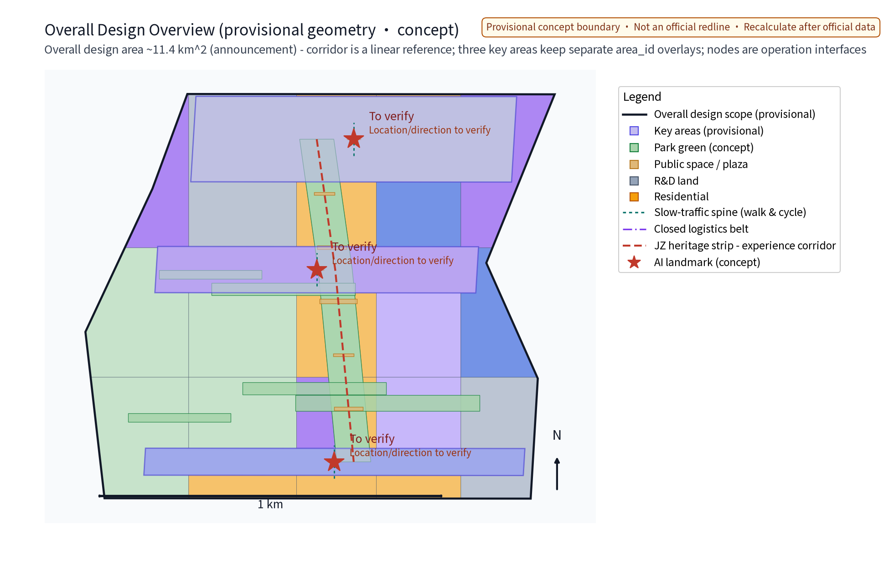
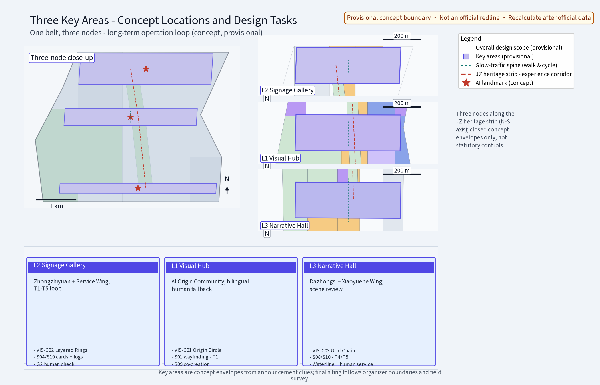
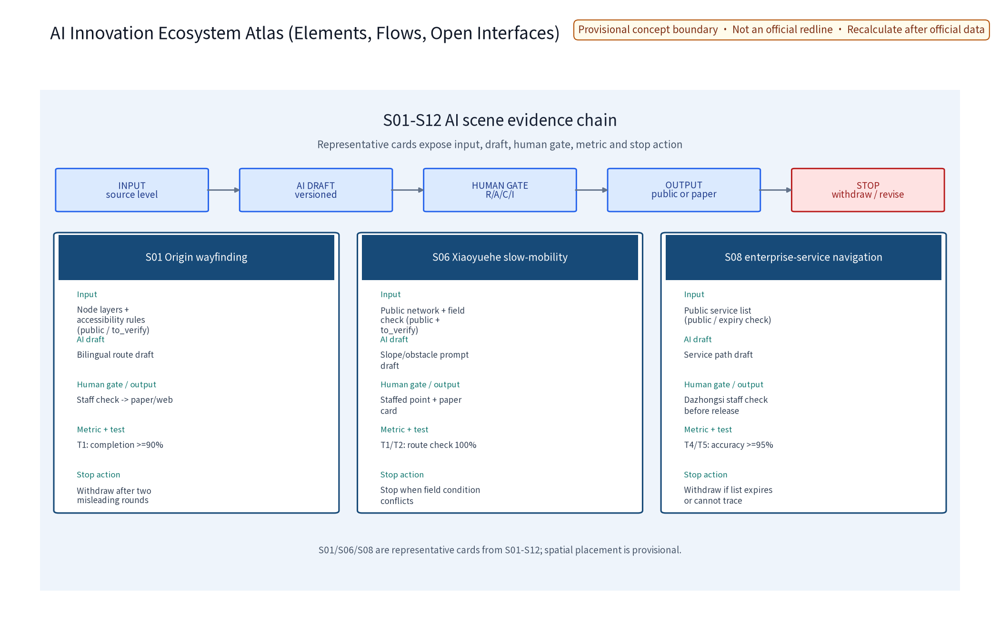
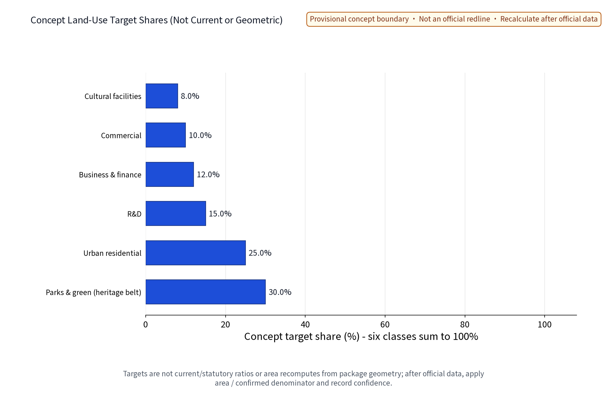
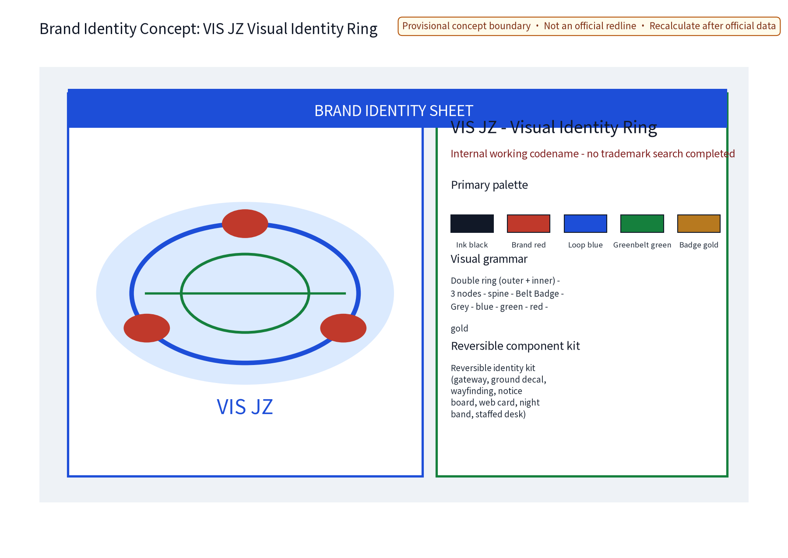
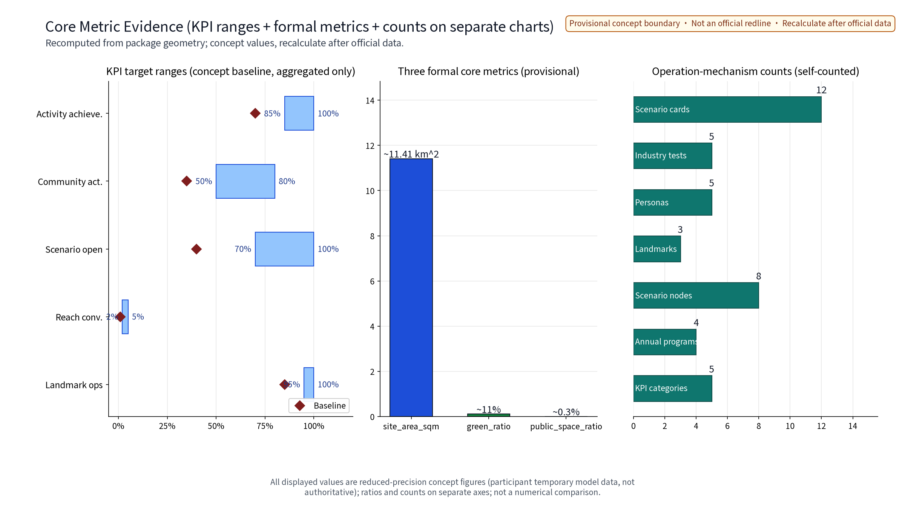

> This draft is a concept suggestion: event arrangements, brand content and operation mechanisms are conceptual descriptions and do not constitute confirmed arrangements; no FAR, building height, specific retain-renovate-demolish or engineering implementation conclusions; no fabricated data.

## Design Basis and Source List

The source list covers public historical materials, planning reports, general codes and open cases of domestic and international events and city operation; it is a working reference list, not data this package has acquired. All data actually used is listed in sources.json; items not obtained are honestly annotated in the assumptions and missing-data notes. This proposal is compiled from public calibers only: (1) the call-for-proposals announcement; (2) the taskbook, including agent.6 "Global AI Innovation Event Belt & Long-term Operation Design" (annual event system, event brand and communication visual system, developer community operation mechanism, AI scenario open-operation mechanism, public experience and city landmark operation, international communication and lead-conversion mechanism); (3) the public principle of retain-renovate-demolish along the Jingzhang Railway Heritage Park, giving priority to site texture and railway heritage; (4) open cases of domestic and international events and city operation (see Section 13, each registered in sources.json). No non-public documents are cited and no data is fabricated; international cases are reference calibers only, not data bases. Compliance references include the Interim Measures for the Management of Generative AI Services, the Barrier-Free Environment Law, and the Land-Use Classification Guide for Territorial Planning, Surveys and Use Control (officially released versions); the cited laws are used only as compliance-caliber references and do not substitute for specific approvals or constitute compliance conclusions.

> **Evidence anchor**: [source:DATA-SRC-OFFICIAL-ANNOUNCEMENT], [source:DATA-SRC-AGENT-TASKBOOK].

## Three-Level Scope Framework

The "coordinated research - overall design - key areas" three-tier framework transmits results level by level: the coordinated research tier judges long-term operation synergies of industry and future city (including directional pre-judgments of synergy with Haidian, Beiwai Community, Future Science City, Huairou Science City, Beijing E-Town, and the Beijing-Tianjin-Hebei region, see Section 3); the overall design tier organizes operation nodes and the slow-traffic framework around the greenbelt; the key-areas tier details three original concept nodes. Official announcement calibers (text basis): coordinated research scope about 43.6 km2, overall design scope about 11.4 km2, key areas about 368.4 ha. This package is a long-term operation concept within the overall design scope (located along the Jingzhang Railway Heritage Park in Haidian District); its three concept nodes fall within the key-areas caliber. All three-tier boundaries are provisional concept divisions that may adjust as the taskbook and base materials deepen; this package sets no land boundaries or implementation-scope conclusions; every boundary is to be recomputed after official data is published. The three-tier framework is paired with the "three zones + two wings" (三区两翼) coordination concept: bidirectional interface reservations for the Haidian key zone + the corridor coordination zone + the Beijing-Tianjin-Hebei radiation wing, with each item entered into the "Consulted C" position of the Section 10 RACI matrix as a "resource interface / collaboration product / review cycle" triple.

> **Evidence anchor**: [source:DATA-SRC-AGENT-TASKBOOK], [source:DATA-SRC-PROVISIONAL-BOUNDARIES].

## Coordinated Research Area: Industry and Future City Research

The industry and city research identifies the "fit" effect of long-term operation: universities supply talent, research content and event supply; sci-tech innovation areas supply AI scenarios and industrial demand; transit stations supply passenger distribution and accessibility; residential neighborhoods form the community-operation base and daily vitality source. This supports the "content - scenario - visitor flow - community" four-dimension coordinated operation network, forming a "operation node - innovation area - neighborhood" three-level linkage, around which the annual event system is organized. The "three zones + two wings" coordination is proposed at concept level: Haidian key zone + corridor coordination zone + Beijing-Tianjin-Hebei radiation wing, with five resource interfaces (talent / scenario / visitor flow / community / communication); all are suggestions and matters to be negotiated. Cooperation intents, resource interfaces and annual touchpoints with Beiwai Community, Future Science City, Huairou Science City, Beijing E-Town and the Beijing-Tianjin-Hebei region are listed and tagged with a "suggestion / to be negotiated / concept" three-state label; no cooperation, investment attraction, funding or government commitments are fabricated. Future city research is directional only and constitutes no commitment on land use or investment; no visitor-flow or industry data is estimated. The "three zones + two wings" and the spatial skeleton of "three nodes + slow-traffic axis + reversible facilities" are mutually interfaced; annual collaboration products take the form of a five-piece set (event exchange + talent interflow + lead referral + data exchange with anonymized aggregation + joint communication) entered into the "Consulted C" position of the Section 10 RACI matrix.

> **Evidence anchor**: [source:DATA-SRC-AGENT-TASKBOOK], [source:DATA-SRC-PROVISIONAL-BOUNDARIES].

## Overall Design Area: Urban Renewal and Regulatory-Plan-Level Urban Design

The overall design emphasizes "a long-term operation environment with the greenbelt as the skeleton": operation nodes, the operation network framework and the slow-traffic system are organized along the Jingzhang Railway Heritage Park greenbelt, building a "zone - node - facility" three-level operation network; operation facilities can grow reversibly and streets can carry events and festivals on a time-shared basis. Renewal rather than new construction is emphasized; existing space is prioritized for operation functions. Greenbelt texture and railway heritage are preserved first and operation layout yields to heritage protection. Regulatory-plan depth is only a verification suggestion used to check the compatibility of operation facilities and the slow-traffic system; no FAR, height or other numeric conclusions are given and no numeric indicators are presupposed. This level also carries the spatial interface concept of the "three zones + two wings" synergy (see Section 3); everything is a concept suggestion. The correspondence between the overall design and the "OPS·JZ Mechanism Group" at the spatial level: (1) the "Community Operation Covenant" corresponds to the "zone" level (the physical spatial carrier of the corridor co-governance charter and deliberation rules); (2) the "Reversible Public-Space Component Library" corresponds to the "node" level (the reversible facility set of the Event Hub, Developer Workshop and Scenario Deck); (3) the "Belt Badge Honor System" corresponds to the "facility" level (honor display for landmarks and components); (4) the "Scenario Admission and Exit Mechanism" runs through all three levels. The operation layout of any level is checked in parallel with heritage, greenline, waterway and rail-protection conditions; any concept point in conflict is forbidden from landing.

> **Evidence anchor**: [source:DATA-SRC-MOHURD-CONTROL-DETAILED-PLANNING], [source:DATA-SRC-PROVISIONAL-BOUNDARIES].

## Detailed Design of Key Areas

The unified crosswalk and five external interface contracts are in `report/narrative.md` (the “Unified spatial crosswalk” section); it is the review entry for the three positions, five functions, three zones + two wings, three key areas and three nodes.

Three original nodes are proposed (all concept locations, no specific parcels designated; final siting requires field survey, document verification, authority assessment and public input): (1) the Event Hub - the operation hub of the annual event system and the event brand & communication visual system, coordinating the event calendar, brand IP and visual rules; (2) the Developer Workshop - the developer community station carrying community mechanisms and daily co-building; (3) the Scenario Deck - an integrated operation platform for AI scenario opening, public experience and city landmark operation, international communication and lead conversion. Greenbelt movement lines and slow-traffic channels between nodes form a complete operation route.

**Concept pilot area** (provisional concept segment, subject to official boundary and public deliberation confirmation): the "Xizhimen - Wudaokou - Tsinghua Section along the Jingzhang Railway Heritage Park" is only a linear corridor reference for slow traffic, wayfinding and event sequence; it is not synonymous with the three key areas. The three key areas retain the stable `area_id` values in `geometry/key_areas.geojson` (Zhongzhiyuan, Beijing AI Origin Community and Dazhongsi AI Industry Cluster). The three nodes are conceptual operation interfaces to those areas, not substitutions for their polygons; the crosswalk and non-transferable conditions are in `report/coordination_crosswalk.md`. Final siting requires official data, field survey, heritage/greenline/rail checks and public deliberation.

**Three landmark directory entries** (concept): Event Hub landmark (annual main venue and honor wall), Developer Workshop landmark (community co-building living room), Scenario Deck landmark (public experience and outcome exhibition), configured with the "Belt Badge" honor display system and a reversible public-space component library (the four original mechanisms "Community Operation Covenant" / "Reversible Public-Space Component Library" / "Belt Badge Honor System" / "Scenario Admission and Exit Mechanism" are collectively the "OPS·JZ Mechanism Group"; the reversible public-space component library includes activity stands, temporary galleries, time-shared furniture and other demountable, movable, reusable facilities). Landmark siting is checked in parallel with heritage, greenline, waterway and rail-protection conditions; any conflicting scheme is forbidden from landing. Daily landmark operation and annual evaluation are incorporated into the Section 10 RACI matrix and Section 11 phase-gate indicators.

> **Evidence anchor**: [data:PACKAGE-GEOMETRY], [source:DATA-SRC-PROVISIONAL-BOUNDARIES].

## AI Innovation Ecosystem, Personas, and AI+ Scenarios

The pre-launch governance fields for all 12 scenario cards are in `report/narrative.md` (the “Pre-launch governance matrix” section); a scenario remains `pre-launch/to_verify` until field review and drills are complete.

Five persona profiles are defined: entrepreneurs, AI developers, community residents, students and visitors, with differentiated content and touchpoints; coverage extends to seniors, persons with disabilities, families and children, commuters and corridor workers, forming an all-age inclusive operation target. Five AI+ systems act as core and support systems, all following the three governance statements: anonymized aggregation only, human review of key decisions, and no over-surveillance (no individual-identifying tracking).

| System | Spatial carrier | AI capability | Data & privacy boundary | Operator |
|---|---|---|---|---|
| Event Ops AI | Event Hub and corridor event venues | Event scheduling, session and booking organization, transport/spatial dispatch suggestions | Anonymized aggregated visitor statistics, boundaries disclosed in advance, no individual-identifying tracking | Operation team and volunteers |
| Community QA AI | Developer Workshop and community interface | Public-service Q&A and community co-building information synthesis | Anonymized aggregated data only, human-review fallback | Developer community, universities and student volunteers |
| Site Monitor AI | Corridor slow-traffic axis and public-space sensing nodes | Public-space and transport status monitoring, anomaly alerts | Aggregate statistics and alerts only, no over-surveillance, human review | Operation and specialist teams |
| Content AI | Scenario Deck communication interface | Multilingual content and culture narrative generation | Human review and attribution of generated content, no factual distortion | Communication and visual specialist teams |
| Lead-Matching AI | Scenario Deck industry service interface | Industry factor matching and negotiation lead synthesis | Anonymized aggregation and human review, no individual profiling | Operation and industry-service specialist teams |

The AI innovation ecosystem atlas (concept) runs the full chain "persona - node - scenario - domain - guardrail": five persona profiles, three operation nodes, five AI+ scenarios, the six-domain mapping (transport/industry/space/public services/culture/governance), and the anonymization/human-review guardrail (see ecosystem-atlas figure). Technical protocols are proposed at concept level: model evaluation and benchmark testing, data quality verification, error stratification with false-alarm-rate control, runtime monitoring with human takeover plan; none constitute engineering conclusions.

Scenario cards are expanded per the taskbook requirement (12 cards, concept caliber, each with data-field boundary and human-review point):

| Scenario card | Target group | Spatial carrier | Data fields & privacy boundary | Operation mechanism & success standard |
|---|---|---|---|---|
| Event registration & booking | Residents, visitors, youth | Event Hub | Sessions, time slots, headcount (aggregated); no individual trajectory collection | Booking system + annual disclosure; punctuality rate >= 0.9 |
| Event-day slow-traffic guidance | Commuters, visitors | Slow-traffic axis & stations | Anonymized aggregated flow; no individual-identifying tracking | Time-shared flexible control; queuing alert <= 15 min |
| Developer co-building Q&A | AI developers, students | Developer Workshop | Questions and answers (de-identified); human-review fallback | Community covenant + points tiering; answer adoption >= 0.6 |
| Hackathon season review | AI developers, enterprises | Developer Workshop | Project materials (author-authorized); anonymous score aggregation | Filing + volunteer review; participant conversion >= 0.2 |
| Scenario open booking | Families, parents-children | Scenario Deck | Booking slots (aggregated); no child data collection | Booking + rotation; open rate >= 0.7 |
| Landmark operation monitoring | Operation team | Three landmarks | Facility status aggregate statistics; no image retention | Human-reviewed alerts; intactness >= 0.95 |
| Multilingual guide Q&A | Visitors | Three nodes | De-identified Q&A logs; deleted within 7 days | Human review; answer accuracy >= 0.85 |
| Content generation | International visitors, public | Scenario Deck | Generated content traceability; attribution | Human review before release; no factual errors |
| Lead synthesis | Enterprises, entrepreneurs | Scenario Deck | Public enterprise information only; no individual profiling | Human review; effective lead conversion >= 0.05 |
| Community feedback collection | Residents, vulnerable groups | Community interface | Anonymized opinion aggregation; monthly deletion | Deliberation + annual disclosure; resolution rate >= 0.8 |
| Event-noise handling | Residents, surrounding neighborhoods | Around Event Hub | Aggregated decibel statistics; no individual collection | Tiered alert + venue rotation; complaint response <= 24 h |
| Emergency & dismantling | All participants | Three nodes | Digitalized emergency plan; no identity information collection | Stop conditions trigger dismantling; drills >= 2/year |

Industry test scenarios (3, concept protocols; success standards are process suggestions, not commitment metrics):

| Test scenario | Verification content | Data & error requirements | Success standard |
|---|---|---|---|
| Event-day crowd simulation | Slow-traffic axis & station distribution model | Anonymized aggregate input; error stratification | Simulation vs. measured deviation <= 15% (concept target) |
| Community QA stress test | Concurrency and accuracy of Q&A AI | Benchmark set + data quality checks | Availability >= 0.99; false-alarm rate <= 5% |
| Content compliance review | Factuality and copyright attribution of generated content | Full manual review traceability | 100% pre-release review rate |

> **Evidence anchor**: [source:DATA-SRC-GENERATIVE-AI-INTERIM-MEASURES], [metric:persona_count], [metric:industry_test_scenario_count].

## Land Use, Building Scale, and Retain-Renovate-Demolish Strategy

The retain-renovate-demolish strategy combines all three with retention first: preserve the heritage park texture and railway relics, functionally repurpose existing buildings and reserve operation-oriented renovation directions (event space interfaces, display windows); demolition is limited to case-by-case small buildings that unblock the slow-traffic system. Operation facilities are light-touch, reversible and low-footprint; no large new volumes. Land use uses a single conceptual target-share caliber (6 classes, names per the national land-use classification): park & green space 30%, residential 25%, R&D 15%, business & finance 12%, commercial 10%, cultural 8%. The six target shares sum to 100%, but are **not current conditions, not statutory planning ratios, and not area shares recomputed from this package geometry**. The chart expresses target shares only; the package's 27 geometry-feature count is separate and cannot be recomputed into these targets. After official boundary, classification and tenure data are available, the formula "area of each class / one confirmed denominator" must be applied and confidence recorded; no area-share conclusion is published before then. No land scale, floor area or retain-renovate-demolish quantities are presupposed; final conclusions await statutory procedures. The interface between land use and the "OPS·JZ Mechanism Group": (1) park & green space carries the open deliberation venue of the "Community Operation Covenant"; (2) R&D / business & finance / commercial land carries the AI+ scenario operation under the "Scenario Admission and Exit Mechanism"; (3) cultural land carries the exhibition space of the "Belt Badge Honor System"; (4) residential land carries the nearby service radius of the "Reversible Public-Space Component Library". Recompute trigger conditions are the same as in Section 11, including official release of new land-parcel boundaries, land-use classification adjustments, and node coordinates conflicting with official redlines.

> **Evidence anchor**: [source:DATA-SRC-MNR-LAND-USE-CLASSIFICATION-202311], [data:PACKAGE-GEOMETRY].

## Transport, Rail, Municipal Infrastructure, and Public Services

The traffic concept puts slow traffic first: a continuous slow-traffic axis links the Event Hub, Developer Workshop and Scenario Deck; event-day crowd organization is integrated with the slow-traffic system and connects universities, parks and transit stations (distribution mainly by walking and cycling); event information screens and wayfinding are placed along slow-traffic spaces with low impact. Transit-station distribution is smooth and event shuttles rely on public transport and slow traffic rather than large-scale car distribution. Municipal facilities follow intensive sharing: integrated concept interfaces for event power supply, network, water/drainage and temporary facilities, prioritizing existing conditions, flexibly dispatched by event load. Public services include multilingual information, event reception and co-study spaces; barrier-free facilities, elderly-friendly services and child-friendly activity spaces are on the configuration list; all AI decisions include human review. All of the above are concept arrangements without presupposed engineering values. Transport - slow traffic - municipal services coupled with the "OPS·JZ Mechanism Group": (1) the slow-traffic axis serves as the real-time crowd carrier under the "Scenario Admission and Exit Mechanism"; (2) event-day traffic organization staggers with the "Belt Badge" annual program; (3) event municipal interfaces coordinate with the "Reversible Public-Space Component Library"; (4) event-noise governance is executed by "tiered" alerts + "venue rotation"; (5) the transport and community interface runs on a dual channel of "deliberation" + "disclosure"; (6) non-digital channels (in-person window, telephone, paper, braille and low-level wayfinding) are set up in parallel with digital channels.

> **Evidence anchor**: [source:DATA-SRC-MOHURD-URBAN-DESIGN-MEASURES], [source:DATA-SRC-BARRIER-FREE-ENVIRONMENT-LAW].

## Blue-Green Network, Public Space, and Urban Character

A "greenbelt as axis, node parks as beads" blue-green public-space system is proposed: the heritage park greenbelt forms the blue-green skeleton linking small green pockets and open spaces along the belt; event and operation facilities integrate with parks in a light, transparent, reversible way without blocking heritage views or greenbelt sightlines. No structure or temporary installation may block heritage sightline corridors; sightline verification is a precondition of event-installation permits. The cultural wayfinding system is configured multilingual, icon-based, with braille and low-level information, covering audiovisual-impaired users and people with low digital skills; event information and interpretation systems stay restrained and unified. The urban character continues the Jingzhang railway industrial vocabulary in dialogue with an ordered innovative atmosphere; overall guidance is restrained and unified, avoiding symbol stacking and slogan-like packaging. This section states concept-level principles only, with no specific design indicators or character values. Blue-green - public space - urban character coupled with the "OPS·JZ Mechanism Group": (1) the greenbelt and node parks serve as the open deliberation and activity venue of the "Community Operation Covenant"; (2) public-space components are included in the "Reversible Public-Space Component Library" (temporary galleries, time-shared furniture, portable stands, etc.); (3) the "Belt Badge Honor System" is exhibited with restraint at landmarks and public-space nodes; (4) the "Scenario Admission and Exit Mechanism" only allows scenarios to go live after the public-space sightline check passes; (5) the multilingual / braille / low-level / icon-based cultural wayfinding is consistent with the "tiered" inclusion caliber.

> **Evidence anchor**: [source:DATA-SRC-MOHURD-URBAN-DESIGN-MEASURES], [source:DATA-SRC-BARRIER-FREE-ENVIRONMENT-LAW].

## Renewal Projects, Implementation Policy, and Phasing

This section uses the "Operation Intelligence Loop (OPS·JZ)" as the long-term operation umbrella, and lays out a connectable operation framework across three phases (near / mid / long term). For each phase the section specifies Task / Lead / Collaborator / Admission conditions / Phase gate / Stop conditions / Exit mechanism, combined with four original mechanisms: "Community Operation Covenant" (社区运营公约), "Reversible Public-Space Component Library" (可逆公共空间组件库), "Belt Badge Honor System" (带标之章荣誉体系) and "Scenario Admission and Exit Mechanism" (场景准入与退出机制) — collectively the "OPS·JZ Mechanism Group" (OPS·JZ 机制群) — to form a verifiable, reversible light-touch implementation path. The four project lists (event system / community operation / scenario opening / communication conversion) are concept inventories; scale and investment estimates are qualitative tiers only (low / medium / high, with estimation method, price base period, coverage and recompute trigger in assumptions.json), and contain no precise amounts and no presupposed engineering or retain-renovate-demolish values.

**Pilot-area reference and siting selection**: the concept pilot-area reference is "Xizhimen - Wudaokou - Tsinghua Section along the Jingzhang Railway Heritage Park" (provisional concept segment, overlaid with the three concept nodes: Xizhimen "Scenario Deck" / Wudaokou "Event Hub" / Tsinghua Section "Developer Workshop"), connected by a continuous slow-traffic axis. The specific scope and node coordinates are to be re-selected after official boundaries are published, in combination with authority opinions, public deliberation and field survey; this proposal presets no conclusion and does not replace official redlines. The pilot area does not require new large-volume construction in the first phase; all operation facilities are mandatory "light-touch, reversible, demountable" (轻介入、可逆、可撤收).

**Participants and concept RACI matrix** (Lead R / Accountable A / Consulted C / Informed I are concept-level, not a substitute for statutory procedure):

| Participant category | Concept role | Position in RACI | Main responsibility |
|---|---|---|---|
| Government (competent authority, Haidian District / sub-district office) | Coordination and filing / approval | A + R | Activity approval and filing, policy interface, emergency coordination |
| Enterprises (platform, scenario-provider, supporting-service) | Scenarios and industry factors | C + R (scenario lead) | Scenario supply, lead synthesis, supporting services |
| Universities and research institutions | Research and talent | C + R (community/education) | Developer community, talent cultivation, research input |
| Residents and community representatives | Deliberation and covenant co-building | C (strong) + I | Public deliberation, community covenant, disturbance response |
| Operation and volunteer teams | Daily execution | R (execution) | Activity execution, space operation, dismantling drills |
| Merchants and on-site service providers | Supporting services | C + I | Food/barrier-free/elderly-friendly/child-friendly support |
| Specialist teams (comms/visual/engineering/legal) | Specialist support | C + I | Visual rules, engineering review, legal and rights verification |

**Three-phase implementation path** (each phase lists Task / Lead / Collaborator / Admission / Phase gate / Stop conditions / Exit mechanism; a phase gate must be passed before entering the next phase):

| Phase | Core tasks | Lead (R) | Main collaborators (C) | Admission conditions | Phase gate (must pass) | Stop conditions | Exit mechanism |
|---|---|---|---|---|---|---|---|
| Near term 1-3 years pilot | Run 1-2 sample events in pilot area; establish three base mechanisms — "event approval and filing cooperation" / "Community Operation Covenant" / "Scenario Opening Admission Procedure"; first-version reversible public-space component library pilot deployment | Operation team + sub-district office | Government filing, enterprise scenarios, university research, community representatives | Official boundary published + public deliberation passed + heritage/greenline review | Public deliberation participation (concept baseline), sample event completion, component dismantling drill pass | Public-safety event trigger / heritage assessment fail / community complaint exceeding the "tiered" threshold | Event facilities dismantled per "reversible" procedure; sample project reviewed to decide whether to adjust siting or terminate |
| Mid term 3-5 years node formation | Three concept nodes built in batches (first "Event Hub", then "Developer Workshop", then "Scenario Deck"); annual event system (4 brand programs) takes shape; "Belt Badge" annual honor first review; 3-5 AI+ scenarios normally open | Government competent authority + operation team | Enterprises, universities, communities, specialist teams | Near-term phase gates all passed + node land ownership clarified + emergency and barrier-free assessment | Three nodes pass the "tiered" operation assessment, annual event completion rate, scenario open rate (baseline range) | Key KPI below concept baseline for two consecutive periods / major public opinion / funding or resource interruption | Nodes downgrade to "reversible" mode; honor system suspended; opened scenarios removed per exit list |
| Long term 5-10 years long-term operation | Belt-wide long-term operation + brand-asset accumulation; international communication and lead-conversion mechanism stable; community covenant and deliberation mechanism self-evolving | Operation alliance + government guidance | All participants (incl. alliance members) | Mid-term phase gates all passed + alliance charter filed | Community activity, lead-conversion rate (concept baseline), international communication reach, dismantling drill compliance | National or local regulatory change / node environmental force majeure | All or part of nodes exit per "Belt Badge" exit list; alliance dissolved or restructured |

**Concept-level "Scenario Admission and Exit Mechanism" (the fourth in the OPS·JZ Mechanism Group)**: scenario launch must pass four stages "admission - operation - review - renewal"; at the admission stage the operation team submits five items: scenario description / data field list / privacy boundary / human-review points / failure modes, with tripartite countersignature by the government competent authority, specialist team and community representatives; during operation indicators are collected monthly and reviewed quarterly; failure to meet the baseline or a public-safety event triggers a "tiered" alert response; renewal requires re-admission. Exit mechanism: all operation facilities are demountable, movable and reusable, with the dismantling process carried out per plan and under public supervision.

**Annual event system** (using the "OPS·JZ Mechanism Group" mechanism words: filing / volunteering / booking / alliance + deliberation / points / disclosure / rotation / tiering / covenant, >=4 distinct):

| Annual program | Tier & frequency | Mechanism points |
|---|---|---|
| Global AI Innovation Week | Annual flagship program | Filing cooperation + annual disclosure; main venue at the Event Hub; staggered with official events |
| Developer Hackathon Season | Quarterly core node | Volunteers + points tiering; developer community growth path; review filing |
| Belt Open Public Days | Monthly public experience | Booking + venue rotation; family and child-friendly sessions; barrier-free and elderly-friendly tiered sessions |
| Festival and monthly regular events | Monthly/festival multi-frequency | Alliance co-building + deliberation; tiered rollout along the belt; multilingual and barrier-free wayfinding |

**Event brand and communication visual system** (concept): "Operation Intelligence Loop (OPS·JZ)" is the core brand direction - ring symbol + three nodes + spine form the Logo direction (see figure), with the "Belt Badge" honor system, reversible public-space component library and multilingual communication rules. OPS·JZ is treated as an internal working codename at the concept stage; it is not used externally or registered until an official trademark search is completed, and does not replace any existing government or organizer brand.

> **Evidence anchor**: [source:DATA-SRC-AGENT-TASKBOOK], [metric:annual_program_count], [metric:phase_count].

## Metrics, Area Recalculation, and Compliance Matrix

**Five operation KPIs** (activity achievement, community activity, scenario open rate, reach conversion, landmark operation intactness) are in metrics.json as process indicators, not commitment indicators; definitions, formulas, baselines, target ranges, collection frequency and owners are listed in the table below. Every indicator is paired with a **phase-gate recompute trigger**: when any phase gate (near/mid/long-term gate, see Section 10) fails, the corresponding indicator automatically enters a "pending calibration" status and the operation team submits a calibration plan; official release of new data triggers an overall recompute with a "Recompute version vN.N" label.

| KPI | Formula | Baseline | Target range | Frequency | Owner |
|---|---|---|---|---|---|
| Activity achievement | events delivered / planned | 0.70 | 0.85-1.00 | annual | operation lead |
| Community activity | monthly participation / registered members | 0.35 | 0.50-0.80 | monthly | community ops |
| Scenario open rate | opened scenarios / admitted total | 0.40 | 0.70-1.00 | quarterly | scenario ops |
| Reach conversion | intent leads / reach | 0.01 | 0.02-0.05 | quarterly | comms team |
| Landmark ops rate | intact facilities / landmark total | 0.85 | 0.95-1.00 | monthly | facility management |

**Three-phase gate indicators (merged into RACI phase gates)**: near-term gate looks at "sample event completion + public deliberation participation (anonymized aggregation) + component dismantling drill pass rate"; mid-term gate looks at "three-node simultaneous operation assessment + annual event completion rate + scenario open rate (quarterly mean)"; long-term gate looks at "community activity (annualized) + lead conversion rate (annualized) + international communication reach (independent aggregated audience)".

**Three formal core metrics** (site_area_sqm, green_ratio, public_space_ratio) are recomputed from this package's geometry, with official text calibers as the base (overall design about 11.4 km2): this package's provisional geometry recomputes to about 11.41 km2, green ratio about 11%, public-space ratio about 0.3% - all provisional values shown at reasonable precision only; the whole set is recomputed and versioned after official data is published. The three core metrics' **recompute trigger conditions** are listed explicitly: (1) official release of new land-parcel boundaries; (2) official release of land-use classification adjustments; (3) landmark / node coordinates conflict with official redlines; (4) any substantive revision to provisional boundaries. When any trigger condition is met, a recompute report must be submitted within 30 days and metrics.json must be updated.

**Compliance matrix** (registered by four red-line categories):

| Red-line category | Statement | Treatment |
|---|---|---|
| No exaggeration | Do not exaggerate event effects, do not present conceptual arrangements as confirmed decisions | Writing-level check; content outside the "OPS·JZ Mechanism Group" coverage is returned for revision |
| Must carry mechanism | Slogans must carry operation mechanisms; no slogan without an operation mechanism | Communication content reviewed before release by the operation team corresponding to the "OPS·JZ Mechanism Group" |
| Funding red line | No confirmed commitment on investment attraction, policies or funding | Investment-attraction copy uses uniform "suggestion / to be negotiated / concept" wording; funding figures do not appear in communication materials |
| Data red line | No individual-identifying tracking; no large-scale behavior profiling; no child data collection | Before AI scenario launch, specialist team issues a data-boundary and human-review-point list (see Section 6 scenario cards) |

**Indicator presentation rules**: ratios and count indicators are shown in separate charts; every indicator carries source / formula / confidence level / use restriction / recompute trigger; any indicator with "commitment language" is returned for revision per the compliance matrix. After official release of new data, recompute must be performed within 30 days and labeled with "Recompute version vN.N".

> **Evidence anchor**: [metric:green_ratio], [metric:public_space_ratio], [data:PACKAGE-GEOMETRY], Section 10 RACI phase gates.

## Risk, Copyright, and Compliance

This proposal is concept research and does not constitute an administrative approval basis or FAR/height/retain-renovate-demolish/engineering-feasibility conclusions. Risks are registered across six dimensions in assumptions.json (event effect and participation fluctuation, brand and IP rights, AI-generated content copyright, scenario-opening data boundaries, lead-conversion uncertainty, unknown heritage/greenline control conditions), with response principles of anonymized aggregation, attribution, human review, feedback channels and statutory procedures. The 12 scenario cards now have a common pre-launch governance matrix in `report/scene_data_governance_matrix.md`: purpose, minimum fields, aggregation threshold or N/A, retention/deletion, human escalation, incident response and owner. They remain concept protocols, not measured performance or compliance certification; missing fields or untested drills keep a scenario `pre-launch/to_verify` and block launch. Data boundaries and retention/deletion rules are disclosed in advance; no individual-identifying tracking and no large-scale behavior profiling. Inclusion and public safety: barrier-free and elderly-friendly services, non-digital channels, resident co-creation and appeals mechanisms, event-noise governance (tiered alerts + venue rotation), emergency exit and stop conditions (see Section 10). Brand and rights: per-asset author/source/license/modification/attribution/display-and-embedding permissions and limits for the OPS·JZ name and Logo, fonts, images, maps, data, code and AI-generated content are in report/copyright_statement.md and sources.json; no official trademark search has been completed at the concept stage, so the name and marks are treated as internal working codenames restricted from external use and registration; "any resemblance is coincidental" is a statement, not a rights verification.

> **Evidence anchor**: [source:DATA-SRC-OFFICIAL-ANNOUNCEMENT], [source:DATA-SRC-GENERATIVE-AI-INTERIM-MEASURES].

## References

References follow the government-issued versions and are archived by public/internal category with access dates: public Jingzhang railway history and heritage park materials; Beijing master plan and district plan public calibers; Beijing urban renewal special plan, implementation opinions and supporting documents; taskbook agent.6 long-term-operation caliber and public collaboration rules; approved sources such as the Interim Measures for the Management of Generative AI Services, the Barrier-Free Environment Law, and the Land-Use Classification Guide for Territorial Planning, Surveys and Use Control (see sources.json); field-survey records and self-drawn analysis sketches (self-collected for this project). The reference list in this section is the public-caliber reference for this package's concept work; any data not obtained, not verified or not in hand is explicitly marked with a "research hypothesis" demotion in assumptions.json and sources.json. International and domestic benchmarks are reference calibers only, not data bases; per-case source, access date and reuse boundary are registered in sources.json (with "research hypothesis" demotion notes where unverifiable). The case reuse boundary is listed row by row (including a five-piece set of mechanism reference / reverse validation / localized innovation / reuse restriction / source link), to avoid direct copying of international case operation templates:

| Case | Type | Mechanism points | Benchmark & reverse validation | Localized innovation | Source |
|---|---|---|---|---|---|
| SXSW (USA) | Annual event & city brand | Annual festival + city brand linkage | Event-city communication linkage mechanism | Event Hub annual event system | [source:DATA-SRC-CASE-SXSW] |
| CES Las Vegas | Expo & industry attraction | Expo aggregates industry factors | Lead-conversion loop needs long-cycle validation | Scenario Deck Lead-Matching AI | [source:DATA-SRC-CASE-CES] |
| Web Summit Lisbon | Conference international comms | International comms tied to host city | City capacity needs supporting facilities | Multilingual comms & wayfinding | [source:DATA-SRC-CASE-WEBSUMMIT] |
| Setouchi Triennale (Japan) | Art festival long-term local operation | Local community long-term participation | Community will determines sustainability | Community covenant & deliberation | [source:DATA-SRC-CASE-SETOUCHI] |
| Beijing Zhongguancun Forum | Domestic flagship conference | Innovation factors & policy platform | Staggered synergy with official events | Annual calendar staggering | [source:DATA-SRC-CASE-ZGCFORUM] |
| Shanghai WAIC | Domestic AI expo | AI industry showcase & talent aggregation | Attention to safety and compliance expression | Three governance statements & human review | [source:DATA-SRC-CASE-WAIC] |

> **Evidence anchor**: [source:DATA-SRC-OFFICIAL-ANNOUNCEMENT], [metric:global_case_count].
