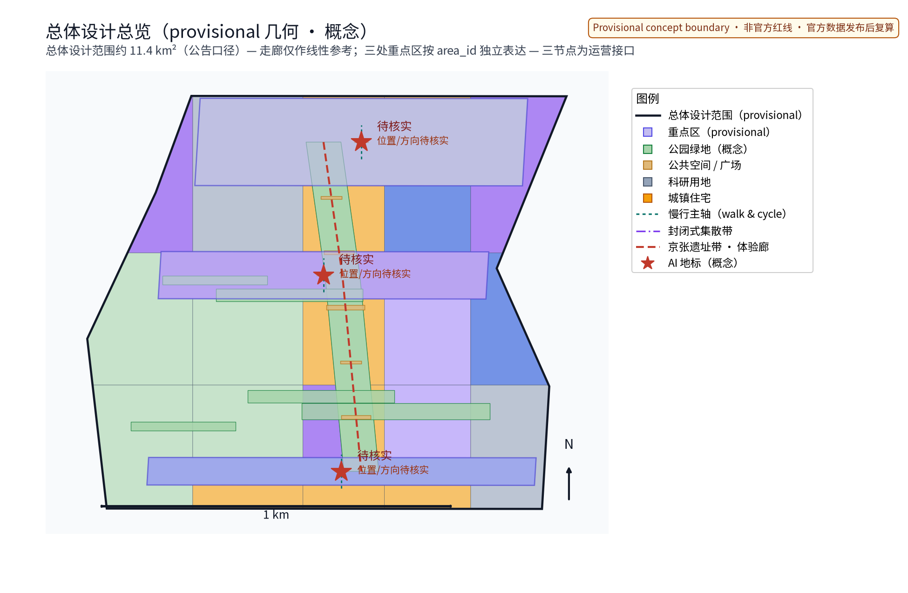
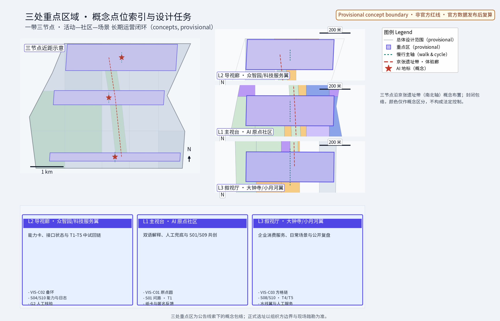
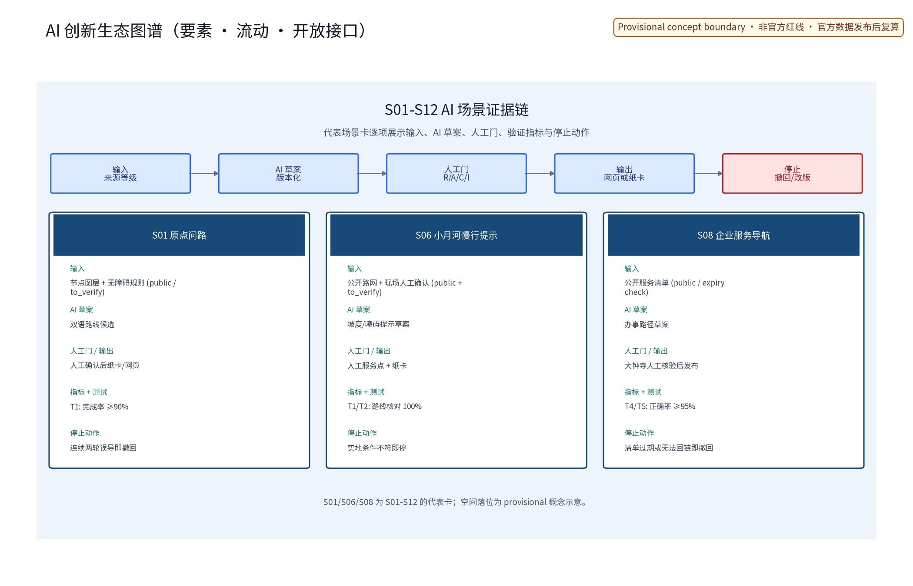
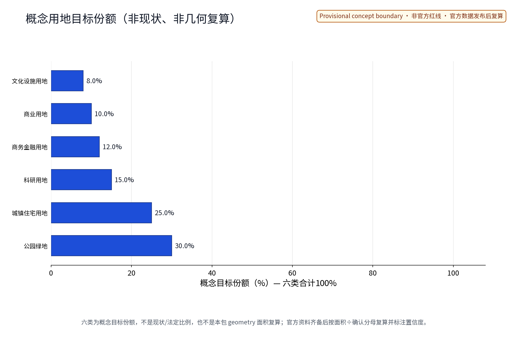
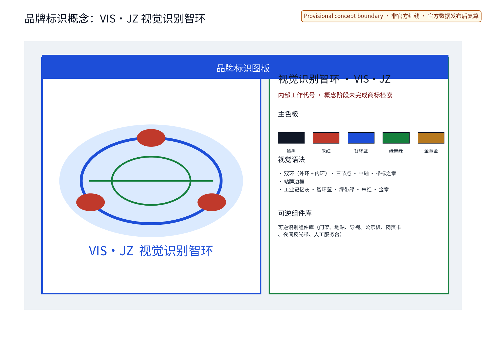
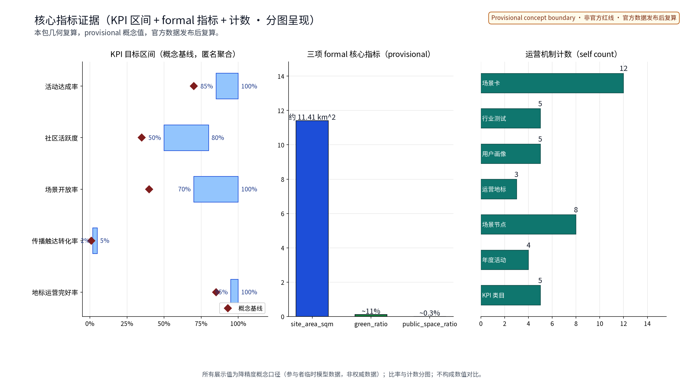

> 本草案为概念建议文本：文中活动安排、品牌内容、运营机制均为设想性描述，不构成已确定安排；不给出容积率、建筑高度、具体拆改留或工程实施结论，不编造数据。

## 设计依据与资料清单

资料清单所列公开史料、规划报道、通则规范与国内外大型活动及城市运营公开案例等均为概念工作依据清单，并非本包已获取的数据；本包实际使用的全部数据见 sources.json，未获取项已在假设与缺失数据说明中如实标注。本方案依据公开口径编制：①征集公告；②征集任务书，含 agent.6「一带全球AI创新活动体系与长期运营设计」口径（年度活动体系、活动品牌与传播视觉系统、开发者社区运营机制、AI场景开放运营机制、公共体验与城市地标运营、国际传播与招引转化机制）；③京张铁路遗址公园沿线留改拆并举、遗址肌理与铁路历史遗存优先原则；④国内外大型活动与城市运营公开案例（见第13节，逐条登记于 sources.json）。不引用未公开文件，不编造数据；国际案例仅作为借鉴口径，不作数据依据。合规参照包括《生成式人工智能服务管理暂行办法》《无障碍环境建设法》《国土空间调查、规划、用途管制用地用海分类指南》等正式发布版本；本节所引法源仅作合规口径参照，不替代具体审批或认定，不构成合规结论。

> **证据锚点**：[source:DATA-SRC-OFFICIAL-ANNOUNCEMENT]、[source:DATA-SRC-AGENT-TASKBOOK]（组织方公告与任务书为文本口径依据）。

## 三层范围工作框架

采用「统筹研究—总体设计—重点区域」三层递进框架，三层成果逐级传导：统筹研究层判断产业与未来城市的长期运营协同关系（含与海淀区、北纬社区、未来科学城、怀柔科学城、经开区、京津冀区域的协同方向性预判，详见第3节），总体设计层以绿带为骨架组织运营节点与慢行骨架，重点区域层深化三个原创概念节点。官方公告口径（文本依据）：统筹研究范围约43.6平方公里、总体设计范围约11.4平方公里、重点区域约368.4公顷；本包为总体设计范围之下的长期运营专项概念（本项目位于海淀区京张铁路遗址公园沿线），三处概念节点落在重点区域口径内。三层边界均为provisional概念划分，随任务书与基础资料深化可调整；本包不预设用地界线、不做实施范围结论，所有边界以官方数据发布后复算为准。三层框架与「三区两翼」协同概念配套：海淀重点区+沿线协同区+京津冀辐射翼的双向接口预留，逐项以「资源接口 / 协作产品 / 复盘周期」三件套列入第10节 RACI 矩阵的「协商 C」位。

> **证据锚点**：[source:DATA-SRC-AGENT-TASKBOOK]（三层范围划分依据任务书官方文本口径）、[source:DATA-SRC-PROVISIONAL-BOUNDARIES]（边界为 provisional，仅作概念组织与复算演练）。

## 统筹研究范围产业与未来城市研究

统一交叉表和五类外部接口契约见 `report/narrative.md`（“统一空间交叉表”段）；该表是本包的审读入口，明确三大定位、五大功能、三区两翼、三大重点片区和三节点的层级关系。

产业与城市研究识别长期运营的「适配」效应：高校群提供人才、研究内容与活动供给；科创片区提供AI场景与产业需求；轨道站点提供客流集散与可达性支撑；住区构成社区运营底座与日常活跃度来源。据此提出「内容—场景—客流—社区」四维协同运营网络概念，形成「运营节点—科创片区—住区」三级联动结构，年度活动体系依此组织节奏。「三区两翼」协同按概念口径提出：海淀区重点区+沿线协同区+京津冀辐射翼共 5 类资源接口（人才接口/场景接口/客流接口/社区接口/传播接口），均建议与待协商事项；北纬社区、未来科学城、怀柔科学城、经开区及京津冀的协同关系以资源接口与年度触点方式列出，逐项标注「建议 / 待协商 / 概念」三态标签，不虚构合作、招商、资金或政府承诺；未来城市研究仅作方向性预判，不构成对用地与投资的承诺，不估算客流与产业数据。「三区两翼」与本方案的「三节点+慢行轴+可逆设施」空间骨架互为接口，统一关系见 `report/coordination_crosswalk.md`，其中五大功能与三节点均是运营功能映射，不是已核定空间边界。

> **证据锚点**：[source:DATA-SRC-AGENT-TASKBOOK]（三大定位与区域协同的概念映射依据任务书官方文本口径）、[source:DATA-SRC-PROVISIONAL-BOUNDARIES]。

## 总体设计范围城市更新与控规深度城市设计

总体设计强调「以绿带为骨架的长期运营环境」：依托京张铁路遗址公园绿带组织运营节点、运营网络骨架与慢行系统，构建「区域—节点—设施」三级运营网络；运营设施可逆生长、街道可分时承载活动与节事需求；强调更新而非新建，优先利用存量空间植入运营功能；绿带肌理与铁路历史遗存优先保留，运营布局让位于遗址保护。控规深度仅作校核建议，用于校验运营设施与慢行系统的兼容性，不给出容积率、高度等数值结论，不预设数值指标。本层同时落实「三区两翼」协同的空间接口概念（见第3节），全部为概念建议。总体设计与「OPS·JZ 机制群」在空间层面的对应：①「社区运营公约」对应「区域」级（沿线共治章程与议事规则的物质空间载体）；②「可逆公共空间组件库」对应「节点」级（活动中枢、开发者工坊、场景开放台可逆设施集合）；③「带标之章荣誉体系」对应「设施」级（地标与组件的荣誉展示）；④「场景准入与退出机制」贯穿三层。任何一层的运营布局均与文保、绿线、河道、轨道保护条件并行校核，凡冲突的概念点位不得落地。

> **证据锚点**：[source:DATA-SRC-MOHURD-CONTROL-DETAILED-PLANNING]、[source:DATA-SRC-PROVISIONAL-BOUNDARIES]。

## 重点区域详细设计

场地级平面动作、代表性断面、换乘/慢行/绿带路径、AI测试节点、人工兜底和文化导视成果见 `report/narrative.md`（“Agent.4 场地级概念成果”段）；均为非工程、provisional 概念成果。

设置三个原创节点（选址均为概念点位，不指定具体地块，须经现场踏勘、资料核验、主管部门评估与公众意见后重新比选落位）：①「活动中枢」——年度活动体系与活动品牌传播视觉系统的运营中枢，统筹活动日历、品牌与视觉规范；②「开发者工坊」——开发者社区运营站，承载社区机制与日常共研；③「场景开放台」——AI场景开放、公共体验与城市地标运营、国际传播与招引转化的一体化运营台。节点间绿带动线与慢行通道构成完整运营动线。

**概念试点区域**（provisional 概念段，待官方边界与公众议事确认）：「京张铁路遗址公园沿线西直门—五道口—清华段」仅作为线性慢行、导视和活动顺序的 corridor reference；它不等同于三大重点片区。三大重点片区以 `geometry/key_areas.geojson` 的 `area_id`（众智园、北京AI原点社区、大钟寺AI产业聚集区）为稳定标识，三节点是其运营接口的概念映射，关系和不可替代条件见 `report/coordination_crosswalk.md`。连续慢行轴串接三节点，具体点位与边界仍须官方数据、现场踏勘、文保/绿线/轨道条件和公众议事复核。

**三处城市地标目录**（概念）：活动中枢地标（年度主会场与荣誉墙）、开发者工坊地标（社区共研客厅）、场景开放台地标（公共体验与成果展场），配置「带标之章」荣誉展示体系与可逆公共空间组件库（「社区运营公约」/「可逆公共空间组件库」/「带标之章荣誉体系」/「场景准入与退出机制」合称「OPS·JZ 机制群」；可逆公共空间组件库含活动看台、临时展廊、分时家具等可拆可移、可重复使用的设施）。地标选址与文保/绿线/河道/轨道保护条件并行校核，凡冲突的方案不得落地。地标日常运营与年度评估纳入第 10 节 RACI 矩阵与第 11 节阶段门指标。

> **证据锚点**：[data:PACKAGE-GEOMETRY]（三节点示意多边形来自本包 geometry/key_areas.geojson）、[source:DATA-SRC-PROVISIONAL-BOUNDARIES]。

## AI 创新生态、人才画像与 AI+ 场景

12张场景卡的上线前数据治理字段见 `report/narrative.md`（“12场景上线前治理矩阵”段）；该矩阵优先于概念性风险宣传，未完成字段审查或演练的场景保持 `pre-launch/to_verify`。

用户画像分五类人才：创业者、AI开发者、社区居民、学生、访客游客，运营内容与触达方式差异化设计，并覆盖长者银龄、残疾人、亲子儿童、通勤者与沿线从业者，构成全龄包容的运营对象。AI+场景设五个主干与支撑系统，全部遵循治理三句式：仅匿名聚合、关键决策人工复核、禁止过度监控（不进行个体识别式追踪）。

| 系统名称 | 空间载体 | AI能力 | 数据与隐私边界 | 运营主体 |
|---|---|---|---|---|
| 活动运营AI | 活动中枢及沿线活动场地 | 活动排期、场次与活动预约组织、人流组织的交通与空间调度建议 | 匿名聚合客流统计，治理边界先行公示，不进行个体识别式追踪 | 运营团队与志愿者 |
| 社区问答AI | 开发者工坊及社区界面 | 公共服务问答与社区共研信息整理 | 仅处理匿名聚合数据，人工复核兜底 | 开发者社区、高校与学生志愿者 |
| 场景监测AI | 沿线慢行轴与公共空间感知节点 | 公共空间与交通运行状态监测、异常提醒 | 仅聚合统计与告警，禁止过度监控，人工复核 | 运营团队与专业团队 |
| 传播内容AI | 场景开放台传播界面 | 多语传播内容与文化叙事生成 | 生成内容人工复核、来源标注，不歪曲事实 | 传播与视觉专业团队 |
| 招引转化AI | 场景开放台产业服务界面 | 产业要素匹配与洽谈线索整理 | 匿名聚合与人工复核，不作个体画像 | 运营团队与产业服务专业团队 |

AI创新生态图谱（概念）以「人才—节点—场景—六域—护栏」为全链条：五类人才画像→三大运营节点→五类AI+场景→交通/产业/空间/公共服务/文化/治理六域映射→匿名聚合与人工复核护栏，见 ecosystem-atlas 图。技术协议按概念提出：模型评测与基准测试、数据质量校验、误差分群与误报率控制、运行监测与人工接管预案，均不构成工程结论。

场景卡按任务书要求展开（12张，概念口径，每张含数据字段边界与人工复核点）：

| 场景卡名称 | 面向人群 | 空间载体 | 数据字段与隐私边界 | 运营机制与成功标准 |
|---|---|---|---|---|
| 活动报名与预约 | 居民、游客、青年 | 活动中枢 | 场次、时段、人数（聚合）；不采集个体轨迹 | 「预约」制+年度公示；准时率≥0.9 |
| 活动日慢行引导 | 通勤者、游客 | 慢行轴与站点 | 匿名聚合流量；不进行个体识别式追踪 | 分时共享与弹性管控；滞留提示≤15分钟 |
| 开发者共研问答 | AI开发者、学生 | 开发者工坊 | 问题与答复（去标识化）；人工复核兜底 | 「社区运营公约」+积分分级；答复采纳率≥0.6 |
| 黑客松季评审 | AI开发者、企业 | 开发者工坊 | 项目材料（本人授权）；匿名评分聚合 | 备案+志愿评审；参赛转化率≥0.2 |
| 场景开放预约 | 家庭、亲子 | 场景开放台 | 预约时段（聚合）；儿童数据不采集 | 「预约」+「轮换」；开放率≥0.7 |
| 地标运营监测 | 运营团队 | 三地标 | 设施状态聚合统计；无影像留存 | 人工复核告警；完好率≥0.95 |
| 多语导览问答 | 游客、访客游客 | 三节点 | 问答日志去标识化；7日删除 | 人工复核；回答准确率≥0.85 |
| 传播内容生成 | 国际访客、公众 | 场景开放台 | 生成内容留痕；来源标注 | 人工审核后发布；无事实性差错 |
| 招引线索整理 | 企业、创业者 | 场景开放台 | 仅企业公开信息；不作个体画像 | 人工复核；线索有效转化率≥0.05 |
| 社区意见收集 | 居民、弱势群体 | 社区界面 | 意见匿名聚合；按月删除 | 「议事」+年度公示；意见办结率≥0.8 |
| 活动扰民处置 | 居民、周边住区 | 活动中枢周边 | 分贝聚合统计；不采集个体 | 「分级」预警+「轮换」场地；投诉响应≤24小时 |
| 应急与撤收 | 全体参与者 | 三节点 | 应急预案数字化；不采集身份信息 | 停止条件触发即撤收；演练年度≥2次 |

行业测试验证场景（3个，概念协议，成功标准为过程性建议，非承诺指标）：

| 测试场景 | 验证内容 | 数据与误差要求 | 成功标准 |
|---|---|---|---|
| 活动日人流模拟 | 慢行轴与站点集散模型 | 匿名聚合输入，误差分群校验 | 模拟与实测偏差≤15%（概念目标） |
| 社区问答压力测试 | 问答AI并发与准确性 | 基准测试集+数据质量校验 | 可用率≥0.99，误报率≤5% |
| 传播内容合规复核 | 生成内容事实性与版权标注 | 人工复核全量留痕 | 发布前复核率100% |

> **证据锚点**：[source:DATA-SRC-GENERATIVE-AI-INTERIM-MEASURES]（AI 生成内容治理表述的参照依据）、[metric:persona_count]、[metric:industry_test_scenario_count]。

## 用地、建筑规模与拆改留方案

拆改留坚持留改拆并举：以留为主保留遗址公园肌理与铁路历史遗存，存量建筑功能置换并预留运营化改造方向（活动空间接口、展示窗口），拆除仅限经个案论证的局部疏通慢行零星建筑；运营设施以轻介入、可逆、低占地为主，不新增大体量建筑。用地分类采用单一概念目标口径（6类，依据国标用地分类名称）：公园绿地30%、城镇住宅用地25%、科研用地15%、商务金融用地12%、商业用地10%、文化用地8%，六项目标份额合计100%，但**不是现状、不是法定规划比例，也不是本包 geometry 的面积复算结果**。图中比例只表达概念目标份额；本包 geometry 的27个图斑计数另行表达，二者不可互相复算。官方边界、分类和权属资料发布后，才按“各类面积÷同一确认分母”的公式重新计算并标注置信度；在此之前不发布面积占比结论。不预设用地规模、建筑面积、拆改留数量等任何数值，具体结论留待后续法定程序。用地与「OPS·JZ 机制群」的对接：①公园绿地承载「社区运营公约」的开放议事场所；②科研/商务金融/商业用地承载「场景准入与退出机制」下的 AI+ 场景运行；③文化用地承载「带标之章荣誉体系」的展陈空间；④城镇住宅用地承载「可逆公共空间组件库」的就近服务半径。复算触发条件同第11节，包括官方发布新版地块边界、用地分类调整、节点坐标与官方红线冲突等。

> **证据锚点**：[source:DATA-SRC-MNR-LAND-USE-CLASSIFICATION-202311]（用地分类名称参照现行国标口径）、[data:PACKAGE-GEOMETRY]。

## 交通、轨道、市政与公共服务设施

以交通慢行优先为核心组织交通概念机制：连续慢行轴贯通活动中枢、开发者工坊与场景开放台，活动日人流组织与慢行系统一体化，衔接沿线高校、园区与轨道站点（集散以步行与骑行为主），活动信息屏与导向设施沿慢行空间低干预布置；轨道站点集散顺畅，活动接驳以公共交通与慢行为主，不依赖大规模机动车集散。市政以集约共享为原则，活动供电、网络、给排水与临时设施接口一体化概念、优先利用现状设施条件，按活动负载柔性调度。公共服务配置多语信息、活动接待与研习空间，无障碍设施、适老服务与儿童友好活动空间纳入配置清单，AI决策均设人工复核；以上均为概念安排，不预设工程数值。交通—慢行—市政与「OPS·JZ 机制群」配套：①慢行轴作为「场景准入与退出机制」下的实时人流承载；②活动日交通组织与「带标之章」年度活动错位；③活动市政接口与「可逆公共空间组件库」协同；④活动扰民治理按「分级」预警+「轮换」场地执行；⑤交通与社区界面以「议事」+「公示」双通道运行；⑥非数字通道（人工窗口、电话、纸本、盲文与低位导视）与数字通道并设。

> **证据锚点**：[source:DATA-SRC-MOHURD-URBAN-DESIGN-MEASURES]（市政与慢行设计表述的方法参照）、[source:DATA-SRC-BARRIER-FREE-ENVIRONMENT-LAW]。

## 蓝绿空间、公共空间与城市风貌

构建「绿带为轴、节点公园为珠」的蓝绿公共空间体系：以遗址公园绿带为蓝绿骨架串联沿线小微绿地与开敞空间，活动与运营设施与公园融合布置、宜轻宜透宜可逆，不遮挡历史遗迹与绿带视线；任何构筑物、临时装置均不得遮挡历史遗迹视线廊道，视廊校核纳入活动装置审批前置条件。文化导视系统按多语、图标化、盲文与低位信息配置，覆盖视听障碍者与低数字技能者；活动信息与解说系统统一克制。风貌延续京张铁路工业记忆语汇并与创新有序的新氛围对话，整体风貌导控克制统一，避免符号堆砌与口号化包装。本节约束为概念级原则，不包含具体设计指标与风貌数值。蓝绿—公共空间—风貌与「OPS·JZ 机制群」配套：①绿带与节点公园作为「社区运营公约」的开放议事与活动场所；②公共空间组件纳入「可逆公共空间组件库」（含临时展廊、分时家具、便携看台等）；③「带标之章荣誉体系」在地标与公共空间节点做克制展陈；④「场景准入与退出机制」在公共空间视廊校核通过后方可上线；⑤文化导视多语/盲文/低位/图标化与「分级」包容口径一致。

> **证据锚点**：[source:DATA-SRC-MOHURD-URBAN-DESIGN-MEASURES]（蓝绿空间组织的方法参照）、[source:DATA-SRC-BARRIER-FREE-ENVIRONMENT-LAW]。

## 更新项目清单、实施政策与分期计划

本节以「运营智环（OPS·JZ）」为长期运营机制总称，按「近期—中期—远期」三阶段给出可对接的运营框架；每阶段明确 任务 / 牵头 / 协作角色 / 准入条件 / 阶段门 / 停止条件 / 退出机制，配合「社区运营公约」「可逆公共空间组件库」「带标之章荣誉体系」「场景准入与退出机制」四类原创机制（合称「OPS·JZ 机制群」），形成可复核、可撤收的轻量实施路径。概念试点区域参考为「京张铁路遗址公园沿线西直门—五道口—清华段」（provisional 概念段，叠加三概念节点），以连续慢行轴串接，详见第5节；具体范围与节点坐标待官方边界发布后，结合主管部门意见、公众议事与现场踏勘重新比选落位。四类项目清单（活动体系 / 社区运营 / 场景开放 / 传播转化）为概念清单，规模与投资估算仅作定性分级（低 / 中 / 高，估算方法、价格基期、包含范围与复算触发见 assumptions.json），不出现精确金额，不预设工程数值与拆改留结论。

**参与主体与 RACI 概念矩阵**（牵头 R / 问责 A / 协商 C / 知会 I 均为概念口径，不替代法定程序）：

| 参与主体类别 | 概念角色 | 在 RACI 中的位置 | 主要责任 |
|---|---|---|---|
| 政府（主管部门、海淀区/属地街道） | 协调与审批备案 | A + R | 活动审批备案、政策接口、应急统筹 |
| 企业（平台型、场景提供型、配套服务型） | 场景与产业要素 | C + R（场景牵头） | 场景供给、招引线索、配套服务 |
| 高校与研究机构 | 研究与人才 | C + R（社区/教育） | 开发者社区、人才培养、研究输入 |
| 居民与社区代表 | 议事与公约共建 | C（强）+ I | 公众议事、社区公约、扰民响应 |
| 运营与志愿者团队 | 日常执行 | R（执行） | 活动执行、空间运营、撤收演练 |
| 商户与在地服务方 | 配套服务 | C + I | 餐饮/无障碍/适老/儿童友好等配套 |
| 专业团队（传播/视觉/工程/法务） | 专业支持 | C + I | 视觉规范、工程复核、法务与权利核查 |

**三阶段实施路径**（每阶段列出 任务 / 牵头 / 协作 / 准入 / 阶段门 / 停止条件 / 退出机制；阶段门未通过不得进入下一阶段）：
| 阶段 | 核心任务 | 牵头（R） | 主要协作（C） | 准入条件 | 阶段门（必须通过） | 停止条件 | 退出机制 |
|---|---|---|---|---|---|---|---|
| 近期 1—3 年 试点 | 在试点区域开展样板活动 1—2 类；建立「活动审批备案协作」「社区运营公约」「场景开放准入规程」三项基础机制；首版可逆公共空间组件库试点部署 | 运营团队 + 属地街道 | 政府备案、企业场景、高校研究、社区代表 | 官方边界发布 + 公众议事通过 + 文保/绿线复核 | 公众议事参与人次（概念基线）、样板活动完成场次、组件撤收演练通过 | 公共安全事件触发 / 文物保护评估未通过 / 社区投诉突破「分级」阈值 | 活动设施按「可逆」规程撤收；样板项目复盘后决定是否调整点位或终止 |
| 中期 3—5 年 节点成型 | 三个概念节点分批建成（先「活动中枢」、次「开发者工坊」、再「场景开放台」）；年度活动体系（4 类品牌活动）成型；「带标之章」年度荣誉首评；场景开放 3—5 个 AI+ 场景常态开放 | 政府主管部门 + 运营团队 | 企业、高校、社区、专业团队 | 近期阶段门全通过 + 节点用地权属明确 + 应急与无障碍评估 | 三节点同步通过「分级」运营评估、年度活动完成率、场景开放率（基线区间） | 关键 KPI 连续两期低于概念基线 / 重大舆情 / 资金或资源中断 | 节点降级为「可逆」模式；荣誉体系暂停；已开放场景按退出清单撤收 |
| 远期 5—10 年 长期运营 | 全域长期运营 + 品牌资产沉淀；国际传播与招引转化机制稳定运行；社区公约与议事机制自我演化 | 运营联盟 + 政府指导 | 全主体（含联盟成员） | 中期阶段门全通过 + 联盟章程备案 | 社区活跃度、招引转化率（概念基线）、国际传播覆盖度、撤收演练合规率 | 国家或地方法规变化 / 节点环境不可抗力 | 全部或部分节点按「带标之章」退出清单退出；联盟解散或重组 |

**场景准入与退出机制（OPS·JZ 机制群之四）**：场景上线须过「准入—运行—复评—续期」四档；准入阶段由运营团队提交 场景说明 / 数据字段清单 / 隐私边界 / 人工复核点 / 失败模式五项材料，由政府主管部门 + 专业团队 + 社区代表三方会签备案；运行阶段按月采集指标、按季复评；未达基线或触发公共安全事件即按「分级」预警处置；续期须重新走准入流程。所有运营设施可拆可移可重复使用，撤收过程按预案进行并接受公众监督。

**年度活动体系**（沿用「OPS·JZ 机制群」机制词：备案 / 志愿 / 预约 / 联盟 + 议事 / 积分 / 公示 / 轮换 / 分级 / 公约，共 ≥4 类）：

| 年度活动名称 | 层级与频率 | 机制要点 |
|---|---|---|
| 全球AI创新周 | 年度主干品牌活动 | 「备案」协作+年度公示；主会场位于活动中枢；与官方活动错位排布 |
| 开发者黑客松季 | 季度核心节点 | 「志愿」+「积分」分级；开发者社区成长路径；评审「备案」 |
| 一带开放公众日 | 月度公共体验 | 「预约」+「轮换」场地；家庭与儿童友好专场；无障碍与适老专场「分级」 |
| 节庆与月度常规活动 | 月/节多频 | 「联盟」共建+「议事」；沿带分级推广；多语与无障碍导视 |

**活动品牌与传播视觉系统**（概念）：以「运营智环（OPS·JZ）」为核心品牌方向，环形符号 + 三节点 + 中轴构成 Logo 方向（见下），配套荣誉体系（「带标之章」）、可逆公共空间组件库与多语传播规范；OPS·JZ 在概念阶段按内部工作代号处理，未完成官方商标检索前不对外使用与注册，不替代任何既有政府或主办方品牌。

> **证据锚点**：[source:DATA-SRC-AGENT-TASKBOOK]（分期与实施条目对应任务书要求）、[metric:annual_program_count]、[metric:phase_count]。

## 指标体系、面积复算与合规矩阵

**五类运营 KPI**（活动达成率、社区活跃度、场景开放率、传播触达转化率、地标运营完好率）进入 metrics.json，均为运营过程性指标，非承诺指标，定义、公式、基线、目标区间、采集频率与责任人见下表。所有指标配套 **阶段门复算触发器**：当任一阶段门（近/中/远期门，详见第 10 节）未通过时，对应指标自动进入「待校准」状态并由运营团队提交校准方案；官方发布新数据后整体复算并标注「复算版本 vN.N」。

| KPI名称 | 公式 | 基线 | 目标区间 | 频率 | 责任人 |
|---|---|---|---|---|---|
| 活动达成率 | 实际完成场次/计划场次 | 0.70 | 0.85-1.00 | 年度 | 运营牵头 |
| 社区活跃度 | 月度参与人次/注册成员数 | 0.35 | 0.50-0.80 | 月度 | 社区运营 |
| 场景开放率 | 已开放场景数/准入场景总数 | 0.40 | 0.70-1.00 | 季度 | 场景运营 |
| 传播触达转化率 | 意向线索数/传播触达量 | 0.01 | 0.02-0.05 | 季度 | 传播团队 |
| 地标运营完好率 | 完好设施数/地标设施总数 | 0.85 | 0.95-1.00 | 月度 | 设施管理 |

**三阶段阶段门指标（合并入 RACI 阶段门）**：近期门看「样板活动完成场次 + 公众议事参与人次（匿名聚合）+ 组件撤收演练通过率」；中期门看「三节点同步运营评估 + 年度活动完成率 + 场景开放率（季度均值）」；远期门看「社区活跃度（年化）+ 招引转化率（年化）+ 国际传播覆盖度（独立受众聚合）」。

**三项 formal 核心指标**（site_area_sqm、green_ratio、public_space_ratio）以本包几何复算为准，面积复算以官方文本口径为底数（总体设计约 11.4 平方公里）：本包几何复算约 11.41 平方公里，绿比约 11%、公共空间比约 0.3%，均为 provisional 临时值、仅保留合理有效位数；官方数据发布后整体复算并标注「复算版本 vN.N」。三项核心指标 **复算触发条件** 显式列出：①官方发布新版地块边界；②官方发布用地分类调整；③地标 / 节点坐标与官方红线冲突；④任何对 provisional 边界的实质性修订。任意触发条件之一满足，须在 30 日内提交复算报告并更新 metrics.json。

**合规矩阵**（按四档红线分类登记）：

| 红线类别 | 表述 | 处置 |
|---|---|---|
| 不得夸大 | 不夸大活动效果、不将设想写成确定安排 | 写作层校验；超出「OPS·JZ 机制群」覆盖范围的内容一律退回 |
| 必须附机制 | 宣传口号必须附运营机制；不出现无运营机制的口号 | 传播内容上线前由「OPS·JZ 机制群」对应的运营团队复核 |
| 资金红线 | 招商政策资金不作确定承诺 | 招商文案统一使用「建议 / 待协商 / 概念」表述；资金数字不出现在传播物料中 |
| 数据红线 | 不进行个体识别式追踪；不建立大规模行为画像；儿童数据不采集 | AI 场景上线前由专业团队出具数据边界与人工复核点清单（见第 6 节场景卡） |

**指标呈现规则**：比例与计数指标分图呈现，所有指标附数据来源 / 公式 / 置信等级 / 用途限制 / 复算触发；任何指标出现「承诺性语言」即按合规矩阵退回修订。官方发布新数据后，必须在 30 日内复算并标注「复算版本 vN.N」。

> **证据锚点**：[metric:green_ratio]、[metric:public_space_ratio]、[data:PACKAGE-GEOMETRY]、第 10 节 RACI 阶段门。

## 风险、版权与合规说明

本方案为概念研究性设计，不构成行政审批依据，也不构成容积率、建筑高度、拆改留或工程可行性结论；风险按六维度登记于 assumptions.json（活动效果与参与度波动、品牌与IP权利、AI生成传播内容版权、场景开放数据边界、招引转化不确定性、文保绿线控制条件未知），应对原则为匿名聚合、来源标注、人工复核、意见通道与法定程序。12张场景卡的可执行治理字段统一登记于 `report/scene_data_governance_matrix.md`：目的、最小字段、聚合阈值或N/A、留存/删除、人工升级、事件响应、责任人；当前均为上线前概念协议，未形成实测或合规认证，缺字段或未完成演练即保持 `pre-launch/to_verify` 并不得上线。数据边界与留存删除规程先行公示，不进行个体识别式追踪、不建立大规模行为画像。包容与公共安全：无障碍与适老服务、非数字通道、居民共创与申诉机制、活动扰民治理（分级预警+场地轮换）、紧急退出与停运条件（见第10节）。品牌与权利：OPS·JZ名称与Logo、字体、图像、地图、数据、代码库与AI生成内容逐项作者/来源/许可/修改/署名/展示与嵌入权限及限制见 report/copyright_statement.md 与 sources.json；概念阶段未完成官方商标检索，名称与标识按内部工作代号处理，不对外使用与注册，「如有雷同属巧合」仅为表述、不作为权利核验。

> **证据锚点**：[source:DATA-SRC-OFFICIAL-ANNOUNCEMENT]（征集规则为权属与合规表述的依据）、[source:DATA-SRC-GENERATIVE-AI-INTERIM-MEASURES]。

## 参考资料

参考资料以政府正式发布版本为准，按公开/内部分类存档并标注获取时间：京张铁路历史与遗址公园公开材料、北京城市总体规划及分区规划公开口径、北京城市更新专项规划与实施意见及配套文件、任务书 agent.6 长期运营口径与公开协作规范、《生成式人工智能服务管理暂行办法》《无障碍环境建设法》《国土空间调查、规划、用途管制用地用海分类指南》等批准来源（见 sources.json）、现场踏勘记录与自绘分析草图（本项目自行采集）。本节所列资料清单为本包概念工作的公开参照口径；本包未获取、未核实、未到手的资料在 assumptions.json 与 sources.json 中均显式标注「待研究假设」降级。国际案例与国内对标仅作借鉴口径，不作数据依据；逐条来源、获取时间与复用边界登记于 sources.json（含「待研究假设」降级标注）。案例复用边界逐条列出（含借鉴机制 / 反向验证 / 本地化创新 / 复用限制 / 来源链接五件套），避免直接复制国际案例的运营模板：

| 案例名称 | 类型 | 机制要点 | 借鉴与反向验证 | 本地化创新 | 来源 |
|---|---|---|---|---|---|
| 美国SXSW西南偏南 | 年度活动与城市品牌 | 年度节事+城市品牌联动 | 活动体系与城市传播联动机制 | 「活动中枢」年度活动体系 | [source:DATA-SRC-CASE-SXSW] |
| 拉斯维加斯CES | 展会与产业招引 | 展会集聚产业要素 | 招引转化闭环需长周期验证 | 「场景开放台」招引转化AI | [source:DATA-SRC-CASE-CES] |
| 里斯本Web Summit | 会议国际传播 | 国际传播与主办城市绑定 | 城市承载需配套设施支撑 | 多语传播与导视系统 | [source:DATA-SRC-CASE-WEBSUMMIT] |
| 日本濑户内国际艺术祭 | 艺术节长期在地运营 | 在地社区长期参与 | 社区意愿决定可持续性 | 「社区运营公约」与议事机制 | [source:DATA-SRC-CASE-SETOUCHI] |
| 北京中关村论坛 | 国内品牌会议 | 创新要素与政策平台 | 与官方活动错位协同 | 年度活动日历错位排布 | [source:DATA-SRC-CASE-ZGCFORUM] |
| 上海WAIC | 国内AI展会 | AI产业展示与人才集聚 | 关注安全与合规治理表达 | 治理三句式与人工复核 | [source:DATA-SRC-CASE-WAIC] |

> **证据锚点**：[source:DATA-SRC-OFFICIAL-ANNOUNCEMENT]（本清单首条即组织方公开资料包）、[metric:global_case_count]。
