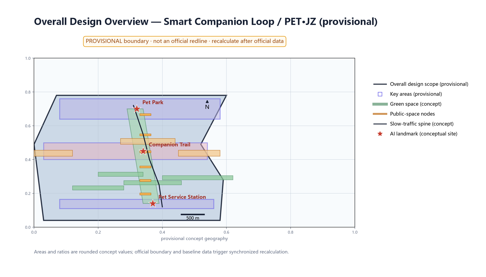
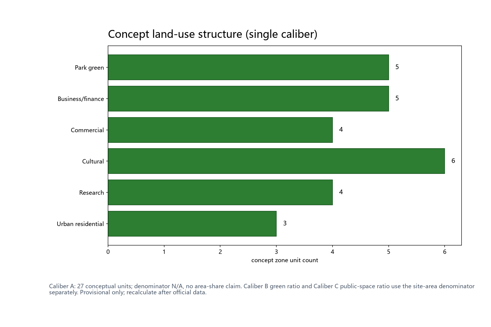
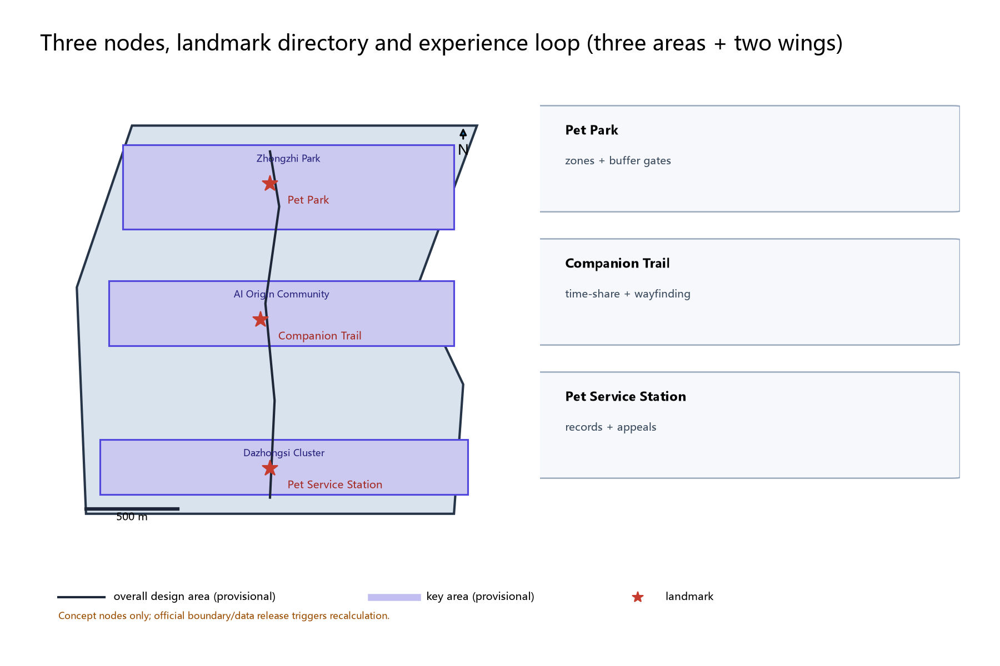
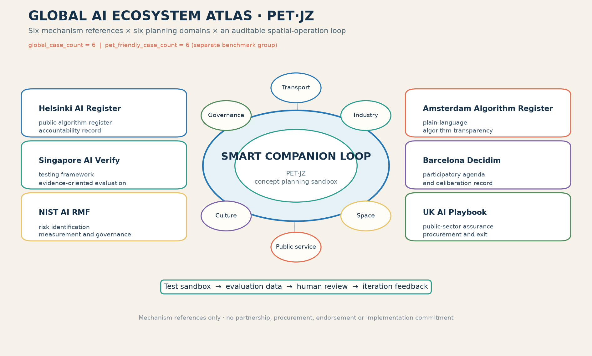

> Position: this chapter is a concept draft for the pet-friendly specialism. It gives no FAR, building height, retain/renovate/demolish or engineering conclusions and fabricates no official data. The fixed naming hierarchy is: Chinese main name 萌伴智环; English long name Smart Companion Loop; cross-language lock-up PET·JZ; Human-Pet Shared Order is the communication and operation theme, not another brand. CMP.JZ, Pet Pal Loop and PET PAL LOOP are deprecated. All data are participant provisional model data, not authoritative data.

## Design Basis and Source List

The listed public historical materials, planning reports and general standards form the concept working basis; the data actually used by this package are recorded in sources.json, and unverified items are honestly demoted to research hypotheses. The list covers: the call for proposals and agent taskbook (overall concept, main name, English name and naming family, public-space experience, all-age living and community governance dimensions, and six agent tasks); the public caliber of 'retain-renovate-demolish combined, prioritizing heritage park fabric and railway relics' along the Jing-Zhang railway park; Zhongguancun innovation culture materials; the barrier-free environment law and related public accessibility standards; public pet-stewardship regulatory calibers; and international/domestic pet-friendly public space and AI-ecosystem cases. Item-level provenance (publisher, URL, published and accessed dates, reuse boundary) is kept in sources.json; anything unverifiable is stated as a research hypothesis, not formal evidence. Data gaps are declared: the repository has no official overall boundary or key-area geometry yet; all areas and indicators in this draft are low-confidence design-model values on provisional geometry and are recalculated when official boundaries and data are released; FAR, building height and other indicators that depend on unpublished official control conditions remain unknown with no values given.

> Evidence: [source:DATA-SRC-OFFICIAL-ANNOUNCEMENT], [source:DATA-SRC-AGENT-TASKBOOK].

## Three-Level Scope Framework

The three scopes follow the official announcement text: coordinated research area approximately 43.6 km², overall design area approximately 11.4 km², and key detailed-design areas totaling approximately 368.4 ha (official announcement text caliber, not self-computed); this package's sub-scope sits inside the overall design area and anchors on the three key areas; all boundaries are provisional and are not commitment boundaries. The framework is 'coordinated research - overall design - key areas': the coordinated research layer studies industry and the future city and judges how pet-stewardship demand aligns with communities, industry and public space along the corridor; the overall design layer develops the 'one park, one trail, one station' pet-friendly network concept and slow-mobility skeleton at urban-renewal and regulatory-plan depth; the key-area layer details the three nodes. The 'three zones, two wings' mapping (concept): the Zhongzhiyuan acceleration zone hosts the park scenarios and AI care-model validation; the AI Origin Community hosts the daily trail experience; the Dazhongsi industry cluster hosts the service station and new-business interfaces; the Zhongguancun tech-service wing and the Xiaoyue River scenario wing provide computing, data and scenario-open mechanisms. The framework is conceptual organization, not a statutory zoning, regulatory-plan or engineering conclusion.

> Evidence: [source:DATA-SRC-AGENT-TASKBOOK], [source:DATA-SRC-PROVISIONAL-BOUNDARIES].

## Coordinated Research Area: Industry and Future City Research

One test of a future city is whether people and companion animals can share public space. The coordinated research treats pet stewardship as the seam of public-space experience, all-age living and community governance: on one side are the daily friction and safety concerns of dog-owning families, older pet owners, parents with children and residents without pets; on the other are the industrial opportunities of pet services, consumption and digital scenarios. Regional coordination is developed as a 'three zones, two wings' loop (concept): Beiwei Community (Haidian universities and innovation communities), Future Science City, Huairou Science City, E-Town (Yizhuang) and the Jing-Jin-Ji direction form five supports for pet-friendly service sharing, governance learning and anonymized data-element exchange; Haidian, as the core section of the belt, contributes the innovation semantics of its universities, science parks and Zhongguancun culture to the pet-stewardship narrative. Benchmark cases are summarized from public channels only, each registered in sources.json: public practice in New York and London shows that dedicated off-leash zones with time-sharing and leash rules reduce human-pet conflict; Singapore's public experience includes designated pet areas with clear leash and cleanup requirements; Tokyo publishes dog-walking maps and dog-registration service guidance; Shanghai and Shenzhen are public domestic pilots for pet-friendly malls and parks. These are method references at the level of public information only; no details, figures or scales are copied or invented.

| Case | Country/City | Nature | Insight | Source (institution · URL · accessed) |
|---|---|---|---|---|
| NYC Parks dog runs | USA/New York | Pet-friendly parks | Off-leash zones with time-sharing and leash rules | nycgovparks.org · official site · 2026-08 |
| The Royal Parks | UK/London | Pet-friendly parks | Designated dog areas with leash and cleanup duties | royalparks.org.uk · official site · 2026-08 |
| NParks Singapore | Singapore | Pet-friendly public space | Designated pet areas with clear rules | nparks.gov.sg · official site · 2026-08 |
| Tokyo dog registration | Japan/Tokyo | Registration and dog-walking map | Dog-walking maps and registration guidance | metro.tokyo.lg.jp · official site · 2026-08 |
| Shanghai pet-friendly pilots | China/Shanghai | Domestic pilot direction | Advocacy zoning in malls and parks | shanghai.gov.cn · official site · 2026-08 |
| Shenzhen pet-friendly parks | China/Shenzhen | Domestic pilot direction | Advocacy practice in parks | sz.gov.cn · official site · 2026-08 |

> Evidence: [source:DATA-SRC-PROVISIONAL-BOUNDARIES], [source:DATA-SRC-GENERATIVE-AI-INTERIM-MEASURES].

## Overall Design Area: Urban Renewal and Regulatory-Plan-Level Urban Design

The overall design organizes the 'one park, one trail, one station' concept loop along the Jing-Zhang green-belt public-space system, using the belt's east-west stitching and north-south open structure for pet-friendly nodes and slow links; all of it is a movable, replaceable conceptual structure, not road redlines, plots or engineering locations. The three nodes follow stock-first, light-touch, reversible-component directions: Pet Park uses green-belt edge sites, the Companion Trail uses the existing slow green belt, and the Pet Service Station is co-located with community service points; no building indicators or development intensity are proposed. Regulatory-plan depth is expressed as 'problem - spatial object - indicator - data gap - recompute path': each node states the problem it solves, its spatial object, corresponding indicators, materials still needed and the recalculation trigger once official data arrive; FAR, building height and demolition quantities remain unknown and the concept never substitutes for regulatory-plan approval. Land use uses one unambiguous caliber: Caliber A counts only the 27 conceptual zone features in land_use.geojson; its denominator is N/A because it is not an area-share measure, and 27 = 5 + 6 + 5 + 4 + 4 + 3. The 'green ratio about 12%' is the blue-green layer recalculation caliber (Caliber B: union of conceptual green polygons divided by the site area; package recompute value 11.6%); the 'public-space ratio about 0.4%' is the public-space node caliber (Caliber C). Caliber A counts units, while Calibers B and C measure separate geometry ratios using the 11,412,825.386 m² site denominator; they have different statistical objects, are never mixed, and are recalculated by their own formulas after official data are released.

> Evidence: [source:DATA-SRC-MOHURD-CONTROL-DETAILED-PLANNING], [metric:land_use_zone_count].

## Detailed Design of Key Areas

Node locations are concept-level points that must be relocated after site surveys, material verification, authority assessment and public comments; green-belt routes and slow paths between nodes form the complete experience circulation, expressed in the drawings and geometry layers. Landmark directory (three, concept): Pet Park (萌宠乐园, Zhongzhiyuan side) - concentrated off-leash and social ground with dog-size activity zones, drinking and rinse points, enclosed waste collection and an owners' observation lounge; human and dog routes are separated with double-door buffers at the Pet Park entrance and zone transitions only. The Companion Trail (伴行步径, AI Origin Community side) - a pet-friendly slow path in the green belt with time-shared leash hours, leash prompts and yielding signs and drinking kiosks, shared with pet-free slow users; it does not inherit the Pet Park double-door buffer. The Pet Service Station (宠物服务站, Dazhongsi side) - registration guidance, vaccine and annual-check reminders, lost-pet assistance and adoption information, co-located with community services, with a staffed counter, public notice board and suggestion box. All three nodes carry an honor display system (the Smart Companion Honor Board / 萌伴荣誉榜: group honors and volunteer recognition with sources disclosed and content human-reviewed) and a reversible public-space component library (modular seating, kiosks, drinking/rinse units, signage and collection bins that are demountable, rotatable and re-usable at graded levels, supporting both event deployment and quiet everyday states). Experience circulation and the nine-node directory (3 landmarks plus 6 AI scenario nodes, concept): Pet Park entrance buffer node, dog-size zone node, park observation node, trail east kiosk node, trail west kiosk node, station counter node, station adoption wall node, residents' deliberation pavilion node and annual notice board node. Accessibility and inclusion: user journeys for persons with disabilities (visually impaired users reach kiosks via tactile signage and voice prompts; wheelchair users enter the observation lounge via accessible paths; deaf users get time-slot information in text and graphics) are covered by large-type, tactile, voice, staffed and paper channels, with staffed fallback reserved.

Four perceptible user journeys (concept) connect spatial actions with the governance boundary:

| User | On-site action | Visible/tactile carrier | AI role only | Human fallback and exit |
|---|---|---|---|---|
| Dog-owning family | Arrive, pass the double-door buffer, choose a dog-size zone, drink, clean and leave | Zone bands, leash signs, cleaning point, observation seat | Draft an aggregated time-slot crowding prompt | Volunteer guidance; suspend the time slot if conflict rises |
| Pet-free resident | Read the quiet period, use the yielding side and submit an objection | Two-way arrows, physical time board, suggestion box | Aggregate time-slot opinions without identification | Community replies item by item; complaints route to staff |
| Person with disability | Use the accessible entry, touch/hear the prompt and complete a station service | Continuous tactile line, voice button, large-type paper | Draft a prompt for staff to proofread | Staffed counter and phone remain; replace any inaccessible component |
| Maintenance worker | Check the asset tag, confirm a work order, clean/refill and disclose closure | Asset ID, enclosed bin, maintenance card | Classify category and time period without identity | Worker confirms dispatch; close the model after repeated misrouting |

These are not observed data or commitments to build; they are rehearsal scripts for professional teams, communities and animal-welfare reviewers. Each rehearsal records objections from pet owners, pet-free residents, children, allergy/fear-of-dogs groups and front-line maintenance staff so that “pet-friendly” is not reduced to one user perspective.

> Evidence: [data:PACKAGE-GEOMETRY] (three node polygons from geometry/key_areas.geojson), [metric:landmark_count], [metric:scenario_node_count].

## AI Innovation Ecosystem, Personas, and AI+ Scenarios

AI is used as a bounded evidence-space-operation-review instrument, not as an autonomous decision-maker. The six-domain mapping is explicit: industry uses a developer sandbox for de-identified work orders; space converts model drafts into removable components; transport uses time-slot counts and yielding prompts; public services drafts registration and vaccine-service messages; culture edits the pet-stewardship narrative; governance classifies public comments into deliberation material. Model choice is tiered: rules and templates first, an auditable small model only for text summarization or classification, and a human baseline for every recommendation. Evaluation samples are formed from voluntary paper, telephone, staffed-counter and anonymous-count channels; after de-identification they are stratified by scenario, time period and user group. Weekly logs record false positives, false negatives, human rewrite rate and appeals. If a key indicator misses its concept threshold twice in succession, a material group difference cannot be explained, or staff cannot review within the stated service window, the model is stopped while the physical service remains and the 「可逆退场」/ reversible exit review begins. Five personas are dog-owning families, pet-free residents, older pet owners, parents with children and pet-industry practitioners; community workers, university students, persons with disabilities and front-line maintenance staff are co-creation and oversight roles. All-age, inclusive, aging-friendly and child-friendly layers are carried through staffed, paper, telephone, large-type, tactile and voice channels. Per-scenario data flows and privacy controls (controller, basis, minimum fields, retention/deletion, rights/appeal and non-digital alternatives) follow:

The planning innovation is not “deploying a model”; it is an auditable chain: **observation window → scenario card → spatial action → rule/model draft → human gate → disclosed indicator → retain, adjust or remove**. For example, time-share scheduling first establishes a baseline with physical signs and manual counts; only then may a small model propose a timetable. The proposal becomes a replaceable sign only after the deliberation council confirms the conflict-handling script and both pet-owning and pet-free residents complete a walk-through. AI therefore accelerates planning iteration and evidence visibility without changing statutory controls, the public decision-maker or frontline accountability.

| Data flow | Data controller (concept) | Basis & minimum fields | Retention & deletion | Rights & appeal | Non-digital alternative |
|---|---|---|---|---|---|
| Vaccine reminder | Station operator + authority process | Controlled linkable service record: registration number and due date; no location | Separated storage only for service window; delete after fulfilment and keep a deletion record | Authorized staff process; correction, deletion and appeal | Phone, paper, on-site notice |
| Lost-pet assistance | Station operator | Anonymized announcement text; no image identification | Archived after announcement ends | Human verification and removal | Notice wall, broadcast |
| Time-share scheduling | Operator + deliberation council | Anonymized time-slot counts | Cleared weekly | Council review | Physical time-slot board |
| Waste reporting | Cleaning duty holder | De-identified class and work-order draft | Cleared after work order closed | Human-confirmed dispatch | Phone reporting |
| Q&A | Merchant alliance + professional team | Approved anonymous question corpus only | Cleared quarterly | Human review of answers | Staffed information desk |

10 scenario cards (concept) follow. Each card has the same eleven fields: user, data, space, model, operator, human fallback, privacy control, failure mode, stage gate, outcome indicator and stop condition:

| Card | User / data | Space / model | Operator / human fallback | Privacy control / failure mode | Stage gate / outcome / stop |
|---|---|---|---|---|---|
| 01 Registration reminder | Dog-owning family; controlled registration number and due date | Pet Service Station; rule template | Station; staffed-counter proofing | Controlled linkable service record, separated storage; wrong reminder | Process review; delivery/correction rate; stop after two false reminders |
| 02 Lost-pet assistance | Resident; voluntary description and time window | Pet Service Station information wall; text retrieval | Volunteer team; human verification and removal | De-identified notice; mistaken match | Ethics review; removal time; stop if unverifiable |
| 03 Time-share scheduling | Pet and pet-free residents; anonymous time-slot counts | Pet Park / Companion Trail; rules plus small model | Deliberation council; physical time board | Anonymous aggregate; time-slot conflict | Covenant filing; off-peak and complaint change; stop on rising conflict |
| 04 Cleaning work order | Cleaning staff; category and time period | Pet Park / Companion Trail; classifier | Cleaning duty holder; human dispatch | De-identified operations record; backlog | Field rehearsal; closure time; stop on hygiene risk |
| 05 Knowledge Q&A | Residents; anonymous question corpus | Pet Service Station; retrieval draft | Professional team; human editorial review | Approved corpus only; wrong legal answer | Corpus review; adoption/correction rate; stop on wrong answer |
| 06 Adoption matching | Volunteers; public adoption information | Pet Service Station; tag matching | Station; human welfare review | Public information only; unsuitable match | Animal-welfare review; follow-up completion; stop on risk |
| 07 Kiosk repair | Maintenance staff; equipment category | Trail kiosk; work-order classifier | Operator; human confirmation | Minimum fields; misrouting | Asset filing; repair closure rate; stop after two repeated misroutes |
| 08 Deliberation minutes | Residents / disabled users; de-identified opinions | Deliberation pavilion; summary draft | Community workers; item-by-item correction | No identity retained; omitted minority view | Public proofing; issue coverage; stop summary after appeal |
| 09 Honor editing | Volunteers / groups; public achievements | Smart Companion Honor Board; template editing | Community + operator; fact checking | Group honors only; exaggeration or stigma | Disclosure review; correction rate; no publication if unverifiable |
| 10 Open sandbox | Developers; anonymous aggregate samples | Developer community; baseline evaluation | Professional team; human safety review | Isolated sandbox, no return path; re-identification risk | Admission review; baseline improvement/fairness; shut down on risk |

Industry test protocols use an explicit admission-validation-exit structure; results feed pilot decisions and stop conditions:

| Protocol | Admission | Validation method and indicators | Exit |
|---|---|---|---|
| T01 Human-dog route separation | Rights/maintenance pending, public covenant filed, accessibility pre-review | Paper plus observation baseline; conflict-closure rate and double-door-buffer passage error | Animal-welfare or child-safety event; remove components |
| T02 Time-shared trail | On-site time sample and pet-free resident consent; physical signs synchronized | Before/after comparison plus segmented interviews; off-peak rate, complaint change, sign recognition | Any group worsens continuously; suspend hours and deliberate |
| T03 Controlled reminder | Controller, minimum fields and deletion path confirmed | Human baseline comparison; false positives, false negatives, correction rate and human-intervention rate | No item-by-item review or unauthorized access; close model |

> Evidence: [source:DATA-SRC-GENERATIVE-AI-INTERIM-MEASURES], [metric:industry_test_scenario_count], [metric:scenario_card_count].

Three perceptible acceptance scripts bind space to indicators: **morning peak** tests whether pet-owning and pet-free users can choose the right route at the Companion Trail entrance using physical time-share signs, a continuous tactile line and a marked yielding width, without a phone; **after-school** tests Pet Park's double-door buffer, child-visible boundary and drinking/rinse point with families and people afraid of dogs, recording conflict-closure and unintended-entry counts; **post-rain cleaning** walks the “report → human dispatch → cleaning → disclosure” chain between the station and waste points, recording closure time, odor complaints and human edits. Paper, telephone and on-site observation are the baselines; when a stage gate is missed, components are adjusted or removed before any model output can influence a spatial decision.

The case count is deliberately separated: global_case_count=6 counts only the six traceable AI ecosystem mechanisms below, while pet_friendly_case_count=6 counts the six public-space benchmark rows; they are not added into a single twelve-case metric.

| AI ecosystem case (global_case_count=6) | Mechanism evidence | Transfer into this concept | source_id |
|---|---|---|---|
| Helsinki AI Register | Public algorithm register and accountability record | Publish a scenario card, owner, purpose, review status and change log for each pilot | CASE-HELSINKI-AI-REGISTER |
| Singapore AI Verify | Test framework and evidence-oriented evaluation | Use a baseline model, test set, error log and human sign-off before opening a scenario | CASE-SINGAPORE-AI-VERIFY |
| NIST AI RMF | Risk identification, measurement and governance loop | Attach risk, mitigation, residual risk and stop/restart fields to every AI scenario | CASE-NIST-AI-RMF |
| Amsterdam Algorithm Register | Public-facing algorithm transparency | Expose plain-language purpose, data boundary and responsible role at the station and web page | CASE-AMSTERDAM-ALGORITHM-REGISTER |
| Barcelona Decidim | Participatory agenda and deliberation infrastructure | Turn resident proposals, objections and responses into a reviewable civic record | CASE-BARCELONA-DECIDIM |
| UK AI Playbook | Public-sector procurement and assurance guidance | Keep a procurement-neutral checklist for accessibility, security, ownership and exit before adoption | CASE-UK-AI-PLAYBOOK |

These six cases are mechanism references, not partners, procurements, endorsements or implementation commitments. The transfer path is intentionally testable: case principle → local scenario card → baseline comparison → human review → public disclosure → annual retention or removal decision.

To make the planning depth auditable, the AI layer uses three explicit loops. The route loop compares a rule-based time-share timetable with a small-model draft and publishes only the human-approved sign schedule. The maintenance loop compares manual category coding with a classification draft and sends only an operator-confirmed work order. The service loop keeps linkable registration records inside the existing service workflow, forbids cross-scenario joins, and lets staff issue or correct a reminder; aggregate counts may inform the public dashboard, but never reveal an individual. Each loop records sample window, strata, baseline, model version, human changes, false-positive/false-negative review, appeal, and stop decision before any annual comparison.

## Land Use, Building Scale, and Retain-Renovate-Demolish Strategy

Land-use expression uses conceptual zoning directions for public space, green space and public-service facilities without changing statutory land-use classes; Pet Park and the Companion Trail sit on existing green-belt and edge-site directions, and the Pet Service Station is co-located with a community service point; no new-construction land judgment is involved and heritage, green-line and blue-line constraints are not touched. The single land-use caliber (Caliber A) is a unit-count schedule: denominator = N/A, no area-share claim, and 27 features total in land_use.geojson and the figure (5 + 6 + 5 + 4 + 4 + 3). Calibers B and C are separate geometry ratios over the 11,412,825.386 m² site boundary and are not used to reinterpret Caliber A:

| Land-use class (Caliber A) | Conceptual zones | Note & recompute trigger |
|---|---|---|
| Park green | 5 | Caliber A unit count only; no area share |
| Culture | 6 | Caliber A unit count only; no area share |
| Business & finance | 5 | Caliber A unit count only; no area share |
| R&D | 4 | Caliber A unit count only; no area share |
| Commercial | 4 | Caliber A unit count only; no area share |
| Urban residential | 3 | Caliber A unit count only; no area share |

**Caliber reconciliation:** Caliber A = 27 conceptual units (denominator N/A); Caliber B = green geometry area / 11,412,825.386 m²; Caliber C = public-space geometry area / 11,412,825.386 m². Official boundary, statutory classes and measured extents trigger a synchronized recalculation of the table, metrics and figures.

No building-scale conclusions are given: the station is a conceptual envelope describing functional co-location and counter service only, with no footprint, floor count, height or FAR; kiosk-type facilities are described as light, reversible, prefabricated-component directions and imply no building-area commitment. The reversible component library is the dedicated facility strategy: seating, kiosks, drinking/rinse, signage and collection bins are modular, demountable, rotatable and re-usable at graded levels, supporting both event deployment and quiet everyday states. Retain-renovate-demolish follows the conceptual four steps 'site and rights verification - retain first - light reversible adaptation - relocation or removal': verify existing conditions, ownership and safety first; keep what can be kept; use reversible light adaptation when needed; relocate or remove concept components when conflicts cannot be resolved. Before surveys and official boundary confirmation, no specific demolition area, demolition quantity or retention list is proposed. FAR, building height and demolition quantities remain unknown, awaiting official regulatory plans, surveys and building investigation data.

> Evidence: [source:DATA-SRC-MNR-LAND-USE-CLASSIFICATION], [depth:retain_renovate_demolish], [metric:land_use_zone_count].

## Transport, Rail, Municipal Infrastructure, and Public Services

Transport: the Companion Trail is a conceptual slow-mobility branch linking the Jing-Zhang green belt's existing slow system, community walking circles and accessible routes, shared through time-shared leash hours and yielding signs; no cross-section, right-of-way or junction engineering conclusions are given. Rail and walking circles: the Pet Service Station uses accessibility to rail stations and community walking circles as a conceptual siting principle (the existing rail interchange in the Dazhongsi area is public information); no line, alignment or station engineering judgment is involved. Municipal services are conceptual: water supply and drainage for drinking kiosks and rinse points (including the direction for pet rinse wastewater) are indicative only with interface requirements; no water volumes, energy loads or quantities are given; waste collection uses enclosed containers linked to removal services, with hygiene and noise conflicts handled by the conceptual priority 'safety first - hygiene second - noise last'; detailed maintenance is for professional teams. Public services: registration guidance and vaccine reminders must link to the authority's existing service processes (concept); the station provides staffed, paper and telephone equivalent channels to prevent a digital divide; accessibility facilities (large type, tactile, voice, ramps and clear widths) follow the public barrier-free standards (concept) and are included in pilot acceptance checklists. All facilities presuppose 'asset numbering, maintenance responsibility, stoppable and restartable' operation; this section is not an engineering plan.

> Evidence: [source:DATA-SRC-MOHURD-URBAN-DESIGN-MEASURES], [source:DATA-SRC-BARRIER-FREE-ENVIRONMENT-LAW].

## Blue-Green Network, Public Space, and Urban Character

The blue-green system uses the existing green belt as its skeleton, embedding 'one park, one trail, one station' as public-space components with durable, repairable elements such as shade, seating, drinking, signage and waste collection, continuing the low-glare, plain scale of railway heritage and campus communities; no neon or large electronic screens and no viral landmark dependency. Drinking, rinse and waste-collection facilities are designed as movable, replaceable components to avoid irreversible impact on existing greenery and tree canopies. The public-space system also carries the pet-stewardship governance interface: time-slot hours, leash prompts, cleanup duties, feedback channels and conflict-resolution mechanisms are delivered through physical signage and staffed services. Three formal core visual indicators and area recalculation: site_area_sqm, green_ratio and public_space_ratio are recomputed from the package's site_boundary, green_space and public_space geometry under EPSG:4548; the current geometry is provisional (official_boundary=false, geometry_role=provisional_constraint), so the values are low-confidence temporary design-model values used for design-model expression only; when official boundaries, green-space and public-space extents are published, the same formulas must trigger recalculation and the indicators and visual pages must be updated together. FAR, building height and other indicators that depend on unpublished official control conditions remain unknown with null values.

> Evidence: [source:DATA-SRC-MOHURD-URBAN-DESIGN-MEASURES], [metric:green_ratio], [metric:public_space_ratio].

## Renewal Projects, Implementation Policy, and Phasing

Three conceptual project lists: (1) park ground - Pet Park (萌宠乐园: dog-size zones, drinking/rinse, waste collection, observation lounge); (2) companion path - the Companion Trail (伴行步径) and kiosks (time-shared leash hours, yielding signs, drinking kiosks); (3) service station - the Pet Service Station (宠物服务站: registration guidance, vaccine reminders, lost-pet assistance, adoption information, co-located with community services). Phasing is a conceptual rhythm: near term (1-3 years) mechanisms first - the pet-stewardship covenant, time-shared leash permits and residents' deliberation pilot; the station co-locates with community services and opens registration and reminder services; mid term (3-5 years) completes Pet Park and the trail with dog-size zones and drinking/rinse facilities, and AI+ scenarios enter small-scale back-office validation; long term (5-10 years) forms the loop network with long-term operation, keeping, modifying or removing facilities and AI tools through annual evaluation. The first pilot is suggested as Pet Park and the Companion Trail demonstration segment; the pilot scope and selection procedure require authority review and public comments. Implementation uses decision gates (concept-gate): each phase starts only after project argumentation, public comments and compliance review; stop conditions and exit mechanisms (removal) are set - if a pilot fails its indicators or public acceptance fluctuates, the node may be suspended and reversible facilities removed to restore the site. Implementation organization follows a RACI division (concept): local authority leads; the operator runs daily operations; universities and enterprises provide technical support; expert teams review; communities, residents, merchants and volunteers co-build. It also explores a developer community mechanism (anonymized data API and sandbox co-building, annual developer events and Smart Companion points incentives), a scenario-open mechanism (scenario-open catalog, test sandbox and evaluation-data feedback loop) and conversion mechanisms (youth idea incubation, pet-service business matching, annual showcase and filing). The three-node implementation and long-term operation ledger (concept):

| Node | Responsibility (RACI concept) | Preconditions | Cost tier | Maintenance | Suspend/remove | Annual review |
|---|---|---|---|---|---|---|
| Pet Park | Operator leads, community collaborates | Site/rights verification + public review | Medium | Quarterly inspection | Removal if indicators fail | Annual disclosure |
| Companion Trail | Community leads, volunteers collaborate | Time-share covenant filing + disclosure | Low | Monthly inspection | Time-slot suspension on conflict rise | Annual disclosure |
| Pet Service Station | Local authority leads, university collaborates | Link to existing service process + compliance review | Medium | Monthly inspection | Adjustment if service evaluation fails | Annual disclosure |

The annual programme system rolls on a day-week-quarter-festival-month rhythm, with resident feedback channels and annual disclosure throughout:

| Annual programme | Frequency | Carrier | Operator (concept) |
|---|---|---|---|
| Pet-stewardship registration week | Annual/week | Pet Service Station | Local authority + station |
| Adoption open day | Annual/day | Pet Service Station | Station + volunteers |
| Companion trail season | Quarterly/season | Trail demonstration segment | Community + merchants + volunteers |

Long-term operation is not a one-off event but an asset lifecycle: “pre-opening checks → quarterly maintenance → seasonal co-creation → annual review → retain/adjust/remove.” Each review places field observation, segmented feedback, animal-welfare notes, sanitation/noise notes, accessibility objections, work-order closure and model logs in one public summary; raw linkable service records never enter the public page. The proposed annual operating ledger is:

| Cycle | Operating action | Review evidence | Decision output |
|---|---|---|---|
| Before opening | Verify rights, maintenance, heritage, drainage, accessibility, animal welfare and public comments | Checklist, objections and unresolved items | Concept-gate pass or hold |
| Monthly | Inspect assets, clean/refill, staff-review station services and grade complaints | Asset ID, maintenance card, appeal deadline | Repair, replace or keep staffed fallback |
| Quarterly | Rehearse time-share covenant, child/fear-of-dogs safety and developer-sandbox review | Segmented observation, false/negative review, human edits | Adjust hours, close model or retain |
| Annually | Recompute indicators, disclose results, review programmes and refresh cases | Versioned summary, source and rights ledger | Retain, light-adapt, relocate or remove |

This ledger specifies evidence and responsibility interfaces only; it does not pre-commit public procurement, enterprise cooperation, investment or events. Its value is to let professional teams translate concept nodes into inspectable, explainable and reversible long-term public assets.

The governance mechanism is stated in three sentences. First, who decides - the local authority is suggested to decide time-slots, facility placement and annual activities through deliberation with the operator, corridor stakeholders, alliance and expert team; this plan expresses no ownership or authorization conclusion. Second, how disclosure works - annual recalculation results, pilot evaluations and facility adjustment records should be disclosed and filed to the public, with scope and frequency to be set by formal provisions. Third, how oversight works - a closed external oversight loop of resident feedback channels, volunteer patrols and periodic evaluation, improved iteratively with points and graded feedback. Phasing contains no investment estimates, approval conclusions or confirmed arrangements; it is only a reference rhythm for professional teams.

> Evidence: [source:DATA-SRC-AGENT-TASKBOOK], [metric:annual_program_count], [metric:phase_count].

## Metrics, Area Recalculation, and Compliance Matrix

The indicator system has three classes: provisional known indicators recomputable from submitted geometry, unknown indicators dependent on official controls, and performance thresholds to be set after operation. Formulas for the three formal core metrics: site_area_sqm = projected polygon area of the site boundary (EPSG:4548); green_ratio = green geometry area / site area; public_space_ratio = public-space geometry area / site area. Current values are low-confidence temporary design-model values with provisional sources and formulas; when official boundaries and green/public-space data are published, mandatory recalculation is triggered and results must be synchronized into the metrics file and visual pages. Every indicator shows source, formula, confidence tier, use limits and recompute trigger:

| Indicator | Formula | Confidence | Use limits | Recompute trigger |
|---|---|---|---|---|
| site_area_sqm | polygon_area(site, EPSG:4548) | medium | Concept display and discussion | After official data |
| green_ratio | union(green)/site_area | low | Concept display and discussion | After official data |
| public_space_ratio | union(public)/site_area | low | Concept display and discussion | After official data |
| FAR, height, demolition quantities | unknown (value null) | - | No conclusions | After official regulatory data |

The compliance matrix maps the taskbook's 'public-space experience, all-age living, community governance' dimensions and agent.1-6 coverage, item by item against the prohibitions: no FAR, height, specific retain/renovate/demolish or engineering conclusions; no fabricated pet counts, registration counts or policy commitments; no concept written as confirmed arrangement; public indicators use anonymous aggregates, operations records are de-identified, and service fulfilment may use controlled linkable records with minimum fields and deletion rights; no individual-identification tracking is performed. All indicators are participant provisional model data, not authoritative data; where they agree with the announcement caliber, they are self-computed from the announcement, not officially issued.

> Evidence: [metric:site_area_sqm], [metric:green_ratio], [metric:public_space_ratio].

## Risk, Copyright, and Compliance

This plan is conceptual research design; it is not a basis for administrative approval and gives no FAR, height, retain/renovate/demolish or engineering-feasibility conclusions. Risks are honestly registered in assumptions.json and the missing-data statement across five dimensions: boundary misreading, AI drift toward surveillance, animal welfare and human-pet conflict handling, operations and maintenance responsibility, and brand prior rights (response principles: source annotation, human review, feedback channels and statutory process). Brand prior rights and use boundary: no official trademark search has been completed at the concept stage; the names 'Smart Companion Loop (PET·JZ)' and the node names are treated as internal working codenames, restricted from external use and registration until prior-rights search and the formal review are concluded; this plan makes no bare 'no trademark involvement' self-declaration. The AI governance boundary is stated in three sentences: anonymized aggregates for public dashboards; human review of key decisions; no excessive monitoring (no individual-identification tracking). Privacy implementation: registration data are controlled linkable service records used only for the stated service, not anonymous aggregates; no cross-scenario joins or profiling are permitted, and aggregate dashboards contain no identity or location detail. The data controller, legal basis, minimum fields, retention, deletion and appeal paths are listed in the AI-section data-flow table, with staffed, paper and telephone non-digital alternatives; no large-scale individual-identification surveillance is built. Copyright and licensing: all text and tables are original work by the participant and AI collaboration; all figures are self-drawn; the typeface is Noto Sans SC (OFL); benchmark cases are summarized from public channels only with sources and access dates noted, without copying their drawings or data; the package as a whole is COMMUNITY-DISPLAY-ONLY for community display and review discussion. Everything is an open co-creation advisory reference; it does not replace formal planning and is not a government approval, authorization, implementation arrangement or commitment; formal implementation requires professional teams to deepen review against official boundaries, ownership, heritage, municipal and operating conditions.

> Evidence: [source:DATA-SRC-OFFICIAL-ANNOUNCEMENT].

## References

The proposal body uses short reference IDs (full dated entry IDs are in sources.json). References follow the government-issued versions and are archived by public/internal class with access dates:

| Category | Content and use |
|---|---|
| Taskbook | Public agent taskbook excerpt (three positioning statements, five functions, three zones two wings, agent.1-6, prohibitions) - structure and compliance basis |
| Announcement | Qualification prequalification announcement of the Centennial Jingzhang AI Innovation Belt urban design international call (published 2026-05-09) - scope and task text caliber |
| Skills | urban-design-ai-submission skill - concept-advice attributes, structure and boundary requirements |
| Samples | Reference sample proposals - chapter organization and boundary-language templates |
| Cases | Public practice of pet-friendly public space in New York, London, Singapore, Tokyo, Shanghai and Shenzhen (method references, public overviews, each registered in sources.json) |
| Standards | Barrier-free environment law and accessibility public standards, land-use classification guide, urban design measures (public standards, concept references) |
| Geometry | Provisional boundary (official_boundary=false) - design-model values, recalculation triggered after official data |
| Pending | Official overall and key-area geometry, regulatory plans, green and public-space extents, ownership and maintenance materials, pet demand and carrying-capacity baselines |

The complete machine index (sources, metrics, compliance matrix, design-depth matrix and self-check records) is registered per the submission skill; before formal deepening, official boundaries, ownership, terrain, building and utility surveys, heritage controls, regulatory plans, transport and operating materials must be completed.

> Evidence: [source:DATA-SRC-OFFICIAL-ANNOUNCEMENT] (the first item of this list is the organizer's public package).

## Brand Identity and Visual System (PET·JZ Original)

Brand identity is the core deliverable of agent.1 and agent.4. The only naming hierarchy is Chinese main name 萌伴智环, English long name Smart Companion Loop, and cross-language lock-up PET·JZ; Human-Pet Shared Order is the communication and operation theme, not a second brand. The nodes are fixed as Pet Park / 萌宠乐园, Companion Trail / 伴行步径, Pet Service Station / 宠物服务站 and Smart Companion Honor Board / 萌伴荣誉榜; CMP.JZ, Pet Pal Loop and PET PAL LOOP are deprecated. This hierarchy is repeated in the proposal, figures, A3/A0 booklets and visual pages. Three logo directions (concept): Direction A 'Loop Paw Print' - a loop body with four paw-petal cuts and open gaps, evoking a century of rail and companion animals walking together; Direction B 'Rail Knot' - a PET·JZ wordmark built from knot-loop and leash vocabulary, letters as rings, connections as paths; Direction C 'Square Kiosk' - a 1:1.414 grid echoing railway sleepers, one cell one kiosk. Construction and usage rules: minimum logo size 12 mm (concept); safety distance 1.5x mark height; a five-color system (rail blue, leash orange, green-belt green, rice white, anchor black) graded by use scenario; typeface Noto Sans SC (OFL); six pictogram families (park/trail/station/kiosk/deliberation/honor) covering nodes, wayfinding, kiosks, deliberation and honor scenarios. Prototypes (concept) include sign posts, mobile icons, information boards and an honor screen; multilingual examples are primarily Chinese-English with extension reserved. 'Human-Pet Shared Order' is the original mechanism term: time-shared order as the narrative mainline, node facilities as punctuation and annual activities as chapters, forming a reusable expression standard. International communication narrative (concept): 'Centennial Jing-Zhang x Human-Pet Shared Order' as the international communication theme, with unified visual outputs, bilingual material kits and annual overseas exhibition suggestions - all conceptual advice. The visual system is detailed in the logo-petjz figure, the A0-01 master board and the visual pages.

> Evidence: [source:DATA-SRC-AGENT-TASKBOOK] (visual identity and logo direction requirements).

## Annex: AI Innovation Ecosystem Atlas

The 'Global AI Innovation Ecosystem Atlas' figure (ecosystem-atlas) places 'Smart Companion Loop' at its center, presenting six circles - universities/research, innovators, developer community, venture capital, government and public services, and talent and users - together with the six domains (transport, industry, space, public services, culture, governance) and six global cases, marking the test sandbox, evaluation data and iteration-feedback loop. It serves as the evidence figure for agent.2's '5-8 global AI ecosystem cases' and agent.6's 'developer community and scenario opening'; every case is registered in sources.json and must not be read as official endorsement or an implementation commitment.

> Evidence: [source:DATA-SRC-AGENT-TASKBOOK].
