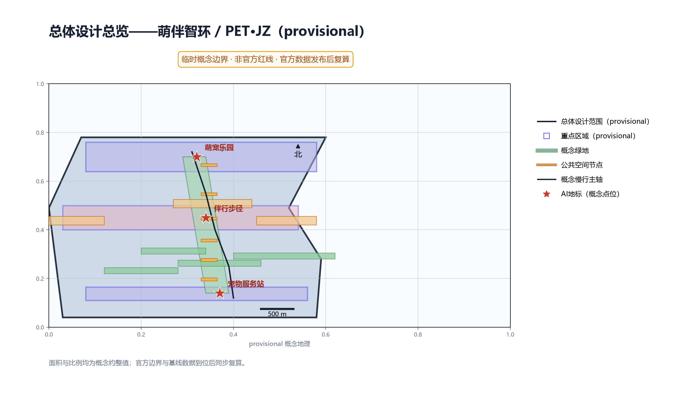
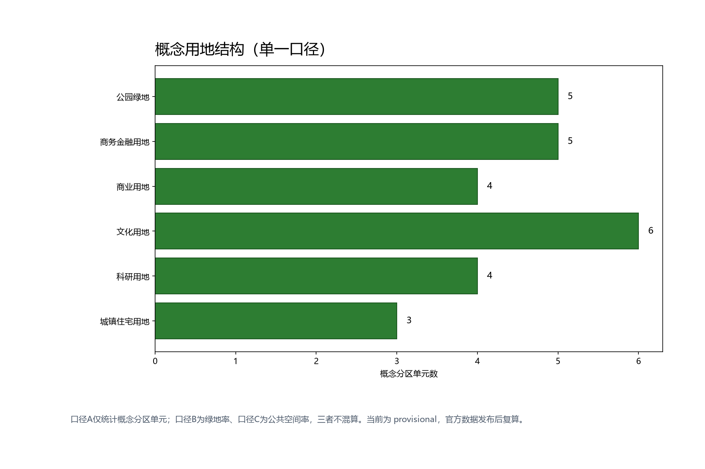
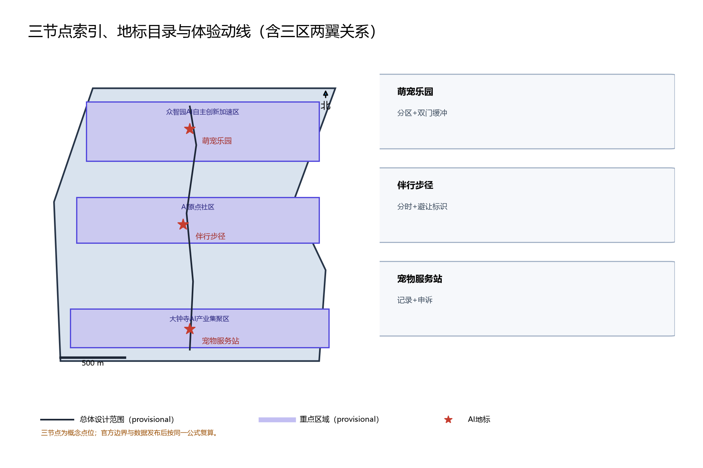
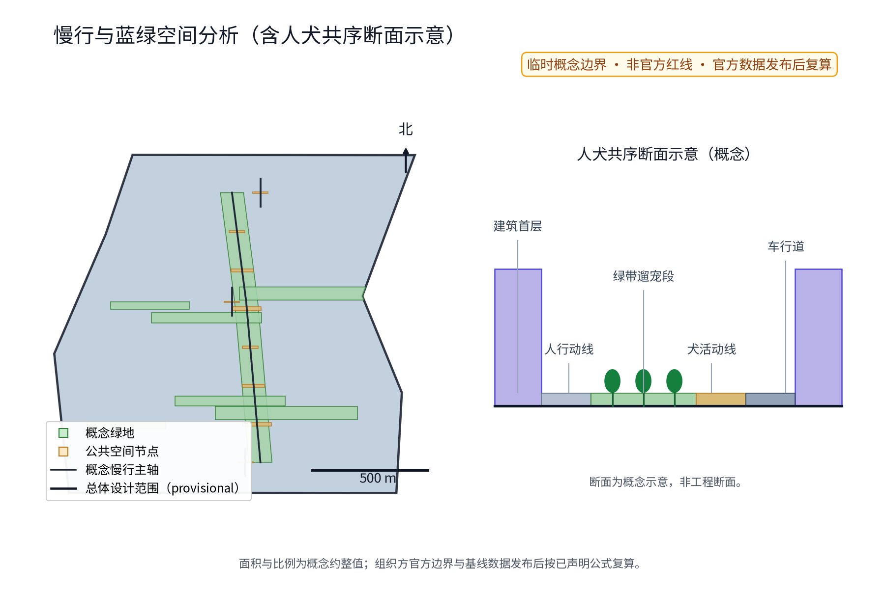
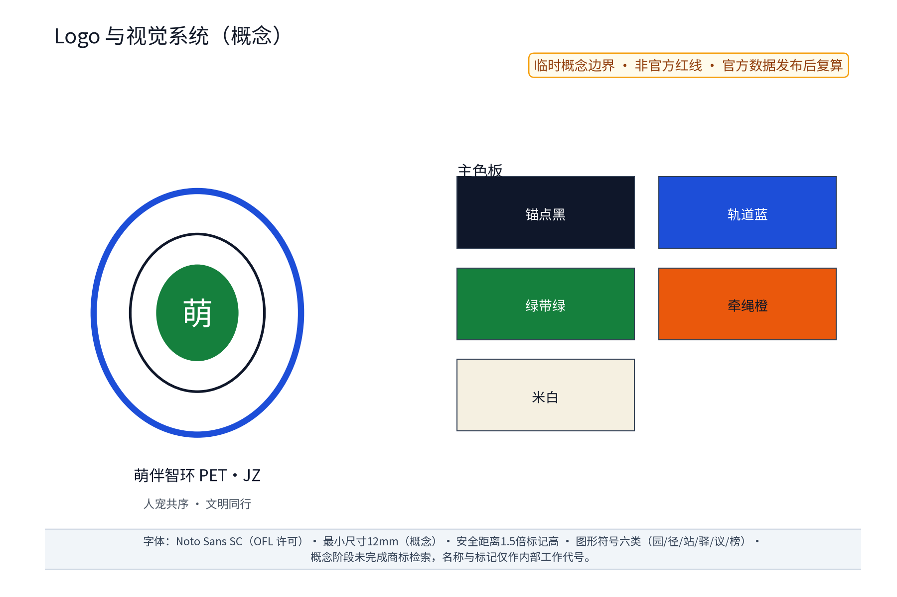
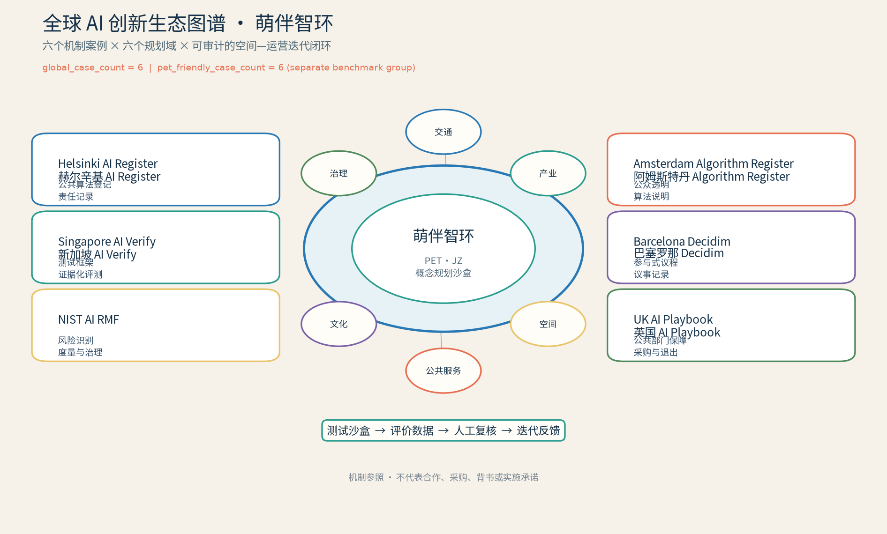

> 编制定位：本方案为宠物友好专项概念方案，属概念建议层面；不给出容积率、建筑高度、拆改留或工程实施结论，不编造官方数据。唯一命名层级为：中文主名称「萌伴智环」；英文长名称 Smart Companion Loop；跨语言锁定标记 PET·JZ；「人宠共序」是传播与运营母题，不是另一品牌。曾用工作代号 CMP.JZ 已弃用，Pet Pal Loop/PET PAL LOOP 不属于本包命名。全文数据均为参与者临时模型数据，非权威数据。

## 设计依据与资料清单

资料清单所列公开史料、规划报道与通则规范等均为概念工作依据清单，并非本包已获取的数据；本包实际使用的全部数据见 sources.json，未获取项已在假设与缺失数据说明中如实标注。清单覆盖：征集公告与任务书（总体概念含主名称、英文名称与命名体系、公共空间体验、全龄友好生活与社区治理维度，以及六项智能体任务）；京张铁路遗址公园沿线「留改拆并举、优先保留遗址公园肌理与铁路历史遗存」公开口径；中关村创新文化公开材料；无障碍环境建设法及相关无障碍设计公开规范；养犬管理相关公开法规口径；国内外宠物友好公共空间与AI创新生态公开案例。逐条书目的机构、链接、发布与获取日期登记于 sources.json，未查证项一律降级为「待研究假设」而非正式证据。资料缺口同步声明：仓库尚无官方总体边界与重点区几何，本稿面积与指标均为 provisional 临时几何下的低置信度设计模型值，官方边界与数据发布后触发复算；容积率、建筑高度等依赖未公开官方控制条件的指标保持 unknown，不给数值。

> **证据锚点**：[source:DATA-SRC-OFFICIAL-ANNOUNCEMENT]、[source:DATA-SRC-AGENT-TASKBOOK]。

## 三层范围工作框架

三层范围按官方公告文本口径表述：统筹研究范围约 43.6 km²、总体设计范围约 11.4 km²、重点区域合计约 368.4 公顷（官方公告文本口径，非本包自算）；本包子范围位于总体设计范围内，以三处重点区域为详设锚点，全部边界标注 provisional，不构成承诺性边界。采用「统筹研究—总体设计—重点区域」三层递进框架：统筹研究层开展产业与未来城市研究，判断养宠需求与沿线社区、产业、公共空间的协同关系；总体设计层以城市更新与控规深度开展「一园一径一站」宠物友好网络的总概念与慢行骨架设计；重点区域层聚焦萌宠乐园、伴行步径、宠物服务站三节点的详细设计。三区两翼映射为概念分工：众智园加速区承载乐园场景与AI养护小模型验证，AI原点社区承载步径日常体验，大钟寺产业集聚区承载服务站与新业态接口，中关村科技服务翼与小月河场景赋能翼提供算力、数据与场景开放机制；本框架为概念组织，不属于法定分区、控规或工程结论。

> **证据锚点**：[source:DATA-SRC-AGENT-TASKBOOK]、[source:DATA-SRC-PROVISIONAL-BOUNDARIES]。

## 统筹研究范围产业与未来城市研究

未来城市的检验尺度之一是人与宠物能否共处公共空间。统筹研究将养宠议题作为公共空间体验、全龄友好生活与社区治理三者的接缝：一面是养犬家庭、养宠老年人、带娃家长与不养宠居民的日常摩擦与安全顾虑，一面是宠物服务、消费与数字化场景的产业机会。区域协同以「三区两翼」协作圈概念展开：北纬社区（共创、无障碍与社区治理）、未来科学城（AI测试方法与人才交流）、怀柔科学城（生态和动物福利方法交流）、经开区（设备运维与可逆组件验证）及京津冀方向（案例互换与传播协作）构成沿线宠物友好服务与治理协同的五个支点，形成「养宠服务互通、治理经验互鉴、数据要素共享（匿名聚合）」的区域回路（概念）；海淀区作为京张创新带核心承载区段，其高校、科创园区与中关村文化构成沿线养宠文明叙事的语义来源。对标案例仅按公开渠道概述，逐例登记机构、链接与日期于 sources.json：纽约与伦敦公开实践显示，为公园划定遛犬专用区、实施分时与牵绳规则可减少人宠冲突；新加坡公开经验包括在公园划定宠物活动区域并明确牵绳与清理要求；东京公开做法包括发布遛犬地图与犬籍登记服务流程提示；上海、深圳等国内公开试点方向包括宠物友好商场与公园的倡导性分区，均属公开信息层面的方法借鉴，不编造细节、不搬用其数据与尺度。

| 案例 | 国家/城市 | 性质 | 启示 | 来源（机构·URL·日期） |
|---|---|---|---|---|
| 纽约市公园局犬区 | 美国/纽约 | 宠物友好公园 | 遛犬专用区+分时与牵绳规则 | nycgovparks.org·官网·2026-08获取 |
| 伦敦皇家公园 | 英国/伦敦 | 宠物友好公园 | 指定犬区+牵绳与清理职责 | royalparks.org.uk·官网·2026-08获取 |
| 新加坡国家公园局 | 新加坡 | 宠物友好公共空间 | 宠物活动区+明确规则 | nparks.gov.sg·官网·2026-08获取 |
| 东京都犬籍登记 | 日本/东京 | 犬籍登记与遛犬地图 | 遛犬地图+登记流程提示 | metro.tokyo.lg.jp·官网·2026-08获取 |
| 上海宠物友好试点 | 中国/上海 | 国内试点方向 | 宠物友好商场与公园倡导分区 | shanghai.gov.cn·官网·2026-08获取 |
| 深圳宠物友好公园 | 中国/深圳 | 国内试点方向 | 宠物友好公园倡导性实践 | sz.gov.cn·官网·2026-08获取 |

> 本表六行仅计为宠物友好对标案例（pet_friendly_case_count=6），不计入 global_case_count。

> **证据锚点**：[source:DATA-SRC-PROVISIONAL-BOUNDARIES]、[source:DATA-SRC-GENERATIVE-AI-INTERIM-MEASURES]。

## 总体设计范围城市更新与控规深度城市设计

总体设计沿京张绿带公共空间体系组织「一园一径一站」概念环线，利用绿带缝合东西、贯通南北的开放结构设置宠物友好节点与慢行联系；全部为可移位、可替换的概念结构，不是道路红线、地块或工程定位。三节点坚持存量优先、轻介入、可逆组件方向：萌宠乐园利用绿带边侧场地，伴行步径利用既有慢行绿带，宠物服务站复合社区服务点，均不提出建筑指标与开发强度。控规深度以「问题—空间对象—指标—资料缺口—复算路径」表达：每处节点写清解决的问题、空间对象、对应指标、待补资料与官方数据到位后的复算触发条件；容积率、建筑高度、拆除量保持 unknown，不以概念方案替代控规审批。用地结构采用单一口径：口径A仅统计 land_use.geojson 的概念分区单元数，分母为“不适用”，不声称面积占比，也不以总体设计范围作分母；共 27 个概念分区单元，且 27=5+6+5+4+4+3，类别与本包 land_use.geojson 及图件一致。「绿地率约 12%」为蓝绿图层复算口径（口径B：概念绿地几何并集面积 ÷ 11,412,825.386 m² 场地边界面积，本包复算值 11.6%）；「公共空间率约 0.4%」为公共空间节点区口径（口径C：公共空间几何面积 ÷ 同一场地边界面积，本包复算值 0.4464%）。口径A只数概念分区单元，口径B/C才使用场地面积分母，三者统计对象不同、不可混算，并将在官方数据发布后按各自公式整体复算。

> **证据锚点**：[source:DATA-SRC-MOHURD-CONTROL-DETAILED-PLANNING]、[metric:land_use_zone_count]。

## 重点区域详细设计

三处节点的设施选址均为概念点位，须经现场踏勘、资料核验与主管部门评估及公众意见后重新落位；节点间的绿带动线与慢行通道构成完整体验动线，详细平面与剖面以图册与 geometry 层表达。三处地标目录（概念）：其一「萌宠乐园」（英文唯一对应 Pet Park，众智园侧）：集中遛宠与社会化场地，分犬型活动区、宠物饮水与冲洗点、密闭粪便收集设施、主人休憩观察区，人行动线与犬活动线分离；双门缓冲只配置在本节点入口与分区转换处，不属于伴行步径；其二「伴行步径」（英文唯一对应 Companion Trail，AI原点社区侧）：绿带内宠物友好慢行路径，分时遛宠时段、牵绳提示与避让标识、沿途宠物饮水驿站，与无宠慢行共享绿带；其三「宠物服务站」（英文唯一对应 Pet Service Station，大钟寺侧）：犬证登记指引、疫苗与年检提醒、走失信息协助、领养信息发布，复合社区服务点，设人工窗口、公示栏与意见箱。三节点均配置「萌伴荣誉榜」（英文唯一对应 Smart Companion Honor Board）荣誉展示体系（集体荣誉与志愿表彰，荣誉来源公开标注、内容人工复核）与「可逆组件库」可逆公共空间组件（座椅、驿站、饮水冲洗、标识、收集桶等模块化组件，可拆装、可轮换、可分级复用，支持节事临时布设与平日静默两种状态）。体验动线与九节点目录（3处地标+6处AI场景节点，概念）：乐园入口缓冲节点、分犬型活动区节点、乐园观察座区节点、步径东驿站节点、步径西驿站节点、服务站窗口节点、服务站领养信息墙节点、居民议事亭节点、年度公示栏节点。无障碍与包容：残障用户任务旅程（视障用户经触觉标识与语音提示到达驿站、轮椅使用者经无障碍通路进入乐园观察区、听障用户以文字与图示获取时段信息）均以大字、触觉、语音、人工与纸本通道覆盖，并预留人工服务兜底。

四条可感知体验路径（概念）把空间动作与治理边界连起来：

| 使用者 | 现场动作 | 可见/可触载体 | AI只做什么 | 人工与退出 |
|---|---|---|---|---|
| 养犬家庭 | 到达—双门缓冲—按犬型进入—饮水—离场清理 | 分区色带、牵绳牌、清理点、观察座 | 汇总时段拥挤提示草案 | 志愿者现场引导；冲突升高即停用该时段 |
| 无宠居民 | 读取安静时段—沿避让侧通行—提交意见 | 双向箭头、实体时段牌、意见箱 | 只汇总时段意见，不识别人 | 社区议事逐条回应；投诉可转人工 |
| 残障用户 | 通过无障碍入口—触摸/听取提示—在服务站办理 | 连续触觉线、语音按钮、大字纸本 | 生成可供工作人员校对的提示草案 | 人工窗口和电话长期保留；不可达即撤换组件 |
| 管养人员 | 核对资产牌—确认工单—清运/补水—闭环公示 | 资产编号、密闭收集桶、维护卡 | 对类别和时段做去标识分类 | 管养人员确认派单；误派连续发生即关闭模型 |

这些路径不是观察数据或既成设施承诺，而是供专业团队、社区与动物福利人员共同演练的验收脚本；每次演练同时记录人、宠物、儿童、过敏/怕犬人群和一线管养人员的异议，避免“宠物友好”被单一养宠视角替代。

三条可感知验收脚本把空间体验与指标绑定：**早高峰**在伴行步径入口用实体分时牌、连续触觉线和可避让宽度标记，测试养犬家庭与无宠居民能否在不依赖手机的情况下选对路径；**放学后**在萌宠乐园的双门缓冲、儿童可见边界和饮水/冲洗点进行亲子与怕犬人群演练，记录冲突处置闭环与误入次数；**雨后清运时段**在服务站与收集桶之间走一遍“上报—人工派单—清运—公示”链路，记录闭环时长、异味投诉和人工改写。三类脚本均以纸本、电话和现场观察为对照，未达到阶段门时先调整或撤除组件，不以模型输出替代空间安全判断。

> **证据锚点**：[data:PACKAGE-GEOMETRY]（三节点示意多边形来自本包 geometry/key_areas.geojson）、[metric:landmark_count]、[metric:scenario_node_count]。

## AI 创新生态、人才画像与 AI+ 场景

本节把 AI 作为“证据—空间—运营—复盘”的受限工具，而不是自动决策者。六域机制是：产业域用开发者沙盒接入脱敏工单，空间域把模型输出转成可撤除组件，交通域只做时段统计与避让提示，公共服务域生成登记/疫苗办理草稿，文化域编排文明养宠叙事，治理域把意见分类为议事材料。模型选择按任务分级：规则/模板优先；需要文本归纳时采用可审计的小模型；任何推荐都必须与人工基线对照。评测样本由自愿纸本、电话、窗口记录和匿名计数构成，去标识后按场景、时段和人群分组；每周记录误报、漏报、人工改写率与申诉量。任一关键指标连续两次未达到试点阈值、出现无法解释的群体差异、或无法在规定时限内人工复核，即停用模型、保留实体服务并进入「可逆退场」复盘。

规划创新的落点不是“部署一个模型”，而是把每次模型输出锁定在一条可审计的规划链上：**观察窗口 → 场景卡 → 空间动作 → 规则/模型草案 → 人工门 → 公示指标 → 保留、调整或撤除**。例如，分时调度先用实体时段牌和人工计数建立基线，再让小模型提出时段草案；只有当议事会确认冲突处置脚本、无宠居民与养宠家庭都完成演练，才允许把草案转成可撤换标识。这样 AI 改变的是规划迭代速度与证据可见性，不改变法定控制、公共决策主体或一线人员的最终责任。

五类画像为养犬家庭、不养宠居民、养宠老年人、带娃家长和宠物行业从业者；社区工作者、高校学生、残障用户和一线管养人员作为共创与监督角色。十张场景卡采用统一字段，明确用户、数据、空间、模型、运营方、人工兜底、隐私控制、失败模式、阶段门、成效指标和停止条件：

| 卡 | 用户 / 数据 | 空间 / 模型 | 运营方 / 人工兜底 | 隐私控制 / 失败模式 | 阶段门 / 成效指标 / 停止条件 |
|---|---|---|---|---|---|
| 01 登记提醒 | 养犬家庭；受控登记号、到期日 | 服务站；规则模板 | 服务站；窗口复核 | 受控可关联记录、分离存储；错提醒 | 流程核查；送达/更正率；两次误报即停 |
| 02 走失协助 | 居民；自愿描述、时间窗 | 服务站信息墙；文本检索 | 志愿团队；人工核实撤下 | 去标识公告；误认 | 伦理审查；撤下时限；无法核验即停 |
| 03 分时调度 | 有宠/无宠居民；匿名时段计数 | 乐园/步径；规则+小模型 | 议事会；实体时段牌 | 匿名聚合；时段冲突 | 公约备案；错峰/投诉变化；冲突升高停用 |
| 04 清洁工单 | 保洁人员；类别、时段 | 乐园/步径；分类模型 | 保洁方；人工派单 | 去标识；漏报积压 | 现场演练；闭环时长；卫生风险即停 |
| 05 知识问答 | 居民；匿名问题语料 | 服务站；检索增强草稿 | 专业团队；人工审稿 | 仅批准语料；错误法规答复 | 语料审查；采纳/纠错率；错答即停 |
| 06 领养匹配 | 志愿者；公开领养信息 | 服务站；标签匹配 | 服务站；人工家访 | 公开信息；不当匹配 | 动物福利审查；回访完成率；风险即停 |
| 07 驿站报修 | 管养人员；设备类别 | 驿站；工单分类 | 运营机构；人工确认 | 最小字段；误派 | 资产备案；修复闭环率；误派连续两次停 |
| 08 议事纪要 | 居民/残障用户；去标识意见 | 议事亭；摘要草稿 | 社区；逐条校订 | 不保留身份；遗漏少数意见 | 公开校对；议题覆盖率；申诉即停用摘要 |
| 09 荣誉编排 | 志愿者/集体；公开事迹 | 荣誉榜；模板编排 | 社区；事实核验 | 只记集体；夸大或污名化 | 公示核验；更正率；无法核验不发布 |
| 10 开放沙盒 | 开发者；匿名聚合样本 | 开发者社区；基线评测 | 专业团队；人工安全审查 | 隔离沙盒、无回传；重识别风险 | 准入审查；基线提升/公平性；风险即关停 |

行业验证协议把“准入—验证—退出”写成可执行卡：

| 协议 | 准入条件 | 验证方法与指标 | 退出条件 |
|---|---|---|---|
| T01 人犬动线 | 权属/管养待核、公众公约备案、无障碍预审 | 纸本+观察双基线；冲突处置闭环率、双门缓冲通行误差 | 动物福利或儿童安全事件；撤收组件 |
| T02 分时共享 | 现场时段样本与无宠居民同意；实体牌同步 | 前后对照+分群访谈；错峰率、投诉变化、标识辨识率 | 任一群体持续恶化；停用时段并议事 |
| T03 受控提醒 | 数据控制者、最小字段、删除路径确认 | 人工基线对照；误报、漏报、更正率、人工介入率 | 无法逐条复核或出现越权访问；关闭模型 |

global_case_count=6 仅统计以下六个可追溯 AI 创新生态案例，不与前述六个宠物友好空间对标案例合并；两个计数不相加为一个“12案例”指标：global_case_count=6，pet_friendly_case_count=6。六个 AI 案例为赫尔辛基 AI Register（公开登记）、新加坡 AI Verify（测试框架）、NIST AI RMF（风险治理）、阿姆斯特丹 Algorithm Register（算法透明）、巴塞罗那 Decidim（参与式议事平台）、英国政府 AI Playbook（公共部门采购与治理）。六例分别对应本方案的登记、公示、基线评测、算法说明、居民议事和采购门槛；均为公开网页的机制级借鉴，不代表合作、采购或背书。生态图谱中的主体链为高校/研究—开发者—企业—专业团队—社区/主管部门—居民，成果经沙盒评测、年度公示、备案与复盘后才可转化。

| AI创新生态案例（global_case_count） | 机制证据 | 本方案可迁移设计 | source_id |
|---|---|---|---|
| Helsinki AI Register | 公共算法登记与责任记录 | 每张试点场景卡公开目的、责任方、审查状态与变更记录 | CASE-HELSINKI-AI-REGISTER |
| Singapore AI Verify | 测试框架与证据化评测 | 场景开放前登记基线模型、测试集、误差日志与人工签字 | CASE-SINGAPORE-AI-VERIFY |
| NIST AI RMF | 风险识别、度量与治理闭环 | 每个场景附风险、缓解、残余风险和停用/重启字段 | CASE-NIST-AI-RMF |
| Amsterdam Algorithm Register | 面向公众的算法透明 | 在服务站和离线网页公开用途、数据边界与责任角色 | CASE-AMSTERDAM-ALGORITHM-REGISTER |
| Barcelona Decidim | 参与式议程与议事记录 | 将居民提案、异议和回应沉淀为可复核的公共记录 | CASE-BARCELONA-DECIDIM |
| UK AI Playbook | 公共部门采购与保障指引 | 采用无供应商绑定的无障碍、安全、权属与退出核查表 | CASE-UK-AI-PLAYBOOK |

六例只作机制参照，不代表合作、采购、背书或实施承诺。迁移路径固定为“案例原则→本地场景卡→基线对照→人工复核→公众公示→年度保留或撤除决定”。为使规划创新可审计，AI层设置三条明确闭环：路径闭环以规则分时表与小模型草案对照，只发布人工确认后的实体时段牌；维护闭环以人工分类与分类草案对照，只生成经管养人员确认的工单；服务闭环将可关联登记记录锁定在既有服务流程内，禁止跨场景拼接，工作人员负责发出或更正提醒，公共页面只展示聚合计数。每条闭环在试点前记录样本窗口、分组、基线、模型版本、人工修改、误报/漏报复核、申诉与停用决定，再进行年度比较。

> **证据锚点**：[source:DATA-SRC-GENERATIVE-AI-INTERIM-MEASURES]、[metric:industry_test_scenario_count]、[metric:scenario_card_count]；全球案例逐项来源登记于 sources.json。

## 用地、建筑规模与拆改留方案

用地表达采用公共空间、绿地与公共服务设施的概念分区方向，不改变法定用地性质；萌宠乐园与伴行步径落在既有绿带及边侧场地方向，宠物服务站复合社区服务点，均不涉及新增建设用地判断，也不触碰文保、绿地与蓝线约束。用地分类单一口径（口径A）见下表：它只读取 land_use.geojson 的 27 个 feature 作为“概念分区单元”，分母为“不适用”，因此不表达用地面积占比；类别名称与单元数须与图件及指标文件一致，官方法定用地和面积数据发布后另行复算：

| 用地类别（口径A） | 概念分区单元数 | 说明与复算触发 |
|---|---|---|
| 公园绿地 | 5 | 含京张遗址公园活力带概念；此行仅计单元数 |
| 文化用地 | 6 | 概念分区；此行仅计单元数 |
| 商务金融用地 | 5 | 概念分区；此行仅计单元数 |
| 科研用地 | 4 | 概念分区；此行仅计单元数 |
| 商业用地 | 4 | 概念分区；此行仅计单元数 |
| 城镇住宅用地 | 3 | 概念分区；此行仅计单元数 |

建筑方面不给规模结论：服务站为概念包络，仅说明功能复合与窗口化服务，不给出基底面积、层数、建筑高度或容积率；驿站类设施按轻量、可逆、装配式组件方向描述，不构成建筑面积承诺。「可逆组件库」为专项设施策略：座椅、驿站、饮水冲洗、标识、收集桶等以模块化组件提供，可拆装、可轮换、可分级复用，支持节事临时布设与平日静默两种状态。拆改留执行「现状与权益核查—保留优先—轻适修配—移位或删除」概念四步：先核实现状、权属与安全条件，能保留则不拆改，确需适配时采用可逆轻改造，冲突无法解决时移位或删除概念部件；未开展调查与官方边界确认前，不提出任何具体拆除面积、拆除量或保留清单。容积率、建筑高度、拆除量均保持 unknown，注明等待官方控规、测绘与建筑调查资料。

> **证据锚点**：[source:DATA-SRC-MNR-LAND-USE-CLASSIFICATION]、[depth:retain_renovate_demolish]、[metric:land_use_zone_count]。

## 交通、轨道、市政与公共服务设施

交通：伴行步径作为概念性慢行支线，与京张绿带既有慢行系统、社区步行圈和无障碍通道衔接，通过分时遛宠与人犬避让标识实现共享，不给断面、路权或交叉口工程结论。轨道与步行圈关系：宠物服务站以轨道站点与社区步行圈的可达性为概念选址原则（大钟寺区域已设轨道交通站点接驳属公开信息），不涉及任何线路、线位或站点工程判断。市政为概念示意层级：饮水驿站与冲洗点的给水、排水（含宠物冲洗废水去向方向）仅作概念示意并说明接口要求，不给水量、能耗或工程量结论；粪便收集采用密闭收集容器与清运服务衔接的概念方向，卫生与噪声冲突按「安全优先—卫生次之—噪声末位」概念优先级处置，具体管养由专业团队深化。公共服务：犬证登记指引、疫苗提醒须与主管部门既有服务流程衔接（概念），服务站配置人工、纸本、电话等非数字等价通道，防止数字鸿沟；无障碍设施（大字、触觉、语音、坡道与净宽）按无障碍环境建设相关公开规范执行（概念），并纳入试点验收清单。所有设施以「有资产编号、有维护责任、可停用复开」为运营前提，本段不构成任何工程方案。

> **证据锚点**：[source:DATA-SRC-MOHURD-URBAN-DESIGN-MEASURES]、[source:DATA-SRC-BARRIER-FREE-ENVIRONMENT-LAW]。

## 蓝绿空间、公共空间与城市风貌

蓝绿体系以既有绿带为骨架，「一园一径一站」作为绿地内的公共空间组件嵌入，优先做遮阴、坐憩、饮水、标识与粪便收集等耐久可修部件，延续铁路遗产与学院社区的低眩光、朴素尺度风貌；不设霓虹或电子大屏依赖，不搞网红化地标。宠物饮水、冲洗与粪便收集设施均按可移动、可替换组件概念设计，避免对既有绿化和树冠造成不可逆影响。公共空间体系同时承担文明养宠治理界面：分时时段、牵绳提示、清理责任、意见通道与矛盾化解机制以实体标识与人工服务落实。三项 formal 核心视觉指标与面积复算：site_area_sqm、green_ratio、public_space_ratio 由投稿方提供的 site_boundary、green_space、public_space 几何在 EPSG:4548 投影下复算得出；当前几何为 provisional 临时边界（official_boundary=false、geometry_role=provisional_constraint），指标值为低置信度的临时设计模型值，仅用于设计模型表达；官方边界、绿地与公共空间范围正式发布后，必须按同一公式触发复算并同步更新指标与视觉页面数值。容积率、建筑高度等依赖未公开官方控制条件的指标保持 unknown、value null。

> **证据锚点**：[source:DATA-SRC-MOHURD-URBAN-DESIGN-MEASURES]、[metric:green_ratio]、[metric:public_space_ratio]。

## 更新项目清单、实施政策与分期计划

三类更新项目清单均为概念项目：一、乐园场地——萌宠乐园（分犬型活动区、饮水冲洗、粪便收集、观察座区）；二、伴行路径——伴行步径与驿站（分时遛宠、避让标识、饮水驿站）；三、服务站点——宠物服务站（登记指引、疫苗提醒、走失协助、领养信息，复合社区服务点）。分期计划为概念节奏：近期（1-3年）机制先行——文明养宠公约、分时遛宠许可、居民养宠议事试点，宠物服务站复合社区服务点并开通登记与提醒服务；中期（3-5年）完善乐园与步径，分犬型活动区与饮水冲洗设施到位，AI+养宠场景进入后场小范围验证；远期（5-10年）形成环线网络与长效运营，按年度评估对设施与AI工具作保留、修改或移除。试点区域建议以萌宠乐园与伴行步径示范段为首期试点，试点范围与选择程序须经主管部门论证并听取公众意见后确定。实施采用决策门（concept-gate）机制：每一期启动前须通过立项论证、公众意见与合规审查，未获批不进入实施；设置停止条件与退出机制（撤收）：试点验证不达指标或公众接受度波动时，可中止该节点并撤收可逆设施，恢复原状。实施组织建议采用RACI分工（概念）：牵头为属地部门，协作与日常运维为运营机构，技术支持为高校与企业，评审为专家团队，共建参与为社区、居民、商户与志愿者；同时探索开发者社区机制（匿名聚合数据接口与沙盒共建、年度开发者活动与萌伴积分激励）、场景开放机制（场景开放目录、测试沙盒与评价数据反馈闭环）与招引转化机制（青年创意孵化、宠物服务新业态对接、年度成果展示与备案）。三节点实施与长期运营台账（概念）如下：

| 节点 | 责任方（RACI概念） | 前置条件 | 成本等级 | 维护频次 | 暂停/撤除 | 年度复盘 |
|---|---|---|---|---|---|---|
| 萌宠乐园 | 运营机构牵头、社区协作 | 现状权属核查+公众评议 | 中 | 季度巡检 | 指标不达标即撤收 | 年度公示 |
| 伴行步径 | 社区牵头、志愿者协作 | 分时公约备案+时段公示 | 低 | 月度巡检 | 冲突上升即停用时段 | 年度公示 |
| 宠物服务站 | 属地部门牵头、高校协作 | 既有服务流程衔接+合规审查 | 中 | 月度巡检 | 服务评估不合格即调整 | 年度公示 |

年度活动体系按「日—周—季—节—月」分层滚动，居民意见通道与年度公示贯穿全程：

| 年度活动品牌 | 频次 | 载体 | 运营主体（概念） |
|---|---|---|---|
| 文明养宠登记周 | 年度/周 | 宠物服务站 | 属地部门+服务站 |
| 领养开放日 | 年度/日 | 萌宠乐园 | 服务站+志愿者 |
| 伴行步道季 | 季度/季 | 伴行步径示范段 | 社区+商户+志愿者 |

年度运营不是单次活动，而是“开园前核查—季度维护—季节性共创—年度复盘—保留/调整/撤除”的资产生命周期。每一轮复盘把现场观察、分群意见、动物福利记录、卫生噪声记录、无障碍异议、工单闭环和模型日志放在同一张公开摘要中；原始可关联服务记录不进入公共页面。建议的年度运营台账如下：

| 周期 | 运营动作 | 复核证据 | 决策输出 |
|---|---|---|---|
| 开园前 | 权属、管养、文保、给排水、无障碍、动物福利与公众意见核查 | 核查清单、异议和未决项 | concept-gate 通过/暂缓 |
| 每月 | 资产巡检、清运/补水、服务站人工复核、投诉分级 | 资产编号、维护卡、申诉时限 | 修复、换件或人工兜底 |
| 每季度 | 分时公约、儿童与怕犬人群安全演练、开发者沙盒审查 | 分群观察、误报/漏报、人工改写 | 调整时段、关闭模型或保持 |
| 每年 | 指标与官方数据复算、公众公示、年度活动评估、案例更新 | 版本化摘要、来源与版权台账 | 保留、轻适修配、移位或撤除 |

运营台账只规定证据和责任接口，不预设政府购买、企业合作、投资或活动已经确定；其价值在于让专业团队能够把概念节点转译为可检查、可解释、可退场的长期公共资产。

治理机制以连续三句展开。其一，谁决策——建议由主管部门会商运营机构与沿线主体（含联盟与专家团队），以议事机制对分时时段、设施设置与年度活动作出决定，本方案不表达任何权属或授权结论。其二，如何公开——建议将年度复算结果、试点评估与设施调整记录通过公示与备案程序向公众公开，具体范围与频次待正式规定明确。其三，如何监督——建议以公众意见通道、志愿者巡查与定期评估形成外部监督闭环，并参考积分与分级反馈结果滚动改进。分期不含投资测算、审批结论或已确定安排，仅为供专业团队深化研究的参考节奏。

> **证据锚点**：[source:DATA-SRC-AGENT-TASKBOOK]、[metric:annual_program_count]、[metric:phase_count]。

## 指标体系、面积复算与合规矩阵

指标体系分三类：可从提交几何复算的 provisional known 指标、依赖官方控制的 unknown 指标、需运营后设定的绩效阈值。三项 formal 核心指标公式：site_area_sqm = 场地边界几何投影面积（EPSG:4548）；green_ratio = 绿地几何面积 ÷ 场地面积；public_space_ratio = 公共空间几何面积 ÷ 场地面积。当前均为低置信度临时设计模型值，标注 provisional 来源与公式；官方边界及绿地、公共空间数据发布后触发强制复算，复算结果须同步到指标文件与视觉页面数值。指标均标注数据来源、公式、置信等级、用途限制与复算触发：

| 指标 | 公式 | 置信等级 | 用途限制 | 复算触发 |
|---|---|---|---|---|
| site_area_sqm | polygon_area(site, EPSG:4548) | medium | 概念展示与讨论 | 官方数据发布后 |
| green_ratio | union(green)/site_area | low | 概念展示与讨论 | 官方数据发布后 |
| public_space_ratio | union(public)/site_area | low | 概念展示与讨论 | 官方数据发布后 |
| 容积率、建筑高度、拆改留量 | unknown（value null） | — | 不提供结论 | 官方控规资料发布后 |

合规矩阵对接任务书“公共空间体验、全龄友好生活、社区治理”三个维度与 agent.1-6 任务覆盖声明，逐条映射禁止性清单：不给出容积率、建筑高度、具体拆改留或工程实施结论；不编造宠物数量、登记量与政策承诺；不把设想活动写成已确定安排；AI场景按匿名聚合、去标识运营记录、受控可关联服务记录分层。公开指标只发布匿名聚合；登记仅用于服务履约，不进行个体识别式追踪。可关联服务记录不等同匿名聚合，禁止跨场景拼接，公共页面只发布分组后的统计与复核状态。所有指标均为参与者临时模型数据，非权威数据；与公告口径一致处按公告自算、非官方核发。

> **证据锚点**：[metric:site_area_sqm]、[metric:green_ratio]、[metric:public_space_ratio]。

## 风险、版权与合规说明

本方案为概念研究性设计，不构成行政审批依据，也不构成容积率、建筑高度、拆改留或工程可行性结论；风险已按边界误读、AI辅助漂移为监控、动物福利与人宠矛盾处置、运营维护责任、品牌在先权利五维度如实登记于 assumptions.json 与缺失数据说明（应对原则：来源标注、人工复核、意见通道与法定程序）。品牌在先权利与使用边界：概念阶段尚未完成官方商标检索，唯一命名层级为「萌伴智环」/ Smart Companion Loop / PET·JZ；各节点分别固定为「萌宠乐园」/ Pet Park、「伴行步径」/ Companion Trail、「宠物服务站」/ Pet Service Station，均按内部工作代号处理，限制对外使用与注册，待在先权利检索与正式评选确定后方可评估对外使用，本方案不作出「不涉及商标」类自证声明。AI治理边界按三句表述：面向公开指标仅匿名聚合数据；关键决策人工复核；禁止过度监控（不进行个体识别式追踪）。隐私实施：登记数据来自既有服务流程时属于受控可关联服务记录，仅用于服务履约、不做个体画像；匿名统计、去标识运营记录与可关联服务记录不得混称，数据控制者、处理基础、最小字段、保留期限、删除与申诉路径见 AI 章节数据流表，并保留人工、纸本、电话等非数字替代通道；不以个体识别式追踪为设计目标，禁止跨场景拼接、定位扩展或画像。版权与许可：本稿文字与表格为参与方与AI协作原创，图件全部为自绘，字体采用 Noto Sans SC（OFL 许可）；对标案例仅概述公开渠道信息并注明来源与获取时间，不复制其图样与数据；本包整体为 COMMUNITY-DISPLAY-ONLY 许可，仅用于社区展示与评审讨论。全部内容为开放共创的建议性参考方案，不替代正式规划，不构成政府审定、批准、实施安排或任何承诺；正式实施前须由专业团队结合官方边界、权属、文保、市政与运营条件深化复核。

> **证据锚点**：[source:DATA-SRC-OFFICIAL-ANNOUNCEMENT]。

## 参考资料

proposal 正文使用短标识引用（完整带日期后缀的条目 ID 见 sources.json）。参考资料以政府正式发布版本为准，按公开/内部分类存档并标注获取时间：

| 类别 | 内容与用途 |
|---|---|
| 任务书 | 公开任务书摘录（三大定位、五大功能、三区两翼、agent.1-6、禁止性清单）——架构与合规依据 |
| 公告 | 百年京张AI创新带城市设计国际方案征集资格预审公告（2026-05-09 发布）——范围与任务文本口径 |
| 投稿技能 | urban-design-ai-submission 技能——概念建议属性、结构与边界要求 |
| 参考样例 | 参考样例提案——章节组织与边界表述范本 |
| 对标案例 | 纽约、伦敦、新加坡、东京及上海、深圳宠物友好公共空间公开实践（方法借鉴，公开概述，逐例登记于 sources.json） |
| 标准规范 | 无障碍环境建设法及无障碍设计公开规范、用地用海分类指南、城市设计管理办法（公开规范，概念参照） |
| 几何 | provisional 临时边界（official_boundary=false）——设计模型值来源，官方数据发布后触发复算 |
| 待补资料 | 官方总体边界与重点区几何、控规、绿地与公共空间范围、权属与管养资料、养宠需求与承载力基线 |

完整机器索引（来源、指标、合规矩阵、设计深度矩阵与自检记录）按投稿技能要求另行登记；正式深化前必须补齐官方边界、权属、地形、建筑与管线调查、文保控制、控规、交通与运营资料。

> **证据锚点**：[source:DATA-SRC-OFFICIAL-ANNOUNCEMENT]（本清单首条即组织方公开资料包）。

## 品牌识别与视觉系统（PET·JZ 原创）

品牌识别是 agent.1 与 agent.4 的核心交付：本专项以「萌伴智环」为中文主名称，英文长名称固定为 Smart Companion Loop，跨语言锁定标记固定为 PET·JZ，形成「萌宠乐园—伴行步径—宠物服务站」乐园—路径—服务闭环，并建立完整视觉识别系统概念。节点对照唯一且全包一致：「萌宠乐园」/ Pet Park、「伴行步径」/ Companion Trail、「宠物服务站」/ Pet Service Station、「萌伴荣誉榜」/ Smart Companion Honor Board；CMP.JZ、Pet Pal Loop 与 PET PAL LOOP 均为废止称谓。Logo 方向三个（概念）：方向A「回环爪印」——回环主体+爪印四瓣分切+开口留白，寓意百年轨道与萌宠同行；方向B「轨道绳结」——PET·JZ 字标以绳结环扣与遛犬绳语汇构成，字即环、连即径；方向C「方寸驿站」——以 1:1.414 网格呼应铁路枕木意象，一格一驿。构成与使用规则：Logo 最小尺寸 12mm（概念）；安全距离为 1.5 倍标记高；色彩系统五色（轨道蓝、牵绳橙、绿带绿、米白、锚点黑）按使用场景分级；字体采用 Noto Sans SC 开源字体（OFL 许可）；图形符号六类（园/径/站/驿/议/榜）覆盖节点、导视、驿站、议事与荣誉场景。原型（概念）含标识立柱、手机端图标、信息板与荣誉屏四种物理与数字样例，多语言示例以中英双语为主并预留多语种扩展；「人宠共序」为原创机制词：以分时秩序为叙事主线、节点设施为标点、年度活动为章节，形成可复用的表达规范。国际传播叙事（概念）：以「百年京张 × 人宠共序」为国际传播母题，统一视觉输出、中英双语素材包与年度海外展陈建议，全部为概念建议。品牌视觉系统详见 logo-petjz 图件、A0-01 总控板与 visual 页面。

> **证据锚点**：[source:DATA-SRC-AGENT-TASKBOOK]（视觉识别与Logo方向要求）。

## 附：AI创新生态图谱图件

「全球AI创新生态图谱」图件（ecosystem-atlas）以「萌伴智环」为核心节点，将高校与科研、创新企业、开发者社区、风险资本、政府与公共服务、人才与用户六个圈层与六域（交通、产业、空间、公共服务、文化、治理）及 global_case_count=6 的六个 AI 创新生态案例并列呈现；纽约、伦敦、新加坡、东京、上海、深圳六个宠物友好对标案例仅计 pet_friendly_case_count=6，绝不并入全球 AI 计数。图谱标注测试沙盒、评价数据与迭代反馈闭环，作为 agent.2「5-8个全球AI创新生态案例」与 agent.6「开发者社区与场景开放」的证据图件；案例逐条登记于 sources.json，不得引申为官方背书或实施承诺。

> **证据锚点**：[source:DATA-SRC-AGENT-TASKBOOK]。
