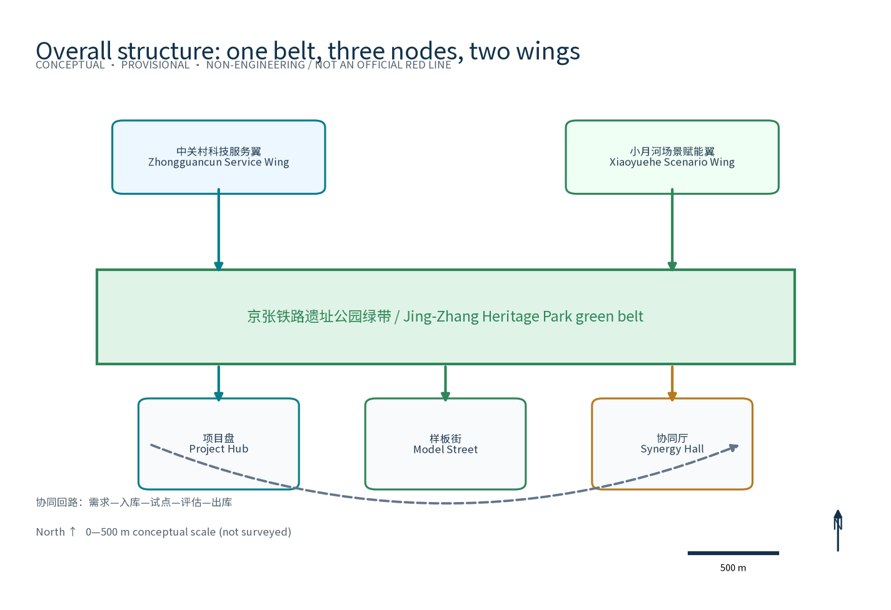
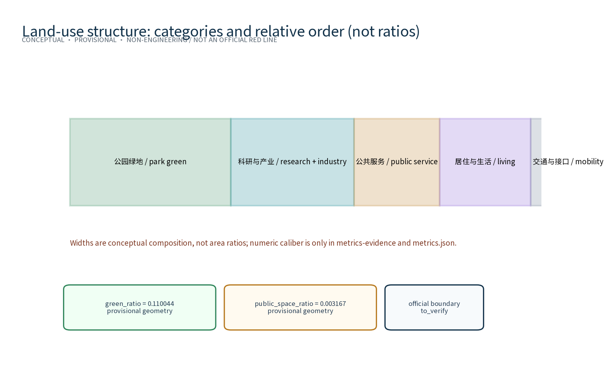
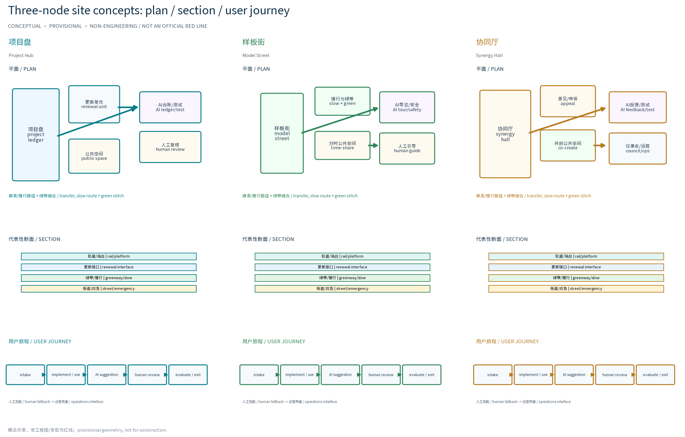
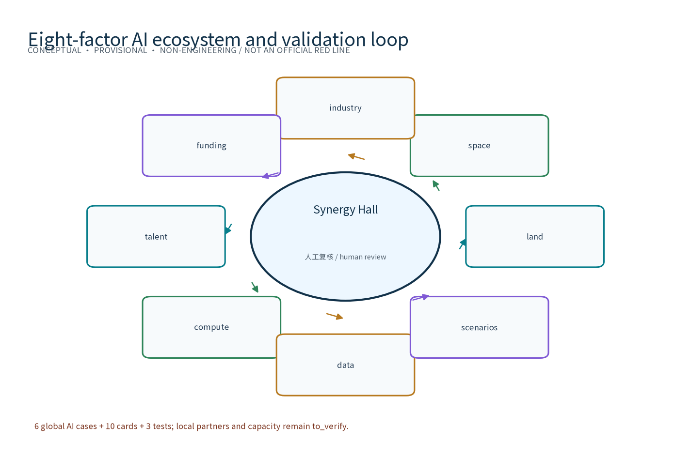
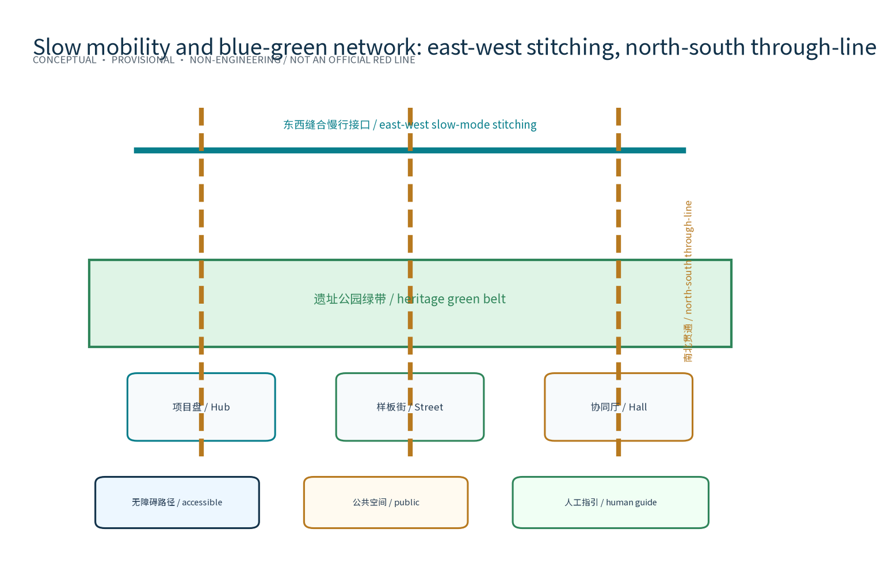
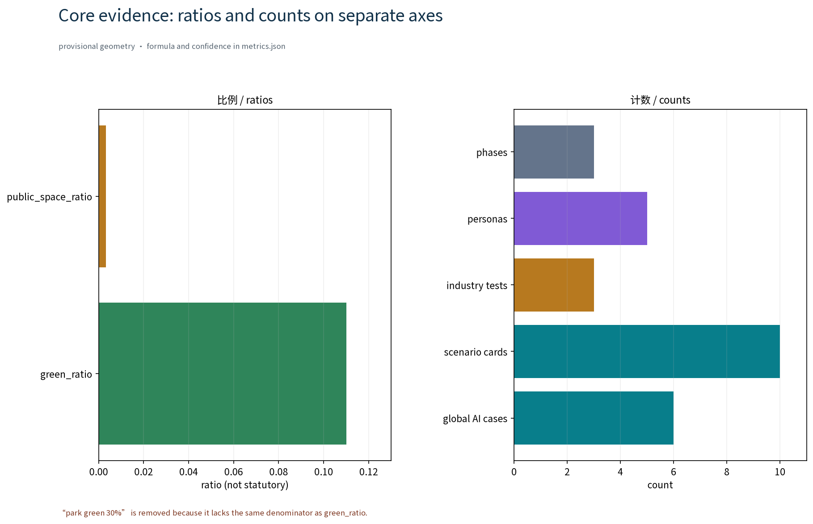

> Positioning: a key-area renewal special-topic concept chapter for the OPEN CITY · HAIDIAN Centennial Jing-Zhang AI Innovation Belt urban design open call. This draft is only a concept proposal and reference scheme for professional teams to deepen; it gives no FAR, building height, retain-renovate-demolish or engineering conclusions and fabricates no demolition/construction data. All boundaries and site choices are provisional and subject to adjustment after data verification.

## Design Basis and Source List
The materials listed here are a concept working-basis list of public records, planning reports and general norms, not data already obtained by this package; all data actually used by this package is registered in sources.json, and items not obtained are honestly marked in the assumptions and missing-data notes. The main basis includes: the open-call announcement and taskbook (which require renewal-led stock development, a renewal project list, implementation policy and phasing, and define the three scope levels and the three-areas-two-wings caliber); the public principle that along the Jing-Zhang Railway Heritage Park, renewal keeps, renovates and demolishes in parallel with priority on preserving the park fabric and railway heritage; the Beijing Urban Renewal Regulation and related public guidance and special plans; and public standard texts including the Urban Design Measures, the Measures for Compiling and Approving Regulatory Detailed Plans, the national land-sea use classification guide, the Barrier-Free Environment Law and the Interim Measures for Generative AI Services. Data gaps are registered honestly: the organizers have not published verifiable coordinate-system official boundaries or the three key-area polygons; road redlines, rail protection conditions, heritage protection ranges, green/blue lines, land ownership, municipal capacity and statutory control conditions are all unavailable. All geometry in this package is provisional, for generation, visualization and machine recalculation only; formal compilation must verify each item against official publications.

> **Evidence anchor**: [source:DATA-SRC-OFFICIAL-ANNOUNCEMENT], [source:DATA-SRC-AGENT-TASKBOOK] (the organizers' announcement and taskbook are the text-caliber basis).

## Three-Level Scope Framework
Per the official text caliber of the taskbook, the three scopes are: the coordinated research area, i.e. the area of Haidian's three-areas-two-wings AI industry layout, about 43.6 km2 in total (bounded by the North 5th Ring Road on the north, the Jingzang Expressway on the east, Xizhimen Outer Street on the south and Wanquanhe Road on the west); the overall design area of about 11.4 km2; and the key areas of about 368.4 ha. This package is a key-area renewal special-topic concept chapter within them; the geometry layer uses the overall-design-area caliber as its conceptual base map, every boundary is a provisional conceptual boundary that does not replace statutory planning scope, and everything will be recalculated when official graphics are published. The three levels transfer progressively: the coordinated research level outputs the renewal-list governance environment and regional synergy judgment that constrain the overall design level; the overall design level verifies node layout, the rolling-list mechanism and temporal growth that are then detailed at key-area node level; each level keeps machine-readable evidence anchors mapped to the corresponding taskbook chapter. Three-areas-two-wings synergy loop (concept): the renewal needs of the AI Origin Community, the Zhongzhiyuan AI Self-Dependent Innovation Acceleration Area, the Dazhongsi AI Industry Cluster, the Zhongguancun Technology Service Wing and the XiaoYuehe Scenario Empowerment Wing are organized by this special topic's list mechanism into renewable, implementable and assessable renewal units, forming a synergy loop where list governance supports the linkage of three areas and two wings; the loop is only a conceptual mechanism suggestion and the official interpretation prevails.

> **Evidence anchor**: [source:DATA-SRC-AGENT-TASKBOOK] (three-level scopes and three-areas-two-wings follow the official taskbook text caliber).

## Coordinated Research Area: Industry and Future City Research
The industry and future-city research identifies the fitting effect of the renewal project list: the project library and model implementation organize the development needs of universities, innovation clusters, rail stations and neighborhoods along the corridor into renewable, implementable and assessable renewal units, forming a three-level linkage of renewal nodes, innovation clusters and residential areas; project ranking follows the weights open, learnable, evolvable and landable rather than land value alone, identifying high-synergy renewal units as list priorities. The research conclusions are directional suggestions only and imply no land-use or investment commitments. The AI full-stack ecosystem eight-factor mechanism (conceptual framework): land and space factors are carried by the renewal list and provisional geometry; industry and talent factors are organized by synergy nodes and personas; the funding factor is expressed only as cost tiers (low/medium/high) and phasing rhythm, never as precise investment estimates; computing and data factors are bounded by public services and anonymized aggregation; the scenario factor is carried by the scenario-card system; the eight factors form a factor-matching ledger (concept) at the Synergy Hall (协同厅). Regional synergy (conceptual cooperation hypotheses, to be verified): the list mechanism is proposed to build cooperation interfaces toward Beiwu Community (北纬社区), Future Science City (未来科学城), Huairou Science City (怀柔科学城), the Economic-Technological Development Area (经开区) and the Beijing-Tianjin-Hebei region (京津冀), such as computing sharing, data interfaces, talent flows and scenario replication; cooperation partners, resources and current status have no verifiable data, this proposal fabricates no cooperation arrangement, and these items are registered only as research hypotheses.

> **Evidence anchor**: [source:DATA-SRC-PROVISIONAL-BOUNDARIES] (boundaries are provisional; the research scope is conceptual only).

## Overall Design Area: Urban Renewal and Regulatory-Plan-Level Urban Design
The overall design organizes the renewal project list around the Jing-Zhang Railway Heritage Park green belt as the skeleton: renewal units are delineated under the keep-renovate-demolish-in-parallel principle with priority on preserving the park fabric and railway heritage; a unit-project two-level list with a rolling update mechanism forms the closed loop of intake, implementation, evaluation and exit; renewal facilities grow reversibly and streets carry renewal and festival needs on a time-shared basis; regulatory-plan indicators are only calibration suggestions and never preset or replace statutory regulatory-plan conclusions. Overall spatial structure (concept): one belt, three nodes, two wings — the belt is the heritage-park green belt, the three nodes are the Project Hub (项目盘), the Model Street (样板街) and the Synergy Hall (协同厅), and the two wings point to the three-areas-two-wings synergy loop; east-west stitching refers to stitching slow-traffic, public space and functional interfaces across the green belt, and north-south through-connection refers to the through-line along the belt connecting to rail stations; both are conceptual strategies, not engineering conclusions; the overall structure drawing is in site-overview and the A0 boards.

### Brand Identity and Visual Direction (Concept)
Overall naming system: the master name is Renewal-List Smart Ring (RENEW·JZ · Renewal Project List Special Topic), node names are Project Hub (项目盘), Model Street (样板街) and Synergy Hall (协同厅), forming a layered naming system of master name, node names and scenario names. Visual identity and Logo direction: a ring-plus-rail basic graphic (see assets/figures/logo-belt.png and the A0 boards), with dark blue and steel cyan as primary colors and sleeper orange as the accent, and a direction of sans-serif Chinese typography paired with monospaced numerals; applications extend to boards, signage, digital interfaces and event materials. Source and rights registration of brand fonts, graphics and generated assets: graphics are original drawings, fonts are public system fonts, and the rights boundary of generated assets is stated in the risk/copyright section and sources.json; names and marks are used only as internal working codenames and are not registered or used commercially until prior-rights clearance is completed. Mapping of the three positionings and five functions (concept): the Centennial Jing-Zhang Culture Belt corresponds to renewal under heritage-preservation premises; the Urban AI Life Experience Belt corresponds to experiencable, displayable and promotable AI life scenario carriers; the AI Integration Innovation Belt corresponds to list-based organization of industry-space integration; the five functions (AI full-stack self-dependent innovation system, world-class AI innovation ecosystem, AI+ scenario empowerment paradigm, intelligent AI vibrant city, and global discourse power of AI governance) map respectively to the list mechanism, synergy nodes, scenario validation, vitality delivery and governance expression. Planning innovation thinking: a renewal-list governance environment that unifies space, industry and operation, and reversible components with time-shared carrying to reduce trial-and-error cost — all conceptual planning innovation suggestions.

> **Evidence anchor**: [source:DATA-SRC-MOHURD-CONTROL-DETAILED-PLANNING], [source:DATA-SRC-PROVISIONAL-BOUNDARIES].

## Detailed Design of Key Areas
All three node facility sites are conceptual points that must be relocated after site survey, data verification, authority assessment and public comments. Node selection criteria (conceptual criteria, not conclusions): rail-station and slow-traffic accessibility, railway heritage and public-space resources, stock-renewal potential, three-areas-two-wings functional complementarity, and pilot demonstration value. Original node one, the Renewal Project Library · Project Hub (项目盘): the convergence, comparison and visualized decision hub for renewal projects along the corridor, with the factor-matching ledger and evaluation module; node two, the Renewal Model Section · Model Street (样板街): a demonstration street space of keep-renovate-demolish in parallel, with a time-shared section and a public progress board; node three, the Renewal Synergy Station · Synergy Hall (协同厅): a renewal service station where government, property owners, the public and AI tools cooperate, with a compliance-verification window and a public comment channel. Jing-Zhang Heritage Park public-space strategy (concept): low intervention, light, transparent and reversible, preserving the railway heritage fabric and green-belt sightlines, with public-space components organized as a modular reversible component library; east-west stitching and north-south through-connection are implemented at node level as slow-traffic interfaces and functional-interface joints. Dazhongsi AI-native business mix (concept): the renewal synergy mechanism organizes AI-native consumer and business scenarios such as experiential retail, algorithm-curated spaces and prototype test stores; both business mix and sites await verification. Catalog of three AI pilgrimage landmarks (concept): Smart-Ring Lounge (智环客厅, public display of AI outcomes beside the Project Hub), Rail-Shadow Gallery (轨影长廊, railway memory and AI art along the heritage-park belt), and Synergy Beacon (协同灯塔, a governance-transparency symbol beside the Synergy Hall); all three are reversible lightweight structure concepts and not construction commitments. Honor display system (concept): a sleeper-motif honor wall and annual honor roster publicly showing renewal contributors, developers and volunteers; reversible public-space component library (concept): modular seating, reversible pavilions, time-shared floor graphics, movable greenery and temporary stands, all demountable and recyclable.

> **Evidence anchor**: [data:PACKAGE-GEOMETRY] (three-node schematic polygons come from geometry/key_areas.geojson).

## AI Innovation Ecosystem, Personas, and AI+ Scenarios
AI innovation ecosystem atlas (concept): an ecosystem atlas with six closed loops of computing, data, scenario, talent, capital and space organizes the belt's AI innovation ecosystem (see assets/figures/ecosystem-atlas.png); the eight-factor mechanism is its operating rule and the global cases in the appendix are its benchmarks. Five persona types: entrepreneurs, AI developers, community residents, students and renewal implementation staff, with core needs and participating scenarios in the persona table; simultaneously, age-friendly and inclusive design covers the elderly, people with disabilities, children, people with limited digital skills, low-income groups and existing merchants; personas and inclusive design are all conceptual suggestions. The AI-governance three-sentence rule runs through all scenarios: process only anonymized aggregated data, keep human review for key decisions, and prohibit excessive monitoring. Technical protocols (concept): model evaluation and benchmark testing before a scenario goes online, data-quality and false-positive-rate monitoring during operation, error-stratification attribution and an operation-monitoring report; protocol details follow the formal implementation assessment. The ten scenarios cover six urban domains: transport, industry, space, public services, culture and governance; scenario open access and exit (concept): intake-scored admission, open access through public notice and filing, renewal or exit decided by annual review; decommission conditions and failure fallbacks are in the scenario cards.

| Persona | Core needs | Participating scenarios | Inclusive design |
|---|---|---|---|
| Entrepreneurs | Landing, growth, resource matching | Ledger AI, investment-matching AI | One-stop synergy window |
| AI developers | Tool co-building, open APIs | Compliance AI, event scheduling AI | Open-source alliance, credit incentives |
| Community residents | Life participation, informed oversight | Feedback AI, evaluation AI | Non-digital channels, annual notice |
| Students | Learning practice, study spaces | Tour AI, test scenarios | Study space, volunteer channel |
| Renewal staff | Project management, progress coordination | Progress AI, ledger AI | Human-review backstop, tiered access |

| Scenario card | Scenario name | Spatial carrier | AI capability and input data | Output and human-review node | Privacy and data boundary | Appeal · decommission · failure fallback |
|---|---|---|---|---|---|---|
| SC-01 | Renewal project ledger AI | Project Hub and online portal | Structuring, multi-source comparison and visualized search of renewal project info | Categorization results for industry/space projects, human review before intake | Anonymized aggregate project data and public info only, minimal necessary collection | Parties may appeal data caliber; decommission when data sources go stale; fallback to manual ledger |
| SC-02 | Renewal progress tracking AI | Model Street site signs and public board | Progress aggregation, caliber calibration and anomaly alerts | Progress board and anomaly alerts, human review at key nodes | Anonymized aggregate progress data only, no individual tracing | Implementers may appeal progress caliber; decommission on caliber conflicts; fallback to on-site manual checks |
| SC-03 | Keep-renovate-demolish compliance AI | Synergy Hall compliance window | Compliance-point checking of keep-renovate-demolish proposals and basis indexing | Compliance hints; case conclusions only after human review | Public-caliber and statutory texts only, no individual data collection | Parties may appeal results; decommission when statutes update; fallback to legal manual review |
| SC-04 | Renewal effect evaluation AI | Project Hub evaluation module | Anonymized aggregation of public-space, transport and industry vitality indicators | Evaluation reports with data version noted and human review | Anonymized aggregation, no individual tracing | Subjects may appeal caliber; decommission when data versions expire; fallback to baseline manual recalculation |
| SC-05 | Public renewal feedback AI | Synergy Hall comment channel and online entry | Comment classification, merging and deduplication | Comment summaries to the council; processing results published | Comments presented anonymized and aggregated, no identity collection or tracking | Commenters may query progress; decommission on clustering distortion; fallback to manual comment ledger |
| SC-06 | Slow-traffic safety alert AI | Model Street slow-traffic section | Anonymous flow and weather aggregation alerts | Safety alert boards; anomalies human-reviewed | Anonymous aggregated flows only, no individual tracing | Passers-by may appeal alerts; decommission on excessive false positives; fallback to static safety facilities |
| SC-07 | Heritage tour AI | Heritage-park green belt | Retrieval of public historical materials and multilingual tour generation | Multilingual tour copy; factual statements human-reviewed | Public historical materials only, no visitor location collection | Visitors may appeal narration; decommission on factual disputes; fallback to human guides |
| SC-08 | Investment and demand matching AI | Synergy Hall and Project Hub | Anonymous matching of public industry catalogs and space supply | Matching suggestion lists; human review before business contact | Public info and anonymized aggregates only, no personal contact exchange | Both sides may appeal matches; decommission when catalogs expire; fallback to manual matching |
| SC-09 | Event scheduling AI | Model Street and Synergy Hall | Aggregated optimization of festival scheduling and space booking | Scheduling suggestions and conflict alerts; major events human-reviewed | Booking aggregates only, no individual behavior tracking | Organizers may appeal schedules; decommission on frequent conflicts; fallback to manual scheduling |
| SC-10 | Barrier-free navigation AI | Three nodes and the green belt | Aggregated retrieval of public barrier-free facility information | Barrier-free route suggestions; facility info human-reviewed | Public facility info only, no individual location collection | Users may appeal routes; decommission on distorted facility info; fallback to on-site human guidance |

| Test scenario | Test target | Evaluation indicators (concept) | Data and boundary | Pass standard and recalculation trigger |
|---|---|---|---|---|
| Ledger data quality test | Renewal project ledger AI | Field completeness, duplicate rate, comparison consistency | Public info and anonymized aggregates only | Intake only after three consecutive qualifying months; re-test on caliber changes |
| Compliance recall and false-positive test | Keep-renovate-demolish compliance AI | Recall rate, false-positive rate, missed-case review rate | Public statutory texts only | External release only after false positives below baseline; re-test on statutory updates |
| Comment clustering consistency test | Public renewal feedback AI | Clustering consistency, dedup accuracy, human-review pass rate | Comments presented anonymized and aggregated | Aggregation only after consistency passes; re-test on model updates |

> **Evidence anchor**: [source:DATA-SRC-GENERATIVE-AI-INTERIM-MEASURES] (reference for AI-generated content governance wording).

## Land Use, Building Scale, and Retain-Renovate-Demolish Strategy
Retain-renovate-demolish follows keeping, renovating and demolishing in parallel with keeping as the priority: preserve the heritage-park fabric and railway heritage first, encourage functional replacement of stock buildings with reserved renewal-oriented transformation openings (renewal interfaces, synergy windows), and demolish only scattered buildings that block slow traffic after case-by-case justification, public notice and statutory procedures; this proposal gives no FAR, building height, retain-renovate-demolish figures or engineering conclusions. Single-caliber statement for areas and ratios: all areas and ratios in this proposal follow the metrics.json geometry recalculation as the sole caliber - `green_ratio=0.110044` is green-space geometry divided by the package's provisional site geometry, not a statutory park-green ratio. The figures do not label "park green 30%" or any ratio without the same denominator; land-use structure diagrams express classification and relative order only, while metrics-evidence separates ratios and counts into two independent panels. After official boundaries and redlines are published, everything is recalculated on one unified version with the recalculation version noted.

> **Evidence anchor**: [source:DATA-SRC-MNR-LAND-USE-CLASSIFICATION-202311] (land-use classification terms follow the current national standard caliber).

## Transport, Rail, Municipal Infrastructure, and Public Services
Transport puts slow traffic first: a continuous slow-traffic axis connects the Project Hub (项目盘), Model Street (样板街) and Synergy Hall (协同厅), strengthening smooth connections to rail stations (mainly walking and cycling; corridor relations and station connections are conceptual only, to be confirmed by special studies and statutory procedures); street sections respond on a time-shared basis to daily and festival states, and the Model Street can time-share carrying for renewal and festival needs; east-west stitching and north-south through-connection are implemented at transport level as cross-belt slow-traffic interfaces and along-belt through-lines. Municipal facilities favor intensive sharing, underground coordination and priority use of existing facilities. Public service facilities are supplemented near renewal units by reusing stock space, with multilingual services, renewal-info notice and study spaces; the design is age-friendly and inclusive throughout (concept): elderly-friendly and assisted services, barrier-free access for people with disabilities, child-friendly and parent-child spaces, study spaces for youth and students, rest services for commuters and workers, and multilingual tours for visitors, with priority protection for vulnerable groups; digital interfaces provide barrier-free paths and accessible design while non-digital channels (staffed windows, telephone, offline notice) remain; opinion handling has a transparency mechanism (concept): opinion classification, processing-deadline notice and annual summary publication; all AI decisions have a human-review backstop.

> **Evidence anchor**: [source:DATA-SRC-MOHURD-URBAN-DESIGN-MEASURES] (method reference for municipal and slow-traffic design wording).

## Blue-Green Network, Public Space, and Urban Character
A blue-green public-space system of green belt as the axis and node parks as pearls is built: the heritage-park green belt as the blue-green skeleton connects small green spaces and open spaces along the corridor; renewal service facilities integrate with parks with low intervention, light, transparent and reversible, without blocking heritage remains or belt sightlines; public space is accessible, continuous and pleasant, integrated with the slow-traffic axis. Cultural wayfinding and symbol system (concept, independent from and not to be confused with the belt-level Logo system): a Jing-Zhang railway symbol layer (sleepers, signals, platforms and zigzag-railway vocabulary), a Zhongguancun innovation symbol layer (innovation code and circuit vocabulary) and an AI new-culture symbol layer (data-flow and algorithm vocabulary) are organized in layers under one restrained signage standard; the guidance and interpretation system is unified and restrained, and symbols serve wayfinding and interpretation only, never replacing the belt Logo. The urban character continues the Jing-Zhang railway industrial-memory vocabulary in dialogue with an orderly new atmosphere of renewal; overall character control is restrained and unified, avoiding symbol stacking and slogan packaging; new and renovated interfaces never block heritage sightline corridors; character control is principle-based guidance only, with no specific form or height conclusions.

> **Evidence anchor**: [source:DATA-SRC-MOHURD-URBAN-DESIGN-MEASURES] (method reference for blue-green space organization).

## Renewal Projects, Implementation Policy, and Phasing
The four renewal project list categories (project library establishment, model implementation, synergy mechanism improvement, and evaluation-exit go-live) are conceptual lists; scale and investment estimates are suggestions only. Conceptual phasing: near term (1-3 years) establishes the renewal project library and rolling-list mechanism and starts model-section pilot implementation; medium term (3-5 years) advances the Synergy Hall and Project Hub go-live with rolling list updates; long term (5-10 years) implements the renewal list systematically across the whole area. Implementing actors and pilots (concept): renewal units along the Model Street (样板街) are proposed as the first pilot areas, first running project intake, rolling lists and notice mechanisms, then extending to all renewal units; participating actors cover government (competent departments and sub-district offices), enterprises (property owners, developers and operators), universities (research and practice support), residents (local participation), communities (organizational coordination), operations teams, volunteers, merchants (street-facing operators) and professional teams (planning, legal, evaluation and communication); roles and responsibilities follow the formal implementation plan. Cost-tier caliber: qualitative tiers only (low/medium/high), estimated by benchmarking similar public cases; the price base period is to be fixed at formal implementation; coverage is concept-level construction and operation items; confidence is low; any formal estimate start triggers recalculation; no precise investment amounts are given. Governance mechanisms (concept): major list matters are decided by a multi-party council led by the competent department with property owners and stakeholders participating, with professional teams providing technical support; openness is mainly regular notice, visible list progress and a standing comment channel; oversight combines independent third-party evaluation, a public oversight platform and annual review; participation is organized through flexible forms such as block co-building conventions, volunteer service credits, project and event filing, and government-enterprise-university-research co-building alliances; public space and display resources are used by booking and rotation; information disclosure follows a tiered caliber. Stop and exit conditions (concept): when a project misses its stage gates for two consecutive years, funding or ownership conditions fail, concentrated public opposition survives review, or an AI scenario repeatedly fails operation monitoring, the council evaluates and triggers the stop or exit mechanism, demounting reversible facilities and publishing notice.

| Renewal project | Intake score | Responsible roles (lead/collaborator) | Input data | Deliverables | Stage gate | Operation & maintenance | Cost tier | Public participation | Risk fallback | Exit conditions |
|---|---|---|---|---|---|---|---|---|---|---|
| Renewal project library | Three-dimension score: public value, synergy, implementability | Lead: competent department; collaborate: professional teams, universities | Public announcement, current data, provisional geometry | Library and rolling mechanism go-live | Pilot library built and notice passed | Department + operations team | Low | Intake notice and comment channel | Downgrade to manual ledger on data gaps | Stop if no qualifying projects for two years |
| Model Street pilot | Demonstration, accessibility, heritage value | Lead: sub-district office; collaborate: enterprises, merchants, residents | Site survey, public comments, public-caliber calibration | Concept scheme and implementation guidance | Scheme noticed and approved by council | Operations team + volunteers | Medium | Scheme notice, feedback, hearing | Shrink boundary on ownership deadlock | Exit on concentrated opposition surviving review |
| Synergy Hall and Project Hub go-live | Service coverage, factor matching, governance value | Lead: competent department; collaborate: operations, professional teams | Library data, personas, scenario cards | Service station and digital board | Six-month trial and annual review | Operations + volunteer teams | Medium | Open day, booked experience, annual notice | Suspend then fix on failed monitoring | Decommission if annual review fails twice |
| Whole-area rolling list | Match with three-phase rhythm | Lead: competent department; collaborate: multi-party council | Phase evaluations, official data | Annual list and notice report | Annual evaluation passed | Department + third-party evaluation | High | Annual notice and comment channel | Full recalculation on official caliber changes | Terminate items where statutory procedures fail |
| Annual activity system | Brand value, participation scale, conversion | Lead: operations team; collaborate: volunteers, media | Event schedules, booking data (anonymized) | Annual activity brands and communication materials | Event review and notice | Operations team + volunteers | Low | Booking, volunteering, review notice | Cancel and reschedule on extreme weather | Restructure brands after two low years |

Annual activity system (concept): three annual activities — the Renewal Project Open Day, the Renewal Progress Briefing and the Model Street Experience Week — plus monthly routine activities, quarterly list evaluations and a renewal culture festival, forming an annual rhythm of day-week-month-quarter-festival; the system is a conceptual activity idea, not a confirmed arrangement, and will be planned and noticed separately by the operations team with the competent department, communities and volunteers. Developer-community operation mechanism (concept): an open-source co-building alliance and an annual developer conference as carriers, credit incentives for contributions, filing of projects and tiered API openness, with community rules agreed by convention; public-experience operation and landmark operation: experience routes, booked tours and festival scheduling; international communication and attraction-conversion pathway (concept): bilingual communication materials and media collaboration raise global recognition, converting talent, enterprises and developers through four steps of exhibit, connect, settle and incubate; operation responsibilities, resource needs and annual review indicators (event participation, conversions, notice completion rate, opinion handling rate) follow the formal operation plan.

| Annual activity | Brand and frequency | Organizing actors (concept) | Resource needs (cost tier) | Public participation | Annual review indicators |
|---|---|---|---|---|---|
| Renewal Project Open Day | List Open Day, once a year | Lead: competent department; execute: operations team | Low | Booked visits, comment collection | Participation, opinion handling rate |
| Renewal Progress Briefing | Progress Briefing, once a year | Lead: competent department; participate: multi-party council | Low | On-site Q&A, livestream notice | Reply completion, notice completion |
| Model Street Experience Week | Model Experience Week, once a year | Lead: operations team; collaborate: merchants, volunteers | Medium | Experience activities, volunteering | Participation scale, satisfaction, conversions |

> **Evidence anchor**: [source:DATA-SRC-AGENT-TASKBOOK] (phasing and implementation items respond to taskbook requirements).

## Metrics, Area Recalculation, and Compliance Matrix
The five conceptual indicators are: renewal project intake rate, model-section implementation progress, keep-renovate-demolish compliance verification rate, renewal effect evaluation coverage and public opinion handling rate; definitions, data sources and recalculation triggers are in metrics.json and the text anchors. The three formal core metrics (site_area_sqm, green_ratio, public_space_ratio) follow the package geometry recalculation as the sole caliber, based on provisional boundaries, with formulas and source files in metrics.json and low-to-medium confidence; after official data is published, everything is recalculated on one unified version with the recalculation version noted and never mixed with external calibers. Chart-caliber consistency: ratios inside the land-use-structure figure are only land-use classification and relative-order indications; every ratio figure such as park-green share follows the green_ratio definition in metrics.json (denominator, geometry sources and scope of application in the land-use section); on any inconsistency the geometry recalculation prevails and charts are updated. The compliance matrix maps to keep-renovate-demolish compliance verification and statutory procedure nodes and updates as procedures advance.

> **Evidence anchor**: [metric:green_ratio], [metric:public_space_ratio], [source:PACKAGE-GEOMETRY].

## Risk, Copyright, and Compliance
This proposal is a conceptual research design and is not an administrative approval basis, nor does it provide FAR, building height, retain-renovate-demolish or engineering feasibility conclusions. Risks are registered honestly: ownership coordination complexity with incomplete ownership information, uncertain implementation timing and funding, compliance boundaries changing with statutory procedures, fluctuating public acceptance, and AI tool effectiveness depending on data quality and human review; response principles are anonymized aggregation, minimal necessity, human review, source annotation and comment channels, with details in assumptions.json and the missing-data notes. AI governance boundaries: all AI scenarios process only anonymized aggregated data, keep human review for key decisions and prohibit excessive monitoring; each scenario sets appeal, decommission and failure-fallback boundaries (see scenario cards). Brand prior-rights and use boundary: no formal trademark search has been completed at the concept stage; the names and marks in this proposal (RENEW·JZ, Project Hub 项目盘, Model Street 样板街, Synergy Hall 协同厅, Smart-Ring Lounge 智环客厅, Rail-Shadow Gallery 轨影长廊, Synergy Beacon 协同灯塔, etc.) are used only as internal working codenames and are not registered externally or used as commercial marks before prior-rights clearance; fonts, graphics and generated assets all register their sources and rights boundaries (see sources.json, the copyright statement and the asset rights registration), and no portrait, trademark, paper image or copyrighted material is used without authorization. This proposal fabricates no official data, distorts no historical facts, and holds no official endorsement, approval or implementation commitment; any citation follows the official published text.

> **Evidence anchor**: [source:DATA-SRC-OFFICIAL-ANNOUNCEMENT] (the open-call rules are the basis for ownership and compliance wording).

## References
References follow the government-published versions and are archived by public/internal classification with access dates: the open-call announcement and taskbook; public materials on Jing-Zhang railway history and the heritage park (including the public historical caliber on Zhan Tianyou and the Jing-Zhang Railway); public caliber of the Beijing master plan and district plans; Beijing urban renewal special plans, implementation opinions and supporting documents; urban renewal technical guidelines and standards; international and domestic public cases of renewal and AI innovation ecosystems (see the appendix; per-case sources are registered in sources.json); and site-survey notes and self-drawn analysis sketches (collected by this project, involving no non-public data). sources.json contains only verifiable entries; no official data or links are fabricated; any statement without a verifiable source is demoted to a research hypothesis and honestly marked, and each item should be re-verified before formal submission.

> **Evidence anchor**: [source:DATA-SRC-OFFICIAL-ANNOUNCEMENT] (the first item of this list is the organizers' public material package).

## Appendix: Benchmark Cases (Conceptual Reference; Public-Channel Information Only; Official Data Prevails)

| Case | Location | Mechanism points (for deriving this proposal's mechanisms) | Source |
|---|---|---|---|
| King's Cross regeneration | London | Railway-heritage renewal with long-term public-private partnership; rolling project list and phased implementation; heritage activation and public-space-first mechanism reference | [source:CASE-KINGS-CROSS-2026] |
| The High Line | New York | Abandoned rail infrastructure converted to public space; community-driven, nonprofit-operated, incremental implementation mechanism reference | [source:CASE-HIGH-LINE-2026] |
| Marunouchi renewal | Tokyo | Property-owner co-renewal with block agreements; multi-party council and convention-based operation reference | [source:CASE-MARUNOUCHI-2026] |
| Punggol Digital District | Singapore | Digital district integrated with education and research; open digital platform and scenario-testing mechanism reference | [source:CASE-PUNGGOL-2026] |
| Superblocks program | Barcelona | Public-space reallocation, slow-traffic priority and participatory implementation mechanism reference | [source:CASE-SUPERILLES-2026] |
| Cheonggyecheon restoration | Seoul | Highway demolition and waterway restoration; public space plus cultural-tourism operation mechanism reference | [source:CASE-CHEONGGYCHEON-2026] |
| Superkilen | Copenhagen | Multicultural community participatory public space; component-based design and inclusive expression reference | [source:CASE-SUPERKILEN-2026] |
| Station F campus | Paris | Freight-rail depot converted to a startup community; talent-capital conversion pathway reference | [source:CASE-STATIONF-2026] |

### Global AI innovation ecosystem cases (six; separate from the station/renewal reference group)

These are not TOD or station-district cases. For each case, sources.json records publisher, time, URL, licence/citation boundary, a verifiable fact, translation to Jingzhang's three nodes/two wings, and a non-transferable condition. Any local partnership not stated by the page remains unknown/to_verify.

1. **AI Singapore 100 Experiments (CASE-AI-SG-100E)** - Publisher AI Singapore; date not shown, accessed 2026-08-29; public webpage, attribution-only. The page describes an AI Engineering Hub, an approximately six-month MVP and up to SGD 150,000 co-funding/partner matching. Translation: Project Hub problem call - anonymised sandbox - prototype - field review. Non-transferable: Singapore funding, procurement and jurisdiction.
2. **AI Verify (CASE-AI-SG-AIVERIFY)** - Publisher Singapore IMDA; 2022-05-25; official page, attribution-only. It describes technical tests plus process checks for transparency, bias, safety and accountability and does not guarantee zero risk. Translation: one baseline - stratified error - human review - disclosure gate for the three industry tests. Non-transferable: its voluntary pilot and legal context.
3. **Project Moonshot (CASE-AI-SG-MOONSHOT)** - Publisher Singapore IMDA; 2024-05-31; official page, attribution-only. It describes an open-source LLM testing toolkit with benchmarks, red-teaming and baseline tests. Translation: model-version registration, red-team samples and stop gates at the Synergy Hall. Non-transferable: not emergency command or rail certification.
4. **City of Helsinki AI Register (CASE-AI-HELSINKI-REGISTER)** - Publisher City of Helsinki; date not shown, accessed 2026-08-29; city webpage, attribution-only. It publishes descriptions of city AI systems and a feedback route. Translation: a Synergy Hall register card for purpose, data, human owner, stop condition and appeal. Non-transferable: Helsinki authority, procurement and privacy law.
5. **Pan-Canadian AI Strategy (CASE-AI-CANADA-PAN)** - Publisher Government of Canada/ISED; page modified 2025-10-31; government strategy page, attribution-only. It lists Amii, Mila and Vector and research-to-industry, talent and compute pillars. Translation: the Zhongguancun Technology Service Wing links research - prototype - node test. Non-transferable: federal finance, institute eligibility and local compute supply.
6. **Mila ecosystem (CASE-AI-MILA-ECOSYSTEM)** - Publisher Mila; date not shown, accessed 2026-08-29; institutional webpage, attribution-only. It describes relationships among research, universities, industry partners, startups and incubation/translation. Translation: controlled researcher-company-operator workshops at the Project Hub. Non-transferable: Mila scale, partners and funding.

The eight station/renewal cases above remain spatial and governance references; they do not prove AI ecosystem, compute, model testing or developer-community capacity. `metrics.json` `global_case_count=6` counts only this six-case AI group.

Domestic benchmarks (conceptual reference): Beijing urban renewal special plan and project list (special plan coordinating the project list), Shanghai municipal renewal project library (intake, exit and refined management), Shenzhen renewal unit plans (unit planning and categorized management), and Guangzhou renewal project lists (rolling management of lists and implementation plans). All cases are public references for mechanism derivation only, official data prevails, and the differentiated derivation from the eight-factor mechanism and the three nodes is shown in the A0 boards and metric charts; any statement without a verifiable source has been demoted to a research hypothesis.

> Statement: all content in this draft is a conceptual proposal and reference scheme; it gives no FAR, building height, specific retain-renovate-demolish or engineering conclusions and fabricates no demolition/construction data; the three-level boundaries and three-node sites are provisional and subject to the official caliber, site survey and statutory procedures.
