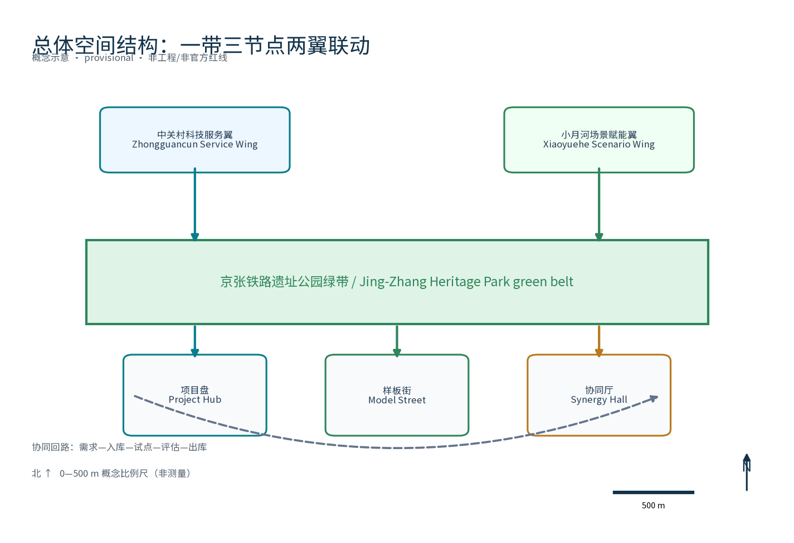
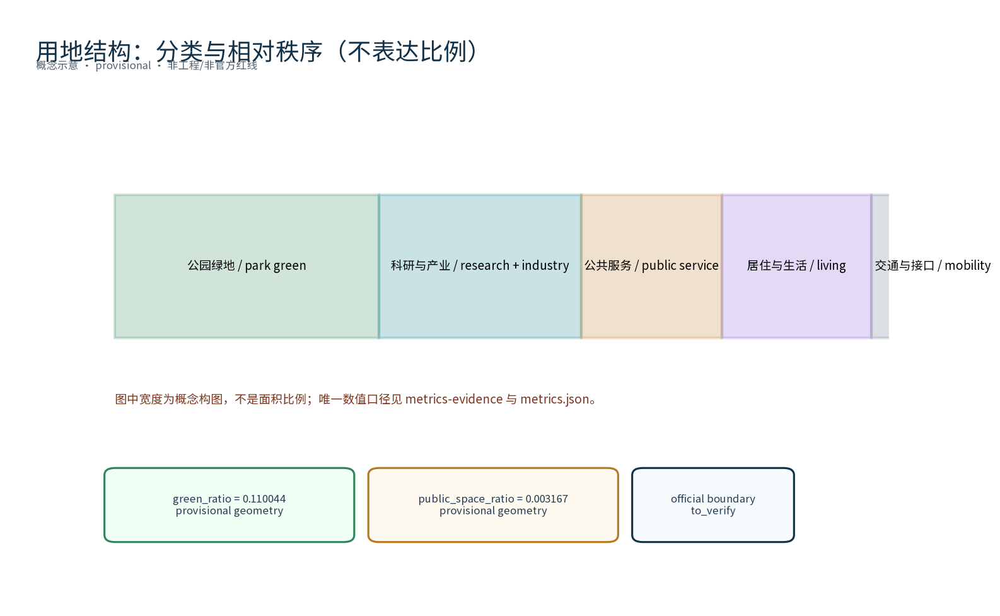
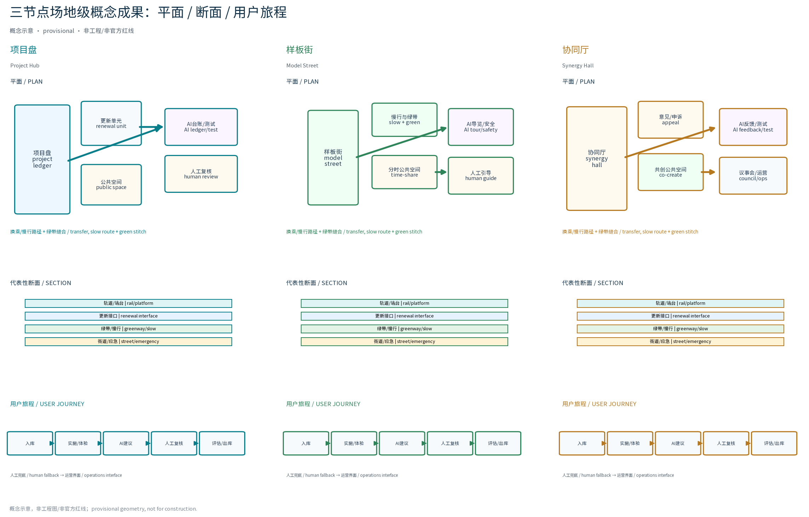
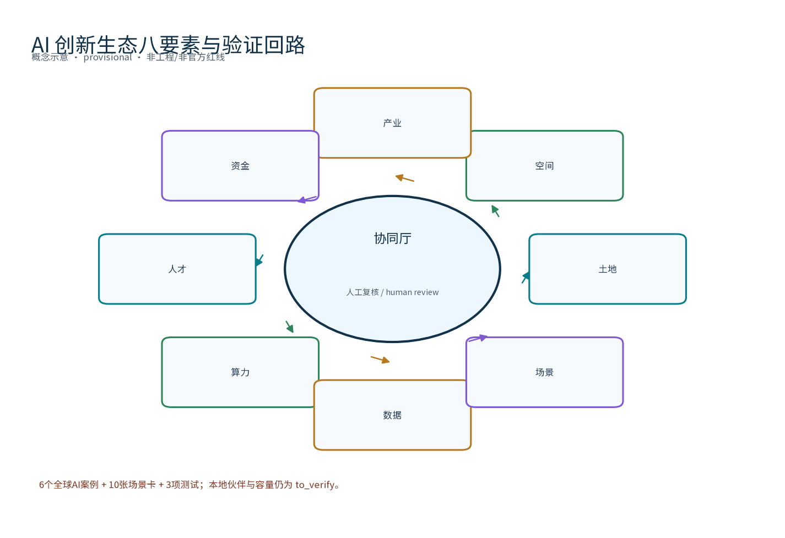
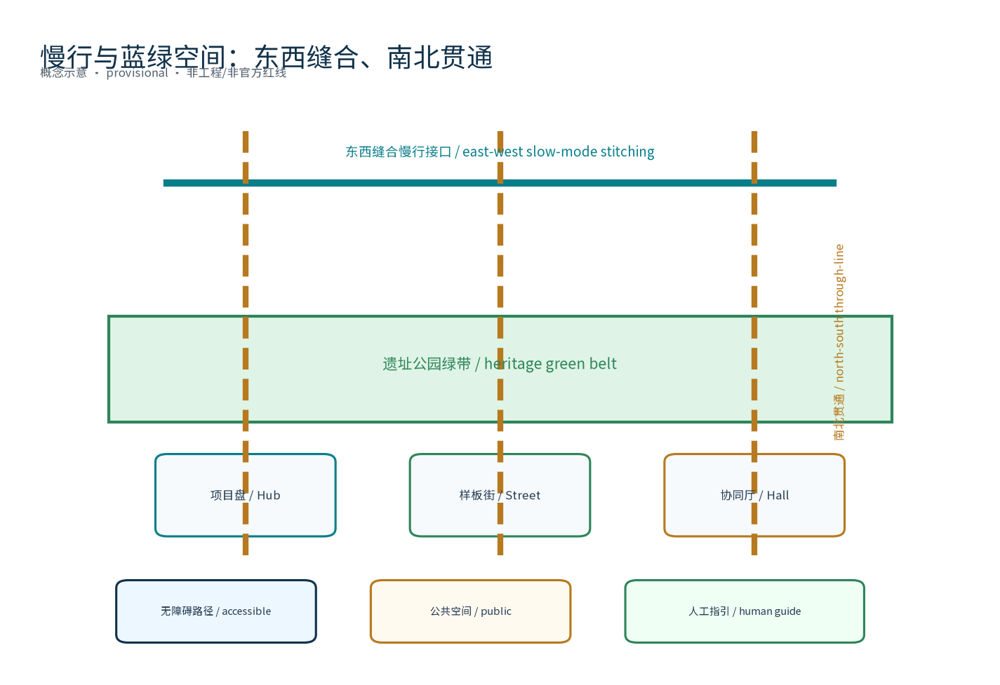

> 定位：面向「OPEN CITY · HAIDIAN 百年京张AI创新带城市设计开源征集」的重点区域更新专项概念章节。本草案仅为概念建议、参考方案，供专业团队深化研究，不给出容积率、建筑高度、具体拆改留或工程实施结论，不编造拆建数据；边界与选址均为 provisional，待资料核验后调整。

## 设计依据与资料清单
本节所列公开史料、规划报道与通则规范等均为概念工作依据清单，并非本包已获取的数据；本包实际使用的全部数据见 sources.json，未获取项已在假设与缺失数据说明中如实标注。主要依据包括：征集公告与征集任务书（要求以存量更新为主、提出更新项目清单、实施政策与分期计划，并明确三层范围与三区两翼口径）；京张铁路遗址公园沿线"留改拆并举、优先保留遗址公园肌理与铁路历史遗存"的公开原则表述；《北京市城市更新条例》及城市更新相关指导意见、专项规划等公开文件；城市设计管理办法、城市镇控制性详细规划编制审批办法、国土空间调查规划用途管制用地用海分类指南、无障碍环境建设法、生成式人工智能服务管理暂行办法等公开标准文本。数据缺口如实登记：组织方尚未发布可验证坐标系的正式总体边界与三处重点区 polygon，道路红线、轨道保护条件、文物保护范围、绿线蓝线、用地权属、市政容量与法定控制条件均未提供，本包全部几何为 provisional，仅供生成、可视化与机器复算，正式编制时应以官方发布文本逐项核验后引用。

> **证据锚点**：[source:DATA-SRC-OFFICIAL-ANNOUNCEMENT]、[source:DATA-SRC-AGENT-TASKBOOK]（组织方公告与任务书为文本口径依据）。

## 三层范围工作框架
按任务书官方文本口径，三层范围依次为：统筹研究范围，即海淀人工智能产业发展的"三区两翼"所在区域，总面积约43.6平方公里（北至北五环路、东至京藏高速、南至西直门外大街、西至万泉河路）；总体设计范围约11.4平方公里；重点区域约368.4公顷。本包定位为其中的重点区域更新专项概念章节，geometry 层以总体设计范围口径为概念底图，所有边界均为 provisional 概念边界，不替代法定规划范围，官方图形发布后整体复算。三层成果逐级传导：统筹研究层输出的更新清单治理环境与区域协同判断约束总体设计层，总体设计层校核的更新节点布局、清单滚动机制与时序生长落实到重点区域节点详设，每层均保留与任务书对应章节的机器可读证据锚点。三区两翼协同回路（概念）：AI原点社区、众智园AI自主创新加速区、大钟寺AI产业集聚区与中关村科技服务翼、小月河场景赋能翼的更新需求，经本专项清单机制组织为可入库、可实施、可评估的更新单元，形成以清单治理支撑三区两翼联动的协同回路；回路仅为概念机制建议，具体释义以官方发布文本为准。

> **证据锚点**：[source:DATA-SRC-AGENT-TASKBOOK]（三层范围与三区两翼划分依据任务书官方文本口径）。

### 三区两翼协同回路与外部接口（概念，不代表既有合作）

| 角色 | 更新输入 | 项目盘输出 | 接口/责任 | 状态边界 |
|---|---|---|---|---|
| AI原点社区 | 生活服务、无障碍、慢行问题 | 样板街候选单元、公众议题 | 小月河场景赋能翼；社区提出、专业团队核验 | 资源与合作状态 unknown |
| 众智园AI自主创新加速区 | 算力、数据、产业场景需求 | 协同厅试点题目、企业/高校对接 | 中关村科技服务翼；平台人工复核 | 伙伴与算力 to_verify |
| 大钟寺AI产业集聚区 | 存量空间、智能原生业态问题 | 遗产公园接口、更新项目包 | 两翼共同评审；产权/文保待核验 | 不构成选址或投资承诺 |
| 中关村科技服务翼 | 科研转化、人才、测试需求 | 评测、开发者、第三方复核入口 | 三节点共享 | 资源清单 to_verify |
| 小月河场景赋能翼 | 社区、公共空间、年度活动需求 | 场景卡、反馈、复盘与退出建议 | 三节点共享，线下优先 | 活动安排 unknown |

北纬社区、未来科学城、怀柔科学城、经开区、京津冀仅作为外部协作接口候选，分别对应社区试用、科研/算力协同、人才转化、产业应用和跨区域场景复制；没有核验对象、资源、协议或现状合作，不得写成既有安排。

## 统筹研究范围产业与未来城市研究
产业与城市研究识别更新项目清单的「适配」效应：以项目库与样板实施把沿线高校、科创片区、轨道站点与住区的发展需求有序组织为可入库、可实施、可评估的更新单元，形成「更新节点—科创片区—住区」三级联动结构；项目排序不以单一土地价值为准，而以"开放、可学习、可进化、可落地"为权重，识别高协同潜力的更新单元作为清单优先项，研究结论仅作方向性建议，不构成对用地与投资的承诺。AI全栈生态八要素机制（概念框架）：土地与空间要素由更新清单与 provisional 几何承接，产业与人才要素以协同节点与画像组织，资金要素仅以成本等级（低/中/高）与分期节奏表述、不作精确投资测算，算力与数据要素以公开服务与匿名聚合为边界，场景要素由场景卡体系承接，八类要素在「协同厅」形成要素对接台账（概念）。区域协同（概念协作假设，待核验）：建议以清单机制建立与北纬社区、未来科学城、怀柔科学城、经开区及京津冀方向的协作接口，如算力共享、数据接口、人才流动与场景复制等方向；协作对象、资源与现有合作状态均无核验数据，本方案不编造任何协作安排，仅登记为待研究假设。

> **证据锚点**：[source:DATA-SRC-PROVISIONAL-BOUNDARIES]（边界为 provisional，研究范围仅作概念示意）。

## 总体设计范围城市更新与控规深度城市设计
总体设计以京张铁路遗址公园绿带为骨架组织城市更新项目清单总体概念：划分更新单元，遵循留改拆并举、优先保留遗址公园肌理与铁路历史遗存；建立"单元—项目"两级清单与滚动更新机制，形成入库、实施、评估、出库闭环；更新设施可逆生长、街道可分时承载更新与节事需求；控规相关指标仅作校核建议，不预设、不替代法定控规指标结论。总体空间结构（概念）：一带三节点两翼联动——一带为京张遗址公园绿带，三节点为「项目盘」「样板街」「协同厅」，两翼联动指向三区两翼协同回路；东西缝合指绿带东西两侧慢行、公共空间与功能界面的缝合，南北贯通指沿绿带与轨道站点接驳的贯通动线，均为概念策略，非工程结论；总体空间结构图见 site-overview 与 A0 图纸。

### 品牌识别与视觉方向（概念）
总体名称体系：主名称「更新清单智环（RENEW·JZ · 更新项目清单专项）」，节点名称为「项目盘」「样板街」「协同厅」，形成主名称—节点名称—场景名称的分层命名体系。视觉识别与Logo方向：以"环与轨"组合为基本图形（见 assets/figures/logo-belt.png 与 A0 图纸），主色为深蓝与钢青、辅以轨枕橙，字体方向为无衬线中文字体搭配等宽数字；延展应用覆盖看板、导视、数字界面与活动物料。品牌字体、图形与生成资产来源与权利登记：图形为自绘原创，字体使用系统公开字体，生成资产权利边界见风险、版权与合规说明及 sources.json；名称与标识在完成在先权利检索前仅作为内部工作代号使用，不对外注册与商业使用。三大定位—五大功能映射（概念）：百年京张文化带对应历史遗存保护前提下的更新，都市AI生活体验带对应可体验可展示可推广的AI生活场景载体，AI融合创新带对应产业与空间融合的清单化组织；AI全栈自主创新体系、世界级AI创新生态、AI+场景赋能新范式、智能化AI活力城市、AI治理全球话语权五大功能分别对接清单机制、协同节点、场景验证、活力承载与治理表达。规划创新思路：以更新清单治理环境统合空间、产业与运营，以可逆组件与分时承载降低试错成本，属概念性规划创新建议。

> **证据锚点**：[source:DATA-SRC-MOHURD-CONTROL-DETAILED-PLANNING]、[source:DATA-SRC-PROVISIONAL-BOUNDARIES]。

## 重点区域详细设计
三节点设施选址均为概念点位，须经现场踏勘、资料核验、主管部门评估与公众意见后重新落位。节点筛选依据（概念判据，非结论）：轨道站点与慢行可达性、铁路历史遗存与公共空间资源、存量更新潜力、三区两翼功能互补度、试点示范价值。原创节点一「更新项目库·项目盘」：沿线更新项目的汇聚、比对与可视化决策中枢，含要素对接台账与评估模块；节点二「更新样板段·样板街」：留改拆并举的示范性街道空间，含分时承载断面与进度公开看板；节点三「更新协同站·协同厅」：政府、产权人、公众与AI工具协同的更新服务站点，含合规核验窗口与公众意见通道。京张遗址公园公共空间策略（概念）：低干预、宜轻宜透宜可逆，保留铁路历史遗存肌理与绿带视线，公共空间组件以模块化可逆组件库组织；东西缝合与南北贯通关系在节点层落实为慢行接口与功能界面衔接。大钟寺智能原生业态（概念）：以更新协同机制组织智能原生消费与商务场景的业态组合方向，如体验式零售、算法策展空间与原型测试店，业态与选址均待论证。三个AI朝圣地标目录（概念）：「智环客厅」（项目盘侧，AI成果公共展示）、「轨影长廊」（遗址公园绿带，铁路记忆与AI艺术装置）、「协同灯塔」（协同厅侧，治理透明度象征），三处均为可逆轻型构筑物概念，不构成建设承诺。荣誉展示体系（概念）：以轨枕为母题的荣誉墙与年度荣誉名录，公开展示更新贡献者、开发者与志愿者成果；可逆公共空间组件库（概念）：模块化座椅、可逆展亭、分时地贴、可移动绿植与临时看台等组件，全部可拆装回收。

> **证据锚点**：[data:PACKAGE-GEOMETRY]（三节点示意多边形来自本包 geometry/key_areas.geojson）。

## AI 创新生态、人才画像与 AI+ 场景
AI创新生态图谱（概念）：以"算力—数据—场景—人才—资本—空间"六环闭合的生态图谱组织一带AI创新生态（见 assets/figures/ecosystem-atlas.png），八要素机制为其运转规则，全球案例为其对标参照（见附）。五类人才画像：创业者、AI开发者、社区居民、学生、更新实施人员，核心诉求与参与场景见画像表；同时面向老年人、残障人士、儿童、数字能力不足者、低收入群体与既有商户提供全龄友好与包容性设计，画像与包容设计均为概念建议。AI治理三句式贯穿全部场景：仅处理匿名聚合数据、关键决策人工复核、禁止过度监控。技术协议（概念）：场景上线前开展模型评测与基准测试，运行中监测数据质量与误报率，对误差分群归因并形成运行监测报告，协议细节以正式实施评估为准。十个场景覆盖交通、产业、空间、公共服务、文化、治理六类城市领域；场景开放准入与退出（概念）：以入库评分准入、公示与备案开放、以年度复核决定续期或退出，停用条件与失败回退见场景卡。

八要素的可交付接口为：土地（更新单元入库）、空间（三节点与绿带接口）、产业（企业/高校需求）、资金（仅低/中/高成本等级）、人才（五类画像与弱势群体参与）、算力（容量 unknown、只设服务接口）、数据（最小必要匿名聚合）、场景（10张卡+3项测试）。全球 AI 创新生态案例（6例，均非TOD）为：AI Singapore 100 Experiments（原型与伙伴配对）、IMDA AI Verify（技术测试+流程检查）、IMDA Project Moonshot（LLM基准/红队）、Helsinki AI Register（公共AI登记/反馈）、加拿大 Pan-Canadian AI Strategy（研究—产业—人才—算力支柱）、Mila（大学—研究—产业—初创转化）。每例的发布者、URL、时间、引用/许可边界、可核查事实、三节点/两翼转译和不可照搬条件逐项登记于 sources.json；原有站城更新案例单列为空间参照，metrics.json 的 global_case_count=6 只计本组，任何制度、资金、规模、法域和合作伙伴均不外推为本地事实。

弱势群体不只作为口号：社区居民画像在试点前分别收集老年人、残障人士、儿童陪护者、低收入居民、低数字能力者和既有商户的非身份化需求分组；每组都有无障碍路径、人工窗口、电话/纸质公示、可访问界面和申诉时限。首期现场样本、参与率和满意度均为 unknown/to_verify，先建基线再决定模型是否续期。

| 画像 | 核心诉求 | 参与场景 | 保障与包容设计 |
|---|---|---|---|
| 创业者 | 落地、成长、对接资源 | 台账AI、招商匹配AI | 一站式协同窗口 |
| AI开发者 | 工具共建、开放接口 | 合规核验AI、活动调度AI | 开源共建联盟、积分激励 |
| 社区居民 | 生活参与、知情监督 | 意见反馈AI、效果评估AI | 非数字渠道、年度公示 |
| 学生 | 学习实践、研习空间 | 导览AI、测试验证场景 | 研习空间、志愿者通道 |
| 更新实施人员 | 项目管理、进度协同 | 进度跟踪AI、台账AI | 人工复核兜底、分级权限 |

| 场景卡 | 场景名称 | 空间载体 | AI能力与输入数据 | 输出与人工复核节点 | 隐私与数据边界 | 申诉·停用·失败回退 |
|---|---|---|---|---|---|---|
| SC-01 | 更新项目台账AI | 「项目盘」与线上台账门户 | 更新项目信息结构化、多源比对与可视化检索 | 产业、空间类项目归类结果，入库前人工复核 | 仅处理匿名聚合项目数据与公开信息，最小必要采集 | 主体可申诉数据口径；停用条件为数据源失联；失败回退至人工台账 |
| SC-02 | 更新进度跟踪AI | 「样板街」现场进度标识与公开看板 | 工程形象进度归集、口径校核与异常提示 | 进度看板与异常提示，关键节点人工复核 | 仅处理匿名聚合进度数据，不进行个体识别式追踪 | 实施单位可申诉进度口径；停用条件为口径冲突；回退至现场人工核验 |
| SC-03 | 拆改留合规核验AI | 「协同厅」合规核验窗口 | 拆改留方案合规要点检核与依据索引 | 合规检核提示，个案结论人工复核后出具 | 仅引用公开口径与法定文本，不采集个案个人信息 | 当事人可申诉检核结果；停用条件为法条更新；回退至法务人工核验 |
| SC-04 | 更新效果评估AI | 「项目盘」评估模块 | 更新前后公共空间、交通与产业活力指标的匿名聚合 | 评估报告，结论标注数据版本并人工复核 | 匿名聚合、不进行个体识别式追踪 | 评估对象可申诉口径；停用条件为数据版本过期；回退至基线人工复算 |
| SC-05 | 公众更新意见反馈AI | 「协同厅」意见通道与在线反馈入口 | 意见分类归并与去重汇总 | 意见摘要提交议事会，处理结果公示 | 意见匿名聚合后呈现，不采集、不追踪个人身份信息 | 意见人可查询处理进度；停用条件为聚类失真；回退至人工意见台账 |
| SC-06 | 慢行安全提示AI | 「样板街」慢行段 | 匿名过街流量与天气数据的聚合提示 | 安全提示看板，异常事件人工复核 | 仅匿名聚合流量，不进行个体识别式追踪 | 途经者可申诉提示；停用条件为误报率超限；回退至静态安全设施 |
| SC-07 | 遗产导览AI | 京张遗址公园绿带 | 公开史料语料的检索与多语讲解生成 | 多语导览文案，史实表述人工复核 | 仅使用公开史料，不采集参观者位置 | 参观者可申诉讲解；停用条件为史实争议；回退至人工讲解员 |
| SC-08 | 招商与需求匹配AI | 「协同厅」「项目盘」 | 公开产业目录与空间供给的匿名匹配 | 匹配建议清单，商务接洽前人工复核 | 仅处理公开信息与匿名聚合，不交换个体联系方式 | 供需方可申诉匹配；停用条件为目录过期；回退至人工对接 |
| SC-09 | 活动调度AI | 「样板街」「协同厅」 | 节事排程与空间预约的聚合优化 | 排程建议与冲突提示，重大活动人工复核 | 仅处理预约聚合数据，不追踪个体行为 | 主办方可申诉排程；停用条件为冲突频发；回退至人工排程 |
| SC-10 | 无障碍导航AI | 三节点及绿带 | 公开无障碍设施信息的聚合检索 | 无障碍路径建议，设施信息人工复核 | 仅使用公开设施信息，不采集个体位置 | 使用者可申诉路径；停用条件为设施信息失真；回退至现场人工指引 |

| 测试场景 | 测试对象 | 评价指标（概念） | 数据与边界 | 通过标准与复算触发 |
|---|---|---|---|---|
| 台账数据质量测试 | 更新项目台账AI | 字段完整率、重复项率、比对一致率 | 仅用公开信息与匿名聚合数据 | 连续达标三个月方可入库；口径变化即复测 |
| 合规核验召回与误报测试 | 拆改留合规核验AI | 检核召回率、误报率、漏报案例复核率 | 仅引用公开法定文本 | 误报率低于基准线方可对外；法条更新即复测 |
| 意见聚类一致性测试 | 公众更新意见反馈AI | 聚类一致性、去重准确率、人工复核通过率 | 意见匿名聚合呈现 | 一致性达标方可汇总上报；聚类模型更新即复测 |

测试闸门与责任（概念）：每项测试必须登记数据版本、样本量、阈值、复核人、申诉入口和回退工件；正式样本量与阈值当前为 `unknown/to_verify`，不填造基线。两次连续未达阈值、数据源失联、误报/漏报上升或人工复核超载即停用AI，回退到静态看板、人工台账、人工法律核验或现场指引。项目盘管理员负责台账，规划/法务专业人员负责合规，站城议事会负责公众反馈与年度复核，第三方只做独立评估，不替代法定主体。

> **证据锚点**：[source:DATA-SRC-GENERATIVE-AI-INTERIM-MEASURES]（AI 生成内容治理表述的参照依据）。

## 用地、建筑规模与拆改留方案
拆改留坚持留改拆并举、以留为主：优先保留遗址公园肌理与铁路历史遗存，鼓励存量建筑功能置换并预留更新化改造方向（更新接口、协同窗口），拆除仅限经个案论证的局部疏通慢行零星建筑，且须公示并经法定程序；本方案不给出容积率、建筑高度、具体拆改留数值与工程实施结论。面积与比例唯一口径说明：本方案一切面积与比例均以 metrics.json 几何复算为唯一口径——green_ratio=0.110044 是绿色空间几何面积/本包 provisional 场地几何面积，不是法定公园绿地率。图件不再标注“公园绿地30%”或任何未经同一分母复算的比例；land-use-structure 图只表达用地分类与相对秩序，metrics-evidence 图把 ratio 与 count 分成两个独立面板。官方边界与红线发布后按统一版本整体复算并标注复算版本。

> **证据锚点**：[source:DATA-SRC-MNR-LAND-USE-CLASSIFICATION-202311]（用地分类名称参照现行国标口径）。

## 交通、轨道、市政与公共服务设施
交通以慢行优先为核心：连续慢行轴贯通「项目盘」「样板街」「协同厅」三节点，强化与轨道站点的顺畅接驳（接驳以步行与骑行为主，通道关系与站点接驳仅作概念示意，待专项研究核验与法定程序后确定）；街道断面按日常与节事状态分时响应，「样板街」可分时承载更新与节事需求；东西缝合与南北贯通在交通层落实为跨绿带慢行接口与沿带贯通动线。市政设施倡导集约共享、地下统筹、优先利用现状设施条件。公共服务设施结合更新单元就近补缺、存量挖潜，配置多语服务、更新信息公示与研习空间；坚持全龄友好与包容性（概念）：适老与助老服务、残疾人无障碍通行、儿童友好与亲子空间、青年与学生研习空间、通勤者与从业者休憩服务、游客多语导览，弱势群体优先保障；数字界面提供无障碍路径与可访问设计，同时保留非数字渠道（人工窗口、电话与线下公示）；意见处理设透明化机制（概念）：意见分类、处理时限公示与年度汇总公开，AI决策均设人工复核兜底。

> **证据锚点**：[source:DATA-SRC-MOHURD-URBAN-DESIGN-MEASURES]（市政与慢行设计表述的方法参照）。

## 蓝绿空间、公共空间与城市风貌
构建「绿带为轴、节点公园为珠」的蓝绿公共空间体系：以遗址公园绿带为蓝绿骨架串联沿线小微绿地与开敞空间，更新服务设施与公园低干预融合布置、宜轻宜透宜可逆，不遮挡历史遗迹与绿带视线；公共空间强调可达、连续、宜人，与慢行轴一体化组织。文化导视与符号系统（概念，与一带整体Logo系统相互独立、不得混淆）：京张铁路符号层（轨枕、信号、站台与人字形铁路语汇）、中关村创新符号层（创新代码与电路语汇）与AI新文化符号层（数据流与算法语汇）分层组织，统一于克制克制的导视规范；指示与解说系统统一克制，符号仅作导视与解说用途，不替代一带Logo。风貌延续京张铁路工业记忆语汇并与更新有序的新氛围对话，整体风貌导控克制统一，避免符号堆砌与口号化包装；新建与改造界面均不遮挡历史遗迹视线廊道，风貌控制以原则性引导为主，不作具体形态与高度结论。

> **证据锚点**：[source:DATA-SRC-MOHURD-URBAN-DESIGN-MEASURES]（蓝绿空间组织的方法参照）。

## 更新项目清单、实施政策与分期计划
四类项目清单（项目库建立、样板实施、协同机制完善、评估出库上线）为概念清单，规模与投资估算均为建议性表述。分期概念建议：近期（1-3年）建立更新项目库与清单滚动机制、启动样板段试点实施；中期（3-5年）推进协同厅与项目盘落地、清单滚动更新；远期（5-10年）面向全域更新清单系统性实施。实施主体与试点（概念）：建议以「样板街」沿线更新单元为首批评选与试点区域，先行试运行项目入库、清单滚动与公示机制，形成经验后向全域更新单元推广；参与主体覆盖政府（主管部门与属地街道）、企业（产权人、开发与运营企业）、高校（研究与实践支撑）、居民（属地参与）、社区（组织协同）、运营团队、志愿者、商户（沿街经营主体）与专业团队（规划、法律、评估与传播），各主体角色与权责以正式实施方案为准。成本等级口径：仅作定性分级（低/中/高），估算方法为同类公开案例比照，价格基期待正式实施确定，包含范围为概念级建设与运营事项，置信等级低，正式估算启动即复算触发；不提供任何精确投资金额。治理机制（概念）：清单重大事项由主管部门牵头、产权人与利益相关方参与的多方议事会决策，专业团队提供技术支撑；公开方式以定期公示、清单进度可见化与常态化意见通道为主；监督以独立第三方评估、公众监督平台与年度复核相结合；参与组织以街区共建公约、志愿服务积分、项目与活动备案、政企校研共建联盟等柔性形式，公共空间与展示资源实行预约与轮换使用，信息公开按分级口径执行。停止与退出条件（概念）：项目连续两年未达阶段闸门、资金或权属条件不成立、公众意见集中反对且复核未通过、AI场景连续未通过运行监测等情形，经议事会评估后启动停止或退出机制，撤收可逆设施并公示。

| 更新项目 | 入库评分 | 责任角色（牵头/协作） | 输入数据 | 交付物 | 阶段闸门 | 运营维护 | 成本等级 | 公众参与 | 风险回退 | 退出条件 |
|---|---|---|---|---|---|---|---|---|---|---|
| 更新项目库建设 | 公共价值、协同度、可实施性三维评分 | 主管部门牵头，专业团队、高校协作 | 公开公告、现状资料、provisional 几何 | 项目库与滚动机制上线 | 试点库建成并通过公示 | 主管部门+运营团队 | 低 | 入库公示与意见通道 | 数据不足时降级为人工台账 | 连续两年无项目达标即停项 |
| 「样板街」试点实施 | 示范性、可达性、遗存价值 | 属地街道牵头，企业、商户、居民协作 | 现场踏勘、公众意见、公开口径校核 | 样板段概念方案与实施指引 | 方案公示并获议事会通过 | 运营团队+志愿者 | 中 | 方案公示、意见反馈、听证 | 产权协调受阻时缩减退让范围 | 公众集中反对且复核未通过即退出 |
| 「协同厅」「项目盘」落地 | 服务覆盖、要素对接、治理价值 | 主管部门牵头，运营团队、专业团队协作 | 项目库数据、画像与场景卡 | 协同服务站点与数字看板 | 试运行半年并完成年度复核 | 运营团队+志愿团队 | 中 | 开放日、预约体验、年度公示 | 场景未通过监测时先停用后整改 | 年度复核不达标且整改无效即停用 |
| 全域清单滚动实施 | 与三期节奏匹配度 | 主管部门牵头，多方议事会协作 | 各期实施评估、官方数据 | 年度清单与公示报告 | 年度评估通过 | 主管部门+第三方评估 | 高 | 年度公示与意见通道 | 官方口径变化时整体复算 | 法定程序未通过即终止对应项目 |
| 年度活动体系运营 | 品牌价值、参与规模、转化率 | 运营团队牵头，志愿者、媒体协作 | 活动排程、预约数据（匿名聚合） | 年度活动品牌与传播素材 | 活动复盘并公示 | 运营团队+志愿者 | 低 | 活动预约、志愿报名、复盘公示 | 极端天气等取消并改期 | 连续两年参与低迷即调整品牌 |

年度活动体系（概念）：以年度为周期组织更新项目开放日、更新进度通报会与样板街体验周三项年度活动，辅以月度常规活动、季度清单评估与更新文化节等节事安排，形成"日—周—月—季—节"的年度节奏；年度活动体系为概念性活动设想，不构成已确定安排，具体由运营团队会同主管部门、社区与志愿团队另行策划并公示。开发者社区运营机制（概念）：以开源共建联盟与年度开发者大会为载体，积分激励贡献、备案登记项目、分级开放接口，社区章程以公约形式约定；公共体验运营与城市地标运营：体验线路、预约导览与节事排程；国际传播与招引转化路径（概念）：以双语传播素材与媒体协作提升全球辨识度，经参展、对接、入驻、孵化四步实现人才、企业与开发者转化；运营责任、资源需求与年度复核指标（活动参与、转化数、公示完成率、意见处理率）以正式运营方案为准。

| 年度活动 | 品牌与频次 | 组织主体（概念） | 资源需求（成本等级） | 公众参与 | 年度复核指标 |
|---|---|---|---|---|---|
| 更新项目开放日 | 「清单开放日」年度一次 | 主管部门牵头，运营团队执行 | 低 | 预约参观、意见收集 | 参与人次、意见处理率 |
| 更新进度通报会 | 「进度通报会」年度一次 | 主管部门牵头，多方议事会参与 | 低 | 现场问答、直播公示 | 答复完成率、公示完成率 |
| 样板街体验周 | 「样板体验周」年度一次 | 运营团队牵头，商户与志愿团队协作 | 中 | 体验活动、志愿报名 | 参与规模、满意度、转化数 |

> **证据锚点**：[source:DATA-SRC-AGENT-TASKBOOK]（分期与实施条目对应任务书要求）。

## 指标体系、面积复算与合规矩阵
概念指标体系五项：更新项目入库率、样板段实施进度、拆改留合规核验率、更新效果评估覆盖率、公众意见处理率，指标定义、数据来源与复算触发见 metrics.json 与正文锚点。三项 formal 核心指标（site_area_sqm、green_ratio、public_space_ratio）以本包几何复算为唯一口径，基于 provisional 边界，公式与来源文件见 metrics.json，置信等级为低至中；官方数据发布后按统一版本整体复算并标注复算版本，不与外部口径混同。图表口径一致性：land-use-structure 图内比例仅为用地分类与相对秩序示意，公园绿地等一切比例数值以 metrics.json 的 green_ratio 定义（分母、几何来源与适用边界见用地章节）为准，出现不一致时以几何复算为准并更新图表。合规矩阵对应拆改留合规核验与法定程序节点，随程序推进更新。

> **证据锚点**：[metric:green_ratio]、[metric:public_space_ratio]、[source:PACKAGE-GEOMETRY]。

## 风险、版权与合规说明
本方案为概念研究性设计，不构成行政审批依据，也不构成容积率、建筑高度、拆改留或工程可行性结论。风险如实登记：产权协调复杂性与权属信息不全、实施时序与资金安排不确定、合规边界随法定程序变化、公众接受度存在波动、AI工具有效性依赖数据质量与人工复核；应对原则为匿名聚合、最小必要、人工复核、来源标注与意见通道，详细登记见 assumptions.json 与缺失数据说明。AI治理边界：全部AI场景仅处理匿名聚合数据，关键决策人工复核，禁止过度监控；每场景设申诉、停用与失败回退边界（见场景卡）。品牌在先权利与使用边界：概念阶段未完成正式商标检索，本方案名称与标识（RENEW·JZ、「项目盘」「样板街」「协同厅」「智环客厅」「轨影长廊」「协同灯塔」等）仅作为内部工作代号，在完成在先权利清查前不对外注册、不用于商业标识；字体、图形与生成资产均登记来源与权利边界（见 sources.json、版权说明与资产权利登记），未经授权不使用肖像、商标、论文图像或版权材料。本方案不编造官方数据，不歪曲历史事实，未获得任何官方背书、审批或实施承诺，任何引用以官方发布文本为准。

> **证据锚点**：[source:DATA-SRC-OFFICIAL-ANNOUNCEMENT]（征集规则为权属与合规表述的依据）。

## 参考资料
参考资料以政府正式发布版本为准，按公开/内部分类存档并标注获取时间：征集公告与征集任务书；京张铁路历史与遗址公园公开材料（含詹天佑与京张铁路公开史料口径）；北京城市总体规划及分区规划公开口径；北京城市更新专项规划与实施意见及配套文件；城市更新相关技术导则与标准；国际国内更新与AI创新生态公开案例（见附，逐案来源登记于 sources.json）；现场踏勘记录与自绘分析草图（本项目自行采集，不涉及任何非公开数据）。本包 sources.json 仅收录可查证条目，未虚构任何官方数据或链接；未能取得可核验来源的表述一律降级为待研究假设并如实标注，正式提交前应逐一更新核验。

> **证据锚点**：[source:DATA-SRC-OFFICIAL-ANNOUNCEMENT]（本清单首条即组织方公开资料包）。

## 附：对标案例（概念参考，均以公开渠道信息为准，具体数据以官方发布为准）

| 案例 | 地点 | 机制要点（供本方案机制推导） | 来源 |
|---|---|---|---|
| 国王十字更新计划 | 伦敦 | 铁路遗存更新与长期公私合作，项目清单滚动与分期实施，遗产活化与公共空间先行的机制参考 | [source:CASE-KINGS-CROSS-2026] |
| 高线公园 | 纽约 | 废弃铁路设施转公共空间，社区推动、非营利运营与渐进实施机制参考 | [source:CASE-HIGH-LINE-2026] |
| 丸之内更新 | 东京 | 产权人协同更新与街区协定机制，多方议事与公约化运营参考 | [source:CASE-MARUNOUCHI-2026] |
| 榜鹅数字园区 | 新加坡 | 数字园区与教育科研一体、开放数字平台与场景测试机制参考 | [source:CASE-PUNGGOL-2026] |
| 超级街区计划 | 巴塞罗那 | 公共空间再分配、慢行优先与参与式实施机制参考 | [source:CASE-SUPERILLES-2026] |
| 清溪川复原 | 首尔 | 拆除高架恢复水系、公共空间与文旅运营结合的更新机制参考 | [source:CASE-CHEONGGYCHEON-2026] |
| 超级基伦公园 | 哥本哈根 | 多元社区参与式公共空间、组件式设计与包容性表达参考 | [source:CASE-SUPERKILEN-2026] |
| 车站F创业园区 | 巴黎 | 铁路货运站改造为创业社区、人才与资本转化路径参考 | [source:CASE-STATIONF-2026] |

### 全球 AI 创新生态案例（6例；与上表站城/更新参照组分列）

以下不是TOD或站区案例。每例均只引用发布者公开页面，来源、时间、许可/引用边界、可核查事实、京张三节点/两翼转译和不可照搬条件登记于 sources.json；未写入页面的本地合作关系均为 unknown/to_verify。

1. **AI Singapore 100 Experiments（CASE-AI-SG-100E）**：发布者 AI Singapore；页面未标日期，访问 2026-08-29；公开网页仅归因引用。页面描述 AI Engineering Hub、约六个月 MVP、最高 SGD 150,000 配套资助/伙伴配对。转译：项目盘问题征集—匿名沙箱—原型—现场复核；不可照搬新加坡资金、采购和法域。
2. **AI Verify（CASE-AI-SG-AIVERIFY）**：发布者 Singapore IMDA；2022-05-25；官方网页仅引用。页面描述技术测试与流程检查，覆盖透明度、偏差、安全、问责且不保证无风险。转译：三项行业测试统一基线—分群误差—人工复核—公示闸门；不可照搬其自愿试点与法定语境。
3. **Project Moonshot（CASE-AI-SG-MOONSHOT）**：发布者 Singapore IMDA；2024-05-31；官方网页仅引用。页面描述开源LLM测试包、基准、红队和基线测试。转译：协同厅登记模型版本、红队样本与停用条件；不可当作应急指挥或轨道认证。
4. **City of Helsinki AI Register（CASE-AI-HELSINKI-REGISTER）**：发布者 City of Helsinki；页面未标日期，访问 2026-08-29；市政府网页仅归因引用。页面公开城市AI系统说明与反馈入口。转译：协同厅建立用途、数据、人工责任、停用和申诉登记卡；不可外推赫尔辛基权限、采购和隐私法域。
5. **Pan-Canadian AI Strategy（CASE-AI-CANADA-PAN）**：发布者 Government of Canada/ISED；页面修改日期 2025-10-31；政府策略页仅引用。页面列出 Amii、Mila、Vector及研究转产业、人才、算力支柱。转译：中关村科技服务翼串联研究—原型—三节点测试；不可外推联邦财政、机构资格或本地算力。
6. **Mila ecosystem（CASE-AI-MILA-ECOSYSTEM）**：发布者 Mila；页面未标日期，访问 2026-08-29；机构网页仅归因引用。页面描述研究、大学、产业伙伴、初创与转化/孵化关系。转译：项目盘研究—企业—运营方受控工作坊；不可外推机构规模、伙伴和资金。

上表八个站城/更新案例继续保留为空间与治理参照，不能证明AI生态、算力、模型测试或开发者社区；metrics.json 的 global_case_count=6 只计本节六例。

国内对标（概念参考）：北京城市更新专项规划与项目清单（以专项规划统筹项目清单）、上海城市更新项目库（市级项目库入库、出库与精细化管理）、深圳城市更新单元计划（单元计划与分类更新管理）、广州城市更新项目清单（项目清单与实施计划滚动管理）。全部案例仅为机制推导的公开参考，具体数据以官方发布为准；案例机制与八要素机制、三节点的差异化推导过程见 A0 图纸与指标图表，凡无法取得可核验来源的表述均已降级为待研究假设。

> 声明：本草案全部内容为概念建议、参考方案，未给出容积率、建筑高度、具体拆改留或工程实施结论，未编造拆建数据；三层范围边界与三节点选址均为 provisional，最终以官方口径、现场踏勘与法定程序为准。
