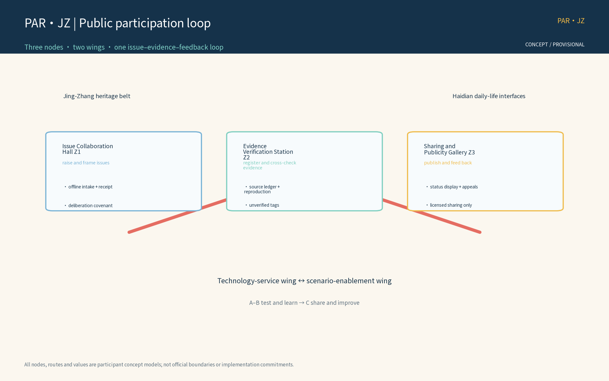
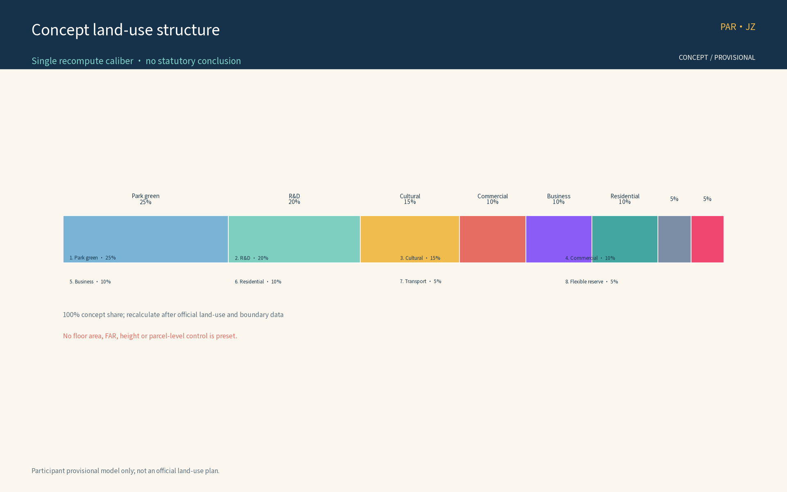
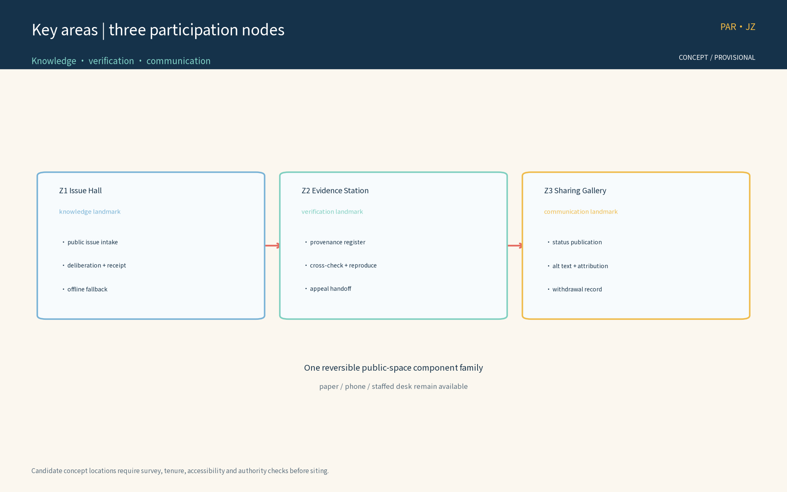
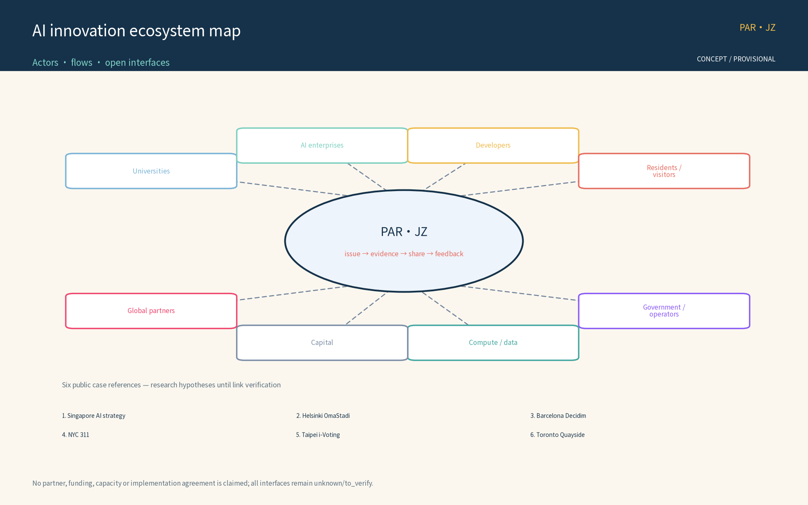
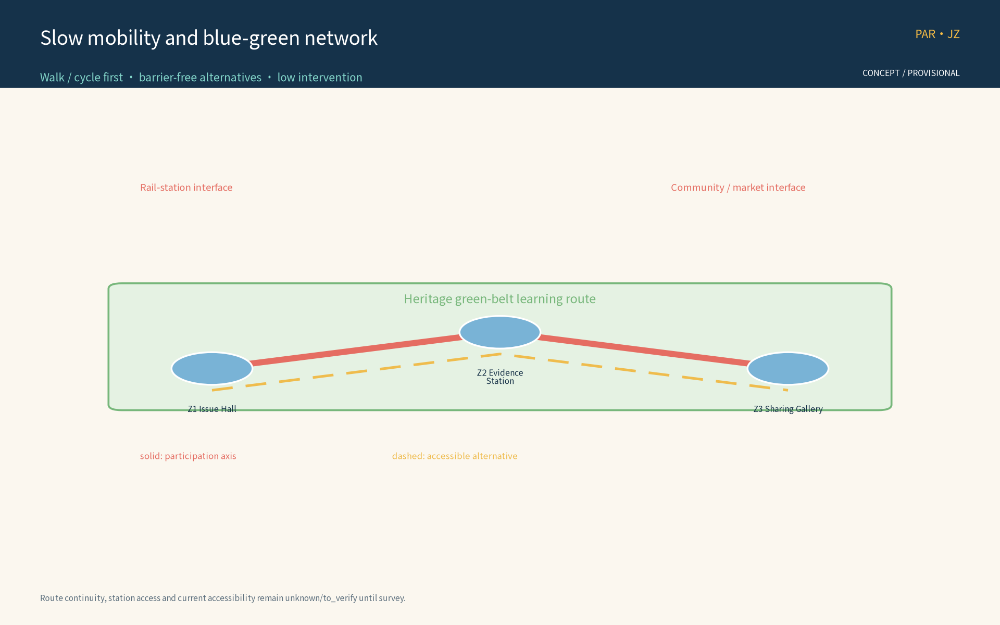
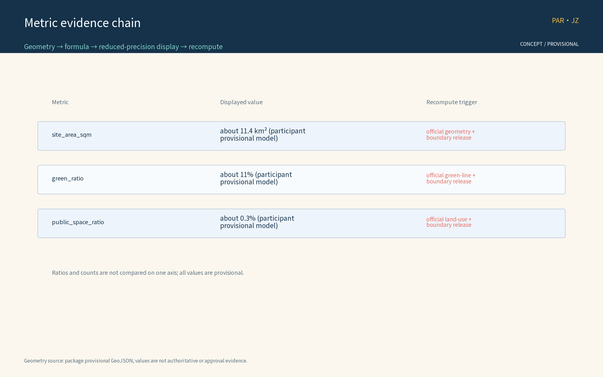

*Concept advice only: no FAR, building height, retain-renovate-demolish or engineering conclusions; no fabricated official data; all boundaries are provisional.*

## Design Basis and Source List
The basis list below covers public archival materials, planning reports, standards and participation-mechanism references used as conceptual working references; it is not a statement of data already acquired. All data actually used by this package are registered in sources.json, and organizer-side gaps (official geometry, statutory controls, site baseline) are declared in the assumptions and missing-data statements.

The basis includes: the open-call announcement (project name, organizer, official three-tier scope calibers and submission depth requirements); the open-call taskbook (three positionings, five functions, three-areas-two-wings structure and tasks agent.1-6, including the continuous participation caliber and its recommended collaboration loop); the public Issue/PR collaboration conventions (issue impact scope, expected versus actual behavior, reproduction steps, logs or verification output, anonymized screenshots, data sources and uncertainties); public statements on retaining the heritage park fabric and railway relics with a keep-renovate-demolish balance along the Jing-Zhang railway heritage park; six global AI innovation ecosystem cases registered one by one in sources.json (publisher, link, dates and reuse boundary); and appendices 1 and 2 listed as research hypotheses pending link verification before entering the formal evidence chain.

> **Evidence anchor**: [source:DATA-SRC-OFFICIAL-ANNOUNCEMENT], [source:DATA-SRC-AGENT-TASKBOOK].

## Three-Level Scope Framework
Per the official announcement caliber, the three official tiers are: coordinated research area about 43.6 km2, overall design area about 11.4 km2, and key areas about 368.4 ha. This package's public participation and continuous collaboration track sits inside the overall design area as a conceptual sub-scope: the three nodes — Issue Collaboration Hall, Evidence Verification Station, Sharing and Publicity Gallery — and a continuous slow-mobility participation axis are its spatial carriers; it does not extend into a full-area layout claim.

The three tiers deliver successively: the coordinated tier assesses, at concept level, how the participation network partners with universities, science and technology precincts, rail stations and neighborhoods; the overall tier organizes the participation network and slow-mobility spine around the heritage park green belt, with regulatory-plan indicators used only as cross-checks; the key-area tier details the three nodes, all of which are concept locations. All tiers share one issue-evidence-feedback loop; every boundary is provisional, revised as issues and evidence evolve, never replacing statutory planning procedures, and recomputed when official geometry is published.

> **Evidence anchor**: [source:DATA-SRC-OFFICIAL-ANNOUNCEMENT] (three-tier scope figures follow the announcement text caliber; not issued by this package).

## Coordinated Research Area: Industry and Future City Research
The coordinated research identifies the "fit" effect of the participation mechanism: issue collaboration and evidence verification organize participation demand from universities, science precincts, rail stations and neighborhoods into units that can be raised, verified and shared, forming a three-level linkage of participation nodes, science-and-technology precincts and neighborhoods. Future-city research is directional only and implies no land-use or investment commitment.

On regional synergy, the theme anchors the Haidian main area within the taskbook's three-areas-two-wings structure: reserved concept interfaces for Beiwei community and corridor neighborhoods (community-level participation points), for Future Science City and Huairou Science City (university and research participation network), for the economic-development zone (industry issues), and for Jing-Jin-Ji coordination (cross-regional initiative). All interfaces are concept reservations, not cross-region implementation commitments, pending official materials and survey data.

Function mapping to the taskbook's three positionings and five functions (concept mapping, not an officially authorized caliber): Positioning 1, Centennial Jing-Zhang Culture Belt — the green belt and heritage relics become participation carriers for raising, verifying and sharing; Positioning 2, Metropolitan AI Life Experience Belt — issue intake, feedback and activity booking become perceptible AI life experiences for residents and visitors; Positioning 3, AI-Integrated Innovation Belt — universities, science precincts, rail stations and neighborhoods form a collaborative issue network. Within the five functions, this theme works directly on Global AI Governance Voice and the AI+ Scenario Enablement Paradigm: open deliberation, evidence verification and result publication provide a city-scale participation testbed for AI governance, five AI+ scenarios provide reproducible and evaluable scenario samples, and the theme adds a public participation foundation to the world-class AI innovation ecosystem, the smart AI vital city and the full-stack independent AI innovation system.

> **Evidence anchor**: [source:DATA-SRC-AGENT-TASKBOOK], [source:DATA-SRC-PROVISIONAL-BOUNDARIES].

## Overall Design Area: Urban Renewal and Regulatory-Plan-Level Urban Design
The overall design stresses a public participation environment whose skeleton is the green belt: participation nodes, the participation network spine and slow-mobility systems are organized along the Jing-Zhang railway heritage park; participation facilities grow reversibly and streets time-share participation and festival needs; renewal precedes new construction, with existing space reused first for participation functions; regulatory-plan indicators are cross-checked only, without preset numerical conclusions.

A three-level participation network of regions, nodes and facilities is built on the green belt: regional hubs (e.g., the Issue Collaboration Hall), corridor theme participation points, and facility-level community micro-participation fittings (info screens, bulletin boards and other lightweight media from the reversible public-space component library concept). The network integrates with the green belt and rail stations; keeping the heritage park fabric and railway relics first, with a keep-renovate-demolish balance, is the bottom line.

> **Evidence anchor**: [source:DATA-SRC-MOHURD-CONTROL-DETAILED-PLANNING], [source:DATA-SRC-PROVISIONAL-BOUNDARIES].

## Detailed Design of Key Areas
All three node locations are concept locations: they must be re-sited after on-site survey, data verification, authority evaluation and public comment. Green-belt routes and slow-mobility links between nodes form the complete participation itinerary; detailed plans and sections are expressed in the booklets and geometry layers. The nodes are differentiated typologies: the Issue Collaboration Hall is a knowledge-type landmark (issue and Issue-workflow hub: public issue intake, evidence checklist verification and collaboration interface); the Evidence Verification Station is a verification-type landmark (external data registration and cross-check: authority and provenance registration, cross-verification, and unverified tagging routed to issue discussion); the Sharing and Publicity Gallery is a communication-type landmark (publication and social sharing: reproducible links, site-relevance notes, diagrams and alternative text, attribution and licensing, distinguishing submitted/reviewed/selected/implemented status, protecting privacy, and authorizing before publication).

Concept running mechanisms include the participation covenant, deliberation rules, tiered publication and venue rotation, with bookable venues; the Gallery hosts an honor-and-status display area linked to the annual honor board and trial participation points; participation facilities are selected from the reversible public-space component library (info screens, bulletin boards, movable seats, modular pavilions, demountable signage) with part-level replacement and relocatable decommissioning. Concept space types and interfaces: all three nodes reserve rail-station connection, heritage park, university, neighborhood, barrier-free and multilingual service interfaces. Site suitability, station entrance conditions and current accessibility status are unverified — a registered data gap that must be closed by site-level checks before siting.

> **Evidence anchor**: [data:PACKAGE-GEOMETRY] (the three-node concept polygons come from geometry/key_areas.geojson).

### Internal Three Areas, Two Wings, and External Coordination Boundaries (concept)

The theme separates the taskbook's three-areas-two-wings structure into auditable spatial layers; a coordination interface is not represented as an implemented facility.

| Layer / space | Internal role | Eight-factor placement (land / space / industry / capital / talent / compute / data / scenario interface) | Decision boundary and evidence |
| --- | --- | --- | --- |
| Internal A: Zhongzhiyuan AI self-innovation acceleration area | AI food-chain and public-issue testbed, joint lab, demo and developer collaboration | space, industry, talent, compute, data, scenario interface; land and scale pending | test protocols and examples only; no park consent implied; issue cards and test logs are the evidence |
| Internal B: Beijing AI Origin Community | community food-literacy / public learning, volunteer rotation, offline intake and appeals | space, talent, data, scenario interface; tenure and resident baseline unknown/to_verify | no individual profiling and no AI substitute for deliberation; anonymous receipts, paper logs and human review |
| Internal C: Dazhongsi AI-native retail/business area | merchant co-design, consumer experience, explainable recommendation examples and publication | industry, capital, space, scenario interface; merchant list and operating baseline unknown/to_verify | no automated admission, pricing or penalty; merchant consent, manual editorial review and withdrawal logs |
| Internal two wings: green cultural axis / innovation link axis | slow mobility, railway-memory narrative, and issue/evidence/share handoffs between A-B-C | space, scenario interface, talent; routes, green lines and station conditions unknown/to_verify | concept route only, not a road or rail engineering conclusion; see mobility figure and geometry |
| External coordination: Zhongguancun technology-service wing | possible compute, data governance, tools, mentors and testing support | compute, data, talent, industry, capital | candidate interface only; partners, agreements and capacity unknown/to_verify; no existing partnership claimed |
| External coordination: Xiaoyue River scenario-enablement wing plus Beiwei, Future Science City, Huairou Science City, economic-development zone and Jing-Jin-Ji | daily slow travel, community food literacy, cross-area issues and industry-test interfaces | scenario interface, talent, industry, space | referral and multilingual/offline interfaces only; no cross-area implementation commitment, pending official data and survey |

The east-west stitching is “technology-service wing → A/B testing and food literacy → C retail/business scenarios → Xiaoyue River daily-life scenarios.” Each handoff leaves an issue ID, source, human reviewer, output version and appeal entry. North-south connection uses a railway-heritage narrative line, slow-route alternatives and barrier-free section checks; a diagram line is not a road, rail or green-line approval. Dazhongsi AI-native retail/business is limited to explainable merchant co-design, booking, source display and human publication: a user may refuse an AI suggestion, a merchant may withdraw, and the model never decides price, admission or penalty.

### Jing-Zhang Resource, Narrative, Spatial Carrier, and Use Boundary (concept)

| Resource type | Narrative theme | Spatial carrier | Use boundary / verification |
| --- | --- | --- | --- |
| railway alignment, stations and engineering memory | connection, movement and public service | interpretation nodes, timeline and oral-history entry along the slow axis | relic inventory, tenure and heritage grade unknown/to_verify; no official designation claimed |
| heritage-park fabric and green belt | retain and reuse within keep-renovate-demolish | low-intervention screens, demountable signs and public learning points | green-line, view-corridor and construction conditions unknown/to_verify; do not obscure or alter relics |
| station signs, timetables and railway spikes | time, collaboration and evidence chain | wayfinding, archive cards and honor display grammar | concept symbols only; no protected mark copied; trademark/copyright clearance pending |
| river, under-bridge and everyday public space | from passage to shared care | barrier-free alternative routes, community food literacy and rest nodes | water, fire, night-operation and safety conditions unknown/to_verify |
| industry and community oral archives | technology entering everyday life | Issue Hall, Evidence Station and Sharing Gallery | use only with consent and anonymization; no publication without clearance |

## AI Innovation Ecosystem, Personas, and AI+ Scenarios
Five persona groups: entrepreneurs, AI developers, community residents, students, and visitors and tourists, mapped to industry issues, open-source collaboration issues, daily concerns, learning and volunteering issues, and experience and communication issues (concept caliber). Personas only inform scenario design; no individual profiling occurs.

The AI innovation ecosystem is organized as actors, flows and open interfaces (concept): eight actor types — universities and institutes, AI enterprise clusters, developer community, residents and visitors, government and operators, investment and capital, compute and data services, international partners; six flows — talent and issues, scenario opening and conversion, compute and data (anonymized aggregation), capital and incubation, results and sharing, standards and compliance reference; and open interfaces including data sandboxes, testbeds, issue-to-dev-task conversion and multilingual communication templates, forming a linkage vision across land, space, industry, capital, talent, compute, data and scenario access (concept level, no scale preselected; see the ecosystem map figure).

Global AI innovation ecosystem cases (registered one by one in sources.json; only direct pages marked `mechanism_reference_only` enter the mechanism reference chain; the rest are research questions):

| Case | Country / city | Mechanism | Lesson for this package | Source |
| --- | --- | --- | --- | --- |
| Singapore AI strategy | Singapore | strategy-page lead returned 404 in this verification | research question only; not evidence for an ecosystem channel | [source:SRC-GLOBAL-CASE-01] |
| Helsinki OmaStadi | Finland | primary homepage returned 403; evidence position unavailable | research question only; not evidence for budgeting flow | [source:SRC-GLOBAL-CASE-02] |
| Barcelona Decidim | Spain | direct project homepage supports a concept reference to an open-source participation platform | digital deliberation and publication reference, no performance inference | [source:SRC-GLOBAL-CASE-03] |
| NYC 311 | United States | direct City service-entry portal | service-entry and status-transparency reference, no performance inference | [source:SRC-GLOBAL-CASE-04] |
| Taipei i-Voting | Chinese Taipei | direct Taipei City Government i-Voting service page | online-voting service reference, no outcome inference | [source:SRC-GLOBAL-CASE-05] |
| Toronto Quayside | Canada | current direct project page does not evidence a termination lesson | research question only; no decommissioning evidence | [source:SRC-GLOBAL-CASE-06] |

Verification boundary: 01, 02 and 06 are explicitly downgraded to `no_research_question_only`; 03, 04 and 05 are mechanism-only references from directly retrieved primary pages. Their pages did not state a usable publication date, so no date is inferred and no outcome, budget, vote result or liability claim is made.

Ten AI+ scenario cards (concept level, 11 fields: user / data / space / model / operator / human backstop / privacy control / failure mode / phase gate / effectiveness indicator / stop condition; aligned with the scenario caliber in metrics.json):

| ID | Name | User | Data | Spatial carrier | Model | Operator | Human backstop | Privacy control | Failure mode | Phase gate | Effectiveness indicator | Stop condition |
| --- | --- | --- | --- | --- | --- | --- | --- | --- | --- | --- | --- | --- |
| S01 | Issue clustering AI | residents / developers | public issues and anonymous tags | Issue Collaboration Hall | topic model + clustering | operator team and volunteers | manual cluster audit | anonymized aggregation, no individual identification | topic drift, false cluster | G0/G1 | issue response rate, cluster audit pass rate | false-cluster rate > calibrated baseline for 2 consecutive quarters |
| S02 | Evidence ledger AI | professional team | public sources + ledger | Evidence Verification Station | source-comparison model | professional team | manual source review | provenance filing, unverified tagging | false tag, missing entry | G0/G1 | evidence reproduction rate, source compliance rate | false-tag rate > calibrated baseline for 2 consecutive quarters |
| S03 | Reproducibility check AI | university volunteers | public reproducible data | Evidence Verification Station | reproduction-step matching | professional team and university volunteers | manual re-test | public data only, anonymized | reproduction failure, false pass | G0/G1 | reproducibility pass rate | reproduction-failure rate > calibrated baseline for 2 consecutive quarters |
| S04 | Sharing copy AI | public / visitors | public material | Sharing and Publicity Gallery | copy-generation model | operator team | manual review before publication | authorized publication, attribution | misstatement, unauthorized use | G0/G1/G2 | share compliance rate | misstatement rate > calibrated baseline for 2 consecutive quarters |
| S05 | Feedback processing AI | residents / visitors | anonymous feedback | Issue Collaboration Hall | opinion-classification model | operator team | manual receipt | anonymized, human-review backstop | misclassification, missed handling | G0/G1/G2 | opinion receipt rate, closure rate | mishandling rate > calibrated baseline for 2 consecutive quarters |
| S06 | Slow-travel guide AI | residents / visitors / accessibility users | slow-axis anonymized trajectory | along the slow axis | wayfinding model | operator team | manual guides | anonymized trajectory aggregation, no per-person records | misleading path | G1/G2 | slow-axis cross-section flow, wayfinding correction rate | misleading-complaint rate > calibrated baseline for 2 consecutive quarters |
| S07 | Multilingual service AI | visitors / foreign residents | public text | node service desks | multilingual translation model | operator team and volunteers | manual translation review | anonymized, human review | mistranslation, cultural bias | G0/G1/G2 | multilingual inquiry count, mistranslation rate | mistranslation rate > calibrated baseline for 2 consecutive quarters |
| S08 | Activity booking AI | residents / visitors | booking information | node venues | schedule-dispatch model | operator team | manual scheduling | minimal collection, periodic purge | scheduling conflict, overload | G1/G2 | venue-booking fulfillment rate | fulfillment rate < calibrated baseline for 2 consecutive quarters |
| S09 | Micro-participation AI | seniors / children / low digital literacy | voice / QR | community points | speech recognition + large-type UI | community and volunteers | manual assistance | anonymized, human review | misrecognition, missed entry | G0/G1 | micro-participation coverage, manual-assistance rate | misrecognition rate > calibrated baseline for 2 consecutive quarters |
| S10 | Operations monitoring AI | operator team | anonymized aggregated data | back office (concept) | statistics + anomaly detection | professional team | manual anomaly review | aggregate statistics only, no excessive surveillance | missed anomaly, false alarm | G1/G2 | anomaly-detection accuracy | false-alarm rate > calibrated baseline for 2 consecutive quarters |

> **Scenario card 11-field note**: each card fixes 11 fields (user / data / space / model / operator / human backstop / privacy control / failure mode / phase gate / effectiveness indicator / stop condition), consistent with the scenario_card_count >= 10 caliber in metrics.json. The protocols below provide concept-stage provisional operating bands, not government acceptance or planning targets; they are calibrated after an official baseline is published. High-impact outputs remain drafts until human review; participants may appeal or exit.

### Three industry test protocols (concept; executable provisional bands; not government acceptance)

| Protocol | Test scenario | Entry condition | Verification method | Exit / rollback trigger | Result destination |
| --- | --- | --- | --- | --- | --- |
| Industry Test 1: anonymization and privacy boundary | five AI scenarios S01 / S02 / S05 / S07 / S10 | scenario at G0, privacy boundary filing complete | sample-compare AI output aggregate statistics vs raw anonymized data; verify aggregate-only, no individual identification; pass desensitization and post-processing checks | >= 1 case of individual-identifying output in sample -> immediate rollback to pre-G0 | annual review, privacy incident log |
| Industry Test 2: human review and false-positive rate | three AI scenarios S01 / S04 / S05 | scenario at G1, human-review panel in place | sample human review of AI summaries, receipts and copy (>= 5% of monthly intake), errors stratified by error class; rollback when false-positive rate exceeds calibrated baseline | false-positive rate > calibrated baseline for 2 consecutive months -> pause scenario -> remediation rollback to G0 | annual review, false-positive stratified report |
| Industry Test 3: participation route accessibility | S06 slow-travel guide + on-site walkthrough | walkthrough of three nodes and slow axis launched | on-site walkthrough of three nodes and slow axis; verify barrier-free (wheelchair, visual, hearing), multilingual (zh / en / ja / ko etc.) and offline reachability (offline scenario) | critical barrier-free element fails -> remediation or node decommission | annual review, barrier-free status report |

> **Test protocol triplet**: each protocol fixes four elements ("entry condition - verification method - exit/rollback trigger - result destination") to avoid hard thresholds at the concept stage; test results feed four archives — annual review, privacy incident log, false-positive stratified report, barrier-free status report — as inputs to the next-year phase-gate judgment.

| Protocol | Sample and denominator | Concept-stage provisional pass band | Record and owner | Exit / rollback |
| --- | --- | --- | --- | --- |
| Privacy boundary | all AI outputs in the shadow-test window; denominator is all sampled outputs | 0 identifiable-person outputs; one case fails immediately and cannot be averaged away | incident ID, input/output hashes and human reviewer; operator owns, independent appeal panel informed | take model output offline, keep paper/phone channel, roll back to G0 |
| Human review and false positives | at least 5% of monthly intake, minimum 30 and maximum 100; denominator is sampled items | 100% human review for high-impact outputs; pause if either of two consecutive rounds is below 95% or reviewer disagreement exceeds 20% | sampling frame, disagreement labels, review note and version; professional team owns, operator cannot release alone | pause publication, remediate and retest; failure rolls back to G0 |
| Reproducibility and accessibility | at least 10 public evidence cards per round (all if fewer); two day/evening walks per node/segment plus one offline exercise | same-source/same-version reproduction >=90%; zero critical barrier-free blockers; any critical blocker fails | source, steps, time, screen/paper version and anonymous issue log; evidence team and accessibility adviser sign | withdraw inaccessible/non-reproducible content, retain offline service, re-enter G1 after repair |

These values are reproducible test rules, not current performance claims. The organizer's operating baseline, field sampling frame and official compliance opinion remain unknown/to_verify. The closure is: spatial intake -> AI aggregation/draft only -> human review and provenance record -> publication/feedback -> appeal, withdrawal or rollback; the model has no final discretion.

AI technical protocols (concept): model evaluation against public benchmarks aligned to task scenarios; data quality controlled via registration calibers, deduplication and provenance labeling; errors stratified by false-positive rates; runtime monitoring covering anonymized-aggregation logs and human-review triggers. The three governance sentences apply throughout: only anonymized aggregation, human review for consequential decisions, and no excessive surveillance (no individual-identifying tracking). The ten main scenarios cover six domains — transport, industry, space, public services, culture and governance — as conceptual correspondence without preset indicators.

> **Evidence anchor**: [source:DATA-SRC-GENERATIVE-AI-INTERIM-MEASURES], [source:SRC-GLOBAL-CASE-01].

## Land Use, Building Scale, and Retain-Renovate-Demolish Strategy
The conceptual land-use structure uses one single recompute caliber (the table below and the land-use figure, HTML pages, PDFs and metrics.json are identical; the eight class names follow the public subset of the national land-use classification guide):

| Land class (single caliber) | Concept share | Computation caliber |
| --- | --- | --- |
| Park and green land | 25% | self-computed on this package's provisional sub-scope |
| R&D / science land | 20% | same |
| Cultural facility land | 15% | same |
| Commercial service land | 10% | same |
| Business and finance land | 10% | same |
| Residential land | 10% | same |
| Transport land | 5% | same |
| Reserved flexible land | 5% | same |

Caliber and recompute rule: shares sum to 100%; aggregation formula is class area divided by total sub-scope area, consistent with the announcement caliber (self-computed per the announcement, not officially issued); confidence is low; a full recompute is triggered when official land-use and boundary data are published, updating the narrative, figures, HTML, PDFs and metrics.json together. This structure is concept advice; no land areas or floor areas are preset.

The retain-renovate-demolish strategy keeps the heritage park fabric and railway relics first: existing buildings are functionally replaced with participation-oriented upgrade interfaces (issue-space interfaces, publication windows), demolition is limited to narrow case-by-case clearance for slow links, and participation facilities are light, reversible and low-footprint without large new buildings. No FAR or height conclusions are given.

> **Evidence anchor**: [source:DATA-SRC-MNR-LAND-USE-CLASSIFICATION-202311].

## Transport, Rail, Municipal Infrastructure, and Public Services
Slow mobility comes first: a continuous slow axis links the Issue Collaboration Hall, the Evidence Verification Station and the Sharing and Publicity Gallery; the participation network and slow system are integrated and connect universities, parks, districts and rail stations (walking and cycling first); station-to-node routes are continuous and legible; info screens, signage and wayfinding sit along the slow space with low intervention.

Municipal services follow intensive sharing: lighting, barrier-free facilities and participation screens are integrated in one concept package, reusing current facilities where possible, without preset road cross-sections or engineering scales. Public services include multilingual information, issue reception, study rooms and staffed service points; every AI decision has human review. Public opinion channels link online and offline: opinion boxes and QR entry points along the slow axis; issues receive receipts and may enter open deliberation.

Inclusive services (concept): barrier-free routes and age-friendly services cover the three nodes and the slow axis; large-type and voice prompts support seniors and low-digital-literacy users; child-friendly and family spaces are reserved at blue-green nodes; people unable or unwilling to use AI or digital channels receive offline registration and volunteer assistance (echoing the service-intent boundary of Article 39 of the Barrier-Free Environment Law, without over-generalizing to a compliance claim).

> **Evidence anchor**: [source:DATA-SRC-MOHURD-URBAN-DESIGN-MEASURES], [source:DATA-SRC-BARRIER-FREE-ENVIRONMENT-LAW].

## Blue-Green Network, Public Space, and Urban Character
A blue-green public space system of a green belt as the axis and node parks as pearls: the heritage park green belt links pocket green spaces along the corridor; participation facilities blend with parks — light, transparent, reversible — without blocking heritage views; public space serves both daily rest and participation activities with flexible sharing, configured for all ages: age-friendly facilities for seniors, child-friendly design for children and families, barrier-free routes and assistance for persons with disabilities and other vulnerable groups, alongside residents, visitors, students, commuters and corridor workers.

The character continues the industrial memory vocabulary of the Jing-Zhang railway and dialogues with an orderly new atmosphere of innovation, with restrained unified guidance and no symbol stacking or sloganeering; the information and interpretation system is unified, provided in multilingual, large-type and diagram versions. Brand identity direction (concept): the main mark "PAR-JZ Participation Ring" uses the participation loop and a railway-spike octagon as its concept graphic (see the identity concept figure); visual grammar uses sleeper rhythms, station-frame borders and timetable grids; colors use heritage industrial grey as the base, Haidian innovation blue as the accent and rail green for ecology; the reversible public-space component library provides one unified, demountable component family; the cultural symbol system draws on spikes, station signs and timetables for wayfinding, remembrance and honor expression; international communication copy outputs via multilingual guides, sharing templates and open-source identity assets (concept).

> **Evidence anchor**: [source:DATA-SRC-MOHURD-URBAN-DESIGN-MEASURES].

## Renewal Projects, Implementation Policy, and Phasing

Four concept project lists (issue reception, evidence registration, sharing and publication, annual renewal) with advisory scale and cost statements only, implying no government or operator commitment. Four collaborating actor classes: (1) the operator team as the lead; (2) the professional team of university and domain experts as consultants; (3) communities, volunteers, merchants and corridor stations as collaborators; (4) the supervising authority and the public as informants and oversight — together forming a four-actor skeleton.

### Three-Phase Tiering and Gates (concept MVP decision framework; independent of unpublished official data)

| Phase | Window | Tasks | Lead | Collaborate | Gating / entry conditions | Phase gates (pass / remediation / pause / rollback) | Stop conditions | Exit mechanism | Measurable indicator names |
| --- | --- | --- | --- | --- | --- | --- | --- | --- | --- |
| Near | 1-3y | procedure build-out: issue-reception procedure, evidence-registration and verification procedure, sharing and publication guidelines, upload-and-self-check mechanism | operator team | community, volunteers | station connection and accessibility first-pass; existing-space suitability first-pass; barrier-free conditions first-pass; site-baseline collection kicked off | Gate G0: launch when the four first-passes pass; pause when any one is un-assessable | privacy/security incident, one year of zero active issues, site functional change | reversible component library decommission, data archive, annual publication note | issue response rate, opinion receipt rate, evidence reproduction rate, barrier-free pass rate, human-review trigger rate |
| Mid | 3-5y | node build-out: Z1 Issue Collaboration Hall, Z2 Evidence Verification Station, Z3 Sharing and Publicity Gallery, three concept sites simultaneous siting and pilot; continuous slow-traffic participation axis connecting the three nodes | operator team | professional team, universities | G0 passed, concept-siting site walkthrough passed, slow-axis continuity first-pass passed, operational baseline (staffing / moderation / response / budget) calibration completed | Gate G1: pilot launch per node when the node walkthrough passes; remediation-rollback to G0 when any node fails | two consecutive years of gate failure, major privacy/security incident, sustained participation below 50% of calibrated baseline | node-level reversible decommission back to G0, components back to library, data archive, annual review publication | node visitor count, slow-axis cross-section flow (calibrate after organizer baseline), reproducibility pass rate, venue-booking fulfillment rate |
| Long | 5-10y | full-area mechanism: participation alliance, annual update, annual honor, annual recompute, annual publication | operator team | alliance members (stations, universities, community, developers) | G1 passed, alliance charter published, annual-recompute trigger conditions met, full recompute after official geometry and controls are released | Gate G2: include in annual update when two consecutive annual reviews pass; trigger remediation when any year fails | policy change, operator change, mechanism-termination decision | full-mechanism decommission, data archive, annual publication note | cumulative issue intake count, annual publication coverage rate, annual recompute error rate (after baseline release), mechanism accessibility index |

> **MVP decision framework note**: independent of organizer-side data, this framework gives a per-phase minimum deliverable -> evidence archive -> human escalation -> test judgment -> remediation -> rollback -> exit chain. Gates use a four-band judgment (pass / remediation / pause / rollback); the provisional bands are for shadow testing, not government acceptance, and are recalibrated after official data. All judgments are recorded in the Participation Ring Archive and human-escalation reviewed; unacceptable outputs roll back to the previous phase while offline and exit channels remain available.

| Phase | Minimum deliverable and dependencies | Roles | Required evidence | Human escalation and provisional rule | Rollback / exit |
| --- | --- | --- | --- | --- | --- |
| G0 procedure shadow test | intake, provenance, privacy, publication and appeal procedures; depends on organizer interface and minimum sample frame | operator R; professional team A; community/volunteers C | versioned rules, anonymous sample frame, review sheets, offline register | 0 identifiable outputs; every high-impact draft human-signed; any failure stops AI output | retain paper/phone intake, delete test copy, return to pre-deployment |
| G1 node/slow-route pilot | each Z1/Z2/Z3 passes site walk; depends on accessibility, fire, night-operation and tenure checks | professional team R; operator A; accessibility adviser/community C | node walk logs, alternative-route map, reproduction pack, appeal ledger | >=10 cards per round; reproduction >=90%; zero critical barrier-free blockers; panel handles disputes | remove reversible components on failure, retain offline service, return to G0 |
| G2 annual mechanism | two annual evaluations and recomputes; depends on official geometry/controls and operating baseline | operator R; evaluation body A; alliance C | annual report, minority-opinion attachment, source/version hashes, exit notice | remediate a failed review; two consecutive failures or major incident stops operation | decommission mechanism, archive/purge data, publish reason and review result |

### Pilot zones (concept pre-selection)

The pilot pre-selects the "Issue Collaboration Hall Z1 concept site" (provisional concept siting, see geometry/key_areas.geojson) for first-phase launch and adds Z2 and Z3 concept sites along the slow-traffic participation axis in the second phase. All three nodes are concept locations: they must be re-sited after on-site survey, data verification, authority evaluation and public comment. Pilot admission ranks on four factors — station connection and accessibility, existing-space suitability, barrier-free conditions and existing-facility assessment; these are research hypotheses until the organizer supplies the site baseline.

### Implementation and operations roles (concept RACI table; R lead / A collaborate / C consult / I inform)

| Task | Lead | Collaborate | Consult | Inform |
| --- | --- | --- | --- | --- |
| Issue reception and open deliberation | operator team | community, volunteers | university experts | government authority |
| Evidence registration and cross-verification | professional team | universities and institutes | domain experts | issue raiser |
| Sharing, publication and honor display | operator team | volunteers, merchants | legal and copyright advisers | public |
| AI scenario operations and human review | operator team | professional team | AI governance advisers | authority |
| Annual recompute, evaluation and publication | professional team | operator team, universities | evaluation agency | public and government |
| Facility maintenance and component library | operator team | volunteers, merchants | engineering advisers | public |

### Pilot gating and acceptance (concept)

Pilot candidates rank on four factors — station connection and accessibility, existing-space suitability, barrier-free conditions and existing-facility assessment (research hypothesis until the organizer supplies the site baseline); acceptance observes process metrics such as issue response rate, opinion closure rate, evidence reproduction rate and barrier-free pass rate. Provisional bands only govern whether testing continues; they do not claim current performance or official targets.

### Service workflow and human escalation (concept)

Online/offline intake -> receipt -> processing and status updates -> appeal and human-escalation channel -> major matters into open deliberation; offline registration, telephone and volunteer assistance are available to those who cannot use digital channels. The three governance sentences apply throughout: only anonymized aggregation, human review for consequential decisions, and no excessive surveillance (no individual-identifying tracking).

### Operational record and appeal/exit loop (concept; not a live system)

Each participation item receives a concept `record_id` containing only an anonymous code, entry node/channel, issue class, source and version hash, AI model/prompt version, human reviewer, status, public redaction note, appeal number and exit trigger; no identifiable personal trajectory is recorded. The fixed state machine is `received -> draft -> human_review -> published/returned/rejected -> challenged -> corrected/withdrawn -> closed`; a rejection, return or withdrawal must have a public-readable reason. AI only aggregates, classifies or drafts copy; a human reviewer decides whether to publish. High-impact, privacy, heritage and accessibility matters must escalate to a professional review panel.

| Loop stage | Space/channel | Minimum evidence and caliber | Responsibility and public action | Exit/rollback condition |
| --- | --- | --- | --- | --- |
| Intake and receipt | Z1 Issue Collaboration Hall, Z2 Evidence Verification Station, Z3 Sharing and Publicity Gallery, plus paper/telephone | `record_id`, anonymous sample frame, source ID and timestamp; baseline unknown/to_verify | Operator records; participant may request a receipt, switch offline, or withdraw unpublished material | Cannot anonymize or lacks authorization -> no AI processing; human route or delete test copy |
| AI draft and human review | Internal workbench at Z1/Z2; unreviewed content never appears on public screens | Model/rule version, aggregate input caliber, sampling denominator, error class and review signature; temporary bands from three industry protocols | AI recommends only; review panel confirms, returns or marks to_verify | Identifying output, unverifiable source or no sign-off for a high-impact item -> pause and rollback to G0 |
| Publication and minority view | Z3 gallery, website, noticeboard and open deliberation | Release version, redaction reason, minority-view attachment, accessibility and multilingual alternative text | Operator publishes; public may submit counter-evidence, request correction or request non-publication | Factual error, rights complaint or accessibility blockage -> take version down and retain correction/withdrawal notice |
| Appeal, review and exit | Online, paper and telephone; independent review panel outside the operator team | Appeal number, receipt date, anonymous code, reason, decision and unresolved item; 10 working days is a concept response target | Participant may appeal, withdraw, or request exclusion from later training/statistics; panel retains minority view | Even an unsuccessful appeal gets reasons; two consecutive protocol failures or a major privacy incident -> disable scenario, archive and purge test copy |

The three industry protocols provide anonymization denominators, human-review samples and accessibility-walkthrough records; the three phase gates read these records and the G0/G1/G2 pass, remediation, pause and rollback states. Sample frame, operating baseline and official compliance opinion have not been provided and remain `unknown/to_verify`. Ratios and thresholds in the tables are reproducible shadow-test rules, not current performance or government acceptance conclusions.

### Participation representative selection and conflict of interest (concept)

Representatives are selected through open recruitment, stratified drawing, a deliberation covenant and group rotation: residents, corridor workers/merchants, students, visitors, seniors, caregivers, persons with disabilities or their assistants may apply. Applicants are stratified by role and accessibility need, then drawn within strata after confirming motivation, available time, language and access needs; one third of seats rotate annually. No unrelated identity data is collected. Candidates file conflict-of-interest statements; direct employment or transaction ties to the operator, professional team or an affected merchant trigger recusal and a log. Minority opinions are retained as attachments and non-adoption requires a reason; rejection, suspension or removal records date, anonymous code, reason and reviewer. Any participant may appeal within 10 working days online, on paper or by phone; an independent panel outside the operator team handles it, and conclusions plus unresolved matters enter the annual publication. These are concept safeguards, not current government rules.

### Data governance (concept)

Minimal collection, anonymized aggregation only, purpose-based retention periods, access control and annual purging; public data releases follow authorization and desensitization rules.

### Annual event system (concept, 4 items)

| Event brand | Frequency | Target group | Link to the mechanism |
| --- | --- | --- | --- |
| Public participation open day | daily normal + annual open week | residents, visitors and the public | issue intake and on-site deliberation |
| Issue collaboration week | weekly | developers, university staff and students | issue-to-dev-task conversion and co-creation |
| Issue collaboration briefing | quarterly | government, enterprises, universities and others | annual issue list and publication |
| Results sharing festival | annual festival | public, visitors, developers | results display and honor board |

### Operations and cost tiers (concept; no precise amounts, low/medium/high)

| Cost tier | Estimation method | Price basis | Included scope | Confidence | Recompute trigger |
| --- | --- | --- | --- | --- | --- |
| Low | market-price analogy | concept period | lightweight facilities, volunteer operations | low | project justification |
| Medium | market-price analogy | concept period | basic node operations and staffing | low | annual review |
| High | market-price analogy | concept period | component-library expansion and events | low | annual review |

### Stop conditions and exit mechanism (concept)

Two consecutive annual reviews not meeting process observations, a privacy or security incident, facility functional change, or a passed mechanism-termination decision triggers the decommission assessment; facilities are removed through the reversible component library, data archived and a public notice published. Decommissioned components return to the library (info screens, bulletin boards, movable seats, modular pavilions, demountable signage); nodes can be phased back to G0 or G1, and the mechanism can be decommissioned in full.

### Long-term operations (concept)

The developer community (open-source collaboration, co-creation workshops, annual hackathon, open interfaces, issue-to-dev-task conversion), scenario opening and conversion channels (data sandbox, testbed, results-to-industry conversion), participation alliance (corridor stations, universities and communities co-authoring the issue rhythm and event calendar) and annual publication form the long-term operations backbone. The alliance charter is composed of: deliberation covenant, tiered publication, points trial, rotation and volunteering, booking and filing, deliberation and points — together covering ten mechanism keywords: covenant / deliberation / points / publication / filing / alliance / volunteering / booking / rotation / tiered.

> **Evidence anchor**: [source:DATA-SRC-AGENT-TASKBOOK].

## Metrics, Area Recalculation, and Compliance Matrix

The concept indicator system is an observation-caliber set without hard targets; each indicator states its data caliber and formula, confidence, use limit and recompute trigger. Indicators are divided into two tiers: "formal core indicators" (three items, recomputed for concept display, not an approval basis) and "process-observation indicators" (operational observation of the participation mechanism, annual review triggers recompute).

### Formal core indicators (3 items; concept display, not authoritative data)

| Metric | Data caliber and formula | Confidence | Use limit | Recompute trigger |
| --- | --- | --- | --- | --- |
| site_area_sqm | polygon area of geometry/site_boundary.geojson (EPSG:4548); machine value is for recomputation only, human display is “about 11.4 km² (participant provisional model)” | low | concept display only; never display the machine area as precise | official geometry and boundary release |
| green_ratio | green_space area / site_area; human display is “about 11% (participant provisional model)” | low | concept display only | official green-line and boundary release |
| public_space_ratio | public_space area / site_area; human display is “about 0.3% (participant provisional model)” | low | concept display only | official land-use and boundary release |

The single public-facing caliber is: **about 11.4 km² (participant provisional model)**. The machine value remains in `metrics.json` only for geometry recomputation and difference detection; it must not be presented as a precise area. Sources are `geometry/site_boundary.geojson`, `geometry/green_space.geojson`, `geometry/public_space.geojson` and their shared provisional boundary. Formula, warning and `recompute_trigger` are synchronized in `metrics.json`. When the organizer releases official geometry, green-line or land-use data, the accountable owner preserves the prior version, records the new source version and SHA, recomputes with the same formula, and regenerates figures, HTML, PDF, PNG and manifest hashes.

### Process-observation indicators (operational observation of the mechanism; each row is a measurable indicator name)

| Metric | Data caliber and formula | Confidence | Use limit | Recompute trigger | Phase-gate mapping |
| --- | --- | --- | --- | --- | --- |
| Issue response rate | issues answered / issues raised | low | process observation | annual review | G0/G1/G2 |
| Opinion receipt rate | opinions answered / opinions received | low | process observation | annual review | G0/G1/G2 |
| Evidence reproduction rate | reproductions passed / samples audited | low | process observation | annual review | G0/G1 |
| Barrier-free pass rate | nodes and slow segments passing walkthrough / total | low | process observation | annual review | G0/G1 |
| Human-review trigger rate | AI outputs triggering human review / total AI outputs | low | process observation | annual review | G0/G1/G2 |
| Node visitor count | scan and registration per unit time | low | process observation | annual review | G1/G2 |
| Slow-axis cross-section flow | slow-axis cross-section count (per calibrated baseline) | low | process observation (calibrate after organizer baseline) | annual review | G1/G2 |
| Venue-booking fulfillment rate | fulfilled bookings / total bookings | low | process observation | annual review | G1/G2 |
| Cumulative issue intake count | total issues received since launch | low | process observation | annual review | G0/G1/G2 |
| Annual publication coverage rate | published issues / all issues | low | process observation | annual review | G1/G2 |
| Mechanism accessibility index | accessible nodes / slow segments / total | low | process observation | annual review | G0/G1/G2 |
| Share compliance rate | compliant shares / all shares (human-reviewed sample) | low | process observation | annual review | G0/G1/G2 |

### Area recalculation caliber

The three formal core metrics are machine-recomputed from this package's geometry — participant provisional model data, not claimed as authoritative; areas are consistent with the official three-tier scopes (self-computed per the announcement, not officially issued). Human-facing text, figures, HTML and PDF use the synchronized labels “about 11.4 km² (participant provisional model)”, “about 11% (participant provisional model)” and “about 0.3% (participant provisional model)”; precise machine values remain only in `metrics.json` for recomputation. Official geometry, green-line or land-use release triggers a full recomputation, warning update and version record.

### Recompute trigger and version management

Each indicator explicitly registers a recompute trigger (see the table above). Recompute triggers are graded at four levels: (1) official geometry release; (2) official green-line / blue-line / land-use data release; (3) annual review (operational observation of the mechanism); (4) operational-baseline calibration completed (node visitor count, slow-axis cross-section flow and similar can only be used for non-process observation after the organizer publishes the calibration baseline). The recompute version is recorded in metrics.json under a top-level `recompute_version` field, with `recompute_date` and `recompute_trigger`.

### Compliance matrix and design-depth matrix

The compliance matrix covers all 23 requirements of the announcement (1.3-1.5) and the taskbook (agent.1-6), each pointing to concrete sections, figures, geometry layers, metrics and tables (see compliance_matrix.json); the design-depth matrix points each of its 15 items to verifiable outputs (see design_depth_matrix.json). Both matrices' source_ids use an explicit alias map: proposal.md / sources.json use stable anchors like `DATA-SRC-OFFICIAL-ANNOUNCEMENT` and `DATA-SRC-AGENT-TASKBOOK`; the `DATA-SRC-*-YYYYMMDD` dated suffixes in compliance_matrix.json / standard_matrix.json are date-aliased versions of the same source entry and resolve bidirectionally. The sources.json entry is the source of truth; the dated suffixes in the matrices are traceable version aliases of the same entry.

> **Evidence anchor**: [metric:green_ratio], [metric:public_space_ratio], [data:PACKAGE-GEOMETRY].

## Risk, Copyright, and Compliance
This package is concept research: it is not an administrative approval basis and gives no FAR, height, retain-renovate-demolish or feasibility conclusions. All geometry and values are participant provisional model data and are not claimed as authoritative. Five risk dimensions are registered in assumptions.json and the missing-data notes: participation data privacy boundary (minimal collection, anonymized aggregation only, authorized publication, periodic purging); AI-generated content and image/font copyright (generation source and authorization labeling); issue and share content accuracy (unverified tagging, human review); participation activity fluctuation and mechanism sustainability (annual review, decommission and exit mechanism); unknown heritage-protection and green-line conditions (no preset values, pending official data).

Three governance sentences run through the whole package: only anonymized aggregation, human review for consequential decisions, and no excessive surveillance (no individual-identifying tracking). Resident opinion channels, annual publication and annual events are standing mechanism items. Brand prior rights and use boundary: no official trademark search has been completed at the concept stage; "PAR-JZ", "Z1 Issue Collaboration Hall / Z2 Evidence Verification Station / Z3 Sharing and Publicity Gallery", "Deliberation Covenant" and the "Reversible Public-Space Component Library" brand assets are all treated as internal working codenames, not to be registered or claimed externally until clearance; any resemblance to existing marks is coincidental, and related assets are registered in sources.json under the COMMUNITY-DISPLAY-ONLY license.

### Asset prior-rights ledger (concept stage, clearance incomplete)

| Asset type | Asset name | Source / license | Use boundary | Clearance status |
| --- | --- | --- | --- | --- |
| Logo | PAR-JZ Participation Ring mark | self-developed (participant) | concept stage, community display | trademark search not completed (internal working codename) |
| Logo | Z1 Issue Collaboration Hall / Z2 Evidence Verification Station / Z3 Sharing and Publicity Gallery node names | self-developed (participant) | concept stage, community display | trademark search not completed (internal working codename) |
| Logo | Deliberation Covenant mechanism name | self-developed (participant) | concept stage, community display | trademark search not completed (internal working codename) |
| Font | `NotoSansSC-Static.ttf`, Noto Sans SC Regular; Version 2.04;241114210130;non-release; SHA-256 `628654215a32e94c84f830237918dab66d74e73d303349e16aa921f3f29809d9` | the font name table carries the SIL OFL 1.1 notice and URL; complete text, official source, obtaining method, embedding locations and reuse boundary are retained at `report/copyright_statement.md`; exact upstream revision is `unknown/to_verify` | WOFF data-URI subsets embedded in all four offline HTML surfaces; PNG/PDF rendered from the same TTF | package-level evidence chain is closed to this SHA; no legal opinion, unretained upstream revision or out-of-package redistribution right is claimed |
| Icons / image elements | dots, rectangles, arrows, route lines, legend swatches, north/scale cues | participant-drawn default geometric symbols; no third-party icon library | concept figures and legends | generated 2026-08-29 by `regen_3889_visuals.py`; no third-party icon rights claimed |
| PAR·JZ / Z1–Z3 names and marks | “参与智环 / PAR·JZ”, “Issue Collaboration Hall / Z1”, “Evidence Verification Station / Z2”, “Sharing and Publicity Gallery / Z3” | internal working codenames and participant-made text/geometric logo | concept identification and display | dated 2026-08-29 approximate search across package/repository/branch; no trademark database, domain or legal clearance; no prior-right or endorsement claim |
| Generated figures and layout | all PNG, A0/A3 PDFs and HTML layout | author: JohnXu22786 / Codex direct; date: 2026-08-29; tools: Python, Matplotlib, Pillow and repository renderers; model: none, deterministic rendering | competition review, offline preview and community discussion | no third-party images, remote CDN, external model output or unregistered asset; not an official promotional asset |
| Case | six global AI innovation ecosystem cases (SRC-GLOBAL-CASE-01..06) | direct publisher pages or verification leads | use only according to `usable_for_formal` in sources.json | 01/02/06 excluded from formal evidence; 03/04/05 mechanism reference only |
| Case | Appendix 1/2 international and domestic mechanism references | each mechanism publisher's public page | concept-level summary, no verbatim reuse | research_hypothesis (link verification in progress) |
| Data | provisional geometry geometry/ | participant-generated, provisional | concept display, not an approval basis | PACKAGE-GEOMETRY registered in sources.json |

> **Asset prior-rights and license note**: the above clearance table registers each logo / font / icon / case / data asset by source, license, use boundary and clearance status; it does not include bare "not involving trademark" or "no search done" self-declarations. Until clearance is complete, all brand assets are treated as internal working codenames under COMMUNITY-DISPLAY-ONLY community-display license.

All cited public materials state their sources and access dates; portraits, trademarks, fonts, images and paper figures are not used without authorization; before any formal implementation, multi-agency joint review, public evaluation and statutory procedure linkage are required. This statement is open to the organizer, reviewers and the public; all mitigations are recommendations, not commitments.

> **Evidence anchor**: [source:DATA-SRC-OFFICIAL-ANNOUNCEMENT].

## References
References follow the officially published versions, archived by public/internal class with access dates: the open-call announcement; the open-call taskbook (including the continuous participation caliber and recommended collaboration loop); the public Issue/PR collaboration conventions; Jing-Zhang railway history and heritage park public materials (keep-renovate-demolish balance, preserving heritage park fabric and railway relics); six global AI innovation ecosystem cases (registered in sources.json with publisher, links, dates and reuse boundaries); domestic platform references (appendix 2, research hypotheses); and public literature on participatory budgeting and citizen services. sources.json contains only verifiable entries; no official data or links are fabricated. Official geometry, control conditions and site baselines not yet supplied by the organizer are declared in the assumptions and missing-data notes pending official releases.

> **Evidence anchor**: [source:DATA-SRC-OFFICIAL-ANNOUNCEMENT].

## Appendix 1: International Mechanism References (Concept, Research Hypotheses)
- Helsinki OmaStadi participatory budgeting: citizen proposals, online voting, budget allocation, fully public. Lesson: public issue collection, evidence checklists and result feedback.
- Paris participatory budgeting: city-wide proposals and voting with themed project pools. Lesson: issue pools and results publication.
- NYC 311 citizen services: unified non-emergency entry with trackable requests. Lesson: opinion receipts and status transparency.
- Taipei i-Voting participatory budgeting: online proposals and voting with offline discussion. Lesson: online-offline participation loop.

(These four mechanism references are research hypotheses without registered claim-level sources; they do not enter the formal evidence chain and are not double-counted with the six AI ecosystem cases.)

## Appendix 2: Domestic Platform References (Concept, Research Hypotheses)
- Beijing 12345 response-now: intake-dispatch-handling-follow-up loop. Lesson: response closure and handling transparency.
- Shanghai people's suggestion collection: standing suggestion collection and adoption conversion. Lesson: adoption publication.
- Shenzhen unified livelihood request platform: multi-channel unified intake and handling. Lesson: unified registration caliber and evidence aggregation.
- Hangzhou "people call, I respond": direct public opinion delivery with handling feedback. Lesson: status publication and follow-up.

(Research hypotheses as well; they do not enter the formal evidence chain before link verification.)
