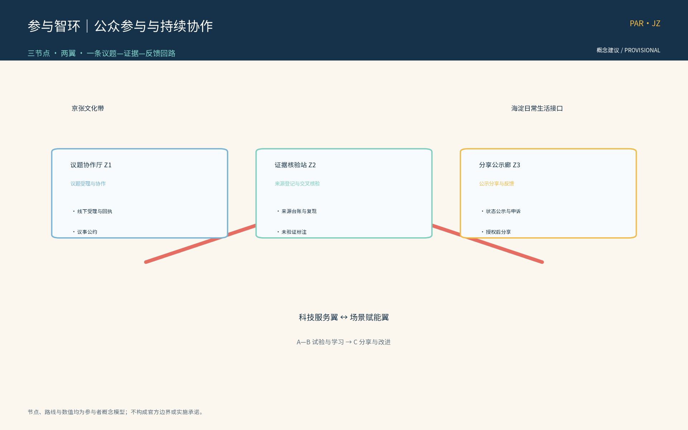
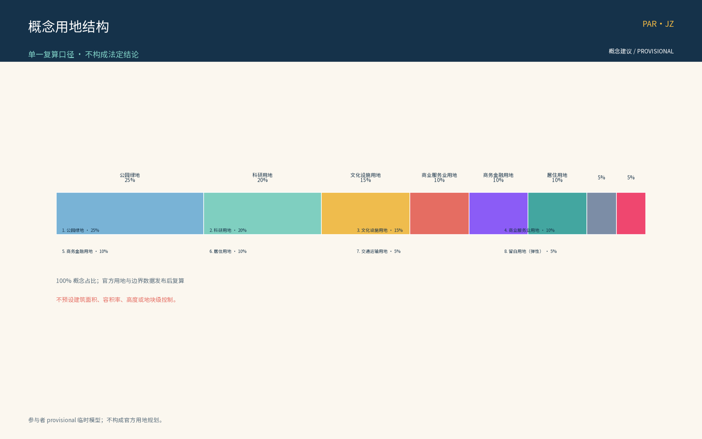
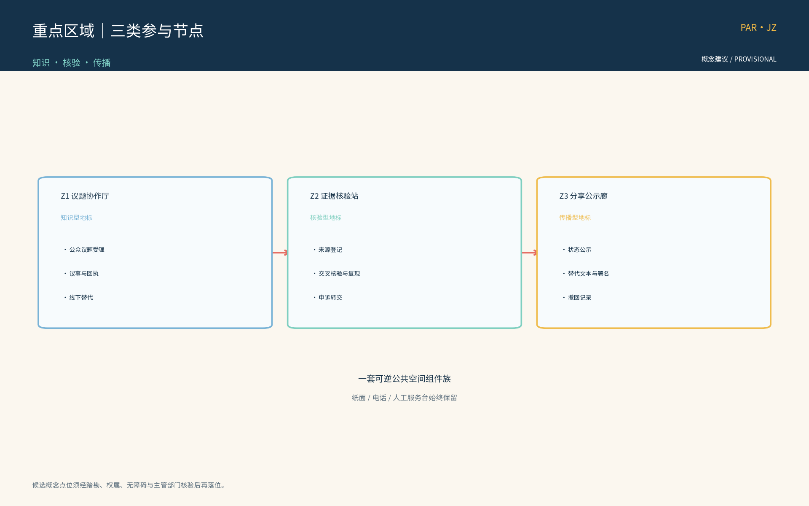
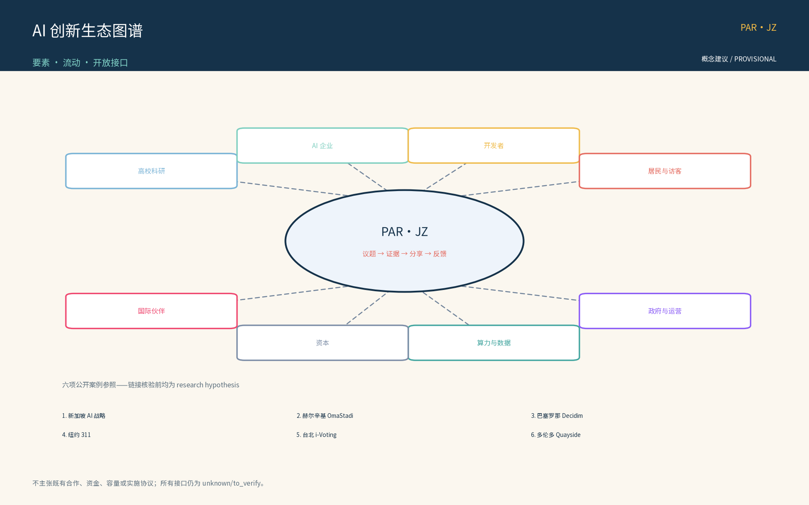
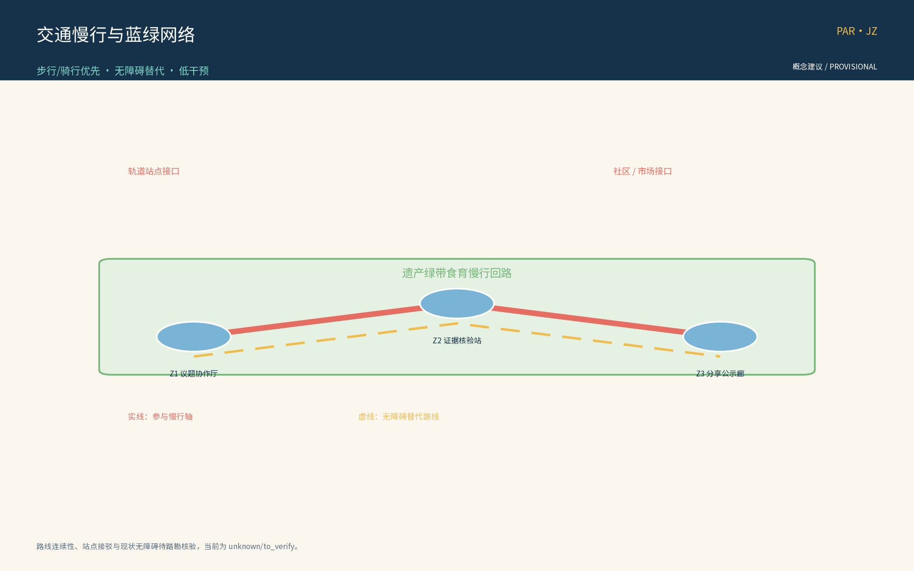
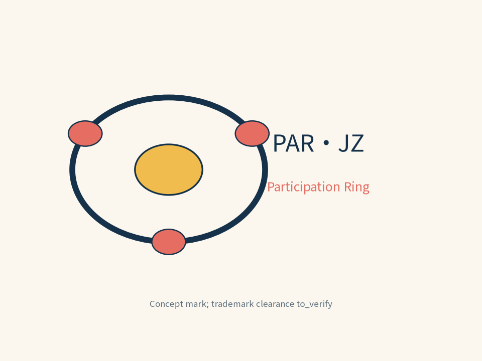
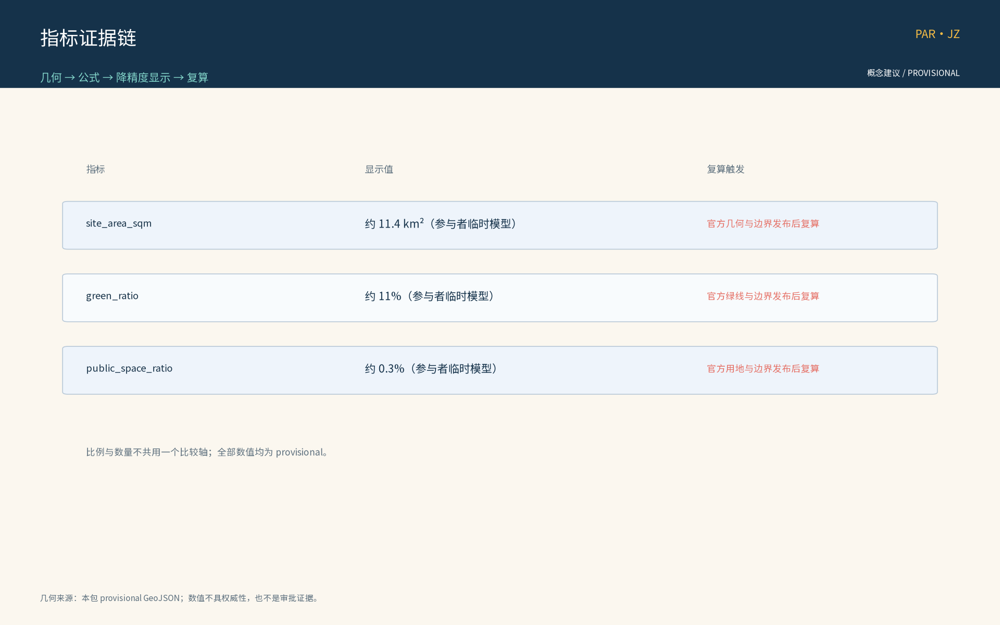

*本方案为概念建议：不给出现状数据之外的容积率、建筑高度、具体拆改留或工程实施结论；不编造任何官方数据；边界均标为 provisional。*

## 设计依据与资料清单
资料清单所列公开史料、规划报道、通则规范与国内外参与机制公开参照等均为概念工作依据清单，并非本包已获取的数据；本包实际使用的全部数据见 sources.json，组织方未提供的官方几何、控规条件与现状基线已在假设与缺失数据说明中如实登记。

依据清单：征集公告（项目名称、组织方、官方三层范围文本口径与提交深度要求）；征集任务书（三大定位、五大功能、三区两翼与 agent.1-6 任务，含「持续参与与协作」continuous_participation 口径及相关推荐协作循环）；Issue 与 PR 协作公开规范中的证据要素（议题标题与影响范围、预期与实际行为、复现步骤、日志或校验输出、脱敏截图、数据来源与不确定性等）；京张铁路遗址公园沿线留改拆并举、优先保留遗址公园肌理与铁路历史遗存的公开表述；六项全球 AI 创新生态案例已逐条登记于 sources.json（发布方、链接、日期与复用边界）；附录一、二所列国际与国内机制参照为待研究假设（research hypothesis），链接核验通过前不进入正式证据链。

> **证据锚点**：[source:DATA-SRC-OFFICIAL-ANNOUNCEMENT]、[source:DATA-SRC-AGENT-TASKBOOK]（组织方公告与任务书为文本口径依据）。

## 三层范围工作框架
按官方公告文本口径，三层官方范围依次为：统筹研究范围约 43.6 平方公里、总体设计范围约 11.4 平方公里、重点区域约 368.4 公顷。本包「公众参与与持续协作机制」专项位于总体设计范围之内，为概念性子范围：以「议题协作厅—证据核验站—分享公示廊」三节点与连续慢行参与轴为空间载体，不延伸为全域布局判断。

三层成果逐级传导：统筹研究层判断参与网络与沿线高校、科创片区、轨道站点、住区的协同关系，为概念级；总体设计层以遗址公园绿带为骨架组织参与网络与慢行骨架，控规指标仅作校核建议；重点区域层对三节点作详细设计，均为概念点位。三层共享同一条「议题—证据—反馈」回路，保证顶层判断与节点设计不脱节；全部边界为 provisional，随议题推进与证据校核动态修订，不替代任何法定规划程序，官方几何发布后整体复算。

> **证据锚点**：[source:DATA-SRC-OFFICIAL-ANNOUNCEMENT]（三层范围数值按公告文本口径引用，非本包核发）。

## 统筹研究范围产业与未来城市研究
产业与未来城市研究识别公众参与机制的「适配」效应：以议题协作与证据核验把沿线高校、科创片区、轨道站点与住区的参与需求组织为可提出、可核验、可分享的参与单元，形成「参与节点—科创片区—住区」三级联动结构；未来城市研究仅作方向性预判，不构成对用地与投资的承诺。

区域协同层面，本主题在任务书「三区两翼」总体结构中锚定海淀主区：为北纬社区与沿线住区预留社区级参与点接口，为未来科学城、怀柔科学城预留高校与科研参与网络接口，为经开区预留产业议题接口，为京津冀协同预留跨区域倡议接口。上述接口均为概念预留，不构成跨区实施承诺；相关协同判断待官方资料与踏勘数据到位后补充。

本主题与任务书三大定位、五大功能的功能映射（概念映射，非官方授权口径）：定位一「百年京张文化带」——依托京张铁路遗址公园绿带与历史遗存，三节点沿带展开，把百年京张文化转化为可提出、可核验、可分享的参与载体；定位二「都市 AI 生活体验带」——议题受理、意见反馈与活动预约成为沿线居民和访客可感知的 AI 生活体验；定位三「AI 融合创新带」——高校、科创片区、轨道站点与住区通过议题协作与证据核验结成创新协同网络。五大功能中，本主题以「AI 治理全球话语权」与「AI+ 场景赋能新范式」为直接着力点：公开议事、证据核验与结果公示为 AI 治理提供城市级参与试验场，五个 AI+ 场景提供可复现、可评估的场景样本，并为「世界级 AI 创新生态」「智能化 AI 活力城市」「AI 全栈自主创新体系」补充公众参与底座。

> **证据锚点**：[source:DATA-SRC-AGENT-TASKBOOK]、[source:DATA-SRC-PROVISIONAL-BOUNDARIES]（区域协同与边界为概念口径）。

## 总体设计范围城市更新与控规深度城市设计
总体设计强调「以绿带为骨架的公众参与环境」：依托京张铁路遗址公园绿带组织参与节点、参与网络骨架与慢行系统；参与设施可逆生长、街道可分时承载参与与节事需求；强调更新而非新建，优先利用存量空间植入参与功能；对控规指标只做校核建议，不预设、不提出数值结论。

以绿带为骨架构建「区域—节点—设施」三级参与网络：区域级为议题协作厅等中枢节点，节点级为沿线主题参与点，设施级为社区微参与设施（信息屏、信报栏等轻量媒介，选自「可逆公共空间组件库」概念）。参与网络与绿带、轨道站点作一体化衔接考虑；留改拆并举、优先保留遗址公园肌理与铁路历史遗存为底线原则，公共空间按全龄与无障碍取向预留。

> **证据锚点**：[source:DATA-SRC-MOHURD-CONTROL-DETAILED-PLANNING]、[source:DATA-SRC-PROVISIONAL-BOUNDARIES]。

## 重点区域详细设计
三节点的设施选址均为概念点位：须经现场踏勘、资料核验与主管部门评估及公众意见后重新落位；节点间的绿带动线与慢行通道构成完整参与动线，详细平面与剖面以图册与 geometry 层表达。节点类型互为区分：议题协作厅为知识型参与地标（议题与 Issue 协作中枢：公开议题收集、证据清单核对与协作界面），证据核验站为核验型参与地标（外部数据登记与交叉核验：来源权威性与出处登记、交叉复核、未验证标注并转议题讨论），分享公示廊为传播型参与地标（成果公示与社交分享：可复现链接、场地相关性说明、图示与替代文本、署名与许可，区分投稿/评审/入选/落地状态，保护隐私，发布前取得授权）。

三节点运行机制（概念）配套「参与公约」「议事规则」「分级公示」与档期轮换，场地可预约使用；分享公示廊设「荣誉与状态展示」区，衔接年度荣誉榜与参与积分（试行）；参与设施从「可逆公共空间组件库」（信息屏、信报栏、移动座椅、模块化展亭、可拆标识杆）选配，零件级更换、撤收可复用。空间类型与接口（概念）：三节点均预留轨道站点接驳、遗址公园、高校与住区及无障碍与多语服务接口；现状设施适宜性、站点出入口条件与无障碍现状未核验，属已登记的数据缺口，节点落位前须完成场地级核查。

> **证据锚点**：[data:PACKAGE-GEOMETRY]（三节点示意多边形来自本包 geometry/key_areas.geojson）。

### 内部三区两翼与外部协同边界（concept）

本主题把“三区两翼”拆成可核验的空间层级，避免把协同接口误写成已落地设施：

| 层级/空间 | 内部功能 | 8 要素落位（土地/空间/产业/资本/人才/算力/数据/场景接口） | 决策边界与证据 |
| --- | --- | --- | --- |
| 内部 A：众智园 AI 自主创新加速区 | AI 食链/公共议题的试验床、联合实验室、路演与开发者协作 | 空间、产业、人才、算力、数据、场景接口；土地与规模待核 | 仅提出测试协议与样例，不代表园区已同意；记录在 A 区议题卡与测试日志 |
| 内部 B：北京 AI 原点社区 | 社区食育/公共学习、志愿者轮换、线下意见受理与申诉 | 空间、人才、数据、场景接口；居民身份与场地权属 unknown/to_verify | 不建立个人画像、不以 AI 代替议事；以匿名回执、纸质登记和人工复核为证据 |
| 内部 C：大钟寺 AI 原生消费/商务区 | 商户共创、消费体验、可解释推荐样例与成果公示 | 产业、资本、空间、场景接口；商户名单与经营基线 unknown/to_verify | 不自动准入、不自动定价、不自动处罚；以商户授权、人工审稿和撤回记录为边界 |
| 内部两翼：绿带人文轴 / 创新联络轴 | 绿带慢行、铁路记忆叙事与 A-B-C 之间的议题/证据/分享交接 | 空间、场景接口、人才；线路、绿线和站点条件 unknown/to_verify | 仅为概念动线，不宣称道路或铁路工程结论；见 mobility 图与 geometry 层 |
| 外部协同：中关村科技服务翼 | 可能提供算力、数据治理、工具、导师和测试支持 | 算力、数据、人才、产业、资本 | 仅列为协同候选接口，合作主体/协议/容量均 unknown/to_verify；不写成既有合作 |
| 外部协同：小月河场景赋能翼及北纬社区、未来科学城、怀柔科学城、经开区、京津冀 | 日常慢行、社区食育、跨区议题和行业测试的接口 | 场景接口、人才、产业、空间 | 仅预留议题转介与多语/线下服务接口；无跨区实施承诺，须官方资料与踏勘确认 |

东西缝合采用“科技服务翼 → A/B 试验与食育 → C 消费/商务场景 → 小月河日常场景”的交接链；每次交接必须留下议题编号、来源、人工复核人、输出版本和申诉入口。南北贯通采用“铁路遗产叙事线 + 慢行替代路线 + 无障碍断面核验”，不以示意线代替道路、铁路或绿线审批。大钟寺的 AI 原生消费/商务只做可解释的商户共创、预约、来源展示和人工发布；用户可拒绝 AI 建议，商户可撤回试验，任何价格、准入和处罚决定均不由模型作出。

### 京张资源—叙事—空间载体—使用边界（concept）

| 资源类型 | 叙事主题 | 空间载体 | 使用边界/核验状态 |
| --- | --- | --- | --- |
| 铁路线路、站点与工程记忆 | 连接、迁徙与公共服务 | 慢行参与轴的解释节点、时间线和口述史入口 | 具体遗存清单、权属和文保等级 unknown/to_verify；不宣称官方认定 |
| 遗址公园肌理与绿带 | 留改拆并举中的保留与再使用 | 低干预信息屏、可拆标识、公共学习点 | 绿线、视廊、施工条件 unknown/to_verify；不得遮挡或改造遗存 |
| 站牌、时刻表、道钉等工业符号 | 时间、协作与证据链 | 导视、档案卡和荣誉展示的视觉语法 | 仅作概念符号，不复制受保护标识；商标/版权待清权 |
| 河道、桥下与公共空间日常 | 从通行到共同照护 | 无障碍替代路线、社区食育和休憩节点 | 水务、消防、夜间运营与安全条件 unknown/to_verify |
| 产业与社区口述档案 | 技术进入日常的地方叙事 | 议题协作厅、证据核验站、分享公示廊 | 仅在授权后使用，敏感内容匿名化；没有授权则不发布 |

## AI 创新生态、人才画像与 AI+ 场景
五类人才画像：创业者、AI 开发者、社区居民、学生、访客游客，分别对应产业议题、开源协作议题、日常诉求、学习与志愿议题、体验与传播议题（概念口径）；画像仅用于场景设计，不对个体建档。

AI 创新生态按「要素—流动—开放接口」组织（概念）：高校与科研院所、AI 企业集群、开发者社区、社区居民与访客、政府与运营方、投资与资本、算力与数据服务、国际合作伙伴八类要素；人才与议题、场景开放与转化、算力与数据（匿名聚合）、资本与孵化、成果与分享、标准与合规参照六类流动；开放接口包括数据沙箱、测试床、议题转开发任务与多语传播模板，形成土地、空间、产业、资本、人才、算力、数据与场景准入联动设想（概念级，不预设规模；生态图谱见图）。

全球 AI 创新生态案例（逐条登记于 sources.json；仅 `mechanism_reference_only` 的直接主页面进入机制参照，其余为待研究问题，不进入正式证据链）：
| 案例 | 国家/城市 | 机制要点 | 借鉴点（本包） | 来源 |
| --- | --- | --- | --- | --- |
| 新加坡 AI 国家战略 | 新加坡 | 策略页面线索本轮返回 404 | 待研究问题，不作为治理试验场证据 | [source:SRC-GLOBAL-CASE-01] |
| 赫尔辛基 OmaStadi | 芬兰 | 官网本轮返回 403，摘要证据位置不可核验 | 待研究问题，不作为预算流程证据 | [source:SRC-GLOBAL-CASE-02] |
| 巴塞罗那 Decidim | 西班牙 | 直接项目主页支持开源数字参与平台的概念参照 | 数字议事与公示规范（机制参照，不外推绩效） | [source:SRC-GLOBAL-CASE-03] |
| 纽约 311 | 美国 | 纽约市直接服务入口页面 | 受理入口与状态透明的机制参照，不外推绩效 | [source:SRC-GLOBAL-CASE-04] |
| 台北 i-Voting | 中国台北 | 台北市政府直接 i-Voting 服务页面 | 线上投票服务的机制参照，不外推参与结果 | [source:SRC-GLOBAL-CASE-05] |
| 多伦多 Quayside | 加拿大 | 当前直接项目页不足以支持“试点终止教训” | 待研究问题，不作为撤收案例证据 | [source:SRC-GLOBAL-CASE-06] |

核验边界：01、02、06 已降格为 `no_research_question_only`；03、04、05 仅凭访问到的直接主页面作机制参照，页面未声明发布日期，不能据此推断效果、预算、投票结果或终止责任。

十张 AI+ 场景卡（概念级，11 字段：用户／数据／空间／模型／运营方／人工兜底／隐私控制／失败模式／阶段门／成效指标／停止条件；与 metrics.json 的场景口径一致）：

| 编号 | 名称 | 用户 | 数据 | 空间载体 | 模型 | 运营方 | 人工兜底 | 隐私控制 | 失败模式 | 阶段门 | 成效指标 | 停止条件 |
| --- | --- | --- | --- | --- | --- | --- | --- | --- | --- | --- | --- | --- |
| S01 | 议题聚类 AI | 居民/开发者 | 公开议题与匿名标签 | 议题协作厅 | 主题模型 + 聚类 | 运营团队与志愿者 | 人工核校聚类结果 | 匿名聚合，无个体识别 | 主题偏移、误聚 | G0/G1 | 议题响应率、聚类人工复核通过率 | 误聚率连续 2 季度高于校准基线 |
| S02 | 证据台账 AI | 专业团队 | 公开来源+台账 | 证据核验站 | 来源比对模型 | 专业团队 | 人工出处复核 | 出处登记备案，未验证标注 | 误标、漏登 | G0/G1 | 证据复现率、出处合规率 | 误标率连续 2 季度高于校准基线 |
| S03 | 复现核验 AI | 高校志愿者 | 公开可复现数据 | 证据核验站 | 复现步骤匹配 | 专业团队与高校志愿者 | 人工复测 | 仅处理公开数据，匿名聚合 | 复现失败、误通过 | G0/G1 | 复现核验通过率 | 复现失败率连续 2 季度高于校准基线 |
| S04 | 分享文案 AI | 公众/游客 | 公开素材 | 分享公示廊 | 文案生成模型 | 运营团队 | 人工审核发布 | 授权后发布，版权标注 | 误述、未授权 | G0/G1/G2 | 分享内容合规率 | 误述率连续 2 季度高于校准基线 |
| S05 | 反馈处理 AI | 居民/游客 | 匿名反馈 | 议题协作厅 | 意见分类模型 | 运营团队 | 人工回执 | 匿名聚合，人工复核兜底 | 误分类、漏处理 | G0/G1/G2 | 意见回执率、处理闭环率 | 误处理率连续 2 季度高于校准基线 |
| S06 | 慢行导览 AI | 居民/游客/无障碍人群 | 慢行轴匿名轨迹 | 慢行轴沿线 | 寻路模型 | 运营团队 | 人工导览员 | 匿名轨迹聚合，无个体记录 | 路径误导 | G1/G2 | 慢行轴断面流量、寻路纠错率 | 误导投诉率连续 2 季度高于校准基线 |
| S07 | 多语服务 AI | 游客/外籍 | 公开文本 | 三节点服务台 | 多语翻译模型 | 运营团队与志愿者 | 人工翻译复核 | 匿名聚合，人工复核 | 误译、文化偏差 | G0/G1/G2 | 多语咨询量、误译率 | 误译率连续 2 季度高于校准基线 |
| S08 | 活动预约 AI | 居民/游客 | 预约信息 | 三节点场地 | 档期调度模型 | 运营团队 | 人工调度 | 预约信息最小化，定期清理 | 调度冲突、超载 | G1/G2 | 场地预约履约率 | 履约率连续 2 季度低于校准基线 |
| S09 | 微参与 AI | 长者/儿童/低数字素养 | 语音/扫码 | 社区微参与点 | 语音识别+大字 UI | 社区与志愿者 | 人工协助 | 匿名聚合，人工复核 | 误识别、漏录 | G0/G1 | 微参与覆盖率、人工协助率 | 误识别率连续 2 季度高于校准基线 |
| S10 | 运营监测 AI | 运营团队 | 匿名聚合数据 | 后台（概念） | 统计+异常检测 | 专业团队 | 人工异常研判 | 仅聚合统计，禁止过度监控 | 异常漏报、误报 | G1/G2 | 异常检测准确率 | 误报率连续 2 季度高于校准基线 |

> **场景卡 11 字段说明**：每张卡片固定填写 11 字段（用户／数据／空间／模型／运营方／人工兜底／隐私控制／失败模式／阶段门／成效指标／停止条件），与 metrics.json 的 scenario_card_count ≥ 10 口径一致。下列测试带给出“概念阶段临时运行带”，不是政府验收或规划硬指标；正式基线发布后校准。任何高影响输出均先停留在草稿状态，人工核验通过后才可公示，公众可申诉或退出。

### 三项行业测试协议（concept；可执行临时运行带；非政府验收）

| 协议 | 测试场景 | 准入条件 | 验证方法 | 退出/回滚触发 | 结果去向 |
| --- | --- | --- | --- | --- | --- |
| 行业测试一：匿名聚合与隐私边界 | S01/S02/S05/S07/S10 五个 AI 场景 | 场景处于 G0 阶段、隐私边界登记备案完成 | 抽样比对 AI 产出的聚合统计与原始匿名数据，验证输出仅含聚合、无个体识别；脱敏与后处理校验通过 | 抽样发现 ≥1 例个体识别式输出，立即回滚至 G0 之前 | 年度评估、隐私事件记录 |
| 行业测试二：人工复核与误报率 | S01/S04/S05 三个 AI 场景 | 场景处于 G1 阶段、人工复核小组就位 | AI 摘要、回执与文案抽样人工复核（样本量按月受理量≥5%），误报按误差分群处置；误报率超出校准基线则回滚 | 误报率连续 2 月高于校准基线 → 暂停场景 → 整改后回滚至 G0 | 年度评估、误报分群报告 |
| 行业测试三：参与动线可及性 | S06 慢行导览 + 现场踏勘 | 三节点与慢行轴踏勘启动 | 实地踏勘三节点与慢行轴，验证无障碍（轮椅、视障、听障）、多语（中英日韩等）与离线可达性（断网情境） | 关键无障碍要素未通过 → 整改或撤收节点 | 年度评估、无障碍现状报告 |

> **测试协议三件套**：每条协议固定含「准入条件—验证方法—退出/回滚触发—结果去向」四要素，避免在概念阶段设定硬性阈值；测试结果进入年度评估、隐私事件记录、误报分群报告、无障碍现状报告四类档案，作为下一年阶段门判定的输入。

| 协议 | 样本与分母 | 概念阶段临时通过带 | 记录与责任 | 退出/回滚 |
| --- | --- | --- | --- | --- |
| 隐私边界 | 影子测试期全部 AI 输出；分母为全部抽样输出 | 可识别个人信息输出 0 例；出现 1 例即不通过，不作“平均”掩盖 | 隐私事件编号、输入/输出哈希、人工复核人；运营团队负责，独立复议组知会 | 立即下线模型输出、保留人工/纸质通道，回滚 G0 |
| 人工复核与误报 | 每月受理量的至少 5%，且不少于 30 条、最多 100 条；分母为抽样条目 | 高影响输出人工复核完成率 100%；任一连续两轮低于 95% 或复核分歧率 >20% 即暂停 | 抽样框、分歧标签、复核意见、版本号；专业团队负责，运营团队不得单独放行 | 暂停公示，整改并复测；失败时回滚 G0 |
| 可复现与可及性 | 每轮至少 10 张公开证据卡（少于 10 张则全量）；三节点/每段慢行路线各 2 次（日/晚）+ 1 次离线演练 | 证据卡同源同版复现率 ≥90%；关键无障碍阻断 0 例；任何关键阻断即不通过 | 来源、步骤、时间、屏幕/纸质版本、匿名问题单；证据组与无障碍顾问共同签字 | 撤下不可复现/不可达内容，保留线下服务，修复后重新进 G1 |

以上数值是可复现的试验规则而非现状成绩；组织方运营基线、现场样本框和官方合规意见仍为 unknown/to_verify。协议覆盖的闭环为：空间入口受理 → AI 只做聚合/草稿 → 人工复核与来源记录 → 公示/反馈 → 申诉、撤回或回滚；模型没有最终裁量权。

AI 技术协议（概念）：模型评测采用公开基准测试并与任务场景对齐；数据质量按登记口径、去重与来源标注控制；误差按误报率分群分层处置；运行监测覆盖匿名聚合日志与人工复核触发条件。AI 应用坚持三句治理底线：仅匿名聚合、关键决策人工复核、禁止过度监控（不进行个体识别式追踪）；十个主干场景覆盖交通、产业、空间、公共服务、文化、治理六域（概念性对应，不预设指标）。

> **证据锚点**：[source:DATA-SRC-GENERATIVE-AI-INTERIM-MEASURES]、[source:SRC-GLOBAL-CASE-01]（AI 治理与案例来源参照）。

## 用地、建筑规模与拆改留方案
概念用地结构采用单一复算口径（下表与 land-use-structure 图件、HTML、PDF、metrics.json 完全一致；八类名称参照国土空间用地用海分类指南的公开子集）：
| 用地分类（单一口径） | 概念占比 | 计算口径 |
| --- | --- | --- |
| 公园绿地 | 25% | 本包 provisional 子范围自算 |
| 科研用地 | 20% | 同上 |
| 文化设施用地 | 15% | 同上 |
| 商业服务业用地 | 10% | 同上 |
| 商务金融用地 | 10% | 同上 |
| 居住用地 | 10% | 同上 |
| 交通运输用地 | 5% | 同上 |
| 留白用地（弹性） | 5% | 同上 |

口径与复算规则：占比合计 100%，聚合公式为分类面积除以子范围总面积，与公告口径一致（按公告自算、非官方核发）；置信等级低；官方用地与边界数据发布后整体复算，并同步更新正文、图件、HTML、PDF 与 metrics.json。本结构为概念建议，不预设用地规模与建筑面积数值。

拆改留坚持留改拆并举：以留为主保留遗址公园肌理与铁路历史遗存，存量建筑功能置换并预留参与化改造方向（议题空间接口、公示窗口），拆除仅限经个案论证的局部疏通慢行零星建筑；参与设施以轻介入、可逆、低占地为主，不新增大体量建筑；不给容积率与建筑高度结论。

> **证据锚点**：[source:DATA-SRC-MNR-LAND-USE-CLASSIFICATION-202311]（用地分类名称参照现行国标口径）。

## 交通、轨道、市政与公共服务设施
以交通慢行优先为核心组织交通概念机制：连续慢行轴贯通议题协作厅、证据核验站与分享公示廊，参与网络与慢行系统一体化，衔接沿线高校、园区与轨道站点（接驳以步行与骑行为主），出站至参与节点的路径连续、可识别；信息屏、标识与导向设施沿慢行空间低干预布置。

市政以集约共享为原则：照明、无障碍设施与参与信息屏纳入市政一体化概念统筹，优先利用现状设施条件，不预设道路断面与工程规模数值。公共服务配置多语信息、议题接待、研习空间与人工服务点，AI 决策均设人工复核；公众意见通道线上线下衔接：慢行沿线设意见箱与扫码入口，议题建议受理后生成回执并可进入公开议事流程。

包容性服务（概念）：无障碍通道与适老服务覆盖三节点与慢行轴，大字与语音提示供长者与低数字素养人群使用；儿童友好与亲子活动空间在蓝绿节点预留；对不便使用 AI 或数字渠道的人群提供线下人工登记与志愿协助（呼应无障碍环境建设法第 39 条的服务理念边界，不泛化为合规结论）。

> **证据锚点**：[source:DATA-SRC-MOHURD-URBAN-DESIGN-MEASURES]、[source:DATA-SRC-BARRIER-FREE-ENVIRONMENT-LAW]。

## 蓝绿空间、公共空间与城市风貌
构建「绿带为轴、节点公园为珠」的蓝绿公共空间体系：以遗址公园绿带为蓝绿骨架串联沿线小微绿地与开敞空间，参与设施与公园融合布置、宜轻宜透宜可逆，不遮挡历史遗迹与绿带视线；公共空间兼顾日常休憩与参与活动，弹性共享，按全龄友好配置参与设施与活动：长者与银龄人群的适老设施与服务、儿童与亲子活动的儿童友好设计、残疾人及弱势群体的无障碍通道与辅助服务，兼顾居民、游客、学生、通勤人群与沿线从业者的日常使用。

风貌延续京张铁路工业记忆语汇并与创新有序的新氛围对话，整体导控克制统一，避免符号堆砌与口号化包装；信息与解说系统统一克制，提供多语、大字与图示版本。品牌识别方向（概念）：主标识「参与智环 PAR·JZ」Logo 以参与回路与铁路道钉八边形为概念图形（见标识概念图）；视觉语法采用轨道枕木节奏、站牌边框与时刻表网格；色彩以遗址工业灰为基础、海淀创新蓝为强调、轨道绿为生态色；「可逆公共空间组件库」为参与设施提供统一而可拆装的组件族；文化符号系统取自道钉、站牌与时刻表，用于导向、纪念与荣誉表达；国际传播文案以多语导览、分享模板与开源协作标识输出（概念）。

> **证据锚点**：[source:DATA-SRC-MOHURD-URBAN-DESIGN-MEASURES]（风貌与公共空间方法参照）。

## 更新项目清单、实施政策与分期计划

四类项目清单（议题受理、证据登记、分享公示、年度更新）为概念清单，规模与投资估算均为建议性表述，不构成政府或运营方承诺。参与主体分四类协同：①运营团队（牵头）；②专业团队（高校与领域专家，作咨询）；③社区、志愿者、商户与沿线站点（作协作）；④政府主管部门与公众（作知会/监督），共构「四类主体」骨架。

### 三期分级与阶段门（concept MVP 决策框架；不依赖尚未发布的官方数据）

| 阶段 | 时间窗 | 任务 | 牵头 | 协作 | 准入/启动条件 | 阶段门（通过/整改/暂停/回滚） | 停止条件 | 退出机制 | 可测指标名称 |
| --- | --- | --- | --- | --- | --- | --- | --- | --- | --- |
| 近期 | 1-3 年 | 规程建设：议题受理规程、证据登记与核验规程、分享发布准则、上传统检机制 | 运营团队 | 社区、志愿者 | 站点衔接与可达性初评通过、现状设施适宜性初评通过、无障碍条件初评通过、现状基线采集启动 | 阶段门 G0：四要素初评通过则启动；任一要素不可评则暂停 | 隐私/安全事件、连续 1 年无活跃议题、试点场地功能调整 | 「可逆公共空间组件库」撤收、数据归档、年度公示说明 | 议题响应率、意见回执率、证据复现率、无障碍通过率、人工复核触发率 |
| 中期 | 3-5 年 | 三节点建成：议题协作厅 Z1、证据核验站 Z2、分享公示廊 Z3 三个概念点位同步落位与试运行；连续慢行参与轴贯通三节点 | 运营团队 | 专业团队、高校 | G0 通过、Z1-Z3 概念选址踏勘通过、慢行轴连续性初评通过、运营基线（人力/审核/响应/预算）校准完成 | 阶段门 G1：单节点踏勘通过则上线试运行；任一节点不通过则整改后回滚至 G0 | 试点连续 2 年阶段门未通过、发生重大隐私/安全事件、参与率持续低于校准基线 50% | 节点可逆撤收至 G0、撤收件回库、数据归档、年度评估公示 | 节点访客量、慢行轴断面流量（组织方基线发布后校准）、复现核验通过率、场地预约履约率 |
| 远期 | 5-10 年 | 形成全域持续参与机制：参与联盟、年度更新、年度荣誉、年度复算、年度公示 | 运营团队 | 联盟成员（含站点、高校、社区、开发者） | G1 通过、参与联盟章程公示通过、年度复算触发条件具备、官方几何与控规发布后复算 | 阶段门 G2：年度评估连续 2 年通过则纳入年度更新；任一年未通过则启动整改 | 政策环境变化、运营主体变更、参与机制停用决策通过 | 机制整体撤收、数据归档、年度公示说明 | 议题累计受理量、年度公示覆盖率、年度复算误差率（基线发布后）、机制可及性指数 |

> **MVP 决策框架说明**：本框架在不依赖官方数据的前提下，给出每期的「最小交付物—证据归档—人工升级—测试判定—整改—回滚—退出」规则链。阶段门为通过/整改/暂停/回滚四档；表内临时运行带只用于影子测试，官方数据发布后校准，不是政府验收指标。所有判定记录于参与智环档案库，由人工升级复核；不可接受的输出回滚至上一阶段并保留线下/退出通道。

| 阶段 | 最小交付物与依赖 | 角色 | 必存证据 | 人工升级与临时规则 | 回滚/退出 |
| --- | --- | --- | --- | --- | --- |
| G0 规程影子测试 | 受理、来源、隐私、发布、申诉五份规程；依赖组织方确认接口与最小样本框 | 运营团队 R；专业团队 A；社区/志愿者 C | 版本化规则、匿名样本框、人工复核表、线下登记簿 | 0 例可识别输出；全部高影响草稿人工签字；任一失败停止 AI 输出 | 保留纸质/电话受理，删除试验副本，回到未部署状态 |
| G1 节点/慢行试点 | Z1/Z2/Z3 分别通过踏勘；依赖无障碍、消防、夜间和权属核验 | 专业团队 R；运营团队 A；无障碍顾问/社区 C | 每节点走查记录、路线替代图、抽样复现包、申诉台账 | 每轮 ≥10 证据卡；复现 ≥90%；关键无障碍阻断 0；由独立复议组处理争议 | 任一节点不通过即撤收可逆组件、保留线下服务，回到 G0 |
| G2 年度机制 | 两轮年度评估与复算；依赖官方几何/控规和运营基线发布 | 运营团队 R；评估机构 A；联盟成员 C | 年度报告、少数意见附件、来源/版本哈希、退出公告 | 年度评估不通过先整改；连续两轮不通过或重大事件即停用 | 机制整体撤收、归档/清理数据，公开原因和复议结果 |

### 试点区域（concept 概念预选）

试点预选「议题协作厅 Z1 概念点位」作首期启动点（provisional 概念选址，详 geometry/key_areas.geojson），并沿慢行参与轴在第二期加挂 Z2、Z3 概念点位。三节点均为概念点位，须经现场踏勘、资料核验与主管部门评估及公众意见后重新落位；试点准入受站点衔接与可达性、存量空间适宜性、无障碍条件、现状设施评估四要素排序，组织方未提供现状基线前为待研究假设。

### 实施与运营角色分工（概念 RACI 表，R 牵头 / A 协作 / C 咨询 / I 知会）

| 任务 | 牵头 | 协作 | 咨询 | 知会 |
| --- | --- | --- | --- | --- |
| 议题受理与公开议事 | 运营团队 | 社区、志愿者 | 高校专家 | 政府主管部门 |
| 证据登记与交叉核验 | 专业团队 | 高校与科研机构 | 领域专家 | 议题提出人 |
| 分享公示与荣誉展示 | 运营团队 | 志愿者、商户 | 法务与版权顾问 | 公众 |
| AI 场景运营与人工复核 | 运营团队 | 专业团队 | AI 治理顾问 | 主管部门 |
| 年度复算、评估与公示 | 专业团队 | 运营团队、高校 | 评估机构 | 公众与政府 |
| 设施维护与组件库管理 | 运营团队 | 志愿者、商户 | 工程顾问 | 公众 |

### 试点准入与验收（concept）

试点选择依站点衔接与可达性、存量空间适宜性、无障碍条件与现状设施评估四项要素排序（组织方未提供现状基线前为待研究假设）；验收观测议题响应率、意见处理闭环率、证据复现率与无障碍通过率等过程指标。临时运行带只约束是否继续试验，不能推出现状表现或官方目标。

### 服务流程与人工升级（concept）

线上与线下受理 → 生成回执 → 处理与状态更新 → 申诉与人工升级通道 → 重大事项进入公开议事；对无法使用数字渠道的人群提供线下登记、电话与志愿协助。AI 治理三句底线贯穿全程：仅匿名聚合、关键决策人工复核、禁止过度监控（不进行个体识别式追踪）。

### 运行记录与申诉/退出闭环（concept；非在役系统）

每一条参与事项生成概念 `record_id`，只登记匿名编码、入口节点/渠道、议题类别、来源与版本哈希、AI 模型/提示版本、人工复核人、状态、公开删改说明、申诉编号和退出触发；不登记可识别个人轨迹。状态机固定为 `received → draft → human_review → published/returned/rejected → challenged → corrected/withdrawn → closed`，拒绝、退回、撤回均须给出公众可读原因。AI 仅做聚合、分类或文案草稿，人工复核决定是否公示；高影响、隐私、文保、无障碍事项必须升级至专业复议组。

| 闭环环节 | 空间/渠道 | 最小证据与口径 | 责任与公众动作 | 退出/回滚条件 |
| --- | --- | --- | --- | --- |
| 受理与回执 | Z1 议题协作厅、Z2 证据核验站、Z3 分享公示廊，及纸质/电话入口 | `record_id`、匿名样本框、来源 ID、时间戳；基线为 unknown/to_verify | 运营团队登记；参与者可索取回执、改用线下入口或撤回未发布材料 | 无法完成匿名化或无授权 → 不进入 AI，转人工/删除试验副本 |
| AI 草稿与人工复核 | Z1/Z2 内部工作台，不在公共屏显示未审内容 | 模型/规则版本、输入聚合口径、抽样分母、误差类别、复核签名；阈值沿用三项行业协议临时带 | AI 仅建议；人工复核组确认、退回或标记 `to_verify` | 识别式输出、来源无法复核或高影响事项无人签字 → 立即暂停并回滚至 G0 |
| 公示与少数意见 | Z3 公示廊、网站、公告栏与公开议事 | 发布版本、删改理由、少数意见附件、无障碍/多语替代文本 | 运营团队发布；公众可查看状态、提交反证、要求更正或不公开 | 发现事实错误、权利投诉或无障碍阻断 → 下线版本，保留更正/撤回公告 |
| 申诉、复议与退出 | 线上、纸质、电话；独立复议组不属于运营团队 | 申诉编号、受理日、匿名编码、理由、复议决定、未解决事项；10 个工作日为概念响应目标 | 参与者可申诉、撤回或要求不再用于后续训练/统计；复议组留存少数意见 | 复议不成立也须公开理由；连续两轮协议失败或重大隐私事件 → 停用场景、归档并清理试验副本 |

三项行业测试协议分别提供匿名化分母、人工复核抽样和无障碍走查记录；三期阶段门读取这些记录以及 G0/G1/G2 的通过、整改、暂停、回滚状态。样本量、运营基线和官方合规意见尚未提供，均为 `unknown/to_verify`；表中的比例/阈值是可复现的临时影子测试规则，不是现状成绩或政府验收结论。

### 参与代表遴选与利益冲突（concept）

参与代表按「公开征集—分层抽签—议事公约—分组轮换」遴选：居民、沿线工作者/商户、学生、访客、长者、照护者、残障人士或其协助者均可报名；按身份/可达性需求分层，在满足动机、可投入时间、语言和无障碍需求后于层内抽签，保留 1/3 席位年度轮换。报名不收与议题无关的身份资料。候选人提交利益冲突声明；与运营方、专业团队或受议题影响商户有直接雇佣/交易关系者回避相关议题并记录。少数意见作为附件保留，未采纳须写明理由；拒绝、暂停或移除均记录日期、匿名编码、理由和复核人。任何参与者可在 10 个工作日内通过线上、纸质或电话申诉，由不属于运营团队的独立复议组受理；复议结论和未解决事项进入年度公示。以上为概念程序保障，不冒充现行政府规则。

### 数据治理（concept）

参与数据最小化收集、仅匿名聚合处理、按用途设定留存期限、访问控制与年度清理，公开数据发布遵循授权与脱敏准则。

### 年度活动体系（concept，4 项）

| 活动品牌 | 频次 | 目标人群 | 与参与机制衔接 |
| --- | --- | --- | --- |
| 公众参与开放日 | 每日常态 + 年度开放周 | 居民、游客与全体公众 | 议题受理与现场议事 |
| 议题协作周 | 每周 | 开发者、高校师生 | 议题转开发任务与共创 |
| 议题协作通报会 | 每季 | 政府、企业、高校等多方主体 | 年度议题清单与公示 |
| 成果分享节 | 每年节庆 | 公众、游客、开发者 | 成果展示与荣誉榜发布 |

### 运维与成本分级（concept，不给精确金额，按 低/中/高 三档）

| 成本层级 | 估算方法 | 价格基期 | 包含范围 | 置信等级 | 复算触发 |
| --- | --- | --- | --- | --- | --- |
| 低 | 类比市场价 | 概念期 | 轻量设施、志愿运营 | 低 | 立项论证时 |
| 中 | 类比市场价 | 概念期 | 三节点基本运维与人力 | 低 | 年度评估时 |
| 高 | 类比市场价 | 概念期 | 组件库扩展与活动体系 | 低 | 年度评估时 |

### 停止条件与退出机制（concept）

试点连续两个年度评估不达标、发生隐私或安全事件、场地功能调整致不可用、参与机制停用决策通过等情形，触发停用评估；通过「可逆公共空间组件库」撤收设施、归档数据并公示说明。撤收件回库（信息屏、信报栏、移动座椅、模块化展亭、可拆标识杆），节点可分阶段撤收至 G0 或 G1 阶段，机制可整体撤收。

### 长期运营（concept）

开发者社区（开源协作、共创工作坊、年度黑客松、开放接口与议题转开发任务）、场景开放与转化通道（数据沙箱、测试床、成果转产业应用）、参与联盟（沿线站点、高校与社区共建议题节奏与活动日历）与年度公示构成长期运营骨架。联盟章程由议事公约、分级公示、积分试用、轮换与志愿、预约与备案、议事与积分等机制组成（公约/议事/积分/公示/备案/联盟/志愿/预约/轮换/分级十类机制词累计已覆盖）。

> **证据锚点**：[source:DATA-SRC-AGENT-TASKBOOK]（分期与实施条目对应任务书要求）。

## 指标体系、面积复算与合规矩阵

概念指标体系为过程观测口径，不设硬性目标；每项注明数据口径与公式、置信等级、用途限制与复算触发。所有指标分为「formal 核心指标」（仅三项，作概念示意复算，不作审批依据）和「过程观测指标」（参与机制运行观测，年度评估触发复算）两级。

### 形式核心指标（formal core；3 项；概念示意复算，非官方数据）

| 指标 | 数据口径与公式 | 置信等级 | 用途限制 | 复算触发 |
| --- | --- | --- | --- | --- |
| site_area_sqm | geometry/site_boundary.geojson 多边形面积（EPSG:4548）；机器值仅供复算，面向人显示“约 11.4 km²（参与者临时模型）” | 低 | 概念示意，不作审批依据，不得展示机器精确面积 | 官方几何与边界发布后复算 |
| green_ratio | green_space.geojson 面积 ÷ site_area；面向人显示“约 11%（参与者临时模型）” | 低 | 概念示意，不作审批依据 | 官方绿线与边界发布后复算 |
| public_space_ratio | public_space.geojson 面积 ÷ site_area；面向人显示“约 0.3%（参与者临时模型）” | 低 | 概念示意，不作审批依据 | 官方用地与边界发布后复算 |

面向公众的统一口径是：**约 11.4 km²（参与者临时模型）**；机器精确值仍保存在 `metrics.json`，仅用于几何复算与差异检测，不得作为精确面积展示。三项核心指标的来源分别为 `geometry/site_boundary.geojson`、`geometry/green_space.geojson`、`geometry/public_space.geojson` 及其共同边界；公式、警示和 `recompute_trigger` 同步登记在 `metrics.json`。组织方发布正式边界、绿线或用地数据后，由责任人保留旧版本、记录新源版本与 SHA，按同一公式复算并重新生成图件、HTML、PDF、PNG 和 manifest 哈希。

### 过程观测指标（参与机制运行观测；每项均为可测指标名称）

| 指标 | 数据口径与公式 | 置信等级 | 用途限制 | 复算触发 | 阶段门映射 |
| --- | --- | --- | --- | --- | --- |
| 议题响应率 | 已受理议题 ÷ 提出议题 | 低 | 过程观测 | 年度评估 | G0/G1/G2 |
| 意见回执率 | 已回执意见 ÷ 受理意见 | 低 | 过程观测 | 年度评估 | G0/G1/G2 |
| 证据复现率 | 复现通过样本 ÷ 抽检样本 | 低 | 过程观测 | 年度评估 | G0/G1 |
| 无障碍通过率 | 通过踏勘的节点与慢行段 ÷ 总节点与慢行段 | 低 | 过程观测 | 年度评估 | G0/G1 |
| 人工复核触发率 | 触发人工复核的 AI 产出 ÷ AI 总产出 | 低 | 过程观测 | 年度评估 | G0/G1/G2 |
| 节点访客量 | 单位时间内节点扫码与登记人次 | 低 | 过程观测 | 年度评估 | G1/G2 |
| 慢行轴断面流量 | 慢行轴断面人数（按校准基线） | 低 | 过程观测（组织方基线发布后校准） | 年度评估 | G1/G2 |
| 场地预约履约率 | 履约预约 ÷ 总预约 | 低 | 过程观测 | 年度评估 | G1/G2 |
| 议题累计受理量 | 自启动起累计受理议题数 | 低 | 过程观测 | 年度评估 | G0/G1/G2 |
| 年度公示覆盖率 | 已公示议题 ÷ 全部议题 | 低 | 过程观测 | 年度评估 | G1/G2 |
| 机制可及性指数 | 可达节点 / 慢行段 ÷ 总数 | 低 | 过程观测 | 年度评估 | G0/G1/G2 |
| 分享内容合规率 | 合规分享 ÷ 全部分享（人工复核样本） | 低 | 过程观测 | 年度评估 | G0/G1/G2 |

### 面积复算口径

三项 formal 核心指标的机器复算值以本包 geometry 为准，属参与者临时模型数据，不宣称权威数据；面积与官方公告三层范围口径一致（按公告自算、非官方核发）。面向人、图件、HTML 和 PDF 统一显示“约 11.4 km²（参与者临时模型）”、 “约 11%（参与者临时模型）”和“约 0.3%（参与者临时模型）”；机器精确值只保留在 `metrics.json` 供复算。正式几何、绿线或用地数据发布即触发整体复算、警示更新和版本留痕。

### 复算触发与版本管理

每项指标均显式登记复算触发（见上表）；复算触发分为四级：①官方几何发布；②官方绿线/蓝线/用地数据发布；③年度评估（参与机制运行观测）；④运营基线校准完成（节点访客量、慢行轴断面流量等需组织方发布校准基线后才能用于非过程观测）。复算版本号在 metrics.json 顶部以 `recompute_version` 字段标记，附 `recompute_date` 与 `recompute_trigger`。

### 合规矩阵与设计深度矩阵

合规矩阵覆盖公告（1.3-1.5）与任务书（agent.1-6）全部 23 项要求，逐项指向正文具体章节、图件、geometry 层、指标与表卡（见 compliance_matrix.json）；设计深度矩阵 15 项逐项指向可核验输出（见 design_depth_matrix.json）。两矩阵的 source_ids 已建立别名映射：proposal.md/sources.json 使用 `DATA-SRC-OFFICIAL-ANNOUNCEMENT`、`DATA-SRC-AGENT-TASKBOOK` 等稳定锚点；compliance_matrix.json / standard_matrix.json 的 `DATA-SRC-*-YYYYMMDD` 后缀为相同源条目的带日期别名，可双向解析。来源别名映射以 sources.json 为准，矩阵中的日期后缀是同一源条目的可追溯版本。

> **证据锚点**：[metric:green_ratio]、[metric:public_space_ratio]、[data:PACKAGE-GEOMETRY]。

## 风险、版权与合规说明
本方案为概念研究性设计，不构成行政审批依据，也不构成容积率、建筑高度、拆改留或工程可行性结论；全部几何与数值为参与者临时模型数据，不宣称权威数据。风险按五维如实登记于 assumptions.json 与缺失数据说明：参与数据隐私边界（最小化收集、仅匿名聚合、授权后发布、定期清理）；AI 生成内容与图片、字体版权（标注生成来源与授权情况）；议题与分享内容准确性（未验证内容标注、人工复核）；参与热度波动与机制可持续性（年度评估、撤收与退出机制）；文保与绿线控制条件未知（不预设数值，待官方数据发布）。

AI 治理三句底线贯穿全程：仅匿名聚合、关键决策人工复核、禁止过度监控（不进行个体识别式追踪）；居民意见通道、年度公示与年度活动为机制常设项。品牌在先权利与使用边界：概念阶段未完成官方商标检索，「参与智环（PAR·JZ）」、「议题协作厅 Z1／证据核验站 Z2／分享公示廊 Z3」、「议事公约」与「可逆公共空间组件库」等品牌资产均按内部工作代号处理，清权完成前不对外注册、不主张在先权利；若与既有标识雷同属巧合，相关资产按 sources.json 登记并受 COMMUNITY-DISPLAY-ONLY 许可约束。

### 资产在先权利清权进度（asset-rights ledger；概念阶段未完成）

| 资产类型 | 资产名称 | 来源 / 许可 | 使用边界 | 清权状态 |
| --- | --- | --- | --- | --- |
| Logo | 参与智环 PAR·JZ 标识 | 自研（参与者） | 概念阶段、社区展示 | 未完成商标检索（内部工作代号） |
| Logo | 议题协作厅 Z1／证据核验站 Z2／分享公示廊 Z3 节点名 | 自研（参与者） | 概念阶段、社区展示 | 未完成商标检索（内部工作代号） |
| Logo | 议事公约机制名 | 自研（参与者） | 概念阶段、社区展示 | 未完成商标检索（内部工作代号） |
| 字体 | `NotoSansSC-Static.ttf`，Noto Sans SC Regular；Version 2.04;241114210130;non-release；SHA-256 `628654215a32e94c84f830237918dab66d74e73d303349e16aa921f3f29809d9` | 字体 name table 含 SIL OFL-1.1 通知与 OFL URL；完整原文、官方来源、取得方式、嵌入位置与复用边界均保留于 `report/copyright_statement.md`；精确上游 revision `unknown/to_verify` | 四个离线 HTML 以 WOFF data URI 内嵌；PNG/PDF 均由同一 TTF 渲染 | 包内证据链已闭合至该 SHA；不声称法律意见、未保留的上游 revision 或超出本包范围的再分发权 |
| 图标 / 图像素材 | 圆点、矩形、箭头、路线线、图例色块、北箭头/比例提示等 | 参与者自产的默认几何符号；未取用第三方图标库 | 概念图件与图例 | 2026-08-29 由 `regen_3889_visuals.py` 生成；不主张第三方图标权 |
| PAR·JZ / Z1–Z3 名称与标识 | “参与智环 / PAR·JZ”“议题协作厅 / Z1”“证据核验站 / Z2”“分享公示廊 / Z3” | 内部工作代号、参与者自产文字与几何 logo | 方案识别与概念展示 | 2026-08-29 做了包内/仓库/分支近似检索；未做商标数据库、域名或法律清查，不主张在先权或官方背书 |
| 生成图与版式 | 全部 PNG、A0/A3 PDF、HTML 版式 | 作者：JohnXu22786 / Codex 直接生成；日期：2026-08-29；工具：Python、Matplotlib、Pillow、仓库渲染脚本；模型：无生成式模型，确定性重绘 | 竞赛包审阅、离线预览、社区讨论 | 无第三方图片、远程 CDN、外部模型输出或未登记素材；不得拆分为官方宣传资产 |
| 案例 | 六项全球 AI 创新生态案例（SRC-GLOBAL-CASE-01..06） | 各案例发布方直接页面或待核验线索 | 按 sources.json 的 `usable_for_formal` 使用 | 01/02/06 不进入正式证据；03/04/05 仅机制参照，不作数字或绩效证据 |
| 案例 | 附录一/二 国际国内机制参照 | 各机制发布方公开主页 | 概念级摘要、不作逐字复用 | research_hypothesis（链接核验中） |
| 数据 | 临时几何 geometry/ | 参与者自产，provisional | 概念示意，不作审批依据 | 已登记 sources.json PACKAGE-GEOMETRY |

> **资产在先权利与许可检索说明**：上述清权表逐项登记每个 logo / 字体 / 图标 / 案例 / 数据资产的来源、许可、使用边界与清权状态；不出现「不涉及商标」「未做检索」之外的简略自声明；清权完成前所有品牌资产按内部工作代号处理，社区展示许可为 COMMUNITY-DISPLAY-ONLY。

引用公开资料均已标注来源与获取时间；未经授权不使用肖像、商标、字体、图片、论文图像等版权材料；正式实施前须完成多部门联审、公开评估与法定程序衔接。本说明对组织方、评审方与公众如实开放；全部缓解措施均为建议，不构成实施承诺。

> **证据锚点**：[source:DATA-SRC-OFFICIAL-ANNOUNCEMENT]（征集规则为权属与合规表述的依据）。

## 参考资料
参考资料以政府正式发布版本为准，按公开/内部分类存档并标注获取时间：征集公告；征集任务书（含「持续参与与协作」口径及相关推荐协作循环）；Issue 与 PR 协作公开规范；京张铁路历史与遗址公园公开材料（含留改拆并举、优先保留遗址公园肌理与铁路历史遗存等表述）；六项全球 AI 创新生态案例（逐条登记于 sources.json：发布方、链接、日期与复用边界）；国内平台参照（附录二，待研究假设）；参与式预算与市民服务领域公开文献。本包 sources.json 仅收录可查证条目，未虚构任何官方数据或链接；组织方未提供的官方几何、控规条件与现状基线已在假设与缺失数据说明中如实标注，待官方发布后复算。

> **证据锚点**：[source:DATA-SRC-OFFICIAL-ANNOUNCEMENT]（本清单首条为组织方公开资料包）。

## 附录一：国际机制参照（概念引用，待研究假设）
- 赫尔辛基 OmaStadi 参与式预算：市民提案—线上投票—预算分配，全程公开。借鉴：议题公开收集、证据清单与结果反馈。
- 巴黎参与式预算：全市规模提案与投票，分主题项目库。借鉴：议题分类池与成果公示。
- 纽约 311 市民服务：非紧急服务统一入口，诉求全程可追踪。借鉴：意见受理回执与状态公开。
- 台北 i-Voting 参与式预算：线上提案投票结合线下讨论。借鉴：线上线下结合参与循环。

（上述四条为机制参照，属待研究假设，未获注册级来源核验，不进入正式证据链；与 AI 创新生态六案例不重复计数。）

## 附录二：国内平台参照（概念引用，待研究假设）
- 北京 12345 接诉即办：受理—派单—办理—回访闭环。借鉴：响应闭环与办理透明。
- 上海人民建议征集：常态化建议征集与采纳转化。借鉴：建议采纳公示。
- 深圳民生诉求一体化平台：多渠道统一受理与办理。借鉴：统一登记口径与证据归集。
- 杭州民呼我为：民意直达与办理反馈。借鉴：办理状态公开与回访。

（同属待研究假设，链接核验通过前不进入正式证据链。）
