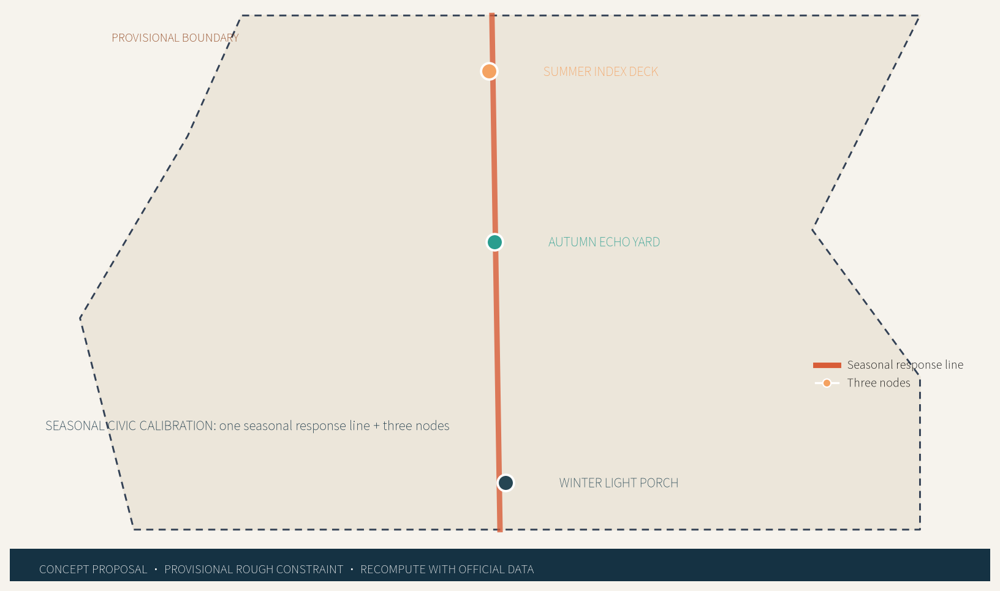
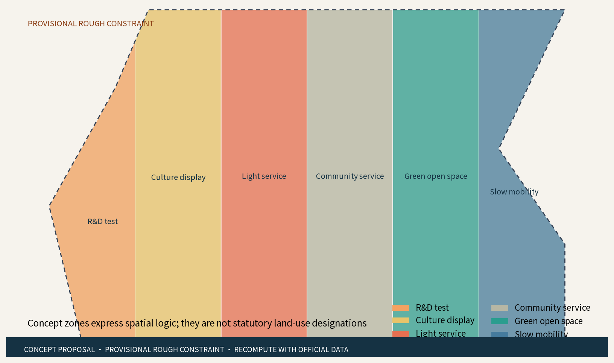
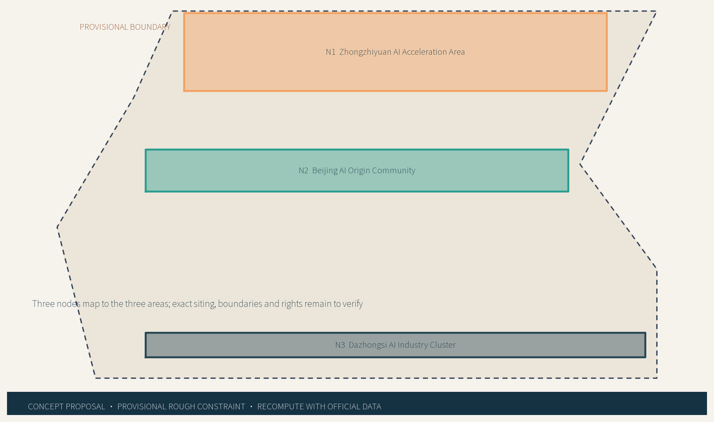
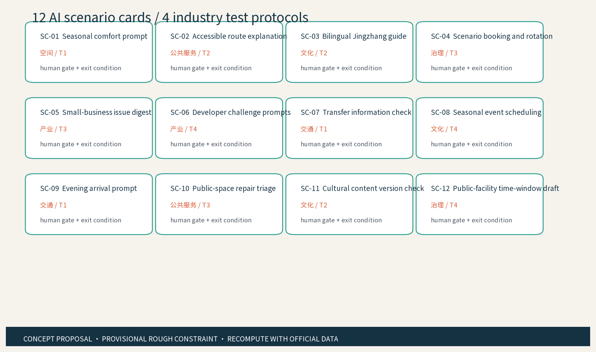
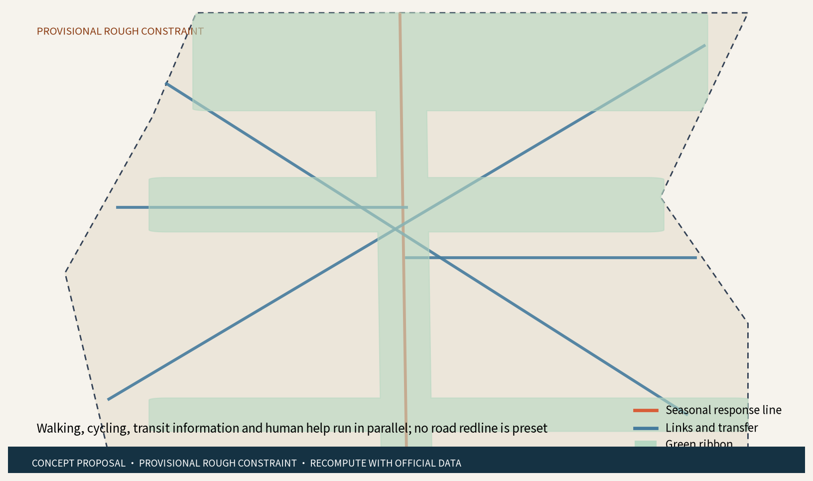
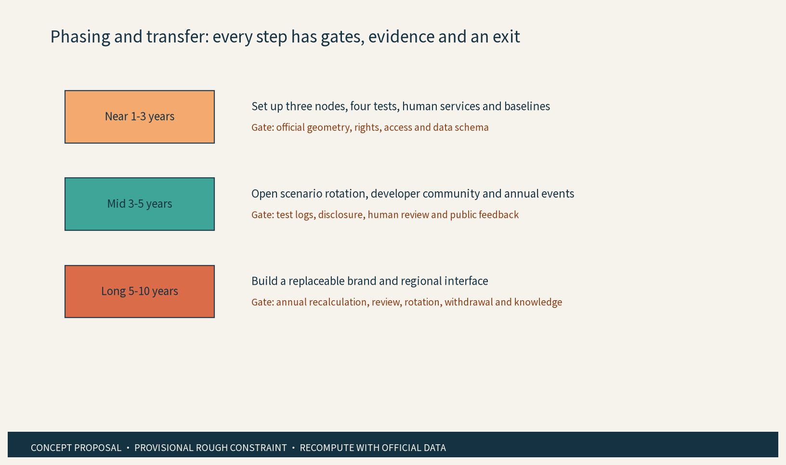
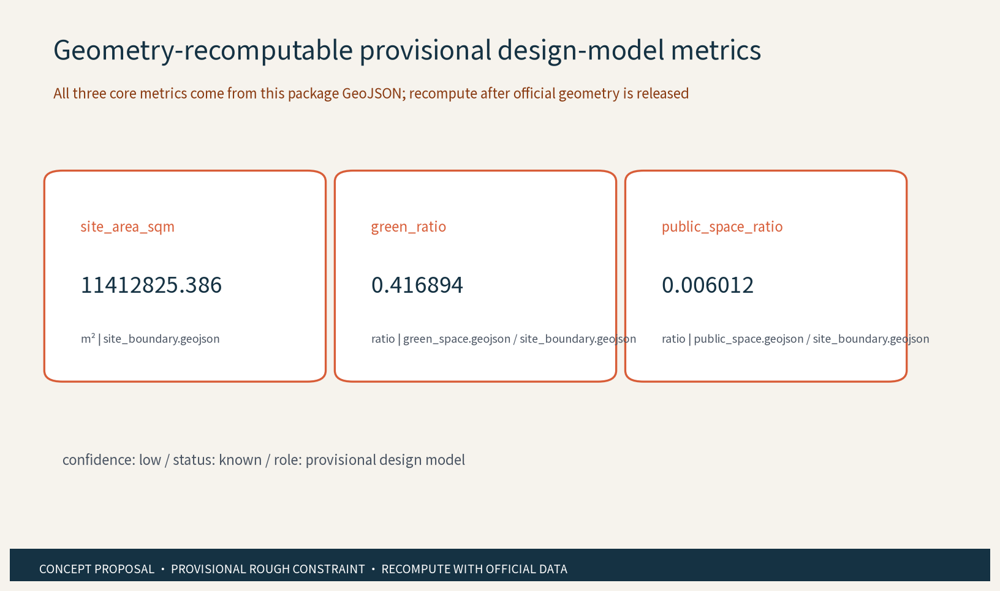

# SEASONAL CIVIC CALIBRATION BELT: Haidian Centennial Jingzhang

> **Concept proposal / reference scheme / provisional.** The Seasonal Civic Calibration Belt uses one Seasonal Response Line and three original conceptual nodes: Summer Index Deck in the Zhongzhiyuan AI Acceleration Area, Autumn Echo Yard in the Beijing AI Origin Community, and Winter Light Porch in the Dazhongsi AI Industry Cluster. This is not a statutory plan, regulatory plan, engineering design, procurement, investment or approval conclusion. Every spatial move is a concept suggestion, reference scheme, or material for professional-team research. Official geometry, ownership, heritage controls, roads, rail, utilities, fire safety, operational baselines and funding remain to verify.

## Design Basis and Source List

Evidence index: [source:SRC-2026-0518-AGENT-OPEN-CALL-TASKBOOK] [source:SRC-2026-BJ-GH-QUAL-PREANNOUNCEMENT] [standard:PROJECT-OFFICIAL-ANNOUNCEMENT]

Evidence index: [standard:PROJECT-AGENT-OPEN-CALL-TASKBOOK]

This proposal uses public, cleared or repository-registered references only. The public announcement supplies the project name, Haidian context, text-scale scope and announced areas; the taskbook supplies the three positioning statements, five functions, Three Areas and Two Wings and the six required agent tasks. Public pages about the Jingzhang heritage park, Qinghuayuan Station and Zhongguancun innovation culture are used for historical and methodological framing, not for an official boundary. Ministry and national public references are used for design and risk reminders only. [source:SRC-JZ-PARK-PHASE1] [source:SRC-QINGHUAYUAN-HERITAGE] [source:SRC-2026-BJ-KW-THREE-AREAS-WINGS]

Evidence index: [standard:MOHURD-URBAN-DESIGN-MEASURES] [standard:MNR-LAND-USE-CLASSIFICATION-GUIDE] [standard:GENERATIVE-AI-INTERIM-MEASURES]

Evidence index: [standard:BARRIER-FREE-ENVIRONMENT-LAW] [standard:ELDERLY-SMART-TECH-PLAN-2020-45] [depth:existing_conditions_diagnosis]

The exact official polygons are not available in this workspace. This package therefore uses a provisional rough constraint for generation, visualization and local self-check only; it is not an official redline, approval basis or precise area basis. [data:geometry/site_boundary.geojson#PROV-SITE-001] [data:geometry/key_areas.geojson#PROV-KEY-001] [metric:site_area_sqm]

Evidence index: [metric:green_ratio] [metric:public_space_ratio]

## Three-Level Scope Framework

Evidence index: [depth:three_level_scope_framework] [data:geometry/site_boundary.geojson#PROV-SITE-001] [data:geometry/key_areas.geojson#PROV-KEY-001]

Evidence index: [standard:MOHURD-CONTROL-DETAILED-PLANNING]

Level 1 is the coordinated research area: against the announcement text scope, it studies candidate interfaces with Beiwei Community, Future Science City, Huairou Science City, E-Town and the Jing-Jin-Ji region, focusing on the movement of talent, scenario questions, public data schemas, compute services and innovation outcomes. Level 2 is the overall design area: it tests the Seasonal Response Line against public-space, service, slow-mobility and cultural-wayfinding relationships around the Jingzhang heritage-park context. Level 3 is the key-area layer: it deepens the spatial role, AI scenarios and operating gates of Summer Index Deck, Autumn Echo Yard and Winter Light Porch. All three levels share the Three-Node Shift Ledger, which records version, source, human sign-off and withdrawal conditions for each seasonal rotation. The two wings are a conceptual translation of the taskbook framework: the Zhongguancun Tech-Service Wing handles elements, talent, standards and conversion interfaces; the Xiaoyuehe Scenario-Empowerment Wing carries everyday service, public experience and scenario testing. [source:SRC-2026-BJ-KW-THREE-AREAS-WINGS] [metric:regional_exchange_interface_count] [metric:phase_count]

## Coordinated Research Area: Industry and Future City Research

Evidence index: [source:SRC-2026-HAIDIAN-1X1] [source:CASE-PUNGGOL] [source:CASE-KALASATAMA]

Evidence index: [source:CASE-SEOUL-AI-HUB] [source:CASE-FOUNDRY] [source:CASE-QUAYSIDE]

Evidence index: [source:CASE-STATION-F] [source:CASE-SHENZHEN-AI-SCENARIOS] [standard:PROJECT-AGENT-OPEN-CALL-TASKBOOK]

Evidence index: [depth:overall_spatial_structure]

The industry study starts from eight interfaces rather than a recruitment list: space, industry questions, data schemas, compute services, talent, capital, standards and public scenarios. Seven public cases provide mechanisms for open digital platforms, time-limited pilots, staged AI support, community-accessible innovation space, pre-implementation engagement, programme-based startup services and responsibility-unit scenario lists. case_studies.json gives each case its mechanism fact, eight-factor map, applicability conditions, non-transferable elements and Haidian questions. They do not establish local partnerships, investment, performance or same-name projects, and no foreign spatial scale, brand, law or effect is imported. The original move is to use seasons as the time resolution of urban experiments: spring sets a baseline, summer tests comfort and industry, autumn tests culture and multilingual correction, and winter tests evening service and fallback. The five regional interfaces are candidate mechanisms only: community needs co-testing, research questions, science-city compute or instrument discussion, manufacturing conversion discussion and a public Jing-Jin-Ji challenge-and-talent exchange. Authority, ownership and leadership must be confirmed by competent bodies and professional teams. [data:visual/assets/case_studies.json#cases] [metric:global_case_count] [metric:ecosystem_factor_count] [metric:regional_exchange_interface_count]

## Overall Design Area: Urban Renewal and Regulatory-Plan-Level Urban Design

Evidence index: [source:SRC-2017-MOHURD-URBAN-DESIGN-MEASURES] [source:SRC-MOHURD-CONTROL-DETAILED-PLANNING] [source:SRC-JZ-PARK-PHASE1]

Evidence index: [source:SRC-XUEYUAN-PUBLIC-SPACE-2026] [depth:land_use_layout] [depth:development_intensity_controls]

Evidence index: [depth:height_massing_character]

The structure is one Seasonal Response Line, three seasonal nodes, six spatial interfaces and twelve scenario cards. The line is not a road redline: it is a concept route connecting public space, cultural wayfinding, slow mobility, station information and human service. The renewal logic is existing-space first, light, reversible and maintainable: improve public interfaces, seating, shade, paper guides, help points and withdrawable test desks before proposing heavier intervention. The land-use GeoJSON expresses relationships between R&D testing, culture display, community service, green open space and slow mobility; it does not state statutory use. No FAR, building height, building intensity or parcel-level retain/renovate/demolish conclusion is provided. The character direction uses brick red for alerts, blue-green for feedback and deep blue for information. Railway memory uses abstract sequence, line and sleeper symbols; AI new culture uses version, calibration and fallback symbols. [data:geometry/land_use.geojson#LAND_USE] [metric:land_use_zone_count] [metric:building_footprint_area_sqm]

Brand and wayfinding are organized in three levels. At belt level, a broken railway line plus a three-color loop is the internal working mark for Seasonal Civic Calibration Belt; at node level, summer, autumn and winter colors pair with the spatial suffixes Deck, Yard and Porch; at scenario level, a version number, human-sign-off mark and withdrawal arrow show status. The outward narrative follows three checkable steps: Jingzhang railway heritage clues, with every historic label returned to a public source; Zhongguancun open collaboration; and explainable, withdrawable civic AI. The bilingual sample line is “沿线看见历史，按季共测未来 / Read the heritage line, co-test the future by season.” Every historic label carries its source and a to-verify status; the internal mark is not presented as a registered trademark or official brand.

## Detailed Design of Key Areas

Evidence index: [source:SRC-QINGHUAYUAN-HERITAGE] [source:SRC-JZ-PARK-PHASE1] [data:geometry/key_areas.geojson#KEY_AREA]

Evidence index: [depth:three_key_area_detailed_design]

Summer Index Deck is a conceptual interface for the Zhongzhiyuan AI Acceleration Area, carrying public questions, model co-testing, human sign-off and withdrawal. Autumn Echo Yard is a conceptual interface for the Beijing AI Origin Community, carrying the three-layer narrative of Jingzhang culture, Zhongguancun innovation and AI new culture, with bilingual, tactile and audio alternatives. Winter Light Porch is a conceptual interface for the Dazhongsi AI Industry Cluster, carrying small-business service, evening-arrival prompts, light commercial public interface and rotating programmes. None is a confirmed building, parcel or operating facility. East-west stitching is expressed through public rooms, cultural wayfinding and continuous walking/cycling connections; north-south continuity is expressed through the Seasonal Response Line, seasonal sequences and station information. Heritage fabric, green/blue lines, safety, underground space and engineering feasibility remain open pending official data and professional survey. [metric:key_area_count] [metric:ai_pilgrimage_landmark_count] [metric:public_component_count]

Three AI pilgrimage landmarks are intentionally low-intensity and reversible: the Seasonal Ring Gate, the One-Minute Echo Station and the Shift-Scale Wall. They do not use portraits, enterprise trademarks or protected fonts, and do not turn heritage into a purely entertaining photo spot. [source:SRC-2026-0518-AGENT-OPEN-CALL-TASKBOOK]

## AI Innovation Ecosystem, Personas, and AI+ Scenarios

Evidence index: [source:SRC-GENERATIVE-AI-INTERIM-MEASURES] [source:SRC-BARRIER-FREE-ENVIRONMENT-LAW] [source:SRC-ELDERLY-SMART-TECH-PLAN-2020-45]

Evidence index: [standard:GENERATIVE-AI-INTERIM-MEASURES] [standard:BARRIER-FREE-ENVIRONMENT-LAW] [standard:ELDERLY-SMART-TECH-PLAN-2020-45]

Evidence index: [depth:municipal_new_infrastructure]

AI is not a label on old infrastructure. The common operating substrate is necessary-service-field governance, statistical anonymization, human review, small-scale rotation, and disclosure or withdrawal. Twelve scenario cards cover industry, space, transport, public services, culture and governance. T1 seasonal route information, T2 bilingual and accessible culture, T3 small-business issue digest, and T4 scenario rotation and equity are four test protocols for professional deepening. Six personas cover residents and caregivers, young developers, university researchers, small businesses, elderly or low-digital-literacy users, and people with disabilities or international visitors. Each card has a spatial carrier, AI role, non-AI alternative, human gate, data boundary and exit condition. AI generates drafts, candidates, classifications or consistency prompts only; it does not replace statutory statistics, professional judgement or on-site duty. The three guardrails are: real services such as help, booking, linking or work orders use only necessary fields after notice, authorization and purpose limitation, with controller, proposed legal basis, access, retention/deletion, withdrawal and incident response pending professional review; anonymization or aggregation applies only to statistical outputs; human review governs key decisions, with no excessive monitoring or individual-identifying tracking. Window, phone, paper and staff alternatives remain available for all ages, accessible, elderly-friendly, child-friendly and low-digital-access use. [metric:scenario_card_count] [metric:industry_test_scenario_count] [metric:persona_count]

The four protocols are not existing performance claims but fielded release drafts. Each records object, sample_frame, cycle, formula, denominator, human_gate, record_artifacts, manual_fallback, failure_rollback and stop_conditions; baseline remains unknown_to_verify. T1 proposes two weeks and at least 27 task trials across three periods, three user groups and three repetitions; T2 proposes ten working days per round and at least 30 bilingual/accessibility items; T3 proposes four weeks and at least 30 voluntary or synthetic small-business questions; T4 proposes one batch per week for four consecutive batches covering residents, developers and visitors. Thresholds such as 100% for critical items and 0.80–0.95 for overall or confirmation rates await professional confirmation and are not observed results. Any safety, privacy, accessibility, factual or equity risk triggers withdrawal, human service and a stop condition. [data:visual/assets/test_protocols.json#T1-T4] [metric:industry_test_scenario_count]

Evidence index: [metric:ai_domain_count] [metric:non_ai_alternative_coverage_ratio]

## Land Use, Building Scale, and Retain-Renovate-Demolish Strategy

Evidence index: [source:SRC-2023-MNR-LAND-USE-CLASSIFICATION] [source:SRC-MOHURD-CONTROL-DETAILED-PLANNING] [depth:retain_renovate_demolish]

Evidence index: [depth:development_intensity_controls]

All land, building and component layers are conceptual models. Retain first: use existing public interfaces, service locations and cultural clues where they can continue to work. Adapt second: add detachable furniture, replaceable signs, paper-card holders, shade and accessibility prompts. New components are modular reference types only; no quantity, height, intensity or investment is provided. Demolition or retention is not a parcel plan: the proposed decision sequence is rights and heritage check, then structure, fire, traffic, utility and accessibility survey, followed by competent-body and professional-team decision. The six concept zones are partitioned from the same provisional boundary so the map has no unlabeled gaps, but they are not statutory land-use designations. Building footprints represent possible spatial types such as co-testing rooms, community service, cultural display and information nodes, all marked as concept packages. [data:geometry/buildings.geojson#BUILDING_FOOTPRINT] [data:geometry/land_use.geojson#LAND_USE] [metric:building_footprint_area_sqm]

Evidence index: [metric:floor_area_ratio]

## Transport, Rail, Municipal Infrastructure, and Public Services

Evidence index: [source:SRC-XUEYUAN-PUBLIC-SPACE-2026] [source:SRC-2026-0518-AGENT-OPEN-CALL-TASKBOOK] [depth:traffic_rail_slow_parking]

Evidence index: [depth:municipal_new_infrastructure]

Transport is slow-mobility and information first. The Seasonal Response Line suggests walking and cycling continuity; the station-information line offers human-checked, paper and bilingual transfer information. Road centerlines express concept connections only: no road redline, cross-section, route, rail adjustment, bridge, tunnel, underground, parking count or transport-capacity conclusion is made. Municipal and digital infrastructure is conceived as closeable, maintainable and detachable: paper-card frames, public displays, staff repair points, low-intrusion lighting prompts and offline guides come first. Any sensing device would require lawful authorization, minimum necessity and layered access governance; anonymization or aggregation applies only to statistical outputs, while key services retain human review and non-AI alternatives. Public-service coverage includes residents, youth, enterprises, universities, visitors and vulnerable users, with window, phone, paper and volunteer routes. Needs must be checked against survey, ownership, fire safety, accessibility, utility capacity and operating responsibility. [data:geometry/roads.geojson#ROAD_CENTERLINE] [metric:public_service_component_count] [metric:manual_fallback_mode_count]

## Blue-Green Network, Public Space, and Urban Character

Evidence index: [source:SRC-JZ-PARK-PHASE1] [source:SRC-XUEYUAN-PUBLIC-SPACE-2026] [standard:MOHURD-URBAN-DESIGN-MEASURES]

Evidence index: [depth:blue_green_public_space]

The concept is one green ribbon, six public rooms and three seasonal forecourts. The ribbon keeps the heritage clue continuous and usable for everyday pause without assuming a major landscape transformation. Public rooms use seating, shade, quiet corners, paper guides, help prompts and withdrawable scenario cards. Seasonal colors help people understand the current version, the human reviewer and the feedback route rather than creating a novelty installation. The character direction keeps a restrained railway-industrial memory in dialogue with Zhongguancun open collaboration and AI new culture's explainability. Wayfinding is separate from the belt logo: the logo identifies the overall brand, while cultural symbols identify sequence, history and guidance. Heritage, green/blue lines, fire, traffic and sightline controls must be checked before siting any landmark or component. Feedback uses optional online entry, staff window, phone, paper cards and annual disclosure, with quarterly deliberation and annual event feedback. [data:geometry/green_space.geojson#GREEN_SPACE] [data:geometry/public_space.geojson#PUBLIC_SPACE] [metric:green_ratio]

The cultural content follows “see–participate–fallback” in the wayfinding copy: the entrance gives the source and provisional-boundary warning; the node gives the public challenge, ordinary service route and bilingual scenario card; the exit gives the version, human signer, feedback route and withdrawal action. The international line is “Heritage is a route, AI is a question, citizens keep the final say / 遗产是一条线，AI是一个问题，最终决定权留给公民,” with sources, scope and non-transferability limits on the English page. References to Qinghuayuan Station and Jingzhang Railway Heritage Park remain traceable narrative material; no heritage boundary, operating right or cultural authorization is inferred.

Evidence index: [metric:public_space_ratio] [metric:public_component_count]

## Renewal Projects, Implementation Policy, and Phasing

Evidence index: [source:SRC-2026-0518-AGENT-OPEN-CALL-TASKBOOK] [source:SRC-2026-HAIDIAN-1X1] [standard:PROJECT-AGENT-OPEN-CALL-TASKBOOK]

Evidence index: [depth:renewal_project_list] [depth:phasing_implementation]

Seven transferable concept packages are proposed: P1 wayfinding and human help on the Seasonal Response Line, P2 the One-Minute Echo Station and resident feedback, P3 Summer Index Deck industry co-testing, P4 Autumn Echo Yard bilingual and accessible culture, P5 Winter Light Porch small-business service and evening prompts, P6 developer community and public challenges, and P7 the Three-Node Shift Ledger and annual disclosure. Each package's spatial carrier, candidate responsibility, prerequisites, evidence artifacts, proposed KPI, human alternative and stop condition are registered in operation_packages.json; these are professional-review delivery drafts, not procurement, funding, staffing or operating commitments. Near 1-3 years verifies official geometry, rights, heritage, accessibility and operating responsibility and establishes a human baseline and four small tests. Mid 3-5 years rotates scenarios by public evaluation and expands regional interfaces and annual programmes. Long 5-10 years stores replaceable brand assets, open knowledge and Jing-Jin-Ji collaboration routes. Every phase has prerequisites, candidate responsible roles, collaborators, evidence, disclosure and exit. Roles are candidates, not commitments: competent authorities, communities, enterprises, universities, professional teams, operators, volunteers, culture editors, accessibility staff and developer communities may participate subject to authorization. Covenant, deliberation, booking, rotation, filing, disclosure, credits and alliance mechanisms are proposed; credits are voluntary participation records and do not decide public-resource eligibility. No policy, funding, recruitment, partnership or event is stated as confirmed. [data:geometry/phasing.geojson#PH-1-PH-3] [data:visual/assets/operation_packages.json#P1-P7] [metric:delivery_package_count]

Evidence index: [metric:annual_program_count] [metric:phase_count]

Annual programme names are Spring Baseline Day, Summer Co-Test Week, Autumn Culture Calibration Week and Winter Fallback Drill. They are candidate schedules, not official arrangements. International communication uses bilingual themes, downloadable scenario cards, public version notes and traceable source indexes. The transfer route is public challenge -> co-test -> human evaluation -> professional deepening -> competent-body decision; any step may pause for compliance, rights, accessibility or public feedback. [metric:annual_program_count] [metric:international_communication_asset_count]

## Metrics, Area Recalculation, and Compliance Matrix

Evidence index: [source:SRC-PROVISIONAL-BOUNDARIES-2026] [source:SRC-2026-BJ-GH-QUAL-PREANNOUNCEMENT] [standard:MNR-LAND-USE-CLASSIFICATION-GUIDE]

Evidence index: [depth:metrics_recalculation]

The three formal visual metrics are recomputable from the submitted geometry: site_area_sqm = area(site_boundary) = 11412825.386 sqm; green_ratio = area(union(green_space)) / area(site_boundary) = 0.416894; public_space_ratio = area(union(public_space)) / area(site_boundary) = 0.006012. These are low-confidence design-model values on the provisional rough constraint. The same numbers are synchronized in metrics.json, visual/index.html, figures and this section. Replace the official polygons when released, recalculate in EPSG:4548 and refresh every derivative. FAR, height, density, road redlines, rail alignment, parking capacity, energy load, investment, footfall and service capacity remain unknown/null with reasons rather than placeholder numbers. The compliance matrix maps announcement 1.3, 1.4, 1.5 and agent.1-agent.6 to narrative sections, GeoJSON, metrics, drawings, HTML, sources, standards, assumptions and self-checks. [metric:site_area_sqm] [metric:green_ratio] [metric:public_space_ratio]

Evidence index: [metric:floor_area_ratio] [metric:building_height_m] [metric:building_density]

Evidence index: [metric:road_redline_m]

## Risk, Copyright, and Compliance

Evidence index: [source:SRC-GENERATIVE-AI-INTERIM-MEASURES] [source:SRC-BARRIER-FREE-ENVIRONMENT-LAW] [source:SRC-ELDERLY-SMART-TECH-PLAN-2020-45]

Evidence index: [source:SRC-MOHURD-ARCH-DESIGN-DEPTH-2016] [standard:MOHURD-ARCH-DESIGN-DEPTH-2016] [depth:risk_missing_data]

Risks include provisional-boundary precision, missing official controls, heritage/ownership/utility/accessibility evidence, AI maturity, public acceptance, operating responsibility, bilingual correctness, prior rights and case-fact limits. Each risk is recorded in risk.json with a candidate owner, mitigation and trigger. CC-BY-4.0 is the intended license for original text, geometry, figures, HTML and mechanisms. External public pages are cited and paraphrased only; no page image, logo, portrait, font or enterprise mark is copied. Noto Sans SC is a local build and PDF-embedded glyph source; its SIL OFL 1.1 URL and rights note are in copyright_statement.md. The name and logo are internal working marks pending prior-rights search. The AI governance rule is layered: real services use only necessary fields with controller, proposed legal basis, access, retention/deletion, withdrawal and incident response pending professional review; anonymization or aggregation applies only to statistical outputs; human review governs key decisions and no excessive monitoring is allowed. Resident channels, annual disclosure, annual events, correction, withdrawal and ordinary human alternatives are required governance conditions. Nothing bypasses official review, statutory approval or professional judgement. [data:geometry/constraints.geojson#REGULATORY_CONTROL] [metric:automated_public_decision_count] [metric:rights_ledger_entry_count]

## References

Evidence index: [source:SRC-2026-BJ-GH-QUAL-PREANNOUNCEMENT] [source:SRC-2026-BJ-KW-THREE-AREAS-WINGS] [source:SRC-2026-HAIDIAN-1X1]

Evidence index: [source:SRC-JZ-PARK-PHASE1] [source:SRC-QINGHUAYUAN-HERITAGE] [source:CASE-PUNGGOL]

Evidence index: [source:CASE-KALASATAMA] [source:CASE-SEOUL-AI-HUB] [source:CASE-FOUNDRY]

Evidence index: [source:CASE-QUAYSIDE] [source:CASE-STATION-F] [source:CASE-SHENZHEN-AI-SCENARIOS]

Evidence index: [source:CASE-SHENZHEN-URBAN-DESIGN] [standard:MOHURD-CONTROL-DETAILED-PLANNING] [standard:MOHURD-ARCH-DESIGN-DEPTH-2016]

Evidence index: [depth:existing_conditions_diagnosis]

Complete source records, publisher, dates, URLs, reuse terms, use and limits are in sources.json. Seven global AI cases are mechanisms only; no scale, investment, brand, performance or partnership is imported. Structured evidence includes scenario_cards.json, test_protocols.json, personas.json, visual/assets/review_dimensions.json, rights_ledger.json, compliance_matrix.json, standard_matrix.json and design_depth_matrix.json. The Chinese and English proposals, figures, HTML and A0/A3 PDFs are generated from the same content index and are intended to remain substantively equivalent in sections, claims, metrics, evidence and figure positions. All spatial moves remain concept suggestions, reference schemes or materials for professional-team research.

> This package does not submit an external review score. The local self-check records only deterministic, spatial, visual and professional evidence gates; it is not a CocoSgt result, a formal professional score, a selection, an implementation status or government endorsement.
