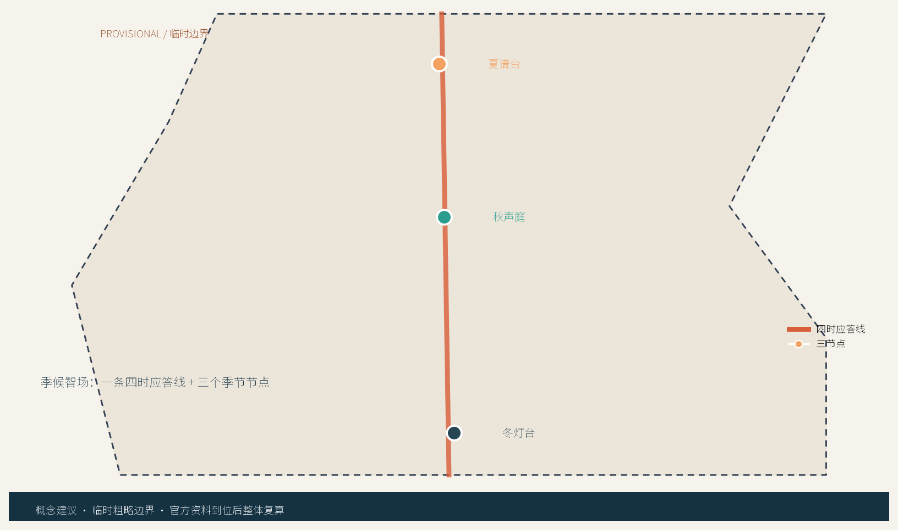
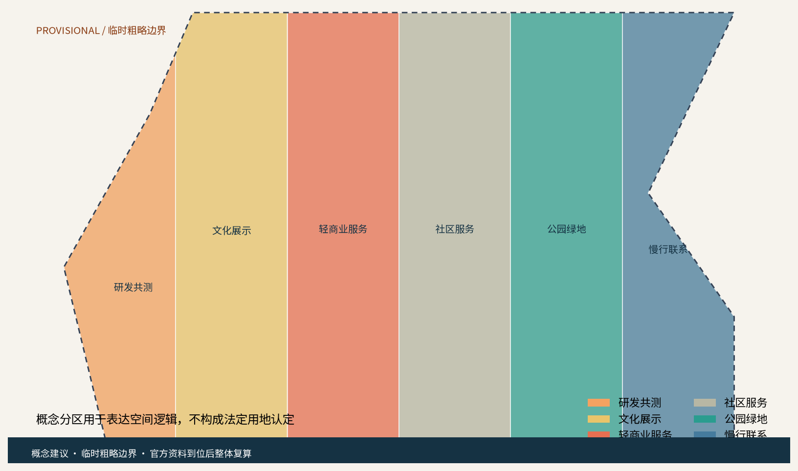
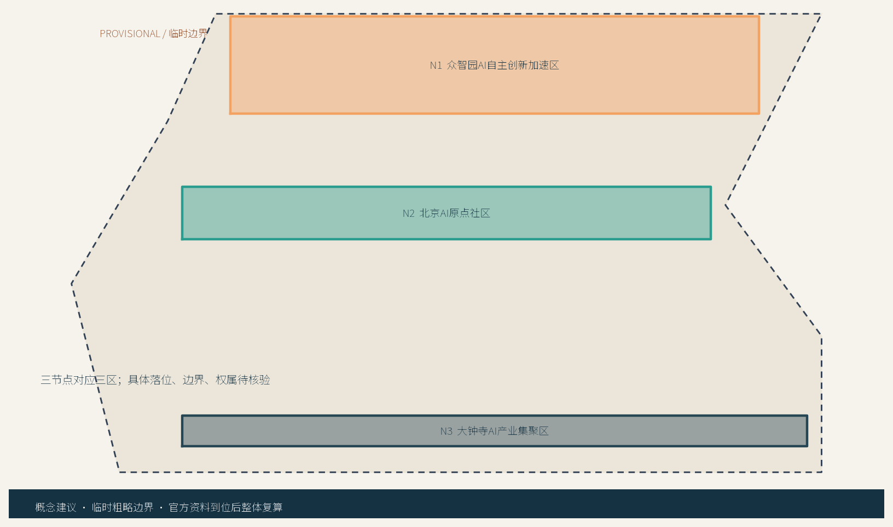
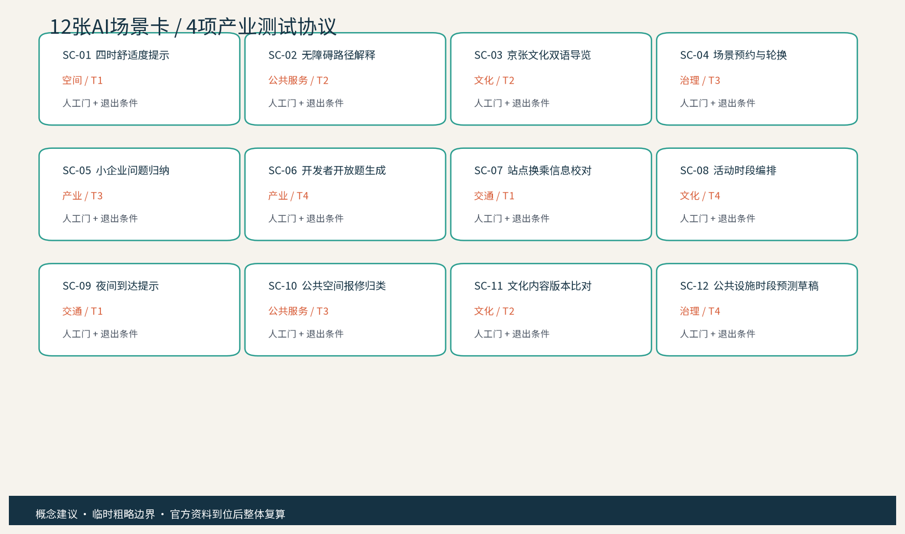
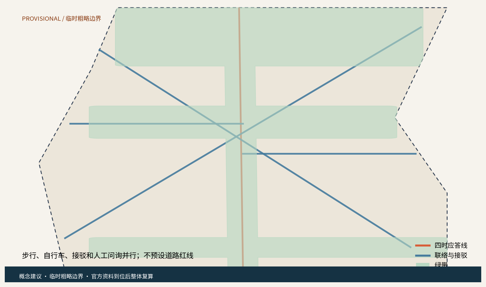
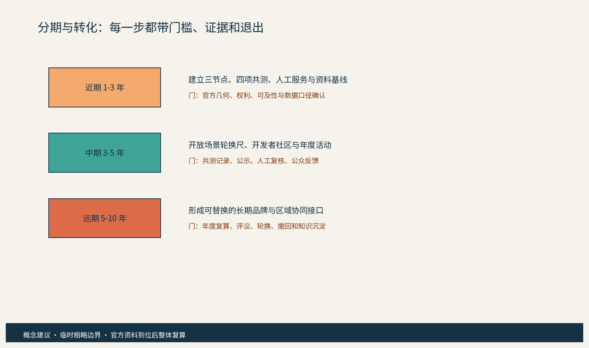
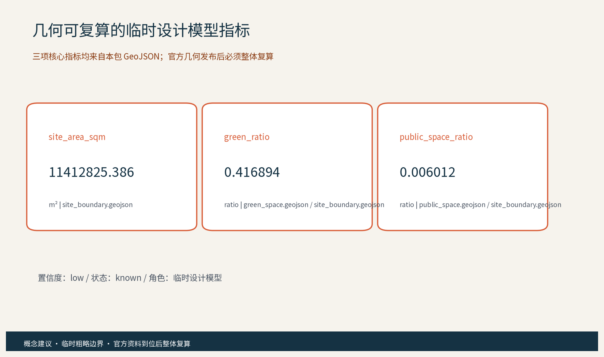

# 季候智场：百年京张四时公民校准带

> **概念建议 / 参考方案 / Provisional。** “季候智场”以一条沿京张遗址公园线索展开的“四时应答线”，串联众智园“夏谱台”、北京AI原点社区“秋声庭”、大钟寺AI产业聚集区“冬灯台”三个原创概念节点。方案不是正式规划、控规、工程、采购、投资或审批结论；所有空间落地建议均为概念建议、参考方案、可供专业团队深化研究。官方精确边界、权属、文保、道路、轨道、市政、消防、运营基线和资金安排均待核验。

## 设计依据与资料清单

证据索引： [source:SRC-2026-0518-AGENT-OPEN-CALL-TASKBOOK] [source:SRC-2026-BJ-GH-QUAL-PREANNOUNCEMENT] [standard:PROJECT-OFFICIAL-ANNOUNCEMENT]

证据索引： [standard:PROJECT-AGENT-OPEN-CALL-TASKBOOK]

本方案仅使用公开、清权或仓库明确登记的参考资料。公告提供项目名称、海淀语境、三层范围文字口径和三处重点区的公告面积；任务书规定百年京张文化带、都市AI生活体验带、AI融合创新带三大定位，AI全栈自主创新体系、世界级AI创新生态、AI+场景赋能新范式、智能化AI活力城市、AI治理全球话语权五大功能，以及三区两翼和 agent.1-agent.6 必答项。京张铁路遗址公园、清华园车站、中关村创新文化的公开页面只用于历史和方法叙事，不把新闻图、商业地图或截图当作红线。住建、自然资源、生成式AI、无障碍和适老公开标准只作设计与风险参照。 [source:SRC-JZ-PARK-PHASE1] [source:SRC-QINGHUAYUAN-HERITAGE] [source:SRC-2026-BJ-KW-THREE-AREAS-WINGS]

证据索引： [standard:MOHURD-URBAN-DESIGN-MEASURES] [standard:MNR-LAND-USE-CLASSIFICATION-GUIDE] [standard:GENERATIVE-AI-INTERIM-MEASURES]

证据索引： [standard:BARRIER-FREE-ENVIRONMENT-LAW] [standard:ELDERLY-SMART-TECH-PLAN-2020-45] [depth:existing_conditions_diagnosis]

资料分为三类：A类任务与公开规范，B类机构公开案例，C类本包原创文字、几何、图件和机制。官方精确 polygon 尚未在本工作区提供，本包使用临时粗略约束，仅用于生成、可视化和临时自检；不得作为 official redline、审批依据或精确面积依据。 [data:geometry/site_boundary.geojson#PROV-SITE-001] [data:geometry/key_areas.geojson#PROV-KEY-001] [metric:site_area_sqm]

证据索引： [metric:green_ratio] [metric:public_space_ratio]

## 三层范围工作框架

证据索引： [depth:three_level_scope_framework] [data:geometry/site_boundary.geojson#PROV-SITE-001] [data:geometry/key_areas.geojson#PROV-KEY-001]

证据索引： [standard:MOHURD-CONTROL-DETAILED-PLANNING]

第一层为统筹研究范围：以公告的海淀区域文字口径为背景，研究京津冀、北纬社区、未来科学城、怀柔科学城和经开区的候选协同接口，问题聚焦于人才、场景、公开数据口径、算力服务和创新成果如何在不同尺度流动。第二层为总体设计范围：以京张遗址公园周边城市地区和产业区为临时空间工作面，提出“四时应答线”与公共空间、服务节点、慢行和文化导视的关系。第三层为重点区域：分别深化夏谱台、秋声庭、冬灯台的空间角色、AI场景和运营门槛。三个层级共享「三节点换挡账本」，每次季节轮换都记录版本、来源、人工签发和撤回条件。三区两翼不是新增法定分区，而是任务书协同框架的概念化翻译；中关村科技服务翼负责要素、人才、标准和转化接口，小月河场景赋能翼负责日常服务、公共体验和场景共测。 [source:SRC-2026-BJ-KW-THREE-AREAS-WINGS] [metric:regional_exchange_interface_count] [metric:phase_count]

## 统筹研究范围产业与未来城市研究

证据索引： [source:SRC-2026-HAIDIAN-1X1] [source:CASE-PUNGGOL] [source:CASE-KALASATAMA]

证据索引： [source:CASE-SEOUL-AI-HUB] [source:CASE-FOUNDRY] [source:CASE-QUAYSIDE]

证据索引： [source:CASE-STATION-F] [source:CASE-SHENZHEN-AI-SCENARIOS] [standard:PROJECT-AGENT-OPEN-CALL-TASKBOOK]

证据索引： [depth:overall_spatial_structure]

产业研究不从招商名录出发，而从八类要素接口出发：空间、产业问题、数据口径、算力服务、人才、资本、标准和公共场景。七个公开案例分别提供开放数字平台、限时敏捷试点、分层AI支持、社区可达空间、实施前公众参与、项目化创业服务和责任单位场景清单等机制参照；case_studies.json 逐案给出机制事实、八类要素、适用条件、不可移植项和海淀待核验问题。它们不证明海淀已经拥有合作、投资、绩效或同名项目，也不带入外国空间尺度、品牌、法律或效果。原创方法是把“季节”作为城市实验的时间分辨率：春季建立基线，夏季做舒适与产业共测，秋季做文化和多语纠错，冬季做夜间服务和回退演练。五个区域接口均只写候选机制：北纬社区可参与需求共测，未来科学城可交流研究问题，怀柔科学城可讨论科研仪器与算力接口，经开区可讨论试制转化，京津冀可形成年度公开题与人才交流。是否成立、由谁牵头、是否有授权，全部留给有权主体和专业团队核验。 [data:visual/assets/case_studies.json#cases] [metric:global_case_count] [metric:ecosystem_factor_count]

五个区域接口的数量与候选角色登记在指标表中，最终以有权主体确认的协同边界为准。 [metric:regional_exchange_interface_count]

## 总体设计范围城市更新与控规深度城市设计

证据索引： [source:SRC-2017-MOHURD-URBAN-DESIGN-MEASURES] [source:SRC-MOHURD-CONTROL-DETAILED-PLANNING] [source:SRC-JZ-PARK-PHASE1]

证据索引： [source:SRC-XUEYUAN-PUBLIC-SPACE-2026] [depth:land_use_layout] [depth:development_intensity_controls]

证据索引： [depth:height_massing_character]

总体结构是“一条四时应答线、三座季节节点、六类空间接口、十二张场景卡”。线不是道路红线，而是把公共空间、文化导视、慢行、站点信息和有人服务串起来的概念路径。更新策略以存量优先、轻介入、可逆、可维护为原则：优先盘活现有公共界面，增加遮阴、坐凳、清晰标识、纸质导览、报修点和可撤回的共测台；新建、适配、保留与拆改不在本方案中给出具体地块判断。用地分区 GeoJSON 仅表达研发共测、文化展示、社区服务、公园绿地和慢行联系之间的关系，不给出容积率、建筑高度、建筑强度或具体拆改留。城市风貌以“砖红警示线 + 青绿反馈环 + 深蓝信息基底”为概念色系，历史线索使用站序、线、枕木抽象符号，AI新文化使用版本、校准、回退符号，三套符号不越过文保和权属边界。 [data:geometry/land_use.geojson#LAND_USE] [metric:land_use_zone_count] [metric:building_footprint_area_sqm]

品牌与导视按三级组织：一带层用“断开的铁路线 + 三色回环”作为季候智场／Seasonal Civic Calibration Belt 的内部工作标识；节点层用夏、秋、冬三种色标和“台、庭、台”空间后缀；场景层用版本号、人工签发章和撤回箭头。对外传播先使用可核验的三段叙事顺序：京张铁路遗产线索（史实节点逐条回到公开来源核对）—中关村开放协作—可解释、可退出的公民AI。示例双语主张为“沿线看见历史，按季共测未来 / Read the heritage line, co-test the future by season”；每个历史标签必须带来源和“待核验”状态，不把内部标识写成注册商标或官方品牌。

## 重点区域详细设计

证据索引： [source:SRC-QINGHUAYUAN-HERITAGE] [source:SRC-JZ-PARK-PHASE1] [data:geometry/key_areas.geojson#KEY_AREA]

证据索引： [depth:three_key_area_detailed_design]

夏谱台位于众智园AI自主创新加速区的概念接口，承担“问题公开、模型共测、人工签发、失败撤回”的产业测试角色；空间上可研究可见的共测桌、可关闭的展示面和不依赖登录的纸卡。秋声庭位于北京AI原点社区的概念接口，承担京张文化、中关村创新文化和AI新文化的三层叙事；空间上可研究安静停留、双语导视、触觉/语音替代和公众纠错台。冬灯台位于大钟寺AI产业聚集区的概念接口，承担小企业服务、夜间到达提示、轻商业公共界面和轮换式活动；空间上可研究有人服务前场、可维护照明提示和不采集个体轨迹的时段信息。三节点均不是已确定的建筑、地块或运营设施。东西缝合通过公共房间、文化导视和连续的步行/自行车联系表达；南北贯通通过四时应答线、节点之间的季节活动顺序和站点信息表达。遗产本体、绿线蓝线、交通安全、地下空间和工程可行性在官方数据与专业调查前不做结论。 [metric:key_area_count] [metric:ai_pilgrimage_landmark_count] [metric:public_component_count]

三个AI朝圣地标采用低强度、可撤回的公共表达：①“季环门”是三色环形入口标识方向，②“一刻回声站”是可线下反馈的公共服务组件，③“换挡刻度墙”是展示当前场景版本、人工复核和撤回状态的公开界面。它们不使用人物肖像、企业商标或受保护字体，不把文化遗产做成纯娱乐打卡物。 [source:SRC-2026-0518-AGENT-OPEN-CALL-TASKBOOK]

## AI 创新生态、人才画像与 AI+ 场景

证据索引： [source:SRC-GENERATIVE-AI-INTERIM-MEASURES] [source:SRC-BARRIER-FREE-ENVIRONMENT-LAW] [source:SRC-ELDERLY-SMART-TECH-PLAN-2020-45]

证据索引： [standard:GENERATIVE-AI-INTERIM-MEASURES] [standard:BARRIER-FREE-ENVIRONMENT-LAW] [standard:ELDERLY-SMART-TECH-PLAN-2020-45]

证据索引： [depth:municipal_new_infrastructure]

AI创新不是给旧设施贴标签，而是把“业务必要字段分层治理—统计匿名化—人工复核—小范围轮换—公示/撤回”做成空间运营的共同底盘。十二张场景卡覆盖产业、空间、交通、公共服务、文化、治理六域；其中 T1 季节路径信息、T2 文化双语与无障碍、T3 小企业问题归纳、T4 场景轮换与公平性为四项可供专业团队深化的产业测试验证协议。六类画像覆盖居民与照护者、青年开发者、高校研究者、小企业与商户、老年/低数字能力用户、残障人士与国际访客。每张卡都有空间载体、AI角色、普通服务替代、人工门、数据边界和退出条件；AI只生成草稿、候选、归类或一致性提示，不替代法定统计、专业判断或现场值守。AI治理三句式贯穿全案：真实服务如求助、预约、联动或工单只处理完成告知、授权和目的限定所需的业务必要字段，控制者、拟议合法性基础、访问权限、保存/删除、撤回和事件响应待专业核验；匿名化/聚合仅用于统计输出；关键决策始终人工复核，禁止过度监控和个体识别式追踪。提供窗口、电话、纸质表单和现场人员等等价路径，落实全龄、无障碍、适老、儿童友好和低数字门槛。 [metric:scenario_card_count] [metric:industry_test_scenario_count] [metric:persona_count]

四项协议不是已有绩效，而是字段化的放行草案：每项均登记 object、sample_frame、cycle、formula、denominator、human_gate、record_artifacts、manual_fallback、failure_rollback 和 stop_conditions，baseline 统一为 unknown_to_verify。T1 建议两周、三时段×三类使用者×三次共不少于27次任务试次；T2 建议每轮10个工作日、至少30条中英/无障碍内容；T3 建议四周、至少30条自愿或合成企业问题；T4 建议每周一批、连续四批并覆盖居民/开发者/访客。关键项100%、总体或确认率0.80—0.95等均是专业团队确认前的建议阈值，不是实测结果；任何安全、隐私、无障碍、事实或公平性风险都触发撤回、人工服务和停止条件。 [data:visual/assets/test_protocols.json#T1-T4] [metric:industry_test_scenario_count]

证据索引： [metric:ai_domain_count] [metric:non_ai_alternative_coverage_ratio]

## 用地、建筑规模与拆改留方案

证据索引： [source:SRC-2023-MNR-LAND-USE-CLASSIFICATION] [source:SRC-MOHURD-CONTROL-DETAILED-PLANNING] [depth:retain_renovate_demolish]

证据索引： [depth:development_intensity_controls]

本包的用地、建筑和空间组件均为概念模型。保留优先：把可继续使用的公共界面、既有服务场所和文化线索作为第一选择；适配其次：通过可拆卸家具、可替换标识、纸卡架、遮阴和无障碍提示形成可逆改善；新增仅作为模块化、轻量化的参考类型，不给出建筑量、高度、密度或投资数字；拆改留不做具体地块方案，只提出“留—改—撤”的判断流程：先查权属和文保，再做结构、消防、交通、市政和无障碍调查，之后由有权主体与专业团队决定。六类概念分区 GeoJSON 通过同一临时边界切分，避免图上出现未标识空白，但不能被解释为法定用地。建筑基底只用于画出共测房、社区服务房、文化展廊和信息节点等空间类型，所有名称都带“概念包”属性。 [data:geometry/buildings.geojson#BUILDING_FOOTPRINT] [data:geometry/land_use.geojson#LAND_USE] [metric:building_footprint_area_sqm]

证据索引： [metric:floor_area_ratio]

## 交通、轨道、市政与公共服务设施

证据索引： [source:SRC-XUEYUAN-PUBLIC-SPACE-2026] [source:SRC-2026-0518-AGENT-OPEN-CALL-TASKBOOK] [depth:traffic_rail_slow_parking]

证据索引： [depth:municipal_new_infrastructure]

交通策略以慢行和信息可达为先：四时应答线提供步行和自行车连续性方向，站点接驳信息线提供人工校对、纸质导览和双语版本，必要时再研究与轨道站点的换乘接口。道路中心线仅表达概念联系，不是道路红线、线位、断面或工程设计；不提出桥隧、地下空间、停车数量、交通容量或轨道调整结论。市政和新型基础设施采用“可关闭、可维护、可拆卸”的组件思路：纸卡架、公开屏、人工报修台、低侵入照明提示和离线导览优先；任何感知设备都必须经授权、合法、最小必要和分层访问治理，统计输出才匿名化/聚合，关键服务保留人工复核与普通替代路径。公共服务设施覆盖居民、青年、企业、高校、游客和弱势群体，保留人工窗口、电话、纸质和现场志愿者路径。设施需求列表由专业团队依据现状调查、权属、消防、无障碍、市政容量和运营责任进一步校核。 [data:geometry/roads.geojson#ROAD_CENTERLINE] [metric:public_service_component_count] [metric:manual_fallback_mode_count]

## 蓝绿空间、公共空间与城市风貌

证据索引： [source:SRC-JZ-PARK-PHASE1] [source:SRC-XUEYUAN-PUBLIC-SPACE-2026] [standard:MOHURD-URBAN-DESIGN-MEASURES]

证据索引： [depth:blue_green_public_space]

绿地与公共空间形成“一条绿带、六个公共房间、三处季节前场”的概念结构。绿带强调遗产线索的连续感和可进入的日常停留，不以景观大改造为前提；公共房间通过坐凳、遮阴、安静角、纸质导览、饮水/求助提示和可撤回的场景卡承载生活体验。季节颜色不用于制造网红装置，而用于让人理解“现在是什么版本、谁复核过、如何反馈”。城市风貌延续铁路工业记忆的克制符号，与中关村的开放协作和AI新文化的可解释性并置。文化导视系统与一带Logo系统分层：一带Logo识别整体品牌，文化符号识别站序、历史和导览。所有地标和组件应避让未核验的文保、绿地、蓝线、消防、交通和视线控制；具体材料、尺寸和落位由专业团队深化研究。居民意见通道采用线上可选入口、线下人工窗口、电话、纸质卡和年度公示，并设置季度议事与年度活动反馈。 [data:geometry/green_space.geojson#GREEN_SPACE] [data:geometry/public_space.geojson#PUBLIC_SPACE] [metric:green_ratio]

文化内容按“看见—参与—回退”三步写入导视：入口先给历史来源与临时边界提示，节点再给当季公开题、普通服务入口和双语场景卡，出口公开版本、人工签发人、反馈渠道与撤回动作。面向国际访客的短文案采用“Heritage is a route, AI is a question, citizens keep the final say / 遗产是一条线，AI是一个问题，最终决定权留给公民”，并在英文页面同步列出来源、适用范围和不可移植条件。涉及清华园车站、京张铁路遗址公园的史实只作来源可追溯的叙事材料，不把其保护边界、运营权或文化授权推定为已获得。

证据索引： [metric:public_space_ratio] [metric:public_component_count]

## 更新项目清单、实施政策与分期计划

证据索引： [source:SRC-2026-0518-AGENT-OPEN-CALL-TASKBOOK] [source:SRC-2026-HAIDIAN-1X1] [standard:PROJECT-AGENT-OPEN-CALL-TASKBOOK]

证据索引： [depth:renewal_project_list] [depth:phasing_implementation]

更新项目建议分为七个可转化包：P1 四时应答线导视与人工求助，P2 一刻回声站与居民反馈，P3 夏谱台产业共测，P4 秋声庭文化双语与无障碍导览，P5 冬灯台小企业服务与夜间提示，P6 开发者社区与公开题，P7 三节点换挡账本和年度公示。每个包的空间载体、候选责任、前置条件、证据产物、建议KPI、人工替代和停止条件登记在 operation_packages.json；它们是专业团队评审用的交付草案，不是采购、资金、人员或运营承诺。近期1-3年先核验官方边界、权属、文保、无障碍和运营责任，做小范围人工基线和四项共测；中期3-5年再按公开评价结果轮换场景、扩展区域接口和年度活动；远期5-10年沉淀为可替换品牌资产、开放知识与京津冀协同通道。每期都设置前置条件、负责人候选、协作方、证据、公开方式和退出动作。这里的“参与主体”是候选角色，不是承诺名单：有权部门、社区、企业、高校、专业团队、运营方、志愿者、文化编辑、无障碍专员和开发者社区可按职责参加。机制采用公约、议事、预约、轮换、备案、公示、积分和联盟；其中积分只作为自愿参与记录，不关联公共资源资格。任何政策、资金、招商、合作和活动均须获得合法授权，不写成已确定安排。 [data:geometry/phasing.geojson#PH-1-PH-3] [data:visual/assets/operation_packages.json#P1-P7] [metric:delivery_package_count]

证据索引： [metric:annual_program_count] [metric:phase_count]

年度活动品牌建议为“春启基线日、夏季共测周、秋日文化校准周、冬夜回退演练日”，活动本身是候选排期，不代表官方安排。国际传播采用双语主题、可下载的场景卡、公开的版本说明和可复核的资料索引；招引转化路径是公开题 -> 共测 -> 人工评估 -> 专业深化 -> 有权主体决策，任何一步都可因合规、权利、可及性或公众意见而暂停。 [metric:annual_program_count] [metric:international_communication_asset_count]

## 指标体系、面积复算与合规矩阵

证据索引： [source:SRC-PROVISIONAL-BOUNDARIES-2026] [source:SRC-2026-BJ-GH-QUAL-PREANNOUNCEMENT] [standard:MNR-LAND-USE-CLASSIFICATION-GUIDE]

证据索引： [depth:metrics_recalculation]

本包提供三项可由几何复算的核心视觉指标：site_area_sqm = area(site_boundary) = 11412825.386 sqm；green_ratio = area(union(green_space)) / area(site_boundary) = 0.416894；public_space_ratio = area(union(public_space)) / area(site_boundary) = 0.006012。这些是临时粗略边界上的低置信度设计模型值，已在 metrics.json、visual/index.html、图件和本节保持同一数值，官方 polygon 发布后必须按 EPSG:4548 重新计算并刷新所有派生物。FAR、建筑高度、建筑密度、道路红线、轨道线位、停车容量、能源负荷、投资、客流和公共设施容量均为 unknown/null，并说明缺口，不以占位数字代替。合规矩阵把公告 1.3、1.4、1.5 和 agent.1-agent.6 逐条映射到正文、GeoJSON、指标、图纸、HTML、来源、标准、假设和自检；standard_matrix 与 design_depth_matrix 分别记录专业标准和15项深度项。 [metric:site_area_sqm] [metric:green_ratio] [metric:public_space_ratio]

证据索引： [metric:floor_area_ratio] [metric:building_height_m] [metric:building_density]

证据索引： [metric:road_redline_m]

## 风险、版权与合规说明

证据索引： [source:SRC-GENERATIVE-AI-INTERIM-MEASURES] [source:SRC-BARRIER-FREE-ENVIRONMENT-LAW] [source:SRC-ELDERLY-SMART-TECH-PLAN-2020-45]

证据索引： [source:SRC-MOHURD-ARCH-DESIGN-DEPTH-2016] [standard:MOHURD-ARCH-DESIGN-DEPTH-2016] [depth:risk_missing_data]

主要风险包括临时边界精度、官方控制条件缺失、文保/权属/市政和无障碍资料不足、AI技术成熟度、公众接受度、运营责任、双语内容正确性、品牌在先权利和案例事实边界。每个风险在 risk.json 中登记责任候选、缓解动作和触发条件。版权采用 CC-BY-4.0 作为本包原创文字、几何、图件、HTML 和机制的意向许可；外部官方页面只作署名引用和事实边界参照，不复制图片、Logo、字体、人物或企业商标。Noto Sans SC 仅作为本地构建和PDF嵌入字形来源，权利记录及 SIL OFL 1.1 URL 见 copyright_statement.md；品牌名和Logo为内部工作标识，未完成在先权利检索前不作注册或商业使用。AI治理三句式再次明确：真实服务只处理经核验的业务必要字段，控制者、拟议合法性基础、访问、保存/删除、撤回和事件响应待专业核验；匿名化/聚合仅用于统计输出；关键决策始终人工复核，禁止过度监控。居民意见通道、年度公示、年度活动、投诉纠错、撤回和普通人工替代路径是必要治理条件。所有建议不越过政府审定、法定审批和专业团队最终判断。 [data:geometry/constraints.geojson#REGULATORY_CONTROL] [metric:automated_public_decision_count] [metric:rights_ledger_entry_count]

## 参考资料

证据索引： [source:SRC-2026-BJ-GH-QUAL-PREANNOUNCEMENT] [source:SRC-2026-BJ-KW-THREE-AREAS-WINGS] [source:SRC-2026-HAIDIAN-1X1]

证据索引： [source:SRC-JZ-PARK-PHASE1] [source:SRC-QINGHUAYUAN-HERITAGE] [source:CASE-PUNGGOL]

证据索引： [source:CASE-KALASATAMA] [source:CASE-SEOUL-AI-HUB] [source:CASE-FOUNDRY]

证据索引： [source:CASE-QUAYSIDE] [source:CASE-STATION-F] [source:CASE-SHENZHEN-AI-SCENARIOS]

证据索引： [source:CASE-SHENZHEN-URBAN-DESIGN] [standard:MOHURD-CONTROL-DETAILED-PLANNING] [standard:MOHURD-ARCH-DESIGN-DEPTH-2016]

证据索引： [depth:existing_conditions_diagnosis]

完整来源、发布者、日期、URL、许可/复用条款、用途和限制见 sources.json；七个全球AI案例只用于机制参照，未导入规模、投资、品牌、绩效或合作。结构化证据包括 scenario_cards.json、test_protocols.json、personas.json、visual/assets/review_dimensions.json、rights_ledger.json、compliance_matrix.json、standard_matrix.json 和 design_depth_matrix.json。方案的英文译稿、双语图件、双语HTML和A0/A3 PDF由同一套内容索引生成，翻译必须与中文主稿在章节、主张、指标、证据和图位上保持实质等义。所有空间落地建议仍为概念建议、参考方案、可供专业团队深化研究。

### 必答项与补充评审维度对照

| 任务/维度 | 本方案证据 |
|---|---|
| agent.1 总体概念与功能统筹 | 季候智场命名、英文名、Logo方向、三大定位、五大功能、三区两翼、site-overview 图 |
| agent.2 AI全栈自主创新与生态 | 八要素、七个全球案例、四项共测协议、ecosystem-map 图 |
| agent.3 AI+场景与活力城市 | 12张场景卡、6类画像、场景-空间-运营字段、分层数据治理与人工门 |
| agent.4 AI公共空间与地标 | 京张遗址公园公共空间、东西缝合、南北贯通、3个AI朝圣地标、组件库 |
| agent.5 文化与叙事 | 京张历史、中关村创新、AI新文化三层叙事、双语导视和国际传播文案 |
| agent.6 活动与长期运营 | 四季活动、开发者社区、开放场景轮换尺、换挡账本、公示/撤回转化路径 |
| 13个补充维度 | 目标契合、功能匹配、品牌识别、区域协同、规划创新、产业支撑、场景可感知、空间明确、可转化、表达完整、公开合规、国际传播、长期运营，证据见 visual/assets/review_dimensions.json |

> 本包不提交外部评审分数；本地 self_check 仅记录确定性、空间、视觉和专业证据 gate 的运行结果，不代表 CocoSgt、正式专业评审、入选、实施或政府背书。
