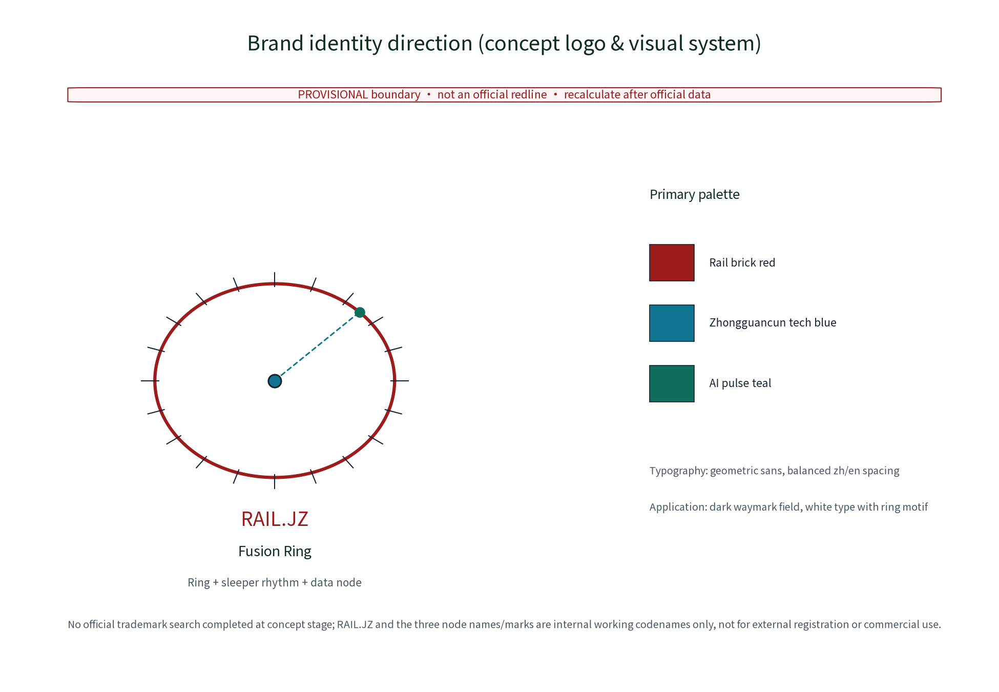
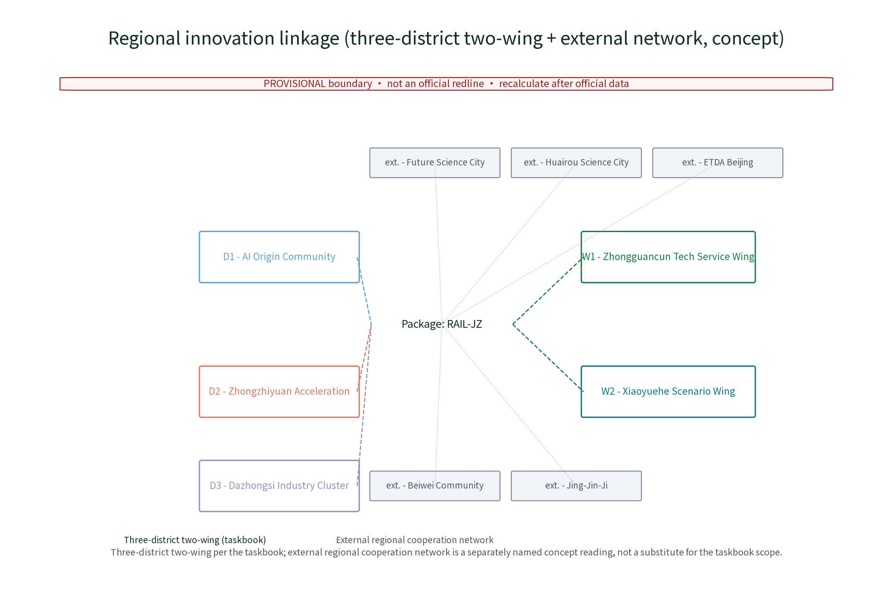
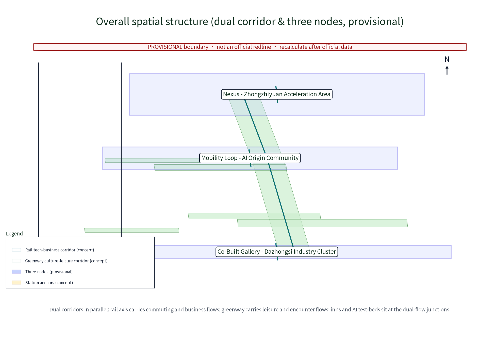
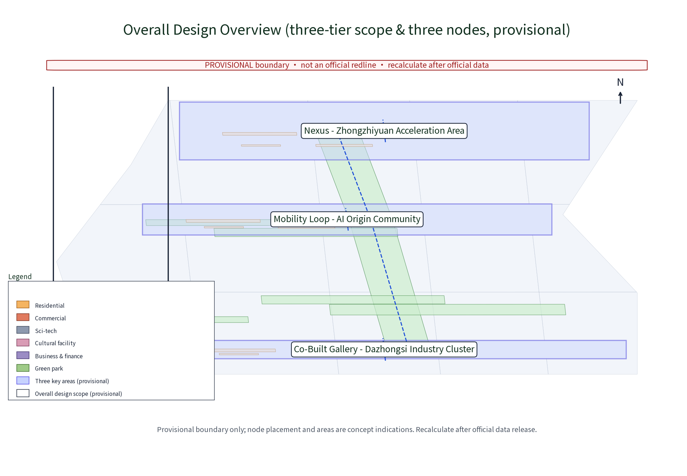
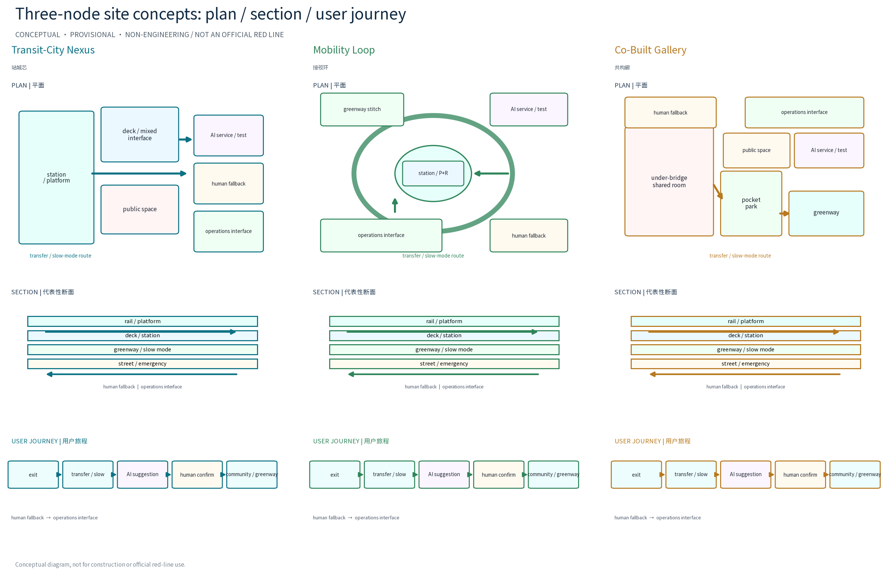
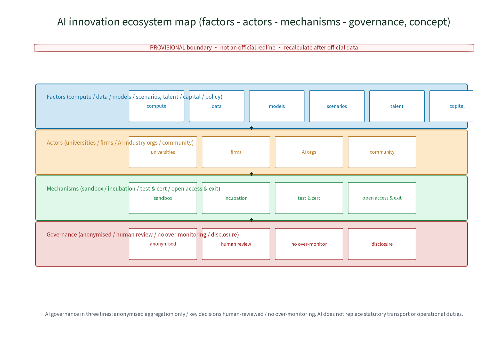
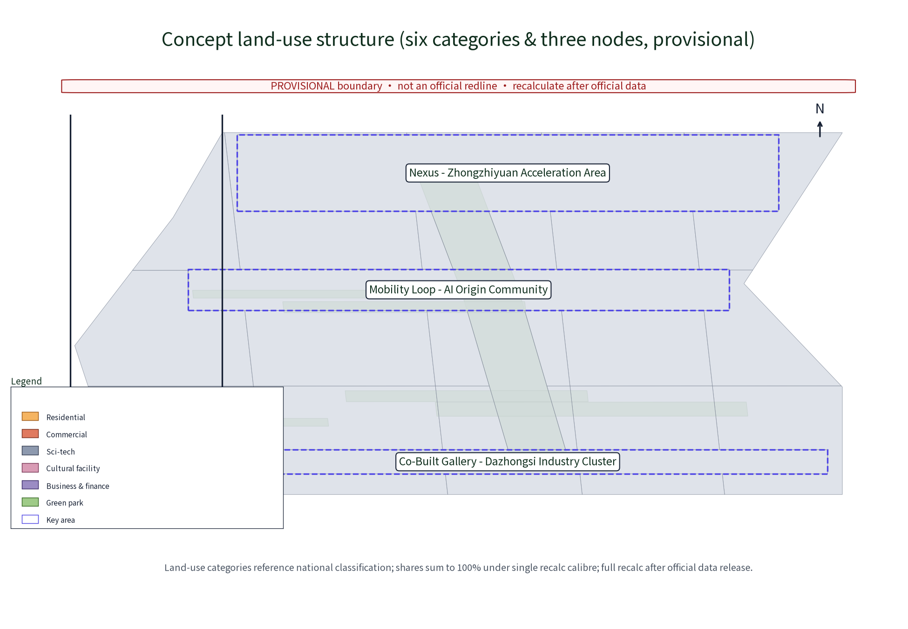
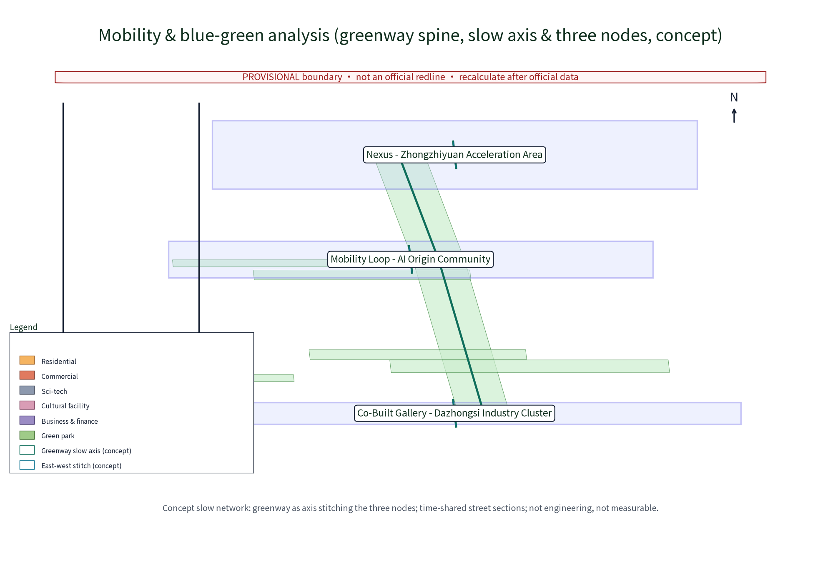
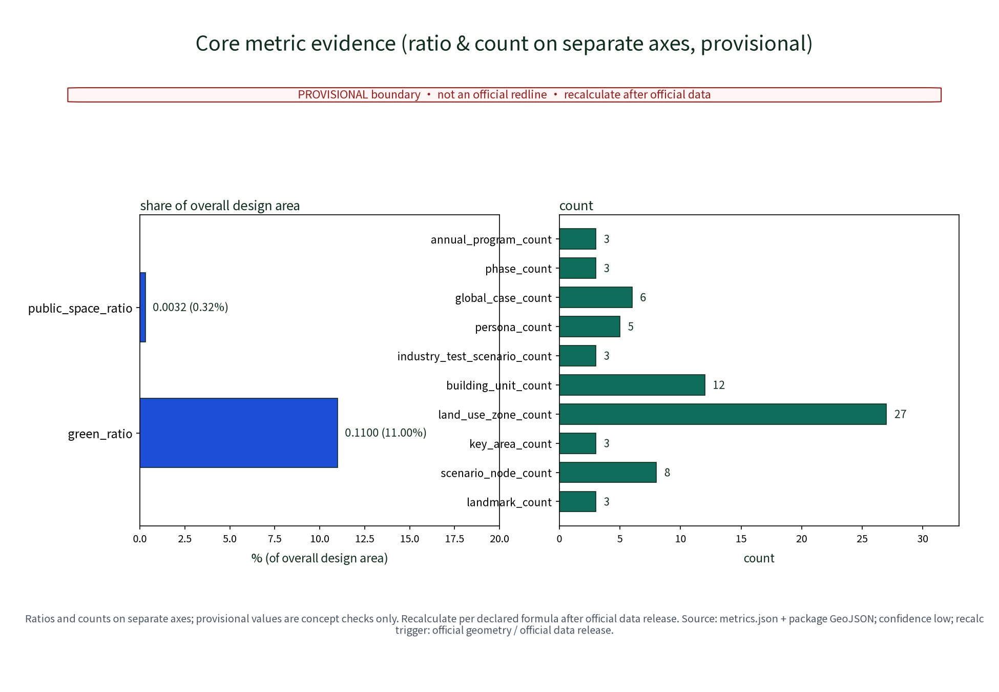

## Theme: Transit-City Integration Coordination

This is a concept-level draft for the international open call on the Centennial Jingzhang AI Innovation Belt (concept level, provisional boundaries, no fabricated official data, no substitution for statutory planning or operational duties). Everything in this package is conceptual suggestion and reference material for professional teams to deepen and review; the text carries machine-readable evidence anchors pointing to sources, standards, design depth, spatial data and metrics.

> **Concept note**: the proposal organises stations, feeder interchanges, public space and blue-green space as one system. Evidence comes from the package geometry layers (site_boundary/key_areas/land_use/roads/public_space GeoJSON), metrics.json and the matrix JSONs; geometry and metrics are based on provisional boundaries and expressed as rounded values, never as official numbers. Data gaps - ridership and rail operation ledgers, building age, ownership and structural surveys, per-building heritage clues - are recorded honestly in assumptions.json and the risk section, and are recalculated item by item after official regulatory and survey data are released.

## Scheme Name and Overall Concept (Concept)

The primary name is RAIL·JZ (Station-City Fusion Ring) - Transit-City Integration Coordination System. "RAIL" refers to rail, "JZ" is the abbreviation of "Jingzhang"; "fusion ring" signifies mutual fusion and circular symbiosis between stations and urban functions. The overall concept uses the Jingzhang high-speed suburban rail corridor as the transport spine and the Jingzhang Railway Heritage Park greenway as the ecological backbone, with three original concept nodes: Transit-City Nexus (station-city integration coordination core), Mobility Loop (rail feeder and slow-mode transfer ring with P+R and cycling), and Co-Built Gallery (station-city shared public-space gallery activating deck and under-bridge spaces as the shared living room stitching station and greenway). The system is summarised as "revitalise the city by the station, sustain the station by the city, thread the stations with greenery". Supporting original mechanism names include the Station-City Council, Rail Honour Wall, Co-Build Covenant, Public Participation Points, and the Developer Community · Station-City Hack Week - all conceptual suggestions, not confirmed governance or operation arrangements.

Brand identity direction (concept logo and visual identity, see figure): the mark consists of a "fusion ring + sleeper rhythm + data node" - a ring symbolising circular symbiosis, evenly spaced sleeper ticks echoing the rail rhythm, and nodes on the ring and rail line representing anonymised aggregated data flows; colour principles use rail brick red (heritage memory), Zhongguancun tech blue (innovation) and AI pulse teal (intelligence); typography uses geometric sans with balanced zh/en spacing; the application direction is a dark waymark field with white type and a ring motif; event brand extension is the Rail Open Day visual template (concept). Prior rights and use boundary: no official trademark search has been completed at concept stage; RAIL·JZ and the three node names/marks are treated solely as internal working codenames for display and discussion in this open call, not for external registration, commercial use or third-party licensing, and will not be expanded until prior-rights clearance is completed.

> **Evidence**: [source:DATA-SRC-AGENT-TASKBOOK] (naming and branding requirements); [data:PACKAGE-GEOMETRY] (node names match geometry/public_space.geojson landmark layer).

## Design Basis and Source List

The list of public historical materials, planning reports and general standards below is a concept-stage working reference list, not data this package has obtained; all data actually used by this package are listed in sources.json, and everything not obtained is honestly recorded in the risk and missing-data sections. Basis: the international open-call brief and technical documents; Beijing master plan, district plans and public regulatory-plan materials along the corridor; public materials on the Jingzhang Railway Heritage Park plan and greenway design; public materials on rail station siting and suburban rail operation; public standards on TOD, urban renewal and slow-mode transport.

The concept-stage data list - base survey maps, current land use and ownership boundaries, rail and municipal network drawings, heritage inventories, industry and population data, site imagery - has not been obtained; formal deepening must rely on measured surveys and official materials; all data in this proposal are elastic ranges or indications, never fabricated official data. The package's external-data handling rules are: (a) the official announcement and taskbook are used only as text basis, not as geometry or numeric source; (b) official and semi-official publications (master plan, district plan, rail operation bulletins, Jingzhang Railway Heritage Park public materials) are registered as public sources, with versions and page numbers to be re-verified and completed item by item in the formal deliverable; (c) third-party and commercial sources (case reports, industry studies) are used as concept reference and mechanism inspiration only, not as quantitative indicator source; (d) self-produced provisional geometry and metrics.json carry the "provisional" stamp and serve as concept indication only, to be fully recalculated and versioned after official data release.

> **Evidence**: [source:DATA-SRC-OFFICIAL-ANNOUNCEMENT] and [source:DATA-SRC-AGENT-TASKBOOK] (text-basis anchors); [source:DATA-SRC-PROVISIONAL-BOUNDARIES] (provisional rough boundaries); [source:PACKAGE-SOURCES] (source ledger).

## Three-Level Scope Framework

Per the official announcement, the belt has three official levels - coordinated research area (~43.6 km²), overall design area (~11.4 km²) and key areas (~368.4 ha). Within these official scopes, this package undertakes the transit-city integration coordination concept design for the three key nodes (approx. 192.1 / 104.3 / 72.0 ha) inside the overall design area (approx. 11.4 km², provisional substitute boundary); it does not replace the official three-tier boundaries. The three levels transmit downward in sequence: coordination-level judgements constrain the overall design; overall design checks node layout, feeder network and phased growth and hands them to key-node detailed design; every level keeps machine-readable evidence anchors to the corresponding brief sections.

The "three-district two-wing" regional linkage loop (concept reading, offered for review): per the taskbook, the three districts are the Beijing AI Origin Community, the Zhongzhiyuan AI Self-Innovation Acceleration Area and the Dazhongsi AI Industry Cluster - exactly this package's three key areas, mapping to the Mobility Loop, Transit-City Nexus and Co-Built Gallery nodes; the two wings are the Zhongguancun Tech-Service Wing and the Xiaoyuehe Scenario-Enablement Wing, serving as the two enabling axes of the space-industry-operation loop. The loop runs along the RAIL·JZ system: station anchors supply spatial carriers, innovation areas supply industrial factors, and the station-city operation platform closes the operation loop; the item-by-item mapping of the three positioning statements, five major functions, three nodes and the three-district two-wing structure is in the coordination matrix in the next section. Future Science City, Huairou Science City, the Economic-Technological Development Area, Beiwei Community and the Beijing-Tianjin-Hebei region are NOT part of the taskbook's three-district two-wing definition; this package separately names them the "external regional cooperation network" (a separate concept reading) and lists them as open interfaces for cross-belt cooperation, never as substitutes for the taskbook's three-district two-wing structure.

> **Evidence**: [source:DATA-SRC-OFFICIAL-ANNOUNCEMENT] (three-tier scopes and approx. areas are official announcement text); [source:DATA-SRC-AGENT-TASKBOOK] (three-district two-wing applied per the taskbook; external regional cooperation network is a separately named concept reading).

## Coordinated Research Area: Industry and Future City Research

The industry and city research identifies the "fit" effect of station-city integration: rail stations and the feeder network organise commuting and encounter needs of universities, sci-tech quarters and neighbourhoods along the belt into bi-directionally reachable innovation environment units, forming a three-level linkage of station anchor - sci-tech quarter - neighbourhood; future-city research is directional only and never commits to land use or investment. Around AI new productive forces, the research covers spatial demand of R&D, compute, data, scenario application and innovation services, identifies industry-chain gaps, and builds a "rail + greenway" dual-corridor future-city model: the rail corridor organises inter-district commuting and business flows, the heritage-park greenway organises leisure and encounter flows, and innovation inns and AI scenario test-beds sit at the dual-flow junctions, with spatial strategies for industry-city integration, mixed functions and jobs-housing balance.

This theme responds to the belt's three positioning statements and five major functions (concept basis): three positioning - Centennial Jingzhang cultural belt, metropolitan AI-life experience belt, and AI-integrated innovation belt; five functions - full-stack AI self-innovation system, world-class AI innovation ecosystem, new AI+ scenario enablement paradigm, intelligent AI-vitalised city, and global discourse on AI governance. The linkage loop is mapped item by item in the table below, expanded into space-industry-operation columns:

| Positioning/Function | Spatial anchor (three nodes) | Industry & factor mechanism | Operation & feedback loop |
|---|---|---|---|
| Centennial cultural belt | Co-Built Gallery greenway sections | Heritage narrative & activation | Rail Honour Wall annual disclosure |
| Metropolitan AI-life experience belt | Nexus deck mixed spaces | AI test-bed & life services | Public feedback AI loop |
| AI-integrated innovation belt | All three nodes | Factor mechanisms (land/industry/capital/talent/compute/data/scenarios) | Dev community & scenario access |
| Five major functions | Mapped to the three nodes | See AI innovation ecosystem map | See annual evaluation indicators |

Three-district two-wing coordination matrix (taskbook calibre, concept):

| Three districts / two wings | Coordination mechanism (concept) | Linkage carrier |
|---|---|---|
| Three districts - AI Origin Community | Slow-mode feeder and community council linkage; AI-life scenario trials | Mobility Loop, community council |
| Three districts - Zhongzhiyuan | Station-city joint operations and sci-tech incubation linkage | Nexus, developer community |
| Three districts - Dazhongsi | Deck and under-bridge industry display linkage | Gallery, industry-alliance registration |
| Two wings - Zhongguancun Tech-Service Wing | Tech services and factor support coordination | Belt service nodes, scenario registration |
| Two wings - Xiaoyuehe Scenario-Enablement Wing | Scenario enablement and public experience coordination | Greenway inns, annual event brands |

External regional cooperation network (separately named, not substituting the taskbook's three-district two-wing structure): Future Science City - SOE R&D and scenario verification, linked via compute/data flows and the developer community; Huairou Science City - basic research and large-science-facility coordination, linked via knowledge/talent flows and university cooperation; the Development Area - manufacturing-conversion coordination, linked via scenario/capital flows and industry alliances; Beiwei Community - community innovation units, linked via slow-mode feeder and the community council; Jing-Jin-Ji - standards and governance coordination, linked via international communication and annual events.

> **Evidence**: [source:DATA-SRC-PROVISIONAL-BOUNDARIES] (provisional research extent); [source:DATA-SRC-AGENT-TASKBOOK] (positioning/functions and regional coordination).

## Overall Design Area: Urban Renewal and Regulatory-Plan-Level Urban Design

The overall design stresses a "greenway-backed station-city environment": nodes, feeder networks and the slow-mode skeleton are organised along the Jingzhang Railway Heritage Park greenway; station-city facilities grow reversibly and streets respond by time of day; renewal leads over new construction, prioritising the insertion of station-city functions into existing stock; regulatory-plan indicators are only checked conceptually, never preset. The overall spatial structure (see figure) is a dual-corridor model with three-level linkage: the rail tech-business corridor and the greenway culture-leisure corridor run in parallel; station anchors, sci-tech quarters and neighbourhoods link in three levels; innovation inns and AI test-beds sit at dual-flow junctions.

TOD station-city principles are expressed conceptually: within a walkable core of about 600 m around stations, mixed functions and moderate density are studied as concept directions only - specific development intensity, height and land-use nature must wait for official regulatory-plan conditions and professional review; this proposal presets no values and provides no control numbers. The rail alignment and heritage greenway are retained while urban renewal proceeds in parallel; minor street grids are densified around a slow-mode-first street network; municipal and public-service gaps are identified. This package is a concept-level regulatory-depth urban design: land-use nature, FAR, height and other control indicators need to be deepened item by item after official control conditions and professional review, and are not directly convertible into control indicators or land-bid conditions, nor any commitment to implementation arrangements.

> **Evidence**: [source:DATA-SRC-MOHURD-CONTROL-DETAILED-PLANNING] (regulatory-depth method boundary); [source:DATA-SRC-PROVISIONAL-BOUNDARIES] (provisional overall-design geometry).

## Detailed Design of Key Areas

The three key areas (Zhongzhiyuan AI Self-Innovation Acceleration Area, Beijing AI Origin Community, Dazhongsi AI Industry Cluster) correspond conceptually to three original nodes: Transit-City Nexus - Zhongzhiyuan area (vertical interchange, station-city joint operations, deck-linked commercial, office and sci-tech services); Mobility Loop - AI Origin Community (P+R and cycling transfer facilities around the station forming a continuous, shaded, accessible rail feeder and slow-mode transfer ring); Co-Built Gallery - Dazhongsi area (deck and under-bridge shared living rooms, pocket parks and performance spaces seamlessly stitched to the heritage greenway). All node locations are concept points that must be relocated after evaluation by planning, rail, heritage and authority review; greenway alignments and slow-mode routes between nodes form the complete station-city movement sequence.

Site-level design (concept, see key-areas figure): each of the three columns now shows a plan, a representative section and a five-step user journey. The Nexus plan marks the exit-to-transfer path, station public space, deck interface, AI passenger-service/test point, human service desk and rail/property operations interface; the Loop marks the accessible slow-mode ring, cycling/P+R transfer, greenway stitching, AI slow-mode test point, volunteer/human fallback and bus operations interface; the Gallery marks the under-bridge shared living room, pocket park, greenway stitch, public-feedback AI test point, human council desk and street/community operations interface. The three representative sections express spatial relationships only (rail/platform - deck/station - greenway/slow mode - street/emergency), not structure, fire, red lines or engineering dimensions. The common journey is exit - transfer/slow mode - AI suggestion - human confirmation - community/greenway arrival; AI outputs are always human-reviewed. Three AI+ scenarios run test-beds inside the nodes on anonymised aggregates only.

> **Evidence**: [data:PACKAGE-GEOMETRY] (concept polygons in geometry/key_areas.geojson and public_space.geojson); [source:DATA-SRC-PROVISIONAL-BOUNDARIES].

## AI Innovation Ecosystem, Personas, and AI+ Scenarios

The AI innovation ecosystem map (see figure) is organised in four layers: factors (compute/data/models/scenarios; talent/capital/policy-standards), actors (universities and institutes, firms, AI industry organisations, communities), mechanisms (data sandbox, incubation, test and certification, open access and exit) and governance (anonymised aggregation, human review, no over-monitoring, public disclosure). Factor guarantee mechanisms cover seven factors - land, industry, capital, talent, compute, data, scenarios - each with a "mechanism - carrier - confidence - recalc trigger" record in the matrix JSONs; all conceptual.

### Global AI innovation ecosystem cases (six; separate from station-city references)

These are not TOD or station-district projects. They cover AI R&D, testing, public governance or industry translation. Each entry uses only a publisher's public page; no page imagery or trademarks are copied. The translation is a concept mechanism for the three Jingzhang nodes and two wings; non-transferable conditions state the institutional, funding, legal and scale limits. The seven required fields are recorded in the matching source entries; unstated facts remain unknown/to_verify.

1. **AI Singapore 100 Experiments (CASE-AI-SG-100E)** - Publisher: AI Singapore; page/date/citation boundary in sources.json (public webpage, date not shown, accessed 2026-08-29, attribution-only). Verifiable fact: the page describes an AI Engineering Hub, an approximately six-month MVP and up to SGD 150,000 co-funding/partner matching. Translation: a problem-call - anonymised sandbox - six-month prototype - field-review batch anchored at Nexus, with Loop and Gallery scenario entries and the Zhongguancun service wing as the research-to-market link. Non-transferable: Singapore funding, procurement, eligibility and jurisdiction are not local commitments.
2. **AI Verify (CASE-AI-SG-AIVERIFY)** - Publisher: Singapore IMDA; 2022-05-25; official news/toolkit page, attribution-only. Verifiable fact: a pilot framework/toolkit combines technical tests and process checks for transparency, bias, safety and accountability, and does not guarantee a risk-free system. Translation: make the three industry protocols use one gate of baseline, stratified error, human review and public summary. Non-transferable: Singapore's voluntary pilot and legal setting are not PRC statutory certification or transport safety permission.
3. **Project Moonshot (CASE-AI-SG-MOONSHOT)** - Publisher: Singapore IMDA; 2024-05-31; official news page, attribution-only. Verifiable fact: an open-source LLM testing toolkit with benchmarks, red-teaming and baseline tests. Translation: version registration, red-team samples and stop conditions for the hub and two wings; models advise only, while rail/street/community owners decide. Non-transferable: an LLM safety toolkit is not emergency command or rail certification; component licences and local data compliance require item-by-item review.
4. **City of Helsinki AI Register (CASE-AI-HELSINKI-REGISTER)** - Publisher: City of Helsinki; date not shown, accessed 2026-08-29; public register, attribution-only. Verifiable fact: public descriptions of city AI systems and a feedback route. Translation: a public register card for Gallery feedback AI and annual three-node disclosure, recording purpose, data boundary, human owner, stop condition and complaint route. Non-transferable: Helsinki's authority, procurement, privacy law and register completeness do not establish local equivalents.
5. **Pan-Canadian AI Strategy (CASE-AI-CANADA-PAN)** - Publisher: Government of Canada / ISED; page modified 2025-10-31; government strategy page, attribution-only. Verifiable fact: the page identifies Amii, Mila and Vector and pillars for research-to-industry, talent and compute. Translation: the Zhongguancun service wing becomes a research - prototype - node-test chain, with annual problem lists, developer days and third-party evaluation across the two wings. Non-transferable: federal funding, institute eligibility, compute supply and governance are not obtained local resources.
6. **Mila ecosystem (CASE-AI-MILA-ECOSYSTEM)** - Publisher: Mila; date not shown, accessed 2026-08-29; public institutional page, attribution-only. Verifiable fact: research, universities, industry partners, startups and incubation/translation are described. Translation: controlled researcher-company-operator workshops at Nexus, de-identified field feedback at Loop/Gallery, and annual continuation review by the Station-City Council. Non-transferable: Mila's scale, partners, university network and funding cannot be presumed locally; only a testable collaboration interface is proposed.

### Station-city reference group (TOD/station; not AI ecosystem evidence)

The six existing cases are retained only as spatial and operational references: London King's Cross (CASE-KX-2001), Tokyo Shibuya (CASE-SHIBUYA-2019), Hong Kong MTR Rail+Property (CASE-MTR-RP), Singapore Jurong Lake District (CASE-JLD-2026), Tokyo Futako-Tamagawa (CASE-FTR-2015), and Grand Front Osaka (CASE-KC-2013). They support analogies for public space, mixed development or operations interfaces, but do not prove compute, model testing, developer communities or AI governance.

The six CASE-AI-* source entries separately record publisher, URL, date, licence/citation boundary, verifiable fact, translation mechanism and non-transferable condition. This section is a concept-level citation of public materials, not an operational commitment:

| No. | Global case | Location & type | Mechanism borrowed (concept) | Case source |
|---|---|---|---|---|
| 1 | King's Cross | London - station renewal | Rail-hub catalyst; 20 new streets and 10 major public spaces first | CASE-KX-2001 |
| 2 | Shibuya Scramble Square | Tokyo - over-station | ~230 m over-station mix, observation deck, co-creation | CASE-SHIBUYA-2019 |
| 3 | MTR Rail+Property | Hong Kong - R+P | Property value funds rail construction and operation | CASE-MTR-RP |
| 4 | Jurong Lake District | Singapore - rail district | Hub-anchored innovation district, open-space minimums | CASE-JLD-2026 |
| 5 | Futako-Tamagawa Rise | Tokyo - rail-adjacent community | Compact mix, ecological corridor, green certification | CASE-FTR-2015 |
| 6 | Grand Front Osaka | Osaka - station-front platform | Station-front co-creation platform and open lab operation | CASE-KC-2013 |

Personas focus on five talent types: algorithm engineers, data and compute operators, scenario product managers, research-to-market translators, and city digital operators, with tailored housing, workplace and life services; the persona-space-service mapping is:

| Persona | Spatial need (concept) | Service & operation mechanism |
|---|---|---|
| Algorithm engineer | Nexus R&D and incubation space | Dev community, scenario registration, housing |
| Data & compute operator | Data sandbox and compute nodes | Anonymisation rules, runtime monitoring, shift rotation |
| Scenario product manager | Test-bed and co-creation studio | Test and certification, access registration, annual evaluation |
| Research translator | University joint conversion inn | University alliance, disclosure, incubation |
| City digital operator | Operations platform and dispatch | Human review, tiered authorisation, runtime monitoring |

### Twelve scenario cards (11-field schema: user / data / space / model / operator / human-fallback / privacy / failure-mode / stage-gate / KPI / stop-condition)

The twelve scenario cards below cover the five AI+ scenario families (dispatch, joint operations, slow-mode planning, deck O&M, public feedback). Each card gives the 11-field standardised registration so every card can be piloted, reviewed and stopped independently. All scenarios process anonymised aggregates only, key decisions are human-reviewed, no individual-identifying tracking and no over-monitoring; AI outputs are advisory only and do not replace statutory transport organisation, approval or operational duties.

| No. | User | Data (boundary) | Spatial carrier | Model / capability | Operator | Human fallback | Privacy control | Failure mode | Stage gate | KPI | Stop condition |
|---|---|---|---|---|---|---|---|---|---|---|---|
| 1-1 | Peak commuter, dispatch operator | Anonymised aggregate (5-min bucket) | Nexus hub hall + deck | Anonymised dispatch simulation | Rail & bus operator + station-city platform | Dispatch order human-reviewed | Anonymised / 5-min / no profile | Simulation drift, false alarms | Benchmark test + false-alarm rate ≤ 5% | Transfer walk time, delay rate | False-alarm rate > 5% or human overload -> pause |
| 1-2 | Event-exit participant | Anonymised time-phased count | Nexus station square | Time-phased guidance sim | Platform + traffic authority | On-site command | Anonymised / no cross-scenario | Forecast bias, conflict | Double-blind + field error ≤ 10% | Dispersal time, complaint rate | Error > 15% -> pause & recalc |
| 1-3 | Last-mile commuter, resident | Anonymised demand (30-min window) | Loop, community stops | Demand-response model | Platform + community volunteers | Volunteer rotation + manual dispatch | Anonymised / 30-min / no trajectory | Demand mismatch | Pilot ≥ 80% coverage in 3 months | Response time, unmet rate | Unmet rate > 20% -> pause & add capacity |
| 2-1 | Property operator, tenant | Anonymised usage stats | Nexus deck | Function-linkage proposal | Property + industry operator | Decisions human-reviewed | Anonymised / no tenant ID | Format mismatch, low yield | Double-blind + quarterly review | Deck usage efficiency, satisfaction | Satisfaction < 60% -> reset |
| 2-2 | Public, platform | Anonymised occupancy | Three-node public space | Occupancy analysis | Professional team + platform | Plan disclosure | Anonymised / no location fingerprint | Holiday surge, weather | Pilot ≥ 2 full months | Utilisation, event load | Use rate < 30% for 3 months -> pause |
| 3-1 | Walking/cycling commuter | Anonymised trajectory (de-id) | Loop, continuous axis | Path optimisation sim | Planning team + street/community | Plan human-reviewed, disclosed | Anonymised / 5-m grid / no stitching | Path deviation, coverage bias | Trial + field survey + disclosure | Slow-mode continuity, accessibility | Failure > 15% -> pause & reset |
| 3-2 | Nearby resident, tourist | Anonymised gap detection | Gallery greenway | Linkage evaluation | Planning team + volunteers | Disclosure review | Anonymised / 50-m grid | False-positive gap | Double-blind + community council | Gap closures, retrofit rate | False-positive > 10% -> pause |
| 4-1 | Property O&M | Equipment/energy anonymised | Gallery deck mix | Energy forecast | Property operator | Maintenance order human-reviewed | Anonymised / no profile | Forecast drift, anomaly | Benchmark + error ≤ 8% | Energy intensity, response time | Error > 15% -> pause |
| 4-2 | O&M shift operator | Equipment status anonymised | Hub electromechanical | Health prediction | Professional O&M team | Maintenance order human-reviewed | Anonymised / equipment ID | Miss / false alarm | Double-blind + monthly review | Prediction accuracy, response time | Accuracy < 70% -> pause |
| 5-1 | Public, volunteer | Anonymised opinion text | Gallery living room + online | Opinion clustering | Community + volunteers + platform | Human review + disclosure | Anonymised / no personal ID | Cluster drift, sensitive words | Pilot ≥ 1 full cycle | Handling rate, disclosure timeliness | Miss rate > 5% -> pause |
| 5-2 | Resident, shop, firm | Anonymised feedback tier | Three-node service counter | Tiered closed loop | Station-City Council + platform | Human review + council | Anonymised / no contact info | Escalation timeout | Monthly review + council | Closed-loop rate, disclosure completion | Loop rate < 80% -> pause |
| 5-3 | Public, third party | Anonymised annual aggregate | Operations platform | Annual visualisation | Platform + third-party evaluator | Third-party review | Anonymised / annual disclosure | Data mismatch, drift | Third-party annual review | Disclosure completion, pass rate | Review failure -> re-do entire block |

Scenario-space-operation matrix (concept): dispatch AI - Nexus hub/Loop - proposal-based dispatch, decision authority with rail and bus operators, KPI transfer delay and walk time; joint-operations AI - deck spaces - proposal-based joint operations, authority with property operators, KPI deck usage efficiency; slow-mode AI - continuous axis - plan-disclosure model, authority with planning and streets, KPI slow-mode continuity and accessibility compliance; deck O&M AI - electromechanical and energy - maintenance-advice model, authority with property firms, KPI energy and fault response; feedback AI - living room and online - closed loop, authority with the Station-City Council, KPI handling rate and annual disclosure completion.

### Three industry test scenarios (access / exit / verification)

The three industry test-scenario protocols below all specify access conditions, exit conditions, and verification methods (including benchmark tests, false-alarm statistics, error stratification and runtime monitoring). Limited to anonymised aggregates and simulation data, results serve concept checks only and are recalculated after official ledgers arrive.

| Industry test scenario | Access conditions | Verification method | Exit conditions | Recalc trigger |
|---|---|---|---|---|
| Feeder dispatch prototype test | Sandbox access, benchmark pass, false-alarm rate ≤ 5% | Peak / event two-scenario anonymous sim; dispatch order human-reviewed; error stratification by hour/station | False-alarm rate > 5% or human overload | Recalculate against measured baseline when ridership ledger arrives |
| Joint-operations sandbox test | Property + operator agreement, deck format de-id, runtime monitoring | Deck + public-space usage sim; business decision human-reviewed; monthly disclosure + quarterly review | Satisfaction < 60% for 2 consecutive months | Annual pilot evaluation + measured yield recalc |
| Slow-mode planning test | Path data de-id, planning team + community double-blind check | Greenway link + path optimisation sim; plan human-reviewed then disclosed; test -> disclose -> register loop | Field-survey error > 15% | Field measurement + community council feedback recalc |

AI technical protocols (concept): model evaluation - benchmark tests and false-alarm statistics; unqualified scenarios do not go live; data quality - unified anonymised aggregation calibre and data-quality rules; missing ledgers are never fabricated; error stratification - predictions and simulations are stratified by error bands with confidence labels for decision reference only; runtime monitoring - all scenarios are monitored with human review and stop conditions retained; no scenario may perform individual-identifying tracking. Honest baseline calibre: no measured ridership, energy or operation baselines exist at this stage; the three industry test scenarios first establish a "baseline and reproducibility protocol" on public simulations and anonymised aggregates - fixed input-data versions, random seeds, evaluation metrics and error-stratification rules form a reproducible experimental recipe, and results serve concept checking only; after official ledgers and measured data arrive, the concept baselines are recalculated against measured baselines and replaced, and scenarios that fail to meet the bar do not go live (concept). Data lifecycle: anonymised at collection, aggregated storage, tiered access, scheduled deletion; model boundary: AI outputs are advisory only and never replace statutory transport organisation, approval or operational duties.

> **Evidence**: [source:DATA-SRC-GENERATIVE-AI-INTERIM-MEASURES] (AI content governance reference); [metric:scenario_card_count=12], [metric:industry_test_scenario_count=3], [metric:persona_count=5], .

## Land Use, Building Scale, and Retain-Renovate-Demolish Strategy

The retain-renovate-demolish strategy keeps all three levers in parallel with retention first: the heritage park fabric and railway relics are retained, stock buildings undergo functional conversion with reserved station-city conversion directions (feeder interfaces, deck compound), and demolition is limited to scattered buildings that obstruct public-space continuity after case-by-case review; all areas are concept calibre and recalculated after official data release. Concept-stage scale is expressed as elastic ranges: functional-mix shares in the Nexus core, Loop facility scales and Gallery public-space ratios are suggested ranges, not committed indicators; these ratios are concept calibre (elastic ranges) to be aggregated and recalculated under a unified calibre after official land and survey data are released. Strategy: retain - heritage greenway, rail alignment, historic buildings and mature neighbourhoods; renovate - functional conversion and micro-renewal of low-efficiency plants and old buildings; demolish - only hazardous structures blocking public-space continuity, after case-by-case review. Specific lists and scales await field survey and ownership materials before deep review and recalculation.

> **Evidence**: [source:DATA-SRC-MNR-LAND-USE-CLASSIFICATION-202311] (national land-use terminology); [data:PACKAGE-GEOMETRY] (land_use/buildings layers are concept polygons, not survey data).

## Transport, Rail, Municipal Infrastructure, and Public Services

Slow modes are the organising principle: rail stations and the slow-mode network integrate seamlessly; a continuous slow-mode axis along the greenway threads the Nexus, Loop and Gallery; P+R, cycling and walking integrate; street sections respond by time of day (peak, event, daily); universities, parks and rail lines connect; green travel is prioritised, car dependence reduced, and event dispersal is time-phased. Municipal works favour compact shared infrastructure, station-city integration and reuse of existing conditions; public services provide multilingual service, exhibition and study spaces; all AI decisions carry human review. Until ridership and operations ledgers, municipal networks and capacities are obtained, this proposal provides no ridership forecasts, feeder-capacity or municipal-capacity conclusions; the dispatch AI makes advisory simulations on anonymised aggregates only and never collects individual behaviour data.

Transport: a rail-bus-slow-mode tiered feeder system on the Jingzhang suburban rail corridor, slow-mode feeder first, last-mile strengthened. Municipal: connection to existing networks with low-carbon energy, sponge-renewal and smart-pipeline concepts. Public services: 15-minute-life-circle completion of education, health and culture-sports facilities, a neighbourhood service centre at the Nexus, and reserved AI city-operation-management interfaces.

> **Evidence**: [source:DATA-SRC-MOHURD-URBAN-DESIGN-MEASURES] (method reference); [data:PACKAGE-GEOMETRY] (roads layer is a concept slow-mode network, not road redlines).

## Blue-Green Network, Public Space, and Urban Character

A "greenway spine with node parks as pearls" blue-green public-space system: the heritage greenway is the backbone linking small green patches and open space; station-city facilities merge with blue-green space into one continuous ecological and public system; deck and under-bridge spaces stay light, permeable and reversible without blocking heritage views; signage and interpretation stay restrained; character continues Jingzhang railway industrial memory in dialogue with a station-city transport atmosphere, with restrained and unified character control, avoiding symbol stacking and slogan packaging.

Public space is all-weather, all-ages-friendly and operable, serving seniors, youth, children, students, commuters, tourists, residents, workers, people with disabilities and people with low digital capability, with accessibility and age-friendly design, child- and family-friendly space, night-time lighting and safety for night users, and reserved stall and display space for existing small-shop keepers (concept). Accessibility and multilingual services are design baselines for specific service scenarios only and are not generalised into compliance claims. The honour-display system: the proposed Rail Honour Wall - public nomination, disclosure and honour registration - exhibits station-city co-building contributors and annual activity outcomes. The public-space component library: eight component types - seating, shading, canopy, wayfinding post, lighting column, mobile planter, reversible paving, children's play modules - modular, reversible and lightweight; component list and dimensions are for the deepening stage (matrix JSON). Wayfinding: three tiers - station, block, greenway - bilingual, with human service and volunteer channels to cover low-digital-capability users. Cultural narrative: the "centennial Jingzhang - Zhongguancun innovation - AI rebirth" three-line narrative organises greenway exhibits and interpretation.

> **Evidence**: [source:DATA-SRC-BARRIER-FREE-ENVIRONMENT-LAW] (baseline reference for specific service scenarios, not generalised compliance); [source:DATA-SRC-MOHURD-URBAN-DESIGN-MEASURES].

## Renewal Projects, Implementation Policy, and Phasing

The concept-level landing of RAIL-JZ is organised as a "five-type project library + three-phase stage-gates + four-class governance actions (lead / collaborate / stop / exit)". All entries are concept suggestions and reference material, not commitments to implementing entities, sequencing or scale; this section is the implementability registration, and every project waits for official regulatory conditions, rail-operation safety assessment, fire assessment, and heritage/municipal capacity verification before kick-off item by item.

### Five-type project library (sorted by urgency and investment type)

| Project library | Core carrier | Lead / collaborate (>=3 actor types) | Concept-level KPIs |
|---|---|---|---|
| 1) Nexus hub renewal | Nexus hub vertical interchange + deck mix | Rail & bus operator (lead) / planning & municipal / property operator / station-city platform (collaborate) | Daily transfer passenger flow, transfer walk time, deck utilisation |
| 2) Loop facility upgrade | Loop P+R, cycling feeder roof garden, continuous slow ring | Planning & municipal (lead) / street community / bus + bike-share operators (collaborate) | Slow-mode feeder share, continuous shading coverage, accessibility compliance |
| 3) Gallery greenway completion | Gallery greenway, deck & under-bridge, pocket parks | Planning & municipal (lead) / street community / greenway O&M (collaborate) | Greenway gap closures, pocket park count, under-bridge opening rate |
| 4) Old-neighbourhood micro-renewal | Existing residential + public space, slow streets, age-friendly retrofit | Street community (lead) / resident council / property & volunteer orgs (collaborate) | Micro-renewal units, resident satisfaction, dedicated spaces for children/seniors |
| 5) Industry-building conversion | Low-efficiency plants + old buildings around stations, functional conversion | Industry operator (lead) / property operator / universities + dev community (collaborate) | Conversion rate, building efficiency, incubator occupancy |

### Three-phase stage-gates (1-3 / 3-5 / 5-10 years)

The table below gives the per-phase project list, lead/collaborate actors, stage-gate thresholds and stop/exit conditions. Pilot zones are limited to the three key nodes within the provisional overall design area (Zhongzhiyuan Nexus pilot, Beijing AI Origin Community Loop completion segment, Dazhongsi Gallery stitching segment); final siting waits for official boundaries.

| Phase | Task list | Lead / collaborate | Stage gate | Stop / exit | Pilot zone |
|---|---|---|---|---|---|
| Near 1-3 yr | Nexus deck pilot segment; Loop P+R roof garden first segment; Gallery greenway first segment; operations platform V1 (event-level); cards 1-1/1-3/5-1 pilot | Rail & bus + street community + property operator (>=3 types) | Pilot segment open; platform event-level access; cards 1-1/1-3 false-alarm rate <= 5% | 6-month pilot KPI < 80% -> pause; control/rail conditions not released -> no next phase | Zhongzhiyuan Nexus pilot, AI Origin Community Loop first segment, Dazhongsi Gallery first segment |
| Mid 3-5 yr | Loop completion + slow axis; Gallery stitching line; industry building conversion phase 1; platform V2 (space-level); cards 1-2/2-1/2-2/3-1/3-2/4-1/4-2/5-2 expansion | Planning & municipal + industry operator + universities + dev community (>=3 types) | Loop closed; slow-axis continuous shading >= 80%; platform space-level access; 8 cards through stage-gates | Monthly feedback evaluation fails or council stalls -> pause; measured baseline unavailable -> keep concept baseline | All three key nodes full coverage |
| Far 5-10 yr | Corridor-wide coordination mature; slow network + public space mature; brand-asset accumulation; platform V3 (governance-level); card 5-3 annual disclosure + all-card annual review | Government + Station-City Council + third-party evaluator (>=3 types) | Three-tier platform event->space->governance transition; AI governance three-line annual disclosure done | Third-party annual review fails -> redo block; provisional boundary recalc requires re-alignment | Overall design area |

### Implementation policy suggestions (bundled land bid / multi-actor / opinion review / alliance / volunteer / reservation / rotation / tiered)

| Policy direction | Policy content (concept) | Basis and boundary |
|---|---|---|
| Bundled land bid | Three key nodes use the "three-bundled" approach (scheme + operation plan + public-space contribution), aligned with official regulatory conditions | No preset values; FAR-type bonuses based on official control conditions |
| Multi-actor co-building | Government (coordinate) + rail & bus operator (lead) + firms (participate) + universities + dev community (co-create) + residents & shops (oversee) | At least 5 actor types; alliance registration, council and volunteer orgs in parallel |
| Opinion review mechanism | Public opinion -> Station-City Council classification -> human review -> tiered into annual disclosure | Anonymised aggregation + human review + disclosure triad; does not replace statutory approval |
| Alliance registration | Industry, developer, community alliances registered by type and disclosed periodically | Registration is a concept collaboration record, not an administrative license |
| Volunteer & rotation | Public living rooms, under-bridge spaces, slow inns: volunteer guides and rotation roles | Concept mechanism, not employment |
| Reservation mechanism | Gallery living room, under-bridge space, modular performance venue: reservation use | Concept mechanism; must not impede public openness |
| Tiered feedback | Public opinion handled at on-site / node / station-city levels | Matches Station-City Council and platform responsibilities |

### Original mechanism names (>=3 quoted concepts)

- "Station-City Council": government, operators and resident/community representatives jointly form it, taking on node-level and station-city-level opinion review and decision advice (concept).
- "Rail Honour Wall": public nomination, opinion disclosure, honour registration, exhibits station-city co-builders (individuals and teams) and annual activity outcomes (concept).
- "Station-City Co-Build Covenant": community, operators and developers jointly sign a covenant, serving as the basis for node-level council and disclosure (concept).
- "Public Participation Points": feedback, council participation, volunteer hours and space reservations are tracked as points, disclosed annually and used for honour registration (concept).
- "Developer Community - Station-City Hack Week": open data sandbox and API test registration, human-reviewed and disclosed outputs, forming the test-register-disclose-iterate conversion pathway (concept).
- "Station-City Pact Season": quarterly commitment-delivery-review cycle, linked to the "Rail Honour Wall" annual disclosure (concept).

### Annual event brand system (concept)

| Brand | Annual activity | Frequency & participation | Evaluation indicator |
|---|---|---|---|
| Rail Open Day | Station and greenway public open day | Yearly, public booking | Attendance, satisfaction, comms reach |
| Station-City Co-Build Workshop | Shared agenda workshops | Quarterly, residents/shops/universities/firms | Topics adopted, participation, disclosure |
| Slow-Mode Experience Season | Ride-and-walk check-ins | Twice yearly | Experience counts, share change, volunteer hours |

### Governance mechanism suggestions (three consecutive statements)

station-city decisions should be made by a Station-City Council composed of government, operators and resident-community representatives; decision basis and key milestones should be disclosed through opinion disclosure and anonymised aggregate reports; outcomes should be closed by third-party evaluation, volunteer monitoring and tiered feedback rectification - all suggestions for professional and operating teams to continue discussing, not confirmed arrangements.

### Resident feedback channel and annual disclosure

Online anonymised feedback and offline council sessions in parallel (>=3 channels: online anonymous, offline council, annual disclosure); opinions are human-reviewed and tiered into the annual disclosure at on-site / node / station-city levels; cohort impact assessment and participation records (concept protocol): cohort-specific impact pre-assessment and annual follow-up records for seniors, children, people with disabilities, people with low digital capability, night-time users and students; participation records are kept as anonymised aggregates only, disclosed annually, and feed spatial and service adjustment - they never form individual profiles.

> **Evidence**: [source:DATA-SRC-AGENT-TASKBOOK] (phasing and implementation items); [metric:phase_count=3], [metric:project_lib_count=5], [metric:pilot_zone_count=3], .

## Metrics, Area Recalculation, and Compliance Matrix

### Conceptual indicator system (with source / formula / confidence / use-limit / recalc-trigger)

All entries are concept calibre: rail-station 800 m coverage population and jobs, Loop slow-mode transfer share, Gallery public-space continuity, blue-green coverage, deck joint-development intensity and AI-scenario adoption are expressed as target ranges only, with no concluding values.

| Indicator | Data source | Formula / calibre | Confidence | Use limit | Recalc trigger |
|---|---|---|---|---|---|
| green_ratio | metrics.json + green_space/site_boundary | green area / overall area (EPSG:4548) | low | Concept display | Official geometry release |
| public_space_ratio | metrics.json + public_space/site_boundary | public space / overall area | low | Concept display | Official geometry release |
| site_area_sqm | metrics.json + site_boundary | polygon area (~11.41 km²) | medium | Concept display | Official boundary release |
| slow_mode_share | Concept target range | ~70%-80% green travel | concept | Not a ridership forecast | Ridership ledger arrival |
| Station-city function mix | Concept target range | Deck + station-adjacent function mix (~30%-50%) | concept | Not a control commitment | Regulatory conditions release |
| Slow-mode continuity | Concept target range | Continuous shading & accessibility compliance (~70%-85%) | concept | Not an engineering commitment | Field survey + measurement |
| Public-space continuity | Concept target range | Three-node greenway stitch index (>= 80%) | concept | Not an operation commitment | Greenway operation ledger |
| Scenario adoption count | proposal.md scenario cards | 12 cards (5 AI+ families) | high | counting calibre | Content revision |
| Case library | proposal.md table | 6 global cases | high | counting calibre | Content revision |
| Stage gate | proposal.md table | 3 phases (near 1-3 / mid 3-5 / far 5-10) | high | counting calibre | Content revision |
| Annual program | proposal.md table | 3 annual brands | high | counting calibre | Content revision |
| Pilot zone | proposal.md table | 3 key nodes | high | counting calibre | Content revision |
| Actor types | proposal.md table | >= 3 lead + >= 3 collaborate | high | counting calibre | Content revision |
| Original mechanism names | proposal.md table | >= 3 quoted mechanism names | high | counting calibre | Content revision |
| Five-type project library | proposal.md table | 5 types (Nexus / Loop / Gallery / micro-renewal / building) | high | counting calibre | Content revision |
| Stage-gate count | proposal.md table | >= 3 (event / space / governance) | high | counting calibre | Content revision |
| Industry test scenario | proposal.md table | 3 (access / verification / exit) | high | counting calibre | Content revision |

### Area recalculation (provisional boundary + official recalc trigger)

The package anchors on official announcement text (coordination ~43.6 km², overall ~11.4 km², key ~368.4 ha); the overall design area uses the provisional substitute boundary with a recalculated area of ~11.41 km², and the three key areas recalculate to ~192.1 / 104.3 / 72.0 ha; these values are concept checks only, not official precise areas; after official graphics are released, the full recalculation runs in a unified coordinate system with a recalculation version number. Cost and investment use qualitative tiers only (low/medium/high) with estimation method, price base, scope, confidence and recalc trigger; no precise currency amounts. Per-project-library qualitative cost tiering:

| Project library | Cost tier | Estimation method | Price base | Scope | Confidence | Recalc trigger |
|---|---|---|---|---|---|---|
| 1) Nexus hub renewal | High | TOD investment-intensity analogy with scale factor | concept base | Vertical interchange, deck mix, platform access | concept | Recalc after regulatory release |
| 2) Loop facility upgrade | Medium | Slow-mode feeder project unit-price analogy | concept base | P+R, cycling feeder, continuous slow ring | concept | Recalc after control + rail conditions |
| 3) Gallery greenway completion | Medium | Greenway + under-bridge conversion analogy | concept base | Greenway stitching, under-bridge, pocket parks | concept | Recalc after greenway protection requirements |
| 4) Old-neighbourhood micro-renewal | Low-medium | Micro-renewal unit-price analogy | concept base | Age-friendly retrofit, slow streets, public space | concept | Recalc after community + ownership data |
| 5) Industry-building conversion | Medium | Functional-conversion unit-price analogy | concept base | Low-efficiency plant conversion, incubator space | concept | Recalc after industry-operator agreement |

### Compliance matrix

Item-by-item review against the master plan, regulatory plans, rail and suburban-rail management rules and greenway protection requirements, marking conforming, diverging and to-be-adjusted items to keep the concept within compliance red lines (compliance_matrix.json and standard_matrix.json). The coverage:

| Compliance dimension | Coverage | Status |
|---|---|---|
| Beijing master plan & district plans | RAIL-JZ and three-district two-wing landing | Conceptually consistent; awaits official boundary |
| Regulatory plan & land-use classification | Land use, green ratio, public-space ratio | No preset values; awaits regulatory conditions |
| Rail & suburban-rail management | Station siting, safety protection zone, operation safety | Concept; awaits professional review |
| Greenway & open-space protection | Jingzhang Railway Heritage Park, historical relics | Concept; awaits heritage assessment |
| Accessibility & environment | Accessibility + age-friendly, bilingual/multilingual services | Design baseline; not generalised |
| AI governance | Anonymised aggregation, human review, no over-monitoring | Three-line form throughout |
| Risk & copyright | Concept boundary, source labelling, brand prior rights | Registered |

### 11-field standardised indicator registration

All conceptual indicators are registered under the five fields (data source / formula / confidence / use-limit / recalc-trigger) so they can be independently reviewed and replaced. Together with the 11-field scenario card schema (user / data / space / model / operator / human-fallback / privacy / failure-mode / stage-gate / KPI / stop-condition), they form the package's conceptual registration language.

> **Evidence**: [metric:green_ratio], [metric:public_space_ratio], [metric:site_area_sqm] from package metrics. Geometry evidence is registered in [source:PACKAGE-GEOMETRY]; the AI ecosystem and scenario counts ([metric:scenario_card_count=12]) are detailed in the AI section below.

## Risk, Copyright, and Compliance

Risks: provisional boundaries may change; ownership and relocation carry uncertainty; existing municipal capacity constrains; AI scenarios are privacy-sensitive - answered with anonymised aggregation plus human review and no over-monitoring. Ridership and rail-operation ledgers, building age and ownership, per-building heritage clues and municipal capacity have not been obtained; before any formal implementation, multi-department joint review, rail-operation safety assessment, heritage protection and fire assessment are required; pilots carry stop conditions and recalc triggers (implementation section). Copyright: RAIL-JZ, the Fusion Ring system and the three node names are original names and concepts of this submission; all text, figures, geometry and program-generated content are the participant's originals, licensed COMMUNITY-DISPLAY-ONLY for public display and discussion in this open call; deepening use by later professional teams within this call must follow the call rules and obtain separate permission from the organiser and relevant right-holders; cited materials are attributed and linked to the licence and use-boundary registrations in sources.json, with page numbers to be completed and re-verified when the formal deliverable is compiled.

### Brand prior-rights and use boundary (brand use ledger)

| Asset | Use | License | Source / origin | Prior-rights status | Disposition |
|---|---|---|---|---|---|
| Fusion Ring (zh main name) | Internal working code / open-call display | Internal use | Participant original | Concept-stage unsearched | No external registration / search before commercial use |
| RAIL-JZ (en abbreviation) | Internal working code / open-call display | Internal use | Participant original | Concept-stage unsearched | No external registration / search before commercial use |
| Nexus / Mobility Loop / Co-Built Gallery (three-node names) | Internal working code / open-call display | Internal use | Participant original | Concept-stage unsearched | No external registration / search before commercial use |
| Station-City Council / Rail Honour Wall / Co-Build Covenant / Public Participation Points / Dev Community - Hack Week / Pact Season (mechanism names) | Internal working code / open-call display | Internal use | Participant original | Concept-stage unsearched | No external registration / search before commercial use |
| Logo concept (logo-concept.png/.en.png) | Internal working code / open-call display | Internal use | Participant original + Noto Sans SC (OFL) | Concept-stage unsearched | No external registration / search before commercial use |
| Font Noto Sans SC | Figures and bilingual text | OFL 1.1 open | SIL OFL | OFL confirmed | Registered in sources.json |
| Beijing master plan, district plan public materials | Text basis | public | public source | public | Registered in sources.json |
| Jingzhang Railway Heritage Park plan and greenway public materials | Text basis | public | public source | public | Registered in sources.json |
| King's Cross / Shibuya / MTR R+P / Jurong Lake / Futako-Tamagawa / Grand Front Osaka 6 global cases | Concept reference / mechanism inspiration | public | public source | public | Registered in sources.json (publisher/URL/date/license) |

Brand prior-rights and use boundary (formal statement): no official trademark search has been completed at concept stage; RAIL-JZ and the three node names/marks are internal working codenames only, not for external registration or commercial use, to be re-assessed after clearance; the search and clearance above do not waive rights nor assert acquired prior rights; fonts are all OFL/Apache licensed; logo and palette are participant original; no third-party trademark, portrait or copyrighted material is used without authorisation.

Compliance: all laws and Beijing regulations are followed; accessibility and multilingual services are baselines for specific service scenarios only, not generalised compliance claims; all conclusions are conceptual suggestions and reference material, not statutory plans, approvals or implementation commitments; data use follows the permitted boundaries in sources.json; no unauthorised or non-public spatial data, no sensitive data.

> **Evidence**: [source:DATA-SRC-OFFICIAL-ANNOUNCEMENT] (call rules for ownership and compliance wording); [source:DATA-SRC-GENERATIVE-AI-INTERIM-MEASURES], [source:DATA-SRC-BARRIER-FREE-ENVIRONMENT-LAW] (compliance baselines, not generalised). Risk geometry from this package; source ledger and license boundary registered in [source:PACKAGE-SOURCES].

## References

(Concept-level citation categories, all publicly verifiable; this list is a working index and will be completed with versions and page numbers during formal compilation with a full citation recheck)

1. International open-call brief and technical requirements (official announcement and taskbook text basis);
2. Public materials of the Beijing Master Plan (2016-2035);
3. Public regulatory-plan and district-plan materials along the corridor;
4. Public materials of the Jingzhang Railway Heritage Park plan and design;
5. Public TOD research and operation materials of the Jingzhang high-speed rail and suburban corridor;
6. National policies and literature on urban renewal and TOD;
7. Standards on slow-mode transport and blue-green public space;
8. Institutional pages cited for global cases and indicators (sources.json; 6 case entries).

---

**Note**: this draft is a concept-level deliverable covering all 13 sections in order; all scales and indicators are elastic ranges to be rechecked and recalculated after official data and surveys. The text implements slow-mode-first, blue-green public space, the three-district two-wing loop and the honesty bar throughout, and threads TOD station-city coordination, slow-mode feeder, deck linkage, under-bridge space and station-greenway stitching around the two cores of the heritage greenway and the Jingzhang suburban rail corridor. The bilingual files have been checked for language mapping, section structure, file presence, offline packaging and machine-readable fields through the manifest and local deterministic gates. Those checks do not establish substantive equivalence of translated claims, metrics, evidence anchors, limitations or figure placement; a human item-by-item comparison remains pending and cannot be replaced by deterministic validation.

> **Evidence**: [source:DATA-SRC-OFFICIAL-ANNOUNCEMENT] (ownership and compliance wording basis).
