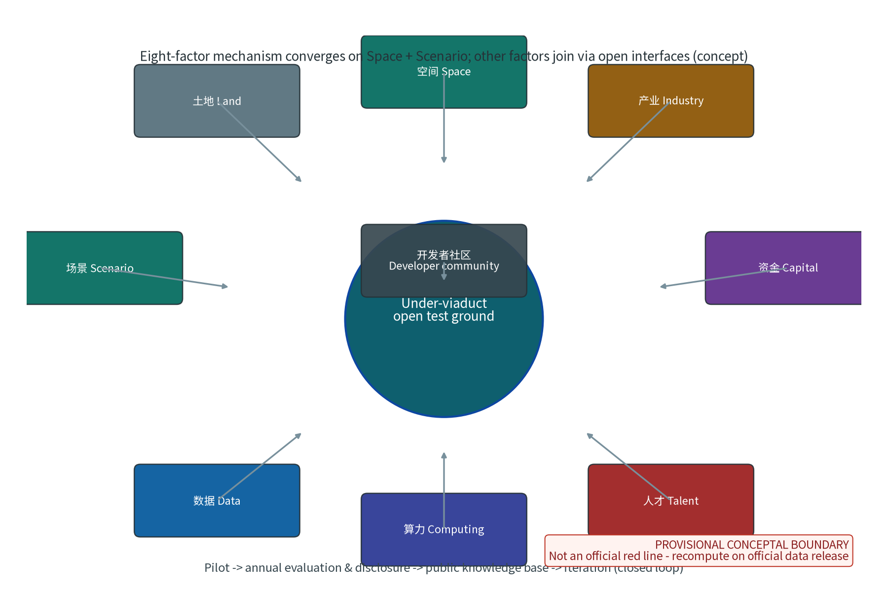
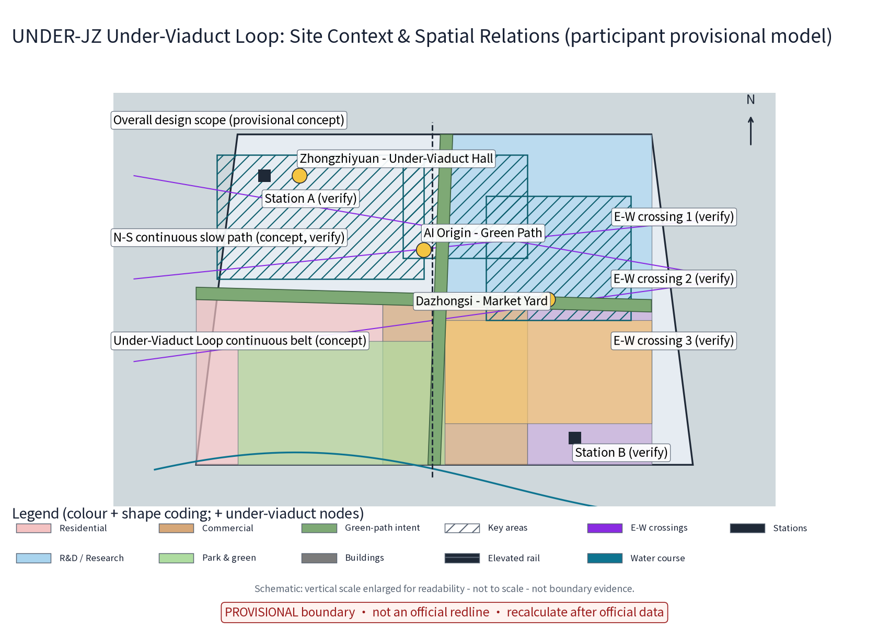
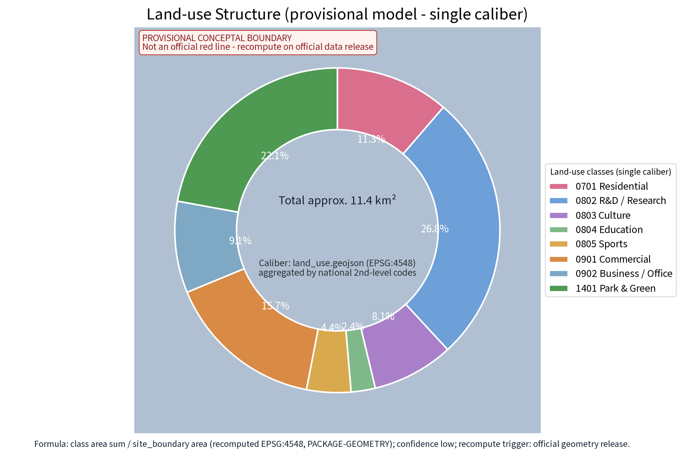
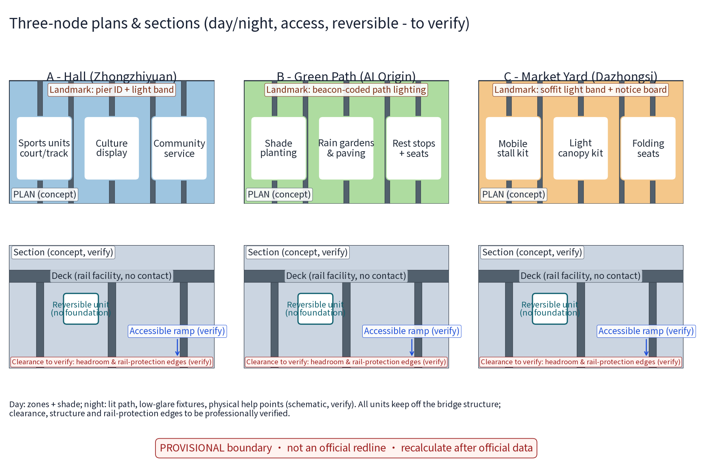
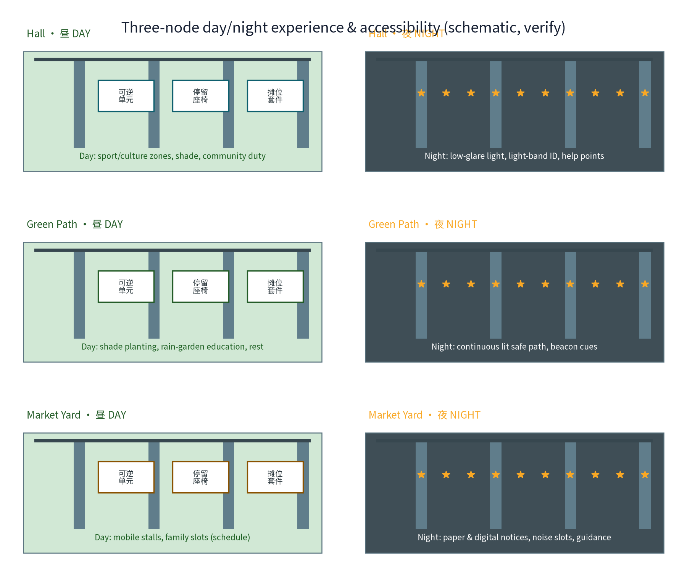
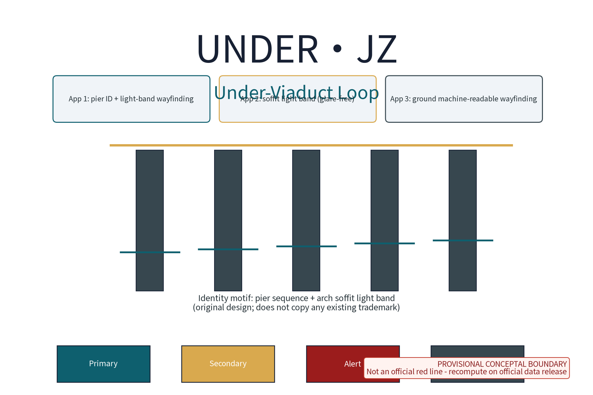
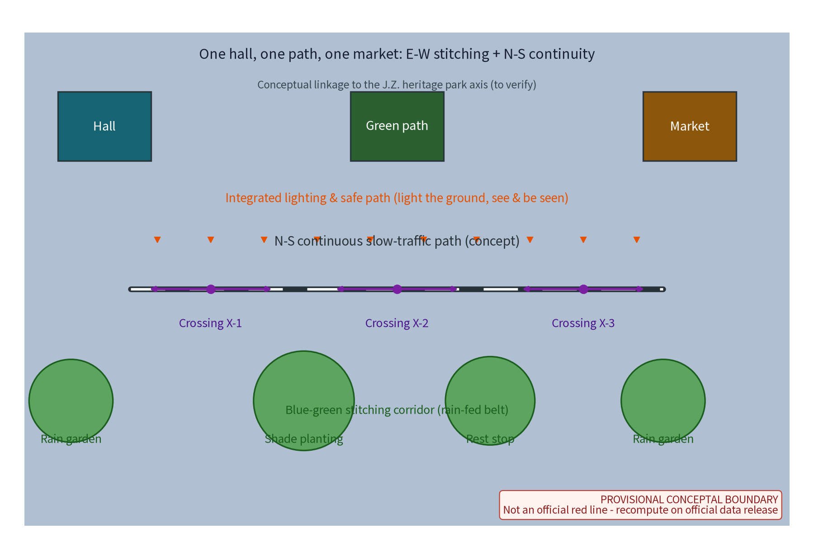
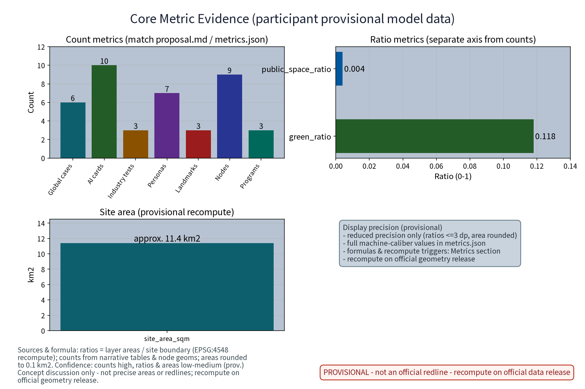
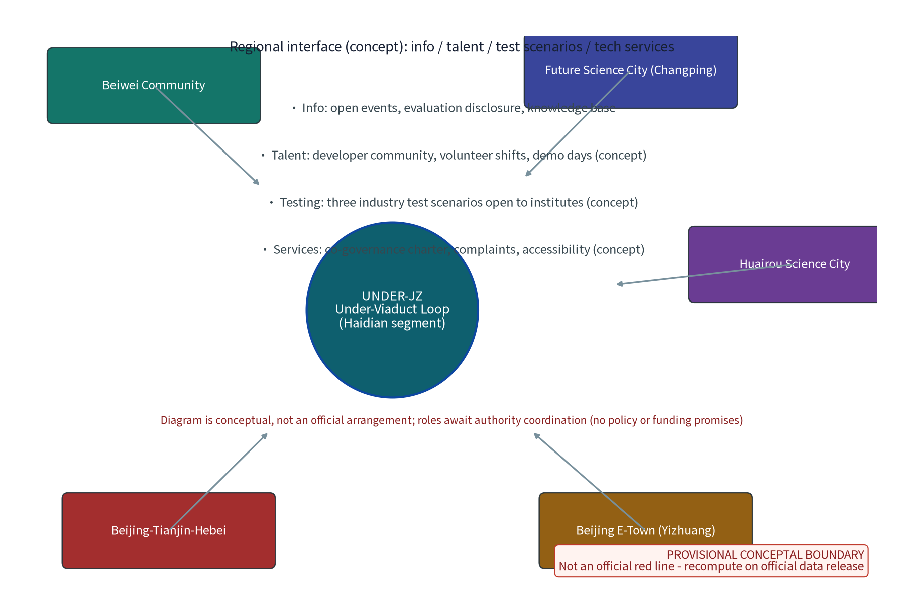

Revival of Space under Elevated Rail and Urban Stitching - Package 42 concept proposal (round-2 revision)

> Above the viaduct, speed; beneath it, daily life. The Under-Viaduct Loop uses One Hall, One Path, One Market, 10 AI+ scenario cards and five governance mechanisms to stitch the two sides of the elevated rail back together, turning the shadow of the viaduct into a bookable, co-governed, reusable linear public space.

This proposal is a concept suggestion and reference package for the open call of the Centennial Jing-Zhang AI Innovation Belt; it focuses on the taskbook dimensions of east-west stitching and north-south continuity, renewal and stock-space utilisation, and an AI-energised city. It gives no FAR, building-height, retain-renovate-demolish, road-redline, investment or engineering-feasibility conclusions; it fabricates no official data, under-viaduct areas, event counts or policy promises. Any under-viaduct placement presumes current conditions and lightweight reversible installations, and structural assessment plus rail-protection-zone (safety protection zone) verification are mandatory before implementation. All figures and values are marked PROVISIONAL (participant provisional model data) and are recomputed on official data release.

## Design Basis and Source List

The controlling basis, in order: the pre-qualification announcement and the agent taskbook excerpt (defining the three positionings, five functions, three zones and two wings, agent.1-6 tasks and boundary clauses), the full taskbook excerpt (including the list of prohibited statements), and the submission skill (defining proposal structure, output attributes and provisional-boundary handling). The proposal responds to the taskbook dimensions of "east-west stitching and north-south continuity", "renewal and stock-space utilisation" and "AI-energised city", with primary delivery on agent.3 (AI+ scenario empowerment paradigm and AI-energised city) and agent.4 (AI public space, east-west stitching and north-south continuity), and conceptual responses to the remaining tasks.

| Category | Material | Use and boundary |
| --- | --- | --- |
| Task basis | Public announcement and agent taskbook excerpt | Three positionings, five functions, three zones and two wings; does not replace statutory planning |
| Full task text | Taskbook excerpt (including prohibitions) | Compliance self-check |
| Skill basis | Submission skill | Structure, provisional geometry and recompute requirements |
| Site basis | Three zones, two wings and boundary clauses in the taskbook excerpt | Concept placement clues only; no official polygons |
| Benchmarks | Shanghai Suzhou Creek, Tokyo Nakameguro, Tokyo mAAch ecute, Seoul, NYC High Line, Toronto Bentway | Mechanism summaries from public channels only, each registered with publisher/URL/date and reuse boundary (see References and sources.json) |
| Context | Public direction of the Jing-Zhang railway and heritage park (taskbook excerpt) | Cultural narrative background |
| Format reference | Prior proposal texts in the repository | Section structure and honest phrasing only; no copied content |

No official overall boundary or under-viaduct polygons are published; this package claims no segment areas and cites no non-public drawings or data. All geometry here is provisional (temporary rough constraints) and recomputed by stated formulas, with official data release as the recompute trigger (see Metrics, Area Recalculation and Compliance Matrix).

> **Evidence anchors**: [source:DATA-SRC-OFFICIAL-ANNOUNCEMENT], [source:DATA-SRC-AGENT-TASKBOOK] (the announcement and taskbook are the textual-caliber basis).

## Three-Level Scope Framework

The three levels are linked by a chain of responsibility: problem - space - operation - evidence. Per the official announcement text, the three-tier scope values are: coordinated research area approx. 43.6 km2, overall design area approx. 11.4 km2, key areas approx. 368.4 ha. These values are restated from public announcement text (consistent with the announcement caliber, self-computed from the announcement, not officially issued); this package draws and claims no official polygon. This package's own sub-scope is a conceptual under-viaduct segment intent inside the overall design scope (provisional geometry; the provisional site boundary substitutes for the approx. 11.4 km2 overall design area). Each level answers a different question, keeping macro ecology, master plan and node design linked.

| Level | Official caliber | Under-Viaduct Loop answer | Main outputs |
| --- | --- | --- | --- |
| Coordinated research area | approx. 43.6 km2 (announcement text, not officially issued) | How the two sides of the viaduct are stitched and how AI scenarios translate into space | Industry and future-city research; 6 benchmark-case mechanisms |
| Overall design area | approx. 11.4 km2 (announcement text, not officially issued) | How stock under-viaduct space is renewed and used | One loop, three nodes; lightweight reversible-build principle |
| Key areas | approx. 368.4 ha (announcement text, not officially issued) | How the three nodes land differently | Node detailed design; scenario-space-operation mapping |

"Zhongzhiyuan side", "AI Origin Community side" and "Dazhongsi side" are under-viaduct segment intents corresponding to the three-zones-two-wings system; they organise the concept only and are not official scope divisions. Any segment delivery presumes ownership verification, structural assessment and coordination with competent authorities, and is phrased as concept and reference.

> **Evidence anchors**: [source:DATA-SRC-AGENT-TASKBOOK], [source:DATA-SRC-OFFICIAL-ANNOUNCEMENT] (three-tier scope and values follow the announcement text caliber; not officially issued).

## Coordinated Research Area: Industry and Future City Research

Translation of the three positionings into under-viaduct space: the under-viaduct space is the daily interface of an "urban AI-life experience belt", the urban narrative carrier of a "centennial Jing-Zhang culture belt", and the open test ground for scenarios of an "AI-integrated innovation belt". The three nodes sit next to the Zhongzhiyuan AI Self-Innovation Acceleration Area, the AI Origin Community and the Dazhongsi AI Industry Cluster, forming a garden-path-market ecosystem loop; the Zhongguancun tech-service wing and the Xiaoyue River scenario-empowerment wing provide factor interfaces, and the under-viaduct space gives the wings a perceptible physical test ground.

Benchmarks are summarised as mechanisms from public channels only; no unverified detail is expanded. Publisher, URL, date, supported claim and restrictions per entry are registered in sources.json (source ledger) and listed here:

| Case | Public-channel mechanism summary | Mechanism borrowed | Jing-Zhang translation | Source |
| --- | --- | --- | --- | --- |
| Shanghai: Suzhou Creek under-bridge renewal | Shanghai keeps upgrading under-bridge spaces along Suzhou Creek: multi-department renewal of passive bridge-foot spaces with sports, rest and convenience functions, forming continuous slow-traffic nodes | Composite bridge-foot functions and multi-department coordination; guided by programme-level planning | Hall intent: fitness, culture display and community service | [source:CASE-SHANGHAI-SUZHOU-CREEK] |
| Tokyo: Nakameguro Koukashita | From November 2016, jointly developed and operated by Tokyu Corporation and Tokyo Metro: approx. 700 m of under-viaduct space hosting commercial and cultural clusters, increasing circulation with the existing shopping street and greenway | Rail-owner cooperation and asset-light operation; sharing time and space | Market Yard: time-shared operation and co-governance charter | [source:CASE-TOKYO-NAKAMEGURO] |
| Tokyo: Kanda Manseibashi mAAch ecute | Old Manseibashi Station pier spaces converted into book and commercial-cultural facilities, led by the railway operator | Rail-heritage space curation and long-term operation | Under-viaduct culture display; above-and-below double narrative | [source:CASE-TOKYO-MAACH-ECUTE] |
| Seoul: under-viaduct public space | Since 2018 Seoul has progressively activated under-viaduct spaces (cultural facilities, resident community spaces, sports and rest), plus programmes such as "Green Art Path" | Public-first community facility insertion and sustained policy input | Public priority of Green Path and Hall | [source:CASE-SEOUL-UNDER-VIADUCT] |
| NYC: High Line | A derelict elevated rail line activated as a precedent linear park, operated long-term by a not-for-profit with city and community partners, plus an open knowledge mechanism for other cities | Long-term curatorial operation; public-private-governance cooperation | Under-viaduct culture display and long-term co-governance operation | [source:CASE-NYC-HIGH-LINE] |
| Toronto: The Bentway | Open since 2018 (Bentway 1.0): approx. 1.75 km of multi-use trail and public space beneath the Gardiner Expressway, operated by a not-for-profit with the City and communities | "Rooms-between-columns" organisation; not-for-profit operation model | Public operation and annual evaluation disclosure | [source:CASE-TORONTO-BENTWAY] |

The eight-factor mechanism (land, space, industry, capital, talent, computing, data, scenario) converges at the under-viaduct scale on two gears - "scenario" and "space" - while the remaining factors (capital, talent, computing, data, technology-services and the developer community) connect through open interfaces. On the industry side there is no investment-attraction or funding promise; the proposal only offers a "scenario open test ground" mechanism: enterprises, developers and communities apply through public channels for permitted scenario directions in the usage list, and trial results are deposited into the public knowledge base through annual evaluation disclosure, forming a pilot - evaluation and disclosure - knowledge base - iteration closed loop.

> **Evidence anchors**: [source:DATA-SRC-PROVISIONAL-BOUNDARIES], [source:CASE-TORONTO-BENTWAY] (boundaries provisional, research scope conceptual; case mechanisms per public channels).

## Overall Design Area: Urban Renewal and Regulatory-Plan-Level Urban Design

Naming system: "Under-Viaduct Loop" (UNDER.JZ). "Loop" is a double pun - spatially, the continuous under-viaduct corridor stitches both sides of the rail into a ring; in governance, the closed loop runs from usage list, access control and time-shared booking to annual evaluation disclosure. The visual-identity direction uses the pier sequence and the arch-soffit light band as the identity motif, with machine-readable identification linking pier numbering and ground wayfinding. All symbols are original drawings; no existing trademark or pattern is copied (until a prior-rights search completes, all names and marks are internal working codenames; see Brand and Visual Identity).

The overall structure is "one loop, three nodes": one continuous conceptual under-viaduct corridor along the elevated rail, linking the Under-Viaduct Hall (Zhongzhiyuan side), the Green Path (AI Origin Community side) and the Market Yard (Dazhongsi side). Slow traffic is organised within pier spacing; node functions are placed only in segments that pass structural assessment and clearance verification; the connectors between nodes use the green path as a base texture, giving a hall-path-market rhythm.

The renewal logic is stock-first, lightweight-reversible, current-conditions-first: under-viaduct use is governed by a usage list and access mechanism; statutory land-use is unchanged; no permanent-building judgement and no land-ownership or development-timing conclusions are made. At regulatory-plan depth the proposal is organised by the five elements of problem - spatial object - conceptual indicator - data gap - recompute path (see the Metrics section); statutory intensities and engineering conclusions remain to be confirmed and are never replaced by conceptual suggestions. This proposal gives no FAR, building-height, road-redline or retain-renovate-demolish conclusions.

> **Evidence anchors**: [source:DATA-SRC-MOHURD-CONTROL-DETAILED-PLANNING], [source:DATA-SRC-PROVISIONAL-BOUNDARIES].

## Detailed Design of Key Areas

The three nodes are conceptual placement intents beneath elevated segments; exact segment selection follows clearance verification, structural assessment, rail-protection-zone rules and ownership verification. Everything is a concept suggestion, and every dimension awaiting survey (clearances, pier spacing, land boundaries) is explicitly marked "to verify".

**Under-Viaduct Hall (Zhongzhiyuan side).** Intent: an under-viaduct composite function space for sports and fitness, culture display and community service, adjacent to the Zhongzhiyuan AI Self-Innovation Acceleration Area, acting as the "public interface of the acceleration area". Spatial strategy: reversible modules between piers organise fitness units (ball sports and running-track intent), a culture-display unit (static display intent for AI innovation outcomes and Jing-Zhang culture) and a community-service unit (convenience services and volunteer shifts); lighting is low-glare, high-colour-rendering, and ventilation and drainage presume current conditions. Public experience: from "passing through the shadow" to "stepping into an under-viaduct living room" - pier numbering and light-band sequences mark entries; paving changes zone the interior; bridge surfaces keep their rail-facility texture and carry content only through reversible mounts; no installation touches the bridge structure. The node also carries Pilgrimage Landmark L1 "machine-readable pier sequence" and a reversible honour-display wall ("under-viaduct micro-innovation honour system": outstanding co-builders, developer contributions and community volunteers nominated jointly by the public and operators in the annual evaluation, shown on a reversible display unit).

**Green Path (AI Origin Community side).** Intent: an under-viaduct slow-traffic and blue-green stitching corridor for the AI Origin Community's daily walking, transfer commuting and ecological rest. Spatial strategy: shade-loving planting strips, rain gardens and permeable paving form the "rain-fed under-viaduct belt", routing elevated-rail runoff into sponge-facility intent at low impact; lighting and the safety path are designed as one system for continuous day-and-night legibility. Public experience: "trees mirror the bridge" - rest points sit between piers, with shade-tolerant plants and water-quality interpretation signs; the Green Path is the horizontal stitching line for the communities on both sides, connecting at both ends through existing under-viaduct openings and ground pedestrian links. Planting and paving are ground-level reversible works only; no bridge-structure modification is involved. Pilgrimage Landmark L2 "beacon-coded path lighting" runs along the Green Path.

**Market Yard (Dazhongsi side).** Intent: a time-shared events and market space serving the "AI-native new business" intent of the Dazhongsi AI Industry Cluster, providing a small-scale, low-threshold commercial and social experiment ground. Spatial strategy: reversible equipment (mobile stalls, easy-assemble lightweight canopies, folding seats) and time-slot control (a conceptual weekday/weekend and day/night schedule) divide functions; stall and equipment interfaces presume current municipal conditions. Public experience: the Market Yard is the interface where "street-life energy meets AI" - physical stalls coexist with a public digital notice board, and event information is published in both paper and digital forms; the bustle-to-quiet balance is regulated by time slots and the co-governance charter, not by automated enforcement. The node is proposed as the pilot space for the event-matching AI and noise-control AI (see scenario cards) and hosts Pilgrimage Landmark L3 "arch-soffit light band and public notice board". All event arrangements are intents, not confirmed plans.

| Node | District side | Function intent | Spatial strategy | Public experience | Pilgrimage landmark |
| --- | --- | --- | --- | --- | --- |
| Under-Viaduct Hall | Zhongzhiyuan | Fitness, culture display, community service | Reversible modules, low-glare lighting, current conditions first | From shadow to living room | L1 machine-readable pier sequence + honour wall |
| Green Path | AI Origin Community | Slow-traffic stitching, blue-green ecology, commuter links | Shade planting, rain gardens, integrated lighting safety | Trees-mirror-bridge continuous walk | L2 beacon-coded path lighting |
| Market Yard | Dazhongsi | Time-shared market, events and socialising, new-business experiment | Reversible equipment, time slots, co-governance charter | Street-life energy meets AI | L3 soffit light band + public notice board |

The three landmarks together form the "Under-Viaduct Loop pilgrimage directory" (3 places, matching the ai_landmark features of geometry/public_space.geojson; counting caliber in the Metrics section): all expressed in reversible lighting, numbering and display components, original symbols copying no existing trademark or pattern. Common prerequisite: no node moves to implementation before clearance and structural assessment, rail-protection-zone rules, ownership verification, and fire and accessibility surveys are complete.

> **Evidence anchors**: [data:PACKAGE-GEOMETRY] (three-node polygons, 3 ai_landmark and 6 scenario_node features come from geometry/public_space.geojson).

## Brand and Visual Identity

"Under-Viaduct Loop" (UNDER.JZ) is an internal working codename: until an official trademark search and prior-rights review is complete, this proposal claims no trademark rights; the name, marks and drawings are for internal review and discussion only and are not used for external registration, commercial use or promotion, and no assessment of conflict with third parties is made (see the brand prior-rights paragraph in Risk, Copyright and Compliance).

Identity grammar (original design): the UNDER.JZ wordmark + pier-sequence glyph + arch-soffit light-band auxiliary; colour system (deep teal #0e5f6e, amber #d9a94e, alert red #9b1c1c, ground grey #37474f); grid proportion based on pier spacing as a module; applications include pier-ID plus light-band wayfinding, the glare-free soffit light band and ground machine-readable wayfinding. All graphics are original drawings; no existing trademark, logo or pattern is copied. An English version of each figure is provided.

> **Evidence anchors**: [source:PACKAGE-GEOMETRY] (identity motif and module are self-generated from this package's conceptual geometry context; no external trademark source).

## AI Innovation Ecosystem, Personas, and AI+ Scenarios

Seven personas (at least five required; metrics.json persona_count=7), each keeping an equivalent non-AI service path:

| Persona | Characteristics and core needs | Main spaces | Non-AI equivalent path |
| --- | --- | --- | --- |
| Local residents | Daily walks, parenting, neighbourly contact | Green Path, Hall | Human service desk, paper notices |
| Commuters | Station transfer, shortcut crossings, waiting rest | Corridor, Green Path | Fixed wayfinding, lit path, paper maps |
| Fitness users | Ball sports, running, equipment training | Hall | On-site registration, notice board |
| Market stallholders | Time-shared stalls, crowd organisation, storage | Market Yard | Paper booking, on-site management |
| Students and developers | Study, demos, tech exchange, outcome display | Hall, Market Yard | Physical notice boards, phone booking |
| Older people and persons with mobility impairments | Safe rest, accessible movement, human help | Green Path and the whole belt | Large-print signs, human inquiry |
| Night-shift and maintenance staff | Night lighting safety, rest, inspection | Corridor, three nodes | Inspection logs, physical help points |

Ten AI+ scenario cards (A1-A10), all complying with the "anonymised aggregation + human review" baseline, with stop conditions per card:

| ID | Scenario card | Ordinary service first | AI assists only | Human review and stop conditions |
| --- | --- | --- | --- | --- |
| A1 | Under-viaduct safety-monitoring AI | Lit paths, manual patrols, physical help points | Anonymised crowd aggregation and anomaly-period alerts | Anonymised aggregation + human review only, no individual-identifying tracking; stop on any identification or retention dispute |
| A2 | Space-booking AI | On-site, phone and paper booking | Time-shared booking suggestions and conflict hints | Staff confirm schedules; stop if no parallel human channel exists |
| A3 | Lighting-saving AI | Fixed lighting schedules, maintenance teams | Crowd-triggered lighting advice | Manual and timed baselines retained; stop if safe brightness is missed |
| A4 | Event-matching AI | Physical calendars, posters, on-site desk | Aggregation and draft recommendations of public events | Operators review before publishing; stop on misinformation or unclear rights |
| A5 | Noise-control AI | Time-slot rules, on-site guidance | Time-slot noise aggregation alerts | Advisory only, no automated enforcement; stop on data dispute |
| A6 | Parking and transfer guidance AI | Fixed signs and human inquiry | Aggregate non-motorised and transfer info (concept) | Public information only; stop on stale or wrong information |
| A7 | Market operations assistant AI | Paper ledgers, on-site negotiation | Stallholder public dashboard and ledger drafts | Effective after human reconciliation; stop on data dispute |
| A8 | Facility repair-reporting AI | Phone reporting, inspection records | Repair triage and dispatch drafts for lighting/seats/drainage | Human confirmation before dispatch; stop and revert to manual channel above error-rate threshold |
| A9 | Accessibility and age-friendly info AI | Large-print signs, human inquiry, escort service | Large-print/voice bilingual info and escort-request relay | Human fallback mandatory; stop on relay failure |
| A10 | Event capacity advisory AI | On-site staff and paper capacity notices | Event capacity trend aggregation | Advisory only; stop on capacity-data dispute |

Three industry test and validation scenarios (B1-B3; metrics.json industry_test_scenario_count=3), each with research hypothesis, data contract, baseline evaluation, error stratification, runtime monitoring and a public reporting protocol (conceptual; pending pilot approval):

| ID | Test scenario | Research hypothesis | Participating roles | Data contract | Evaluation baseline | Failure modes and stop | Public reporting |
| --- | --- | --- | --- | --- | --- | --- | --- |
| B1 | Safety-monitoring AI recognition and aggregation evaluation | Anonymised aggregate anomaly alerts can reduce blind spots of manual patrol | Universities/institutes design evaluation; operator supplies anonymised data; community representatives review | Aggregate indicators only, no individual-identifying fields | Manual patrol records as control baseline | Stop on error rate above agreed threshold or any individual identification | Annual evaluation disclosure (anonymised) |
| B2 | Lighting-saving AI A/B test | Crowd-triggered lighting saves energy without losing safe brightness | Lighting firms and maintenance crews collaborate; energy ledger open | Time-slot energy and brightness samples; no individual data | Scheduled-lighting periods as control baseline | Stop if safe brightness is missed | Energy and brightness monitoring disclosed |
| B3 | Noise aggregation and time-slot matching evaluation | Time-slot noise aggregation can help optimise time-slot control | Acoustics institutes supply methods; Market Yard operator and stallholder representatives join | Time-slot aggregate noise values, not linked to individuals | On-site manual time records as control baseline | Stop on data dispute or error rate above threshold | Noise time-slot report disclosed |

AI technical protocols (conceptual baseline): every scenario card and industry test requires model evaluation, data-quality checks, error stratification, runtime monitoring and error-rate reporting; any AI output is advice and drafts only and never makes public decisions automatically; data is anonymised aggregated, no individual-identifying information is collected, and no individual-identifying tracking is performed; scenarios open stepwise as pilots, immature technology is not written as deployed, and test scenarios are not written as approved operations.

Scenario-to-space-to-operation mapping (9 scenario nodes = 6 functional nodes + 3 pilgrimage landmarks; metrics.json scenario_node_count=9, consistent with geometry/public_space.geojson):

| Scenario | Main space | Operation mechanism |
| --- | --- | --- |
| Safety-monitoring AI | Three nodes and corridor | Anonymised aggregation, human review, annual evaluation disclosure |
| Space-booking AI | Market Yard, Hall | Time-shared booking, usage list and access |
| Lighting-saving AI | Green Path, corridor | Maintenance teams, schedule baseline |
| Event-matching AI | Market Yard, Hall | Co-governance charter, event ledger |
| Noise-control AI | Market Yard | Time-slot control, on-site guidance |
| Parking and transfer guidance AI | Corridor ends (concept) | Public info aggregation, fixed signs |
| Repair-reporting AI | Three nodes | Inspection logs, human dispatch |
| Accessibility information AI | Whole belt (Green Path priority) | Human-service fallback |
| Event capacity advisory AI | Market Yard | Time-slot control, on-site staff |

Privacy and human-review boundary: safety monitoring performs no individual-identifying tracking and presumes no collection of identifiable individual information such as faces or plates; all AI outputs are advice and drafts and never make public decisions; plaza, stall and event-capacity data are shown only as anonymised aggregates; any scenario pilot opens only after publishing the data-use boundary and keeping a parallel human channel.

> **Evidence anchors**: [source:DATA-SRC-GENERATIVE-AI-INTERIM-MEASURES] (reference for AI-generated content and governance phrasing; not legal advice).

## Land Use, Building Scale, and Retain-Renovate-Demolish Strategy

Land-use single caliber: this package uses exactly one set of land-use classes and ratios. Caliber: class names follow the current national guide (Ministry of Natural Resources, "Land and Sea Classification Guide for Territorial Spatial Survey, Planning and Control", issued 2023-11, second-level codes); ratios are recomputed from geometry/land_use.geojson in EPSG:4548 with the formula "class area sum / site_boundary area" (aggregation rule: polygons sharing one code merge before summing; confidence=low; recompute trigger=official geometry release, then all values are recomputed by the same formula and replaced). This one set of ratios is used identically in this narrative, the land-use-structure figures, the visual page, both HTML reports and metrics.json - no second caliber appears anywhere in the package:

| Land-use class (national second-level code) | Ratio (provisional, 1 decimal) | Aggregation formula and trigger |
| --- | --- | --- |
| 0701 Residential | 11.3% | class area / site area (EPSG:4548); recompute on official geometry release |
| 0802 R&D / Research | 26.8% | same |
| 0803 Culture | 8.1% | same |
| 0804 Education | 2.4% | same |
| 0805 Sports | 4.4% | same |
| 0901 Commercial | 15.7% | same |
| 0902 Business / Office | 9.1% | same |
| 1401 Park & Green Space | 22.1% | same |

The Under-Viaduct Loop changes no statutory land use and proposes no regulatory-plan adjustment. Under-viaduct use is managed by a usage list and access mechanism - the list classifies intended functions (slow traffic, rest, fitness, display, time-shared market, municipal greening, etc.) as allowed / conditionally allowed / prohibited, each with its preconditions (clearance, fire safety, accessibility, ownership, rail-protection-zone rules).

Building scale: no building area, footprint or total volume conclusions are given; node functions are expressed as "reversible installation envelopes", sized within pier spacing and current clearances (both to verify), adding no building-intensity judgement.

Retain-renovate-demolish executes four conceptual steps: verify current conditions and rights first; retain where safety, heritage and function requirements are met; lightly renovate the ground layer where accessibility, fire and drainage improvements are needed; relocate or delete conceptual installations where rail-protection-zone rules or structural safety conflict. No demolition conclusion is drawn without survey; FAR, building height and demolition quantities remain unknown, pending official control data, and the concept never replaces regulatory-plan approval.

Urban character: the industrial scale of rail infrastructure forms the backdrop, continuing the plain engineering aesthetics of the Jing-Zhang railway and the pragmatic innovation temperament of Zhongguancun; materials follow durable, easily replaceable and low-glare principles; signs, lighting and visual elements are original designs copying no existing trademark or pattern.

> **Evidence anchors**: [source:DATA-SRC-MNR-LAND-USE-CLASSIFICATION-202311] (class names follow the current national standard caliber).

## Transport, Rail, Municipal Infrastructure, and Public Services

East-west stitching and north-south continuity: the under-viaduct slow-traffic corridor is the conceptual core - a continuous slow-traffic line within the clearance beneath the elevated rail (north-south continuous path), linked laterally to the pedestrian systems of both sides at 3 east-west crossing points (conceptual positions, to verify), forming the east-west stitch; longitudinally it links conceptually with the belt's existing slow-traffic skeleton (including the Jing-Zhang heritage park direction), forming the north-south continuity experience. No road alignment, intersection alteration, road redline or quantity conclusions are given; connections presume current roads, rail and municipal conditions and require specialist deepening.

Integrated lighting and safe path: lighting across the belt follows "light the ground, see and be seen", organised with paths, steps, signage and help points in one design coordinate system; lighting serves safety and experience only, never individual identification; safety perception comes from the lit path, physical help points and (post-pilot) anonymised aggregate alerts - never individual-identifying surveillance.

Rail and structural boundary (hard constraint): under-viaduct space is constrained by bridge structure and rail-protection zones. This proposal makes no bridge-structural modification, no load, clearance or engineering-feasibility conclusions; all ground-level installations presume current conditions plus lightweight reversibility; any node requires structural assessment, rail-protection-zone verification and authority coordination before implementation.

Municipal and public services: planting, rain gardens, lighting supply, drainage and reserved interfaces presume current municipal conditions; no pipeline relocation or capacity conclusions are given; public services (convenience services, rest seating, info points) merge with the three nodes, and facilities carry asset numbers, maintenance owners and stop-use conditions.

> **Evidence anchors**: [source:DATA-SRC-MOHURD-URBAN-DESIGN-MEASURES] (method reference for municipal and slow-traffic phrasing).

## Blue-Green Network, Public Space, and Urban Character

Blue-green: the Green Path's "rain-fed under-viaduct belt" is the blue-green core - shade planting strips carry the continuous green of both rail sides, rain gardens and permeable paving form low-impact drainage intent and turn elevated-rail runoff into a perceptible ecological process; plant selection follows shade-tolerant, low-maintenance native-species intent; the precise plant list and irrigation approach await specialist deepening. The system links conceptually with the belt's existing blue-green skeleton (including the Xiaoyue River scenario-empowerment wing); no blue-line, green-line or ecological-control conclusions are made.

Public space: the three nodes and the corridor form a continuous under-viaduct public-space belt under the principles of no-threshold access, free opening and time sharing. Use is governed by a co-governance charter: opening hours, use rules, stall rules, noise control and responsibility boundaries are co-agreed by users, operators and neighbouring communities, and the annual evaluation disclosure tests the charter. Public space provides shade (the viaduct itself), seating, drinking- info, accessibility and night legibility; all facilities are reversible, maintainable and stop-able. Accessibility requirements: the belt is organised conceptually around at least one continuous accessible route; ramp slopes, passage widths and level changes are all marked to verify, and an accessibility survey precedes implementation; information is published in large-print, voice and paper forms and colour is never the only information code (all legends use colour + shape/symbol double encoding). Important note: this proposal claims no compliance with any formal accessibility standard; it only raises conceptual requirements and survey triggers.

Honour-display system: the "under-viaduct micro-innovation honours" are soft components of public space - generated by the annual evaluation and public nomination (outstanding co-builders, developer contributions, volunteers and stallholders), shown on a reversible display wall in the Hall and plaques on the Green Path; the components are replaceable and stop-able and are not mixed with administrative awards (conceptual mechanism).

Reversible public-space component library (component catalogue; parameters to verify): "disassemblable, relocatable, reusable" - components and interfaces are standardised for maintenance and seasonal adjustment:

| Component | Function | Reversibility | Interface and preconditions |
| --- | --- | --- | --- |
| Modular benches / planters | Rest, green edges | Bolted, movable as sets | Ground-paving interface; no bridge contact |
| Segmented shading canopies | Market Yard shade | Ballast/weighted bases, seasonal assembly | Wind and fire assessment (to verify) |
| Mobile stall kit | Time-shared market | Towable units, no fixed foundations | Current municipal power interface (to verify) |
| Modular sports units | Fitness units | Unit assembly, replaceable surfaces | Clearance and buffer distances (to verify) |
| Lighting and signage components | Signage, lit path | Clamp/floor fixtures, no drilling | Current power supply (to verify) |
| Rain-garden boxes | Ecology display, retention | Precast, replaceable | Drainage interface and sealing (to verify) |

Urban character and cultural narrative: "above is speed, below is life" forms the narrative line, placing the engineering memory of the Jing-Zhang railway (steel, sleepers, pier-sequence imagery) beside a new AI culture (original translations of maps, code and data textures); character control keeps simplicity, durability and low glare, without viral or entertainment-led expression; the under-viaduct identity system is a subordinate part of the belt-level logo system and never confuses hierarchy.

> **Evidence anchors**: [source:DATA-SRC-MOHURD-URBAN-DESIGN-MEASURES] (method reference for blue-green organisation).

## Renewal Projects, Implementation Policy, and Phasing

Three categories of project list (conceptual suggestions, not approved works):

| Category | Projects (concept) | Preconditions |
| --- | --- | --- |
| Function activation | Hall reversible modules, Market Yard reversible equipment, community service points, time-shared stall kits | Structural assessment, ownership verification, fire and accessibility surveys |
| Stitching network | Green Path, east-west corridor, lit safety path, rain gardens, shade planting strips | Clearance verification, rail-protection coordination, current municipal interfaces |
| Governance mechanisms | Usage list and access, time-shared booking, reversible-build guide, co-governance charter, annual evaluation | Operator, community participation, public ledgers |

Annual programme brands (3 conceptual brands; metrics.json annual_program_count=3; all content is intent, not confirmed plans):

| Programme brand | Content (concept) | Space | Operational features |
| --- | --- | --- | --- |
| Under-Viaduct Open Week | Central opening of the three nodes, outcome display, public consultation | Hall, Green Path | Annual fixed window, paper + digital notices |
| Swap Market Season | Time-shared market and second-hand exchange monthly themes | Market Yard | Stall booking, charter, on-site guidance |
| Under-Viaduct Sports Day | Open fitness classes and community match days | Hall, Green Path | On-site registration, volunteer shifts |

Phasing is a conceptual rhythm, not a development-timing conclusion:

| Phase | Time (concept) | Content outline |
| --- | --- | --- |
| Near term | 1-3 years | Structural assessment and rail-protection verification first; pilot the Green Path and lit safety path in the most mature segment; trial the usage list and charter at small scale; start annual evaluation disclosure |
| Mid term | 3-5 years | Hall and Market Yard nodes take shape and run on time slots; AI+ scenarios open stepwise as pilots (including industry tests B1-B3); corridor progressively connects; mechanisms grow from pilot to routine |
| Long term | 5-10 years | Under-Viaduct Loop links with the belt as a perceptible sample of an AI-energised city; evaluation disclosure deposits into public knowledge assets |

Developer community and open operation (agent.6 conceptual mechanisms): a developer-community mechanism - public scenario-interface documentation and data-use boundaries, regular technical Q&A and demo days, and an apply-review-disclose-evaluate loop for prototype applications to under-viaduct scenarios; operation follows an "open operation" principle - the usage list, time-slot tables, charter text, evaluation reports and anonymised aggregate indicators are public in the knowledge base; the conversion pathway (concept, not commitment): Open Week and consultation collect intent, pilot evaluations enter the annual disclosure, mature components enter the component library for reuse. Any conversion presumes authority decisions and legal compliance; no investment-attraction, policy or funding support is promised.

Implementation mechanism matrix (conceptual; states who leads, who collaborates, what is reviewed, and when to stop; never writes conceptual mechanisms as approved arrangements):

| Mechanism element | Pilot-selection criteria | Accountable actors (lead / collaborate) | Professional review checkpoints | Community participation | Privacy and accessibility checks | Maintenance cycle | Cost class | KPIs | Complaints and appeals | Incident escalation | Stop conditions |
| --- | --- | --- | --- | --- | --- | --- | --- | --- | --- | --- | --- |
| Node facility pilots | Structural assessment passed; ownership clear; community intent expressed | District authority leads; professional teams and operators collaborate | Structural, rail-protection, fire review | Intent consultation and charter co-agreement | Accessibility survey; privacy impact statement | Quarterly inspection + annual evaluation | Low/medium (qualitative, below) | Usage counts, complaint rate | On-site register + online channel | Immediate reporting of safety issues | Stop on safety, ownership or charter failure |
| Scenario AI pilots | Within usage list; data boundary published; parallel human channel in place | Operator leads; research/development collaborates; evaluated per B1-B3 protocols | Data and algorithm evaluation; content review | Representatives join review | Anonymity audit; no individual fields | Monthly runtime monitoring + annual evaluation | Medium (qualitative) | Error rate, stop-trigger counts | Appeals via disclosure channels | Disputes escalate to professional evaluation | Stop on error rate above threshold or any individual identification |
| Annual evaluation disclosure | Runs during Open Week | Operator leads; community and experts collaborate | Evaluation methodology review | Public nomination and survey | Anonymised disclosure | Annual | Low (qualitative) | Charter compliance, satisfaction | Appeals window during disclosure | Independent re-check on dispute | None (mechanism continues; results can be corrected) |

Cost-class note (no precise amounts; qualitative tiers only): Low = routine maintenance and paper-print-type spending; Medium = reversible-equipment purchase and pilot-operation-type spending; High = large-scale renovation-type spending requiring approval. Estimation method, price base period, inclusion scope, confidence level and recompute triggers are registered in assumptions.json and the Metrics section; this proposal commits no funding arrangements.

Policy suggestions (concept): directions such as a usage guide for under-viaduct space, a multi-department joint-coordination mechanism, a rail-owner cooperation model and a "future data and computing coordination mechanism (concept)" may be explored; all are ideas and constitute no policy commitment, funding commitment or confirmed arrangement; no government body is proposed; pilot selection, approval paths and budgets are decided by competent authorities and professional teams.

> **Evidence anchors**: [source:DATA-SRC-AGENT-TASKBOOK] (phasing and implementation entries correspond to taskbook requirements).

## Metrics, Area Recalculation, and Compliance Matrix

Three formal core metrics (provisional-geometry recomputation note): the taskbook requires site_area_sqm, green_ratio and public_space_ratio as known finite values recomputable from the submitted geometry. This package uses clearly marked provisional conceptual geometry (geometry_role=provisional_constraint, official_boundary=false, temporary rough precision) as low-confidence temporary model input, recomputed in EPSG:4548 with the formulas "area = polygon area; green_ratio = green-space area / site area; public_space_ratio = public-space area / site area", producing finite values written synchronously into metrics.json and the data-value attributes of visual/index.html with provisional markers, sources and low confidence; when official boundary, green and public-space data are published, the same formulas trigger recomputation and replace the temporary values. The three core metrics are never replaced by unknown, not_applicable or geometry-free placeholders; FAR, building height and other indicators that depend on unpublished official control conditions remain unknown (value null) with reasons stated.

Conceptual indicator system (counting calibers consistent with proposal.md, metrics.json, visual/index.html, compliance_matrix.json and all figures; every count has visible-text evidence in this narrative, is recomputable and traceable):

| Indicator | Caliber | Value and machine anchor | Basis and recompute |
| --- | --- | --- | --- |
| site_area_sqm | Site area, recomputed from site_boundary | approx. 11.4 km2 (exact value in metrics.json) [metric:site_area_sqm] | Package geometry EPSG:4548; recompute on official data release |
| green_ratio | Green ratio = green area / site area | approx. 0.118 [metric:green_ratio] | same |
| public_space_ratio | Public-space ratio = public area / site area | approx. 0.004 [metric:public_space_ratio] | same |
| Personas | Seven personas | 7 [metric:persona_count] | Persona table, 7 rows |
| AI+ scenario cards | Cards A1-A10 | 10 | Scenario-card table, 10 rows |
| Industry test scenarios | Tests B1-B3 | 3 [metric:industry_test_scenario_count] | Industry-test table, 3 rows |
| Global benchmark cases | Case table entries | 6 [metric:global_case_count] | Case table, 6 rows + source ledger |
| Pilgrimage landmarks | ai_landmark features | 3 [metric:landmark_count] | geometry/public_space.geojson |
| Scenario nodes | 6 functional nodes + 3 landmarks | 9 [metric:scenario_node_count] | geometry/public_space.geojson |
| Annual programme brands | Open Week / Market Season / Sports Day | 3 [metric:annual_program_count] | Annual programme table, 3 rows |
| Governance mechanism elements | List/booking/guide/charter/disclosure | 5 | Mechanism text in this narrative |
| Phases | Near/mid/long term | 3 | Phase table, 3 rows |
| Land-use classes | Single caliber, 8 classes | 8 | land_use.geojson aggregation |
| FAR / building height / demolition | Depend on unpublished official controls | unknown, value null | Assess after official data release |

Display-precision convention (enforced package-wide): provisional values are shown at reduced precision only - ratios at most 3 decimals (0.118, 0.004), areas rounded to 0.1 km2 (or 100 m2), percentages at most 1 decimal; the full machine-caliber values live in metrics.json (not used in narrative or figure display); every indicator carries the note "participant provisional model, non-official planning indicator"; official data release triggers recomputation by the stated formulas and replacement of all values.

Recalculation contract and evidence chain: every value states data source, formula, confidence level, use restrictions and recompute trigger (see table above and per-entry fields in metrics.json); no untraceable count exists.

Compliance-matrix essentials: checked item by item against taskbook agent.1-6 and the prohibition list - no FAR, building height, retain-renovate-demolish, road-redline or engineering-implementation conclusions; no fabricated under-viaduct areas, event counts or policy promises; no idea written as a confirmed arrangement; no bridge-structural modification or load conclusions; safety monitoring is anonymised aggregation with human review only and no individual-identifying tracking; no unauthorised trademark, font, image or copyrighted material is cited. These are mapped to the corresponding sections of this proposal and recorded item by item in compliance_matrix.json.

> **Evidence anchors**: [metric:green_ratio], [metric:public_space_ratio], [source:PACKAGE-GEOMETRY].

## Regional Synergy and International Outreach

Regional synergy (conceptual relations, not official arrangements): the Under-Viaduct Loop is a Haidian public-space sample that envisions four interfaces of "information / talent / test scenarios / tech services" with the following regions - Beiwei Community (community participation, Open Week activity and resident-feedback interface), Future Science City (Changping, talent and tech-exchange interface), Huairou Science City (research evaluation and test-scenario interface), Beijing E-Town (Yizhuang, industry and operation-experience interface) and the Beijing-Tianjin-Hebei region (public-space activation experience and developer-community network interface). All interfaces are envisioned on open, voluntary and reciprocal principles: information = open events, evaluation disclosure and knowledge-base exchange; talent = developer community, volunteer shifts, internships and demo days; testing = the three industry test scenarios open to research institutes (under data contracts and anonymisation); services = co-governance charter, complaint channels and accessibility guarantees. This proposal makes no commitment on any of these arrangements; roles and cooperation await authority coordination.

International outreach narrative and copy (concept, bilingual, for later brand-communication deepening; not a commitment to publish): Chinese main line - "Above the viaduct, speed; beneath it, daily life: UNDER-JZ stitches the city back together." Supporting copy (Chinese): "One Hall, One Path, One Market - bookable, co-governed, reusable." (English): "One hall, one path, one market - bookable, co-governed, reusable." Communication boundary: all copy is for internal review and public evaluation of this proposal only; no trademark is claimed; no investment-attraction, policy or funding promise is made; prior-rights search and compliance review precede any publication.

> **Evidence anchors**: [source:DATA-SRC-AGENT-TASKBOOK] (regional synergy and outreach correspond to conceptual responses of agent.4/agent.5/agent.6).

## Risk, Copyright, and Compliance

Principal risks and responses (per item: responsibility and trigger): (1) structural safety and rail-protection-zone risk - no installation touches the bridge or enters the rail-protection zone; the response is lightweight reversibility and mandatory structural assessment and authority coordination before implementation; this proposal gives no load or engineering-feasibility conclusions. (2) Concept-misread-as-conclusion risk - the whole document insists on "concept suggestion / reference / for specialist deepening" phrasing and completes the prohibition-list self-check. (3) Privacy and surveillance misreading risk - safety monitoring is anonymised aggregation with human review only, no individual-identifying tracking, and no identifiable-individual collection is presumed; on any identification dispute the function is stopped immediately and reverts to the human channel. (4) Event-idea-misread-as-confirmed risk - all events are intents, pilots and conceptual rhythms; no event counts or outcomes are promised. (5) Data and source risk - only public or cleared sources are used; cases are mechanism summaries registered in the ledger; zero tolerance for fabricated data. (6) Operation and stop-use risk - all facilities and AI pilots carry maintenance owners, complaint and appeal channels, incident-escalation paths and stop conditions (see the implementation matrix).

Brand prior rights and use boundary: as of this submission, no official trademark search or prior-rights review is complete; "Under-Viaduct Loop", "UNDER.JZ" and all marks and drawings are treated at this stage as internal working codenames for review-only use, restricted from external registration, commercial use and publication until a prior-rights search and legal verification is completed; if any conflict with third-party rights is found, naming and graphics are adjusted immediately per the review outcome. This statement is not a trademark non-infringement guarantee.

Copyright and per-asset ledger (machine copy in sources.json; covering cases, fonts, images, maps, data, GeoJSON, code and generated media):

| Asset class | Asset | Author and provenance | Licence and attribution | Reuse scope |
| --- | --- | --- | --- | --- |
| Proposal text | proposal.md / en / HTML | Package author (AI-agent generation + human revision) | Repository COMMUNITY-DISPLAY-ONLY | Repository display and review |
| Geometry | geometry/*.geojson | Package author (temporary rough modelling from announcement text caliber) | Self-produced design data | Package visualisation and machine checks |
| Figures | assets/figures/*.png | Package author (programmatic matplotlib drawing) | Original figures | Package display; no third-party basemap copied |
| Drawings | drawings/*.pdf | Package author | Original drawings | Package display |
| HTML | report/*.html, visual/*.html | Package author + repository render scripts | Self-produced | Offline display |
| Font | Noto Sans SC (referenced system/repo font) | Google Noto project, SIL OFL 1.1 | Free use and redistribution within OFL | Embedded in HTML for offline rendering; copyright notice retained |
| Code | Generation/render scripts | Repository scripts + package parameters | Repository rules | Reuse within repository |
| Benchmark cases | 6 case summaries | Publishers per sources.json ledger entries | Summaries and paraphrase only; no original text, images or trademarks copied | Mechanism reference only; no endorsement |
| Generated media | AI-generated text and data | Declared model (see agent.json) | Repository display rules | Generation method labelled |

Compliance: this proposal is an open co-creation suggestion; it does not replace statutory planning, does not constitute a government review conclusion, and involves no administrative-approval judgement; Chinese law on personal-information protection and data security and repository rules prevail over any reference document. This package contains no personal privacy information, national-ID numbers, phone numbers or other individual-identifying data, and no classified or unauthorised material.

> **Evidence anchors**: [source:DATA-SRC-OFFICIAL-ANNOUNCEMENT] (the announcement rules are the basis for ownership and compliance phrasing).

## References

| Category | Material | Use | Boundary |
| --- | --- | --- | --- |
| Task basis | Announcement and agent taskbook excerpt (brief_site-package_agent_taskbook.json) | Three positionings, five functions, three zones and two wings, agent.1-6, boundary clauses | Cleared repo excerpt |
| Full task text | Taskbook excerpt (taskbook.pretty.json) | Prohibited-statement list | Same |
| Skill basis | Submission skill (skills_urban-design-ai-submission_SKILL.md) | Structure, provisional geometry and self-check requirements | Same |
| Format reference | Prior proposal texts in the repository | Section structure and honest phrasing | Format only, no copied content |
| Benchmark | Shanghai Suzhou Creek under-bridge renewal (public channels; ledger in sources.json) | Mechanism reference | Summary only; details per publisher original |
| Benchmark | Tokyo Nakameguro Koukashita (public channels; ledger in sources.json) | Mechanism reference | Same |
| Benchmark | Tokyo Kanda Manseibashi mAAch ecute (public channels; ledger in sources.json) | Mechanism reference | Same |
| Benchmark | Seoul under-viaduct public space (public channels; ledger in sources.json) | Mechanism reference | Same |
| Benchmark | NYC High Line (public channels; ledger in sources.json) | Mechanism reference | Same |
| Benchmark | Toronto Bentway (public channels; ledger in sources.json) | Mechanism reference | Same |
| Context | Jing-Zhang railway and heritage park public direction (taskbook excerpt) | Cultural narrative background | Background only; not heritage or planning basis |

Note: each of the six benchmarks registers publisher, URL, publication/access dates, supported claims and restrictions in sources.json; the proposal paraphrases mechanisms only, without word-level verification, and they are not used as professional performance evidence. This is Package 42's concept proposal (round-2 revision) and will iterate with public-material updates and community feedback.

> **Evidence anchors**: [source:DATA-SRC-OFFICIAL-ANNOUNCEMENT] (first entry is the organiser's public materials package).