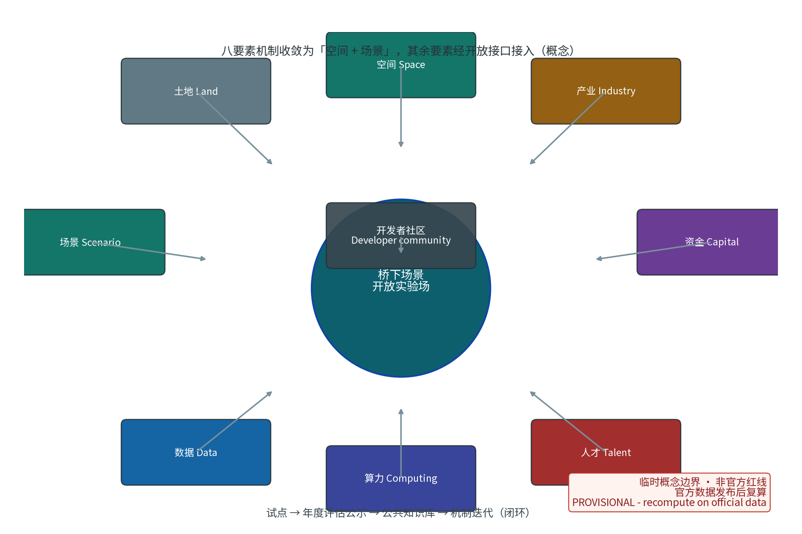
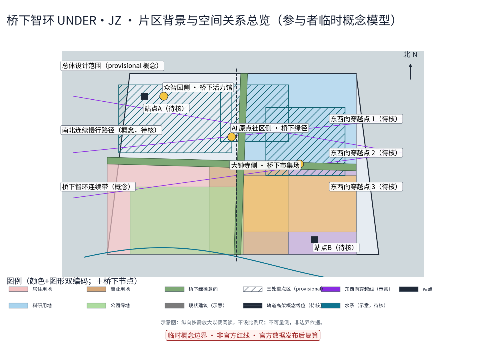
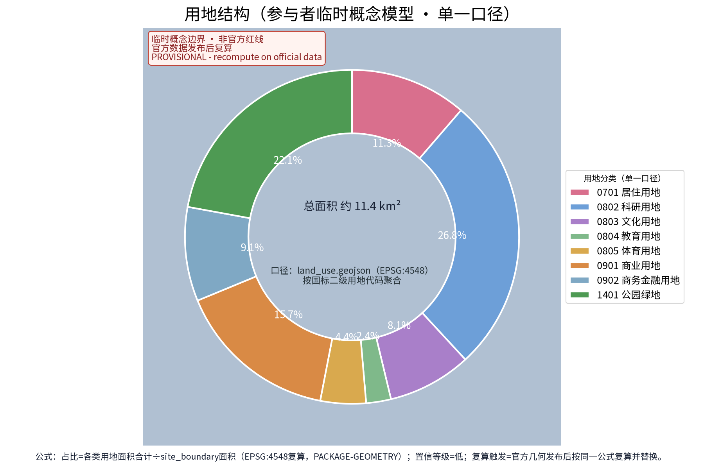
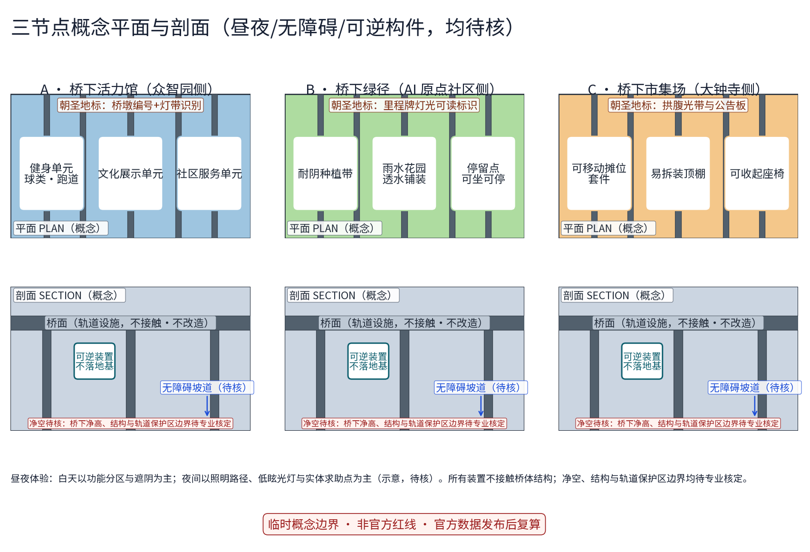
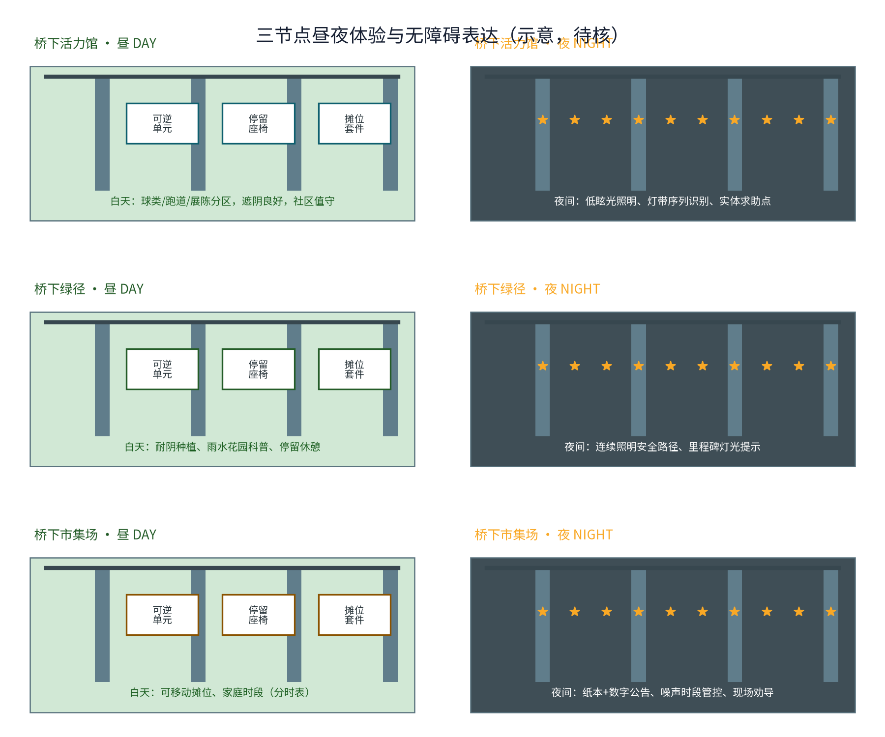
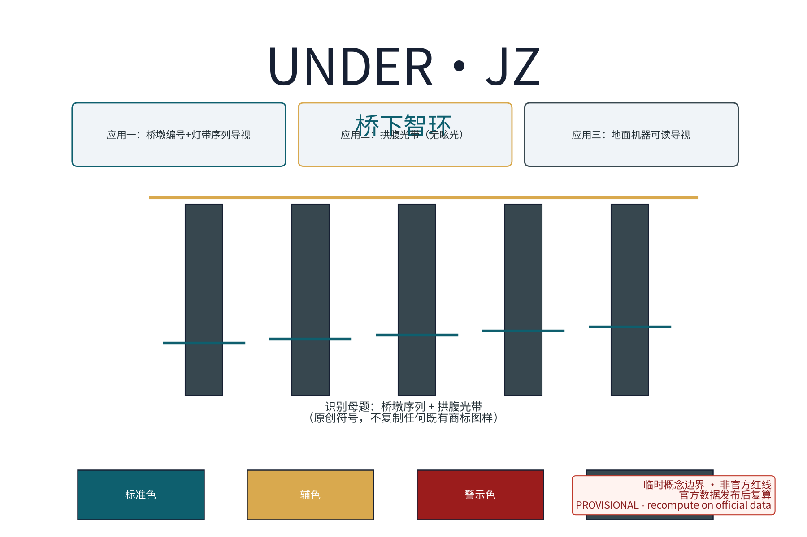
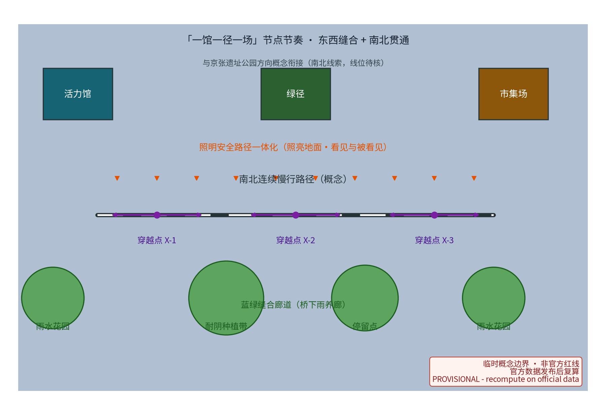
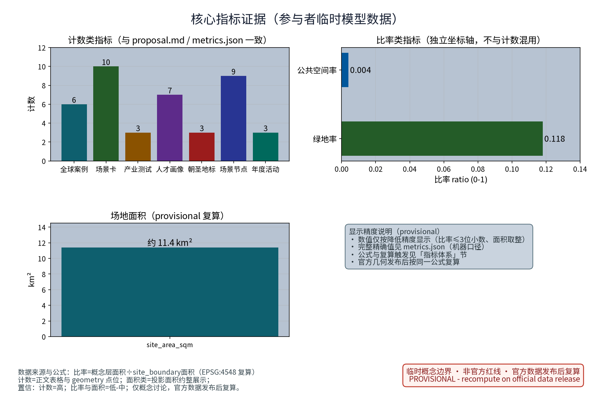
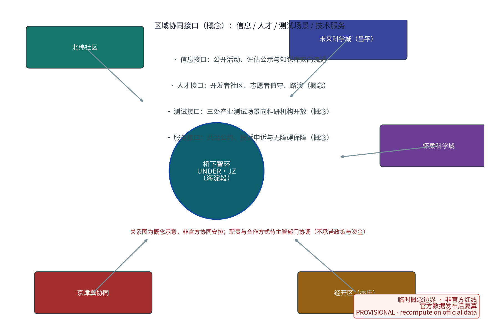

轨道高架桥下空间活化与城市缝合——第42号方案包概念建议（第二轮回修）

> 高架之上是疾驰的轨道，高架之下是日用的城市。桥下智环以"一馆一径一场"三个节点、10 张 AI+ 场景卡与五项治理机制要素，把轨道两侧被分隔的城市重新缝合，让高架阴影转化为可预约、可共治、可复用的线性公共空间。

本方案为面向"百年京张AI创新带"开源征集的概念建议与参考方案，聚焦任务书中"东西缝合与南北贯通概念策略、更新与存量空间利用、智能化AI活力城市"维度。全文不给出容积率、建筑高度、具体拆改留、道路红线、投资测算或工程可行性结论；不编造任何官方数据、桥下面积、活动场次与政策承诺；桥下任何落位均以现状条件与轻量可逆装置为前提，正式实施前必须完成结构评估与轨道保护区（安全保护区）核查。全部图件与数值标注 provisional（参与者临时模型数据），官方数据发布后复算。

## 设计依据与资料清单

主控依据依次为：征集资格预审公告与面向智能体任务书摘录（确定三大定位、五大功能、三区两翼、agent.1-6 任务与边界条款）、任务书全文摘录（含禁止性表述清单）、投稿技能（确定提案结构、成果属性与 provisional 边界处理要求）。本方案主题对应任务书中的"东西缝合与南北贯通概念策略""更新与存量空间利用"与"智能化AI活力城市"维度，重点承接 agent.3（AI+场景赋能新范式与智能化AI活力城市）与 agent.4（AI公共空间、东西缝合与南北贯通概念策略）的响应要求，并以概念方式回应其余任务。

| 类别 | 资料 | 用途与边界 |
| --- | --- | --- |
| 任务依据 | 公开征集公告与面向智能体任务书摘录 | 三大定位、五大功能、三区两翼与任务响应；不替代正式规划 |
| 任务全文 | 任务书全文摘录（含禁止性清单） | 合规红线自查 |
| 技能依据 | 投稿技能 | 提案结构、provisional 几何与复算要求 |
| 场地依据 | 任务书摘录中的三区两翼与边界条款 | 仅作概念落位线索；无官方 polygon |
| 对标案例 | 上海苏州河、东京中目黑、东京神田万世桥、首尔、纽约高线、多伦多 The Bentway | 仅按公开渠道概述机制，逐条登记发布者/网址/日期与许可边界（见参考资料与 sources.json） |
| 文脉资料 | 京张铁路与遗址公园公开方向（任务书摘录） | 文化叙事背景 |
| 格式参考 | 仓库内既往方案正文 | 仅参考章节结构与诚实表述方式，未复制内容 |

当前公开材料未提供官方总体边界与桥下空间 polygon，本草案不宣称任何桥下段位面积，不引用非公开图纸或数据。本包全部几何为 provisional（临时粗略约束），并按既定公式开展面积复算，以官方数据发布为复算触发条件（详见"指标体系、面积复算与合规矩阵"节）。

> **证据锚点**：[source:DATA-SRC-OFFICIAL-ANNOUNCEMENT]、[source:DATA-SRC-AGENT-TASKBOOK]（组织方公告与任务书为文本口径依据）。

## 三层范围工作框架

三层范围以"问题—空间—运营—证据"责任链贯通。官方公告文本口径的三层范围数值为：统筹研究范围约 43.6 km²、总体设计范围约 11.4 km²、重点区域约 368.4 ha。以上数值按公告公开文本转述（与公告口径一致，按公告自算，非官方核发），本方案不绘制、不声称任何官方 polygon；本包子范围位于总体设计范围内的桥下段位概念意向（provisional geometry，约 11.4 km² 的总体设计范围对应本包 site_boundary 临时替代边界）。三层各自回答不同问题，避免宏观生态、总图与节点设计脱节。

| 层级 | 官方口径 | 桥下智环的回答 | 主要成果 |
| --- | --- | --- | --- |
| 统筹研究范围 | 约 43.6 km²（公告文本，非官方核发） | 高架两侧城市如何被缝合、AI场景如何转译为空间 | 产业与未来城市研究、6 个对标案例机制 |
| 总体设计范围 | 约 11.4 km²（公告文本，非官方核发） | 存量桥下空间如何更新利用 | 一环三节点（一馆一径一场）与轻量可逆建造原则 |
| 重点区域范围 | 约 368.4 ha（公告文本，非官方核发） | 三个节点如何差异化落地 | 节点详细设计、场景—空间—运营映射 |

三层范围中的"众智园侧、AI原点社区侧、大钟寺侧"是对应三区两翼体系的桥下段位意向，仅用于组织概念，不是官方范围划分；任何段位的落地均须以权属核实、结构评估与主管部门协调为前提，表述为概念建议与参考方案。

> **证据锚点**：[source:DATA-SRC-AGENT-TASKBOOK]、[source:DATA-SRC-OFFICIAL-ANNOUNCEMENT]（三层范围与数值按公告文本口径，非官方核发）。

## 统筹研究范围产业与未来城市研究

三大定位在桥下空间的转译：桥下空间是"都市AI生活体验带"的日常界面、"百年京张文化带"的城市叙事载体、"AI融合创新带"的场景开放实验场。三个节点紧邻众智园AI自主创新加速区、AI原点社区与大钟寺AI产业集聚区，形成"园—径—场"的生态回路；中关村科技服务翼与小月河场景赋能翼为桥下场景提供要素接口，桥下空间为两翼提供可感知的实体试验场。

对标案例仅按公开渠道概述其机制，不展开未经核实的细节；每条的发布者、网址、日期、支持主张与限制登记在 sources.json（来源台账），并在此节附案例表：

| 案例 | 公开渠道概述（机制层面） | 可借鉴机制 | 京张转译 | 来源 |
| --- | --- | --- | --- | --- |
| 上海苏州河桥下空间更新 | 上海持续推动苏州河沿线桥下空间品质提升：多部门协同更新消极桥下空间，植入运动、休憩与便民功能，形成连续慢行节点 | 桥下复合功能与多部门协同、专项规划引导 | 活力馆的体育健身、文化展示与社区服务意向 | [source:CASE-SHANGHAI-SUZHOU-CREEK] |
| 东京中目黑高架下 | 2016 年 11 月起东急电铁与东京地铁共同开发运营，约 700 米高架下形成商业与文化集聚，与周边既有商店街、绿道形成回游 | 轨道权属方合作与轻资产运营、共享时间与空间 | 市集场的分时运营与共治公约 | [source:CASE-TOKYO-NAKAMEGURO] |
| 东京神田万世桥 mAAch ecute | 旧万世桥站桥墩空间改造为书店与商业文化设施，由铁路主体主导活化 | 铁路遗产空间的文化策划与长期运营 | 桥下文化展示与"线上下"双层叙事 | [source:CASE-TOKYO-MAACH-ECUTE] |
| 首尔高架桥下公共空间 | 首尔市自 2018 年起持续推进高架桥下空间活化（文化设施、居民社区空间、体育与休憩），并发布"绿色艺术路径"等系列项目 | 公共优先、社区设施植入与持续政策投入 | 绿径与活力馆的公共性优先 | [source:CASE-SEOUL-UNDER-VIADUCT] |
| 纽约高线公园 | 废弃高架铁路整体活化成为线性公园样板，由非营利机构与市域公共部门长期合作运营，并形成面向其他城市的开放知识机制 | 长期策展运营与公共—民间合作治理 | 桥下文化展示与长期共治运营机制 | [source:CASE-NYC-HIGH-LINE] |
| 多伦多 The Bentway | 2018 年起开放（Bentway 1.0），加德纳高架下方约 1.75 公里多用途路径与公共空间，由非营利组织与市政府、社区合作运营 | 高架下方空间"房间化"组织与非营利运营模式 | 桥下空间的公共运营与年度评估公示 | [source:CASE-TORONTO-BENTWAY] |

八要素机制（土地、空间、产业、资金、人才、算力、数据、场景）在桥下尺度上收敛为"场景"与"空间"两枚齿轮，其余要素（资金、人才、算力、数据、技术—服务与开发者社区）经开放接口接入；产业端不承诺招商与资金政策，只提供"场景开放实验场"机制建议——企业、开发者与社区通过公开渠道申请使用清单内许可的场景方向，试验结果经年度评估公示沉淀回公共知识库，形成"试点→评估公示→知识库→机制迭代"闭环。

> **证据锚点**：[source:DATA-SRC-PROVISIONAL-BOUNDARIES]、[source:CASE-TORONTO-BENTWAY]（边界为 provisional，研究范围仅作概念示意；案例机制按公开渠道概述）。

## 总体设计范围城市更新与控规深度城市设计

命名体系："桥下智环"（UNDER·JZ）。"智环"取双关——空间上指"环绕缝合"，桥下连续通道把轨道两侧联结成环；治理上指"闭环"，从使用清单、准入、分时预约到年度评估公示构成治理闭环。视觉识别方向以高架桥墩序列与拱腹光带为识别母题，采用桥墩编号与地面导视联动的机器可读标识；符号系统为原创绘制，不复制任何既有商标与图样（品牌在先权利检索完成前，名称与标识全部按内部工作代号使用，详见"品牌与视觉识别体系"节）。

总体结构为"一环三节点"：一条沿轨道高架的桥下连续概念通道，串联众智园侧的桥下活力馆、AI原点社区侧的桥下绿径、大钟寺侧的桥下市集场。通道在桥墩间距内组织慢行线，在经结构评估与净空核定的段位组织节点功能；节点之间的连续段以绿径为底色，形成"馆—径—场"节奏。

城市更新逻辑为存量优先、轻量可逆、现状优先：桥下空间使用以"使用清单与准入机制"为前提，不改变法定用地性质，不新增永久建筑判断，不提出土地权属与开发时序结论。控规深度以"问题—空间对象—概念指标—资料缺口—复算路径"五要素组织（详见指标体系节），法定强度与工程结论保持待确认，不以概念建议替代控规审批。本方案不给出容积率、建筑高度、道路红线或具体拆改留结论。

> **证据锚点**：[source:DATA-SRC-MOHURD-CONTROL-DETAILED-PLANNING]、[source:DATA-SRC-PROVISIONAL-BOUNDARIES]。

## 重点区域详细设计

三节点均为高架段下方的概念落位意向，具体段位选择以净空核定、结构评估、轨道保护区规定与权属核实为准，全部表述为概念建议；所有待调查尺寸（净空、墩距、用地边界等）明确标注"待核"。

**桥下活力馆（众智园侧）。** 功能意向为体育健身、文化展示、社区服务的桥下复合功能空间，紧邻众智园AI自主创新加速区，承担"加速区的公共界面"角色。空间策略：在桥墩之间以可逆模块组织健身单元（球类与健身跑道意向）、文化展示单元（AI创新成果与京张文化的静态展陈意向）与社区服务单元（便民服务与志愿值守意向）；照明以低眩光、高显色为基础，通风与排水以现状条件为前提。公共体验界面：入口以桥墩编号与灯带序列形成识别，内部以铺装变化分区，桥体墙面保持轨道设施原有质感，仅以可逆挂载表达内容，所有装置不接触桥体结构。该节点同时是朝圣地标 L1"机器可读桥墩序列"的载体，并设置荣誉展示墙（"桥下微创新荣誉体系"：年度评估中由公众与运营方共同提名的优秀共建者、开发者贡献与社区志愿者，以可逆展陈单元公开展示）。

**桥下绿径（AI原点社区侧）。** 功能意向为桥下慢行与蓝绿缝合廊道，服务AI原点社区日常步行、通勤换乘与生态休憩。空间策略：以耐阴种植带、雨水花园与透水铺装构成"桥下雨养廊"，把高架雨水径流以低影响方式引入海绵设施意向；照明与安全路径一体化设计，保证昼夜连续可读。公共体验界面：慢行线以"树桥相映"为体验——桥墩之间布置可坐可停的停留点，设置耐阴植物与水质科普标识；绿径同时是东西两侧社区的水平缝合线，两端以现状条件下的桥下开口与地面步行衔接。种植与铺装均为地面层可逆改造，不涉及桥梁结构改造。朝圣地标 L2"里程碑灯光可读标识"沿绿径设置。

**桥下市集场（大钟寺侧）。** 功能意向为分时活动与市集空间，服务大钟寺AI产业集聚区的"智能原生新业态"意向，提供小规模、低门槛的商业与社交实验场。空间策略：以可逆装置（可移动摊位、易拆装遮阳顶棚、可收起座椅）组织场地，以时段管控（工作日与周末、白天与夜间之分时表概念）分割功能；摊位与设备接口以现状市政条件为前提。公共体验界面：市集场是"烟火气与AI共生"的界面——实体摊档与公开数字公告板并存，活动信息同时以纸本与数字渠道发布；热闹与休静由时段与共治公约调节，不依赖自动执法。该节点拟作为活动撮合AI与噪声管控AI的试点空间（见场景卡），并布置朝圣地标 L3"拱腹光带与公开公告板"。所有活动安排均为设想意向，不构成已确定活动计划。

| 节点 | 对应片区 | 功能意向 | 空间策略 | 公共体验界面 | 朝圣地标 |
| --- | --- | --- | --- | --- | --- |
| 桥下活力馆 | 众智园侧 | 体育健身、文化展示、社区服务 | 可逆模块、低眩光照明、现状条件优先 | 从阴影到客厅的桥下复合体验 | L1 机器可读桥墩序列 + 荣誉展示墙 |
| 桥下绿径 | AI原点社区侧 | 慢行缝合、蓝绿生态、通勤衔接 | 耐阴种植、雨水花园、照明安全一体化 | 树桥相映的连续步行体验 | L2 里程碑灯光可读标识 |
| 桥下市集场 | 大钟寺侧 | 分时市集、活动社交、新业态实验 | 可逆装置、时段管控、共治公约 | 烟火气与AI共生的小规模实验体验 | L3 拱腹光带与公开公告板 |

三处朝圣地标共同构成"桥下智环朝圣目录"（3 处，与 geometry/public_space.geojson 的 ai_landmark 特征一一对应，计数口径见指标体系节）：以可逆的灯光、编号与展示构件表达，全部为原创符号，不复制任何既有商标或图样。三节点共同前提：净空与结构评估、轨道保护区规定、权属核实、消防与无障碍调查完成之前，任何节点不进入实施。

> **证据锚点**：[data:PACKAGE-GEOMETRY]（三节点示意多边形与 3 处 ai_landmark、6 处 scenario_node 来自本包 geometry/public_space.geojson）。

## 品牌与视觉识别体系

品牌名"桥下智环"（UNDER·JZ）为内部工作代号：在完成官方商标检索与在先权利核查之前，本方案不主张任何商标权利，名称、标识与图样仅限本方案内部使用与审阅，不用于外部注册、商用或宣传，亦不评估与他人权利的冲突（详见"风险、版权与合规说明"节的品牌在先权利段落）。

识别语法（原创设计）：主字标 UNDER·JZ + 桥墩序列图形 + 拱腹光带辅助图形；标准色系（深青 #0e5f6e、琥珀 #d9a94e、警示红 #9b1c1c、地面灰 #37474f）；网格比例以桥墩间距为模数；应用示例包括桥墩编号+灯带序列导视、拱腹无眩光光带与地面机器可读导视。全部图形由本方案原创绘制，未复制任何既有商标、Logo 或图样；图件同时提供英文版。

> **证据锚点**：[source:PACKAGE-GEOMETRY]（识别母题与模数来自本包原创几何语境；无外部商标来源）。

## AI 创新生态、人才画像与 AI+ 场景

七类人才画像（不少于 5 类，metrics.json persona_count=7），每类均保留不依赖 AI 的等价服务路径：

| 画像 | 特征与核心需求 | 主要空间 | 非AI等价路径 |
| --- | --- | --- | --- |
| 周边居民 | 日常散步、遛娃、邻里交往 | 绿径、活力馆 | 人工服务台、纸本公告 |
| 通勤者 | 轨道站接驳、抄近道穿行、候车休憩 | 缝合通道、绿径 | 固定导视、照明路径、纸质地图 |
| 健身人群 | 球类、跑步、器械训练 | 活力馆 | 现场登记、时段公告板 |
| 市集摊主 | 分时摊位、客流组织、仓储周转 | 市集场 | 纸质预约、现场管理 |
| 学生与开发者 | 自习、路演、技术交流、成果展示 | 活力馆、市集场 | 实体公告板、电话预约 |
| 老年与行动障碍者 | 安全休憩、无障碍通行、人工帮助 | 绿径及全带 | 大字标识、人工问询 |
| 夜班与维护人员 | 夜间照明安全、工作间休、巡检值守 | 缝合通道、三节点 | 巡检台账、实体求助点 |

10 张 AI+ 场景卡（A1-A10，metrics.json 不单独计数，正文与 visual 页面为一致口径），全部遵守"匿名聚合+人工复核"底线，停止条件逐卡明确：

| 编号 | 场景卡 | 普通服务先行 | AI 仅作辅助 | 人工复核与停用条件 |
| --- | --- | --- | --- | --- |
| A1 | 桥下安全监测AI | 照明路径、人工巡检、实体求助点 | 匿名客流聚合与异常时段提示 | 仅匿名聚合+人工复核，不进行个体识别式追踪；出现识别或留存争议即停用 |
| A2 | 空间预约AI | 现场登记、电话、纸本预约 | 分时共享预约建议与冲突提示 | 工作人员确认排期；无人工并行通道即停用 |
| A3 | 照明节能AI | 定时照明时间表、维护班组 | 人流触发的照明建议 | 启停保留人工与定时底线；安全亮度不足即停用 |
| A4 | 活动撮合AI | 实体日历、海报、现场总台 | 公开活动信息的聚合与推荐草稿 | 运营人员审核后发布；信息失真或权利不清即停用 |
| A5 | 噪声管控AI | 时段管控规则、现场劝导 | 分时噪声聚合提示 | 只提示不执法，无任何自动处罚功能；数据争议即停用 |
| A6 | 停车与接驳引导AI | 固定标牌与人工问询 | 非机动车与接驳信息聚合提示（概念） | 仅聚合公开信息；信息滞后或错误即停用 |
| A7 | 市集经营辅助AI | 纸本台账、现场协商 | 摊主公开数据看板与台账草稿 | 人工核账后生效；数据争议即停用 |
| A8 | 公共设施报修AI | 电话报修、巡检记录 | 照明/座椅/排水报修分类与派单草稿 | 人工确认派单；误判率超阈值即停用并回退人工通道 |
| A9 | 无障碍与适老信息AI | 大字标识、人工问询、护送服务 | 大字/语音双语信息发布与护送请求转接 | 人工兜底不可缺位；转接失败即停用 |
| A10 | 活动安全容量提示AI | 现场值守与纸本容量提示 | 活动容量趋势聚合提示 | 只提示不执法；容量数据争议即停用 |

3 项产业测试验证场景（B1-B3，metrics.json industry_test_scenario_count=3），每项包含研究假设、数据契约、基线评测、误差分群、运行监测与公开报告协议（概念级，待试点立项）：

| 编号 | 测试场景 | 测试假设 | 参与角色 | 数据契约 | 评测基线 | 失败模式与停用 | 公开报告 |
| --- | --- | --- | --- | --- | --- | --- | --- |
| B1 | 安全监测AI识别与聚合评测 | 匿名聚合异常提示可降低人工巡检盲区 | 高校/科研机构提供评测方案，运营方提供匿名数据，社区代表参与复核 | 仅匿名聚合指标，不含个体可识别字段 | 人工巡检记录为对照基线 | 误报率高于约定阈值或出现个体识别即停用 | 年度评估公示（脱敏后） |
| B2 | 照明节能AI A/B 测试 | 人流触发照明可在不影响安全亮度时节能 | 照明企业与运营班组协作，能耗台账开放 | 分时能耗与亮度采样，不采集个体数据 | 定时照明时段为对照基线 | 安全亮度不达标即停用 | 节能结果与亮度监测公开 |
| B3 | 噪声聚合与时段匹配评测 | 分时噪声聚合可辅助时段管控优化 | 声学专业机构提供监测方法，市集场运营方与摊主代表参与 | 分时段噪声聚合值，不关联个体 | 现场人工时段记录为对照基线 | 数据争议或误报超阈值即停用 | 噪声时段报告公开 |

AI 技术协议（概念底线）：所有场景卡与产业测试均要求模型评测、数据质量检查、误差分群、运行监测与误报率报告；任何 AI 输出仅为建议与草稿，不自动作出公共决定；数据匿名聚合，不采集任何可识别个体信息，不进行个体识别式追踪；场景以试点方式逐步开放，不把未成熟技术写成已可全面部署，不把测试场景写成已批准运营。

场景与空间运营映射（9 个场景节点 = 6 个功能节点 + 3 处朝圣地标，metrics.json scenario_node_count=9，与 geometry/public_space.geojson 一致）：

| 场景 | 主空间 | 运营机制 |
| --- | --- | --- |
| 安全监测AI | 三节点与缝合通道 | 匿名聚合、人工复核、年度评估公示 |
| 空间预约AI | 市集场、活力馆 | 分时共享预约、使用清单与准入机制 |
| 照明节能AI | 绿径、缝合通道 | 维护班组值守、时间表底线 |
| 活动撮合AI | 市集场、活力馆 | 共治公约、活动台账 |
| 噪声管控AI | 市集场 | 时段管控、现场劝导 |
| 停车与接驳引导AI | 缝合通道端部（概念） | 公开信息聚合、现场标牌 |
| 设施报修AI | 三节点 | 巡检台账、人工派单 |
| 无障碍与适老信息AI | 全带（重点绿径） | 人工服务兜底 |
| 活动安全容量提示AI | 市集场 | 时段管控、现场值守 |

隐私与人工复核边界：安全监测不进行个体识别式追踪，不把采集人脸、车牌等可识别个体信息作为设计前提；所有 AI 输出仅为建议与草稿，不自动作出公共决定；广场、摊位与活动容量数据仅以匿名聚合展示；任何场景的试点开放均需先公示数据使用边界并设人工并行通道。

> **证据锚点**：[source:DATA-SRC-GENERATIVE-AI-INTERIM-MEASURES]（AI 生成内容与治理表述的参照依据；非法律意见）。

## 用地、建筑规模与拆改留方案

用地单一口径（land-use single caliber）：本包使用唯一一套用地分类与占比，其口径为——用地分类名称按现行国标《国土空间调查、规划、用途管制用地用海分类指南》二级代码（自然资源部，2023-11 印发），各类占比 由本包 geometry/land_use.geojson 在 EPSG:4548 投影下按"各类面积合计÷site_boundary 面积"公式聚合复算（聚合规则：同一代码的多块多边形合并计面积；置信等级=低；复算触发=官方几何发布后按同一公式复算并替换全部数值）。该套占比同时用于本正文、land-use-structure 图件、visual 页面、report/visual HTML 与 metrics.json，全包仅此一套口径，不出现第二套用地占比：

| 用地分类（国标二级代码） | 占比（provisional，1 位小数） | 聚合公式与触发 |
| --- | --- | --- |
| 0701 居住用地 | 11.3% | 各类=面积合计÷场地面积（EPSG:4548）；官方几何发布后复算 |
| 0802 科研用地 | 26.8% | 同上 |
| 0803 文化用地 | 8.1% | 同上 |
| 0804 教育用地 | 2.4% | 同上 |
| 0805 体育用地 | 4.4% | 同上 |
| 0901 商业用地 | 15.7% | 同上 |
| 0902 商务金融用地 | 9.1% | 同上 |
| 1401 公园绿地 | 22.1% | 同上 |

桥下智环不改变任何法定用地性质，不提出控规调整建议。桥下空间的使用以"使用清单与准入机制"管理——清单按"允许／有条件允许／禁止"三类列出意向功能（慢行、休憩、健身、展陈、分时市集、市政绿化等），每一项写明前提条件（净空、消防、无障碍、权属、轨道保护区规定）。

建筑规模：本方案不给出建筑面积、建筑基底或总建筑规模结论；节点功能以"可逆装置包络"表达，装置规模以桥墩间距与现状净空为限（墩距与净空均标注待核），不新增建筑强度判断。

拆改留执行四步概念顺序：先核实现状与权利；满足安全、文物与功能要求时保留；需无障碍、消防与排水改善时轻改地面层；与轨道保护区规定或结构安全冲突时移位或删除概念装置。没有调查不提出拆除结论；容积率、建筑高度、拆除量均保持待确认（unknown），仅说明依赖官方控制数据，不以概念方案代替控规审批。

风貌控制：以轨道基础设施的工业尺度为背景，延续京张铁路的朴素工程美学与中关村的务实创新气质；材料以耐久、易换、低眩光为原则；标识、灯光与视觉元素为原创设计，不复制既有商标或图样。

> **证据锚点**：[source:DATA-SRC-MNR-LAND-USE-CLASSIFICATION-202311]（用地分类名称参照现行国标口径）。

## 交通、轨道、市政与公共服务设施

东西缝合与南北贯通：桥下慢行缝合通道是概念核心——在轨道高架沿线的桥下净空内组织连续慢行线（南北连续路径），横向经 3 处东西向穿越点（概念位置，待核）与东西两侧步行系统衔接，形成"东西缝合"水平联系；纵向沿轨道方向与一带既有慢行骨架（含京张遗址公园方向的南北线索）概念衔接，形成"南北贯通"线性体验。本方案不给出道路线形、交叉口改造、道路红线或工程量结论，衔接方式以现状道路、轨道与市政条件为前提，由专业团队深化研究。

照明与安全路径一体化：全带照明以"照亮地面、看见与被看见"为原则，与路径、台阶、标识、求助点在同一设计坐标系中组织；照明仅承担安全与体验功能，不承担个体识别功能；安全感依靠照明路径、实体求助点与（试点后的）匿名聚合提示共同建立，不采用个体识别式监控。

轨道与结构边界（刚性约束）：桥下空间受桥梁结构与轨道保护区约束。本方案明确：不涉及桥梁结构改造，不对承载、净空核定或工程可行性作任何结论；所有地面层装置以"现状条件+轻量可逆"为前提；任何节点在正式实施前必须完成结构评估、轨道保护区核查与主管部门协调。

市政与公共服务设施：植栽、雨水花园、照明电源、排水与预留接口均以现状市政条件为前提，不提出管线迁改或容量测算结论；公共服务设施（便民服务、休憩座椅、信息查询点意向）与三节点功能合并设置，设施具备资产编号、维护责任人与停止使用条件。

> **证据锚点**：[source:DATA-SRC-MOHURD-URBAN-DESIGN-MEASURES]（市政与慢行设计表述的方法参照）。

## 蓝绿空间、公共空间与城市风貌

蓝绿：桥下绿径的"桥下雨养廊"是蓝绿篇章的重心——耐阴种植带承接轨道两侧的连续绿意，雨水花园与透水铺装构成低影响排水意向，把高架雨水径流转化为可感知的生态过程；种植选择耐阴、低维护的乡土物种意向，具体植物清单与浇灌方式待专业团队深化。蓝绿系统与一带既有蓝绿骨架（含小月河场景赋能翼方向）在概念上衔接，不提出蓝线、绿线或生态管控结论。

公共空间：三节点与缝合通道共同构成连续的桥下公共空间带，坚持"不设门槛、免费开放、分时共享"原则。空间使用以共治公约为社会契约：开放时段、使用规则、摊位规则、噪声控制与责任边界由使用方、运营方与周边社区共同议定，年度评估公示检验公约效力。公共空间注重遮阴（高架本身提供遮雨遮阳）、座椅、饮水信息、无障碍与夜间可读性，所有设施以可逆、可维护、可停止使用为前提。无障碍要求：全带按"至少一条连续无障碍路径"组织概念，坡道坡度、通行宽度与高差处置均标注待核，实施前须完成无障碍现状调查；信息发布提供大字、语音与纸本等多种样式，不以颜色作为唯一信息编码（图例均采用颜色+图形/符号双编码）。关键提示：本方案不宣称已满足任何正式无障碍标准，仅提出概念要求与调查触发条件。

荣誉展示体系："桥下微创新荣誉"是公共空间的软性构件——由年度评估与公众提名产生（优秀共建者、开发者贡献、志愿者与摊主），以活力馆可逆展陈墙与绿径铭牌呈现，构件可撤换、可停用，不与行政评比混同（概念机制）。

公共空间可逆组件库（组件目录，参数待核）：以"可拆装、可移位、可复用"为原则，组件与接口标准化以便后续维护与换季调整：

| 组件 | 功能 | 可逆性 | 接口与前提 |
| --- | --- | --- | --- |
| 模块化坐凳/花箱 | 停留、绿化边界 | 螺栓固定、整组可移 | 地面铺装接口；不接触桥体 |
| 分段式遮阳顶棚 | 市集场遮阳 | 沙袋/基座压重、季节拆装 | 风力与消防评估（待核） |
| 移动摊位套件 | 分时市集 | 拖行单元、无固定基础 | 现状市政电源接口（待核） |
| 拼装运动模块 | 健身单元 | 单元拼装、面层可换 | 净空与缓冲距离（待核） |
| 灯光标识组件 | 标识、照明路径 | 抱箍/地面灯具，免钻孔 | 供电线路现状条件（待核） |
| 雨水花园箱体 | 生态展示、消纳 | 预制箱体可替换 | 排水接口与防渗（待核） |

城市风貌与文化叙事：以"高架之上是速度、高架之下是生活"为叙事主线，把京张铁路的工程记忆（钢构、枕木、桥墩序列意象）与 AI 新文化（图谱、代码、数据纹理的原创转译）并置；风貌控制以简洁、耐久、低眩光为底线，不追求网红化、娱乐化表达；桥下文化标识系统为一带整体 Logo 系统的从属组成部分，不混淆层级。

> **证据锚点**：[source:DATA-SRC-MOHURD-URBAN-DESIGN-MEASURES]（蓝绿空间组织的方法参照）。

## 更新项目清单、实施政策与分期计划

三类项目清单（概念建议，非已立项工程）：

| 类别 | 项目（概念） | 前提条件 |
| --- | --- | --- |
| 功能活化类 | 活力馆可逆模块、市集场可逆装置、社区服务点、分时摊位套件 | 结构评估、权属核实、消防与无障碍调查 |
| 缝合网络类 | 桥下绿径、东西缝合通道、照明安全路径、雨水花园、耐阴种植带 | 净空核定、轨道保护区协调、现状市政接口 |
| 治理机制类 | 使用清单与准入机制、分时共享预约、轻量可逆建造导则、共治公约、年度评估公示 | 运营主体、社区参与、公开台账 |

年度活动品牌体系（3 项概念活动品牌，metrics.json annual_program_count=3；活动内容均为意向，不构成已确定活动计划）：

| 活动品牌 | 内容（概念） | 空间 | 运营特征 |
| --- | --- | --- | --- |
| 桥下开放周 | 三节点集中开放、成果展陈与公众咨询 | 活力馆、绿径 | 年度固定窗口、纸本+数字公告 |
| 换换市集季 | 分时市集与二手交换月主题场次 | 市集场 | 摊位预约制、共治公约、现场劝导 |
| 桥下运动日 | 健身公开课与社区赛事日 | 活力馆、绿径 | 现场登记、志愿者值守 |

分期实施为概念节奏而非开发时序结论：

| 分期 | 时间（概念） | 内容纲要 |
| --- | --- | --- |
| 近期 | 1—3年 | 结构评估与轨道保护区核查先行；选择条件最成熟的段位试运行绿径与照明安全路径；使用清单与共治公约小范围试运行；年度评估公示制度起步 |
| 中期 | 3—5年 | 活力馆、市集场节点成型并分时运行；AI+ 场景以试点方式逐项开放（含产业测试 B1-B3）；缝合通道逐步贯通；机制由试点扩展为常态 |
| 远期 | 5—10年 | 桥下智环与一带整体联动，成为"智能化AI活力城市"的可感知样本；评估公示沉淀为公共知识资产 |

开发者社区与开放运营（agent.6 概念机制）：设置开发者社区机制——公开场景接口说明与数据使用边界、定期开放技术答疑与路演日、对桥下场景原型开放申请使用（申请—审核—公示—评估闭环）；运营采用"开放运营"原则：使用清单、分时表、公约文本、评估报告与匿名聚合指标在公共知识库公开；后续转化路径（概念，非承诺）：开放周与问询活动收集意向、试点评估结果进入年度公示、成熟组件进入公共空间组件库供复用，任何转化均以主管部门决策与法律合规为前提，本方案不承诺招商引资、政策或资金支持。

实施机制矩阵（概念建议，明确"谁牵头、谁协作、审查什么、何时停用"；不把概念机制写成已批准安排）：

| 机制要素 | 试点筛选条件 | 责任主体（牵头/协作） | 专业审查节点 | 社区参与 | 隐私与无障碍检查 | 维护周期 | 资金类别 | KPI | 投诉申诉 | 事故升级 | 停用条件 |
| --- | --- | --- | --- | --- | --- | --- | --- | --- | --- | --- | --- | --- |
| 节点设施试点 | 结构评估通过、权属清晰、社区意向明确 | 区级主管部门牵头，专业团队与运营方协作 | 结构、轨道保护区、消防审查 | 意向征询与公约共议 | 无障碍现状调查、隐私影响说明 | 季度巡检+年度评估 | 低/中（定性，见下） | 使用人次、投诉率 | 现场登记+线上渠道 | 安全问题即时上报 | 安全、权属或公约失效即停用 |
| 场景AI试点 | 用途清单内、数据边界公示、人工并行通道就位 | 运营主体牵头，科研/开发协作，按 B1-B3 协议评测 | 数据与算法评测、生成内容审核 | 代表参与复核 | 匿名聚合审计、无个体字段 | 月度运行监测+年度评测 | 中（定性） | 误报率、停用触发次数 | 公示渠道申诉 | 争议升级至专业评测 | 误报率超阈值或出现个体识别即停用 |
| 年度评估公示 | 开放周期间开展 | 运营方牵头，社区与专家协作 | 评估方法评审 | 公众提名与问卷 | 匿名化公示 | 年度 | 低（定性） | 公约执行率、满意度 | 公示期申诉窗口 | 结果争议时第三方复核 | 无（机制持续，结果可纠偏） |

资金类别说明（不给出精确金额，仅定性分级）：低=日常维护与纸本印刷类支出；中=可逆装置采购与试点运营类支出；高=需立项审批的大型改造类支出。估算方法、价格基期、包含范围、置信等级与复算触发在 assumptions.json 与"指标体系"节中登记；本方案不承诺任何资金安排。

政策建议（概念）：可探讨桥下空间使用导则、多部门联席协调、轨道权属方合作模式与"未来数据与算力统筹协调机制（概念）"等方向，均为设想建议，不构成政策承诺、资金承诺或已确定安排；不拟设任何政府机构；试点选择、审批路径与预算由主管部门和专业团队决定。

> **证据锚点**：[source:DATA-SRC-AGENT-TASKBOOK]（分期与实施条目对应任务书要求）。

## 指标体系、面积复算与合规矩阵

三项 formal 核心指标（provisional 几何复算说明）：任务书要求 site_area_sqm、green_ratio、public_space_ratio 为可由提交几何复算的 known 有限数值。本包使用明确标记的 provisional 概念几何（geometry_role=provisional_constraint、official_boundary=false、精度为临时粗略）作为低置信度临时模型输入，在 EPSG:4548 投影下按"面积=多边形面积；green_ratio=绿色空间面积÷场地面积；public_space_ratio=公共空间面积÷场地面积"公式复算，输出有限数值并同步写入 metrics.json 与 visual/index.html 的 data-value，数值保留 provisional 标记、来源与低置信度；官方边界与绿化、公共空间数据发布后，以上述公式触发复算并替换临时值。不得以 unknown、not_applicable 或脱离几何的占位值代替三项核心指标；容积率、建筑高度等依赖未公开官方控制条件的指标保持 unknown（value null）并说明原因。

概念指标体系（计数口径与 proposal.md、metrics.json、visual/index.html、compliance_matrix.json 及全部图件一致；每种计数均有正文可见证据，可复算，可追溯）：

| 指标 | 口径 | 数值与机器锚点 | 依据与复算 |
| --- | --- | --- | --- |
| site_area_sqm | 场地面积，按 site_boundary 复算 | 约 11.4 km²（精确值见 metrics.json） [metric:site_area_sqm] | 本包几何 EPSG:4548；官方数据发布后复算 |
| green_ratio | 绿地率=绿色空间面积÷场地面积 | 约 0.118 [metric:green_ratio] | 同上 |
| public_space_ratio | 公共空间率=公共空间面积÷场地面积 | 约 0.004 [metric:public_space_ratio] | 同上 |
| 用户画像数 | 七类人才画像 | 7 [metric:persona_count] | 正文画像表 7 行 |
| AI+ 场景卡数 | 场景卡 A1-A10 | 10 | 正文场景卡表 10 行 |
| 产业测试场景数 | 测试场景 B1-B3 | 3 [metric:industry_test_scenario_count] | 正文产业测试表 3 行 |
| 全球对标案例数 | 案例表 6 条 | 6 [metric:global_case_count] | 案例表 6 行+来源台账 |
| 朝圣地标数 | ai_landmark 特征 | 3 [metric:landmark_count] | geometry/public_space.geojson |
| 场景节点数 | 6 功能节点+3 地标 | 9 [metric:scenario_node_count] | geometry/public_space.geojson |
| 年度活动品牌数 | 开放周/市集季/运动日 | 3 [metric:annual_program_count] | 年度活动品牌表 3 行 |
| 治理机制要素数 | 清单/预约/导则/公约/公示 | 5 | 正文机制表述 |
| 分期数 | 近期/中期/远期 | 3 | 分期表 3 行 |
| 用地分类数 | 单一口径 8 类 | 8 | land_use.geojson 聚合 |
| 容积率/建筑高度/拆除量 | 依赖未公开官方控制条件 | unknown，value null | 官方数据发布后评估 |

显示精度约定（本包统一执行）：所有 provisional 数值仅按降低精度显示——比率类最多 3 位小数（0.118、0.004），面积类按 0.1 km²（或 100 ㎡）取整显示，百分比类最多 1 位小数；机器口径的完整精确值存于 metrics.json（不用于正文与图面展示）；任何指标旁均标注"参与者临时模型、非官方规划指标"；官方数据发布后按既定公式复算并替换。

复算契约与证据链：每一项数值都写明数据来源、公式、置信等级、用途限制与复算触发（见上表与 metrics.json 逐项字段）；不存在无法追溯的数量表述。

合规矩阵要点：逐条对照任务书 agent.1-6 与禁止性清单——不给出容积率、建筑高度、拆改留、道路红线与工程实施结论；不编造桥下面积、活动场次与政策承诺；不把设想活动写成已确定安排；不涉及桥梁结构改造与承载结论；安全监测仅匿名聚合+人工复核、不进行个体识别式追踪；未经授权不引用商标、字体、图片与版权材料。以上各条映射至本文件对应章节，并录入 compliance_matrix.json 逐项核验。

> **证据锚点**：[metric:green_ratio]、[metric:public_space_ratio]、[source:PACKAGE-GEOMETRY]。

## 区域协同与国际传播

区域协同（概念关系，非官方协同安排）：桥下智环是海淀区段的公共空间样本，与下列区域建立"信息/人才/测试/服务"四类接口的设想关系——北纬社区（社区参与、开放周活动与居民反馈接口）、未来科学城（昌平，人才与技术交流接口）、怀柔科学城（科研评测与测试场景接口）、经开区（亦庄，产业与运营经验接口）以及京津冀区域（公共空间活化经验与开发者社区网络接口）。接口均按"公开、自愿、对等"原则设想：信息接口=公开活动、评估公示与知识库双向流通；人才接口=开发者社区、志愿者值守、实习与路演日；测试接口=三处产业测试场景向科研机构开放（经数据契约与脱敏）；服务接口=共治公约、投诉申诉与无障碍保障。本方案不就上述协同作任何安排承诺，职责与合作方式待主管部门协调。

国际传播叙事与传播文案（概念，中英对应，供后续品牌传播深化使用；不构成对外发布承诺）：中文主线——"高架之上是速度，高架之下是生活：桥下智环把城市缝起来"；英文主线——"Above the viaduct, speed; beneath it, daily life: UNDER-JZ stitches the city back together." 辅助文案（中文）："一馆一径一场，可预约、可共治、可复用"；（英文）："One hall, one path, one market - bookable, co-governed, reusable." 传播边界：所有文案仅用于本方案内部与公开评审，不主张商标，不作招商、政策或资金承诺；发布前需完成在先权利检索与合规审核。

> **证据锚点**：[source:DATA-SRC-AGENT-TASKBOOK]（区域协同与传播要求对应任务书 agent.4/agent.5/agent.6 概念响应）。

## 风险、版权与合规说明

主要风险与对策（逐项列明责任与触发条件）：其一，结构安全与轨道保护区风险——桥下任何装置不得接触桥体、不得进入轨道保护区边界，对策为轻量可逆、正式实施前强制结构评估与主管部门协调；本提案不给承载与工程可行性结论。其二，概念被误读为结论的风险——全文坚持"概念建议／参考方案／供专业团队深化研究"表述，并完成禁止性清单自查。其三，隐私与监控误读风险——安全监测仅匿名聚合+人工复核、不进行个体识别式追踪、不把采集可识别个体信息作为设计前提（如出现任何个体识别争议，立即停用相关功能并回退人工通道）。其四，活动设想被误读为已确定安排的风险——所有活动均为意向、试点与概念节奏表述，不承诺活动场次与效果。其五，数据与来源风险——只用公开或清权来源，案例仅概述机制并登记台账，对编造数据零容忍。其六，运营与停用风险——全部设施与 AI 试点均设维护责任人、投诉申诉渠道、事故升级路径与停用条件（见实施机制矩阵）。

品牌在先权利与使用边界：截至本方案提交，未完成任何官方商标检索与在先权利核查；"桥下智环""UNDER·JZ"及全部标识、图样在本阶段一律视为内部工作代号（internal working codenames），仅用于本方案审阅语境，限制用于外部注册、商用与发布，直至完成在先权利检索与合法化核查；如与任何他人权利冲突，以核查结论为准并立即调整命名与图形。本声明不构成商标不侵权保证。

版权与资产来源台账（逐资产台账，机器副本见 sources.json；涵盖案例、字体、图像、地图、数据、GeoJSON、代码与生成媒体）：

| 资产类别 | 资产 | 作者与出处 | 许可与署名 | 复用范围 |
| --- | --- | --- | --- | --- |
| 方案文本 | proposal.md / en / HTML | 本方案作者（AI agent 生成+人工修订） | 仓库 COMMUNITY-DISPLAY-ONLY | 仓库展示与评审 |
| geometry | geometry/*.geojson | 本方案作者（基于公告文本口径的临时粗略建模） | 自产设计数据 | 本包可视化与机器校验 |
| 图件 | assets/figures/*.png | 本方案作者（matplotlib 程序化绘制） | 自产原创图件 | 本包展示；不复制任何第三方底图 |
| 图纸 | drawings/*.pdf | 本方案作者 | 自产原创图纸 | 本包展示 |
| HTML | report/*.html, visual/*.html | 本方案作者+仓库渲染脚本 | 自产 | 离线展示 |
| 字体 | Noto Sans SC（系统/仓库引用字体） | Google Noto 项目，SIL OFL 1.1 | OFL 许可内自由使用与再分发 | 字体内嵌于 HTML 供离线渲染；保留版权声明 |
| 代码 | 生成脚本/渲染脚本 | 仓库脚本+本方案参数 | 仓库规则 | 仓库内复用 |
| 对标案例 | 6 条案例摘要 | 发布者见 sources.json 台账条目 | 仅概述与转述，不复制原文、图片或商标 | 机制借鉴，不构成背书 |
| 生成媒体 | AI 生成文本与数据 | 声明模型（见 agent.json） | 仓库展示规则 | 标注生成方式 |

合规：本方案为开放共创建议，不替代正式规划，不构成政府审定结论，不涉及行政审批判断；个人信息保护与数据安全等中国法律及仓库规则优先于任何参考文件；本包不包含任何个人隐私信息、身份证号、手机号等可识别个体数据，不包含任何未获授权或不可公开的材料。

> **证据锚点**：[source:DATA-SRC-OFFICIAL-ANNOUNCEMENT]（征集规则为权属与合规表述的依据）。

## 参考资料

| 类别 | 资料 | 用途 | 边界 |
| --- | --- | --- | --- |
| 任务依据 | 征集公告与面向智能体任务书摘录（brief_site-package_agent_taskbook.json） | 三大定位、五大功能、三区两翼、agent.1-6 与边界条款 | 来源为仓库内清权摘录 |
| 任务全文 | 任务书全文摘录（taskbook.pretty.json） | 禁止性表述清单 | 同上 |
| 技能依据 | 投稿技能（skills_urban-design-ai-submission_SKILL.md） | 提案结构、provisional 几何与自检要求 | 同上 |
| 格式参考 | 仓库内既往方案正文 | 章节结构与诚实表述方式 | 仅参考格式，未复制内容 |
| 对标案例 | 上海苏州河桥下空间更新（公开渠道，台账见 sources.json） | 机制借鉴 | 仅概述，细节以发布方原文为准 |
| 对标案例 | 东京中目黑高架下（公开渠道，台账见 sources.json） | 机制借鉴 | 同上 |
| 对标案例 | 东京神田万世桥 mAAch ecute（公开渠道，台账见 sources.json） | 机制借鉴 | 同上 |
| 对标案例 | 首尔高架桥下公共空间（公开渠道，台账见 sources.json） | 机制借鉴 | 同上 |
| 对标案例 | 纽约高线公园（公开渠道，台账见 sources.json） | 机制借鉴 | 同上 |
| 对标案例 | 多伦多 The Bentway（公开渠道，台账见 sources.json） | 机制借鉴 | 同上 |
| 文脉资料 | 京张铁路与遗址公园公开方向（任务书摘录） | 文化叙事背景 | 仅背景，不构成文物或规划依据 |

说明：六个对标案例逐条登记发布者、URL、发布日期/获取日期、支持主张与限制（见 sources.json；本方案转述为机制概述，未做逐字核验，不作为专业绩效证据）；本方案为第42号方案包概念建议（第二轮回修），将随公开材料更新与社区反馈迭代。

> **证据锚点**：[source:DATA-SRC-OFFICIAL-ANNOUNCEMENT]（本清单首条即组织方公开资料包）。