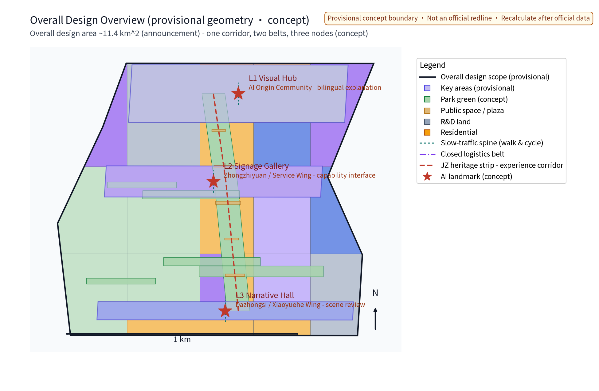
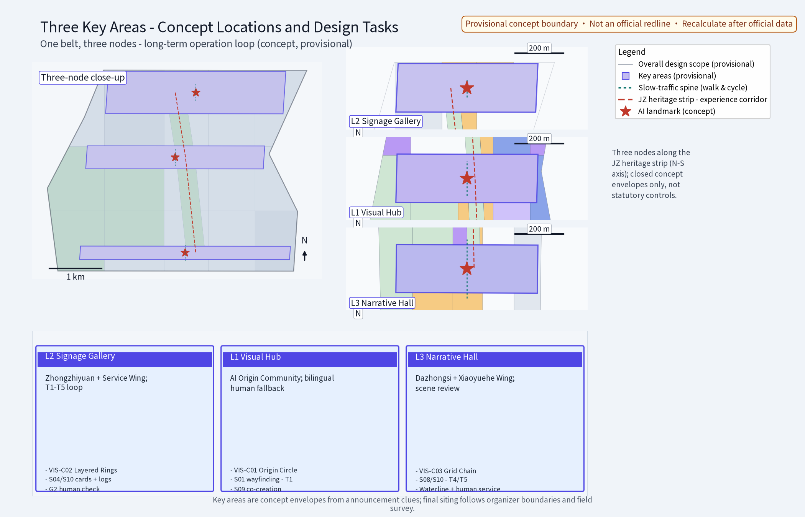
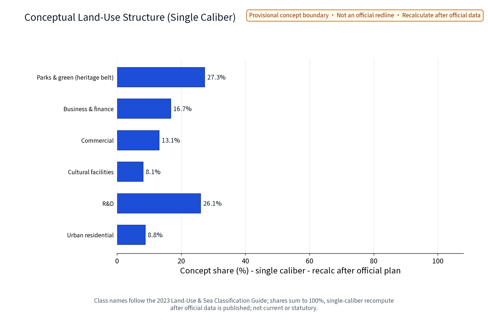
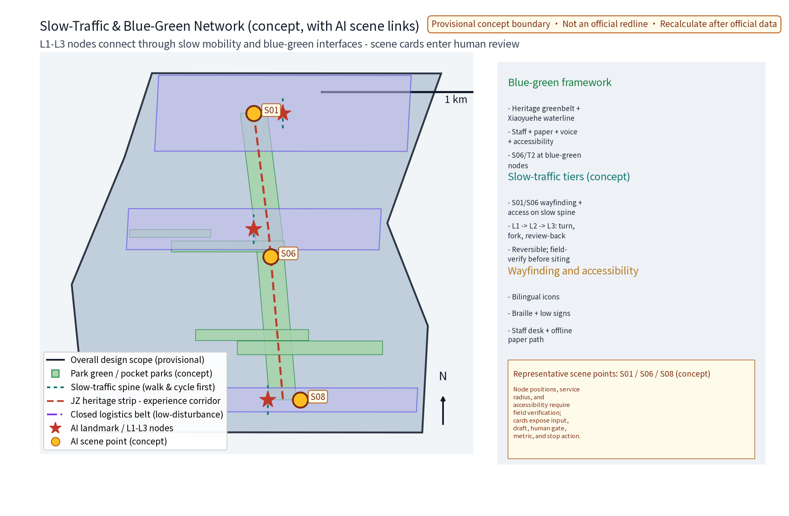
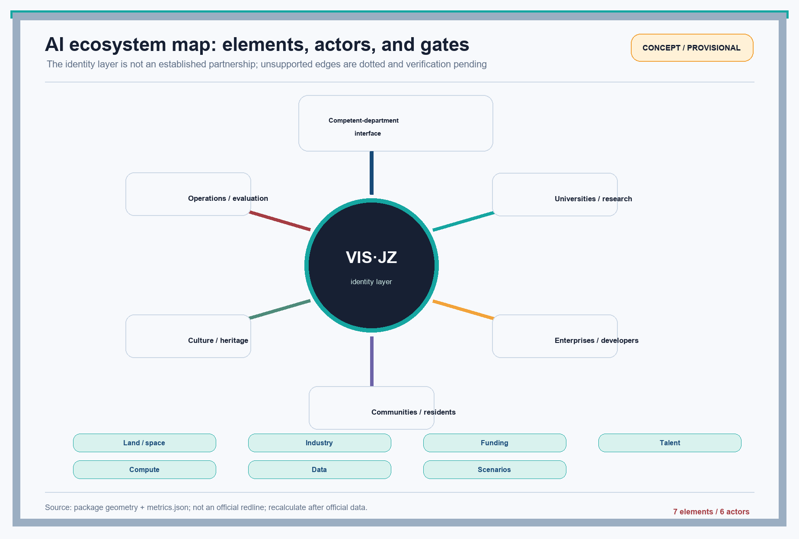
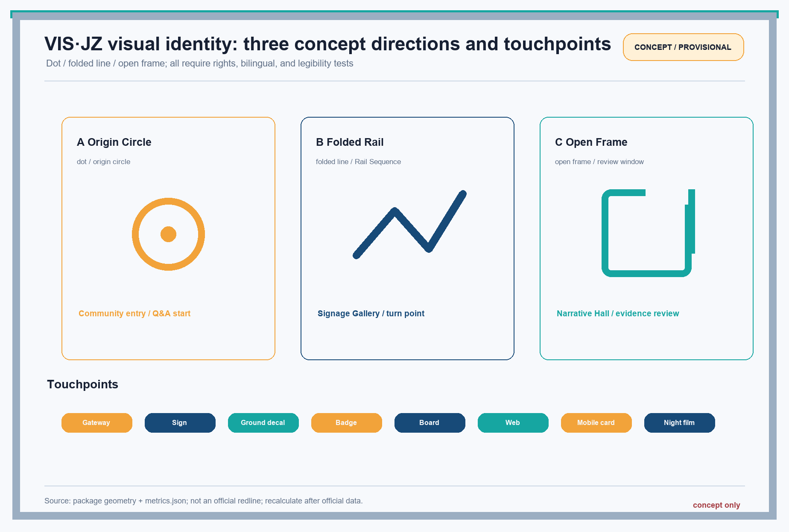

> Position: this is a concept advisory for the Visual Identity System Specialism. It gives no FAR, building-height, statutory-redline, retain/renovate/demolish, engineering, approval, or investment conclusion. VIS·JZ, node names, and mechanism names are unresolved working codenames and must not be treated as registration or an external promise before prior-rights clearance. Space, metrics, and cases are used only at their stated evidence level; no individual-identification, privacy, or classified material is included. [source:DATA-SRC-AGENT-TASKBOOK-20260518] [source:DATA-SRC-TRADEMARK-STATUS-20260820]

## Design Basis and Source List

The working basis has four classes: the taskbook and public announcement; public standards and laws; public web cases; and participant-produced provisional geometry, metrics, and concept graphics. sources.json is the item-level rights and provenance ledger: each item records publisher, URL or local path, publication date, access date, permitted use, prohibited use, and review status. When a webpage has no displayed publication date, published_date is null; the access date is never substituted. Unverifiable names, numbers, or cases are labelled as verification pending/research hypotheses and are not presented as facts or commitments. [source:DATA-SRC-OFFICIAL-ANNOUNCEMENT-20260509] [source:DATA-SRC-AGENT-TASKBOOK-20260518] [source:DATA-SRC-MOHURD-URBAN-DESIGN-MEASURES]

Regulatory-plan depth, land-use classification, generative-AI service, and accessibility provenance remain itemised in sources.json and are used only for the stated design boundary and validation action. [source:DATA-SRC-MOHURD-CONTROL-DETAILED-PLANNING] [source:DATA-SRC-MNR-LAND-USE-CLASSIFICATION-202311] [source:DATA-SRC-GENERATIVE-AI-INTERIM-MEASURES]

### Formal task ID — specialism chapter — required outputs — figure/metric crosswalk

The table preserves the taskbook's formal IDs and titles. The specialism chapters are this package's visual-identity entry points; they do not rename or replace the formal tasks. The four potentially ambiguous IDs are locked to a formal title, a chapter, and verifiable evidence.

| Formal task ID (taskbook title) | Specialism chapter | Required outputs | Figure/metric evidence |
|---|---|---|---|
| agent.1 Overall concept and functional coordination design | A Overall concept and VIS·JZ identity translation | Overall narrative, naming/logo direction, Three Areas Two Wings loop, structure, matrix entry | `site-overview.en.png`, `logo-vis-jz.en.png`; three positions/five functions |
| agent.2 Full-stack AI self-innovation and world-class AI ecosystem design | B AI ecosystem and eight-element interfaces | Six public cases, ecosystem map, industry-space mapping, sources and metrics | `ecosystem-map.en.png`; `global_case_count=6`; eight-element matrix |
| agent.3 AI+ scenario empowerment and intelligent AI vitality-city design | C Scenario cards and industry tests | At least 10 cards, at least 3 test scenarios, five roles, scenario-space-operation matrix, human/privacy boundary | S01-S12; T1-T5; `scenario_card_count=12`, `industry_test_scenario_count=5` |
| agent.4 AI public space, intelligent-native new formats and pilgrimage landmarks | D Public space, landmarks and components | Jing-Zhang heritage-park public space, east-west/north-south strategy, Dazhongsi scenes, at least 3 landmarks, honour and component system | `key-areas.en.png`; L1-L3, 3 landmarks, VIS-C01-C06 |
| agent.5 Centennial Jing-Zhang, Zhongguancun and AI-new-culture narrative integration | E Cultural narrative and communication | Jing-Zhang/Zhongguancun/AI narrative, signage symbols, international copy | `logo-vis-jz.en.png`; bilingual terms and Narrative Hall |
| agent.6 Global AI innovation activities and long-term operation | F Annual activities and long-term operation | Annual activities, brand/communication, developer community, open scenarios, conversion path | `annual_program_count=4`; AP01-AP04 table, phases A-C/G1-G3 |

This is the only explanation of agent IDs in the body. A-F are specialism chapter codes, not alternative formal task titles.

### Taskbook translation

The three positioning statements are the Centennial Jing-Zhang Cultural Belt, the Urban AI Life-Experience Belt, and the AI Integration Innovation Belt. The five functions are a full-stack AI self-innovation system, a world-class AI innovation ecosystem, an AI+ scenario-empowerment paradigm, an intelligent AI vitality city, and global discourse power in AI governance. This specialism translates those statements into identity, public wayfinding, scenario interfaces, and public evaluation; it does not claim that an industrial, planning, or governance outcome has already been achieved. The machine-readable coverage is recorded in standard_matrix.json and compliance_matrix.json.

### Original visual mechanisms

1. Visual Hub - Signage Gallery - Narrative Hall: the Visual Hub is the visible brand entrance and information overview; the Signage Gallery turns movement, railway memory, and AI scenarios into a walkable sequence; the Narrative Hall exposes sources, test results, and resident feedback as a reviewable story.
2. Rail Sequence: every sign follows start - transfer or fork - destination - review-back. Chinese meaning and English function copy keep equivalent positions; no real railway signal or protected mark is copied.
3. Reversible Component Library: modular gateways, ground decals, removable boards, night bands, web cards, and QR placeholders use bolts, clips, or configuration switches so a failed test can be withdrawn, replaced, or reused.

## Three-Level Scope Framework

The three levels are the coordinated research area, the overall design area, and the detailed-design key areas. They are work levels, not administrative or statutory boundaries; polygons in geometry/ exist only for recalculation and reading. [source:DATA-SRC-PROVISIONAL-BOUNDARIES-20260605] [data:PACKAGE-GEOMETRY] [depth:three_level_scope_framework]

| Level | Package work caliber | Concept area/status | Specialism output | Recalculation trigger |
|---|---|---:|---|---|
| Coordinated research area | Industry, culture, external coordination, and future-city direction | About 43.6 km²; provisional | Ecosystem map, narrative grammar, case study, external interfaces | Verified official extent, industry register, and historical material |
| Overall design area | Urban-renewal and regulatory-plan-depth identity skeleton, slow mobility/blue-green narrative, operations | 11,412,825.386 m²; provisional geometry | System rules, wayfinding skeleton, metric caliber, phase gates | Official controls, rights, and facility data |
| Detailed-design key areas | Brand placement, physical/digital components, pilot tests, and public feedback for three nodes | About 368.4 ha; provisional | Visual Hub, Signage Gallery, Narrative Hall, scenario-card prototypes | Property, transport, municipal, accessibility, and safety review |

### Three-level progression

The research level answers who the belt communicates with; the overall level answers how people identify and turn across a larger area; the key-area level answers how a gateway, page, or card is used, measured, and withdrawn. No level treats a provisional area as an approval condition. The core values are recalculable from metrics.json; green and public-space values remain low confidence because layer caliber and official material are incomplete. [metric:site_area_sqm] [metric:green_ratio] [metric:public_space_ratio]

## Coordinated Research Area: Industry and Future City Research

### Three Areas, Two Wings: internal taskbook structure

The table describes only the five internal work units. Names and spatial carriers require official material, property coordination, and professional review before placement; they must not be conflated with the external coordination network.

| Internal unit | Role and identity theme | Industry/life interface | Visual translation | Collaboration |
|---|---|---|---|---|
| AI Origin Community | Beijing AI Origin Community; community life, learning, public explanation | Residents, youth, volunteers, public-service explanation | Origin circle, bilingual Q&A cards, human fallback | Sends questions and talent to Zhongzhiyuan; opens life scenarios to Xiaoyuehe |
| Zhongzhiyuan AI Self-Innovation Acceleration Area | Full-stack innovation trial and acceleration | Models, compute, data governance, application developers | Layered rings, version number, test-status light | Receives origin questions; sends verifiable products to Dazhongsi; receives service-wing support |
| Dazhongsi AI Industry Cluster | Enterprise, consumer, and business-facing cluster | Enterprise service, business reception, consumer experience | Grid-chain address plates and service-status labels | Aggregates supply and demand; turns pilots into scenario orders without promising investment |
| Zhongguancun Technology Service Wing | Outward research, capital, technical-service, and developer connector | Universities, research, IP, developer community | Side arrow, capability catalogue | Horizontally connects Zhongzhiyuan and Dazhongsi; publishes tests and resource limits |
| Xiaoyuehe Scenario Empowerment Wing | Life, ecology, and public-space scenario carrier | Residents, visitors, accessibility users, public operations | Continuous water-line band and scenario-card entry | Brings origin questions and park capability into daily scenes and feeds back to the operating desk |

### External coordination: separate from the internal structure

The external network is a coordination and communication boundary, not a replacement for the five internal units: Beiwei Community, Future Science City, Huairou Science City, E-Town, and Jing-Jin-Ji. Possible exchanges include case learning, developer co-testing, talent exchange, or scenario interoperability, but each requires a named party, written authorization, public data caliber, and exit condition. This package invents no external partnership commitment. [source:DATA-SRC-AGENT-TASKBOOK-20260518] [depth:overall_spatial_structure]

### Specialism chapter A: visual identity system (formal agent.1)

agent.1 delivers a reversible specification rather than a slogan. The mark has three concept directions - dot, folded line, and open frame - all locked to VIS·JZ. The recommended palette is Jing-Zhang Blue #174A78, Origin Teal #16A6A1, Wing Orange #F2A33A, Ink #172033, and Paper #F7F9FC. Both Chinese and English surfaces use the evidenced Noto Sans SC subset; no Arial font file or system font is required. The artifact URL, exact version, SHA-256, OFL text, subset method, and naming record are in sources.json and copyright_statement.md. Pictograms use a 24 px grid, a 2 px base stroke, rounded terminals, and two-colour status layers. Rules cover gateways, signs, ground decals, badges, boards, web headers, mobile cards, data status, and reflective night film. The three directions remain concept options until rights and legibility tests pass.

### Specialism chapter B: space-element-operation matrix (formal agent.2)

agent.2 is not a partner cloud. It assigns every element an applicable unit, spatial carrier, open-interface fields, human gate, and auditable indicator. No authorized compute, funding, enterprise register, or dataset is claimed here; the interfaces below are verification-pending catalogue fields and concept workflows, not an operating platform. The five internal units remain distinct: Origin Community handles life questions and explanation; Zhongzhiyuan handles full-stack capability samples; Dazhongsi handles enterprise/consumer validation; the Technology Service Wing handles outward service catalogues; and the Xiaoyuehe Wing carries everyday and ecological scenarios.

| Element space | Applicable internal unit/wing and spatial carrier | Input and source level | AI / non-AI capability | Open interface (concept catalogue fields) | Owner | Validation indicator | Human gate | Stop condition |
|---|---|---|---|---|---|---|---|
| Land and space | Overall area; three-node carriers pending | Provisional geometry; official controls pending | AI layer retrieval/version comparison; non-AI professional reading | `scope_version`, `layer_id`, `evidence_url`, `status` | Planning interface and design lead | Traceable boundary versions; 100% of conflicts labelled | Professional planner confirmation | Missing material or boundary dispute returns to research |
| Industry | Zhongzhiyuan (capability sample), Dazhongsi (enterprise/consumer validation) | Public enterprise/research list; source ledger | AI relationship clustering/draft catalogue; non-AI interview check | `capability_id`, `publisher`, `permission`, `expiry` | Industry operations and compliance | Every capability has a source; manual sample target >=90% | Operations/legal approval to publish | Unknown source, conflict, or unexplained output is deleted |
| Funding | Technology Service Wing (policy/service catalogue) | Public policy and authorized project material; unawarded status unknown | AI eligibility summary; non-AI finance review | `policy_id`, `eligibility`, `source`, `not_a_commitment` | Funding interface and finance | Conditions link back to source; no award forecast | Finance/competent-department review | Non-public finance input or implied commitment |
| Talent | Origin Community (explanation), Zhongzhiyuan (developer/mentor), both wings (operations) | Public events and voluntary registration summaries; no personal profiling | AI role-match suggestion; non-AI human mentor and opt-out | `role`, `opt_in`, `mentor`, `delete_date` | Community operations and human mentor | Opt-out available; completion/feedback auditable | Human mentor confirmation | Individual identification, inferred traits, or sensitive data |
| Compute | Zhongzhiyuan (sample), Technology Service Wing (resource catalogue) | Public resource catalogue and test quota; actual capacity unknown | AI queue/use display; non-AI security release | `quota`, `data_class`, `access_scope`, `audit_log` | Technical operations and security | Auditable usage; no unauthorized data | Technical lead release | Resource, permission, or security condition unmet |
| Data | Origin Community (feedback explanation), Xiaoyuehe Wing (scenario feedback) | Anonymous aggregates and public geography; no personal data | AI theme grouping/quality warning; non-AI privacy review | `source`, `aggregation`, `retention`, `appeal` | Data steward and privacy lead | No individual trajectory; source and deletion date complete | Privacy/ethics review | Re-identification, sensitive inference, or unknown source |
| Scenarios | Xiaoyuehe (daily carrier), Dazhongsi (consumer/enterprise), external coordination (authorized access only) | Scenario cards, test logs, resident feedback; external input status unknown | AI candidate generation/metric comparison; non-AI human service | `scenario_id`, `baseline`, `threshold`, `stop_action` | Scenario owner and resident representative | Each card has baseline, threshold, and exit action | Scenario review decides continuation | Threshold fails twice or public rejection |

The matrix turns ecosystem language into inputs, spatial carriers, dual AI/non-AI capability, open-interface fields, owners, indicators, human gates, and stops. An interface becomes public only when source, authorization, version, and withdrawal method are complete. It promises no compute, funding, investment, talent, or approval outcome. [depth:existing_conditions_diagnosis] [depth:development_intensity_controls]

### Specialism chapter C: ecosystem cases and industry validation (scenario evidence for formal agent.3; cases support agent.2)

Six traceable public cases are retained, all reference-only; no logo, page asset, or endorsement is copied or implied: Transport for London Roundel (visual anchor/multi-touchpoint), Legible NYC (walking-wayfinding validation), Tokyo Metro (multilingual transfer grammar), Punggol Digital District (space-operation interface), Kendall Square (public innovation-ecosystem interface), and Waterfront Toronto Quayside (public review and exit gates). Each case contributes one transferable mechanism to T1/T2/T3, the agent.2 interface fields, or agent.6 public review. sources.json records each official entry point, the treatment of an undisplayed publication date, access date, and reuse boundary. The five local protocols are below; case publicity is not local evidence.

## Overall Design Area: Urban Renewal and Regulatory-Plan-Level Urban Design

### Visual identity is not a statutory-plan substitute

The overall concept proposes only a testable relationship among identity, space, and operations. Within the provisional overall area, layer IDs, colour bands, node codes, and version records connect cultural narrative, slow mobility, blue-green space, public services, and AI scenarios. Land use, building scale, transport, municipal systems, ownership, fire safety, approvals, and engineering require separate professional material; this package outputs no statutory intensity, height, road redline, or approval conclusion. [standard:MOHURD-URBAN-DESIGN-MEASURES] [standard:MOHURD-CONTROL-DETAILED-PLANNING]

### Visible interfaces for three positions and five functions

| Taskbook content | Identity interface | Verifiable evidence | Promise withheld |
|---|---|---|---|
| Centennial Jing-Zhang Cultural Belt | Rail Sequence, heritage narrative points, timeline cards | Public historical sources, wayfinding tests, authorized oral history | No unverified history or copied railway mark |
| Urban AI Life-Experience Belt | Xiaoyuehe scenario cards, human-service point, bilingual wayfinding | Input/output/stop records for 12 cards | No individual trajectory or guaranteed experience |
| AI Integration Innovation Belt | Zhongzhiyuan - Technology Service Wing - Dazhongsi service chain | Ecosystem map, open interface catalogue, tests | No claim of delivered investment, compute, funding, or policy |
| Full-stack AI self-innovation system | Model/compute/data/application capability tags | agent.2 matrix and service catalogue | No backing for unauthorized training or transfer |
| World-class AI innovation ecosystem | Developer community, case learning, bilingual communication | Activity record and public indicators | “World-class” remains an aspiration, not a result |
| AI+ scenario-empowerment paradigm | Scenario cards and pilot protocols | T1-T5 logs and failure actions | Concept prototypes are not deployments |
| Intelligent AI vitality city | Low-barrier information, public feedback, reversible components | Legibility, accessibility, and satisfaction tests | No replacement of public-service responsibility |
| Global discourse power in AI governance | Three governance rules, public review, exit gates | Governance record and review form | No claim of international recognition or authority |

### Identity skeleton and three nodes

The three nodes are internal visual anchors, not statutory projects: L1 Visual Hub (public explanation entry for AI Origin Community), L2 Signage Gallery (capability connector for Zhongzhiyuan and the Technology Service Wing), and L3 Narrative Hall (scenario review for Dazhongsi and Xiaoyuehe). They are joined by a concept axis for east-west narrative stitching and north-south through-connection. At least three AI display landmarks are tied to internal units: the L1 Origin Circle entry for bilingual explanation and human service; the L2 Layered Rings timeline at Zhongzhiyuan, opened to the Technology Service Wing for capability cards and test status; and the L3 Grid Chain review wall at Dazhongsi, linked to the Xiaoyuehe Wing for enterprise service, consumer wayfinding, and anonymous feedback. Each carries source, version, test status, human contact, and withdrawal method. Spatial placement remains a concept carrier; final siting is unknown/to_verify. [data:geometry/key_areas.geojson] [depth:overall_spatial_structure]

## Detailed Design of Key Areas

### Specialism chapter D: physical and digital applications (public-space, landmark and component evidence for formal agent.4)

| Component | Physical application | Digital application | Status and withdrawal |
|---|---|---|---|
| Origin Circle | Gateway, ground decal, volunteer badge | Home entry and Q&A card start | VIS-C01; clip removal and page rollback |
| Layered Rings | Industry capability plate and test board | Capability catalogue and API/data-permission card | VIS-C02; grey-out if rights or test fails |
| Grid Chain | Dazhongsi enterprise/consumer wayfinding and intelligent-native consumer service plate | Service appointment, developer task card, and service-list backlink | VIS-C03; no unconfirmed enterprise or investment information; does not replace a transaction or approval |
| Service Wing Arrow | Technology Service Wing sign and open-day guide | Developer community and resource interface | VIS-C04; external names only with authorization |
| Water-line Wing | Xiaoyuehe slow-mobility sign and reflective band | Scenario map and accessible-route hint | VIS-C05; adjust after light and glare test |
| Version Ring | Test-status plate and review wall | Changelog and feedback loop | VIS-C06; failed versions are marked and withdrawn |

### Honour display and reversible component library

The honour display shows only verified awards, public cooperation/test records, or contribution entries; selection, nomination, and concept demonstration are not rewritten as awards. Each record has subject, issuer, date, public_url, evidence_status, attribution, and expiry. Pending records show verification pending; records without a complete source are hidden. The C01-C06 library retains material, dimension, accessibility, installation, maintainer, version, removal action, and cost-pending fields and prioritises removable, replaceable, reusable parts. Agent.4 binds the three landmarks to three distinct internal roles: explanation and human fallback at Origin Community; capability and interfaces at Zhongzhiyuan/Technology Service Wing; enterprise-consumer and daily scenarios at Dazhongsi/Xiaoyuehe. Without authorization or a site check, a binding remains a paper sample only.

### agent.5: cultural narrative and bilingual communication

The Chinese voice is translated as “From railway memory to testable AI in everyday life.” The three node function names are Visual Hub, Signage Gallery, and Narrative Hall. The internal units use the fixed English names AI Origin Community, Zhongzhiyuan AI Self-Innovation Acceleration Area, Dazhongsi AI Industry Cluster, Zhongguancun Technology Service Wing, and Xiaoyuehe Scenario Empowerment Wing. English pages and figure files contain no functional Chinese; VIS·JZ remains only as an unresolved Latin-letter working code.

The communication chain is public material -> concept card -> bilingual sample -> community reading -> blind/legibility test -> public review -> retain or withdraw version. “World-class” is not translated into an achieved claim; English uses aspiration or reference only where appropriate. [source:CASE-TOKYO-METRO] [source:CASE-LEGIBLE-NYC]

### 12 AI scenario cards

Each card has an owner, input, output, validation, and stop condition. These are proposed test definitions with no operating result yet, and no card accepts individual-identification fields.

| ID / card | User and place | Input | AI work | Output/interaction | Owner | Indicator | Stop |
|---|---|---|---|---|---|---|---|
| S01 Origin Wayfinding | Residents/visitors; Origin Circle | Public node layers, accessibility rules | Generate bilingual route candidates | Paper and web route | Community ops | Task completion >=90% | Two misleading rounds or no human review |
| S02 Rail Timeline | Students; Signage Gallery | Verified history entries | Summarise with source | Timeline card/board | Culture editor | Source backlink 100% | Missing source |
| S03 Scenario Translation | International visitors; Visual Hub | Bilingual terminology | Generate equal-length draft | Bilingual labels | Communications | Zero functional Chinese; term sample >=95% | One untranslated item goes offline |
| S04 Developer Capability | Developers; Technology Service Wing | Public capability/interface catalogue | Match task to resource | Capability/API status card | Technical ops | Field completeness 100% | Unknown permission or source |
| S05 Data Review | Residents; Narrative Hall | Anonymous aggregate feedback | Group themes and confidence | Public review board | Data steward | Traceable items >=95% | Re-identification or sensitive inference |
| S06 Xiaoyuehe Mobility | Older/accessibility users; Xiaoyuehe | Public network, human site check | Draft slope/obstacle hint | Paper card and human point | Accessibility lead | Site route check 100% | Site differs from layer |
| S07 Night Identity | Night walkers; Signage Gallery | Colour, light, glare records | Compare colour bands | Night component sample | Visual lead | Self-set legibility target | Glare or safety risk remains |
| S08 Enterprise Navigation | Business visitors; Dazhongsi | Public service list | Draft service path | Sign and web page | Enterprise owner | Information accuracy >=95% | Stale or untraceable list |
| S09 Community Co-design | Residents/volunteers; Origin Community | Voluntary anonymous themes | Cluster and draft card | Co-design wall/poll | Community ops | Explainable themes >=90% | Personal profiling or abuse |
| S10 Pilot Log Review | Pilot team; Zhongzhiyuan | De-identified T1-T5 logs | Find failure patterns | Version review page | Pilot owner | Action item in every review | Missing or unauditable log |
| S11 Component Ledger | Operators; three nodes | C01-C06 inventory and rights | Recommend reversible part | Loan/return record | Asset admin | Return record 100% | Asset, right, or maintainer unknown |
| S12 External Case Compare | Researchers/developers; Service Wing | Six public case entries | Form transferable hypothesis | Case card/workshop | Research lead | URL and limitation on every card | Page unavailable or unverifiable |

## AI Innovation Ecosystem, Personas, and AI+ Scenarios

### Role-based personas, not personal profiling

Five working roles are used without prediction about individuals: community explainer, full-stack developer, scenario operator, culture editor, and accessibility/ethics reviewer. They translate AI for residents, build model/compute/data/application services, turn needs into tests, verify history and bilingual copy, and check accessibility, privacy, and human fallback. Participation can be anonymous and withdrawn; faces, trajectories, contact details, and sensitive attributes are not retained. [standard:DATA-SRC-BARRIER-FREE-ENVIRONMENT-LAW]

### AI ecosystem map

The map centres on the VIS·JZ concept identity layer and connects six supply/user classes: competent-department interface, universities/research, enterprises/developers, communities/residents, culture/heritage, and operations/third-party evaluation. Seven element spaces are land/space, industry, funding, talent, compute, data, and scenarios. Every edge must show source, owner, interface, metric, gate, and stop in a public catalogue or authorized record. An unsupported edge is drawn as a dotted verification-pending edge, never as an established partnership. The corresponding files are assets/figures/ecosystem-map.en.png and ecosystem-map.png. [depth:stakeholder_governance] [source:DATA-SRC-AGENT-TASKBOOK-20260518]

### agent.6: developer community, open scenarios, and conversion chain

The developer community has four layers: a public issue pool that accepts anonymous themes only; an interface catalogue with capability and limits; a small-sample workshop for reversible components and bilingual figures; and evaluation/review with public baseline, result, and failure action. Scenario opening follows issue card -> eligibility/ethics screen -> sandbox sample -> three-party test -> public review -> adopt, revise, or exit. An application without authorization, baseline, or exit condition does not enter. External coordination joins only through public nodes in this chain and does not change the internal division.

### Five executable industry test protocols

### Four-activity annual programme (the single activity source for metrics.json)

The table expands `annual_program_count=4`. All four brands, frequencies, and nodes are concept proposals, not confirmed arrangements. Owners are proposed RACI roles; venues, resources, and external parties remain `unknown/to_verify` until written confirmation.

| Activity brand | Frequency | Target users | Spatial node | RACI / owner | Resource prerequisites | Bilingual touchpoints | Privacy / accessibility boundary | KPI | Stage gate | Cancellation / exit |
|---|---|---|---|---|---|---|---|---|---|---|
| AP01 VIS·JZ Open Systems Day | Once per year; date pending | Residents, youth, developers, visitors | L1 Visual Hub; AI Origin Community | R community operations; A annual-operations owner; C accessibility/legal; I public | Written venue permission, paper cards, staffed service, bilingual editing; budget and host pending | L1 bilingual wayfinding, offline paper card, web index, public review-back | No identity or trajectory collection; paper/staffed entry; wheelchair, child and older-user check | >=90% wayfinding task completion; one public review-back | G1: rights, notice, accessibility and T1/T4 plan complete | Any missing permission, staff fallback, or access condition; withdraw AP01 and retain reason |
| AP02 Waterline Mobility Week | Once per year; season pending | Older people, accessibility users, families, night walkers | L2 Signage Gallery to Xiaoyuehe Wing; exact route pending | R scenario owner; A accessibility lead; C community/safety; I public review | Human site walk, light/obstacle baseline, paper alternative route; data and venue pending | Waterline bilingual node signs, large-print/audio card, web route note | Anonymous aggregates of error types only; human route check; no camera or location tracking | T1 completion >=90%; T2 contrast target; zero glare complaints in 10 readings | G2: site permission and professional fire/traffic/accessibility review plus T1/T2 | Route mismatch, glare, safety or obstacle risk unresolved; withdraw components and return to staff service |
| AP03 Three-Node Quarterly Review | Four times per year; quarter-end | Operators, design/planning professionals, community representatives, developers | L1/L2/L3 narrative review; online/offline venue pending | R data steward; A operations/compliance owner; C visual, culture, ethics; I public | Anonymous logs, version wall, public sources, human chair; interfaces and staffing pending | Bilingual changelog, Narrative Hall review page, public summary | Anonymous aggregates and source levels only; captions, large print and paper; no personal case display | 100% versions have source/gate/exit records; >=95% items backlinkable | G1: source, retention/deletion date, human review and T4 scan pass | Source failure, sensitive inference, or unexplained output; delete related item and pause release |
| AP04 Rail-to-AI Narrative Festival | Once per year; theme pending | Students, cultural participants, international visitors, residents | L3 Narrative Hall; Dazhongsi/Xiaoyuehe carrier pending | R culture editor; A communications owner; C history review/community/legal; I developers | Verified history entries, authorized narrative, bilingual layout, human guide; tenure and partners pending | Timeline cards, bilingual landmark notes, downloadable transcript, staffed interpretation | No unlicensed portrait, mark, or paper image; captions, large print and quiet hours; no face/voice biometrics | 100% historical entries backlinkable; T3 icon comprehension >=80% | G3: history/rights/accessibility review, T3/T4 pass, and withdrawal drill complete | Insufficient history evidence or permission, misleading risk, or public rejection; remove item and return to research |

All four activities share one log schema: `activity_id`, version, date, node, RACI, resource status, notice/consent, anonymous count, KPI, gate, human decision, cancellation reason, next review, and deletion date. No result data is claimed for an activity that has not occurred; every KPI is a proposed validation target.

| Protocol | Object/sample | Baseline | Formula and threshold, all self-set targets | Log and RACI | Frequency and failure action |
|---|---|---|---|---|---|
| T1 Bilingual wayfinding | Stratified blind test of 24 people, including older and accessibility users | Existing text card without unified identity | Completion = completed tasks/valid sample; pass target >=90%, median direction time <=8 s | Version, start/end, time, errors, human prompts; R visual lead, A scenario owner, C community/accessibility, I public review | Every version; 80-89% returns to type/arrow revision, <80% withdraws |
| T2 Colour and night legibility | Six colour-band samples, 10 daytime and 10 night readings each | Ink-on-paper combination | Contrast = (Lmax+0.05)/(Lmin+0.05); normal-text target >=4.5:1, night glare complaints <=0/10 readings | Colour, light, distance, device, reading, complaint; R visual, A operations, C safety/accessibility, I review | Before/after sample install; any failed batch changes colour or stops |
| T3 Pictogram comprehension | 30 people, 12 icons, 5-second limit each | Text-only explanation card | Correct = correct interpretations/valid answers; target >=80%, concentrated misunderstandings <=2 | Icon version, question, answer, error, interview; R icon design, A visual, C culture/community, I engineering | First and revised version; delete or add text |
| T4 English-page completeness | 20 page tasks plus automatic character scan | Mixed-language page | Functional Chinese character count in English page = 0; bilingual task completion target >=90% | URL, local file, scan, screenshot, version; R communications, A editor, C translation/legal, I public | Before each export/merge; any residue returns to export |
| T5 Component withdrawal and receipt | Three C01-C06 prototypes, three removals, five simulated issues | Fixed non-removable mock-up record | Withdrawal success = completed removals/planned removals; target 100%; a 48-hour receipt is a self-set service target, not a statutory deadline | Asset, authorization, installer, time, receipt, stop reason; R asset admin, A operations, C legal/safety, I community | Monthly or after event; stop component, take human control, review |

### Unified log template

test_id, version, date, site_unit, sample_rule, baseline, input_source, operator, consent_or_public_notice, raw_count, formula, threshold, result, uncertainty, human_decision, action, next_review, retention_and_delete_date. Logs keep anonymous aggregates only and do not record identification data; a test target is not an existing performance.

## Land Use, Building Scale, and Retain-Renovate-Demolish Strategy

This specialism defines how identity reads land-use and renewal information; it does not replace statutory planning, architecture, fire, or engineering judgement. Land-use polygons and metrics.json values are recalculable from provisional geometry. Building scale, ownership, and retain/renovate/demolish status remain verification pending when no traceable official source exists. [standard:MNR-LAND-USE-CLASSIFICATION-GUIDE] [data:geometry/land_use.geojson]

### Three area calibers

1. Caliber A is the overall design polygon: 11,412,825.386 m², recomputed from package geometry, confidence medium.
2. Caliber B aggregates green/public-space layers: green_ratio = 0.110044, displayed as 11.0%; public_space_ratio = 0.003167, displayed as 0.3%. Both are low confidence and are not statutory green ratios or public-service standards.
3. Caliber C aggregates the land-use theme: park/public green share is 27.31% of the land-use layer, displayed as 27.3%. It is a package-layer share, not an overall-area green ratio.

Building footprint, building volume, ownership, and site-specific retain/renovate/demolish lists have no traceable official basis in this package and remain unknown. The concept recommendation is reversible components, low-intervention identity, test before extension; it makes no parcel conclusion.

## Transport, Rail, Municipal Infrastructure, and Public Services

Transport identity follows stop / turn / arrive / review-back and does not draw a concept slow route as a built road. The mobility-bluegreen sheet shows only the provisional participation axis, blue-green narrative line, three nodes, and a 1 km schematic scale; roads, rail, pipes, fire, accessibility, and public-service facilities require professional source material. [data:geometry/roads.geojson] [standard:MOHURD-CONTROL-DETAILED-PLANNING]

### Identity and service rules

- Rail/road entries use public, verifiable stops and a human direction check. Unknown entries are marked verification pending, not drawn as promised exits.
- Web, board, and physical sign surfaces show human fallback, update time, accountable interface, and complaint/suggestion entry. Service venues covered by accessibility law require separate applicability review; no generalisation is made. [source:DATA-SRC-BARRIER-FREE-ENVIRONMENT-LAW]
- A 48-hour receipt is this package's self-set operating target for T5; it is not a statutory deadline and not a departmental promise.
- Personal location, camera identification, and continuous trajectories are excluded. Only anonymous counts, error types, and public geography are used. [source:DATA-SRC-GENERATIVE-AI-INTERIM-MEASURES]

## Blue-Green Network, Public Space, and Urban Character

The blue-green identity layer is Jing-Zhang Blue - Xiaoyuehe Water Line - Origin Teal: blue means direction/memory, teal means ecology and everyday scenes, and orange is reserved for an action or warning. Colours do not imply land ownership or engineering rank. Public space uses the reversible C01-C06 set, each with removal, maintenance, replacement, and withdrawal actions. [data:geometry/green_space.geojson] [data:geometry/public_space.geojson] [depth:public_space_system]

### Character and legibility

Mark, Chinese, English, icons, numbers, and colour bands keep the same grammar across A0/A3, web, mobile cards, gateways, signs, ground decals, badges, and reflective night bands. Every spatial sheet has a north arrow, schematic scale, provisional warning, legend, data caliber, and version/source note. English figures and HTML contain English functional text only. Colour and font are test subjects; a simulated sample is not an installed facility.

## Renewal Projects, Implementation Policy, and Phasing

### Project list

| Project | Content | Lead / collaborators | Gate | Exit/recovery |
|---|---|---|---|---|
| P01 Identity sample | Mark, palette, type, icons, bilingual glossary | Visual lead / legal, community | G1 rights + T2/T3 | Rights or legibility failure returns to another direction |
| P02 Three-node component pilot | Three samples selected from C01-C06 | Operations / accessibility, safety | G2 site check + T1/T5 | Glare, obstruction, or maintenance failure means removal |
| P03 Bilingual digital index | HTML, cards, source ledger, version review | Communications / technical, culture | G1 scan + T4 | Any functional Chinese or remote resource returns to export |
| P04 Developer sample workshop | Public issue pool, interface catalogue, sandbox evaluation | Technology Wing / Zhongzhiyuan, Dazhongsi | G3 T1-T5 review | No authorization/baseline/ethics gate, no entry |
| P05 Ecosystem and honour wall | Six cases, verification, reversible display | Research / legal, community | G1 URL/rights review | Broken source or weak evidence becomes pending or is removed |

### agent.6 phasing, RACI, and gates

Phase A (1-3 years, concept validation and limited samples): rights, glossary, C01-C06, and T1-T5 samples. G1 requires complete source, copyright, and privacy lists; exit is triggered by an unverifiable critical source, functional Chinese in the English page, or a rights infringement.

Phase B (3-5 years, limited pilot): only three reversible components and a developer sample under written authorization, human service, and safety conditions. G2 requires written site, property, accessibility, safety, and maintenance responsibility; exit is triggered by T1/T2/T5 failure, public rejection, data risk, or uncontrolled maintenance.

Phase C (5-10 years, public review and diffusion assessment): version the components that pass and retain failed versions and withdrawal records. G3 requires independent review, metric trend, and transparent budget/maintenance conditions; exit is triggered by two failed rounds, no human takeover, a dead source, or unauthorized external coordination. The schedule is a proposal, not an implementation promise.

### RACI

R = visual lead, scenario owner, asset administrator, culture editor, technical operations; A = operating or competent-department interface for the phase; C = community representative, accessibility/ethics, legal, planning/safety professionals; I = public-review readers, developer community, and external case contacts. Every card and protocol must state R/A/C/I or it does not pass the gate.

### Five KPIs

K1 bilingual wayfinding completion (T1); K2 component share meeting the self-set normal-text contrast target (T2); K3 icon comprehension (T3); K4 functional Chinese residue in English (T4, target 0); K5 reversible-component withdrawal success and anonymous receipt coverage (T5, targets 100%/100%). KPIs are concept-validation indicators, not departmental performance or statutory standards; lock sample, version, denominator, and deletion period before formal counting. [metric:scenario_card_count] [metric:industry_test_count]

## Metrics, Area Recalculation, and Compliance Matrix

### Machine-readable metrics

| Metric | metrics.json value | Display | Confidence/use |
|---|---:|---:|---|
| site_area_sqm | 11412825.386 | 11,412,825.386 m² | medium; geometry recomputation |
| green_space_area_sqm | 1255908.493 | 1,255,908.493 m² | low; layer aggregation |
| public_space_area_sqm | 36150 | 36,150 m² | low; layer aggregation |
| green_ratio | 0.110044 | 11.0% | low; not statutory green ratio |
| public_space_ratio | 0.003167 | 0.3% | low; not public-service standard |
| land_use_park_green_share | 0.2731 | 27.3% | medium; theme-layer caliber |
| scenario_card_count / industry_test_count | 12 / 5 | 12 / 5 | proposal-defined inventory |

The formulas are green_ratio = green_space_area_sqm / site_area_sqm and public_space_ratio = public_space_area_sqm / site_area_sqm; rounding is display-only. When official extent, layer class, ownership, or facility caliber changes, regenerate metrics, figures, HTML, PDFs, and manifest. [metric:site_area_sqm] [metric:green_ratio] [metric:public_space_ratio]

### Compliance and evidence matrices

standard_matrix.json covers the five required announcement, taskbook, urban-design, regulatory-plan-depth, and land-use-classification standards. design_depth_matrix.json covers existing-condition diagnosis, three levels, overall structure, land use, intensity boundaries, massing, transport, municipal systems, blue-green, public space, renewal list, phasing, metrics, AI scenarios, and operating governance. compliance_matrix.json maps each item to prose, figures, geometry, metrics, assumptions, and validation actions. These matrices are evidence indexes, not legal compliance opinions. [source:DATA-SRC-OFFICIAL-ANNOUNCEMENT-20260509] [standard:PROJECT-AGENT-OPEN-CALL-TASKBOOK]

## Risk, Copyright, and Compliance

### Three-line AI governance

Anonymous aggregates only; key decisions receive human review; no excessive monitoring and no individual-identification tracking. Generated content is labelled machine draft. Residents can request human explanation, correction, and withdrawal. Complaints follow applicable public procedures and law; no nonexistent numeric deadline is inferred from legal text. [source:DATA-SRC-GENERATIVE-AI-INTERIM-MEASURES]

### Risk ledger

| Risk | Prevention | Trigger | Response |
|---|---|---|---|
| Source/copyright | Item ledger; no copied case logo or page asset | Broken URL or missing permission | Label pending or delete, retaining a note |
| Trademark/prior rights | VIS·JZ, nodes, mechanisms remain working codenames | Search conflict | Stop external use, rename, update assets |
| Privacy/security | Anonymous aggregates, minimum fields, human fallback | Re-identification or sensitive inference | Stop, delete, ethics review |
| Accessibility/equity | Type, contrast, human service, blind testing | T1/T2/T3 below threshold | Return to design and fix access |
| Space/property dispute | All geometry marked provisional | Property, redline, engineering conflict | Do not place or install; return to research |
| Operations/technology | Reversible parts, version budget, exit gate | Maintenance or explanation failure | Stop, human takeover, public review |

### Copyright ledger summary

Participant-original prose, icon rules, colour drafts, layouts, and geometry are offered for community review under COMMUNITY-DISPLAY-ONLY; this is not trademark registration or third-party authorization. Public standards and laws are quoted as references and summaries, without copying restricted page assets. Six cases are reference-only narratives; source, URL, access date, null publication-date record, and prohibited use are in sources.json. A0/A3, PNG, and HTML graphics are produced in this package; Noto Sans SC family/version/path and local embedding basis are recorded, while the license text, system Latin terms, and external reuse remain unknown/to_verify. copyright_statement.md contains the complete rights statement. [source:DATA-SRC-TRADEMARK-STATUS-20260820]

## References

Reference priority is project announcement and taskbook; public national or ministry standards and laws; official public case pages; then participant provisional geometry and metrics. The cases below are traceable learning hypotheses, not proof of local performance:

| Case | Traceable source | Transferable hypothesis | Limit |
|---|---|---|---|
| Transport for London Roundel | sources.json: CASE-TFL-ROUNDEL | A unified mark can remain recognizable across transport touchpoints | Do not copy Roundel or imply endorsement |
| Legible NYC | sources.json: CASE-LEGIBLE-NYC | City wayfinding can be tested through walking tasks | Different institutions and street conditions |
| Tokyo Metro | sources.json: CASE-TOKYO-METRO | Multilingual transfer grammar must be equal-length and continuous | Do not copy icons; test locally |
| Punggol Digital District | sources.json: CASE-PUNGGOL-DIGITAL-DISTRICT | A digital district can join spatial and operational interfaces in one map | Broad official entry point; specific facts pending |
| Kendall Square | sources.json: CASE-KENDALL-SQUARE | Innovation ecosystems need public narrative and community interfaces | No inference about industry effect or partnership |
| Quayside / Waterfront Toronto | sources.json: CASE-QUAYSIDE-TORONTO | Public gates and exit conditions should precede scale commitments | Governance lesson only, not a local conclusion |

The package also references assets/figures/site-overview.en.png, land-use-structure.en.png, key-areas.en.png, mobility-bluegreen.en.png, metrics-evidence.en.png, ecosystem-map.en.png, and logo-vis-jz.en.png plus their Chinese counterparts. Every figure carries a provisional notice, a scale/legend or metric caliber, and a version/source note. [source:PACKAGE-GEOMETRY] [data:geometry/site_boundary.geojson]
