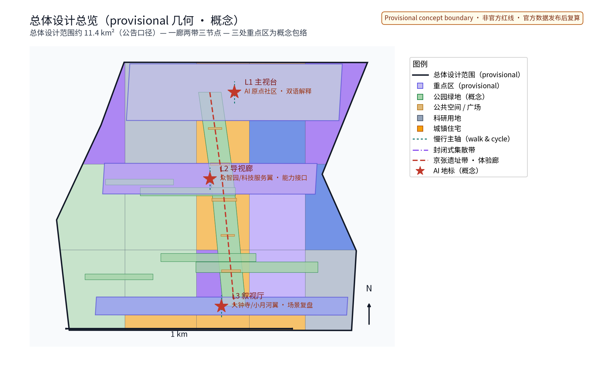
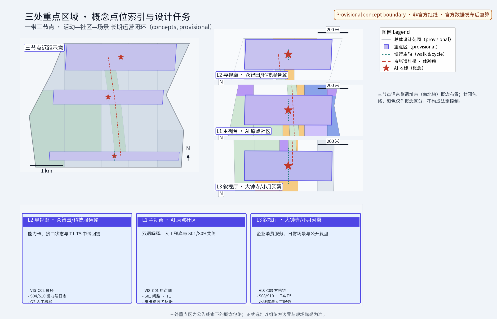
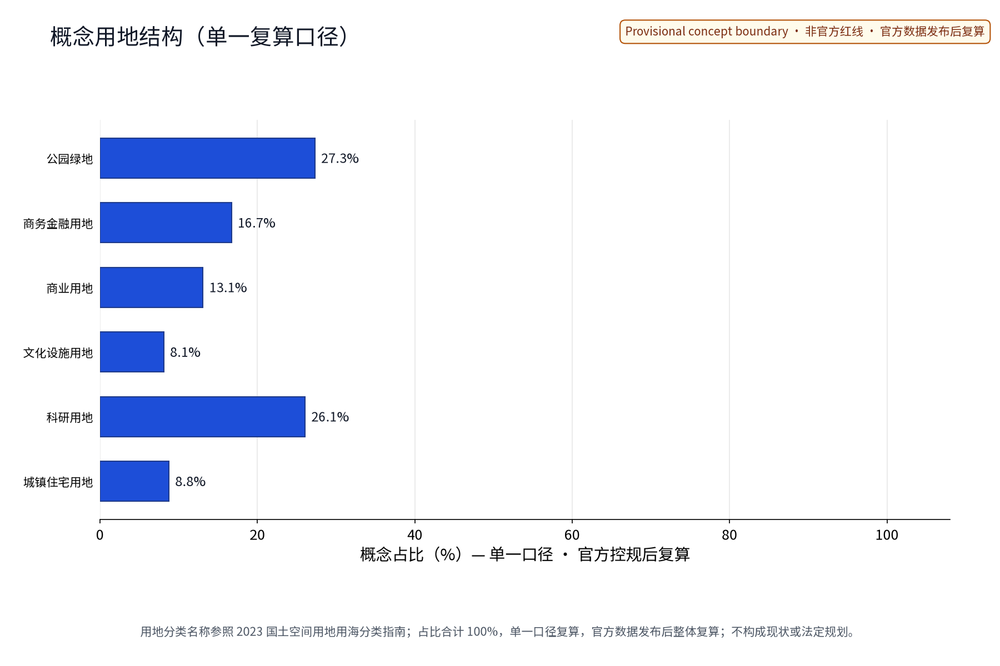
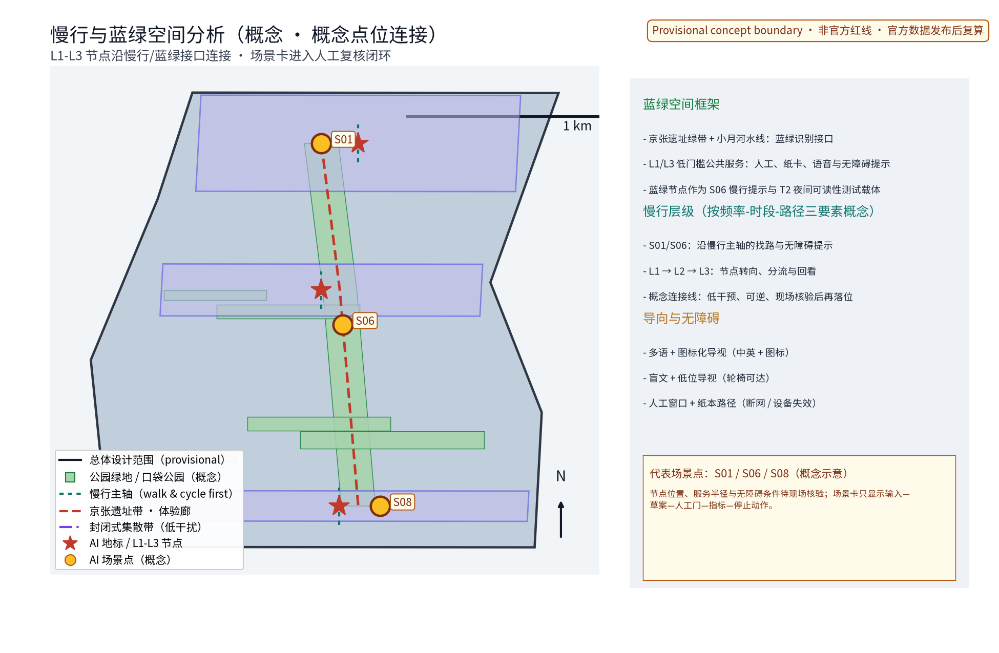
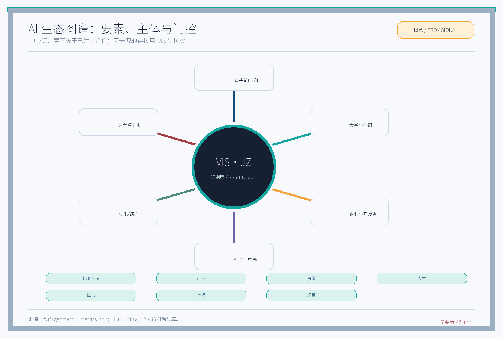
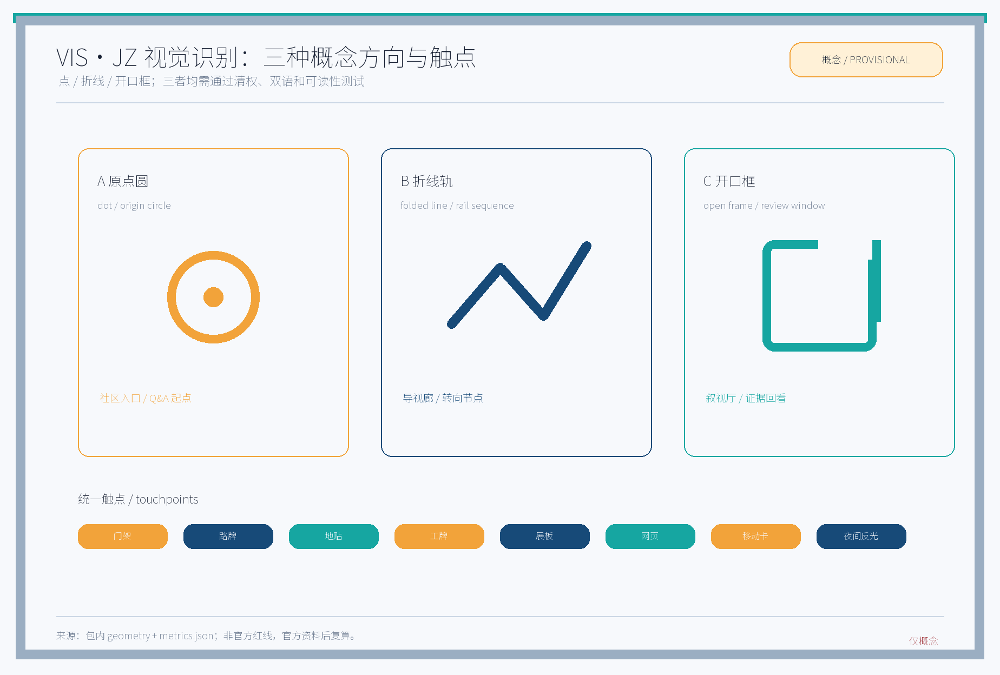

> 编制定位：本方案是视觉识别系统专项的概念建议，不给出容积率、建筑高度、法定红线、拆改留、工程、审批或投资结论。主名称「视觉识别智环」、VIS·JZ、节点名称和机制名称均是待清权的内部工作代号；未完成在先权利检索前不得作为注册或对外承诺。空间、指标与案例只在其标明的证据等级内使用；不含个人识别、隐私或涉密材料。[source:DATA-SRC-AGENT-TASKBOOK-20260518] [source:DATA-SRC-TRADEMARK-STATUS-20260820]

## 设计依据与资料清单

本包的工作依据分为四类：任务书与公开公告；公开标准/法律；公开网页案例；参与者自产的 provisional geometry、指标和概念图件。sources.json 为逐项版权与出处台账，每一项记录发布日、获取日、发布者、URL/本地路径、允许用途、禁止用途和复核状态。网页若未标示发布日，published_date 记为 null，不能把获取日冒充发布日。无法复核的名称、数据和案例只进入「待核实/研究假设」列，不作为事实或承诺。[source:DATA-SRC-OFFICIAL-ANNOUNCEMENT-20260509] [source:DATA-SRC-AGENT-TASKBOOK-20260518] [source:DATA-SRC-MOHURD-URBAN-DESIGN-MEASURES]

控规深度、用地分类、AI 服务和无障碍的逐项出处与允许用途继续以 sources.json 为准；它们只用于本包相应的设计边界和验证动作。[source:DATA-SRC-MOHURD-CONTROL-DETAILED-PLANNING] [source:DATA-SRC-MNR-LAND-USE-CLASSIFICATION-202311] [source:DATA-SRC-GENERATIVE-AI-INTERIM-MEASURES]

### 正式任务 ID—本专项章节—必需产出—图件/指标交叉表

下表严格沿用任务书的正式编号；“本专项章节”是本包的视觉识别切入点，不改写正式任务边界。四个容易产生歧义的编号以正式标题、章节名和可核验产出同时锁定。

| 正式任务 ID（任务书标题） | 本专项章节 | 必需产出 | 图件/指标证据 |
|---|---|---|---|
| agent.1 一带总体概念与功能统筹方案设计 | A 总体概念与 VIS·JZ 识别转译 | 总体叙事、命名/Logo方向、三区两翼协同、总体结构、矩阵入口 | `site-overview.png`、`logo-vis-jz.png`；三大定位/五大功能 |
| agent.2 AI全栈自主创新体系与世界级AI创新生态设计 | B AI 生态—八要素接口 | 6 个公开案例、生态图谱、产业—空间映射、来源与指标 | `ecosystem-map.png`；`global_case_count=6`；八要素矩阵 |
| agent.3 AI+场景赋能新范式与智能化AI活力城市设计 | C 场景卡与行业测试 | ≥10 场景卡、≥3 测试场景、5 类角色、场景—空间—运营矩阵、人工/隐私边界 | 12 张 S01–S12；T1–T5；`scenario_card_count=12`、`industry_test_scenario_count=5` |
| agent.4 AI公共空间、智能原生新业态与朝圣地标设计 | D 公共空间—地标—组件 | 京张遗址公园公共空间、东西/南北策略、大钟寺场景、≥3 地标、荣誉与组件库 | `key-areas.png`；L1–L3、3 个地标、VIS-C01–C06 |
| agent.5 百年京张文化、中关村文化与AI新文化融合叙事设计 | E 文化叙事与传播 | 京张/中关村/AI 叙事、导视符号、国际传播文案 | `logo-vis-jz.png`；中英术语与叙视厅 |
| agent.6 一带全球AI创新活动体系与长期运营设计 | F 年度活动与长期运营 | 年度活动、品牌/传播、开发者社区、场景开放、转化路径 | `annual_program_count=4`；AP01–AP04 活动表、A–C/G1–G3 |

本表是正文唯一的 agent 编号解释；后文 A–F 只作为本专项章节代码使用，不将“视觉识别”“生态案例”或“实体应用”冒充正式任务标题。

### 任务书转译

三大定位是：百年京张文化带、都市 AI 生活体验带、AI 融合创新带。五大功能是：AI 全栈自主创新体系、世界级 AI 创新生态、AI+ 场景赋能新范式、智能化 AI 活力城市、AI 治理全球话语权。本专项只负责把它们转译为识别系统、公共导视、场景接口和公开评测，不宣称已完成产业、规划或治理目标。可核验的任务书覆盖写入 standard_matrix.json 与 compliance_matrix.json。

### 视觉识别的原创机制

1. 「主视台—导视廊—叙视厅」：主视台是可见的品牌入口和信息总览，导视廊把人流、铁路记忆和 AI 场景串成可步行的识别序列，叙视厅把数据来源、测试结果和居民反馈公开成可回看的叙事界面。
2. 「铁轨语序」：所有标识按“起点—换乘/分叉—目的地—回看”组织，中文先呈语义、英文保持等长功能对照；不使用真实铁路信号或受保护标志的复制。
3. 「可逆组件库」：模块化门架、地贴、可拆展板、夜间光带、网页卡片和二维码占位件采用螺栓/夹具或数字配置切换，测试失败时可撤回、替换、复用。

## 三层范围工作框架

三层工作框架分别是统筹研究范围、总体设计范围和重点区域详设范围。三者是工作层级，不是三处行政或法定边界；geometry/ 中的 polygon 只服务于复算和阅读。[source:DATA-SRC-PROVISIONAL-BOUNDARIES-20260605] [data:PACKAGE-GEOMETRY] [depth:three_level_scope_framework]

| 层级 | 本包工作口径 | 概念面积/复算状态 | 本专项产出 | 触发复算 |
|---|---|---:|---|---|
| 统筹研究范围 | 产业、文化、外部协同与未来城市方向性研究 | 约 43.6 km²；暂定 | 生态伙伴地图、传播语法、案例研究和外部协同接口 | 官方范围、产业名录和历史资料核验后 |
| 总体设计范围 | 城市更新与控规深度的识别骨架、慢行/蓝绿叙事和运营接口 | 11,412,825.386 m²；provisional geometry | 系统规范、导视骨架、指标口径和分期门 | 官方控制资料、权属和设施数据获得后 |
| 重点区域详设范围 | 三节点的品牌落位、实体/数字组件、中试和公众反馈 | 约 368.4 ha；暂定 | 主视台、导视廊、叙视厅与场景卡原型 | 产权、交通、市政、无障碍和消防专业复核后 |

### 识别系统的三层递进

统筹层回答“这条带与谁交流”；总体层回答“人在多大范围内怎样识别和换向”；重点层回答“一个门架、一个页面或一张卡如何被使用、测量和撤回”。任何一个层级都不把暂定面积当作审批条件。总体设计范围的可复算核心值在 metrics.json 中，绿地和公共空间因图层口径与官方资料不足保持低置信度。[metric:site_area_sqm] [metric:green_ratio] [metric:public_space_ratio]

## 统筹研究范围产业与未来城市研究

### 三区两翼：任务书内部空间结构

下表仅描述任务书内部的五个工作单元，名称和空间载体均需在官方资料、产权和专业审查后落位；不与外部协同网络混称。

| 内部单元 | 角色与识别主题 | 产业/生活接口 | 视觉转译 | 与其他单元的协作 |
|---|---|---|---|---|
| AI 原点社区 | 北京 AI 原点社区；连接社区生活、启蒙和公共解释 | 社区居民、青少年、志愿者、公共服务解释 | “原点圆”起点标记、双语问答卡、人工服务 fallback | 向众智园输送问题和人才，向小月河翼开放生活场景 |
| 众智园 AI 自主创新加速区 | 全栈创新的试验与加速 | 模型、算力、数据治理、应用开发者 | “叠环”模块、版本号、测试状态灯 | 接收原点问题，向大钟寺输出可验证产品，接受服务翼支持 |
| 大钟寺 AI 产业集聚区 | 企业/消费/商务场景的产业集聚 | 企业服务、商务接待、消费者体验 | “方格链”门牌、服务等级标签 | 汇聚供需，把中试结果转为场景订单；不承诺招商结果 |
| 中关村科技服务翼 | 外向的科研、资本、技术服务和开发者连接翼 | 高校、科研、知识产权、开发者社区 | “服务翼”侧向箭头、能力目录 | 横向连接众智园与大钟寺，公开测试协议和资源清单 |
| 小月河场景赋能翼 | 以生活、生态和公共空间为承载的场景翼 | 居民、游客、无障碍使用者、公共运营 | “水线翼”连续色带、场景卡入口 | 把原点问题和园区能力带入日常场景，反馈给总体运营台 |

### 外部协同：不并入三区两翼

外部网络是协同对象和传播边界，不是上述五个内部单元的替代名称：北纬社区、未来科学城、怀柔科学城、经开区、京津冀。合作可采用案例互学、开发者共测、人才交流或场景互认，但每一项必须先有明确主体、书面授权、公开数据口径和退出条件；本包没有为任何外部主体编造合作承诺。[source:DATA-SRC-AGENT-TASKBOOK-20260518] [depth:overall_spatial_structure]

### 本专项章节 A：视觉识别系统（对应正式 agent.1）

agent.1 的交付不是一句口号，而是一套可逆规范：主标志由“圆点/折线/开口框”三种概念方向组成，均以 VIS·JZ 文字锁定；推荐色为京张蓝 #174A78、原点青 #16A6A1、翼光橙 #F2A33A、墨色 #172033、纸白 #F7F9FC。中英均以已核验的 Noto Sans SC 子集渲染；不再依赖 Arial 文件或系统字体，禁止用未授权字体文件和现成品牌标志。字体制品 URL、版本、SHA-256、OFL 文本、子集和命名记录见 sources.json 与 copyright_statement.md。图标采用 24 px 网格、2 px 基准线、圆角端点和双色状态层，提供实体门架、路牌、地贴、工牌、展板、网页 header、移动卡片、数据状态和夜间反光膜的应用规则。图件中的 3 个方向只是概念提案，清权与可读性测试通过后才进入小样。

### 本专项章节 B：空间—要素—运营机制（对应正式 agent.2）

agent.2 的工作不是把“AI 生态”画成伙伴云，而是为每个要素指定“适用单元—空间载体—可开放接口—人工门—可复核指标”。当前没有已授权的算力、资金、企业名录或数据集；以下接口是待核实的目录字段和概念工作流，不是已建平台。内部五单元的差异保持为：原点社区负责生活问题与解释，众智园负责全栈能力小样，大钟寺负责企业/消费场景验证，科技服务翼负责对外服务目录，小月河翼负责生活与生态场景承载。

| 要素空间 | 适用内部单元/翼与空间载体 | 输入与来源等级 | AI / 非 AI 能力 | 开放接口（概念目录字段） | Owner | 验证指标 | 人工门 | 停止条件 |
|---|---|---|---|---|---|---|---|
| 土地与空间 | 总体范围；三节点载体待核 | provisional geometry；官方控制资料待核 | AI 图层检索/版本对比；非 AI 专业判读 | `scope_version`, `layer_id`, `evidence_url`, `status` | 规划接口 + 设计负责人 | 边界版本可追溯；冲突项 100% 标记 | 专业规划师确认 | 资料缺失或边界争议，退回研究层 |
| 产业 | 众智园（能力小样）、大钟寺（企业/消费验证） | 公开企业/研究清单；来源台账 | AI 关系聚类/能力目录草拟；非 AI 访谈核验 | `capability_id`, `publisher`, `permission`, `expiry` | 产业运营 + 合规 | 每条能力有出处；人工抽样准确率目标 ≥90% | 运营/法务批准公开 | 出处不明、利益冲突或无法解释，删除 |
| 资金 | 科技服务翼（政策与服务目录） | 公开政策与已授权项目资料；未获批状态 unknown | AI 条件摘要；非 AI 财务复核 | `policy_id`, `eligibility`, `source`, `not_a_commitment` | 资金接口 + 财务 | 条件引用可回链；不作获批预测 | 财务/主管部门复核 | 需非公开财务资料或形成承诺 |
| 人才 | 原点社区（解释/参与）、众智园（开发/导师）、两翼（运营） | 公开活动与自愿报名摘要；不建个人画像 | AI 角色匹配建议；非 AI 人工导师与退出 | `role`, `opt_in`, `mentor`, `delete_date` | 社群运营 + 人工导师 | 参与者可选择退出；完成率/反馈可复核 | 导师人工确认 | 触及个人识别、画像推断或敏感信息 |
| 算力 | 众智园（小样）、科技服务翼（资源目录） | 公开资源目录和测试配额；实际容量 unknown | AI 任务排队/使用可视化；非 AI 安全放行 | `quota`, `data_class`, `access_scope`, `audit_log` | 技术运营 + 安全 | 使用记录可审计；无未授权数据 | 技术负责人放行 | 资源、权限或安全条件不满足 |
| 数据 | 原点社区（反馈解释）、小月河翼（场景反馈） | 匿名聚合反馈、公开地理资料；个人数据不收集 | AI 主题归纳/质量提示；非 AI 隐私复核 | `source`, `aggregation`, `retention`, `appeal` | data steward + 隐私负责人 | 不保留个体轨迹；来源和删除周期齐全 | 隐私/伦理复核 | 出现可回识别字段、敏感推断或来源不明 |
| 场景 | 小月河翼（日常承载）、大钟寺（消费/企业）、外部协同（仅授权接入） | 场景卡、测试日志、居民反馈；外部输入 status unknown | AI 生成候选方案/比较指标；非 AI 人工服务 | `scenario_id`, `baseline`, `threshold`, `stop_action` | 场景 owner + 居民代表 | 每个版本有基线、阈值和退出动作 | 场景评审会决定是否继续 | 失败阈值连续两轮未改善或公众拒绝 |

这张矩阵把“AI 生态”落实为输入、空间载体、AI/非 AI 双轨能力、开放接口字段、owner、指标、人工门和停止条件；接口只有在来源、授权、版本和撤回方式齐全时才可公开。它不承诺算力、资金、招商、人才或审批结果。[depth:existing_conditions_diagnosis] [depth:development_intensity_controls]

### 本专项章节 C：生态案例与行业验证（对应正式 agent.3 的场景验证交付；案例为 agent.2 支撑证据）

本包保留 6 个可追溯公开案例，均为 reference-only，不复制其 logo、页面素材或暗示背书：伦敦交通局 Roundel（视觉锚点/多触点）、纽约 Legible NYC（步行导视验证）、东京地铁（多语换乘语法）、新加坡榜鹅数码园区（空间—运营接口）、波士顿 Kendall Square（创新生态公共接口）、多伦多 Waterfront Toronto Quayside（公开评估与退出门）。每例只提取一个可迁移机制，分别落到 T1/T2/T3、agent.2 的接口字段或 agent.6 的公开复盘；sources.json 对每例记录官方入口、发布日未知的处理方式、获取日和复用边界。五项本地测试协议见第六节，不把案例宣传变成本地效果证明。

## 总体设计范围城市更新与控规深度城市设计

### 视觉识别不是法定规划替代物

总体设计只提出“识别—空间—运营”的可验证关系：在暂定总体范围内，用一个统一的图层编号、色带、节点编码和版本记录，把文化叙事、慢行、蓝绿、公共服务和 AI 场景连起来。用地、建筑规模、交通、市政、产权、消防、审批和工程条件均需另行补充；本包不输出法定强度、高度、道路红线或审批结论。[standard:MOHURD-URBAN-DESIGN-MEASURES] [standard:MOHURD-CONTROL-DETAILED-PLANNING]

### 三大定位与五大功能的可见接口

| 任务书内容 | 识别接口 | 可验证证据 | 不做的承诺 |
|---|---|---|---|
| 百年京张文化带 | 铁轨语序、遗址叙事点、时间线卡 | 公开历史来源、导视测试、居民口述授权 | 不复原未核实史实，不复制铁路受保护标志 |
| 都市 AI 生活体验带 | 小月河场景卡、人工服务点、双语导视 | 12 张卡的输入/输出/停机记录 | 不收集个人轨迹，不保证体验结果 |
| AI 融合创新带 | 众智园—科技服务翼—大钟寺服务链 | 生态图谱、开放接口目录、测试协议 | 不宣称招商、算力、资金或政策已落实 |
| 全栈自主创新体系 | 模型/算力/数据/应用的能力标签 | agent.2 矩阵和服务目录 | 不为未经授权的数据训练或跨境传输背书 |
| 世界级 AI 创新生态 | 开发者社区、案例互学、双语传播 | 活动记录和可公开指标 | 不将“世界级”写成既成评价 |
| AI+ 场景赋能新范式 | 场景卡与中试协议 | T1-T5 日志和失败动作 | 不把概念样机写成落地项目 |
| 智能化 AI 活力城市 | 低门槛信息、公共反馈和可逆组件 | 可读性、可达性和满意度测试 | 不替代公共服务责任 |
| AI 治理全球话语权 | 三句治理规则、公开复盘、退出门 | 治理记录和审查表 | 不宣称国际认可或治理权威 |

### 识别骨架与三处节点

三节点是内部视觉锚点，不是法定建设项目：L1 主视台（AI 原点社区的公共解释入口）、L2 导视廊（众智园与科技服务翼的能力串联）、L3 叙视厅（大钟寺与小月河翼的场景回看）。三者通过东—西叙事拼接与南—北穿行的概念轴相连；至少三处可展示 AI 地标与内部单元一一对应：L1 原点圆入口落在 AI 原点社区，承载双语解释/人工服务；L2 叠环时间廊落在众智园并向中关村科技服务翼开放，承载能力卡/测试状态；L3 方格链回看墙落在大钟寺并连接小月河场景赋能翼，承载企业服务、消费导视与匿名反馈。每一处都包含“来源、版本、测试状态、人工联系人、撤回方式”五个标签；空间位置仍为概念载体，正式落位 unknown/to_verify。[data:geometry/key_areas.geojson] [depth:overall_spatial_structure]

## 重点区域详细设计

### 本专项章节 D：实体和数字应用（对应正式 agent.4 的公共空间、地标与组件交付）

| 组件 | 实体应用 | 数字应用 | 状态与撤回 |
|---|---|---|---|
| 原点圆 | 门架、地贴、志愿者胸牌 | 首页入口、问答卡起点 | 组件编号 VIS-C01；夹具拆卸，页面可回滚 |
| 叠环 | 产业能力牌、测试展板 | 能力目录、API/数据权限状态卡 | VIS-C02；未通过清权或测试则灰度隐藏 |
| 方格链 | 大钟寺企业/消费导视、智能化消费服务牌 | 服务预约、开发者任务卡、服务清单回链 | VIS-C03；不展示未确认企业或投资信息；不代替交易/审批 |
| 服务翼箭头 | 科技服务翼导向、开放日导视 | 开发者社区、资源接口 | VIS-C04；外部伙伴仅显示已授权名称 |
| 水线翼 | 小月河慢行标牌、夜间反光带 | 场景地图、无障碍路线提示 | VIS-C05；夜间亮度和眩光经实测后调整 |
| 版本环 | 测试状态牌、复盘墙 | 版本 changelog、意见回流 | VIS-C06；任何失败版本可标红并撤回 |

### 荣誉展示与可逆组件库

荣誉展示只呈现经核验的奖项、公开的合作/测试记录或“参与贡献”条目，不能把入选、提名或概念演示写成获奖。每条记录字段为 subject、issuer、date、public_url、evidence_status、attribution、expiry；待核验项显示「待核实」，没有完整来源则不显示。组件库采用 C01-C06 编码，每个组件保留材料、尺寸、可达性、安装方式、维护人、版本、拆卸动作和成本待核字段，优先可拆、可换、可再利用。agent.4 的重点不是装饰铺陈，而是把三处地标与三处关键内部单元绑定：原点社区看“解释与人工兜底”，众智园/科技服务翼看“能力与接口”，大钟寺/小月河翼看“企业消费与日常场景”；任一绑定缺少授权或现场核验即只保留为纸面小样。

### agent.5：文化叙事与中英传播

中文语气采用“从铁路记忆走向可验证的 AI 日常”，英文对应 “From railway memory to testable AI in everyday life.” 三个节点英文功能名固定为 Visual Hub、Signage Gallery、Narrative Hall；内部单元英文固定为 AI Origin Community、Zhongzhiyuan AI Self-Innovation Acceleration Area、Dazhongsi AI Industry Cluster、Zhongguancun Technology Service Wing、Xiaoyuehe Scenario Empowerment Wing。英文页面和英文图件不得出现功能性中文；VIS·JZ 作为尚待清权的拉丁字母代号保留。

传播链为：公开资料 → 概念卡 → 双语小样 → 社区共读 → 盲测/可读性测试 → 公开复盘 → 版本保留或撤回。英文不直译“世界级”等评价为已实现状态，使用 “aspiration” 或 “reference only” 保留概念边界。[source:CASE-TOKYO-METRO] [source:CASE-LEGIBLE-NYC]

### 12 张 AI 场景卡

下表每张卡都能落到一个 owner、一个输入、一个输出、一个验证和一个停止条件。卡片是提案级测试定义，尚无实际运行结果；不接收个人识别字段。

| ID / 卡名 | 用户与地点 | 输入 | AI 工作 | 输出/交互 | Owner | 验证指标 | 停止条件 |
|---|---|---|---|---|---|---|---|
| S01 原点问路 | 居民/访客；原点圆 | 公开节点图层、无障碍规则 | 生成双语路线候选 | 纸卡+网页路线 | 社区运营 | 盲测任务完成率 ≥90% | 连续两轮误导或无法人工复核 |
| S02 铁轨时间线 | 学生；导视廊 | 已核验历史条目 | 摘要并显示来源 | 时间线卡/展板 | 文化编辑 | 来源回链率 100% | 条目来源缺失 |
| S03 场景翻译 | 国际访客；主视台 | 中英术语表 | 生成等长草案 | 双语标签 | 传播编辑 | 英文零功能性中文；术语抽检 ≥95% | 一条未译即下线 |
| S04 开发者能力卡 | 开发者；科技服务翼 | 公开能力与接口目录 | 按任务匹配资源 | 能力卡/API 状态 | 技术运营 | 卡片字段完整率 100% | 权限或出处不明 |
| S05 数据来源回看 | 居民；叙视厅 | 匿名聚合反馈 | 归纳主题与置信级别 | 公开回看板 | 数据 steward | 可追溯条目 ≥95% | 可回识别或敏感推断 |
| S06 小月河慢行提示 | 老年人/无障碍使用者；小月河翼 | 公开路网、现场人工确认 | 生成坡度/障碍提示草案 | 纸卡+人工服务点 | 可达性负责人 | 现场路线核对 100% | 实地条件与图层不一致 |
| S07 夜间识别试验 | 夜行者；导视廊 | 色值、照度、眩光记录 | 比较色带组合 | 夜间组件小样 | 视觉负责人 | 反光/可读性达自定阈值 | 眩光或安全风险未消除 |
| S08 企业服务导航 | 企业来访者；大钟寺 | 公开服务清单 | 生成办事路径草案 | 服务牌+网页 | 企业服务 owner | 信息正确率 ≥95% | 清单过期或无法回链 |
| S09 社区共创提案 | 居民/志愿者；AI 原点社区 | 自愿提交的匿名主题 | 聚类并提出卡片模板 | 共创墙/投票卡 | 社群运营 | 主题可解释率 ≥90% | 出现个人画像或攻击性内容 |
| S10 中试日志回顾 | 中试团队；众智园 | T1-T5 脱敏日志 | 找出失败模式 | 版本回顾页 | 中试 owner | 每次复盘有行动项 | 日志缺字段或无法审计 |
| S11 组件借用台账 | 运营人员；三节点 | C01-C06 库存与授权 | 推荐可逆组件 | 借用单/归还提醒 | 资产管理员 | 归还记录完整率 100% | 资产、授权或维护人不明 |
| S12 外部案例对照 | 研究员/开发者；科技服务翼 | 6 个公开案例条目 | 形成可迁移假设 | 案例卡/讨论会 | 研究负责人 | 每张卡有 URL 和限制 | 页面不可达或内容不可核验 |

## AI 创新生态、人才画像与 AI+ 场景

### 人才画像（非个人画像）

五类角色是工作角色而非对个人的预测：社区解释者（把 AI 讲给居民）、全栈开发者（模型/算力/数据/应用）、场景运营者（把需求变成测试）、文化编辑（核验历史并写双语内容）、可达性与伦理审查者（检查无障碍、隐私和人工 fallback）。每类角色都可以匿名参与、随时退出；不保存人脸、轨迹、联系方式或敏感属性。[standard:DATA-SRC-BARRIER-FREE-ENVIRONMENT-LAW]

### AI 生态图谱

图谱中心是 VIS·JZ 概念识别层，向外连接六类供给/使用者：公共部门接口、大学与科研、企业与开发者、社区与居民、文化/遗产、运营与第三方评测；七个要素空间为土地与空间、产业、资金、人才、算力、数据、场景。每一条边必须在公开目录或授权记录中标出 source、owner、interface、metric、gate、stop；没有记录的边显示为虚线“待核实”，不画成已建立合作。对应图件为 assets/figures/ecosystem-map.png 和 ecosystem-map.en.png。[depth:stakeholder_governance] [source:DATA-SRC-AGENT-TASKBOOK-20260518]

### agent.6：开发者社区、场景开放与转化链

开发者社区采用四层结构：公开问题池（只收匿名主题）、接口目录（公开能力与限制）、小样工坊（可逆组件与双语图件）、评测与复盘（公开基线/结果/失败动作）。场景开放采用“问题卡 → 资格/伦理筛选 → 沙盒小样 → 三方测试 → 公开复盘 → 采用/改版/退出”的转化链；没有授权、基线或退出条件的申请不进入测试。外部协同只从该链的公开节点接入，不改变三区两翼的内部分工。

### 五项可执行行业测试协议

### 四项年度活动体系（metrics.json 的单一活动源）

下表是 `annual_program_count=4` 的逐项展开；四个品牌、频次和节点都是本包的概念建议，不是已确定安排。负责人是 proposed RACI 角色，场地、资源和外部主体在书面确认前均为 `unknown/to_verify`。

| 活动品牌 | 频次 | 目标人群 | 空间节点 | RACI/负责人 | 资源前提 | 双语传播触点 | 隐私/无障碍边界 | KPI | 阶段门 | 取消/退出条件 |
|---|---|---|---|---|---|---|---|---|---|---|
| AP01 VIS·JZ 开放系统日 / Open Systems Day | 每年 1 次；日期待核 | 居民、青年、开发者、访客 | L1 主视台；AI原点社区 | R 社群运营；A 年度运营 owner；C 可达性/法务；I 公众 | 书面场地许可、纸卡、人工服务、双语编辑；预算与主体待核 | L1 双语导视、离线纸卡、网页索引、公开回看 | 不采集身份和轨迹；纸卡/人工入口、轮椅通行与儿童/老年友好检查 | ≥90% 导视任务完成；公开复盘 1 次 | G1：权利、告知、无障碍和 T1/T4 方案齐全 | 许可、人工服务或可达性缺一；下线 AP01 并保留原因 |
| AP02 水线慢行体验周 / Waterline Mobility Week | 每年 1 次；季节待核 | 老年人、无障碍使用者、家庭、夜行者 | L2 导视廊—小月河翼；具体路线待核 | R 场景 owner；A 可达性负责人；C 社区/安全；I 公开复盘 | 现场人工踏勘、照度/障碍基线、纸质替代路线；数据与场地待核 | 水线翼双语节点牌、语音/大字纸卡、网页路线说明 | 仅匿名聚合错误类型；人工确认路线；不以摄像或定位替代服务 | T1 完成率 ≥90%；T2 对比度目标达标；眩光投诉 0/10 次 | G2：现场授权、消防/交通/无障碍专业复核及 T1/T2 | 路线不一致、眩光、安全或障碍风险未消除；撤回组件并转人工 |
| AP03 三节点季度复盘 / Three-Node Quarterly Review | 每年 4 次；季度末 | 运营者、设计/规划专业、社区代表、开发者 | L1/L2/L3 叙事回看；线上/线下位置待核 | R 数据 steward；A 运营/合规 owner；C 视觉、文化、伦理；I 社会公众 | 匿名日志、版本墙、公开来源、人工主持；接口与人员待核 | 中英版本 changelog、叙视厅复盘页、公开摘要 | 只呈匿名聚合和来源等级；提供字幕、大字版、纸本；不展示个人案例 | 100% 版本有来源/门控/退出记录；≥95% 条目可回链 | G1：来源、保留/删除日、人工复核和 T4 扫描通过 | 来源失效、敏感推断、无法人工解释；删除相关条目并暂停发布 |
| AP04 铁路—AI 叙视节 / Rail-to-AI Narrative Festival | 每年 1 次；主题待核 | 学生、文化参与者、国际访客、居民 | L3 叙视厅；大钟寺/小月河翼载体待核 | R 文化编辑；A 传播 owner；C 历史核验/社区/法务；I 开发者 | 已核验历史条目、授权叙事、双语版式、人工讲解；产权和合作待核 | 时间线卡、双语地标说明、可下载文字稿、现场人工讲解 | 不用未授权肖像/商标/论文图；字幕、大字和安静时段；不收面部/声音生物特征 | 历史条目来源回链 100%；T3 图标理解 ≥80% | G3：历史/权利/无障碍复核、T3/T4 通过且退出演练完成 | 历史证据或授权不足、误导风险或公众拒绝；撤下条目并回到研究层 |

四项活动共享同一日志字段：`activity_id`、版本、日期、节点、RACI、资源状态、告知/同意、匿名计数、KPI、阶段门、人工决定、取消原因、下一次复核和删除日；未发生的活动没有结果数据，所有 KPI 是拟定验证目标。

| 协议 | 对象/样本 | 基线 | 公式与阈值（均为自定测试目标） | 记录与 RACI | 频率与失败动作 |
|---|---|---|---|---|---|
| T1 双语导视找路 | 24 人分层盲测；含老年与无障碍使用者 | 无统一视觉的现有文字卡 | 完成率 = 完成任务数/有效样本；通过目标 ≥90%，方向识别中位数 ≤8 秒 | 表单含版本、起终点、时间、错误、人工提示；R 视觉负责人，A 场景 owner，C 社区/可达性，I 公开复盘 | 每版一次；80–89% 回到字级/箭头修订，<80% 立即撤回 |
| T2 色彩与夜间可读性 | 6 组色带小样，白天/夜间各 10 次读数 | 墨色纸白组合 | 对比度 = (Lmax+0.05)/(Lmin+0.05)；普通文字自定目标 ≥4.5:1，夜间眩光投诉 ≤0/10 次 | 记录色值、照度、距离、设备、读数、投诉；R 视觉，A 运营，C 安全/无障碍，I 评审会 | 组件试装前/后各一次；任一批次不达标换色或停装 |
| T3 图标理解 | 30 人，12 个图标，每人限时 5 秒 | 无图标的文字说明卡 | 正确率 = 正确解释数/有效回答；目标 ≥80%，误解集中项 ≤2 个 | 记录图标版、题目、答案、误解、访谈；R 图标设计，A 视觉，C 文化/社区，I 研发 | 首轮和改版后；集中误解则删图标或加文字 |
| T4 英文页面完整性 | 20 次页面任务 + 自动字符扫描 | 当前中英混排页面 | 英文页面中文功能字符数 = 0；中英任务完成率目标 ≥90% | 记录 URL、本地文件、扫描结果、截图、版本；R 传播，A 编辑，C 翻译/法务，I 公开 | 每次导出/合并前；发现一处即退回导出 |
| T5 组件撤回与回执 | 3 个 C01-C06 原型、3 次拆装、5 个模拟问题 | 固定不可拆样机的拆装记录 | 撤回成功率 = 完成撤回数/计划撤回数；目标 100%；模拟问题的 48 小时回执是自定服务目标，不是法定时限 | 记录资产号、授权、拆装人、耗时、回执时间、停用原因；R 资产管理员，A 运营，C 法务/安全，I 社区 | 月度或事件后；失败即停用组件、人工接管并复盘 |

### 统一日志模板

test_id、version、date、site_unit、sample_rule、baseline、input_source、operator、consent_or_public_notice、raw_count、formula、threshold、result、uncertainty、human_decision、action、next_review、retention_and_delete_date。日志只保留匿名聚合，不记录个人识别信息；测试目标不是既有绩效。

## 用地、建筑规模与拆改留方案

本专项只定义识别系统如何读用地和城市更新信息，不替代法定规划、建筑、消防或工程判断。land_use.geojson 的图斑和 metrics.json 可复算数值来自 provisional geometry；建筑规模、产权、保留/更新/拆除状态未知时显示“待核实”，不填入推断值。[standard:MNR-LAND-USE-CLASSIFICATION-GUIDE] [data:geometry/land_use.geojson]

### 三个面积口径

1. A 口径是总体设计范围 polygon：11,412,825.386 m²，来自本包几何复算，confidence=medium。
2. B 口径是图斑/绿地/公共空间图层聚合：green_ratio = 0.110044，显示为 11.0%；public_space_ratio = 0.003167，显示为 0.3%，均为 low confidence，不能与法定绿地率或公共服务标准等同。
3. C 口径是用地分类专题聚合：公园与公共绿地占 land-use 图斑面积的 27.3%，仅表示本包图层内聚合，不能作为总体范围绿地率。

建筑 footprint、建筑量、产权和拆改清单不具备可核验官方来源，保持未知。概念上建议“可逆组件优先、低干预识别、先测试再扩展”，但不对保留、改造、拆除的具体地块作结论。

## 交通、轨道、市政与公共服务设施

交通识别采用“站点/换向/到达/回看”四段式，不把概念慢行线写成已建道路。mobility-bluegreen 图中只显示 provisional 参与轴、蓝绿叙事线、三节点和 1 km 示意比例尺；道路、轨道、管线、消防、无障碍和公共服务设施需由专业资料补齐。[data:geometry/roads.geojson] [standard:MOHURD-CONTROL-DETAILED-PLANNING]

### 识别与服务规则

- 轨道/道路入口：只使用公开可核验的站点和人工确认方向；未知入口使用“待核实”，不画成出口承诺。
- 市政与公共服务：网页、展板和实体牌均显示人工服务 fallback、更新时间、责任接口和投诉/建议入口；涉及医疗、社保、金融、生活缴费的服务场所按适用法律边界另行核验，不作泛化。[source:DATA-SRC-BARRIER-FREE-ENVIRONMENT-LAW]
- 48 小时回执为本包自定运营目标，用于测试 T5；它不是法定时限，也不是任何部门承诺。
- 个人定位、摄像识别和连续轨迹不进入系统；只用匿名聚合的计数、错误类型和公开地理信息。[source:DATA-SRC-GENERATIVE-AI-INTERIM-MEASURES]

## 蓝绿空间、公共空间与城市风貌

蓝绿视觉策略是“京张蓝—小月河水线—原点青”的连续识别层：蓝色表示方向/记忆，青色表示生态和生活场景，橙色只作可行动作或警示，不暗示土地权属或工程等级。公共空间采用 C01-C06 可逆组件；每个组件均有可拆、维护、替换和撤回动作。[data:geometry/green_space.geojson] [data:geometry/public_space.geojson] [depth:public_space_system]

### 风貌和可读性

主标志、中文、英文、图标、编号和色带在 A0/A3、网页、手机卡、门架、路牌、地贴、工牌和夜间反光带上保持同一语法。所有空间图件有北箭头、示意比例尺、provisional 警示、图例、数据口径和获取/版本信息；英文图件与 HTML 仅显示英语功能文本。颜色和字体是测试对象，不把模拟小样当作已安装设施。

## 更新项目清单、实施政策与分期计划

### 项目清单

| 项目 | 内容 | 牵头/协同 | 阶段门 | 退出/回收 |
|---|---|---|---|---|
| P01 识别规范小样 | 标志、色板、字体、图标、双语术语表 | 视觉负责人 / 法务、社区 | G1 清权 + T2/T3 | 权利或可读性失败，回退方向 |
| P02 三节点组件试装 | C01-C06 中选 3 个小样 | 运营 / 可达性、安全 | G2 现场核验 + T1/T5 | 眩光、障碍、维护失败即拆 |
| P03 双语数字索引 | HTML、场景卡、来源台账、版本回看 | 传播 / 技术、文化 | G1 字符扫描 + T4 | 任意残留中文或远程资源即退回导出 |
| P04 开发者小样工坊 | 公开问题池、接口目录、沙盒评测 | 科技服务翼 / 众智园、大钟寺 | G3 T1-T5 复盘 | 无授权/基线/伦理门不入场 |
| P05 生态案例与荣誉墙 | 6 个案例、核验记录、可逆展示 | 研究 / 法务、社区 | G1 URL/权利核验 | 失效链接或证据降级为待核实/移除 |

### agent.6 分期、RACI 与阶段门

阶段 A（1-3 年，概念验证与限定小样）：完成清权、术语、C01-C06、T1-T5 方案与小样。阶段门 G1 为来源/版权/隐私清单齐全；退出条件是任何关键来源无法核验、英文页面有功能性中文、或测试对象侵犯权益。

阶段 B（3-5 年，限定中试）：只在书面授权、人工服务和安全条件具备的节点进行 3 个可逆组件和开发者小样。阶段门 G2 为场地、产权、无障碍、安全和维护责任书面确认；退出条件是 T1/T2/T5 失败、公众拒绝、数据风险或维护失控。

阶段 C（5-10 年，公开复盘与扩散评估）：将通过测试的组件做版本化传播，保留失败版本和撤回记录。阶段门 G3 为独立复核、指标趋势和预算/维护条件透明；退出条件是连续两轮低于阈值、无法人工接管、来源失效或外部协同没有授权。以上是时序建议，不是实施承诺。

### RACI

R（执行）= 视觉负责人、场景 owner、资产管理员、文化编辑、技术运营；A（最终负责）= 该阶段的运营/主管接口；C（咨询）= 社区代表、可达性/伦理、法务、规划/安全专业；I（知会）= 公开复盘读者、开发者社区和外部案例联系人。每个场景卡和测试协议必须写明 R/A/C/I，未写全则不入门。

### 五项 KPI

K1 双语导视完成率（T1）；K2 普通文字对比度达到自定目标的组件比例（T2）；K3 图标理解正确率（T3）；K4 英文功能性中文残留数（T4，目标 0）；K5 可逆组件撤回成功率与匿名回执覆盖率（T5，目标分别 100%/100%）。KPI 是概念验证指标，不是部门绩效或法定标准；正式统计前先锁定样本、版本、分母和删除周期。[metric:scenario_card_count] [metric:industry_test_count]

## 指标体系、面积复算与合规矩阵

### 机器可读指标

| 指标 | metrics.json 值 | 显示值 | 置信度/用途 |
|---|---:|---:|---|
| site_area_sqm | 11412825.386 | 11,412,825.386 m² | medium；几何复算 |
| green_space_area_sqm | 1255908.493 | 1,255,908.493 m² | low；图层聚合 |
| public_space_area_sqm | 36150 | 36,150 m² | low；图层聚合 |
| green_ratio | 0.110044 | 11.0% | low；非规划绿地率 |
| public_space_ratio | 0.003167 | 0.3% | low；非公共服务标准 |
| land_use_park_green_share | 0.2731 | 27.3% | medium；专题图层口径 |
| scenario_card_count / industry_test_count | 12 / 5 | 12 / 5 | proposal-defined inventory |

复算关系是 green_ratio = green_space_area_sqm / site_area_sqm、public_space_ratio = public_space_area_sqm / site_area_sqm；四舍五入只在展示层做。官方范围、图层分类、权属或设施口径更新时重新生成 metrics、图件、HTML、PDF 和 manifest。[metric:site_area_sqm] [metric:green_ratio] [metric:public_space_ratio]

### 合规与证据矩阵

standard_matrix.json 逐项覆盖公告、任务书、城市设计管理、控规深度、用地分类五个必需标准；design_depth_matrix.json 覆盖现状诊断、三层框架、总体结构、用地布局、强度边界、建筑风貌、交通、市政、蓝绿、公共空间、更新清单、分期、指标、AI 场景与运营治理；compliance_matrix.json 将每一项映射到正文、图件、geometry、指标、假设和验证动作。合规矩阵是证据索引，不是法定合规意见。[source:DATA-SRC-OFFICIAL-ANNOUNCEMENT-20260509] [standard:PROJECT-AGENT-OPEN-CALL-TASKBOOK]

## 风险、版权与合规说明

### 三句 AI 治理

仅使用匿名聚合；关键决策由人工复核；禁止过度监控（不进行个体识别式追踪）。服务中的生成内容标注为机器草案，居民可要求人工解释、纠正和撤回；投诉处理按公开制度与适用法律复核，不从法律文本推导一个并不存在的数字期限。[source:DATA-SRC-GENERATIVE-AI-INTERIM-MEASURES]

### 风险台账

| 风险 | 预防 | 触发 | 处置 |
|---|---|---|---|
| 来源/版权 | sources.json 逐项记录；不复制案例 logo/页面素材 | URL 失效、授权缺失 | 标待核实或删除，保留说明 |
| 商标/在先权利 | VIS·JZ、节点和机制名仅内部工作代号 | 检索冲突 | 停止对外使用，换名并更新资产 |
| 隐私与安全 | 匿名聚合、最小字段、人工 fallback | 可回识别/敏感推断 | 停止处理、删除、伦理复核 |
| 可达性与公平 | 字级/对比度/人工服务/盲测 | T1/T2/T3 低于阈值 | 退回设计，先解决可读和可达 |
| 空间/权属争议 | 所有 geometry 标 provisional | 产权、红线、工程冲突 | 不落位、不安装，回到研究层 |
| 运营成本与技术成熟度 | 可逆组件、版本预算、退出门 | 维护或模型解释失败 | 停机、人工接管、公开复盘 |

### 版权台账摘要

参与者原创的文字、图标规则、配色草案、版式和几何以 COMMUNITY-DISPLAY-ONLY 供社区审阅；不把该许可写成商标注册或第三方授权。公开标准/法律只作引用和摘要，不复制受限页面素材；六个案例只做 reference-only 叙述，来源、URL、获取日、页面未标示发布日的 null 记录和禁止用途详见 sources.json。A0/A3、PNG、HTML 的图件由本包自产；Noto Sans SC 的家族、版本、获取路径和本地嵌入依据已登记，但许可证文本、系统英文字体条款和外部复用仍为 unknown/to_verify，字体文件本身不随包再分发。copyright_statement.md 是完整权利声明。[source:DATA-SRC-TRADEMARK-STATUS-20260820]

## 参考资料

正式引用优先级为：项目公告与任务书；国家/部委公开标准与法律；公开案例官方页面；参与者 provisional geometry/metrics。案例条目如下，均不代表本地效果已经证明：

| 案例 | 可追溯来源 | 可迁移假设 | 限制 |
|---|---|---|---|
| Transport for London Roundel | sources.json: CASE-TFL-ROUNDEL | 统一标志可跨交通触点保持识别 | 不复制 Roundel，不宣称背书 |
| Legible NYC | sources.json: CASE-LEGIBLE-NYC | 城市导视可用步行任务测试 | 项目制度和街道条件不同 |
| Tokyo Metro | sources.json: CASE-TOKYO-METRO | 多语和换乘语法需等长、连续 | 不复制图标，须本地测试 |
| Punggol Digital District | sources.json: CASE-PUNGGOL-DIGITAL-DISTRICT | 数字园区可把空间和运营接口放在同一图谱 | 官方页面入口较宽，具体事实待核 |
| Kendall Square | sources.json: CASE-KENDALL-SQUARE | 创新生态需要持续的公共叙事和社群接口 | 不推断产业效果或合作关系 |
| Quayside / Waterfront Toronto | sources.json: CASE-QUAYSIDE-TORONTO | 公开门控和退出条件应先于规模化承诺 | 只提取治理教训，不作本地类比结论 |

本包还引用 assets/figures/site-overview.png、land-use-structure.png、key-areas.png、mobility-bluegreen.png、metrics-evidence.png、ecosystem-map.png、logo-vis-jz.png 及其英文对应；图件均带 provisional、比例尺/图例或指标口径、版本和来源说明。[source:PACKAGE-GEOMETRY] [data:geometry/site_boundary.geojson]
