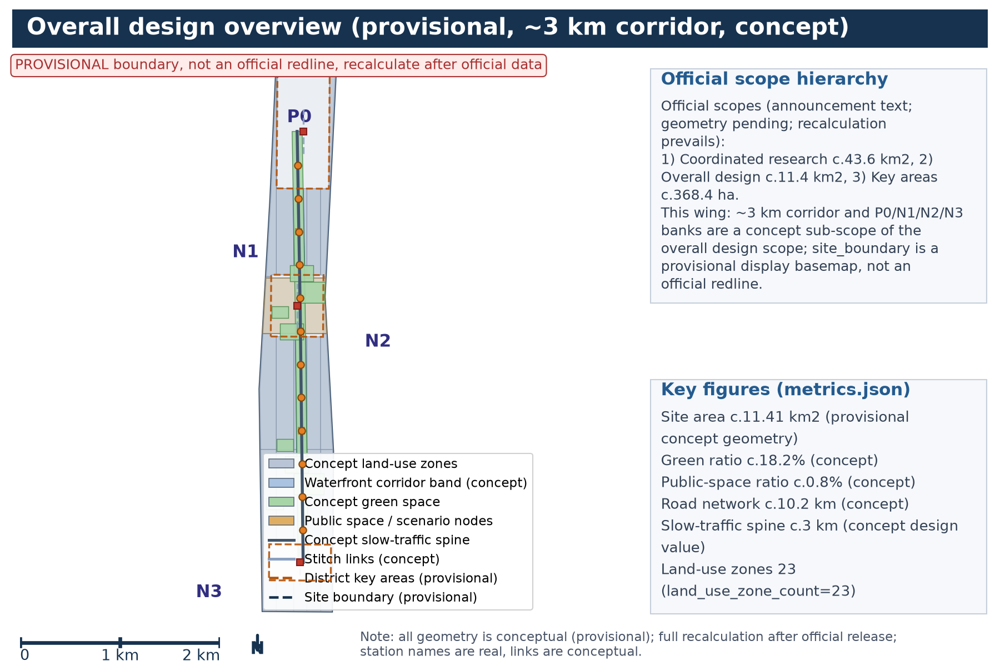
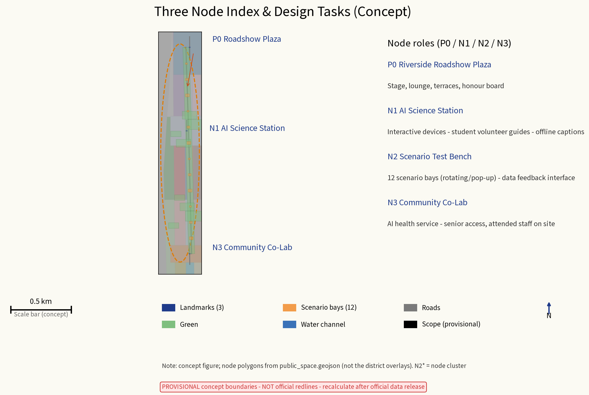
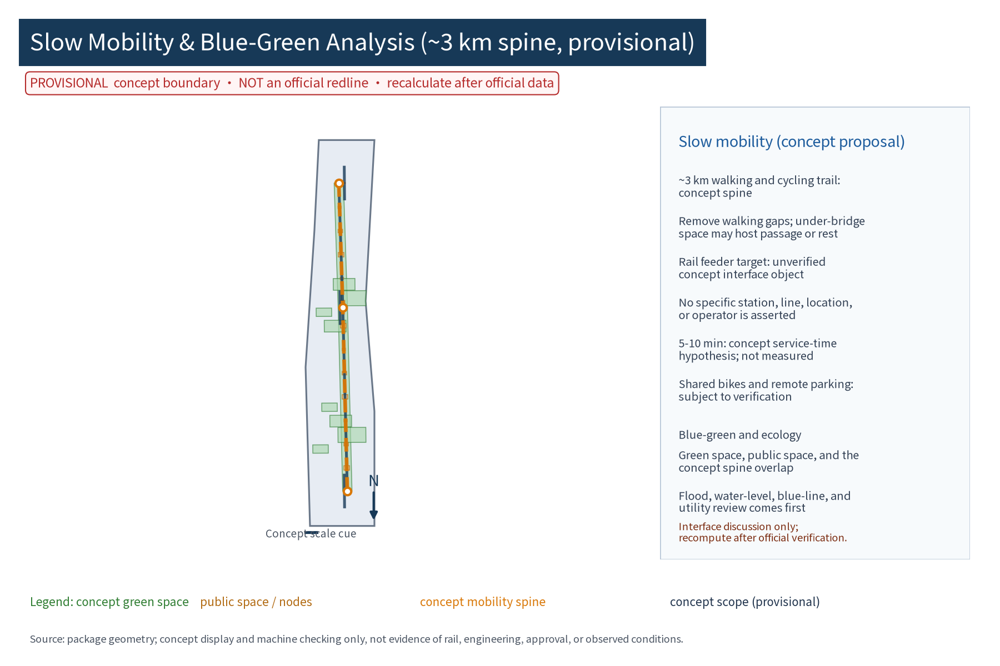

## Basis of Design and Data Inventory

This proposal is a concept for reference only, prepared under the call for entries for the Centennial Jingzhang AI Innovation Belt international urban design open call and the agent taskbook, implementing the taskbook's three positioning statements, five functions, Three Zones Two Wings pattern and agent tasks 1-6. Four categories of materials were reviewed. First, statutory and higher-level plans: among them, the Beijing Master Plan (2016-2035) and the Haidian District Plan (territorial spatial plan, 2017-2035) are verifiable public outcomes (official pages, publication dates and reuse boundaries in sources.json entries DATA-SRC-REF-BJ-MASTER-PLAN and DATA-SRC-REF-HAIDIAN-DISTRICT-PLAN); this proposal uses them only as higher-level positioning and institutional framework references and quotes no parcel-level indicators or regulatory values. The Xueyuan Road sub-district regulatory detailed plan and special materials on Xiaoyue River water environment, blue line and flood control could not be proven public, licensed or verifiable in this run and are therefore treated as research hypotheses (unverified self-declared background) with no factual claims (DATA-SRC-UNVERIFIED-PLAN-MATERIALS). Second, competition documents: the announcement, taskbook, Q&A minutes and the organizer's package; all geometric boundaries follow official recalculation. Third, site survey materials: the team's site walks, resident interviews and night-vitality observations are a non-sampling, self-declared concept baseline, not a substitute for formal surveys and not statistical facts (DATA-SRC-UNVERIFIED-SITE-OBSERVATION); descriptions of both-bank land and building ages, university and institute registers, old-community boundaries and demographics remain conceptual at their visible level. Street population/employment statistics and AI-enterprise distribution likewise could not be proven public and are handled as research hypotheses (DATA-SRC-UNVERIFIED-STATISTICS). Fourth, public data and international cases: official public reporting on the Jingzhang Railway Heritage Park (Phase 1 about 2.5 km and 16.8 ha opened in June 2023; with Phase 2 opened on 6 August 2026 the combined corridor forms a continuous belt of about 9 km, about 53 ha, serving about 70 communities and about 450,000 residents along the line - all as stated on public pages, see DATA-SRC-REF-JZ-RAILWAY-PARK and DATA-SRC-REF-JZ-PARK-PHASE2-NEWS), plus seven verifiable reference cases (High Line, Cheonggyecheon, Punggol, Superblocks, Danube Island, Copenhagen Harbour Baths, Kalasatama; per-item sources in sources.json). Every source (including unverified items) is registered item by item for public status, publication time, licence and reuse boundary; the explicit alias mapping between the participant's internal source IDs and the canonical source-registry IDs is in the source_registry_mapping block of sources.json. The inventory updates with boundary recalculation; gaps are truthfully noted and no official data is fabricated.

> **Evidence anchor**: [source:DATA-SRC-OFFICIAL-ANNOUNCEMENT], [source:DATA-SRC-AGENT-TASKBOOK] (announcement and taskbook as textual basis); higher-level plans used as institutional references only, see [source:DATA-SRC-REF-BJ-MASTER-PLAN] and [source:DATA-SRC-REF-HAIDIAN-DISTRICT-PLAN].

> Jingzhang Railway Heritage Park public reporting, page-stated figures only: [source:DATA-SRC-REF-JZ-RAILWAY-PARK], [source:DATA-SRC-REF-JZ-PARK-PHASE2-NEWS].

> Unverified background items registered at [source:DATA-SRC-UNVERIFIED-PLAN-MATERIALS], [source:DATA-SRC-UNVERIFIED-STATISTICS], [source:DATA-SRC-UNVERIFIED-SITE-OBSERVATION].

## Three-Layer Scope Working Framework

A three-layer framework is established per the taskbook: coordinated research, overall design, and key-area detailed design, with this wing's own position stated explicitly within the hierarchy. Official three-tier scopes (announcement text; geometry pending official release): coordinated research c.43.6 km2, overall design c.11.4 km2, key areas c.368.4 ha; all geometry follows official recalculation. This wing - the Xiaoyue River Scenario Wing - is a concept sub-scope inside the overall design scope: a ~3 km waterfront corridor with the P0, N1, N2 and N3 banks, complementing the scenario-display function within the Three Zones (Zhongzhi Park AI Accelerator, Beijing AI Origin Community, Dazhongsi AI Industry Cluster) and Two Wings (Zhongguancun Technology Service Wing, Xiaoyue River AI Scenario Wing). The taskbook's three positioning statements map here to cultural narration (riverside life and railway heritage stories), urban experience (an all-age perceptible public experience trail) and innovation clustering (roadshow, trial and conversion scenarios); the five functions map to display, trial, science education, public governance and operation services. The three layers share one basemap and coordinate system; all boundaries are marked provisional. Delivery uses one master map, one guideline set, one project list and one indicator sheet, checked layer by layer and cross-verified, leaving interfaces for regulatory-plan coordination.

> **Evidence anchor**: [source:DATA-SRC-AGENT-TASKBOOK].

## Coordinated Research Scope: Industry and Future-City Study

The coordinated research scope centres on the Xueyuan Road sub-district, where universities, research institutes and tech firms cluster at the highest density of AI factors along the Jingzhang AI Innovation Belt. The study concludes that the Jingzhang corridor and the Xiaoyue River form a dual axis of rail-linearity plus water-linearity, giving the river the conditions to become an urban testing ground and display belt where AI moves from R&D into daily life. Industry research targets AI-plus-education, AI-plus-health, AI-plus-water, and AI-plus-culture tracks coupled with riverside public life, analysing where enterprise roadshows, product launches and lab spillover land. Future-city research addresses human-machine coexistence, digital-twin operations, unmanned services and data governance shaping public space. The sequencing strategy is scenario first, ecology second, industry third: low-cost scenario installations activate the banks, stable operations attract firms and talent, and an innovation ecosystem eventually forms around the river. For regional coordination, five suggested loops - Beiwei Community, Future Science City, Huairou Science City, E-town (BDA) and the Jing-Jin-Ji region - are all concept-level suggestions, not regional-agreement predictions. The seven global reference cases below come from verifiable official pages and serve only as mechanism references, not as survey data.

| Case | City | Mechanism highlight | Application here | Source |
| --- | --- | --- | --- | --- |
| High Line | New York | Non-profit operation, phased opening, art and planting stewardship | Phased corridor delivery and operation-first | [source:CASE-HIGHLINE] |
| Cheonggyecheon | Seoul | Stream daylighting, pedestrian priority, riverside public life back | Xiaoyue River daylighting and waterfront connection | [source:CASE-CHEONGGYECHEON] |
| Punggol Waterway | Singapore | Waterfront living plus linked riverside park network (c.26 km loop) | Networked waterfront linkage | [source:CASE-PUNGGOL] |
| Superblocks | Barcelona | Traffic-calmed cells, street space returned to residents | Community Co-Lab and walking cells | [source:CASE-SUPERBLOCKS] |
| Danube Island | Vienna | Flood protection plus recreation and large-event capacity | Ecological segment and event capacity | [source:CASE-DANUBE-ISLAND] |
| Harbour Baths | Copenhagen | Harbour baths and water-based public life | Waterfront public facilities | [source:CASE-HARBOUR-BATH] |
| Kalasatama | Helsinki | Smart district, resident co-creation, open data interfaces | Developer community and open validation | [source:CASE-KALASATAMA] |

> **Evidence anchor**: [source:DATA-SRC-PROVISIONAL-BOUNDARIES].

Mechanical elements of the five suggested loops - input, platform, output and responsible actor - are listed below; every loop is a concept-level suggestion, not a regional-agreement prediction, and involves no enterprise rosters or investment commitments.

| Loop | Input | Platform | Output | Responsible actor (suggested) |
| --- | --- | --- | --- | --- |
| Beiwei Community | Community problem list and resident needs | N3 Community Co-Lab and Assembly | Co-validation records and feedback reports (anonymised aggregates) | Sub-district leads; university teams collaborate |
| Future Science City | Frontier research and testing needs | N2 Scenario Test Bench evaluation interface | Test-protocol execution results | Platform company leads; research teams collaborate |
| Huairou Science City | Big-science facility outreach needs | N1 AI Science Station joint exhibitions | Outreach events and joint-exhibition records | University alliance leads; platform collaborates |
| E-town (BDA) | Smart-driving and smart-manufacturing scenarios | P0 Roadshow Plaza launch trial shows | Roadshow and scenario-matching records | Industrial department leads; platform collaborates |
| Jing-Jin-Ji | Urban renewal and AI scenario experience | S12 open-data visualization panel | Case collection and experience output | Developer community leads; think-tank collaborates |

Three Zones / Two Wings full-stack ecosystem and eight-factor mechanism (agent.2 output, concept level): the ecological synergy between this wing and the Three Zones Two Wings is drawn not through enterprise rosters or investment promises but through eight mechanisms - the "eight-factor bar": land, space, industry, capital, talent, compute, data and scenario. Each factor has an original mechanism name, mechanism points, linkage partners and a suggested responsible actor (table below); the seven-layer dependency chain of model-compute-data-evaluation-application-governance-conversion is set out in the full-stack seven-layer table in the AI section.

| Factor | Mechanism name | Mechanism points (all concept-level) | Linkage partners | Responsible actor (suggested) |
| --- | --- | --- | --- | --- |
| Land | "Bank Set-Aside Belt" | Waterfront banks and parcels stay set-aside and in reserve; tenure and values await statutory conditions | Three zones/two wings, river-side communities | Line authority, sub-district office |
| Space | "Reversible Bay System" | Public space rented and rotated as standardised modular bays; rapid assembly and removal | Universities, enterprises, communities | Platform company |
| Industry | "Track Challenge System" | Open challenge tracks in AI+education/health/water/culture coupled with riverside public life | Zhongzhi Park, Dazhongsi enterprises | Industry department, platform company |
| Capital | "Scenario Reinvestment Pool" | Roadshow, bay leasing and adoption income reinvested in public-facility operation; qualitative only, no amounts | Enterprises, merchants, social funds | Platform company, Riverside Renewal Alliance |
| Talent | "Waterfront Maker Bank" | Credit system records youth and developer contributions; links to university practice credits (suggested) | Universities, developers | University alliance, sub-district office |
| Compute | "Public-Trust Compute Station" | Links to public compute-support policies for open evaluation environments (policy content unverified - research hypothesis) | Universities, enterprises | Platform company, compute provider |
| Data | "Anonymised-Aggregate Data Harbour" | Aggregate-only opening; pre-publication human review and shutdown gate | Developers, research teams | Operating platform |
| Scenario | "Open Test Bench" | Scenario-open application - test - review - exit; see the six-step pipeline in the renewal-project section | Enterprises, developers, residents | Platform company, Riverside Assembly |

Linkage with the Dazhongsi AI Industry Cluster's "AI-native business formats" (concept suggestion): a three-stage "exhibit - perform - trade" loop - the roadshow segment hosts launches and scenario debuts (exhibit), P0 night shows and pop-ups carry public experience (perform), and AI-native consumption and business scenarios along Dazhongsi take over conversion (trade). All three stages are concept suggestions with no prediction of business scale, tenant content or investment; the statutory controls of the Dazhongsi area are not public, so this proposal makes no engineering statements there.

## Overall Design Scope: Urban Renewal and Regulatory-Depth Urban Design

The overall design scope focuses on the ~3 km waterfront corridor and a one-block-deep hinterland, carried out at regulatory-planning depth. The spatial structure is one belt, three segments, multiple points: one continuous waterfront experience belt; three segments by bank resources - ecological (natural banks and wetland purification), living (daily rest and community activities for old neighbourhoods) and roadshow (plaza and experience nodes); and multiple points - one plaza, three nodes and pocket spaces. Design work includes: blue-line control and waterfront setback review, classified bank renovation, barrier-free continuous walking connections and under-bridge activation, riverside building interface guidelines, and greening-through-fences and entrance optimisation for old residential blocks. At regulatory depth, land-use compatibility and building-scale ranges are reviewed, public-service land is located, municipal lines are avoided and facility interfaces reserved. A reversible component library is established: the roadshow stage, lounge, exhibition devices and health kiosks are all standardised modules in the library, supporting rapid assembly, rotation and removal, with component lists and disassembly manuals in the booklet. Outputs connect with the Xueyuan Road regulatory detailed plan and the Jingzhang Railway Heritage Park as suggested content for future plan revision.

> **Evidence anchor**: [source:DATA-SRC-MOHURD-CONTROL-DETAILED-PLANNING], [source:DATA-SRC-PROVISIONAL-BOUNDARIES].

East-west stitching and north-south connection strategy (agent.4 output, concept level): through two phases the Jingzhang Railway Heritage Park has formed a continuous belt of about 9 km of green corridor (Phase 2 opened 6 August 2026; public reporting), and its stated mechanism of "stitching the severed spaces on both sides of the railway" complements this wing's work of "stitching banks and neighbourhoods", creating a dual-corridor crossing relationship. Concept strategy, first: east-west stitching through three "stitch bands": (1) under-bridge band - underpasses of river-crossing footbridges become informal crossing links, with a "Bridge Star Platform" wayfinding and night lighting marker; (2) street band - side streets get slow-traffic priority and wayfinding chains; (3) interface band - existing closed walls become visible breathable interfaces. Second: north-south connection - mainly gap removal and under-bridge works along the Xiaoyue River to form a continuous walking-cycling axis, opened toward the "three ways one green" slow-traffic system of the heritage park corridor (as publicly reported); both are concept suggestions with no engineering conclusions. Heritage-park AI public space linkage (concept suggestions): (1) public-space connection - walking-gap and open-interface reservation; (2) digital content linkage - park guides and this wing's station science content cross-link; (3) mutual event visits - the roadshow season and park calendars cross-post; all interfaces are premised on "negotiable and removable" and stay clear of the park's heritage-protection scope and operating rights.

## Key-Area Detailed Design

Key areas comprise one riverside roadshow plaza and three public experience nodes with document-wide IDs P0, N1, N2 and N3. Plaza P0 sits on the most open, water-accessible bank of the roadshow segment, composed of a roadshow stage, meeting lounge, prefabricated terraces and a waterfront rest platform; the stage faces the water and lawn seating for launches, performances and pop-up events of many scales. The lounge hosts negotiation, live-streaming and operations in modular reversible structures and hosts an honour display system: the Xiaoyue River Honour Board recognises annual roadshow star, science star and co-validation star achievements, limited to public activity outcomes with no individual identification. The three nodes have distinct roles: N1 AI Science Station near campus and school routes popularises AI through interactive devices and educational activities, with student volunteer guides alongside offline exhibit captions; N2 Scenario Test Bench offers enterprises and research teams fast deployment and short trial runs with anonymous-aggregate data feed-back interfaces, and hosts the Riverside Assembly; N3 Community Co-Lab sits inside an old community, focused on elderly and child accessibility with AI health services and offline human fallback posts. Nodes are linked by continuous trails; each node delivers plans, sections, renderings, module lists and activity calendars, with night lighting and night-event plans so every node is reachable, usable and operable day and night.

> **Evidence anchor**: [data:PACKAGE-GEOMETRY].

Three-landmark catalogue (agent.4 output; one-to-one with landmark_count=3 in metrics.json and the three ai_landmark features in public_space.geojson): the three AI pilgrimage landmarks are all reversible, low-intervention concept structures designed around "perceivable, photographable, tellable" communication value; they avoid unproven statements about heritage-protection, blue-line and green-line ranges, with final siting pending official geometry and statutory review:

| ID | Name (original) | Location | Feature and experience | Review constraints | Maintainer (suggested) |
| --- | --- | --- | --- | --- | --- |
| L1 | "Water Vein Compass" | P0 Roadshow Plaza | Water-level pole array + coordinates engraving + night water-level light band, making "the city's river" readable as a scale | Flood sightline and blue-line setback review (concept) | Operating platform |
| L2 | "Spark Canopy Eave" | N1 AI Science Station | Glowing science canopy + star name strips crediting public achievements only | Campus-path sight-distance safety | University alliance, operating platform |
| L3 | "Co-Validation Yard Eave" | N3 Community Co-Lab | Shared eave space + community honour wall for public activity outcomes | Old-community fire-route review | Community, Riverside Assembly |

Honour display system (agent.4 output): the "Xiaoyue River Honour Board" awards annual Roadshow Star, Science Star and Co-Validation Star, paired with an annual "Honour Parade" showcase and two-way publication - selection rules, list scope and displayed content are published and open to objections; honour content is strictly limited to public activity outcomes (roadshow counts, outreach service counts, co-validation feedback tiers) and never collects or displays individual identification, with no per-person behaviour evaluation function. Venues and exhibits are modular reversible structures, and sites return to open public space after each exhibition.

Reversible component library catalogue (agent.4 output): stages, terraces, exhibition devices and health kiosks are all standard modules in the library, with six component classes supporting three dismantling tiers (hour-level pop-up, day-level rotation, week-level removal) and rapid rotation; component lists and disassembly manuals accompany the booklet:

| Component ID | Name | Application | Carrier points | Removal condition |
| --- | --- | --- | --- | --- |
| R-01 | Roadshow stage module | P0 launches, performances | Assembled deck + acoustic soft canopy (reversible) | Removed after event or on disturbance |
| R-02 | Prefabricated terrace module | P0 lawn seating | Unit cells, ground-anchored (concept) | Removed after event season |
| R-03 | Exhibition device module | N1 science education | Offline captions + paper guides in parallel | Rotated quarterly |
| R-04 | Health kiosk module | N3 community health service | Attended staff + paper ledger | Stops if medical staff leave |
| R-05 | Wayfinding pavilion module | Whole corridor | Bilingual + Braille + large-print | Driven by wayfinding-manual updates |
| R-06 | Lighting module | Corridor night walking | Low luminance, dimmable, glare-controlled | Replaced on energy excess or disturbance |

## AI Innovation Ecosystem, Personas and AI+ Scenarios

Personas are drawn as five groups, matching persona_count=5 in metrics.json: (1) university faculty, students and researchers needing trial, roadshow and exchange space; (2) tech enterprises and entrepreneurs needing launch, display and fast-fail space; (3) surrounding residents, especially seniors, children and families, needing low-threshold trustworthy AI experiences and daily services; (4) users with visual or hearing impairments and low digital skills (including people with disabilities and the silver generation), needing accessible interaction and human fallback; (5) visitors and commuters needing guides, check-ins and night recreation. Each persona gets concrete journeys, conventional channels, co-creation mechanisms and concept acceptance criteria. The AI-plus-scenario system covers six domains - industry, space, transport, public services, culture and governance - through twelve AI scenario cards (S1-S12) in permanent, rotating and pop-up tiers; every card defines location, operating body, data boundary, human review, offline fallback, KPI and exit conditions. Technical protocols set four baselines: model evaluation (pre-launch benchmark tests), data quality (anonymous-aggregate calibre and dirty-data cleaning), error stratification (stratified by scenario and population), and runtime monitoring (false-positive rates and shutdown thresholds), with human review of key decisions as the backstop. Supporting mechanisms: the Xiaoyue River Civil Compact shared by visitors and residents, experiencer credits and annual recognition, roadshow venue booking and rotation, tiered facility maintenance, senior-friendly and child-friendly retrofit pacing, and public-interest science content supply. All data is anonymous-aggregated only, with no individual-identification tracking; scenario explanations use dual machine-plus-human channels to protect digitally disadvantaged groups. Industry test-and-validation scenarios advance through three test protocols (matching industry_test_scenario_count=3 in metrics.json) before scaling:

| Test protocol ID | Subject | Test indicator | Data quality & error stratification | Runtime monitoring | Review & decision | Exit condition |
| --- | --- | --- | --- | --- | --- | --- |
| T1 | AI water-quality visualization terminal | Recognition accuracy and false-positive rate | Anonymous water-sample grading, stratified by operation mode | Monthly operation reports | Human review before publication | Disabled when false-positive rate exceeds threshold |
| T2 | Accessible voice guide terminal | Accessibility field-test pass rate | Stratified by population (visual/hearing impairment, seniors) | Quarterly field tests | Joint evaluation with disability organisations plus human review | Removed for improvement when unmet |
| T3 | Event capacity assessment model | Capacity-assessment error and scheduling bias | Data-quality cleaning, stratified by scenario | Real-time monitoring during events | Human review of key capacity decisions | Model disabled when assessment fails |

| Scenario card ID | Name | Tier & location | Operating body | Data boundary | Human review & offline fallback | KPI | Exit condition |
| --- | --- | --- | --- | --- | --- | --- | --- |
| S1 | AI water-quality visualization | Permanent/ecological segment | Water platform | Anonymous aggregate indices | Monthly review, offline captions | Monthly update rate | Screen removed if feed stops |
| S2 | Smart trail lighting | Permanent/along trail | Municipal O&M | Light-sensing and energy stats | Manual inspection | Lighting availability | Replaced when energy exceeds limit |
| S3 | Accessible voice guide | Permanent/full corridor | Operator platform | No individual collection | Reviewed script library | Guide completion rate | Shelved when scripts age |
| S4 | AI+education device | Rotating/N1 | University alliance | Anonymous interaction stats | Teacher-reviewed content | Quarterly visits | Rotated quarterly |
| S5 | AI+health kiosk | Rotating/N3 | Community co-validation | Anonymous health trends | Attended staff, paper ledger | Service count | Stops if medical staff leave |
| S6 | AI+culture performance device | Rotating/roadshow segment | Culture operator | Anonymous crowd aggregates | Reviewed performance content | Show count | Removed after season |
| S7 | Xiaoyue virtual tour | Rotating/N1 | University team | Anonymous usage stats | Reviewed virtual content | Visit count | Replaced at version upgrade |
| S8 | Roadshow pop-up booth | Pop-up/P0 | Enterprise applicants | Anonymous crowd aggregates | Filed and reviewed roadshow content | Roadshows per quarter | De-installed when filing expires |
| S9 | Community co-validation health device | Permanent/N3 | Community co-validation | Anonymous aggregate, manually stoppable | Human fallback service | Satisfaction rate | Retired and replaced |
| S10 | Test Bench enterprise demo | Rotating/N2 | Enterprise + platform | De-identified project data | Panel review | Protocol execution count | Removed and restored when agreement ends |
| S11 | Night light show | Pop-up/P0 | Operator platform | No collection | Reviewed script | Annual shows | Stops if night disturbance |
| S12 | Developer open-data visualization | Rotating/N2 | Developer community | Aggregate data only | Human review before publication | Dataset downloads | Offline when interface stops |

Full-stack seven-layer dependency chain (agent.2 concept expression): the system does not end at a scenario list but is organised as a seven-layer dependency chain - model, compute, data, evaluation, application, governance and conversion, each layer defining upstream dependencies, governance gates and deliverables (table below). Example dependencies: the evaluation layer depends on the data and compute layers and produces benchmark reports, forming the mandatory gate before the application layer goes live; the governance layer runs across all layers, executing anonymised aggregation, human review of key decisions and shutdown/exit decisions; the conversion layer receives evaluation-passing and application-retained outcomes into roadshow and conversion flows. Mapping to the eight-factor table: compute layer to "Public-Trust Compute Station", data layer to "Anonymised-Aggregate Data Harbour", application layer to "Open Test Bench".

| Layer | Core function | Upstream dependency | Governance gate (human review) | Deliverable |
| --- | --- | --- | --- | --- |
| Model | Water-quality, capacity-assessment, voice-guide models | Data, compute | Pre-launch benchmark testing | Model card |
| Compute | Inference and training capacity | External policy and procurement (policy unverified) | Cost and energy ledger | Compute usage report |
| Data | Anonymised aggregation, de-identification, cleaning | Collection devices, runtime monitoring | Pre-publication human review | Dataset registration card |
| Evaluation | Benchmark tests, error stratification, indicator statistics | Data, model | Evaluation co-sign | Benchmark report |
| Application | S1-S12 scenario-card deployment and operation | Evaluation, space | Operation plan filing | Scenario cards |
| Governance | Aggregation boundary, human review of key decisions, shutdown thresholds | Application runtime monitoring | Annual audit + publication | Governance ledger |
| Conversion | Developer six-step pipeline, roadshows and matching | Application, evaluation | Conversion review panel | Conversion records |

> **Evidence anchor**: [source:DATA-SRC-GENERATIVE-AI-INTERIM-MEASURES], [source:DATA-SRC-BARRIER-FREE-ENVIRONMENT-LAW], [metric:persona_count].

## Land Use, Building Scale and Retain-Renovate-Demolish Approach

All land and building figures are concept-calibre only, to be recalculated after boundary recalculation; no conclusive numbers are given. Plaza P0 covers c.1.0-1.5 ha with the stage and lounge totalling c.2500-3500 m2 in no more than three storeys; the three nodes total c.0.8-1.2 ha with c.600-1200 m2 each, mainly light-steel demountable units. Open space adds no large structures; all facilities are modular, reversible and relocatable. The retain-renovate-demolish principle is retain first, renovate first, demolish last: riverside public space, heritage buildings, mature trees and memorable places are retained; old-community waterfront interfaces, fences and entrances are renovated and riverside facades repaired; only illegal structures, dangerous buildings and obstacles blocking the banks are demolished. Demolition and renovation totals are stated at concept calibre, to become a building-by-building list after surveys and recalculation. Costs are qualitative tiers only (low/medium/high) with no specific amounts:

| Category | Cost tier | Estimation method | Price basis | Scope covered | Confidence | Recalculation trigger |
| --- | --- | --- | --- | --- | --- | --- |
| Ecological restoration | Low-medium | Peer-project unit-cost analogy | Undetermined (official basis pending) | Bank naturalisation, wetland purification | Low | After BOQ release |
| Waterfront space | Medium | Peer-project unit-cost analogy | Undetermined (official basis pending) | Plaza, nodes, trails | Low | After concept deepening |
| Building renovation | Medium-high | Concept area x experience unit band | Undetermined (official basis pending) | Riverside facades, demolition, repair | Low | After building survey |
| Municipal smart works | Low-medium | Equipment-list analogy | Undetermined (official basis pending) | Lighting, utility interfaces, scenario facilities | Low | After equipment list |
| Operation support | Low | Annual operation analogy | Undetermined (official basis pending) | Signage, human service desks, events | Low | After operation plan |

> **Evidence anchor**: [source:DATA-SRC-MNR-LAND-USE-CLASSIFICATION-202311].

## Transport, Rail, Municipal Works and Public Services

Transport favours slow mobility first: this proposal offers a concept ~3 km waterfront walking and cycling trail, gap removal, and under-bridge passages and stopping points; rail feeder access is recorded only as an unverified concept interface object, with no specific station name, line, location, operator or established feeder relationship asserted; 5-10 minutes is an unmeasured and unverified concept service-time hypothesis, not a station-accessibility commitment ([source:DATA-SRC-UNVERIFIED-RAIL-INTERFACE]). Bus-stop locations are to be optimised, shared bikes and remote parking are proposed at corridor ends and near the plaza, and motor traffic is restricted from the waterfront. Municipal works integrate with ecological restoration: water replenishment and purification, sponge stormwater facilities and separated sewers; lighting, power, telecoms and water supply all reserve modular interfaces for rapid scenario-facility connection; all facilities treat flood and water-level review as a pre-review professional item with no conclusion prejudged. Public services follow a 500 m service radius for stations, accessible toilets, baby-care rooms, drinking points and AED points; node buildings double as shelter, storage and operations. For users with visual or hearing impairments and low digital skills, paper guides, human reception, help buttons and post-service human fallback are provided, keeping digital and human services parallel and forming an all-age accessible public experience trail that is legible, findable and usable. Rail-data verification boundary: beyond the concept-interface registration above, this package makes no claim about any station name, line, location, operator, station-to-station distance, service frequency or measured feeder time; only a matching approved formal source with publication/access date, spatial scope and use limits could support a factual rewrite and recalculation.

> **Evidence anchor**: [source:DATA-SRC-MOHURD-URBAN-DESIGN-MEASURES].

## Blue-Green Space, Public Space and Urban Character

Blue-green space builds on ecological restoration: classified bank naturalisation, slow slopes and aquatic plant belts in the ecological segment, constructed wetlands to purify first-flush runoff, native trees retained and shade trees added, and habitats for birds and insects; hard-surface ratios are controlled corridor-wide, balancing flood safety and biodiversity. Public space forms the hierarchy of plaza, nodes, trails and pocket spaces: the plaza hosts large events, nodes host themed experiences, trails ensure continuous strolling, and pocket spaces at bridgeheads, alley mouths and community entrances stitch everyday rest into the fabric. Urban character continues the science-and-culture temperament of Xueyuan Road with blue-green weaving, light intervention and legibility: unified corridor signage and paving language, night lighting that highlights the water and stage while keeping night activities safe; riverside building interfaces, fences and shop signs follow character guidelines that prohibit oversized high-saturation advertising and abrupt structures, presenting the corridor as one scene while every node keeps its own identity - one river, one line, a string of stories.

> **Evidence anchor**: [source:DATA-SRC-MOHURD-URBAN-DESIGN-MEASURES]. (blue-green organisation method reference)

Culture resources - spatial carriers - signage - international communication system (agent.5 output, concept level): built as four layers (table below). The culture-resource layer relies on verifiable facts and public reporting (the Jingzhang Railway, opened in 1909 - public history; Jingzhang Railway Heritage Park Phase 1 and Phase 2 public reporting) and invents no historical detail; Zhongguancun innovation culture, Xueyuan Road science-culture education heritage and local riverside everyday life are narrative resources without factual assertions. The signage layer unifies a three-tier wayfinding system (district level, node level, point level) as the "Water Vein Symbol System" using wave, rail-sleeper and star motifs from the same vocabulary as the logo and Honour Board; all signage is bilingual with Braille, voice and large-print versions, and night-time low-luminance glowing marks balance legibility and safety. The international communication layer organises materials around the "From Rails to Computing" storyline (concept suggestion): English full text, English figures, bilingual boards, a 60-second concept film text script and a communication-kit index for follow-up teams; all materials retain the provisional and non-official statement.

| Layer | Content | Carriers / outputs | Related sources or mechanisms |
| --- | --- | --- | --- |
| Culture resources | Jingzhang Railway history (opened 1909), heritage park public reporting, Zhongguancun innovation culture, Xiaoyue River everyday life | Narrative script and fact-citation list | [source:DATA-SRC-REF-JZ-RAILWAY-PARK], [source:DATA-SRC-REF-JZ-PARK-PHASE2-NEWS] |
| Spatial carriers | Roadshow plaza, three nodes, under-bridge spaces, honour wall, pocket spaces | Scenario-anchor deployment (geometry layers) | [data:PACKAGE-GEOMETRY] |
| Signage symbols | "Water Vein Symbol System" three tiers, bilingual + accessible versions | Wayfinding manual (concept list) | Reversible component library R-05 |
| International communication | "From Rails to Computing" storyline, bilingual material list | English full text, English figures, bilingual boards | proposal.en.md, bilingual A0 boards |

## Renewal Project List, Implementation Policy and Phasing

The renewal project list has five categories: ecological restoration (bank naturalisation, wetland purification, water-quality improvement), waterfront space (roadshow plaza, three nodes, trail completion and under-bridge works), building renovation (old-community interfaces, riverside facades, demolition of illegal structures), municipal smart works (networks, lighting, scenario facilities) and operation support (signage, human service desks, event facilities), each with scale, location and qualitative cost tier. Implementation policy: a government-coordinated, platform-company-operated, campus-district-enterprise co-built mechanism; pilot first - a concept waterfront bank segment (exact location pending verification) is the pilot segment, implemented ahead of the wider corridor and scaled only after validation; universities encouraged to open resources, enterprises to adopt-and-maintain, with suggested tools such as operation reinvestment and floor-area-ratio incentives; a Riverside Renewal Alliance brings merchants, universities and community representatives together for diversified financing and phased investment. Delivery uses a RACI matrix (below) with explicit responsible (R) and account/consult/inform (A/C/I) roles per task. Phasing (concept pace): near term 1-3 years - complete walking gaps, build P0 and launch the first permanent scenarios; medium term 3-5 years - build N1/N2/N3 and complete corridor-wide ecological restoration and character upgrade; long term 5-10 years - renew the hinterland in depth and form the river-loop innovation ecosystem. Each phase has an evaluation node with decisions adjusted by operation data; every scenario or facility has stop and exit conditions: professional review failure, pilot evaluation below standard, or verified night disturbance complaints trigger shutdown, removal and restore-on-exit procedures. The annual event system (five items, matching annual_program_count=5) and the RACI matrix follow:

| ID | Annual event | Frequency | Main content | Feedback channel & publication |
| --- | --- | --- | --- | --- |
| A1 | Xiaoyue River AI Roadshow Season | Once a year | Enterprise roadshows, launches, open defence | Resident review, annual publication |
| A2 | Waterfront AI Science Week | Once a year | Science education for schools | School feedback, publication |
| A3 | Community Co-Lab Weekend | Quarterly | AI health trials with seniors and children | Riverside Assembly, publication |
| A4 | Xiaoyue River Night Market | Summer | Night market, light show, slow night tour | Merchant alliance, stop if disturbance |
| A5 | Scenario Wing Summer Series | Once a year | Developer festival, scenario arena, open challenge | Developer community, filed publication |

| Task | Responsible (lead) | Collaborating | Phase | Stop/exit condition |
| --- | --- | --- | --- | --- |
| Gap completion and slow-traffic spine | District department leads | Sub-district office, operator platform | Near 1-3 years | Stop and revise if professional review fails |
| P0 Roadshow Plaza | Platform company leads | Universities, enterprises, community | Near 1-3 years | Partial removal if pilot below standard |
| N1/N2/N3 nodes | Platform company leads | Research teams, enterprises, Assembly | Medium 3-5 years | Remove and restore when shutdown condition triggers |
| Corridor ecology and character | Water and greenery departments lead | Design team, community volunteers | Medium 3-5 years | Project stopped if hydrology recalculation unmet |
| Hinterland and river-loop ecology | District department leads | Multiple departments, developer community | Long 5-10 years | Adjusted or terminated by operation data |

Developer community and scenario-open operation mechanism (agent.6 output, concept level): a six-step pipeline - participate, test, review, display, convert, exit (table below) - each step with actor, time tier (concept), threshold and exit condition, avoiding slogan-only operation text. Operation details also state: venue scheduling by "monthly schedule + booking rotation" - the plaza and nodes are tiered by event type with monthly publication; equipment renewal by "annual inspection + health threshold + residual-value assessment"; complaint handling with a suggested time limit - normally a response within five working days plus publication (not a statutory deadline; the formal operating rules govern); revenue and costs as a qualitative model (venue fees, adoption fees, public support and other diversified balancing) with no specific amounts; any step failing its standard enters the stop/exit procedure.

| Step | Threshold | Actor | Time (concept tier) | Output | Exit condition |
| --- | --- | --- | --- | --- | --- |
| (1) Participate | Application with data-boundary declaration | Developers, enterprises, universities | Rolling intake | Project registration card | Returned if documents incomplete |
| (2) Test | Pass evaluation-layer benchmark | Platform, evaluation team | Week-level | Benchmark report | Rectify or terminate if unmet |
| (3) Review | Human panel + Assembly representatives | Review panel | Week-level | Listing review opinion | Vetoed means no display |
| (4) Display | Passed review + content filing | Operating platform | Month-level rotation | Roadshow/display records | De-rigged when filing expires |
| (5) Convert | Intent matching | Operating platform, industry department | Season-level | Matching records | Back to loop if no match |
| (6) Exit | Any exit condition triggers | Operating platform | Immediate start | Removal/restoration records | Restoration completed and published |

> **Evidence anchor**: [source:DATA-SRC-AGENT-TASKBOOK].

## Indicator System, Area Recalculation and Compliance Matrix

All indicators are concept-calibre on a provisional boundary; indicators are given only at concept calibre and recalculated after official data release. Recalculation flow: re-measure corridor length, node extents and building scale against the official basemap and coordinates, replace concept values and mark the recalculation version in deliverables; the boundary is provisional, not an official redline. The compliance matrix reviews blue-line control, waterfront setback, flood standards, regulatory land use and indicators, accessibility and fire codes, concluding complies, needs review or needs adjustment; where conflicts with current plans exist, plan-revision coordination or design adjustments are proposed. Concept indicators (consistent item-by-item with metrics.json): corridor length c.3 km; one roadshow plaza; three public nodes with 15 scenario nodes (12 scenario bays plus 3 AI pilgrimage landmarks); three AI pilgrimage landmarks (catalogue L1-L3); six reversible component classes (R-01-R-06); twelve scenario cards (S1-S12); three test protocols (T1-T3); seven global cases; five annual events; five personas; three phases; 23 land-use zones (excluding the three district key-area overlays); c.10.2 km road network; 12 building units; ecological-bank share not below 60% (concept target, reviewed after recalculation); reversible modular share not below 80% (concept target); night opening hours and human services cover all nodes.

| Indicator | Data source | Formula/calibre | Confidence | Use limit | Recalculation trigger |
| --- | --- | --- | --- | --- | --- |
| Corridor length c.3 km | Concept design value | Value set after official geometry | Low | Concept display | Official geometry release |
| Green ratio c.18% | geometry green layer | Green area / site area (EPSG:4548) | Low | Concept display | Official boundary release |
| Public-space ratio c.0.8% | geometry public layer | Public area / site area | Low | Concept display | Official boundary release |
| Scenario nodes 15 | public_space.geojson | Node + landmark counts | High | Layer count | Layer revision |
| Land-use zones 23 | land_use.geojson | Zone counts excluding the three key-area overlays (LU-ZHON/BEIJ/DAZH) | High | Concept display | Official land-use release |
| Road network c.10.2 km | roads layer | Network length in EPSG:4548 | Low | Concept display | Official road data release |
| Building units 12 | buildings.geojson | Feature count of the layer | High | Layer count | Layer revision |
| Scenario cards 12 | Card table in this proposal | Card IDs S1-S12 | High | Consistent with metrics | Content revision |
| Test protocols 3 | Protocol table in this proposal | T1-T3 | High | Consistent with metrics | Content revision |
| Global cases 7 | sources.json | Row-by-row verification | High | Reuse limits in sources | Case additions |
| Annual events 5 | Event table in this proposal | A1-A5 | High | Concept suggestion | Operation plan set |
| Personas 5 | Persona section in this proposal | Five groups | High | Concept suggestion | Survey update |

> **Evidence anchor**: [metric:green_ratio], [metric:public_space_ratio], [source:PACKAGE-GEOMETRY].

## Risk, Copyright and Compliance

Risk identification and response: boundary and area risk is marked provisional and resolved by official recalculation; AI technology turnover is hedged by modular reversible facilities, scenario rotation and exit mechanisms so that any retired facility never damages public value; investment and operation risk is controlled by phased investment, diversified financing and operation evaluation; construction impact on the river and residents is mitigated by off-peak scheduling, screened fencing and public communication; flood and ecology risk follows strict water-level review and ecological restoration standards. The AI governance three-liner: data is anonymous-aggregated only, with no individual-identification tracking; key decisions undergo human review and AI never acts as the final decision-maker affecting rights; excessive surveillance is prohibited, and any monitoring device is limited to public event scenes with corridor-wide publication. Resident feedback: the Riverside Assembly, experiencer-officer programme and annual publication stay open year-round, and any facility can be shut down through review. Brand prior rights and use boundary: as of this version no official trademark search has been completed; the proposal name Xiaoyue River Scenario Wing and the logo, slogans and node names are treated as internal working codenames, restricted from external use or registration until clearance; the rights-ledger entries for figures, fonts, basemaps and code are registered in sources.json (ASSET-FONT, ASSET-LOGO, ASSET-FIGURES, ASSET-BASEMAP, ASSET-HTML, ASSET-CODE, TRADEMARK-WORKING-CODENAME). Copyright and licence: this proposal's text, drawings and models are original concept outcomes of the participant; basemaps, statistics and cited materials belong to their originators and are listed in the citation inventory. Regarding rights with the event organizer: neither the announcement nor the taskbook text provides the participant with a verifiable copyright-ownership or co-copyright clause (unverified); this proposal therefore does not assert co-copyright with the organizer, and if the official rules later published contain such a clause, the official clause prevails and this statement is updated. The package is delivered under the COMMUNITY-DISPLAY-ONLY licence: community display, review and educational use only; restrictions include - no commercial development, no use as a basis for administrative approval or statutory procedure, no trademark registration or external brand use, no unauthorised re-distribution; the full scope and limits are in report/copyright_statement.md and registered in the license_policy block of sources.json. This proposal is entirely concept-level and does not constitute administrative approval or replace any statutory procedure; for international communication, a full English text, English figures and bilingual boards support exchange of this experience with international peers.

> **Evidence anchor**: [source:DATA-SRC-OFFICIAL-ANNOUNCEMENT].

## References

Main references, all registered in sources.json as verified-public or unverified-self-declared (with published/accessed dates, licence and use boundaries; the alias mapping between participant internal IDs and canonical registry IDs is in the source_registry_mapping block). Verified public materials: the call announcement, taskbook, Q&A clarifications and the organizer's package (provisional boundary); Beijing Master Plan (2016-2035) (capital portal official page, 2017-09-29); Haidian District Plan (territorial spatial plan, 2017-2035) (municipal planning authority publication page, 2020-02-14, with the 2023-04-11 "three lines three zones" revision); the Jingzhang Railway Heritage Park Phase 1 opening reporting (Beijing Municipal Forestry and Parks Bureau, 2023-06-26) and Phase 2 opening reporting (China News Service, 2026-08-07); the seven global case official pages (High Line, Cheonggyecheon, Punggol, Superblocks, Danube Island, Copenhagen Harbour Baths, Kalasatama); regulatory texts including the Urban Design Measures, the Regulatory Detailed Plan Compilation and Approval Measures, the Interim Measures for the Management of Generative AI Services and the Barrier-Free Environment Law of the PRC. Unverified research hypotheses (no factual claims): the Xueyuan Road sub-district regulatory detailed plan, the Xiaoyue River water environment, blue-line and flood-control special materials, street population/employment/public-service statistics and AI-enterprise distribution; rail-interface and station information is registered only as an unverified concept object (DATA-SRC-UNVERIFIED-RAIL-INTERFACE), not as evidence of a station name, line or time-distance. Self-declared baseline (non-sampling, not a substitute for formal surveys): site walks, resident interviews and night-vitality observations. All materials update with boundary recalculation and the final list appears in the appendix.

> **Evidence anchor**: [source:DATA-SRC-OFFICIAL-ANNOUNCEMENT].